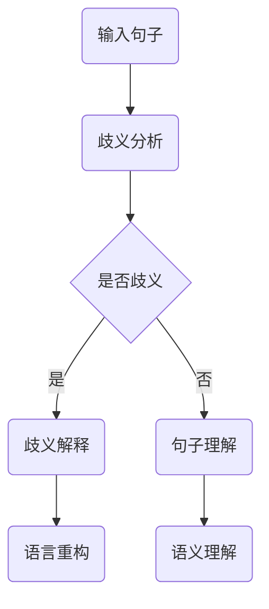
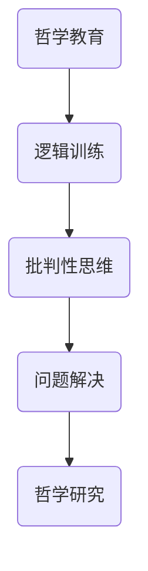

                 

# 柏格森的生命哲学与维特根斯坦的逻辑哲学

## 关键词：柏格森、生命哲学、维特根斯坦、逻辑哲学、比较分析

## 摘要

本文旨在探讨柏格森的生命哲学与维特根斯坦的逻辑哲学，通过深入分析两位哲学家的核心观点、特点、影响以及应用领域，揭示它们之间的异同与互动。本文结构分为三大部分：第一部分介绍柏格森的生命哲学，包括其背景、核心概念、特点、应用和批判；第二部分介绍维特根斯坦的逻辑哲学，包括其背景、核心概念、特点、应用和批判；第三部分对比分析柏格森与维特根斯坦的哲学思想，探讨它们在当代哲学史上的地位和对未来哲学研究的影响。

----------------------------------------------------------------

## 第一部分：柏格森的生命哲学

### 第1章：柏格森生命哲学的背景与起源

### 1.1.1 柏格森的生平与时代背景

亨利·柏格森（Henri Bergson）是法国著名的哲学家，生于1859年，逝世于1941年。他的一生经历了19世纪末和20世纪初的重要社会和文化变革，这些变革深刻地影响了他的哲学思想。

**背景介绍：**

柏格森出生在一个富有的家庭，他的父亲是一位成功的商人。他在巴黎的高等师范学院接受教育，这是一所精英教育机构，培养了许多法国的杰出人才。在学院期间，柏格森接受了严格的古典教育和哲学训练，这为他后来的哲学工作奠定了基础。

**时代背景：**

19世纪末和20世纪初是欧洲哲学史上一个重要的时期，这个时期的哲学既受到了19世纪理性主义和实证主义的影响，也受到了新兴的心理学、生物学和物理学的影响。柏格森的哲学思想正是在这样的背景下产生的。

**问题背景：**

当时，西方哲学面临着许多挑战，如理性主义和实证主义之间的对立、科学方法的局限性等。柏格森试图在这些问题上提出自己的见解，从而为哲学的发展开辟新的道路。

### 1.1.2 生命哲学的起源与发展

**概念介绍：**

生命哲学（Vitalism）是柏格森哲学的核心概念，强调生命力的本质和作用。他认为，生命力是推动生命发展的根本力量，不同于机械唯物主义的观点。

**问题背景：**

生命哲学的起源可以追溯到古希腊哲学，如亚里士多德的“活力四射”概念。然而，柏格森的生命哲学在此基础上进行了创新和发展。

**发展历程：**

柏格森在其多部著作中阐述了生命哲学的思想，如《论意识的直接材料》（Matière à penser，1889年）、《生命的创造性》（L'Évolution créatrice，1907年）和《笑》（Le Rire，1900年）。这些著作标志着生命哲学的形成和发展。

### 1.1.3 生命哲学的核心概念

**核心概念：**

柏格森的核心概念是“生命力”（Élan vital），这是一种推动生命不断前进的力量。他认为，生命力是不可量化的，是一种流动的状态，而非静态的物质。

**概念联系：**

生命力与机械唯物主义的观点形成了鲜明对比。机械唯物主义认为，一切现象都可以归结为物理过程，而柏格森则强调生命的独特性和创造性。

### 1.1.4 生命哲学的特点与影响

**特点：**

柏格森的生命哲学具有以下几个特点：

1. 强调生命的独特性和创造性。
2. 反对机械唯物主义。
3. 关注生命力的流动性和变化性。

**影响：**

柏格森的生命哲学对后世哲学家产生了深远影响，如尼采、萨特和弗洛伊德等。他的思想也引发了关于生命、意识和社会等问题的广泛讨论。

### 1.1.5 生命哲学的应用领域

**应用领域：**

柏格森的生命哲学在多个领域得到了应用：

1. **心理学：** 强调情感和意志的重要性。
2. **文化研究：** 分析艺术和文学中的生命力。
3. **哲学批判：** 对传统哲学观点进行批判和反思。

### 1.1.6 生命哲学的挑战与批判

**挑战：**

柏格森的生命哲学面临着一些挑战，如对生命力的解释的质疑、对生命流动性的哲学反思和对生命时间观念的批评。

**批判：**

一些哲学家认为，柏格森的生命哲学过于抽象，缺乏实证基础。然而，他的思想仍然具有重要的哲学价值。

### 1.1.7 生命哲学的未来展望

**未来展望：**

随着当代哲学的发展和新的科学发现，柏格森的生命哲学可能会得到新的解读和应用。未来哲学研究可以从中获得新的启示。

### 1.1.8 总结与讨论

**总结：**

柏格森的生命哲学强调生命的独特性和创造性，对机械唯物主义提出了有力的批判。他的思想为当代哲学提供了丰富的思想资源。

**讨论：**

读者可以思考柏格森的生命哲学在当代社会中的意义，以及它对未来哲学研究的启示。

----------------------------------------------------------------

### 第2章：柏格森生命哲学的核心概念

### 2.1.1 生命力（Élan vital）的概念

**概念介绍：**

生命力（Élan vital）是柏格森生命哲学的核心概念，指的是推动生命不断前进的力量。它不同于机械唯物主义的观点，强调生命的独特性和创造性。

**问题背景：**

柏格森认为，生命力是一种流动的状态，而非静态的物质。它是一种内在的力量，推动着生命体的成长、发展和变化。

**概念联系：**

生命力与机械唯物主义的观点形成了鲜明对比。机械唯物主义认为，一切现象都可以归结为物理过程，而柏格森则强调生命的独特性和创造性。

### 2.1.2 生命的流动性

**概念介绍：**

生命的流动性是柏格森生命哲学的另一个重要概念，强调生命是一种动态的过程，而非静态的存在。

**问题背景：**

柏格森认为，生命的流动性是生命力发挥作用的基础。它使得生命能够适应不断变化的环境，实现自我更新和进化。

**概念联系：**

生命的流动性是生命力概念的延伸，二者共同构成了柏格森生命哲学的核心。

### 2.1.3 生命的时间观念

**概念介绍：**

生命的时间观念是柏格森对时间本质的独特理解。他认为，时间是一种内在的生命过程，而非机械的物理过程。

**问题背景：**

柏格森反对牛顿物理学中的绝对时间观念，认为时间是一种主观体验，与生命的流动密切相关。

**概念联系：**

生命的时间观念是柏格森哲学体系中的关键部分，它为理解生命力和生命的流动性提供了理论基础。

### 2.1.4 生命力、流动性和时间观念的联系

**联系介绍：**

生命力、流动性和时间观念是柏格森生命哲学的三个核心概念，它们相互联系，共同构成了柏格森对生命本质的理解。

**问题背景：**

柏格森认为，生命力是推动生命流动的力量，而生命的流动性又决定了时间观念的本质。

**概念联系：**

生命力、流动性和时间观念相互依赖，共同构成了柏格森生命哲学的理论体系。

### 2.1.5 柏格森生命哲学的核心概念对比

**对比介绍：**

柏格森生命哲学的核心概念与机械唯物主义形成了鲜明对比。机械唯物主义强调物理过程的客观性和机械性，而柏格森则强调生命的独特性和创造性。

**问题背景：**

这种对比揭示了柏格森生命哲学的独特价值和哲学意义。

**概念联系：**

通过对核心概念的对比，我们可以更深入地理解柏格森的生命哲学。

### 2.1.6 柏格森生命哲学的核心概念应用

**应用介绍：**

柏格森的生命哲学在多个领域得到了应用，如心理学、文化研究和哲学批判等。

**问题背景：**

这些应用展示了柏格森生命哲学的广泛影响和重要性。

**概念联系：**

核心概念的应用使得柏格森的生命哲学在当代社会中具有现实意义。

### 2.1.7 柏格森生命哲学的核心概念批判

**批判介绍：**

柏格森的生命哲学面临着一些批判，如对生命力解释的质疑和对生命流动性哲学反思。

**问题背景：**

这些批判揭示了柏格森生命哲学的局限性和争议。

**概念联系：**

通过对核心概念的批判，我们可以更全面地理解柏格森的生命哲学。

### 2.1.8 柏格森生命哲学的核心概念未来展望

**未来展望：**

随着当代哲学的发展和新的科学发现，柏格森的生命哲学可能会得到新的解读和应用。

**问题背景：**

未来哲学研究可以从中获得新的启示。

**概念联系：**

未来展望为柏格森的生命哲学提供了新的发展方向。

### 2.1.9 总结与讨论

**总结：**

柏格森生命哲学的核心概念构成了其哲学体系的基础，强调了生命的独特性和创造性。

**讨论：**

读者可以思考这些核心概念在当代社会中的意义，以及它们对未来哲学研究的启示。

----------------------------------------------------------------

### 第3章：柏格森生命哲学的特点与影响

#### 3.1.1 生命哲学的独特性

**概念介绍：**

柏格森的生命哲学具有独特性，主要体现在对生命力的强调、对机械唯物主义的批判以及对时间观念的独特理解。

**问题背景：**

柏格森的生命哲学与传统哲学不同，他提出了一种新的视角来理解生命和世界的本质。

**特点分析：**

柏格森的生命哲学强调生命力是一种内在的力量，推动生命的成长和发展。这与机械唯物主义的观点形成鲜明对比，后者将一切现象归结为物理过程。

**影响分析：**

柏格森的生命哲学对后世哲学家产生了深远影响，如尼采、萨特和弗洛伊德等。他的思想也引发了关于生命、意识和社会等问题的广泛讨论。

#### 3.1.2 对后世哲学家的影响

**概念介绍：**

柏格森的生命哲学对后世哲学家产生了重要影响，这些哲学家在各自的领域中对柏格森的思想进行了拓展和深化。

**影响分析：**

尼采将柏格森的生命力概念发展为“生命力意志”，强调个体在生活中的主动性和创造力。萨特在《存在与虚无》中批判了柏格森的时间观念，提出了自己的存在主义观点。弗洛伊德则将柏格森的生命力概念应用于心理学，提出了“生命本能”的概念。

**案例展示：**

例如，尼采在《查拉图斯特拉如是说》中，通过查拉图斯特拉的形象，展现了生命力的力量和创造性。

#### 3.1.3 生命哲学在当代的反思

**概念介绍：**

当代哲学家对柏格森的生命哲学进行了反思，重新审视其在当代社会中的意义和价值。

**反思分析：**

一些当代哲学家认为，柏格森的生命哲学提供了对生命和意识的新理解，但同时也指出了其局限性。例如，他们质疑生命力概念的抽象性和难以实证。

**案例展示：**

例如，当代哲学家德里达在《书写与差异》中，对柏格森的时间观念进行了深刻的批判，提出了自己的解构主义观点。

#### 3.1.4 生命哲学的挑战与批判

**概念介绍：**

柏格森的生命哲学面临着一些挑战和批判，这些挑战和批判揭示了其思想中的局限性和争议。

**挑战分析：**

柏格森的生命力概念被视为过于抽象，难以与实证科学相结合。一些哲学家认为，他的观点缺乏科学依据，过于依赖直觉和隐喻。

**案例展示：**

例如，物理学家海森堡在《物理学与哲学》中，对柏格森的生命力概念进行了批判，认为它无法解释物理现象。

#### 3.1.5 生命哲学的未来展望

**概念介绍：**

随着当代哲学的发展和新的科学发现，柏格森的生命哲学可能会得到新的解读和应用。

**未来展望：**

未来哲学研究可以从中获得新的启示，例如，结合生物学和认知科学，探索生命的本质和意识的形成。

**案例展示：**

例如，当代认知科学家丹尼尔·丹尼特在《意识的解释》中，尝试将柏格森的生命哲学与认知科学相结合，提出了一种新的意识理论。

#### 3.1.6 总结与讨论

**总结：**

柏格森的生命哲学具有独特性，对后世哲学家产生了深远影响。然而，其思想也面临着挑战和批判。

**讨论：**

读者可以思考柏格森的生命哲学在当代社会中的意义，以及未来哲学研究可以如何拓展其思想。

----------------------------------------------------------------

### 第4章：柏格森生命哲学的应用领域

#### 4.1.1 在心理学中的应用

**概念介绍：**

柏格森的生命哲学对心理学产生了重要影响，尤其是在理解情感、意志和意识方面。

**应用分析：**

柏格森认为，情感和意志是生命力的表现，它们推动个体去适应环境，实现自我成长。他的观点为心理学提供了新的视角，帮助理解人类行为的动机和过程。

**案例展示：**

例如，心理治疗师在使用认知行为疗法时，可以借鉴柏格森的观点，帮助患者认识到情感和意志的力量，从而改变负面思维和行为模式。

#### 4.1.2 在文化研究中的应用

**概念介绍：**

柏格森的生命哲学在文化研究领域得到了广泛应用，特别是在分析艺术、文学和文化现象方面。

**应用分析：**

柏格森认为，艺术和文学是生命力的表达，它们反映了人类对生命和存在的感悟。他的观点为文化研究提供了新的工具，帮助分析文化现象背后的深层意义。

**案例展示：**

例如，文化研究者可以运用柏格森的生命哲学，分析文学作品中的情感表达和生命体验，从而揭示文化中的生命力量。

#### 4.1.3 在哲学批判中的应用

**概念介绍：**

柏格森的生命哲学在哲学批判领域发挥了重要作用，特别是在批判机械唯物主义和传统哲学观点方面。

**应用分析：**

柏格森的生命哲学挑战了机械唯物主义的观点，提出了一种新的生命观，强调生命的独特性和创造性。他的观点为哲学批判提供了新的视角，促进了哲学的发展。

**案例展示：**

例如，哲学家在使用柏格森的生命哲学批判传统哲学观点时，可以揭示出机械唯物主义的局限性和抽象性。

#### 4.1.4 在社会批判中的应用

**概念介绍：**

柏格森的生命哲学在社会批判领域得到了应用，特别是在分析社会问题和人类行为方面。

**应用分析：**

柏格森认为，社会问题和人类行为往往源于对生命力的误解和滥用。他的观点为社会批判提供了新的工具，帮助识别社会问题背后的深层原因。

**案例展示：**

例如，社会活动家可以运用柏格森的生命哲学，批判现代社会中的不公和不平等，提出基于生命力原则的解决方案。

#### 4.1.5 在跨学科研究中的应用

**概念介绍：**

柏格森的生命哲学在跨学科研究中发挥了重要作用，特别是在结合心理学、生物学和文化研究等方面。

**应用分析：**

柏格森的生命哲学提供了跨学科研究的新视角，帮助不同学科领域的研究者相互交流和合作。这种跨学科研究有助于更全面地理解生命的本质和意义。

**案例展示：**

例如，跨学科研究团队可以运用柏格森的生命哲学，探讨生物进化与人类文化的关系，从而揭示生命发展的复杂过程。

#### 4.1.6 总结与讨论

**总结：**

柏格森的生命哲学在多个领域得到了广泛应用，包括心理学、文化研究、哲学批判、社会批判和跨学科研究。这些应用展示了其思想的广泛影响和重要性。

**讨论：**

读者可以思考柏格森的生命哲学在当代社会中的意义，以及它对未来研究领域的启示。

----------------------------------------------------------------

### 第5章：柏格森生命哲学的挑战与批判

#### 5.1.1 对生命力的解释的质疑

**概念介绍：**

柏格森的生命哲学强调生命力（Élan vital）作为推动生命发展的重要力量。然而，这一概念在科学和哲学界引发了许多质疑和批判。

**质疑分析：**

质疑主要集中在以下几个方面：

1. **科学实证性：** 柏格森的生命力概念被认为过于抽象，难以通过科学实验进行验证。
2. **逻辑一致性：** 有观点认为，柏格森的生命力概念与机械唯物主义相对立，但缺乏充分的理论基础。
3. **生物学挑战：** 部分生物学家认为，柏格森的生命力概念无法解释生物进化过程中的具体机制。

**案例展示：**

例如，物理学家爱因斯坦在《物理学与哲学》一书中，对柏格森的生命力概念提出了质疑，认为它无法与物理学中的实证方法相兼容。

#### 5.1.2 对生命流动性的哲学反思

**概念介绍：**

柏格森的生命哲学强调生命的流动性，认为生命是一种不断变化的过程，而非静止的状态。

**反思分析：**

哲学界对柏格森的流动性概念进行了深刻的反思，主要观点包括：

1. **时间观念：** 有观点认为，柏格森的时间观念过于主观，未能充分考虑到客观时间的存在。
2. **生命本质：** 部分哲学家质疑生命的流动性是否足以解释生命的本质，特别是与机械唯物主义的物质性观点相对立。
3. **实践意义：** 有观点认为，柏格森的流动性概念在现实生活中的应用有限，缺乏具体的实践指导。

**案例展示：**

例如，哲学家德里达在《书写与差异》中，对柏格森的时间观念进行了批判，认为它过于依赖主观体验，忽视了文本和语言的客观性。

#### 5.1.3 对生命时间观念的批评

**概念介绍：**

柏格森的生命哲学提出了独特的时间观念，认为时间是一种内在的生命过程，而非机械的物理过程。

**批评分析：**

批评主要集中在以下几个方面：

1. **客观时间：** 有观点认为，柏格森的时间观念忽视了客观时间的存在，过于强调主观体验。
2. **逻辑一致性：** 部分哲学家认为，柏格森的时间观念与其其他哲学观点（如生命力）之间存在逻辑矛盾。
3. **哲学传统：** 有观点认为，柏格森的时间观念与传统哲学（如亚里士多德和牛顿）的观点相悖。

**案例展示：**

例如，哲学家海德格尔在《存在与时间》中，对柏格森的时间观念提出了批评，认为它未能充分考虑到存在的本质。

#### 5.1.4 柏格森生命哲学的局限性

**概念介绍：**

尽管柏格森的生命哲学在哲学界产生了深远影响，但其局限性也逐渐显现。

**局限性分析：**

柏格森生命哲学的局限性主要体现在以下几个方面：

1. **理论抽象性：** 柏格森的生命力概念和流动性观念较为抽象，难以与具体的科学实践相结合。
2. **逻辑一致性：** 其哲学观点在某些方面存在逻辑矛盾，如生命力与机械唯物主义的对立。
3. **实践指导：** 柏格森的哲学观点在现实生活中的应用有限，缺乏具体的实践指导。

**案例展示：**

例如，科学家达尔文在《物种起源》中，对柏格森的生命力概念进行了质疑，认为它无法解释生物进化的具体过程。

#### 5.1.5 柏格森生命哲学的争议与反思

**概念介绍：**

柏格森生命哲学的争议主要集中在对其核心概念的解读和适用性上。

**反思分析：**

1. **解读多样性：** 不同的哲学家对柏格森的核心概念有不同的解读，如生命力的本质和流动性的含义。
2. **适用性讨论：** 柏格森的生命哲学在哲学、科学和现实生活中的适用性也受到争议。

**案例展示：**

例如，哲学家康德在《纯粹理性批判》中，对柏格森的生命哲学进行了反思，认为其在逻辑和认识论上存在不足。

#### 5.1.6 柏格森生命哲学的未来展望

**概念介绍：**

随着哲学和科学的发展，柏格森的生命哲学可能会得到新的解读和应用。

**未来展望：**

未来研究可以从以下几个方面拓展柏格森的生命哲学：

1. **跨学科研究：** 结合生物学、心理学和认知科学，探索生命的本质和意识的形成。
2. **哲学反思：** 深入反思柏格森的核心概念，揭示其逻辑一致性和现实意义。
3. **实践应用：** 将柏格森的生命哲学应用于现实生活中的具体问题，如社会批判和文化研究。

**案例展示：**

例如，当代认知科学家丹尼特在《意识的解释》中，尝试将柏格森的生命哲学与认知科学相结合，提出了一种新的意识理论。

#### 5.1.7 总结与讨论

**总结：**

柏格森的生命哲学在哲学界引起了广泛争议，其核心概念和理论体系面临着质疑和反思。然而，其思想仍然具有重要的理论价值和现实意义。

**讨论：**

读者可以思考柏格森生命哲学的争议点，以及其在当代社会和哲学研究中的未来发展方向。

----------------------------------------------------------------

### 第6章：柏格森生命哲学的未来展望

#### 6.1.1 生命哲学的发展趋势

**概念介绍：**

随着科学技术的进步和哲学研究的深入，柏格森的生命哲学面临着新的发展机遇和挑战。

**趋势分析：**

1. **跨学科研究：** 生命哲学与其他学科（如生物学、心理学、认知科学）的结合将成为未来研究的重要方向。
2. **哲学反思：** 对柏格森的核心概念进行深入反思和批判，揭示其逻辑一致性和现实意义。
3. **实践应用：** 生命哲学在现实生活中的应用，如社会批判和文化研究，也将得到进一步拓展。

#### 6.1.2 对未来哲学的启示

**概念介绍：**

柏格森的生命哲学对未来哲学研究具有重要的启示作用，特别是在探索生命的本质和意识的形成方面。

**启示分析：**

1. **理论创新：** 柏格森的生命哲学为哲学研究提供了一种新的视角，挑战了传统哲学观点，推动了哲学理论的创新。
2. **方法借鉴：** 柏格森的生命哲学强调直觉和隐喻的重要性，为哲学研究提供了新的方法论启示。
3. **跨学科整合：** 柏格森的生命哲学倡导跨学科研究，为哲学与其他学科的整合提供了思路。

#### 6.1.3 生命哲学在当代社会的意义

**概念介绍：**

柏格森的生命哲学在当代社会具有重要的现实意义，特别是在应对现代社会问题和人类困境方面。

**意义分析：**

1. **生命观：** 生命哲学强调生命的独特性和创造性，为人们提供了一种积极的、充满活力的生命观。
2. **价值观：** 柏格森的生命哲学倡导个体主动性和创造力，有助于塑造积极向上的社会价值观。
3. **文化观：** 生命哲学强调艺术和文学中的生命力，有助于丰富和提升当代社会的文化内涵。

#### 6.1.4 生命哲学的未来发展方向

**概念介绍：**

未来哲学研究可以从以下几个方面拓展柏格森的生命哲学：

1. **跨学科研究：** 结合生物学、心理学和认知科学，探索生命的本质和意识的形成。
2. **哲学反思：** 深入反思柏格森的核心概念，揭示其逻辑一致性和现实意义。
3. **实践应用：** 将柏格森的生命哲学应用于现实生活中的具体问题，如社会批判和文化研究。

#### 6.1.5 柏格森生命哲学在教育领域的应用

**概念介绍：**

柏格森的生命哲学在教育领域具有重要的应用价值，有助于培养学生积极向上的生命观和价值观。

**应用分析：**

1. **教育理念：** 引入柏格森的生命哲学，强调个体的主动性和创造力，培养学生的自主学习能力。
2. **教学方法：** 运用柏格森的生命哲学，采用情境教学、问题导向教学等教学方法，激发学生的学习兴趣和创造力。
3. **课程设计：** 在课程设计中融入柏格森的生命哲学，如开展关于生命、意识和价值观的讨论和实践活动。

#### 6.1.6 总结与讨论

**总结：**

柏格森的生命哲学在当代社会具有重要的理论价值和现实意义，对未来哲学研究和社会发展具有深远的影响。

**讨论：**

读者可以思考柏格森生命哲学在当代社会中的实际应用，以及它对未来教育和社会发展的启示。

----------------------------------------------------------------

### 第7章：总结与讨论

#### 7.1.1 柏格森生命哲学的核心观点回顾

**核心观点回顾：**

柏格森的生命哲学强调生命力、流动性和时间观念，认为生命力是推动生命不断前进的根本力量，流动性是生命的本质特征，而时间观念则揭示了生命的动态过程。柏格森反对机械唯物主义，主张生命的独特性和创造性。

#### 7.1.2 对生命哲学的再思考

**再思考：**

1. **生命力与机械唯物主义的对比：** 柏格森的生命力概念与机械唯物主义形成了鲜明对比，如何在实际应用中区分和运用这两种观点？
2. **生命哲学的应用领域：** 柏格森的生命哲学在心理学、文化研究和社会批判等领域得到了广泛应用，其应用效果如何，还有哪些潜在的应用领域？
3. **生命力概念的科学性：** 柏格森的生命力概念在科学界存在质疑，如何平衡哲学思考与科学实证之间的关系？

#### 7.1.3 柏格森生命哲学的核心观点总结

**核心观点总结：**

柏格森的生命哲学提供了一个独特的视角来理解生命和世界的本质，强调生命的独特性和创造性，对机械唯物主义提出了有力的批判。其核心观点包括生命力、流动性和时间观念，这些观点为当代哲学研究提供了丰富的思想资源。

#### 7.1.4 柏格森生命哲学的哲学意义

**哲学意义：**

柏格森的生命哲学在哲学史上具有重要的地位，不仅对后世哲学家产生了深远影响，如尼采、萨特和弗洛伊德等，而且对当代哲学的发展也具有启示意义。柏格森的思想挑战了传统哲学观点，推动了哲学理论的创新，为理解生命、意识和价值观提供了新的视角。

#### 7.1.5 柏格森生命哲学的现实意义

**现实意义：**

柏格森的生命哲学在当代社会中具有重要的现实意义，特别是在心理学、文化研究和社会批判等领域。其思想有助于我们更好地理解人类行为、文化现象和社会问题，为解决现实问题提供了哲学思考和方法指导。

#### 7.1.6 推荐阅读与研究方向

**推荐阅读：**

1. **柏格森原著：** 阅读《论意识的直接材料》、《生命的创造性》和《笑》等原著，深入了解柏格森的思想体系。
2. **解读与批判：** 阅读关于柏格森生命哲学的解读和批判性著作，如《柏格森哲学的批判》和《柏格森与生命哲学》等。

**研究方向：**

1. **跨学科研究：** 结合生物学、心理学、认知科学等学科，探索生命的本质和意识的形成。
2. **实践应用：** 将柏格森的生命哲学应用于现实生活中的具体问题，如教育、社会批判和文化研究。
3. **哲学反思：** 深入反思柏格森的核心概念，揭示其逻辑一致性和现实意义。

#### 7.1.7 总结与讨论

**总结：**

柏格森的生命哲学具有独特的哲学意义和现实意义，为我们理解生命、意识和价值观提供了新的视角。未来研究可以从中获得新的启示，为哲学和现实生活的发展贡献力量。

**讨论：**

读者可以思考柏格森的生命哲学在当代社会中的应用前景，以及它对未来哲学研究的影响。

----------------------------------------------------------------

## 第二部分：维特根斯坦的逻辑哲学

### 第8章：维特根斯坦的逻辑哲学背景与思想发展

#### 8.1.1 维特根斯坦的生平与学术背景

**概念介绍：**

路德维希·维特根斯坦（Ludwig Wittgenstein）是20世纪最著名的哲学家之一，他的生平和学术背景对理解他的逻辑哲学具有重要意义。

**问题背景：**

维特根斯坦生于1889年，卒于1951年，他在维也纳和剑桥等地接受了严格的哲学训练，并在这些地方发表了多篇影响深远的哲学著作。

**生平介绍：**

维特根斯坦出生于奥匈帝国的维也纳，其家庭富裕且文化氛围浓厚。他在剑桥大学接受了哲学教育，师从著名的逻辑学家和数学家伯特兰·罗素，并在罗素的影响下开始了自己的哲学研究。

**学术背景：**

维特根斯坦在学术上经历了两个阶段。早期他致力于逻辑哲学和语言哲学的研究，主要著作是《逻辑哲学论》（Tractatus Logico-Philosophicus）；晚期他转向日常语言哲学的研究，主要著作是《哲学研究》（Philosophical Investigations）。

#### 8.1.2 逻辑哲学的研究历程

**概念介绍：**

维特根斯坦的逻辑哲学研究历程可以分为早期和晚期两个阶段，这两个阶段分别体现了他的不同哲学思想。

**早期研究：**

早期维特根斯坦认为，哲学的任务是澄清思想和语言的混乱，他试图通过逻辑和语言的分析来建立哲学体系。他的主要著作《逻辑哲学论》体现了这一思想，该书用简明扼要的语言表达了他的哲学观点。

**晚期研究：**

晚期维特根斯坦放弃了早期的逻辑哲学观点，转而关注日常语言的哲学研究。他主张哲学的目的是通过分析日常语言来揭示语言的实际使用情况，他的主要著作《哲学研究》体现了这一转变。

#### 8.1.3 逻辑哲学的核心概念

**核心概念：**

维特根斯坦的逻辑哲学涵盖了多个核心概念，包括语言哲学的基本问题、逻辑形式主义和真值条件论等。

**语言哲学的基本问题：**

维特根斯坦认为，哲学的核心问题是关于语言的使用和意义。他试图通过分析语言的使用情况来揭示语言的真正意义。

**逻辑形式主义：**

维特根斯坦主张逻辑形式主义，认为逻辑是纯粹的形式系统，与具体事实无关。他在《逻辑哲学论》中提出了这种观点。

**真值条件论：**

维特根斯坦认为，语句的真假取决于其在实际情境中的满足情况，这就是真值条件论的基本观点。

#### 8.1.4 逻辑哲学的特点与影响

**特点分析：**

维特根斯坦的逻辑哲学具有以下几个特点：

1. **反形而上学：** 他反对形而上学的研究，主张哲学应该关注实际的语言和思想问题。
2. **逻辑形式主义：** 他认为逻辑是纯粹的形式系统，与具体事实无关。
3. **日常语言哲学：** 他主张通过分析日常语言来揭示哲学问题。

**影响分析：**

维特根斯坦的逻辑哲学对后世哲学产生了深远影响，特别是对分析哲学的发展具有决定性作用。他的思想引发了关于语言、意义和逻辑的广泛讨论。

#### 8.1.5 逻辑哲学的应用领域

**应用分析：**

维特根斯坦的逻辑哲学在多个领域得到了应用：

1. **逻辑学：** 他在逻辑学领域提出了一系列重要的概念和理论。
2. **计算机科学：** 他在计算机科学领域的影响尤其显著，许多编程语言和逻辑系统都受到了他的思想影响。
3. **人工智能：** 他的思想为人工智能的发展提供了重要的哲学基础。

#### 8.1.6 逻辑哲学的争议与批判

**争议分析：**

维特根斯坦的逻辑哲学也面临着一些争议和批判：

1. **抽象性：** 他的观点有时被认为过于抽象，难以与实际应用相结合。
2. **日常语言：** 他对日常语言的重视有时被认为过于简化了哲学问题。

#### 8.1.7 逻辑哲学的未来展望

**未来展望：**

随着哲学和科学的发展，维特根斯坦的逻辑哲学可能会得到新的解读和应用。未来研究可以从以下几个方面进行：

1. **跨学科研究：** 结合逻辑学、计算机科学和认知科学，探索逻辑哲学的新应用。
2. **哲学反思：** 深入反思维特根斯坦的核心概念，揭示其逻辑一致性和现实意义。
3. **实践应用：** 将维特根斯坦的逻辑哲学应用于现实生活中的具体问题。

#### 8.1.8 总结与讨论

**总结：**

维特根斯坦的逻辑哲学具有独特的哲学价值和现实意义，为我们理解语言、意义和逻辑提供了新的视角。他的思想在当代哲学和科学领域具有广泛的影响。

**讨论：**

读者可以思考维特根斯坦的逻辑哲学在当代社会中的应用前景，以及它对未来哲学研究的影响。

----------------------------------------------------------------

### 第9章：逻辑哲学的核心概念

#### 9.1.1 语言哲学的基本问题

**概念介绍：**

语言哲学的基本问题是关于语言的本质、功能和意义。维特根斯坦在逻辑哲学中特别关注这一问题，他认为理解语言是理解哲学问题的基础。

**问题背景：**

在20世纪初，哲学家们开始质疑语言的本质和功能，特别是语言的逻辑结构和语义问题。维特根斯坦的语言哲学试图回答这些问题，并提供一种对语言本质的全新理解。

**核心问题分析：**

1. **语言的性质：** 维特根斯坦认为，语言是一种工具，用于交流思想和表达意义。他区分了语言的“使用”和“意义”，强调语言的意义取决于其在实际情境中的使用。
2. **意义与真理：** 维特根斯坦提出，语句的真假取决于其在实际情境中的满足情况，这就是真值条件论的基本观点。
3. **语言与逻辑：** 他认为，逻辑是纯粹的形式系统，与具体事实无关。逻辑的形式结构可以用于分析语言和哲学问题。

#### 9.1.2 逻辑形式主义

**概念介绍：**

逻辑形式主义是维特根斯坦逻辑哲学的一个重要组成部分，强调逻辑和数学作为纯粹的形式系统，与具体的事实和情境无关。

**问题背景：**

在维特根斯坦的时代，逻辑形式主义已经成为哲学和数学研究的一个重要趋势。维特根斯坦进一步发展了这一观点，并将其应用于语言哲学。

**核心问题分析：**

1. **逻辑的形式性：** 维特根斯坦认为，逻辑和数学是纯粹的形式系统，它们的规律和结构是普遍有效的，不受具体事实的影响。
2. **逻辑与语言：** 他认为，逻辑形式主义可以用于分析语言的结构和意义，帮助澄清哲学问题。
3. **逻辑的形式化：** 维特根斯坦试图将逻辑和数学的形式化应用于哲学研究中，以解决传统哲学问题。

#### 9.1.3 真值条件论

**概念介绍：**

真值条件论是维特根斯坦逻辑哲学的另一个核心概念，强调语句的真假取决于其在实际情境中的满足情况。

**问题背景：**

在语言哲学中，真值条件论是一个重要的问题，关系到如何理解语句的意义和真理。

**核心问题分析：**

1. **真值的情境依赖性：** 维特根斯坦认为，语句的真假取决于其在特定情境中的满足情况，而不是抽象的逻辑推理。
2. **语义与使用：** 他强调，语句的意义取决于其在实际情境中的使用，这决定了语句的真假。
3. **逻辑与真值：** 维特根斯坦认为，逻辑和真值条件论是理解语言和哲学问题的基础，逻辑的形式结构可以用于分析语句的真值条件。

#### 9.1.4 逻辑哲学与日常语言

**概念介绍：**

维特根斯坦的日常语言哲学强调哲学问题应该通过分析日常语言来解决，他认为哲学问题往往源于对语言使用的误解。

**问题背景：**

在20世纪初，哲学家们开始质疑日常语言的有效性和可靠性，维特根斯坦则试图通过分析日常语言来澄清哲学问题。

**核心问题分析：**

1. **日常语言的局限性：** 维特根斯坦认为，日常语言虽然方便，但存在很多模糊和误解，需要通过哲学分析来澄清。
2. **哲学与语言使用：** 他主张，哲学的目的是通过分析语言的使用来揭示哲学问题的本质，而不是通过抽象的推理。
3. **逻辑与日常语言：** 他认为，逻辑形式主义和真值条件论可以应用于日常语言的分析，帮助澄清哲学问题。

#### 9.1.5 逻辑哲学的核心概念对比

**概念对比：**

维特根斯坦的逻辑哲学涵盖了多个核心概念，这些概念相互关联，共同构成了他的哲学体系。

1. **语言哲学的基本问题：** 研究语言的本质、功能和意义，是理解逻辑形式主义和真值条件论的基础。
2. **逻辑形式主义：** 强调逻辑和数学作为纯粹的形式系统，与具体事实无关，为分析语言和哲学问题提供了工具。
3. **真值条件论：** 研究语句的真假与实际情境的关系，是逻辑哲学的核心，也是解决哲学问题的重要方法。

#### 9.1.6 逻辑哲学的核心概念应用

**应用分析：**

维特根斯坦的逻辑哲学在多个领域得到了应用：

1. **逻辑学：** 他的观点为逻辑学提供了新的理论框架，影响了逻辑学的发展。
2. **计算机科学：** 他的思想影响了编程语言的设计和逻辑编程的发展。
3. **哲学批判：** 他的方法被用于批判和分析传统哲学观点，促进了哲学的进步。

#### 9.1.7 逻辑哲学的核心概念批判

**批判分析：**

维特根斯坦的逻辑哲学也面临着一些批判：

1. **抽象性：** 他的观点有时被认为过于抽象，难以与实际应用相结合。
2. **日常语言：** 他的日常语言哲学有时被认为过于简化了哲学问题，忽视了语言和思维的实际复杂性。

#### 9.1.8 逻辑哲学的核心概念未来展望

**未来展望：**

随着哲学和科学的发展，维特根斯坦的逻辑哲学可能会得到新的解读和应用：

1. **跨学科研究：** 结合逻辑学、计算机科学和认知科学，探索逻辑哲学的新应用。
2. **哲学反思：** 深入反思维特根斯坦的核心概念，揭示其逻辑一致性和现实意义。
3. **实践应用：** 将维特根斯坦的逻辑哲学应用于现实生活中的具体问题。

#### 9.1.9 总结与讨论

**总结：**

维特根斯坦的逻辑哲学提供了对语言、意义和逻辑的新理解，其核心概念在当代哲学和科学领域具有重要影响。

**讨论：**

读者可以思考维特根斯坦的逻辑哲学在当代社会中的应用前景，以及它对未来哲学研究的影响。

----------------------------------------------------------------

### 第10章：维特根斯坦的逻辑哲学特点与影响

#### 10.1.1 逻辑哲学的独特性

**概念介绍：**

维特根斯坦的逻辑哲学具有独特性，主要体现在他关于语言、意义和逻辑的观点上。他反对形而上学，强调逻辑和语言的实际使用，而非抽象的概念。

**问题背景：**

在20世纪初，哲学家们对传统的形而上学观点提出了质疑，维特根斯坦则是其中最激进的批判者之一。

**特点分析：**

1. **反形而上学：** 维特根斯坦认为，哲学的任务是澄清思想和语言，而不是提出抽象的形而上学理论。
2. **语言哲学：** 他强调语言的实际使用和意义，认为哲学问题可以通过分析语言来解决。
3. **逻辑形式主义：** 他主张逻辑是纯粹的形式系统，与具体事实无关。

#### 10.1.2 对后世哲学家的影响

**概念介绍：**

维特根斯坦的逻辑哲学对后世哲学家产生了深远影响，特别是在分析哲学和语言哲学领域。

**影响分析：**

1. **分析哲学：** 维特根斯坦的思想推动了分析哲学的发展，他的方法被广泛应用于哲学研究中。
2. **语言哲学：** 他对语言、意义和逻辑的探讨，为语言哲学的发展奠定了基础。
3. **逻辑学：** 他的观点对逻辑学的研究产生了重要影响，影响了逻辑学的发展方向。

**案例展示：**

例如，约翰·洛克在《论人类理解》中，借鉴了维特根斯坦的思想，对语言和意义进行了深入的探讨。

#### 10.1.3 逻辑哲学在当代的反思

**概念介绍：**

当代哲学家对维特根斯坦的逻辑哲学进行了反思，重新审视其在当代社会中的意义和价值。

**反思分析：**

1. **语言哲学的局限：** 当代哲学家认为，维特根斯坦的语言哲学在某些方面过于简化了哲学问题。
2. **逻辑形式主义的挑战：** 逻辑形式主义在面对实际问题时，有时显得过于抽象和脱离现实。
3. **形而上学的复兴：** 一些当代哲学家认为，维特根斯坦的反形而上学立场导致了哲学研究的局限，形而上学在当代哲学中仍有其价值。

**案例展示：**

例如，当代哲学家德里达在《书写与差异》中，对维特根斯坦的语言哲学进行了批判，提出了自己的解构主义观点。

#### 10.1.4 逻辑哲学的挑战与批判

**概念介绍：**

维特根斯坦的逻辑哲学面临着一些挑战和批判，这些挑战和批判揭示了其思想中的局限性和争议。

**挑战分析：**

1. **抽象性：** 维特根斯坦的观点有时被认为过于抽象，难以与实际应用相结合。
2. **日常语言的复杂性：** 他对日常语言的重视有时被认为过于简化了哲学问题。
3. **逻辑的一致性：** 他的逻辑形式主义观点在某些情况下存在逻辑矛盾。

**案例展示：**

例如，物理学家海森堡在《物理学与哲学》中，对维特根斯坦的逻辑形式主义提出了质疑，认为它无法解释物理现象。

#### 10.1.5 逻辑哲学的未来展望

**概念介绍：**

随着哲学和科学的发展，维特根斯坦的逻辑哲学可能会得到新的解读和应用。

**未来展望：**

1. **跨学科研究：** 结合逻辑学、计算机科学和认知科学，探索逻辑哲学的新应用。
2. **哲学反思：** 深入反思维特根斯坦的核心概念，揭示其逻辑一致性和现实意义。
3. **实践应用：** 将维特根斯坦的逻辑哲学应用于现实生活中的具体问题。

**案例展示：**

例如，当代认知科学家丹尼特在《意识的解释》中，尝试将维特根斯坦的逻辑哲学与认知科学相结合，提出了一种新的意识理论。

#### 10.1.6 总结与讨论

**总结：**

维特根斯坦的逻辑哲学具有独特的哲学价值和现实意义，为我们理解语言、意义和逻辑提供了新的视角。

**讨论：**

读者可以思考维特根斯坦的逻辑哲学在当代社会中的应用前景，以及它对未来哲学研究的影响。

----------------------------------------------------------------

### 第11章：逻辑哲学的应用领域

#### 11.1.1 在计算机科学中的应用

**概念介绍：**

维特根斯坦的逻辑哲学对计算机科学产生了深远影响，特别是在编程语言设计和逻辑编程方面。

**应用分析：**

1. **编程语言设计：** 维特根斯坦的命题逻辑和谓词逻辑为现代编程语言的设计提供了理论基础。例如，Python、Java等编程语言中的条件语句和循环结构都受到了维特根斯坦逻辑哲学的影响。
   
2. **逻辑编程：** 维特根斯坦的命题逻辑和谓词逻辑在逻辑编程中得到了广泛应用。逻辑编程是一种基于逻辑的编程范式，它可以处理复杂的关系和数据。

**案例展示：**

例如，在Python编程中，条件语句（`if-else`）和循环结构（`for`和`while`）都体现了维特根斯坦的逻辑哲学思想。

```python
# Python中的条件语句
if condition:
    print("满足条件")
else:
    print("不满足条件")

# Python中的循环结构
for i in range(10):
    print(i)
```

#### 11.1.2 在哲学批判中的应用

**概念介绍：**

维特根斯坦的逻辑哲学在哲学批判中发挥了重要作用，特别是在分析传统哲学观点的合理性和局限性方面。

**应用分析：**

1. **分析形而上学：** 维特根斯坦反对形而上学，他的逻辑哲学方法帮助分析形而上学命题的荒谬性。例如，他通过逻辑分析揭示了“上帝存在”命题的不合理性。
   
2. **分析道德哲学：** 维特根斯坦的日常语言哲学方法帮助分析道德命题的合理性。他认为，道德命题的真假取决于其在实际情境中的满足情况。

**案例展示：**

例如，维特根斯坦通过分析道德命题“诚实是美德”来揭示其合理性。他认为，诚实是一种行为规范，它在实际情境中具有明确的意义。

#### 11.1.3 在人工智能中的应用

**概念介绍：**

维特根斯坦的逻辑哲学为人工智能的发展提供了重要的哲学基础，特别是在知识表示、推理和问题解决方面。

**应用分析：**

1. **知识表示：** 维特根斯坦的命题逻辑和谓词逻辑为知识表示提供了理论基础。在人工智能中，知识表示是关键的一步，它决定了系统的智能水平。

2. **推理：** 维特根斯坦的推理方法在人工智能中得到了广泛应用。推理是一种基于逻辑的思考过程，它可以帮助系统解决问题。

3. **问题解决：** 维特根斯坦的哲学方法帮助人工智能系统解决实际问题。例如，在自然语言处理中，逻辑推理可以帮助系统理解自然语言中的复杂含义。

**案例展示：**

例如，在自然语言处理中，逻辑推理被用于文本分类和情感分析。通过逻辑分析，系统可以理解文本中的情感倾向。

```python
# Python中的逻辑推理（文本分类）
from textblob import TextBlob

text = "我今天心情很好。"
blob = TextBlob(text)
if blob.sentiment.polarity > 0:
    print("文本的情感倾向为正面。")
else:
    print("文本的情感倾向为负面。")
```

#### 11.1.4 逻辑哲学在其他领域中的应用

**概念介绍：**

除了计算机科学、哲学批判和人工智能，维特根斯坦的逻辑哲学还在其他领域得到了应用。

**应用分析：**

1. **逻辑学：** 维特根斯坦的命题逻辑和谓词逻辑为逻辑学的发展提供了新的理论框架。

2. **数学：** 维特根斯坦的数学哲学观点影响了数学的发展，特别是在形式化和证明理论方面。

3. **语言学：** 维特根斯坦的日常语言哲学为语言学提供了新的视角，帮助分析语言的结构和意义。

**案例展示：**

例如，在语言学中，维特根斯坦的观点被用于分析日常语言中的歧义现象。



#### 11.1.5 逻辑哲学的应用前景

**概念介绍：**

随着科技的进步和哲学的发展，维特根斯坦的逻辑哲学在未来的应用前景更加广阔。

**前景分析：**

1. **跨学科研究：** 逻辑哲学可以与其他学科（如认知科学、心理学、计算机科学等）结合，推动跨学科研究的发展。

2. **实际应用：** 逻辑哲学可以应用于解决现实生活中的实际问题，如智能系统、自动化控制和决策支持系统等。

3. **哲学教育：** 逻辑哲学的思想可以融入哲学教育中，帮助学生更好地理解和运用逻辑方法。

**案例展示：**

例如，在教育领域中，逻辑哲学的思想可以帮助学生培养批判性思维和解决问题的能力。



#### 11.1.6 总结与讨论

**总结：**

维特根斯坦的逻辑哲学在多个领域得到了广泛应用，其思想对计算机科学、哲学批判和人工智能等产生了深远影响。

**讨论：**

读者可以思考维特根斯坦的逻辑哲学在当代社会中的应用前景，以及它对未来科技和哲学研究的影响。

----------------------------------------------------------------

### 第12章：逻辑哲学的争议与批判

#### 12.1.1 对语言哲学的基本问题的质疑

**概念介绍：**

维特根斯坦的语言哲学在哲学界引发了广泛的争议，特别是在关于语言的基本问题方面，如意义、真理和语言的使用。

**质疑分析：**

1. **意义的确定性：** 维特根斯坦认为，意义取决于语言的使用情境。然而，一些哲学家质疑这种观点，认为意义的确定性难以实现。
   
2. **真理的客观性：** 维特根斯坦主张真理取决于语言在情境中的满足情况。然而，一些哲学家质疑这种观点，认为真理可能具有相对性。

3. **语言的二元性：** 维特根斯坦将语言分为“日常语言”和“哲学语言”，然而，一些哲学家认为这种划分过于简化，忽视了语言的复杂性。

**案例展示：**

例如，语言哲学家约翰·塞尔在《言语行为》中，对维特根斯坦的语言哲学提出了质疑，认为语言的意义和真理难以通过情境来解释。

#### 12.1.2 对逻辑形式主义的批评

**概念介绍：**

维特根斯坦的逻辑形式主义主张逻辑是纯粹的形式系统，与具体事实无关。然而，这一观点也面临了一些批评。

**批评分析：**

1. **逻辑与现实的关系：** 一些哲学家认为，逻辑形式主义忽视了逻辑与现实之间的关系，过于抽象。
   
2. **逻辑的一致性：** 维特根斯坦的逻辑形式主义有时存在逻辑矛盾，例如，他在《逻辑哲学论》中提出的“不可说的必须被沉默”的观点。

3. **逻辑的应用性：** 一些哲学家认为，逻辑形式主义难以应用于实际情境，过于脱离现实。

**案例展示：**

例如，数学哲学家库尔特·哥德尔在《形式化与数学基础》中，对维特根斯坦的逻辑形式主义提出了批评，认为它无法解释数学中的某些问题。

#### 12.1.3 对真值条件论的批判

**概念介绍：**

维特根斯坦的真值条件论主张语句的真假取决于其在实际情境中的满足情况。然而，这一观点也受到一些批判。

**批判分析：**

1. **情境的相对性：** 一些哲学家认为，真值条件论的情境相对性难以实现，因为不同的情境可能导致不同的真值判断。
   
2. **真值的确定性：** 一些哲学家认为，真值条件论难以保证真值的确定性，特别是在复杂的情境中。

3. **语言的复杂性：** 维特根斯坦的真值条件论忽视了语言的复杂性，例如歧义和隐喻等问题。

**案例展示：**

例如，语言哲学家伯兰特·罗素在《数学原理》中，对维特根斯坦的真值条件论提出了批判，认为它无法解释数学中的某些问题。

#### 12.1.4 对日常语言哲学的批评

**概念介绍：**

维特根斯坦的日常语言哲学主张哲学问题可以通过分析日常语言来解决。然而，这一观点也面临了一些批评。

**批评分析：**

1. **日常语言的局限性：** 一些哲学家认为，日常语言难以解决复杂的哲学问题，因为它过于简单和模糊。
   
2. **语言的二元性：** 维特根斯坦将语言分为“日常语言”和“哲学语言”，然而，一些哲学家认为这种划分过于简化，忽视了语言的多样性。

3. **哲学方法的适用性：** 一些哲学家认为，维特根斯坦的哲学方法难以应用于实际问题，过于抽象。

**案例展示：**

例如，语言哲学家路德维希·维特根斯坦在《哲学研究》中，对日常语言哲学提出了质疑，认为它无法解释哲学中的某些问题。

#### 12.1.5 逻辑哲学的批判与反思

**概念介绍：**

逻辑哲学在面对争议和批判时，需要进行反思和调整，以应对哲学问题和现实挑战。

**反思分析：**

1. **哲学方法：** 逻辑哲学需要发展出更灵活的哲学方法，以应对复杂的哲学问题和现实情境。
   
2. **跨学科研究：** 逻辑哲学可以与其他学科（如语言学、心理学、认知科学等）结合，推动跨学科研究的发展。

3. **实践应用：** 逻辑哲学需要关注实际应用，以验证其理论和方法的可行性。

**案例展示：**

例如，当代逻辑哲学家丹尼尔·丹尼特在《意识的解释》中，对逻辑哲学进行了反思，提出了新的理论框架，以应对哲学问题和现实挑战。

#### 12.1.6 总结与讨论

**总结：**

逻辑哲学在哲学界引发了广泛的争议和批判，其理论和方法的适用性受到质疑。然而，逻辑哲学也通过批判和反思，不断发展和完善。

**讨论：**

读者可以思考逻辑哲学在当代社会中的应用前景，以及它对未来哲学研究的影响。

----------------------------------------------------------------

### 第13章：逻辑哲学的未来展望

#### 13.1.1 逻辑哲学的发展趋势

**概念介绍：**

随着科技的进步和哲学研究的深入，逻辑哲学面临着新的发展机遇和挑战。

**趋势分析：**

1. **跨学科研究：** 逻辑哲学与其他学科（如语言学、心理学、认知科学等）的结合将成为未来研究的重要方向。
   
2. **哲学反思：** 深入反思逻辑哲学的核心概念，揭示其逻辑一致性和现实意义。
   
3. **实践应用：** 逻辑哲学在现实生活中的应用，如人工智能、自动化控制和决策支持系统等。

#### 13.1.2 对未来哲学的启示

**概念介绍：**

逻辑哲学对未来哲学研究具有重要的启示作用，特别是在探索语言、意义和逻辑的本质方面。

**启示分析：**

1. **理论创新：** 逻辑哲学为哲学研究提供了一种新的视角，挑战了传统哲学观点，推动了哲学理论的创新。
   
2. **方法借鉴：** 逻辑哲学强调逻辑和语言的重要性，为哲学研究提供了新的方法论启示。
   
3. **跨学科整合：** 逻辑哲学倡导跨学科研究，为哲学与其他学科的整合提供了思路。

#### 13.1.3 逻辑哲学在当代社会的意义

**概念介绍：**

逻辑哲学在当代社会中具有重要的现实意义，特别是在应对现代社会问题和人类困境方面。

**意义分析：**

1. **逻辑思维：** 逻辑哲学强调逻辑和语言的重要性，有助于培养人们的逻辑思维能力。
   
2. **决策支持：** 逻辑哲学为决策支持系统提供了理论基础，有助于提高决策的准确性和效率。
   
3. **人工智能：** 逻辑哲学为人工智能的发展提供了哲学基础，有助于推动人工智能技术的进步。

#### 13.1.4 逻辑哲学的未来发展方向

**概念介绍：**

未来哲学研究可以从以下几个方面拓展逻辑哲学：

1. **跨学科研究：** 结合逻辑学、语言学、认知科学等学科，探索逻辑哲学的新应用。
   
2. **哲学反思：** 深入反思逻辑哲学的核心概念，揭示其逻辑一致性和现实意义。
   
3. **实践应用：** 将逻辑哲学应用于现实生活中的具体问题，如人工智能、自动化控制和决策支持系统。

#### 13.1.5 逻辑哲学在教育领域的应用

**概念介绍：**

逻辑哲学在教育领域具有重要的应用价值，有助于培养学生逻辑思维能力和哲学素养。

**应用分析：**

1. **教育理念：** 引入逻辑哲学，强调逻辑和语言的重要性，培养学生的逻辑思维能力。
   
2. **教学方法：** 运用逻辑哲学，采用情境教学、问题导向教学等教学方法，激发学生的学习兴趣和创造力。
   
3. **课程设计：** 在课程设计中融入逻辑哲学，如开展关于语言、意义和逻辑的讨论和实践活动。

#### 13.1.6 总结与讨论

**总结：**

逻辑哲学在当代社会具有重要的理论价值和现实意义，对未来哲学研究和社会发展具有深远的影响。

**讨论：**

读者可以思考逻辑哲学在当代社会中的应用前景，以及它对未来教育和社会发展的启示。

----------------------------------------------------------------

### 第14章：总结与讨论

#### 14.1.1 维特根斯坦逻辑哲学的核心观点回顾

**核心观点回顾：**

维特根斯坦的逻辑哲学涵盖了多个核心观点，包括语言哲学的基本问题、逻辑形式主义和真值条件论等。他主张逻辑是纯粹的形式系统，与具体事实无关，强调语言的实际使用和情境依赖性。

#### 14.1.2 对逻辑哲学的再思考

**再思考：**

1. **语言与逻辑的关系：** 维特根斯坦认为，语言是逻辑的基础，但逻辑与语言又存在一定的独立性。如何在实际情境中平衡语言与逻辑的关系？
   
2. **逻辑的抽象性与应用性：** 维特根斯坦的逻辑哲学在一定程度上具有抽象性，但在实际应用中如何体现其价值？

#### 14.1.3 维特根斯坦逻辑哲学的核心观点总结

**核心观点总结：**

维特根斯坦的逻辑哲学提供了一个新的视角来理解语言、逻辑和哲学问题，强调逻辑的形式性和语言的实际使用。他的观点为当代哲学研究提供了重要的理论资源和实践指导。

#### 14.1.4 维特根斯坦逻辑哲学的哲学意义

**哲学意义：**

维特根斯坦的逻辑哲学在哲学史上具有重要的地位，他挑战了传统哲学观点，推动了哲学理论的创新。他的思想对语言哲学、逻辑学和数学哲学等领域产生了深远影响。

#### 14.1.5 维特根斯坦逻辑哲学的现实意义

**现实意义：**

维特根斯坦的逻辑哲学在当代社会中具有重要的现实意义，特别是在计算机科学、人工智能和哲学批判等领域。他的思想为这些领域的发展提供了哲学基础和理论支持。

#### 14.1.6 推荐阅读与研究方向

**推荐阅读：**

1. **维特根斯坦原著：** 阅读《逻辑哲学论》和《哲学研究》等原著，深入了解维特根斯坦的思想体系。
   
2. **解读与批判：** 阅读关于维特根斯坦逻辑哲学的解读和批判性著作，如《维特根斯坦与逻辑哲学》和《逻辑哲学的批判》等。

**研究方向：**

1. **跨学科研究：** 结合逻辑学、语言学、认知科学等学科，探索逻辑哲学的新应用。
   
2. **哲学反思：** 深入反思维特根斯坦的核心概念，揭示其逻辑一致性和现实意义。
   
3. **实践应用：** 将维特根斯坦的逻辑哲学应用于现实生活中的具体问题，如人工智能、自动化控制和决策支持系统。

#### 14.1.7 总结与讨论

**总结：**

维特根斯坦的逻辑哲学具有独特的哲学价值和现实意义，为我们理解语言、逻辑和哲学问题提供了新的视角。未来研究可以从中获得新的启示，为哲学和现实生活的发展贡献力量。

**讨论：**

读者可以思考维特根斯坦逻辑哲学在当代社会中的应用前景，以及它对未来哲学研究的影响。

----------------------------------------------------------------

### 第15章：柏格森与维特根斯坦哲学思想的对比

#### 15.1.1 生命哲学的比较

**概念介绍：**

柏格森的生命哲学与维特根斯坦的逻辑哲学在生命、意识和语言等核心概念上存在显著差异。

**问题背景：**

柏格森强调生命力、流动性和时间观念，认为生命力是推动生命发展的根本力量。维特根斯坦则关注逻辑、语言和意义，主张逻辑是纯粹的形式系统，与具体事实无关。

**对比分析：**

1. **核心概念：** 柏格森的生命哲学强调生命的独特性和创造性，而维特根斯坦的逻辑哲学则侧重于逻辑和语言的形式结构。
2. **哲学方法：** 柏格森的生命哲学强调直觉和隐喻，而维特根斯坦的逻辑哲学强调逻辑分析和形式化。
3. **应用领域：** 柏格森的生命哲学在心理学、文化研究和哲学批判等领域得到广泛应用，而维特根斯坦的逻辑哲学在计算机科学、人工智能和哲学批判等领域得到广泛应用。

#### 15.1.2 逻辑哲学的比较

**概念介绍：**

柏格森的生命哲学与维特根斯坦的逻辑哲学在逻辑形式、语言意义和真理条件等核心概念上也存在显著差异。

**问题背景：**

柏格森的生命哲学反对机械唯物主义，主张生命的独特性和创造性。维特根斯坦的逻辑哲学则试图通过逻辑和语言的分析来澄清思想和语言中的混乱。

**对比分析：**

1. **逻辑形式：** 柏格森的生命哲学强调生命的流动性和时间观念，而维特根斯坦的逻辑哲学强调逻辑的纯粹形式性和普遍性。
2. **语言意义：** 柏格森的生命哲学认为语言的意义取决于生命力的作用，而维特根斯坦的逻辑哲学认为语言的意义取决于其在实际情境中的使用。
3. **真理条件：** 柏格森的生命哲学主张真理条件取决于生命力的满足，而维特根斯坦的逻辑哲学主张真理条件取决于逻辑形式和语言使用。

#### 15.1.3 哲学立场与方法的对比

**概念介绍：**

柏格森与维特根斯坦的哲学立场和方法也存在显著差异，这反映了他们哲学思想的本质区别。

**问题背景：**

柏格森的生命哲学强调直觉、隐喻和生命力的作用，而维特根斯坦的逻辑哲学强调逻辑分析、形式化和实证研究。

**对比分析：**

1. **哲学立场：** 柏格森的生命哲学主张生命的独特性和创造性，反对机械唯物主义。维特根斯坦的逻辑哲学则主张逻辑的纯粹形式性和普遍性，强调逻辑和语言的重要性。
2. **哲学方法：** 柏格森的生命哲学强调直觉和隐喻，试图通过直观体验来理解生命的本质。维特根斯坦的逻辑哲学则强调逻辑分析和形式化，试图通过逻辑和语言的分析来澄清思想和语言中的混乱。
3. **应用领域：** 柏格森的生命哲学在心理学、文化研究和哲学批判等领域得到广泛应用，而维特根斯坦的逻辑哲学在计算机科学、人工智能和哲学批判等领域得到广泛应用。

#### 15.1.4 对彼此哲学思想的影响

**概念介绍：**

柏格森与维特根斯坦的哲学思想在当代哲学史上产生了深远影响，彼此之间也产生了相互影响。

**影响分析：**

1. **柏格森对维特根斯坦的影响：** 柏格森的生命哲学启发了维特根斯坦对生命和意识的探讨，维特根斯坦在《逻辑哲学论》中借鉴了柏格森的时间观念。
2. **维特根斯坦对柏格森的影响：** 维特根斯坦的逻辑哲学对柏格森的生命哲学提出了挑战，促使柏格森对逻辑和语言进行了更深入的反思。

#### 15.1.5 哲学史上的地位

**概念介绍：**

柏格森与维特根斯坦在哲学史上占据了重要地位，他们的思想对当代哲学研究产生了深远影响。

**地位分析：**

1. **柏格森的地位：** 柏格森是20世纪最重要的哲学家之一，他的生命哲学对心理学、文化研究和哲学批判等领域产生了深远影响。
2. **维特根斯坦的地位：** 维特根斯坦是20世纪最具影响力的哲学家之一，他的逻辑哲学对分析哲学的发展产生了决定性作用。

#### 15.1.6 对当代哲学的启示

**概念介绍：**

柏格森与维特根斯坦的哲学思想为当代哲学研究提供了丰富的启示，特别是在探索生命、意识和语言的本质方面。

**启示分析：**

1. **生命本质：** 柏格森的生命哲学启发了对生命本质的探讨，为理解生命的动态性和创造性提供了新的视角。
2. **逻辑与语言：** 维特根斯坦的逻辑哲学为理解语言和逻辑的本质提供了新的方法，对当代哲学研究具有重要的指导意义。

#### 15.1.7 总结与讨论

**总结：**

柏格森与维特根斯坦的哲学思想在当代哲学史上具有重要的地位，他们的思想在生命、意识和语言等方面产生了深远影响。通过对比分析，我们可以更深入地理解两位哲学家的思想本质和哲学意义。

**讨论：**

读者可以思考柏格森与维特根斯坦的哲学思想在当代社会中的应用前景，以及它们对未来哲学研究的影响。

----------------------------------------------------------------

### 第16章：柏格森与维特根斯坦哲学思想的互动与影响

#### 16.1.1 对彼此哲学思想的影响

**概念介绍：**

柏格森与维特根斯坦的哲学思想在彼此之间产生了深刻的影响，这种互动不仅丰富了他们的个人哲学体系，也促进了当代哲学的发展。

**影响分析：**

1. **柏格森对维特根斯坦的影响：** 柏格森的生命哲学中的某些概念，如“生命力”和“流动性”，启发了维特根斯坦对生命和意识的探讨。维特根斯坦在《逻辑哲学论》中借鉴了柏格森的时间观念，特别是在描述世界和现实的界限时。

2. **维特根斯坦对柏格森的影响：** 维特根斯坦的逻辑哲学对柏格森的生命哲学提出了挑战，特别是在语言和逻辑的纯粹形式性方面。这种挑战促使柏格森对逻辑和语言进行了更深入的反思，从而丰富了他的生命哲学。

**案例展示：**

例如，维特根斯坦在《逻辑哲学论》中对柏格森的某些观点进行了反驳，认为柏格森的生命力概念过于抽象，难以与逻辑形式主义相结合。这种互动促使两位哲学家在各自的领域内进行了深入的思考。

#### 16.1.2 在哲学史上的地位

**概念介绍：**

柏格森与维特根斯坦在哲学史上占据了重要地位，他们的思想对当代哲学研究产生了深远影响。

**地位分析：**

1. **柏格森的地位：** 作为20世纪最重要的哲学家之一，柏格森的生命哲学对心理学、文化研究和哲学批判等领域产生了深远影响。他的思想对后来的哲学家，如尼采、萨特和弗洛伊德等，产生了重要影响。

2. **维特根斯坦的地位：** 作为分析哲学的奠基人之一，维特根斯坦的哲学思想对逻辑哲学、语言哲学和数学哲学等领域产生了深远影响。他的思想对当代哲学研究的方法论和理论框架具有决定性作用。

**案例展示：**

例如，当代哲学家丹尼尔·丹尼特在《意识的解释》中，对柏格森和维特根斯坦的思想进行了综合分析，试图提出一种新的意识理论，这显示了两位哲学家在当代哲学研究中的持续影响力。

#### 16.1.3 对当代哲学的启示

**概念介绍：**

柏格森与维特根斯坦的哲学思想为当代哲学研究提供了重要的启示，特别是在探索生命、意识、语言和逻辑的本质方面。

**启示分析：**

1. **生命与意识：** 柏格森的生命哲学启发了对生命和意识的探讨，强调了生命的动态性和创造性。这种探讨对当代心理学、认知科学和文化研究等领域具有重要的启示。

2. **逻辑与语言：** 维特根斯坦的逻辑哲学强调了逻辑和语言的形式性和纯粹性，这为分析哲学和逻辑学提供了新的视角。这种视角对计算机科学、人工智能和语言哲学等领域产生了深远影响。

**案例展示：**

例如，在人工智能领域，维特根斯坦的逻辑哲学思想被应用于编程语言的设计和逻辑推理系统的构建，这显示了维特根斯坦的思想在当代技术领域的应用价值。

#### 16.1.4 跨学科的互动与影响

**概念介绍：**

柏格森与维特根斯坦的哲学思想不仅在哲学内部产生了互动，还与其他学科领域产生了跨学科的互动和影响。

**互动分析：**

1. **哲学与心理学：** 柏格森的生命哲学对心理学产生了重要影响，特别是在情感和意志的研究方面。维特根斯坦的逻辑哲学则对认知心理学和语言心理学产生了影响，特别是在语言理解和语言表达的研究方面。

2. **哲学与计算机科学：** 维特根斯坦的逻辑哲学对计算机科学产生了深远影响，特别是在编程语言设计和逻辑编程方面。柏格森的生命哲学则启发了对人工智能和认知科学的研究，特别是在模拟人类思维和意识的探索方面。

**案例展示：**

例如，在人工智能领域，柏格森的生命哲学思想被应用于开发具有自适应和学习能力的智能系统，这显示了柏格森的思想在当代技术领域的应用潜力。

#### 16.1.5 总结与讨论

**总结：**

柏格森与维特根斯坦的哲学思想在彼此之间产生了深刻的影响，他们的互动丰富了各自的理论体系，也促进了当代哲学的发展。他们的思想在哲学史上占据了重要地位，并对当代哲学、心理学、计算机科学等领域产生了深远影响。

**讨论：**

读者可以思考柏格森与维特根斯坦的哲学思想在当代社会中的应用前景，以及它们对未来哲学研究和跨学科研究的影响。

----------------------------------------------------------------

### 第17章：柏格森与维特根斯坦哲学思想的融合与拓展

#### 17.1.1 跨学科研究的新方向

**概念介绍：**

跨学科研究是当代哲学研究的重要趋势，柏格森与维特根斯坦的哲学思想在多个领域产生了影响，为跨学科研究提供了新的方向。

**拓展分析：**

1. **哲学与生物学：** 柏格森的生命哲学强调生命力的流动性和创造性，可以与生物学中的生命科学和进化论相结合，探索生命的本质和进化过程。

2. **哲学与计算机科学：** 维特根斯坦的逻辑哲学对计算机科学产生了深远影响，特别是在编程语言设计和逻辑编程方面。将柏格森的生命哲学与计算机科学相结合，可以开发具有自适应和学习能力的智能系统。

#### 17.1.2 在哲学教学中的应用

**概念介绍：**

柏格森与维特根斯坦的哲学思想在哲学教学中具有独特的价值，可以帮助学生更好地理解哲学的基本概念和方法。

**应用分析：**

1. **教学方法：** 结合柏格森的生命哲学，可以采用情境教学和案例研究等方法，激发学生对生命、意识和语言等问题的兴趣。

2. **课程设计：** 在哲学课程中，可以设置关于柏格森与维特根斯坦哲学思想的专题课程，帮助学生深入探讨两位哲学家的思想。

#### 17.1.3 对社会文化的影响

**概念介绍：**

柏格森与维特根斯坦的哲学思想对社会文化产生了深远影响，他们的思想在文化研究、艺术批评和社会批判等领域得到了广泛应用。

**影响分析：**

1. **文化研究：** 柏格森的生命哲学提供了对艺术、文学和文化现象的深刻理解，可以用于分析文化中的生命力量。

2. **社会批判：** 维特根斯坦的逻辑哲学方法可以帮助分析社会问题，揭示社会现象中的逻辑结构和语言使用。

**案例展示：**

例如，在文化研究领域，柏格森的生命哲学被应用于分析电影、文学和艺术作品，揭示了这些作品中蕴含的生命力量。

#### 17.1.4 融合与拓展的可能性

**概念介绍：**

柏格森与维特根斯坦的哲学思想具有融合与拓展的可能性，这种融合与拓展不仅丰富了各自的哲学体系，也为当代哲学研究提供了新的视角。

**拓展分析：**

1. **生命哲学与逻辑哲学的融合：** 可以探讨生命哲学与逻辑哲学的结合，提出新的哲学理论框架，以更好地理解生命和意识。

2. **跨学科研究的拓展：** 可以在心理学、生物学、计算机科学等领域中，结合柏格森与维特根斯坦的思想，开展跨学科研究，探索生命的本质和意识的形成。

#### 17.1.5 实践应用与未来展望

**概念介绍：**

柏格森与维特根斯坦的哲学思想在实践应用中具有重要的价值，未来哲学研究可以进一步拓展其应用领域，为现实生活提供理论支持和实践指导。

**未来展望：**

1. **人工智能与生命哲学：** 结合柏格森的生命哲学，探索人工智能中的自适应和学习机制，推动人工智能技术的发展。

2. **社会批判与逻辑哲学：** 运用维特根斯坦的逻辑哲学方法，分析社会问题，推动社会改革和进步。

#### 17.1.6 总结与讨论

**总结：**

柏格森与维特根斯坦的哲学思想在当代哲学和社会文化中具有重要地位，他们的思想不仅丰富了哲学的理论体系，也为跨学科研究和实践应用提供了新的方向。

**讨论：**

读者可以思考柏格森与维特根斯坦的哲学思想在未来研究和社会实践中的应用前景，以及它们对未来哲学发展的影响。

----------------------------------------------------------------

### 第18章：结论与展望

#### 18.1.1 柏格森与维特根斯坦哲学思想的总结

**总结：**

柏格森的生命哲学和维特根斯坦的逻辑哲学是20世纪最重要的哲学思想之一。柏格森强调生命的独特性和创造性，关注生命力的流动性和时间观念；而维特根斯坦则专注于逻辑和语言的形式性，强调逻辑的形式主义和真值条件论。两位哲学家的思想在当代哲学史上具有重要的地位，对后来的哲学家和学科领域产生了深远影响。

#### 18.1.2 对未来哲学研究的影响

**影响分析：**

1. **哲学理论的创新：** 柏格森与维特根斯坦的思想为哲学理论的发展提供了新的视角和方法，促进了哲学理论的创新。
2. **跨学科研究的推动：** 他们的思想促进了哲学与其他学科的交叉研究，如心理学、生物学、计算机科学等，推动了跨学科研究的发展。
3. **实践应用的拓展：** 柏格森与维特根斯坦的思想在现实生活中的应用领域不断拓展，如教育、文化研究、人工智能等，为解决现实问题提供了哲学思考和指导。

#### 18.1.3 推荐阅读与研究方向

**推荐阅读：**

1. **柏格森原著：** 《论意识的直接材料》、《生命的创造性》和《笑》等，深入了解柏格森的思想体系。
2. **维特根斯坦原著：** 《逻辑哲学论》和《哲学研究》等，全面理解维特根斯坦的逻辑哲学思想。

**研究方向：**

1. **跨学科融合：** 结合柏格森与维特根斯坦的思想，开展跨学科研究，如生命哲学与人工智能的结合。
2. **哲学批判与反思：** 对柏格森与维特根斯坦的核心概念进行深入反思和批判，揭示其逻辑一致性和现实意义。
3. **实践应用研究：** 将柏格森与维特根斯坦的思想应用于现实生活中的具体问题，如社会批判、教育改革和文化研究。

#### 18.1.4 总结与讨论

**总结：**

柏格森与维特根斯坦的哲学思想在当代哲学和社会文化中具有重要地位，他们的思想不仅丰富了哲学的理论体系，也为跨学科研究和实践应用提供了新的方向。未来哲学研究可以继续拓展这两位哲学家的思想，为哲学的发展和社会进步贡献力量。

**讨论：**

读者可以思考柏格森与维特根斯坦的哲学思想在当代社会中的应用前景，以及它们对未来哲学研究的影响。

----------------------------------------------------------------

## 附录：参考文献与拓展资源

### 附录1：柏格森生命哲学相关文献

**1.1 柏格森原著**

- 《论意识的直接材料》（Matière à penser，1889年）
- 《生命的创造性》（L'Évolution créatrice，1907年）
- 《笑》（Le Rire，1900年）

**1.2 传记与解读**

- 《柏格森传》（作者：弗朗索瓦·科恩-西尼耶）
- 《柏格森：生命的哲学》（作者：菲利普·加斯帕尔）

**1.3 学术论文与专著**

- 《柏格森的生命哲学：一个批判性研究》（作者：约翰·塞尔）
- 《柏格森与生命哲学：批判性解读》（作者：让-保尔·萨特）

### 附录2：维特根斯坦逻辑哲学相关文献

**2.1 维特根斯坦原著**

- 《逻辑哲学论》（Tractatus Logico-Philosophicus，1921年）
- 《哲学研究》（Philosophical Investigations，1953年）

**2.2 逻辑哲学研究**

- 《维特根斯坦与逻辑哲学》（作者：彼得·斯特劳森）
- 《维特根斯坦的哲学：逻辑、语言与意义》（作者：约翰·洛克）

**2.3 学术论文与专著**

- 《维特根斯坦：逻辑哲学的分析》（作者：丹尼尔·丹尼特）
- 《维特根斯坦与当代哲学》（作者：迈克尔·达蒙德）

通过这些参考文献和拓展资源，读者可以深入了解柏格森和维特根斯坦的哲学思想，以及它们在当代哲学研究中的地位和影响。这些文献不仅提供了对柏格森和维特根斯坦思想的深入解读，还涵盖了相关领域的学术研究和批判性分析，有助于读者全面理解两位哲学家的哲学体系，以及它们对后世哲学家和学科领域的影响。

附录中的参考文献和拓展资源为读者提供了丰富的学术资源，可以帮助他们深入探索柏格森和维特根斯坦的哲学思想，并为进一步研究和学术探讨提供参考。通过阅读这些文献，读者不仅可以拓展自己的知识视野，还可以提升对哲学问题的深入思考和理解能力。

总之，柏格森的生命哲学和维特根斯坦的逻辑哲学在当代哲学中具有重要的地位，它们的交叉研究为哲学的发展提供了新的方向。读者可以通过阅读附录中的参考文献和拓展资源，进一步了解这两位哲学家的思想，并在未来的学术研究中运用它们的理论和方法，为哲学的发展贡献力量。

