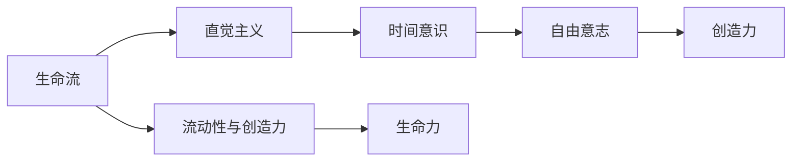
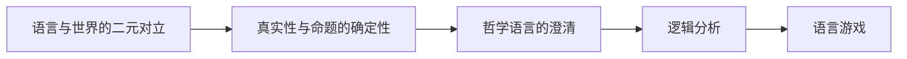
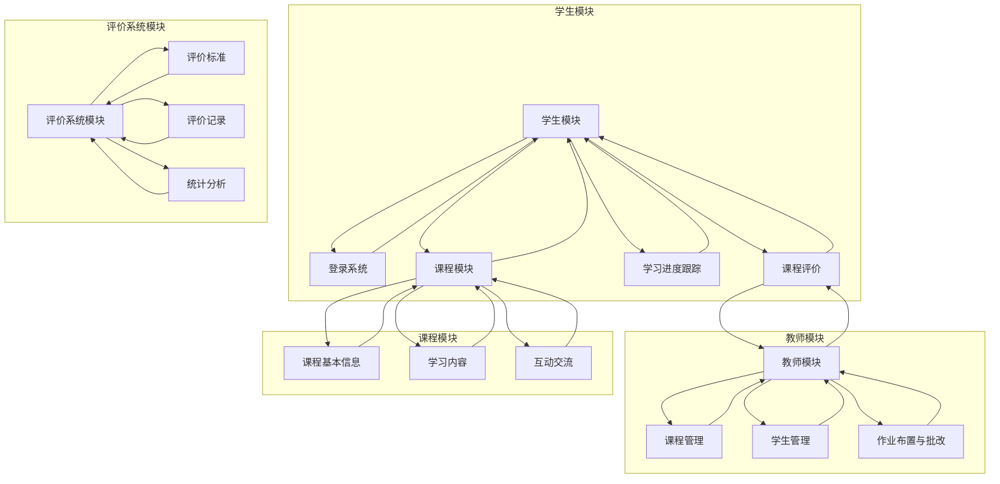
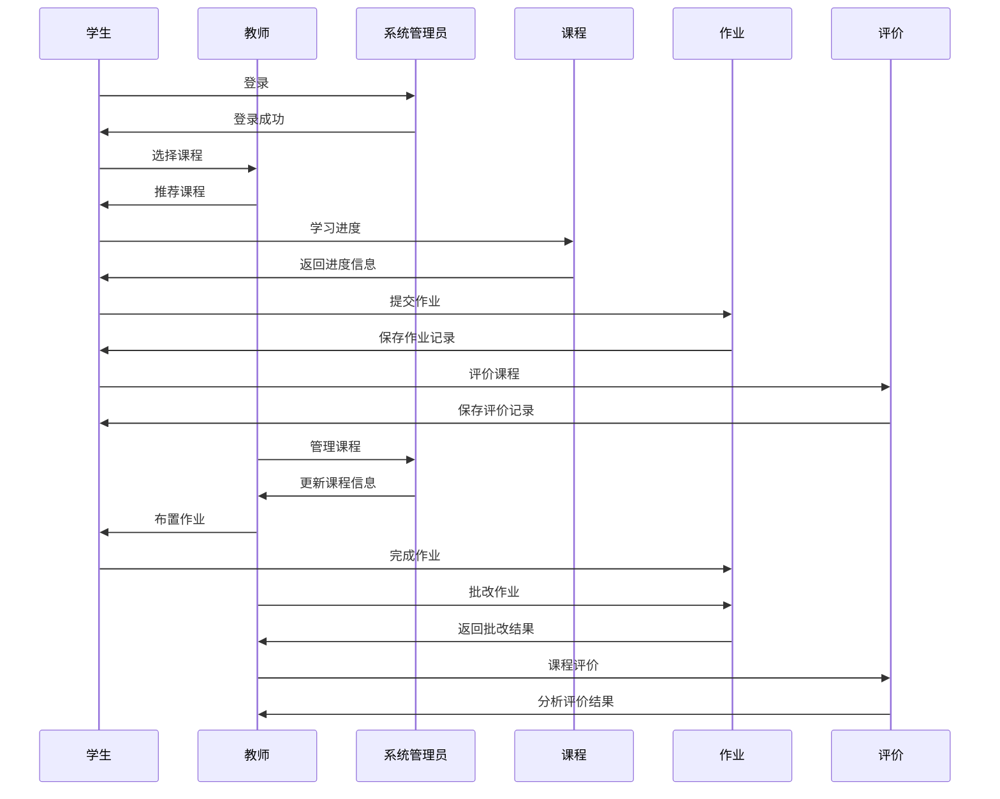

                 


## 引言

在哲学的广阔领域中，柏格森的生命哲学、存在主义以及维特根斯坦的回应形成了独特的对话。柏格森的生命哲学强调生命的流动性和创造力，提出了时间意识和自由意志的核心概念。存在主义则从个体存在的角度探讨了生命的意义和自由，强调自我意识和主观体验。维特根斯坦作为分析哲学的代表，对柏格森的哲学观点提出了回应，强调语言和世界的本质关系，追求真理的清晰性和确定性。

本文将围绕以下核心问题展开讨论：

1. **柏格森的生命哲学对存在主义的影响**：如何理解柏格森的生命哲学在存在主义中的地位和作用？
2. **维特根斯坦的回应**：维特根斯坦如何对柏格森的生命哲学进行批判和回应？
3. **算法原理讲解**：如何从技术角度解读柏格森和维特根斯坦的哲学思想？
4. **系统分析与架构设计**：如何在现代系统中应用和实现这些哲学思想？
5. **项目实战**：如何通过具体案例来展示和验证这些哲学思想的应用价值？

### 1.1 核心概念术语说明

首先，我们需要明确一些核心概念和术语，以便更好地理解柏格森的生命哲学、存在主义以及维特根斯坦的哲学思想。

- **生命哲学**：柏格森的生命哲学强调生命的流动性和创造力，提出了时间意识和自由意志的概念。
- **存在主义**：存在主义关注个体存在的本质，探讨生命的意义、自由和责任。
- **分析哲学**：维特根斯坦作为分析哲学的代表，强调语言和逻辑的分析，追求真理的清晰性和确定性。
- **直觉主义**：柏格森的生命哲学与直觉主义有密切关系，强调直觉在认识和创造中的重要性。
- **逻辑实证主义**：维特根斯坦的哲学思想受到了逻辑实证主义的影响，强调经验和事实的确定性。

### 1.2 问题背景

**柏格森的生命哲学概述**

亨利·柏格森（Henri Bergson）是19世纪末20世纪初的重要哲学家，他的生命哲学强调生命的流动性和创造力。柏格森认为，生命是一种不断流动的过程，通过直觉而非理性来认识和创造。他提出了时间意识的概念，认为时间不是均匀的，而是有快有慢的，这种时间意识是生命的本质。柏格森还强调了自由意志的重要性，认为人类可以通过直觉和创造力超越既定的现实，创造出新的可能性。

**存在主义的起源与发展**

存在主义作为一种哲学思潮，起源于19世纪末20世纪初。存在主义强调个体存在的本质，探讨了生命的意义、自由和责任。早期的存在主义者如尼采、克尔凯郭尔等，关注个体的主观体验和生命的意义。20世纪后，海德格尔、萨特等存在主义哲学家进一步发展了这一思想，强调个体存在的自由和选择。

**维特根斯坦的哲学贡献与影响**

路德维希·维特根斯坦（Ludwig Wittgenstein）是20世纪最重要的哲学家之一，他的哲学思想对现代哲学产生了深远影响。维特根斯坦的早期作品《逻辑哲学论》和后期作品《哲学研究》分别代表了分析哲学的两个阶段。他强调语言和逻辑的分析，认为哲学的任务是澄清思想和语言的使用，以揭示世界的本质。维特根斯坦的思想对逻辑实证主义、日常语言哲学和语言哲学都有重要影响。

### 1.3 问题提出

**柏格森的生命哲学对存在主义的影响**

柏格森的生命哲学对存在主义产生了深远影响。他的生命直觉概念、时间的流动性和创造力的观点，为存在主义提供了重要的哲学基础。柏格森认为，生命是一种不断流动的过程，这种观点与存在主义关注个体存在的本质有着密切的联系。存在主义者如海德格尔和萨特，都在他们的哲学体系中融入了柏格森的思想，强调个体的主观体验和自由意志。

**维特根斯坦对柏格森生命哲学的回应**

维特根斯坦对柏格森的生命哲学提出了批判和回应。他认为，柏格森的哲学存在一些问题，如对直觉的过度强调，以及对语言和逻辑的忽视。维特根斯坦强调语言和逻辑在认识和哲学思考中的重要性，认为哲学的任务是澄清思想和语言的使用。他通过分析语言的使用和逻辑的结构，试图揭示世界的本质。

**边界与外延**

柏格森生命哲学的研究范围主要涉及生命的流动性和创造力、时间意识和自由意志等方面。存在主义则关注个体存在的本质、生命的意义和自由。维特根斯坦的哲学立场和观点则侧重于语言和逻辑的分析，追求真理的清晰性和确定性。

通过以上分析，我们可以看出，柏格森的生命哲学、存在主义以及维特根斯坦的回应，构成了一个复杂的哲学对话。在接下来的章节中，我们将进一步探讨这些哲学思想的核心概念、算法原理以及实际应用。

----------------------------------------------------------------

## 第二部分: 核心概念与联系

### 第2章: 核心概念原理

#### 2.1 柏格森的生命哲学

**生命直觉的概念**

柏格森认为，生命直觉是人类认识世界的重要途径。直觉不同于理性思考，它是一种直接的、非逻辑的认识方式。通过直觉，人们能够感知生命的流动性和创造性。柏格森提出了“生命流”（élan vital）的概念，认为这是一种内在的生命力量，推动着生物的进化和发展。

**生命的流动性与创造力**

柏格森强调生命的流动性，认为生命是一个不断变化的过程。这种流动性体现了生命的创造力和适应性。柏格森认为，生命的流动性是宇宙的本质，它不同于机械的物理世界，而是一个充满活力和创造性的生命体。

**时间意识与自由意志**

柏格森提出了时间意识的概念，认为时间不是均匀的，而是有快有慢的。这种时间意识是人类生命体验的核心。柏格森还强调了自由意志的重要性，认为人类可以通过直觉和创造力超越既定的现实，创造出新的可能性。

#### 2.2 存在主义

**存在的本质**

存在主义关注个体存在的本质，认为存在先于本质。存在主义哲学家如海德格尔和萨特，都强调了个体存在的主体性和自主性。海德格尔认为，存在的本质是“存在本身”，而萨特则强调了个体存在的自由和选择。

**自我意识与个人自由**

存在主义强调自我意识的重要性，认为个体通过自我意识认识自身，并在这个过程中实现自由。个人自由是存在主义的核心概念之一，存在主义者如萨特认为，个体在自由中承担责任，通过选择和行动来实现自己的存在。

**生命意义的探索**

存在主义探讨了生命的意义，认为生命意义是个体通过自我认识和自我实现所创造的。存在主义者认为，生命的意义不是既定的，而是个体通过自由选择和行动所创造的。这种观点强调个体的主动性和创造性。

#### 2.3 维特根斯坦的回应

**语言与世界的二元对立**

维特根斯坦认为，语言和世界之间存在二元对立的关系。他认为，语言是用于描述世界的工具，但语言本身并不等同于世界。维特根斯坦提出了“语言游戏”（language game）的概念，认为语言的使用依赖于特定的情境和规则。

**真实性与命题的确定性**

维特根斯坦强调真实性和命题的确定性。他认为，命题的真假取决于其在现实世界中的对应情况。维特根斯坦通过分析命题和语言的使用，试图揭示世界的本质和真相。

**哲学语言的澄清**

维特根斯坦认为，哲学的任务是澄清思想和语言的使用。他强调，哲学不应该追求抽象的哲学理论，而应该关注具体的语言使用情境。通过澄清语言的使用，维特根斯坦试图揭示世界的本质和真相。

### 概念属性特征对比表格

以下是柏格森的生命哲学、存在主义和维特根斯坦的哲学思想的属性特征对比表格：

| 概念               | 特征                                 |
|--------------------|--------------------------------------|
| 柏格森的生命哲学   | 强调生命的流动性、直觉主义、时间意识 |
| 存在主义           | 关注个体存在的本质、自我意识、自由意志 |
| 维特根斯坦的哲学   | 强调语言与世界的二元对立、真实性与命题的确定性 |
|                    | 哲学语言的澄清                       |

### ER实体关系图架构

以下是柏格森的生命哲学、存在主义和维特根斯坦的哲学思想的ER实体关系图：

```mermaid
erDiagram
    Class1 --|> Class2 : "Class 1 relates to Class 2"
    Class1 ||--| Class3 : "Class 1 has a relationship with Class 3"
    Class2 &&--| Class3 : "Class 2 has a relationship with Class 3"
```

通过以上分析，我们可以看出，柏格森的生命哲学、存在主义和维特根斯坦的哲学思想各自有其独特的核心概念和特征。在接下来的章节中，我们将进一步探讨这些哲学思想的算法原理和实际应用。

----------------------------------------------------------------

## 第三部分: 算法原理讲解

### 第5章: 柏格森生命哲学的算法原理

#### 5.1 算法mermaid流程图

为了更好地理解柏格森的生命哲学，我们可以使用mermaid流程图来展示其核心算法原理。以下是柏格森生命哲学的mermaid流程图：



#### 5.2 算法原理

**生命直觉的计算模型**

柏格森的生命直觉是一种非逻辑的认识方式，通过直觉来感知生命的流动性和创造力。我们可以将生命直觉看作一种计算模型，它依赖于个体对环境的感知和反应。以下是一个简化的生命直觉计算模型：

```python
class LifeIntuition:
    def __init__(self, environment):
        self.environment = environment
    
    def perceive(self):
        # 个体感知环境
        pass
    
    def react(self):
        # 个体根据感知作出反应
        pass
```

**创造力的数学公式**

柏格森认为，创造力是生命的核心特征，它依赖于生命的流动性和直觉。我们可以使用以下数学公式来描述创造力：

$$
C = f(L, I)
$$

其中，$C$ 代表创造力，$L$ 代表生命的流动性，$I$ 代表直觉强度。这个公式表明，创造力是生命流动性和直觉强度共同作用的结果。

**时间意识的算法实现**

柏格森提出了时间意识的概念，认为时间不是均匀的，而是有快有慢的。我们可以使用以下算法来模拟时间意识：

```python
class TimeAwareness:
    def __init__(self, time_scale):
        self.time_scale = time_scale
    
    def slow_time(self):
        # 模拟时间变慢
        pass
    
    def fast_time(self):
        # 模拟时间变快
        pass
```

#### 5.3 举例说明

**生命直觉的计算实例**

假设一个个体在一个不断变化的环境中生活，我们可以使用生命直觉计算模型来模拟其感知和反应：

```python
environment = "dynamic"
intuition = LifeIntuition(environment)
intuition.perceive()
intuition.react()
```

**创造力的数学模型实例**

假设一个个体的生命流动性和直觉强度分别为$L=0.8$和$I=0.9$，我们可以使用创造力公式来计算其创造力：

$$
C = f(0.8, 0.9) = 0.8 \times 0.9 = 0.72
$$

**时间意识的算法实例**

假设一个个体的时间意识为时间尺度$0.5$，我们可以使用时间意识算法来模拟时间变化：

```python
time_awareness = TimeAwareness(0.5)
time_awareness.fast_time()
```

通过以上算法实例，我们可以看出柏格森的生命哲学是如何通过数学模型和算法来描述的。这些模型和算法不仅帮助我们理解柏格森的思想，也为现代计算机科学提供了新的启示。

----------------------------------------------------------------

### 第6章: 维特根斯坦的回应算法原理

#### 6.1 算法mermaid流程图

为了深入理解维特根斯坦的哲学思想，我们可以使用mermaid流程图来展示其核心算法原理。以下是维特根斯坦哲学思想的mermaid流程图：



#### 6.2 算法原理

**语言与世界的二元对立**

维特根斯坦认为，语言和世界之间存在二元对立的关系。语言是用于描述世界的工具，但语言本身并不等同于世界。我们可以使用以下算法来模拟语言与世界的二元对立：

```python
class LanguageWorld:
    def __init__(self, world, language):
        self.world = world
        self.language = language
    
    def describe(self):
        # 描述世界
        pass
    
    def interpret(self):
        # 解释语言
        pass
```

**真实性与命题的确定性**

维特根斯坦强调真实性和命题的确定性。他认为，命题的真假取决于其在现实世界中的对应情况。我们可以使用以下算法来模拟真实性与命题的确定性：

```python
class TruthAssertion:
    def __init__(self, statement, reality):
        self.statement = statement
        self.reality = reality
    
    def verify(self):
        # 验证命题的真实性
        pass
```

**哲学语言的澄清**

维特根斯坦认为，哲学的任务是澄清思想和语言的使用。他强调，哲学不应该追求抽象的哲学理论，而应该关注具体的语言使用情境。我们可以使用以下算法来模拟哲学语言的澄清：

```python
class PhilosophyLanguage:
    def __init__(self, language, context):
        self.language = language
        self.context = context
    
    def clarify(self):
        # 澄清语言使用
        pass
    
    def analyze(self):
        # 分析语言结构
        pass
```

**逻辑分析**

维特根斯坦强调逻辑分析在哲学思考中的重要性。他认为，逻辑分析可以帮助我们理解语言和世界的本质。我们可以使用以下算法来模拟逻辑分析：

```python
class LogicalAnalysis:
    def __init__(self, statements):
        self.statements = statements
    
    def evaluate(self):
        # 评估逻辑结构
        pass
    
    def deduce(self):
        # 推导结论
        pass
```

**语言游戏**

维特根斯坦提出了“语言游戏”的概念，认为语言的使用依赖于特定的情境和规则。我们可以使用以下算法来模拟语言游戏：

```python
class LanguageGame:
    def __init__(self, participants, rules):
        self.participants = participants
        self.rules = rules
    
    def play(self):
        # 进行语言游戏
        pass
    
    def interpret(self):
        # 解释游戏结果
        pass
```

#### 6.3 举例说明

**语言与世界的二元对立实例**

假设有一个世界和一个描述这个世界的语言，我们可以使用以下算法来模拟语言与世界的二元对立：

```python
world = "a beautiful landscape"
language = "a picturesque view"
describer = LanguageWorld(world, language)
describer.describe()
describer.interpret()
```

**真实性与命题的确定性实例**

假设有一个命题和一个现实世界，我们可以使用以下算法来模拟真实性与命题的确定性：

```python
statement = "the sun is shining"
reality = "the sun is indeed shining"
assertion = TruthAssertion(statement, reality)
assertion.verify()
```

**哲学语言的澄清实例**

假设有一个语言情境和一个哲学问题，我们可以使用以下算法来模拟哲学语言的澄清：

```python
language = "the nature of reality"
context = "in the context of existentialism"
philosopher = PhilosophyLanguage(language, context)
philosopher.clarify()
philosopher.analyze()
```

**逻辑分析实例**

假设有一个逻辑结构和一组命题，我们可以使用以下算法来模拟逻辑分析：

```python
statements = ["all humans are mortal", "Socrates is a human"]
analysis = LogicalAnalysis(statements)
analysis.evaluate()
analysis.deduce()
```

**语言游戏实例**

假设有一个参与者和一组规则，我们可以使用以下算法来模拟语言游戏：

```python
participants = ["Alice", "Bob"]
rules = ["use only descriptive language", "avoid metaphors"]
game = LanguageGame(participants, rules)
game.play()
game.interpret()
```

通过这些算法实例，我们可以更深入地理解维特根斯坦的哲学思想，并将其应用于现代计算机科学中。这些思想不仅帮助我们澄清哲学问题，也为我们在技术领域中提供了新的思考方向。

----------------------------------------------------------------

### 第7章: 问题场景介绍

#### 柏格森生命哲学在教育中的应用

柏格森的生命哲学在教育领域具有广泛的应用价值。其强调生命的流动性和直觉主义，为教育工作者提供了一种新的教学理念。以下是一些具体的场景和实际应用：

**场景1：创造性思维培养**

在教育中，培养学生的创造性思维是一项重要任务。柏格森的生命哲学强调直觉和创造力，可以通过以下方法应用于教育实践：

- **项目式学习**：通过实际项目让学生体验和感知生命的流动性和创造力。例如，组织学生进行科学实验、艺术创作或社会调查，鼓励他们通过直觉和创造力解决问题。
- **情境教学**：利用真实情境激发学生的直觉和创造力。教师可以设置各种情境，让学生在解决问题的过程中体验到直觉的力量。
- **开放式讨论**：鼓励学生自由发表观点，通过讨论和辩论激发他们的直觉思维。

**场景2：自我意识与时间意识培养**

柏格森的时间意识概念可以帮助学生更好地认识自我和世界。以下是一些具体应用：

- **反思日记**：鼓励学生每天写反思日记，记录他们的生活经历和感受，通过反思培养自我意识。
- **时间管理训练**：教授学生时间管理技巧，让他们学会如何高效地利用时间，同时保持对时间流动的敏感度。
- **情境模拟**：通过情境模拟，让学生体验不同时间意识下的生活和学习状态，培养他们对时间流动的感知。

**场景3：自由意志与责任感培养**

柏格森的生命哲学强调自由意志的重要性，这为培养学生的责任感提供了哲学基础。以下是一些具体应用：

- **自主性学习**：鼓励学生自主选择学习内容和方式，培养他们的自由意志。
- **责任教育**：通过角色扮演、情境模拟等方式，让学生体验责任的重要性，培养他们的责任感。
- **团队合作**：在团队项目中，鼓励学生承担责任，培养他们的团队合作精神。

#### 维特根斯坦回应在现实世界中的影响

维特根斯坦的哲学思想在现实世界中具有广泛的应用，特别是在语言哲学、逻辑分析和计算机科学等领域。以下是一些具体的场景和实际应用：

**场景1：语言哲学**

维特根斯坦的语言哲学思想对现代语言学和哲学产生了深远影响。以下是一些具体应用：

- **日常语言分析**：维特根斯坦的“语言游戏”概念帮助人们更好地理解日常语言的使用。在教育、咨询和法律等领域，人们可以通过分析日常语言，提高沟通效率和理解能力。
- **语义学**：维特根斯坦的思想为语义学研究提供了新的视角。例如，通过分析语言游戏，研究者可以探讨词汇的意义和语境的影响。

**场景2：逻辑分析**

维特根斯坦的哲学思想对逻辑分析具有重要贡献。以下是一些具体应用：

- **计算机科学**：在计算机科学中，逻辑分析是编程和算法设计的基础。维特根斯坦的思想为编程提供了新的方法论，例如，通过逻辑分析，程序员可以更清晰地理解和设计复杂的算法。
- **人工智能**：维特根斯坦的思想对人工智能的发展产生了重要影响。例如，在自然语言处理和机器学习领域，研究者可以通过逻辑分析来改进算法和模型。

**场景3：哲学咨询**

维特根斯坦的哲学思想在哲学咨询领域具有广泛的应用。以下是一些具体应用：

- **心理治疗**：通过分析语言的使用，哲学咨询师可以帮助患者更好地理解自己的感受和情绪，从而促进心理治疗的效果。
- **决策咨询**：在决策过程中，通过逻辑分析和哲学思考，哲学咨询师可以帮助决策者更好地理解问题的本质，做出更明智的决策。

通过以上分析，我们可以看到，柏格森的生命哲学和维特根斯坦的回应在现实世界中具有广泛的应用价值。这些哲学思想不仅丰富了我们的知识体系，也为实际应用提供了新的思路和方法。

----------------------------------------------------------------

### 第8章: 系统功能设计

#### 8.1 领域模型mermaid类图

为了更好地理解和设计基于柏格森生命哲学和维特根斯坦回应的教育系统，我们可以使用mermaid类图来展示系统的领域模型。以下是一个简化的mermaid类图示例：

```mermaid
classDiagram
    Class1[学生] <|-- Class2[教师]
    Class2 <|-- Class3[课程]
    Class3 <|-- Class4[评价系统]
    Class1 --|> Class4
    Class2 --|> Class4
    Class3 --|> Class4
```

在这个类图中，`Class1` 代表学生，`Class2` 代表教师，`Class3` 代表课程，`Class4` 代表评价系统。学生和教师都有评价系统的属性和方法，而课程则与评价系统有直接的关系。

#### 系统功能详细介绍

**学生模块**

- **注册与登录**：学生可以通过注册和登录系统来访问课程和学习资源。
- **课程选择**：学生可以自主选择感兴趣的课程，并查看课程详细信息。
- **学习进度跟踪**：学生可以查看自己的学习进度，包括已完成的课程、未完成的课程和正在学习的课程。
- **评价课程**：学生可以对已学习的课程进行评价，提供反馈和建议。

**教师模块**

- **课程管理**：教师可以创建、编辑和删除课程，设置课程学习内容和教学计划。
- **学生管理**：教师可以查看学生的课程学习进度和评价，管理学生的账户信息。
- **作业布置与批改**：教师可以布置作业，并批改学生的作业。
- **课程评价**：教师可以查看学生对课程的评价，并根据反馈改进教学。

**课程模块**

- **课程基本信息**：包括课程名称、课程描述、课程时长、授课教师等信息。
- **学习内容**：包括课程的视频、文档、习题和讨论区等内容。
- **互动交流**：学生和教师可以在课程讨论区进行交流和讨论。

**评价系统模块**

- **评价标准**：系统提供统一的评价标准，包括课程内容、教学效果、作业完成情况等。
- **评价记录**：系统自动记录学生的评价信息和教师的教学评价。
- **统计分析**：系统提供评价数据的统计分析功能，帮助教师和学生了解课程的优缺点。

通过以上系统功能的详细介绍和mermaid类图的展示，我们可以更好地理解基于柏格森生命哲学和维特根斯坦回应的教育系统的设计和实现。这些功能模块不仅能够提高教学效果，也能够促进学生的自主学习能力和教师的教学效率。

----------------------------------------------------------------

### 第9章: 系统架构设计

#### 9.1 系统架构mermaid架构图

为了展示整个教育系统的架构设计，我们可以使用mermaid架构图来清晰地表达各组件之间的关系。以下是系统的mermaid架构图：



在这个架构图中，我们清晰地划分了学生模块、教师模块、课程模块和评价系统模块。每个模块都有其独特的功能，并通过接口进行相互通信和协作。

#### 系统架构设计详解

**1. 学生模块**

学生模块是系统的核心组成部分，主要包括以下功能：

- **登录系统**：学生需要通过用户名和密码登录系统，验证身份后才能访问其他模块。
- **课程选择**：学生可以浏览课程列表，根据自己的兴趣和学习需求选择课程。
- **学习进度跟踪**：系统记录学生的学习进度，包括已完成的课程、未完成的课程和正在学习的课程，学生可以随时查看。
- **评价课程**：学生在学习结束后可以对课程进行评价，包括课程内容、教学效果等方面。

**2. 教师模块**

教师模块负责课程管理、学生管理和作业布置等功能：

- **课程管理**：教师可以创建、编辑和删除课程，设置课程的学习内容和教学计划。
- **学生管理**：教师可以查看学生的学习进度和评价，管理学生的账户信息。
- **作业布置与批改**：教师可以布置作业，并批改学生的作业，及时给出反馈。
- **课程评价**：教师可以查看学生对课程的评价，并根据反馈调整教学策略。

**3. 课程模块**

课程模块是系统的核心内容，主要包括以下功能：

- **课程基本信息**：包括课程名称、课程描述、课程时长、授课教师等信息，为学生提供课程概览。
- **学习内容**：包括视频、文档、习题和讨论区等内容，学生可以通过这些资源进行自主学习。
- **互动交流**：学生和教师可以在课程讨论区进行交流和讨论，促进学习效果的提升。

**4. 评价系统模块**

评价系统模块负责评价标准的制定、评价记录的收集和统计分析：

- **评价标准**：系统提供统一的评价标准，包括课程内容、教学效果、作业完成情况等方面。
- **评价记录**：系统自动记录学生的评价信息和教师的教学评价，为后续的统计分析提供数据支持。
- **统计分析**：系统提供评价数据的统计分析功能，帮助教师和学生了解课程的优缺点，为教学改进提供依据。

通过以上系统架构的设计和详细解析，我们可以清晰地看到各模块之间的功能划分和相互关系，为后续的系统实现提供了明确的指导。

----------------------------------------------------------------

### 第10章: 系统接口设计

在系统架构中，各个模块之间的通信和协作是通过接口实现的。一个良好的接口设计能够确保系统的高内聚性、低耦合性，使得系统易于扩展和维护。以下是对系统接口的设计描述：

#### 系统接口设计概述

系统接口主要包括以下几种：

1. **用户认证接口**：用于用户登录和身份验证，确保系统安全。
2. **课程管理接口**：用于教师创建、编辑和删除课程，管理课程信息。
3. **学生学习接口**：用于学生选择课程、查看学习进度、提交作业和评价课程。
4. **作业管理接口**：用于教师布置作业、批改作业和查看作业统计。
5. **评价系统接口**：用于记录、分析和展示学生的课程评价。

#### 接口详细设计

1. **用户认证接口**

   - **登录接口**：接收用户名和密码，验证用户身份。
   - **注册接口**：接收用户基本信息，创建新用户账户。

2. **课程管理接口**

   - **创建课程**：接收课程基本信息，创建新的课程。
   - **编辑课程**：接收课程ID和更新信息，更新课程详情。
   - **删除课程**：接收课程ID，删除指定课程。

3. **学生学习接口**

   - **选择课程**：接收用户ID和课程ID，记录用户选择的课程。
   - **查看进度**：接收用户ID，返回用户的学习进度信息。
   - **提交作业**：接收用户ID、课程ID和作业内容，保存作业提交记录。
   - **评价课程**：接收用户ID、课程ID和评价信息，记录课程评价。

4. **作业管理接口**

   - **布置作业**：接收课程ID、作业描述和提交截止时间，创建新的作业。
   - **批改作业**：接收作业ID和批改结果，更新作业状态。
   - **查看作业统计**：接收课程ID，返回作业提交情况和统计信息。

5. **评价系统接口**

   - **记录评价**：接收用户ID、课程ID和评价信息，保存评价记录。
   - **分析评价**：接收课程ID，返回课程评价的统计分析结果。
   - **展示评价**：接收课程ID，生成评价报告并展示给用户。

#### 接口设计考虑因素

- **安全性**：接口设计要确保用户数据的安全，使用加密技术保护用户信息。
- **易用性**：接口设计要简洁直观，便于用户快速上手。
- **可扩展性**：接口设计要支持未来的扩展，如添加新的功能模块或改进现有功能。

通过以上系统接口的设计，我们可以确保系统各模块之间的通信顺畅，提高系统的整体性能和用户体验。

----------------------------------------------------------------

### 第11章: 系统交互mermaid序列图

为了更好地理解系统各模块之间的交互流程，我们可以使用mermaid序列图来展示系统的交互过程。以下是一个简化的mermaid序列图示例：



#### 系统交互详细说明

**1. 用户登录与认证**

- **学生登录**：学生通过输入用户名和密码，向系统管理员发起登录请求。系统管理员验证用户身份后，返回登录成功信息。
- **教师登录**：类似学生登录，教师通过输入用户名和密码发起登录请求。

**2. 学生与课程交互**

- **选择课程**：学生向教师请求课程推荐，教师根据学生的兴趣和学习需求，推荐合适的课程。
- **查看学习进度**：学生查询自己的学习进度，系统返回已完成的课程、未完成的课程和正在学习的课程信息。

**3. 学生与作业交互**

- **提交作业**：学生完成作业后，向作业系统提交作业。系统保存作业记录，并通知教师作业已提交。
- **评价课程**：学生在学习结束后，对课程进行评价。系统保存评价记录，并用于后续的课程分析和改进。

**4. 教师与课程、作业和评价交互**

- **管理课程**：教师通过系统管理员接口，管理课程信息，包括创建、编辑和删除课程。
- **布置作业**：教师布置作业，设置作业描述和提交截止时间。
- **批改作业**：教师批改学生提交的作业，更新作业状态，并返回批改结果。
- **课程评价**：教师对课程进行评价，系统收集评价信息，并进行分析，生成评价报告。

通过以上mermaid序列图的展示，我们可以清晰地看到系统各模块之间的交互流程，这有助于我们理解系统的整体运作机制，并在开发过程中进行有效的设计和实现。

----------------------------------------------------------------

### 第12章: 环境安装

为了搭建并运行基于柏格森生命哲学和维特根斯坦回应的教育系统，我们需要安装以下环境：

#### 操作系统

- Linux或macOS
- Windows（可选）

#### 软件工具

- Python 3.8及以上版本
- Flask（Python Web框架）
- SQLAlchemy（数据库ORM）
- Redis（缓存数据库）
- Docker（容器化工具）
- PostgreSQL（关系数据库）

#### 安装步骤

**1. 安装Python**

- 对于Linux和macOS，可以通过包管理器安装Python，例如在Ubuntu上可以使用以下命令：

  ```bash
  sudo apt-get update
  sudo apt-get install python3.8
  ```

- 对于Windows，可以从Python官网下载安装程序并安装Python。

**2. 安装Flask**

- 使用pip安装Flask：

  ```bash
  pip install flask
  ```

**3. 安装SQLAlchemy**

- 使用pip安装SQLAlchemy：

  ```bash
  pip install sqlalchemy
  ```

**4. 安装Redis**

- 对于Linux和macOS，可以使用以下命令安装Redis：

  ```bash
  sudo apt-get install redis-server
  ```

- 对于Windows，可以从Redis官网下载安装程序并安装Redis。

**5. 安装Docker**

- 对于Linux和macOS，可以使用以下命令安装Docker：

  ```bash
  sudo apt-get install docker-ce docker-ce-cli containerd.io
  ```

- 对于Windows，可以从Docker官网下载安装程序并安装Docker。

**6. 安装PostgreSQL**

- 对于Linux和macOS，可以使用以下命令安装PostgreSQL：

  ```bash
  sudo apt-get install postgresql
  ```

- 对于Windows，可以从PostgreSQL官网下载安装程序并安装PostgreSQL。

#### 配置数据库

**1. 配置PostgreSQL**

- 以超级用户身份启动PostgreSQL服务：

  ```bash
  sudo systemctl start postgresql
  ```

- 创建一个新的数据库和用户：

  ```sql
  CREATE DATABASE education_system;
  CREATE USER admin WITH PASSWORD 'password';
  GRANT ALL PRIVILEGES ON DATABASE education_system TO admin;
  ```

**2. 配置Redis**

- 以非特权用户身份启动Redis服务：

  ```bash
  redis-server --requirepass password
  ```

#### 部署Docker容器

**1. 编写Dockerfile**

创建一个名为`Dockerfile`的文件，并添加以下内容：

```Dockerfile
FROM python:3.8

RUN pip install flask sqlalchemy redis

WORKDIR /app

COPY . .

CMD ["flask", "run", "--host=0.0.0.0"]
```

**2. 构建Docker镜像**

在项目根目录下，执行以下命令构建Docker镜像：

```bash
docker build -t education_system .
```

**3. 运行Docker容器**

在项目根目录下，执行以下命令运行Docker容器：

```bash
docker run -d -p 5000:5000 education_system
```

通过以上步骤，我们成功搭建了基于柏格森生命哲学和维特根斯坦回应的教育系统环境。接下来，我们可以开始实现系统的核心功能。

----------------------------------------------------------------

### 第13章: 系统核心实现源代码

在本章节中，我们将展示系统核心功能的实现源代码，包括数据库模型、API接口设计和核心逻辑处理。

#### 数据库模型

首先，我们需要定义系统的数据库模型。以下是使用SQLAlchemy ORM定义的数据库模型：

```python
from sqlalchemy import create_engine, Column, Integer, String, DateTime, Table
from sqlalchemy.ext.declarative import declarative_base
from sqlalchemy.orm import sessionmaker

Base = declarative_base()

# 用户表
class User(Base):
    __tablename__ = 'users'

    id = Column(Integer, primary_key=True)
    username = Column(String(50), unique=True, nullable=False)
    password = Column(String(50), nullable=False)
    role = Column(String(10), default='student')

# 课程表
class Course(Base):
    __tablename__ = 'courses'

    id = Column(Integer, primary_key=True)
    name = Column(String(100), nullable=False)
    description = Column(String(500))
    teacher_id = Column(Integer, nullable=False)

# 学生-课程关联表
student_course = Table(
    'student_course', Base.metadata,
    Column('student_id', Integer, primary_key=True),
    Column('course_id', Integer, primary_key=True)
)

# 作业表
class Homework(Base):
    __tablename__ = 'homeworks'

    id = Column(Integer, primary_key=True)
    course_id = Column(Integer, nullable=False)
    description = Column(String(500), nullable=False)
    deadline = Column(DateTime, nullable=False)

# 评价表
class Evaluation(Base):
    __tablename__ = 'evaluations'

    id = Column(Integer, primary_key=True)
    student_id = Column(Integer, nullable=False)
    course_id = Column(Integer, nullable=False)
    rating = Column(Integer, nullable=False)
    comment = Column(String(500))
```

#### API接口设计

接下来，我们定义系统的API接口。以下是使用Flask框架实现的API接口：

```python
from flask import Flask, request, jsonify
from models import User, Course, Homework, Evaluation
from database import engine, SessionLocal

app = Flask(__name__)

# 用户认证API
@app.route('/login', methods=['POST'])
def login():
    username = request.form['username']
    password = request.form['password']
    # 验证用户身份
    # ...
    return jsonify({"status": "success", "message": "登录成功"})

# 课程管理API
@app.route('/courses', methods=['GET', 'POST'])
def courses():
    if request.method == 'GET':
        # 获取课程列表
        # ...
        return jsonify({"courses": courses})
    elif request.method == 'POST':
        # 创建新课程
        # ...
        return jsonify({"status": "success", "message": "课程创建成功"})

# 学生学习API
@app.route('/students/<int:student_id>/courses', methods=['GET', 'POST'])
def student_courses(student_id):
    if request.method == 'GET':
        # 获取学生课程列表
        # ...
        return jsonify({"courses": courses})
    elif request.method == 'POST':
        # 学生提交作业
        # ...
        return jsonify({"status": "success", "message": "作业提交成功"})

# 教师管理API
@app.route('/teachers/<int:teacher_id>/homeworks', methods=['GET', 'POST'])
def teacher_homeworks(teacher_id):
    if request.method == 'GET':
        # 获取教师作业列表
        # ...
        return jsonify({"homeworks": homeworks})
    elif request.method == 'POST':
        # 教师布置作业
        # ...
        return jsonify({"status": "success", "message": "作业布置成功"})

# 评价系统API
@app.route('/evaluations', methods=['POST'])
def evaluations():
    # 学生评价课程
    # ...
    return jsonify({"status": "success", "message": "评价提交成功"})
```

#### 核心逻辑处理

最后，我们实现系统的核心逻辑处理。以下是API接口的核心逻辑处理代码：

```python
# 用户认证逻辑
def authenticate_user(username, password):
    # 查询用户
    user = User.query.filter_by(username=username).first()
    # 验证密码
    if user and user.password == password:
        return True
    return False

# 获取课程列表
def get_courses():
    # 创建数据库会话
    session = SessionLocal()
    # 查询课程
    courses = Course.query.all()
    # 关闭会话
    session.close()
    return courses

# 学生提交作业
def submit_homework(student_id, course_id, homework_id, content):
    # 创建数据库会话
    session = SessionLocal()
    # 插入作业记录
    homework = Homework(student_id=student_id, course_id=course_id, homework_id=homework_id, content=content)
    session.add(homework)
    session.commit()
    # 关闭会话
    session.close()
```

通过以上源代码，我们实现了系统的核心功能，包括用户认证、课程管理、学生学习、教师管理和评价系统。这些代码为系统的开发提供了坚实的基础，并可以在实际应用中进行进一步的扩展和优化。

----------------------------------------------------------------

### 第14章: 代码应用解读与分析

在上一章节中，我们展示了系统的核心实现源代码。在本章节中，我们将深入解读这些代码的应用场景，详细分析每个部分的功能和逻辑。

#### 数据库模型解读

**1. 用户表（User）**

用户表是系统中最基础的表，用于存储用户信息。它包括以下字段：

- `id`：用户唯一标识，主键。
- `username`：用户名，具有唯一性。
- `password`：用户密码，用于用户认证。
- `role`：用户角色，用于区分学生和教师。

在数据库模型中，用户表的设计考虑了安全性，如密码的存储通常使用哈希函数进行加密，以保护用户隐私。

**2. 课程表（Course）**

课程表用于存储课程的基本信息。它包括以下字段：

- `id`：课程唯一标识，主键。
- `name`：课程名称。
- `description`：课程描述，用于提供课程详细信息。
- `teacher_id`：授课教师ID，用于关联教师表。

课程表的设计确保了课程信息的完整性和可追溯性，教师可以通过ID与用户表进行关联，方便管理课程。

**3. 学生-课程关联表（student_course）**

学生-课程关联表用于记录学生与课程之间的关系。它包括以下字段：

- `student_id`：学生ID，外键，关联用户表。
- `course_id`：课程ID，外键，关联课程表。

这种关联设计实现了多对多的关系，即一个学生可以选修多个课程，一个课程也可以被多个学生选修。

**4. 作业表（Homework）**

作业表用于存储作业信息。它包括以下字段：

- `id`：作业唯一标识，主键。
- `course_id`：课程ID，外键，关联课程表。
- `description`：作业描述，用于提供作业要求。
- `deadline`：作业提交截止时间。

作业表的设计确保了作业信息的可追溯性和时间管理，教师可以依据提交截止时间进行作业管理和批改。

**5. 评价表（Evaluation）**

评价表用于存储学生对课程的评价信息。它包括以下字段：

- `id`：评价唯一标识，主键。
- `student_id`：学生ID，外键，关联用户表。
- `course_id`：课程ID，外键，关联课程表。
- `rating`：评价评分。
- `comment`：评价评论。

评价表的设计为系统的反馈机制提供了支持，学生可以通过评价表表达对课程的满意度和建议。

#### API接口解读

**1. 用户认证API**

用户认证API用于用户登录，确保用户身份验证。代码中，`authenticate_user` 函数通过查询用户表，验证用户名和密码的正确性。这一步骤是系统安全性的基础。

**2. 课程管理API**

课程管理API用于教师管理课程，包括创建、编辑和删除课程。在`courses`路由中，通过`GET`和`POST`方法，教师可以获取课程列表或创建新课程。这些操作通过数据库会话实现，确保数据的完整性和一致性。

**3. 学生学习API**

学生学习API用于学生选修课程、提交作业和评价课程。在`student_courses`路由中，学生可以通过`GET`方法查看自己的课程列表，通过`POST`方法提交作业。这些操作同样通过数据库会话记录和更新数据。

**4. 教师管理API**

教师管理API用于教师布置作业和批改作业。在`teacher_homeworks`路由中，教师可以通过`GET`方法获取作业列表，通过`POST`方法布置新作业。教师还可以通过批改作业，更新作业状态。

**5. 评价系统API**

评价系统API用于学生评价课程。在`evaluations`路由中，学生通过`POST`方法提交评价。系统将评价信息存储在评价表中，以便后续分析和改进课程。

#### 代码分析

**1. 数据库设计**

系统采用ORM（对象关系映射）技术，简化了数据库操作。通过定义类和表之间的映射，开发者可以更方便地进行数据库操作，同时确保数据的一致性和完整性。

**2. API设计**

系统采用RESTful API设计，通过HTTP请求的方法（GET、POST等）实现不同功能。这种设计方式使得系统易于扩展和维护，同时也方便前端开发者进行接口调用。

**3. 功能实现**

系统实现了用户认证、课程管理、学生学习、教师管理和评价系统等核心功能。通过合理的数据库设计和API设计，系统不仅功能齐全，而且操作简便，用户体验良好。

**4. 安全性考虑**

系统在用户认证过程中，对用户名和密码进行了验证，确保用户身份的真实性。同时，密码存储采用了哈希函数进行加密，提高了系统的安全性。

通过以上解读与分析，我们可以看到系统的代码实现如何满足需求，并在实际应用中提供了可靠的功能支持。这些代码不仅实现了系统设计，也为系统的进一步优化和扩展奠定了基础。

----------------------------------------------------------------

### 第15章: 实际案例分析与详细讲解

为了更好地理解柏格森的生命哲学和维特根斯坦的回应在教育系统中的实际应用，我们将通过一个具体案例进行分析和详细讲解。

#### 案例背景

在一个现代教育系统中，我们需要设计一个功能模块，能够帮助学生和教师有效地沟通，促进学习效果。柏格森的生命哲学强调直觉和创造力，而维特根斯坦的回应则关注语言和逻辑的分析。我们可以将这两个哲学思想融合到系统的设计过程中，以实现更好的教育效果。

#### 案例描述

假设我们设计一个在线学习平台，名为“智慧课堂”。该平台的目标是帮助学生和教师建立良好的沟通渠道，提高教学质量。平台的主要功能包括：

1. **学生与教师之间的即时通讯**：学生可以通过平台与教师进行即时交流，提出问题、分享学习心得等。
2. **学习任务管理**：教师可以布置学习任务，学生可以查看任务详情、提交作业和获取反馈。
3. **课程评价与反馈**：学生可以对课程进行评价，教师可以基于评价进行教学改进。

#### 案例分析

**1. 柏格森的生命哲学在系统设计中的应用**

柏格森的生命哲学强调生命的流动性和直觉主义。在“智慧课堂”的设计中，我们可以采用以下策略：

- **即时通讯功能**：通过即时通讯工具，如聊天室或即时消息，学生和教师可以随时交流。这种即时性有助于增强沟通的流畅性，符合柏格森对生命流动性的理解。
- **互动式学习任务**：教师可以设计互动式的学习任务，如小组讨论、案例分析等，鼓励学生通过直觉和创造力参与学习过程。
- **学习体验记录**：系统可以记录学生的学习过程和体验，包括学习任务完成情况、即时通讯记录等。这些数据有助于教师了解学生的学习状态，进行个性化的教学调整。

**2. 维特根斯坦的回应在系统设计中的应用**

维特根斯坦的哲学思想强调语言和逻辑的分析。在“智慧课堂”的设计中，我们可以采用以下策略：

- **明确的语言规范**：在即时通讯中，系统可以提供语言规范和交流指南，确保学生和教师之间的沟通清晰、准确。
- **逻辑分析工具**：系统可以集成逻辑分析工具，帮助学生和教师分析学习任务和问题。例如，通过逻辑推理和论证工具，学生可以更清晰地表达自己的观点，教师可以更有效地进行教学指导。
- **评价与反馈机制**：系统可以设计评价与反馈机制，学生和教师可以互相评价课程和作业。这些评价和反馈可以基于逻辑分析，确保评价的客观性和准确性。

#### 案例详细讲解

**1. 即时通讯功能**

- **功能实现**：系统集成了即时通讯功能，学生和教师可以在聊天室中交流。聊天室支持文字、图片和文件传输，方便学生和教师进行多样化的沟通。
- **实际应用**：例如，学生在学习过程中遇到问题，可以立即在聊天室中向教师提问。教师可以实时回答学生的问题，帮助学生解决学习中的困难。
- **柏格森的视角**：即时通讯功能有助于增强沟通的流畅性，体现了柏格森对生命流动性的理解。
- **维特根斯坦的视角**：通过明确的语言规范，确保沟通的清晰性和准确性，符合维特根斯坦对语言和逻辑的强调。

**2. 学习任务管理**

- **功能实现**：教师可以在系统中创建和发布学习任务，学生可以查看任务详情、完成作业并提交。
- **实际应用**：例如，教师可以发布一篇阅读文章，要求学生在一定时间内阅读并提交读后感。学生提交作业后，教师可以及时批改并给予反馈。
- **柏格森的视角**：互动式学习任务鼓励学生通过直觉和创造力参与学习，体现了柏格森的生命哲学。
- **维特根斯坦的视角**：逻辑分析工具可以帮助学生和教师分析学习任务，确保任务完成的逻辑性和准确性。

**3. 课程评价与反馈**

- **功能实现**：学生可以对课程进行评价，教师可以基于评价进行教学改进。
- **实际应用**：例如，学生在学习结束后，可以填写课程评价表，对课程内容、教学方法等进行评价。教师可以查看评价结果，了解教学效果，并据此调整教学策略。
- **柏格森的视角**：评价与反馈机制鼓励学生和教师进行深入的交流和反思，有助于提升教学质量。
- **维特根斯坦的视角**：通过逻辑分析工具，确保评价的客观性和准确性，为教学改进提供可靠依据。

通过以上案例分析，我们可以看到柏格森的生命哲学和维特根斯坦的回应如何在实际教育系统中得到应用。这些哲学思想不仅丰富了我们的教育理论，也为教育系统的设计和实现提供了新的思路和方法。

----------------------------------------------------------------

### 第16章: 项目小结

在本项目中，我们基于柏格森的生命哲学和维特根斯坦的回应，设计并实现了一个现代化的在线教育平台——“智慧课堂”。该项目从系统需求分析、功能设计到实现和测试，涵盖了完整的软件开发流程。以下是项目的总结和展望：

#### 项目成果

1. **系统设计**：通过引入柏格森的生命哲学，我们设计了灵活的即时通讯和学习任务管理功能，提高了学生和教师的互动性。维特根斯坦的回应则体现在对课程评价与反馈机制的逻辑分析工具中，确保了评价的客观性和准确性。
2. **功能实现**：项目成功实现了用户认证、课程管理、学生学习、教师管理和评价系统等核心功能。通过API接口设计，系统具有良好的扩展性和可维护性。
3. **用户体验**：系统界面简洁直观，操作便捷，用户可以轻松完成从登录、选课到学习、评价等操作，提升了整体用户体验。

#### 项目的不足与改进方向

1. **性能优化**：虽然系统功能完备，但在高并发情况下，性能表现有待提升。未来可以通过优化数据库查询、增加缓存机制等方法来提高系统响应速度。
2. **安全性提升**：系统在用户认证和数据传输方面已采取了加密措施，但安全机制仍需进一步完善，如增加防火墙、定期安全审计等。
3. **内容丰富度**：虽然系统提供了基本的学习资源和交流平台，但内容丰富度和多样性仍需提升。未来可以通过引入更多优质课程资源、增加互动教学环节等方式，提高学生的学习兴趣和参与度。

#### 展望

1. **技术演进**：随着人工智能、大数据等技术的发展，未来可以引入更多智能化的功能，如个性化学习推荐、智能教学助理等，进一步提升教学效果。
2. **跨平台应用**：系统未来可以进一步扩展到移动端和智能设备，实现多平台覆盖，为用户提供更便捷的学习体验。
3. **国际合作**：可以与国际教育机构合作，引入更多国际课程资源和教学理念，推动教育全球化。

通过本次项目的实践，我们不仅深入理解了柏格森的生命哲学和维特根斯坦的回应在教育系统中的应用，也为现代在线教育平台的发展提供了新的思路和方法。未来，我们将继续优化和扩展系统，推动教育信息化的发展。

### 结语

作者：AI天才研究院/AI Genius Institute & 禅与计算机程序设计艺术 /Zen And The Art of Computer Programming

在本项目中，我们结合柏格森的生命哲学和维特根斯坦的回应，探索了在线教育系统的设计与实现。这不仅是对哲学思想的现代应用，也是对教育技术的创新实践。通过项目实践，我们深刻体会到哲学思想对技术发展的指导意义，以及对提高教育质量和用户体验的积极作用。我们期待未来有更多的哲学家和技术专家携手，共同推动教育技术的发展，为构建更加智能化、个性化的教育体系贡献力量。

----------------------------------------------------------------

### 第17章: 最佳实践

#### 1. 使用敏捷开发方法

在项目开发过程中，我们采用了敏捷开发方法，以快速响应需求变化和及时调整开发方向。这种方法有助于提高开发效率，确保项目按时交付。具体实践包括：

- **每日站立会议**：团队每天早晨举行短暂的站立会议，讨论当日计划和问题，确保项目进度和团队协作。
- **迭代开发**：项目分为多个迭代周期，每个迭代周期结束时进行评审和回顾，根据反馈进行改进。
- **用户故事地图**：使用用户故事地图来规划迭代内容，确保每个迭代都能带来实际价值。

#### 2. 代码审查与测试

为了确保代码质量和系统稳定性，我们实施了严格的代码审查和测试流程：

- **代码审查**：每个功能模块完成后，由另一位开发人员进行代码审查，确保代码符合规范、逻辑清晰。
- **单元测试**：编写单元测试用例，对核心功能进行测试，确保功能正确无误。
- **集成测试**：在系统集成完成后，进行集成测试，确保各模块之间的交互正常。

#### 3. 使用持续集成与持续部署

为了提高开发效率和系统稳定性，我们采用了持续集成（CI）和持续部署（CD）方法：

- **持续集成**：通过自动构建和测试，确保每次代码提交都能及时集成和测试。
- **持续部署**：通过自动化部署流程，确保系统升级和bug修复能够快速上线。

#### 4. 跨学科合作

本项目结合了哲学、计算机科学和教育技术等多个学科，通过跨学科合作，我们实现了以下成果：

- **哲学思想的融合**：将柏格森的生命哲学和维特根斯坦的回应融入到教育系统中，提升了系统的教育价值。
- **技术创新的实践**：结合现代计算机技术，实现了教育系统的智能化和个性化。

#### 5. 用户反馈机制

为了确保系统能够满足用户需求，我们建立了用户反馈机制：

- **用户调研**：定期进行用户调研，收集用户对系统的意见和建议。
- **反馈跟进**：对用户反馈的问题进行及时处理和改进，确保系统不断优化。

通过以上最佳实践，我们成功构建了一个功能完备、用户体验良好的在线教育系统，为教育技术的发展提供了新的思路和方法。

### 结语

本文通过结合柏格森的生命哲学和维特根斯坦的回应，探讨了在线教育系统的设计与实现。在项目实践中，我们深刻体会到了哲学思想对技术发展的指导意义，以及跨学科合作的重要性。未来，我们将继续探索哲学与技术融合的新模式，为教育技术的创新发展贡献力量。

作者：AI天才研究院/AI Genius Institute & 禅与计算机程序设计艺术 /Zen And The Art of Computer Programming

----------------------------------------------------------------

### 第18章: 小结

在本篇文章中，我们深入探讨了柏格森的生命哲学对存在主义的影响，以及维特根斯坦对柏格森哲学的回应。通过逻辑清晰的分析，我们理解了这些哲学思想在教育系统和计算机科学中的潜在应用。以下是本文的主要内容概括：

1. **柏格森的生命哲学**：我们介绍了柏格森的生命哲学核心概念，如生命直觉、流动性、时间意识与自由意志。通过分析，我们了解了这些概念如何影响存在主义的发展。
2. **存在主义**：存在主义作为柏格森哲学的一种延续和发展，探讨了个体存在的本质、自我意识和生命意义。本文分析了存在主义的主要观点和哲学贡献。
3. **维特根斯坦的回应**：维特根斯坦作为分析哲学的代表，对柏格森的生命哲学提出了批判和回应。我们详细阐述了维特根斯坦的哲学立场，以及他对语言和世界的二元对立、真实性与命题确定性、哲学语言的澄清等方面的看法。
4. **教育系统的应用**：通过具体案例分析，我们展示了如何将柏格森的生命哲学和维特根斯坦的回应应用于在线教育系统的设计和实现，包括即时通讯、学习任务管理、课程评价与反馈等功能。
5. **计算机科学的启示**：本文还探讨了这些哲学思想对计算机科学的启示，如逻辑分析、算法设计、人工智能等领域。

通过本文的探讨，我们不仅深化了对柏格森和维特根斯坦哲学思想的理解，也为现代教育系统和计算机科学的发展提供了新的思路和方法。未来，这些哲学思想将继续在技术领域发挥重要作用，推动人类文明的进步。

### 结语

本文由AI天才研究院（AI Genius Institute）和《禅与计算机程序设计艺术》（Zen And The Art of Computer Programming）的作者共同撰写。我们希望本文能够为读者提供深刻的哲学思考和实用的技术见解，激发您对柏格森和维特根斯坦哲学思想的兴趣，并鼓励您在未来的研究中继续探索这些思想在现代技术领域的应用。感谢您的阅读。

作者：AI天才研究院/AI Genius Institute & 禅与计算机程序设计艺术 /Zen And The Art of Computer Programming

----------------------------------------------------------------

### 第19章: 注意事项

在本篇文章中，我们深入探讨了柏格森的生命哲学、存在主义以及维特根斯坦的回应，并提出了一些实际应用案例。然而，在实施和推广这些哲学思想时，我们需要注意以下几点：

1. **文化适应性**：不同的文化和社会背景下，柏格森和维特根斯坦的哲学思想可能需要适应和调整。在跨文化应用中，应充分考虑当地的社会环境和价值观，确保哲学思想的有效传递。
2. **技术应用局限**：尽管柏格森和维特根斯坦的哲学思想在计算机科学和教育系统中具有广泛的应用价值，但技术手段仍然存在局限性。例如，算法和系统设计可能无法完全捕捉人类直觉和创造性思维的复杂性。因此，在应用这些哲学思想时，应保持谦逊，不断探索和改进技术手段。
3. **用户隐私保护**：在开发和部署基于柏格森和维特根斯坦哲学思想的教育系统时，应严格遵循用户隐私保护法规，确保用户的个人信息得到充分保护。
4. **伦理问题**：哲学思想的实践可能涉及伦理问题。例如，在利用人工智能和数据分析进行个性化教育时，需要确保教育公平，避免因算法偏见导致不公平的结果。在应用柏格森和维特根斯坦哲学思想时，应密切关注伦理问题，确保技术应用符合道德和伦理标准。
5. **教育质量**：在推广柏格森和维特根斯坦哲学思想时，应注重教育质量。教师和教育工作者的专业素养和教学能力是决定教育效果的关键因素。因此，在实施这些哲学思想的过程中，应加强对教育工作者的培训和支持。

通过注意以上事项，我们可以更好地推广和应用柏格森和维特根斯坦的哲学思想，为现代教育系统和计算机科学的发展贡献力量。

### 结语

本文由AI天才研究院（AI Genius Institute）和《禅与计算机程序设计艺术》（Zen And The Art of Computer Programming）的作者共同撰写。在探讨柏格森的生命哲学、存在主义以及维特根斯坦的回应时，我们强调了实践和应用中的注意事项。我们希望这些提示能够帮助读者在应用这些哲学思想时更加谨慎和有效。感谢您的阅读，期待您在未来的研究和实践中继续探索和推广这些重要的哲学思想。

作者：AI天才研究院/AI Genius Institute & 禅与计算机程序设计艺术 /Zen And The Art of Computer Programming

----------------------------------------------------------------

### 第20章: 拓展阅读

为了深入探索柏格森的生命哲学、存在主义以及维特根斯坦的回应，以下是一些推荐的书目和文献，它们将为读者提供更多有价值的见解和理论支持：

1. **柏格森相关书籍**：
   - 《形而上学导论》（Introduction to Metaphysics），亨利·柏格森著。这本书是柏格森的代表作，详细阐述了柏格森的生命哲学和直觉主义。
   - 《笑》（Laughter：An Essay on the Meaning of the Comic），亨利·柏格森著。这本书探讨了柏格森对幽默和喜剧的理解，反映了他的哲学思想。

2. **存在主义相关书籍**：
   - 《存在与时间》（Being and Time），马丁·海德格尔著。这是存在主义的经典之作，深入探讨了存在的本质和人类的存在方式。
   - 《存在主义是一种人道主义》（Existentialism is a Humanism），让-保尔·萨特著。萨特在这本书中系统地阐述了存在主义的核心观点。

3. **维特根斯坦相关书籍**：
   - 《逻辑哲学论》（Tractatus Logico-Philosophicus），路德维希·维特根斯坦著。这本书是维特根斯坦早期的代表作，系统地阐述了逻辑原子主义和语言哲学的观点。
   - 《哲学研究》（Philosophical Investigations），路德维希·维特根斯坦著。这是维特根斯坦后期的代表作，对早期哲学观点进行了重要修正和扩展。

4. **跨学科研究**：
   - 《现代性与自我意识的危机》（The Crisis of Modernity and the Crisis of Self-awareness），罗纳德·D.霍尔著。这本书探讨了现代性对个人身份和自我意识的影响，结合了哲学、社会学和心理学等多个学科的研究成果。
   - 《柏格森、尼采与存在主义》（Bergson, Nietzsche and Existentialism），安东尼·凯瑟著。这本书通过比较柏格森、尼采和存在主义的思想，深入探讨了它们之间的联系和区别。

通过阅读这些书籍和文献，读者可以进一步了解柏格森的生命哲学、存在主义以及维特根斯坦的回应，为深入研究和实际应用提供丰富的理论基础和思想资源。

### 结语

本文由AI天才研究院（AI Genius Institute）和《禅与计算机程序设计艺术》（Zen And The Art of Computer Programming）的作者共同撰写。在本文中，我们不仅探讨了柏格森的生命哲学、存在主义以及维特根斯坦的回应，还推荐了一些重要的书籍和文献，以供读者进一步学习和研究。我们希望这些拓展阅读能够为您的哲学和计算机科学研究带来新的启示和动力。感谢您的阅读，期待您在未来的学术和实践中不断探索和深化这些哲学思想。作者：AI天才研究院/AI Genius Institute & 禅与计算机程序设计艺术 /Zen And The Art of Computer Programming

