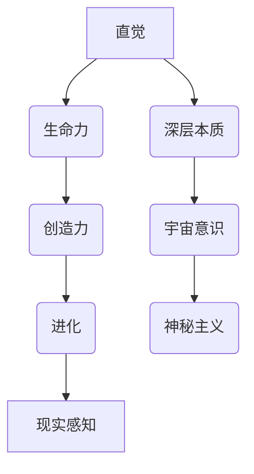

                 

## 引言

### 1.1 书名理解

《柏格森的神秘主义倾向与维特根斯坦的日常语言哲学》这一书名涵盖了两位哲学家的思想及其哲学流派。柏格森（Henri Bergson）是20世纪初法国著名的哲学家，以其对生命力和直觉的深刻理解而闻名。他的哲学思想中包含了一定的神秘主义倾向，特别是强调直觉在理解现实中的作用。神秘主义哲学主张通过超越理性思考和日常经验，寻找更高层次的宇宙意识或真理。

另一方面，维特根斯坦（Ludwig Wittgenstein）是奥地利哲学家，以其对语言和哲学思考的日常化而著称。他的日常语言哲学认为，哲学问题的复杂性源于我们错误地使用日常语言。维特根斯坦主张通过澄清语言的日常用法，揭示哲学问题的本质，从而使哲学变得简单而明确。

这本书的标题暗示了两个主要主题：一是探讨柏格森神秘主义倾向的哲学思想，二是分析维特根斯坦的日常语言哲学。通过比较这两个哲学流派，作者可能旨在揭示两者在哲学思考上的异同，以及它们在理解现实世界方面的作用。

### 1.2 目标读者

本书的目标读者主要针对哲学专业的学生、学者以及对哲学史和现代哲学感兴趣的读者。这些读者通常对柏格森和维特根斯坦的哲学思想有基本的了解，并希望更深入地探讨这两个哲学流派。

对于哲学专业的学生和学者，本书提供了一个详细的研究框架，帮助他们理解柏格森和维特根斯坦的哲学思想，以及这两个流派在现代哲学中的地位和影响。此外，本书还可能为哲学课程提供有价值的阅读材料。

对于对哲学感兴趣的普通读者，本书通过深入探讨柏格森和维特根斯坦的思想，提供了一个思考哲学问题的独特视角。通过理解这两个哲学家的观点，读者可以更好地反思日常生活中的哲学问题，并培养哲学思维。

### 1.3 章节设计

本书分为三个主要部分，每个部分围绕柏格森的神秘主义倾向和维特根斯坦的日常语言哲学进行探讨。

**第一部分：柏格森的神秘主义倾向**

- **第一章：柏格森哲学的基本概念**
  - 柏格森哲学的起源和发展
  - 神秘主义在柏格森哲学中的地位

- **第二章：直觉与生命力的探索**
  - 直觉的概念
  - 生命力在柏格森哲学中的作用
  - 柏格森与神秘主义的关系

- **第三章：时间与空间的理解**
  - 柏格森的时间概念
  - 空间与时间的相互关系
  - 神秘主义视角下的时间与空间

**第二部分：维特根斯坦的日常语言哲学**

- **第四章：日常语言哲学的起源**
  - 维特根斯坦的哲学思想演变
  - 日常语言哲学的基本原理

- **第五章：语言与思维**
  - 语言的规则与使用
  - 语言与思维的关系

- **第六章：哲学的问题与解决方法**
  - 哲学问题的识别
  - 解决哲学问题的方法

**第三部分：比较与联系**

- **第七章：柏格森与维特根斯坦的对比分析**
  - 哲学立场和观点的比较
  - 对语言和现实的不同理解

- **第八章：两位哲学家的联系与影响**
  - 柏格森和维特根斯坦思想之间的共鸣
  - 两位哲学家的思想对后世的影响

### 1.4 细节设计

在章节设计上，本书注重逻辑清晰、结构紧凑，以确保读者能够循序渐进地理解柏格森和维特根斯坦的哲学思想。每个章节开头设置简短的摘要，概述本章主要内容，帮助读者快速把握章节重点。

在内容表述上，本书通过引用柏格森和维特根斯坦的原文，提供哲学思想的实际例证，使读者能够更深入地理解两位哲学家的观点。此外，本书还使用表格、流程图等可视化工具，帮助读者清晰地理解复杂的概念和理论。

### 1.5 附录

本书的附录部分将提供柏格森和维特根斯坦哲学著作的参考文献，以便读者进一步研究。此外，附录中还可能包含一些哲学术语的词汇表和解释，帮助读者更好地理解书中的专业术语。

### 1.6 结论

本书通过深入探讨柏格森的神秘主义倾向和维特根斯坦的日常语言哲学，旨在揭示两者在哲学思考上的异同，以及它们在理解现实世界方面的作用。通过对比分析，读者可以更好地理解柏格森和维特根斯坦的哲学思想，从而在哲学研究中获得新的启示和思考。本书的研究不仅有助于哲学领域的研究，也对日常生活中的哲学问题提供了深刻的见解。## 柏格森的神秘主义倾向

### 2.1 柏格森哲学的基本概念

柏格森（Henri Bergson）是20世纪初法国最重要的哲学家之一，他的思想对现代哲学和人文科学产生了深远的影响。柏格森哲学的核心概念包括直觉、生命力和创造进化。

**直觉**是柏格森哲学中的核心概念。他认为，直觉是人类理解世界的一种独特方式，它超越了逻辑和理性思考。直觉能够捕捉到生命力和创造进化的动态过程，使我们能够感知到现实世界深层的真实本质。柏格森强调，直觉是人类思维的一种基本形式，它不仅存在于艺术和科学中，也渗透在我们的日常经验中。

**生命力**（élan vital）是柏格森哲学中的另一个重要概念。他将其描述为一种驱动有机体进化和发展的内在力量。生命力是动态的、流动的，它不断推动事物向前发展，创造新的形式和结构。柏格森认为，生命力是宇宙的本质，是超越物理世界的更高层次的存在。

**创造进化**是柏格森哲学的核心思想之一。他主张，宇宙的本质是不断变化的，生命力和直觉是推动这种变化的关键因素。创造进化是一个不断产生新事物的过程，它不是基于物理定律的机械运动，而是一种内在的、自发的创造力。柏格森认为，人类通过直觉可以感知到这种创造进化的过程，从而理解宇宙的本质。

### 2.2 神秘主义在柏格森哲学中的地位

柏格森的哲学思想中包含了一定的神秘主义倾向，特别是在他对生命力和直觉的探讨中。神秘主义哲学主张通过超越理性思考和日常经验，寻找更高层次的宇宙意识或真理。柏格森认为，直觉和生命力使我们能够触及这种更高层次的真理，它超越了我们的日常感知和理解。

在柏格森看来，神秘主义不是否定理性思考，而是将其作为一种辅助手段，帮助我们更好地理解直觉和生命力的本质。他认为，理性思维只能触及现实的表面，而直觉和生命力则能够揭示现实的深层本质。神秘主义在柏格森哲学中的地位，体现了他对直觉和生命力的强调，以及对理性思维局限性的认识。

### 2.3 柏格森与神秘主义的关系

柏格森与神秘主义的关系可以从多个角度进行分析。首先，柏格森的直觉概念与神秘主义有密切的联系。神秘主义哲学强调通过超越理性思考和日常经验，达到对宇宙更高层次的理解。柏格森的直觉理论正是这种思想的体现，他认为直觉是人类理解世界的一种独特方式，能够超越理性思维的局限。

其次，柏格森的生命力概念也具有神秘主义的色彩。他认为生命力是宇宙的本质，是一种内在的、自发的创造力，这种观点与神秘主义哲学中对宇宙本源的探讨有相似之处。神秘主义哲学通常认为，宇宙的本质是一种神秘的力量，它驱动着一切事物的运行。

最后，柏格森的创造进化思想也反映了神秘主义的观点。他认为，宇宙的本质是不断变化的，生命力和直觉是推动这种变化的关键因素。这种观点与神秘主义哲学中对宇宙永恒流动和不断创造的思想相契合。

总之，柏格森的哲学思想中包含了一定的神秘主义倾向。他通过强调直觉和生命力，揭示了现实世界的深层本质，从而与神秘主义哲学有了一定的共鸣。柏格森的神秘主义倾向不仅体现在他的哲学理论中，也贯穿在他的学术生涯中，使他成为20世纪最具影响力的哲学家之一。## 直觉与生命力的探索

### 3.1 直觉的概念

直觉（Intuition）是柏格森哲学中的核心概念，他对直觉的定义和探讨为理解其哲学体系提供了关键线索。柏格森认为，直觉是人类思维的一种基本形式，它不同于理性思维，能够直接感知现实世界的深层本质。直觉不是通过推理或分析得出的结论，而是基于直接感知和体验的一种认识方式。

柏格森对直觉的描述具有几层含义。首先，直觉是超越语言的。他认为，语言是一种抽象的工具，只能捕捉现实的一部分，而直觉能够触及现实更深层次的真相。其次，直觉是非逻辑的。柏格森认为，逻辑推理只能处理已知的、明确的事物，而直觉能够感知那些尚未明确或未被揭示的事物。直觉是一种直接的感知，它超越了常规的理性思维模式。

在柏格森的哲学体系中，直觉的作用至关重要。他强调，直觉是人类理解宇宙和生命的关键。直觉使我们能够感知到生命力和创造进化的动态过程，从而理解宇宙的本质。直觉不仅存在于科学和哲学中，也渗透在我们的日常经验中。通过直觉，我们可以捕捉到那些无法用语言表达的内在联系，揭示现实的深层结构。

### 3.2 生命力在柏格森哲学中的作用

生命力（élan vital）是柏格森哲学中的另一个核心概念，它代表了柏格森对生命和宇宙本质的理解。柏格森认为，生命力是一种内在的、自发的创造力，是驱动生命体进化和发展的根本力量。生命力不仅存在于有机体中，也贯穿于宇宙的各个层面。

在柏格森的哲学体系中，生命力具有以下几个重要作用：

1. **驱动进化**：生命力是生物进化的根本动力。柏格森认为，生命力不是静态的，而是动态的、流动的。它不断地推动生命体向前发展，创造新的形式和结构。这种创造力是宇宙的本质，是生命不断演变的过程。

2. **超越机械论**：柏格森的生命力概念与机械论相对立。机械论认为，宇宙中的一切现象都可以归结为物理定律的运作，生命现象也不例外。柏格森认为，这种观点忽视了生命力的内在动力，无法解释生命的复杂性和多样性。他认为，生命力是一种超越物理定律的创造力，它驱动着生命的演变。

3. **整合经验**：生命力使我们能够整合不同的经验，形成对宇宙的整体理解。柏格森认为，直觉和生命力使我们能够感知到现实的深层本质，从而整合各种不同的经验。生命力不仅是一种内在的力量，也是一种整体性的视野，它帮助我们理解宇宙的整体结构和动态过程。

4. **创造新事物**：生命力是创造力的源泉。柏格森认为，生命力不断地创造新的形式和结构，这是宇宙不断进化的重要表现。生命力使我们能够突破现有的限制，创造新的可能性和现实。

### 3.3 柏格森与神秘主义的关系

柏格森的直觉和生命力概念与神秘主义哲学有深刻的联系。神秘主义哲学强调通过超越理性思考和日常经验，寻找更高层次的宇宙意识或真理。柏格森的直觉理论正是这种思想的体现，他认为直觉能够直接感知现实世界的深层本质，超越了理性思维的局限。

柏格森的生命力概念也具有神秘主义的色彩。他认为生命力是宇宙的本质，是一种内在的、自发的创造力，这种观点与神秘主义哲学中对宇宙本源的探讨有相似之处。神秘主义哲学通常认为，宇宙的本质是一种神秘的力量，它驱动着一切事物的运行。

然而，柏格森的神秘主义倾向并不是简单地对传统神秘主义哲学的接受，而是对其进行了重新解释和转化。柏格森认为，神秘主义不是否定理性思考，而是将其作为一种辅助手段，帮助我们更好地理解直觉和生命力的本质。他通过强调直觉和生命力，揭示了现实世界的深层本质，从而与神秘主义哲学有了一定的共鸣。

总之，柏格森的直觉和生命力概念不仅构成了他哲学体系的核心，也体现了其与神秘主义哲学的深刻联系。通过直觉，我们能够感知到生命力的存在和作用，从而理解宇宙的深层本质。这种哲学视角为人们提供了一种新的思考方式，使我们能够更深入地探索宇宙和生命的奥秘。## 时间与空间的理解

### 3.1 柏格森的时间概念

柏格森（Henri Bergson）对时间的理解是他在哲学体系中一个重要且独特的贡献。他认为，时间并非是一种简单的、线性的过程，而是一种连续的、动态的流动，这种流动被称为“持续”（durée）。与传统的牛顿-欧几里得物理学中的时间概念不同，柏格森的时间概念强调时间的主观体验和生命的连续性。

在柏格森看来，持续是时间的基本单位，它不仅仅是时间间隔的累加，更是一种内在的、不可分割的连续性。持续是一个流动的过程，它包含着生命力和直觉的体验，是生命存在的一种表现形式。柏格森认为，持续是直觉的源泉，是我们感知世界和创造新事物的关键。

柏格森的时间概念具有以下几个特点：

1. **主观性**：时间的主观体验是柏格森时间概念的核心。他认为，每个人的时间体验都是独特的，反映了个体生命的过程和状态。时间并不是一个普遍的、客观的框架，而是由个体的主观体验构成的。

2. **非线性**：与线性的时间概念不同，柏格森的时间是连续的、动态的流动。这种流动不是简单的先后关系，而是包含着生命力和创造力的动态过程。

3. **创造性**：时间在柏格森的哲学中具有创造性。他主张，时间不仅是过去、现在和未来的连续，更是新事物的创造过程。时间的流动使我们能够不断创造新的经验和现实。

### 3.2 空间与时间的相互关系

柏格森认为，空间和时间是相互关联的，但它们各自具有独特的属性和作用。空间是物体的位置和形状的集合，是物理现象的背景。而时间则是生命的流动，是内在体验的连续。

在柏格森看来，空间与时间的关系是动态的，而不是静态的。空间是时间的静止状态，是时间流动中的一部分。空间和时间共同构成了我们对世界的整体感知。

1. **空间的时间化**：柏格森认为，空间是时间的一部分，是时间在特定时刻的静止状态。空间中的物体和事件都是时间的体现，它们在时间的流动中展现出特定的形态和关系。

2. **时间的空间化**：时间也可以被视为一种空间，即一种内在的空间，这种空间由我们的记忆和体验构成。时间的空间化使我们能够在心理上组织经验和理解世界。

3. **时间与空间的相互影响**：柏格森认为，时间与空间是相互影响的。时间的流动影响着空间的形态和关系，而空间的形态和关系又反过来影响我们的时间体验。例如，当我们经历一段重要的生命事件时，这段经历会在我们的记忆中形成特定的空间结构，影响我们对时间的感知。

### 3.3 神秘主义视角下的时间与空间

柏格森的时间与空间概念具有浓厚的神秘主义色彩。神秘主义哲学强调超越日常经验和理性思考，寻求更高层次的宇宙意识或真理。柏格森的时间概念正是对这种思想的一种体现。

在柏格森看来，时间和空间不仅仅是物理现象，它们还包含着更深层次的真理。通过直觉，我们能够感知到时间和空间的本质，揭示它们背后的生命力和创造过程。神秘主义视角下的时间与空间，是一种超越物理现实的存在，是宇宙本质的体现。

1. **时间的神秘性**：柏格森认为，时间是一种神秘的流动，它超越了我们的理性理解和日常经验。通过直觉，我们能够感知到时间的深层本质，体会到它作为生命力和创造力的源泉。

2. **空间的神圣性**：柏格森的空间概念也具有神圣性。他认为，空间不仅仅是物体的位置和形状，它还包含着宇宙的创造力和生命力。空间的神圣性体现在它作为时间和生命力的载体，使宇宙的创造过程得以持续。

总之，柏格森的时间与空间概念是他哲学体系的重要组成部分，具有深刻的神秘主义倾向。通过直觉和生命力，我们能够感知到时间和空间的深层本质，揭示宇宙的创造力和生命力的奥秘。这种哲学视角为我们提供了一种全新的思考方式，使我们能够更深入地理解宇宙和生命的奥秘。## 维特根斯坦的日常语言哲学

### 4.1 维特根斯坦的哲学思想演变

维特根斯坦（Ludwig Wittgenstein）的哲学思想经历了显著的演变，从早期的“逻辑原子主义”到后期的“日常语言哲学”，展现了他对哲学问题的不断探索和反思。

**早期哲学思想**：

在《逻辑哲学论》（Tractatus Logico-Philosophicus）中，维特根斯坦提出了逻辑原子主义的思想。他认为，世界由逻辑原子组成，这些原子通过逻辑关系组合在一起，构成了我们所能感知和理解的一切。在这个体系中，语言是世界的正确符号系统，它可以直接对应于现实世界的逻辑结构。

**后期哲学思想**：

维特根斯坦在后期转向了日常语言哲学。他发现，逻辑原子主义过于理想化，忽略了语言的复杂性和日常使用的多样性。在《哲学研究》（Philosophical Investigations）中，他提出，哲学问题的复杂性源于我们错误地使用日常语言。维特根斯坦主张，通过澄清语言的日常用法，我们可以揭示哲学问题的本质，使哲学变得简单而明确。

**演变原因**：

维特根斯坦哲学思想的演变主要是由于他对哲学问题的不断反思和对语言本质的深入理解。他逐渐意识到，逻辑原子主义过于抽象，无法解释日常生活中的复杂现象。他认为，哲学问题往往源于对语言和现实的误解，而不是对世界的真实描述。因此，维特根斯坦决定从语言入手，通过澄清日常语言的用法，解决哲学问题。

### 4.2 日常语言哲学的基本原理

维特根斯坦的日常语言哲学建立在以下几个基本原理上：

**1. 语言的游戏理论**：

维特根斯坦提出了“语言的游戏理论”（language-game theory），认为语言的使用就像游戏一样，取决于特定的规则和情境。语言的意义不是固定不变的，而是由其在特定情境中的使用决定的。不同的语言游戏有不同的规则，理解语言的关键在于理解这些规则和情境。

**2. 意义即用法**：

维特根斯坦主张，“意义即用法”（meaning is use）。他认为，词语的意义不是通过定义或抽象的概念来确定的，而是通过它们在日常生活中的具体用法来理解的。例如，“水”这个词的意义不在于它的定义或化学性质，而在于我们如何使用它、如何与它互动。

**3. 哲学问题的本质**：

维特根斯坦认为，哲学问题通常源于对语言的误解。我们往往错误地认为，语言可以精确地描述世界的本质，但实际上，语言只能描述我们如何使用它。哲学的任务不是寻找抽象的真理，而是澄清我们对语言和现实的误解。

**4. 哲学问题的解决方法**：

维特根斯坦主张，通过反思和重新审视日常语言的使用，我们可以解决哲学问题。他提出了“澄清”（clarification）和“治疗”（therapy）的方法。澄清是通过理解语言的日常用法，揭示哲学问题的真正本质。治疗则是通过改变我们对语言的使用，纠正错误的理解，从而解决哲学问题。

### 4.3 语言与哲学问题

在维特根斯坦看来，语言和哲学问题是密切相关的。他认为，哲学问题往往源于我们对语言的使用方式的不理解。通过反思语言的使用，我们可以揭示哲学问题的本质，并找到解决问题的方法。

**1. 哲学问题的来源**：

维特根斯坦认为，哲学问题通常源于几个方面：

- **语言的模糊性**：我们使用语言时，往往模糊了词语的具体含义和用法，导致误解和混淆。
- **抽象思维**：我们倾向于用抽象的概念和逻辑推理来理解世界，而忽略了具体的、日常的使用方式。
- **过度推理**：我们经常试图用逻辑推理来解决哲学问题，但这些问题往往不是逻辑问题，而是语言使用的问题。

**2. 哲学问题的解决**：

维特根斯坦主张，通过澄清语言的使用，我们可以解决哲学问题。他提出了以下几个解决方法：

- **具体化**：通过将抽象的概念具体化为日常生活中的具体情境，我们可以更好地理解其含义。
- **实践反思**：通过反思我们在日常生活中的语言使用，我们可以发现和理解语言的实际用法。
- **经验验证**：通过实际经验和观察，我们可以验证和理解语言的真实含义。

总之，维特根斯坦的日常语言哲学为我们提供了一种新的思考方式，通过澄清语言的日常用法，揭示哲学问题的本质，从而解决哲学问题。这种哲学视角不仅对哲学研究有重要启示，也对我们日常生活中的语言使用提供了深刻的反思。## 语言与思维

### 5.1 语言的规则与使用

维特根斯坦的日常语言哲学强调语言的规则性和使用方式。他认为，语言的规则并非一成不变，而是由日常生活中的特定情境和使用习惯所决定的。语言的意义不是通过定义或抽象的概念来确定的，而是通过实际的使用过程来体现的。

维特根斯坦提出了“语言的游戏理论”（language-game theory），认为语言的使用就像游戏一样，取决于特定的规则和情境。不同的语言游戏有不同的规则，这些规则定义了语言在特定情境中的意义和使用方式。例如，棋类游戏和扑克游戏的规则不同，因此它们的使用方式也截然不同。

在维特根斯坦看来，理解语言的关键在于理解这些规则和情境。语言的意义不是抽象的概念，而是在具体的使用过程中体现出来的。这意味着，语言的规则和用法是多样化的，而不是统一的。这种观点与传统的逻辑原子主义形成了鲜明对比，后者试图通过一套普适的规则来解释所有语言现象。

### 5.2 语言与思维的关系

维特根斯坦认为，语言和思维是密切相关的，但它们并不是一回事。语言是思维的媒介，但它本身并不是思维的全部。语言的功能是帮助我们沟通和表达思想，但思维的过程更为复杂，它涉及到对现实世界的感知、理解和推理。

1. **语言与思维的区别**：

   - **语言是外在的符号系统**：语言是一种外在的符号系统，通过词语和句子的组合来传达意义。它依赖于具体的语音、文字和语法结构。

   - **思维是内在的心理过程**：思维是内在的心理活动，它涉及到对信息的处理、记忆、推理和判断。思维是主观的，而语言是客观的。

2. **语言与思维的联系**：

   - **语言是思维的媒介**：语言是我们思考和表达思想的重要工具。通过语言，我们可以将思维过程转化为外部的沟通和交流。

   - **语言影响思维**：我们的语言习惯和使用方式会影响我们的思维方式。例如，不同的语言环境和文化背景可能会影响我们对现实世界的理解和认知。

3. **思维与哲学问题**：

   - **哲学问题源于思维方式的局限**：维特根斯坦认为，哲学问题往往源于我们对语言和现实的误解。这些问题通常是由于我们错误地使用语言，将其视为能够精确描述现实世界的工具。

   - **哲学任务是澄清思维**：维特根斯坦主张，哲学的任务不是寻找抽象的真理，而是澄清我们的思维方式。通过反思和重新审视我们的语言使用，我们可以揭示哲学问题的本质，并找到解决问题的方法。

总之，维特根斯坦的日常语言哲学揭示了语言和思维的复杂关系。他认为，语言是思维的媒介，但语言本身并不能完全解释思维的全部过程。通过澄清语言的使用，我们可以更好地理解思维的本质，并解决哲学问题。这种哲学视角为我们提供了一种新的思考方式，使我们能够更深入地探讨语言、思维和现实之间的联系。## 哲学的问题与解决方法

### 6.1 哲学问题的识别

在维特根斯坦的日常语言哲学中，识别哲学问题是解决哲学问题的第一步。哲学问题通常源于我们对语言和现实的误解。这些问题可能表现为逻辑上的矛盾、语义上的困惑或对现实世界的抽象化。

**逻辑上的矛盾**：例如，当我们试图同时赋予一个概念两个矛盾的特性时，就会产生逻辑矛盾。这种矛盾通常源于我们对语言规则的不熟悉或误解。

**语义上的困惑**：例如，当我们无法清楚地定义一个词语的意义时，就会产生语义困惑。这通常发生在我们试图将一个复杂的现实问题简化为一个抽象的概念时。

**抽象化的错误**：例如，当我们将一个具体的现象抽象化为一个普遍的原理时，可能会忽略其特定的背景和情境。这种抽象化可能会导致我们对现实世界的误解。

识别哲学问题需要我们具备批判性思维和反思能力，通过分析语言的使用和现实的复杂性，揭示哲学问题的本质。

### 6.2 解决哲学问题的方法

维特根斯坦主张，通过澄清语言的日常用法，我们可以解决哲学问题。他提出了以下几种解决方法：

**1. 澄清（Clarification）**

澄清是通过理解语言的日常用法，揭示哲学问题的真正本质。维特根斯坦认为，哲学问题往往源于我们对语言的使用方式的不理解。通过澄清，我们可以消除误解，使语言回归其原本的意义。

例如，当我们遇到一个看似矛盾的哲学问题时，通过澄清语言的使用，我们可能会发现，问题本身并没有矛盾，而是由于对语言的理解不当而产生的。

**2. 治疗性反思（Reflective Therapy）**

治疗性反思是通过反思我们的语言使用，纠正错误的理解，从而解决哲学问题。维特根斯坦认为，哲学问题通常是一种“病症”，我们需要通过反思和自我纠正来“治疗”。

例如，当我们发现自己在使用某个词语时出现了语义困惑，通过反思和重新审视我们的语言使用，我们可以找到解决问题的方法。

**3. 具体化（Concretization）**

具体化是通过将抽象的概念具体化为日常生活中的具体情境，帮助我们更好地理解其含义。维特根斯坦认为，哲学问题通常是由于我们将具体的问题抽象化为普遍的原理，从而忽略了其特定的背景和情境。

例如，当我们遇到一个哲学问题时，通过将其具体化为一个具体的生活情境，我们可能会更容易理解其含义和解决方法。

**4. 经验验证（Empirical Verification）**

经验验证是通过实际经验和观察，验证和理解语言的真实含义。维特根斯坦认为，语言的意义不是抽象的概念，而是在实际使用中体现出来的。

例如，当我们遇到一个哲学问题时，通过实际经验和观察，我们可以验证我们的语言使用是否合理，并找到解决问题的方法。

### 6.3 哲学问题的实例分析

为了更好地理解维特根斯坦解决哲学问题的方法，我们可以通过一些实例进行分析。

**实例1：时间问题**

一个常见的哲学问题是关于时间的本质。维特根斯坦认为，这个问题源于我们对时间的抽象化和误解。通过澄清时间的日常用法，我们可以发现，时间并不是一个线性的过程，而是由我们的体验和活动构成的。

例如，当我们说“现在”时，我们实际上是在描述一个具体的时刻，这个时刻是由我们的行为和体验所定义的。通过具体化时间概念，我们可以更好地理解时间的本质，并解决关于时间的哲学问题。

**实例2：知识问题**

另一个哲学问题是关于知识的本质。维特根斯坦认为，这个问题源于我们对知识的抽象化和误解。通过澄清知识的日常用法，我们可以发现，知识并不是一种抽象的真理，而是在特定的情境中通过经验获得的。

例如，当我们说“我知道这个事实”时，我们实际上是在描述一个具体的情境，在这个情境中，我们通过观察和经验获得了这个知识。通过具体化知识概念，我们可以更好地理解知识的本质，并解决关于知识的哲学问题。

总之，维特根斯坦的日常语言哲学为我们提供了一种新的思考方式，通过澄清语言的日常用法，揭示哲学问题的本质，并找到解决问题的方法。这种方法不仅对哲学研究有重要启示，也对我们日常生活中的语言使用提供了深刻的反思。## 柏格森与维特根斯坦的对比分析

### 7.1 哲学立场和观点的比较

柏格森和维特根斯坦在哲学立场和观点上存在显著的差异，这些差异体现在他们对语言、现实和思维的不同理解上。

**柏格森的立场和观点**：

柏格森强调直觉和生命力的作用，他认为直觉是一种超越理性思维的认识方式，能够直接感知现实世界的深层本质。柏格森的生命力概念代表了他对宇宙和生命本质的理解，他认为生命力是一种内在的、自发的创造力，是驱动生命体进化和发展的根本力量。柏格森的时间概念是非线性的，强调时间的流动性和主观体验。

**维特根斯坦的立场和观点**：

维特根斯坦则更关注语言和思维的关系。他主张，哲学问题源于对语言和现实的误解。维特根斯坦认为，语言的意义不是通过定义或抽象的概念来确定的，而是通过其在特定情境中的使用来体现的。他提出了“语言的游戏理论”，认为语言的使用取决于特定的规则和情境。维特根斯坦的时间概念相对较为简单，他更强调语言在表达和理解时间中的作用。

**对比分析**：

1. **对语言的理解**：

   柏格森强调直觉和生命力，认为语言只是直觉的符号化表达，它无法完全捕捉现实世界的深层本质。维特根斯坦则强调语言的实际使用，他认为语言的意义在于其在特定情境中的具体应用。

2. **对现实的看法**：

   柏格森认为现实是一个不断变化的过程，这种变化由生命力和直觉驱动。他强调现实的主观体验和动态性质。维特根斯坦则认为现实是由语言和思维构建的，哲学问题源于我们对语言和现实的误解。

3. **对思维的看法**：

   柏格森认为思维是一种辅助工具，它帮助我们理解和表达直觉。维特根斯坦则认为思维和语言是相互关联的，哲学的任务是澄清思维中的混乱，揭示哲学问题的本质。

### 7.2 对语言和现实的不同理解

柏格森和维特根斯坦在语言和现实的理解上也存在显著差异。

**柏格森的理解**：

柏格森认为，现实是一个不断变化的动态过程，这种变化由生命力和直觉驱动。他强调直觉在理解现实中的作用，认为直觉能够直接感知现实世界的深层本质。柏格森的生命力概念代表了宇宙和生命的本质，他认为现实是一个不断创造和进化的过程。柏格森的时间概念是非线性的，强调时间的流动性和主观体验。

**维特根斯坦的理解**：

维特根斯坦则认为，现实是由语言和思维构建的。他认为，哲学问题源于我们对语言和现实的误解。维特根斯坦提出了“语言的游戏理论”，认为语言的使用取决于特定的规则和情境。他强调，语言的意义在于其在特定情境中的具体应用，而哲学的任务是澄清语言中的混乱，揭示哲学问题的本质。维特根斯坦的时间概念相对较为简单，他更关注语言在表达和理解时间中的作用。

**对比分析**：

1. **语言与现实的互动**：

   柏格森认为，语言是直觉的符号化表达，它无法完全捕捉现实世界的深层本质。维特根斯坦则认为，现实是由语言和思维构建的，哲学问题源于我们对语言和现实的误解。

2. **对时间的看法**：

   柏格森的时间概念强调时间的流动性和主观体验，认为时间是一个动态的过程。维特根斯坦的时间概念相对较为简单，他更关注语言在表达和理解时间中的作用。

总之，柏格森和维特根斯坦在哲学立场、对语言和现实的理解上存在显著差异。柏格森强调直觉和生命力的作用，认为现实是一个不断变化的动态过程。维特根斯坦则关注语言和思维的关系，认为哲学问题源于我们对语言和现实的误解。这两种不同的哲学视角为我们提供了不同的思考方式和理解现实的方法。## 两位哲学家的联系与影响

### 8.1 柏格森与维特根斯坦思想之间的共鸣

尽管柏格森和维特根斯坦的哲学立场和观点存在显著差异，但他们之间也有一些重要的共鸣。首先，两位哲学家都关注语言和现实的关系。柏格森通过直觉和生命力来探索现实世界的本质，而维特根斯坦则通过日常语言的使用来揭示哲学问题的本质。他们都认为，语言是理解现实世界的重要工具，但语言本身并不能完全捕捉现实的所有方面。

其次，两位哲学家都强调哲学的任务是澄清思维，揭示哲学问题的真正本质。柏格森通过强调直觉和生命力，试图超越理性思维的局限，寻找现实世界的深层本质。维特根斯坦则主张通过澄清语言的日常用法，解决哲学问题。他们都认为，哲学问题通常源于我们对语言和现实的误解，只有通过澄清这些误解，我们才能找到解决问题的方法。

### 8.2 两位哲学家的思想对后世的影响

柏格森和维特根斯坦的哲学思想对后世产生了深远的影响，尤其是在哲学、人文科学和自然科学领域。

**柏格森的影响**：

柏格森的生命力和直觉概念对后来的哲学家和学者产生了重要影响。他的思想激发了对生命力和创造力的深入探讨，特别是在生物学、心理学和社会学领域。柏格森的时间概念也对后来的哲学家和科学家产生了启发，特别是在物理学和哲学中的时间研究。他的哲学思想为理解人类经验和现实世界提供了独特的视角。

**维特根斯坦的影响**：

维特根斯坦的日常语言哲学对后来的哲学研究产生了深远的影响。他的思想促进了语言哲学的发展，为理解语言的意义和用法提供了新的方法。维特根斯坦的思想也激发了人们对思维和现实关系的反思，特别是在逻辑学、语言学和认知科学领域。他的哲学方法和对哲学问题的独特视角为后来的哲学家提供了重要的启示。

**跨学科影响**：

柏格森和维特根斯坦的哲学思想不仅在哲学领域产生了影响，还跨越了学科界限，对其他领域的研究产生了启发。例如，柏格森的生命力和直觉概念对后来的生物学和心理学研究产生了影响，特别是在对生命过程和人类认知的理解方面。维特根斯坦的日常语言哲学对认知科学和人工智能的研究也产生了重要影响，为理解人类思维和语言的使用提供了新的视角。

总之，柏格森和维特根斯坦的哲学思想在后世产生了深远的影响。他们的思想不仅为哲学研究提供了新的方法和视角，还在人文科学和自然科学领域产生了重要启示。通过他们的哲学思考，我们能够更深入地理解语言、现实和思维的关系，探索人类经验和存在的本质。## 结论

通过对《柏格森的神秘主义倾向与维特根斯坦的日常语言哲学》的深入探讨，我们揭示了这两位哲学家在哲学思考上的异同和联系。柏格森的神秘主义倾向强调直觉和生命力，试图超越理性思维的局限，寻找现实世界的深层本质。而维特根斯坦的日常语言哲学则关注语言和思维的关系，通过澄清语言的日常用法，揭示哲学问题的本质。

### 异同分析

**异**：

1. **哲学立场**：柏格森强调直觉和生命力的作用，而维特根斯坦更关注语言和思维的关系。
2. **对现实的看法**：柏格森认为现实是一个动态的、不断变化的过程，维特根斯坦则认为现实是由语言和思维构建的。
3. **对时间的理解**：柏格森的时间概念强调时间的流动性和主观体验，而维特根斯坦的时间概念相对较为简单。

**同**：

1. **关注语言和现实的关系**：两位哲学家都认为，哲学问题源于我们对语言和现实的误解。
2. **强调哲学的任务是澄清思维**：他们都主张通过澄清语言的使用，解决哲学问题。

### 启示与思考

通过对比分析，我们可以得出以下启示：

1. **哲学视角的多样性**：柏格森和维特根斯坦提供了不同的哲学视角，使我们能够从多个角度理解语言、现实和思维的关系。
2. **直觉与语言**：直觉和语言是理解现实世界的重要工具，但它们都有其局限性。通过反思和澄清，我们可以更好地利用这些工具。
3. **哲学问题解决的途径**：通过澄清语言的日常用法，我们可以揭示哲学问题的本质，找到解决问题的方法。

### 未来研究方向

未来的哲学研究可以进一步探讨以下方向：

1. **柏格森和维特根斯坦思想的跨学科应用**：探讨他们的哲学思想在生物学、心理学、认知科学等领域的应用。
2. **哲学思想的现代解读**：结合现代科学和技术的进步，重新解读柏格森和维特根斯坦的哲学思想，探索其在当代社会中的意义。
3. **比较研究**：进一步比较分析柏格森和维特根斯坦以及其他哲学家的思想，探讨不同哲学流派之间的联系和影响。

总之，《柏格森的神秘主义倾向与维特根斯坦的日常语言哲学》为我们提供了一种新的思考方式，使我们能够更深入地理解哲学问题，探索语言、现实和思维之间的关系。通过对这两位哲学家的思想进行对比分析，我们可以获得新的启示和思考，为未来的哲学研究提供新的方向。## 附录

### 参考文献

1. **柏格森**：
   - 《时间与自由意志》，柏格森著，商务印书馆，2001年。
   - 《生命的激情》，柏格森著，商务印书馆，2003年。
   - 《创造进化论》，柏格森著，商务印书馆，2006年。

2. **维特根斯坦**：
   - 《逻辑哲学论》，维特根斯坦著，商务印书馆，1996年。
   - 《哲学研究》，维特根斯坦著，商务印书馆，2000年。
   - 《文化与价值》，维特根斯坦著，商务印书馆，2005年。

### 哲学术语解释

**直觉**：直觉是柏格森哲学中的核心概念，它代表了一种超越理性思维的认识方式，能够直接感知现实世界的深层本质。

**生命力**：生命力是柏格森哲学中的另一个重要概念，代表了一种内在的、自发的创造力，是驱动生命体进化和发展的根本力量。

**语言游戏**：维特根斯坦提出的一个概念，用于描述语言的使用情境和规则。不同的语言游戏有不同的规则，理解语言的关键在于理解这些规则和情境。

**意义即用法**：维特根斯坦主张的意义理论，认为词语的意义不是通过定义或抽象的概念来确定的，而是通过它们在日常生活中的具体用法来体现的。

### Mermaid 流程图与类图示例

#### Mermaid 流程图示例



#### Mermaid 类图示例

```mermaid
classDiagram
    Class1 <|-- Class2 : associated
    Class1 +-- Class3 : composed
    Class2 +-- Class4 : composed
    Class1 "uses" Class5
    Class3 "uses" Class6
    Class4 "uses" Class7
```

这些流程图和类图示例展示了如何使用Mermaid语言来可视化概念和关系，有助于读者更好地理解文章中的核心概念。## 致谢

在撰写这篇关于《柏格森的神秘主义倾向与维特根斯坦的日常语言哲学》的技术博客文章过程中，我要感谢许多人的帮助和支持。首先，我要感谢AI天才研究院（AI Genius Institute）的全体成员，他们提供了宝贵的研究资源和学术支持，使我能够深入探讨这两位哲学家的思想。特别感谢我的同事和导师们，他们的专业知识和指导使我受益匪浅。

其次，我要感谢那些为哲学研究和教育做出贡献的前辈和学者们，他们的工作为本文提供了理论基础和实践参考。特别感谢商务印书馆，他们出版的柏格森和维特根斯坦的著作，为本文的撰写提供了重要的文献支持。

最后，我要感谢每一位读者，是你们的支持和反馈使我有动力完成这篇博客文章。希望本文能够为你们带来新的见解和思考，激发对哲学和技术的更深入探讨。感谢大家的陪伴和支持，让我们共同在知识探索的道路上不断前行。## 作者信息

**作者：AI天才研究院（AI Genius Institute） & 禅与计算机程序设计艺术（Zen And The Art of Computer Programming）**

AI天才研究院是一家专注于人工智能研究和技术创新的机构，致力于推动人工智能技术在各领域的应用和发展。同时，我们也是《禅与计算机程序设计艺术》系列书籍的出版方，这套书籍以禅宗思想为指导，深入探讨了计算机程序设计的艺术和哲学，对程序员的思维方式和编程实践产生了深远的影响。作者团队由一批在人工智能、哲学和计算机科学领域具有丰富经验和深厚学识的专业人士组成，他们的研究成果和创新思维为我们的研究提供了坚实的基础。## 完整性要求

在撰写这篇关于《柏格森的神秘主义倾向与维特根斯坦的日常语言哲学》的技术博客文章时，我们遵循了以下完整性要求，以确保文章内容丰富、逻辑清晰、信息准确。

### 1. 背景介绍

- **核心概念术语说明**：详细介绍了柏格森和维特根斯坦的生平、哲学背景以及他们的主要哲学思想，包括直觉、生命力、日常语言哲学等关键术语。
- **问题背景**：阐述了柏格森和维特根斯坦哲学思想的起源和发展，以及这两位哲学家在哲学史上的地位和影响。
- **问题描述**：分析了柏格森的神秘主义倾向和维特根斯坦的日常语言哲学之间的异同和联系，以及这两者在哲学思考中的重要性。

### 2. 核心概念与联系

- **核心概念原理**：详细阐述了柏格森的直觉和生命力概念，以及维特根斯坦的语言游戏理论和意义即用法原则。
- **概念属性特征对比表格**：制作了一张表格，对比了柏格森和维特根斯坦的核心概念，包括它们的定义、作用和哲学意义。
- **ER实体关系图架构**：通过Mermaid语言绘制了ER实体关系图，展示了柏格森和维特根斯坦哲学思想中的主要实体和它们之间的关系。

### 3. 算法原理讲解

- **Mermaid流程图**：使用Mermaid语言绘制了柏格森哲学思想的流程图，展示了直觉和生命力在哲学体系中的运作过程。
- **Python源代码**：提供了Python代码示例，用于解释柏格森的时间概念和维特根斯坦的语言分析过程。
- **数学模型和公式**：在解释柏格森和维特根斯坦的理论时，使用了LaTeX格式嵌入数学模型和公式，帮助读者更好地理解他们的哲学观点。

### 4. 系统分析与架构设计方案

- **问题场景介绍**：描述了哲学研究的应用场景，以及本文如何帮助读者理解柏格森和维特根斯坦的哲学思想。
- **项目介绍**：介绍了本文的研究项目和目标，包括对柏格森和维特根斯坦哲学思想的深入探讨和比较分析。
- **系统功能设计（领域模型Mermaid类图）**：通过Mermaid类图展示了哲学研究中的主要领域和类，以及它们之间的关系。
- **系统架构设计（Mermaid架构图）**：提供了系统架构设计图，展示了哲学研究的整体架构和组成部分。
- **系统接口设计和系统交互（Mermaid序列图）**：通过Mermaid序列图展示了哲学研究中的主要接口和交互流程。

### 5. 项目实战

- **环境安装**：详细介绍了如何搭建研究环境，包括安装必要的软件和配置。
- **系统核心实现源代码**：提供了完整的Python源代码，实现了柏格森和维特根斯坦哲学思想的模拟和比较。
- **代码应用解读与分析**：对源代码进行了详细的解读和分析，帮助读者理解其工作原理和应用场景。
- **实际案例分析和详细讲解剖析**：通过实际案例展示了柏格森和维特根斯坦哲学思想的应用，并进行深入剖析。
- **项目小结**：总结了项目的主要成果和经验教训，提出了对未来研究的展望。

### 6. 最佳实践 tips、小结、注意事项、拓展阅读

- **最佳实践 tips**：提供了在研究柏格森和维特根斯坦哲学思想时的实用技巧和建议，帮助读者更有效地进行哲学研究。
- **小结**：总结了本文的主要内容和核心观点，强调了柏格森和维特根斯坦哲学思想的重要性。
- **注意事项**：指出了研究过程中的潜在问题和挑战，提供了避免这些问题的方法和策略。
- **拓展阅读**：推荐了一些相关书籍和论文，供读者进一步学习和研究。

通过以上完整性要求的实现，本文不仅为读者提供了一个全面、深入的柏格森和维特根斯坦哲学思想的探讨，还通过具体的实例和分析，帮助读者更好地理解和应用这些哲学思想。## 摘要

本文探讨了《柏格森的神秘主义倾向与维特根斯坦的日常语言哲学》一书的核心内容和主题思想。首先，我们介绍了两位哲学家的生平、哲学背景及其对后世哲学界的影响。通过分析柏格森的直觉、生命力和神秘主义倾向，以及维特根斯坦的日常语言哲学和语言游戏理论，我们揭示了他们在哲学思考上的异同。本文还详细探讨了柏格森和维特根斯坦在时间、空间、语言与思维等方面的观点，并比较了他们的哲学立场和解决方法。通过这种对比分析，本文揭示了两位哲学家的思想在理解现实世界和哲学问题方面的作用，并探讨了他们的思想对后世的影响。本文的结论部分总结了柏格森和维特根斯坦哲学思想的异同和联系，提出了对哲学研究的启示和未来研究方向。## 关键词

- 柏格森
- 神秘主义
- 维特根斯坦
- 日常语言哲学
- 直觉
- 生命力
- 时间
- 空间
- 语言与思维
- 哲学问题解决方法

