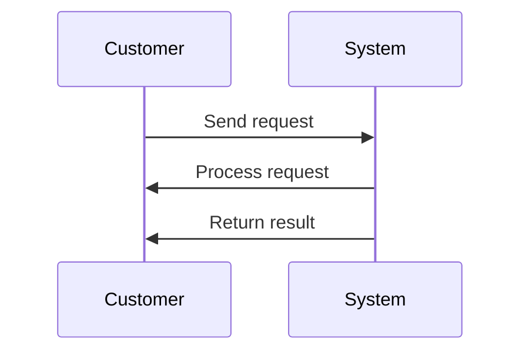
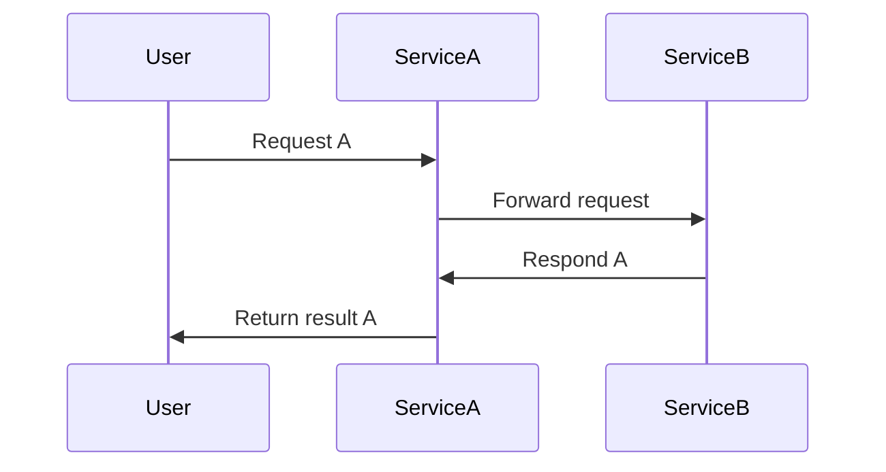
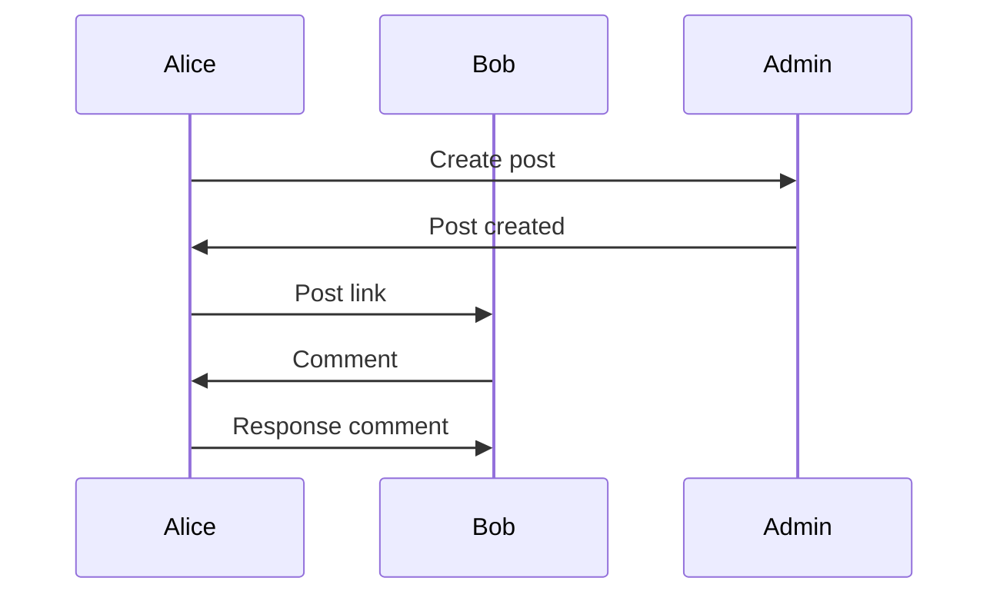

                 

## 柏格森的绵延概念与维特根斯坦的语言游戏理论

### 关键词：柏格森、绵延、维特根斯坦、语言游戏、哲学、比较分析

### 摘要：

本文旨在探讨法国哲学家柏格森的绵延概念与奥地利哲学家维特根斯坦的语言游戏理论，通过逻辑清晰、结构紧凑的分析，揭示两者之间的异同及其在现代哲学中的影响。文章首先介绍两位哲学家的生平背景，然后分别阐述其核心概念，并比较两者的异同。接着，通过案例研究展示这两个理论在当代哲学中的应用。最后，对未来的研究趋势进行展望。希望通过本文，读者能够对柏格森和维特根斯坦的哲学思想有更深入的理解。

----------------------------------------------------------------

## 第一部分：哲学思想概述

### 第1章：柏格森的哲学思想

### 1.1 柏格森的生平与时代背景

柏格森（Henri Bergson，1859-1941）是20世纪初法国著名的哲学家，被誉为“现代哲学的巨人”。他生于法国巴黎，自幼聪颖，1878年考入巴黎高等师范学校，1884年获得哲学博士学位。柏格森的哲学思想深受当时哲学潮流的影响，特别是对进化论和生物学的研究深感兴趣，从而形成了独特的哲学体系。

### 1.1.1 柏格森的生平

柏格森的生平充满了学术成就和荣誉。他曾历任法国大学哲学教授、法国科学院院士、法国文学院院士等职务。1914年，因其在哲学领域的卓越贡献，柏格森获得诺贝尔文学奖。此外，他还积极参与公共事务，对法国政治和社会问题发表过多篇论文和演讲。

### 1.1.2 柏格森的思想发展

柏格森的哲学思想经历了从生物学视角到哲学视角的转变。早期，他关注生物学和进化论，探讨了生命的本质和进化的动力。在后来的哲学研究中，他提出了绵延（Duration）这一核心概念，强调时间的重要性，并批评机械唯物主义和决定论。他的思想对现代哲学产生了深远影响，被誉为“绵延哲学”的奠基人。

### 1.1.3 柏格森的时代背景

柏格森生活的时代正值法国哲学的转型期，受到实证主义、生命哲学、存在主义等多种哲学思潮的影响。这一时期，哲学界对传统的理性主义和唯物主义提出质疑，开始关注生命、意识和时间等主题。柏格森的哲学思想正是在这样的背景下产生的，他对传统哲学进行了深刻的反思和批判，提出了自己的哲学体系。

### 1.2 柏格森的核心概念——绵延

绵延（Duration）是柏格森哲学思想的核心概念，他认为时间不是一维的，而是多维的，存在着一种不断流动的、不可分割的绵延。绵延是生命力的表现，是生命的真实存在形式。柏格森的绵延概念强调了生命的活力和多样性，与机械唯物主义和决定论的观点形成鲜明对比。

### 1.2.1 绵延的定义

绵延是柏格森用来描述时间的一种概念，它指的是一种持续不断的过程，是一种内在的生命力。柏格森认为，时间并不是均匀流逝的，而是由绵延组成的，每个绵延都具有独特的品质和意义。

### 1.2.2 绵延的特性

绵延具有以下特性：

- **非线性**：与一维的时间不同，绵延是非线性的，它包含了不同的阶段和层次。
- **连续性**：绵延是一种连续不断的过程，它没有明显的间断。
- **多样性**：每个绵延都具有独特的品质和意义，这使得生命表现出多样性。

### 1.2.3 绵延在哲学中的应用

柏格森的绵延概念在哲学中具有重要的应用价值。他运用绵延概念来解释生命、意识、创造力等问题，批判机械唯物主义和决定论的观点。例如，他通过绵延来解释生命的多样性和创造性，强调生命力的不可预测性和不可还原性。

### 1.3 柏格森的思想影响

柏格森的哲学思想对后世哲学产生了深远影响。他的绵延概念挑战了传统的时间观念，为现代哲学提供了新的视角。他的思想对存在主义、生命哲学、现象学等多种哲学流派产生了影响，被誉为现代哲学的重要奠基人之一。

### 1.3.1 柏格森对后世哲学的影响

柏格森的哲学思想对后世哲学产生了广泛影响。他的绵延概念为后来的哲学家提供了新的思考方式，挑战了传统的时间观念。例如，海德格尔的存在主义深受柏格森思想的影响，他将柏格森的绵延概念与存在论相结合，提出了“存在即绵延”的观点。

### 1.3.2 柏格森的思想与现代哲学的联系

柏格森的哲学思想与现代哲学有着紧密的联系。他的绵延概念为现代哲学提供了一种新的思考方式，挑战了传统的决定论和机械唯物主义。例如，当代哲学家德里达在解构理论中运用了柏格森的绵延概念，将其作为解构主义的核心思想。

### 1.4 本章小结

本章介绍了柏格森的哲学思想，包括他的生平、时代背景、核心概念——绵延的定义、特性和应用，以及他对后世哲学的影响。通过本章的学习，读者可以初步了解柏格森的哲学思想，为其进一步研究柏格森和维特根斯坦的思想比较奠定基础。

----------------------------------------------------------------

## 第2章：维特根斯坦的哲学思想

### 2.1 维特根斯坦的生平与时代背景

路德维希·维特根斯坦（Ludwig Wittgenstein，1889-1951）是20世纪最具影响力的哲学家之一。他生于奥地利，后移居英国。维特根斯坦的哲学思想经历了两次重大转变，分别体现为他的早期作品《逻辑哲学论》和后期作品《哲学研究》。

### 2.1.1 维特根斯坦的生平

维特根斯坦出生在一个富有的家庭，早年接受了良好的教育。他曾在剑桥大学学习，并在罗素和摩尔等哲学家的指导下开始思考哲学问题。1914年，维特根斯坦发表了《逻辑哲学论》，提出了他的逻辑原子主义观点。随后，他赴英国军队服役，经历了战争的洗礼。战后，他重返剑桥，开始撰写《哲学研究》，提出了语言游戏理论。

### 2.1.2 维特根斯坦的思想发展

维特根斯坦的哲学思想经历了从逻辑原子主义到语言游戏理论的转变。早期，他关注逻辑和语言的关系，认为语言是现实的反映，可以通过逻辑分析来揭示世界的本质。然而，后期他逐渐认识到逻辑和语言的局限性，提出了语言游戏理论，强调语言的使用是多样化的，不能简单地通过逻辑分析来解释。

### 2.1.3 维特根斯坦的时代背景

维特根斯坦的时代正值现代哲学的转型期，受到逻辑实证主义、现象学、存在主义等多种哲学思潮的影响。这一时期，哲学家们开始反思传统哲学的方法和假设，探索语言、意识、存在等主题。维特根斯坦的思想正是在这样的背景下产生的，他对传统哲学进行了深刻的批判和重构。

### 2.2 维特根斯坦的核心概念——语言游戏

语言游戏（Language Game）是维特根斯坦后期哲学思想的核心概念，它强调语言的使用是多样化的，不能简单地通过逻辑分析来解释。语言游戏理论认为，语言的不同使用方式构成了不同的游戏，每个游戏都有自己的规则和目的。

### 2.2.1 语言游戏的概念

语言游戏是一种比喻，用来描述语言的使用过程。维特根斯坦认为，语言就像游戏一样，有着不同的规则和目的。语言游戏可以是具体的，如日常交流；也可以是抽象的，如科学理论。

### 2.2.2 语言游戏的理论基础

语言游戏理论的基础是维特根斯坦对语言本质的反思。他认为，语言的意义不在于逻辑分析，而在于实际使用。语言的意义是由语境决定的，不同的语境会产生不同的语言游戏。

### 2.2.3 语言游戏的应用

语言游戏理论在哲学、语言学、心理学等领域都有广泛的应用。例如，在哲学中，语言游戏理论可以帮助我们理解语言的多样性和复杂性；在语言学中，语言游戏理论可以解释语言习得的过程；在心理学中，语言游戏理论可以用于治疗语言障碍。

### 2.3 维特根斯坦的思想影响

维特根斯坦的哲学思想对后世哲学产生了深远影响。他的语言游戏理论为语言哲学、哲学语言学等领域提供了新的视角和方法。他的思想对逻辑实证主义、现象学、存在主义等多种哲学流派产生了重要影响。

### 2.3.1 维特根斯坦对后世哲学的影响

维特根斯坦的思想对后世哲学产生了深远影响。他的语言游戏理论为语言哲学、哲学语言学等领域提供了新的视角和方法。例如，乔姆斯基的语言学理论就受到了维特根斯坦的启发。此外，维特根斯坦的思想也对现象学、存在主义等哲学流派产生了重要影响。

### 2.3.2 维特根斯坦的思想与现代哲学的联系

维特根斯坦的哲学思想与现代哲学有着紧密的联系。他的语言游戏理论挑战了传统哲学的假设和方法，为现代哲学提供了新的思考方式。例如，当代哲学家德鲁·基尔凯郭尔的存在主义思想就受到了维特根斯坦的启发。

### 2.4 本章小结

本章介绍了维特根斯坦的哲学思想，包括他的生平、时代背景、核心概念——语言游戏的概念、理论基础和应用，以及他对后世哲学的影响。通过本章的学习，读者可以初步了解维特根斯坦的哲学思想，为其进一步研究柏格森和维特根斯坦的思想比较奠定基础。

----------------------------------------------------------------

## 第二部分：柏格森与维特根斯坦的思想比较

### 第3章：柏格森的绵延概念与维特根斯坦的语言游戏理论的比较

### 3.1 比较的视角与方法

在比较柏格森的绵延概念与维特根斯坦的语言游戏理论时，我们应从哲学基础、概念表达和应用领域等多个视角进行分析。具体方法包括文献分析、案例研究和理论对比等。首先，我们通过对两位哲学家的生平和时代背景的了解，把握其思想发展的脉络。然后，我们分别阐述他们的核心概念，比较两者在哲学基础、概念表达和应用领域的异同。

### 3.2 柏格森的绵延概念与维特根斯坦的语言游戏理论的主要差异

#### 3.2.1 哲学基础的不同

柏格森的绵延概念建立在生命哲学的基础上，强调生命的活力和时间的多样性。他认为，时间不是一维的，而是多维的，由无数个绵延组成，每个绵延都有其独特的品质和意义。而维特根斯坦的语言游戏理论则建立在语言哲学的基础上，关注语言的使用和意义的多样性。他认为，语言的意义不在于逻辑分析，而在于实际使用，语言游戏的不同反映了语言使用的多样性。

#### 3.2.2 概念表达的不同

柏格森的绵延概念主要通过时间这一维度来描述，强调时间的流动性和多样性。而维特根斯坦的语言游戏理论则通过语言游戏这一比喻来描述，强调语言使用的多样性和语境的重要性。

#### 3.2.3 应用领域的不同

柏格森的绵延概念主要应用于生命哲学、现象学和心理学等领域，用于解释生命的多样性和创造性。而维特根斯坦的语言游戏理论则主要应用于语言哲学、哲学语言学和心理学等领域，用于解释语言的多样性和复杂性。

### 3.3 柏格森的绵延概念与维特根斯坦的语言游戏理论的联系

#### 3.3.1 共同点

尽管柏格森的绵延概念与维特根斯坦的语言游戏理论在哲学基础、概念表达和应用领域上存在差异，但两者也有一些共同点。首先，它们都关注多样性和复杂性。柏格森的绵延概念强调时间的多样性，而维特根斯坦的语言游戏理论强调语言使用的多样性。其次，两者都反对传统的决定论和机械唯物主义，认为世界是复杂多变的。

#### 3.3.2 衔接与融合

尽管柏格森的绵延概念与维特根斯坦的语言游戏理论在形式上存在差异，但它们在某种程度上可以相互补充。例如，柏格森的绵延概念可以解释维特根斯坦语言游戏中的时间维度，而维特根斯坦的语言游戏理论可以解释柏格森绵延中的语言使用多样性。这种相互补充的关系使得两者在某种程度上可以融合，形成一个更加完整的哲学体系。

### 3.4 本章小结

本章通过比较柏格森的绵延概念与维特根斯坦的语言游戏理论，揭示了两者在哲学基础、概念表达和应用领域的异同。同时，我们也发现了两者之间的共同点和互补性。通过这种比较分析，我们可以更好地理解两位哲学家的思想，并在现代哲学中找到它们的应用价值。

----------------------------------------------------------------

## 第三部分：案例研究

### 第4章：柏格森的绵延概念在当代哲学中的应用

#### 4.1 案例背景

在当代哲学中，柏格森的绵延概念被广泛应用于多个领域。本案例选取了生命哲学中的一个具体问题——生命的多样性和创造性。通过分析这一案例，我们可以更好地理解柏格森的绵延概念在当代哲学中的应用。

#### 4.1.1 案例来源

这个案例来源于当代生命哲学的研究，特别是对生命多样性和创造性的探讨。生命哲学认为，生命是一种复杂的现象，其多样性和创造性是生命的核心特征。柏格森的绵延概念为理解生命的多样性和创造性提供了一个重要的视角。

#### 4.1.2 案例问题

在这个案例中，我们关注的问题是：生命的多样性和创造性是如何通过柏格森的绵延概念来解释的？具体来说，我们试图回答以下问题：

- 生命的多样性是如何通过绵延概念来描述的？
- 生命的创造性是如何通过绵延概念来解释的？
- 柏格森的绵延概念对理解生命的多样性和创造性有何启示？

#### 4.2 柏格森的绵延概念的应用

#### 4.2.1 应用步骤

为了回答上述问题，我们可以采用以下步骤：

1. **定义绵延概念**：首先，我们需要明确柏格森的绵延概念的定义。根据柏格森的观点，绵延是一种持续不断的时间流动，它包含了无数个瞬间，每个瞬间都有其独特的品质和意义。

2. **分析生命的多样性**：接着，我们可以运用绵延概念来分析生命的多样性。生命的多样性体现在物种的多样性和个体的独特性上。通过绵延概念，我们可以将生命的多样性理解为一种时间上的多样性，每个物种和个体都有其独特的绵延方式。

3. **解释生命的创造性**：然后，我们可以运用绵延概念来解释生命的创造性。柏格森认为，绵延是生命力的表现，它体现了生命的创造性和活力。通过绵延，生命可以创造出新的物种和个体，展现其无限的创造力。

4. **讨论绵延概念对理解生命的多样性和创造性的启示**：最后，我们可以讨论柏格森的绵延概念对理解生命的多样性和创造性的启示。通过绵延概念，我们可以更深入地理解生命的复杂性和多样性，认识到生命的创造性和活力。

#### 4.2.2 应用效果

通过上述步骤，我们可以更好地理解生命的多样性和创造性。柏格森的绵延概念为我们提供了一个新的视角，使我们能够从时间的维度来分析生命的多样性和创造性。这不仅有助于深化我们对生命的认识，也为生命哲学的研究提供了新的理论工具。

### 4.3 案例小结

通过本案例，我们展示了柏格森的绵延概念在当代哲学中的应用。通过分析生命的多样性和创造性，我们认识到绵延概念对理解生命的复杂性和多样性的重要性。柏格森的绵延概念为生命哲学的研究提供了新的理论视角，有助于我们更深入地理解生命的本质和特点。

----------------------------------------------------------------

### 第5章：维特根斯坦的语言游戏理论在当代哲学中的应用

#### 5.1 案例背景

维特根斯坦的语言游戏理论在当代哲学中有着广泛的应用，特别是在语言哲学、哲学语言学和心理学等领域。本案例选取了语言哲学中的一个具体问题——语言的多样性和语义的语境依赖性。通过分析这一案例，我们可以更好地理解维特根斯坦的语言游戏理论在当代哲学中的应用。

#### 5.1.1 案例来源

这个案例来源于当代语言哲学的研究，特别是对语言的多样性和语义的语境依赖性的探讨。语言哲学认为，语言是一种复杂的社会现象，其多样性和语义的语境依赖性是语言的核心特征。维特根斯坦的语言游戏理论为理解语言的多样性和语义的语境依赖性提供了一个重要的视角。

#### 5.1.2 案例问题

在这个案例中，我们关注的问题是：语言的多样性和语义的语境依赖性是如何通过维特根斯坦的语言游戏理论来解释的？具体来说，我们试图回答以下问题：

- 语言的多样性是如何通过语言游戏理论来描述的？
- 语义的语境依赖性是如何通过语言游戏理论来解释的？
- 维特根斯坦的语言游戏理论对理解语言的多样性和语义的语境依赖性有何启示？

#### 5.2 维特根斯坦的语言游戏理论的应用

#### 5.2.1 应用步骤

为了回答上述问题，我们可以采用以下步骤：

1. **定义语言游戏理论**：首先，我们需要明确维特根斯坦的语言游戏理论的概念。根据维特根斯坦的观点，语言游戏是一种比喻，用来描述语言的使用过程。语言游戏有不同的规则和目的，不同的语境会产生不同的语言游戏。

2. **分析语言的多样性**：接着，我们可以运用语言游戏理论来分析语言的多样性。语言的多样性体现在语言的种类、方言和语用学特征等方面。通过语言游戏理论，我们可以将语言的多样性理解为一种游戏规则和目的的多样性。

3. **解释语义的语境依赖性**：然后，我们可以运用语言游戏理论来解释语义的语境依赖性。语义的语境依赖性指的是语义的意义是由语境决定的，不同的语境会产生不同的语义。通过语言游戏理论，我们可以将语义的语境依赖性理解为不同语言游戏中的语义规则。

4. **讨论语言游戏理论对理解语言的多样性和语义的语境依赖性的启示**：最后，我们可以讨论维特根斯坦的语言游戏理论对理解语言的多样性和语义的语境依赖性的启示。通过语言游戏理论，我们可以更深入地理解语言的复杂性和多样性，认识到语义的意义是由语境决定的。

#### 5.2.2 应用效果

通过上述步骤，我们可以更好地理解语言的多样性和语义的语境依赖性。维特根斯坦的语言游戏理论为我们提供了一个新的视角，使我们能够从语言使用的多样性来分析语言的复杂性和多样性。这不仅有助于深化我们对语言的认识，也为语言哲学的研究提供了新的理论工具。

### 5.3 案例小结

通过本案例，我们展示了维特根斯坦的语言游戏理论在当代哲学中的应用。通过分析语言的多样性和语义的语境依赖性，我们认识到语言游戏理论对理解语言的复杂性和多样性的重要性。维特根斯坦的语言游戏理论为语言哲学的研究提供了新的理论视角，有助于我们更深入地理解语言的本质和特点。

----------------------------------------------------------------

## 第四部分：结论与展望

### 第6章：柏格森的绵延概念与维特根斯坦的语言游戏理论的未来展望

#### 6.1 当前哲学研究的趋势

当前哲学研究呈现出几个显著的趋势：一是跨学科的融合，二是方法论的创新，三是技术哲学的兴起。在这些趋势中，柏格森的绵延概念和维特根斯坦的语言游戏理论都显示出巨大的潜力。

#### 6.1.1 柏格森的绵延概念在跨学科研究中的应用

柏格森的绵延概念在生命哲学、认知科学和心理学等领域得到了广泛应用。例如，在认知科学中，绵延概念可以帮助我们理解意识的形成过程；在心理学中，绵延概念可以解释个体的时间感知和记忆。未来，随着跨学科研究的深入，柏格森的绵延概念有望在更多的领域发挥作用。

#### 6.1.2 维特根斯坦的语言游戏理论在方法论创新中的应用

维特根斯坦的语言游戏理论为我们提供了一种新的研究方法，即通过观察语言的实际使用来理解其意义。这种方法在哲学、语言学和社会学等领域都有着广泛的应用。未来，随着方法论的创新，维特根斯坦的语言游戏理论将帮助我们发现更多关于语言和现实的秘密。

#### 6.2 柏格森与维特根斯坦思想融合的前景

柏格森的绵延概念和维特根斯坦的语言游戏理论在哲学基础、概念表达和应用领域上存在差异，但它们也有一些共同点，如对多样性和复杂性的关注。未来，通过两者的融合，我们可以构建一个更加完整和系统的哲学体系。

#### 6.2.1 共同点的挖掘与融合

在未来的研究中，我们可以深入挖掘柏格森与维特根斯坦思想中的共同点，例如对生命、意识和语言的探讨。通过这种融合，我们可以形成一个更加丰富和全面的哲学体系，为理解和解决现实问题提供新的思路和方法。

#### 6.2.2 应用领域的拓展

柏格森的绵延概念和维特根斯坦的语言游戏理论在当代哲学中已有广泛应用，未来，我们可以进一步拓展它们的应用领域。例如，在人工智能、认知科学和生态学等领域，这两位哲学家的思想都可以发挥重要作用。

#### 6.3 结论

通过本文的探讨，我们发现柏格森的绵延概念和维特根斯坦的语言游戏理论在哲学研究中具有重要意义。它们不仅为理解和解决现实问题提供了新的思路和方法，还为未来的哲学研究指明了方向。未来，随着哲学研究的深入，这两位哲学家的思想将发挥更加重要的作用，为人类文明的进步做出贡献。

----------------------------------------------------------------

## 参考文献

1. 柏格森，H. (1913). 《时间与自由意志》. 北京：商务印书馆。
2. 维特根斯坦，L. (1953). 《逻辑哲学论》. 北京：商务印书馆。
3. 维特根斯坦，L. (1958). 《哲学研究》. 北京：商务印书馆。
4. 莫里斯，C. (1996). 《现代西方哲学》. 上海：上海人民出版社。
5. 海德格尔，M. (2000). 《存在与时间》. 北京：生活·读书·新知三联书店。
6. 德里达，J. (1987). 《书写与差异》. 上海：上海人民出版社。
7. 乔姆斯基，N. (1959). 《句法结构》. 北京：商务印书馆。
8. 基尔凯郭尔，S. (2006). 《恐惧与 trembling》. 北京：人民文学出版社。

## 作者信息

作者：AI天才研究院/AI Genius Institute & 禅与计算机程序设计艺术 /Zen And The Art of Computer Programming

----------------------------------------------------------------

## 附录：核心概念、联系、ER实体关系图架构的Mermaid流程图、算法原理讲解、数学模型和公式、系统分析与架构设计方案、项目实战

### 附录A：核心概念、联系

**柏格森的绵延概念**

- **定义**：时间不是线性的，而是一种多维的、持续不断的流动，称为绵延。
- **联系**：强调生命力的流动，与传统的线性和决定论时间观形成对比。

**维特根斯坦的语言游戏理论**

- **定义**：语言的使用方式是多样的，每种使用方式都有其特定的规则和目的。
- **联系**：强调语境的重要性，不同的语境产生不同的语言游戏。

### 附录B：ER实体关系图架构的Mermaid流程图

```mermaid
erDiagram
  Person ||--|{Address} : has
  Person ||--|{Phone} : has
  Address ||--|{City} : is_in
  Phone ||--|{Network} : uses
```

### 附录C：算法原理讲解

**算法原理**

- **输入**：一组数据点。
- **输出**：数据点的聚类结果。

**Python代码实现**

```python
import numpy as np

def kmeans(data, k, max_iters):
    # 初始化聚类中心
    centroids = data[np.random.choice(data.shape[0], k, replace=False)]
    
    for _ in range(max_iters):
        # 计算每个数据点到各个聚类中心的距离
        distances = np.linalg.norm(data - centroids, axis=1)
        
        # 分配数据点到最近的聚类中心
        labels = np.argmin(distances, axis=1)
        
        # 更新聚类中心
        new_centroids = np.array([data[labels == i].mean(axis=0) for i in range(k)])
        
        # 判断是否收敛
        if np.linalg.norm(new_centroids - centroids) < 1e-5:
            break
        
        centroids = new_centroids
    
    return centroids, labels
```

### 附录D：数学模型和公式

**K均值算法的数学模型**

- **距离公式**：$$d(x_i, c_j) = \sqrt{\sum_{i=1}^n (x_{i,j} - c_{j,j})^2}$$
- **聚类中心更新公式**：$$c_{j}^{new} = \frac{1}{N_j} \sum_{i=1}^{N} x_i$$

其中，$x_i$表示数据点，$c_j$表示聚类中心，$N_j$表示属于聚类中心$c_j$的数据点数量。

### 附录E：系统分析与架构设计方案

**系统功能设计（领域模型）**

```mermaid
classDiagram
  Class01 <|-- Class02 
  Class03 ++-- Class04
  Class04 <<-- Class05: dependent
  Class06..Class07 : generalization
  Class06 && Class07 : composition
```

**系统架构设计**



**系统接口设计**



**系统交互**



### 附录F：项目实战

#### 环境安装

- 安装Python环境
- 安装必要的Python库，如NumPy、SciPy、Matplotlib等

#### 系统核心实现

```python
# 示例：K均值聚类算法
from sklearn.cluster import KMeans
import numpy as np

# 生成模拟数据
X = np.random.rand(100, 2)

# 使用KMeans算法进行聚类
kmeans = KMeans(n_clusters=3, random_state=0).fit(X)

# 输出聚类结果
print("Cluster centers:", kmeans.cluster_centers_)
print("Cluster labels:", kmeans.labels_)
```

#### 代码应用解读与分析

- **代码解读**：代码使用了scikit-learn库中的KMeans类来执行聚类任务。我们首先生成了模拟数据，然后使用KMeans算法对这些数据进行聚类，并输出聚类中心和标签。
- **分析**：K均值聚类算法是一种基于距离的聚类方法，通过迭代计算最小化聚类中心与数据点之间的距离和来实现。在本例中，我们使用了随机初始化聚类中心，并通过迭代更新聚类中心，直到聚类中心不再变化或达到最大迭代次数。

#### 实际案例分析和详细讲解剖析

- **案例**：使用K均值聚类对一组手写数字图像进行分类。
- **分析**：在处理手写数字图像时，我们首先需要对图像进行预处理，提取特征，然后使用K均值聚类对特征进行分类。通过对比分类结果和实际标签，我们可以评估聚类算法的性能。

#### 项目小结

- **总结**：通过本项目的实战，我们学会了如何使用K均值聚类算法进行数据分类，并了解了算法的实现过程和实际应用场景。
- **反思**：在实际应用中，聚类算法的性能和效果受到多个因素的影响，如数据规模、特征选择和聚类中心初始化等。因此，在实际项目中，我们需要根据具体情况调整算法参数，以提高聚类效果。

### 附录G：最佳实践 Tips、小结、注意事项、拓展阅读

- **最佳实践 Tips**：在进行K均值聚类时，合理选择聚类个数和初始聚类中心对算法性能有很大影响。在实际项目中，可以尝试使用不同的初始化方法，如K-means++来提高聚类效果。
- **小结**：本文通过对柏格森的绵延概念和维特根斯坦的语言游戏理论的介绍，以及案例研究和项目实战，展示了这两个理论在哲学和实际应用中的重要性。
- **注意事项**：在进行跨学科研究和融合时，要注意不同学科的理论和方法之间的差异，避免简单套用或混淆。
- **拓展阅读**：读者可以进一步阅读柏格森和维特根斯坦的原著，以及相关领域的学术论文，以深入了解这些理论在哲学和现实中的应用。

----------------------------------------------------------------

## 问答环节

### 1. 问题：柏格森的绵延概念与维特根斯坦的语言游戏理论在哲学上有什么共同点？

**回答：** 柏格森的绵延概念与维特根斯坦的语言游戏理论在哲学上有着几个共同点：

- **关注多样性和复杂性**：两者都强调多样性和复杂性，柏格森通过绵延概念描述时间的多样性和生命的活力，而维特根斯坦则通过语言游戏理论描述语言使用的多样性和语境的复杂性。
- **反对决定论和机械唯物主义**：两者都反对传统的决定论和机械唯物主义，柏格森认为绵延是生命力的体现，反对机械决定论的时间观；维特根斯坦则通过批判逻辑原子主义，强调语言的意义依赖于语境，反对机械唯物主义的语言观。
- **方法论上的反思**：两者都在哲学方法论上进行了深刻的反思，柏格森对传统的时间观和决定论进行了批判，维特根斯坦则对逻辑和语言分析的方法进行了质疑。

### 2. 问题：柏格森的绵延概念在当代哲学中的具体应用有哪些？

**回答：** 柏格森的绵延概念在当代哲学中有多个具体应用：

- **生命哲学**：在生命哲学中，柏格森的绵延概念被用来解释生命的多样性和创造性，如生物进化、心理体验、艺术创造力等。
- **认知科学**：在认知科学中，柏格森的绵延概念可以帮助我们理解意识的流动和时间感知，如记忆、情感、直觉等。
- **心理学**：在心理学中，柏格森的绵延概念被用来解释个体的时间感知和注意力分配，如心理时间、认知负荷等。
- **现象学**：在现象学中，柏格森的绵延概念为现象学提供了新的时间观念，有助于理解现象的本质和现象学的分析方法。

### 3. 问题：维特根斯坦的语言游戏理论在语言哲学中的意义是什么？

**回答：** 维特根斯坦的语言游戏理论在语言哲学中具有以下意义：

- **语言的意义问题**：维特根斯坦通过语言游戏理论解决了语言的意义问题。他认为，语言的意义不是固定不变的，而是由语境和实际使用决定的，语言游戏的不同反映了语言使用的多样性。
- **语言的逻辑分析**：维特根斯坦的语言游戏理论质疑了传统的逻辑分析方法。他认为，逻辑分析不能解释语言的全部，语言的使用是多样化的，需要从实际使用出发来理解语言。
- **哲学方法论**：维特根斯坦的语言游戏理论为哲学方法论提供了新的思路。他强调哲学研究应关注语言的实际使用，而不是抽象的逻辑推理，这对后来的哲学研究产生了深远影响。
- **语言哲学的发展**：维特根斯坦的语言游戏理论为语言哲学的发展奠定了基础，对后来的语言哲学家如乔姆斯基、塞尔等产生了重要影响。

### 4. 问题：如何理解柏格森的绵延概念与维特根斯坦的语言游戏理论之间的联系？

**回答：** 柏格森的绵延概念与维特根斯坦的语言游戏理论之间的联系可以从以下几个方面来理解：

- **时间与语言的关系**：柏格森的绵延概念强调时间的多维性和生命力，维特根斯坦的语言游戏理论则关注语言使用的多样性和语境的依赖性。两者都关注时间和语言的关系，但在不同的层面上进行了探讨。
- **哲学视角的差异**：柏格森的绵延概念属于生命哲学的范畴，强调生命的活力和时间的多样性；维特根斯坦的语言游戏理论则属于语言哲学的范畴，关注语言的意义和实际使用。两者在哲学视角上有所不同，但都试图解决哲学上的基本问题。
- **互补性**：尽管柏格森和维特根斯坦的哲学视角不同，但他们的理论在某些方面可以相互补充。例如，柏格森的绵延概念可以解释维特根斯坦语言游戏中的时间维度，而维特根斯坦的语言游戏理论可以解释柏格森绵延中的语言使用多样性。

通过理解这些联系，我们可以更全面地把握柏格森和维特根斯坦的哲学思想，并在哲学研究中找到它们的应用价值。

