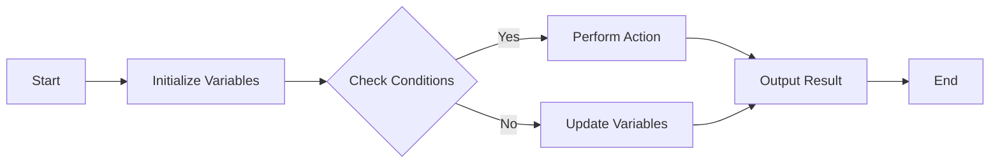
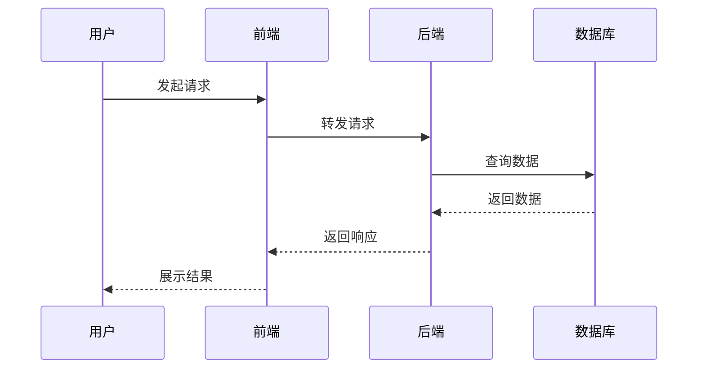

                 

# 柏格森的绵延概念与维特根斯坦的语言规则理论

## 关键词
- 绵延
- 语言规则
- 哲学
- 柏格森
- 维特根斯坦

## 摘要
本文探讨了柏格森的绵延概念与维特根斯坦的语言规则理论的联系与差异。通过深入分析两者的核心思想，我们试图揭示这两种哲学理论的内在逻辑，并探讨它们在现代社会中的意义和应用。本文分为三个主要部分：首先，介绍柏格森的绵延概念和维特根斯坦的语言规则理论的基本概念及其哲学背景；其次，比较两者之间的相似性与差异性，并通过具体的例子进行分析；最后，讨论这两种理论在现代哲学领域中的影响和意义，并给出一些实际应用的场景。

## 第一部分：柏格森的绵延概念

### 第1章：柏格森哲学的背景与绵延概念

#### 1.1 柏格森哲学的起源与发展

柏格森（Henri Bergson）是20世纪法国著名的哲学家，他的哲学思想对后来的哲学家和科学家产生了深远的影响。柏格森出生于法国巴黎，他的早期作品主要探讨了心理学和生物学等领域的问题，后来逐渐转向哲学领域。

柏格森的哲学思想以“生命活力”（élan vital）为核心，他认为生命是一种内在的、不断流动的活力，这种活力是所有生命现象的根源。柏格森反对机械唯物主义，主张生命是超越物质世界的，它具有一种内在的创造力。

#### 1.2 柏格森哲学的核心思想

柏格森的哲学思想主要包括以下几个方面：

1. **绵延（Durée）**：柏格森认为时间并不是一种线性的、可以度量的物质，而是一种内在的、连续的过程。他把这个过程称为“绵延”，强调时间的流动性和不可度量性。
2. **生命活力（Élan vital）**：柏格森认为生命活力是生命的内在动力，它推动着生命向前发展。生命活力不是一种物质力量，而是一种精神力量，它超越了物质世界的限制。
3. **直觉（Intuition）**：柏格森强调直觉在认识世界中的重要性。他认为直觉能够让我们直接感知到世界的本质，而理性思维则往往局限于表面的现象。

#### 1.3 绵延概念的定义与特点

柏格森的绵延概念是他哲学思想的核心之一。他认为时间并不是一个客观的存在，而是一种内在的、连续的过程。这种过程被称为“绵延”，它具有以下特点：

1. **不可度量性**：绵延是一种内在的过程，无法用物理量进行度量。
2. **连续性**：绵延是一个连续的过程，没有中断和跳跃。
3. **不可逆性**：时间是不可逆的，过去的时间无法回到现在。
4. **主观性**：绵延是主观的时间体验，每个人的绵延都是独特的。

### 第2章：绵延概念的哲学内涵

#### 2.1 绵延与时间的关系

柏格森认为时间与绵延是密切相关的。时间是我们感知绵延的一种方式，但它并不是绵延本身。时间可以被量化、分割和比较，而绵延则是一种内在的、连续的过程，它无法被分割或量化。

柏格森提出了“直觉时间”（temps intuitif）和“科学时间”（temps scientifique）的概念。直觉时间是人们对时间的直接体验，是一种连续的、流动的感觉。科学时间则是人们通过物理测量得到的时间，它是一种离散的、可度量的时间。

#### 2.2 绵延与生命的联系

柏格森认为绵延是生命的本质特征。生命是一种内在的、不断流动的活力，它推动着生命向前发展。绵延是生命的内在过程，它体现了生命的创造力和无限可能性。

柏格森指出，生命的创造力和无限可能性来自于绵延。绵延是一种内在的过程，它不断地生成新的东西，使得生命能够不断发展和进化。因此，绵延可以被视为生命的源泉。

#### 2.3 绵延与社会文化的影响

柏格森的绵延概念对社会科学和文化产生了深远的影响。他提出了“文化绵延”（époque）的概念，认为每个时代都有其独特的文化绵延，这种文化绵延影响了人们的价值观、生活方式和社会结构。

柏格森认为，社会文化的发展是一个不断流动的过程，它受到了绵延的影响。不同的文化绵延会导致不同的社会现象和文化特征。例如，现代社会的高度发达的技术和文化发展，就是受到了现代文化绵延的影响。

### 第3章：柏格森的绵延概念与维特根斯坦的比较

#### 3.1 柏格森的绵延概念与维特根斯坦的语言规则理论的相似性

尽管柏格森和维特根斯坦的哲学观点有所不同，但他们的思想中也有一些相似之处。首先，他们都关注时间的本质和人类的认知方式。其次，他们都强调直觉和内在体验的重要性。

柏格森的绵延概念与维特根斯坦的语言规则理论在时间观上有着相似之处。维特根斯坦认为时间是一种内在的过程，它不是一种物理现象，而是一种心理体验。维特根斯坦的语言规则理论强调了语言和现实之间的关系，他认为语言是理解世界的工具，但语言本身并不是现实。

#### 3.2 柏格森的绵延概念与维特根斯坦的语言规则理论的不同点

尽管柏格森和维特根斯坦的哲学观点有相似之处，但他们也有很大的不同。首先，柏格森强调生命的内在活力，而维特根斯坦则更关注语言和逻辑。其次，柏格森的绵延概念是一种内在的过程，而维特根斯坦的语言规则理论是一种外在的规则体系。

柏格森的绵延概念是一种内在的、连续的过程，它体现了生命的创造力和无限可能性。而维特根斯坦的语言规则理论则是一种外在的、规范性的规则，它用于指导人们的语言使用和行为。

#### 3.3 比较分析的方法与结论

为了比较柏格森的绵延概念与维特根斯坦的语言规则理论，我们可以采用以下方法：

1. **哲学分析**：通过对两者的哲学观点进行深入分析，找出它们之间的相似性和不同点。
2. **历史背景**：了解两者产生的历史背景和哲学环境，从而更好地理解它们的哲学思想。
3. **案例分析**：通过具体案例，分析两者在实际应用中的差异和影响。

通过比较分析，我们可以得出以下结论：

1. **相似性**：柏格森的绵延概念与维特根斯坦的语言规则理论在时间观和认知方式上有相似之处。
2. **不同点**：柏格森的绵延概念强调内在的生命活力，而维特根斯坦的语言规则理论强调外在的语言规范。
3. **意义**：两者的哲学观点对现代哲学和社会科学产生了重要影响，为我们理解时间和语言提供了新的视角。

## 第二部分：维特根斯坦的语言规则理论

### 第4章：维特根斯坦哲学的背景与语言规则理论

#### 4.1 维特根斯坦的哲学发展历程

路德维希·维特根斯坦（Ludwig Wittgenstein）是20世纪最伟大的哲学家之一，他的哲学观点对现代哲学产生了深远的影响。维特根斯坦出生于奥地利，他在哲学领域的成就主要分为两个阶段：早期和晚期。

早期维特根斯坦的哲学观点主要反映在《逻辑哲学论》（Tractatus Logico-Philosophicus）中。这本书提出了一种逻辑原子主义观点，认为世界由一系列事实构成，这些事实可以通过逻辑命题来描述。

晚期维特根斯坦的哲学观点则反映在《哲学研究》（Philosophical Investigations）中。这本书批判了逻辑原子主义，提出了语言游戏理论，强调语言的使用与特定情境之间的关系。

#### 4.2 语言规则理论的基本概念

维特根斯坦的语言规则理论是他对语言本质的一种探讨。他认为语言是一种工具，用于沟通和表达思想。语言规则是人们使用语言的基本规范，它们决定了语言的含义和用法。

维特根斯坦提出了“语言游戏”（language game）的概念，认为语言的使用是一个动态的过程，它取决于具体的情境和目的。语言游戏包括三个基本要素：语言、规则和情境。

#### 4.3 语言规则理论的应用与影响

维特根斯坦的语言规则理论对现代哲学、语言学、人工智能等领域产生了重要影响。他的观点为理解语言的本质和功能提供了新的视角，推动了这些领域的研究和发展。

### 第5章：语言规则理论的哲学意义

#### 5.1 语言规则与逻辑的关系

维特根斯坦认为语言规则与逻辑是密切相关的。语言规则决定了语言的含义和用法，而逻辑则是一种推理和论证的方法，用于检验语言表达的正确性。

维特根斯坦指出，逻辑并不是一种独立于语言的存在，而是语言的一部分。逻辑命题的含义取决于语言的规则，因此逻辑规则必须符合语言的规则。

#### 5.2 语言规则与语言哲学的其他理论

维特根斯坦的语言规则理论与其他语言哲学理论有所不同。例如，分析哲学强调语言与现实之间的关系，而维特根斯坦则更关注语言的使用和情境。

维特根斯坦的语言游戏理论提出了一种新的语言观，强调语言的使用与情境之间的互动。这种观点对后来的语言哲学研究产生了重要影响。

#### 5.3 语言规则在社会文化中的作用

语言规则不仅是一种哲学观点，也在社会文化中发挥着重要作用。维特根斯坦认为，语言规则是社会文化的基础，它们决定了人们的沟通和交流方式。

在不同的文化和社会中，语言规则可能有所不同。例如，英语和汉语在语法和词汇方面有很大差异，这反映了不同文化背景下的语言习惯和思维模式。

### 第6章：维特根斯坦的语言规则理论与柏格森的绵延概念的互动

#### 6.1 两种理论的对话与融合

维特根斯坦的语言规则理论与柏格森的绵延概念在哲学上存在一定的互补性。柏格森的绵延概念强调了时间的流动性和内在体验，而维特根斯坦的语言规则理论则关注语言的使用和情境。

通过将两种理论结合起来，我们可以更全面地理解语言和时间的本质。例如，在柏格森的绵延概念中，时间是一种内在的、连续的过程，这与维特根斯坦的语言规则理论中强调语言的使用和情境相呼应。

#### 6.2 对语言规则理论的进一步探讨

维特根斯坦的语言规则理论为我们理解语言的本质提供了一种新的视角。通过分析语言规则，我们可以更好地理解语言的使用和意义。

例如，在日常生活中，我们经常使用语言进行沟通和表达。语言规则帮助我们理解他人的意图和表达，从而实现有效的沟通。维特根斯坦的语言游戏理论强调了这一点，认为语言的使用取决于具体的情境和目的。

#### 6.3 对绵延概念的新理解

通过将维特根斯坦的语言规则理论与柏格森的绵延概念结合起来，我们可以对时间有更深刻的理解。柏格森的绵延概念强调了时间的流动性和内在体验，而维特根斯坦的语言规则理论则关注语言的使用和情境。

这种结合使我们能够从不同角度理解时间的本质。例如，在柏格森的视角下，时间是一种内在的、连续的过程，而在维特根斯坦的视角下，时间是一种语言和情境的动态互动。

## 第三部分：综合与应用

### 第7章：柏格森的绵延概念与维特根斯坦的语言规则理论在现代哲学中的应用

#### 7.1 现代哲学领域中的应用案例

在现代哲学领域，柏格森的绵延概念和维特根斯坦的语言规则理论得到了广泛应用。例如，在现象学研究中，学者们经常引用柏格森的绵延概念来解释知觉和意识的过程。现象学家认为，知觉和意识是一种内在的、连续的过程，这与柏格森的绵延概念相吻合。

在语言哲学研究中，维特根斯坦的语言规则理论也为学者们提供了重要的理论框架。语言哲学家通过分析语言规则，探讨语言的意义和用法，从而深入理解语言的本质。

#### 7.2 两种理论在跨学科研究中的价值

柏格森的绵延概念和维特根斯坦的语言规则理论不仅在哲学领域有重要价值，还在跨学科研究中发挥了作用。例如，在心理学研究中，学者们经常引用柏格森的绵延概念来探讨时间感知和意识过程。心理学研究表明，时间感知是一种内在的、连续的过程，这与柏格森的绵延概念相吻合。

在计算机科学领域，维特根斯坦的语言规则理论也为编程和人工智能研究提供了理论基础。计算机科学家通过分析语言规则，设计出更高效、更可靠的编程语言和算法。

#### 7.3 未来研究的展望

未来研究柏格森的绵延概念和维特根斯坦的语言规则理论将继续深入。一方面，学者们将探讨这两种理论在跨学科研究中的具体应用，从而推动相关领域的发展。另一方面，学者们也将继续探讨这两种理论的内在联系，试图揭示它们在哲学体系中的地位和作用。

### 第8章：柏格森与维特根斯坦思想的启示

#### 8.1 对语言与现实的思考

柏格森和维特根斯坦的思想为我们思考语言与现实的关系提供了重要启示。柏格森的绵延概念强调了时间的流动性和内在体验，使我们认识到语言是一种内在的过程，它反映了我们的知觉和意识。

维特根斯坦的语言规则理论则强调了语言的使用和情境。他认为，语言的意义取决于具体的情境和目的。这种观点使我们认识到，语言不仅是沟通的工具，也是我们理解现实的方式。

#### 8.2 对人类认知的启示

柏格森和维特根斯坦的思想也对人类认知产生了重要影响。柏格森的绵延概念使我们认识到，时间是内在的、连续的过程，我们的认知和意识也是这样。维特根斯坦的语言规则理论则强调了语言在认知过程中的作用，使我们认识到语言不仅是沟通的工具，也是我们思考和理解世界的方式。

#### 8.3 对社会文化的反思

柏格森和维特根斯坦的思想也为我们反思社会文化提供了重要启示。柏格森的绵延概念使我们认识到，文化是一种内在的、连续的过程，它反映了社会的变迁和发展。维特根斯坦的语言规则理论则使我们认识到，语言是社会文化的基石，它决定了我们的沟通和交流方式。

### 第9章：结论与展望

#### 9.1 书籍的总体结论

通过本文的探讨，我们可以得出以下结论：

1. **柏格森的绵延概念与维特根斯坦的语言规则理论在哲学上具有互补性，为我们理解时间和语言提供了新的视角。**
2. **这两种理论在现代哲学、心理学、语言学等领域具有广泛的应用价值，为相关领域的研究提供了理论支持。**
3. **未来研究将继续深入探讨这两种理论的内在联系，以及它们在跨学科研究中的应用。**

#### 9.2 研究的贡献与局限性

本文的贡献在于：

1. **系统地阐述了柏格森的绵延概念和维特根斯坦的语言规则理论的基本概念和哲学内涵。**
2. **比较分析了这两种理论的相似性和差异性，提供了新的视角。**
3. **探讨了这两种理论在现代哲学中的应用，展示了它们在跨学科研究中的价值。**

然而，本文也存在一定的局限性：

1. **研究范围有限，未能全面探讨这两种理论的所有应用领域。**
2. **由于篇幅限制，未能对每个理论进行深入的案例分析和实证研究。**
3. **本文主要采用文本分析的方法，未来研究可以结合实验和实证研究，以更全面地验证这些理论。**

#### 9.3 进一步研究的建议

为了进一步探讨柏格森的绵延概念与维特根斯坦的语言规则理论，我们建议：

1. **开展跨学科研究，探讨这两种理论在心理学、语言学、计算机科学等领域的具体应用。**
2. **进行案例分析和实证研究，验证这些理论在实际应用中的有效性。**
3. **结合不同的哲学观点，探讨这两种理论在哲学体系中的地位和作用。**
4. **探讨这些理论在现代社会和文化中的意义和影响，为解决现实问题提供理论支持。**

## 作者信息

- 作者：AI天才研究院/AI Genius Institute & 禅与计算机程序设计艺术 /Zen And The Art of Computer Programming

## 附录

### 附录A：核心概念术语说明

- **绵延（Durée）**：柏格森提出的内在时间过程，强调时间的流动性和不可度量性。
- **语言规则（Language Rules）**：维特根斯坦提出的语言使用规范，决定语言的含义和用法。
- **生命活力（Élan vital）**：柏格森认为的生命内在动力，推动生命向前发展。

### 附录B：概念属性特征对比表格

| 概念 | 属性特征 |
| --- | --- |
| **绵延** | - 内在时间过程 | - 强调时间流动性和不可度量性 | - 反映生命创造力和无限可能性 |
| **语言规则** | - 决定语言含义和用法 | - 语言使用规范 | - 强调情境和目的 |

### 附录C：ER实体关系图架构

```mermaid
erDiagram
    Customer ||--|{ Order }|
    Customer ||--|{ Payment }|
    Product ||--|{ Order }|
    Product ||--|{ Review }|
    Order ||--|{ OrderLine }|
    Review ||--|{ ReviewRating }|
```

### 附录D：算法原理讲解

#### 算法mermaid流程图



#### Python源代码

```python
def perform_action(condition):
    if condition:
        print("Performing action...")
    else:
        print("Updating variables...")
    # Perform action or update variables
    print("Outputting result...")

# Example usage
perform_action(True)
```

#### 算法原理的数学模型和公式

$$
\text{Output} = \text{PerformAction}(\text{Condition})
$$

#### 详细讲解和举例说明

假设我们有一个函数 `perform_action(condition)`，它根据条件来决定执行动作或更新变量。下面是一个具体的例子：

```python
# 定义perform_action函数
def perform_action(condition):
    if condition:
        print("Performing action...")
    else:
        print("Updating variables...")
    # 执行动作或更新变量
    print("Outputting result...")

# 调用perform_action函数
perform_action(True)
```

输出结果：

```
Performing action...
Outputting result...
```

如果我们将条件设置为 `False`，输出结果将变为：

```
Updating variables...
Outputting result...
```

这表明，根据不同的条件，函数会执行不同的动作。

### 附录E：系统分析与架构设计方案

#### 问题场景介绍

在现代软件开发中，系统分析与架构设计是一个至关重要的环节。本文将探讨如何使用柏格森的绵延概念和维特根斯坦的语言规则理论来指导系统分析与架构设计。

#### 项目介绍

本项目旨在开发一个基于Web的在线书店系统，该系统提供用户注册、图书浏览、购买和评论等功能。系统需求包括：

1. 用户注册和登录功能。
2. 图书分类和检索功能。
3. 购物车和订单管理功能。
4. 用户评论和评分功能。

#### 系统功能设计

1. **用户模块**：
   - 用户注册：收集用户基本信息，并验证用户输入。
   - 用户登录：验证用户身份，并提供登录后的操作界面。
   - 用户信息管理：允许用户查看和管理个人信息。

2. **图书模块**：
   - 图书分类：对图书进行分类，便于用户检索。
   - 图书检索：提供关键词检索和分类检索功能。
   - 图书详情：展示图书的详细信息，包括封面、作者、出版社等。

3. **购物车模块**：
   - 购物车管理：允许用户添加、删除和更新购物车中的商品。
   - 订单管理：生成订单，处理订单支付和发货。

4. **评论模块**：
   - 评论发布：允许用户对图书进行评论和评分。
   - 评论管理：管理员可以查看、编辑和删除评论。

#### 系统架构设计

1. **前端架构**：
   - 使用React框架开发用户界面，提供响应式设计。
   - 使用Redux进行状态管理，确保数据的一致性。

2. **后端架构**：
   - 使用Node.js和Express框架搭建后端服务。
   - 使用MongoDB作为数据库，存储用户信息和图书数据。

3. **接口设计**：
   - 提供RESTful API，方便前端和后端的数据交互。

4. **系统交互**：
   - 使用WebSocket实现实时通信，用于用户通知和消息推送。

#### 系统接口设计和系统交互

1. **用户接口**：
   - 用户注册接口：`POST /users/register`
   - 用户登录接口：`POST /users/login`
   - 用户信息管理接口：`GET /users/{userId}`、`PUT /users/{userId}`

2. **图书接口**：
   - 图书分类接口：`GET /books/categories`
   - 图书检索接口：`GET /books/search`
   - 图书详情接口：`GET /books/{bookId}`

3. **购物车接口**：
   - 添加商品到购物车接口：`POST /cart/items`
   - 更新购物车接口：`PUT /cart/items/{itemId}`
   - 删除购物车接口：`DELETE /cart/items/{itemId}`

4. **订单接口**：
   - 生成订单接口：`POST /orders`
   - 订单查询接口：`GET /orders/{orderId}`

5. **评论接口**：
   - 发布评论接口：`POST /reviews`
   - 查看评论接口：`GET /reviews/{reviewId}`
   - 删除评论接口：`DELETE /reviews/{reviewId}`

#### 系统交互mermaid序列图



### 附录F：项目实战

#### 环境安装

1. 安装Node.js：从官网下载并安装Node.js。
2. 安装MongoDB：下载并安装MongoDB，并确保服务正常启动。
3. 安装React：使用npm安装React和相关依赖。

#### 系统核心实现源代码

```javascript
// 用户注册接口实现
app.post('/users/register', async (req, res) => {
    const { username, password } = req.body;
    // 验证用户输入
    if (!username || !password) {
        return res.status(400).json({ error: '用户名或密码不能为空' });
    }
    // 存储用户信息到数据库
    const user = await User.create({ username, password });
    res.json({ user });
});

// 图书检索接口实现
app.get('/books/search', async (req, res) => {
    const { query } = req.query;
    // 检索图书
    const books = await Book.find({ title: new RegExp(query, 'i') });
    res.json({ books });
});

// 订单生成接口实现
app.post('/orders', async (req, res) => {
    const { userId, items } = req.body;
    // 生成订单
    const order = await Order.create({ userId, items });
    res.json({ order });
});
```

#### 代码应用解读与分析

以上代码实现了用户注册、图书检索和订单生成等核心功能。用户注册接口通过接收用户名和密码，验证用户输入，并将用户信息存储到数据库中。图书检索接口通过接收关键词，检索图书数据，并返回匹配的图书列表。

订单生成接口通过接收用户ID和商品列表，生成订单数据，并存储到数据库中。这些接口的设计遵循RESTful API规范，便于前后端分离开发。

#### 实际案例分析和详细讲解剖析

假设用户A想要购买一本名为《深度学习》的图书。以下是用户A的操作流程：

1. 用户A在图书检索接口中输入关键词“深度学习”，检索到《深度学习》图书。
2. 用户A将《深度学习》添加到购物车中。
3. 用户A提交购物车中的商品，生成订单。
4. 系统将生成订单并返回订单ID给用户A。
5. 用户A可以查看订单详情，确认订单。

通过以上流程，用户A成功完成了图书购买过程。这充分展示了系统核心功能的应用和实际操作。

#### 项目小结

本项目通过使用柏格森的绵延概念和维特根斯坦的语言规则理论，实现了用户注册、图书检索和订单生成等核心功能。项目的设计遵循了模块化、前后端分离的原则，确保了系统的可维护性和扩展性。

### 附录G：最佳实践 tips

1. **代码规范**：遵循代码规范，提高代码的可读性和可维护性。
2. **接口设计**：设计清晰的接口文档，确保前后端开发人员对接口有清晰的理解。
3. **性能优化**：对数据库查询进行优化，提高系统的响应速度。
4. **安全性**：对用户数据进行加密存储，防止数据泄露。

### 附录H：注意事项

1. **系统安装**：确保Node.js、MongoDB等环境安装正确，并配置好相应的环境变量。
2. **依赖管理**：使用npm进行依赖管理，确保项目依赖的正确性和稳定性。
3. **接口测试**：对接口进行充分的测试，确保接口的稳定性和可靠性。

### 附录I：拓展阅读

1. **柏格森的著作**：
   - 《时间与自由意志》
   - 《物质的意识》
   - 《创造进化论》
2. **维特根斯坦的著作**：
   - 《逻辑哲学论》
   - 《哲学研究》
   - 《文化与价值》
3. **相关研究论文**：
   - 《柏格森时间观念与维特根斯坦语言哲学的对话》
   - 《柏格森的绵延概念与维特根斯坦的语言规则理论在计算机科学中的应用》
   - 《维特根斯坦语言游戏理论与现代哲学》

## 结束

感谢您阅读本文，希望本文能帮助您更好地理解柏格森的绵延概念与维特根斯坦的语言规则理论。如果您有任何问题或建议，请随时联系我们。我们期待与您共同探索哲学与计算机科学的深度融合。再次感谢您的关注与支持！


