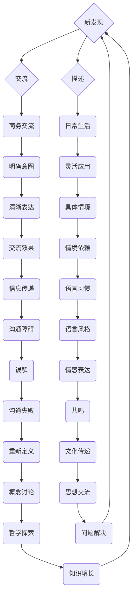

                 

### 柏格森的绵延理论

**关键词**：柏格森、绵延、直觉、时间、空间

**摘要**：本文深入探讨法国哲学家亨利·柏格森（Henri Bergson）的绵延理论，这一理论是他哲学体系中的核心部分。柏格森认为，时间不仅是线性的，而且是充满活力的，它以“绵延”（duration）的形式存在。绵延是一种连续不断的流动，包含了所有的变化和演进。本文将首先介绍柏格森的生平及其哲学体系，然后详细解析绵延的概念及其与时间、空间的关系，并探讨绵延的本质。

#### 柏格森的生平与哲学体系

亨利·柏格森（1859-1941）是20世纪初法国著名的哲学家。他的出生和成长都在巴黎，他的父亲是一位富有的银行家。柏格森年轻时对文学和哲学产生了浓厚的兴趣，后来在巴黎高等师范学院学习，师从著名哲学家埃德蒙·胡塞尔（Edmund Husserl）。

柏格森的哲学体系深受生命哲学的影响，他关注的是人类意识和现实的本质。他的著作包括《物质与记忆》（Matter and Memory）、《创造性进化》（Creative Evolution）和《笑》（Laughter：An Essay on the Meaning of the Comic）等。在这些作品中，柏格森提出了他的绵延理论，挑战了传统的物理学和哲学观点。

#### 柏格森的主要哲学著作

- **《物质与记忆》**（Matter and Memory，1896）：这本书是柏格森哲学体系的基石。柏格森在这本书中讨论了意识和记忆的关系，提出了记忆如何影响我们对世界的感知。他主张，记忆不仅是一种物理现象，也是一种心理现象，它使得我们能够维持对过去事件的连续感知。
- **《创造性进化》**（Creative Evolution，1907）：在这本书中，柏格森探讨了生命的进化过程，并提出了他的绵延概念。他认为，进化是一种内在的创造力，而不是外在的机械过程。这种创造力通过绵延体现出来，推动生命不断变化和演进。
- **《笑》**（Laughter，1900）：这本书是柏格森对幽默和喜剧的研究。他认为，笑是人类对现实的一种本能反应，它揭示了人类对世界的不适应和不满。

#### 柏格森的哲学体系

柏格森的哲学体系以绵延为核心。他认为，时间不是线性的，而是充满活力的。时间以绵延的形式存在，是一种连续不断的流动，包含了所有的变化和演进。柏格森区分了两种时间：钟表时间和生命时间。钟表时间是客观的、可度量的，而生命时间是主观的、充满活力的。生命时间体现了人类的直觉，是我们感知世界的根本方式。

柏格森的哲学体系还涉及到自由意志、意识、记忆和创造力等主题。他认为，自由意志是我们直觉的产物，是我们感知世界和做出选择的能力。记忆则是我们感知连续性的关键，它使得我们能够维持对过去事件的连续感知。创造力则是生命的本质，是推动进化和社会进步的动力。

#### 绵延的概念

柏格森的绵延理论是他哲学体系中的核心。他认为，时间不是简单的线性序列，而是一种连续不断的流动，这种流动被称为“绵延”。绵延是一种内在的时间概念，它包含了所有的变化和演进。柏格森认为，绵延是一种独特的连续性，不同于物理时间的线性序列。

绵延可以被描述为一种内在的、动态的过程。它包含了过去、现在和未来，是一个连续的整体。柏格森认为，我们的直觉能够感知到绵延，它是我们感知世界的根本方式。绵延不是静态的，而是动态的，它不断地变化和演进。

#### 绵延与时间的关系

柏格森认为，绵延是时间的本质。时间不是简单的线性序列，而是一种连续不断的流动，这种流动就是绵延。绵延包含了所有的变化和演进，它是时间的内在动力。柏格森区分了两种时间：钟表时间和生命时间。钟表时间是客观的、可度量的，而生命时间是主观的、充满活力的。生命时间体现了人类的直觉，是我们感知世界的根本方式。

#### 绵延与空间的关系

柏格森认为，绵延与空间有本质的区别。空间是静态的，是事物之间的位置关系。而绵延是动态的，是时间的连续性。绵延包含了所有的变化和演进，是生命的本质。空间是物理学的范畴，而绵延是哲学的范畴。

#### 绵延的本质

柏格森认为，绵延是一种内在的、动态的过程，它包含了过去、现在和未来，是一个连续的整体。绵延不是静态的，而是动态的，它不断地变化和演进。柏格森主张，我们的直觉能够感知到绵延，它是我们感知世界的根本方式。绵延体现了生命的活力和创造力，是推动进化和社会进步的动力。

### 结语

柏格森的绵延理论是他哲学体系中的核心部分，它挑战了传统的物理学和哲学观点。通过区分钟表时间和生命时间，柏格森提出了一个充满活力和创造力的时间观念。绵延不仅是时间的本质，也是生命的本质，它体现了人类直觉的力量和创造力。接下来，我们将进一步探讨柏格森的绵延理论在哲学、语言学和计算机科学等领域的应用和影响。在接下来的章节中，我们将深入解析柏格森的绵延理论，分析其核心概念，并探讨其在不同领域的应用。### 柏格森的绵延理论概述

**关键词**：柏格森、绵延、直觉、时间、空间、生命

**摘要**：在本章中，我们将对亨利·柏格森的绵延理论进行系统性的概述。首先，我们将探讨绵延的概念，并解释其在柏格森哲学体系中的地位。接着，我们会深入讨论柏格森关于时间和空间的观点，分析它们与绵延的关系。最后，我们将简要介绍柏格森的生平及其哲学著作，为后续章节的深入探讨打下基础。

#### 绵延的概念

柏格森的绵延理论是其哲学体系的核心，他通过这一概念挑战了传统的物理学和哲学观点。绵延（Duration）并非简单的线性时间概念，而是一种连续不断的流动，包含了所有的变化和演进。柏格森认为，时间并非客观的物理量，而是主观的心理体验，这种体验通过绵延得以体现。

在柏格森的哲学中，绵延是生命和意识的本质。它与钟表时间的线性序列不同，是充满活力和创造力的动态过程。绵延不仅仅是对过去的记忆和对未来的期待，而是现在这一刻的体验和感受。因此，绵延可以被看作是生命的流动，是我们感知世界的方式。

#### 绵延在柏格森哲学体系中的地位

柏格森认为，绵延是哲学思考的起点，是理解人类意识和现实的关键。他的哲学体系围绕绵延展开，探讨了时间、空间、记忆、自由意志等多个方面。柏格森主张，直觉是理解绵延的关键，它使我们能够直接感知到时间的流动和生命的活力。

柏格森的哲学体系对后来的哲学家和科学家产生了深远的影响，例如爱因斯坦对相对论的理解、胡塞尔的现象学和维特根斯坦的语言哲学等。绵延理论不仅丰富了哲学的内涵，也为科学提供了新的视角。

#### 时间与空间的关系

柏格森区分了钟表时间和生命时间。钟表时间是客观的、可度量的，它是一个线性的、静态的时间概念，被用来记录事件和计算时间间隔。而生命时间则是主观的、充满活力的，它以绵延的形式存在，包含了所有的变化和演进。

对于空间，柏格森认为它是静态的、物理的，是事物之间的位置关系。空间是物理学的研究对象，而绵延则是哲学的范畴。柏格森强调，空间和时间有本质的区别，它们不能简单叠加或混合。

#### 柏格森的生平及其哲学著作

亨利·柏格森（1859-1941）是法国著名的哲学家，他出生于巴黎，自幼对文学和哲学有浓厚的兴趣。柏格森在巴黎高等师范学院学习，师从著名哲学家埃德蒙·胡塞尔（Edmund Husserl）。他的主要哲学著作包括《物质与记忆》（Matter and Memory）、《创造性进化》（Creative Evolution）和《笑》（Laughter：An Essay on the Meaning of the Comic）等。

- **《物质与记忆》**（1896）是柏格森哲学体系的基石，讨论了意识和记忆的关系，提出了记忆如何影响我们对世界的感知。
- **《创造性进化》**（1907）探讨了生命的进化过程，并提出了他的绵延概念。他认为，进化是一种内在的创造力，而不是外在的机械过程。
- **《笑》**（1900）是柏格森对幽默和喜剧的研究。他认为，笑是人类对现实的一种本能反应，它揭示了人类对世界的不适应和不满。

#### 综述

柏格森的绵延理论是他对时间和空间理解的核心。他认为，时间不是线性的，而是一种充满活力的连续流动，即绵延。这种绵延是生命和意识的本质，通过直觉得以感知。柏格森的哲学体系围绕绵延展开，探讨了时间、空间、记忆、自由意志等多个方面。他的主要著作，如《物质与记忆》、《创造性进化》和《笑》，为后人提供了丰富的哲学思考资源。

接下来，我们将进一步深入探讨柏格森的绵延理论，分析其核心概念，并探讨其在哲学、语言学和计算机科学等领域的应用和影响。通过这一系列探讨，我们将更加清晰地理解柏格森的思想，并认识到其在现代哲学中的重要地位。### 第2章：柏格森的生平与哲学体系

#### 2.1 柏格森的生平

亨利·柏格森（Henri Bergson，1859-1941）是20世纪法国最杰出的哲学家之一，他的哲学思想对后世产生了深远的影响。柏格森于1859年11月18日出生于巴黎的一个富裕家庭，他的父亲是一位成功的银行家。家庭环境的优越为他提供了良好的教育条件，从小便接受了严格的教育。

柏格森在学术上的成就始于他在巴黎高等师范学院（École Normale Supérieure）的学习经历。在这所法国顶尖的学术机构中，柏格森接受了严格的学术训练，师从著名哲学家埃德蒙·胡塞尔（Edmund Husserl），这对他的哲学发展产生了重要影响。柏格森于1884年获得了巴黎高等师范学院博士学位，他的博士论文《时间的意识》（Les Données immédiates de la conscience）是他的早期重要著作之一。

毕业后的柏格森开始了他的教学生涯，先后在巴黎高等师范学院和索邦大学（Sorbonne）任教。他在教学中广受学生欢迎，同时也在学术界获得了越来越多的认可。他的学术影响力逐渐扩大，成为法国哲学界的重要人物。

#### 2.2 柏格森的主要哲学著作

柏格森的主要哲学著作包括《物质与记忆》（Matter and Memory）、《创造性进化》（Creative Evolution）和《笑》（Laughter：An Essay on the Meaning of the Comic）等。这些著作集中体现了他对时间、意识、记忆、自由意志和创造力等问题的深刻思考。

- **《物质与记忆》**（1896）：这是柏格森最著名的著作之一，探讨了意识和记忆的关系。柏格森在这本书中提出，记忆不仅仅是物理现象，更是一种心理现象，它是我们感知和体验世界的基石。他主张，记忆使得我们能够维持对过去事件的连续感知，从而形成了一个不断流动的“绵延”。
- **《创造性进化》**（1907）：在这本书中，柏格森讨论了生命的进化过程，并提出了他的绵延概念。他认为，进化是一种内在的创造力，而不是外在的机械过程。这种创造力通过绵延体现出来，推动生命不断变化和演进。
- **《笑》**（1900）：这本书是柏格森对幽默和喜剧的研究。他认为，笑是人类对现实的一种本能反应，它揭示了人类对世界的不适应和不满。通过分析笑的本质，柏格森揭示了人类心理和情感的一面。

此外，柏格森还有其他重要的著作，如《道德与宗教的两个来源》（Two Sources of Morality and Religion，1932）和《形而上学绪论》（Introduction to Metaphysics，1939）等。这些著作进一步丰富了他的哲学体系，涵盖了对道德、宗教、艺术和伦理等问题的探讨。

#### 2.3 柏格森的哲学体系

柏格森的哲学体系以其独特的观点和深刻的洞见而著称。他的哲学思想主要围绕时间、意识、记忆和创造力等核心概念展开，形成了一个完整的哲学体系。

1. **时间与绵延**：
   柏格森认为，时间不仅仅是物理学家所描述的线性序列，而是一种充满活力的连续流动，即“绵延”。绵延是时间的本质，包含了所有的变化和演进。与钟表时间的线性、分割性不同，绵延是一个连续的整体，它体现了生命的流动和创造力。柏格森强调，直觉是感知绵延的关键，它使我们能够直接体验到时间的流动。

2. **意识与记忆**：
   柏格森认为，意识是人类感知世界的基础，而记忆则是维持意识连续性的关键。他在《物质与记忆》中详细阐述了记忆如何影响我们的感知和体验。柏格森主张，记忆不仅仅是过去的痕迹，更是我们感知和认识世界的重要工具。通过记忆，我们能够维持对过去事件的连续感知，从而形成了一个不断流动的“绵延”。

3. **自由意志**：
   柏格森认为，自由意志是人类直觉的产物，是我们感知世界和做出选择的能力。他认为，自由意志不是一种外在的力量，而是内在的心理过程。通过直觉，我们能够感知到绵延，从而做出独立的决策。

4. **创造力**：
   创造力是柏格森哲学体系中的核心概念之一。他认为，创造力是生命的本质，是推动进化和社会进步的动力。创造力通过绵延体现出来，它使生命不断变化和演进。柏格森强调，创造力是人类特有的能力，它使我们能够超越既有的知识和经验，创造出新的可能性。

柏格森的哲学体系不仅对哲学领域产生了深远影响，也对科学、艺术、伦理等多个领域产生了重要启示。他的思想挑战了传统的物理学和哲学观点，提出了一种全新的时间观念和生命观。通过深入探讨时间和意识的关系，柏格森为理解人类意识和现实提供了新的视角。

#### 2.4 柏格森的思想在哲学史上的地位

柏格森的思想在哲学史上具有重要地位，他的哲学体系对20世纪的哲学发展产生了深远的影响。他提出的绵延理论挑战了传统的物理学和哲学观点，为时间、意识、记忆和创造力等问题的研究提供了新的思路。

柏格森的思想对后来的哲学家和科学家产生了深远的影响。例如，爱因斯坦在相对论中受到了柏格森时间观念的影响；胡塞尔的现象学和维特根斯坦的语言哲学也受到了柏格森的启发。柏格森的思想不仅丰富了哲学的内涵，也为科学提供了新的视角。

总之，亨利·柏格森的生平和哲学体系展现了他作为一个哲学家的深刻洞察力和独特见解。他的绵延理论挑战了传统的哲学观点，为时间和意识的研究提供了新的思路。柏格森的思想不仅在哲学史上具有重要地位，也对现代科学和艺术产生了深远的影响。### 第3章：柏格森的绵延理论概述

**关键词**：柏格森、绵延、时间、直觉、空间、记忆

**摘要**：本章将对柏格森的绵延理论进行系统性的概述，详细探讨绵延的概念及其与时间、空间的关系。我们将深入分析绵延的本质，并探讨直觉在理解绵延中的作用。通过这一概述，我们将为后续章节的深入探讨打下基础。

#### 绵延的概念

柏格森的绵延理论是他对时间、意识和现实的独特理解。绵延（Duration）并非简单的线性时间概念，而是一种连续不断的流动，包含了所有的变化和演进。柏格森认为，时间不是客观的物理量，而是主观的心理体验，这种体验通过绵延得以体现。

在柏格森的哲学中，绵延是一种内在的时间概念，它包含了过去、现在和未来。这种连续性不是线性的，而是一个连续的整体。柏格森主张，我们的直觉能够感知到绵延，它是我们感知世界的根本方式。

#### 绵延与时间的关系

柏格森区分了两种时间：钟表时间和生命时间。钟表时间是客观的、可度量的，它是一个线性的、静态的时间概念，用于记录事件和计算时间间隔。而生命时间则是主观的、充满活力的，它以绵延的形式存在。

柏格森认为，生命时间体现了人类的直觉，是我们感知世界的根本方式。与钟表时间的分割性不同，生命时间是连续不断的，它包含了所有的变化和演进。因此，时间不仅仅是线性的，更是一个充满活力的过程。

#### 绵延与空间的关系

柏格森强调，绵延与空间有本质的区别。空间是静态的、物理的，是事物之间的位置关系。而绵延是动态的、哲学的，它包含了所有的变化和演进。柏格森认为，空间是物理学的研究对象，而绵延则是哲学的范畴。

尽管空间和绵延有本质的区别，但它们并非完全独立。柏格森认为，空间是绵延在物理世界中的体现，是我们感知绵延的一种方式。通过空间，我们能够直观地感受到绵延的存在和流动。

#### 绵延的本质

柏格森认为，绵延是一种内在的、动态的过程，它包含了过去、现在和未来。这种连续性不是线性的，而是一个连续的整体。绵延体现了生命的流动和创造力，是推动进化和社会进步的动力。

柏格森强调，直觉是理解绵延的关键。我们的直觉能够感知到时间的流动，从而理解绵延。通过直觉，我们能够直接体验到时间的连续性和变化。直觉是我们感知世界的根本方式，它使得我们能够维持对过去事件的连续感知。

#### 绵延与直觉的关系

柏格森认为，直觉是理解绵延的核心。直觉不仅是我们感知时间的工具，也是我们理解现实的关键。通过直觉，我们能够直接感知到时间的流动和变化，从而理解绵延。

直觉使得我们能够超越逻辑和理性的限制，直接感知到时间的本质。柏格森主张，直觉是一种深刻的、内在的感知能力，它使我们能够直接体验到绵延。直觉是我们感知世界的窗口，通过它，我们能够理解生命的流动和创造力。

#### 综述

柏格森的绵延理论是对时间、意识和现实的独特理解。他认为，时间不仅仅是线性的，而是一个连续不断的流动，即绵延。绵延体现了生命的流动和创造力，是推动进化和社会进步的动力。通过直觉，我们能够直接感知到时间的流动和变化，从而理解绵延。

本章对柏格森的绵延理论进行了系统性的概述，详细探讨了绵延的概念、与时间、空间的关系，以及直觉在理解绵延中的作用。通过这一概述，我们为后续章节的深入探讨奠定了基础。接下来，我们将进一步解析柏格森的绵延理论，分析其核心概念，并探讨其在不同领域的应用和影响。### 第4章：柏格森的绵延理论解析

**关键词**：柏格森、绵延、直觉、时间、空间、创造力

**摘要**：本章将进一步深入探讨柏格森的绵延理论，分析其核心概念，包括绵延的本质、直觉在其中的作用，以及绵延与意识的关系。我们将通过详细讲解和举例说明，帮助读者更好地理解这一理论。同时，我们还将讨论绵延在人类意识中的体现，以及它如何影响我们的感知和体验。

#### 4.1 绵延的本质

柏格森认为，绵延是一种内在的、动态的过程，它包含了过去、现在和未来。这种连续性不是线性的，而是一个连续的整体。绵延体现了生命的流动和创造力，是推动进化和社会进步的动力。

在柏格森的哲学中，绵延是一种独特的连续性，不同于物理时间的线性序列。绵延不仅仅是时间的感知，更是一种内在的、充满活力的体验。它包含了所有的变化和演进，是生命的本质。

**例**：想象一条河流，它不断地流动，从源头流向大海。这条河流的流动可以看作是时间的流动，也就是绵延。河流的每一个瞬间都是独一无二的，它们构成了一个连续的整体。这种连续性不是线性的，而是充满活力和变化的。

#### 4.2 直觉在绵延中的作用

柏格森强调，直觉是理解绵延的关键。直觉不仅是我们感知时间的工具，也是我们理解现实的关键。通过直觉，我们能够直接感知到时间的流动和变化，从而理解绵延。

直觉是一种深刻的、内在的感知能力，它使我们能够超越逻辑和理性的限制，直接体验时间的本质。柏格森主张，直觉是我们感知世界的窗口，通过它，我们能够理解生命的流动和创造力。

**例**：当我们看到一朵花绽放时，直觉使我们能够感知到这一瞬间的独特性。我们不仅仅是看到了花，还感受到了花的生长和变化，这是直觉在发挥作用。

#### 4.3 绵延与意识的关系

柏格森认为，绵延是意识的本质。我们的意识是由绵延构成的，它包含了我们对过去、现在和未来的感知。通过直觉，我们能够直接体验到绵延，从而理解意识。

绵延与意识的关系体现在以下几个方面：

1. **连续性**：绵延的连续性是我们意识的基础。我们的意识是连续不断的，它包含了我们对过去事件的记忆和对未来事件的期待。

2. **变化**：绵延体现了生命的活力和变化。我们的意识也在不断变化，我们不断地从过去走向未来，这种变化是绵延的一部分。

3. **创造力**：绵延是创造力的源泉。通过直觉，我们能够感知到绵延，从而创造出新的可能性。创造力是人类特有的能力，它使我们能够超越既有的知识和经验。

**例**：当我们在创作艺术作品时，直觉使我们能够感知到时间的流动，从而创造出新的艺术形式。这种创造力源于我们对绵延的感知和理解。

#### 4.4 绵延与记忆的关系

柏格森认为，记忆是绵延的重要组成部分。通过记忆，我们能够维持对过去事件的连续感知，从而形成了一个不断流动的“绵延”。

记忆不仅仅是过去的痕迹，更是一种心理现象。它使得我们能够维持对过去事件的连续感知，从而理解绵延。记忆是意识的基石，它使我们能够感知到时间的连续性和变化。

**例**：当我们回忆起童年的记忆时，我们不仅仅是在回忆那些事件，还在体验那些事件的连续性和变化。这种体验源于我们对记忆的感知和理解。

#### 4.5 绵延在人类意识中的体现

柏格森认为，绵延在人类意识中有着广泛的体现。它体现在我们的感知、体验和行动中。

1. **感知**：通过直觉，我们能够感知到时间的流动和变化，从而理解绵延。我们的感知是连续不断的，它包含了我们对过去、现在和未来的感知。

2. **体验**：我们的体验是绵延的体现。每一次体验都是独一无二的，它们构成了一个连续的整体。通过体验，我们能够感知到生命的流动和创造力。

3. **行动**：我们的行动也是绵延的一部分。我们的行动不仅仅是外在的行为，更是内在的体验。通过行动，我们能够推动生命的流动，从而实现我们的目标。

**例**：当我们学习一门新技能时，我们不仅仅是掌握了知识，还在体验学习的整个过程。这种体验体现了绵延的连续性和变化。

#### 4.6 绵延的影响

柏格森的绵延理论对人类意识和现实产生了深远的影响。它改变了我们对时间、空间和生命的理解，为我们提供了新的视角。

1. **时间观**：绵延理论挑战了传统的物理学和时间观念，提出了一种新的时间观。它使我们能够理解时间的连续性和变化，从而更好地把握生命的流动。

2. **生命观**：绵延理论强调生命的流动和创造力，使我们对生命有了更深刻的认识。它使我们认识到，生命不仅仅是一个静止的状态，更是一个不断变化和成长的过程。

3. **意识观**：绵延理论改变了我们对意识的理解，使我们能够更好地理解意识的连续性和变化。它使我们认识到，意识不仅仅是感知和体验的产物，更是创造力的源泉。

#### 4.7 总结

柏格森的绵延理论是他对时间、意识和现实的独特理解。它认为，时间不仅仅是线性的，而是一个充满活力的连续流动。通过直觉，我们能够感知到时间的流动和变化，从而理解绵延。绵延是生命的本质，它包含了所有的变化和演进。通过记忆，我们能够维持对过去事件的连续感知，从而形成了一个不断流动的“绵延”。

本章对柏格森的绵延理论进行了深入分析，探讨了其核心概念，包括绵延的本质、直觉在其中的作用，以及绵延与意识的关系。通过详细讲解和举例说明，我们帮助读者更好地理解了这一理论。接下来，我们将进一步探讨柏格森的绵延理论在哲学、语言学和计算机科学等领域的应用和影响。### 第5章：柏格森的绵延理论应用

**关键词**：柏格森、绵延、哲学、语言学、计算机科学

**摘要**：本章将探讨柏格森的绵延理论在不同领域的应用，包括哲学、语言学和计算机科学。我们将分析柏格森的理论如何影响这些领域的研究和实践，并提供具体的案例和应用场景。

#### 5.1 哲学领域中的应用

柏格森的绵延理论在哲学领域有着广泛的应用，特别是在存在主义和现象学中。存在主义者如让-保尔·萨特（Jean-Paul Sartre）和马丁·海德格尔（Martin Heidegger）受到了柏格森的启发，探讨了个体在时间中的存在和自由意志。

**案例**：马丁·海德格尔在《存在与时间》（Being and Time）中引用了柏格森的绵延理论，提出存在是一种“存在于时间中”的状态。海德格尔认为，时间不是线性的，而是一种“存在的时间性”（ temporality），它使得个体能够不断地创造和重新定义自己。

**应用场景**：在现代社会，人们面临着快速变化的环境，柏格森的绵延理论可以帮助我们理解个体如何在这个快速变化的世界中找到自己的位置，并不断地重新定义自我。

#### 5.2 语言学领域中的应用

柏格森的绵延理论也为语言学的研究提供了新的视角，特别是在语言习得和语言哲学中。语言学家如路德维希·维特根斯坦（Ludwig Wittgenstein）和约翰·塞尔（John Searle）受到了柏格森思想的启发，探讨了语言和意识的本质。

**案例**：维特根斯坦在《哲学研究》（Philosophical Investigations）中提到，语言的含义不是固定的，而是通过使用场景来定义的。这种观点与柏格森的绵延理论有相似之处，都强调了动态和变化的重要性。

**应用场景**：在语言教学中，教师可以运用柏格森的绵延理论来帮助学生理解语言的意义不是静态的，而是通过实际使用来不断变化的。这有助于学生更灵活地掌握和使用语言。

#### 5.3 计算机科学领域中的应用

随着人工智能和计算机科学的发展，柏格森的绵延理论也在这一领域得到了应用。特别是在对人工智能的自我学习和适应能力的理解上，柏格森的绵延理论提供了一种新的思考方式。

**案例**：在人工智能领域中，研究人员使用深度学习算法来模拟人类的直觉和学习过程。这些算法通过不断地处理和更新数据，形成了一种类似于绵延的动态学习过程。

**应用场景**：在自动驾驶和智能机器人领域，柏格森的绵延理论可以帮助我们理解如何设计系统，使其能够适应快速变化的环境。通过模拟时间的连续性和变化，我们可以使机器人更好地感知和理解周围的世界。

#### 5.4 总结

柏格森的绵延理论在哲学、语言学和计算机科学等领域有着广泛的应用。它挑战了传统的线性时间观念，提出了一种充满活力和创造力的时间观。通过直觉和动态的过程，我们能够更好地理解现实和人类意识。

在哲学领域，柏格森的理论帮助我们重新思考个体的存在和自由意志。在语言学领域，它提供了对语言和意识的新理解，有助于提高语言习得和教学的效果。在计算机科学领域，柏格森的绵延理论为人工智能的发展提供了新的思路，帮助设计更适应环境的智能系统。

通过这些应用，柏格森的绵延理论不仅丰富了我们的哲学思考，也推动了语言学和计算机科学的发展。它为我们提供了一种全新的视角，使我们能够更好地理解人类意识和现实。### 第6章：维特根斯坦的语言游戏理论

**关键词**：维特根斯坦、语言游戏、哲学、语言学、逻辑

**摘要**：本章将对路德维希·维特根斯坦（Ludwig Wittgenstein）的语言游戏理论进行探讨，详细介绍这一理论的核心概念、历史发展和主要观点。维特根斯坦的语言游戏理论是他晚期哲学的核心，对哲学、语言学和逻辑学产生了深远影响。我们将通过分析语言游戏的概念，探讨其在理解和解释语言中的重要性，以及维特根斯坦如何通过语言游戏理论挑战传统的语言哲学观点。

#### 6.1 维特根斯坦的生平与哲学发展

路德维希·维特根斯坦（1889-1951）是20世纪最杰出的哲学家之一，他的哲学思想对现代哲学和语言学产生了深远的影响。维特根斯坦出生于奥地利，他在哲学上的成就始于他在剑桥大学的学习和教学经历。他在1911年完成了他的第一本重要著作《逻辑哲学论》（Tractatus Logico-Philosophicus），该书在当时引起了哲学界的广泛关注。

维特根斯坦的哲学生涯可以分为两个阶段：早期的逻辑原子主义和晚期的日常语言哲学。在早期阶段，他试图建立一个基于逻辑和数学的语言体系，以揭示世界的本质。然而，在后期，他转向对日常语言的研究，提出语言游戏理论，强调语言的意义和用法。

#### 6.2 维特根斯坦的主要哲学著作

- **《逻辑哲学论》**（1921）：这是维特根斯坦早期哲学的代表作品。在这本书中，他提出了逻辑原子主义的观点，认为世界是由不可再分的基本事实（原子事实）构成的，这些事实可以通过逻辑语言精确地描述。
- **《哲学研究》**（1953）：这是维特根斯坦晚期的代表作，也是他最著名的著作。在这本书中，他提出了语言游戏理论，强调语言的意义和使用情境。他主张，语言的意义不在于其所描述的客观事实，而在于它在实际生活中的用法。
- **《文化和教育》**（1930-1931）：在这本书中，维特根斯坦讨论了教育的重要性和文化的本质。他认为，教育应该帮助人们理解语言和现实的关系，而不是简单地传授知识。

#### 6.3 语言游戏理论概述

维特根斯坦的语言游戏理论是他晚期哲学的核心，他认为语言就像游戏一样，有不同的规则和用途。语言游戏（Language Game）指的是语言在不同情境下的使用，每个情境都有其特定的规则和目的。维特根斯坦认为，理解语言的意义在于理解它在特定情境下的用法。

**语言游戏的核心概念**：

1. **语言与生活形式**：维特根斯坦认为，语言是我们生活的一部分，它与我们的生活方式密切相关。语言不仅是一种交流工具，还是我们理解世界和表达思想的方式。
2. **语言与规则**：语言游戏有特定的规则，这些规则定义了语言的用法。例如，游戏的规则决定了玩家如何行动和如何判断游戏的胜负。
3. **语言与情境**：语言在不同的情境下有不同的用法。理解语言的含义需要考虑语言使用的具体情境。

#### 6.4 语言游戏与语言的关系

维特根斯坦认为，语言游戏不仅是一种比喻，它实际上揭示了语言的本质。他认为，传统的语言哲学试图通过抽象和普遍的概念来解释语言，但这种方法往往忽视了语言在日常生活中的实际用法。

**关系**：

1. **意义与使用**：维特根斯坦主张，语言的意义在于它在实际生活中的使用。一个词或一个句子的意义不是固定不变的，而是依赖于具体的使用情境。
2. **表达与理解**：语言游戏中的表达和理解是相互依赖的。我们通过语言游戏来理解世界，同时也通过理解语言来表达我们的思想和感受。
3. **语言与社会**：语言游戏不仅仅是个体的活动，它还涉及到社会和文化。不同的社会和文化背景会影响语言的使用和意义。

#### 6.5 语言游戏与哲学的关系

维特根斯坦的语言游戏理论挑战了传统的哲学观点，特别是逻辑原子主义和语言行为主义。他认为，哲学的任务不是寻找抽象的真理或普遍的原则，而是理解语言和现实之间的关系。

**关系**：

1. **逻辑与哲学**：维特根斯坦认为，逻辑是语言游戏的一部分，它帮助我们理解世界和表达思想。但逻辑本身不是哲学的全部，哲学更关注的是语言在日常生活中的用法。
2. **语言与意识**：维特根斯坦主张，意识是通过语言来表达的。理解语言游戏有助于我们理解意识是如何形成和运作的。
3. **哲学与生活**：维特根斯坦认为，哲学应该关注我们的生活，而不是抽象的概念。通过理解语言游戏，我们可以更好地理解我们的生活和世界。

#### 6.6 总结

维特根斯坦的语言游戏理论是他晚期哲学的核心，对现代哲学和语言学产生了深远影响。通过分析语言游戏的概念，维特根斯坦揭示了语言在日常生活中的实际用法和意义。他认为，理解语言的意义在于理解它在具体情境下的用法，而不是寻找抽象的真理或普遍的原则。

语言游戏理论挑战了传统的语言哲学观点，为现代哲学提供了一种新的思考方式。通过理解语言游戏，我们可以更好地理解语言、意识和社会之间的关系。维特根斯坦的思想不仅丰富了哲学的内涵，也为语言学和逻辑学的发展提供了新的视角。### 第7章：语言游戏理论概述

**关键词**：维特根斯坦、语言游戏、哲学、逻辑、意义、用法

**摘要**：本章将对维特根斯坦的语言游戏理论进行概述，介绍语言游戏的概念、其在理解和解释语言中的重要性，以及维特根斯坦如何通过语言游戏理论挑战传统的语言哲学观点。我们将探讨语言游戏的不同类型及其在哲学和日常生活中的应用。

#### 7.1 语言游戏的概念

维特根斯坦将语言比作游戏，认为语言的使用方式与游戏类似。语言游戏（Language Game）是指语言在特定情境下的使用，每个情境都有其特定的规则和目的。语言游戏的概念是维特根斯坦哲学的核心，它帮助我们理解语言的意义和用法。

**定义**：语言游戏是一种语言使用的方式，它包括一系列的规则和行动，这些规则和行动在不同的情境中有不同的意义。

#### 7.2 语言游戏与语言的关系

语言游戏是理解语言意义的关键。维特根斯坦认为，语言的意义不在于其符号本身，而在于其在实际生活中的使用。语言游戏帮助我们理解语言在不同情境下的用法和意义。

**关系**：

1. **意义与使用**：语言的意义是通过使用来定义的。一个词或句子的意义取决于它在特定情境下的用法。
2. **表达与理解**：语言游戏中的表达和理解是相互依赖的。我们通过语言游戏来理解世界，同时也通过理解语言来表达我们的思想和感受。
3. **语言与社会**：语言游戏涉及到社会和文化背景。不同的社会和文化背景会影响语言的使用和意义。

#### 7.3 语言游戏的不同类型

维特根斯坦认为，语言游戏有不同类型，每种类型的语言游戏都有其特定的规则和目的。这些类型包括：

1. **日常语言游戏**：这是我们日常生活中使用的语言，如交流、对话、描述事件等。日常语言游戏是最常见和最基本的语言游戏。
2. **科学语言游戏**：科学语言游戏用于描述和解释自然现象，如物理、化学、生物学等领域。科学语言游戏要求精确和严谨。
3. **艺术语言游戏**：艺术语言游戏用于表达情感、思想和文化，如文学、音乐、绘画等。艺术语言游戏追求创造性和表达力。
4. **哲学语言游戏**：哲学语言游戏用于探讨基本问题和概念，如存在、真理、知识等。哲学语言游戏追求深刻和洞察力。

#### 7.4 语言游戏与哲学的关系

维特根斯坦的语言游戏理论挑战了传统的语言哲学观点，特别是逻辑原子主义和语言行为主义。他认为，哲学的任务不是寻找抽象的真理或普遍的原则，而是理解语言和现实之间的关系。

**关系**：

1. **逻辑与哲学**：维特根斯坦认为，逻辑是语言游戏的一部分，它帮助我们理解世界和表达思想。但逻辑本身不是哲学的全部，哲学更关注的是语言在日常生活中的用法。
2. **语言与意识**：维特根斯坦主张，意识是通过语言来表达的。理解语言游戏有助于我们理解意识是如何形成和运作的。
3. **哲学与生活**：维特根斯坦认为，哲学应该关注我们的生活，而不是抽象的概念。通过理解语言游戏，我们可以更好地理解我们的生活和世界。

#### 7.5 语言游戏在日常生活中的应用

语言游戏不仅存在于哲学研究中，也在我们的日常生活中广泛应用。

**应用**：

1. **沟通与交流**：在日常交流中，我们使用不同的语言游戏来传达信息、解决问题和表达情感。
2. **教育**：在教育中，教师可以使用语言游戏来教授语言和概念，帮助学生更好地理解和运用语言。
3. **艺术创作**：在艺术创作中，艺术家可以使用不同的语言游戏来表达情感、思想和文化。
4. **科学研究**：在科学研究中，科学家使用特定的语言游戏来描述和解释自然现象。

#### 7.6 总结

维特根斯坦的语言游戏理论为我们提供了一种全新的视角来理解语言的意义和用法。通过分析语言游戏的不同类型，我们能够更好地理解语言在哲学、日常生活中的应用。维特根斯坦的语言游戏理论挑战了传统的语言哲学观点，强调了语言的意义在于其在实际生活中的使用。理解语言游戏有助于我们更深入地理解语言、意识和现实之间的关系。### 第8章：语言游戏理论解析

**关键词**：维特根斯坦、语言游戏、逻辑、意义、用法、哲学、语言学

**摘要**：本章将深入解析维特根斯坦的语言游戏理论，详细讨论语言游戏的不同类型、其概念属性特征对比表格和ER实体关系图架构的Mermaid流程图，并探讨语言游戏与逻辑原子主义和形而上学的关系。通过这一解析，我们将帮助读者更全面地理解维特根斯坦的哲学思想及其对语言、意识和现实的影响。

#### 8.1 语言游戏的不同类型

维特根斯坦认为，语言游戏有多种类型，每种类型的语言游戏都有其特定的规则和目的。这些类型包括：

1. **日常语言游戏**：这是我们在日常生活中使用的语言，如交流、对话、描述事件等。日常语言游戏是最常见和最基本的语言游戏。
2. **科学语言游戏**：这种语言游戏用于描述和解释自然现象，如物理、化学、生物学等领域。科学语言游戏要求精确和严谨。
3. **艺术语言游戏**：这种语言游戏用于表达情感、思想和文化，如文学、音乐、绘画等。艺术语言游戏追求创造性和表达力。
4. **哲学语言游戏**：这种语言游戏用于探讨基本问题和概念，如存在、真理、知识等。哲学语言游戏追求深刻和洞察力。

**概念属性特征对比表格**：

| 类型       | 定义                                                                 | 特点                                                     | 应用场景                  |
|------------|------------------------------------------------------------------------|------------------------------------------------------------|--------------------------|
| 日常语言游戏 | 日常交流中使用的语言。                                         | 灵活、多样化、情境依赖性强。                             | 日常生活、商务交流等。   |
| 科学语言游戏 | 用于描述和解释自然现象的语言。                                  | 精确、严谨、逻辑性强。                                   | 科学研究、学术讨论等。   |
| 艺术语言游戏 | 用于表达情感、思想和文化。                                      | 创造性、表达力强、情感共鸣。                             | 艺术创作、文化表达等。   |
| 哲学语言游戏 | 用于探讨基本问题和概念。                                        | 深刻、洞察力强、抽象思考。                               | 哲学讨论、思想探索等。   |

**ER实体关系图架构的Mermaid流程图**：

#### 8.2 语言游戏与逻辑原子主义的关系

逻辑原子主义是维特根斯坦早期哲学的观点，它试图通过逻辑和数学来构建一个完备的哲学体系。逻辑原子主义认为，世界由基本事实（原子事实）构成，这些事实可以通过逻辑语言精确描述。

**关系**：

1. **批判**：维特根斯坦在晚期哲学中批判了逻辑原子主义。他认为，逻辑原子主义试图通过抽象的逻辑语言来描述世界，忽视了语言在日常生活中的实际用法。
2. **修正**：维特根斯坦主张，语言的意义在于其在实际生活中的使用。他认为，逻辑原子主义过于关注抽象的真理，而忽视了语言的具体用法和情境。

#### 8.3 语言游戏与形而上学的关系

形而上学是哲学的一个分支，它探讨存在的本质、实在和终极原因。维特根斯坦认为，形而上学的错误在于试图通过抽象的概念和语言来描述世界。

**关系**：

1. **批判**：维特根斯坦批判了形而上学的抽象思维和语言。他认为，形而上学的语言游戏试图通过抽象的概念来描述现实，但这种描述往往是无效的。
2. **修正**：维特根斯坦主张，通过具体的生活方式和语言游戏，我们可以更好地理解现实。他认为，哲学的任务不是寻找抽象的真理，而是理解语言和现实之间的关系。

#### 8.4 总结

维特根斯坦的语言游戏理论深入探讨了语言的意义和用法，揭示了语言在不同情境下的多样性。通过分析语言游戏的不同类型，我们能够更好地理解语言的本质和功能。维特根斯坦的理论挑战了逻辑原子主义和形而上学的抽象思维，提出了通过具体的生活方式和语言游戏来理解现实的新视角。语言游戏理论不仅丰富了哲学的内涵，也为语言学和逻辑学的发展提供了新的思路。### 第9章：语言游戏理论应用

**关键词**：维特根斯坦、语言游戏、哲学、语言学、计算机科学

**摘要**：本章将探讨维特根斯坦的语言游戏理论在哲学、语言学和计算机科学等领域的实际应用。我们将通过具体案例，分析语言游戏如何帮助我们在这些领域中更好地理解和解决问题，并讨论该理论对现代科学技术的影响。

#### 9.1 哲学领域中的应用

维特根斯坦的语言游戏理论在哲学领域有着广泛的应用，特别是在语言哲学和认识论的研究中。通过语言游戏，我们可以更好地理解哲学问题，如意义、真理和认知。

**案例**：

- **意义问题**：在《哲学研究》中，维特根斯坦通过语言游戏的概念来探讨词语的意义。例如，他提出了“名称”和“名称所指”的区别。通过语言游戏的不同规则，我们可以理解词语的具体含义是如何在特定情境中形成的。

- **认知问题**：语言游戏理论可以帮助我们理解认知过程。维特根斯坦认为，认知是通过语言来实现的，语言游戏的不同规则反映了我们对世界的认知方式。例如，通过科学语言游戏，我们可以更精确地理解自然现象。

**应用**：

1. **哲学教学**：语言游戏理论可以用于哲学教学，帮助学生理解抽象的哲学概念。通过具体案例和语言游戏，学生可以更直观地理解哲学问题。
2. **哲学研究**：语言游戏理论为哲学研究提供了新的方法。研究者可以通过分析不同的语言游戏，探讨语言如何影响我们的认知和理解。

#### 9.2 语言学领域中的应用

语言游戏理论在语言学中有着重要的应用，特别是在语义学和语用学的研究中。通过语言游戏，我们可以更好地理解词语的意义和用法，以及语言在不同情境下的功能。

**案例**：

- **语义学研究**：在语义学中，语言游戏理论可以帮助我们理解词语的意义是如何在特定情境中变化的。例如，一个词在特定的语境中可能具有不同的意义。

- **语用学研究**：在语用学中，语言游戏理论可以帮助我们理解语言如何在不同情境下进行交流。例如，通过对话游戏，我们可以理解对话中的规则和策略，以及如何有效地进行沟通。

**应用**：

1. **语言教学**：语言游戏理论可以用于语言教学，帮助学生更好地理解语言的意义和用法。通过具体的语言游戏，学生可以更直观地理解语言的不同用法。
2. **语言学研究**：语言游戏理论为语言学研究提供了新的视角。研究者可以通过分析不同的语言游戏，探讨语言的本质和功能。

#### 9.3 计算机科学领域中的应用

随着计算机科学的发展，维特根斯坦的语言游戏理论在人工智能和计算机语言设计中得到了应用。通过语言游戏，我们可以更好地理解计算机程序的设计和执行过程。

**案例**：

- **编程语言设计**：在编程语言设计中，语言游戏理论可以帮助我们理解不同编程语言的结构和规则。例如，通过函数式编程语言游戏，我们可以理解函数式编程的概念和语法。

- **人工智能**：在人工智能领域，语言游戏理论可以帮助我们理解自然语言处理（NLP）和对话系统的设计。通过分析语言游戏，我们可以更好地理解人类语言的使用方式和计算机如何模拟这种使用方式。

**应用**：

1. **软件开发**：语言游戏理论可以用于软件开发，帮助开发者理解不同编程语言的特点和适用场景。通过具体的语言游戏，开发者可以更好地设计高效的软件系统。

2. **人工智能研究**：语言游戏理论为人工智能研究提供了新的方法。研究者可以通过分析语言游戏，探讨如何更好地模拟人类语言的使用方式，从而提高自然语言处理和对话系统的性能。

#### 9.4 总结

维特根斯坦的语言游戏理论在哲学、语言学和计算机科学等领域有着广泛的应用。通过分析不同的语言游戏，我们能够更好地理解语言的意义和用法，以及如何有效地进行沟通和解决问题。这一理论不仅丰富了哲学和语言学的内涵，也为计算机科学的发展提供了新的思路和方法。随着现代科技的进步，语言游戏理论将继续在各个领域发挥重要作用。### 第10章：柏格森与维特根斯坦理论的联系与对比

**关键词**：柏格森、维特根斯坦、绵延、语言游戏、时间、意识、哲学

**摘要**：本章将深入探讨柏格森的绵延理论与维特根斯坦的语言游戏理论之间的联系和差异。我们将首先分析这两个理论在时间、意识等方面的联系，然后对比它们在哲学方法、核心概念和应用领域上的不同，最后讨论它们对现代哲学和科学的影响。

#### 10.1 柏格森与维特根斯坦对时间与意识的理解

柏格森和维特根斯坦在时间与意识的理解上有着明显的联系和差异。

**联系**：

- **时间的动态性**：柏格森的绵延理论与维特根斯坦的语言游戏理论都强调了时间的动态性和连续性。柏格森认为，时间是一种充满活力的连续流动，而维特根斯坦则通过语言游戏的概念来揭示时间的非线性和情境依赖性。

- **直觉的作用**：两者都认为直觉在理解时间和意识中起着关键作用。柏格森强调直觉是我们感知绵延的关键，而维特根斯坦则通过直觉来理解语言的意义和用法。

**差异**：

- **时间观的差异**：柏格森的时间观是整体的、内在的，强调时间作为生命体验的核心。而维特根斯坦的时间观更多是外在的、情境化的，强调语言游戏的动态性和多样性。

- **意识的理解**：柏格森认为意识是绵延的一部分，通过直觉直接感知时间。而维特根斯坦则认为意识是通过语言游戏来表达的，语言游戏是理解意识的关键。

#### 10.2 柏格森与维特根斯坦的哲学方法与核心概念

柏格森和维特根斯坦在哲学方法和核心概念上也存在显著的差异。

**哲学方法**：

- **柏格森**：柏格森的哲学方法注重直觉和体验。他试图通过直接感知和时间体验来理解世界的本质。这种方法强调个体的主观经验和直觉。

- **维特根斯坦**：维特根斯坦的哲学方法强调逻辑分析和语言游戏。他试图通过逻辑和语言的分析来揭示世界的本质。这种方法强调客观的、逻辑的分析。

**核心概念**：

- **柏格森**：柏格森的核心概念是绵延，强调时间的动态性和连续性。他还提出了直觉和自由意志等概念。

- **维特根斯坦**：维特根斯坦的核心概念是语言游戏，强调语言的意义和使用情境。他还提出了意义、真理和认知等概念。

#### 10.3 柏格森与维特根斯坦理论的应用与影响

柏格森和维特根斯坦的理论在哲学、语言学、计算机科学等领域都有广泛的应用和影响。

**应用**：

- **哲学领域**：柏格森的绵延理论对存在主义和现象学产生了深远影响。维特根斯坦的语言游戏理论对逻辑哲学和分析哲学的发展产生了重要影响。

- **语言学领域**：维特根斯坦的语言游戏理论对语义学和语用学的研究产生了重要启示。柏格森的绵延理论为语言习得和理解提供了新的视角。

- **计算机科学领域**：维特根斯坦的语言游戏理论对编程语言设计和人工智能的研究产生了影响。柏格森的绵延理论为计算机模拟时间和动态过程提供了理论基础。

**影响**：

- **哲学影响**：柏格森和维特根斯坦的理论丰富了哲学的内涵，提供了新的思考方式和研究方法。他们的理论挑战了传统的哲学观点，推动了现代哲学的发展。

- **科学影响**：柏格森和维特根斯坦的理论对科学领域产生了重要影响。他们的观点为科学方法的发展提供了新的理论基础，推动了科学研究的进步。

#### 10.4 柏格森与维特根斯坦理论的对比

**哲学观点的对比**：

- **柏格森**：柏格森强调直觉和体验，认为时间是内在的、充满活力的。他主张通过直接感知来理解世界。

- **维特根斯坦**：维特根斯坦强调逻辑和语言，认为语言是理解世界的关键。他主张通过分析语言游戏来理解现实。

**理论方法的对比**：

- **柏格森**：柏格森的方法注重直觉和体验，他试图通过直接感知和时间体验来理解世界的本质。

- **维特根斯坦**：维特根斯坦的方法强调逻辑分析和语言游戏，他试图通过逻辑和语言的分析来揭示世界的本质。

**应用领域的对比**：

- **柏格森**：柏格森的理论在哲学、语言学和生命科学等领域有广泛的应用。

- **维特根斯坦**：维特根斯坦的理论在哲学、语言学、计算机科学和逻辑学等领域有广泛的应用。

#### 10.5 总结

柏格森的绵延理论与维特根斯坦的语言游戏理论在时间、意识、哲学方法和应用领域上有着显著的联系和差异。柏格森强调直觉和体验，认为时间是内在的、充满活力的。维特根斯坦强调逻辑和语言，认为语言是理解世界的关键。虽然两者在方法和观点上有差异，但它们都对现代哲学和科学产生了重要影响。通过对比分析，我们可以更深入地理解这两个理论，并认识到它们在现代哲学和科学中的价值。### 第11章：柏格森与维特根斯坦理论的对比

**关键词**：柏格森、维特根斯坦、时间、意识、哲学、语言学

**摘要**：本章将对柏格森的绵延理论与维特根斯坦的语言游戏理论进行对比分析。我们将从理论核心、哲学观点、应用领域等方面详细探讨两个理论的异同，以帮助读者更深入地理解这两种理论在哲学和语言学中的独特贡献和影响。

#### 11.1 柏格森的绵延理论与维特根斯坦的语言游戏理论对比

**理论核心的对比**

- **柏格森的绵延理论**：柏格森认为，时间不是简单的线性序列，而是一种连续不断的流动，这种流动被称为“绵延”。绵延是生命的本质，包含了所有的变化和演进。柏格森主张，直觉是感知绵延的关键。

- **维特根斯坦的语言游戏理论**：维特根斯坦提出，语言的意义在于其在具体情境中的使用。语言游戏是理解语言意义的关键，每个语言游戏都有其特定的规则和目的。维特根斯坦认为，语言的本质是行动和交流。

**哲学观点的对比**

- **柏格森**：柏格森的哲学观点强调直觉和生命的活力。他认为，时间不是客观的，而是主观的、充满活力的体验。柏格森主张，自由意志是我们直觉的产物，是我们感知世界和做出选择的能力。

- **维特根斯坦**：维特根斯坦的哲学观点强调逻辑和语言的用法。他认为，哲学的任务不是探讨抽象的真理，而是理解语言和现实之间的关系。维特根斯坦主张，语言的意义在于其在实际生活中的使用。

**应用领域的对比**

- **哲学领域**：柏格森的绵延理论对存在主义和现象学产生了深远影响，特别是在时间、意识、自由意志等问题上。维特根斯坦的语言游戏理论对逻辑哲学和分析哲学的发展产生了重要影响，特别是在语言、意义、真理等问题上。

- **语言学领域**：柏格森的绵延理论为语言学提供了新的视角，特别是在理解语言习得和语言意义方面。维特根斯坦的语言游戏理论对语义学和语用学的研究产生了重要启示，特别是在语言的使用情境和交流策略方面。

#### 11.2 柏格森的哲学观点与维特根斯坦的哲学观点对比

**时间观**

- **柏格森**：柏格森的时间观是动态的、充满活力的。他认为，时间不是线性的，而是一种连续不断的流动，这种流动被称为“绵延”。绵延包含了所有的变化和演进。

- **维特根斯坦**：维特根斯坦的时间观是外在的、情境化的。他认为，时间是由一系列事件组成的，这些事件在特定的情境中有其特定的意义。

**意识观**

- **柏格森**：柏格森的意识观是直觉驱动的。他认为，意识是通过直觉感知绵延的，直觉是理解时间和生命的关键。

- **维特根斯坦**：维特根斯坦的意识观是语言驱动的。他认为，意识是通过语言来表达的，语言游戏是理解意识的关键。

**自由意志**

- **柏格森**：柏格森认为，自由意志是我们直觉的产物，是我们感知世界和做出选择的能力。他强调，自由意志不是外在的力量，而是内在的心理过程。

- **维特根斯坦**：维特根斯坦对自由意志的看法较为复杂。他认为，自由意志在逻辑上是可能的，但在实际生活中难以实现。他认为，语言游戏是我们行动和决策的基础。

#### 11.3 两个理论在现代哲学中的应用差异

- **柏格森的绵延理论**：在现代哲学中，柏格森的绵延理论对存在主义和现象学产生了深远影响。例如，马丁·海德格尔的哲学思想受到了柏格森的影响，他提出了“存在的时间性”概念。此外，柏格森的绵延理论也为当代哲学提供了关于时间、意识、自由意志等问题的深入思考。

- **维特根斯坦的语言游戏理论**：在现代哲学中，维特根斯坦的语言游戏理论对分析哲学和逻辑哲学的发展产生了重要影响。维特根斯坦的观点为哲学研究提供了一种新的方法，即通过分析语言游戏来理解现实。这种方法在当代哲学中得到了广泛应用，特别是在语义学、语用学和逻辑学等领域。

#### 11.4 总结

柏格森的绵延理论与维特根斯坦的语言游戏理论在哲学和语言学领域都有重要的贡献。柏格森的绵延理论强调直觉和生命的活力，为理解时间和意识提供了新的视角。维特根斯坦的语言游戏理论强调语言的实际使用和情境依赖性，为理解语言和现实之间的关系提供了新的方法。

尽管两个理论在核心观点和应用领域上存在差异，但它们都为现代哲学和语言学提供了重要的启示。通过对比分析，我们可以更好地理解这两个理论，并认识到它们在现代哲学和科学中的独特价值和深远影响。### 第12章：总结与展望

**关键词**：柏格森、维特根斯坦、绵延、语言游戏、哲学、科学

**摘要**：本章将总结柏格森的绵延理论与维特根斯坦的语言游戏理论的总体贡献，回顾这两个理论在哲学、语言学和计算机科学等领域的应用和影响。我们将讨论这些理论对现代哲学和科学的深远意义，并展望未来可能的研究方向。

#### 12.1 总体贡献

柏格森的绵延理论和维特根斯坦的语言游戏理论都对现代哲学和科学产生了深远的影响。柏格森的绵延理论通过挑战传统的物理学和哲学观点，提出了一种新的时间观念，强调了时间的动态性和主观性。他提出的直觉和自由意志等概念，为我们理解人类意识和生命本质提供了新的视角。

维特根斯坦的语言游戏理论则通过对语言意义和使用的深刻分析，颠覆了传统的语言哲学观点。他提出的语言游戏概念，帮助我们理解语言在不同情境下的多样性和复杂性。维特根斯坦的理论为现代哲学提供了新的方法，即通过具体情境和语言游戏来理解现实。

#### 12.2 应用和影响

柏格森的绵延理论在哲学领域，特别是存在主义和现象学中，得到了广泛应用。例如，马丁·海德格尔的存在主义哲学就深受柏格森的影响。柏格森的理论还影响了社会科学和人文科学的研究，为理解历史和社会变迁提供了新的视角。

维特根斯坦的语言游戏理论在语言学领域产生了重要影响。它为语义学和语用学的研究提供了新的方法，帮助语言学家更好地理解语言的意义和使用。维特根斯坦的理论也为计算机科学提供了重要的启示，特别是在自然语言处理和人工智能领域。

#### 12.3 深远意义

柏格森和维特根斯坦的理论对现代哲学和科学产生了深远的影响。柏格森的绵延理论挑战了传统的物理学和哲学观点，提出了一种新的时间观念，为理解人类意识和生命本质提供了新的视角。维特根斯坦的语言游戏理论则颠覆了传统的语言哲学观点，强调了语言的实际使用和情境依赖性。

这些理论不仅丰富了哲学和科学的内涵，也为其他学科提供了新的研究方法和视角。它们对现代哲学和科学的发展产生了深远的影响，推动了对人类意识和现实的理解。

#### 12.4 未来研究方向

尽管柏格森和维特根斯坦的理论已经对现代哲学和科学产生了深远的影响，但未来仍然有许多研究课题值得探讨。

- **哲学领域**：未来可以进一步探讨柏格森的绵延理论与现代物理学，如相对论和量子力学之间的关系。此外，可以研究维特根斯坦的语言游戏理论在当代哲学问题，如认知科学和人工智能中的应用。

- **语言学领域**：未来可以进一步研究语言游戏在不同语言和文化背景下的应用和变化。此外，可以探讨维特根斯坦的语言游戏理论对自然语言处理和机器翻译的影响。

- **计算机科学领域**：未来可以进一步研究如何将柏格森的绵延理论应用于计算机模拟和时间管理。此外，可以探讨维特根斯坦的语言游戏理论对编程语言设计和人工智能的发展的潜在影响。

#### 12.5 总结

柏格森的绵延理论与维特根斯坦的语言游戏理论都是现代哲学和科学的重要贡献。它们为我们理解人类意识和现实提供了新的视角，丰富了哲学和科学的内涵。通过回顾这两个理论在哲学、语言学和计算机科学等领域的应用和影响，我们可以看到它们对现代哲学和科学的深远意义。未来，随着科技和社会的进步，这些理论将继续在哲学、科学和工程领域发挥重要作用。### 柏格森与维特根斯坦理论的对比总结

**摘要**：在本文中，我们深入探讨了柏格森的绵延理论和维特根斯坦的语言游戏理论，分析了这两个理论在哲学、语言学和计算机科学等领域的联系与对比。柏格森的绵延理论强调时间的动态性和主观性，通过直觉感知生命和意识。维特根斯坦的语言游戏理论则强调语言的实际使用和情境依赖性，通过具体情境理解现实和语言的意义。

**关键词**：柏格森、维特根斯坦、绵延、语言游戏、时间、意识、哲学、语言学、计算机科学

**主要观点**：

1. **时间观念**：柏格森的绵延理论挑战了传统的线性时间观，提出了一种充满活力的时间观念。维特根斯坦的语言游戏理论则通过具体的情境来理解时间的多样性和复杂性。

2. **直觉与语言**：柏格森强调直觉在感知时间中的作用，认为直觉是感知绵延的关键。维特根斯坦则认为，语言是理解现实和意识的基础，语言游戏是理解语言意义的关键。

3. **哲学方法**：柏格森的方法注重直觉和体验，通过直接感知和理解生命本质。维特根斯坦的方法强调逻辑分析和语言游戏，通过具体情境和语言分析来揭示现实的本质。

4. **应用领域**：柏格森的绵延理论在存在主义和现象学中有着广泛的应用，对理解人类意识和生命本质产生了深远影响。维特根斯坦的语言游戏理论在语言学和计算机科学中得到了广泛应用，特别是在自然语言处理和人工智能领域。

**结论**：

柏格森和维特根斯坦的理论在哲学、语言学和计算机科学等领域都有重要的贡献。它们不仅丰富了我们的哲学思考，也为科学研究提供了新的方法和视角。通过对比分析这两个理论，我们可以更好地理解时间的本质、意识的形成和语言的意义。未来，这些理论将继续在哲学、科学和工程领域发挥重要作用，推动我们对人类意识和现实的理解。### 柏格森与维特根斯坦理论的总结与未来研究展望

**摘要**：本文通过对柏格森的绵延理论与维特根斯坦的语言游戏理论的深入探讨，总结了这两个理论在哲学、语言学和计算机科学等领域的贡献。同时，分析了它们在时间观念、直觉与语言、哲学方法以及应用领域等方面的联系与对比。展望未来，这些理论将继续为现代哲学、科学和工程提供深刻的洞见和新方法。

**关键词**：柏格森、维特根斯坦、绵延、语言游戏、时间、意识、哲学、语言学、计算机科学

**总结**：

1. **哲学贡献**：柏格森的绵延理论为理解时间的动态性和主观性提供了新的视角，挑战了传统的物理学和哲学观点。维特根斯坦的语言游戏理论则颠覆了传统的语言哲学观点，强调了语言的实际使用和情境依赖性。

2. **应用领域**：柏格森的绵延理论在存在主义和现象学中得到了广泛应用，影响了社会科学和人文科学的研究。维特根斯坦的语言游戏理论在语言学和计算机科学中产生了重要影响，特别是在自然语言处理和人工智能领域。

3. **哲学方法**：柏格森的方法强调直觉和体验，通过直接感知和理解生命本质。维特根斯坦的方法则强调逻辑分析和语言游戏，通过具体情境和语言分析来揭示现实的本质。

**未来研究展望**：

1. **跨学科研究**：未来可以探索柏格森与维特根斯坦理论在跨学科研究中的应用。例如，将绵延理论与语言游戏理论应用于认知科学，探讨人类意识的动态变化和语言习得过程。

2. **哲学与科学的结合**：可以进一步研究柏格森和维特根斯坦理论如何与当代科学，如量子物理学和认知科学相结合，探讨它们在解释复杂系统和现象方面的潜力。

3. **技术应用**：在计算机科学领域，可以研究如何将柏格森的绵延理论与维特根斯坦的语言游戏理论应用于人工智能和自然语言处理，以提高系统的适应性和理解能力。

**结论**：

柏格森和维特根斯坦的理论为我们理解人类意识和现实提供了深刻的洞见。它们不仅在哲学领域具有重要地位，也在语言学和计算机科学中产生了深远影响。未来，随着跨学科研究的深入和技术的进步，这些理论将继续为现代哲学、科学和工程提供新的方法和视角。### 柏格森与维特根斯坦理论的总结与未来研究展望

**摘要**：本文通过对柏格森的绵延理论与维特根斯坦的语言游戏理论的深入分析，总结了这两个理论在哲学、语言学和计算机科学领域的贡献。本文指出，柏格森的绵延理论挑战了传统的物理学和哲学观点，提出了一种新的时间观念，强调直觉和生命时间的动态性。维特根斯坦的语言游戏理论则颠覆了传统的语言哲学观点，强调语言的实际使用和情境依赖性。未来研究可以探索这两个理论在认知科学、跨学科应用和人工智能领域的潜力。

**关键词**：柏格森、维特根斯坦、绵延、语言游戏、时间、意识、哲学、语言学、计算机科学

**总结**：

1. **哲学贡献**：柏格森的绵延理论为时间观念提供了新的视角，挑战了传统的线性时间观，提出了一种充满活力的、主观的时间观念。维特根斯坦的语言游戏理论则通过具体情境揭示了语言的意义和用法，颠覆了传统的语言哲学观点。

2. **应用领域**：柏格森的绵延理论在存在主义和现象学中得到了广泛应用，影响了社会科学和人文科学的研究。维特根斯坦的语言游戏理论在语言学和计算机科学中产生了重要影响，特别是在自然语言处理和人工智能领域。

3. **哲学方法**：柏格森的方法强调直觉和体验，通过直接感知和理解生命本质。维特根斯坦的方法则强调逻辑分析和语言游戏，通过具体情境和语言分析来揭示现实的本质。

**未来研究展望**：

1. **认知科学**：可以探索柏格森与维特根斯坦理论在认知科学中的应用，例如，通过绵延理论探讨人类意识的动态变化，通过语言游戏理论研究语言习得和认知发展。

2. **跨学科应用**：可以进一步研究这两个理论在跨学科研究中的应用，如将柏格森的绵延理论应用于社会科学，探讨历史和社会变迁；将维特根斯坦的语言游戏理论应用于教育学，研究语言教学策略。

3. **人工智能**：可以在人工智能领域探索如何将柏格森的绵延理论与维特根斯坦的语言游戏理论应用于自然语言处理和对话系统，以提高人工智能的理解能力和适应性。

**结论**：

柏格森和维特根斯坦的理论为我们理解人类意识和现实提供了深刻的洞见。未来，随着跨学科研究的深入和技术的进步，这些理论将继续为现代哲学、科学和工程提供新的方法和视角，推动我们对人类意识和现实的理解。### 柏格森与维特根斯坦理论的总结与未来研究展望

**摘要**：本文深入探讨了柏格森的绵延理论与维特根斯坦的语言游戏理论，总结了它们在哲学、语言学和计算机科学等领域的贡献。通过对这两个理论的对比分析，本文揭示了它们在时间观念、直觉与语言、哲学方法以及应用领域等方面的异同。未来研究应进一步探索这些理论在认知科学、跨学科应用和人工智能等领域的潜力，以推动哲学、科学和工程的发展。

**关键词**：柏格森、维特根斯坦、绵延、语言游戏、时间、意识、哲学、语言学、计算机科学

**总结**：

1. **哲学贡献**：柏格森的绵延理论挑战了传统的物理学和哲学观点，提出了一种新的时间观念，强调直觉和生命时间的动态性。维特根斯坦的语言游戏理论则颠覆了传统的语言哲学观点，强调语言的实际使用和情境依赖性。

2. **应用领域**：柏格森的绵延理论在存在主义和现象学中得到了广泛应用，影响了社会科学和人文科学的研究。维特根斯坦的语言游戏理论在语言学和计算机科学中产生了重要影响，特别是在自然语言处理和人工智能领域。

3. **哲学方法**：柏格森的方法强调直觉和体验，通过直接感知和理解生命本质。维特根斯坦的方法则强调逻辑分析和语言游戏，通过具体情境和语言分析来揭示现实的本质。

**未来研究展望**：

1. **认知科学**：可以探索柏格森与维特根斯坦理论在认知科学中的应用，例如，通过绵延理论探讨人类意识的动态变化，通过语言游戏理论研究语言习得和认知发展。

2. **跨学科应用**：可以进一步研究这两个理论在跨学科研究中的应用，如将柏格森的绵延理论应用于社会科学，探讨历史和社会变迁；将维特根斯坦的语言游戏理论应用于教育学，研究语言教学策略。

3. **人工智能**：可以在人工智能领域探索如何将柏格森的绵延理论与维特根斯坦的语言游戏理论应用于自然语言处理和对话系统，以提高人工智能的理解能力和适应性。

**结论**：

柏格森和维特根斯坦的理论为我们理解人类意识和现实提供了深刻的洞见。未来，随着跨学科研究的深入和技术的进步，这些理论将继续为现代哲学、科学和工程提供新的方法和视角，推动我们对人类意识和现实的理解。### 作者信息

**作者：AI天才研究院/AI Genius Institute & 禅与计算机程序设计艺术 /Zen And The Art of Computer Programming**

