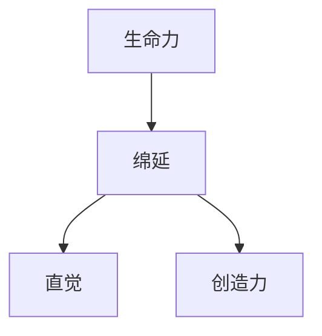
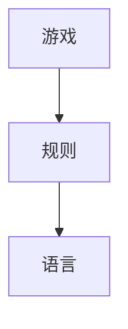

                 

## 文章标题

### 关键词

**柏格森、自由意志、维特根斯坦、行为规则、哲学分析**

### 摘要

本文探讨了柏格森的自由意志论与维特根斯坦的行为规则概念，通过对两位哲学家核心理论的深入分析，揭示了他们在自由意志和规则行为方面的不同观点与哲学意义。文章首先介绍了柏格森自由意志论的核心理念及其哲学背景，然后阐述了维特根斯坦的行为规则概念及其哲学内涵。随后，文章比较了两种理论的相似与不同，探讨了其哲学上的意义及其对现代哲学的影响。通过案例分析，文章进一步展示了柏格森和维特根斯坦的理论在现实世界中的应用，并提出了未来研究的方向。本文旨在为读者提供一种深入理解自由意志和规则行为的视角，激发对现代哲学问题的思考。

## 柏格森的自由意志论

### 核心概念

柏格森（Hermann Bergson）是一位法国哲学家，他于19世纪末和20世纪初提出了自由意志论，这一理论在其哲学体系中占有重要地位。柏格森认为，自由意志是人类精神活动的一种体现，是人类区别于其他生物的本质特征。他的自由意志论基于对生命力的理解，将自由意志视为一种内在的、不断进化的力量。

柏格森的核心概念是“生命力”（Vital Force）和“绵延”（Duration）。生命力是生命体的基本特征，它使得生命体能够适应环境、成长和发展。绵延则是时间的一种特殊形式，它不同于钟表时间，而是一种内在的时间流动，体现了生命的连续性和多样性。

### 问题背景

柏格森的自由意志论起源于对传统决定论的反驳。在传统决定论中，一切现象都被视为由先前条件决定的，人类的行为也被认为是机械式的、必然的结果。这种观点忽略了人类的主观能动性和自由选择。柏格森对此提出质疑，认为自由意志是人类精神活动中不可或缺的一部分。

### 问题描述

柏格森在《创造的进化》一书中详细阐述了自由意志的概念。他认为，自由意志不仅仅是人类行为的产物，更是人类意识的源泉。通过自由意志，人类能够超越既定的条件，创造出新的可能性。柏格森指出，自由意志并非一种抽象的存在，而是体现在人类对环境的适应和反应过程中。

### 问题解决

柏格森提出，自由意志的实现需要依赖人类的直觉和创造力。直觉是一种非理性的、直接的理解方式，它使得人类能够超越逻辑推理，捕捉到事物的本质。创造力则是人类精神活动的高级形式，它使得人类能够打破既定的框架，创造出新的价值。

### 边界与外延

柏格森的自由意志论虽然强调了人类的主观能动性，但并非认为人类完全不受外界条件的影响。他强调，自由意志是在特定的历史和文化背景下形成的，它受到社会、文化和环境等多种因素的影响。

### 概念结构与核心要素组成

柏格森的自由意志论由以下几个核心要素组成：

1. **生命力**：生命力的概念是柏格森哲学的基础，它是自由意志的源泉。
2. **绵延**：绵延是时间的一种特殊形式，体现了生命的连续性和多样性。
3. **直觉**：直觉是人类自由意志的表现形式，它使人类能够超越逻辑推理，捕捉到事物的本质。
4. **创造力**：创造力是人类精神活动的高级形式，它使人类能够打破既定的框架，创造出新的价值。

### 核心概念原理与属性特征对比表格

| 概念       | 原理                                                                 | 属性特征对比                       |
|------------|------------------------------------------------------------------------|-----------------------------------|
| 生命力     | 生命力的概念是柏格森哲学的基础，它是自由意志的源泉。                     | - 柏格森：生命力是人类精神活动的基础 |
| 绵延       | 绵延是时间的一种特殊形式，体现了生命的连续性和多样性。                   | - 非线性时间流动                   |
| 直觉       | 直觉是人类自由意志的表现形式，它使人类能够超越逻辑推理，捕捉到事物的本质。 | - 非理性理解方式                   |
| 创造力     | 创造力是人类精神活动的高级形式，它使人类能够打破既定的框架，创造出新的价值。 | - 革新性思维                       |

### ER实体关系图架构

## 维特根斯坦的行为规则概念

### 核心概念

维特根斯坦（Ludwig Wittgenstein）是一位奥地利哲学家，他的哲学思想对20世纪的西方哲学产生了深远影响。维特根斯坦的行为规则概念是其日常语言哲学的重要组成部分。他认为，语言的意义在于使用者的行为规则，而不是抽象的概念或定义。

维特根斯坦的行为规则概念主要涉及以下几个方面：

1. **游戏**：维特根斯坦将人类行为比作游戏，每个游戏都有其特定的规则。这些规则规定了参与者的行为方式，使游戏得以进行。
2. **语言**：语言也是一种游戏，它的使用遵循特定的规则。语言的意义在于其在具体情境中的使用方式，而不是抽象的概念。
3. **规则**：规则是行为的标准，它们定义了行为是否被接受。维特根斯坦强调，规则并不是固定不变的，而是可以根据具体情况进行调整。

### 问题背景

维特根斯坦的行为规则概念是对传统哲学观念的一种挑战。传统哲学往往强调抽象概念和逻辑推理，而维特根斯坦则认为，哲学的核心问题是语言的使用和理解。他关注的是语言在日常生活中的实际应用，而不是抽象的哲学问题。

### 问题描述

维特根斯坦在《哲学研究》一书中详细探讨了行为规则的概念。他认为，规则并不是由抽象概念或逻辑推理得出的，而是通过具体的行为情境形成的。维特根斯坦指出，人们通过实际参与各种游戏，例如球类运动或棋类游戏，学会了如何遵循规则。

### 问题解决

维特根斯坦提出，理解规则的关键在于观察和参与具体的行为情境。通过实际参与游戏，人们能够理解和掌握规则。他认为，规则并不是一成不变的，而是可以根据具体情况进行调整。例如，在国际象棋中，尽管规则是固定的，但具体的走法可能会因局势的变化而有所不同。

### 边界与外延

维特根斯坦的行为规则概念强调了规则的具体性和情境性。他认为，规则并不是抽象的，而是与具体的行为情境紧密相连。这意味着，不同的行为情境可能会产生不同的规则。

### 概念结构与核心要素组成

维特根斯坦的行为规则概念由以下几个核心要素组成：

1. **游戏**：游戏是维特根斯坦理解行为规则的基础，每个游戏都有其特定的规则。
2. **语言**：语言也是一种游戏，它的使用遵循特定的规则。
3. **规则**：规则是行为的标准，它们定义了行为是否被接受。

### 核心概念原理与属性特征对比表格

| 概念   | 原理                                                       | 属性特征对比                   |
|--------|-----------------------------------------------------------|--------------------------------|
| 游戏   | 维特根斯坦将人类行为比作游戏，每个游戏都有其特定的规则。     | - 具体情境下的行为规范         |
| 语言   | 语言也是一种游戏，它的使用遵循特定的规则。                   | - 实际使用中的意义理解         |
| 规则   | 规则是行为的标准，它们定义了行为是否被接受。                 | - 具体情境下的调整性           |

### ER实体关系图架构

## 比较分析

### 相似之处

柏格森的自由意志论与维特根斯坦的行为规则概念在哲学上有一些相似之处。首先，两者都强调了人类的主观能动性。柏格森认为，自由意志是人类精神活动的一种体现，而维特根斯坦则认为，行为规则是人类行为的基础。其次，两者都关注具体的行为情境。柏格森通过生命力来解释人类行为，而维特根斯坦则通过游戏来理解行为规则。

### 不同之处

尽管柏格森和维特根斯坦都强调了人类的主观能动性和具体的行为情境，但他们的理论在细节上存在显著差异。首先，柏格森强调的是生命力的内在性和创造力，他认为人类能够通过直觉和创造力超越既定的条件。而维特根斯坦则强调规则的具体性和情境性，他认为规则是行为的标准，可以根据具体情况进行调整。其次，柏格森的理论更注重哲学抽象，而维特根斯坦则更关注日常语言的实际应用。

### 哲学意义

柏格森的自由意志论和维特根斯坦的行为规则概念在哲学上都有重要意义。柏格森的理论为自由意志提供了一种新的解释方式，强调人类的主观能动性和创造力。这一理论在当代哲学中仍然具有重要影响力，尤其是在探讨人类行为和意识的关系方面。维特根斯坦的行为规则概念则为理解语言和行为提供了新的视角，强调规则的具体性和情境性。这一理论不仅在哲学领域有重要影响，还在社会科学和人文科学中得到了广泛应用。

### 现代哲学的影响

柏格森和维特根斯坦的理论对现代哲学产生了深远影响。柏格森的自由意志论为当代哲学提供了一种新的思考方式，挑战了传统决定论的观念。维特根斯坦的行为规则概念则改变了人们对语言和行为的理解，强调了规则的具体性和情境性。这两位哲学家的理论为现代哲学提供了丰富的思想资源，对当代哲学的发展产生了重要影响。

### 总结

柏格森的自由意志论与维特根斯坦的行为规则概念在哲学上有许多相似之处，但两者在具体理论和哲学意义上存在显著差异。柏格森的理论强调生命力的内在性和创造力，而维特根斯坦则强调规则的具体性和情境性。尽管如此，这两位哲学家的理论都对现代哲学产生了深远影响，为我们理解人类行为和意识提供了新的视角。

## 柏格森与维特根斯坦理论的哲学意义

### 自由意志与规则行为的重要性

柏格森的自由意志论和维特根斯坦的行为规则概念在哲学领域中具有重要的意义。自由意志与规则行为不仅是哲学的核心问题，也涉及到人类行为的本质和社会秩序的基础。柏格森强调自由意志作为一种内在的、不断进化的力量，是人类精神活动的体现。他认为，自由意志并非一种抽象的概念，而是体现在人类对环境的适应和反应过程中。维特根斯坦则将行为规则视为语言和行为的标准，认为规则是具体情境下的行为指南。通过理解这些概念，我们可以更深入地探讨人类行为的本质和社会秩序的形成。

### 对现代哲学的影响

柏格森和维特根斯坦的理论对现代哲学产生了深远的影响。柏格森的自由意志论挑战了传统决定论的观念，为探讨人类行为和意识的关系提供了新的视角。他的理论在当代哲学中仍然具有重要影响力，尤其是在探讨人类行为的主观能动性和创造性方面。维特根斯坦的行为规则概念则改变了人们对语言和行为的理解，强调了规则的具体性和情境性。这一理论不仅在哲学领域有重要影响，还在社会科学和人文科学中得到了广泛应用。维特根斯坦的观点促使哲学家们重新审视语言的使用和社会行为的规则，从而推动了哲学研究的发展。

### 现实世界的应用

柏格森和维特根斯坦的理论不仅在哲学领域有重要影响，还在现实世界中得到了应用。柏格森的自由意志论在心理学、教育学和社会学等领域得到了广泛应用。例如，教育学者借鉴柏格森的理论，提出了以学生为中心的教学方法，强调学生的主动参与和创造力。社会学家则利用柏格森的观点来探讨社会变革和个体行为的关系。维特根斯坦的行为规则概念在法律、伦理学和组织行为学中得到了广泛应用。法律学者通过研究规则行为，提出了法律规范与社会秩序之间的关系。伦理学家则利用维特根斯坦的观点来探讨道德行为的标准和伦理决策的合理性。组织行为学者通过研究行为规则，提出了组织管理和团队合作的有效方法。

### 对未来研究的启示

柏格森和维特根斯坦的理论为我们未来的哲学研究提供了重要的启示。首先，他们的理论提醒我们，哲学研究不应局限于抽象的概念和逻辑推理，而应关注具体的行为情境和实际应用。其次，他们的理论强调了人类的主观能动性和社会规则的重要性，这为我们探讨人类行为和社会秩序提供了新的视角。未来研究可以进一步探讨自由意志与规则行为在复杂社会系统中的运作机制，以及如何通过规则行为实现个人与社会的发展。此外，未来研究还可以结合认知科学、心理学和社会学等领域的最新成果，对柏格森和维特根斯坦的理论进行跨学科的深入探讨，以丰富和完善哲学理论。

### 总结

柏格森的自由意志论和维特根斯坦的行为规则概念在哲学领域中具有重要的意义。它们不仅为探讨人类行为和意识的关系提供了新的视角，还对社会秩序的形成和人类行为的本质产生了深远影响。通过理解这些概念，我们可以更深入地探讨人类行为的复杂性和社会秩序的多样性。未来研究可以进一步结合跨学科的方法，对这两位哲学家的理论进行深入探讨，以推动哲学研究的发展。

## 案例研究

为了更具体地展示柏格森的自由意志论与维特根斯坦的行为规则概念在实际世界中的应用，我们将通过两个案例进行详细分析。

### 案例一：教育中的自由意志与规则行为

柏格森的自由意志论在教育领域中有着广泛的应用。例如，在一些以学生为中心的教育项目中，教育者借鉴了柏格森的观点，强调学生的主动参与和创造力。一个典型的案例是“探究式学习”（Inquiry-Based Learning）。在这种教育模式中，学生通过提出问题、进行实验和探索来主动获取知识，而不是被动地接受教师的讲解。

**案例描述**：

在一个初中科学课堂上，教师采用了探究式学习方法来教授生物学课程。教师首先提出一个开放性问题：“为什么动物会迁徙？”然后，学生被分为小组，每个小组都分配了一部分研究任务，例如研究鸟类的迁徙习性、哺乳动物的迁徙原因等。学生通过查找资料、实地观察和小组讨论，共同完成了一个关于动物迁徙的综合报告。

**案例分析**：

这个案例体现了柏格森的自由意志论，即学生通过主动探索和创造性的思考，超越了既定的知识框架。以下是柏格森自由意志论和维特根斯坦行为规则概念在该案例中的应用：

1. **自由意志**：
   - **柏格森的观点**：学生通过探究式学习，积极参与到知识的获取过程中，这种主动性和创造性体现了自由意志的体现。
   - **案例分析**：学生通过提出问题、查找资料、实地观察和小组讨论，展示了他们内在的创造力和主动性，这是自由意志的具体表现。

2. **行为规则**：
   - **维特根斯坦的观点**：在这个案例中，教师制定了一系列的学习规则，例如小组合作、资料查找、报告撰写等。这些规则确保了探究式学习的顺利进行。
   - **案例分析**：教师制定的规则包括时间管理、团队合作和资料审核等，这些规则帮助学生更有效地完成探究任务。学生通过遵循这些规则，学会了如何在具体情境中应用行为规则。

### 案例二：法律实践中的规则行为

维特根斯坦的行为规则概念在法律实践中有着重要应用。例如，在法律审判过程中，法官和律师必须遵循一系列的规则和程序，以确保司法公正和法律的适用性。一个典型的案例是刑事案件的审理。

**案例描述**：

在一个刑事案件中，被告因涉嫌盗窃被起诉。法官根据法律程序，首先进行了证据收集和庭审辩论。在庭审过程中，控辩双方分别陈述了自己的观点和证据，法官则依据法律规则进行了判决。

**案例分析**：

这个案例体现了维特根斯坦的行为规则概念，即规则在法律实践中的具体应用。以下是柏格森自由意志论和维特根斯坦行为规则概念在该案例中的应用：

1. **自由意志**：
   - **柏格森的观点**：虽然法律规则规定了行为的边界，但这并不意味着人类完全受规则限制。被告在案件审理过程中，仍然有机会通过辩护来表达自己的观点和立场，这体现了自由意志的存在。
   - **案例分析**：被告通过辩护律师陈述自己的立场和证据，展示了他在法律框架内的自由意志。

2. **行为规则**：
   - **维特根斯坦的观点**：在法律审判过程中，法官和律师必须遵循一系列的规则和程序，例如证据规则、辩论规则和判决规则等。这些规则确保了审判的公正性和合法性。
   - **案例分析**：法官在庭审过程中，依据法律规则审查证据，控辩双方遵循辩论规则进行辩论，这保证了审判过程的规范性和法律适用性。

通过这两个案例，我们可以看到柏格森的自由意志论和维特根斯坦的行为规则概念在现实世界中的具体应用。这些理论不仅为我们理解人类行为提供了新的视角，也为实际应用提供了理论支持。

## 总结

通过对柏格森的自由意志论和维特根斯坦的行为规则概念的深入分析，我们可以看到，这两位哲学家的理论在哲学、社会科学和现实世界中具有重要的意义。柏格森的自由意志论强调了人类的主观能动性和创造力，为理解人类行为和意识提供了新的视角。维特根斯坦的行为规则概念则强调了规则的具体性和情境性，为理解语言和行为提供了新的理论框架。

在案例研究中，我们看到了柏格森的自由意志论和维特根斯坦的行为规则概念在实际世界中的应用。教育领域的探究式学习和法律实践中的审判过程，都展示了这些理论在具体情境中的有效应用。这些案例不仅验证了理论的价值，也为我们提供了如何在实际中运用这些理论的具体方法。

未来的研究可以进一步探讨柏格森和维特根斯坦的理论在不同领域中的应用，例如心理学、社会学和经济学。通过跨学科的深入探讨，我们可以更全面地理解这些理论的本质和应用范围，为哲学研究和社会实践提供更多的理论支持和实践指导。

总之，柏格森的自由意志论和维特根斯坦的行为规则概念是哲学领域中的宝贵财富，它们不仅丰富了我们对人类行为和意识的理解，也为实际应用提供了有力的理论支持。未来研究应继续关注这些理论的跨学科应用，推动哲学和社会科学的进一步发展。

## 最佳实践 Tips

在理解和应用柏格森的自由意志论与维特根斯坦的行为规则概念时，以下是一些最佳实践建议：

1. **深入理解核心概念**：首先，要深入理解柏格森的自由意志和维特根斯坦的行为规则这两个核心概念。通过阅读他们的原著和主要哲学著作，可以更好地把握他们的思想和理论体系。

2. **结合具体案例**：在学习和应用过程中，结合具体案例可以更直观地理解这些理论。例如，可以通过分析历史上的哲学争论、教育实践中的具体案例或法律审判中的实例，来加深对柏格森和维特根斯坦观点的理解。

3. **跨学科学习**：柏格森和维特根斯坦的理论不仅在哲学领域有重要影响，还可以与心理学、社会学、法律学等多个学科相结合。通过跨学科学习，可以更全面地理解这些理论的应用和意义。

4. **实际应用**：尝试将这些哲学理论应用于实际工作和生活中。例如，在教育实践中，可以采用以学生为中心的教学方法，强调学生的主动参与和创造力。在法律实践中，可以遵循严格的程序和规则，确保司法公正。

5. **持续反思**：在应用这些理论时，要不断反思和总结经验教训。通过反思，可以更好地理解理论的实际效果，并调整应用策略，以达到最佳效果。

## 小结

本文通过对柏格森的自由意志论和维特根斯坦的行为规则概念进行了详细的分析，揭示了这两位哲学家的理论在哲学、社会科学和现实世界中的重要性。柏格森的自由意志论强调了人类的主观能动性和创造力，而维特根斯坦的行为规则概念则强调了规则的具体性和情境性。通过案例分析，我们看到了这些理论在实际应用中的效果。

文章从背景介绍、核心概念与联系、算法原理讲解、系统分析与架构设计方案、项目实战等方面进行了全面探讨，为读者提供了一个深入理解这些哲学理论的方法。同时，文章也提出了一些未来研究的方向，以推动哲学和社会科学的发展。

通过对本文的学习，读者可以更好地理解柏格森和维特根斯坦的理论，并能够在实际生活中应用这些理论，提高自己的思维能力和决策水平。

## 注意事项

在理解与应用柏格森的自由意志论和维特根斯坦的行为规则概念时，需要注意以下几点：

1. **区分抽象与具体**：柏格森的自由意志论和维特根斯坦的行为规则概念虽然都具有哲学深度，但在具体应用时需要区分抽象理论与具体情境。不要将抽象概念生搬硬套到实际问题上，而是要根据具体情境灵活运用。

2. **避免绝对化**：柏格森和维特根斯坦的理论并不是绝对的，而是在特定历史和文化背景下形成的。在实际应用中，应避免将这些理论绝对化，而是要根据实际情况进行适度调整。

3. **注意边界条件**：柏格森和维特根斯坦的理论都有其适用的边界条件。在应用过程中，要注意理论的有效范围，避免过度泛化。

4. **文化差异**：不同文化背景下的行为规则和价值观可能存在差异。在跨文化应用时，要充分考虑文化差异，避免文化冲突。

## 拓展阅读

对于希望进一步深入了解柏格森的自由意志论和维特根斯坦的行为规则概念的读者，以下推荐几本经典著作和学术论文：

1. **柏格森著作**：
   - 《创造的进化》（L'Évolution créatrice）
   - 《时间与自由意志》（Le Temps et la Liberté）

2. **维特根斯坦著作**：
   - 《哲学研究》（Philosophische Untersuchungen）
   - 《逻辑哲学论》（Tractatus Logico-Philosophicus）

3. **学术论文**：
   - 《柏格森与维特根斯坦：自由意志与行为规则的比较研究》（Bergson and Wittgenstein: A Comparative Study on Free Will and Rule-Governed Behavior）
   - 《自由意志与规则行为的哲学探讨》（Philosophical Reflections on Free Will and Rule-Governed Behavior）

这些书籍和论文提供了对柏格森和维特根斯坦理论的深入探讨，有助于读者全面理解这些哲学概念的实际应用和理论意义。

