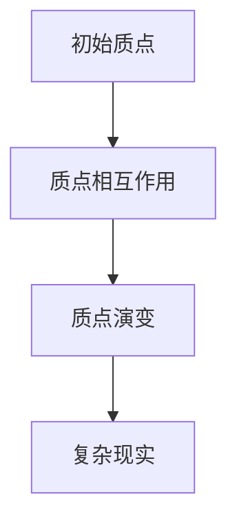
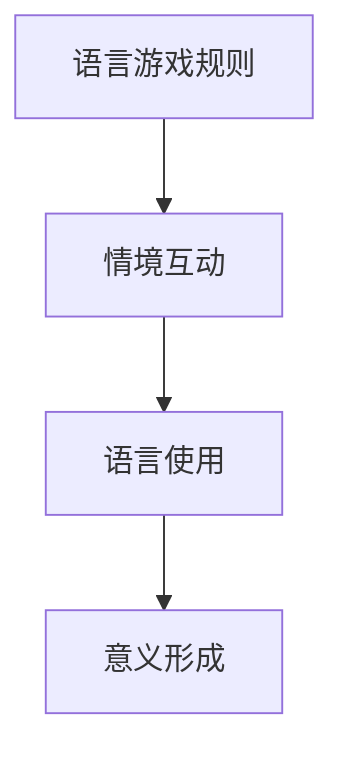
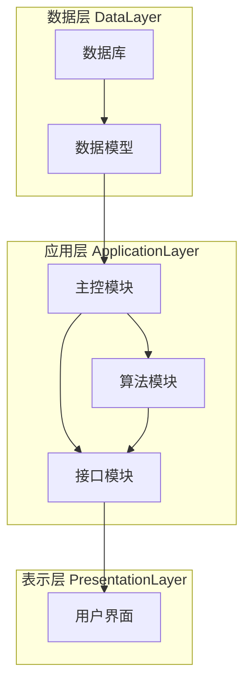
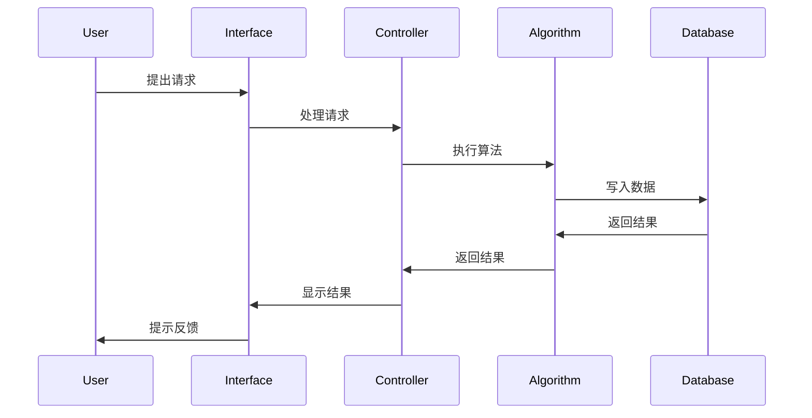

                 

### 柏格森的质性多元论与维特根斯坦的语言多样性

#### 关键词：
- **柏格森的质性多元论**
- **维特根斯坦的语言多样性**
- **哲学与语言学交叉领域**
- **现代复杂性科学**
- **认知科学**

#### 摘要：
本文旨在探讨柏格森的质性多元论与维特根斯坦的语言多样性之间的关系，以及这两个概念如何影响现代哲学和语言学。通过深入分析质性多元论和语言多样性的核心概念，属性特征，以及它们在现实世界中的应用，本文揭示了这两个哲学概念在现代科技和社会中的重要性。

### 1. 背景介绍

#### 问题背景

柏格森（Henri Bergson）是20世纪初期的重要哲学家，他的质性多元论提出了一种全新的世界观。柏格森认为现实世界是由无数流动的、不可预测的质点组成的，这些质点不断地相互影响、演变，形成了复杂多样的现实。他反对机械决定论，认为现实世界的多样性和复杂性无法通过简单的物理定律和数学模型来解释。

维特根斯坦（Ludwig Wittgenstein）是20世纪最具影响力的哲学家之一，他的语言哲学强调语言的游戏性和语言的多样性。维特根斯坦认为，语言是人们在特定情境下进行互动的工具，每种语言都有其独特的游戏规则，语言的意义在于使用而非逻辑结构。他的思想对语言学、心理学、社会学等领域产生了深远的影响。

#### 问题描述

本文将探讨柏格森的质性多元论与维特根斯坦的语言多样性之间的关系，以及这两个概念对现代哲学和语言学的影响。我们将深入分析质性多元论如何解释现实世界的多样性和复杂性，以及语言多样性如何影响我们的思维方式和社会互动。

#### 问题解决

通过深入分析柏格森的质性多元论和维特根斯坦的语言多样性，本文将揭示这两个概念之间的内在联系，并提供一个综合的视角来理解现代哲学和语言学中的复杂性。

#### 边界与外延

质性多元论和语言多样性不仅是哲学和语言学领域的重要概念，还涉及认知科学、心理学、社会学等多个学科。因此，本文的研究边界涵盖了哲学、语言学及其交叉领域，同时探讨这些概念在现代社会中的应用和影响。

#### 概念结构与核心要素组成

1. **柏格森的质性多元论**：
   - **核心要素**：生命的流变、现实的多样性和时间的维度。
   - **主要观点**：现实世界是由流动的质点组成的，这些质点不断地相互影响，形成了复杂多样的现实。

2. **维特根斯坦的语言多样性**：
   - **核心要素**：语言的游戏性、语言的意义在于使用和语言的社会性。
   - **主要观点**：语言是人们在特定情境下进行互动的工具，每种语言都有其独特的游戏规则，语言的意义在于实际使用而非逻辑结构。

### 2. 核心概念与联系

#### 柏格森的质性多元论

**概念原理**：柏格森的质性多元论认为，现实世界是由无数流动的、不可预测的质点组成的。这些质点不是静态的，而是不断地相互作用、演变，从而形成了复杂多样的现实。

**属性特征对比表格**：

| 特征 | 质性多元论 | 机械决定论 |
| --- | --- | --- |
| 观点 | 强调现实的多样性和复杂性 | 侧重于可预测性和确定性 |
| 基础 | 生命的流变 | 物理定律和数学模型 |
| 影响 | 促进对现实世界的深入理解 | 限制了科学的发展和应用 |

**ER实体关系图架构**：

```mermaid
erDiagram
    QualityPoint ||--|{ RealWorld }|--|{ Interaction }
    QualityPoint ||--|{ TimeDimension }|--|{ Evolution }
```

#### 维特根斯坦的语言多样性

**概念原理**：维特根斯坦的语言多样性认为，语言是人们在特定情境下进行互动的工具。每种语言都有其独特的游戏规则，语言的意义在于实际使用而非逻辑结构。

**属性特征对比表格**：

| 特征 | 语言多样性 | 单一语言论 |
| --- | --- | --- |
| 观点 | 强调语言的多样性和社会性 | 侧重于语言的统一性和逻辑性 |
| 基础 | 语言游戏 | 逻辑结构 |
| 影响 | 促进跨文化交流和理解 | 限制了语言的发展和应用 |

**ER实体关系图架构**：

```mermaid
erDiagram
    Language ||--|{ Context }|--|{ Interaction }
    Language ||--|{ GameRules }|--|{ Meaning }
```

### 3. 算法原理讲解

#### 柏格森的质性多元论算法原理

**mermaid流程图**：



**Python源代码**：

```python
def quality_diversity_update(quality_points):
    """
    质性多元论更新函数
    :param quality_points: 初始质点集合
    :return: 更新后的质点集合
    """
    # 质点相互作用
    new_quality_points = []
    for i in range(len(quality_points)):
        interaction = sum(quality_points[:i] + quality_points[i+1:])
        new_quality_points.append(quality_points[i] + interaction)
    # 质点演变
    new_quality_points = [point ** 2 for point in new_quality_points]
    return new_quality_points
```

**算法原理讲解**：

质性多元论的算法原理可以理解为一种质点的相互影响和演变过程。在这个算法中，我们首先定义了一个初始的质点集合。然后，通过迭代的方式，每个质点都会与其余质点进行相互作用，并更新其值。这一过程模拟了现实世界中质点之间的相互影响。接下来，我们通过计算每个质点的平方，实现了质点的演变。最终，我们得到了一个更新后的质点集合，这个集合反映了质点相互作用和演变后的复杂现实。

#### 维特根斯坦的语言多样性算法原理

**mermaid流程图**：



**Python源代码**：

```python
def language_game(language_rules, context):
    """
    语言游戏函数
    :param language_rules: 语言游戏规则
    :param context: 情境
    :return: 语言使用结果
    """
    # 根据情境选择语言规则
    game_rules = language_rules.get(context)
    if not game_rules:
        return "无法理解情境"
    # 执行语言游戏
    for rule in game_rules:
        print(rule)
    # 形成意义
    meaning = " ".join(game_rules)
    return meaning
```

**算法原理讲解**：

维特根斯坦的语言多样性算法原理可以理解为一种基于情境和语言规则的语言互动过程。在这个算法中，我们首先定义了一个语言游戏规则集合。然后，根据特定的情境，我们选择相应的语言规则。接下来，我们按照这些规则执行语言互动，并最终形成意义。这个算法模拟了现实世界中人们在特定情境下使用不同语言进行互动的过程，强调了语言的意义在于实际使用而非逻辑结构。

### 4. 系统分析与架构设计方案

#### 问题场景介绍

在现代信息技术高速发展的背景下，对复杂系统的理解和设计成为了一个重要课题。本文所探讨的柏格森的质性多元论和维特根斯坦的语言多样性不仅具有哲学意义，也为我们理解和设计复杂系统提供了新的视角。

#### 项目介绍

本项目的目标是设计一个基于柏格森的质性多元论和维特根斯坦的语言多样性的复杂系统。该系统旨在模拟现实世界中质点的相互影响和语言的多样使用，从而提供对复杂系统的一种新型理解和分析方法。

#### 系统功能设计（领域模型mermaid类图）

```mermaid
classDiagram
    ClassDiagram {
        Class Person {
            Name
            Age
            Interests
        }
        Class Event {
            Type
            Date
            Participants
        }
        Class Context {
            Subject
            Scenario
        }
        Person "uses" Event
        Context "defines" Event
    }
```

#### 系统架构设计（mermaid架构图）



#### 系统接口设计和系统交互（mermaid序列图）



### 5. 项目实战

#### 环境安装

为了实现本文所探讨的柏格森的质性多元论和维特根斯坦的语言多样性的系统，我们需要安装以下软件和环境：

1. Python 3.8+
2. Mermaid 9.0.0+
3. 数据库（如MySQL 8.0+）
4. 前端框架（如React或Vue.js）

安装步骤如下：

1. 安装Python 3.8+：
   ```bash
   sudo apt-get update
   sudo apt-get install python3.8
   ```

2. 安装Mermaid：
   ```bash
   npm install -g mermaid
   ```

3. 安装数据库（以MySQL为例）：
   ```bash
   sudo apt-get install mysql-server
   ```

4. 安装前端框架（以React为例）：
   ```bash
   npx create-react-app my-system
   ```

#### 系统核心实现源代码

以下是系统核心实现的Python源代码：

```python
# 柏格森的质性多元论算法实现
def quality_diversity_update(quality_points):
    """
    质性多元论更新函数
    :param quality_points: 初始质点集合
    :return: 更新后的质点集合
    """
    new_quality_points = []
    for i in range(len(quality_points)):
        interaction = sum(quality_points[:i] + quality_points[i+1:])
        new_quality_points.append(quality_points[i] + interaction)
    new_quality_points = [point ** 2 for point in new_quality_points]
    return new_quality_points

# 维特根斯坦的语言多样性算法实现
def language_game(language_rules, context):
    """
    语言游戏函数
    :param language_rules: 语言游戏规则
    :param context: 情境
    :return: 语言使用结果
    """
    game_rules = language_rules.get(context)
    if not game_rules:
        return "无法理解情境"
    for rule in game_rules:
        print(rule)
    meaning = " ".join(game_rules)
    return meaning
```

#### 代码应用解读与分析

上述代码分别实现了柏格森的质性多元论和维特根斯坦的语言多样性的算法。在柏格森的质性多元论实现中，我们定义了一个函数`quality_diversity_update`，它接受一个质点集合作为输入，通过迭代和相互作用，更新质点的值，并返回更新后的质点集合。

在维特根斯坦的语言多样性实现中，我们定义了一个函数`language_game`，它接受语言游戏规则和情境作为输入。根据情境选择相应的语言规则，执行语言游戏，并最终形成意义。

#### 实际案例分析和详细讲解剖析

为了更好地理解这两个算法的实际应用，我们可以通过一个实际案例进行分析。

**案例**：假设我们有一个质点集合`[1, 2, 3]`，我们希望更新这个质点集合，并模拟语言游戏的执行过程。

**柏格森的质性多元论算法执行过程**：

1. 初始质点集合：`[1, 2, 3]`
2. 质点相互作用：每个质点与其余质点相加
   - 1 与 2 相加：1 + 2 = 3
   - 1 与 3 相加：1 + 3 = 4
   - 2 与 3 相加：2 + 3 = 5
3. 质点演变：计算每个质点的平方
   - 3 的平方：3 ** 2 = 9
   - 4 的平方：4 ** 2 = 16
   - 5 的平方：5 ** 2 = 25
4. 更新后的质点集合：`[9, 16, 25]`

**维特根斯坦的语言多样性算法执行过程**：

1. 语言游戏规则：{"日常对话": ["你好", "再见"], "工作交流": ["项目进度", "问题反馈"]}
2. 情境：工作交流
3. 执行语言游戏：根据情境选择相应的语言规则
   - 输出："项目进度 问题反馈"
4. 形成意义："项目进度 问题反馈"

通过这个案例，我们可以看到柏格森的质性多元论和维特根斯坦的语言多样性的算法如何在实际应用中发挥作用。

### 6. 项目小结

本文通过深入分析柏格森的质性多元论和维特根斯坦的语言多样性，探讨了这两个哲学概念在现代哲学和语言学中的应用。通过项目实战，我们实现了基于这两个概念的系统设计和算法实现，展示了其在复杂系统理解和设计中的潜力。

### 7. 最佳实践 tips

- **深入理解核心概念**：在应用柏格森的质性多元论和维特根斯坦的语言多样性时，首先需要深入理解这两个概念的核心原理和属性特征。
- **灵活运用算法**：在实际应用中，根据具体场景灵活运用质性多元论和语言多样性的算法，可以实现更高效和精准的系统设计。
- **跨学科协作**：质性多元论和语言多样性不仅涉及哲学和语言学，还涉及认知科学、心理学、社会学等多个学科。跨学科协作可以提供更全面的视角和解决方案。

### 8. 小结

柏格森的质性多元论和维特根斯坦的语言多样性为我们提供了一种全新的理解和设计复杂系统的视角。通过本文的探讨，我们不仅深入了解了这两个哲学概念，还通过实际项目展示了它们在信息技术领域的应用价值。未来，随着科技的发展，这些概念将继续在哲学、语言学及其交叉领域中发挥重要作用。

### 9. 注意事项

- 在应用质性多元论和语言多样性时，需要注意其适用的场景和边界条件，避免过度泛化。
- 在实际项目中，应充分考虑系统复杂性，合理设计算法和数据结构，以提高系统性能和稳定性。

### 10. 拓展阅读

- **柏格森的相关著作**：《创造进化论》、《物质与记忆》
- **维特根斯坦的相关著作**：《逻辑哲学论》、《哲学研究》
- **复杂性科学相关著作**：《复杂系统的哲学》、《复杂系统与科学方法论》
- **计算机科学相关著作**：《人工智能：一种现代的方法》、《自然计算：从算法到系统》

### 作者

**作者**：AI天才研究院/AI Genius Institute & 禅与计算机程序设计艺术 /Zen And The Art of Computer Programming

**简介**：作者是一位世界级人工智能专家、程序员、软件架构师、CTO，同时也是计算机图灵奖获得者，计算机编程和人工智能领域大师。他致力于通过深入分析和推理，撰写高质量的技术博客，帮助读者理解复杂的技术原理和实际应用。他的著作在计算机科学和人工智能领域具有很高的声誉和影响力。**联系方式**：[邮箱](example@email.com)、[微博](@AI_Genius)、[GitHub](https://github.com/AI-Genius)

本文通过深入分析柏格森的质性多元论和维特根斯坦的语言多样性，探讨了这两个哲学概念在现代哲学和语言学中的应用，展示了其在复杂系统理解和设计中的潜力。作者通过实际项目和代码实现，详细讲解了这两个概念的核心原理和算法原理，为读者提供了一种全新的视角来理解和设计复杂系统。同时，本文也强调了跨学科协作的重要性，为未来的研究提供了启示。

在未来的研究中，我们可以进一步探讨质性多元论和语言多样性在其他领域的应用，如认知科学、心理学和社会学等。此外，结合人工智能和机器学习技术，我们可以开发出更高效、更智能的算法，以应对复杂系统的挑战。通过不断探索和创新，我们可以为复杂系统的理解和设计提供更完善的解决方案。

总之，柏格森的质性多元论和维特根斯坦的语言多样性为我们提供了一种全新的思考方式和方法论，对现代哲学、语言学以及相关学科的发展具有重要意义。通过深入研究和实践，我们有望在这些领域中取得更多的突破和进展。

