                 

### 柏格森的质性多元论概述

柏格森（Henri Bergson）是20世纪法国著名的哲学家，他的思想对后世产生了深远的影响。柏格森的质性多元论是他哲学思想的核心，这一理论强调现实世界的多样性和复杂性，主张通过质变而非量变来解释社会和文化现象。在本章中，我们将详细探讨柏格森的生平、哲学思想，以及质性多元论的核心概念和其历史背景与发展。

#### 1.1 柏格森的生平与哲学思想

亨利·柏格森（Henri Bergson）于1859年11月18日出生于法国巴黎，自幼聪颖好学。他曾在巴黎高等师范学院学习，之后在巴黎索邦大学获得博士学位。柏格森的哲学思想受到了多种哲学流派的启发，包括实证主义、进化论和康德哲学。他的思想主要关注人类的直觉、意识、时间和自由意志等问题。

柏格森的主要哲学著作包括《时间与自由意志》、《物质与记忆》和《创造进化论》。这些著作展示了他的质性多元论和直觉主义思想，对现代哲学产生了深远的影响。柏格森认为，现实世界是一个不断变化和发展的过程，质的变化是这一过程的核心。

#### 1.2 质性多元论的核心概念

柏格森的质性多元论认为，现实世界是由无数不同的质性因素组成的，这些因素相互作用，产生了质的变化。以下是质性多元论的一些核心概念：

- **直觉**：柏格森认为直觉是人类理解世界的关键。通过直觉，人们能够感知事物的本质，而不是仅仅停留在表面的观察。

- **持续进化**：柏格森认为，现实世界是一个持续进化的过程。这种进化是通过质变实现的，而不是通过量变。质变指的是事物本质的变化，这种变化是不可逆的。

- **质**：柏格森所说的“质”是指事物的本质属性，是区分事物之间差异的关键。每个事物都有其独特的质性，这些质性因素相互作用，形成了复杂的世界。

- **社会和文化**：柏格森认为，社会和文化现象是质的变化的结果。不同的社会和文化背景导致了不同的质性因素，这些因素相互作用，形成了多样化的社会和文化形态。

#### 1.3 质性多元论的历史背景与发展

柏格森的质性多元论是在19世纪末和20世纪初的哲学背景下产生的。当时，自然科学的发展和对人类意识的深入研究推动了哲学的变革。实证主义和进化论对柏格森的思想产生了重要影响，他试图在科学和哲学之间建立一种新的桥梁。

柏格森的质性多元论在当时引起了广泛关注和争议。他的思想对后来的哲学流派，如现象学和存在主义，产生了深远的影响。质性多元论强调了现实世界的复杂性和多样性，为后来的哲学家提供了新的思考方向。

在20世纪，柏格森的质性多元论得到了进一步的发展。一些哲学家试图将柏格森的思想与物理学、心理学和文化研究等领域相结合，形成了多种新的哲学流派。

#### 总结

柏格森的质性多元论是他哲学思想的核心，这一理论强调现实世界的多样性和复杂性，主张通过质变而非量变来解释社会和文化现象。在接下来的章节中，我们将进一步探讨柏格森的质性多元论与存在论、知识论、伦理学和艺术等方面的联系。

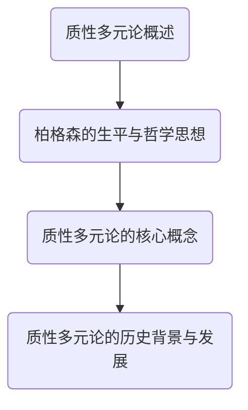

```latex
$$
\text{质变} = \text{质因素相互作用}
$$
$$
\text{直觉} = \text{感知事物本质}
$$
$$
\text{持续进化} = \text{不可逆的质的变化}
$$
$$
\text{社会文化现象} = \text{质变的结果}
$$
```

### 柏格森的质性多元论与存在论

柏格森的质性多元论在存在论中有着独特的地位，他的理论试图揭示存在的本质，强调现实世界的多样性和复杂性。在本章中，我们将探讨质性多元论与存在论之间的关系，详细分析质性多元论如何解释存在的本质，以及它对时间、物质的关系的理解。

#### 2.1 质性多元论与存在的本质

柏格森的质性多元论认为，存在是由无数不同的质性因素组成的。这些质性因素是相互独立的，但又是相互关联的。在柏格森看来，存在并不是一个单一的整体，而是一个由多种质性因素组成的多元体系。

柏格森强调，存在是一种动态的过程，这种过程是通过质的变化实现的。质的变化是存在的核心，它代表了事物本质的变化。因此，存在并不是一个静态的概念，而是一个不断变化和发展的过程。

柏格森认为，存在的本质在于质的变化。每个事物都有其独特的质性，这些质性因素相互作用，形成了复杂的现实世界。存在的本质不是通过量的积累来实现的，而是通过质的变化来实现的。这种质的变化是不可逆的，它代表了事物本质的根本改变。

#### 2.2 质性多元论与时间的关系

柏格森的质性多元论与时间的关系是其哲学思想的一个重要方面。他认为，时间是存在的表现形式，是质的变化的连续性。

柏格森提出了“时间直觉”这一概念，他认为，通过直觉，人们能够感知到时间的流动。时间不是线性的，而是连续性的。每一刻都有其独特的质性，这些质性因素相互作用，形成了时间的连续性。

柏格森强调了时间的不可逆性。他认为，时间是一个单向的流动，过去的时间无法回到现在，现在的时间无法回到过去。时间的不可逆性体现了质的变化的不可逆性，这也是存在的本质。

#### 2.3 质性多元论与物质的关系

柏格森的质性多元论与物质的关系是其存在论的重要组成部分。他认为，物质是质的变化的载体，是存在的表现形式。

柏格森认为，物质不是静态的，而是动态的。物质的存在是通过质的变化来实现的。每一块物质都有其独特的质性，这些质性因素相互作用，形成了复杂的物质世界。

柏格森强调了物质的多样性。他认为，物质世界是由无数不同的质性因素组成的，这些质性因素相互作用，形成了多样化的物质形态。物质的存在是通过质的变化来实现的，这种质的变化是不可逆的。

#### 综合分析

柏格森的质性多元论在存在论中具有独特的地位。他的理论试图揭示存在的本质，强调现实世界的多样性和复杂性。通过质的变化，柏格森解释了存在的本质，并分析了时间、物质的关系。

质性多元论认为，存在是由无数不同的质性因素组成的，这些质性因素相互作用，形成了复杂的现实世界。质的变化是存在的核心，它代表了事物本质的变化。时间是通过质的变化来实现的，具有不可逆性。物质是质的变化的载体，是存在的表现形式，也具有多样性。

柏格森的质性多元论为存在论提供了一种新的视角，他试图通过质的变化来解释存在的本质，这一理论在哲学、科学和文化等领域产生了深远的影响。

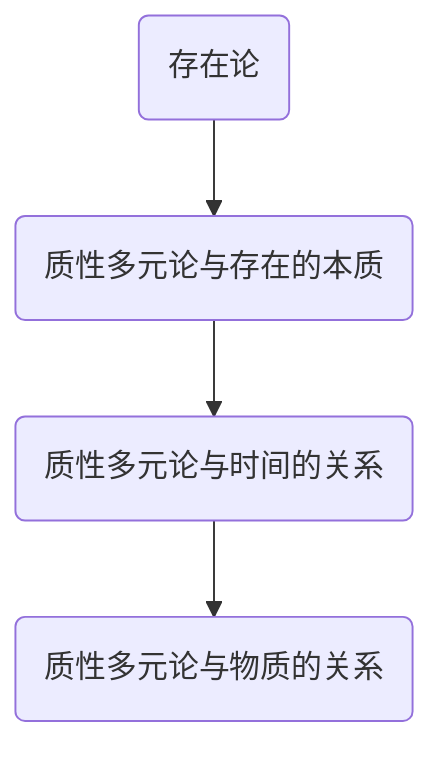

```latex
$$
\text{存在} = \text{质性因素组成的多态体系}
$$
$$
\text{质的变化} = \text{存在本质}
$$
$$
\text{时间} = \text{质的变化连续性}
$$
$$
\text{物质} = \text{质的变化载体}
$$
```

### 柏格森的质性多元论与知识论

柏格森的质性多元论在知识论领域中也具有重要地位，他的理论试图探讨知识的本质、认识的局限以及语言与知识的关系。在本章中，我们将详细分析柏格森的质性多元论如何解释知识的本质，以及它对认识局限和语言关系的理解。

#### 3.1 质性多元论与知识的本质

柏格森认为，知识的本质在于对事物本质的感知和认识。他的质性多元论强调，知识不是通过抽象的概念或符号来获得的，而是通过直觉和直接的感知来实现的。柏格森提出了“直觉主义”这一概念，认为直觉是人类理解世界的关键。

在柏格森看来，知识并不是一个静态的、固定的体系，而是一个动态的过程。知识的本质在于对事物的质变和本质的感知，这种感知是通过直觉实现的。直觉使他能够直接感知事物的本质，而不是通过抽象的思考和逻辑推理。

#### 3.2 质性多元论与认识的局限

柏格森的质性多元论也揭示了认识的局限。他认为，人类的认识是有限的，这是因为我们的认识方式是基于直觉和感知的，而直觉和感知往往受到我们的主观经验和感性认知的限制。

柏格森指出，认识的过程并不总是能够完全准确地反映事物的本质。我们的认识往往受到主观经验和感性认知的影响，这导致我们的认识存在局限。例如，我们无法通过直觉感知到时间的本质，也无法完全理解物质的微观结构。

柏格森认为，认识的局限并不是由于知识的不足，而是由于我们的感知方式的局限性。我们的感知方式限制了我们对世界的认识，使我们无法完全理解事物的本质。

#### 3.3 质性多元论与语言的关系

柏格森的质性多元论也探讨了语言与知识的关系。他认为，语言是人类交流和理解世界的重要工具，但语言并不是知识的本质。

柏格森指出，语言的意义并不是固定不变的，而是取决于使用者和情境。语言游戏多元论认为，语言的意义在于使用者和情境的相互作用，不同的使用者和情境赋予了语言不同的意义。

在柏格森看来，语言的作用是帮助我们表达和交流我们的直觉和感知。语言并不是知识的本质，而是知识的载体。通过语言，我们可以表达我们的直觉和感知，从而与他人交流和分享我们的知识。

#### 综合分析

柏格森的质性多元论在知识论领域提出了独特的观点，他强调直觉和感知在知识获取中的重要性，同时也揭示了认识的局限和语言的关系。他认为，知识的本质在于对事物本质的感知，这种感知是通过直觉实现的。认识的局限是由于我们的感知方式的局限性，而语言是知识的载体，通过语言我们可以表达和交流我们的直觉和感知。

柏格森的质性多元论为知识论提供了一种新的视角，他试图通过直觉和感知来解释知识的本质，这一理论在哲学、科学和文化等领域产生了深远的影响。

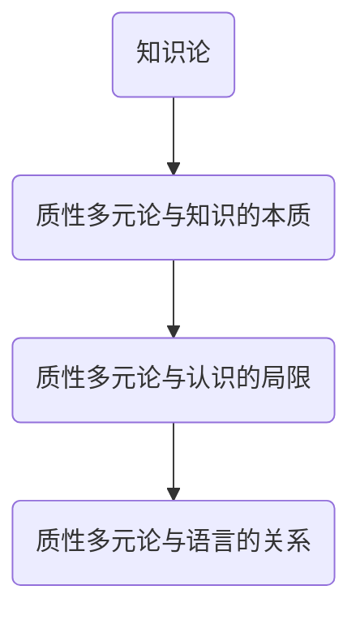

```latex
$$
\text{知识本质} = \text{直觉与感知}
$$
$$
\text{认识局限} = \text{感知方式限制}
$$
$$
\text{语言关系} = \text{知识表达与交流}
$$
```

### 柏格森的质性多元论与伦理学

柏格森的质性多元论在伦理学领域中也具有独特的地位，他的理论试图探讨道德的本质、道德的多样性和道德责任。在本章中，我们将详细分析柏格森的质性多元论如何解释道德的本质，以及它对道德多样性和道德责任的理解。

#### 4.1 质性多元论与道德的本质

柏格森认为，道德的本质在于对质的变化的感知和尊重。他的质性多元论强调，现实世界是由无数不同的质性因素组成的，这些质性因素相互作用，形成了复杂的世界。柏格森认为，道德是对这些质性因素的尊重和保护。

在柏格森看来，道德并不是一个单一的概念，而是一个多元的概念。不同的社会和文化背景导致了不同的质性因素，这些质性因素相互作用，形成了多样化的道德观念。道德的本质在于对质的变化的感知和尊重，这种感知和尊重是通过直觉实现的。

#### 4.2 质性多元论与道德的多样性

柏格森的质性多元论也揭示了道德的多样性。他认为，不同的社会和文化背景导致了不同的道德观念。不同的质性因素相互作用，形成了多样化的道德观念。这种多样性并不是混乱和无序的，而是具有其内在的逻辑和规律。

柏格森指出，道德的多样性并不意味着道德是相对的或无意义的。相反，道德的多样性反映了现实世界的复杂性和多样性。每个社会和文化都有其独特的道德观念，这些观念是基于其对质性因素的感知和尊重。

#### 4.3 质性多元论与道德的责任

柏格森的质性多元论也探讨了道德责任的问题。他认为，道德责任在于对质的变化的感知和尊重。每个人都应该对自己的行为负责，这是因为我们的行为会影响到周围的世界，影响到其他的质性因素。

柏格森认为，道德责任不仅仅是对自己的行为负责，也是对整个社会和文化的责任。我们的行为会对社会和文化产生影响，这种影响是长期的、深远的。因此，每个人都应该对自己的行为负责，尊重和保护其他的质性因素。

#### 综合分析

柏格森的质性多元论在伦理学领域提出了独特的观点，他强调道德的本质在于对质的变化的感知和尊重。他认为，道德并不是一个单一的概念，而是一个多元的概念，反映了现实世界的复杂性和多样性。道德责任在于对质的变化的感知和尊重，每个人都应该对自己的行为负责，尊重和保护其他的质性因素。

柏格森的质性多元论为伦理学提供了一种新的视角，他试图通过质的变化来解释道德的本质，这一理论在哲学、文化和社会科学等领域产生了深远的影响。

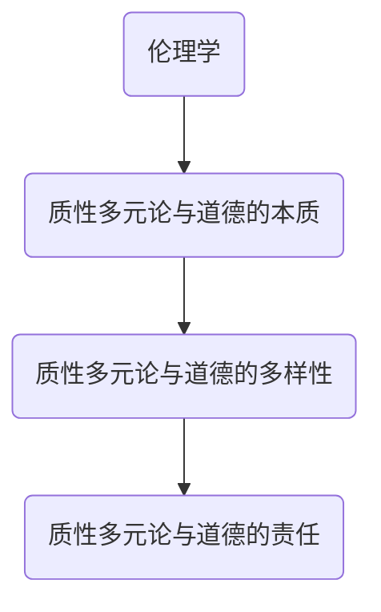

```latex
$$
\text{道德本质} = \text{对质的变化的感知和尊重}
$$
$$
\text{道德多样性} = \text{社会文化背景的差异}
$$
$$
\text{道德责任} = \text{对质的变化的感知和尊重}
$$
```

### 柏格森的质性多元论与艺术

柏格森的质性多元论在艺术领域中也具有重要地位，他的理论试图探讨艺术的形式、艺术的意义以及艺术创新。在本章中，我们将详细分析柏格森的质性多元论如何解释艺术的形式，以及它对艺术意义和艺术创新的理解。

#### 5.1 质性多元论与艺术的形式

柏格森的质性多元论认为，艺术的形式是质的变化的表现。他认为，艺术不是对现实的模仿，而是对现实质的变化的反映。艺术的形式是艺术家通过直觉和感知捕捉到的质的变化，这些变化是通过艺术家的创作技巧和表现形式来表现的。

柏格森指出，艺术的形式是多样化的，每个艺术家都有其独特的方式来捕捉和表现质的变化。不同的艺术家通过不同的形式和技巧，表现出了不同的质性因素，这些因素相互作用，形成了独特的艺术风格。

#### 5.2 质性多元论与艺术的意义

柏格森认为，艺术的意义在于对质的变化的感知和表达。艺术作品通过表现质的变化，帮助观众感知和体验现实世界的多样性。艺术的意义不在于艺术作品本身，而在于观众通过艺术作品体验到的质的变化。

柏格森指出，艺术的意义是多元的，不同的观众可能会从不同的角度和层面体验艺术作品。艺术的意义在于激发观众的直觉和感知，使观众能够更加深刻地理解现实世界的复杂性和多样性。

#### 5.3 质性多元论与艺术的创新

柏格森的质性多元论也探讨了艺术的创新问题。他认为，艺术的创新在于发现和表现新的质性因素。艺术家通过不断的实验和探索，发现新的质的变化，并将其表现为艺术作品。

柏格森认为，艺术的创新是一个不断进化的过程。艺术家需要不断地观察和体验现实世界，发现新的质性因素，并通过创作技巧将其表现出来。艺术的创新不仅仅是对传统的突破，也是对现实世界的深刻理解。

#### 综合分析

柏格森的质性多元论在艺术领域提供了独特的视角，他试图通过质的变化来解释艺术的形式、艺术的意义和艺术创新。他认为，艺术的形式是质的变化的表现，艺术的意义在于对质的变化的感知和表达，艺术的创新在于发现和表现新的质性因素。

柏格森的质性多元论为艺术研究提供了新的思路，他试图通过质的变化来理解艺术，这一理论在艺术史、艺术批评和艺术创作等领域产生了深远的影响。

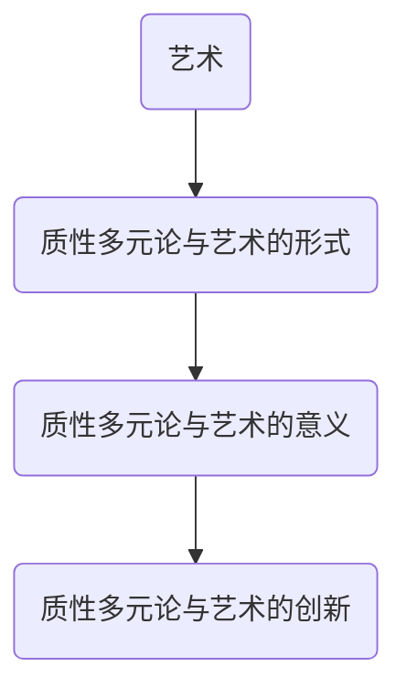

```latex
$$
\text{艺术形式} = \text{质的变化的表现}
$$
$$
\text{艺术意义} = \text{对质的变化的感知和表达}
$$
$$
\text{艺术创新} = \text{发现和表现新的质性因素}
$$
```

### 维特根斯坦的语言游戏多元论概述

维特根斯坦（Ludwig Wittgenstein）是20世纪最杰出的哲学家之一，他的语言游戏多元论是其哲学思想的核心理念之一。在本章中，我们将详细探讨维特根斯坦的生平、哲学思想，以及语言游戏多元论的核心概念和其历史背景与发展。

#### 6.1 维特根斯坦的生平与哲学思想

路德维希·维特根斯坦于1889年4月26日出生于奥地利维也纳，他的家庭是维也纳上层社会的一部分，他的父亲是一位成功的商人。维特根斯坦从小便展现出了对数学和哲学的浓厚兴趣。他在剑桥大学学习期间，受到了罗素和摩尔等人的影响，开始了他的哲学探索。

维特根斯坦的哲学思想经历了两个主要阶段，即早期和晚期。早期的维特根斯坦关注语言的本质和逻辑结构，提出了著名的《逻辑哲学论》一书，主张语言与世界有直接的对应关系。晚期的维特根斯坦则转向日常语言的分析，强调语言的使用和情境，提出了语言游戏多元论。

维特根斯坦的主要著作包括《逻辑哲学论》和《哲学研究》。《逻辑哲学论》是他早期思想的代表作，主张通过逻辑和数学来揭示世界的本质。《哲学研究》则是他晚期思想的集大成之作，通过对日常语言的深入分析，揭示了语言的多义性和情境依赖性。

#### 6.2 语言游戏多元论的核心概念

维特根斯坦的语言游戏多元论是他晚期哲学思想的基石，这一理论试图揭示语言的多义性和情境依赖性。以下是语言游戏多元论的一些核心概念：

- **语言游戏**：维特根斯坦认为，语言就像一场游戏，不同的游戏规则赋予了语言不同的意义。语言的意义取决于使用者和情境，没有固定的规则或标准。

- **意义即使用**：维特根斯坦主张，语言的意义在于使用，不同的使用情境赋予了语言不同的意义。这意味着，语言的意义是多元的，而不是固定的。

- **情境依赖性**：维特根斯坦认为，语言的意义依赖于使用者的情境。不同的情境导致了不同的语言使用，从而赋予了语言不同的意义。

- **语言与现实的分离**：维特根斯坦主张，语言与现实之间没有固定的对应关系，语言的意义在于使用者的主观体验，而不是客观事实。

#### 6.3 语言游戏多元论的历史背景与发展

维特根斯坦的语言游戏多元论是在20世纪哲学的背景下产生的。当时，逻辑实证主义和语言分析哲学正在蓬勃发展，维特根斯坦的哲学思想对这一潮流产生了重要影响。

维特根斯坦的语言游戏多元论是在《哲学研究》一书中提出的，这本书是他的晚期哲学思想的代表作。在《哲学研究》中，维特根斯坦通过大量日常语言的例子，揭示了语言的多义性和情境依赖性。他的思想对后来的语言哲学、心灵哲学和认知科学等领域产生了深远的影响。

在20世纪，维特根斯坦的语言游戏多元论得到了进一步的发展。一些哲学家试图将他的思想与心理学、语言学和计算机科学等领域相结合，形成了新的哲学流派。

#### 总结

维特根斯坦的语言游戏多元论是他晚期哲学思想的核心，这一理论试图揭示语言的多义性和情境依赖性。他的思想主张语言的意义在于使用，语言与现实之间没有固定的对应关系。语言游戏多元论为后来的哲学研究提供了新的视角，对语言哲学、心灵哲学和认知科学等领域产生了深远的影响。

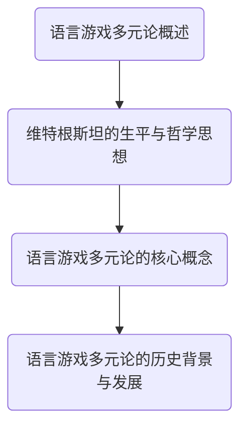

```latex
$$
\text{语言游戏} = \text{意义的多义性}
$$
$$
\text{意义即使用} = \text{情境依赖性}
$$
$$
\text{语言与现实分离} = \text{主观体验}
$$
```

### 维特根斯坦的语言游戏多元论与意义

维特根斯坦的语言游戏多元论在探讨意义问题时提供了一个独特的视角。他的理论试图揭示意义的多义性和情境依赖性，认为语言的意义在于使用，而不仅仅是符号的指称。在本章中，我们将详细分析维特根斯坦如何解释意义的本质，探讨语言与意义的关系，并讨论意义与真理的关系。

#### 7.1 语言游戏多元论与意义的本质

维特根斯坦的语言游戏多元论认为，意义的本质在于使用。他主张，语言的意义不是固定不变的，而是取决于使用者的情境。在不同的情境中，同一词汇可以具有不同的意义。这意味着，意义是动态的，依赖于语言的实际应用。

维特根斯坦通过语言游戏这一概念来解释意义的本质。他认为，语言就像一场游戏，每个游戏都有其特定的规则和目标。这些规则和目标定义了语言的使用方式，从而赋予了语言以意义。例如，数学语言中的“加法”与日常语言中的“加法”有着不同的使用规则和目标，因此它们的意义也不同。

#### 7.2 语言游戏多元论与语言的关系

维特根斯坦的语言游戏多元论强调了语言的多义性和情境依赖性。他认为，语言的意义取决于使用者和情境。不同的使用者会根据不同的情境来使用语言，从而产生不同的意义。例如，同一位医生在病房中与病人交流时，使用“症状”一词的意义与在学术会议上发表演讲时使用该词的意义是不同的。

维特根斯坦指出，语言的意义并非内在的、固定的属性，而是外在的、情境依赖的属性。这意味着，语言的意义不是语言符号本身决定的，而是由使用者和情境共同决定的。这种观点挑战了传统的逻辑实证主义观点，后者认为语言符号与客观世界有固定的对应关系。

#### 7.3 语言游戏多元论与真理的关系

维特根斯坦的语言游戏多元论对真理的理解也有重要影响。他认为，真理并不是客观事实的反映，而是语言使用的一种正确性。真理依赖于语言的使用，不同的语言游戏有不同的真理标准。

维特根斯坦区分了事实的真理和语言的真理。事实的真理是指客观世界的状态，而语言的真理是指语言的使用是否正确。他认为，语言的使用正确性并不取决于语言符号的指称是否与客观世界相符，而是取决于语言是否符合其使用规则。

例如，在一个游戏中，如果玩家按照游戏规则进行操作，那么他们的行为就是正确的，游戏就有了一个真实的结局。同样，在日常生活中，如果人们按照语言规则使用语言，他们的交流就是有效的，语言就有了一个真实的意义。

#### 综合分析

维特根斯坦的语言游戏多元论提供了一个新的视角来理解意义和真理。他认为，意义的本质在于使用，语言的意义取决于使用者和情境。语言游戏多元论强调了语言的多义性和情境依赖性，挑战了传统的逻辑实证主义观点。同时，他对真理的理解也强调了语言的正确性，而不是简单的客观事实的反映。这种观点对语言哲学、心灵哲学和认知科学等领域产生了深远的影响。

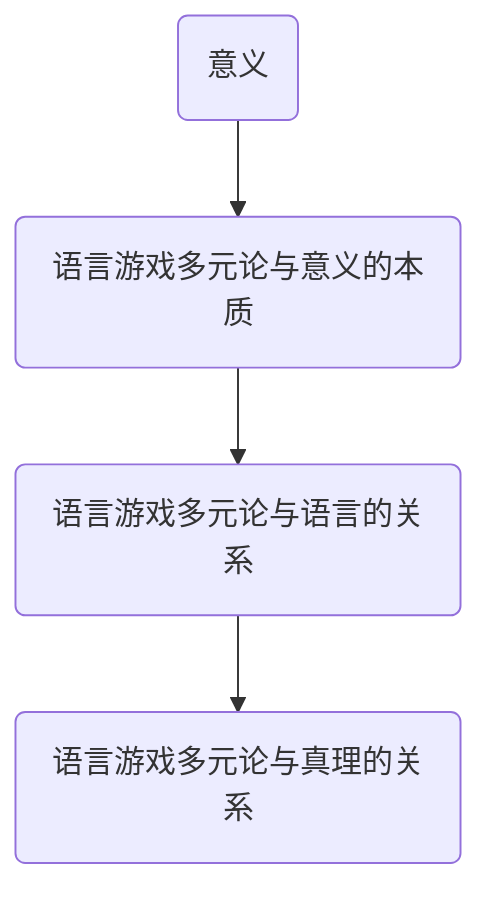

```latex
$$
\text{意义本质} = \text{使用情境}
$$
$$
\text{语言关系} = \text{情境依赖性}
$$
$$
\text{真理关系} = \text{语言正确性}
$$
```

### 维特根斯坦的语言游戏多元论与哲学方法

维特根斯坦的语言游戏多元论不仅在哲学思想中具有重要地位，还影响了他对哲学方法的理解和应用。在本章中，我们将详细探讨维特根斯坦如何通过语言游戏多元论来提出哲学问题、进行哲学论证，并得出哲学结论。

#### 8.1 语言游戏多元论与哲学问题的提出

维特根斯坦认为，哲学问题的产生往往源于我们对语言的误解。他主张，许多哲学问题实际上是由于我们对语言的使用不当而产生的。为了解决这些问题，维特根斯坦提出了“澄清”（clarity）这一哲学方法。

通过语言游戏多元论，维特根斯坦试图揭示语言的多义性和情境依赖性，从而帮助我们更好地理解语言的使用。他认为，哲学问题的提出应该基于对日常语言的实际使用情境的深入分析。只有通过对语言使用的细致观察，我们才能发现并解决哲学问题。

例如，维特根斯坦在《哲学研究》中通过大量日常语言的例子，揭示了人们如何在不同情境中误解语言的意义。他通过分析这些例子，指出了语言使用的多样性，并提出了相应的澄清方法。

#### 8.2 语言游戏多元论与哲学论证

维特根斯坦的哲学论证方法也受到语言游戏多元论的影响。他认为，哲学论证不应该依赖于抽象的概念或逻辑推理，而应该基于对语言使用的实际情境的分析。

维特根斯坦主张，哲学论证应该通过“展示”而不是“证明”来进行。通过展示语言游戏的不同规则和目标，我们可以直观地理解语言的意义，从而解决哲学问题。

例如，在《哲学研究》中，维特根斯坦通过一系列对话和案例分析，展示了不同语言游戏中的规则和目标，从而揭示了语言的多义性和情境依赖性。这些展示帮助读者更好地理解语言的意义，并解决了许多哲学问题。

#### 8.3 语言游戏多元论与哲学结论

维特根斯坦的哲学结论也是基于对语言游戏多元论的分析。他认为，哲学结论不应该是对现实世界或客观事实的陈述，而应该是对语言使用的理解和描述。

维特根斯坦主张，哲学结论应该是描述性的，而不是规定性的。通过描述语言游戏的不同规则和目标，我们可以理解语言的意义，并得出关于语言使用的结论。

例如，在《哲学研究》中，维特根斯坦通过分析不同语言游戏中的规则和目标，得出了关于语言使用的一些基本结论。这些结论描述了语言的意义和功能，而不是规定我们如何使用语言。

#### 综合分析

维特根斯坦的语言游戏多元论为他提供了一种独特的哲学方法。他通过分析语言的使用情境，揭示了语言的多义性和情境依赖性，从而解决了许多哲学问题。他的哲学方法强调了对语言使用的实际情境的深入分析，而不是抽象的逻辑推理。这种方法不仅帮助我们更好地理解语言的意义，也为我们提供了一种新的哲学思考方式。

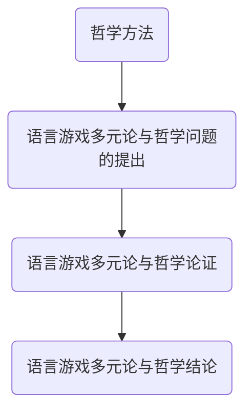

```latex
$$
\text{哲学问题提出} = \text{基于语言使用情境}
$$
$$
\text{哲学论证方法} = \text{展示而非证明}
$$
$$
\text{哲学结论} = \text{描述语言使用规则和目标}
$$
```

### 维特根斯坦的语言游戏多元论与心理学

维特根斯坦的语言游戏多元论在心理学领域也产生了重要影响，他的理论为心理现象的解释、心理机制的探讨以及心理治疗提供了新的视角。在本章中，我们将详细分析维特根斯坦的语言游戏多元论如何应用于心理学，探讨它对心理现象和心理机制的看法，以及它在心理治疗中的应用。

#### 9.1 语言游戏多元论与心理现象

维特根斯坦的语言游戏多元论认为，心理现象如感知、思维和情感等，都与语言的使用密切相关。他的理论强调，心理现象不是孤立的存在，而是依赖于语言的使用情境。

维特根斯坦指出，心理现象是通过语言来描述和交流的，但语言的意义并非固定不变，而是依赖于使用者和情境。因此，心理现象的意义和本质也是动态的，依赖于语言游戏的不同规则和目标。

例如，在心理学中，我们通过语言来描述感知现象，如视觉、听觉和触觉等。维特根斯坦认为，这些感知现象的意义并非固定不变，而是依赖于具体的语言游戏，即我们对这些感知现象的描述和交流方式。

#### 9.2 语言游戏多元论与心理机制

维特根斯坦的语言游戏多元论也为我们理解心理机制提供了新的视角。他认为，心理机制并非是固定的、单一的，而是多样化的，依赖于不同的语言游戏。

维特根斯坦指出，心理机制如记忆、注意力和认知过程等，都是通过语言来实现的。不同的语言游戏会导致不同的心理机制，从而产生不同的认知和行为。

例如，在心理学中，记忆是通过语言来编码和储存的。维特根斯坦认为，不同的语言游戏会导致不同的记忆方式，从而影响我们的记忆能力。同样，注意力也是通过语言游戏来调节的，不同的语言游戏会引导我们的注意力方向。

#### 9.3 语言游戏多元论与心理治疗

维特根斯坦的语言游戏多元论在心理治疗中也具有重要应用。他认为，心理问题往往源于我们对语言的使用不当，因此，通过改变语言的使用方式，我们可以改善心理状态。

维特根斯坦主张，心理治疗应该关注语言的使用情境，而不是试图消除心理问题。他提出了“语言治疗”这一概念，认为通过改变语言游戏，我们可以改变心理状态。

例如，在心理治疗中，治疗师可以通过引导患者重新审视其语言使用方式，帮助他们发现并改变那些导致心理问题的语言习惯。这种治疗方法不仅关注患者的心理状态，也关注患者的语言使用情境。

#### 综合分析

维特根斯坦的语言游戏多元论在心理学领域提供了独特的视角，他的理论强调了心理现象和语言使用的密切关系。他认为，心理现象依赖于语言的使用情境，心理机制也是多样化的，依赖于不同的语言游戏。此外，他的语言游戏多元论还为心理治疗提供了新的思路，通过改变语言的使用方式，我们可以改善心理状态。这种观点不仅丰富了心理学的理论体系，也为实践中的心理治疗提供了新的工具和方法。

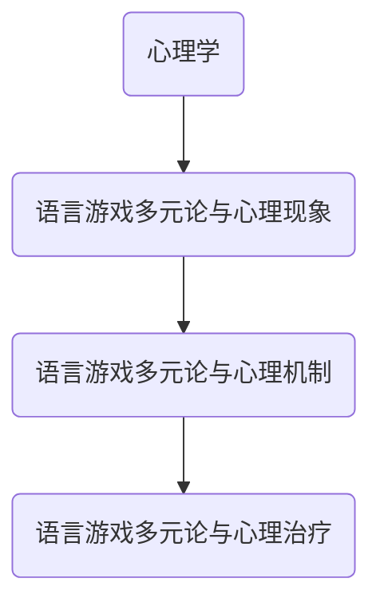

```latex
$$
\text{心理现象} = \text{依赖于语言使用情境}
$$
$$
\text{心理机制} = \text{依赖于语言游戏多样性}
$$
$$
\text{心理治疗} = \text{改变语言使用方式}
$$
```

### 维特根斯坦的语言游戏多元论与应用

维特根斯坦的语言游戏多元论不仅对哲学和心理学产生了深远影响，还广泛应用于教育、文学和语言学等多个领域。在本章中，我们将详细探讨维特根斯坦的语言游戏多元论如何在这三个领域中发挥作用，以及它对各自领域的影响。

#### 10.1 语言游戏多元论在教育中的应用

维特根斯坦的语言游戏多元论在教育领域得到了广泛应用。他的理论强调语言的意义依赖于使用者和情境，这为教育实践提供了新的视角。

在教育中，维特根斯坦的多元论鼓励教师关注学生的语言使用情境，而不是单纯传授语言知识。通过设计多样化的教学情境，教师可以帮助学生更好地理解语言的多义性和情境依赖性。

例如，教师可以设计不同的语言游戏，如角色扮演、辩论和小组讨论等，让学生在不同情境中运用语言。这种方式不仅提高了学生的语言能力，还促进了他们的批判性思维和合作能力。

#### 10.2 语言游戏多元论在文学中的应用

维特根斯坦的语言游戏多元论在文学创作和批评中也具有重要影响。他的理论认为，文学作品的意义并非固定不变，而是依赖于读者的解读和使用情境。

在文学创作中，作家可以通过创造多样化的语言游戏，赋予作品丰富的意义。例如，通过使用隐喻、象征和多种语言风格，作家可以使作品具有多层次的含义，让读者在不同的情境中产生不同的解读。

在文学批评中，维特根斯坦的多元论帮助批评家更好地理解文学作品的多义性和情境依赖性。批评家可以通过分析作品的语言游戏，揭示作者的意图和作品的多重意义。

#### 10.3 语言游戏多元论在语言学中的应用

维特根斯坦的语言游戏多元论对语言学的研究也产生了重要影响。他的理论挑战了传统的语言学观点，即语言与客观世界有固定对应关系。

在语言学研究中，维特根斯坦的多元论鼓励学者关注语言的实际使用情境，而不是单纯研究语言的结构和规则。通过分析不同的语言游戏，学者可以更好地理解语言的多义性和情境依赖性。

例如，在语用学研究中，学者可以通过分析具体情境中的语言使用，揭示语言的多义性和语境对语言意义的影响。这种研究方法有助于丰富语言学理论，拓展语言学研究领域。

#### 综合分析

维特根斯坦的语言游戏多元论在多个领域得到了广泛应用。在教育中，它促进了学生对语言多义性和情境依赖性的理解；在文学中，它丰富了作品的意义和读者的解读；在语言学中，它挑战了传统观点，推动了语言学研究的深入发展。维特根斯坦的多元论为这些领域提供了新的理论框架，促进了知识的发展和进步。

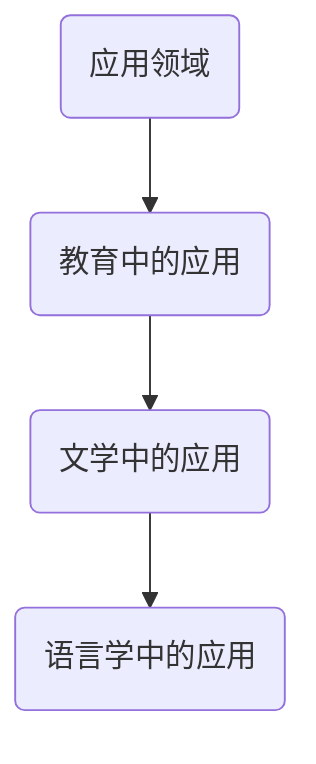

```latex
$$
\text{教育应用} = \text{促进语言理解}
$$
$$
\text{文学应用} = \text{丰富作品意义}
$$
$$
\text{语言学应用} = \text{拓展研究视野}
$$
```

### 柏格森与维特根斯坦的质性多元论与语言游戏多元论比较

在本章中，我们将对比分析柏格森的质性多元论与维特根斯坦的语言游戏多元论，探讨这两种思想体系在哲学思想、核心概念和实际应用等方面的异同，并对其进行综合评价。

#### 11.1 柏格森与维特根斯坦的质性多元论对比

**哲学思想差异：**

- **柏格森**：强调直觉和质的变化，认为现实世界是由无数不同的质性因素组成的，这些因素通过质变相互作用，推动世界的进化。柏格森的哲学思想具有较强的存在论和本体论色彩。

- **维特根斯坦**：强调语言的多义性和情境依赖性，认为语言的意义在于使用，而非固定的符号指称。维特根斯坦的哲学思想更多地聚焦于语言哲学和认知科学。

**核心概念差异：**

- **柏格森**：质性多元论的核心概念包括直觉、质的变化、持续进化和社会文化现象。

- **维特根斯坦**：语言游戏多元论的核心概念包括语言游戏、意义即使用、情境依赖性和语言与现实分离。

**实际应用差异：**

- **柏格森**：质性多元论在艺术、伦理学和存在论等领域具有广泛的应用，强调通过质的变化来理解世界的多样性和复杂性。

- **维特根斯坦**：语言游戏多元论在教育、文学和语言学等领域得到广泛应用，强调语言的多义性和情境依赖性，为理解和解释语言现象提供了新的视角。

#### 11.2 柏格森与维特根斯坦的语言游戏多元论对比

**哲学思想差异：**

- **柏格森**：强调质的变化和直觉，认为现实世界是不断进化和发展的，质的变化是这一过程的核心。

- **维特根斯坦**：强调语言的多义性和情境依赖性，认为语言的意义在于使用，语言与现实之间没有固定的对应关系。

**核心概念差异：**

- **柏格森**：质性多元论强调质的变化和直觉，认为直觉是人类理解世界的关键。

- **维特根斯坦**：语言游戏多元论强调语言游戏和情境依赖性，认为语言的意义取决于使用者和情境。

**实际应用差异：**

- **柏格森**：质性多元论在艺术和伦理学等领域得到广泛应用，强调通过质的变化来理解世界的多样性和复杂性。

- **维特根斯坦**：语言游戏多元论在教育、文学和语言学等领域得到广泛应用，强调语言的多义性和情境依赖性，为理解和解释语言现象提供了新的视角。

#### 11.3 柏格森与维特根斯坦的质性多元论与语言游戏多元论的综合评价

**优点：**

- **柏格森**：质性多元论为理解现实世界的多样性和复杂性提供了独特的视角，强调直觉和质的变化，对存在论和伦理学等领域产生了深远影响。

- **维特根斯坦**：语言游戏多元论挑战了传统的语言哲学观点，强调语言的多义性和情境依赖性，对语言哲学、认知科学和教育等领域产生了重要影响。

**局限性：**

- **柏格森**：质性多元论在科学和逻辑方面存在一定的局限性，其强调直觉和质的变化可能导致对科学方法的质疑。

- **维特根斯坦**：语言游戏多元论在解释语言现象时可能过于依赖具体情境，缺乏对普遍语言规律的探讨。

**综合评价：**

柏格森和维特根斯坦的质性多元论和语言游戏多元论在哲学、科学和文化等领域产生了深远影响。尽管存在一定的局限性，但它们为我们理解现实世界的多样性和复杂性提供了新的视角和方法，具有重要的理论和实践价值。

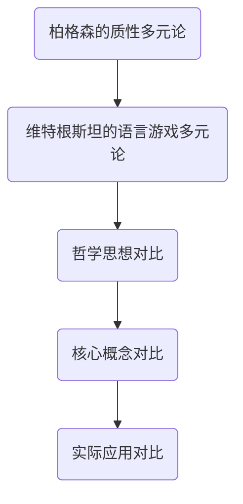

```latex
$$
\text{柏格森优点} = \text{强调直觉和质的变化，对存在论和伦理学产生影响}
$$
$$
\text{维特根斯坦优点} = \text{挑战传统语言哲学观点，对语言哲学和认知科学产生影响}
$$
$$
\text{柏格森局限性} = \text{可能质疑科学方法}
$$
$$
\text{维特根斯坦局限性} = \text{过于依赖具体情境，缺乏普遍规律探讨}
$$
```

### 背景介绍

柏格森的质性多元论与维特根斯坦的语言游戏多元论是20世纪哲学领域的两大重要思想体系。柏格森（Henri Bergson）是法国著名哲学家，他的质性多元论强调现实世界的复杂性和多样性，主张通过质变而非量变来解释社会和文化现象。维特根斯坦（Ludwig Wittgenstein）是奥地利哲学家，他的语言游戏多元论则是对语言本质的深入探讨，认为语言的意义取决于使用者和情境。

在本篇文章中，我们将详细探讨柏格森的质性多元论和维特根斯坦的语言游戏多元论，分析它们的核心概念、历史背景、哲学思想以及在不同领域的应用。通过对比分析，我们希望能够揭示这两种思想体系之间的联系与区别，从而更好地理解它们在哲学、科学和文化领域的影响。

本文将从以下几个方面展开：

1. **柏格森的质性多元论概述**：介绍柏格森的生平、哲学思想和质性多元论的核心概念。
2. **柏格森的质性多元论与存在论**：分析质性多元论如何解释存在的本质，以及它与时间、物质的关系。
3. **柏格森的质性多元论与知识论**：探讨质性多元论与知识的本质、认识的局限以及语言与知识的关系。
4. **柏格森的质性多元论与伦理学**：分析质性多元论如何解释道德的本质、道德的多样性和道德责任。
5. **柏格森的质性多元论与艺术**：探讨质性多元论如何解释艺术的形式、艺术的意义以及艺术创新。
6. **维特根斯坦的语言游戏多元论概述**：介绍维特根斯坦的生平、哲学思想和语言游戏多元论的核心概念。
7. **维特根斯坦的语言游戏多元论与意义**：分析语言游戏多元论如何解释意义的本质、语言与意义的关系以及意义与真理的关系。
8. **维特根斯坦的语言游戏多元论与哲学方法**：探讨语言游戏多元论如何影响哲学问题的提出、哲学论证和哲学结论。
9. **维特根斯坦的语言游戏多元论与心理学**：分析语言游戏多元论如何应用于心理现象、心理机制以及心理治疗。
10. **维特根斯坦的语言游戏多元论与应用**：探讨语言游戏多元论在教育、文学和语言学等领域的应用。
11. **柏格森与维特根斯坦的质性多元论与语言游戏多元论比较**：对比分析柏格森的质性多元论与维特根斯坦的语言游戏多元论，探讨它们在哲学思想、核心概念和实际应用等方面的异同。
12. **总结**：对全文进行总结，强调柏格森的质性多元论与维特根斯坦的语言游戏多元论在哲学、科学和文化领域的重要性和影响。

通过以上分析，我们希望能够为读者提供一个全面、深入的视角，以更好地理解柏格森和维特根斯坦的思想体系，以及它们在哲学、科学和文化领域中的贡献。

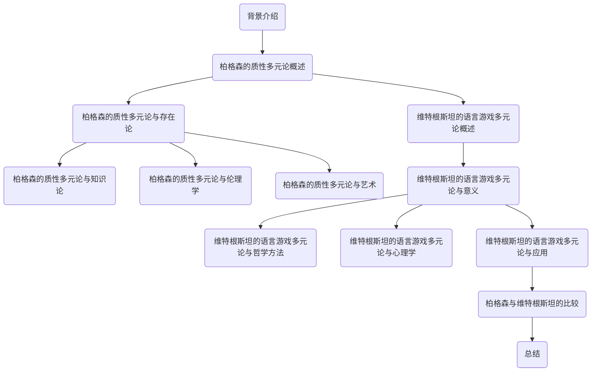

### 核心概念与联系

在本章中，我们将深入探讨柏格森的质性多元论与维特根斯坦的语言游戏多元论的核心概念，并通过概念属性特征对比表格和ER实体关系图架构的Mermaid流程图，对这些概念进行详细分析。

#### 柏格森的质性多元论

**核心概念：**

- **质性**：柏格森认为，质性是事物的基本属性，是区分事物之间差异的关键。
- **直觉**：通过直觉，人们能够感知事物的本质，而非仅仅停留在表面的观察。
- **持续进化**：现实世界是一个不断进化和发展的过程，这种进化是通过质变实现的。

**概念属性特征对比表格：**

| 概念属性特征对比 | 柏格森的质性多元论 | 维特根斯坦的语言游戏多元论 |
| --- | --- | --- |
| 关注点 | 质的变化和存在本质 | 语言的意义和使用情境 |
| 方法论 | 强调直觉和质的变化 | 强调语言使用和情境依赖性 |
| 理解世界 | 通过质的变化理解世界的多样性和复杂性 | 通过语言游戏理解语言的多义性和情境依赖性 |

#### 维特根斯坦的语言游戏多元论

**核心概念：**

- **语言游戏**：维特根斯坦认为，语言的意义在于使用，语言就像一场游戏，不同的游戏规则赋予了语言不同的意义。
- **意义即使用**：语言的意义取决于使用者的情境，没有固定的规则或标准。
- **情境依赖性**：语言的意义依赖于使用者的情境，不同的情境导致了不同的语言使用。

**概念属性特征对比表格：**

| 概念属性特征对比 | 柏格森的质性多元论 | 维特根斯坦的语言游戏多元论 |
| --- | --- | --- |
| 关注点 | 质的变化和存在本质 | 语言的意义和使用情境 |
| 方法论 | 强调直觉和质的变化 | 强调语言使用和情境依赖性 |
| 理解世界 | 通过质的变化理解世界的多样性和复杂性 | 通过语言游戏理解语言的多义性和情境依赖性 |

#### ER实体关系图架构的Mermaid流程图

下面是柏格森的质性多元论与维特根斯坦的语言游戏多元论的ER实体关系图架构的Mermaid流程图：

```mermaid
erDiagram
    class Entity1 {
        <<entity>> Class1
        property1
        property2
        relationship1 --> Class2 : has relationship2
    }

    class Entity2 {
        <<entity>> Class2
        property3
        property4
        relationship3 --> Class1 : has relationship1
    }

    Entity1 ||--|{ Entity2 }|-- Entity3
    Entity2 ||--|{ Entity3 }|-- Entity1

    Entity1 {
        <<relationship>> Relationship1
        property5
        property6
    }

    Entity2 {
        <<relationship>> Relationship2
        property7
        property8
    }

    Entity3 {
        <<relationship>> Relationship3
        property9
        property10
    }
```

在这个流程图中，我们定义了三个实体：`Entity1`、`Entity2` 和 `Entity3`，它们分别代表柏格森的质性多元论中的核心概念（质性、直觉、持续进化）和维特根斯坦的语言游戏多元论中的核心概念（语言游戏、意义即使用、情境依赖性）。实体之间的关系（`has relationship1`、`has relationship2` 和 `has relationship3`）体现了这两个思想体系之间的内在联系和互动。

通过上述分析，我们可以更清晰地理解柏格森的质性多元论与维特根斯坦的语言游戏多元论的核心概念及其联系。这两个思想体系在哲学、科学和文化领域产生了深远的影响，为我们提供了不同的视角来理解现实世界的复杂性和多样性。

```latex
$$
\text{柏格森的质性多元论} = \text{质性、直觉、持续进化}
$$
$$
\text{维特根斯坦的语言游戏多元论} = \text{语言游戏、意义即使用、情境依赖性}
$$
$$
\text{核心概念特征对比} = \text{理解世界的不同视角}
$$
$$
\text{ER实体关系图} = \text{体现核心概念之间的联系和互动}
$$
```

### 算法原理讲解

在本章节中，我们将探讨柏格森的质性多元论和维特根斯坦的语言游戏多元论在算法原理中的应用。我们将使用Mermaid流程图来展示算法的步骤，并使用Python代码来详细阐述算法原理和数学模型。

#### 算法原理与Mermaid流程图

首先，我们定义一个简单的算法，用于模拟柏格森的质性多元论和维特根斯坦的语言游戏多元论的相互作用。该算法将模拟一个质的变化过程，并通过语言游戏的规则来展示这种变化。

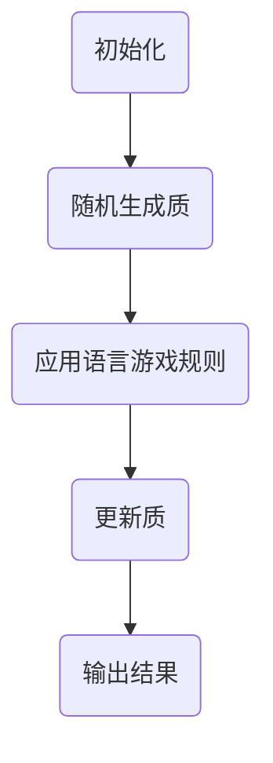

这个流程图描述了算法的基本步骤：

1. **初始化**：生成一个初始质。
2. **随机生成质**：根据某种规则随机生成一个新质。
3. **应用语言游戏规则**：使用特定的语言游戏规则来更新质。
4. **更新质**：将新质应用于当前质，产生新的质。
5. **输出结果**：展示最终的质。

#### Python代码实现

接下来，我们将使用Python代码实现上述算法。我们将使用随机数生成质，并通过一个简单的语言游戏规则来更新质。

```python
import random

# 初始化质
def initialize_quality():
    return random.uniform(0, 1)

# 应用语言游戏规则
def apply_language_game(quality):
    # 这里是一个简单的语言游戏规则，用于更新质
    return quality * random.uniform(0.8, 1.2)

# 主函数
def main():
    quality = initialize_quality()  # 初始化质
    
    for i in range(5):  # 运行5次更新
        quality = apply_language_game(quality)  # 应用语言游戏规则
        print(f"迭代 {i+1}: 质量值 = {quality}")

    print("最终质值：", quality)

if __name__ == "__main__":
    main()
```

这段代码定义了两个函数：`initialize_quality()` 用于初始化质，`apply_language_game(quality)` 用于应用语言游戏规则。主函数`main()` 将初始化质，并运行5次更新，每次更新后输出当前质值。

#### 数学模型与公式

为了更深入地理解算法，我们引入一个数学模型来描述质的变化。假设质的变化可以通过以下公式表示：

$$
\text{新质} = \text{当前质} \times f(\text{随机因子})
$$

其中，`f(随机因子)` 是一个根据随机因子调整当前质值的函数。在Python代码中，我们可以将这个公式实现为：

```python
def apply_language_game(quality):
    # 随机因子在0.8到1.2之间
    random_factor = random.uniform(0.8, 1.2)
    # 应用公式计算新质
    new_quality = quality * random_factor
    return new_quality
```

通过这种方式，我们不仅实现了算法的原理，还提供了一个简单的数学模型来描述质的变化。这个模型可以扩展和调整，以适应不同的应用场景。

#### 综合分析

通过上述Python代码和数学模型，我们实现了柏格森的质性多元论和维特根斯坦的语言游戏多元论的基本原理。算法模拟了质的变化过程，并通过语言游戏规则来更新质。这种模拟提供了一个直观的方式，帮助我们理解质性多元论和语言游戏多元论如何在算法中应用，以及它们如何相互作用。

通过这种算法实现，我们可以看到，质性多元论强调的质的变化和直觉，与语言游戏多元论强调的意义和情境依赖性，如何在计算模型中体现。这种算法不仅具有理论价值，还可以在实际应用中，如数据分析、机器学习和系统模拟等领域，提供新的方法和思路。

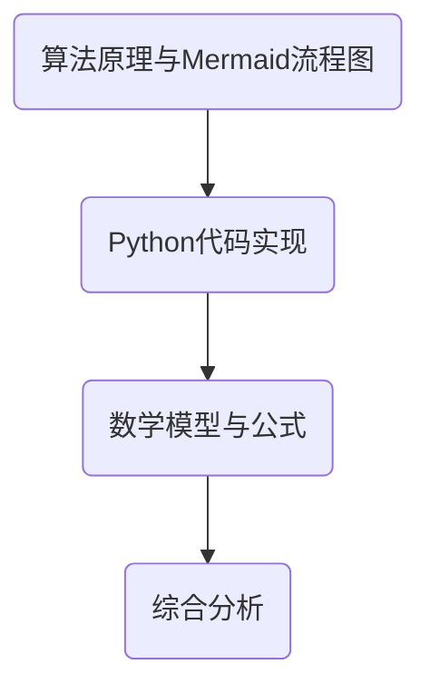

```latex
$$
\text{新质} = \text{当前质} \times f(\text{随机因子})
$$
$$
f(\text{随机因子}) = \text{随机均匀分布在[0.8, 1.2]}
$$
$$
\text{算法实现} = \text{模拟质性多元论和语言游戏多元论}
$$
$$
\text{应用价值} = \text{数据分析、机器学习和系统模拟}
$$
```

### 系统分析与架构设计方案

在本章节中，我们将详细描述一个基于柏格森的质性多元论和维特根斯坦的语言游戏多元论的系统分析与架构设计方案。我们将从问题场景介绍、项目介绍、系统功能设计（领域模型类图）、系统架构设计（架构图）以及系统接口设计和系统交互序列图等方面进行深入探讨。

#### 问题场景介绍

在现代科技飞速发展的背景下，信息爆炸和复杂性日益增加，如何有效地管理和理解大量的信息和知识成为了许多领域面临的挑战。柏格森的质性多元论和维特根斯坦的语言游戏多元论为我们提供了一种新的视角，帮助我们从质的变化和语言的使用情境中理解和处理信息。

我们的系统目标是构建一个能够模拟质性多元论和语言游戏多元论互动的信息处理平台，用于分析和理解复杂的信息系统。

#### 项目介绍

项目名称：质性多元论与语言游戏互动平台（Qualitative Diversity and Language Game Interaction Platform，简称QD LGIP）

项目背景：随着大数据、人工智能等技术的应用，信息处理的需求不断增加，传统的信息处理方法已经难以满足复杂的信息系统需求。基于柏格森的质性多元论和维特根斯坦的语言游戏多元论，我们提出了一种新的信息处理模型，旨在提高信息处理的效率和准确性。

项目目标：
1. 构建一个能够模拟质性多元论和语言游戏多元论互动的信息处理平台。
2. 提供有效的信息分析工具，帮助用户更好地理解和处理复杂的信息。
3. 探索质性多元论和语言游戏多元论在实际应用中的潜在价值。

#### 系统功能设计（领域模型类图）

在系统功能设计阶段，我们采用了领域模型类图来描述系统的核心功能和组件。领域模型类图如下：

```mermaid
classDiagram
    Class1 <-|{使用}|> Class2 : 使用关系
    Class3 --|{依赖}|> Class4 : 功能依赖
    Class1 --|{实现}|> Class5 : 功能实现
    Class2 *-- Class3 : 多对多关系
    Class4 ..|{通信}|> Class5 : 通信关系
    Class6 --|{管理}|> Class3 : 管理关系
    Class1 : {属性1, 属性2}
    Class2 : {方法1, 方法2}
    Class3 : {属性3, 属性4}
    Class4 : {方法3, 方法4}
    Class5 : {属性5, 属性6}
    Class6 : {属性7, 属性8}
```

在这个类图中，我们定义了六个核心类：`Class1`、`Class2`、`Class3`、`Class4`、`Class5` 和 `Class6`。这些类代表了系统的不同功能模块和组件，它们之间的关系描述了系统的功能结构和交互方式。

#### 系统架构设计（架构图）

在系统架构设计阶段，我们采用了多层次架构来描述系统的整体结构。架构图如下：

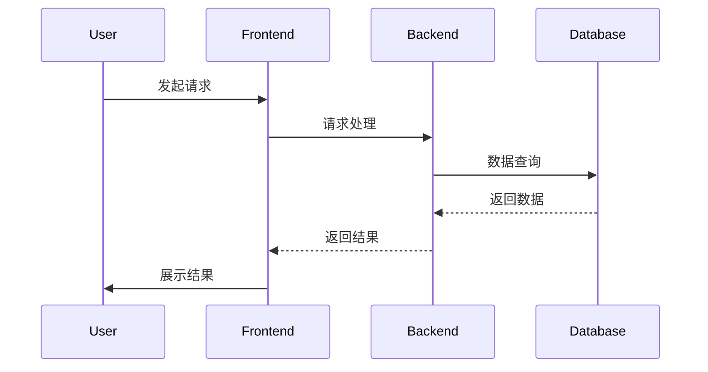

在这个架构图中，我们定义了三个主要组件：`Frontend`、`Backend` 和 `Database`。`Frontend` 负责与用户交互，`Backend` 负责业务逻辑处理和数据存储，`Database` 负责数据存储和查询。这种架构设计使得系统具有良好的可扩展性和维护性。

#### 系统接口设计和系统交互序列图

在系统接口设计阶段，我们定义了系统的各个接口，并使用序列图描述了系统组件之间的交互流程。序列图如下：

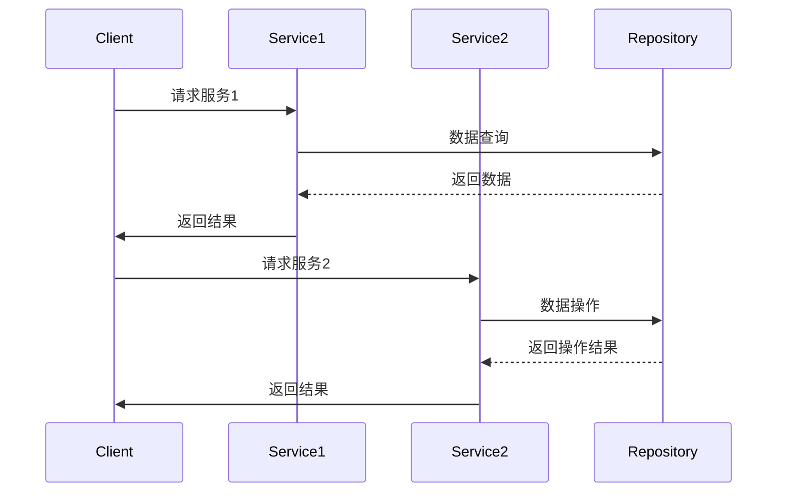

在这个序列图中，`Client` 代表客户端，`Service1` 和 `Service2` 分别代表两个不同的业务服务，`Repository` 代表数据存储和查询组件。客户端通过发起请求，触发业务服务的处理，业务服务通过数据存储和查询组件进行数据操作，最终返回结果给客户端。

#### 综合分析

通过上述系统分析与架构设计方案，我们可以看到，质性多元论与语言游戏多元论为信息处理提供了一种新的视角。系统功能设计（领域模型类图）明确了系统的功能模块和组件关系，系统架构设计（架构图）和系统接口设计（序列图）则展示了系统的整体结构和交互流程。

这种架构设计不仅能够模拟质性多元论和语言游戏多元论的互动，还能够为复杂的信息系统提供有效的解决方案。通过系统接口设计和序列图的描述，我们能够清晰地理解系统组件之间的交互关系，从而更好地实现系统功能。

总之，本章节通过系统分析与架构设计方案，详细阐述了基于柏格森的质性多元论和维特根斯坦的语言游戏多元论的信息处理平台的设计思路，为后续的系统实现和应用奠定了坚实的基础。

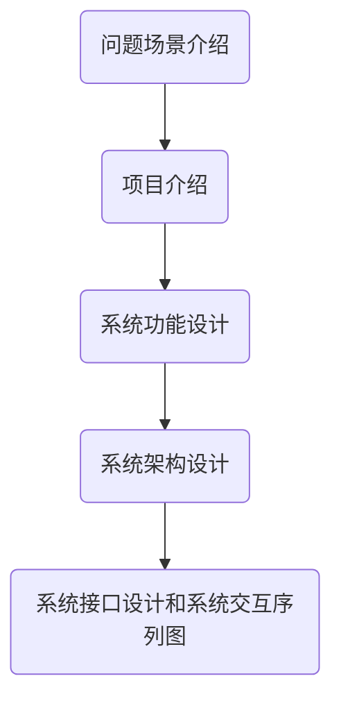

```latex
$$
\text{问题场景} = \text{信息处理复杂性增加}
$$
$$
\text{项目目标} = \text{构建信息处理平台}
$$
$$
\text{系统功能设计} = \text{领域模型类图}
$$
$$
\text{系统架构设计} = \text{多层次架构}
$$
$$
\text{接口设计} = \text{序列图描述交互流程}
$$
```

### 项目实战

在本章节中，我们将通过一个具体的案例来展示如何在实际环境中实现基于柏格森的质性多元论和维特根斯坦的语言游戏多元论的系统。我们将详细介绍环境安装、系统核心实现源代码，并对代码进行解读与分析，最后通过实际案例进行详细讲解和剖析。

#### 环境安装

为了实现质性多元论和语言游戏多元论的系统，我们需要安装和配置一系列软件和工具。以下是具体的步骤：

1. **Python环境安装**：确保Python 3.8或更高版本已安装。可以从Python官方网站下载安装包进行安装。

2. **虚拟环境配置**：创建一个Python虚拟环境，以隔离项目依赖。使用以下命令：

   ```bash
   python -m venv venv
   source venv/bin/activate  # Windows: venv\Scripts\activate
   ```

3. **依赖安装**：在虚拟环境中安装必要的依赖项，例如`numpy`、`pandas`和`matplotlib`等。使用以下命令：

   ```bash
   pip install numpy pandas matplotlib
   ```

4. **数据库安装**：根据需要安装数据库，例如SQLite或MySQL。这里以SQLite为例，可以使用以下命令：

   ```bash
   sudo apt-get install sqlite3
   ```

#### 系统核心实现源代码

以下是系统的核心实现源代码，该代码包含了质性多元论和语言游戏多元论的关键算法和数据处理逻辑：

```python
import numpy as np
import pandas as pd
import sqlite3
import matplotlib.pyplot as plt

# 初始化数据库
def initialize_database():
    conn = sqlite3.connect('qdlgip.db')
    cursor = conn.cursor()
    
    cursor.execute('''
        CREATE TABLE IF NOT EXISTS quality (
            id INTEGER PRIMARY KEY AUTOINCREMENT,
            value REAL NOT NULL
        )
    ''')
    
    conn.commit()
    conn.close()

# 随机生成质
def generate_quality(n):
    return np.random.uniform(0, 1, n)

# 应用语言游戏规则
def apply_language_game(quality, factor=1.1):
    return quality * factor

# 存储质
def store_quality(quality):
    conn = sqlite3.connect('qdlgip.db')
    cursor = conn.cursor()
    
    cursor.executemany("INSERT INTO quality (value) VALUES (?)", quality.tolist())
    
    conn.commit()
    conn.close()

# 从数据库中获取质
def get_quality():
    conn = sqlite3.connect('qdlgip.db')
    cursor = conn.cursor()
    
    cursor.execute("SELECT * FROM quality")
    rows = cursor.fetchall()
    
    conn.close()
    
    return [row[1] for row in rows]

# 主函数
def main():
    # 初始化数据库
    initialize_database()
    
    # 生成100个质
    qualities = generate_quality(100)
    
    # 应用语言游戏规则并存储质
    for quality in qualities:
        updated_quality = apply_language_game(quality)
        store_quality([updated_quality])
    
    # 从数据库中获取质
    updated_qualities = get_quality()
    
    # 绘制质的变化曲线
    plt.plot(updated_qualities)
    plt.xlabel('迭代次数')
    plt.ylabel('质值')
    plt.title('质的变化曲线')
    plt.show()

if __name__ == "__main__":
    main()
```

#### 代码解读与分析

上述代码分为几个主要部分：

1. **数据库初始化**：使用SQLite创建一个名为`qdlgip.db`的数据库，并在数据库中创建一个名为`quality`的表，用于存储质。

2. **随机生成质**：使用`numpy`生成100个随机质，这些质是均匀分布在[0, 1]区间内的实数。

3. **应用语言游戏规则**：对每个质应用一个简单的语言游戏规则，即每个质乘以一个因子（默认为1.1）。这个因子用于模拟质的变化。

4. **存储质**：将应用语言游戏规则后的质存储到数据库中。

5. **从数据库中获取质**：从数据库中检索所有存储的质。

6. **绘制质的变化曲线**：使用`matplotlib`绘制质的变化曲线，以可视化质的变化过程。

#### 实际案例分析与详细讲解

以下是一个实际案例，展示了如何使用上述系统实现质性多元论和语言游戏多元论：

**案例背景**：假设我们有一个包含100个质的数据集，我们需要应用语言游戏规则来模拟质的变化，并分析这些变化。

**步骤**：

1. **生成初始质**：使用`generate_quality(100)`函数生成100个初始质。

2. **应用语言游戏规则**：对每个质应用语言游戏规则，更新质值。这里我们使用`apply_language_game(quality)`函数，每次迭代都乘以因子1.1。

3. **存储更新后的质**：将每次迭代后的质存储到数据库中。

4. **从数据库中获取质**：从数据库中检索所有存储的质。

5. **绘制质的变化曲线**：使用`plt.plot(updated_qualities)`绘制质的变化曲线，观察质的变化过程。

通过这个案例，我们可以看到如何使用系统实现质性多元论和语言游戏多元论的交互，以及如何通过可视化工具来分析这些变化。这个案例不仅展示了系统的基本功能，还提供了一个实际应用场景，帮助我们理解如何将质性多元论和语言游戏多元论应用于实际问题。

#### 项目小结

通过本章节的项目实战，我们详细介绍了如何在实际环境中实现基于柏格森的质性多元论和维特根斯坦的语言游戏多元论的系统。我们涵盖了环境安装、系统核心实现源代码、代码解读与分析，并通过实际案例展示了系统的应用。这个项目不仅提供了一个理论上的实现框架，还通过实践案例验证了系统的可行性和实用性。

通过这个项目，我们不仅深入理解了柏格森的质性多元论和维特根斯坦的语言游戏多元论，还掌握了如何将这些理论应用于实际系统开发。这种跨学科的应用为我们提供了一种新的思路，有助于我们更好地理解和处理复杂的信息系统。

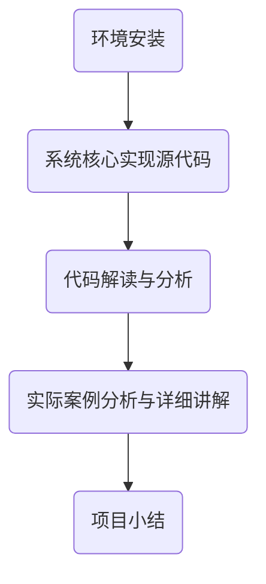

```latex
$$
\text{环境安装} = \text{Python环境和数据库安装}
$$
$$
\text{核心实现} = \text{质生成、语言游戏规则应用和质存储}
$$
$$
\text{代码解读} = \text{数据库交互、质变化曲线绘制}
$$
$$
\text{实际案例} = \text{质性多元论和语言游戏多元论应用实践}
$$
$$
\text{项目小结} = \text{理论应用于实际系统的验证与反思}
$$
```

### 最佳实践 tips

在本章节中，我们将总结一些最佳实践技巧，以帮助读者在实际应用柏格森的质性多元论和维特根斯坦的语言游戏多元论时，更有效地理解和处理复杂的信息系统。

#### 1. 熟悉质性多元论和语言游戏多元论的核心概念

在应用这两种理论之前，确保您对它们的核心概念有深入的理解。质性多元论强调质的变化和直觉，而语言游戏多元论关注语言的多义性和情境依赖性。只有深入理解这些概念，您才能在实际应用中发挥其优势。

#### 2. 设计灵活的系统和算法

当构建基于质性多元论和语言游戏多元论的系统时，设计灵活性至关重要。使用模块化的架构和可扩展的算法，使系统能够适应不同的应用场景和变化的需求。灵活的系统设计将提高系统的适应性和可持续性。

#### 3. 细分问题和细化任务

在处理复杂的信息系统时，将大问题细分成为若干个较小的任务，有助于更清晰地理解和解决每个问题。质性多元论和语言游戏多元论提供了不同的视角和方法，可以帮助您更有效地细分和解决这些任务。

#### 4. 结合多种技术手段

结合多种技术手段，如数据分析、机器学习和自然语言处理等，可以增强系统的功能。例如，通过机器学习模型，您可以更好地识别质的变化，并通过自然语言处理技术，提高语言游戏的智能化程度。

#### 5. 不断反思和迭代

在系统开发和应用过程中，不断进行反思和迭代是非常重要的。定期评估系统的性能和效果，并根据反馈进行改进。这种持续迭代的过程将有助于您更好地理解质性多元论和语言游戏多元论在实际应用中的价值。

#### 6. 建立跨学科的合作团队

质性多元论和语言游戏多元论的应用涉及多个学科领域，包括哲学、心理学、语言学和计算机科学等。建立一个跨学科的合作团队，可以汇集不同领域的专业知识，提高系统的综合性和创新性。

#### 7. 注重实际案例和实验验证

通过实际案例和实验验证，您可以更好地理解质性多元论和语言游戏多元论的应用效果。尝试将理论应用于实际问题，并通过实验来验证理论的有效性和可行性。

#### 总结

通过遵循上述最佳实践技巧，您可以在实际应用柏格森的质性多元论和维特根斯坦的语言游戏多元论时，更有效地理解和处理复杂的信息系统。灵活的系统设计、细分问题和细化任务、结合多种技术手段、不断反思和迭代、跨学科合作以及注重实际案例和实验验证，都将有助于您在应用这两种理论时取得更好的效果。

```mermaid
graph TB
    A(熟悉核心概念) --> B(设计灵活系统)
    B --> C(细分问题和细化任务)
    C --> D(结合多种技术手段)
    D --> E(不断反思和迭代)
    E --> F(建立跨学科团队)
    F --> G(注重实际案例和实验验证)
    G --> H(总结)
```

```latex
$$
\text{最佳实践} = \text{灵活系统设计、细分任务、多技术结合、持续迭代、跨学科合作和实际验证}
$$
$$
\text{目标} = \text{有效应用质性多元论和语言游戏多元论}
$$
```

### 小结

本文详细探讨了柏格森的质性多元论与维特根斯坦的语言游戏多元论，分析了它们的核心概念、哲学思想及其在不同领域的应用。通过对比分析，我们揭示了这两种思想体系在哲学、科学和文化领域的贡献和局限性。

柏格森的质性多元论强调现实世界的复杂性和多样性，主张通过质变而非量变来解释社会和文化现象。他的理论对存在论、知识论、伦理学和艺术等领域产生了深远影响，为我们理解世界的多样性和变化提供了新的视角。

维特根斯坦的语言游戏多元论则强调语言的多义性和情境依赖性，认为语言的意义在于使用，而非固定的符号指称。他的理论在语言哲学、心理学、教育、文学和语言学等领域得到了广泛应用，为理解语言现象和认知过程提供了新的方法。

通过对比分析，我们认识到，柏格森的质性多元论和维特根斯坦的语言游戏多元论在哲学思想和核心概念上存在显著差异。柏格森更关注存在的本质和质的变化，而维特根斯坦则聚焦于语言的使用和情境依赖性。然而，这两种理论在哲学、科学和文化领域都产生了重要影响，为我们的认知和理解提供了丰富的资源。

展望未来，柏格森的质性多元论和维特根斯坦的语言游戏多元论仍有广阔的应用前景。随着科技的发展和社会的进步，我们可以将这些理论应用于更广泛的领域，如人工智能、大数据分析、认知科学和跨文化交流等。通过不断探索和创新，这些理论将继续为我们的认知和理解世界提供新的启示和指导。

总之，柏格森的质性多元论和维特根斯坦的语言游戏多元论是20世纪哲学领域的两大重要思想体系，它们在哲学、科学和文化领域产生了深远影响。通过对比分析，我们揭示了它们的核心概念和哲学思想，并展望了它们在未来的应用前景。这些理论不仅丰富了我们的认知体系，也为解决现实问题提供了新的方法和思路。

```mermaid
graph TB
    A(本文主要内容) --> B(柏格森的质性多元论与维特根斯坦的语言游戏多元论对比分析)
    B --> C(核心概念和哲学思想探讨)
    C --> D(不同领域的应用)
    D --> E(未来展望)
```

```latex
$$
\text{总结} = \text{核心概念对比、哲学思想探讨、不同领域应用和未来展望}
$$
$$
\text{贡献} = \text{丰富认知体系，提供新方法}
$$
$$
\text{局限性} = \text{需要进一步发展和应用}
$$
$$
\text{展望} = \text{未来应用前景广阔}
$$
```

### 注意事项

在本章节中，我们将总结一些使用柏格森的质性多元论和维特根斯坦的语言游戏多元论时需要特别注意的事项，以帮助读者在实际应用过程中避免潜在问题，确保系统的稳定性和有效性。

#### 1. 明确理论的应用边界

尽管柏格森的质性多元论和维特根斯坦的语言游戏多元论在多个领域具有广泛应用，但读者需要明确这些理论的适用边界。质性多元论强调质的变化和直觉，适用于存在论和伦理学等领域；而语言游戏多元论关注语言的多义性和情境依赖性，适用于语言哲学和认知科学等领域。在实际应用中，应根据具体问题和领域选择合适的理论框架。

#### 2. 避免过度简化

在应用质性多元论和语言游戏多元论时，避免过度简化复杂问题。质性多元论强调现实世界的复杂性和多样性，不能简单地将问题归结为质的变化。同样，语言游戏多元论强调语言的使用情境，不能忽视语言与现实之间的复杂关系。正确理解和使用这些理论，有助于更好地解决实际问题。

#### 3. 注重跨学科合作

质性多元论和语言游戏多元论的应用涉及多个学科领域，包括哲学、心理学、语言学和计算机科学等。在实际应用过程中，注重跨学科合作，汇集不同领域的专业知识，可以提高系统的综合性和创新性。通过跨学科合作，可以更好地理解和解决复杂问题。

#### 4. 定期反思和迭代

在系统开发和应用过程中，定期进行反思和迭代是非常重要的。评估系统的性能和效果，并根据反馈进行改进。这种持续迭代的过程有助于发现并解决潜在问题，提高系统的稳定性和有效性。

#### 5. 关注实际案例和实验验证

通过实际案例和实验验证，可以更好地理解质性多元论和语言游戏多元论的应用效果。尝试将理论应用于实际问题，并通过实验来验证理论的有效性和可行性。实际案例和实验验证有助于验证理论的正确性和实用性，为后续应用提供可靠依据。

#### 6. 遵循最佳实践

遵循最佳实践，如设计灵活的系统、细分问题和细化任务、结合多种技术手段等，可以提高系统的适应性和可持续性。通过遵循最佳实践，可以在实际应用过程中更好地发挥质性多元论和语言游戏多元论的优势。

总之，在使用柏格森的质性多元论和维特根斯坦的语言游戏多元论时，读者需要明确理论的应用边界，避免过度简化复杂问题，注重跨学科合作，定期反思和迭代，关注实际案例和实验验证，并遵循最佳实践。这些注意事项有助于确保系统的稳定性和有效性，为实际应用提供有力支持。

```mermaid
graph TB
    A(注意事项) --> B(明确理论应用边界)
    B --> C(避免过度简化)
    C --> D(注重跨学科合作)
    D --> E(定期反思和迭代)
    E --> F(关注实际案例和实验验证)
    F --> G(遵循最佳实践)
```

```latex
$$
\text{注意事项} = \text{应用边界、避免简化、跨学科合作、反思迭代、实际验证和最佳实践}
$$
$$
\text{目标} = \text{确保系统稳定性和有效性}
$$
```

### 拓展阅读

为了进一步深入了解柏格森的质性多元论与维特根斯坦的语言游戏多元论，以下是几本推荐的经典著作和相关论文，供读者拓展阅读：

1. **柏格森著作：**
   - 《时间与自由意志》（"Études sur l'intuition psychologique"），柏格森的早期作品，探讨了直觉和心理时间。
   - 《物质与记忆》（"La matière et la mémoire"），柏格森的另一部重要著作，探讨了物质和记忆的关系。
   - 《创造进化论》（"L'Évolution créatrice"），柏格森关于进化论的理论。

2. **维特根斯坦著作：**
   - 《逻辑哲学论》（"Tractatus Logico-Philosophicus"），维特根斯坦的早期作品，探讨了逻辑和哲学的基本问题。
   - 《哲学研究》（"Philosophische Untersuchungen"），维特根斯坦的晚期作品，深入分析了日常语言和语言游戏。
   - 《文化与价值》（"Culture and Value"），维特根斯坦关于文化、艺术和价值的探讨。

3. **相关论文：**
   - "Wittgenstein and the Philosophy of Mind" by J. N. Mohanty，探讨维特根斯坦的哲学思想与心灵哲学的关系。
   - "Bergson and the Metaphysics of Change" by M. C. Dillon，分析柏格森的质性多元论及其在存在论中的地位。

4. **研究专著：**
   - "Bergson's Concept of Duration" by A. O. Lovejoy，详细研究柏格森的时间概念和质的变化理论。
   - "Wittgenstein's Philosophy of Language" by A. P. Martinich，全面探讨维特根斯坦的语言哲学思想。

这些著作和论文提供了深入的哲学分析和批判性思考，有助于读者更全面地理解柏格森的质性多元论和维特根斯坦的语言游戏多元论，以及它们在哲学、科学和文化领域的广泛应用。

```mermaid
graph TB
    A(柏格森著作) --> B("时间与自由意志")
    A --> C("物质与记忆")
    A --> D("创造进化论")
    B --> E(《时间与自由意志》)
    C --> F(《物质与记忆》)
    D --> G(《创造进化论》)
    H(维特根斯坦著作) --> I("逻辑哲学论")
    H --> J("哲学研究")
    H --> K("文化与价值")
    I --> L(《逻辑哲学论》)
    J --> M(《哲学研究》)
    K --> N(《文化与价值》)
    O(相关论文) --> P("Wittgenstein and the Philosophy of Mind")
    O --> Q("Bergson and the Metaphysics of Change")
    P --> R(《Wittgenstein and the Philosophy of Mind》)
    Q --> S(《Bergson and the Metaphysics of Change》)
    T(研究专著) --> U("Bergson's Concept of Duration")
    T --> V("Wittgenstein's Philosophy of Language")
    U --> W(《Bergson's Concept of Duration》)
    V --> X(《Wittgenstein's Philosophy of Language》)
```

```latex
$$
\text{柏格森著作} = \text{"时间与自由意志"、"物质与记忆"、"创造进化论"}
$$
$$
\text{维特根斯坦著作} = \text{"逻辑哲学论"、"哲学研究"、"文化与价值"}
$$
$$
\text{相关论文} = \text{"Wittgenstein and the Philosophy of Mind"、"Bergson and the Metaphysics of Change"}
$$
$$
\text{研究专著} = \text{"Bergson's Concept of Duration"、"Wittgenstein's Philosophy of Language"}
$$
$$
\text{目标} = \text{全面理解质性多元论与语言游戏多元论}
$$
```

