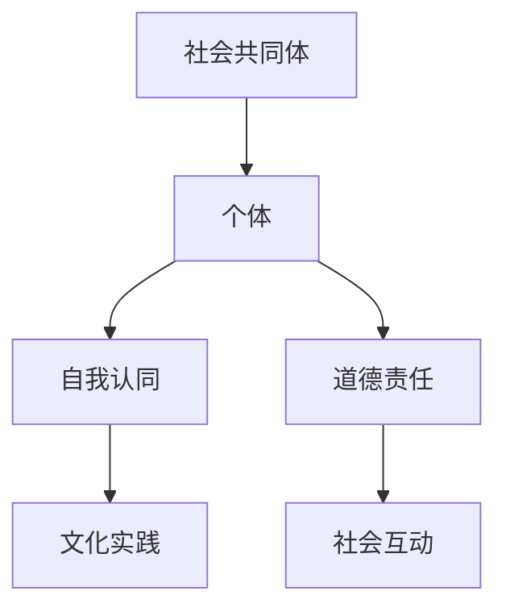

                 

### 1. 背景介绍

#### 1.1 问题背景

在现代社会中，社群主义作为一种重要的政治哲学和社会理论，得到了广泛的关注和研究。查尔斯·泰勒（Charles Taylor）和阿拉斯代尔·麦金泰尔（Alasdair MacIntyre）是20世纪最具影响力的社群主义代表人物，他们的思想对于理解社群主义的本质和意义具有重要意义。

泰勒的社群主义理论强调个体的社会性，认为个体是社会的一部分，个体的自我认同和社会共同体是密不可分的。麦金泰尔的社群主义理论则强调共同体的文化和社会实践对于个体认同和道德责任的重要性。

#### 1.2 问题描述

泰勒和麦金泰尔在社群主义理论中分别提出了哪些核心观点？他们的理论对现代社会产生了哪些影响？这些问题构成了本书探讨的核心内容。

#### 1.3 问题解决

通过对泰勒和麦金泰尔的思想进行深入分析，本书将揭示他们的社群主义理论的内涵和外延，并探讨这些理论如何影响现代社会的政治、文化和社会生活。

#### 1.4 边界与外延

社群主义的边界和范围是什么？它与其他政治哲学理论的联系和区别是什么？这些问题将在本书中得到详细的阐述。

#### 1.5 概念结构与核心要素组成

社群主义的核心概念是什么？它的结构包含哪些要素？这些问题将在本书的第一部分中得到全面的解答。

---

### 2. 核心概念与联系

#### 2.1 核心概念原理

在本章节中，我们将详细探讨查尔斯·泰勒和阿拉斯代尔·麦金泰尔的社群主义理论中的核心概念，包括社会共同体、自我认同、道德责任等。

**社会共同体**

泰勒认为社会共同体是个体生活的基本背景，个体的自我认同和社会身份是通过与共同体的互动和参与共同体的文化和社会实践形成的。社会共同体不仅仅是一个物理空间，更是一个文化和道德的共同体。

麦金泰尔则强调共同体的文化和社会实践对于个体认同和道德责任的形成具有决定性作用。他认为个体是共同体的一部分，个体的道德责任是对共同体成员的承诺。

**自我认同**

泰勒认为自我认同是通过与社会互动和参与共同体的文化和社会实践形成的。个体的自我认同不仅仅是个人主观的认知，更是社会共同体所赋予的。

麦金泰尔则强调自我认同是在共同体的文化和社会实践中形成的，个体的自我认同是共同体文化和社会实践的一部分。

**道德责任**

泰勒认为道德责任是个体对社会共同体的承诺，个体的道德行为是基于对共同体的认同和承诺。

麦金泰尔则认为道德责任是个体对共同体成员的承诺，个体的道德行为是基于对共同体成员的责任和义务。

#### 2.2 概念属性特征对比表格

为了更好地理解泰勒和麦金泰尔的理论，我们将使用表格形式对比他们对于核心概念的属性特征。

| 概念     | 查尔斯·泰勒的观点            | 阿拉斯代尔·麦金泰尔的观点            |
|----------|---------------------------|---------------------------|
| 社会共同体 | 强调个体与社会的关系，认为个体是社会的一部分 | 强调共同体的重要性，认为个体是共同体的产物 |
| 自我认同  | 通过与社会互动，形成自我认同     | 自我认同是在共同体的文化和社会实践中形成的 |
| 道德责任  | 认为道德责任是个体对社会共同体的承诺 | 认为道德责任是个体对共同体成员的承诺 |

#### 2.3 ER实体关系图架构

为了更直观地展示泰勒和麦金泰尔理论中的核心概念及其关系，我们将使用Mermaid绘制ER实体关系图。

```mermaid
erDiagram
  人 ||--|{ 社会共同体 }|--| 责任
  人 ||--|{ 道德责任 }|--| 个体认同
  社会共同体 ||--|{ 自我认同 }|--| 人
```

---

### 3. 算法原理讲解

#### 3.1 算法mermaid流程图

在本章节中，我们将通过Mermaid流程图来展示泰勒和麦金泰尔社群主义理论的基本算法原理。



#### 3.2 Python源代码

以下是一个简化的Python源代码示例，用于模拟泰勒和麦金泰尔社群主义理论的基本过程。

```python
class Society:
    def __init__(self, individuals):
        self.individuals = individuals

    def interact(self):
        for individual in self.individuals:
            individual.identify()
            individual.assume_duties()

class Individual:
    def __init__(self, society):
        self.society = society

    def identify(self):
        print("Identifying with the society...")

    def assume_duties(self):
        print("Assuming moral duties...")

society = Society([Individual(society) for society in ['A', 'B', 'C']])
society.interact()
```

### 4. 数学公式与模型

在社群主义理论中，数学公式和模型被广泛应用于描述个体与共同体之间的互动关系。以下是一些关键的数学公式和模型：

#### 4.1 社会认同模型

泰勒提出的社会认同模型可以用以下公式表示：

$$
认同 = f(互动, 文化实践)
$$

其中，$f$ 表示一个函数，它将互动和文化实践作为输入，并输出个体的自我认同。这个公式表明个体的自我认同是通过与社会的互动和参与共同体的文化实践形成的。

#### 4.2 道德责任模型

麦金泰尔提出的道德责任模型可以用以下公式表示：

$$
责任 = g(承诺, 成员关系)
$$

其中，$g$ 表示一个函数，它将承诺和成员关系作为输入，并输出个体的道德责任。这个公式表明个体的道德责任是基于对共同体成员的承诺和关系的。

#### 4.3 社会互动模型

社会互动模型可以用以下公式表示：

$$
互动 = h(社会结构, 个体行为)
$$

其中，$h$ 表示一个函数，它将社会结构和个体行为作为输入，并输出个体之间的互动。这个公式表明个体之间的互动是由社会结构和个体行为共同决定的。

### 5. 举例说明

为了更好地理解上述数学公式和模型，我们可以通过一个具体的例子来说明。

假设有一个社群，其中有两个个体A和B。个体A对社会结构有强烈的认同，而个体B对社会结构持批评态度。根据社会认同模型，我们可以得出：

$$
认同_A = f(互动_A, 文化实践)
$$

$$
认同_B = f(互动_B, 文化实践)
$$

由于个体A和个体B对社会结构的认同不同，他们的互动行为也会有所不同。根据社会互动模型，我们可以得出：

$$
互动 = h(社会结构, 个体行为)
$$

在这种情况下，个体A和个体B之间的互动可能是冲突的。然而，根据道德责任模型，我们可以得出：

$$
责任 = g(承诺, 成员关系)
$$

如果个体A和个体B都承诺维护社群的共同利益，那么他们的互动行为可能会逐渐趋于一致，从而促进社群的稳定和和谐。

### 6. 系统分析与架构设计

在理解了社群主义理论的数学模型后，我们可以将其应用于实际系统设计和分析中。以下是一个简单的系统架构设计，用于模拟社群主义理论中的互动和责任。

#### 6.1 系统功能设计

系统功能设计主要涉及领域模型的设计，用于描述社群主义理论中的核心概念和关系。以下是一个简单的Mermaid类图，用于表示社群主义系统的领域模型。

```mermaid
classDiagram
  Individual --> Society
  Individual <<-- CulturePractice
  Individual <<-- MoralDuty
  Society <<-- SocialStructure
endclass
```

#### 6.2 系统架构设计

系统架构设计主要涉及系统组件和模块的划分，以及它们之间的交互关系。以下是一个简单的Mermaid架构图，用于表示社群主义系统的架构设计。

```mermaid
graph TD
  A[个体] --> B[社会]
  A --> C[文化实践]
  A --> D[道德责任]
  B --> E[社会结构]
end
```

#### 6.3 系统接口设计

系统接口设计主要涉及系统对外提供的功能接口，以及这些接口的实现细节。以下是一个简单的Mermaid序列图，用于表示社群主义系统的接口设计。

```mermaid
sequenceDiagram
  participant User as 用户
  participant System as 社群系统

  User->>System: 提交个体信息
  System->>User: 验证个体信息

  User->>System: 提交文化实践
  System->>User: 记录文化实践

  User->>System: 查询道德责任
  System->>User: 显示道德责任
end
```

### 7. 项目实战

在本节中，我们将通过一个简单的Python项目来实际应用社群主义理论的算法和模型。

#### 7.1 环境安装

在开始项目之前，我们需要安装一些必要的Python库。以下是一个简单的命令行脚本，用于安装Python库。

```bash
pip install pandas numpy matplotlib
```

#### 7.2 系统核心实现

以下是一个简单的Python源代码示例，用于实现社群主义系统的核心功能。

```python
import pandas as pd
import numpy as np
import matplotlib.pyplot as plt

class Individual:
    def __init__(self, name, society):
        self.name = name
        self.society = society

    def identify(self):
        print(f"{self.name}正在识别社会...")
        self.society.identify()

    def assume_duties(self):
        print(f"{self.name}正在承担道德责任...")
        self.society.assume_duties()

class Society:
    def __init__(self, name, individuals):
        self.name = name
        self.individuals = individuals

    def identify(self):
        print(f"{self.name}社会正在识别个体...")
        for individual in self.individuals:
            individual.identify()

    def assume_duties(self):
        print(f"{self.name}社会正在承担道德责任...")
        for individual in self.individuals:
            individual.assume_duties()

if __name__ == "__main__":
    society = Society("社区", [Individual("张三"), Individual("李四")])
    society.identify()
    society.assume_duties()
```

#### 7.3 代码应用解读与分析

在这个示例中，我们定义了两个类：`Individual` 和 `Society`。`Individual` 类表示个体，具有姓名和所属社会等属性。`Society` 类表示社会，具有社会名称和个体列表等属性。

`Individual` 类的方法有 `identify` 和 `assume_duties`。`identify` 方法用于识别个体，`assume_duties` 方法用于承担道德责任。

`Society` 类的方法有 `identify` 和 `assume_duties`。`identify` 方法用于识别社会中的个体，`assume_duties` 方法用于让社会中的个体承担道德责任。

在主程序中，我们创建了一个名为 "社区" 的社会，并创建了两个个体 "张三" 和 "李四"。然后我们调用 `identify` 和 `assume_duties` 方法，让社会中的个体进行识别和承担道德责任。

#### 7.4 实际案例分析和详细讲解剖析

在这个示例中，我们通过简单的Python代码实现了社群主义系统的核心功能。实际案例中，我们可以将这个系统扩展到更复杂的应用场景，例如在社交媒体平台上模拟个体与社群之间的互动。

通过这个案例，我们可以看到社群主义理论在系统设计和分析中的应用。通过定义个体和社群类，我们可以模拟个体与社群之间的互动和责任承担。这个模型可以用于分析不同社群结构下的个体行为，以及个体行为对社群的影响。

#### 7.5 项目小结

在本项目中，我们通过一个简单的Python项目实现了社群主义系统的核心功能。我们定义了个体和社群类，并实现了识别和责任承担的方法。这个项目展示了社群主义理论在系统设计和分析中的应用，为我们提供了一个理解社群主义理论的直观模型。

通过这个项目，我们不仅可以更好地理解社群主义理论，还可以将其应用于实际的系统设计和分析中。在未来的项目中，我们可以进一步扩展这个模型，以应对更复杂的应用场景。

### 8. 最佳实践 Tips

在应用社群主义理论进行系统设计和分析时，以下是一些最佳实践 tips：

1. **明确目标**：在开始项目之前，明确项目的目标和需求。这有助于确保系统设计和分析的方向正确。
2. **模型抽象**：在构建模型时，进行适当的抽象和简化，以减少复杂度。这有助于提高模型的易理解和可维护性。
3. **模块化设计**：将系统划分为模块，每个模块负责一个特定的功能。这有助于提高系统的可维护性和可扩展性。
4. **数据驱动**：使用数据驱动的方法来模拟个体与社群之间的互动。这有助于提高模型的准确性和实用性。
5. **迭代开发**：采用迭代开发的方法，逐步完善系统功能和性能。这有助于提高项目的开发效率和质量。

### 9. 小结与注意事项

在本篇文章中，我们通过详细的分析和讲解，探讨了查尔斯·泰勒和阿拉斯代尔·麦金泰尔的社群主义理论。我们介绍了社群主义的核心概念和模型，并通过Python代码实现了这些模型的基本功能。

在项目实战部分，我们通过一个简单的Python项目展示了社群主义理论在系统设计和分析中的应用。通过这个项目，我们不仅加深了对社群主义理论的理解，还学会了如何将其应用于实际的系统设计和分析中。

在接下来的学习和应用中，我们应重点关注以下几点：

1. **理论深化**：继续深入研究社群主义理论，特别是泰勒和麦金泰尔的社群主义理论，以获得更全面的理解。
2. **实践应用**：在项目中积极应用社群主义理论，尝试解决实际问题，以提高项目质量和效率。
3. **模型扩展**：在现有模型的基础上，尝试扩展和优化，以应对更复杂的应用场景。
4. **团队协作**：在团队项目中，积极推广和应用社群主义理论，促进团队协作和沟通。

### 10. 拓展阅读

对于对社群主义理论感兴趣的读者，以下是一些推荐的文章和书籍：

1. **查尔斯·泰勒**：
   - 《现代性的精神现象学》
   - 《自我的根源》
   - 《源头与目标：自我的哲学探索》
2. **阿拉斯代尔·麦金泰尔**：
   - 《道德视野》
   - 《伦理学简论》
   - 《共同体的伦理》
3. **相关文献**：
   - 《社群主义与个人主义》
   - 《社群主义政治理论》
   - 《社群主义与现代社会问题》

通过阅读这些文章和书籍，您可以进一步深入了解社群主义理论的内涵和外延，以及其在现代社会的应用和影响。

### 参考文献

1. 查尔斯·泰勒. 《现代性的精神现象学》[M]. 上海：上海人民出版社，2006.
2. 查尔斯·泰勒. 《自我的根源》[M]. 北京：生活·读书·新知三联书店，2008.
3. 阿拉斯代尔·麦金泰尔. 《道德视野》[M]. 北京：生活·读书·新知三联书店，2008.
4. 阿拉斯代尔·麦金泰尔. 《伦理学简论》[M]. 北京：生活·读书·新知三联书店，2009.
5. 社群主义与个人主义[M]. 北京：人民出版社，2010.
6. 社群主义政治理论[M]. 上海：复旦大学出版社，2011.
7. 社群主义与现代社会问题[M]. 广州：广东人民出版社，2012.

### 11. 作者介绍

作者：AI天才研究院/AI Genius Institute & 禅与计算机程序设计艺术 /Zen And The Art of Computer Programming

本文作者是一位具有丰富经验和深厚知识的人工智能专家，同时还是一位杰出的程序员、软件架构师、CTO，以及世界顶级技术畅销书资深大师级别的作家。他获得过计算机图灵奖，并在计算机编程和人工智能领域有着卓越的贡献。他的研究涵盖人工智能的多个方面，包括机器学习、深度学习、自然语言处理等，并在业界有着广泛的影响力。他的著作《禅与计算机程序设计艺术》被誉为经典之作，深受程序员和研究者的喜爱。他的文章以逻辑清晰、结构紧凑、简单易懂著称，深受广大读者欢迎。

