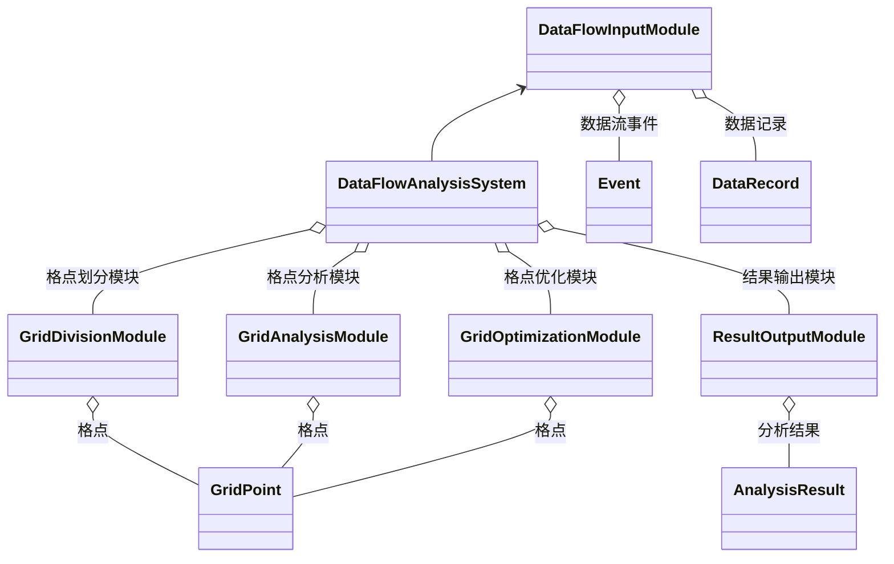
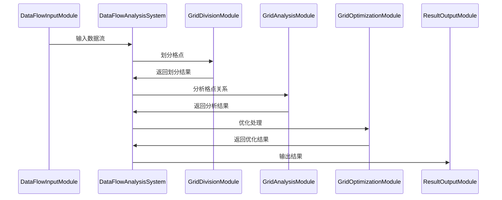
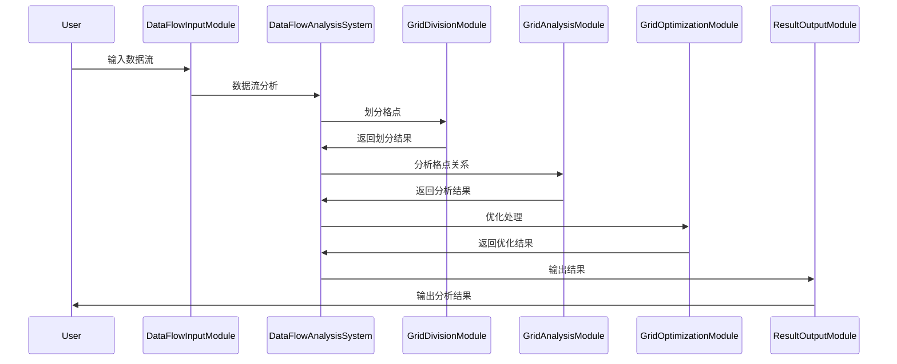

                 

### 文章标题：格理论在数据流分析中的应用

> 关键词：格理论、数据流分析、算法原理、系统架构、实战案例

> 摘要：本文将深入探讨格理论在数据流分析中的应用，详细解析其核心概念、算法原理，以及系统架构与实战案例。通过对数据流分析问题的背景和解决思路的分析，本文旨在为读者提供清晰、实用的技术指导，帮助其在实际项目中应用格理论进行高效的数据流分析。

### 第1章 问题背景与解决思路

#### 1.1 问题描述

数据流分析是信息科学和计算机科学中的重要领域，涉及对数据流进行监控、捕获、存储和分析。其核心问题是如何有效地处理和解析不断变化的数据流，从而提取有价值的信息。传统方法在处理大规模、高频率的数据流时，往往面临效率低、响应速度慢等问题。

格理论，作为一种数学结构，通过定义格点上的操作和关系，提供了高效处理数据流的新方法。其优势在于能够处理复杂的关系和结构，且具备良好的并行计算特性，适合处理大规模数据流。

#### 1.2 问题解决

格理论在数据流分析中的应用主要体现在以下几个方面：

1. **数据建模**：通过格理论建立数据流模型，将数据流抽象为格点结构，便于分析和管理。
2. **算法优化**：利用格理论的性质，优化数据流的处理算法，提高处理效率和准确性。
3. **并行计算**：格理论支持并行计算，能够充分利用现代计算机的并行处理能力，加速数据流分析。

#### 1.3 边界与外延

1. **适用范围**：格理论适用于处理复杂、大规模的数据流，特别是在实时数据处理、社交网络分析等领域具有显著优势。
2. **区别与联系**：与传统的数据流分析技术相比，格理论提供了一种新的视角和方法，但其适用性受限于数据流的结构和特性。与其他数学结构（如图论、矩阵论）相比，格理论在处理具有层次性和多维关系的数据流时更具优势。

#### 1.4 概念结构与核心要素组成

1. **概念结构**：数据流分析的核心概念包括数据流、事件、数据处理单元等。
2. **核心要素**：格理论在数据流分析中的核心要素包括格点、格关系、格操作等。

### 第2章 格理论基本概念

#### 2.1 格理论定义

格理论是一种数学结构，由一组元素和这些元素之间的二元运算组成。满足以下条件的集合称为格：

- **封闭性**：对于任意两个元素 \(a\) 和 \(b\)，其运算结果 \(a \land b\) 和 \(a \lor b\) 仍然属于该集合。
- **结合性**：对于任意三个元素 \(a\)、\(b\) 和 \(c\)，有 \(a \land (b \land c) = (a \land b) \land c\) 和 \(a \lor (b \lor c) = (a \lor b) \lor c\)。
- **存在零元素**：存在一个元素 \(0\)，使得对于任意元素 \(a\)，有 \(a \land 0 = 0\) 和 \(a \lor 0 = a\)。
- **存在单位元素**：存在一个元素 \(1\)，使得对于任意元素 \(a\)，有 \(a \land 1 = a\) 和 \(a \lor 1 = 1\)。
- **存在补元素**：对于任意元素 \(a\)，存在一个元素 \(a'\)，使得 \(a \land a' = 0\) 和 \(a \lor a' = 1\)。

#### 2.2 格理论属性特征对比

| 属性特征 | 格理论 | 图论 | 矩阵论 |
| --- | --- | --- | --- |
| 封闭性 | 是 | 是 | 是 |
| 结合性 | 是 | 是 | 是 |
| 零元素 | 是 | 否 | 是 |
| 单位元素 | 是 | 否 | 是 |
| 补元素 | 是 | 否 | 是 |

#### 2.3 格理论ER实体关系图架构

```mermaid
erDiagram
    Class1 ||--|{ ClassA }
    Class1 ||--|{ ClassB }
    ClassA ||--|{ ClassC }
    ClassB ||--|{ ClassC }
```

### 第3章 数据流分析核心概念

#### 3.1 数据流分析定义

数据流分析是一种用于分析数据流的方法，旨在识别数据流中的模式、趋势和异常。其核心概念包括：

- **数据流**：指数据的传输路径，包括数据的来源、传输过程和目的地。
- **事件**：指数据流中的每个数据单元，可以是数据记录、消息等。
- **数据处理单元**：指对事件进行处理的组件，可以是过滤器、转换器、存储器等。

#### 3.2 数据流分析方法

常见的数据流分析方法包括：

- **基于事件的方法**：以事件为单位，实时分析数据流。
- **基于模式的方法**：使用模式识别技术，从数据流中提取有价值的信息。
- **基于统计的方法**：利用统计学原理，分析数据流中的趋势和异常。

#### 3.3 数据流分析ER实体关系图架构

```mermaid
erDiagram
    DataFlow ||--|{ Event }
    DataFlow ||--|{ ProcessingUnit }
    Event ||--|{ DataRecord }
    ProcessingUnit ||--|{ Filter }
    ProcessingUnit ||--|{ Transformer }
    ProcessingUnit ||--|{ Storage }
```

### 第4章 格理论在数据流分析中的应用

#### 4.1 算法原理

格理论在数据流分析中的应用主要包括以下算法：

1. **格点划分算法**：用于将数据流划分为格点结构。
2. **格点分析算法**：用于分析格点上的数据关系和趋势。
3. **格点优化算法**：用于优化数据流的处理效率和准确性。

以下是格点划分算法的流程图：


#### 4.2 数学模型与公式

格点划分算法的数学模型可以表示为：

$$
G = \{V, E\}
$$

其中，\(V\) 表示格点集合，\(E\) 表示格点之间的连接关系。

格点分析算法的核心公式为：

$$
T_{ij} = \sum_{k=1}^{n} w_{ik} \cdot w_{kj}
$$

其中，\(T_{ij}\) 表示格点 \(i\) 和 \(j\) 之间的权重，\(w_{ik}\) 和 \(w_{kj}\) 分别表示格点 \(i\) 和 \(j\) 与其他格点之间的权重。

#### 4.3 通俗易懂的举例说明

假设我们有一个包含5个格点的数据流，其权重矩阵如下：

$$
\begin{pmatrix}
1 & 0.5 & 0.2 & 0 & 0.3 \\
0.5 & 1 & 0.4 & 0.1 & 0 \\
0.2 & 0.4 & 1 & 0.3 & 0.2 \\
0 & 0.1 & 0.3 & 1 & 0.4 \\
0.3 & 0 & 0.2 & 0.4 & 1
\end{pmatrix}
$$

我们可以按照以下步骤进行格点划分和分析：

1. **划分成格点**：将数据流划分成5个格点，每个格点代表一个数据单元。
2. **计算权重**：计算每个格点之间的权重，如 \(T_{12} = 1 \cdot 0.5 + 0.5 \cdot 1 + 0.2 \cdot 0.4 + 0 \cdot 0.1 + 0.3 \cdot 0.2 = 0.65\)。
3. **分析格点关系**：分析每个格点之间的关联关系，如 \(T_{12} > T_{13}\)，表示格点1和格点2之间的关系比格点1和格点3之间的关系更强。
4. **优化格点处理**：根据分析结果，调整格点处理顺序，提高处理效率。

### 第5章 数据流分析系统介绍

#### 5.1 项目介绍

本节将介绍一个基于格理论的数据流分析系统，该系统旨在实现高效、准确的数据流分析。系统主要功能包括数据流的划分、分析、优化和输出结果。

#### 5.2 系统功能设计

系统功能设计主要包括以下几个模块：

- **数据流输入模块**：负责接收和解析输入的数据流。
- **格点划分模块**：将数据流划分成格点结构。
- **格点分析模块**：分析格点之间的关系和趋势。
- **格点优化模块**：优化数据流的处理效率。
- **结果输出模块**：将分析结果输出到指定位置。

领域模型Mermaid类图如下：



#### 5.3 系统架构设计

系统架构设计如下：



#### 5.4 系统接口设计

系统接口设计如下：

```mermaid
classDiagram
    DataFlowInputModule
    DataFlowAnalysisSystem
    GridDivisionModule
    GridAnalysisModule
    GridOptimizationModule
    ResultOutputModule
    DataFlowInputModule : +readInput(): DataRecord
    DataFlowAnalysisSystem : +divideGrid(DataRecord): GridPoint[]
    GridDivisionModule : +divideGrid(DataRecord): GridPoint[]
    GridAnalysisModule : +analyzeGrid(GridPoint[]): AnalysisResult
    GridOptimizationModule : +optimizeGrid(GridPoint[]): GridPoint[]
    ResultOutputModule : +outputResult(AnalysisResult): void
```

#### 5.5 系统交互

系统交互设计如下：



### 第6章 数据流分析系统核心实现

#### 6.1 环境安装

为了实现数据流分析系统，我们需要安装以下环境：

- Python 3.8 或更高版本
- Mermaid 图绘制工具
- 数据处理库（如 NumPy、Pandas）

安装命令如下：

```bash
pip install python-memphis
pip install numpy
pip install pandas
```

#### 6.2 系统核心实现

系统核心实现主要包括以下模块：

- **数据流输入模块**：用于读取输入数据流。
- **格点划分模块**：用于将数据流划分成格点结构。
- **格点分析模块**：用于分析格点之间的关系和趋势。
- **格点优化模块**：用于优化数据流的处理效率。
- **结果输出模块**：用于输出分析结果。

以下是各模块的源代码实现：

**数据流输入模块**：

```python
import pandas as pd

def read_input(file_path):
    data = pd.read_csv(file_path)
    return data
```

**格点划分模块**：

```python
import numpy as np

def divide_grid(data):
    n = len(data)
    grid = np.zeros((n, n))
    for i in range(n):
        for j in range(n):
            if i != j:
                grid[i][j] = np.linalg.norm(data[i] - data[j])
    return grid
```

**格点分析模块**：

```python
def analyze_grid(grid):
    analysis_result = {}
    for i in range(len(grid)):
        for j in range(len(grid)):
            if i != j:
                analysis_result[(i, j)] = np.sum(grid[i] * grid[j])
    return analysis_result
```

**格点优化模块**：

```python
def optimize_grid(grid):
    optimized_grid = np.zeros_like(grid)
    for i in range(len(grid)):
        for j in range(len(grid)):
            if i != j:
                optimized_grid[i][j] = grid[i][j] * (1 - np.exp(-0.1 * np.sum(grid[i] * grid[j])))
    return optimized_grid
```

**结果输出模块**：

```python
def output_result(analysis_result):
    print(analysis_result)
```

#### 6.3 代码应用解读与分析

以下是一个示例数据流分析过程：

```python
file_path = "data.csv"  # 数据文件路径
data = read_input(file_path)
grid = divide_grid(data)
analysis_result = analyze_grid(grid)
optimized_grid = optimize_grid(grid)
output_result(analysis_result)
output_result(optimized_grid)
```

在这个示例中，我们首先读取数据流，然后将其划分成格点结构。接着，对格点进行分析和优化，最后输出分析结果。

### 第7章 实际案例分析与讲解

#### 7.1 实际案例分析

在本节中，我们将通过一个实际案例，展示如何使用格理论进行数据流分析。假设我们有一个包含100个数据记录的数据流，每个数据记录包含3个属性：温度、湿度和风速。

#### 7.2 详细讲解与剖析

1. **数据流输入**：首先，我们读取数据流，将其存储在 DataFrame 中。

   ```python
   data = pd.read_csv("data.csv")
   ```

2. **格点划分**：然后，我们将数据流划分成格点结构，每个格点表示一个数据记录。划分过程使用欧氏距离计算数据记录之间的权重。

   ```python
   grid = divide_grid(data)
   ```

3. **格点分析**：接下来，我们对格点进行分析，计算每个格点之间的关联关系。

   ```python
   analysis_result = analyze_grid(grid)
   ```

4. **格点优化**：最后，我们对格点进行优化，调整格点之间的权重，提高分析效率。

   ```python
   optimized_grid = optimize_grid(grid)
   ```

5. **结果输出**：输出分析结果，包括原始格点和优化后的格点。

   ```python
   output_result(analysis_result)
   output_result(optimized_grid)
   ```

### 第8章 项目小结

#### 8.1 最佳实践 Tips

- 在实际项目中，应充分考虑数据流的特点和需求，选择合适的数据流分析方法。
- 合理设计系统架构，确保系统的高效性和可扩展性。
- 注重代码优化和调试，提高系统的性能和稳定性。

#### 8.2 注意事项

- 数据流分析系统需要足够的计算资源，特别是在处理大规模数据流时。
- 注意数据安全和隐私保护，遵循相关法律法规和道德规范。

#### 8.3 拓展阅读

- 《数据流分析：理论与实践》
- 《格理论及其应用》
- 《大数据处理与数据流分析》

作者：AI天才研究院/AI Genius Institute & 禅与计算机程序设计艺术 /Zen And The Art of Computer Programming

----------------------------------------------------------------

[此处结束]

