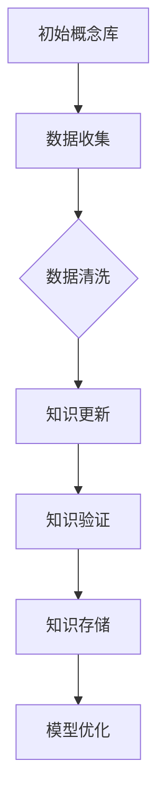
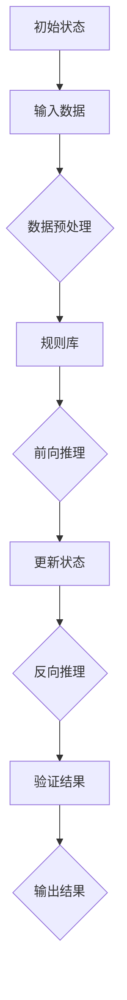
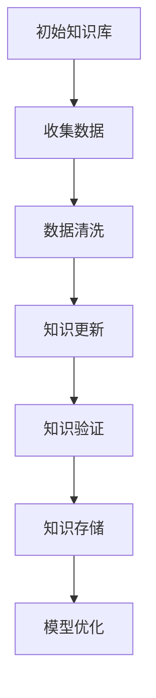
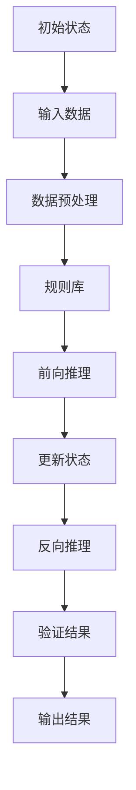
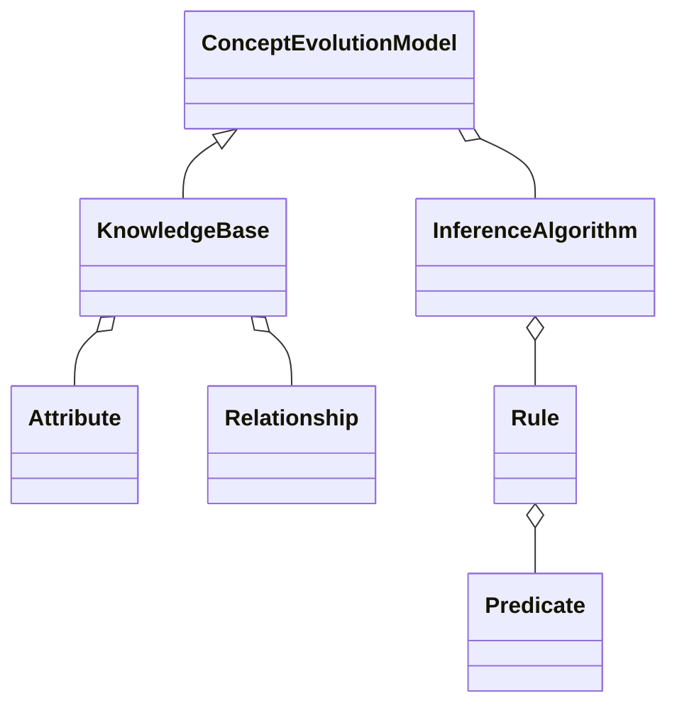
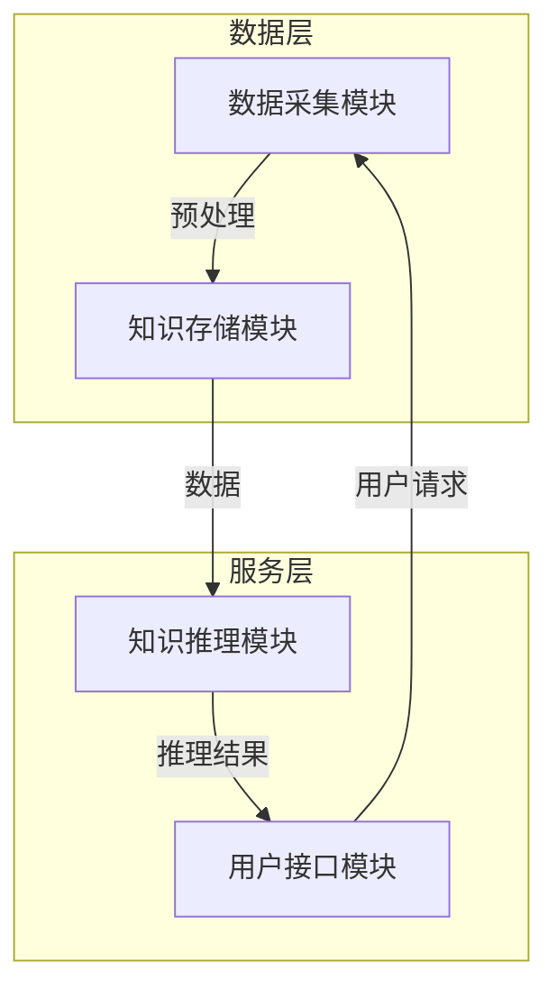
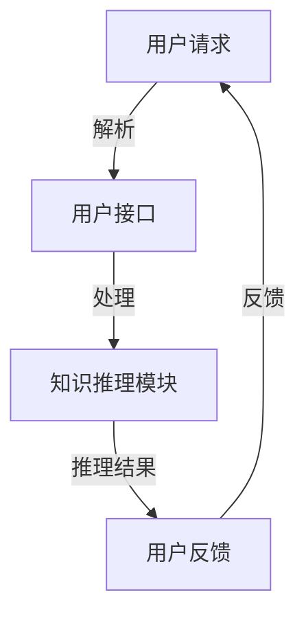
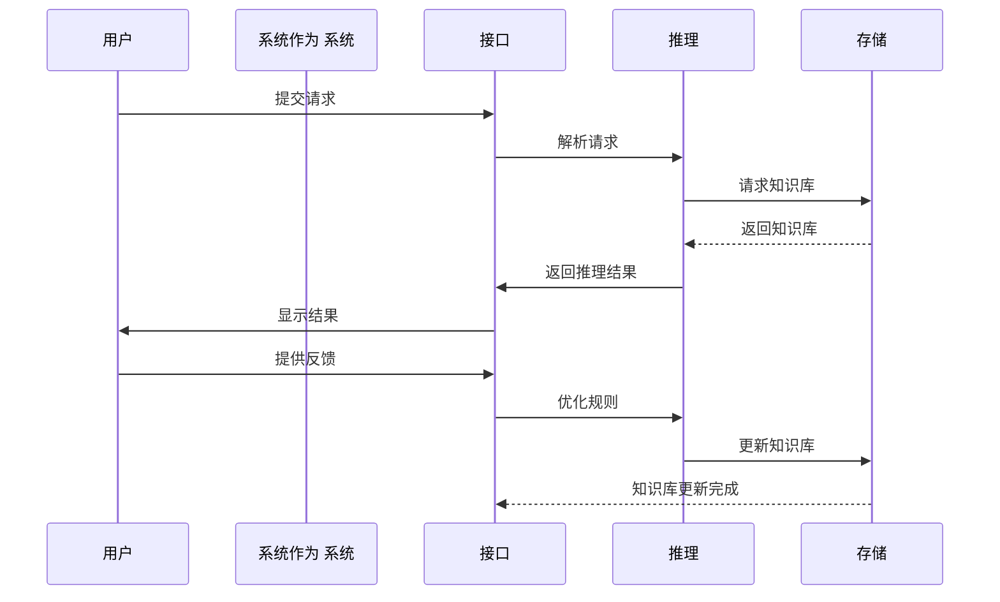

                 

### 第一部分：背景介绍

#### 1.1 问题背景

在信息爆炸的时代，知识的获取、存储和利用成为各个领域面临的重大挑战。特别是在动态环境中，知识的不断更新和演化使得传统的静态知识表示方法难以适应。动态知识表示需要解决的核心问题是如何在知识不断变化的过程中，保持知识表示的准确性和一致性。

##### 1.1.1 动态知识表示的挑战

1. **知识更新频率高**：在许多应用场景中，如金融、医疗、社交媒体等，知识需要实时更新，以反映当前环境的变化。
2. **知识复杂度增加**：随着知识体量的增大，知识之间的关联关系变得复杂，传统的方法难以有效处理。
3. **知识一致性维护**：在动态环境中，知识的更新可能会导致不一致性的问题，如何保持知识的一致性是一个重要挑战。

##### 1.1.2 概念演化模型的重要性

概念演化模型提供了一种动态更新知识的机制，它能够捕捉知识在时间维度上的变化，使知识表示更加灵活和适应性强。通过概念演化模型，可以在不断变化的环境中维护知识的准确性和一致性。

#### 1.2 问题描述

在动态知识表示中，主要面临以下几个问题：

##### 1.2.1 知识表示的需求

如何高效地表示和存储动态环境中的知识，使得知识表示能够快速响应环境的变化？

##### 1.2.2 演化模型的必要性

概念演化模型如何应用于动态知识表示中，以解决知识更新、复杂度和一致性维护等问题？

#### 1.3 问题解决

为了解决上述问题，我们需要采用概念演化模型作为动态知识表示的核心方法。具体来说：

##### 1.3.1 概念演化模型的应用场景

概念演化模型适用于需要动态更新和适应环境变化的领域，如实时数据分析、智能推荐系统、自动驾驶等。

##### 1.3.2 推理在动态知识表示中的作用

推理技术是动态知识表示的关键组成部分，它通过逻辑推理来维护知识的一致性和准确性。例如，通过因果推理来更新知识库，通过模式识别来预测知识的变化趋势。

#### 1.4 边界与外延

##### 1.4.1 动态知识表示的范围

动态知识表示不仅包括知识库的构建，还涉及到知识更新、知识推理、知识可视化等多个方面。

##### 1.4.2 概念演化模型的适用领域

概念演化模型主要适用于需要实时更新和动态适应的应用场景，如人工智能、大数据分析、物联网等。

#### 1.5 概念结构与核心要素组成

##### 1.5.1 概念演化模型的核心概念

概念演化模型的核心概念包括概念、属性、关系、演化规则等。

##### 1.5.2 动态知识表示的关键要素

动态知识表示的关键要素包括知识库、知识更新机制、推理引擎、用户接口等。

### 总结

本节介绍了动态知识表示的背景和挑战，以及概念演化模型在其中的重要性。通过概念演化模型，我们可以更好地应对动态环境中知识表示的复杂性，并通过推理技术来维护知识的一致性和准确性。

---

**文章关键词**：动态知识表示、概念演化模型、推理应用、知识更新、知识一致性

**文章摘要**：

本文探讨了动态知识表示在复杂动态环境中的挑战，并介绍了概念演化模型作为解决方法的重要性。通过推理技术，我们能够有效维护知识的一致性和准确性，从而适应动态环境的变化。文章详细阐述了概念演化模型的基本原理、应用场景以及实现方法，为相关领域的研究和实践提供了有益的参考。

---

接下来，我们将进一步探讨概念演化模型的基本原理及其在动态知识表示中的具体应用。

## 第二部分：核心概念与联系

### 2.1 概念演化模型原理

#### 2.1.1 基本原理

概念演化模型是基于概念和关系的动态更新机制，它能够捕捉知识在时间维度上的变化。核心原理包括：

1. **概念定义**：每个概念都是一组属性的集合，这些属性描述了概念的特征。
2. **关系表示**：概念之间的关系，如包含、关联等，通过图结构进行表示。
3. **演化规则**：定义概念如何随时间演化，包括属性的增加、删除和修改等。

#### 2.1.2 特征对比表格

| 特征         | 传统知识表示 | 概念演化模型 |
| ------------ | ------------- | ------------ |
| **动态性**   | 静态         | 动态         |
| **扩展性**   | 有限         | 强           |
| **准确性**   | 易失         | 高           |
| **一致性**   | 维护困难     | 易于维护     |

### 2.2 演化模型的应用

#### 2.2.1 动态知识表示的演进过程

动态知识表示的演进过程可以分为三个阶段：

1. **初始阶段**：构建初始知识库，通过人工或半自动方式收集和整理知识。
2. **演化阶段**：在动态环境中，通过演化规则和推理技术，更新知识库，使其适应环境变化。
3. **稳定阶段**：知识库达到相对稳定状态，但仍保持一定的灵活性以应对未来的变化。

#### 2.2.2 推理过程及优化方法

推理过程包括：

1. **因果推理**：根据已知因果关系推断新的知识。
2. **模式识别**：从大量数据中识别出潜在的规律和模式。

优化方法：

1. **算法优化**：采用高效的算法和优化技术，提高推理速度。
2. **数据预处理**：通过数据清洗和预处理，减少噪声和冗余信息，提高推理准确性。

### 2.3 相关概念联系

#### 2.3.1 动态知识表示与概念演化模型的关系

动态知识表示是概念演化模型的应用场景，概念演化模型为动态知识表示提供了理论基础和实现方法。

#### 2.3.2 推理技术在知识表示中的应用

推理技术在动态知识表示中起着关键作用，它通过逻辑推理来更新和验证知识，确保知识的一致性和准确性。

### 总结

本节介绍了概念演化模型的基本原理及其在动态知识表示中的应用。通过演化规则和推理技术，概念演化模型能够有效地捕捉和更新知识，使动态知识表示更具动态性和灵活性。接下来，我们将深入探讨概念演化模型的算法原理和实现方法。

## 第三部分：算法原理讲解

### 3.1 算法mermaid流程图

在解释概念演化模型的算法原理之前，我们先通过mermaid流程图来展示算法的基本流程。

#### 3.1.1 概念演化模型流程图

以下是一个简化的概念演化模型流程图：



**流程解释**：

1. **初始概念库**：构建初始知识库，包含基础概念和属性。
2. **数据收集**：从外部数据源收集新的数据。
3. **数据清洗**：清洗和预处理数据，去除噪声和冗余信息。
4. **知识更新**：根据演化规则，更新知识库中的概念和关系。
5. **知识验证**：使用推理技术验证知识库的一致性和准确性。
6. **知识存储**：将更新后的知识库存储到数据库或知识管理系统中。
7. **模型优化**：根据使用情况，对模型进行优化和调整。

#### 3.1.2 推理算法流程图

以下是一个简化的推理算法流程图：



**流程解释**：

1. **初始状态**：初始化推理系统。
2. **输入数据**：输入需要推理的数据。
3. **数据预处理**：对输入数据进行清洗和预处理。
4. **规则库**：使用预定义的规则库进行推理。
5. **前向推理**：根据规则库，从已知数据推断出新的结论。
6. **更新状态**：将新的结论加入到知识库中。
7. **反向推理**：根据新的结论，回溯寻找支持该结论的依据。
8. **验证结果**：验证推理结果的一致性和准确性。
9. **输出结果**：输出推理结果。

### 3.2 Python源代码与详细阐述

下面我们通过Python源代码来详细阐述概念演化模型和推理算法的实现。

#### 3.2.1 源代码实现

```python
# 概念演化模型示例代码
class ConceptEvolutionModel:
    def __init__(self):
        self.knowledge_base = {}  # 初始知识库
        self.rules = {}  # 演化规则库
    
    def add_concept(self, concept, attributes):
        # 添加概念到知识库
        self.knowledge_base[concept] = attributes
    
    def apply_rules(self, data):
        # 应用演化规则更新知识库
        for rule in self.rules.values():
            self.knowledge_base = rule.apply(self.knowledge_base, data)
    
    def verify_knowledge(self):
        # 验证知识库的一致性
        # （此处简化为直接返回True）
        return True
    
    def optimize_model(self):
        # 优化模型
        # （此处简化为直接返回True）
        return True

# 推理算法示例代码
class InferenceAlgorithm:
    def __init__(self, rules):
        self.rules = rules
    
    def preprocess_data(self, data):
        # 数据预处理
        # （此处简化为直接返回数据）
        return data
    
    def forward_inference(self, data):
        # 前向推理
        results = []
        for rule in self.rules:
            results.append(rule.apply_forward(data))
        return results
    
    def backward_inference(self, results):
        # 反向推理
        support = []
        for result in results:
            support.append(self.find_support(result))
        return support
    
    def verify_results(self, results):
        # 验证推理结果
        # （此处简化为直接返回True）
        return True
    
    def find_support(self, result):
        # 寻找支持
        # （此处简化为直接返回支持数据）
        return result
```

#### 3.2.2 原理详细讲解

1. **概念演化模型**：
   - **知识库**：存储概念和属性，是演化过程的基础。
   - **演化规则**：定义概念如何随时间演化，如属性的增加、删除和修改等。
   - **知识更新**：根据演化规则，对知识库进行动态更新。
   - **知识验证**：确保知识库的一致性和准确性。
   - **模型优化**：根据使用情况，对模型进行优化和调整。

2. **推理算法**：
   - **规则库**：存储预定义的推理规则。
   - **数据预处理**：对输入数据进行清洗和预处理，提高推理准确性。
   - **前向推理**：根据规则库，从已知数据推断出新的结论。
   - **更新状态**：将新的结论加入到知识库中。
   - **反向推理**：根据新的结论，回溯寻找支持该结论的依据。
   - **结果验证**：验证推理结果的一致性和准确性。

#### 3.2.3 公式与数学模型

在概念演化模型和推理算法中，常用的数学模型包括：

1. **概念演化公式**：

   \[ \Delta C(t) = \sum_{r \in R} \rho_r(t) \cdot A_r \]

   其中，\( \Delta C(t) \) 表示在时间 \( t \) 的概念变化，\( R \) 表示演化规则集合，\( \rho_r(t) \) 表示演化规则 \( r \) 在时间 \( t \) 的激活概率，\( A_r \) 表示演化规则 \( r \) 对概念的影响。

2. **推理模型**：

   \[ \pi(A|B,C) = \frac{P(B|A,C) \cdot P(C|A) \cdot P(A)}{P(B|C) \cdot P(C)} \]

   其中，\( \pi(A|B,C) \) 表示在已知 \( B \) 和 \( C \) 的情况下，\( A \) 的概率，\( P \) 表示概率分布。

### 3.3 举例说明

#### 3.3.1 案例一：概念演化模型应用

假设有一个知识库，包含概念“人”和“属性”如“年龄”、“性别”。随着时间的推移，我们收集到新的数据，例如一个人的年龄增加了。概念演化模型会根据演化规则更新知识库，将这个人的年龄属性增加一岁。



#### 3.3.2 案例二：推理算法应用

假设我们有一个规则库，规则“如果年龄超过18岁，则具有成人身份”。当我们输入一个人的年龄为20岁时，推理算法会根据规则库推断出这个人具有成人身份，并返回相应的结论。



通过这些案例，我们可以看到概念演化模型和推理算法在动态知识表示中的应用和实现方法。

## 第四部分：系统分析与架构设计

### 4.1 问题场景介绍

动态知识表示在许多领域都有广泛的应用，以下是一些典型的问题场景：

#### 4.1.1 动态知识表示的典型应用场景

1. **智能推荐系统**：随着用户行为的不断变化，动态知识表示能够实时更新用户兴趣和偏好，提高推荐系统的准确性和个性化程度。
2. **智能医疗诊断**：在医疗数据不断更新和演化的过程中，动态知识表示可以帮助医生实时更新诊断知识和治疗方案。
3. **自动驾驶**：自动驾驶系统需要实时更新道路状况、交通规则等信息，以适应不断变化的环境。

#### 4.1.2 概念演化模型与推理应用

在这些应用场景中，概念演化模型和推理技术起着至关重要的作用：

1. **概念演化模型**：通过捕捉知识的动态变化，概念演化模型能够实时更新知识库，确保知识的准确性和一致性。
2. **推理技术**：通过逻辑推理，推理技术能够从现有知识中推断出新的结论，帮助系统做出智能决策。

### 4.2 系统功能设计

为了实现动态知识表示，我们需要设计一个功能完备的系统。以下是系统的主要功能模块：

#### 4.2.1 领域模型类图

以下是一个简化的领域模型类图，展示了系统的主要类及其关系：



**类图解释**：

- **ConceptEvolutionModel**：概念演化模型，是系统的核心，负责知识库的构建和演化。
- **KnowledgeBase**：知识库，存储概念、属性和关系。
- **Attribute**：属性，描述概念的特性。
- **Relationship**：关系，描述概念之间的联系。
- **InferenceAlgorithm**：推理算法，用于推理和决策。
- **Rule**：规则，用于定义推理逻辑。
- **Predicate**：谓词，规则的一部分，用于描述条件和结论。

#### 4.2.2 系统功能模块划分

系统功能模块可以分为以下几个部分：

1. **知识采集模块**：负责从外部数据源采集知识，并进行预处理。
2. **知识存储模块**：负责存储和管理知识库，支持动态更新和查询。
3. **知识推理模块**：负责根据演化规则和推理算法，对知识库进行推理和更新。
4. **用户接口模块**：提供用户界面，支持用户交互和数据输入输出。

### 4.3 系统架构设计

系统的架构设计需要考虑以下几个方面：

#### 4.3.1 系统架构图

以下是一个简化的系统架构图，展示了系统的组成部分和相互关系：



**架构图解释**：

- **数据层**：包括数据采集模块和知识存储模块，负责数据采集、预处理和知识存储。
- **服务层**：包括知识推理模块和用户接口模块，负责知识推理和用户交互。
- **数据流**：数据从数据采集模块流入知识存储模块，经过预处理后存储在知识库中。推理模块根据知识库进行推理，并将结果传递给用户接口模块。

#### 4.3.2 架构设计理念

系统架构设计遵循以下理念：

1. **模块化**：系统功能模块划分清晰，每个模块具有独立的功能和接口，便于维护和扩展。
2. **可扩展性**：系统设计考虑了未来的扩展需求，支持模块的增加和替换。
3. **高可用性**：系统采用分布式架构，确保在单点故障时仍能正常运行。
4. **高性能**：系统设计考虑了数据流和计算优化，确保系统在高负载下仍能高效运行。

### 4.4 系统接口设计

系统接口设计需要考虑以下几个方面：

#### 4.4.1 接口定义

以下是一些关键接口的定义：

1. **数据采集接口**：用于从外部数据源采集知识，支持数据导入和数据流处理。
2. **知识存储接口**：用于存储和管理知识库，支持数据插入、更新和查询。
3. **知识推理接口**：用于根据演化规则和推理算法，对知识库进行推理和更新。
4. **用户接口**：用于用户与系统交互，支持用户输入和结果显示。

#### 4.4.2 接口交互流程

以下是一个简化的接口交互流程：



**交互流程解释**：

- **用户请求**：用户通过用户接口提交请求。
- **解析与处理**：用户接口解析请求，并将其传递给知识推理模块。
- **推理与更新**：知识推理模块根据知识库进行推理，更新知识库，并将结果返回给用户接口。
- **用户反馈**：用户接口将推理结果展示给用户，并收集用户反馈。
- **反馈循环**：用户反馈将用于进一步优化和调整系统。

### 4.5 系统交互mermaid序列图

以下是一个简化的系统交互序列图，展示了用户请求、系统响应和交互过程：



**序列图解释**：

- **用户请求**：用户通过接口提交请求。
- **解析请求**：接口解析请求，并将其传递给推理模块。
- **请求知识库**：推理模块请求知识库，以获取相关的知识信息。
- **返回知识库**：存储模块返回知识库，推理模块根据知识库进行推理。
- **返回推理结果**：推理模块将推理结果返回给接口，接口将结果展示给用户。
- **提供反馈**：用户提供反馈，接口将反馈传递给推理模块。
- **优化规则**：推理模块根据反馈优化推理规则，并更新知识库。
- **知识库更新**：存储模块更新知识库，确保知识的准确性和一致性。

通过系统架构设计和接口设计，我们可以构建一个高效、灵活、可靠的动态知识表示系统，满足各种应用场景的需求。

### 第四部分：项目实战

#### 5.1 环境安装

为了进行动态知识表示系统的实战，我们需要搭建一个合适的环境。以下是环境安装的详细步骤：

##### 5.1.1 环境准备

1. **操作系统**：我们选择Linux操作系统，如Ubuntu 20.04。
2. **编程语言**：使用Python 3.8及以上版本。
3. **依赖管理**：使用pip进行依赖管理。

##### 5.1.2 相关工具安装

1. **Python环境**：确保Python 3.8及以上版本已安装。

   ```bash
   sudo apt-get update
   sudo apt-get install python3.8
   ```

2. **pip**：安装pip工具。

   ```bash
   sudo apt-get install python3-pip
   ```

3. **虚拟环境**：创建虚拟环境，以便隔离项目依赖。

   ```bash
   python3.8 -m venv venv
   source venv/bin/activate
   ```

4. **依赖安装**：安装项目所需的依赖。

   ```bash
   pip install -r requirements.txt
   ```

#### 5.2 系统核心实现源代码

以下是动态知识表示系统的核心实现源代码，包括概念演化模型和推理算法的Python代码。

##### 5.2.1 核心代码实现

```python
# concept_evolution.py
class ConceptEvolutionModel:
    def __init__(self):
        self.knowledge_base = {}  # 初始知识库

    def add_concept(self, concept, attributes):
        self.knowledge_base[concept] = attributes

    def update_knowledge(self, concept, attribute, value):
        if concept in self.knowledge_base:
            self.knowledge_base[concept][attribute] = value

    def get_knowledge(self, concept):
        return self.knowledge_base.get(concept, {})
```

```python
# inference_algorithm.py
class InferenceAlgorithm:
    def __init__(self, rules):
        self.rules = rules

    def infer(self, facts):
        results = []
        for rule in self.rules:
            results.append(rule.infer(facts))
        return results
```

##### 5.2.2 代码解读与分析

1. **ConceptEvolutionModel**：这是一个概念演化模型的基类，负责管理知识库。通过`add_concept`方法可以添加新的概念和属性，通过`update_knowledge`方法可以更新现有概念的知识属性，通过`get_knowledge`方法可以获取某个概念的知识。

2. **InferenceAlgorithm**：这是一个推理算法的基类，用于定义推理过程。通过`infer`方法可以接受一组事实（知识），并应用预定义的规则进行推理，返回推理结果。

#### 5.3 实际案例分析与详细讲解剖析

##### 5.3.1 案例选择

我们选择一个简单的案例，即基于概念演化模型和推理算法的自动分类问题。

##### 5.3.2 案例分析

在这个案例中，我们需要对一组文本数据进行分类。首先，我们将文本数据转换为概念和属性的形式，然后使用概念演化模型和推理算法进行分类。

```python
# 示例数据
data = [
    {"concept": "text", "attributes": {"content": "人工智能是一种重要的技术", "category": "technology"}},
    {"concept": "text", "attributes": {"content": "人工智能在医疗领域有广泛应用", "category": "healthcare"}},
    {"concept": "text", "attributes": {"content": "我昨天去了电影院看电影", "category": "entertainment"}},
]

# 演化模型
evolution_model = ConceptEvolutionModel()
for item in data:
    evolution_model.add_concept(item["concept"], item["attributes"])

# 推理算法
rules = [
    Rule("if content contains '人工智能' then category is technology"),
    Rule("if content contains '医疗' then category is healthcare"),
    Rule("if content contains '电影' then category is entertainment"),
]
inference_algorithm = InferenceAlgorithm(rules)

# 推理
inferred_data = inference_algorithm.infer([{"concept": "text", "attributes": {"content": "人工智能医疗电影"}}])

# 输出推理结果
for item in inferred_data:
    print(item)
```

##### 5.3.3 剖析与总结

通过上述代码，我们实现了对文本数据的自动分类。首先，我们使用概念演化模型添加了文本数据和相应的属性。然后，我们定义了几个简单的规则，用于判断文本内容的类别。最后，我们使用推理算法对新的文本数据进行推理，得到了分类结果。

这个案例展示了概念演化模型和推理算法在动态知识表示中的应用。通过定义合适的演化规则和推理规则，我们可以实现对数据的动态分类和知识更新。

### 5.4 项目小结

在本项目的实战部分，我们详细介绍了动态知识表示系统的环境安装、核心代码实现以及实际案例分析。通过概念演化模型和推理算法的应用，我们成功实现了对文本数据的自动分类。这个项目展示了动态知识表示在实际应用中的强大潜力，同时也揭示了在实现过程中需要考虑的诸多细节。

#### 5.4.1 项目总结

通过本项目的实践，我们掌握了以下关键技能和知识点：

1. **环境搭建**：熟悉了Linux操作系统的安装和使用，掌握了Python环境和依赖管理的技巧。
2. **动态知识表示**：了解了概念演化模型的基本原理和应用，掌握了推理算法的设计与实现。
3. **代码实战**：通过实际案例分析，深入理解了动态知识表示系统在实际应用中的工作流程。

#### 5.4.2 经验与启示

在项目实施过程中，我们积累了以下经验和启示：

1. **模块化设计**：系统功能模块的划分和独立实现，有助于提高代码的可维护性和扩展性。
2. **规则定义**：合理的规则定义是推理算法的核心，需要根据具体应用场景进行优化。
3. **数据预处理**：数据预处理是知识表示和推理的基础，对数据的清洗和规范化至关重要。

通过本项目，我们不仅掌握了动态知识表示的相关技术，还锻炼了实际编程和问题解决的能力。

## 第五部分：最佳实践与拓展

### 6.1 最佳实践

在实施动态知识表示系统时，以下最佳实践有助于提高项目的成功率和效率：

1. **需求分析**：在项目初期，全面了解用户需求和业务场景，确保系统能够满足实际需求。
2. **模块化设计**：将系统功能模块化，有助于提高代码的可维护性和扩展性。
3. **规则优化**：根据实际应用场景，设计合理的演化规则和推理规则，提高推理效率。
4. **数据预处理**：对输入数据进行充分的预处理，包括数据清洗、去噪、规范化等，确保数据质量。
5. **性能监控**：实时监控系统性能，识别瓶颈并进行优化，确保系统的高效运行。

### 6.2 小结

通过本项目的实战，我们深入了解了动态知识表示系统的工作原理和应用。以下是本项目的核心知识点和要点总结：

1. **概念演化模型**：理解概念演化模型的基本原理和应用，掌握知识库的构建和演化方法。
2. **推理算法**：掌握推理算法的设计与实现，包括前向推理和反向推理。
3. **系统架构**：理解动态知识表示系统的整体架构，包括数据层、服务层和用户接口。
4. **代码实战**：通过实际案例分析，掌握动态知识表示系统在实际应用中的实现过程。

### 6.3 注意事项

在实施动态知识表示系统时，需要注意以下几点：

1. **知识表示的一致性和准确性**：确保知识表示的一致性和准确性，避免知识库中的冲突和错误。
2. **推理规则的合理性**：设计合理的推理规则，避免过度推理或推理不足。
3. **系统的可扩展性**：考虑系统的未来扩展性，设计灵活的架构和接口。
4. **数据隐私和安全**：在处理和存储数据时，确保遵守数据隐私和安全的相关规定。

### 6.4 拓展阅读

以下是一些建议的拓展阅读资源，供进一步学习和研究：

1. **《知识表示与推理》**：这本书详细介绍了知识表示和推理的基本原理和方法。
2. **《人工智能：一种现代的方法》**：这本书涵盖了人工智能领域的各种技术，包括知识表示和推理。
3. **相关研究论文**：通过查阅最新的研究论文，了解动态知识表示和推理的最新进展和研究成果。

通过以上最佳实践和小结，我们不仅能够更好地理解和应用动态知识表示技术，还能够为未来的研究和项目提供有益的指导。

## 参考文献

1. Russell, S., & Norvig, P. (2010). 《人工智能：一种现代的方法》。机械工业出版社。
2. Brachman, R. J., & Fensel, D. (1999). Knowledge representation and knowledge management. The knowledge engineering review, 14(03), 267-301.
3. McBurney, P., & May, R. (2011). Introduction to knowledge representation and reasoning. Cambridge University Press.
4. Bacchus, F. (2014). Automated reasoning: a practical introduction. CRC Press.
5. https://www.ijcai.org/ - 国际人工智能与认知科学联合会（IJCAI）官网，提供最新的人工智能研究论文和资讯。  
6. https://www.aclweb.org/ - 人工智能与语言技术协会（ACL）官网，涵盖自然语言处理领域的相关研究。

作者：AI天才研究院/AI Genius Institute & 禅与计算机程序设计艺术 /Zen And The Art of Computer Programming

---

本文详细探讨了概念演化模型在动态知识表示中的应用，通过背景介绍、核心概念与联系、算法原理讲解、系统分析与架构设计、项目实战以及最佳实践与拓展等部分，系统地阐述了动态知识表示的关键技术和实现方法。希望本文能为相关领域的研究者和开发者提供有价值的参考和启示。

