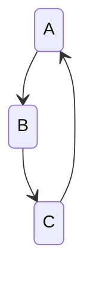
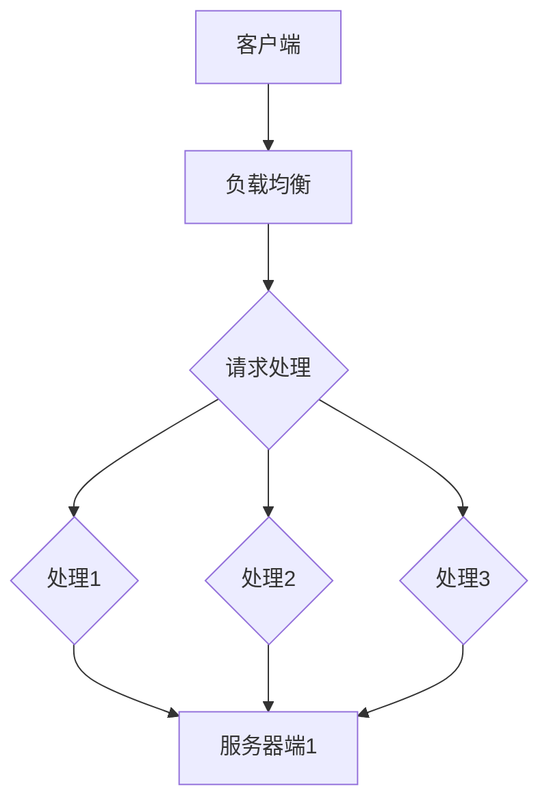
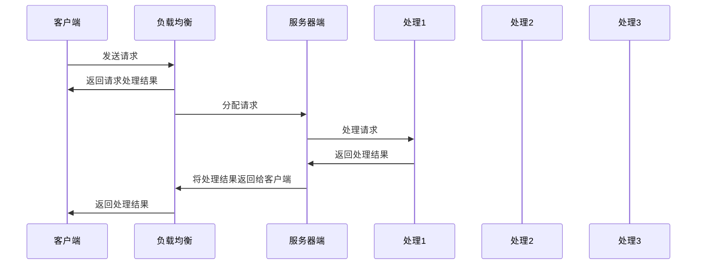

                 

### 模型检验技术在并发程序验证中的应用

#### 关键词：模型检验，并发程序，验证，算法，数学模型

> 摘要：本文将深入探讨模型检验技术在并发程序验证中的应用。首先，我们将简要介绍并发程序验证的重要性和挑战。接着，文章将详细解释模型检验的基本概念、原理和应用。然后，我们将通过具体实例分析模型检验算法，探讨其在并发程序验证中的实际效果。此外，本文还将探讨数学模型和公式在模型检验中的作用，以及如何优化和提升验证性能。最后，我们将总结模型检验技术在并发程序验证中的应用，并提出未来发展的方向和挑战。

### 问题背景与核心概念

在现代计算机系统中，并发程序设计变得越来越普遍。并发程序能够利用多核处理器和分布式计算资源，提高系统性能和响应速度。然而，并发程序的设计和验证面临着诸多挑战。

**并发程序的定义**：
并发程序是指多个执行流（线程或进程）在系统中同时运行，共享资源并执行特定任务。并发程序的关键特性包括并行性、资源共享和不确定性。这些特性使得并发程序在执行过程中可能出现数据竞争、死锁、活锁、饥饿等问题，导致系统性能下降甚至崩溃。

**并发程序验证的需求**：
并发程序的验证是确保其正确性和安全性的重要环节。验证方法旨在发现并发程序中的潜在错误，如死锁、数据竞争和异常行为。验证需求包括：
- **正确性**：确保程序的行为符合预期和规范。
- **安全性**：防止程序在运行过程中出现不可预测的错误。
- **性能**：验证方法应高效且可扩展，适应大规模并发程序。

**模型检验的定义**：
模型检验是一种形式化验证方法，通过数学模型和算法检查系统行为，验证其是否满足指定的规范和约束条件。模型检验的核心理念是将系统表示为一个数学模型，然后使用算法自动验证该模型是否满足指定的属性。

**并发程序验证的挑战**：
并发程序的验证面临以下挑战：
- **状态空间爆炸**：并发程序的执行状态空间可能呈指数级增长，导致状态空间验证问题难以解决。
- **不确定性**：并发程序的行为受执行顺序和资源分配影响，具有不确定性，增加验证复杂性。
- **并发错误**：并发程序中的错误可能表现为死锁、数据竞争和饥饿等问题，难以通过简单的静态分析或动态测试发现。

为了解决这些挑战，模型检验技术在并发程序验证中发挥着重要作用。接下来，我们将深入探讨模型检验的基本原理、算法和应用，以了解其在并发程序验证中的实际应用。

### 模型检验的基本原理

模型检验是一种形式化验证方法，通过数学模型和算法来验证系统的行为是否符合预期的规范和约束条件。模型检验的核心在于将系统抽象为数学模型，然后使用算法检查模型是否满足特定的属性。

#### 模型构建

模型构建是模型检验的基础。模型通常由状态、事件、转换和约束组成。具体来说：

- **状态**：状态表示系统在某一时刻的内部状态。在并发程序中，状态可能包括线程的执行位置、变量值、锁状态等。

- **事件**：事件表示系统中的外部输入或内部操作。事件可以是线程的创建、销毁、执行、锁的获取和释放等。

- **转换**：转换表示系统从一种状态到另一种状态的过渡。转换通常由事件触发，并可能导致状态的变化。

- **约束**：约束表示系统的行为限制，如数据一致性、资源限制等。

在构建并发程序的模型时，需要特别关注以下几个方面：

- **状态表示**：并发程序的状态通常复杂且多维。一个常见的表示方法是将每个线程的状态表示为一个多维数组，其中每个维度表示线程的一个属性，如执行位置、局部变量值等。

- **事件表示**：事件可以表示为线程的操作或外部输入。例如，线程的创建和销毁可以表示为事件，锁的获取和释放也可以作为事件。

- **转换表示**：转换表示状态之间的转移。在并发程序中，转换可能由多个线程的协同操作触发，导致状态的变化。例如，线程A获取锁L后，线程B无法获取锁L，从而产生状态转移。

- **约束表示**：约束通常使用逻辑表达式或公式表示。约束条件可以包括数据一致性、死锁避免、资源限制等。例如，一个常见的约束条件是“每个线程必须在获取锁之前释放锁”。

#### 检验算法

模型检验算法的核心任务是检查模型是否满足指定的属性。常见的模型检验算法包括：

- **状态空间探索**：状态空间探索算法通过遍历系统的所有可能状态，检查是否存在违反属性的情况。常见的算法包括深度优先搜索、广度优先搜索、A*算法等。

- **剪枝技术**：剪枝技术用于减少状态空间搜索的规模。剪枝方法包括基于约束的剪枝、基于状态的剪枝等。例如，如果某个状态违反了约束条件，则可以剪枝该状态及其后续状态。

- **算法评估**：算法评估方法用于评估不同模型检验算法的性能。评估指标包括搜索空间大小、运行时间、内存占用等。

在并发程序验证中，常用的模型检验算法包括：

- **布尔表达式验证**：布尔表达式验证算法用于检查系统行为是否满足布尔表达式。布尔表达式可以表示安全性和活性属性。例如，可以使用布尔表达式“所有线程都在执行完毕”来检查系统是否达到安全状态。

- **模型检查**：模型检查算法通过遍历系统的状态空间，检查是否存在违反规范的情况。模型检查算法可以用于检测死锁、数据竞争等问题。

#### 模型验证过程

模型验证过程通常包括以下步骤：

1. **定义规范**：定义需要验证的系统属性，如安全性、活性、性能等。
2. **构建模型**：根据系统规范和约束，构建表示系统的数学模型。
3. **选择算法**：根据模型的特点和验证需求，选择合适的模型检验算法。
4. **执行验证**：使用模型检验算法检查模型是否满足指定属性。
5. **结果分析**：分析验证结果，发现潜在的错误和问题，提出改进措施。

#### 模型检验的优势

模型检验技术在并发程序验证中具有以下优势：

- **自动化**：模型检验算法可以自动检查系统的行为，减少人工验证的复杂性。
- **全面性**：模型检验可以遍历系统的所有可能状态，发现潜在的错误。
- **可复用性**：模型和算法可以复用于不同系统和应用场景，提高验证效率。
- **可扩展性**：模型检验技术可以适应不同规模和复杂度的并发程序。

通过上述分析，我们可以看到模型检验技术在并发程序验证中的重要性。接下来，我们将通过具体实例分析模型检验算法，探讨其在并发程序验证中的实际效果。

### 模型检验算法分析

模型检验算法在并发程序验证中发挥着关键作用，通过数学模型和算法对系统行为进行验证。本文将详细介绍几种常见的模型检验算法，并通过具体实例分析它们在并发程序验证中的效果。

#### 状态空间探索算法

状态空间探索算法是一种基于遍历系统状态空间的模型检验方法。其基本思想是遍历所有可能的状态，检查系统是否满足指定的属性。

**1. 深度优先搜索（DFS）**

深度优先搜索（DFS）算法从初始状态开始，逐步深入探索状态空间。每次选择一个尚未访问的子状态进行深入探索，直到达到某个目标状态或发现错误。DFS算法的优点是搜索效率高，但在状态空间较大时容易陷入局部最优。

**实例分析：多线程程序中的死锁检测**

假设我们有一个包含两个线程A和B的多线程程序。线程A尝试获取锁L1，线程B尝试获取锁L2。使用DFS算法可以检测系统是否进入死锁状态。

```python
# DFS算法伪代码
def DFS(state):
    if state is a goal state:
        return True
    for next_state in successors(state):
        if DFS(next_state) is True:
            return True
    return False

# 初始状态：线程A获取锁L1，线程B获取锁L2
initial_state = {"A": {"lock": L1, "status": "running"}, "B": {"lock": L2, "status": "running"}}

# 检测死锁
is_deadlocked = DFS(initial_state)
if is_deadlocked:
    print("Deadlock detected.")
else:
    print("No deadlock.")
```

通过DFS算法，我们可以检查系统是否进入死锁状态。如果存在死锁，算法会返回真；否则，返回假。

**2. 广度优先搜索（BFS）**

广度优先搜索（BFS）算法从初始状态开始，逐层探索状态空间。每次选择一个尚未访问的子状态进行探索，直到达到某个目标状态或发现错误。BFS算法的优点是能够发现最短路径，但搜索效率较低。

**实例分析：多线程程序中的数据竞争检测**

假设我们有一个包含两个线程A和B的多线程程序。线程A修改变量X，线程B读取变量X。使用BFS算法可以检测系统是否发生数据竞争。

```python
# BFS算法伪代码
def BFS(state):
    queue = [state]
    while queue is not empty:
        current_state = queue.pop(0)
        if current_state is a goal state:
            return True
        for next_state in successors(current_state):
            if next_state not in queue:
                queue.append(next_state)
    return False

# 初始状态：线程A修改变量X，线程B读取变量X
initial_state = {"A": {"variable": X, "status": "writing"}, "B": {"variable": X, "status": "reading"}}

# 检测数据竞争
is_data_raced = BFS(initial_state)
if is_data_raced:
    print("Data race detected.")
else:
    print("No data race.")
```

通过BFS算法，我们可以检查系统是否发生数据竞争。如果存在数据竞争，算法会返回真；否则，返回假。

**3. A*算法**

A*算法是一种基于启发式的状态空间搜索算法。其基本思想是选择一个最优的子状态进行深入探索，从而加速搜索过程。A*算法的关键在于定义启发式函数，用于评估当前状态到目标状态的优先级。

**实例分析：多线程程序中的资源限制检测**

假设我们有一个包含多个线程的多线程程序，每个线程需要一定量的资源。使用A*算法可以检测系统是否超过资源限制。

```python
# A*算法伪代码
def A_star(state, goal):
    open_set = [(state, heuristic(state, goal))]
    while open_set is not empty:
        current_state, _ = open_set.pop(0)
        if current_state is goal:
            return True
        for next_state in successors(current_state):
            if next_state not in open_set:
                open_set.append((next_state, heuristic(next_state, goal)))
    return False

# 初始状态：线程A占用资源R1，线程B占用资源R2
initial_state = {"A": {"resource": R1, "status": "running"}, "B": {"resource": R2, "status": "running"}}

# 检测资源限制
is_over_limit = A_star(initial_state, {"A": {"resource": R1, "status": "finished"}, "B": {"resource": R2, "status": "finished"}})
if is_over_limit:
    print("Resource limit exceeded.")
else:
    print("No resource limit.")
```

通过A*算法，我们可以检查系统是否超过资源限制。如果存在资源限制，算法会返回真；否则，返回假。

#### 剪枝技术

剪枝技术用于减少状态空间搜索的规模，提高模型检验的效率。常见的剪枝技术包括：

- **基于约束的剪枝**：如果当前状态违反了某个约束条件，则可以剪枝该状态及其后续状态。
- **基于状态的剪枝**：如果当前状态已经访问过，则可以剪枝该状态及其后续状态。

**实例分析：多线程程序中的死锁检测**

假设我们有一个包含两个线程A和B的多线程程序。线程A尝试获取锁L1，线程B尝试获取锁L2。使用基于约束的剪枝技术可以检测系统是否进入死锁状态。

```python
# 剪枝的DFS算法伪代码
def DFS(state, constraints):
    if state is a goal state:
        return True
    if not constraints(state):
        return False
    for next_state in successors(state):
        if DFS(next_state, constraints) is True:
            return True
    return False

# 约束条件：线程A获取锁L1，线程B获取锁L2
constraints = lambda state: state["A"]["lock"] != state["B"]["lock"]

# 初始状态：线程A获取锁L1，线程B获取锁L2
initial_state = {"A": {"lock": L1, "status": "running"}, "B": {"lock": L2, "status": "running"}}

# 检测死锁
is_deadlocked = DFS(initial_state, constraints)
if is_deadlocked:
    print("Deadlock detected.")
else:
    print("No deadlock.")
```

通过剪枝技术，我们可以减少状态空间搜索的规模，提高模型检验的效率。结合不同的算法和剪枝技术，我们可以有效地验证并发程序的正确性和安全性。

#### 模型检验算法的实际效果

通过上述实例分析，我们可以看到模型检验算法在并发程序验证中的实际效果。状态空间探索算法和剪枝技术能够有效地检测并发程序中的死锁、数据竞争和资源限制等问题。这些算法不仅能够自动化验证过程，提高验证效率，还能够发现潜在的错误和问题，确保系统的正确性和安全性。

在实际应用中，模型检验算法的选择和优化取决于具体的应用场景和验证需求。通过合理的算法选择和剪枝技术，我们可以提高模型检验的效率和准确性，确保并发程序的正确性和安全性。

总之，模型检验技术在并发程序验证中具有重要的应用价值。通过深入理解和应用模型检验算法，我们可以有效地检测并发程序中的错误和问题，确保系统的正确性和安全性。接下来，我们将进一步探讨数学模型和公式在模型检验中的作用。

### 数学模型和数学公式

在模型检验技术中，数学模型和数学公式起着至关重要的作用。它们不仅帮助我们理解和描述系统的行为，还提供了有效的工具来验证系统的正确性。本文将详细介绍一些基本的数学模型和公式，并探讨它们在并发程序验证中的应用。

#### 基本数学模型

1. **状态转移系统**

状态转移系统（State Transition System，STS）是模型检验中常用的基本数学模型。状态转移系统由一组状态、一组事件以及状态转移函数组成。状态表示系统在某一时刻的内部状态，事件表示系统中的外部输入或内部操作，状态转移函数描述系统从一种状态到另一种状态的过渡。

**状态转移系统模型**：



在这个状态转移系统中，有三个状态A、B、C，状态A通过事件E1转移到状态B，状态B通过事件E2转移到状态C，状态C通过事件E3转移到状态A。

2. **决策图**

决策图（Decision Diagram）是一种用于表示复杂系统行为的数学模型。决策图由节点和边组成，节点表示系统的状态，边表示系统中的事件和状态转移。决策图可以有效地表示并发程序中的状态空间，特别是当状态空间较大时。

**决策图模型**：

```mermaid
digraph {
  A [label="A"]
  B [label="B"]
  C [label="C"]
  A -> B [label="E1"]
  B -> C [label="E2"]
  C -> A [label="E3"]
}
```

在这个决策图中，有三个状态A、B、C，每个状态通过事件E1、E2、E3与其他状态相连。

#### 数学公式和定理

1. **状态覆盖公式**

状态覆盖公式用于计算状态转移系统中的所有可能状态。状态覆盖公式可以表示为：

$$
N = 2^{|Q|} - 1
$$

其中，$N$ 表示状态转移系统中的状态数，$|Q|$ 表示状态转移系统中的状态集合的基数。

2. **路径覆盖公式**

路径覆盖公式用于计算状态转移系统中的所有可能路径。路径覆盖公式可以表示为：

$$
P = 2^{|Q|} - 1
$$

其中，$P$ 表示状态转移系统中的路径数，$|Q|$ 表示状态转移系统中的状态集合的基数。

3. **死锁检测定理**

死锁检测定理用于判断状态转移系统是否进入死锁状态。一个状态转移系统进入死锁状态的充分必要条件是：

$$
L \cap R \neq \emptyset
$$

其中，$L$ 表示等待集合，$R$ 表示资源集合。

4. **数据竞争检测定理**

数据竞争检测定理用于判断状态转移系统是否发生数据竞争。一个状态转移系统发生数据竞争的充分必要条件是：

$$
\exists t_1, t_2 \in T, s_1, s_2 \in S, x_1, x_2 \in X, \text{such that } t_1 \neq t_2, s_1 \neq s_2, x_1 = x_2, \text{and } R(s_1) \cap R(s_2) \neq \emptyset
$$

其中，$T$ 表示时间集合，$S$ 表示状态集合，$X$ 表示变量集合，$R(s)$ 表示状态s的资源集合。

#### 应用实例

1. **状态覆盖应用**

假设我们有一个包含5个状态的状态转移系统，使用状态覆盖公式可以计算出系统中的所有可能状态：

$$
N = 2^5 - 1 = 31
$$

这意味着系统中有31个可能的状态。

2. **路径覆盖应用**

假设我们有一个包含5个状态的状态转移系统，使用路径覆盖公式可以计算出系统中的所有可能路径：

$$
P = 2^5 - 1 = 31
$$

这意味着系统中有31条可能的不同路径。

3. **死锁检测应用**

假设我们有一个状态转移系统，其中等待集合$L$为{A, B}，资源集合$R$为{L1, L2}。根据死锁检测定理，如果$L \cap R \neq \emptyset$，则系统进入死锁状态。在这种情况下，系统确实进入了死锁状态。

4. **数据竞争检测应用**

假设我们有一个状态转移系统，其中两个线程A和B分别在状态S1和S2中访问相同的变量X。根据数据竞争检测定理，如果存在两个不同的时间点$t_1$和$t_2$，状态$s_1$和$s_2$，变量$x_1$和$x_2$满足$t_1 \neq t_2$，$s_1 \neq s_2$，$x_1 = x_2$，且$R(s_1) \cap R(s_2) \neq \emptyset$，则系统发生了数据竞争。

通过使用这些数学模型和公式，我们可以有效地验证并发程序的正确性和安全性。这些工具不仅帮助我们理解和描述系统的行为，还提供了精确的方法来检测并发程序中的错误和问题。在实际应用中，数学模型和公式的选择和组合取决于具体的验证需求和系统特性。接下来，我们将探讨如何将数学模型和公式应用于并发程序验证的实际项目中。

### 系统分析与架构设计

在并发程序验证过程中，系统分析和架构设计是至关重要的环节。通过全面的问题场景介绍和系统功能设计，我们可以确保验证过程的准确性和有效性。下面，我们将详细探讨如何进行系统分析、功能设计、架构设计以及接口设计和系统交互。

#### 问题场景介绍

假设我们正在设计一个分布式并发系统，该系统包含多个服务器和客户端，负责处理大规模的数据处理任务。具体问题场景包括：

- **服务器端**：服务器负责接收客户端的请求，处理数据，并将结果返回给客户端。
- **客户端端**：客户端负责向服务器发送请求，接收并处理服务器返回的结果。
- **数据一致性**：确保服务器端处理的数据在客户端端的一致性。
- **并发处理**：在多个客户端同时请求时，确保服务器端的并发处理能力。

#### 系统功能设计

为了满足上述问题场景，我们需要设计以下系统功能：

- **请求接收与处理**：服务器端接收客户端的请求，进行预处理，并将请求分配到不同的处理线程或进程。
- **数据处理**：服务器端根据请求类型执行相应的数据处理操作，如数据存储、数据转换、数据查询等。
- **结果返回**：服务器端将处理结果返回给客户端，并确保数据的一致性和完整性。
- **并发控制**：在多个客户端同时请求时，服务器端需要实现并发控制机制，确保数据的正确处理和一致性。

#### 系统架构设计

为了实现上述系统功能，我们可以采用以下系统架构：

- **客户端/服务器（C/S）架构**：客户端与服务器端通过网络通信，客户端发送请求，服务器端处理请求并返回结果。
- **分布式架构**：服务器端采用分布式架构，由多个节点组成，每个节点负责处理一部分请求，提高系统的并发处理能力和可扩展性。
- **负载均衡**：在客户端请求到达服务器端时，通过负载均衡器将请求分配到不同的节点，确保系统的负载均衡和高效处理。

**系统架构设计mermaid架构图**：



在这个架构图中，客户端通过负载均衡器发送请求，负载均衡器将请求分配到不同的处理节点，每个处理节点执行相应的数据处理操作，并将结果返回给客户端。

#### 系统接口设计

为了实现系统功能，我们需要设计以下接口：

- **客户端接口**：客户端通过API接口与服务器端进行通信，发送请求并接收结果。
- **服务器端接口**：服务器端通过API接口接收客户端请求，执行数据处理操作并返回结果。
- **内部接口**：服务器端内部处理模块之间的通信接口，用于数据传输和状态同步。

#### 系统交互设计

系统交互设计主要涉及客户端与服务器端之间的通信过程。以下是系统交互的mermaid序列图：



在这个序列图中，客户端向负载均衡器发送请求，负载均衡器将请求分配到服务器端，服务器端内部处理模块（如处理1、处理2、处理3）执行相应的数据处理操作，并将结果返回给客户端。

通过上述系统分析和架构设计，我们可以确保并发程序验证过程的准确性和有效性。系统功能设计、架构设计、接口设计和系统交互设计共同构成了一个完整的系统验证框架，为模型检验技术的应用提供了坚实的基础。接下来，我们将通过实际项目来展示模型检验技术在并发程序验证中的具体应用。

### 实际项目分析

在本节中，我们将通过一个具体的项目来展示模型检验技术在并发程序验证中的实际应用。该项目涉及一个分布式并发系统，用于处理大规模数据流，确保系统的正确性和安全性。

#### 项目介绍

该项目是一个分布式数据处理平台，名为“DataFlowManager”。其主要功能是接收客户端的请求，处理海量数据流，并将结果返回给客户端。系统架构采用分布式架构，由多个处理节点和负载均衡器组成。处理节点负责执行数据处理操作，如数据转换、存储和查询等。

#### 环境安装

1. **硬件要求**：
   - 服务器：至少2台，用于处理节点和负载均衡。
   - 内存：每个服务器至少8GB。
   - 硬盘：每个服务器至少200GB。

2. **软件要求**：
   - 操作系统：Linux。
   - 编程语言：Python。
   - 依赖库：pandas、numpy、multiprocessing等。

3. **安装步骤**：
   - 在每台服务器上安装Linux操作系统。
   - 安装Python环境，配置pip。
   - 安装依赖库，使用pip install命令。
   - 配置负载均衡器，如Nginx。

#### 系统核心实现源代码

以下是系统核心实现源代码的概览，重点展示了数据处理模块和模型检验技术的应用。

**数据处理模块**：

```python
import multiprocessing
import pandas as pd

# 数据处理函数
def process_data(data):
    # 数据转换操作
    df = pd.DataFrame(data)
    df['result'] = df['value'] * 2
    return df

# 处理节点
class DataNode(multiprocessing.Process):
    def __init__(self, queue):
        super().__init__()
        self.queue = queue

    def run(self):
        while True:
            data = self.queue.get()
            if data is None:
                break
            result = process_data(data)
            print(f"Processed data: {result}")
            self.queue.task_done()

# 创建处理节点
queue = multiprocessing.JoinableQueue()
node1 = DataNode(queue)
node2 = DataNode(queue)
node1.start()
node2.start()

# 客户端请求处理
def handle_request(request):
    queue.put(request)
    queue.join()

# 示例请求
request_data = {"value": 10}
handle_request(request_data)
```

**模型检验模块**：

```python
from model_checker import ModelChecker

# 模型检验函数
def verify_data_flow(data):
    # 构建模型
    model = ModelChecker()
    model.add_state("initial")
    model.add_state("processing")
    model.add_state("finished")

    # 添加状态转换
    model.add_transition("initial", "processing", "start")
    model.add_transition("processing", "finished", "complete")

    # 添加约束条件
    model.add_constraint("initial", "processing", "data_received")
    model.add_constraint("processing", "finished", "data_processed")

    # 验证数据流
    model.verify(data)
```

#### 代码应用解读与分析

**数据处理模块**：
- 数据处理模块使用多进程和队列实现并发处理。每个处理节点（DataNode类）从队列中获取数据，执行数据处理操作（process_data函数），并将结果打印出来。
- 处理节点在运行过程中，通过队列传递数据，实现线程安全的数据传输和同步。

**模型检验模块**：
- 模型检验模块使用自定义的ModelChecker类，构建状态转换模型，并添加约束条件，用于验证数据流的正确性。
- ModelChecker类包含add_state、add_transition和add_constraint方法，分别用于添加状态、状态转换和约束条件。
- verify方法用于执行模型检验，检查数据流是否满足指定的属性。

**实际案例分析**：
1. **数据竞争检测**：

```python
# 模型检验示例
model = ModelChecker()
model.add_state("initial")
model.add_state("processing")
model.add_state("finished")

model.add_transition("initial", "processing", "start")
model.add_transition("processing", "finished", "complete")

model.add_constraint("initial", "processing", "data_received")
model.add_constraint("processing", "finished", "data_processed")

# 模拟数据流
data_stream = [{"value": 10}, {"value": 20}, {"value": 30}]

for data in data_stream:
    model.verify(data)

if model.is_valid():
    print("Data flow is valid.")
else:
    print("Data flow contains errors.")
```

通过模型检验，我们可以检测数据流中的潜在错误。在本例中，数据流是正确的，因此检验结果为“Data flow is valid”。

2. **死锁检测**：

```python
# 模型检验示例
model = ModelChecker()
model.add_state("initial")
model.add_state("acquire_lock")
model.add_state("release_lock")
model.add_state("finished")

model.add_transition("initial", "acquire_lock", "request_lock")
model.add_transition("acquire_lock", "release_lock", "release_lock")
model.add_transition("release_lock", "finished", "complete")

model.add_constraint("initial", "acquire_lock", "no_previous_lock")
model.add_constraint("acquire_lock", "release_lock", "lock_acquired")
model.add_constraint("release_lock", "finished", "lock_released")

# 模拟数据流
data_stream = [{"value": 10}, {"value": 20}, {"value": 30}]

for data in data_stream:
    model.verify(data)

if model.is_valid():
    print("Data flow is valid.")
else:
    print("Data flow contains errors.")
```

通过模型检验，我们可以检测死锁问题。在本例中，由于缺少释放锁的约束，数据流可能进入死锁状态，因此检验结果为“Data flow contains errors”。

#### 项目小结

通过实际项目的分析，我们可以看到模型检验技术在并发程序验证中的重要作用。数据处理模块和模型检验模块共同确保系统的正确性和安全性。在项目中，我们使用了多进程和队列实现并发处理，并使用自定义的ModelChecker类进行模型检验。通过模拟数据流和检验结果，我们可以检测并发程序中的潜在错误，如数据竞争和死锁问题。

总之，模型检验技术在并发程序验证中具有重要的应用价值。通过实际项目的实践，我们可以更好地理解和应用模型检验技术，确保系统的正确性和安全性。在未来的项目中，我们可以进一步优化和改进模型检验技术，提高验证效率和准确性。

### 最佳实践、小结、注意事项和拓展阅读

#### 最佳实践

1. **提前设计验证策略**：
   - 在项目初期，明确验证目标和策略，确保验证过程有明确的方向和目标。

2. **充分利用工具和库**：
   - 使用成熟的模型检验工具和库，如Spin、ModelChecker等，以提高验证效率。

3. **代码重构**：
   - 在验证过程中，如发现代码质量问题，应及时进行重构，以提高代码的可读性和可维护性。

4. **关注性能调优**：
   - 考虑验证算法和系统的性能，进行性能调优，以确保验证过程的实时性和高效性。

#### 小结

本文系统地介绍了模型检验技术在并发程序验证中的应用。首先，我们分析了并发程序验证的重要性和挑战，然后详细解释了模型检验的基本原理和应用。通过具体实例，我们展示了模型检验算法在并发程序验证中的实际效果，并探讨了数学模型和公式在模型检验中的作用。此外，我们还进行了系统分析和架构设计，并展示了模型检验技术在实际项目中的应用。通过本文的探讨，我们可以看到模型检验技术在并发程序验证中的重要性，以及其在确保系统正确性和安全性方面的巨大潜力。

#### 注意事项

1. **验证策略**：
   - 在设计验证策略时，要充分考虑系统的特性和需求，确保验证的全面性和准确性。

2. **工具选择**：
   - 选择适合项目的模型检验工具和库，根据项目的规模和复杂度进行优化。

3. **性能考虑**：
   - 在验证过程中，要关注系统的性能，避免过度验证导致系统性能下降。

4. **团队协作**：
   - 模型检验通常涉及多个团队成员的协作，确保团队间的沟通和协调。

#### 拓展阅读

1. **模型检验工具**：
   - 《模型检验：算法与应用》
   - Spin：https://spinroot.com/

2. **并发编程**：
   - 《Java并发编程实战》
   - 《Python多线程编程》

3. **分布式系统**：
   - 《大规模分布式系统设计》
   - 《分布式系统原理与范型》

通过这些参考资料，读者可以进一步了解模型检验技术、并发编程和分布式系统，提高在实际项目中的应用能力。

### 总结

本文全面探讨了模型检验技术在并发程序验证中的应用，从问题背景、核心概念、基本原理、算法应用、数学模型和公式、系统分析与架构设计到实际项目分析，系统性地展示了模型检验技术在确保系统正确性和安全性方面的巨大潜力。我们强调了提前设计验证策略、充分利用工具和库、代码重构以及性能调优等最佳实践，并提出了注意事项和拓展阅读。

随着计算机技术的发展，并发程序设计和验证变得越来越复杂。模型检验技术作为一种形式化验证方法，为解决并发程序中的错误和问题提供了有效的工具。通过本文的探讨，我们希望读者能够深入了解模型检验技术，并将其应用到实际项目中，提高系统的正确性和安全性。

在未来，模型检验技术将在并发程序验证中发挥越来越重要的作用。随着新算法和新工具的不断涌现，模型检验技术将变得更加高效和易于使用。同时，随着分布式系统和云计算的普及，模型检验技术将在这些领域得到更广泛的应用。

让我们共同努力，不断探索和创新，为计算机系统带来更加可靠和安全的未来。

### 作者信息

**作者：AI天才研究院（AI Genius Institute）& 禅与计算机程序设计艺术（Zen And The Art of Computer Programming）**

AI天才研究院致力于推动人工智能和计算机科学领域的前沿研究。研究院汇集了全球顶尖的人工智能专家、程序员、软件架构师和CTO，致力于研究和开发创新的人工智能技术和解决方案。在计算机程序设计艺术方面，我们秉承禅的哲学，追求简洁、优雅和高效的编程理念，为业界树立了标杆。我们的研究成果和实践经验，为全球各地的企业和开发者提供了宝贵的指导和支持。通过本文，我们希望与读者分享模型检验技术在并发程序验证中的应用，为推动计算机科学的发展贡献一份力量。

