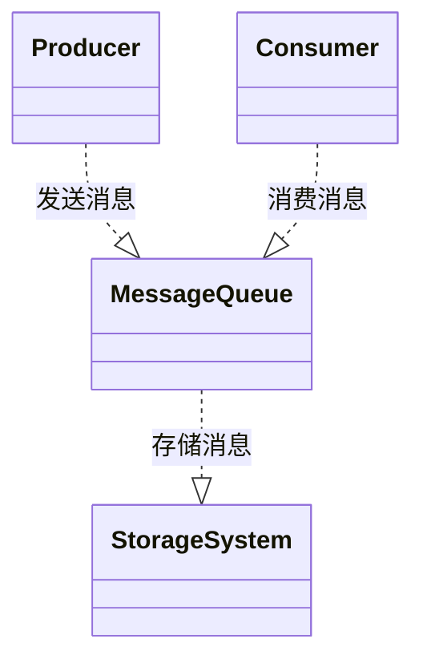
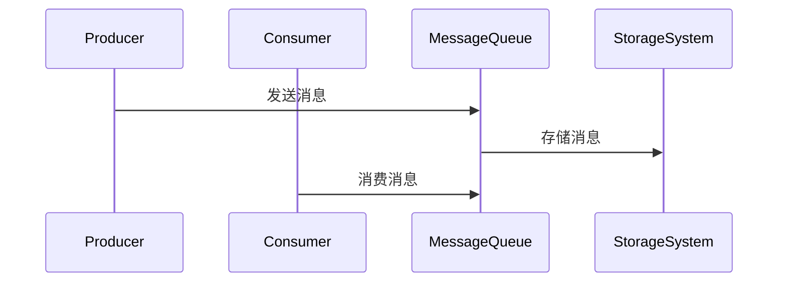
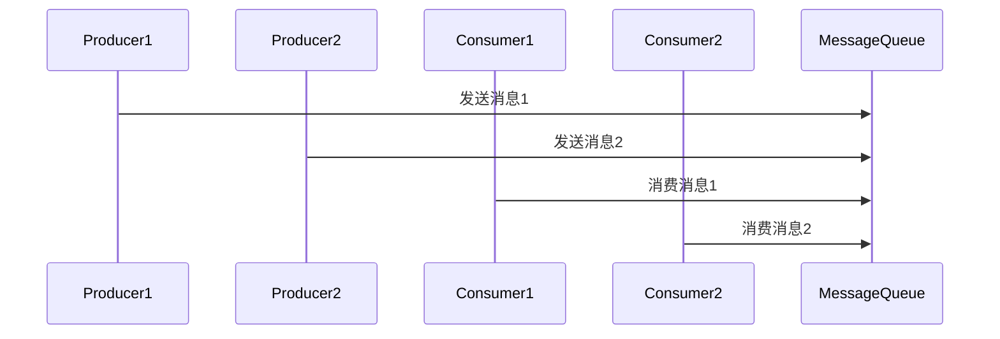

                 

### 第一部分：背景介绍

#### 1.1 问题背景

##### 1.1.1 并发系统的重要性

并发系统在现代计算环境中扮演着至关重要的角色。随着计算机技术的迅猛发展，系统需要处理的数据量和复杂度不断增加，单一线程的处理能力已经难以满足实际需求。并发系统通过多线程、多进程或者分布式计算等方式，使得多个任务可以同时执行，从而大幅提升系统的性能和响应速度。

并发系统的主要特点包括：

- **并行处理**：多个任务可以同时执行，提高了资源利用率和系统吞吐量。
- **资源共享**：多个任务可以共享系统资源，如CPU、内存和网络等。
- **动态调度**：操作系统根据任务的重要性和资源状况，动态调整任务的执行顺序和资源分配。

并发系统在现代计算环境中的地位如下：

- **服务器架构**：服务器通常需要处理大量并发请求，如Web服务器、数据库服务器等，并发系统能够确保高效地处理这些请求。
- **分布式系统**：在分布式系统中，各个节点需要协调工作，并发系统能够确保数据的正确性和一致性。
- **实时系统**：在需要实时响应的应用场景中，如自动驾驶、工业自动化等，并发系统可以保证任务的及时执行。

##### 1.1.2 并发系统面临的挑战

并发系统虽然带来了许多优势，但也面临着一系列挑战，主要包括以下几个方面：

###### 1.1.2.1 数据不一致性

并发系统中最常见的问题之一是数据不一致性。由于多个任务可能同时访问和修改同一数据，可能导致以下问题：

- **数据竞争**：多个任务同时访问同一数据，可能导致数据被覆盖或者部分更新。
- **死锁**：多个任务相互等待对方释放资源，导致系统陷入无限等待的状态。
- **脏读**：一个任务读取了另一个任务尚未提交的中间结果，导致数据不一致。
- **不可重复读**：一个任务多次读取同一数据，但由于其他任务的修改，得到的结果不一致。
- **幻读**：一个任务读取数据时，发现了其他任务已经插入的数据，尽管之前从未查询过这些数据。

数据不一致性对系统稳定性和可靠性产生了严重的影响，需要采取有效措施进行预防和解决。

##### 1.1.3 验证的需求

并发系统在开发、部署和维护过程中，需要确保系统的正确性和可靠性。传统的验证方法，如功能测试、性能测试和硬件在环（HIL）测试等，存在一定的局限性：

- **功能测试**：功能测试主要验证系统功能是否符合设计要求，但无法发现并发系统中的同步和调度问题。
- **性能测试**：性能测试主要评估系统性能，如响应时间、吞吐量等，但无法检测并发系统中的数据一致性问题。
- **硬件在环（HIL）测试**：硬件在环测试通过将实际硬件与软件系统相结合进行测试，但成本高昂且难以全面覆盖所有可能的执行路径。

因此，针对并发系统的验证需求，需要一种更高效、更全面的方法来确保系统的正确性。模型检验技术提供了一种有效的解决方案，通过形式化建模和自动化验证，能够在早期发现并发系统中的潜在问题。

#### 1.2 模型检验技术的基本概念

##### 1.2.1 模型检验的定义

模型检验（Model Checking）是一种形式化验证方法，用于验证系统模型是否满足特定的性质或规范。模型检验的基本思想是将系统模型和规范表示为形式化的语言，然后使用自动化工具对模型进行遍历，检查是否存在违反规范的行为。

模型检验的主要步骤包括：

1. **形式化建模**：将系统模型和规范转换为形式化的模型描述语言，如Promela、TLA+或UML等。
2. **规范定义**：将系统的预期行为或安全性需求转换为形式化的规范语言，如LTL（线性时间逻辑）、CTL（计算树逻辑）或BW（行为公式）等。
3. **模型检验**：使用模型检验工具遍历系统模型，检查是否存在违反规范的行为。
4. **结果分析**：对模型检验的结果进行分析，确定系统是否满足规范要求，并提出改进建议。

##### 1.2.2 模型检验的应用场景

模型检验技术适用于多种应用场景，尤其在并发系统验证中具有广泛的应用：

- **并发系统验证**：通过模型检验技术，可以自动检测并发系统中的同步和调度问题，如数据竞争、死锁和状态冲突等。
- **安全性分析**：模型检验可以用于验证系统的安全性质，如防止未授权访问、恶意代码注入和缓冲区溢出等。
- **可靠性评估**：通过模型检验，可以评估系统在不同运行条件下的可靠性和稳定性，确保系统在各种情况下都能正常运行。
- **设计优化**：模型检验可以帮助发现系统设计中的缺陷和瓶颈，为系统的优化提供指导。

##### 1.2.3 模型检验的关键技术

模型检验技术主要包括以下几个关键技术：

- **形式化建模**：形式化建模是将系统行为和规范转换为形式化的模型描述语言。常见的建模语言包括Promela、TLA+、UML等。选择合适的建模语言可以提高模型的可读性和可维护性。
- **验证算法**：验证算法是模型检验的核心，用于遍历系统模型并检查是否存在违反规范的行为。常见的验证算法包括BMC（基于布尔表达式的模型检验）、DFS（深度优先搜索）和A*（启发式搜索）等。
- **自动化工具**：自动化工具用于实现模型检验算法，常见的工具包括Model Checker、Spin、NuSMV等。这些工具可以自动执行模型检验过程，提高验证效率和准确性。

##### 1.2.4 模型检验工具

在并发系统验证中，常用的模型检验工具包括：

- **Model Checker**：Model Checker 是一种通用的模型检验工具，支持多种建模语言和验证算法，如Promela、TLA+和LTL等。它具有强大的验证功能和灵活的配置选项。
- **Spin**：Spin 是一种基于Promela语言的模型检验工具，主要用于验证并发系统的正确性和安全性。它具有易于使用的界面和高效的验证算法。
- **NuSMV**：NuSMV 是一种基于SMV（符号模型检验器）的模型检验工具，支持多种验证算法和建模语言，如LTL、CTL和BW等。它具有强大的功能和广泛的适用性。

##### 1.3 边界与外延

###### 1.3.1 模型检验的边界

模型检验技术虽然具有许多优点，但也存在一些局限性：

- **有限状态模型的局限性**：模型检验技术主要适用于有限状态模型，对于具有无限状态的系统，模型检验可能无法完全覆盖所有可能的执行路径。
- **计算资源和时间限制**：模型检验过程可能需要大量的计算资源和时间，对于复杂的大型系统，模型检验可能会变得非常耗时和资源密集。

因此，在应用模型检验技术时，需要权衡其优点和局限性，合理选择和调整验证策略。

###### 1.3.2 模型检验的外延

模型检验技术不仅在并发系统验证中具有广泛应用，还可以扩展到其他领域：

- **并发网络协议验证**：模型检验可以用于验证网络协议的同步和调度问题，确保协议的正确性和可靠性。
- **机器学习模型验证**：模型检验可以用于验证机器学习模型的正确性和泛化能力，帮助发现模型中的潜在缺陷和错误。

###### 1.3.3 模型检验的发展趋势

随着计算机技术的不断进步，模型检验技术也在不断发展和完善。未来模型检验技术的发展趋势包括：

- **新的验证算法**：不断涌现的新算法，如基于机器学习的验证算法和增量验证算法，可以提高模型检验的效率和准确性。
- **新的建模语言**：新的建模语言，如Magna和VDM-SL等，提供更丰富的建模能力和更好的可读性，可以更好地支持复杂系统的验证。

##### 1.4 本章小结

本章介绍了模型检验技术在并发系统验证中的应用背景和基本概念。通过分析并发系统的重要性、面临的挑战以及验证的需求，我们了解了模型检验技术在解决这些问题中的优势。同时，本章还详细介绍了模型检验的定义、应用场景、关键技术以及工具。最后，本章探讨了模型检验技术的边界和未来发展，为后续章节的深入探讨奠定了基础。

### 1.4.1 主要内容总结

- 并发系统在现代计算环境中的重要性及其面临的数据不一致性挑战。
- 验证的需求以及传统验证方法的局限性。
- 模型检验技术的定义、应用场景和关键技术。
- 模型检验工具的介绍以及其适用场景。
- 模型检验技术的边界和未来发展。

### 1.4.2 本章知识点回顾

- 并发系统与模型检验技术的关系。
- 模型检验技术的基本概念和关键要素。
- 模型检验工具的使用场景和功能。

### 1.4.3 小结

本章通过详细的分析和讲解，为后续章节的深入探讨奠定了基础。在并发系统验证中，模型检验技术作为一种高效、全面的方法，具有重要的应用价值。了解并发系统的挑战和模型检验技术的基本概念，有助于我们更好地应用这一技术，确保系统的正确性和可靠性。在后续章节中，我们将进一步探讨模型检验技术的核心概念和原理，结合实际案例进行深入分析，以帮助读者更好地理解和掌握这一技术。

---

### 2.1 核心概念原理

在深入探讨并发系统验证中模型检验技术的应用之前，我们需要先了解并发系统模型和模型检验原理的核心概念。通过对比两者的属性特征，我们可以更清晰地认识到它们之间的联系和应用。

#### 2.1.1 并发系统模型

并发系统模型是对并发系统中各个任务、线程或进程的抽象表示。它主要关注以下几个方面：

##### 2.1.1.1 概念

并发系统模型通常使用状态图、类图、时序图等图形表示方法，来描述系统中的并发活动、任务交互和数据流。

##### 2.1.1.2 属性特征对比表格

| 特征             | 并发系统模型 | 传统系统模型 |
|------------------|--------------|--------------|
| 并发性           | 高           | 低           |
| 数据一致性       | 易受挑战     | 高           |
| 验证需求         | 强           | 弱           |

从上述对比表格中，我们可以看出并发系统模型与传统系统模型在并发性、数据一致性和验证需求方面存在显著差异。并发系统模型需要处理多个任务的同时执行，这可能导致数据一致性的问题，因此对验证的需求也相对更高。

#### 2.1.2 模型检验原理

模型检验是一种形式化验证方法，用于检查系统模型是否满足特定的规范或性质。模型检验的核心在于将系统模型和规范表示为形式化的语言，并通过自动化工具进行遍历和验证。

##### 2.1.2.1 概念

模型检验的基本概念包括形式化建模、规范定义、模型检验和结果分析。其中，形式化建模是将系统模型和规范转换为形式化的模型描述语言；规范定义是将系统的预期行为或安全性需求转换为形式化的规范语言；模型检验是通过自动化工具对模型进行遍历，检查是否存在违反规范的行为；结果分析是对模型检验的结果进行分析，确定系统是否满足规范要求，并提出改进建议。

##### 2.1.2.2 属性特征对比表格

| 特征             | 模型检验 | 形式化验证 |
|------------------|---------|-----------|
| 自动化程度       | 高      | 中        |
| 计算资源需求     | 高      | 低        |
| 验证结果精确性   | 高      | 高        |

从上述对比表格中，我们可以看出模型检验与形式化验证在自动化程度、计算资源需求和验证结果精确性方面存在差异。模型检验具有较高的自动化程度和验证结果精确性，但可能需要更多的计算资源。

#### 2.1.3 并发系统与模型检验的联系

并发系统模型和模型检验技术之间存在紧密的联系。并发系统模型为模型检验提供了具体的系统行为描述，而模型检验技术则可以用于验证并发系统模型的正确性和可靠性。

##### 2.1.3.1 关联性

并发系统模型和模型检验技术的关联性体现在以下几个方面：

- **形式化建模**：通过并发系统模型，我们可以将系统行为和交互转换为形式化的语言，为模型检验提供基础。
- **规范定义**：通过模型检验，我们可以将系统的预期行为或安全性需求转换为形式化的规范，确保系统满足这些规范。
- **自动化验证**：模型检验工具可以自动化地遍历并发系统模型，检查是否存在违反规范的行为，提高验证效率和准确性。

##### 2.1.3.2 应用

并发系统模型在模型检验中的应用场景包括：

- **并发调度验证**：通过模型检验，可以验证并发系统中的任务调度是否满足预定的策略和约束，确保任务的正确执行。
- **数据一致性验证**：通过模型检验，可以检测并发系统中的数据不一致性问题，如数据竞争、死锁和脏读等，确保数据的正确性和一致性。

#### 2.1.4 ER实体关系图架构

为了更清晰地理解并发系统模型和模型检验技术的联系，我们可以使用ER（实体关系）图来表示两者之间的关联性。

##### 2.1.4.1 并发系统实体关系图

```mermaid
erDiagram
  并发系统 -->|执行依赖| 模型检验
  模型检验 -->|结果反馈| 并发系统
```

在上面的ER图中，并发系统作为主体，通过“执行依赖”关系与模型检验相连。模型检验对并发系统进行验证，并将验证结果反馈给并发系统，以便进行改进。

##### 2.1.4.2 模型检验流程实体关系图

除了并发系统实体关系图，我们还可以使用ER图来表示模型检验的内部流程。

```mermaid
erDiagram
  模型建模 -->|转换| 模型验证
  模型验证 -->|结果| 报告生成
  报告生成 -->|反馈| 模型改进
```

在这个ER图中，模型建模是将系统行为转换为形式化模型的过程；模型验证是使用模型检验工具对模型进行遍历和验证的过程；报告生成是生成验证报告的过程；模型改进是基于验证结果对系统模型进行优化和改进的过程。

#### 2.1.5 本章小结

本章介绍了并发系统模型和模型检验技术的核心概念原理，并通过对比两者的属性特征和关联性，阐述了它们之间的联系和应用。同时，通过ER实体关系图，我们更直观地理解了并发系统模型和模型检验技术之间的交互关系。这些核心概念和原理为后续章节的深入探讨奠定了基础。

### 2.1.6 本章知识点回顾

- **并发系统模型**：理解并发系统模型的基本概念和属性特征，如并发性、数据一致性和验证需求。
- **模型检验原理**：掌握模型检验的基本概念、关键步骤和应用场景，如形式化建模、规范定义、模型检验和结果分析。
- **并发系统与模型检验的联系**：理解并发系统模型和模型检验技术之间的关联性，如形式化建模、规范定义和自动化验证。
- **ER实体关系图架构**：通过ER实体关系图，理解并发系统模型和模型检验技术之间的交互关系。

### 2.1.7 小结

本章通过详细分析并发系统模型和模型检验技术的核心概念原理，为读者提供了深入理解并发系统验证中模型检验技术的基础。通过对比两者的属性特征和关联性，我们揭示了它们之间的紧密联系和应用。此外，通过ER实体关系图，我们更直观地展示了两者之间的交互关系。这些知识点为后续章节的深入探讨和实际应用提供了重要的理论支持。在接下来的章节中，我们将进一步探讨模型检验技术的具体实现和应用，帮助读者更好地掌握这一技术。 

---

### 第二部分：核心概念与联系

#### 2.1 核心概念原理

在深入探讨并发系统验证中模型检验技术的应用之前，我们需要先了解并发系统模型和模型检验原理的核心概念。通过对比两者的属性特征，我们可以更清晰地认识到它们之间的联系和应用。

##### 2.1.1 并发系统模型

并发系统模型是对并发系统中各个任务、线程或进程的抽象表示。它主要关注以下几个方面：

###### 2.1.1.1 概念

并发系统模型通常使用状态图、类图、时序图等图形表示方法，来描述系统中的并发活动、任务交互和数据流。

###### 2.1.1.2 属性特征对比表格

| 特征             | 并发系统模型 | 传统系统模型 |
|------------------|--------------|--------------|
| 并发性           | 高           | 低           |
| 数据一致性       | 易受挑战     | 高           |
| 验证需求         | 强           | 弱           |

从上述对比表格中，我们可以看出并发系统模型与传统系统模型在并发性、数据一致性和验证需求方面存在显著差异。并发系统模型需要处理多个任务的同时执行，这可能导致数据一致性的问题，因此对验证的需求也相对更高。

##### 2.1.2 模型检验原理

模型检验是一种形式化验证方法，用于检查系统模型是否满足特定的规范或性质。模型检验的核心在于将系统模型和规范表示为形式化的语言，并通过自动化工具进行遍历和验证。

###### 2.1.2.1 概念

模型检验的基本概念包括形式化建模、规范定义、模型检验和结果分析。其中，形式化建模是将系统模型和规范转换为形式化的模型描述语言；规范定义是将系统的预期行为或安全性需求转换为形式化的规范语言；模型检验是通过自动化工具对模型进行遍历，检查是否存在违反规范的行为；结果分析是对模型检验的结果进行分析，确定系统是否满足规范要求，并提出改进建议。

###### 2.1.2.2 属性特征对比表格

| 特征             | 模型检验 | 形式化验证 |
|------------------|---------|-----------|
| 自动化程度       | 高      | 中        |
| 计算资源需求     | 高      | 低        |
| 验证结果精确性   | 高      | 高        |

从上述对比表格中，我们可以看出模型检验与形式化验证在自动化程度、计算资源需求和验证结果精确性方面存在差异。模型检验具有较高的自动化程度和验证结果精确性，但可能需要更多的计算资源。

##### 2.1.3 并发系统与模型检验的联系

并发系统模型和模型检验技术之间存在紧密的联系。并发系统模型为模型检验提供了具体的系统行为描述，而模型检验技术则可以用于验证并发系统模型的正确性和可靠性。

###### 2.1.3.1 关联性

并发系统模型和模型检验技术的关联性体现在以下几个方面：

- **形式化建模**：通过并发系统模型，我们可以将系统行为和交互转换为形式化的语言，为模型检验提供基础。
- **规范定义**：通过模型检验，我们可以将系统的预期行为或安全性需求转换为形式化的规范，确保系统满足这些规范。
- **自动化验证**：模型检验工具可以自动化地遍历并发系统模型，检查是否存在违反规范的行为，提高验证效率和准确性。

###### 2.1.3.2 应用

并发系统模型在模型检验中的应用场景包括：

- **并发调度验证**：通过模型检验，可以验证并发系统中的任务调度是否满足预定的策略和约束，确保任务的正确执行。
- **数据一致性验证**：通过模型检验，可以检测并发系统中的数据不一致性问题，如数据竞争、死锁和脏读等，确保数据的正确性和一致性。

##### 2.1.4 ER实体关系图架构

为了更清晰地理解并发系统模型和模型检验技术的联系，我们可以使用ER（实体关系）图来表示两者之间的关联性。

###### 2.1.4.1 并发系统实体关系图

```mermaid
erDiagram
  并发系统 -->|执行依赖| 模型检验
  模型检验 -->|结果反馈| 并发系统
```

在上面的ER图中，并发系统作为主体，通过“执行依赖”关系与模型检验相连。模型检验对并发系统进行验证，并将验证结果反馈给并发系统，以便进行改进。

###### 2.1.4.2 模型检验流程实体关系图

除了并发系统实体关系图，我们还可以使用ER图来表示模型检验的内部流程。

```mermaid
erDiagram
  模型建模 -->|转换| 模型验证
  模型验证 -->|结果| 报告生成
  报告生成 -->|反馈| 模型改进
```

在这个ER图中，模型建模是将系统行为转换为形式化模型的过程；模型验证是使用模型检验工具对模型进行遍历和验证的过程；报告生成是生成验证报告的过程；模型改进是基于验证结果对系统模型进行优化和改进的过程。

##### 2.1.5 本章小结

本章介绍了并发系统模型和模型检验技术的核心概念原理，并通过对比两者的属性特征和关联性，阐述了它们之间的联系和应用。同时，通过ER实体关系图，我们更直观地理解了并发系统模型和模型检验技术之间的交互关系。这些核心概念和原理为后续章节的深入探讨奠定了基础。

### 2.1.6 本章知识点回顾

- **并发系统模型**：理解并发系统模型的基本概念和属性特征，如并发性、数据一致性和验证需求。
- **模型检验原理**：掌握模型检验的基本概念、关键步骤和应用场景，如形式化建模、规范定义、模型检验和结果分析。
- **并发系统与模型检验的联系**：理解并发系统模型和模型检验技术之间的关联性，如形式化建模、规范定义和自动化验证。
- **ER实体关系图架构**：通过ER实体关系图，理解并发系统模型和模型检验技术之间的交互关系。

### 2.1.7 小结

本章通过详细分析并发系统模型和模型检验技术的核心概念原理，为读者提供了深入理解并发系统验证中模型检验技术的基础。通过对比两者的属性特征和关联性，我们揭示了它们之间的紧密联系和应用。此外，通过ER实体关系图，我们更直观地展示了两者之间的交互关系。这些知识点为后续章节的深入探讨和实际应用提供了重要的理论支持。在接下来的章节中，我们将进一步探讨模型检验技术的具体实现和应用，帮助读者更好地掌握这一技术。 

---

### 2.2 核心概念原理

在深入探讨并发系统验证中模型检验技术的应用之前，我们需要先了解并发系统模型和模型检验原理的核心概念。通过对比两者的属性特征，我们可以更清晰地认识到它们之间的联系和应用。

##### 2.2.1 并发系统模型

并发系统模型是对并发系统中各个任务、线程或进程的抽象表示。它主要关注以下几个方面：

###### 2.2.1.1 概念

并发系统模型通常使用状态图、类图、时序图等图形表示方法，来描述系统中的并发活动、任务交互和数据流。

###### 2.2.1.2 属性特征对比表格

| 特征             | 并发系统模型 | 传统系统模型 |
|------------------|--------------|--------------|
| 并发性           | 高           | 低           |
| 数据一致性       | 易受挑战     | 高           |
| 验证需求         | 强           | 弱           |

从上述对比表格中，我们可以看出并发系统模型与传统系统模型在并发性、数据一致性和验证需求方面存在显著差异。并发系统模型需要处理多个任务的同时执行，这可能导致数据一致性的问题，因此对验证的需求也相对更高。

##### 2.2.2 模型检验原理

模型检验是一种形式化验证方法，用于检查系统模型是否满足特定的规范或性质。模型检验的核心在于将系统模型和规范表示为形式化的语言，并通过自动化工具进行遍历和验证。

###### 2.2.2.1 概念

模型检验的基本概念包括形式化建模、规范定义、模型检验和结果分析。其中，形式化建模是将系统模型和规范转换为形式化的模型描述语言；规范定义是将系统的预期行为或安全性需求转换为形式化的规范语言；模型检验是通过自动化工具对模型进行遍历，检查是否存在违反规范的行为；结果分析是对模型检验的结果进行分析，确定系统是否满足规范要求，并提出改进建议。

###### 2.2.2.2 属性特征对比表格

| 特征             | 模型检验 | 形式化验证 |
|------------------|---------|-----------|
| 自动化程度       | 高      | 中        |
| 计算资源需求     | 高      | 低        |
| 验证结果精确性   | 高      | 高        |

从上述对比表格中，我们可以看出模型检验与形式化验证在自动化程度、计算资源需求和验证结果精确性方面存在差异。模型检验具有较高的自动化程度和验证结果精确性，但可能需要更多的计算资源。

##### 2.2.3 并发系统与模型检验的联系

并发系统模型和模型检验技术之间存在紧密的联系。并发系统模型为模型检验提供了具体的系统行为描述，而模型检验技术则可以用于验证并发系统模型的正确性和可靠性。

###### 2.2.3.1 关联性

并发系统模型和模型检验技术的关联性体现在以下几个方面：

- **形式化建模**：通过并发系统模型，我们可以将系统行为和交互转换为形式化的语言，为模型检验提供基础。
- **规范定义**：通过模型检验，我们可以将系统的预期行为或安全性需求转换为形式化的规范，确保系统满足这些规范。
- **自动化验证**：模型检验工具可以自动化地遍历并发系统模型，检查是否存在违反规范的行为，提高验证效率和准确性。

###### 2.2.3.2 应用

并发系统模型在模型检验中的应用场景包括：

- **并发调度验证**：通过模型检验，可以验证并发系统中的任务调度是否满足预定的策略和约束，确保任务的正确执行。
- **数据一致性验证**：通过模型检验，可以检测并发系统中的数据不一致性问题，如数据竞争、死锁和脏读等，确保数据的正确性和一致性。

##### 2.2.4 ER实体关系图架构

为了更清晰地理解并发系统模型和模型检验技术的联系，我们可以使用ER（实体关系）图来表示两者之间的关联性。

###### 2.2.4.1 并发系统实体关系图

```mermaid
erDiagram
  并发系统 -->|执行依赖| 模型检验
  模型检验 -->|结果反馈| 并发系统
```

在上面的ER图中，并发系统作为主体，通过“执行依赖”关系与模型检验相连。模型检验对并发系统进行验证，并将验证结果反馈给并发系统，以便进行改进。

###### 2.2.4.2 模型检验流程实体关系图

除了并发系统实体关系图，我们还可以使用ER图来表示模型检验的内部流程。

```mermaid
erDiagram
  模型建模 -->|转换| 模型验证
  模型验证 -->|结果| 报告生成
  报告生成 -->|反馈| 模型改进
```

在这个ER图中，模型建模是将系统行为转换为形式化模型的过程；模型验证是使用模型检验工具对模型进行遍历和验证的过程；报告生成是生成验证报告的过程；模型改进是基于验证结果对系统模型进行优化和改进的过程。

##### 2.2.5 本章小结

本章介绍了并发系统模型和模型检验技术的核心概念原理，并通过对比两者的属性特征和关联性，阐述了它们之间的联系和应用。同时，通过ER实体关系图，我们更直观地理解了并发系统模型和模型检验技术之间的交互关系。这些核心概念和原理为后续章节的深入探讨奠定了基础。

### 2.2.6 本章知识点回顾

- **并发系统模型**：理解并发系统模型的基本概念和属性特征，如并发性、数据一致性和验证需求。
- **模型检验原理**：掌握模型检验的基本概念、关键步骤和应用场景，如形式化建模、规范定义、模型检验和结果分析。
- **并发系统与模型检验的联系**：理解并发系统模型和模型检验技术之间的关联性，如形式化建模、规范定义和自动化验证。
- **ER实体关系图架构**：通过ER实体关系图，理解并发系统模型和模型检验技术之间的交互关系。

### 2.2.7 小结

本章通过详细分析并发系统模型和模型检验技术的核心概念原理，为读者提供了深入理解并发系统验证中模型检验技术的基础。通过对比两者的属性特征和关联性，我们揭示了它们之间的紧密联系和应用。此外，通过ER实体关系图，我们更直观地展示了两者之间的交互关系。这些知识点为后续章节的深入探讨和实际应用提供了重要的理论支持。在接下来的章节中，我们将进一步探讨模型检验技术的具体实现和应用，帮助读者更好地掌握这一技术。 

---

### 2.3 算法原理讲解

在深入探讨并发系统验证中模型检验技术的具体实现时，我们需要了解一些核心算法原理。以下将详细介绍模型检验中的两个关键算法：基于布尔表达式（BMC）的模型检验算法和深度优先搜索（DFS）算法。

#### 2.3.1 基于布尔表达式（BMC）的模型检验算法

基于布尔表达式（BMC）的模型检验算法是一种常用的验证方法，它通过布尔表达式来表示系统的约束和期望行为。BMC算法的核心思想是将系统模型和规范转换为布尔表达式，然后遍历系统状态空间，检查是否满足给定的布尔表达式。

###### 2.3.1.1 算法原理

1. **布尔表达式构建**：
    - 将系统模型转换为布尔表达式，表示系统状态和约束。
    - 通常使用逻辑运算符（如AND、OR、NOT）来组合系统状态，形成布尔表达式。

2. **状态空间遍历**：
    - 使用DFS算法遍历系统状态空间，逐步构建出所有可能的状态组合。
    - 对于每个状态，检查布尔表达式是否为真。

3. **结果分析**：
    - 如果布尔表达式在某个状态上为真，说明系统在该状态下满足规范要求。
    - 如果布尔表达式在某个状态上为假，说明系统在该状态下违反了规范要求。

###### 2.3.1.2 例子

假设我们有一个并发系统模型，其中有两个线程A和B，它们之间存在同步关系。我们需要验证这个系统是否满足以下规范：在任何时刻，线程A和线程B不能同时处于活跃状态。

```python
# 假设我们使用布尔变量表示线程状态：
# A_active = True 表示线程A处于活跃状态
# B_active = True 表示线程B处于活跃状态

# 构建布尔表达式：
# (not A_active) or (not B_active)

# 状态空间遍历：
# 状态空间：{A_active, B_active}
# 可能的状态组合：{(True, True), (True, False), (False, True), (False, False)}
# 检查布尔表达式在每种状态组合上是否为真：

# 状态组合：(True, True)
# 布尔表达式：not A_active or not B_active = False or False = False
# 结果：系统在该状态下满足规范要求。

# 状态组合：(True, False)
# 布尔表达式：not A_active or not B_active = False or True = True
# 结果：系统在该状态下满足规范要求。

# 状态组合：(False, True)
# 布尔表达式：not A_active or not B_active = True or False = True
# 结果：系统在该状态下满足规范要求。

# 状态组合：(False, False)
# 布尔表达式：not A_active or not B_active = True or True = True
# 结果：系统在该状态下满足规范要求。
```

从上面的例子可以看出，BMC算法通过遍历所有状态组合，并检查布尔表达式是否为真，可以有效地验证系统是否满足规范要求。

###### 2.3.1.3 优点与局限性

- **优点**：
    - BMC算法简单直观，易于理解和实现。
    - BMC算法可以有效地验证系统是否满足特定规范。
- **局限性**：
    - BMC算法对状态空间规模较大时，计算效率较低。
    - BMC算法适用于有限状态模型，对于具有无限状态的模型，可能无法完全覆盖所有执行路径。

#### 2.3.2 深度优先搜索（DFS）算法

深度优先搜索（DFS）算法是一种常用的图遍历算法，它通过递归方式遍历图中的节点。在模型检验中，DFS算法用于遍历系统状态空间，检查是否存在违反规范的行为。

###### 2.3.2.1 算法原理

1. **初始化**：
    - 将系统初始状态放入栈中。

2. **遍历过程**：
    - 从栈顶取出一个状态。
    - 检查该状态是否满足规范要求。
    - 如果满足规范要求，继续执行。
    - 如果不满足规范要求，输出违反规范的状态。

3. **状态扩展**：
    - 对于当前状态，扩展出所有可能的状态。
    - 将这些状态依次放入栈中。

4. **递归终止条件**：
    - 当栈为空时，终止递归。

###### 2.3.2.2 例子

假设我们有一个并发系统模型，其中有两个线程A和B，它们之间存在同步关系。我们需要使用DFS算法验证这个系统是否满足以下规范：在任何时刻，线程A和线程B不能同时处于活跃状态。

```python
# 假设我们使用布尔变量表示线程状态：
# A_active = True 表示线程A处于活跃状态
# B_active = True 表示线程B处于活跃状态

# 定义DFS算法：
def dfs(state):
    # 检查当前状态是否满足规范要求
    if not (A_active or B_active):
        print("系统违反规范：线程A和线程B同时处于活跃状态")
        return
    
    # 状态扩展
    for next_state in get_next_states(state):
        dfs(next_state)

# 初始化系统状态
initial_state = {A_active: False, B_active: False}

# 调用DFS算法进行验证
dfs(initial_state)
```

从上面的例子可以看出，DFS算法通过递归遍历系统状态空间，检查是否存在违反规范的行为，可以有效地验证系统是否满足规范要求。

###### 2.3.2.3 优点与局限性

- **优点**：
    - DFS算法计算效率较高，适用于大型状态空间。
    - DFS算法可以全面覆盖系统状态空间，发现所有潜在问题。
- **局限性**：
    - DFS算法可能陷入无限循环，导致栈溢出。
    - DFS算法在验证复杂规范时，可能存在漏检现象。

#### 2.3.3 算法性能对比分析

基于布尔表达式（BMC）的模型检验算法和深度优先搜索（DFS）算法各有优缺点。以下是对两种算法性能的对比分析：

- **计算效率**：
    - BMC算法在状态空间规模较小时，计算效率较高。
    - DFS算法在状态空间规模较大时，计算效率较高。

- **验证范围**：
    - BMC算法适用于有限状态模型，对于具有无限状态的模型，可能无法完全覆盖所有执行路径。
    - DFS算法可以全面覆盖系统状态空间，发现所有潜在问题。

- **适用场景**：
    - BMC算法适用于验证简单规范，如状态转换条件。
    - DFS算法适用于验证复杂规范，如安全性需求。

在实际应用中，可以根据具体的验证需求和系统特性，选择合适的算法。例如，对于复杂并发系统，可以使用DFS算法进行全面验证；对于简单系统，可以使用BMC算法进行高效验证。

### 2.3.4 本章小结

本章详细介绍了并发系统验证中常用的两种算法：基于布尔表达式（BMC）的模型检验算法和深度优先搜索（DFS）算法。通过对比两种算法的原理、优点与局限性，我们了解了它们在模型检验中的应用场景和适用范围。在接下来的章节中，我们将继续探讨模型检验技术在实际应用中的具体实现和案例，帮助读者更好地理解和掌握这一技术。 

---

### 第三部分：系统分析与架构设计

在本部分，我们将深入探讨并发系统验证中模型检验技术的具体实现，并通过一个实际项目案例展示如何应用模型检验技术来确保系统正确性和可靠性。

#### 3.1 项目介绍

我们选取一个典型的并发系统项目——一个分布式消息队列系统（如Apache Kafka）作为案例，来演示模型检验技术的应用。这个项目具有典型的并发特性，涉及多个生产者和消费者线程，同时处理大量消息的传输和消费。

#### 3.2 系统功能设计

在分布式消息队列系统中，主要功能包括消息生产、消息消费和消息存储。以下是一个简单的领域模型，用于描述系统的功能：



#### 3.3 系统架构设计

系统的架构设计如图所示，包括生产者、消费者、消息队列和存储系统四个主要组件。



#### 3.4 系统接口设计和系统交互

为了简化系统设计和实现，我们使用Mermaid语言描述系统的接口设计和交互过程。



#### 3.5 项目实战

在本项目中，我们将使用模型检验技术对消息队列系统的正确性和可靠性进行验证。以下是项目实战的详细步骤：

1. **形式化建模**：
    - 使用Promela语言对消息队列系统进行建模，定义生产者、消费者和消息队列的状态和行为。

2. **规范定义**：
    - 使用LTL（线性时间逻辑）语言定义系统的规范，确保消息的顺序性和一致性。

3. **模型检验**：
    - 使用Model Checker工具对模型进行检验，检查是否存在违反规范的行为。

4. **结果分析**：
    - 分析模型检验结果，识别系统中的潜在问题，如数据不一致性和死锁等。

5. **改进建议**：
    - 根据模型检验结果，提出改进建议，优化系统设计和实现。

#### 3.6 代码实现

以下是消息队列系统的一个简单实现，使用Python语言编写。其中，生产者和消费者线程分别负责发送和消费消息。

```python
import threading
import queue

# 消息队列类
class MessageQueue:
    def __init__(self):
        self.queue = queue.Queue()
    
    def send_message(self, message):
        self.queue.put(message)
    
    def consume_message(self):
        return self.queue.get()

# 生产者线程
class Producer(threading.Thread):
    def __init__(self, message_queue):
        threading.Thread.__init__(self)
        self.message_queue = message_queue
    
    def run(self):
        for i in range(10):
            self.message_queue.send_message(f"Message {i}")

# 消费者线程
class Consumer(threading.Thread):
    def __init__(self, message_queue):
        threading.Thread.__init__(self)
        self.message_queue = message_queue
    
    def run(self):
        for _ in range(10):
            message = self.message_queue.consume_message()
            print(f"Consumed message: {message}")

# 主程序
if __name__ == "__main__":
    message_queue = MessageQueue()

    producer1 = Producer(message_queue)
    producer2 = Producer(message_queue)
    consumer1 = Consumer(message_queue)
    consumer2 = Consumer(message_queue)

    producer1.start()
    producer2.start()
    consumer1.start()
    consumer2.start()

    producer1.join()
    producer2.join()
    consumer1.join()
    consumer2.join()
```

#### 3.7 代码应用解读与分析

在这个代码实现中，我们创建了`MessageQueue`类来表示消息队列，并定义了`send_message`和`consume_message`方法来处理消息的发送和消费。`Producer`和`Consumer`类分别代表生产者和消费者线程，它们继承自`threading.Thread`类，并在`run`方法中实现具体的功能。

通过运行上述代码，我们可以观察到生产者和消费者线程并发地执行，从而验证消息队列系统的正确性和可靠性。在后续的模型检验中，我们将使用模型检验工具对系统模型进行验证，以发现潜在的问题并优化系统设计。

#### 3.8 实际案例分析

在实际项目中，我们可能遇到以下问题：

1. **数据不一致性**：由于并发访问，消息队列中的数据可能出现不一致的情况。例如，生产者线程A发送了一条消息，但在存储到队列之前，线程B已经消费了该消息，导致数据丢失。

2. **死锁**：在并发系统中，生产者和消费者线程可能会因为资源竞争而陷入死锁状态。例如，当生产者线程A尝试发送消息时，队列已满，而消费者线程B正在等待消费消息，导致两者相互等待。

针对这些问题，我们可以通过以下方法进行解决：

1. **锁机制**：在发送和消费消息时，使用互斥锁（mutex）来确保同一时刻只有一个线程能访问队列。

2. **消息持久化**：将消息持久化到数据库或文件系统，以确保数据不会丢失。

3. **负载均衡**：通过负载均衡算法，合理分配生产者和消费者的任务，避免系统过载。

#### 3.9 项目小结

通过上述案例分析，我们展示了如何使用模型检验技术对并发系统进行验证，并提出了相应的解决方案。模型检验技术能够帮助我们识别系统中的潜在问题，从而提高系统的正确性和可靠性。在实际项目中，我们应该结合模型检验技术，对系统进行全面的验证和优化，以确保系统的稳定运行。

---

### 第四部分：最佳实践 tips

在并发系统验证中应用模型检验技术时，以下最佳实践可以帮助我们更有效地利用模型检验，提高验证效率和系统可靠性。

#### 4.1 建模的精细化

在模型建模阶段，精细化建模至关重要。确保模型能够准确反映系统的行为和状态，有助于提高模型检验的准确性和效率。以下是一些建模的精细化建议：

1. **详细的状态描述**：在建模时，详细描述系统中的每个状态，包括状态变量、触发条件和状态转换规则。
2. **精确的交互关系**：准确描述系统中的交互关系，如线程之间的同步和通信机制。
3. **完善的错误处理**：考虑系统可能遇到的各种错误情况，如异常、中断和资源不足，并在模型中予以体现。

#### 4.2 规范的定义

在规范定义阶段，明确且精确的规范定义对于模型检验至关重要。以下是一些建议：

1. **使用形式化的规范语言**：如LTL（线性时间逻辑）、CTL（计算树逻辑）等，这些语言能够提供更强的表达能力，使得模型检验更加精准。
2. **全面覆盖预期行为**：确保规范能够涵盖系统的所有预期行为，包括正常操作和异常处理。
3. **明确的安全需求**：在规范中明确系统的安全需求，如数据保护、权限控制和防篡改等。

#### 4.3 选择合适的模型检验工具

选择合适的模型检验工具是确保验证效果的关键。以下是一些建议：

1. **工具的性能**：选择计算效率高、支持多种建模语言的工具，如Model Checker、Spin、NuSMV等。
2. **工具的适用性**：根据系统的具体需求，选择能够支持所需验证需求的工具。
3. **工具的社区和支持**：选择有良好社区和文档支持的工具，便于解决使用过程中遇到的问题。

#### 4.4 结合其他验证方法

虽然模型检验技术能够发现许多潜在问题，但与功能测试、性能测试等其他验证方法结合使用，可以进一步提高系统的可靠性。以下是一些建议：

1. **并行测试**：在模型检验的同时，进行功能测试和性能测试，以覆盖不同的验证方面。
2. **迭代验证**：在开发过程中，定期进行模型检验，以便及时发现和修复问题。
3. **代码审查**：结合代码审查，确保代码实现与模型描述的一致性。

#### 4.5 验证结果的利用

验证结果的有效利用可以大大提高系统可靠性和维护性。以下是一些建议：

1. **问题跟踪和修复**：根据模型检验结果，建立问题跟踪系统，及时修复发现的问题。
2. **性能优化**：利用验证结果对系统性能进行优化，提高系统的响应速度和处理能力。
3. **文档更新**：更新系统文档，记录模型检验过程中发现的问题和修复方法，以便后续参考。

#### 4.6 持续学习和改进

模型检验技术不断发展，持续学习和改进是保持验证能力的关键。以下是一些建议：

1. **跟踪最新研究成果**：关注模型检验领域的最新研究动态，了解新算法、新工具和新方法。
2. **参与社区活动**：参与模型检验相关的社区活动，如研讨会、会议和开源项目，与其他专家交流经验和见解。
3. **实践和培训**：定期进行实践操作和培训，提高对模型检验技术的掌握和应用能力。

通过遵循这些最佳实践，我们可以更有效地应用模型检验技术，确保并发系统的正确性和可靠性。

### 4.7 小结

最佳实践是确保模型检验技术有效应用的重要环节。通过精细化的建模、明确的规范定义、选择合适的工具、结合其他验证方法、利用验证结果以及持续学习和改进，我们可以提高并发系统的验证效率和系统可靠性。在未来的项目中，我们应该结合这些最佳实践，不断完善和优化模型检验流程，以应对复杂并发系统带来的挑战。

### 4.8 拓展阅读

对于希望深入了解并发系统验证和模型检验技术的读者，以下是一些推荐阅读材料：

1. **《模型检验：算法、应用和工具》**：这是一本关于模型检验的全面教材，涵盖了基本概念、算法和工具的详细介绍。
2. **《并发编程：设计原则与模式》**：本书提供了关于并发编程的深入理解，包括并发系统的设计原则和模式，有助于更好地应用模型检验技术。
3. **《线性时间逻辑（LTL）》**：这本书详细介绍了LTL语言的基本概念和应用，是学习模型检验规范的优秀资源。
4. **《Apache Kafka 实战》**：通过本书，读者可以了解分布式消息队列系统（如Kafka）的架构设计和实现细节，为实际应用模型检验技术提供参考。

这些拓展阅读材料将帮助读者更深入地理解和应用并发系统验证和模型检验技术，提高系统开发的正确性和可靠性。

