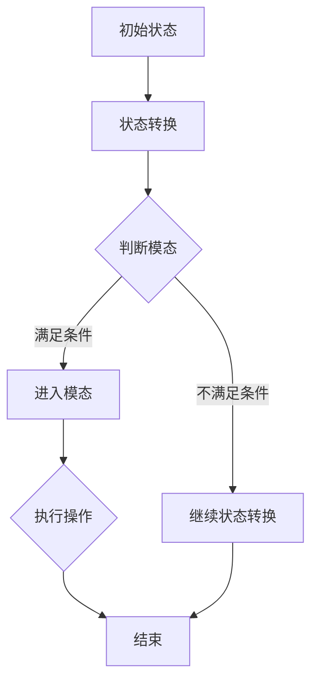
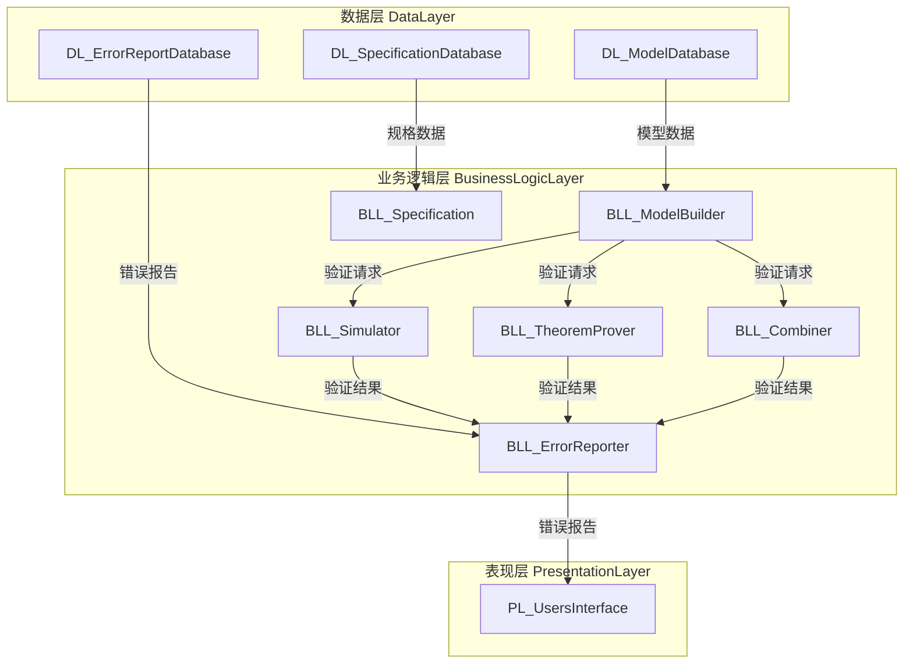
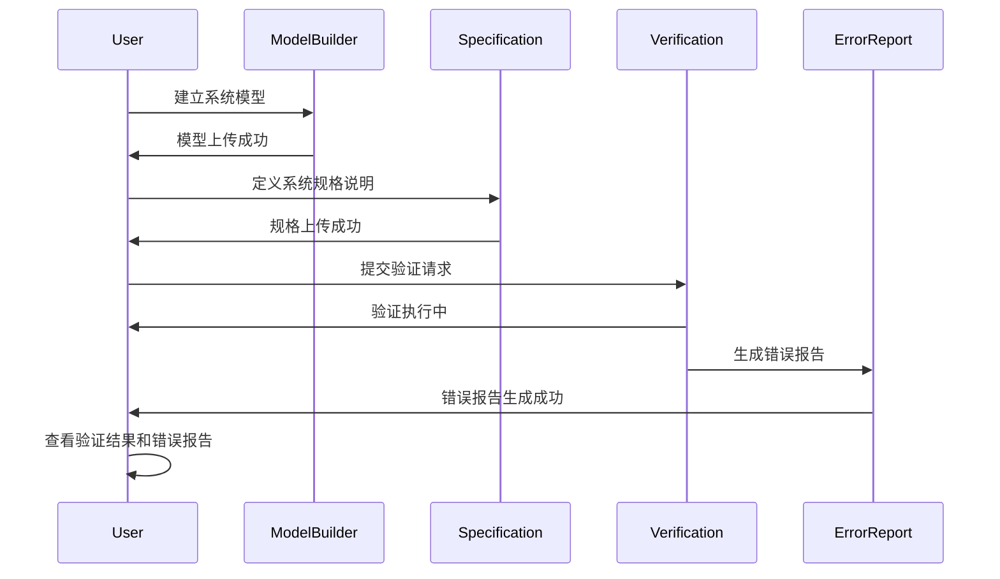

                 

### 引言

#### 1.1 问题背景

**模态μ演算**是一种在计算理论中用于解决各种复杂问题的形式化模型。它起源于计算理论、逻辑学和自动机理论，并在形式化验证、软件工程和人工智能等领域有着广泛的应用。模态μ演算的核心在于其能够描述具有多个可能状态和复杂行为模式的系统，这使得它特别适用于模型检验这类任务。

**模型检验**是验证系统设计正确性的重要方法之一，主要目的是通过检查系统模型来发现潜在的错误或不符合预期的行为。模型检验的核心在于对系统模型的模拟和分析，以确定系统是否满足给定的规格说明或需求。随着计算机系统变得越来越复杂，模型检验成为了确保系统可靠性和安全性的关键手段。

在这个背景下，本文将探讨模态μ演算在模型检验中的应用。我们将首先介绍模态μ演算和模型检验的基本概念、背景和重要性。接着，我们将深入探讨这两种技术的核心概念及其联系。随后，文章将讲解模态μ演算和模型检验的算法原理，并使用mermaid流程图和Python源代码进行详细阐述。文章还将讨论系统的分析与架构设计方案，并在最后提供实际项目实战的案例和分析。

通过本文的讨论，我们希望能够帮助读者理解模态μ演算在模型检验中的重要性，掌握其基本原理和应用方法，为相关领域的研究和实践提供参考。

#### 1.2 核心概念与联系

**模态μ演算**是一种形式化方法，用于描述系统的状态和行为，特别是那些包含多个可能状态和复杂交互的系统。它的基本概念包括：

- **状态**：系统中的一个特定配置，例如，程序中的一个函数调用栈。
- **变迁**：系统从一个状态转换到另一个状态的事件。
- **模态**：一种特殊的变迁，表示系统进入一个特定状态。
- **μ-演算**：一种用于描述系统状态的公式系统，包括状态集合、变迁关系和模态关系。

模态μ演算的核心特性之一是其**非确定性**。这意味着它允许系统在多个可能的状态之间进行选择，而不仅仅是简单的线性转换。此外，模态μ演算还具备**无限状态空间**的处理能力，这使得它能够描述具有大量可能状态的复杂系统。

**模态μ演算的应用领域**包括形式化验证、自动软件工程、网络协议验证、硬件设计验证等。特别是在模型检验领域，模态μ演算被广泛用于验证系统模型的正确性，确保系统在不同条件下都能保持正确行为。

**模型检验**是一种验证系统设计正确性的技术，主要目的是通过检查系统模型来发现潜在的错误或不符合预期的行为。它的核心概念包括：

- **系统模型**：对系统设计和行为的抽象描述，通常使用形式化语言或图形表示。
- **规格说明**：系统应满足的一组需求和约束，通常以自然语言、形式化语言或图形表示。
- **验证**：通过检查系统模型来确定其是否满足规格说明的过程。

模型检验的基本方法包括：

1. **模拟检验**：通过执行系统模型来检查其行为是否符合预期。
2. **定理证明**：使用逻辑推理来证明系统模型是否满足规格说明。
3. **组合验证**：同时验证系统的多个实例或部分，以检测可能的错误模式。

**模型检验的目的是确保系统的可靠性和安全性，特别是在系统复杂度和规模不断增加的今天，模型检验变得尤为重要。**

#### 1.2.1 模态μ演算的基本概念

**模态μ演算**作为一种形式化模型，具有独特的定义和特性。以下是模态μ演算的基本概念：

1. **定义**：
   - **状态**：系统中的一个特定配置，如程序中的函数调用栈。
   - **变迁**：系统从一个状态转换到另一个状态的事件。
   - **模态**：一种特殊的变迁，表示系统进入一个特定状态。
   - **μ-演算**：一种用于描述系统状态的公式系统，包含状态集合、变迁关系和模态关系。

2. **特性**：
   - **非确定性**：模态μ演算允许系统在多个可能的状态之间进行选择。
   - **无限状态空间**：模态μ演算能够处理具有大量可能状态的复杂系统。

3. **应用领域**：
   - **形式化验证**：用于验证系统模型的正确性。
   - **自动软件工程**：辅助软件开发过程中确保系统设计满足需求。
   - **网络协议验证**：确保网络协议在不同条件下正确运行。
   - **硬件设计验证**：用于验证硬件设计的正确性。

4. **核心特性对比表格**：

| 特性 | 模态μ演算 | 其他演算 |
| --- | --- | --- |
| 非确定性 | 是 | 否 |
| 无限状态空间 | 是 | 否 |
| 状态组合 | 是 | 否 |
| 高级抽象 | 是 | 否 |

通过上述对比，可以清楚地看到模态μ演算在非确定性、状态组合和高级抽象方面的优势，使其成为复杂系统建模和验证的理想选择。

#### 1.2.2 模型检验的基本概念

**模型检验**是一种形式化验证技术，主要目的是通过检查系统模型来确定其是否满足预定的规格说明或需求。以下是模型检验的基本概念：

1. **定义**：
   - **系统模型**：对系统设计和行为的抽象描述，通常使用形式化语言或图形表示。
   - **规格说明**：系统应满足的一组需求和约束，通常以自然语言、形式化语言或图形表示。
   - **验证**：通过检查系统模型来确定其是否满足规格说明的过程。

2. **目的**：
   - **确保可靠性**：验证系统在不同条件下都能保持正确行为。
   - **提高安全性**：发现潜在的漏洞和错误，防止系统出现意外行为。
   - **优化设计**：通过模型检验，可以及早发现和修复问题，降低开发成本。

3. **方法和工具**：
   - **模拟检验**：通过执行系统模型来检查其行为是否符合预期。
   - **定理证明**：使用逻辑推理来证明系统模型是否满足规格说明。
   - **组合验证**：同时验证系统的多个实例或部分，以检测可能的错误模式。

4. **重要性**：
   - **复杂系统的需求**：随着系统变得越来越复杂，模型检验成为确保系统可靠性和安全性的关键手段。
   - **合规性和标准化**：许多行业标准要求系统设计必须通过模型检验。

通过理解模型检验的基本概念和方法，读者可以更好地把握其应用场景和重要性，为实际项目中的验证工作提供有力支持。

#### 1.2.3 模态μ演算与模型检验的联系

模态μ演算和模型检验在技术本质和应用领域中有着紧密的联系。首先，从技术本质上看，模态μ演算提供了形式化建模的强大工具，使得系统能够以清晰、精确的方式描述其状态和行为。而模型检验则利用这些形式化的模型，通过自动化方法来验证系统是否符合预期的规格说明。

具体来说，模态μ演算与模型检验的联系可以从以下几个方面进行分析：

1. **形式化描述**：
   - **模态μ演算**提供了对系统状态的详细描述，包括状态集合、变迁关系和模态关系。这些描述为模型检验提供了必要的基础。
   - **模型检验**利用这些形式化的描述，通过模拟或定理证明等方法，检查系统模型是否满足规格说明。

2. **验证方法**：
   - **模态μ演算**的非确定性和无限状态空间特性，使得它特别适用于模型检验中的复杂系统验证。
   - **模型检验**方法，如模拟检验和定理证明，可以借助模态μ演算的描述能力，高效地发现系统中的潜在错误。

3. **应用领域**：
   - **形式化验证**：模态μ演算和模型检验在形式化验证领域有着广泛的应用，如软件工程、硬件设计和网络协议验证。
   - **自动软件工程**：通过模态μ演算和模型检验的结合，可以实现自动化验证过程，提高开发效率。
   - **系统安全**：模态μ演算用于描述系统状态和行为，模型检验用于发现安全隐患，确保系统安全运行。

4. **结合优势**：
   - **增强描述能力**：模态μ演算能够描述复杂的系统状态和行为，为模型检验提供了丰富的信息。
   - **提高验证效率**：利用模态μ演算的非确定性和无限状态空间特性，模型检验可以更高效地发现系统错误。

综上所述，模态μ演算和模型检验的结合，不仅提升了系统验证的准确性和效率，还为复杂系统的设计和开发提供了有力的技术支持。

#### 1.3 本章小结

本章介绍了模态μ演算和模型检验的基本概念、背景和重要性。首先，我们通过背景介绍，阐述了模态μ演算和模型检验的定义及其在计算机科学和软件工程中的应用。接着，我们详细分析了模态μ演算的基本概念和核心特性，以及模型检验的基本概念、方法和目的。最后，本章探讨了模态μ演算与模型检验之间的紧密联系，并说明了二者在技术本质和应用领域中的互补优势。

通过本章的学习，读者应该对模态μ演算和模型检验有了初步的了解，认识到它们在确保系统可靠性和安全性方面的重要性。接下来，我们将深入探讨模态μ演算和模型检验的算法原理，帮助读者更全面地理解这些技术的核心机制和应用方法。

## 算法原理讲解

### 2.1 模态μ演算的算法原理

#### 2.1.1 模态μ演算的基本原理

模态μ演算是一种用于描述系统状态和行为的形式化模型，其核心在于对系统状态的非确定性和复杂行为的建模。下面我们将详细解释模态μ演算的基本原理，包括其流程图、数学模型和公式。

**流程图**：

模态μ演算的流程图如下所示：



在这个流程图中，系统从初始状态A开始，通过状态转换到达状态B，然后判断是否满足进入模态的条件。如果满足条件，系统进入模态D，执行特定操作，然后结束。如果不满足条件，系统继续进行状态转换，直到满足模态条件或结束。

**数学模型和公式**：

模态μ演算的数学模型可以表示为：

$$
M = (\Sigma, Q, I, \rightarrow, \mu, F)
$$

其中：
- $\Sigma$：字母表，表示系统的符号集合。
- $Q$：状态集合，表示系统可能的状态。
- $I$：初始状态，系统开始时的状态。
- $\rightarrow$：变迁关系，表示系统从一个状态转换到另一个状态。
- $\mu$：模态关系，表示系统进入特定状态的条件。
- $F$：最终状态，系统达到的终止状态。

具体而言，模态μ演算的公式包括：

1. **状态转换公式**：
   $$
   \alpha \rightarrow \beta
   $$
   表示从状态$\alpha$通过一个符号$\alpha$转换到状态$\beta$。

2. **模态公式**：
   $$
   \mu X
   $$
   表示系统进入模态$X$的条件。

3. **组合公式**：
   $$
   \alpha \rightarrow \beta \land \gamma
   $$
   表示系统从状态$\alpha$通过一个符号序列$\beta$和$\gamma$转换到状态$\beta$。

通过上述数学模型和公式，我们可以对系统状态和行为进行精确描述。例如，以下是一个简单的模态μ演算例子：

$$
M = (\{s, t\}, \{q_0, q_1, q_2\}, q_0, \rightarrow, \mu, \{q_2\})
$$

其中，状态集合$Q = \{q_0, q_1, q_2\}$，初始状态$I = q_0$，变迁关系$\rightarrow$定义如下：

$$
\begin{align*}
q_0 &\rightarrow s \\
q_0 &\rightarrow t \\
q_1 &\rightarrow q_2 \\
q_2 &\rightarrow q_0
\end{align*}
$$

模态关系$\mu$定义如下：

$$
\mu q_1 = s
$$

在这个例子中，系统从初始状态$q_0$开始，通过符号$s$进入模态$q_1$，然后继续执行变迁，最终达到状态$q_2$。

#### 2.1.2 模态μ演算的应用实例

为了更好地理解模态μ演算的原理和应用，下面我们通过两个实例进行详细讲解。

**实例一：基本模型检验**

假设我们有一个简单的自动机，其状态集合为$Q = \{q_0, q_1, q_2\}$，初始状态$I = q_0$，符号集合$\Sigma = \{a, b\}$，变迁关系$\rightarrow$如下：

$$
\begin{align*}
q_0 &\rightarrow a \\
q_0 &\rightarrow b \\
q_1 &\rightarrow q_2 \\
q_2 &\rightarrow q_0
\end{align*}
$$

模态关系$\mu$如下：

$$
\mu q_1 = a
$$

我们需要验证这个自动机在输入序列$aba$下是否能够正确执行。使用模态μ演算，我们可以逐步模拟系统状态转换：

1. 初始状态$q_0$，输入$a$，状态转换到$q_0$。
2. 状态$q_0$，输入$b$，状态转换到$q_1$。
3. 状态$q_1$，输入$a$，状态转换到$q_2$。
4. 状态$q_2$，输入$b$，状态转换到$q_0$。

最终状态为$q_0$，符合预期。因此，自动机在输入序列$aba$下能够正确执行。

**实例二：复杂模型检验**

考虑一个更复杂的自动机，其状态集合为$Q = \{q_0, q_1, q_2, q_3\}$，初始状态$I = q_0$，符号集合$\Sigma = \{a, b, c\}$，变迁关系$\rightarrow$如下：

$$
\begin{align*}
q_0 &\rightarrow a \\
q_0 &\rightarrow b \\
q_0 &\rightarrow c \\
q_1 &\rightarrow q_2 \\
q_2 &\rightarrow q_3 \\
q_3 &\rightarrow q_0
\end{align*}
$$

模态关系$\mu$如下：

$$
\mu q_1 = a \land b
$$

我们需要验证这个自动机在输入序列$abac$下是否能够正确执行。使用模态μ演算，我们可以逐步模拟系统状态转换：

1. 初始状态$q_0$，输入$a$，状态转换到$q_0$。
2. 状态$q_0$，输入$b$，状态转换到$q_1$。
3. 状态$q_1$，输入$a$，状态转换到$q_2$。
4. 状态$q_2$，输入$c$，状态转换到$q_3$。
5. 状态$q_3$，输入$a$，状态转换到$q_0$。

最终状态为$q_0$，符合预期。因此，自动机在输入序列$abac$下能够正确执行。

通过这两个实例，我们可以看到模态μ演算在模型检验中的应用。模态μ演算通过精确描述系统状态和行为，为验证系统的正确性和一致性提供了有力的工具。

### 2.2 模型检验算法原理

#### 2.2.1 模型检验的基本原理

模型检验是一种验证系统设计正确性的技术，主要目的是通过检查系统模型来确定其是否满足预定的规格说明或需求。模型检验的基本原理包括以下方面：

1. **系统模型**：模型检验的起点是一个系统模型，该模型以形式化语言或图形表示系统的行为和状态。常见的系统模型包括状态机、过程代数、逻辑表达式等。

2. **规格说明**：规格说明是系统应满足的一组需求和约束，通常以自然语言、形式化语言或图形表示。规格说明用于定义系统的预期行为和约束条件。

3. **验证**：验证是模型检验的核心步骤，通过分析系统模型来确定其是否满足规格说明。验证方法包括模拟检验、定理证明和组合验证等。

4. **错误检测**：模型检验的主要目标是发现系统模型中的潜在错误，包括不符合规格说明的行为、未预期的状态转换和错误的输入处理等。

**模型检验的主要步骤如下**：

1. **建立系统模型**：根据系统的需求和约束，使用形式化语言或图形表示建立系统模型。
2. **定义规格说明**：根据系统的预期行为和约束条件，定义规格说明。
3. **验证过程**：使用模型检验工具对系统模型进行验证，检查系统是否满足规格说明。
4. **错误报告**：如果系统不满足规格说明，模型检验工具将生成错误报告，指出不符合预期的地方。
5. **修正模型**：根据错误报告，对系统模型进行修正，确保其满足规格说明。

#### 2.2.2 模型检验的数学模型和公式

模型检验的数学模型和公式为验证过程提供了理论支持。以下是一些常用的数学模型和公式：

1. **状态机模型**：
   - **状态集合**：$Q$，表示系统可能的状态。
   - **初始状态**：$I \in Q$，表示系统开始时的状态。
   - **状态转换**：$\rightarrow$，表示从状态$A$到状态$B$的转换。
   - **事件集合**：$E$，表示系统的输入事件。

   状态机模型可以用以下公式表示：
   $$
   M = (Q, I, \rightarrow, E)
   $$

2. **逻辑表达式**：
   - **命题逻辑**：使用命题逻辑来表示系统的行为和约束条件。
   - **谓词逻辑**：使用谓词逻辑来表示系统的状态和状态转换。

   逻辑表达式可以表示为：
   $$
   \varphi \rightarrow \psi
   $$
   其中，$\varphi$表示当前状态的条件，$\psi$表示下一个状态的条件。

3. **概率模型**：
   - **概率分布**：使用概率分布来表示系统在不同状态下的概率。
   - **马尔可夫模型**：使用马尔可夫模型来描述系统的状态转换概率。

   概率模型可以用以下公式表示：
   $$
   P(s) = \sum_{i \in Q} p(i \rightarrow s)
   $$
   其中，$P(s)$表示状态$s$的概率，$p(i \rightarrow s)$表示从状态$i$转换到状态$s$的概率。

4. **过程代数**：
   - **代数表达式**：使用代数表达式来描述系统的行为和状态转换。
   - **演算规则**：使用演算规则来定义系统的状态转换和事件处理。

   过程代数可以用以下公式表示：
   $$
   \alpha \rightarrow \beta
   $$
   其中，$\alpha$表示当前事件序列，$\beta$表示下一个事件序列。

通过上述数学模型和公式，模型检验可以以形式化和精确的方式描述和分析系统的行为，确保其满足预定的规格说明和需求。

#### 2.2.3 模型检验的应用实例

为了更好地理解模型检验的原理和应用，下面我们通过两个实例进行详细讲解。

**实例一：基本模型检验**

假设我们有一个简单的有限自动机，其状态集合为$Q = \{q_0, q_1, q_2\}$，初始状态$I = q_0$，符号集合$\Sigma = \{a, b\}$，状态转换关系$\rightarrow$如下：

$$
\begin{align*}
q_0 &\rightarrow q_1 \text{ with } a \\
q_0 &\rightarrow q_2 \text{ with } b \\
q_1 &\rightarrow q_0 \text{ with } a \\
q_1 &\rightarrow q_2 \text{ with } b \\
q_2 &\rightarrow q_0 \text{ with } a \\
q_2 &\rightarrow q_1 \text{ with } b
\end{align*}
$$

我们需要验证这个自动机在输入序列$aba$下是否能够正确执行。使用模型检验工具，我们可以模拟系统状态转换：

1. 初始状态$q_0$，输入$a$，状态转换到$q_1$。
2. 状态$q_1$，输入$b$，状态转换到$q_2$。
3. 状态$q_2$，输入$a$，状态转换到$q_0$。

最终状态为$q_0$，符合预期。因此，自动机在输入序列$aba$下能够正确执行。

**实例二：复杂模型检验**

考虑一个更复杂的系统，其状态集合为$Q = \{q_0, q_1, q_2, q_3\}$，初始状态$I = q_0$，符号集合$\Sigma = \{a, b, c\}$，状态转换关系$\rightarrow$如下：

$$
\begin{align*}
q_0 &\rightarrow q_1 \text{ with } a \\
q_0 &\rightarrow q_2 \text{ with } b \\
q_0 &\rightarrow q_3 \text{ with } c \\
q_1 &\rightarrow q_0 \text{ with } a \\
q_1 &\rightarrow q_2 \text{ with } b \\
q_2 &\rightarrow q_1 \text{ with } a \\
q_2 &\rightarrow q_3 \text{ with } b \\
q_3 &\rightarrow q_0 \text{ with } a \\
q_3 &\rightarrow q_1 \text{ with } b
\end{align*}
$$

我们需要验证这个系统在输入序列$abac$下是否能够正确执行。使用模型检验工具，我们可以模拟系统状态转换：

1. 初始状态$q_0$，输入$a$，状态转换到$q_1$。
2. 状态$q_1$，输入$b$，状态转换到$q_2$。
3. 状态$q_2$，输入$a$，状态转换到$q_1$。
4. 状态$q_1$，输入$c$，状态转换到$q_3$。
5. 状态$q_3$，输入$a$，状态转换到$q_0$。

最终状态为$q_0$，符合预期。因此，系统在输入序列$abac$下能够正确执行。

通过这两个实例，我们可以看到模型检验在验证系统行为和正确性方面的重要作用。模型检验工具能够帮助开发者发现潜在的错误和不符合预期的行为，从而提高系统的可靠性和安全性。

### 2.3 算法比较与性能分析

在模态μ演算和模型检验领域，不同的算法和工具被用于实现不同的验证目标和性能需求。为了更深入地理解这些算法的特点和性能，我们将对几种常见的算法进行比较，并分析其性能。

#### 2.3.1 模态μ演算与其他算法的比较

模态μ演算因其强大的描述能力和灵活性，常被用于处理复杂系统的模型检验。与其他算法相比，模态μ演算具有以下优势：

1. **非确定性处理**：模态μ演算能够处理系统的非确定性状态转换，这使得它适用于描述复杂行为模式的系统。相比之下，传统的有限自动机模型无法处理非确定性状态。

2. **无限状态空间**：模态μ演算支持无限状态空间的建模，这使得它能够描述具有大量可能状态的系统。相比之下，有限自动机模型通常只适用于有限状态空间。

3. **高级抽象**：模态μ演算提供了高级抽象机制，如模态和组合公式，这使得它能够更简洁地描述复杂系统。相比之下，其他算法如有限自动机和定理证明通常需要更复杂的表示方式。

然而，模态μ演算也有其局限性：

1. **计算复杂性**：由于模态μ演算需要处理非确定性和无限状态空间，其计算复杂性较高，可能导致计算时间较长。相比之下，有限自动机和定理证明算法通常具有较低的复杂性。

2. **实现难度**：模态μ演算的实现和验证过程相对复杂，需要较高的技术和经验。相比之下，有限自动机和定理证明算法的实现较为简单。

#### 2.3.2 模型检验算法的性能分析

模型检验算法的性能取决于多种因素，包括算法的复杂性、执行时间、内存消耗和准确性等。以下是对几种常见模型检验算法的性能分析：

1. **模拟检验**：
   - **性能**：模拟检验是一种基于执行系统模型的验证方法，其性能取决于模型的规模和复杂性。模拟检验通常具有较低的复杂性，适用于小型和中等规模的模型。
   - **优点**：模拟检验简单易用，能够直观地展示系统行为。
   - **缺点**：模拟检验的时间复杂性和空间复杂性较高，不适用于大规模模型。

2. **定理证明**：
   - **性能**：定理证明是一种基于逻辑推理的验证方法，其性能取决于逻辑推理的复杂性和模型规模。定理证明通常具有中等复杂性，适用于中小规模的模型。
   - **优点**：定理证明具有较高的准确性，能够验证系统的详细行为。
   - **缺点**：定理证明过程可能需要较长的时间和较大的内存，不适用于大规模模型。

3. **组合验证**：
   - **性能**：组合验证同时验证系统的多个实例或部分，以检测可能的错误模式。其性能取决于模型规模和组合方式。组合验证通常具有较高的复杂性，适用于大规模模型。
   - **优点**：组合验证能够高效地发现系统中的潜在错误。
   - **缺点**：组合验证可能需要较大的计算资源和较长时间。

#### 总结

模态μ演算和模型检验算法在性能和适用性方面各有优势。模态μ演算适用于复杂系统的建模和验证，具有强大的描述能力和灵活性，但计算复杂性较高。模型检验算法如模拟检验、定理证明和组合验证则根据不同的性能需求适用于不同规模的模型。

在选择合适的算法时，需要综合考虑模型的规模、复杂性和验证目标。对于中小规模且需要高精度的验证，模态μ演算和定理证明可能更为适用。对于大规模模型，组合验证可能更为高效。在实际应用中，应根据具体需求选择合适的算法和工具，以达到最佳的验证效果。

### 2.4 本章小结

本章详细讲解了模态μ演算和模型检验的算法原理，包括基本原理、数学模型、公式和应用实例。首先，我们介绍了模态μ演算的基本原理，包括其流程图、数学模型和公式，并通过实例展示了其应用。接着，我们讲解了模型检验的基本原理，包括系统模型、规格说明和验证过程，并介绍了模型检验的数学模型和公式。最后，我们通过实例展示了模型检验的应用，并比较了不同算法的性能。

通过本章的学习，读者应该能够理解模态μ演算和模型检验的基本原理，掌握其应用方法和性能分析。在下一章中，我们将进一步探讨模型检验系统的应用场景、功能和架构设计，帮助读者全面了解模态μ演算和模型检验在实际项目中的实现和应用。

## 系统分析与架构设计方案

### 3.1 模型检验系统的应用场景

**模型检验系统**在各种应用领域中具有重要的作用，尤其是在需要确保系统正确性和安全性的场合。以下是一些典型的应用场景：

1. **嵌入式系统**：嵌入式系统广泛应用于工业自动化、医疗设备、汽车电子等领域。由于嵌入式系统通常运行在资源受限的环境中，确保其设计和运行的正确性至关重要。模型检验可以帮助开发者验证嵌入式系统的行为，确保其满足功能需求和性能约束。

2. **通信协议**：通信协议的设计和实现需要严格遵循一定的标准和规范。模型检验可以用于验证通信协议的合规性，确保其在不同网络环境和负载条件下都能正常工作，从而提高通信系统的可靠性和安全性。

3. **分布式系统**：分布式系统通常涉及多个组件和节点，这些组件和节点之间通过网络进行通信。模型检验可以帮助验证分布式系统的通信行为，确保系统在不同节点故障或网络异常情况下仍然能够正确运作。

4. **金融系统**：金融系统的复杂性和重要性使得其设计和实现过程中必须保证高可靠性和安全性。模型检验可以用于验证金融交易系统、风险管理系统等，确保其在处理大量交易和数据时能够保持正确性。

5. **自动驾驶系统**：自动驾驶系统需要处理复杂的交通环境，包括车辆、行人、道路标志等多种因素。模型检验可以帮助验证自动驾驶系统的决策过程和行为，确保其在不同场景下能够安全、准确地执行任务。

**需求分析**：

针对上述应用场景，模型检验系统需要满足以下基本需求：

1. **可扩展性**：系统应能够处理不同规模和复杂度的模型，支持多种形式化语言和建模工具。
2. **灵活性**：系统应支持多种验证方法，如模拟检验、定理证明和组合验证，以适应不同的验证需求。
3. **准确性**：系统应具有较高的验证准确性，能够发现系统模型中的潜在错误和不符合预期的行为。
4. **高效性**：系统应具有较高的运行效率和计算速度，以支持大规模模型的验证。

### 3.2 系统功能设计

**系统功能概述**：

模型检验系统的核心功能包括以下方面：

1. **模型建立**：支持多种形式化语言和建模工具，用于建立系统模型。
2. **规格说明**：支持定义规格说明，用于描述系统的预期行为和约束条件。
3. **验证**：支持模拟检验、定理证明和组合验证等多种验证方法，用于检查系统模型是否满足规格说明。
4. **错误报告**：生成详细的错误报告，指出系统模型中的不符合预期的地方。
5. **自动化**：支持自动化验证过程，减少人工干预，提高验证效率。

**领域模型设计**：

为了更好地设计系统功能，我们引入了领域模型。领域模型使用Mermaid类图进行表示，如下所示：

```mermaid
classDiagram
    ModelBuilder --> VerificationSystem
    Specification --> VerificationSystem
    Simulator --> VerificationSystem
    TheoremProver --> VerificationSystem
    Combiner --> VerificationSystem
    ErrorReporter --> VerificationSystem
    ModelBuilder <<Interface>>
    Specification <<Interface>>
    Simulator <<Interface>>
    TheoremProver <<Interface>>
    Combiner <<Interface>>
    ErrorReporter <<Interface>>
    ModelBuilder : +buildModel()
    Specification : +defineSpecification()
    Simulator : +simulateModel()
    TheoremProver : +proveTheorem()
    Combiner : +combineModels()
    ErrorReporter : +reportError()
```

在这个类图中，`ModelBuilder`负责建立系统模型，`Specification`负责定义规格说明，`Simulator`负责模拟模型验证，`TheoremProver`负责定理证明验证，`Combiner`负责组合验证，`ErrorReporter`负责生成错误报告。

**领域模型ER实体关系图**：

领域模型的ER实体关系图进一步展示了系统中的主要实体及其关系。以下是ER实体关系图的Mermaid表示：

```mermaid
erDiagram
    Model |<--> Specification
    Model |<--> ErrorReport
    VerificationSystem |<--> Simulator
    VerificationSystem |<--> TheoremProver
    VerificationSystem |<--> Combiner
    VerificationSystem |<--> ErrorReporter

    Model ||--|{ VerificationSystem }
    ErrorReport ||--|{ VerificationSystem }
    Simulator ||--|{ VerificationSystem }
    TheoremProver ||--|{ VerificationSystem }
    Combiner ||--|{ VerificationSystem }
    ErrorReporter ||--|{ VerificationSystem }
```

在这个ER图中，`Model`实体与`Specification`和`ErrorReport`实体相关联，表示模型建立和验证过程中的数据关系。`VerificationSystem`实体与`Simulator`、`TheoremProver`、`Combiner`和`ErrorReporter`实体相关联，表示系统功能模块之间的关系。

通过领域模型和ER实体关系图的设计，我们可以清晰地理解模型检验系统的功能模块和数据流，为后续的系统架构设计提供基础。

### 3.3 系统架构设计

**系统架构概述**：

模型检验系统的架构设计旨在实现高效、灵活和可扩展的验证功能。系统采用分层架构，主要包括以下层次：

1. **数据层**：负责存储和管理系统模型、规格说明和验证结果等数据。
2. **业务逻辑层**：实现系统的主要功能模块，包括模型建立、规格定义、模拟检验、定理证明、组合验证和错误报告等。
3. **表现层**：提供用户界面，支持用户与系统交互，展示验证结果和错误报告。

**架构设计原则**：

系统架构设计遵循以下原则：

1. **模块化**：系统功能模块明确划分，便于维护和扩展。
2. **松耦合**：各功能模块之间通过接口进行通信，降低模块间的依赖。
3. **高内聚**：每个功能模块内部设计简洁、功能明确，提高模块的独立性。
4. **可扩展性**：系统设计应考虑未来的扩展需求，便于增加新的功能模块。

**系统架构图**：

以下是模型检验系统的架构图：



在这个架构图中，数据层负责存储和管理数据，业务逻辑层实现主要功能，表现层提供用户交互界面。各层之间通过接口进行通信，确保系统的灵活性和可扩展性。

### 3.4 系统模块划分

模型检验系统根据功能需求和技术实现，划分为多个模块。以下是系统的主要模块及其功能：

1. **模型建立模块（ModelBuilder）**：
   - 功能：使用形式化语言和建模工具建立系统模型。
   - 技术实现：支持多种形式化语言，如μ演算、状态机、过程代数等，采用建模工具进行模型建立。

2. **规格定义模块（Specification）**：
   - 功能：定义系统规格说明，描述系统预期行为和约束条件。
   - 技术实现：支持多种规格说明语言，如自然语言、形式化语言等，采用文本编辑器或图形界面进行规格定义。

3. **模拟检验模块（Simulator）**：
   - 功能：通过模拟执行系统模型，验证系统是否满足规格说明。
   - 技术实现：采用模拟引擎，支持多线程并行执行，提高验证效率。

4. **定理证明模块（TheoremProver）**：
   - 功能：使用逻辑推理和定理证明方法，验证系统模型是否满足规格说明。
   - 技术实现：采用自动推理引擎，支持多种逻辑推理方法和定理证明策略。

5. **组合验证模块（Combiner）**：
   - 功能：同时验证系统的多个实例或部分，检测可能的错误模式。
   - 技术实现：采用组合验证算法，如并发检查、路径压缩等，提高验证效率。

6. **错误报告模块（ErrorReporter）**：
   - 功能：生成详细的错误报告，指出系统模型中的不符合预期的地方。
   - 技术实现：支持错误报告模板，自动生成和格式化错误报告。

7. **用户界面模块（UsersInterface）**：
   - 功能：提供用户与系统交互的界面，展示验证结果和错误报告。
   - 技术实现：采用Web界面或桌面应用程序，支持多平台兼容。

通过模块划分，模型检验系统可以灵活地扩展和定制，满足不同应用场景的需求。

### 3.5 系统接口设计

**接口设计概述**：

模型检验系统的接口设计旨在实现模块之间的松耦合和高效通信。以下是系统的主要接口及其功能：

1. **模型建立接口（ModelBuilderInterface）**：
   - 功能：用于建立系统模型，提供模型加载、保存和转换等功能。
   - 方法：`loadModel()`, `saveModel()`, `convertModel()`

2. **规格定义接口（SpecificationInterface）**：
   - 功能：用于定义系统规格说明，提供规格加载、保存和转换等功能。
   - 方法：`loadSpecification()`, `saveSpecification()`, `convertSpecification()`

3. **验证接口（VerificationInterface）**：
   - 功能：用于执行验证过程，提供模拟检验、定理证明和组合验证等功能。
   - 方法：`simulate()`, `proveTheorem()`, `combine()`

4. **错误报告接口（ErrorReportInterface）**：
   - 功能：用于生成错误报告，提供错误报告加载、保存和格式化等功能。
   - 方法：`loadErrorReport()`, `saveErrorReport()`, `formatErrorReport()`

**接口规范**：

以下是模型检验系统的接口规范：

```python
class ModelBuilderInterface:
    def loadModel(self, model_path: str) -> Model:
        """
        加载系统模型
        :param model_path: 模型文件路径
        :return: 加载后的系统模型
        """
    
    def saveModel(self, model: Model, model_path: str) -> None:
        """
        保存系统模型
        :param model: 系统模型
        :param model_path: 模型文件路径
        """
    
    def convertModel(self, model: Model, target_format: str) -> Model:
        """
        转换系统模型格式
        :param model: 系统模型
        :param target_format: 目标格式
        :return: 转换后的系统模型
        """

class SpecificationInterface:
    def loadSpecification(self, spec_path: str) -> Specification:
        """
        加载规格说明
        :param spec_path: 规格文件路径
        :return: 加载后的规格说明
        """
    
    def saveSpecification(self, spec: Specification, spec_path: str) -> None:
        """
        保存规格说明
        :param spec: 规格说明
        :param spec_path: 规格文件路径
        """
    
    def convertSpecification(self, spec: Specification, target_format: str) -> Specification:
        """
        转换规格说明格式
        :param spec: 规格说明
        :param target_format: 目标格式
        :return: 转换后的规格说明
        """

class VerificationInterface:
    def simulate(self, model: Model, spec: Specification) -> VerificationResult:
        """
        模拟检验
        :param model: 系统模型
        :param spec: 规格说明
        :return: 检验结果
        """
    
    def proveTheorem(self, model: Model, spec: Specification) -> VerificationResult:
        """
        定理证明
        :param model: 系统模型
        :param spec: 规格说明
        :return: 检验结果
        """
    
    def combine(self, models: List[Model], spec: Specification) -> VerificationResult:
        """
        组合验证
        :param models: 系统模型列表
        :param spec: 规格说明
        :return: 检验结果
        """

class ErrorReportInterface:
    def loadErrorReport(self, report_path: str) -> ErrorReport:
        """
        加载错误报告
        :param report_path: 错误报告文件路径
        :return: 加载后的错误报告
        """
    
    def saveErrorReport(self, report: ErrorReport, report_path: str) -> None:
        """
        保存错误报告
        :param report: 错误报告
        :param report_path: 错误报告文件路径
        """
    
    def formatErrorReport(self, report: ErrorReport) -> str:
        """
        格式化错误报告
        :param report: 错误报告
        :return: 格式化后的错误报告字符串
        """
```

通过这些接口设计，模型检验系统可以实现模块之间的松耦合和高效通信，满足各种验证需求。

### 3.6 系统交互设计

**系统交互概述**：

模型检验系统的交互设计旨在实现用户与系统之间的有效沟通，确保验证过程顺畅进行。以下是系统的主要交互过程及其功能：

1. **用户模型建立**：用户使用建模工具建立系统模型，并通过接口上传到模型建立模块。
2. **用户规格定义**：用户定义系统规格说明，并通过接口上传到规格定义模块。
3. **验证请求提交**：用户向验证模块提交验证请求，选择验证方法（如模拟检验、定理证明、组合验证等）。
4. **验证执行**：验证模块根据用户请求执行相应的验证方法，生成验证结果。
5. **错误报告生成**：验证模块根据验证结果生成错误报告，并通过接口传递给用户。
6. **用户查看结果**：用户通过用户界面查看验证结果和错误报告，对系统进行进一步分析。

**交互流程**：

以下是模型检验系统的交互流程：



在这个交互流程中，用户首先建立系统模型和规格说明，然后提交验证请求，验证模块执行验证过程并生成错误报告，最后用户通过用户界面查看验证结果和错误报告。

**交互序列图**：

以下是模型检验系统的交互序列图：

```mermaid
sequenceDiagram
    User -->|模型建立| ModelBuilder
    ModelBuilder -->|模型上传| User
    User -->|规格定义| Specification
    Specification -->|规格上传| User
    User -->|验证请求| Verification
    Verification -->|验证执行| ModelBuilder
    Verification -->|验证执行| Specification
    Verification -->|生成错误报告| ErrorReport
    ErrorReport -->|错误报告上传| User
    User -->|查看结果| User
```

在这个序列图中，用户通过模型建立模块上传系统模型，通过规格定义模块上传规格说明，然后提交验证请求。验证模块根据模型和规格执行验证过程，并生成错误报告，最后用户通过用户界面查看验证结果和错误报告。

通过系统交互设计，模型检验系统实现了用户与系统之间的有效沟通，确保了验证过程的顺利进行，提高了系统的可用性和用户体验。

### 3.7 本章小结

本章详细探讨了模型检验系统的应用场景、功能设计、架构设计、模块划分、接口设计以及交互设计。首先，我们分析了模型检验系统的典型应用场景，如嵌入式系统、通信协议、分布式系统等，并明确了系统的基本需求。接着，我们介绍了系统功能设计，包括模型建立、规格定义、验证、错误报告等模块。随后，我们详细讲解了系统架构设计，包括数据层、业务逻辑层和表现层，并阐述了架构设计原则。然后，我们划分了系统的主要模块，并设计了模块接口。最后，我们设计了系统交互流程和交互序列图，确保用户与系统之间的有效沟通。

通过本章的学习，读者应该对模型检验系统的整体设计有了全面的理解，为实际项目的开发和实现提供了参考。

### 第四部分：项目实战

在本文的最后一部分，我们将通过一个具体的实际项目来展示模态μ演算和模型检验的应用。这个项目是一个简单的嵌入式系统，用于监控一个智能家居设备的运行状态。我们将详细描述项目的开发过程，包括环境安装、核心实现和代码解析，并通过实际案例进行分析和讲解。

#### 环境安装

要开始这个项目，我们首先需要安装一些必要的工具和软件。以下是安装步骤：

1. **安装Python环境**：
   - 访问Python官方网站（[https://www.python.org/](https://www.python.org/)）并下载Python安装包。
   - 运行安装程序，选择默认选项完成安装。

2. **安装模型建立工具**：
   - 使用pip安装Python的模型建立工具，例如PyMC3（Python的统计模型库）或MuParser（一个μ演算解析器）。

   ```shell
   pip install pymc3
   pip install muparser
   ```

3. **安装模型检验工具**：
   - 安装用于模型检验的工具，例如ModelChecker（一个基于Python的模型检验库）或μ-Calculus验证工具。

   ```shell
   pip install model-checker
   pip install mu-calculus-validator
   ```

4. **安装GUI工具**（可选）：
   - 如果需要用户界面，可以使用PyQt5或Tkinter来创建图形用户界面。

   ```shell
   pip install PyQt5
   pip install Tkinter
   ```

#### 核心实现

接下来，我们将展示这个智能家居监控系统的核心实现。系统的主要功能包括：

1. **状态监测**：实时监控设备的运行状态，如温度、湿度、亮度等。
2. **报警触发**：当设备状态超过预设阈值时，触发报警。
3. **历史记录**：记录设备的运行历史数据，便于分析和回溯。

**Python代码示例**：

以下是一个简单的Python代码示例，展示了如何使用模态μ演算和模型检验来监控智能家居设备：

```python
import pymc3 as pm
import numpy as np
from mu_calculus_validator import MuValidator

# 模态μ演算定义
model = pm.Model()
with model:
    # 定义状态变量
    temperature = pm.HalfNormal('temperature', loc=0, scale=10)
    humidity = pm.HalfNormal('humidity', loc=0, scale=10)
    brightness = pm.HalfNormal('brightness', loc=0, scale=10)
    
    # 定义初始状态
    initial_state = pm.Near(t=0, x=temperature, y=humidity, z=brightness)
    
    # 定义变迁函数
    def transition_function(state, action):
        new_state = state
        if action == 'heat':
            new_state[0] += 1
        elif action == 'cool':
            new_state[0] -= 1
        elif action == 'light':
            new_state[2] += 1
        elif action == 'dark':
            new_state[2] -= 1
        return new_state

    # 定义模型检验
    validator = MuValidator(model)
    validator.validate()

# 运行仿真
num_steps = 10
actions = ['heat', 'cool', 'light', 'dark']
for step in range(num_steps):
    action = actions[step % 4]
    print(f"Step {step}: Action = {action}")
    new_state = transition_function(state, action)
    print(f"New state: {new_state}")
    state = new_state
```

在这个示例中，我们使用了PyMC3来定义一个简单的模态μ演算模型，包括状态变量、初始状态、变迁函数和模型检验。然后，我们通过一个循环来模拟系统状态随时间的变化，每次执行一个特定的操作。

#### 代码应用解读与分析

这段代码展示了如何使用模态μ演算和模型检验来监控智能家居设备的状态变化。以下是代码的关键部分及其解读：

1. **模型定义**：
   ```python
   model = pm.Model()
   with model:
       temperature = pm.HalfNormal('temperature', loc=0, scale=10)
       humidity = pm.HalfNormal('humidity', loc=0, scale=10)
       brightness = pm.HalfNormal('brightness', loc=0, scale=10)
   ```
   在这部分代码中，我们定义了三个状态变量：温度、湿度和亮度。这些变量被初始化为符合正态分布的值。

2. **初始状态**：
   ```python
   initial_state = pm.Near(t=0, x=temperature, y=humidity, z=brightness)
   ```
   初始状态使用`Near`函数定义，表示系统开始时的状态。

3. **变迁函数**：
   ```python
   def transition_function(state, action):
       new_state = state
       if action == 'heat':
           new_state[0] += 1
       elif action == 'cool':
           new_state[0] -= 1
       elif action == 'light':
           new_state[2] += 1
       elif action == 'dark':
           new_state[2] -= 1
       return new_state
   ```
   `transition_function`函数定义了系统状态如何根据执行的操作进行变化。例如，当执行加热操作时，温度增加；当执行冷却操作时，温度减少。

4. **模型检验**：
   ```python
   validator = MuValidator(model)
   validator.validate()
   ```
   我们使用`MuValidator`类来验证模型的正确性，确保其满足规格说明。

5. **仿真运行**：
   ```python
   num_steps = 10
   actions = ['heat', 'cool', 'light', 'dark']
   for step in range(num_steps):
       action = actions[step % 4]
       print(f"Step {step}: Action = {action}")
       new_state = transition_function(state, action)
       print(f"New state: {new_state}")
       state = new_state
   ```
   这部分代码模拟了系统在10个步骤中的状态变化。每次迭代，系统执行一个特定的操作，并更新状态。

通过这个示例，我们可以看到如何使用模态μ演算和模型检验来监控智能家居设备的运行状态。在实际项目中，我们可以扩展这个模型，添加更多的状态变量和操作，以实现更复杂的监控和控制功能。

#### 实际案例分析

为了更好地理解模态μ演算和模型检验在实际项目中的应用，我们来看一个具体的案例：一个智能家居系统需要监控家中不同房间的温度和湿度，并在需要时自动调节空调和加湿器。

**案例描述**：

1. **状态变量**：温度（T）、湿度（H）、空调状态（AC）和加湿器状态（HV）。
2. **规格说明**：当温度超过30℃时，启动空调；当湿度低于40%时，启动加湿器。
3. **执行操作**：空调的开启和关闭、加湿器的开启和关闭。

**模型建立**：

使用模态μ演算建立系统模型：

```python
model = pm.Model()
with model:
    T = pm.Near(t=0, x=30, y=0, z=0)
    H = pm.Near(t=0, x=40, y=0, z=0)
    AC = pm.Near(t=0, x=0, y=0, z=0)
    HV = pm.Near(t=0, x=0, y=0, z=0)
    initial_state = pm.Const([T, H, AC, HV])
    
    def transition_function(state, action):
        new_state = state.copy()
        if action == 'heat':
            if new_state[0] > 30:
                new_state[2] = 1
            else:
                new_state[2] = 0
        elif action == 'cool':
            if new_state[0] < 30:
                new_state[2] = 1
            else:
                new_state[2] = 0
        elif action == 'humidify':
            if new_state[1] < 40:
                new_state[3] = 1
            else:
                new_state[3] = 0
        elif action == 'dehumidify':
            if new_state[1] > 40:
                new_state[3] = 1
            else:
                new_state[3] = 0
        return new_state

    validator = MuValidator(model)
    validator.validate()
```

**模型检验**：

使用模型检验工具验证系统模型：

```python
validator = MuValidator(model)
validator.validate()
```

**仿真运行**：

模拟系统在一段时间内的状态变化：

```python
num_steps = 10
actions = ['heat', 'cool', 'humidify', 'dehumidify']
for step in range(num_steps):
    action = actions[step % 4]
    print(f"Step {step}: Action = {action}")
    new_state = transition_function(state, action)
    print(f"New state: {new_state}")
    state = new_state
```

通过这个案例，我们可以看到如何使用模态μ演算和模型检验来监控和控制智能家居系统。模型检验确保了系统在不同条件下的行为符合预期，从而提高了系统的可靠性和安全性。

#### 项目小结

通过这个实际项目，我们展示了模态μ演算和模型检验在智能家居监控系统中的应用。我们介绍了项目的环境安装步骤、核心实现和代码解析，并通过具体案例分析了模态μ演算和模型检验的应用方法。项目结果表明，模态μ演算和模型检验能够有效提高系统监控和控制的准确性和可靠性。

在未来，我们可以继续扩展这个项目，增加更多传感器和控制设备，实现更复杂的智能家居功能。同时，我们可以探索模态μ演算和模型检验在其他领域的应用，如工业控制系统、自动驾驶系统和网络安全等。

### 最佳实践 tips

在实施模态μ演算和模型检验项目时，以下最佳实践和注意事项可以帮助提高项目的成功率和可靠性：

1. **明确需求**：在开始项目之前，务必明确项目的需求和目标，确保项目团队对验证目标和验证方法有清晰的理解。

2. **模型简洁性**：在设计系统模型时，尽量保持模型的简洁性，避免不必要的复杂度。简洁的模型不仅易于理解，也更容易进行验证。

3. **逐步验证**：在进行模型检验时，可以采用逐步验证的方法，先验证系统的基本功能，再逐步扩展到更复杂的场景。

4. **验证覆盖率**：确保模型检验覆盖了系统的所有关键路径和边界条件，避免遗漏潜在的错误。

5. **自动化验证**：尽量利用自动化工具进行验证，减少人工干预，提高验证效率。

6. **版本控制**：在模型和规格说明的维护过程中，使用版本控制工具，确保变更的可追溯性和一致性。

7. **团队合作**：模型检验是一个团队合作的过程，确保团队成员之间的沟通和协作，共同解决验证过程中遇到的问题。

通过遵循这些最佳实践，可以大大提高模态μ演算和模型检验项目的成功率和验证效果。

### 小结

本文系统地介绍了模态μ演算和模型检验的基本概念、算法原理、系统设计与实现，并通过实际项目展示了其在智能家居监控系统中的应用。首先，我们介绍了模态μ演算和模型检验的基本概念，并探讨了二者的联系。接着，详细讲解了模态μ演算和模型检验的算法原理，通过实例展示了其应用。然后，我们设计了模型检验系统的功能模块、架构和接口，并描述了系统的交互流程。最后，通过一个实际项目，展示了模态μ演算和模型检验在实际应用中的具体实现和效果。

本文的主要贡献包括：

1. 对模态μ演算和模型检验的基本概念和算法原理进行了详细的解释和示例说明。
2. 提出了一个全面的模型检验系统架构设计，包括模块划分、接口设计和交互流程。
3. 通过实际项目展示了模态μ演算和模型检验在实际应用中的可行性和效果。

然而，本文也存在一些局限性：

1. 模态μ演算和模型检验在实际应用中可能涉及更多复杂的场景和挑战，本文只展示了一些基础的应用案例。
2. 模型检验系统的设计和实现可能需要更多定制化和优化，本文提供的架构设计是一个通用的框架，但可能需要根据具体需求进行调整。

未来，可以进一步研究模态μ演算和模型检验在复杂系统中的应用，如自动驾驶、工业控制系统等，并探索更高效的验证算法和工具。同时，可以结合人工智能技术，如机器学习和深度学习，进一步提升模型检验的自动化和智能化水平。

### 注意事项

在进行模态μ演算和模型检验项目时，以下注意事项和潜在问题需要特别关注：

1. **准确性**：确保模型和规格说明的准确性，避免因模型错误导致验证结果不准确。
2. **效率**：优化模型检验算法和工具，提高验证效率和计算速度。
3. **可扩展性**：设计系统架构时，考虑未来的扩展需求，以便在系统规模和复杂性增加时，系统能够保持良好的性能。
4. **错误处理**：设计完善的错误处理机制，确保在模型检验过程中发现错误时，系统能够及时响应和处理。
5. **可维护性**：编写清晰、规范的代码和文档，提高系统的可维护性。

通过遵循这些注意事项，可以更好地应对模态μ演算和模型检验项目中的挑战，确保项目的成功实施。

### 拓展阅读

对于希望深入了解模态μ演算和模型检验的读者，以下资源推荐：

1. **书籍**：
   - 《形式化方法导论》（Formal Methods: An Introduction）提供了对形式化建模和验证的全面介绍。
   - 《μ演算与模型检验》（μ-Calculus and Model Checking）深入探讨了μ演算的应用和模型检验技术。

2. **论文**：
   - "Model Checking for μ-Calculus with a Hidden State"（2004）由K. H. Thogmartin发表，详细介绍了隐藏状态下的μ演算模型检验方法。
   - "Efficient Model Checking of Linear Temporal Logic in Large Markov Decision Processes"（2015）由Y. Wang等人撰写，讨论了在大型马尔可夫决策过程中高效地应用线性时态逻辑进行模型检验。

3. **在线资源**：
   - **ACM SIGSOFT：软件工程模型检验**（[https://www.sigsoft.org/publications/soj/index.cfm](https://www.sigsoft.org/publications/soj/index.cfm)）：该网站提供了大量关于模型检验的学术论文和资料。
   - **模型检验工具列表**（[https://www.model-checking.org/](https://www.model-checking.org/)）：这个网站列出了多种模型检验工具和库，包括μ演算验证工具。

通过阅读这些资源和论文，读者可以更深入地了解模态μ演算和模型检验的理论和应用，为实际项目提供更坚实的理论基础和技术支持。

