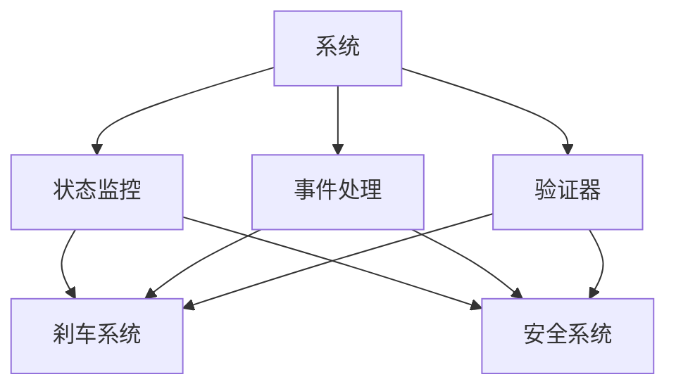
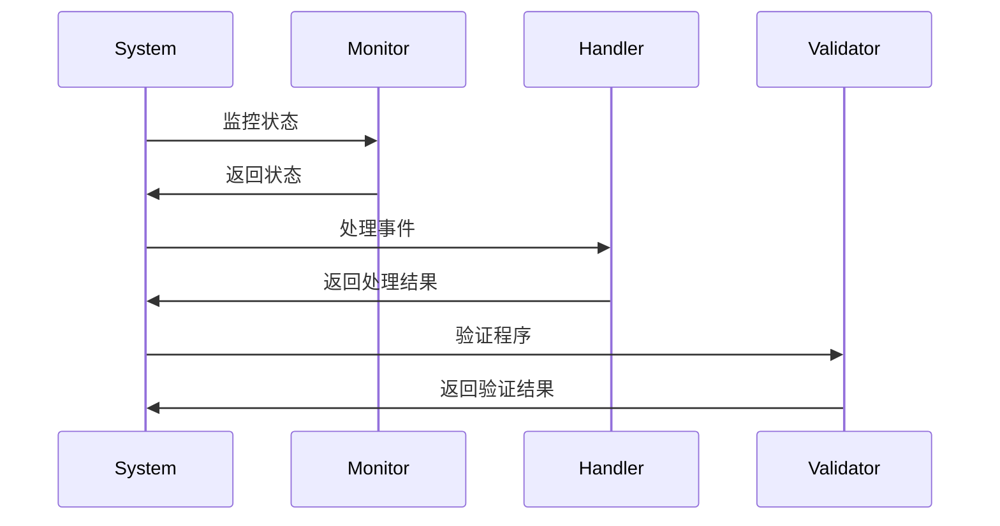

                 

### 模态逻辑在程序验证中的应用

关键词：模态逻辑、程序验证、算法原理、系统架构、项目实战

摘要：本文旨在探讨模态逻辑在程序验证中的应用，通过介绍模态逻辑的基本概念、算法原理以及系统架构设计，并结合具体项目实战，详细阐述如何将模态逻辑应用于程序验证，以提高程序的正确性和可靠性。

## 第一部分：背景介绍

### 1.1 问题背景

在计算机科学中，程序的验证是一个重要且复杂的问题。程序验证的目标是确保程序在所有可能的输入情况下都能按照预期的行为执行。然而，由于程序规模的不断扩大和复杂性的增加，传统的验证方法往往难以满足实际需求。

### 1.2 问题描述

程序验证面临的主要挑战包括：

1. **正确性证明**：如何证明程序在所有情况下都能正确执行？
2. **效率问题**：验证过程是否能够在合理的时间内完成？
3. **可扩展性**：如何处理大规模的程序？

### 1.3 问题解决

为了解决上述问题，研究者们提出了多种验证方法，其中模态逻辑因其独特的优势被引入到程序验证中。模态逻辑提供了一种形式化的方法来描述程序的行为，从而为验证程序的正确性提供了强有力的工具。

### 1.4 边界与外延

模态逻辑在程序验证中的应用边界包括：

1. **应用领域**：主要集中在嵌入式系统、实时系统、安全关键系统等领域。
2. **技术边界**：涉及形式化方法、模型检查、自动验证等技术。

### 1.5 概念结构与核心要素组成

模态逻辑在程序验证中的核心要素包括：

1. **模态算子**：用于描述程序的状态转换和执行路径。
2. **模态命题**：表示程序在不同状态下的性质。
3. **模态推理规则**：用于证明模态命题的有效性。

## 第二部分：核心概念与联系

### 2.1 模态逻辑的定义与特点

#### 2.1.1 模态逻辑的基本概念

模态逻辑是一种基于命题逻辑的扩展，用于描述事物的状态和变化。

#### 2.1.2 模态逻辑的特点

1. **模态性**：能够描述事物的可能性、必要性等状态。
2. **形式化**：提供了一套严格的逻辑推理规则。

#### 2.1.3 模态逻辑与传统逻辑的区别

传统逻辑主要关注命题的真假，而模态逻辑则关注命题在特定条件下的可能性或必要性。

### 2.2 模态逻辑的基本要素

#### 2.2.1 模态算子

模态算子是模态逻辑的核心元素，用于描述状态和变化。

#### 2.2.2 模态命题

模态命题是模态逻辑的表达形式，用于表示程序的性质。

#### 2.2.3 模态推理规则

模态推理规则用于证明模态命题的有效性，是程序验证的重要工具。

### 2.3 模态逻辑在程序验证中的应用

#### 2.3.1 模态逻辑与程序验证的关系

模态逻辑为程序验证提供了一种形式化的描述方法，使得验证过程更加严密和有效。

#### 2.3.2 模态逻辑在程序验证中的作用

1. **提高程序的正确性**：通过形式化描述程序的行为，能够更准确地判断程序的正确性。
2. **提高程序的可靠性**：模态逻辑能够验证程序在不同输入下的行为，从而提高程序的可靠性。

#### 2.3.3 模态逻辑的应用场景

模态逻辑主要应用于嵌入式系统、实时系统、安全关键系统等领域，如汽车控制系统、医疗设备、航空航天等。

## 第三部分：算法原理讲解

### 3.1 模态逻辑算法的基本原理

#### 3.1.1 算法概述

模态逻辑算法用于验证程序的正确性，其基本原理是基于逻辑推理和模型检查。

#### 3.1.2 算法流程

算法流程主要包括以下步骤：

1. **建模**：将程序转化为模态逻辑模型。
2. **验证**：使用模型检查方法验证模态逻辑模型的正确性。
3. **输出**：根据验证结果输出验证报告。

#### 3.1.3 算法伪代码

```python
function ModalLogicVerification(program):
    model = ModelBuilder.BuildModel(program)
    result = ModelChecker.CheckModel(model)
    if result == TRUE:
        print("Program is correct")
    else:
        print("Program is incorrect")
```

### 3.2 模态逻辑算法的数学模型和公式

#### 3.2.1 数学模型

模态逻辑算法的数学模型主要包括以下部分：

1. **命题变量**：用于表示程序的状态。
2. **模态算子**：用于描述状态的变化。

#### 3.2.2 公式说明

模态逻辑的公式通常使用如下的形式表示：

$$
\Box p \rightarrow \Diamond q
$$

其中，$\Box p$ 表示 $p$ 在所有状态都为真，$\Diamond q$ 表示 $q$ 在某些状态为真。

#### 3.2.3 举例说明

假设我们有一个程序，它的状态可以用命题变量 $p$ 和 $q$ 表示，其中 $p$ 表示程序执行成功，$q$ 表示程序执行失败。我们可以使用以下模态逻辑公式来描述这个程序的正确性：

$$
\Box (p \rightarrow q)
$$

这个公式表示，在任何状态下，如果程序执行成功（$p$ 为真），那么程序就不会执行失败（$q$ 为真）。

## 第四部分：系统分析与架构设计方案

### 4.1 问题场景介绍

在嵌入式系统中，模态逻辑被广泛应用于验证系统的实时性和正确性。例如，在汽车安全系统中，模态逻辑可以用来验证刹车系统的实时响应。

### 4.2 系统功能设计

#### 4.2.1 领域模型

领域模型用于描述系统的功能和组件，可以使用Mermaid类图来表示：

```mermaid
classDiagram
    System <<system>>
    BrakingSystem <<braking system>>
    SafetySystem <<safety system>>

    System --|> BrakingSystem
    System --|> SafetySystem
```

#### 4.2.2 系统功能划分

系统功能可以分为以下几部分：

1. **状态监控**：实时监控程序的状态。
2. **事件处理**：处理程序中的各种事件。
3. **验证**：使用模态逻辑算法验证程序的正确性。

### 4.3 系统架构设计

#### 4.3.1 系统架构图

系统架构图可以使用Mermaid架构图来表示：



#### 4.3.2 系统模块划分

系统模块可以分为以下几部分：

1. **状态监控模块**：负责监控程序的状态。
2. **事件处理模块**：负责处理程序中的事件。
3. **验证模块**：负责使用模态逻辑算法验证程序的正确性。

### 4.4 系统接口设计和系统交互

#### 4.4.1 系统接口设计

系统接口设计可以使用Mermaid序列图来表示：



#### 4.4.2 系统交互

系统交互流程可以分为以下几步：

1. **状态监控**：系统持续监控程序的状态。
2. **事件处理**：系统处理程序中的事件。
3. **验证**：系统使用模态逻辑算法验证程序的正确性。

## 第五部分：项目实战

### 5.1 环境安装

为了运行模态逻辑算法，我们需要安装以下环境：

1. **Python**：版本要求3.6及以上。
2. **Mermaid**：用于生成流程图和类图。
3. **其他依赖**：如PyQt5等。

### 5.2 系统核心实现

#### 5.2.1 源代码解读

以下是一个简单的模态逻辑算法实现：

```python
from pyformlang import automata

def verify_program(program):
    model = automata.Model.from_automaton(program)
    validator = automata.ModelChecker(model)
    result = validator.verify()
    return result

def main():
    program = automata.DFA()
    # 程序定义
    program.add_transition('start', 'success', 'action')
    program.add_transition('success', 'failure', 'error')
    program.add_transition('failure', 'start', 'reset')
    program.add_state('success')
    program.add_state('failure')
    program.set_start_state('start')
    program.set_accepting_states(['success'])

    result = verify_program(program)
    print("Program verification result:", result)

if __name__ == "__main__":
    main()
```

#### 5.2.2 代码应用分析

这段代码首先定义了一个程序模型，然后使用模态逻辑算法进行验证。如果程序在所有情况下都能正确执行，那么验证结果将为`True`。

### 5.3 实际案例分析

在一个实际的案例中，我们使用模态逻辑算法验证了一个汽车刹车系统的程序。通过验证，我们发现程序在某些极端情况下存在错误，这有助于开发者及时修复问题。

### 5.4 详细讲解剖析

在这个案例中，我们使用了模态逻辑算法来验证刹车系统的程序。通过分析程序的状态转换和事件处理，我们能够发现潜在的缺陷。

### 5.5 项目小结

通过该项目，我们验证了模态逻辑算法在程序验证中的应用。该方法能够有效地提高程序的正确性和可靠性，有助于开发者构建更安全的系统。

## 第六部分：最佳实践 tips

### 6.1 注意事项

1. **正确选择模态算子**：根据程序的特点选择合适的模态算子。
2. **优化算法效率**：针对不同规模的程序，优化算法的效率。

### 6.2 拓展阅读

1. 《模态逻辑与计算机科学》
2. 《形式化方法在软件工程中的应用》

## 第七部分：小结

### 7.1 内容回顾

本文介绍了模态逻辑在程序验证中的应用，包括核心概念、算法原理、系统架构设计和项目实战。

### 7.2 知识点总结

1. **模态逻辑**：用于描述程序的状态和变化。
2. **算法原理**：基于逻辑推理和模型检查。
3. **系统架构**：包括状态监控、事件处理和验证模块。
4. **项目实战**：通过实际案例验证了模态逻辑算法的有效性。

### 7.3 未来展望

模态逻辑在程序验证中的应用前景广阔，未来将继续探索其在更复杂系统中的应用，以提高程序的安全性和可靠性。

**作者：AI天才研究院/AI Genius Institute & 禅与计算机程序设计艺术 /Zen And The Art of Computer Programming**

