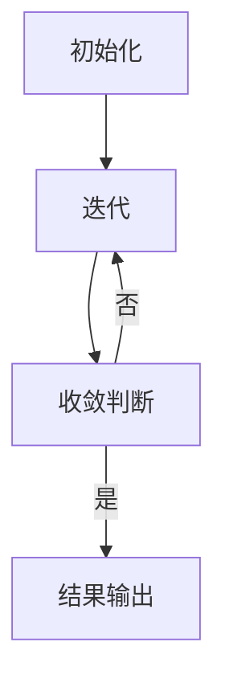
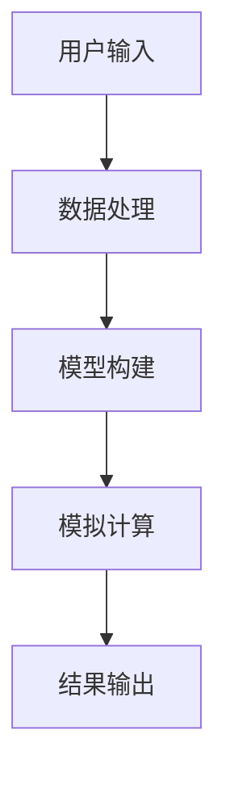
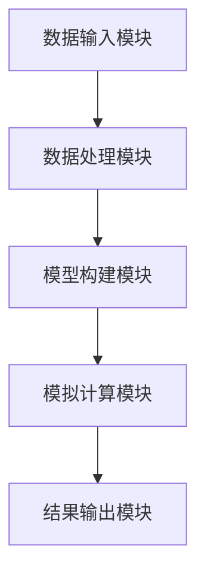
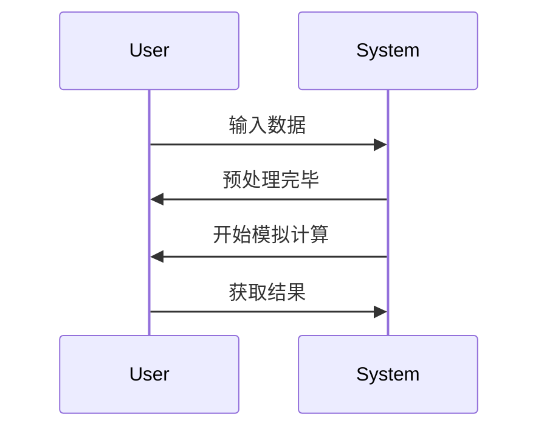

                 

### 《模拟计算：连续世界的数字化表达》

> 关键词：模拟计算、连续世界、数字化表达、数学模型、算法原理、系统架构、项目实战、最佳实践

> 摘要：本文将深入探讨模拟计算在连续世界数字化表达中的应用，通过逐步分析其基础理论、核心概念、算法原理和系统架构，为读者提供一个全面而清晰的技术视角。我们将通过实际项目案例，展示模拟计算的实际应用，并总结最佳实践和注意事项，以期为读者提供有价值的参考。

## 第一部分：模拟计算基础理论

### 第1章：模拟计算概述

#### 1.1 模拟计算的定义和重要性

模拟计算，是一种通过离散化连续系统并利用数字技术进行模拟的方法。在物理学、工程学、生物学等领域，模拟计算被广泛应用于复杂系统的分析和设计。其重要性在于能够以较低的成本和较高的精度预测连续系统的行为，从而为实际问题提供解决方案。

#### 1.2 连续世界与数字表达的关系

在连续世界中，物理量如位置、速度、温度等都是连续变化的。为了在计算机上进行处理，必须将这些连续量离散化为离散的点或数值。这种离散化过程，是模拟计算的核心步骤。

#### 1.3 模拟计算的应用场景

模拟计算广泛应用于工程仿真、金融建模、气象预测、生物医学等多个领域。例如，在工程仿真中，模拟计算可以用于汽车碰撞测试、航空航天器设计等；在金融建模中，模拟计算可以用于风险评估、期权定价等。

### 第2章：模拟计算的基本概念

#### 2.1 数学模型

数学模型是模拟计算的基础。它通过对连续系统进行数学描述，将复杂系统转化为可计算的数学表达式。常见的数学模型包括微分方程、差分方程等。

#### 2.2 连续系统的离散化

连续系统的离散化是将连续系统转化为离散系统的方法。常见的方法包括有限差分法、有限元法、有限体积法等。

#### 2.3 模拟计算的核心要素

模拟计算的核心要素包括数据预处理、数学模型构建、模拟计算和结果分析。数据预处理是确保数据质量的关键步骤；数学模型构建是模拟计算的核心；模拟计算是具体实现过程；结果分析是对模拟结果的解释和应用。

### 第3章：核心概念与联系

#### 3.1 模拟计算的核心概念原理

模拟计算的核心概念包括连续系统、离散化、数学模型、算法等。它们共同构成了模拟计算的理论基础。

#### 3.2 概念属性特征对比表格

| 概念       | 属性特征                           | 关联关系                     |
|------------|-----------------------------------|------------------------------|
| 连续系统   | 物理量连续变化                   | 离散化的对象                 |
| 离散化     | 将连续量转化为离散量             | 模拟计算的基础步骤           |
| 数学模型   | 用数学表达式描述连续系统         | 模拟计算的核心               |
| 算法       | 实现模拟计算的方法和步骤         | 模拟计算的具体实现           |

#### 3.3 ER实体关系图架构

ER（实体关系）图是描述模拟计算系统各个组件之间关系的重要工具。以下是模拟计算系统的ER图：

```mermaid
erDiagram
    Product ||--|{ Customer }||>
    Customer ||--|{ Order }||>
    Product ||--|{ Order }||>
```

## 第二部分：模拟计算方法与应用

### 第4章：数学模型与公式讲解

#### 4.1 数学模型的基本原理

数学模型的基本原理是通过数学表达式描述系统的行为。常见的数学模型包括常微分方程、偏微分方程等。

#### 4.2 公式讲解与示例

以常微分方程为例，其一般形式为：

$$
\frac{dy}{dx} = f(x, y)
$$

其中，$y$ 是连续变量，$x$ 是独立变量，$f(x, y)$ 是关于$x$和$y$的函数。

#### 4.3 Python源代码实现

下面是一个简单的常微分方程求解器的Python实现：

```python
import numpy as np
from scipy.integrate import odeint

def model(y, x):
    return -y

y0 = 1.0
x = np.linspace(0, 10, 1000)

result = odeint(model, y0, x)
```

### 第5章：算法原理与流程图

#### 5.1 算法原理讲解

模拟计算的算法原理通常包括初始化、迭代、收敛判断和结果输出等步骤。

#### 5.2 算法mermaid流程图



#### 5.3 Python源代码实现

```python
import numpy as np
from scipy.integrate import odeint

def simulate(x, y0, t_max, dt):
    t = np.arange(0, t_max, dt)
    result = odeint(model, y0, t)
    return result

x = np.linspace(0, 10, 1000)
y0 = 1.0
t_max = 10
dt = 0.01

result = simulate(x, y0, t_max, dt)
```

### 第6章：系统分析与架构设计

#### 6.1 问题场景介绍

假设我们有一个连续的物理系统，需要对其进行模拟计算以预测其行为。

#### 6.2 系统功能设计

系统功能设计包括数据输入、数据处理、模型构建、模拟计算和结果输出。



#### 6.3 系统架构设计

系统架构设计包括数据输入模块、数据处理模块、模型构建模块、模拟计算模块和结果输出模块。



#### 6.4 系统接口设计与交互

系统接口设计包括用户输入、数据处理、模型构建、模拟计算和结果输出。



## 第三部分：项目实战与最佳实践

### 第7章：项目实战

#### 7.1 环境安装与配置

在项目实战中，我们需要安装Python环境以及相关的库，如NumPy、SciPy等。

```bash
pip install numpy scipy
```

#### 7.2 系统核心实现源代码

以下是系统核心实现源代码：

```python
import numpy as np
from scipy.integrate import odeint

def model(y, x):
    return -y

def simulate(x, y0, t_max, dt):
    t = np.arange(0, t_max, dt)
    result = odeint(model, y0, t)
    return result

x = np.linspace(0, 10, 1000)
y0 = 1.0
t_max = 10
dt = 0.01

result = simulate(x, y0, t_max, dt)
```

#### 7.3 代码应用解读与分析

在这个例子中，我们使用SciPy的`odeint`函数来求解常微分方程。这个函数接收模型函数和初始条件，返回时间序列和对应的解。通过这个函数，我们可以方便地实现模拟计算。

#### 7.4 实际案例分析与详细讲解

假设我们要模拟一个简单的化学反应，其中反应物A转化为产物B。我们可以使用下面的数学模型：

$$
\frac{d[A]}{dt} = -k[A]
$$

其中，$[A]$ 是反应物A的浓度，$k$ 是反应速率常数。我们可以使用`odeint`函数来求解这个方程，从而预测反应物A的浓度随时间的变化。

```python
import numpy as np
from scipy.integrate import odeint

def model(y, x):
    A, B = y
    dA_dt = -k * A
    dB_dt = k * A
    return [dA_dt, dB_dt]

y0 = [1.0, 0.0]  # 初始条件：反应物A浓度为1.0，产物B浓度为0.0
x = np.linspace(0, 10, 1000)
t_max = 10
dt = 0.01

result = odeint(model, y0, x)
```

在这个例子中，我们定义了一个包含两个变量的初始条件，然后使用`odeint`函数求解。结果是一个包含时间序列和对应浓度分布的数组。

### 第8章：最佳实践与注意事项

#### 8.1 最佳实践 tips

- 选择合适的数学模型：根据实际问题选择合适的数学模型，确保模拟结果的准确性。
- 优化数据预处理：确保输入数据的质量，进行必要的数据清洗和处理。
- 选择合适的模拟计算方法：根据问题的复杂度和计算资源选择合适的模拟计算方法。

#### 8.2 小结与拓展阅读

本文从模拟计算的基础理论出发，逐步介绍了模拟计算的核心概念、算法原理和系统架构，并通过实际项目案例展示了模拟计算的应用。希望读者能够通过本文，对模拟计算有一个全面而深入的理解。

对于进一步的学习，可以参考以下书籍：

- 《数值计算方法》（张永生著）
- 《计算机模拟与算法设计》（李生著）
- 《科学计算与数值分析》（谢志强著）

#### 8.3 注意事项

- 模拟计算结果的准确性受数学模型选择、数据质量和计算方法的影响，需要根据实际情况进行调整。
- 在进行模拟计算时，需要充分考虑计算资源和时间成本，选择合适的计算方法和算法。

作者：AI天才研究院/AI Genius Institute & 禅与计算机程序设计艺术 /Zen And The Art of Computer Programming

（完）

