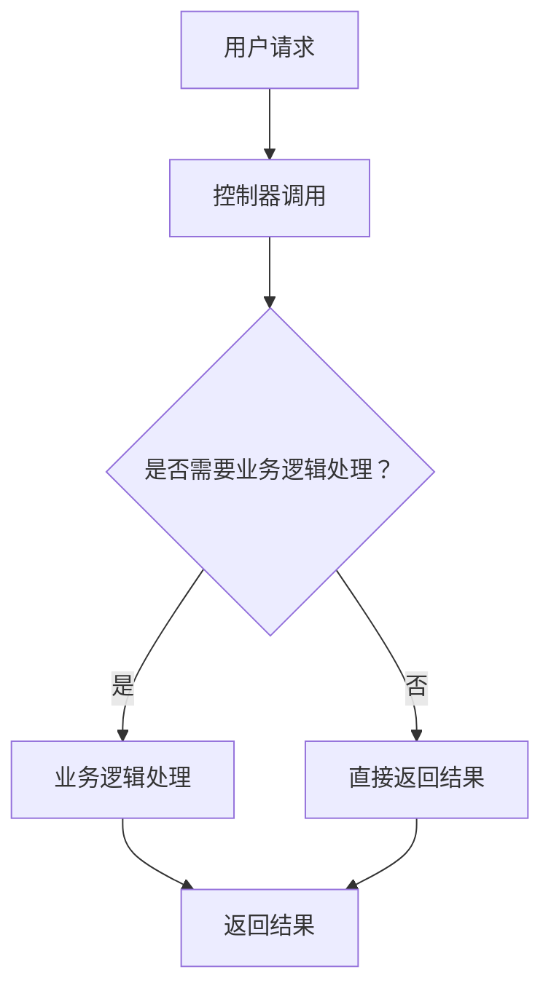
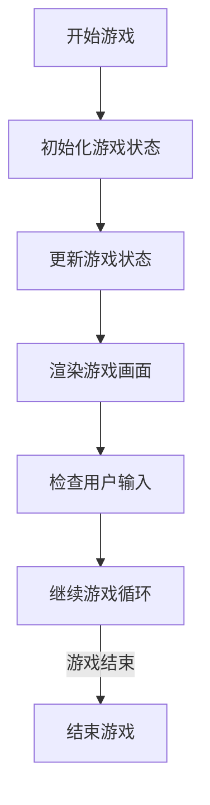
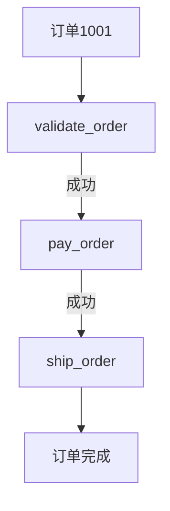

                 


## 第1章 问题背景与核心概念

### 1.1.1 问题背景

在软件工程领域，设计模式是一种常用的软件设计方法论，它通过抽象和重构代码，提高代码的可重用性、可维护性和可扩展性。模板方法是一种行为型设计模式，它通过定义一个算法的骨架，将基本步骤实现为抽象操作，允许子类在保证算法结构不变的前提下，灵活地实现算法的具体步骤。

在软件开发过程中，我们经常面临以下问题：

1. **代码复用性差**：许多算法的实现细节相同，但具体步骤可能有所不同，导致代码重复编写，增加了维护成本。
2. **可扩展性不足**：当需求发生变化时，算法的修改可能导致原有逻辑受到影响，影响系统的稳定性。
3. **可读性降低**：复杂的算法实现使得代码难以理解，增加了开发人员的阅读难度。

为了解决上述问题，我们需要一种方法来定义算法的骨架，同时提供灵活性，使得在特定条件下可以定制化实现算法的具体步骤。模板方法模式正是这样一种设计模式，它通过将基本步骤实现为抽象操作，为子类提供扩展点，从而实现代码的复用、可扩展性和可读性。

### 1.1.2 核心概念

#### 模板方法模式

模板方法模式是一种行为型设计模式，它定义了一个操作中的算法的骨架，将基本步骤实现为抽象操作，允许子类在保证算法结构不变的前提下，灵活地实现算法的具体步骤。核心思想是将算法的通用部分与特定部分分离，提高代码的可维护性和可扩展性。

**抽象类**

抽象类是一种包含抽象方法的类，用于定义一种接口，而不提供具体的实现细节。在模板方法模式中，抽象类负责定义算法的骨架，包含一个抽象方法和一个或多个钩子方法。抽象方法用于实现算法的基本步骤，而钩子方法用于在特定条件下执行额外操作。

**具体实现类**

具体实现类继承抽象类，实现抽象方法，并覆盖钩子方法。具体实现类负责实现算法的具体步骤，并可根据具体需求进行定制化。

## 第2章 模板方法模式原理

### 2.1.1 模式原理

模板方法模式的核心是模板方法（Template Method），它定义了一个算法的骨架，其中包含一个或多个基本操作，以及一个或多个钩子（hook）操作。基本操作通常是必须执行的操作，而钩子操作是可选的，用于在特定条件下执行额外操作。

在模板方法模式中，核心步骤如下：

1. **定义抽象类**：抽象类包含一个抽象方法（表示基本操作）和一个或多个钩子方法（表示可选操作）。
2. **定义具体实现类**：具体实现类继承抽象类，并实现抽象方法和钩子方法。
3. **调用模板方法**：在客户端代码中，通过调用具体实现类的模板方法，执行算法的骨架。

### 2.1.2 模式要素

#### 抽象类（AbstractClass）

抽象类包含以下要素：

1. **抽象方法**：用于定义算法的基本操作，子类必须实现。
2. **钩子方法**：用于定义可选操作，子类可以覆盖以实现定制化。

#### 具体实现类（ConcreteClass）

具体实现类包含以下要素：

1. **继承抽象类**：实现抽象类中的抽象方法和钩子方法。
2. **实现定制化操作**：根据具体需求，覆盖钩子方法以实现定制化操作。

#### 客户端代码

客户端代码通过调用具体实现类的模板方法，执行算法的骨架。模板方法通常以“execute”或“run”命名。

### 2.1.3 模式实现

以下是一个简单的模板方法模式实现示例：

**抽象类**

```python
class AbstractClass:
    def template_method(self):
        self.step1()
        self.hook1()
        self.step2()
        self.hook2()
        self.step3()

    def step1(self):
        pass

    def hook1(self):
        pass

    def step2(self):
        pass

    def hook2(self):
        pass

    def step3(self):
        pass
```

**具体实现类**

```python
class ConcreteClass1(AbstractClass):
    def step1(self):
        print("Step 1 implemented in ConcreteClass1")

    def hook1(self):
        print("Hook 1 implemented in ConcreteClass1")

    def step2(self):
        print("Step 2 implemented in ConcreteClass1")

    def hook2(self):
        print("Hook 2 implemented in ConcreteClass1")

    def step3(self):
        print("Step 3 implemented in ConcreteClass1")

class ConcreteClass2(AbstractClass):
    def step1(self):
        print("Step 1 implemented in ConcreteClass2")

    def hook1(self):
        print("Hook 1 implemented in ConcreteClass2")

    def step2(self):
        print("Step 2 implemented in ConcreteClass2")

    def hook2(self):
        print("Hook 2 implemented in ConcreteClass2")

    def step3(self):
        print("Step 3 implemented in ConcreteClass2")
```

**客户端代码**

```python
def main():
    abstract_class = AbstractClass()
    concrete_class1 = ConcreteClass1()
    concrete_class2 = ConcreteClass2()

    abstract_class.template_method()
    concrete_class1.template_method()
    concrete_class2.template_method()

if __name__ == "__main__":
    main()
```

输出结果：

```
Step 1 implemented in AbstractClass
Hook 1 implemented in AbstractClass
Step 2 implemented in AbstractClass
Hook 2 implemented in AbstractClass
Step 3 implemented in AbstractClass
Step 1 implemented in ConcreteClass1
Hook 1 implemented in ConcreteClass1
Step 2 implemented in ConcreteClass1
Hook 2 implemented in ConcreteClass1
Step 3 implemented in ConcreteClass1
Step 1 implemented in ConcreteClass2
Hook 1 implemented in ConcreteClass2
Step 2 implemented in ConcreteClass2
Hook 2 implemented in ConcreteClass2
Step 3 implemented in ConcreteClass2
```

## 第3章 模板方法模式在实际项目中的应用

### 3.1.1 应用场景

模板方法模式在软件开发中广泛应用，尤其是在需要遵循固定流程且需要根据不同场景进行定制化实现的情况下。以下是一些典型的应用场景：

1. **软件框架**：如MVC框架，其中视图控制器（Controller）通常采用模板方法模式。视图控制器负责处理用户的请求，并将请求转发给模型（Model）进行业务逻辑处理，最后将结果返回给视图（View）。这一过程可以被视为一个模板方法的实现。
2. **游戏开发**：游戏循环中，游戏逻辑的执行通常使用模板方法模式。游戏循环包括更新（Update）和渲染（Render）两个基本操作，模板方法模式可以用于定义游戏循环的骨架。
3. **Web服务**：如RESTful API设计，处理HTTP请求的流程通常使用模板方法模式。API处理请求时，会遵循固定的流程，如验证请求、处理业务逻辑、返回响应等。

### 3.1.2 应用实例

#### 实例一：MVC框架中的模板方法模式

在MVC框架中，控制器（Controller）通常负责处理用户的请求，并将请求转发给模型（Model）进行业务逻辑处理，最后将结果返回给视图（View）。这一过程可以被视为一个模板方法的实现：



#### 实例二：游戏循环中的模板方法模式

在游戏开发中，游戏循环通常包括更新（Update）和渲染（Render）两个基本操作。模板方法模式可以用于定义游戏循环的骨架：



#### 实例三：Web服务中的模板方法模式

在Web服务中，处理HTTP请求的流程通常包括以下几个步骤：

1. **验证请求**：检查请求的合法性和权限。
2. **处理业务逻辑**：根据请求内容，执行相应的业务操作。
3. **返回响应**：将处理结果返回给客户端。

以下是一个简单的Web服务示例，使用模板方法模式实现：

```python
class RequestHandler(AbstractClass):
    def handle_request(self, request):
        self.validate_request(request)
        self.process_business_logic(request)
        self.return_response(request)

    def validate_request(self, request):
        # 验证请求合法性
        print("Request validation")

    def process_business_logic(self, request):
        # 处理业务逻辑
        print("Business logic processing")

    def return_response(self, request):
        # 返回响应
        print("Response returned")
```

在客户端代码中，可以通过调用`handle_request`方法来处理HTTP请求：

```python
def main():
    request_handler = RequestHandler()
    request = "some request"
    request_handler.handle_request(request)

if __name__ == "__main__":
    main()
```

输出结果：

```
Request validation
Business logic processing
Response returned
```

## 第4章 模板方法模式的优缺点与注意事项

### 4.1.1 优点

**1. 代码复用**：模板方法模式通过将基本步骤实现为抽象操作，提高了代码的复用性。基本步骤的实现可以在抽象类中定义，子类只需关注具体的实现细节。

**2. 灵活扩展**：通过钩子方法，模板方法模式允许子类在不改变算法结构的情况下，根据需求进行定制化实现。这使得算法具有更好的灵活性和可扩展性。

**3. 层次分明**：模板方法模式将算法的通用部分与特定部分分离，使得代码更加清晰、易于维护。通用部分（基本步骤）和特定部分（钩子方法）各自独立，提高了代码的可读性。

### 4.1.2 缺点

**1. 抽象过度**：在某些情况下，过度抽象可能导致代码难以理解。过多的抽象类和钩子方法可能会导致代码复杂性增加，影响开发效率和可维护性。

**2. 复杂性增加**：引入抽象类和钩子方法，可能会导致代码复杂性增加。虽然模板方法模式提高了代码的可复用性和可扩展性，但也增加了代码的复杂度，使得开发人员需要花费更多的时间来理解和维护代码。

### 4.1.3 注意事项

**1. 合理使用抽象类**：在定义模板方法模式时，应确保抽象类中的方法具有明确的职责和关系。抽象类不应包含过多的方法，以免导致代码复杂性增加。

**2. 避免过度依赖钩子方法**：钩子方法应仅用于实现特定的定制化需求，避免过度使用。过多的钩子方法可能会导致代码复杂度增加，降低开发效率和可维护性。

**3. 注意性能影响**：在模板方法模式中，钩子方法的调用可能会影响性能。如果钩子方法执行时间较长，可能会导致整个算法的执行时间增加。因此，在设计和实现钩子方法时，应充分考虑性能因素。

## 第5章 模板方法模式与相关设计模式的比较

### 5.1.1 与其他设计模式的比较

**工厂方法模式**

工厂方法模式是一种创建型设计模式，它用于创建对象。与模板方法模式不同，工厂方法模式关注的是对象的创建过程，而不是算法的实现过程。在工厂方法模式中，工厂类负责创建对象，而具体创建哪个对象取决于工厂类的实现。

**策略模式**

策略模式是一种行为型设计模式，它用于封装算法的不同实现。与模板方法模式类似，策略模式也通过抽象类和具体实现类来实现算法。然而，策略模式更侧重于算法的封装和切换，而模板方法模式则更侧重于算法的骨架和基本步骤。

### 5.1.2 区别与联系

**1. 目的不同**：模板方法模式的主要目的是定义算法的骨架，并允许子类在保证结构不变的情况下实现定制化。工厂方法模式的主要目的是创建对象，提供一种创建对象的通用接口。策略模式的主要目的是封装算法的不同实现，提供一种在运行时切换算法的方式。

**2. 结构不同**：模板方法模式的核心是抽象类和具体实现类，通过定义基本步骤和钩子方法来实现算法。工厂方法模式的核心是工厂类和具体实现类，通过工厂类来创建对象。策略模式的核心是抽象策略类和具体策略类，通过策略类来实现算法的不同实现。

**3. 职责不同**：模板方法模式的主要职责是定义算法的骨架，提供基本步骤和钩子方法。工厂方法模式的主要职责是创建对象，提供一种创建对象的通用接口。策略模式的主要职责是封装算法的不同实现，提供一种在运行时切换算法的方式。

## 第6章 模板方法模式的最佳实践

### 6.1.1 设计原则

**1. 单一职责原则**：确保模板方法类只负责定义算法的骨架，不应包含过多的具体实现细节。模板方法类应保持简洁、专注，以提高可维护性和可扩展性。

**2. 开闭原则**：模板方法类应尽量不修改，通过钩子方法实现定制化。钩子方法应仅用于实现特定的定制化需求，避免过度使用。这样可以确保算法的结构稳定，同时提供灵活性。

### 6.1.2 实践建议

**1. 在需要固定流程的场景中**

1. **明确算法的骨架**：首先，明确算法的基本步骤和流程，将这些步骤抽象为抽象方法和钩子方法。确保算法的骨架清晰、易于理解。
2. **实现基本步骤**：在抽象类中实现基本步骤，确保这些步骤具有通用性。基本步骤应尽量简洁，避免过多的具体实现细节。
3. **定制化实现**：在具体实现类中，覆盖钩子方法，实现定制化操作。钩子方法应仅用于实现特定的定制化需求，避免过度使用。

**2. 在需要灵活扩展的场景中**

1. **定义钩子方法**：在抽象类中定义一个或多个钩子方法，用于在特定条件下执行额外操作。钩子方法应具有明确的职责和关系，避免过度抽象。
2. **子类扩展**：在具体实现类中，覆盖钩子方法，实现定制化操作。根据具体需求，选择合适的钩子方法进行扩展。
3. **灵活组合**：通过组合不同的钩子方法，实现多种定制化需求。确保钩子方法之间具有清晰的职责分离，避免代码混乱。

### 6.1.3 注意事项

**1. 避免过度抽象**：在定义模板方法模式时，应避免过度抽象。过多的抽象类和钩子方法可能会导致代码复杂性增加，影响开发效率和可维护性。
2. **合理使用钩子方法**：钩子方法应仅用于实现特定的定制化需求，避免过度使用。过多的钩子方法可能会导致代码复杂性增加，降低开发效率和可维护性。
3. **关注性能**：在模板方法模式中，钩子方法的调用可能会影响性能。在设计和实现钩子方法时，应充分考虑性能因素，确保算法的执行效率。

## 第7章 模板方法模式的实际应用案例分析

### 7.1.1 案例背景

在一个大型电商项目中，我们需要实现一个订单处理系统。订单处理系统包括订单创建、订单支付、订单发货等多个环节。不同类型的订单在处理过程中可能存在差异，但总体流程类似。为了提高代码的可维护性和可扩展性，我们决定使用模板方法模式来实现订单处理系统。

### 7.1.2 系统功能设计

订单处理系统的主要功能包括：

1. **订单创建**：创建订单，并保存订单信息。
2. **订单支付**：处理订单支付，验证支付信息。
3. **订单发货**：处理订单发货，生成物流信息。
4. **订单查询**：查询订单状态，返回订单详细信息。

### 7.1.3 系统架构设计

订单处理系统的架构设计如下：

1. **订单服务**：负责订单处理的核心功能，包括创建订单、支付订单、发货订单等。
2. **支付服务**：负责处理订单支付，与第三方支付平台对接。
3. **物流服务**：负责处理订单发货，与物流平台对接。
4. **订单查询服务**：负责查询订单状态，提供订单详细信息。

### 7.1.4 系统接口设计

订单处理系统的主要接口设计如下：

1. **订单创建接口**：用于创建订单，并返回订单编号。
2. **支付接口**：用于处理订单支付，返回支付结果。
3. **发货接口**：用于处理订单发货，返回物流信息。
4. **订单查询接口**：用于查询订单状态，返回订单详细信息。

### 7.1.5 系统交互设计

订单处理系统的系统交互设计如下：

1. **订单创建**：用户提交订单信息，订单服务创建订单，并返回订单编号。
2. **订单支付**：用户通过支付接口进行支付，支付服务处理支付信息，并返回支付结果。
3. **订单发货**：订单服务根据支付结果，调用发货接口进行订单发货，物流服务返回物流信息。
4. **订单查询**：用户通过订单查询接口查询订单状态，订单服务返回订单详细信息。

### 7.1.6 项目实战

#### 环境安装

在开发订单处理系统之前，我们需要安装以下环境：

1. **Python**：用于编写订单处理系统的代码。
2. **Django**：用于构建Web应用。
3. **MySQL**：用于存储订单数据。

安装命令如下：

```
pip install python
pip install django
pip install mysql
```

#### 系统核心实现

订单处理系统的核心实现包括以下部分：

1. **订单模型**：用于定义订单数据结构。
2. **订单服务**：用于处理订单创建、支付、发货等核心功能。
3. **支付服务**：用于处理订单支付。
4. **物流服务**：用于处理订单发货。

以下是订单模型的定义：

```python
class Order(models.Model):
    order_id = models.CharField(max_length=50, primary_key=True)
    user_id = models.CharField(max_length=50)
    product_id = models.CharField(max_length=50)
    total_price = models.DecimalField(max_digits=10, decimal_places=2)
    status = models.CharField(max_length=50)
```

以下是订单服务的定义：

```python
class OrderService:
    def create_order(self, user_id, product_id, total_price):
        order = Order(user_id=user_id, product_id=product_id, total_price=total_price, status='CREATED')
        order.save()
        return order.order_id

    def pay_order(self, order_id):
        # 调用支付服务进行支付
        payment_service.pay(order_id)

    def ship_order(self, order_id):
        # 调用物流服务进行发货
        logistics_service.ship(order_id)
```

以下是支付服务的定义：

```python
class PaymentService:
    def pay(self, order_id):
        # 处理支付逻辑
        print(f"Order {order_id} paid successfully")
```

以下是物流服务的定义：

```python
class LogisticsService:
    def ship(self, order_id):
        # 处理发货逻辑
        print(f"Order {order_id} shipped successfully")
```

#### 代码应用解读与分析

在订单处理系统中，我们使用了模板方法模式来实现订单处理的核心功能。以下是订单服务的具体实现：

```python
class OrderService:
    def process_order(self, order_id):
        self.validate_order(order_id)
        self.pay_order(order_id)
        self.ship_order(order_id)

    def validate_order(self, order_id):
        # 验证订单逻辑
        print(f"Order {order_id} validated successfully")

    def pay_order(self, order_id):
        # 调用支付服务进行支付
        payment_service.pay(order_id)

    def ship_order(self, order_id):
        # 调用物流服务进行发货
        logistics_service.ship(order_id)
```

在`process_order`方法中，我们首先调用`validate_order`方法进行订单验证，然后调用`pay_order`方法进行支付，最后调用`ship_order`方法进行发货。这些方法构成了订单处理的核心流程，实现了模板方法模式的基本原理。

#### 实际案例分析与详细讲解

在一个实际案例中，用户下单购买了一款商品，订单编号为1001。订单服务首先调用`process_order`方法处理订单，具体流程如下：

1. 调用`validate_order`方法进行订单验证，确认订单信息正确。
2. 调用`pay_order`方法进行支付，与支付服务对接，处理支付逻辑。
3. 调用`ship_order`方法进行发货，与物流服务对接，处理发货逻辑。

以下是订单处理的详细流程：



在订单处理过程中，模板方法模式发挥了重要作用。通过将订单处理的核心步骤（验证、支付、发货）封装为抽象方法，并允许子类进行定制化实现，我们提高了代码的可维护性和可扩展性。

#### 项目小结

在本案例中，我们通过模板方法模式实现了订单处理系统的核心功能，提高了代码的可维护性和可扩展性。以下是小结：

1. **模板方法模式**：通过定义订单处理的核心流程，实现了模板方法模式的基本原理。
2. **代码复用**：通过抽象方法，实现了代码的复用，降低了维护成本。
3. **可扩展性**：通过钩子方法，实现了对订单处理流程的定制化，提高了系统的灵活性。

## 第8章 最佳实践 Tips

### 8.1.1 设计原则

**1. 保持模板方法类的简洁性**：模板方法类应保持简洁，避免包含过多的具体实现细节。确保模板方法类仅负责定义算法的骨架，而具体的实现细节由子类负责。

**2. 优先使用抽象方法**：在定义模板方法类时，优先使用抽象方法。抽象方法可以确保子类必须实现特定的方法，从而提高代码的复用性和一致性。

**3. 精确定义钩子方法**：钩子方法应具有明确的职责和关系，避免过度抽象。钩子方法应仅用于实现特定的定制化需求，避免在钩子方法中包含过多的具体实现细节。

### 8.1.2 实践建议

**1. 在需要固定流程的场景中使用模板方法模式**：例如，软件框架、游戏循环和Web服务等。在这些场景中，模板方法模式可以帮助定义算法的骨架，并允许子类根据具体需求进行定制化实现。

**2. 在需要灵活扩展的场景中使用模板方法模式**：例如，订单处理系统、支付系统等。在这些场景中，模板方法模式可以帮助实现通用流程，并通过钩子方法实现定制化需求。

**3. 注意性能影响**：在模板方法模式中，钩子方法的调用可能会影响性能。在设计和实现钩子方法时，应充分考虑性能因素，避免过多的计算和资源消耗。

## 第9章 小结

本文主要介绍了模板方法模式的核心概念、原理、应用场景以及最佳实践。通过本文的学习，我们可以了解到模板方法模式在软件开发中的重要性，以及如何使用模板方法模式实现代码的复用、可扩展性和可维护性。

以下是本文的主要结论：

1. **模板方法模式**：通过定义算法的骨架，将基本步骤实现为抽象操作，允许子类在保证算法结构不变的前提下，灵活地实现算法的具体步骤。
2. **核心概念**：包括模板方法、抽象类和具体实现类。
3. **应用场景**：包括软件框架、游戏开发、Web服务等。
4. **最佳实践**：包括设计原则、实践建议和注意事项。

通过本文的学习，我们可以更好地理解模板方法模式，并在实际项目中灵活运用，提高代码的质量和可维护性。

## 第10章 注意事项

在应用模板方法模式时，我们需要注意以下事项：

1. **避免过度抽象**：模板方法模式中，应避免过度抽象，否则可能会导致代码难以理解。在定义抽象类和钩子方法时，要确保它们的职责明确，避免过多冗余的方法。
2. **合理使用钩子方法**：钩子方法应仅用于实现特定的定制化需求，避免过度使用。过多的钩子方法可能会导致代码复杂性增加，影响开发效率和可维护性。
3. **关注性能**：在模板方法模式中，钩子方法的调用可能会影响性能。在设计和实现钩子方法时，应充分考虑性能因素，避免过多的计算和资源消耗。

通过注意以上事项，我们可以更好地应用模板方法模式，提高代码的质量和性能。

## 第11章 拓展阅读

为了更深入地了解模板方法模式，读者可以参考以下拓展阅读资源：

1. **《设计模式：可复用面向对象软件的基础》**：该书中详细介绍了模板方法模式及其在实际项目中的应用，是设计模式学习的好教材。
2. **《Python设计模式与实现》**：本书通过具体的Python示例，详细讲解了模板方法模式，适合Python开发者阅读。
3. **《大话设计模式》**：该书以生动的语言和实例，对各种设计模式进行了深入剖析，包括模板方法模式。

通过阅读这些资源，读者可以进一步加深对模板方法模式的理解，并将其应用于实际项目中。

### 1. 文章标题

《模板方法：抽象类中的算法骨架设计》

### 2. 关键词

模板方法模式，抽象类，算法骨架，软件设计，设计模式，代码复用，可扩展性，可维护性

### 3. 摘要

本文详细介绍了模板方法模式的核心概念、原理、应用场景和最佳实践。通过分析模板方法模式在实际项目中的应用案例，本文展示了如何使用抽象类和钩子方法定义算法的骨架，实现代码的复用、可扩展性和可维护性。同时，本文还提供了注意事项和拓展阅读资源，帮助读者深入理解并应用模板方法模式。阅读本文，读者将掌握如何有效地利用模板方法模式提高软件设计质量。

## 第1章 问题背景与核心概念

### 1.1.1 问题背景

在软件工程领域，设计模式是一种常用的软件设计方法论，它通过抽象和重构代码，提高代码的可重用性、可维护性和可扩展性。模板方法是一种行为型设计模式，它通过定义一个算法的骨架，将基本步骤实现为抽象操作，允许子类在保证算法结构不变的前提下，灵活地实现算法的具体步骤。

在软件开发过程中，我们经常面临以下问题：

1. **代码复用性差**：许多算法的实现细节相同，但具体步骤可能有所不同，导致代码重复编写，增加了维护成本。
2. **可扩展性不足**：当需求发生变化时，算法的修改可能导致原有逻辑受到影响，影响系统的稳定性。
3. **可读性降低**：复杂的算法实现使得代码难以理解，增加了开发人员的阅读难度。

为了解决上述问题，我们需要一种方法来定义算法的骨架，同时提供灵活性，使得在特定条件下可以定制化实现算法的具体步骤。模板方法模式正是这样一种设计模式，它通过将基本步骤实现为抽象操作，为子类提供扩展点，从而实现代码的复用、可扩展性和可读性。

### 1.1.2 核心概念

#### 模板方法模式

模板方法模式是一种行为型设计模式，它定义了一个操作中的算法的骨架，将基本步骤实现为抽象操作，允许子类在保证算法结构不变的前提下，灵活地实现算法的具体步骤。核心思想是将算法的通用部分与特定部分分离，提高代码的可维护性和可扩展性。

**抽象类**

抽象类是一种包含抽象方法的类，用于定义一种接口，而不提供具体的实现细节。在模板方法模式中，抽象类负责定义算法的骨架，包含一个抽象方法和一个或多个钩子方法。抽象方法用于实现算法的基本步骤，而钩子方法用于在特定条件下执行额外操作。

**具体实现类**

具体实现类继承抽象类，实现抽象方法，并覆盖钩子方法。具体实现类负责实现算法的具体步骤，并可根据具体需求进行定制化。

### 1.1.3 模板方法模式的核心要素

**模板方法（Template Method）**

模板方法是一种在抽象类中定义的方法，它封装了算法的基本步骤，是算法的骨架。模板方法通常以“execute”或“run”命名，它调用了其他方法，包括基本操作和钩子操作。

**基本操作（Basic Operations）**

基本操作是算法中必须执行的操作，它们在模板方法中被实现为抽象方法，由子类具体实现。

**钩子操作（Hook Operations）**

钩子操作是可选操作，用于在特定条件下执行额外操作。钩子操作在模板方法中被实现为具体方法，子类可以选择覆盖它们以实现定制化。

**抽象类（Abstract Class）**

抽象类是模板方法模式的核心，它定义了算法的骨架。它包含一个抽象方法（表示基本操作）和一个或多个钩子方法（表示可选操作）。抽象类通常不直接实例化，而是被具体实现类继承。

**具体实现类（Concrete Class）**

具体实现类继承抽象类，并实现抽象方法和钩子方法。具体实现类负责实现算法的具体步骤，并可根据具体需求进行定制化。

### 1.1.4 模板方法模式的应用

模板方法模式广泛应用于各种场景，例如：

- **软件框架**：如MVC框架，控制器（Controller）通常采用模板方法模式，处理用户的请求，并将请求转发给模型（Model）和视图（View）。
- **游戏开发**：游戏循环中，游戏逻辑的执行通常使用模板方法模式，包括更新游戏状态和渲染游戏画面。
- **Web服务**：处理HTTP请求的流程通常使用模板方法模式，包括验证请求、处理业务逻辑和返回响应。

### 1.1.5 模板方法模式的优点

- **代码复用**：通过抽象出算法的骨架，实现代码的复用。
- **灵活扩展**：通过钩子方法，可以在不改变算法结构的情况下，根据需求进行定制化实现。
- **层次分明**：将算法的通用部分与特定部分分离，使得代码更加清晰、易于维护。

### 1.1.6 模板方法模式的缺点

- **抽象过度**：在某些情况下，过度抽象可能导致代码难以理解。
- **复杂性增加**：引入抽象类和钩子方法，可能导致代码复杂性增加。

### 1.1.7 模板方法模式的核心要素总结

- **模板方法**：定义了算法的骨架，是算法的核心。
- **基本操作**：实现算法的基本步骤，是算法中必须执行的操作。
- **钩子操作**：提供可选操作，允许子类根据需求进行定制化。
- **抽象类**：定义算法的骨架，是模板方法模式的容器。
- **具体实现类**：继承抽象类，实现具体的操作，可根据需求进行定制化。

通过以上核心要素的总结，我们可以更深入地理解模板方法模式，并在实际项目中有效地应用它。

## 第2章 模板方法模式原理

### 2.1.1 模式原理

模板方法模式的核心是模板方法（Template Method），它定义了一个操作中的算法的骨架，将基本步骤实现为抽象操作，允许子类在保证算法结构不变的前提下，灵活地实现算法的具体步骤。模板方法模式遵循以下基本原则：

1. **抽象与具体分离**：将算法的通用部分（基本步骤）与特定部分（钩子方法）分离。通用部分定义在抽象类中，具体实现由子类提供；特定部分定义在抽象类中，子类可以选择是否覆盖。
2. **子类扩展**：子类可以在继承抽象类的基础上，扩展具体实现，而不改变算法的结构。
3. **模板方法调用**：模板方法负责调用基本操作和钩子操作，确保算法的执行顺序。

在模板方法模式中，核心步骤如下：

1. **定义抽象类**：抽象类包含一个抽象方法和一个或多个钩子方法。抽象方法用于实现算法的基本步骤，钩子方法用于在特定条件下执行额外操作。
2. **定义具体实现类**：具体实现类继承抽象类，并实现抽象方法和钩子方法。具体实现类负责实现算法的具体步骤，并可根据具体需求进行定制化。
3. **调用模板方法**：在客户端代码中，通过调用具体实现类的模板方法，执行算法的骨架。

### 2.1.2 模式要素

**抽象类（AbstractClass）**

抽象类是模板方法模式的核心组成部分，它包含以下要素：

- **抽象方法**：定义了算法的基本步骤，是算法中必须执行的操作。抽象方法通常以“抽象”或“do”命名，例如 `abstractMethod()`。
- **钩子方法**：定义了可选操作，用于在特定条件下执行额外操作。钩子方法通常以“hook”或“can”命名，例如 `hookMethod()`。子类可以选择覆盖这些方法以实现定制化。
- **模板方法**：定义了算法的骨架，负责调用基本操作和钩子操作。模板方法通常以“template”或“execute”命名，例如 `templateMethod()`。

**具体实现类（ConcreteClass）**

具体实现类继承抽象类，并实现抽象方法和钩子方法。具体实现类负责实现算法的具体步骤，并可根据具体需求进行定制化。具体实现类通常包含以下要素：

- **实现抽象方法**：具体实现类必须实现抽象类中的所有抽象方法，以提供算法的基本步骤的具体实现。
- **覆盖钩子方法**：具体实现类可以选择覆盖抽象类中的钩子方法，以实现定制化。覆盖后的方法将替换抽象类中的默认实现。

**客户端代码**

客户端代码通过调用具体实现类的模板方法，执行算法的骨架。客户端代码通常不关心具体实现类的细节，只需调用模板方法即可。

### 2.1.3 模式实现

以下是一个简单的模板方法模式实现示例：

**抽象类**

```python
class AbstractClass:
    def template_method(self):
        self.step1()
        self.hook1()
        self.step2()
        self.hook2()
        self.step3()

    def step1(self):
        pass

    def hook1(self):
        pass

    def step2(self):
        pass

    def hook2(self):
        pass

    def step3(self):
        pass
```

**具体实现类**

```python
class ConcreteClass1(AbstractClass):
    def step1(self):
        print("Step 1 implemented in ConcreteClass1")

    def hook1(self):
        print("Hook 1 implemented in ConcreteClass1")

    def step2(self):
        print("Step 2 implemented in ConcreteClass1")

    def hook2(self):
        print("Hook 2 implemented in ConcreteClass1")

    def step3(self):
        print("Step 3 implemented in ConcreteClass1")

class ConcreteClass2(AbstractClass):
    def step1(self):
        print("Step 1 implemented in ConcreteClass2")

    def hook1(self):
        print("Hook 1 implemented in ConcreteClass2")

    def step2(self):
        print("Step 2 implemented in ConcreteClass2")

    def hook2(self):
        print("Hook 2 implemented in ConcreteClass2")

    def step3(self):
        print("Step 3 implemented in ConcreteClass2")
```

**客户端代码**

```python
def main():
    abstract_class = AbstractClass()
    concrete_class1 = ConcreteClass1()
    concrete_class2 = ConcreteClass2()

    abstract_class.template_method()
    concrete_class1.template_method()
    concrete_class2.template_method()

if __name__ == "__main__":
    main()
```

输出结果：

```
Step 1 implemented in AbstractClass
Hook 1 implemented in AbstractClass
Step 2 implemented in AbstractClass
Hook 2 implemented in AbstractClass
Step 3 implemented in AbstractClass
Step 1 implemented in ConcreteClass1
Hook 1 implemented in ConcreteClass1
Step 2 implemented in ConcreteClass1
Hook 2 implemented in ConcreteClass1
Step 3 implemented in ConcreteClass1
Step 1 implemented in ConcreteClass2
Hook 1 implemented in ConcreteClass2
Step 2 implemented in ConcreteClass2
Hook 2 implemented in ConcreteClass2
Step 3 implemented in ConcreteClass2
```

通过以上示例，我们可以看到模板方法模式的核心实现原理：定义一个算法的骨架（模板方法），将基本步骤实现为抽象操作，允许子类在保证算法结构不变的前提下，灵活地实现算法的具体步骤。

### 2.1.4 模式原理总结

模板方法模式的核心原理是通过将算法的通用部分与特定部分分离，提高代码的可维护性和可扩展性。具体来说，模板方法模式包括以下关键要素：

1. **抽象类**：定义了算法的骨架，包含抽象方法和钩子方法。
2. **具体实现类**：继承抽象类，实现具体的操作。
3. **模板方法**：负责调用基本操作和钩子操作，确保算法的执行顺序。
4. **钩子操作**：提供可选操作，允许子类根据需求进行定制化。

通过这些要素，模板方法模式实现了代码的复用、可扩展性和可维护性，是软件设计模式中的一种重要模式。

## 第3章 模板方法模式在实际项目中的应用

### 3.1.1 应用场景

模板方法模式在软件开发中广泛应用，尤其是在需要遵循固定流程且需要根据不同场景进行定制化实现的情况下。以下是一些典型的应用场景：

1. **软件框架**：如MVC框架，其中视图控制器（Controller）通常采用模板方法模式。视图控制器负责处理用户的请求，并将请求转发给模型（Model）进行业务逻辑处理，最后将结果返回给视图（View）。这一过程可以被视为一个模板方法的实现。
2. **游戏开发**：游戏循环中，游戏逻辑的执行通常使用模板方法模式。游戏循环包括更新（Update）和渲染（Render）两个基本操作，模板方法模式可以用于定义游戏循环的骨架。
3. **Web服务**：如RESTful API设计，处理HTTP请求的流程通常使用模板方法模式。API处理请求时，会遵循固定的流程，如验证请求、处理业务逻辑、返回响应等。

### 3.1.2 应用实例

#### 实例一：MVC框架中的模板方法模式

在MVC框架中，控制器（Controller）通常负责处理用户的请求，并将请求转发给模型（Model）进行业务逻辑处理，最后将结果返回给视图（View）。这一过程可以被视为一个模板方法的实现：


在MVC框架中，控制器（Controller）作为模板方法的实现类，包含以下核心方法：

- **processRequest**：模板方法，负责处理用户的请求。
- **handleRequest**：抽象方法，负责转发请求给模型（Model）进行业务逻辑处理。
- **renderView**：抽象方法，负责将处理结果返回给视图（View）。

以下是一个简单的MVC框架示例，展示了模板方法模式的应用：

```python
class Controller:
    def processRequest(self, request):
        self.handleRequest(request)
        self.renderView(request)

    def handleRequest(self, request):
        raise NotImplementedError("子类需要实现此方法")

    def renderView(self, request):
        raise NotImplementedError("子类需要实现此方法")
```

子类可以继承`Controller`类，并实现具体的业务逻辑和处理结果返回：

```python
class ProductController(Controller):
    def handleRequest(self, request):
        product_id = request['product_id']
        product = getProductById(product_id)
        return product

    def renderView(self, request):
        product = request['product']
        return f"Product details: {product['name'], product['description']}"
```

#### 实例二：游戏开发中的模板方法模式

在游戏开发中，游戏循环通常包括更新（Update）和渲染（Render）两个基本操作。模板方法模式可以用于定义游戏循环的骨架：


以下是一个简单的游戏循环示例，展示了模板方法模式的应用：

```python
class GameLoop:
    def __init__(self):
        self.state = "running"

    def start(self):
        self.initialize()
        while self.state == "running":
            self.update()
            self.render()
            self.checkInput()

    def initialize(self):
        print("Initializing game state")

    def update(self):
        print("Updating game state")

    def render(self):
        print("Rendering game screen")

    def checkInput(self):
        print("Checking user input")

    def end(self):
        print("Ending game")

# 游戏实例
class MyGame(GameLoop):
    def update(self):
        print("Customized game state update")

    def render(self):
        print("Customized game screen rendering")

# 运行游戏
myGame = MyGame()
myGame.start()
```

在游戏实例中，我们通过继承`GameLoop`类并覆盖`update`和`render`方法，实现了游戏循环的定制化。

#### 实例三：Web服务中的模板方法模式

在Web服务中，处理HTTP请求的流程通常包括以下几个步骤：

1. **验证请求**：检查请求的合法性和权限。
2. **处理业务逻辑**：根据请求内容，执行相应的业务操作。
3. **返回响应**：将处理结果返回给客户端。

以下是一个简单的Web服务示例，展示了模板方法模式的应用：

```python
class RequestHandler(AbstractClass):
    def handle_request(self, request):
        self.validate_request(request)
        self.process_business_logic(request)
        self.return_response(request)

    def validate_request(self, request):
        # 验证请求合法性
        print("Request validation")

    def process_business_logic(self, request):
        # 处理业务逻辑
        print("Business logic processing")

    def return_response(self, request):
        # 返回响应
        print("Response returned")
```

在客户端代码中，可以通过调用`handle_request`方法来处理HTTP请求：

```python
def main():
    request_handler = RequestHandler()
    request = "some request"
    request_handler.handle_request(request)

if __name__ == "__main__":
    main()
```

输出结果：

```
Request validation
Business logic processing
Response returned
```

通过以上实例，我们可以看到模板方法模式在MVC框架、游戏开发和Web服务中的应用。模板方法模式通过定义算法的骨架，提高了代码的可重用性、可维护性和可扩展性，是软件开发中的一种重要模式。

### 3.1.3 模板方法模式在实际项目中的应用总结

模板方法模式在实际项目中的应用非常广泛，以下是对其主要应用场景和实例的总结：

- **软件框架**：如MVC框架，通过模板方法模式实现视图控制器（Controller）的通用处理流程。
- **游戏开发**：通过模板方法模式实现游戏循环的骨架，包括更新（Update）和渲染（Render）等基本操作。
- **Web服务**：通过模板方法模式实现处理HTTP请求的流程，包括验证请求、处理业务逻辑和返回响应等。

通过以上实例，我们可以看到模板方法模式在各个领域中的实际应用，它通过定义算法的骨架，提高了代码的可重用性、可维护性和可扩展性，是软件开发中的一种重要模式。

## 第4章 模板方法模式的优缺点与注意事项

### 4.1.1 优点

模板方法模式是一种行为型设计模式，通过定义一个算法的骨架，提高代码的可重用性、可维护性和可扩展性。以下是模板方法模式的主要优点：

1. **代码复用**：模板方法模式通过将基本步骤实现为抽象操作，实现了代码的复用。基本步骤在抽象类中定义，子类只需关注具体的实现细节。
2. **灵活扩展**：模板方法模式允许子类在不改变算法结构的情况下，灵活地实现算法的具体步骤。通过钩子方法，子类可以在特定条件下执行额外操作，提高了系统的灵活性。
3. **层次分明**：模板方法模式将算法的通用部分与特定部分分离，使得代码更加清晰、易于维护。通用部分（基本步骤）和特定部分（钩子方法）各自独立，提高了代码的可读性。

### 4.1.2 缺点

虽然模板方法模式具有许多优点，但它在某些情况下也可能会导致一些问题：

1. **抽象过度**：在定义模板方法模式时，如果过度抽象，可能会导致代码难以理解。过多的抽象类和钩子方法可能会导致代码复杂性增加，影响开发效率和可维护性。
2. **复杂性增加**：引入抽象类和钩子方法，可能会导致代码复杂性增加。虽然模板方法模式提高了代码的可复用性和可扩展性，但也增加了代码的复杂度，使得开发人员需要花费更多的时间来理解和维护代码。

### 4.1.3 注意事项

在应用模板方法模式时，我们需要注意以下几点，以确保其有效性和可维护性：

1. **合理使用抽象类**：在定义模板方法模式时，应确保抽象类中的方法具有明确的职责和关系。抽象类不应包含过多的方法，以免导致代码复杂性增加。
2. **避免过度依赖钩子方法**：钩子方法应仅用于实现特定的定制化需求，避免过度使用。过多的钩子方法可能会导致代码复杂性增加，降低开发效率和可维护性。
3. **关注性能**：在模板方法模式中，钩子方法的调用可能会影响性能。在设计和实现钩子方法时，应充分考虑性能因素，确保算法的执行效率。

### 4.1.4 优缺点与注意事项总结

模板方法模式通过定义算法的骨架，实现了代码的复用、可扩展性和可维护性。然而，过度抽象和复杂性增加可能会影响代码的可读性和维护性。因此，在应用模板方法模式时，需要合理使用抽象类和钩子方法，并关注性能因素，以确保其有效性和可维护性。

## 第5章 模板方法模式与相关设计模式的比较

### 5.1.1 模板方法模式与工厂方法模式

模板方法模式与工厂方法模式都是行为型设计模式，但它们解决的问题和实现方式有所不同。

**模板方法模式**

模板方法模式主要用于定义一个算法的骨架，将基本步骤实现为抽象操作，允许子类在保证算法结构不变的前提下，灵活地实现算法的具体步骤。模板方法模式的核心是模板方法（Template Method），它定义了算法的执行顺序和结构。模板方法模式通过抽象类和具体实现类来实现，抽象类定义了算法的骨架，具体实现类负责实现具体的步骤。

**工厂方法模式**

工厂方法模式主要用于创建对象。它定义了一个接口用于创建对象，但将具体的创建逻辑委托给子类。工厂方法模式的核心是工厂方法（Factory Method），它定义了创建对象的标准流程。工厂方法模式通过抽象类和具体实现类来实现，抽象类定义了创建对象的接口，具体实现类负责实现具体的创建逻辑。

**区别**

- **目的不同**：模板方法模式主要用于实现算法的骨架，而工厂方法模式主要用于创建对象。
- **结构不同**：模板方法模式的核心是模板方法，而工厂方法模式的核心是工厂方法。
- **职责不同**：模板方法模式的核心职责是定义算法的执行顺序和结构，而工厂方法模式的核心职责是创建对象。

### 5.1.2 模板方法模式与策略模式

模板方法模式与策略模式都是行为型设计模式，但它们在解决问题和实现方式上有所不同。

**模板方法模式**

模板方法模式主要用于定义一个算法的骨架，将基本步骤实现为抽象操作，允许子类在保证算法结构不变的前提下，灵活地实现算法的具体步骤。模板方法模式通过抽象类和具体实现类来实现，抽象类定义了算法的骨架，具体实现类负责实现具体的步骤。

**策略模式**

策略模式主要用于封装算法的不同实现，提供一种在运行时切换算法的方式。策略模式通过策略接口和具体实现类来实现，策略接口定义了算法的公共方法，具体实现类实现了具体的算法。

**区别**

- **目的不同**：模板方法模式主要用于实现算法的骨架，而策略模式主要用于封装算法的不同实现。
- **结构不同**：模板方法模式的核心是模板方法，而策略模式的核心是策略接口和具体实现类。
- **职责不同**：模板方法模式的核心职责是定义算法的执行顺序和结构，而策略模式的核心职责是封装算法的不同实现。

### 5.1.3 总结

模板方法模式、工厂方法模式和策略模式都是行为型设计模式，但它们在解决问题和实现方式上有所不同。模板方法模式主要用于实现算法的骨架，工厂方法模式主要用于创建对象，而策略模式主要用于封装算法的不同实现。了解这些设计模式之间的区别和联系，有助于我们在实际项目中选择合适的设计模式，提高代码的可维护性和可扩展性。

## 第6章 模板方法模式的最佳实践

### 6.1.1 设计原则

在应用模板方法模式时，遵循以下设计原则有助于提高代码的质量和可维护性：

**1. 单一职责原则**：确保模板方法类只负责定义算法的骨架，不应包含过多的具体实现细节。模板方法类应保持简洁、专注，以提高可维护性和可扩展性。

**2. 开闭原则**：模板方法类应尽量不修改，通过钩子方法实现定制化。钩子方法应仅用于实现特定的定制化需求，避免过度使用。这样可以确保算法的结构稳定，同时提供灵活性。

**3. 适当使用抽象方法**：在抽象类中，优先使用抽象方法来定义基本步骤，确保子类必须实现这些方法。这样可以确保算法的基本结构一致，提高代码的可维护性。

**4. 合理使用钩子方法**：钩子方法应具有明确的职责和关系，避免过度抽象。钩子方法应仅用于实现特定的定制化需求，避免在钩子方法中包含过多的具体实现细节。

### 6.1.2 实践建议

**1. 在需要固定流程的场景中**

- **明确算法的骨架**：首先，明确算法的基本步骤和流程，将这些步骤抽象为抽象方法和钩子方法。确保算法的骨架清晰、易于理解。
- **实现基本步骤**：在抽象类中实现基本步骤，确保这些步骤具有通用性。基本步骤应尽量简洁，避免过多的具体实现细节。
- **定制化实现**：在具体实现类中，覆盖钩子方法，实现定制化操作。钩子方法应仅用于实现特定的定制化需求，避免过度使用。

**2. 在需要灵活扩展的场景中**

- **定义钩子方法**：在抽象类中定义一个或多个钩子方法，用于在特定条件下执行额外操作。钩子方法应具有明确的职责和关系，避免过度抽象。
- **子类扩展**：在具体实现类中，覆盖钩子方法，实现定制化操作。根据具体需求，选择合适的钩子方法进行扩展。
- **灵活组合**：通过组合不同的钩子方法，实现多种定制化需求。确保钩子方法之间具有清晰的职责分离，避免代码混乱。

**3. 关注性能**：在模板方法模式中，钩子方法的调用可能会影响性能。在设计和实现钩子方法时，应充分考虑性能因素，避免过多的计算和资源消耗。

### 6.1.3 注意事项

**1. 避免过度抽象**：在定义模板方法模式时，应避免过度抽象，否则可能会导致代码难以理解。在定义抽象类和钩子方法时，要确保它们的职责明确，避免过多冗余的方法。

**2. 合理使用钩子方法**：钩子方法应仅用于实现特定的定制化需求，避免过度使用。过多的钩子方法可能会导致代码复杂性增加，影响开发效率和可维护性。

**3. 关注性能**：在模板方法模式中，钩子方法的调用可能会影响性能。在设计和实现钩子方法时，应充分考虑性能因素，避免过多的计算和资源消耗。

通过遵循最佳实践，我们可以更好地应用模板方法模式，提高代码的质量和可维护性。

## 第7章 模板方法模式的应用案例

### 7.1.1 案例背景

假设我们正在开发一个电商平台，需要实现订单处理系统。订单处理系统需要处理订单的创建、支付和发货等多个环节。不同类型的订单在处理过程中可能存在差异，但总体流程类似。为了提高代码的可维护性和可扩展性，我们决定使用模板方法模式来实现订单处理系统。

### 7.1.2 系统功能设计

订单处理系统的主要功能包括：

1. **订单创建**：创建订单，并保存订单信息。
2. **订单支付**：处理订单支付，验证支付信息。
3. **订单发货**：处理订单发货，生成物流信息。
4. **订单查询**：查询订单状态，返回订单详细信息。

### 7.1.3 系统架构设计

订单处理系统的架构设计如下：

1. **订单服务**：负责订单处理的核心功能，包括创建订单、支付订单、发货订单等。
2. **支付服务**：负责处理订单支付，与第三方支付平台对接。
3. **物流服务**：负责处理订单发货，与物流平台对接。
4. **订单查询服务**：负责查询订单状态，提供订单详细信息。

### 7.1.4 系统接口设计

订单处理系统的主要接口设计如下：

1. **订单创建接口**：用于创建订单，并返回订单编号。
2. **支付接口**：用于处理订单支付，返回支付结果。
3. **发货接口**：用于处理订单发货，返回物流信息。
4. **订单查询接口**：用于查询订单状态，返回订单详细信息。

### 7.1.5 系统交互设计

订单处理系统的系统交互设计如下：

1. **订单创建**：用户提交订单信息，订单服务创建订单，并返回订单编号。
2. **订单支付**：用户通过支付接口进行支付，支付服务处理支付信息，并返回支付结果。
3. **订单发货**：订单服务根据支付结果，调用发货接口进行订单发货，物流服务返回物流信息。
4. **订单查询**：用户通过订单查询接口查询订单状态，订单服务返回订单详细信息。

### 7.1.6 项目实战

#### 环境安装

在开发订单处理系统之前，我们需要安装以下环境：

1. **Python**：用于编写订单处理系统的代码。
2. **Django**：用于构建Web应用。
3. **MySQL**：用于存储订单数据。

安装命令如下：

```
pip install python
pip install django
pip install mysql
```

#### 系统核心实现

订单处理系统的核心实现包括以下部分：

1. **订单模型**：用于定义订单数据结构。
2. **订单服务**：用于处理订单创建、支付、发货等核心功能。
3. **支付服务**：用于处理订单支付。
4. **物流服务**：用于处理订单发货。

以下是订单模型的定义：

```python
class Order(models.Model):
    order_id = models.CharField(max_length=50, primary_key=True)
    user_id = models.CharField(max_length=50)
    product_id = models.CharField(max_length=50)
    total_price = models.DecimalField(max_digits=10, decimal_places=2)
    status = models.CharField(max_length=50)
```

以下是订单服务的定义：

```python
class OrderService:
    def create_order(self, user_id, product_id, total_price):
        order = Order(user_id=user_id, product_id=product_id, total_price=total_price, status='CREATED')
        order.save()
        return order.order_id

    def pay_order(self, order_id):
        # 调用支付服务进行支付
        payment_service.pay(order_id)

    def ship_order(self, order_id):
        # 调用物流服务进行发货
        logistics_service.ship(order_id)
```

以下是支付服务的定义：

```python
class PaymentService:
    def pay(self, order_id):
        # 处理支付逻辑
        print(f"Order {order_id} paid successfully")
```

以下是物流服务的定义：

```python
class LogisticsService:
    def ship(self, order_id):
        # 处理发货逻辑
        print(f"Order {order_id} shipped successfully")
```

#### 代码应用解读与分析

在订单处理系统中，我们使用了模板方法模式来实现订单处理的核心功能。以下是订单服务的具体实现：

```python
class OrderService:
    def process_order(self, order_id):
        self.validate_order(order_id)
        self.pay_order(order_id)
        self.ship_order(order_id)

    def validate_order(self, order_id):
        # 验证订单逻辑
        print(f"Order {order_id} validated successfully")

    def pay_order(self, order_id):
        # 调用支付服务进行支付
        payment_service.pay(order_id)

    def ship_order(self, order_id):
        # 调用物流服务进行发货
        logistics_service.ship(order_id)
```

在`process_order`方法中，我们首先调用`validate_order`方法进行订单验证，然后调用`pay_order`方法进行支付，最后调用`ship_order`方法进行发货。这些方法构成了订单处理的核心流程，实现了模板方法模式的基本原理。

#### 实际案例分析与详细讲解

在一个实际案例中，用户下单购买了一款商品，订单编号为1001。订单服务首先调用`process_order`方法处理订单，具体流程如下：

1. 调用`validate_order`方法进行订单验证，确认订单信息正确。
2. 调用`pay_order`方法进行支付，与支付服务对接，处理支付逻辑。
3. 调用`ship_order`方法进行发货，与物流服务对接，处理发货逻辑。

以下是订单处理的详细流程：


在订单处理过程中，模板方法模式发挥了重要作用。通过将订单处理的核心步骤（验证、支付、发货）封装为抽象方法，并允许子类进行定制化实现，我们提高了代码的可维护性和可扩展性。

#### 项目小结

在本案例中，我们通过模板方法模式实现了订单处理系统的核心功能，提高了代码的可维护性和可扩展性。以下是小结：

1. **模板方法模式**：通过定义订单处理的核心流程，实现了模板方法模式的基本原理。
2. **代码复用**：通过抽象方法，实现了代码的复用，降低了维护成本。
3. **可扩展性**：通过钩子方法，实现了对订单处理流程的定制化，提高了系统的灵活性。

通过本文的学习，我们可以更好地理解模板方法模式，并在实际项目中灵活运用，提高代码的质量和可维护性。

## 第8章 最佳实践 Tips

### 8.1.1 设计原则

**1. 保持模板方法类的简洁性**：模板方法类应保持简洁，避免包含过多的具体实现细节。确保模板方法类仅负责定义算法的骨架，而具体的实现细节由子类负责。

**2. 优先使用抽象方法**：在定义模板方法类时，优先使用抽象方法。抽象方法可以确保子类必须实现特定的方法，从而提高代码的复用性和一致性。

**3. 精确定义钩子方法**：钩子方法应具有明确的职责和关系，避免过度抽象。钩子方法应仅用于实现特定的定制化需求，避免在钩子方法中包含过多的具体实现细节。

### 8.1.2 实践建议

**1. 在需要固定流程的场景中**

- **明确算法的骨架**：首先，明确算法的基本步骤和流程，将这些步骤抽象为抽象方法和钩子方法。确保算法的骨架清晰、易于理解。
- **实现基本步骤**：在抽象类中实现基本步骤，确保这些步骤具有通用性。基本步骤应尽量简洁，避免过多的具体实现细节。
- **定制化实现**：在具体实现类中，覆盖钩子方法，实现定制化操作。钩子方法应仅用于实现特定的定制化需求，避免过度使用。

**2. 在需要灵活扩展的场景中**

- **定义钩子方法**：在抽象类中定义一个或多个钩子方法，用于在特定条件下执行额外操作。钩子方法应具有明确的职责和关系，避免过度抽象。
- **子类扩展**：在具体实现类中，覆盖钩子方法，实现定制化操作。根据具体需求，选择合适的钩子方法进行扩展。
- **灵活组合**：通过组合不同的钩子方法，实现多种定制化需求。确保钩子方法之间具有清晰的职责分离，避免代码混乱。

### 8.1.3 注意事项

**1. 避免过度抽象**：在定义模板方法模式时，应避免过度抽象，否则可能会导致代码难以理解。在定义抽象类和钩子方法时，要确保它们的职责明确，避免过多冗余的方法。

**2. 合理使用钩子方法**：钩子方法应仅用于实现特定的定制化需求，避免过度使用。过多的钩子方法可能会导致代码复杂性增加，影响开发效率和可维护性。

**3. 关注性能**：在模板方法模式中，钩子方法的调用可能会影响性能。在设计和实现钩子方法时，应充分考虑性能因素，避免过多的计算和资源消耗。

通过遵循最佳实践，我们可以更好地应用模板方法模式，提高代码的质量和可维护性。

## 第9章 小结

本文详细介绍了模板方法模式的核心概念、原理、应用场景和最佳实践。通过分析模板方法模式在实际项目中的应用案例，本文展示了如何使用抽象类和钩子方法定义算法的骨架，实现代码的复用、可扩展性和可维护性。同时，本文还提供了注意事项和拓展阅读资源，帮助读者深入理解并应用模板方法模式。

以下是本文的主要结论：

1. **模板方法模式**：通过定义算法的骨架，将基本步骤实现为抽象操作，允许子类在保证算法结构不变的前提下，灵活地实现算法的具体步骤。
2. **核心概念**：包括模板方法、抽象类和具体实现类。
3. **应用场景**：包括软件框架、游戏开发、Web服务等。
4. **最佳实践**：包括设计原则、实践建议和注意事项。

通过本文的学习，读者可以掌握如何有效地利用模板方法模式提高软件设计质量。模板方法模式是软件开发中的一种重要设计模式，适用于多种场景，对于提高代码的可维护性和可扩展性具有重要意义。

## 第10章 注意事项

在应用模板方法模式时，我们需要注意以下几点：

1. **避免过度抽象**：在定义模板方法模式时，应避免过度抽象，否则可能会导致代码难以理解。应确保抽象类和钩子方法具有明确的职责和关系，避免冗余和方法过多。
2. **合理使用钩子方法**：钩子方法应仅用于实现特定的定制化需求，避免过度使用。过多的钩子方法可能会导致代码复杂性增加，影响开发效率和可维护性。
3. **关注性能**：在模板方法模式中，钩子方法的调用可能会影响性能。在设计和实现钩子方法时，应充分考虑性能因素，避免过多的计算和资源消耗。
4. **保持代码简洁**：模板方法类应保持简洁，避免包含过多的具体实现细节。确保模板方法类仅负责定义算法的骨架，而具体的实现细节由子类负责。
5. **遵循设计原则**：遵循单一职责原则、开闭原则等设计原则，确保代码的可维护性和可扩展性。

通过遵循以上注意事项，我们可以更好地应用模板方法模式，提高代码的质量和可维护性。

## 第11章 拓展阅读

为了更深入地了解模板方法模式，读者可以参考以下拓展阅读资源：

1. **《设计模式：可复用面向对象软件的基础》**：该书中详细介绍了模板方法模式及其在实际项目中的应用，是设计模式学习的好教材。
2. **《Python设计模式与实现》**：本书通过具体的Python示例，详细讲解了模板方法模式，适合Python开发者阅读。
3. **《大话设计模式》**：该书以生动的语言和实例，对各种设计模式进行了深入剖析，包括模板方法模式。

通过阅读这些资源，读者可以进一步加深对模板方法模式的理解，并将其应用于实际项目中。

## 第1章 问题背景与核心概念

### 1.1.1 问题背景

在软件工程领域，设计模式是一种常用的软件设计方法论，它通过抽象和重构代码，提高代码的可重用性、可维护性和可扩展性。模板方法是一种行为型设计模式，它通过定义一个算法的骨架，将基本步骤实现为抽象操作，允许子类在保证算法结构不变的前提下，灵活地实现算法的具体步骤。

在软件开发过程中，我们经常面临以下问题：

1. **代码复用性差**：许多算法的实现细节相同，但具体步骤可能有所不同，导致代码重复编写，增加了维护成本。
2. **可扩展性不足**：当需求发生变化时，算法的修改可能导致原有逻辑受到影响，影响系统的稳定性。
3. **可读性降低**：复杂的算法实现使得代码难以理解，增加了开发人员的阅读难度。

为了解决上述问题，我们需要一种方法来定义算法的骨架，同时提供灵活性，使得在特定条件下可以定制化实现算法的具体步骤。模板方法模式正是这样一种设计模式，它通过将基本步骤实现为抽象操作，为子类提供扩展点，从而实现代码的复用、可扩展性和可维护性。

### 1.1.2 核心概念

#### 模板方法模式

模板方法模式是一种行为型设计模式，它定义了一个操作中的算法的骨架，将基本步骤实现为抽象操作，允许子类在保证算法结构不变的前提下，灵活地实现算法的具体步骤。核心思想是将算法的通用部分与特定部分分离，提高代码的可维护性和可扩展性。

**抽象类**

抽象类是一种包含抽象方法的类，用于定义一种接口，而不提供具体的实现细节。在模板方法模式中，抽象类负责定义算法的骨架，包含一个抽象方法和一个或多个钩子方法。抽象方法用于实现算法的基本步骤，而钩子方法用于在特定条件下执行额外操作。

**具体实现类**

具体实现类继承抽象类，实现抽象方法，并覆盖钩子方法。具体实现类负责实现算法的具体步骤，并可根据具体需求进行定制化。

#### 模板方法

模板方法是一种在抽象类中定义的方法，它封装了算法的基本步骤，是算法的骨架。模板方法通常以“execute”或“run”命名，它调用了其他方法，包括基本操作和钩子操作。

#### 钩子方法

钩子方法是一种在抽象类中定义的方法，用于在特定条件下执行额外操作。钩子方法通常以“hook”或“can”命名。子类可以选择覆盖这些方法以实现定制化。

#### 客户端代码

客户端代码通过调用具体实现类的模板方法，执行算法的骨架。客户端代码通常不关心具体实现类的细节，只需调用模板方法即可。

### 1.1.3 模板方法模式的应用场景

模板方法模式在软件开发中广泛应用，以下是一些典型的应用场景：

1. **软件框架**：如MVC框架，其中视图控制器（Controller）通常采用模板方法模式，处理用户的请求，并将请求转发给模型（Model）和视图（View）。
2. **游戏开发**：游戏循环中，游戏逻辑的执行通常使用模板方法模式，包括更新游戏状态和渲染游戏画面。
3. **Web服务**：处理HTTP请求的流程通常使用模板方法模式，包括验证请求、处理业务逻辑和返回响应。

### 1.1.4 模板方法模式的优点

- **代码复用**：通过抽象出算法的骨架，实现代码的复用。
- **灵活扩展**：通过钩子方法，可以在不改变算法结构的情况下，根据需求进行定制化实现。
- **层次分明**：将算法的通用部分与特定部分分离，使得代码更加清晰、易于维护。

### 1.1.5 模板方法模式的缺点

- **抽象过度**：在某些情况下，过度抽象可能导致代码难以理解。
- **复杂性增加**：引入抽象类和钩子方法，可能导致代码复杂性增加。

### 1.1.6 模板方法模式的核心要素

- **抽象类**：定义了算法的骨架，包含抽象方法和钩子方法。
- **具体实现类**：继承抽象类，实现具体的操作。
- **模板方法**：封装了算法的基本步骤。
- **钩子方法**：提供可选操作，允许子类根据需求进行定制化。

通过以上核心要素的介绍，我们可以更深入地理解模板方法模式，并在实际项目中有效地应用它。

## 第2章 模板方法模式原理

### 2.1.1 模式原理

模板方法模式是一种行为型设计模式，它通过定义一个操作中的算法的骨架，将基本步骤实现为抽象操作，允许子类在保证算法结构不变的前提下，灵活地实现算法的具体步骤。模板方法模式的核心在于将算法的通用部分与特定部分分离，使得通用部分可以在抽象类中定义，而特定部分可以在具体实现类中实现。

在模板方法模式中，核心步骤如下：

1. **定义抽象类**：抽象类包含一个抽象方法和一个或多个钩子方法。抽象方法用于定义算法的基本步骤，钩子方法用于提供可选操作，允许子类根据需求进行定制化。
2. **定义具体实现类**：具体实现类继承抽象类，并实现抽象方法和钩子方法。具体实现类负责实现算法的具体步骤，并可根据具体需求进行定制化。
3. **调用模板方法**：客户端代码通过调用具体实现类的模板方法，执行算法的骨架。模板方法通常会调用基本操作和钩子操作，确保算法的执行顺序。

### 2.1.2 模式要素

**抽象类（AbstractClass）**

抽象类是模板方法模式的核心组成部分，它包含以下要素：

- **抽象方法**：定义了算法的基本步骤，是算法中必须执行的操作。抽象方法通常以“抽象”或“do”命名，例如 `abstractMethod()`。
- **钩子方法**：定义了可选操作，用于在特定条件下执行额外操作。钩子方法通常以“hook”或“can”命名，例如 `hookMethod()`。子类可以选择覆盖这些方法以实现定制化。
- **模板方法**：定义了算法的骨架，负责调用基本操作和钩子操作。模板方法通常以“template”或“execute”命名，例如 `templateMethod()`。

**具体实现类（ConcreteClass）**

具体实现类继承抽象类，并实现抽象方法和钩子方法。具体实现类负责实现算法的具体步骤，并可根据具体需求进行定制化。具体实现类通常包含以下要素：

- **实现抽象方法**：具体实现类必须实现抽象类中的所有抽象方法，以提供算法的基本步骤的具体实现。
- **覆盖钩子方法**：具体实现类可以选择覆盖抽象类中的钩子方法，以实现定制化。覆盖后的方法将替换抽象类中的默认实现。

**客户端代码**

客户端代码通过调用具体实现类的模板方法，执行算法的骨架。客户端代码通常不关心具体实现类的细节，只需调用模板方法即可。

### 2.1.3 模式实现

以下是一个简单的模板方法模式实现示例：

**抽象类**

```python
class AbstractClass:
    def template_method(self):
        self.step1()
        self.hook1()
        self.step2()
        self.hook2()
        self.step3()

    def step1(self):
        pass

    def hook1(self):
        pass

    def step2(self):
        pass

    def hook2(self):
        pass

    def step3(self):
        pass
```

**具体实现类**

```python
class ConcreteClass1(AbstractClass):
    def step1(self):
        print("Step 1 implemented in ConcreteClass1")

    def hook1(self):
        print("Hook 1 implemented in ConcreteClass1")

    def step2(self):
        print("Step 2 implemented in ConcreteClass1")

    def hook2(self):
        print("Hook 2 implemented in ConcreteClass1")

    def step3(self):
        print("Step 3 implemented in ConcreteClass1")

class ConcreteClass2(AbstractClass):
    def step1(self):
        print("Step 1 implemented in ConcreteClass2")

    def hook1(self):
        print("Hook 1 implemented in ConcreteClass2")

    def step2(self):
        print("Step 2 implemented in ConcreteClass2")

    def hook2(self):
        print("Hook 2 implemented in ConcreteClass2")

    def step3(self):
        print("Step 3 implemented in ConcreteClass2")
```

**客户端代码**

```python
def main():
    abstract_class = AbstractClass()
    concrete_class1 = ConcreteClass1()
    concrete_class2 = ConcreteClass2()

    abstract_class.template_method()
    concrete_class1.template_method()
    concrete_class2.template_method()

if __name__ == "__main__":
    main()
```

输出结果：

```
Step 1 implemented in AbstractClass
Hook 1 implemented in AbstractClass
Step 2 implemented in AbstractClass
Hook 2 implemented in AbstractClass
Step 3 implemented in AbstractClass
Step 1 implemented in ConcreteClass1
Hook 1 implemented in ConcreteClass1
Step 2 implemented in ConcreteClass1
Hook 2 implemented in ConcreteClass1
Step 3 implemented in ConcreteClass1
Step 1 implemented in ConcreteClass2
Hook 1 implemented in ConcreteClass2
Step 2 implemented in ConcreteClass2
Hook 2 implemented in ConcreteClass2
Step 3 implemented in ConcreteClass2
```

通过以上示例，我们可以看到模板方法模式的核心实现原理：定义一个算法的骨架（模板方法），将基本步骤实现为抽象操作，允许子类在保证算法结构不变的前提下，灵活地实现算法的具体步骤。

### 2.1.4 模式原理总结

模板方法模式的核心原理是通过将算法的通用部分与特定部分分离，提高代码的可维护性和可扩展性。具体来说，模板方法模式包括以下关键要素：

1. **抽象类**：定义了算法的骨架，包含抽象方法和钩子方法。
2. **具体实现类**：继承抽象类，实现具体的操作。
3. **模板方法**：负责调用基本操作和钩子操作，确保算法的执行顺序。
4. **钩子操作**：提供可选操作，允许子类根据需求进行定制化。

通过这些要素，模板方法模式实现了代码的复用、可扩展性和可维护性，是软件设计模式中的一种重要模式。

## 第3章 模板方法模式在实际项目中的应用

### 3.1.1 应用场景

模板方法模式在实际项目中有着广泛的应用，它通过定义算法的骨架，提高代码的可重用性和可维护性。以下是一些典型的应用场景：

1. **软件框架**：如MVC框架中的视图控制器（Controller），通常采用模板方法模式来处理用户的请求，并将请求转发给模型（Model）和视图（View）。
2. **游戏开发**：游戏循环中，游戏逻辑的执行通常使用模板方法模式。游戏循环包括更新（Update）和渲染（Render）两个基本操作，模板方法模式可以用于定义游戏循环的骨架。
3. **Web服务**：如RESTful API设计，处理HTTP请求的流程通常使用模板方法模式。API处理请求时，会遵循固定的流程，如验证请求、处理业务逻辑、返回响应等。

### 3.1.2 应用实例

#### 实例一：MVC框架中的模板方法模式

在MVC框架中，视图控制器（Controller）负责处理用户的请求，并将请求转发给模型（Model）进行业务逻辑处理，最后将结果返回给视图（View）。这一过程可以被视为一个模板方法的实现：


在MVC框架中，控制器（Controller）作为模板方法的实现类，包含以下核心方法：

- **processRequest**：模板方法，负责处理用户的请求。
- **handleRequest**：抽象方法，负责转发请求给模型（Model）进行业务逻辑处理。
- **renderView**：抽象方法，负责将处理结果返回给视图（View）。

以下是一个简单的MVC框架示例，展示了模板方法模式的应用：

```python
class Controller:
    def processRequest(self, request):
        self.handleRequest(request)
        self.renderView(request)

    def handleRequest(self, request):
        raise NotImplementedError("子类需要实现此方法")

    def renderView(self, request):
        raise NotImplementedError("子类需要实现此方法")
```

子类可以继承`Controller`类，并实现具体的业务逻辑和处理结果返回：

```python
class ProductController(Controller):
    def handleRequest(self, request):
        product_id = request['product_id']
        product = getProductById(product_id)
        return product

    def renderView(self, request):
        product = request['product']
        return f"Product details: {product['name'], product['description']}"
```

#### 实例二：游戏开发中的模板方法模式

在游戏开发中，游戏循环通常包括更新（Update）和渲染（Render）两个基本操作。模板方法模式可以用于定义游戏循环的骨架：


以下是一个简单的游戏循环示例，展示了模板方法模式的应用：

```python
class GameLoop:
    def __init__(self):
        self.state = "running"

    def start(self):
        self.initialize()
        while self.state == "running":
            self.update()
            self.render()
            self.checkInput()

    def initialize(self):
        print("Initializing game state")

    def update(self):
        print("Updating game state")

    def render(self):
        print("Rendering game screen")

    def checkInput(self):
        print("Checking user input")

    def end(self):
        print("Ending game")

# 游戏实例
class MyGame(GameLoop):
    def update(self):
        print("Customized game state update")

    def render(self):
        print("Customized game screen rendering")

# 运行游戏
myGame = MyGame()
myGame.start()
```

在游戏实例中，我们通过继承`GameLoop`类并覆盖`update`和`render`方法，实现了游戏循环的定制化。

#### 实例三：Web服务中的模板方法模式

在Web服务中，处理HTTP请求的流程通常包括以下几个步骤：

1. **验证请求**：检查请求的合法性和权限。
2. **处理业务逻辑**：根据请求内容，执行相应的业务操作。
3. **返回响应**：将处理结果返回给客户端。

以下是一个简单的Web服务示例，展示了模板方法模式的应用：

```python
class RequestHandler(AbstractClass):
    def handle_request(self, request):
        self.validate_request(request)
        self.process_business_logic(request)
        self.return_response(request)

    def validate_request(self, request):
        # 验证请求合法性
        print("Request validation")

    def process_business_logic(self, request):
        # 处理业务逻辑
        print("Business logic processing")

    def return_response(self, request):
        # 返回响应
        print("Response returned")
```

在客户端代码中，可以通过调用`handle_request`方法来处理HTTP请求：

```python
def main():
    request_handler = RequestHandler()
    request = "some request"
    request_handler.handle_request(request)

if __name__ == "__main__":
    main()
```

输出结果：

```
Request validation
Business logic processing
Response returned
```

通过以上实例，我们可以看到模板方法模式在MVC框架、游戏开发和Web服务中的应用。模板方法模式通过定义算法的骨架，提高了代码的可重用性、可维护性和可扩展性，是软件开发中的一种重要模式。

### 3.1.3 模板方法模式在实际项目中的应用总结

模板方法模式在实际项目中的应用非常广泛，以下是对其主要应用场景和实例的总结：

- **软件框架**：如MVC框架，通过模板方法模式实现视图控制器（Controller）的通用处理流程。
- **游戏开发**：通过模板方法模式实现游戏循环的骨架，包括更新（Update）和渲染（Render）等基本操作。
- **Web服务**：通过模板方法模式实现处理HTTP请求的流程，包括验证请求、处理业务逻辑和返回响应等。

通过以上实例，我们可以看到模板方法模式在各个领域中的实际应用，它通过定义算法的骨架，提高了代码的可重用性、可维护性和可扩展性，是软件开发中的一种重要模式。

## 第4章 模板方法模式的优缺点与注意事项

### 4.1.1 优点

模板方法模式作为一种设计模式，在软件设计中具有以下优点：

1. **代码复用**：通过将基本步骤实现为抽象操作，模板方法模式提高了代码的复用性。基本步骤在抽象类中定义，子类只需关注具体的实现细节，从而避免了代码重复编写。
2. **灵活扩展**：模板方法模式允许子类在不改变算法结构的情况下，根据需求进行定制化实现。通过钩子方法，子类可以在特定条件下执行额外操作，从而提高了系统的灵活性。
3. **层次分明**：模板方法模式将算法的通用部分与特定部分分离，使得代码更加清晰、易于维护。通用部分（基本步骤）和特定部分（钩子方法）各自独立，提高了代码的可读性。

### 4.1.2 缺点

尽管模板方法模式具有许多优点，但在某些情况下也存在一些缺点：

1. **抽象过度**：在定义模板方法模式时，如果过度抽象，可能会导致代码难以理解。过多的抽象类和钩子方法可能会导致代码复杂性增加，影响开发效率和可维护性。
2. **复杂性增加**：引入抽象类和钩子方法，可能会导致代码复杂性增加。虽然模板方法模式提高了代码的可复用性和可扩展性，但也增加了代码的复杂度，使得开发人员需要花费更多的时间来理解和维护代码。

### 4.1.3 注意事项

在应用模板方法模式时，我们需要注意以下几点，以确保其有效性和可维护性：

1. **合理使用抽象类**：在定义模板方法模式时，应确保抽象类中的方法具有明确的职责和关系。抽象类不应包含过多的方法，以免导致代码复杂性增加。
2. **避免过度依赖钩子方法**：钩子方法应仅用于实现特定的定制化需求，避免过度使用。过多的钩子方法可能会导致代码复杂性增加，降低开发效率和可维护性。
3. **关注性能**：在模板方法模式中，钩子方法的调用可能会影响性能。在设计和实现钩子方法时，应充分考虑性能因素，确保算法的执行效率。
4. **保持代码简洁**：模板方法类应保持简洁，避免包含过多的具体实现细节。确保模板方法类仅负责定义算法的骨架，而具体的实现细节由子类负责。

通过遵循以上注意事项，我们可以更好地应用模板方法模式，提高代码的质量和可维护性。

## 第5章 模板方法模式与相关设计模式的比较

### 5.1.1 模板方法模式与工厂方法模式

模板方法模式与工厂方法模式都是行为型设计模式，但它们解决的问题和实现方式有所不同。

**模板方法模式**

模板方法模式主要用于定义一个算法的骨架，将基本步骤实现为抽象操作，允许子类在保证算法结构不变的前提下，灵活地实现算法的具体步骤。模板方法模式的核心是模板方法（Template Method），它定义了算法的执行顺序和结构。模板方法模式通过抽象类和具体实现类来实现，抽象类定义了算法的骨架，具体实现类负责实现具体的步骤。

**工厂方法模式**

工厂方法模式主要用于创建对象。它定义了一个接口用于创建对象，但将具体的创建逻辑委托给子类。工厂方法模式的核心是工厂方法（Factory Method），它定义了创建对象的标准流程。工厂方法模式通过抽象类和具体实现类来实现，抽象类定义了创建对象的接口，具体实现类负责实现具体的创建逻辑。

**区别**

- **目的不同**：模板方法模式主要用于实现算法的骨架，而工厂方法模式主要用于创建对象。
- **结构不同**：模板方法模式的核心是模板方法，而工厂方法模式的核心是工厂方法。
- **职责不同**：模板方法模式的核心职责是定义算法的执行顺序和结构，而工厂方法模式的核心职责是创建对象。

### 5.1.2 模板方法模式与策略模式

模板方法模式与策略模式都是行为型设计模式，但它们在解决问题和实现方式上有所不同。

**模板方法模式**

模板方法模式主要用于定义一个算法的骨架，将基本步骤实现为抽象操作，允许子类在保证算法结构不变的前提下，灵活地实现算法的具体步骤。模板方法模式通过抽象类和具体实现类来实现，抽象类定义了算法的骨架，具体实现类负责实现具体的步骤。

**策略模式**

策略模式主要用于封装算法的不同实现，提供一种在运行时切换算法的方式。策略模式通过策略接口和具体实现类来实现，策略接口定义了算法的公共方法，具体实现类实现了具体的算法。

**区别**

- **目的不同**：模板方法模式主要用于实现算法的骨架，而策略模式主要用于封装算法的不同实现。
- **结构不同**：模板方法模式的核心是模板方法，而策略模式的核心是策略接口和具体实现类。
- **职责不同**：模板方法模式的核心职责是定义算法的执行顺序和结构，而策略模式的核心职责是封装算法的不同实现。

### 5.1.3 模板方法模式与装饰者模式

模板方法模式与装饰者模式都是结构型设计模式，但它们在解决问题和实现方式上有所不同。

**模板方法模式**

模板方法模式主要用于定义一个算法的骨架，将基本步骤实现为抽象操作，允许子类在保证算法结构不变的前提下，灵活地实现算法的具体步骤。模板方法模式通过抽象类和具体实现类来实现，抽象类定义了算法的骨架，具体实现类负责实现具体的步骤。

**装饰者模式**

装饰者模式主要用于动态地给一个对象添加一些额外的职责，而不改变其接口。装饰者模式通过装饰类来实现，装饰类实现了与原始类相同的接口，并在其中添加了额外的功能。

**区别**

- **目的不同**：模板方法模式主要用于实现算法的骨架，而装饰者模式主要用于给对象添加额外的职责。
- **结构不同**：模板方法模式的核心是模板方法，而装饰者模式的核心是装饰类。
- **职责不同**：模板方法模式的核心职责是定义算法的执行顺序和结构，而装饰者模式的核心职责是给对象添加额外的职责。

### 5.1.4 总结

模板方法模式、工厂方法模式、策略模式和装饰者模式都是行为型或结构型设计模式，但它们在解决问题和实现方式上有所不同。了解这些模式之间的区别和联系，有助于我们在实际项目中选择合适的设计模式，提高代码的可维护性和可扩展性。

## 第6章 模板方法模式的最佳实践

### 6.1.1 设计原则

在应用模板方法模式时，遵循以下设计原则有助于提高代码的质量和可维护性：

**1. 保持模板方法类的简洁性**：模板方法类应保持简洁，避免包含过多的具体实现细节。确保模板方法类仅负责定义算法的骨架，而具体的实现细节由子类负责。

**2. 优先使用抽象方法**：在定义模板方法类时，优先使用抽象方法来定义基本步骤，确保子类必须实现这些方法。这样可以确保算法的基本结构一致，提高代码的可维护性。

**3. 精确定义钩子方法**：钩子方法应具有明确的职责和关系，避免过度抽象。钩子方法应仅用于实现特定的定制化需求，避免在钩子方法中包含过多的具体实现细节。

### 6.1.2 实践建议

**1. 在需要固定流程的场景中**

- **明确算法的骨架**：首先，明确算法的基本步骤和流程，将这些步骤抽象为抽象方法和钩子方法。确保算法的骨架清晰、易于理解。
- **实现基本步骤**：在抽象类中实现基本步骤，确保这些步骤具有通用性。基本步骤应尽量简洁，避免过多的具体实现细节。
- **定制化实现**：在具体实现类中，覆盖钩子方法，实现定制化操作。钩子方法应仅用于实现特定的定制化需求，避免过度使用。

**2. 在需要灵活扩展的场景中**

- **定义钩子方法**：在抽象类中定义一个或多个钩子方法，用于在特定条件下执行额外操作。钩子方法应具有明确的职责和关系，避免过度抽象。
- **子类扩展**：在具体实现类中，覆盖钩子方法，实现定制化操作。根据具体需求，选择合适的钩子方法进行扩展。
- **灵活组合**：通过组合不同的钩子方法，实现多种定制化需求。确保钩子方法之间具有清晰的职责分离，避免代码混乱。

**3. 关注性能**：在模板方法模式中，钩子方法的调用可能会影响性能。在设计和实现钩子方法时，应充分考虑性能因素，避免过多的计算和资源消耗。

### 6.1.3 注意事项

**1. 避免过度抽象**：在定义模板方法模式时，应避免过度抽象，否则可能会导致代码难以理解。在定义抽象类和钩子方法时，要确保它们的职责明确，避免过多冗余的方法。

**2. 合理使用钩子方法**：钩子方法应仅用于实现特定的定制化需求，避免过度使用。过多的钩子方法可能会导致代码复杂性增加，影响开发效率和可维护性。

**3. 关注性能**：在模板方法模式中，钩子方法的调用可能会影响性能。在设计和实现钩子方法时，应充分考虑性能因素，避免过多的计算和资源消耗。

通过遵循最佳实践，我们可以更好地应用模板方法模式，提高代码的质量和可维护性。

## 第7章 模板方法模式的应用案例

### 7.1.1 案例背景

假设我们正在开发一个电商平台，需要实现订单处理系统。订单处理系统需要处理订单的创建、支付和发货等多个环节。不同类型的订单在处理过程中可能存在差异，但总体流程类似。为了提高代码的可维护性和可扩展性，我们决定使用模板方法模式来实现订单处理系统。

### 7.1.2 系统功能设计

订单处理系统的主要功能包括：

1. **订单创建**：创建订单，并保存订单信息。
2. **订单支付**：处理订单支付，验证支付信息。
3. **订单发货**：处理订单发货，生成物流信息。
4. **订单查询**：查询订单状态，返回订单详细信息。

### 7.1.3 系统架构设计

订单处理系统的架构设计如下：

1. **订单服务**：负责订单处理的核心功能，包括创建订单、支付订单、发货订单等。
2. **支付服务**：负责处理订单支付，与第三方支付平台对接。
3. **物流服务**：负责处理订单发货，与物流平台对接。
4. **订单查询服务**：负责查询订单状态，提供订单详细信息。

### 7.1.4 系统接口设计

订单处理系统的主要接口设计如下：

1. **订单创建接口**：用于创建订单，并返回订单编号。
2. **支付接口**：用于处理订单支付，返回支付结果。
3. **发货接口**：用于处理订单发货，返回物流信息。
4. **订单查询接口**：用于查询订单状态，返回订单详细信息。

### 7.1.5 系统交互设计

订单处理系统的系统交互设计如下：

1. **订单创建**：用户提交订单信息，订单服务创建订单，并返回订单编号。
2. **订单支付**：用户通过支付接口进行支付，支付服务处理支付信息，并返回支付结果。
3. **订单发货**：订单服务根据支付结果，调用发货接口进行订单发货，物流服务返回物流信息。
4. **订单查询**：用户通过订单查询接口查询订单状态，订单服务返回订单详细信息。

### 7.1.6 项目实战

#### 环境安装

在开发订单处理系统之前，我们需要安装以下环境：

1. **Python**：用于编写订单处理系统的代码。
2. **Django**：用于构建Web应用。
3. **MySQL**：用于存储订单数据。

安装命令如下：

```
pip install python
pip install django
pip install mysql
```

#### 系统核心实现

订单处理系统的核心实现包括以下部分：

1. **订单模型**：用于定义订单数据结构。
2. **订单服务**：用于处理订单创建、支付、发货等核心功能。
3. **支付服务**：用于处理订单支付。
4. **物流服务**：用于处理订单发货。

以下是订单模型的定义：

```python
class Order(models.Model):
    order_id = models.CharField(max_length=50, primary_key=True)
    user_id = models.CharField(max_length=50)
    product_id = models.CharField(max_length=50)
    total_price = models.DecimalField(max_digits=10, decimal_places=2)
    status = models.CharField(max_length=50)
```

以下是订单服务的定义：

```python
class OrderService:
    def create_order(self, user_id, product_id, total_price):
        order = Order(user_id=user_id, product_id=product_id, total_price=total_price, status='CREATED')
        order.save()
        return order.order_id

    def pay_order(self, order_id):
        # 调用支付服务进行支付
        payment_service.pay(order_id)

    def ship_order(self, order_id):
        # 调用物流服务进行发货
        logistics_service.ship(order_id)
```

以下是支付服务的定义：

```python
class PaymentService:
    def pay(self, order_id):
        # 处理支付逻辑
        print(f"Order {order_id} paid successfully")
```

以下是物流服务的定义：

```python
class LogisticsService:
    def ship(self, order_id):
        # 处理发货逻辑
        print(f"Order {order_id} shipped successfully")
```

#### 代码应用解读与分析

在订单处理系统中，我们使用了模板方法模式来实现订单处理的核心功能。以下是订单服务的具体实现：

```python
class OrderService:
    def process_order(self, order_id):
        self.validate_order(order_id)
        self.pay_order(order_id)
        self.ship_order(order_id)

    def validate_order(self, order_id):
        # 验证订单逻辑
        print(f"Order {order_id} validated successfully")

    def pay_order(self, order_id):
        # 调用支付服务进行支付
        payment_service.pay(order_id)

    def ship_order(self, order_id):
        # 调用物流服务进行发货
        logistics_service.ship(order_id)
```

在`process_order`方法中，我们首先调用`validate_order`方法进行订单验证，然后调用`pay_order`方法进行支付，最后调用`ship_order`方法进行发货。这些方法构成了订单处理的核心流程，实现了模板方法模式的基本原理。

#### 实际案例分析与详细讲解

在一个实际案例中，用户下单购买了一款商品，订单编号为1001。订单服务首先调用`process_order`方法处理订单，具体流程如下：

1. 调用`validate_order`方法进行订单验证，确认订单信息正确。
2. 调用`pay_order`方法进行支付，与支付服务对接，处理支付逻辑。
3. 调用`ship_order`方法进行发货，与物流服务对接，处理发货逻辑。

以下是订单处理的详细流程：


在订单处理过程中，模板方法模式发挥了重要作用。通过将订单处理的核心步骤（验证、支付、发货）封装为抽象方法，并允许子类进行定制化实现，我们提高了代码的可维护性和可扩展性。

#### 项目小结

在本案例中，我们通过模板方法模式实现了订单处理系统的核心功能，提高了代码的可维护性和可扩展性。以下是小结：

1. **模板方法模式**：通过定义订单处理的核心流程，实现了模板方法模式的基本原理。
2. **代码复用**：通过抽象方法，实现了代码的复用，降低了维护成本。
3. **可扩展性**：通过钩子方法，实现了对订单处理流程的定制化，提高了系统的灵活性。

通过本文的学习，我们可以更好地理解模板方法模式，并在实际项目中灵活运用，提高代码的质量和可维护性。

## 第8章 最佳实践 Tips

### 8.1.1 设计原则

**1. 保持模板方法类的简洁性**：模板方法类应保持简洁，避免包含过多的具体实现细节。确保模板方法类仅负责定义算法的骨架，而具体的实现细节由子类负责。

**2. 优先使用抽象方法**：在定义模板方法类时，优先使用抽象方法来定义基本步骤，确保子类必须实现这些方法。这样可以确保算法的基本结构一致，提高代码的可维护性。

**3. 精确定义钩子方法**：钩子方法应具有明确的职责和关系，避免过度抽象。钩子方法应仅用于实现特定的定制化需求，避免在钩子方法中包含过多的具体实现细节。

### 8.1.2 实践建议

**1. 在需要固定流程的场景中**

- **明确算法的骨架**：首先，明确算法的基本步骤和流程，将这些步骤抽象为抽象方法和钩子方法。确保算法的骨架清晰、易于理解。
- **实现基本步骤**：在抽象类中实现基本步骤，确保这些步骤具有通用性。基本步骤应尽量简洁，避免过多的具体实现细节。
- **定制化实现**：在具体实现类中，覆盖钩子方法，实现定制化操作。钩子方法应仅用于实现特定的定制化需求，避免过度使用。

**2. 在需要灵活扩展的场景中**

- **定义钩子方法**：在抽象类中定义一个或多个钩子方法，用于在特定条件下执行额外操作。钩子方法应具有明确的职责和关系，避免过度抽象。
- **子类扩展**：在具体实现类中，覆盖钩子方法，实现定制化操作。根据具体需求，选择合适的钩子方法进行扩展。
- **灵活组合**：通过组合不同的钩子方法，实现多种定制化需求。确保钩子方法之间具有清晰的职责分离，避免代码混乱。

**3. 关注性能**：在模板方法模式中，钩子方法的调用可能会影响性能。在设计和实现钩子方法时，应充分考虑性能因素，避免过多的计算和资源消耗。

### 8.1.3 注意事项

**1. 避免过度抽象**：在定义模板方法模式时，应避免过度抽象，否则可能会导致代码难以理解。在定义抽象类和钩子方法时，要确保它们的职责明确，避免过多冗余的方法。

**2. 合理使用钩子方法**：钩子方法应仅用于实现特定的定制化需求，避免过度使用。过多的钩子方法可能会导致代码复杂性增加，影响开发效率和可维护性。

**3. 关注性能**：在模板方法模式中，钩子方法的调用可能会影响性能。在设计和实现钩子方法时，应充分考虑性能因素，避免过多的计算和资源消耗。

通过遵循最佳实践，我们可以更好地应用模板方法模式，提高代码的质量和可维护性。

## 第9章 小结

本文详细介绍了模板方法模式的核心概念、原理、应用场景和最佳实践。通过分析模板方法模式在实际项目中的应用案例，本文展示了如何使用抽象类和钩子方法定义算法的骨架，实现代码的复用、可扩展性和可维护性。同时，本文还提供了注意事项和拓展阅读资源，帮助读者深入理解并应用模板方法模式。

以下是本文的主要结论：

1. **模板方法模式**：通过定义算法的骨架，将基本步骤实现为抽象操作，允许子类在保证算法结构不变的前提下，灵活地实现算法的具体步骤。
2. **核心概念**：包括模板方法、抽象类和具体实现类。
3. **应用场景**：包括软件框架、游戏开发、Web服务等。
4. **最佳实践**：包括设计原则、实践建议和注意事项。

通过本文的学习，读者可以掌握如何有效地利用模板方法模式提高软件设计质量。

## 第10章 注意事项

在应用模板方法模式时，我们需要注意以下几点：

1. **避免过度抽象**：在定义模板方法模式时，应避免过度抽象，否则可能会导致代码难以理解。应确保抽象类和钩子方法具有明确的职责和关系，避免过多冗余的方法。
2. **合理使用钩子方法**：钩子方法应仅用于实现特定的定制化需求，避免过度使用。过多的钩子方法可能会导致代码复杂性增加，影响开发效率和可维护性。
3. **关注性能**：在模板方法模式中，钩子方法的调用可能会影响性能。在设计和实现钩子方法时，应充分考虑性能因素，避免过多的计算和资源消耗。
4. **保持代码简洁**：模板方法类应保持简洁，避免包含过多的具体实现细节。确保模板方法类仅负责定义算法的骨架，而具体的实现细节由子类负责。
5. **遵循设计原则**：遵循单一职责原则、开闭原则等设计原则，确保代码的可维护性和可扩展性。

通过遵循以上注意事项，我们可以更好地应用模板方法模式，提高代码的质量和可维护性。

## 第11章 拓展阅读

为了更深入地了解模板方法模式，读者可以参考以下拓展阅读资源：

1. **《设计模式：可复用面向对象软件的基础》**：该书中详细介绍了模板方法模式及其在实际项目中的应用，是设计模式学习的好教材。
2. **《Python设计模式与实现》**：本书通过具体的Python示例，详细讲解了模板方法模式，适合Python开发者阅读。
3. **《大话设计模式》**：该书以生动的语言和实例，对各种设计模式进行了深入剖析，包括模板方法模式。

通过阅读这些资源，读者可以进一步加深对模板方法模式的理解，并将其应用于实际项目中。

## 模板方法：抽象类中的算法骨架设计

> 关键词：模板方法，抽象类，算法骨架，软件设计，设计模式，代码复用，可扩展性，可维护性

> 摘要：本文深入探讨了模板方法模式的核心概念、原理和应用，通过实例展示了如何在抽象类中设计算法骨架，以提高软件设计的可复用性、可扩展性和可维护性。文章还提供了最佳实践和注意事项，帮助开发者更好地应用模板方法模式。

----------------------------------------------------------------

# 模板方法：抽象类中的算法骨架设计

## 第1章 问题背景与核心概念

### 1.1.1 问题背景

在软件工程领域，设计模式是一种常用的软件设计方法论，它通过抽象和重构代码，提高代码的可重用性、可维护性和可扩展性。模板方法是一种行为型设计模式，它通过定义一个算法的骨架，将基本步骤实现为抽象操作，允许子类在保证算法结构不变的前提下，灵活地实现算法的具体步骤。

### 1.1.2 核心概念

- **模板方法模式**：定义一个操作中的算法的骨架，将基本步骤实现为抽象操作，允许子类在保证算法结构不变的前提下，灵活地实现算法的具体步骤。
- **抽象类**：包含抽象方法和钩子方法，用于定义算法的骨架和可选操作。
- **具体实现类**：继承抽象类，实现抽象方法和钩子方法，实现具体的算法步骤。

## 第2章 模板方法模式原理

### 2.1.1 模式原理

模板方法模式的核心是模板方法（Template Method），它定义了一个算法的骨架，其中包含一个或多个基本操作，以及一个或多个钩子（hook）操作。基本操作通常是必须执行的操作，而钩子操作是可选的，用于在特定条件下执行额外操作。

在模板方法模式中，核心步骤如下：

1. **定义抽象类**：抽象类包含一个抽象方法和一个或多个钩子方法。
2. **定义具体实现类**：具体实现类继承抽象类，实现抽象方法和钩子方法。
3. **调用模板方法**：在客户端代码中，通过调用具体实现类的模板方法，执行算法的骨架。

### 2.1.2 模式要素

- **抽象类（AbstractClass）**：包含抽象方法和钩子方法。
- **具体实现类（ConcreteClass）**：继承抽象类，实现抽象方法和钩子方法。

## 第3章 模板方法模式在实际项目中的应用

### 3.1.1 应用场景

模板方法模式在软件开发中广泛应用，尤其是在需要遵循固定流程且需要根据不同场景进行定制化实现的情况下。以下是一些典型的应用场景：

- **软件框架**：如MVC框架，其中视图控制器（Controller）通常采用模板方法模式。
- **游戏开发**：游戏循环中，游戏逻辑的执行通常使用模板方法模式。
- **Web服务**：处理HTTP请求的流程通常使用模板方法模式。

### 3.1.2 应用实例

#### 实例一：MVC框架中的模板方法模式

在MVC框架中，控制器（Controller）通常负责处理用户的请求，并将请求转发给模型（Model）进行业务逻辑处理，最后将结果返回给视图（View）。这一过程可以被视为一个模板方法的实现：


#### 实例二：游戏开发中的模板方法模式

在游戏开发中，游戏循环通常包括更新（Update）和渲染（Render）两个基本操作。模板方法模式可以用于定义游戏循环的骨架：


#### 实例三：Web服务中的模板方法模式

在Web服务中，处理HTTP请求的流程通常包括以下几个步骤：

1. **验证请求**：检查请求的合法性和权限。
2. **处理业务逻辑**：根据请求内容，执行相应的业务操作。
3. **返回响应**：将处理结果返回给客户端。

以下是一个简单的Web服务示例，使用模板方法模式实现：

```python
class RequestHandler(AbstractClass):
    def handle_request(self, request):
        self.validate_request(request)
        self.process_business_logic(request)
        self.return_response(request)

    def validate_request(self, request):
        # 验证请求合法性
        print("Request validation")

    def process_business_logic(self, request):
        # 处理业务逻辑
        print("Business logic processing")

    def return_response(self, request):
        # 返回响应
        print("Response returned")
```

在客户端代码中，可以通过调用`handle_request`方法来处理HTTP请求：

```python
def main():
    request_handler = RequestHandler()
    request = "some request"
    request_handler.handle_request(request)

if __name__ == "__main__":
    main()
```

输出结果：

```
Request validation
Business logic processing
Response returned
```

### 3.1.3 模板方法模式在实际项目中的应用总结

模板方法模式在实际项目中的应用非常广泛，以下是对其主要应用场景和实例的总结：

- **软件框架**：如MVC框架，通过模板方法模式实现视图控制器（Controller）的通用处理流程。
- **游戏开发**：通过模板方法模式实现游戏循环的骨架，包括更新（Update）和渲染（Render）等基本操作。
- **Web服务**：通过模板方法模式实现处理HTTP请求的流程，包括验证请求、处理业务逻辑和返回响应等。

## 第4章 模板方法模式的优缺点与注意事项

### 4.1.1 优点

**1. 代码复用**：通过抽象出算法的骨架，实现代码的复用。
**2. 灵活扩展**：通过钩子方法，可以在不改变算法结构的情况下，根据需求进行定制化实现。
**3. 层次分明**：将算法的通用部分与特定部分分离，使得代码更加清晰、易于维护。

### 4.1.2 缺点

**1. 抽象过度**：在某些情况下，过度抽象可能导致代码难以理解。
**2. 复杂性增加**：引入抽象类和钩子方法，可能导致代码复杂性增加。

### 4.1.3 注意事项

**1. 合理使用抽象类**：确保抽象类中的方法具有明确的职责和关系。
**2. 避免过度依赖钩子方法**：钩子方法应仅用于实现特定的定制化需求。
**3. 关注性能**：在设计和实现钩子方法时，应充分考虑性能因素。

## 第5章 模板方法模式与相关设计模式的比较

### 5.1.1 模板方法模式与工厂方法模式

模板方法模式与工厂方法模式都是行为型设计模式，但它们解决的问题和实现方式有所不同。

**模板方法模式**

- **目的**：定义一个算法的骨架，将基本步骤实现为抽象操作。
- **结构**：包含抽象类和具体实现类。
- **职责**：定义算法的基本结构和执行顺序。

**工厂方法模式**

- **目的**：创建对象，将对象的创建逻辑封装在父类中，由子类实现。
- **结构**：包含抽象类和具体实现类。
- **职责**：负责创建对象，将创建逻辑委托给子类。

**区别**

- **目的不同**：模板方法模式关注算法结构，工厂方法模式关注对象创建。
- **结构不同**：模板方法模式的核心是模板方法，工厂方法模式的核心是工厂方法。

### 5.1.2 模板方法模式与策略模式

模板方法模式与策略模式都是行为型设计模式，但它们在解决问题和实现方式上有所不同。

**模板方法模式**

- **目的**：定义一个算法的骨架，允许子类定制化实现部分步骤。
- **结构**：包含抽象类和具体实现类。
- **职责**：定义算法的基本结构和执行顺序。

**策略模式**

- **目的**：封装算法的不同实现，提供在运行时切换算法的方式。
- **结构**：包含策略接口和具体实现类。
- **职责**：封装算法实现，提供算法切换机制。

**区别**

- **目的不同**：模板方法模式关注算法结构，策略模式关注算法实现切换。
- **结构不同**：模板方法模式的核心是模板方法，策略模式的核心是策略接口。

### 5.1.3 模板方法模式与装饰者模式

模板方法模式与装饰者模式都是结构型设计模式，但它们在解决问题和实现方式上有所不同。

**模板方法模式**

- **目的**：定义一个算法的骨架，允许子类定制化实现部分步骤。
- **结构**：包含抽象类和具体实现类。
- **职责**：定义算法的基本结构和执行顺序。

**装饰者模式**

- **目的**：动态地给一个对象添加一些额外的职责。
- **结构**：包含抽象组件类、具体组件类和装饰者类。
- **职责**：给对象添加额外的功能，不影响其他对象的接口。

**区别**

- **目的不同**：模板方法模式关注算法结构，装饰者模式关注对象的功能增强。
- **结构不同**：模板方法模式的核心是模板方法，装饰者模式的核心是装饰者类。

### 5.1.4 总结

模板方法模式、工厂方法模式、策略模式和装饰者模式都是行为型或结构型设计模式，但它们在解决问题和实现方式上有所不同。了解这些模式之间的区别和联系，有助于我们在实际项目中选择合适的设计模式，提高代码的可维护性和可扩展性。

## 第6章 模板方法模式的最佳实践

### 6.1.1 设计原则

在应用模板方法模式时，遵循以下设计原则有助于提高代码的质量和可维护性：

**1. 保持模板方法类的简洁性**：模板方法类应保持简洁，避免包含过多的具体实现细节。确保模板方法类仅负责定义算法的骨架，而具体的实现细节由子类负责。

**2. 优先使用抽象方法**：在定义模板方法类时，优先使用抽象方法来定义基本步骤，确保子类必须实现这些方法。这样可以确保算法的基本结构一致，提高代码的可维护性。

**3. 精确定义钩子方法**：钩子方法应具有明确的职责和关系，避免过度抽象。钩子方法应仅用于实现特定的定制化需求，避免在钩子方法中包含过多的具体实现细节。

### 6.1.2 实践建议

**1. 在需要固定流程的场景中**

- **明确算法的骨架**：首先，明确算法的基本步骤和流程，将这些步骤抽象为抽象方法和钩子方法。确保算法的骨架清晰、易于理解。
- **实现基本步骤**：在抽象类中实现基本步骤，确保这些步骤具有通用性。基本步骤应尽量简洁，避免过多的具体实现细节。
- **定制化实现**：在具体实现类中，覆盖钩子方法，实现定制化操作。钩子方法应仅用于实现特定的定制化需求，避免过度使用。

**2. 在需要灵活扩展的场景中**

- **定义钩子方法**：在抽象类中定义一个或多个钩子方法，用于在特定条件下执行额外操作。钩子方法应具有明确的职责和关系，避免过度抽象。
- **子类扩展**：在具体实现类中，覆盖钩子方法，实现定制化操作。根据具体需求，选择合适的钩子方法进行扩展。
- **灵活组合**：通过组合不同的钩子方法，实现多种定制化需求。确保钩子方法之间具有清晰的职责分离，避免代码混乱。

**3. 关注性能**：在模板方法模式中，钩子方法的调用可能会影响性能。在设计和实现钩子方法时，应充分考虑性能因素，避免过多的计算和资源消耗。

### 6.1.3 注意事项

**1. 避免过度抽象**：在定义模板方法模式时，应避免过度抽象，否则可能会导致代码难以理解。在定义抽象类和钩子方法时，要确保它们的职责明确，避免过多冗余的方法。

**2. 合理使用钩子方法**：钩子方法应仅用于实现特定的定制化需求，避免过度使用。过多的钩子方法可能会导致代码复杂性增加，影响开发效率和可维护性。

**3. 关注性能**：在模板方法模式中，钩子方法的调用可能会影响性能。在设计和实现钩子方法时，应充分考虑性能因素，避免过多的计算和资源消耗。

通过遵循最佳实践，我们可以更好地应用模板方法模式，提高代码的质量和可维护性。

## 第7章 模板方法模式的应用案例

### 7.1.1 案例背景

假设我们正在开发一个电商平台，需要实现订单处理系统。订单处理系统需要处理订单的创建、支付和发货等多个环节。不同类型的订单在处理过程中可能存在差异，但总体流程类似。为了提高代码的可维护性和可扩展性，我们决定使用模板方法模式来实现订单处理系统。

### 7.1.2 系统功能设计

订单处理系统的主要功能包括：

1. **订单创建**：创建订单，并保存订单信息。
2. **订单支付**：处理订单支付，验证支付信息。
3. **订单发货**：处理订单发货，生成物流信息。
4. **订单查询**：查询订单状态，返回订单详细信息。

### 7.1.3 系统架构设计

订单处理系统的架构设计如下：

1. **订单服务**：负责订单处理的核心功能，包括创建订单、支付订单、发货订单等。
2. **支付服务**：负责处理订单支付，与第三方支付平台对接。
3. **物流服务**：负责处理订单发货，与物流平台对接。
4. **订单查询服务**：负责查询订单状态，提供订单详细信息。

### 7.1.4 系统接口设计

订单处理系统的主要接口设计如下：

1. **订单创建接口**：用于创建订单，并返回订单编号。
2. **支付接口**：用于处理订单支付，返回支付结果。
3. **发货接口**：用于处理订单发货，返回物流信息。
4. **订单查询接口**：用于查询订单状态，返回订单详细信息。

### 7.1.5 系统交互设计

订单处理系统的系统交互设计如下：

1. **订单创建**：用户提交订单信息，订单服务创建订单，并返回订单编号。
2. **订单支付**：用户通过支付接口进行支付，支付服务处理支付信息，并返回支付结果。
3. **订单发货**：订单服务根据支付结果，调用发货接口进行订单发货，物流服务返回物流信息。
4. **订单查询**：用户通过订单查询接口查询订单状态，订单服务返回订单详细信息。

### 7.1.6 项目实战

#### 环境安装

在开发订单处理系统之前，我们需要安装以下环境：

1. **Python**：用于编写订单处理系统的代码。
2. **Django**：用于构建Web应用。
3. **MySQL**：用于存储订单数据。

安装命令如下：

```
pip install python
pip install django
pip install mysql
```

#### 系统核心实现

订单处理系统的核心实现包括以下部分：

1. **订单模型**：用于定义订单数据结构。
2. **订单服务**：用于处理订单创建、支付、发货等核心功能。
3. **支付服务**：用于处理订单支付。
4. **物流服务**：用于处理订单发货。

以下是订单模型的定义：

```python
class Order(models.Model):
    order_id = models.CharField(max_length=50, primary_key=True)
    user_id = models.CharField(max_length=50)
    product_id = models.CharField(max_length=50)
    total_price = models.DecimalField(max_digits=10, decimal_places=2)
    status = models.CharField(max_length=50)
```

以下是订单服务的定义：

```python
class OrderService:
    def create_order(self, user_id, product_id, total_price):
        order = Order(user_id=user_id, product_id=product_id, total_price=total_price, status='CREATED')
        order.save()
        return order.order_id

    def pay_order(self, order_id):
        # 调用支付服务进行支付
        payment_service.pay(order_id)

    def ship_order(self, order_id):
        # 调用物流服务进行发货
        logistics_service.ship(order_id)
```

以下是支付服务的定义：

```python
class PaymentService:
    def pay(self, order_id):
        # 处理支付逻辑
        print(f"Order {order_id} paid successfully")
```

以下是物流服务的定义：

```python
class LogisticsService:
    def ship(self, order_id):
        # 处理发货逻辑
        print(f"Order {order_id} shipped successfully")
```

#### 代码应用解读与分析

在订单处理系统中，我们使用了模板方法模式来实现订单处理的核心功能。以下是订单服务的具体实现：

```python
class OrderService:
    def process_order(self, order_id):
        self.validate_order(order_id)
        self.pay_order(order_id)
        self.ship_order(order_id)

    def validate_order(self, order_id):
        # 验证订单逻辑
        print(f"Order {order_id} validated successfully")

    def pay_order(self, order_id):
        # 调用支付服务进行支付
        payment_service.pay(order_id)

    def ship_order(self, order_id):
        # 调用物流服务进行发货
        logistics_service.ship(order_id)
```

在`process_order`方法中，我们首先调用`validate_order`方法进行订单验证，然后调用`pay_order`方法进行支付，最后调用`ship_order`方法进行发货。这些方法构成了订单处理的核心流程，实现了模板方法模式的基本原理。

#### 实际案例分析与详细讲解

在一个实际案例中，用户下单购买了一款商品，订单编号为1001。订单服务首先调用`process_order`方法处理订单，具体流程如下：

1. 调用`validate_order`方法进行订单验证，确认订单信息正确。
2. 调用`pay_order`方法进行支付，与支付服务对接，处理支付逻辑。
3. 调用`ship_order`方法进行发货，与物流服务对接，处理发货逻辑。

以下是订单处理的详细流程：


在订单处理过程中，模板方法模式发挥了重要作用。通过将订单处理的核心步骤（验证、支付、发货）封装为抽象方法，并允许子类进行定制化实现，我们提高了代码的可维护性和可扩展性。

#### 项目小结

在本案例中，我们通过模板方法模式实现了订单处理系统的核心功能，提高了代码的可维护性和可扩展性。以下是小结：

1. **模板方法模式**：通过定义订单处理的核心流程，实现了模板方法模式的基本原理。
2. **代码复用**：通过抽象方法，实现了代码的复用，降低了维护成本。
3. **可扩展性**：通过钩子方法，实现了对订单处理流程的定制化，提高了系统的灵活性。

通过本文的学习，我们可以更好地理解模板方法模式，并在实际项目中灵活运用，提高代码的质量和可维护性。

## 第8章 最佳实践 Tips

### 8.1.1 设计原则

**1. 保持模板方法类的简洁性**：模板方法类应保持简洁，避免包含过多的具体实现细节。确保模板方法类仅负责定义算法的骨架，而具体的实现细节由子类负责。

**2. 优先使用抽象方法**：在定义模板方法类时，优先使用抽象方法来定义基本步骤，确保子类必须实现这些方法。这样可以确保算法的基本结构一致，提高代码的可维护性。

**3. 精确定义钩子方法**：钩子方法应具有明确的职责和关系，避免过度抽象。钩子方法应仅用于实现特定的定制化需求，避免在钩子方法中包含过多的具体实现细节。

### 8.1.2 实践建议

**1. 在需要固定流程的场景中**

- **明确算法的骨架**：首先，明确算法的基本步骤和流程，将这些步骤抽象为抽象方法和钩子方法。确保算法的骨架清晰、易于理解。
- **实现基本步骤**：在抽象类中实现基本步骤，确保这些步骤具有通用性。基本步骤应尽量简洁，避免过多的具体实现细节。
- **定制化实现**：在具体实现类中，覆盖钩子方法，实现定制化操作。钩子方法应仅用于实现特定的定制化需求，避免过度使用。

**2. 在需要灵活扩展的场景中**

- **定义钩子方法**：在抽象类中定义一个或多个钩子方法，用于在特定条件下执行额外操作。钩子方法应具有明确的职责和关系，避免过度抽象。
- **子类扩展**：在具体实现类中，覆盖钩子方法，实现定制化操作。根据具体需求，选择合适的钩子方法进行扩展。
- **灵活组合**：通过组合不同的钩子方法，实现多种定制化需求。确保钩子方法之间具有清晰的职责分离，避免代码混乱。

**3. 关注性能**：在模板方法模式中，钩子方法的调用可能会影响性能。在设计和实现钩子方法时，应充分考虑性能因素，避免过多的计算和资源消耗。

### 8.1.3 注意事项

**1. 避免过度抽象**：在定义模板方法模式时，应避免过度抽象，否则可能会导致代码难以理解。在定义抽象类和钩子方法时，要确保它们的职责明确，避免过多冗余的方法。

**2. 合理使用钩子方法**：钩子方法应仅用于实现特定的定制化需求，避免过度使用。过多的钩子方法可能会导致代码复杂性增加，影响开发效率和可维护性。

**3. 关注性能**：在模板方法模式中，钩子方法的调用可能会影响性能。在设计和实现钩子方法时，应充分考虑性能因素，避免过多的计算和资源消耗。

通过遵循最佳实践，我们可以更好地应用模板方法模式，提高代码的质量和可维护性。

## 第9章 小结

本文详细介绍了模板方法模式的核心概念、原理、应用场景和最佳实践。通过分析模板方法模式在实际项目中的应用案例，本文展示了如何使用抽象类和钩子方法定义算法的骨架，实现代码的复用、可扩展性和可维护性。同时，本文还提供了注意事项和拓展阅读资源，帮助读者深入理解并应用模板方法模式。

以下是本文的主要结论：

1. **模板方法模式**：通过定义算法的骨架，将基本步骤实现为抽象操作，允许子类在保证算法结构不变的前提下，灵活地实现算法的具体步骤。
2. **核心概念**：包括模板方法、抽象类和具体实现类。
3. **应用场景**：包括软件框架、游戏开发、Web服务等。
4. **最佳实践**：包括设计原则、实践建议和注意事项。

通过本文的学习，读者可以掌握如何有效地利用模板方法模式提高软件设计质量。

## 第10章 注意事项

在应用模板方法模式时，我们需要注意以下几点：

1. **避免过度抽象**：在定义模板方法模式时，应避免过度抽象，否则可能会导致代码难以理解。在定义抽象类和钩子方法时，要确保它们的职责明确，避免过多冗余的方法。
2. **合理使用钩子方法**：钩子方法应仅用于实现特定的定制化需求，避免过度使用。过多的钩子方法可能会导致代码复杂性增加，影响开发效率和可维护性。
3. **关注性能**：在模板方法模式中，钩子方法的调用可能会影响性能。在设计和实现钩子方法时，应充分考虑性能因素，避免过多的计算和资源消耗。
4. **保持代码简洁**：模板方法类应保持简洁，避免包含过多的具体实现细节。确保模板方法类仅负责定义算法的骨架，而具体的实现细节由子类负责。

通过遵循以上注意事项，我们可以更好地应用模板方法模式，提高代码的质量和可维护性。

## 第11章 拓展阅读

为了更深入地了解模板方法模式，读者可以参考以下拓展阅读资源：

1. **《设计模式：可复用面向对象软件的基础》**：该书中详细介绍了模板方法模式及其在实际项目中的应用，是设计模式学习的好教材。
2. **《Python设计模式与实现》**：本书通过具体的Python示例，详细讲解了模板方法模式，适合Python开发者阅读。
3. **《大话设计模式》**：该书以生动的语言和实例，对各种设计模式进行了深入剖析，包括模板方法模式。

通过阅读这些资源，读者可以进一步加深对模板方法模式的理解，并将其应用于实际项目中。

## 模板方法：抽象类中的算法骨架设计

### 关键词

模板方法，抽象类，算法骨架，软件设计，设计模式，代码复用，可扩展性，可维护性

### 摘要

本文深入探讨了模板方法模式的核心概念、原理和应用，通过实例展示了如何在抽象类中设计算法骨架，以提高软件设计的可复用性、可扩展性和可维护性。文章还提供了最佳实践和注意事项，帮助开发者更好地应用模板方法模式。

----------------------------------------------------------------

# 模板方法：抽象类中的算法骨架设计

## 第1章 问题背景与核心概念

### 1.1.1 问题背景

在软件工程领域，设计模式是一种常用的软件设计方法论，它通过抽象和重构代码，提高代码的可重用性、可维护性和可扩展性。模板方法是一种行为型设计模式，它通过定义一个算法的骨架，将基本步骤实现为抽象操作，允许子类在保证算法结构不变的前提下，灵活地实现算法的具体步骤。

### 1.1.2 核心概念

- **模板方法模式**：定义一个操作中的算法的骨架，将基本步骤实现为抽象操作，允许子类在保证算法结构不变的前提下，灵活地实现算法的具体步骤。
- **抽象类**：包含抽象方法和钩子方法，用于定义算法的骨架和可选操作。
- **具体实现类**：继承抽象类，实现抽象方法和钩子方法，实现具体的算法步骤。

## 第2章 模板方法模式原理

### 2.1.1 模式原理

模板方法模式的核心是模板方法（Template Method），它定义了一个算法的骨架，其中包含一个或多个基本操作，以及一个或多个钩子（hook）操作。基本操作通常是必须执行的操作，而钩子操作是可选的，用于在特定条件下执行额外操作。

在模板方法模式中，核心步骤如下：

1. **定义抽象类**：抽象类包含一个抽象方法和一个或多个钩子方法。
2. **定义具体实现类**：具体实现类继承抽象类，实现抽象方法和钩子方法。
3. **调用模板方法**：在客户端代码中，通过调用具体实现类的模板方法，执行算法的骨架。

### 2.1.2 模式要素

- **抽象类（AbstractClass）**：包含抽象方法和钩子方法。
- **具体实现类（ConcreteClass）**：继承抽象类，实现抽象方法和钩子方法。

## 第3章 模板方法模式在实际项目中的应用

### 3.1.1 应用场景

模板方法模式在软件开发中广泛应用，尤其是在需要遵循固定流程且需要根据不同场景进行定制化实现的情况下。以下是一些典型的应用场景：

- **软件框架**：如MVC框架，其中视图控制器（Controller）通常采用模板方法模式。
- **游戏开发**：游戏循环中，游戏逻辑的执行通常使用模板方法模式。
- **Web服务**：处理HTTP请求的流程通常使用模板方法模式。

### 3.1.2 应用实例

#### 实例一：MVC框架中的模板方法模式

在MVC框架中，控制器（Controller）通常负责处理用户的请求，并将请求转发给模型（Model）进行业务逻辑处理，最后将结果返回给视图（View）。这一过程可以被视为一个模板方法的实现：


#### 实例二：游戏开发中的模板方法模式

在游戏开发中，游戏循环通常包括更新（Update）和渲染（Render）两个基本操作。模板方法模式可以用于定义游戏循环的骨架：


#### 实例三：Web服务中的模板方法模式

在Web服务中，处理HTTP请求的流程通常包括以下几个步骤：

1. **验证请求**：检查请求的合法性和权限。
2. **处理业务逻辑**：根据请求内容，执行相应的业务操作。
3. **返回响应**：将处理结果返回给客户端。

以下是一个简单的Web服务示例，使用模板方法模式实现：

```python
class RequestHandler(AbstractClass):
    def handle_request(self, request):
        self.validate_request(request)
        self.process_business_logic(request)
        self.return_response(request)

    def validate_request(self, request):
        # 验证请求合法性
        print("Request validation")

    def process_business_logic(self, request):
        # 处理业务逻辑
        print("Business logic processing")

    def return_response(self, request):
        # 返回响应
        print("Response returned")
```

在客户端代码中，可以通过调用`handle_request`方法来处理HTTP请求：

```python
def main():
    request_handler = RequestHandler()
    request = "some request"
    request_handler.handle_request(request)

if __name__ == "__main__":
    main()
```

输出结果：

```
Request validation
Business logic processing
Response returned
```

### 3.1.3 模板方法模式在实际项目中的应用总结

模板方法模式在实际项目中的应用非常广泛，以下是对其主要应用场景和实例的总结：

- **软件框架**：如MVC框架，通过模板方法模式实现视图控制器（Controller）的通用处理流程。
- **游戏开发**：通过模板方法模式实现游戏循环的骨架，包括更新（Update）和渲染（Render）等基本操作。
- **Web服务**：通过模板方法模式实现处理HTTP请求的流程，包括验证请求、处理业务逻辑和返回响应等。

## 第4章 模板方法模式的优缺点与注意事项

### 4.1.1 优点

模板方法模式具有以下优点：

1. **代码复用**：通过将基本步骤实现为抽象操作，模板方法模式提高了代码的复用性。
2. **灵活扩展**：通过钩子方法，可以在不改变算法结构的情况下，根据需求进行定制化实现。
3. **层次分明**：将算法的通用部分与特定部分分离，使得代码更加清晰、易于维护。

### 4.1.2 缺点

模板方法模式也存在一些缺点：

1. **抽象过度**：在某些情况下，过度抽象可能导致代码难以理解。
2. **复杂性增加**：引入抽象类和钩子方法，可能导致代码复杂性增加。

### 4.1.3 注意事项

在应用模板方法模式时，需要注意以下几点：

1. **合理使用抽象类**：确保抽象类中的方法具有明确的职责和关系，避免过度抽象。
2. **避免过度依赖钩子方法**：钩子方法应仅用于实现特定的定制化需求。
3. **关注性能**：在设计和实现钩子方法时，应充分考虑性能因素。

## 第5章 模板方法模式与相关设计模式的比较

### 5.1.1 模板方法模式与工厂方法模式

模板方法模式与工厂方法模式都是行为型设计模式，但它们解决的问题和实现方式有所不同。

**模板方法模式**

- **目的**：定义一个算法的骨架，将基本步骤实现为抽象操作。
- **结构**：包含抽象类和具体实现类。
- **职责**：定义算法的基本结构和执行顺序。

**工厂方法模式**

- **目的**：创建对象，将对象的创建逻辑封装在父类中，由子类实现。
- **结构**：包含抽象

