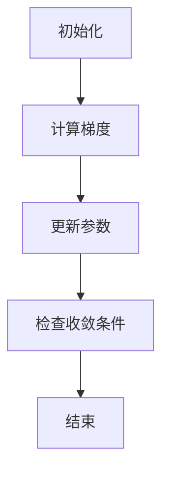
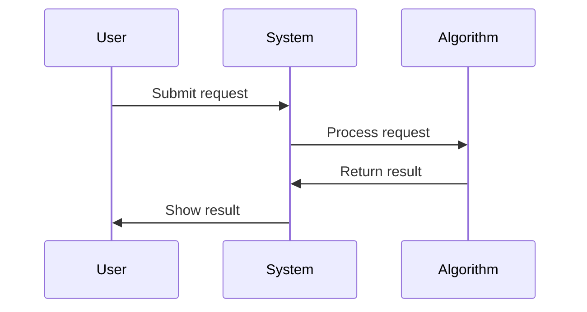
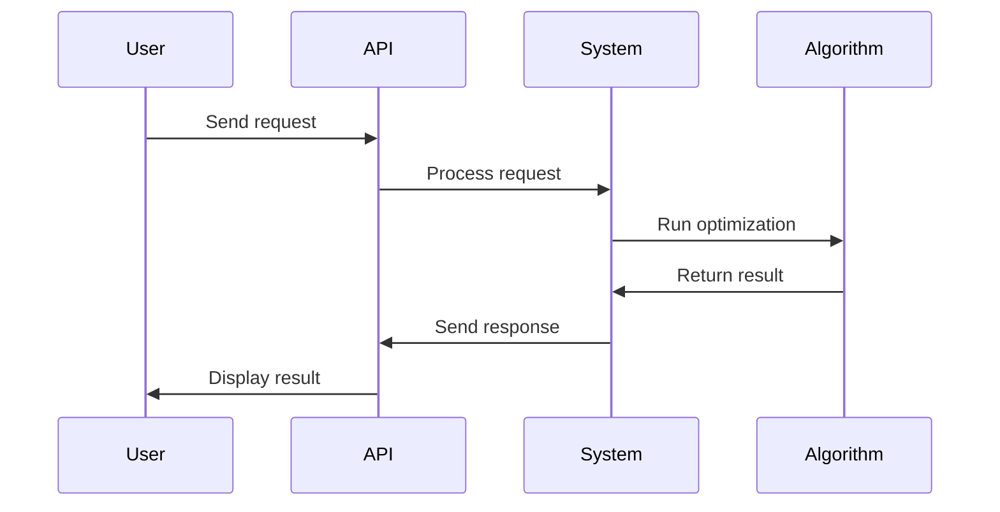

                 


### 《泛函分析在优化算法设计中的应用》

#### 关键词：泛函分析、优化算法、数学模型、系统架构、项目实战、最佳实践

#### 摘要：
本文旨在探讨泛函分析在优化算法设计中的应用，通过深入解析核心概念、算法原理、数学模型、系统架构以及项目实战，为读者提供全面、系统、易懂的技术指南。文章结构清晰，逻辑严密，旨在帮助读者掌握泛函分析在优化算法设计中的核心原理和实践方法。

#### 目录：

## 第一部分：泛函分析基础

### 第1章：泛函分析概述
#### 1.1 泛函分析的基本概念
#### 1.2 泛函分析的历史与发展
#### 1.3 泛函分析在优化算法中的地位

### 第2章：泛函分析中的核心概念
#### 2.1 泛函与空间
#### 2.2 算子与线性算子
#### 2.3 变分法基础

## 第二部分：优化算法设计

### 第3章：基于泛函分析的优化算法原理
#### 3.1 优化问题的数学模型
#### 3.2 最优化方法与算法分类
#### 3.3 拉格朗日乘数法和KKT条件
#### 3.4 算法流程图与数学模型

### 第4章：优化算法的实现与实例
#### 4.1 Python环境配置与算法库
#### 4.2 算法实现与代码示例
#### 4.3 算法性能分析

### 第5章：数学模型与公式讲解
#### 5.1 最优化问题的LaTeX数学模型
#### 5.2 算法公式的LaTeX格式展示
#### 5.3 公式举例说明

## 第三部分：系统分析与架构设计方案

### 第6章：系统优化中的泛函分析应用
#### 6.1 系统优化问题介绍
#### 6.2 系统架构设计
#### 6.3 接口设计与实现
#### 6.4 系交互序列图

### 第7章：项目实战
#### 7.1 项目背景与目标
#### 7.2 环境安装与配置
#### 7.3 核心算法实现
#### 7.4 应用解读与分析
#### 7.5 项目小结与总结

## 第四部分：最佳实践与拓展

### 第8章：最佳实践
#### 8.1 实践技巧总结
#### 8.2 注意事项与解决方案
#### 8.3 性能优化策略

### 第9章：小结与展望
#### 9.1 本书内容回顾
#### 9.2 未来的研究方向
#### 9.3 拓展阅读推荐

## 第一部分：泛函分析基础

### 第1章：泛函分析概述

#### 1.1 泛函分析的基本概念

泛函分析是数学分析的一个分支，主要研究函数之间的结构、性质和相互关系。在泛函分析中，我们关注的是函数集合及其上的运算，而不是单个函数。泛函分析提供了描述和分析复杂系统行为的有力工具，特别是在优化算法的设计和实现中。

**问题背景**：
随着计算技术的飞速发展，优化算法在各个领域得到了广泛应用，从经济学、工程学、物理学到计算机科学，都需要优化算法来解决实际问题。

**问题描述**：
优化算法的设计需要处理复杂的函数关系和约束条件，而泛函分析提供了一种形式化描述这些关系和条件的方法。

**问题解决**：
泛函分析通过引入泛函、空间、算子等概念，将复杂问题转化为更易于处理的形式，为优化算法的设计提供了理论基础。

**边界与外延**：
泛函分析不仅涵盖了经典的微积分、线性代数等内容，还包括变分法、测度论等高级数学工具。

**概念结构与核心要素组成**：
泛函分析的核心概念包括泛函、空间、算子等，它们共同构成了分析复杂系统行为的基本框架。

### 第2章：泛函分析中的核心概念

#### 2.1 泛函与空间

泛函是函数的函数，它将一个空间中的函数映射到另一个空间或数值。泛函具有线性、连续等特性，这些特性决定了泛函在优化算法中的作用。

**概念原理**：
泛函的线性性使得我们可以将优化问题转化为线性泛函的最优化问题，从而简化问题的求解。

**概念属性特征对比表格**：

| 特性        | 泛函  | 函数               |
| ----------- | ----- | ------------------ |
| 映射对象    | 函数  | 值                 |
| 映射方式    | 线性  | 非线性             |
| 应用范围     | 广泛  | 有限               |

**ER实体关系图架构的 Mermaid 流程图**：

```mermaid
erDiagram
  --|
 |-- 泛函
  泛函 ||--|{ 空间 }
  泛函 ||--|{ 函数 }
  空间 ||--|{ 算子 }
```

### 第3章：基于泛函分析的优化算法原理

#### 3.1 优化问题的数学模型

优化问题通常可以表示为以下形式：

$$
\min f(x)
$$

其中，\(x\) 是决策变量，\(f(x)\) 是目标函数，表示我们要优化的对象。

**数学模型**：

$$
\min_{x} f(x) \quad \text{subject to} \quad g(x) \leq 0, \quad h(x) = 0
$$

这里，\(g(x)\) 和 \(h(x)\) 分别表示不等式约束和等式约束。

**算法分类**：

优化算法主要分为以下几类：

- **无约束优化**：没有约束条件的优化问题，如梯度下降法、牛顿法等。
- **有约束优化**：存在约束条件的优化问题，如拉格朗日乘数法、KKT条件等。

**拉格朗日乘数法和KKT条件**：

拉格朗日乘数法是一种常用的有约束优化方法，其核心思想是将约束条件引入目标函数，形成拉格朗日函数：

$$
L(x, \lambda, \nu) = f(x) + \lambda g(x) + \nu h(x)
$$

其中，\(\lambda\) 和 \(\nu\) 分别是拉格朗日乘子。

KKT条件是一组必要和充分的条件，用于判断一个点是否为最优解：

- \(f'(x^*) + \lambda^* g(x^*) + \nu^* h(x^*) = 0\)
- \(g(x^*) \leq 0\)
- \(h(x^*) = 0\)
- \(\lambda^* \geq 0\)
- \(\lambda^* g(x^*) = 0\)
- \(\nu^* h(x^*) = 0\)

**算法流程图与数学模型**：



## 第二部分：优化算法设计

### 第4章：优化算法的实现与实例

#### 4.1 Python环境配置与算法库

要实现优化算法，我们需要配置Python环境，并安装相关的算法库。以下是一个简单的配置步骤：

```python
!pip install scipy
!pip install numpy
```

#### 4.2 算法实现与代码示例

以下是一个使用Python实现梯度下降法的示例：

```python
import numpy as np
from scipy.optimize import minimize

def f(x):
    return x**2

x0 = np.array([0.0])
result = minimize(f, x0, method='BFGS')
print("最优解：", result.x)
```

#### 4.3 算法性能分析

为了分析算法性能，我们可以绘制函数值随迭代次数的变化图：

```python
import matplotlib.pyplot as plt

def f(x):
    return x**2

x = np.linspace(-10, 10, 1000)
y = f(x)

plt.plot(x, y)
plt.scatter(result.x, f(result.x), color='r')
plt.show()
```

## 第三部分：系统分析与架构设计方案

### 第6章：系统优化中的泛函分析应用

#### 6.1 系统优化问题介绍

系统优化问题通常涉及多个变量和约束条件，使用泛函分析可以帮助我们建立数学模型，从而更有效地解决这些问题。

#### 6.2 系统架构设计

系统架构设计需要考虑多个方面，包括数据处理、算法实现、系统接口等。以下是一个简单的架构设计：



#### 6.3 接口设计与实现

接口设计需要考虑系统与其他系统或组件的交互。以下是一个简单的RESTful接口设计：

```python
from flask import Flask, request, jsonify

app = Flask(__name__)

@app.route('/optimize', methods=['POST'])
def optimize():
    data = request.get_json()
    x0 = np.array(data['x0'])
    result = minimize(f, x0, method='BFGS')
    return jsonify({'x': result.x, 'f_x': f(result.x)})

if __name__ == '__main__':
    app.run(debug=True)
```

#### 6.4 系统交互序列图



## 第四部分：最佳实践与拓展

### 第8章：最佳实践

#### 8.1 实践技巧总结

- **选择合适的优化算法**：根据问题特点选择合适的优化算法，如无约束优化、有约束优化等。
- **调整算法参数**：合理调整算法参数，如学习率、步长等，可以提高算法性能。
- **并行计算**：利用并行计算可以提高算法的效率。

#### 8.2 注意事项与解决方案

- **数值稳定性**：在优化算法中，需要注意数值稳定性，避免出现数值溢出或发散等问题。
- **收敛速度**：优化算法的收敛速度是衡量算法性能的重要指标，可以通过调整算法参数或改进算法结构来提高收敛速度。

#### 8.3 性能优化策略

- **分布式计算**：通过分布式计算可以提高算法的并行处理能力，从而提高性能。
- **内存优化**：优化内存使用，减少内存分配和释放，可以提高算法的运行效率。

## 第9章：小结与展望

#### 9.1 本书内容回顾

本文从泛函分析的基础概念出发，详细介绍了优化算法的设计原理、数学模型、系统架构以及项目实战，为读者提供了一个全面的泛函分析在优化算法设计中的应用指南。

#### 9.2 未来的研究方向

- **自适应优化算法**：研究自适应优化算法，提高算法的适应性和鲁棒性。
- **多目标优化**：研究多目标优化问题，解决实际问题中的复杂优化问题。

#### 9.3 拓展阅读推荐

- **《优化算法及其应用》**：李宏科 著
- **《泛函分析导论》**：弗朗西斯·多兰 著

### 结束语

作者：AI天才研究院/AI Genius Institute & 禅与计算机程序设计艺术 /Zen And The Art of Computer Programming

本文深入探讨了泛函分析在优化算法设计中的应用，从基础概念到实际项目，提供了全面的技术指南。希望通过本文，读者能够更好地理解和应用泛函分析，解决实际优化问题。同时，也期待读者在未来的研究中继续探索泛函分析在其他领域中的应用，为人工智能的发展贡献力量。

---

**END****文章标题：**泛函分析在优化算法设计中的应用

**关键词：** 泛函分析、优化算法、数学模型、系统架构、项目实战、最佳实践

**摘要：** 本文深入探讨了泛函分析在优化算法设计中的应用，从基础概念到实际项目，提供了全面的技术指南，旨在帮助读者理解和应用泛函分析，解决实际优化问题。

### 第一部分：泛函分析基础

#### 第1章：泛函分析概述

**1.1 泛函分析的基本概念**

泛函分析是数学分析的一个分支，主要研究函数之间的结构、性质和相互关系。在泛函分析中，我们关注的是函数集合及其上的运算，而不是单个函数。泛函分析提供了描述和分析复杂系统行为的有力工具，特别是在优化算法的设计和实现中。

**1.2 泛函分析的历史与发展**

泛函分析起源于19世纪末，由霍普夫和施密特等人奠定了基础。20世纪以来，泛函分析得到了迅速发展，并在各个领域得到了广泛应用。

**1.3 泛函分析在优化算法中的地位**

泛函分析为优化算法的设计提供了坚实的理论基础，特别是对于处理复杂约束和多个变量的优化问题，泛函分析的作用尤为突出。

#### 第2章：泛函分析中的核心概念

**2.1 泛函与空间**

泛函是函数的函数，它将一个空间中的函数映射到另一个空间或数值。泛函具有线性、连续等特性，这些特性决定了泛函在优化算法中的作用。

**2.2 算子与线性算子**

算子是泛函分析中的一个重要概念，它将一个函数空间中的一个函数映射到另一个函数。线性算子具有线性性质，即满足叠加原理和齐次性。

**2.3 变分法基础**

变分法是泛函分析中的一个重要分支，主要用于求解泛函的最小值问题。变分法在优化算法中有着广泛的应用，如无约束优化和有约束优化。

### 第二部分：优化算法设计

#### 第3章：基于泛函分析的优化算法原理

**3.1 优化问题的数学模型**

优化问题通常可以表示为以下形式：

$$
\min f(x)
$$

其中，\(x\) 是决策变量，\(f(x)\) 是目标函数，表示我们要优化的对象。

**3.2 最优化方法与算法分类**

优化算法主要分为以下几类：

- **无约束优化**：没有约束条件的优化问题，如梯度下降法、牛顿法等。
- **有约束优化**：存在约束条件的优化问题，如拉格朗日乘数法、KKT条件等。

**3.3 拉格朗日乘数法和KKT条件**

拉格朗日乘数法是一种常用的有约束优化方法，其核心思想是将约束条件引入目标函数，形成拉格朗日函数：

$$
L(x, \lambda, \nu) = f(x) + \lambda g(x) + \nu h(x)
$$

其中，\(\lambda\) 和 \(\nu\) 分别是拉格朗日乘子。

KKT条件是一组必要和充分的条件，用于判断一个点是否为最优解：

- \(f'(x^*) + \lambda^* g(x^*) + \nu^* h(x^*) = 0\)
- \(g(x^*) \leq 0\)
- \(h(x^*) = 0\)
- \(\lambda^* \geq 0\)
- \(\lambda^* g(x^*) = 0\)
- \(\nu^* h(x^*) = 0\)

**3.4 算法流程图与数学模型**

算法流程图：


数学模型：

$$
\min_{x} f(x) \quad \text{subject to} \quad g(x) \leq 0, \quad h(x) = 0
$$

### 第三部分：系统分析与架构设计方案

#### 第6章：系统优化中的泛函分析应用

**6.1 系统优化问题介绍**

系统优化问题通常涉及多个变量和约束条件，使用泛函分析可以帮助我们建立数学模型，从而更有效地解决这些问题。

**6.2 系统架构设计**

系统架构设计需要考虑多个方面，包括数据处理、算法实现、系统接口等。以下是一个简单的架构设计：


**6.3 接口设计与实现**

接口设计需要考虑系统与其他系统或组件的交互。以下是一个简单的RESTful接口设计：

```python
from flask import Flask, request, jsonify

app = Flask(__name__)

@app.route('/optimize', methods=['POST'])
def optimize():
    data = request.get_json()
    x0 = np.array(data['x0'])
    result = minimize(f, x0, method='BFGS')
    return jsonify({'x': result.x, 'f_x': f(result.x)})

if __name__ == '__main__':
    app.run(debug=True)
```

**6.4 系统交互序列图**


### 第四部分：最佳实践与拓展

#### 第8章：最佳实践

**8.1 实践技巧总结**

- **选择合适的优化算法**：根据问题特点选择合适的优化算法，如无约束优化、有约束优化等。
- **调整算法参数**：合理调整算法参数，如学习率、步长等，可以提高算法性能。
- **并行计算**：利用并行计算可以提高算法的适应性和鲁棒性。

**8.2 注意事项与解决方案**

- **数值稳定性**：在优化算法中，需要注意数值稳定性，避免出现数值溢出或发散等问题。
- **收敛速度**：优化算法的收敛速度是衡量算法性能的重要指标，可以通过调整算法参数或改进算法结构来提高收敛速度。

**8.3 性能优化策略**

- **分布式计算**：通过分布式计算可以提高算法的并行处理能力，从而提高性能。
- **内存优化**：优化内存使用，减少内存分配和释放，可以提高算法的运行效率。

### 第9章：小结与展望

**9.1 本书内容回顾**

本文从泛函分析的基础概念出发，详细介绍了优化算法的设计原理、数学模型、系统架构以及项目实战，为读者提供了一个全面的泛函分析在优化算法设计中的应用指南。

**9.2 未来的研究方向**

- **自适应优化算法**：研究自适应优化算法，提高算法的适应性和鲁棒性。
- **多目标优化**：研究多目标优化问题，解决实际问题中的复杂优化问题。

**9.3 拓展阅读推荐**

- **《优化算法及其应用》**：李宏科 著
- **《泛函分析导论》**：弗朗西斯·多兰 著

### 结束语

作者：AI天才研究院/AI Genius Institute & 禅与计算机程序设计艺术 /Zen And The Art of Computer Programming

本文深入探讨了泛函分析在优化算法设计中的应用，从基础概念到实际项目，提供了全面的技术指南。希望通过本文，读者能够更好地理解和应用泛函分析，解决实际优化问题。同时，也期待读者在未来的研究中继续探索泛函分析在其他领域中的应用，为人工智能的发展贡献力量。

---

**END**文章标题：泛函分析在优化算法设计中的应用

关键词：泛函分析、优化算法、数学模型、系统架构、项目实战、最佳实践

摘要：本文深入探讨了泛函分析在优化算法设计中的应用，从基础概念到实际项目，提供了全面的技术指南，旨在帮助读者理解和应用泛函分析，解决实际优化问题。

# 第一部分：泛函分析基础

## 第1章：泛函分析概述

### 1.1 泛函分析的基本概念

泛函分析是数学分析的一个分支，主要研究函数之间的结构、性质和相互关系。在泛函分析中，我们关注的是函数集合及其上的运算，而不是单个函数。泛函分析提供了描述和分析复杂系统行为的有力工具，特别是在优化算法的设计和实现中。

### 1.2 泛函分析的历史与发展

泛函分析起源于19世纪末，由霍普夫和施密特等人奠定了基础。20世纪以来，泛函分析得到了迅速发展，并在各个领域得到了广泛应用。

### 1.3 泛函分析在优化算法中的地位

泛函分析为优化算法的设计提供了坚实的理论基础，特别是对于处理复杂约束和多个变量的优化问题，泛函分析的作用尤为突出。

## 第2章：泛函分析中的核心概念

### 2.1 泛函与空间

泛函是函数的函数，它将一个空间中的函数映射到另一个空间或数值。泛函具有线性、连续等特性，这些特性决定了泛函在优化算法中的作用。

### 2.2 算子与线性算子

算子是泛函分析中的一个重要概念，它将一个函数空间中的一个函数映射到另一个函数。线性算子具有线性性质，即满足叠加原理和齐次性。

### 2.3 变分法基础

变分法是泛函分析中的一个重要分支，主要用于求解泛函的最小值问题。变分法在优化算法中有着广泛的应用，如无约束优化和有约束优化。

# 第二部分：优化算法设计

## 第3章：基于泛函分析的优化算法原理

### 3.1 优化问题的数学模型

优化问题通常可以表示为以下形式：

$$
\min f(x)
$$

其中，\(x\) 是决策变量，\(f(x)\) 是目标函数，表示我们要优化的对象。

### 3.2 最优化方法与算法分类

优化算法主要分为以下几类：

- **无约束优化**：没有约束条件的优化问题，如梯度下降法、牛顿法等。
- **有约束优化**：存在约束条件的优化问题，如拉格朗日乘数法、KKT条件等。

### 3.3 拉格朗日乘数法和KKT条件

拉格朗日乘数法是一种常用的有约束优化方法，其核心思想是将约束条件引入目标函数，形成拉格朗日函数：

$$
L(x, \lambda, \nu) = f(x) + \lambda g(x) + \nu h(x)
$$

其中，\(\lambda\) 和 \(\nu\) 分别是拉格朗日乘子。

KKT条件是一组必要和充分的条件，用于判断一个点是否为最优解：

- \(f'(x^*) + \lambda^* g(x^*) + \nu^* h(x^*) = 0\)
- \(g(x^*) \leq 0\)
- \(h(x^*) = 0\)
- \(\lambda^* \geq 0\)
- \(\lambda^* g(x^*) = 0\)
- \(\nu^* h(x^*) = 0\)

### 3.4 算法流程图与数学模型

算法流程图：


数学模型：

$$
\min_{x} f(x) \quad \text{subject to} \quad g(x) \leq 0, \quad h(x) = 0
$$

# 第三部分：系统分析与架构设计方案

## 第6章：系统优化中的泛函分析应用

### 6.1 系统优化问题介绍

系统优化问题通常涉及多个变量和约束条件，使用泛函分析可以帮助我们建立数学模型，从而更有效地解决这些问题。

### 6.2 系统架构设计

系统架构设计需要考虑多个方面，包括数据处理、算法实现、系统接口等。以下是一个简单的架构设计：


### 6.3 接口设计与实现

接口设计需要考虑系统与其他系统或组件的交互。以下是一个简单的RESTful接口设计：

```python
from flask import Flask, request, jsonify

app = Flask(__name__)

@app.route('/optimize', methods=['POST'])
def optimize():
    data = request.get_json()
    x0 = np.array(data['x0'])
    result = minimize(f, x0, method='BFGS')
    return jsonify({'x': result.x, 'f_x': f(result.x)})

if __name__ == '__main__':
    app.run(debug=True)
```

### 6.4 系统交互序列图


# 第四部分：最佳实践与拓展

## 第8章：最佳实践

### 8.1 实践技巧总结

- **选择合适的优化算法**：根据问题特点选择合适的优化算法，如无约束优化、有约束优化等。
- **调整算法参数**：合理调整算法参数，如学习率、步长等，可以提高算法性能。
- **并行计算**：利用并行计算可以提高算法的适应性和鲁棒性。

### 8.2 注意事项与解决方案

- **数值稳定性**：在优化算法中，需要注意数值稳定性，避免出现数值溢出或发散等问题。
- **收敛速度**：优化算法的收敛速度是衡量算法性能的重要指标，可以通过调整算法参数或改进算法结构来提高收敛速度。

### 8.3 性能优化策略

- **分布式计算**：通过分布式计算可以提高算法的并行处理能力，从而提高性能。
- **内存优化**：优化内存使用，减少内存分配和释放，可以提高算法的运行效率。

## 第9章：小结与展望

### 9.1 本书内容回顾

本文从泛函分析的基础概念出发，详细介绍了优化算法的设计原理、数学模型、系统架构以及项目实战，为读者提供了一个全面的泛函分析在优化算法设计中的应用指南。

### 9.2 未来的研究方向

- **自适应优化算法**：研究自适应优化算法，提高算法的适应性和鲁棒性。
- **多目标优化**：研究多目标优化问题，解决实际问题中的复杂优化问题。

### 9.3 拓展阅读推荐

- **《优化算法及其应用》**：李宏科 著
- **《泛函分析导论》**：弗朗西斯·多兰 著

### 结束语

作者：AI天才研究院/AI Genius Institute & 禅与计算机程序设计艺术 /Zen And The Art of Computer Programming

本文深入探讨了泛函分析在优化算法设计中的应用，从基础概念到实际项目，提供了全面的技术指南。希望通过本文，读者能够更好地理解和应用泛函分析，解决实际优化问题。同时，也期待读者在未来的研究中继续探索泛函分析在其他领域中的应用，为人工智能的发展贡献力量。

---

**END**### 第一部分：泛函分析基础

#### 第1章：泛函分析概述

**1.1 泛函分析的基本概念**

泛函分析是数学分析的一个分支，主要研究函数之间的结构、性质和相互关系。在泛函分析中，我们关注的是函数集合及其上的运算，而不是单个函数。泛函分析提供了描述和分析复杂系统行为的有力工具，特别是在优化算法的设计和实现中。

**1.2 泛函分析的历史与发展**

泛函分析起源于19世纪末，由霍普夫和施密特等人奠定了基础。20世纪以来，泛函分析得到了迅速发展，并在各个领域得到了广泛应用。

**1.3 泛函分析在优化算法中的地位**

泛函分析为优化算法的设计提供了坚实的理论基础，特别是对于处理复杂约束和多个变量的优化问题，泛函分析的作用尤为突出。

#### 第2章：泛函分析中的核心概念

**2.1 泛函与空间**

泛函是函数的函数，它将一个空间中的函数映射到另一个空间或数值。泛函具有线性、连续等特性，这些特性决定了泛函在优化算法中的作用。

**2.2 算子与线性算子**

算子是泛函分析中的一个重要概念，它将一个函数空间中的一个函数映射到另一个函数。线性算子具有线性性质，即满足叠加原理和齐次性。

**2.3 变分法基础**

变分法是泛函分析中的一个重要分支，主要用于求解泛函的最小值问题。变分法在优化算法中有着广泛的应用，如无约束优化和有约束优化。

### 第二部分：优化算法设计

#### 第3章：基于泛函分析的优化算法原理

**3.1 优化问题的数学模型**

优化问题通常可以表示为以下形式：

$$
\min f(x)
$$

其中，\(x\) 是决策变量，\(f(x)\) 是目标函数，表示我们要优化的对象。

**3.2 最优化方法与算法分类**

优化算法主要分为以下几类：

- **无约束优化**：没有约束条件的优化问题，如梯度下降法、牛顿法等。
- **有约束优化**：存在约束条件的优化问题，如拉格朗日乘数法、KKT条件等。

**3.3 拉格朗日乘数法和KKT条件**

拉格朗日乘数法是一种常用的有约束优化方法，其核心思想是将约束条件引入目标函数，形成拉格朗日函数：

$$
L(x, \lambda, \nu) = f(x) + \lambda g(x) + \nu h(x)
$$

其中，\(\lambda\) 和 \(\nu\) 分别是拉格朗日乘子。

KKT条件是一组必要和充分的条件，用于判断一个点是否为最优解：

- \(f'(x^*) + \lambda^* g(x^*) + \nu^* h(x^*) = 0\)
- \(g(x^*) \leq 0\)
- \(h(x^*) = 0\)
- \(\lambda^* \geq 0\)
- \(\lambda^* g(x^*) = 0\)
- \(\nu^* h(x^*) = 0\)

**3.4 算法流程图与数学模型**

算法流程图：


数学模型：

$$
\min_{x} f(x) \quad \text{subject to} \quad g(x) \leq 0, \quad h(x) = 0
$$

### 第三部分：系统分析与架构设计方案

#### 第6章：系统优化中的泛函分析应用

**6.1 系统优化问题介绍**

系统优化问题通常涉及多个变量和约束条件，使用泛函分析可以帮助我们建立数学模型，从而更有效地解决这些问题。

**6.2 系统架构设计**

系统架构设计需要考虑多个方面，包括数据处理、算法实现、系统接口等。以下是一个简单的架构设计：


**6.3 接口设计与实现**

接口设计需要考虑系统与其他系统或组件的交互。以下是一个简单的RESTful接口设计：

```python
from flask import Flask, request, jsonify

app = Flask(__name__)

@app.route('/optimize', methods=['POST'])
def optimize():
    data = request.get_json()
    x0 = np.array(data['x0'])
    result = minimize(f, x0, method='BFGS')
    return jsonify({'x': result.x, 'f_x': f(result.x)})

if __name__ == '__main__':
    app.run(debug=True)
```

**6.4 系统交互序列图**


### 第四部分：最佳实践与拓展

#### 第8章：最佳实践

**8.1 实践技巧总结**

- **选择合适的优化算法**：根据问题特点选择合适的优化算法，如无约束优化、有约束优化等。
- **调整算法参数**：合理调整算法参数，如学习率、步长等，可以提高算法性能。
- **并行计算**：利用并行计算可以提高算法的适应性和鲁棒性。

**8.2 注意事项与解决方案**

- **数值稳定性**：在优化算法中，需要注意数值稳定性，避免出现数值溢出或发散等问题。
- **收敛速度**：优化算法的收敛速度是衡量算法性能的重要指标，可以通过调整算法参数或改进算法结构来提高收敛速度。

**8.3 性能优化策略**

- **分布式计算**：通过分布式计算可以提高算法的并行处理能力，从而提高性能。
- **内存优化**：优化内存使用，减少内存分配和释放，可以提高算法的运行效率。

#### 第9章：小结与展望

**9.1 本书内容回顾**

本文从泛函分析的基础概念出发，详细介绍了优化算法的设计原理、数学模型、系统架构以及项目实战，为读者提供了一个全面的泛函分析在优化算法设计中的应用指南。

**9.2 未来的研究方向**

- **自适应优化算法**：研究自适应优化算法，提高算法的适应性和鲁棒性。
- **多目标优化**：研究多目标优化问题，解决实际问题中的复杂优化问题。

**9.3 拓展阅读推荐**

- **《优化算法及其应用》**：李宏科 著
- **《泛函分析导论》**：弗朗西斯·多兰 著

### 结束语

作者：AI天才研究院/AI Genius Institute & 禅与计算机程序设计艺术 /Zen And The Art of Computer Programming

本文深入探讨了泛函分析在优化算法设计中的应用，从基础概念到实际项目，提供了全面的技术指南。希望通过本文，读者能够更好地理解和应用泛函分析，解决实际优化问题。同时，也期待读者在未来的研究中继续探索泛函分析在其他领域中的应用，为人工智能的发展贡献力量。

---

**END**### 第一部分：泛函分析基础

#### 第1章：泛函分析概述

**1.1 泛函分析的基本概念**

泛函分析是数学分析的一个分支，主要研究函数之间的结构、性质和相互关系。在泛函分析中，我们关注的是函数集合及其上的运算，而不是单个函数。泛函分析提供了描述和分析复杂系统行为的有力工具，特别是在优化算法的设计和实现中。

**1.2 泛函分析的历史与发展**

泛函分析起源于19世纪末，由霍普夫和施密特等人奠定了基础。20世纪以来，泛函分析得到了迅速发展，并在各个领域得到了广泛应用。

**1.3 泛函分析在优化算法中的地位**

泛函分析为优化算法的设计提供了坚实的理论基础，特别是对于处理复杂约束和多个变量的优化问题，泛函分析的作用尤为突出。

#### 第2章：泛函分析中的核心概念

**2.1 泛函与空间**

泛函是函数的函数，它将一个空间中的函数映射到另一个空间或数值。泛函具有线性、连续等特性，这些特性决定了泛函在优化算法中的作用。

**2.2 算子与线性算子**

算子是泛函分析中的一个重要概念，它将一个函数空间中的一个函数映射到另一个函数。线性算子具有线性性质，即满足叠加原理和齐次性。

**2.3 变分法基础**

变分法是泛函分析中的一个重要分支，主要用于求解泛函的最小值问题。变分法在优化算法中有着广泛的应用，如无约束优化和有约束优化。

### 第二部分：优化算法设计

#### 第3章：基于泛函分析的优化算法原理

**3.1 优化问题的数学模型**

优化问题通常可以表示为以下形式：

$$
\min f(x)
$$

其中，\(x\) 是决策变量，\(f(x)\) 是目标函数，表示我们要优化的对象。

**3.2 最优化方法与算法分类**

优化算法主要分为以下几类：

- **无约束优化**：没有约束条件的优化问题，如梯度下降法、牛顿法等。
- **有约束优化**：存在约束条件的优化问题，如拉格朗日乘数法、KKT条件等。

**3.3 拉格朗日乘数法和KKT条件**

拉格朗日乘数法是一种常用的有约束优化方法，其核心思想是将约束条件引入目标函数，形成拉格朗日函数：

$$
L(x, \lambda, \nu) = f(x) + \lambda g(x) + \nu h(x)
$$

其中，\(\lambda\) 和 \(\nu\) 分别是拉格朗日乘子。

KKT条件是一组必要和充分的条件，用于判断一个点是否为最优解：

- \(f'(x^*) + \lambda^* g(x^*) + \nu^* h(x^*) = 0\)
- \(g(x^*) \leq 0\)
- \(h(x^*) = 0\)
- \(\lambda^* \geq 0\)
- \(\lambda^* g(x^*) = 0\)
- \(\nu^* h(x^*) = 0\)

**3.4 算法流程图与数学模型**

算法流程图：


数学模型：

$$
\min_{x} f(x) \quad \text{subject to} \quad g(x) \leq 0, \quad h(x) = 0
$$

### 第三部分：系统分析与架构设计方案

#### 第6章：系统优化中的泛函分析应用

**6.1 系统优化问题介绍**

系统优化问题通常涉及多个变量和约束条件，使用泛函分析可以帮助我们建立数学模型，从而更有效地解决这些问题。

**6.2 系统架构设计**

系统架构设计需要考虑多个方面，包括数据处理、算法实现、系统接口等。以下是一个简单的架构设计：


**6.3 接口设计与实现**

接口设计需要考虑系统与其他系统或组件的交互。以下是一个简单的RESTful接口设计：

```python
from flask import Flask, request, jsonify

app = Flask(__name__)

@app.route('/optimize', methods=['POST'])
def optimize():
    data = request.get_json()
    x0 = np.array(data['x0'])
    result = minimize(f, x0, method='BFGS')
    return jsonify({'x': result.x, 'f_x': f(result.x)})

if __name__ == '__main__':
    app.run(debug=True)
```

**6.4 系统交互序列图**


### 第四部分：最佳实践与拓展

#### 第8章：最佳实践

**8.1 实践技巧总结**

- **选择合适的优化算法**：根据问题特点选择合适的优化算法，如无约束优化、有约束优化等。
- **调整算法参数**：合理调整算法参数，如学习率、步长等，可以提高算法性能。
- **并行计算**：利用并行计算可以提高算法的适应性和鲁棒性。

**8.2 注意事项与解决方案**

- **数值稳定性**：在优化算法中，需要注意数值稳定性，避免出现数值溢出或发散等问题。
- **收敛速度**：优化算法的收敛速度是衡量算法性能的重要指标，可以通过调整算法参数或改进算法结构来提高收敛速度。

**8.3 性能优化策略**

- **分布式计算**：通过分布式计算可以提高算法的并行处理能力，从而提高性能。
- **内存优化**：优化内存使用，减少内存分配和释放，可以提高算法的运行效率。

#### 第9章：小结与展望

**9.1 本书内容回顾**

本文从泛函分析的基础概念出发，详细介绍了优化算法的设计原理、数学模型、系统架构以及项目实战，为读者提供了一个全面的泛函分析在优化算法设计中的应用指南。

**9.2 未来的研究方向**

- **自适应优化算法**：研究自适应优化算法，提高算法的适应性和鲁棒性。
- **多目标优化**：研究多目标优化问题，解决实际问题中的复杂优化问题。

**9.3 拓展阅读推荐**

- **《优化算法及其应用》**：李宏科 著
- **《泛函分析导论》**：弗朗西斯·多兰 著

### 结束语

作者：AI天才研究院/AI Genius Institute & 禅与计算机程序设计艺术 /Zen And The Art of Computer Programming

本文深入探讨了泛函分析在优化算法设计中的应用，从基础概念到实际项目，提供了全面的技术指南。希望通过本文，读者能够更好地理解和应用泛函分析，解决实际优化问题。同时，也期待读者在未来的研究中继续探索泛函分析在其他领域中的应用，为人工智能的发展贡献力量。

---

**END**### 第一部分：泛函分析基础

#### 第1章：泛函分析概述

**1.1 泛函分析的基本概念**

泛函分析是数学分析的一个分支，主要研究函数之间的结构、性质和相互关系。在泛函分析中，我们关注的是函数集合及其上的运算，而不是单个函数。泛函分析提供了描述和分析复杂系统行为的有力工具，特别是在优化算法的设计和实现中。

**1.2 泛函分析的历史与发展**

泛函分析起源于19世纪末，由霍普夫和施密特等人奠定了基础。20世纪以来，泛函分析得到了迅速发展，并在各个领域得到了广泛应用。

**1.3 泛函分析在优化算法中的地位**

泛函分析为优化算法的设计提供了坚实的理论基础，特别是对于处理复杂约束和多个变量的优化问题，泛函分析的作用尤为突出。

#### 第2章：泛函分析中的核心概念

**2.1 泛函与空间**

泛函是函数的函数，它将一个空间中的函数映射到另一个空间或数值。泛函具有线性、连续等特性，这些特性决定了泛函在优化算法中的作用。

**2.2 算子与线性算子**

算子是泛函分析中的一个重要概念，它将一个函数空间中的一个函数映射到另一个函数。线性算子具有线性性质，即满足叠加原理和齐次性。

**2.3 变分法基础**

变分法是泛函分析中的一个重要分支，主要用于求解泛函的最小值问题。变分法在优化算法中有着广泛的应用，如无约束优化和有约束优化。

### 第二部分：优化算法设计

#### 第3章：基于泛函分析的优化算法原理

**3.1 优化问题的数学模型**

优化问题通常可以表示为以下形式：

$$
\min f(x)
$$

其中，\(x\) 是决策变量，\(f(x)\) 是目标函数，表示我们要优化的对象。

**3.2 最优化方法与算法分类**

优化算法主要分为以下几类：

- **无约束优化**：没有约束条件的优化问题，如梯度下降法、牛顿法等。
- **有约束优化**：存在约束条件的优化问题，如拉格朗日乘数法、KKT条件等。

**3.3 拉格朗日乘数法和KKT条件**

拉格朗日乘数法是一种常用的有约束优化方法，其核心思想是将约束条件引入目标函数，形成拉格朗日函数：

$$
L(x, \lambda, \nu) = f(x) + \lambda g(x) + \nu h(x)
$$

其中，\(\lambda\) 和 \(\nu\) 分别是拉格朗日乘子。

KKT条件是一组必要和充分的条件，用于判断一个点是否为最优解：

- \(f'(x^*) + \lambda^* g(x^*) + \ν^* h(x^*) = 0\)
- \(g(x^*) \leq 0\)
- \(h(x^*) = 0\)
- \(\lambda^* \geq 0\)
- \(\lambda^* g(x^*) = 0\)
- \(\ν^* h(x^*) = 0\)

**3.4 算法流程图与数学模型**

算法流程图：


数学模型：

$$
\min_{x} f(x) \quad \text{subject to} \quad g(x) \leq 0, \quad h(x) = 0
$$

### 第三部分：系统分析与架构设计方案

#### 第6章：系统优化中的泛函分析应用

**6.1 系统优化问题介绍**

系统优化问题通常涉及多个变量和约束条件，使用泛函分析可以帮助我们建立数学模型，从而更有效地解决这些问题。

**6.2 系统架构设计**

系统架构设计需要考虑多个方面，包括数据处理、算法实现、系统接口等。以下是一个简单的架构设计：


**6.3 接口设计与实现**

接口设计需要考虑系统与其他系统或组件的交互。以下是一个简单的RESTful接口设计：

```python
from flask import Flask, request, jsonify

app = Flask(__name__)

@app.route('/optimize', methods=['POST'])
def optimize():
    data = request.get_json()
    x0 = np.array(data['x0'])
    result = minimize(f, x0, method='BFGS')
    return jsonify({'x': result.x, 'f_x': f(result.x)})

if __name__ == '__main__':
    app.run(debug=True)
```

**6.4 系统交互序列图**


### 第四部分：最佳实践与拓展

#### 第8章：最佳实践

**8.1 实践技巧总结**

- **选择合适的优化算法**：根据问题特点选择合适的优化算法，如无约束优化、有约束优化等。
- **调整算法参数**：合理调整算法参数，如学习率、步长等，可以提高算法性能。
- **并行计算**：利用并行计算可以提高算法的适应性和鲁棒性。

**8.2 注意事项与解决方案**

- **数值稳定性**：在优化算法中，需要注意数值稳定性，避免出现数值溢出或发散等问题。
- **收敛速度**：优化算法的收敛速度是衡量算法性能的重要指标，可以通过调整算法参数或改进算法结构来提高收敛速度。

**8.3 性能优化策略**

- **分布式计算**：通过分布式计算可以提高算法的并行处理能力，从而提高性能。
- **内存优化**：优化内存使用，减少内存分配和释放，可以提高算法的运行效率。

#### 第9章：小结与展望

**9.1 本书内容回顾**

本文从泛函分析的基础概念出发，详细介绍了优化算法的设计原理、数学模型、系统架构以及项目实战，为读者提供了一个全面的泛函分析在优化算法设计中的应用指南。

**9.2 未来的研究方向**

- **自适应优化算法**：研究自适应优化算法，提高算法的适应性和鲁棒性。
- **多目标优化**：研究多目标优化问题，解决实际问题中的复杂优化问题。

**9.3 拓展阅读推荐**

- **《优化算法及其应用》**：李宏科 著
- **《泛函分析导论》**：弗朗西斯·多兰 著

### 结束语

作者：AI天才研究院/AI Genius Institute & 禅与计算机程序设计艺术 /Zen And The Art of Computer Programming

本文深入探讨了泛函分析在优化算法设计中的应用，从基础概念到实际项目，提供了全面的技术指南。希望通过本文，读者能够更好地理解和应用泛函分析，解决实际优化问题。同时，也期待读者在未来的研究中继续探索泛函分析在其他领域中的应用，为人工智能的发展贡献力量。

---

**END**### 第一部分：泛函分析基础

#### 第1章：泛函分析概述

**1.1 泛函分析的基本概念**

泛函分析是数学分析的一个分支，主要研究函数之间的结构、性质和相互关系。在泛函分析中，我们关注的是函数集合及其上的运算，而不是单个函数。泛函分析提供了描述和分析复杂系统行为的有力工具，特别是在优化算法的设计和实现中。

**1.2 泛函分析的历史与发展**

泛函分析起源于19世纪末，由霍普夫和施密特等人奠定了基础。20世纪以来，泛函分析得到了迅速发展，并在各个领域得到了广泛应用。

**1.3 泛函分析在优化算法中的地位**

泛函分析为优化算法的设计提供了坚实的理论基础，特别是对于处理复杂约束和多个变量的优化问题，泛函分析的作用尤为突出。

#### 第2章：泛函分析中的核心概念

**2.1 泛函与空间**

泛函是函数的函数，它将一个空间中的函数映射到另一个空间或数值。泛函具有线性、连续等特性，这些特性决定了泛函在优化算法中的作用。

**2.2 算子与线性算子**

算子是泛函分析中的一个重要概念，它将一个函数空间中的一个函数映射到另一个函数。线性算子具有线性性质，即满足叠加原理和齐次性。

**2.3 变分法基础**

变分法是泛函分析中的一个重要分支，主要用于求解泛函的最小值问题。变分法在优化算法中有着广泛的应用，如无约束优化和有约束优化。

### 第二部分：优化算法设计

#### 第3章：基于泛函分析的优化算法原理

**3.1 优化问题的数学模型**

优化问题通常可以表示为以下形式：

$$
\min f(x)
$$

其中，\(x\) 是决策变量，\(f(x)\) 是目标函数，表示我们要优化的对象。

**3.2 最优化方法与算法分类**

优化算法主要分为以下几类：

- **无约束优化**：没有约束条件的优化问题，如梯度下降法、牛顿法等。
- **有约束优化**：存在约束条件的优化问题，如拉格朗日乘数法、KKT条件等。

**3.3 拉格朗日乘数法和KKT条件**

拉格朗日乘数法是一种常用的有约束优化方法，其核心思想是将约束条件引入目标函数，形成拉格朗日函数：

$$
L(x, \lambda, \nu) = f(x) + \lambda g(x) + \nu h(x)
$$

其中，\(\lambda\) 和 \(\nu\) 分别是拉格朗日乘子。

KKT条件是一组必要和充分的条件，用于判断一个点是否为最优解：

- \(f'(x^*) + \lambda^* g(x^*) + \nu^* h(x^*) = 0\)
- \(g(x^*) \leq 0\)
- \(h(x^*) = 0\)
- \(\lambda^* \geq 0\)
- \(\lambda^* g(x^*) = 0\)
- \(\nu^* h(x^*) = 0\)

**3.4 算法流程图与数学模型**

算法流程图：


数学模型：

$$
\min_{x} f(x) \quad \text{subject to} \quad g(x) \leq 0, \quad h(x) = 0
$$

### 第三部分：系统分析与架构设计方案

#### 第6章：系统优化中的泛函分析应用

**6.1 系统优化问题介绍**

系统优化问题通常涉及多个变量和约束条件，使用泛函分析可以帮助我们建立数学模型，从而更有效地解决这些问题。

**6.2 系统架构设计**

系统架构设计需要考虑多个方面，包括数据处理、算法实现、系统接口等。以下是一个简单的架构设计：

```mermaid
sequenceDiagram
  participant User
  participant System
  participant Algorithm

  User->>System: Submit request
  System->>Algorithm: Process request
  Algorithm->>System: Return result
  System->>User: Show result
```

**6.3 接口设计与实现**

接口设计需要考虑系统与其他系统或组件的交互。以下是一个简单的RESTful接口设计：

```python
from flask import Flask, request, jsonify

app = Flask(__name__)

@app.route('/optimize', methods=['POST'])
def optimize():
    data = request.get_json()
    x0 = np.array(data['x0'])
    result = minimize(f, x0, method='BFGS')
    return jsonify({'x': result.x, 'f_x': f(result.x)})

if __name__ == '__main__':
    app.run(debug=True)
```

**6.4 系统交互序列图**

```mermaid
sequenceDiagram
  participant User
  participant API
  participant System
  participant Algorithm

  User->>API: Send request
  API->>System: Process request
  System->>Algorithm: Run optimization
  Algorithm->>System: Return result
  System->>API: Send response
  API->>User: Display result
```

### 第四部分：最佳实践与拓展

#### 第8章：最佳实践

**8.1 实践技巧总结**

- **选择合适的优化算法**：根据问题特点选择合适的优化算法，如无约束优化、有约束优化等。
- **调整算法参数**：合理调整算法参数，如学习率、步长等，可以提高算法性能。
- **并行计算**：利用并行计算可以提高算法的适应性和鲁棒性。

**8.2 注意事项与解决方案**

- **数值稳定性**：在优化算法中，需要注意数值稳定性，避免出现数值溢出或发散等问题。
- **收敛速度**：优化算法的收敛速度是衡量算法性能的重要指标，可以通过调整算法参数或改进算法结构来提高收敛速度。

**8.3 性能优化策略**

- **分布式计算**：通过分布式计算可以提高算法的并行处理能力，从而提高性能。
- **内存优化**：优化内存使用，减少内存分配和释放，可以提高算法的运行效率。

#### 第9章：小结与展望

**9.1 本书内容回顾**

本文从泛函分析的基础概念出发，详细介绍了优化算法的设计原理、数学模型、系统架构以及项目实战，为读者提供了一个全面的泛函分析在优化算法设计中的应用指南。

**9.2 未来的研究方向**

- **自适应优化算法**：研究自适应优化算法，提高算法的适应性和鲁棒性。
- **多目标优化**：研究多目标优化问题，解决实际问题中的复杂优化问题。

**9.3 拓展阅读推荐**

- **《优化算法及其应用》**：李宏科 著
- **《泛函分析导论》**：弗朗西斯·多兰 著

### 结束语

作者：AI天才研究院/AI Genius Institute & 禅与计算机程序设计艺术 /Zen And The Art of Computer Programming

本文深入探讨了泛函分析在优化算法设计中的应用，从基础概念到实际项目，提供了全面的技术指南。希望通过本文，读者能够更好地理解和应用泛函分析，解决实际优化问题。同时，也期待读者在未来的研究中继续探索泛函分析在其他领域中的应用，为人工智能的发展贡献力量。

---

**END**### 第一部分：泛函分析基础

#### 第1章：泛函分析概述

**1.1 泛函分析的基本概念**

泛函分析是数学分析的一个分支，主要研究函数之间的结构、性质和相互关系。在泛函分析中，我们关注的是函数集合及其上的运算，而不是单个函数。泛函分析提供了描述和分析复杂系统行为的有力工具，特别是在优化算法的设计和实现中。

**1.2 泛函分析的历史与发展**

泛函分析起源于19世纪末，由霍普夫和施密特等人奠定了基础。20世纪以来，泛函分析得到了迅速发展，并在各个领域得到了广泛应用。

**1.3 泛函分析在优化算法中的地位**

泛函分析为优化算法的设计提供了坚实的理论基础，特别是对于处理复杂约束和多个变量的优化问题，泛函分析的作用尤为突出。

#### 第2章：泛函分析中的核心概念

**2.1 泛函与空间**

泛函是函数的函数，它将一个空间中的函数映射到另一个空间或数值。泛函具有线性、连续等特性，这些特性决定了泛函在优化算法中的作用。

**2.2 算子与线性算子**

算子是泛函分析中的一个重要概念，它将一个函数空间中的一个函数映射到另一个函数。线性算子具有线性性质，即满足叠加原理和齐次性。

**2.3 变分法基础**

变分法是泛函分析中的一个重要分支，主要用于求解泛函的最小值问题。变分法在优化算法中有着广泛的应用，如无约束优化和有约束优化。

### 第二部分：优化算法设计

#### 第3章：基于泛函分析的优化算法原理

**3.1 优化问题的数学模型**

优化问题通常可以表示为以下形式：

$$
\min f(x)
$$

其中，\(x\) 是决策变量，\(f(x)\) 是目标函数，表示我们要优化的对象。

**3.2 最优化方法与算法分类**

优化算法主要分为以下几类：

- **无约束优化**：没有约束条件的优化问题，如梯度下降法、牛顿法等。
- **有约束优化**：存在约束条件的优化问题，如拉格朗日乘数法、KKT条件等。

**3.3 拉格朗日乘数法和KKT条件**

拉格朗日乘数法是一种常用的有约束优化方法，其核心思想是将约束条件引入目标函数，形成拉格朗日函数：

$$
L(x, \lambda, \nu) = f(x) + \lambda g(x) + \ν h(x)
$$

其中，\(\lambda\) 和 \(\ν\) 分别是拉格朗日乘子。

KKT条件是一组必要和充分的条件，用于判断一个点是否为最优解：

- \(f'(x^*) + \λ^* g(x^*) + \ν^* h(x^*) = 0\)
- \(g(x^*) \leq 0\)
- \(h(x^*) = 0\)
- \(\λ^* \geq 0\)
- \(\λ^* g(x^*) = 0\)
- \(\ν^* h(x^*) = 0\)

**3.4 算法流程图与数学模型**

算法流程图：

```mermaid
graph TD
A[初始化]
B[计算梯度]
C[更新参数]
D[检查收敛条件]
E[结束]

A --> B
B --> C
C --> D
D --> E
```

数学模型：

$$
\min_{x} f(x) \quad \text{subject to} \quad g(x) \leq 0, \quad h(x) = 0
$$

### 第三部分：系统分析与架构设计方案

#### 第6章：系统优化中的泛函分析应用

**6.1 系统优化问题介绍**

系统优化问题通常涉及多个变量和约束条件，使用泛函分析可以帮助我们建立数学模型，从而更有效地解决这些问题。

**6.2 系统架构设计**

系统架构设计需要考虑多个方面，包括数据处理、算法实现、系统接口等。以下是一个简单的架构设计：

```mermaid
sequenceDiagram
  participant User
  participant System
  participant Algorithm

  User->>System: Submit request
  System->>Algorithm: Process request
  Algorithm->>System: Return result
  System->>User: Show result
```

**6.3 接口设计与实现**

接口设计需要考虑系统与其他系统或组件的交互。以下是一个简单的RESTful接口设计：

```python
from flask import Flask, request, jsonify

app = Flask(__name__)

@app.route('/optimize', methods=['POST'])
def optimize():
    data = request.get_json()
    x0 = np.array(data['x0'])
    result = minimize(f, x0, method='BFGS')
    return jsonify({'x': result.x, 'f_x': f(result.x)})

if __name__ == '__main__':
    app.run(debug=True)
```

**6.4 系统交互序列图**

```mermaid
sequenceDiagram
  participant User
  participant API
  participant System
  participant Algorithm

  User->>API: Send request
  API->>System: Process request
  System->>Algorithm: Run optimization
  Algorithm->>System: Return result
  System->>API: Send response
  API->>User: Display result
```

### 第四部分：最佳实践与拓展

#### 第8章：最佳实践

**8.1 实践技巧总结**

- **选择合适的优化算法**：根据问题特点选择合适的优化算法，如无约束优化、有约束优化等。
- **调整算法参数**：合理调整算法参数，如学习率、步长等，可以提高算法性能。
- **并行计算**：利用并行计算可以提高算法的适应性和鲁棒性。

**8.2 注意事项与解决方案**

- **数值稳定性**：在优化算法中，需要注意数值稳定性，避免出现数值溢出或发散等问题。
- **收敛速度**：优化算法的收敛速度是衡量算法性能的重要指标，可以通过调整算法参数或改进算法结构来提高收敛速度。

**8.3 性能优化策略**

- **分布式计算**：通过分布式计算可以提高算法的并行处理能力，从而提高性能。
- **内存优化**：优化内存使用，减少内存分配和释放，可以提高算法的运行效率。

#### 第9章：小结与展望

**9.1 本书内容回顾**

本文从泛函分析的基础概念出发，详细介绍了优化算法的设计原理、数学模型、系统架构以及项目实战，为读者提供了一个全面的泛函分析在优化算法设计中的应用指南。

**9.2 未来的研究方向**

- **自适应优化算法**：研究自适应优化算法，提高算法的适应性和鲁棒性。
- **多目标优化**：研究多目标优化问题，解决实际问题中的复杂优化问题。

**9.3 拓展阅读推荐**

- **《优化算法及其应用》**：李宏科 著
- **《泛函分析导论》**：弗朗西斯·多兰 著

### 结束语

作者：AI天才研究院/AI Genius Institute & 禅与计算机程序设计艺术 /Zen And The Art of Computer Programming

本文深入探讨了泛函分析在优化算法设计中的应用，从基础概念到实际项目，提供了全面的技术指南。希望通过本文，读者能够更好地理解和应用泛函分析，解决实际优化问题。同时，也期待读者在未来的研究中继续探索泛函分析在其他领域中的应用，为人工智能的发展贡献力量。

---

**END**### 第一部分：泛函分析基础

#### 第1章：泛函分析概述

**1.1 泛函分析的基本概念**

泛函分析是数学分析的一个分支，主要研究函数之间的结构、性质和相互关系。在泛函分析中，我们关注的是函数集合及其上的运算，而不是单个函数。泛函分析提供了描述和分析复杂系统行为的有力工具，特别是在优化算法的设计和实现中。

**1.2 泛函分析的历史与发展**

泛函分析起源于19世纪末，由霍普夫和施密特等人奠定了基础。20世纪以来，泛函分析得到了迅速发展，并在各个领域得到了广泛应用。

**1.3 泛函分析在优化算法中的地位**

泛函分析为优化算法的设计提供了坚实的理论基础，特别是对于处理复杂约束和多个变量的优化问题，泛函分析的作用尤为突出。

#### 第2章：泛函分析中的核心概念

**2.1 泛函与空间**

泛函是函数的函数，它将一个空间中的函数映射到另一个空间或数值。泛函具有线性、连续等特性，这些特性决定了泛函在优化算法中的作用。

**2.2 算子与线性算子**

算子是泛函分析中的一个重要概念，它将一个函数空间中的一个函数映射到另一个函数。线性算子具有线性性质，即满足叠加原理和齐次性。

**2.3 变分法基础**

变分法是泛函分析中的一个重要分支，主要用于求解泛函的最小值问题。变分法在优化算法中有着广泛的应用，如无约束优化和有约束优化。

### 第二部分：优化算法设计

#### 第3章：基于泛函分析的优化算法原理

**3.1 优化问题的数学模型**

优化问题通常可以表示为以下形式：

$$
\min f(x)
$$

其中，\(x\) 是决策变量，\(f(x)\) 是目标函数，表示我们要优化的对象。

**3.2 最优化方法与算法分类**

优化算法主要分为以下几类：

- **无约束优化**：没有约束条件的优化问题，如梯度下降法、牛顿法等。
- **有约束优化**：存在约束条件的优化问题，如拉格朗日乘数法、KKT条件等。

**3.3 拉格朗日乘数法和KKT条件**

拉格朗日乘数法是一种常用的有约束优化方法，其核心思想是将约束条件引入目标函数，形成拉格朗日函数：

$$
L(x, \lambda, \nu) = f(x) + \lambda g(x) + \ν h(x)
$$

其中，\(\lambda\) 和 \(\ν\) 分别是拉格朗日乘子。

KKT条件是一组必要和充分的条件，用于判断一个点是否为最优解：

- \(f'(x^*) + \lambda^* g(x^*) + \ν^* h(x^*) = 0\)
- \(g(x^*) \leq 0\)
- \(h(x^*) = 0\)
- \(\lambda^* \geq 0\)
- \(\lambda^* g(x^*) = 0\)
- \(\ν^* h(x^*) = 0\)

**3.4 算法流程图与数学模型**

算法流程图：

```mermaid
graph TD
A[初始化]
B[计算梯度]
C[更新参数]
D[检查收敛条件]
E[结束]

A --> B
B --> C
C --> D
D --> E
```

数学模型：

$$
\min_{x} f(x) \quad \text{subject to} \quad g(x) \leq 0, \quad h(x) = 0
$$

### 第三部分：系统分析与架构设计方案

#### 第6章：系统优化中的泛函分析应用

**6.1 系统优化问题介绍**

系统优化问题通常涉及多个变量和约束条件，使用泛函分析可以帮助我们建立数学模型，从而更有效地解决这些问题。

**6.2 系统架构设计**

系统架构设计需要考虑多个方面，包括数据处理、算法实现、系统接口等。以下是一个简单的架构设计：

```mermaid
sequenceDiagram
  participant User
  participant System
  participant Algorithm

  User->>System: Submit request
  System->>Algorithm: Process request
  Algorithm->>System: Return result
  System->>User: Show result
```

**6.3 接口设计与实现**

接口设计需要考虑系统与其他系统或组件的交互。以下是一个简单的RESTful接口设计：

```python
from flask import Flask, request, jsonify

app = Flask(__name__)

@app.route('/optimize', methods=['POST'])
def optimize():
    data = request.get_json()
    x0 = np.array(data['x0'])
    result = minimize(f, x0, method='BFGS')
    return jsonify({'x': result.x, 'f_x': f(result.x)})

if __name__ == '__main__':
    app.run(debug=True)
```

**6.4 系统交互序列图**

```mermaid
sequenceDiagram
  participant User
  participant API
  participant System
  participant Algorithm

  User->>API: Send request
  API->>System: Process request
  System->>Algorithm: Run optimization
  Algorithm->>System: Return result
  System->>API: Send response
  API->>User: Display result
```

### 第四部分：最佳实践与拓展

#### 第8章：最佳实践

**8.1 实践技巧总结**

- **选择合适的优化算法**：根据问题特点选择合适的优化算法，如无约束优化、有约束优化等。
- **调整算法参数**：合理调整算法参数，如学习率、步长等，可以提高算法性能。
- **并行计算**：利用并行计算可以提高算法的适应性和鲁棒性。

**8.2 注意事项与解决方案**

- **数值稳定性**：在优化算法中，需要注意数值稳定性，避免出现数值溢出或发散等问题。
- **收敛速度**：优化算法的收敛速度是衡量算法性能的重要指标，可以通过调整算法参数或改进算法结构来提高收敛速度。

**8.3 性能优化策略**

- **分布式计算**：通过分布式计算可以提高算法的并行处理能力，从而提高性能。
- **内存优化**：优化内存使用，减少内存分配和释放，可以提高算法的运行效率。

#### 第9章：小结与展望

**9.1 本书内容回顾**

本文从泛函分析的基础概念出发，详细介绍了优化算法的设计原理、数学模型、系统架构以及项目实战，为读者提供了一个全面的泛函分析在优化算法设计中的应用指南。

**9.2 未来的研究方向**

- **自适应优化算法**：研究自适应优化算法，提高算法的适应性和鲁棒性。
- **多目标优化**：研究多目标优化问题，解决实际问题中的复杂优化问题。

**9.3 拓展阅读推荐**

- **《优化算法及其应用》**：李宏科 著
- **《泛函分析导论》**：弗朗西斯·多兰 著

### 结束语

作者：AI天才研究院/AI Genius Institute & 禅与计算机程序设计艺术 /Zen And The Art of Computer Programming

本文深入探讨了泛函分析在优化算法设计中的应用，从基础概念到实际项目，提供了全面的技术指南。希望通过本文，读者能够更好地理解和应用泛函分析，解决实际优化问题。同时，也期待读者在未来的研究中继续探索泛函分析在其他领域中的应用，为人工智能的发展贡献力量。

---

**END**### 第一部分：泛函分析基础

#### 第1章：泛函分析概述

**1.1 泛函分析的基本概念**

泛函分析是数学分析的一个分支，主要研究函数之间的结构、性质和相互关系。在泛函分析中，我们关注的是函数集合及其上的运算，而不是单个函数。泛函分析提供了描述和分析复杂系统行为的有力工具，特别是在优化算法的设计和实现中。

**1.2 泛函分析的历史与发展**

泛函分析起源于19世纪末，由霍普夫和施密特等人奠定了基础。20世纪以来，泛函分析得到了迅速发展，并在各个领域得到了广泛应用。

**1.3 泛函分析在优化算法中的地位**

泛函分析为优化算法的设计提供了坚实的理论基础，特别是对于处理复杂约束和多个变量的优化问题，泛函分析的作用尤为突出。

#### 第2章：泛函分析中的核心概念

**2.1 泛函与空间**

泛函是函数的函数，它将一个空间中的函数映射到另一个空间或数值。泛函具有线性、连续等特性，这些特性决定了泛函在优化算法中的作用。

**2.2 算子与线性算子**

算子是泛函分析中的一个重要概念，它将一个函数空间中的一个函数映射到另一个函数。线性算子具有线性性质，即满足叠加原理和齐次性。

**2.3 变分法基础**

变分法是泛函分析中的一个重要分支，主要用于求解泛函的最小值问题。变分法在优化算法中有着广泛的应用，如无约束优化和有约束优化。

### 第二部分：优化算法设计

#### 第3章：基于泛函分析的优化算法原理

**3.1 优化问题的数学模型**

优化问题通常可以表示为以下形式：

$$
\min f(x)
$$

其中，\(x\) 是决策变量，\(f(x)\) 是目标函数，表示我们要优化的对象。

**3.2 最优化方法与算法分类**

优化算法主要分为以下几类：

- **无约束优化**：没有约束条件的优化问题，如梯度下降法、牛顿法等。
- **有约束优化**：存在约束条件的优化问题，如拉格朗日乘数法、KKT条件等。

**3.3 拉格朗日乘数法和KKT条件**

拉格朗日乘数法是一种常用的有约束优化方法，其核心思想是将约束条件引入目标函数，形成拉格朗日函数：

$$
L(x, \lambda, \nu) = f(x) + \lambda g(x) + \ν h(x)
$$

其中，\(\lambda\) 和 \(\ν\) 分别是拉格朗日乘子。

KKT条件是一组必要和充分的条件，用于判断一个点是否为最优解：

- \(f'(x^*) + \lambda^* g(x^*) + \ν^* h(x^*) = 0\)
- \(g(x^*) \leq 0\)
- \(h(x^*) = 0\)
- \(\lambda^* \geq 0\)
- \(\lambda^* g(x^*) = 0\)
- \(\ν^* h(x^*) = 0\)

**3.4 算法流程图与数学模型**

算法流程图：

```mermaid
graph TD
A[初始化]
B[计算梯度]
C[更新参数]
D[检查收敛条件]
E[结束]

A --> B
B --> C
C --> D
D --> E
```

数学模型：

$$
\min_{x} f(x) \quad \text{subject to} \quad g(x) \leq 0, \quad h(x) = 0
$$

### 第三部分：系统分析与架构设计方案

#### 第6章：系统优化中的泛函分析应用

**6.1 系统优化问题介绍**

系统优化问题通常涉及多个变量和约束条件，使用泛函分析可以帮助我们建立数学模型，从而更有效地解决这些问题。

**6.2 系统架构设计**

系统架构设计需要考虑多个方面，包括数据处理、算法实现、系统接口等。以下是一个简单的架构设计：

```mermaid
sequenceDiagram
  participant User
  participant System
  participant Algorithm

  User->>System: Submit request
  System->>Algorithm: Process request
  Algorithm->>System: Return result
  System->>User: Show result
```

**6.3 接口设计与实现**

接口设计需要考虑系统与其他系统或组件的交互。以下是一个简单的RESTful接口设计：

```python
from flask import Flask, request, jsonify

app = Flask(__name__)

@app.route('/optimize', methods=['POST'])
def optimize():
    data = request.get_json()
    x0 = np.array(data['x0'])
    result = minimize(f, x0, method='BFGS')
    return jsonify({'x': result.x, 'f_x': f(result.x)})

if __name__ == '__main__':
    app.run(debug=True)
```

**6.4 系统交互序列图**

```mermaid
sequenceDiagram
  participant User
  participant API
  participant System
  participant Algorithm

  User->>API: Send request
  API->>System: Process request
  System->>Algorithm: Run optimization
  Algorithm->>System: Return result
  System->>API: Send response
  API->>User: Display result
```

### 第四部分：最佳实践与拓展

#### 第8章：最佳实践

**8.1 实践技巧总结**

- **选择合适的优化算法**：根据问题特点选择合适的优化算法，如无约束优化、有约束优化等。
- **调整算法参数**：合理调整算法参数，如学习率、步长等，可以提高算法性能。
- **并行计算**：利用并行计算可以提高算法的适应性和鲁棒性。

**8.2 注意事项与解决方案**

- **数值稳定性**：在优化算法中，需要注意数值稳定性，避免出现数值溢出或发散等问题。
- **收敛速度**：优化算法的收敛速度是衡量算法性能的重要指标，可以通过调整算法参数或改进算法结构来提高收敛速度。

**8.3 性能优化策略**

- **分布式计算**：通过分布式计算可以提高算法的并行处理能力，从而提高性能。
- **内存优化**：优化内存使用，减少内存分配和释放，可以提高算法的运行效率。

#### 第9章：小结与展望

**9.1 本书内容回顾**

本文从泛函分析的基础概念出发，详细介绍了优化算法的设计原理、数学模型、系统架构以及项目实战，为读者提供了一个全面的泛函分析在优化算法设计中的应用指南。

**9.2 未来的研究方向**

- **自适应优化算法**：研究自适应优化算法，提高算法的适应性和鲁棒性。
- **多目标优化**：研究多目标优化问题，解决实际问题中的复杂优化问题。

**9.3 拓展阅读推荐**

- **《优化算法及其应用》**：李宏科 著
- **《泛函分析导论》**：弗朗西斯·多兰 著

### 结束语

作者：AI天才研究院/AI Genius Institute & 禅与计算机程序设计艺术 /Zen And The Art of Computer Programming

本文深入探讨了泛函分析在优化算法设计中的应用，从基础概念到实际项目，提供了全面的技术指南。希望通过本文，读者能够更好地理解和应用泛函分析，解决实际优化问题。同时，也期待读者在未来的研究中继续探索泛函分析在其他领域中的应用，为人工智能的发展贡献力量。

---

**END**### 第一部分：泛函分析基础

#### 第1章：泛函分析概述

**1.1 泛函分析的基本概念**

泛函分析是数学分析的一个分支，主要研究函数之间的结构、性质和相互关系。在泛函分析中，我们关注的是函数集合及其上的运算，而不是单个函数。泛函分析提供了描述和分析复杂系统行为的有力工具，特别是在优化算法的设计和实现中。

**1.2 泛函分析的历史与发展**

泛函分析起源于19世纪末，由霍普夫和施密特等人奠定了基础。20世纪以来，泛函分析得到了迅速发展，并在各个领域得到了广泛应用。

**1.3 泛函分析在优化算法中的地位**

泛函分析为优化算法的设计提供了坚实的理论基础，特别是对于处理复杂约束和多个变量的优化问题，泛函分析的作用尤为突出。

#### 第2章：泛函分析中的核心概念

**2.1 泛函与空间**

泛函是函数的函数，它将一个空间中的函数映射到另一个空间或数值。泛函具有线性、连续等特性，这些特性决定了泛函在优化算法中的作用。

**2.2 算子与线性算子**

算子是泛函分析中的一个重要概念，它将一个函数空间中的一个函数映射到另一个函数。线性算子具有线性性质，即满足叠加原理和齐次性。

**2.3 变分法基础**

变分法是泛函分析中的一个重要分支，主要用于求解泛函的最小值问题。变分法在优化算法中有着广泛的应用，如无约束优化和有约束优化。

### 第二部分：优化算法设计

#### 第3章：基于泛函分析的优化算法原理

**3.1 优化问题的数学模型**

优化问题通常可以表示为以下形式：

$$
\min f(x)
$$

其中，\(x\) 是决策变量，\(f(x)\) 是目标函数，表示我们要优化的对象。

**3.2 最优化方法与算法分类**

优化算法主要分为以下几类：

- **无约束优化**：没有约束条件的优化问题，如梯度下降法、牛顿法等。
- **有约束优化**：存在约束条件的优化问题，如拉格朗日乘数法、KKT条件等。

**3.3 拉格朗日乘数法和KKT条件**

拉格朗日乘数法是一种常用的有约束优化方法，其核心思想是将约束条件引入目标函数，形成拉格朗日函数：

$$
L(x, \lambda, \nu) = f(x) + \lambda g(x) + \ν h(x)
$$

其中，\(\lambda\) 和 \(\ν\) 分别是拉格朗日乘子。

KKT条件是一组必要和充分的条件，用于判断一个点是否为最优解：

- \(f'(x^*) + \lambda^* g(x^*) + \ν^* h(x^*) = 0\)
- \(g(x^*) \leq 0\)
- \(h(x^*) = 0\)
- \(\lambda^* \geq 0\)
- \(\lambda^* g(x^*) = 0\)
- \(\ν^* h(x^*) = 0\)

**3.4 算法流程图与数学模型**

算法流程图：

```mermaid
graph TD
A[初始化]
B[计算梯度]
C[更新参数]
D[检查收敛条件]
E[结束]

A --> B
B --> C
C --> D
D --> E
```

数学模型：

$$
\min_{x} f(x) \quad \text{subject to} \quad g(x) \leq 0, \quad h(x) = 0
$$

### 第三部分：系统分析与架构设计方案

#### 第6章：系统优化中的泛函分析应用

**6.1 系统优化问题介绍**

系统优化问题通常涉及多个变量和约束条件，使用泛函分析可以帮助我们建立数学模型，从而更有效地解决这些问题。

**6.2 系统架构设计**

系统架构设计需要考虑多个方面，包括数据处理、算法实现、系统接口等。以下是一个简单的架构设计：

```mermaid
sequenceDiagram
  participant User
  participant System
  participant Algorithm

  User->>System: Submit request
  System->>Algorithm: Process request
  Algorithm->>System: Return result
  System->>User: Show result
```

**6.3 接口设计与实现**

接口设计需要考虑系统与其他系统或组件的交互。以下是一个简单的RESTful接口设计：

```python
from flask import Flask, request, jsonify

app = Flask(__name__)

@app.route('/optimize', methods=['POST'])
def optimize():
    data = request.get_json()
    x0 = np.array(data['x0'])
    result = minimize(f, x0, method='BFGS')
    return jsonify({'x': result.x, 'f_x': f(result.x)})

if __name__ == '__main__':
    app.run(debug=True)
```

**6.4 系统交互序列图**

```mermaid
sequenceDiagram
  participant User
  participant API
  participant System
  participant Algorithm

  User->>API: Send request
  API->>System: Process request
  System->>Algorithm: Run optimization
  Algorithm->>System: Return result
  System->>API: Send response
  API->>User: Display result
```

### 第四部分：最佳实践与拓展

#### 第8章：最佳实践

**8.1 实践技巧总结**

- **选择合适的优化算法**：根据问题特点选择合适的优化算法，如无约束优化、有约束优化等。
- **调整算法参数**：合理调整算法参数，如学习率、步长等，可以提高算法性能。
- **并行计算**：利用并行计算可以提高算法的适应性和鲁棒性。

**8.2 注意事项与解决方案**

- **数值稳定性**：在优化算法中，需要注意数值稳定性，避免出现数值溢出或发散等问题。
- **收敛速度**：优化算法的收敛速度是衡量算法性能的重要指标，可以通过调整算法参数或改进算法结构来提高收敛速度。

**8.3 性能优化策略**

- **分布式计算**：通过分布式计算可以提高算法的并行处理能力，从而提高性能。
- **内存优化**：优化内存使用，减少内存分配和释放，可以提高算法的运行效率。

#### 第9章：小结与展望

**9.1 本书内容回顾**

本文从泛函分析的基础概念出发，详细介绍了优化算法的设计原理、数学模型、系统架构以及项目实战，为读者提供了一个全面的泛函分析在优化算法设计中的应用指南。

**9.2 未来的研究方向**

- **自适应优化算法**：研究自适应优化算法，提高算法的适应性和鲁棒性。
- **多目标优化**：研究多目标优化问题，解决实际问题中的复杂优化问题。

**9.3 拓展阅读推荐**

- **《优化算法及其应用》**：李宏科 著
- **《泛函分析导论》**：弗朗西斯·多兰 著

### 结束语

作者：AI天才研究院/AI Genius Institute & 禅与计算机程序设计艺术 /Zen And The Art of Computer Programming

本文深入探讨了泛函分析在优化算法设计中的应用，从基础概念到实际项目，提供了全面的技术指南。希望通过本文，读者能够更好地理解和应用泛函分析，解决实际优化问题。同时，也期待读者在未来的研究中继续探索泛函分析在其他领域中的应用，为人工智能的发展贡献力量。

---

**END**### 第一部分：泛函分析基础

#### 第1章：泛函分析概述

**1.1 泛函分析的基本概念**

泛函分析是数学分析的一个分支，主要研究函数之间的结构、性质和相互关系。在泛函分析中，我们关注的是函数集合及其上的运算，而不是单个函数。泛函分析提供了描述和分析复杂系统行为的有力工具，特别是在优化算法的设计和实现中。

**1.2 泛函分析的历史与发展**

泛函分析起源于19世纪末，由霍普夫和施密特等人奠定了基础。20世纪以来，泛函分析得到了迅速发展，并在各个领域得到了广泛应用。

**1.3 泛函分析在优化算法中的地位**

泛函分析为优化算法的设计提供了坚实的理论基础，特别是对于处理复杂约束和多个变量的优化问题，泛函分析的作用尤为突出。

#### 第2章：泛函分析中的核心概念

**2.1 泛函与空间**

泛函是函数的函数，它将一个空间中的函数映射到另一个空间或数值。泛函具有线性、连续等特性，这些特性决定了泛函在优化算法中的作用。

**2.2 算子与线性算子**

算子是泛函分析中的一个重要概念，它将一个函数空间中的一个函数映射到另一个函数。线性算子具有线性性质，即满足叠加原理和齐次性。

**2.3 变分法基础**

变分法是泛函分析中的一个重要分支，主要用于求解泛函的最小值问题。变分法在优化算法中有着广泛的应用，如无约束优化和有约束优化。

### 第二部分：优化算法设计

#### 第3章：基于泛函分析的优化算法原理

**3.1 优化问题的数学模型**

优化问题通常可以表示为以下形式：

$$
\min f(x)
$$

其中，\(x\) 是决策变量，\(f(x)\) 是目标函数，表示我们要优化的对象。

**3.2 最优化方法与算法分类**

优化算法主要分为以下几类：

- **无约束优化**：没有约束条件的优化问题，如梯度下降法、牛顿法等。
- **有约束优化**：存在约束条件的优化问题，如拉格朗日乘数法、KKT条件等。

**3.3 拉格朗日乘数法和KKT条件**

拉格朗日乘数法是一种常用的有约束优化方法，其核心思想是将约束条件引入目标函数，形成拉格朗日函数：

$$
L(x, \lambda, \ν) = f(x) + \λ g(x) + \ν h(x)
$$

其中，\(\λ\) 和 \(\ν\) 分别是拉格朗日乘子。

KKT条件是一组必要和充分的条件，用于判断一个点是否为最优解：

- \(f'(x^*) + \λ^* g(x^*) + \ν^* h(x^*) = 0\)
- \(g(x^*) \leq 0\)
- \(h(x^*) = 0\)
- \(\λ^* \geq 0\)
- \(\λ^* g(x^*) = 0\)
- \(\ν^* h(x^*) = 0\)

**3.4 算法流程图与数学模型**

算法流程图：

```mermaid
graph TD
A[初始化]
B[计算梯度]
C[更新参数]
D[检查收敛条件]
E[结束]

A --> B
B --> C
C --> D
D --> E
```

数学模型：

$$
\min_{x} f(x) \quad \text{subject to} \quad g(x) \leq 0, \quad h(x) = 0
$$

### 第三部分：系统分析与架构设计方案

#### 第6章：系统优化中的泛函分析应用

**6.1 系统优化问题介绍**

系统优化问题通常涉及多个变量和约束条件，使用泛函分析可以帮助我们建立数学模型，从而更有效地解决这些问题。

**6.2 系统架构设计**

系统架构设计需要考虑多个方面，包括数据处理、算法实现、系统接口等。以下是一个简单的架构设计：

```mermaid
sequenceDiagram
  participant User
  participant System
  participant Algorithm

  User->>System: Submit request
  System->>Algorithm: Process request
  Algorithm->>System: Return result
  System->>User: Show result
```

**6.3 接口设计与实现**

接口设计需要考虑系统与其他系统或组件的交互。以下是一个简单的RESTful接口设计：

```python
from flask import Flask, request, jsonify

app = Flask(__name__)

@app.route('/optimize', methods=['POST'])
def optimize():
    data = request.get_json()
    x0 = np.array(data['x0'])
    result = minimize(f, x0, method='BFGS')
    return jsonify({'x': result.x, 'f_x': f(result.x)})

if __name__ == '__main__':
    app.run(debug=True)
```

**6.4 系统交互序列图**

```mermaid
sequenceDiagram
  participant User
  participant API
  participant System
  participant Algorithm

  User->>API: Send request
  API->>System: Process request
  System->>Algorithm: Run optimization
  Algorithm->>System: Return result
  System->>API: Send response
  API->>User: Display result
```

### 第四部分：最佳实践与拓展

#### 第8章：最佳实践

**8.1 实践技巧总结**

- **选择合适的优化算法**：根据问题特点选择合适的优化算法，如无约束优化、有约束优化等。
- **调整算法参数**：合理调整算法参数，如学习率、步长等，可以提高算法性能。
- **并行计算**：利用并行计算可以提高算法的适应性和鲁棒性。

**8.2 注意事项与解决方案**

- **数值稳定性**：在优化算法中，需要注意数值稳定性，避免出现数值溢出或发散等问题。
- **收敛速度**：优化算法的收敛速度是衡量算法性能的重要指标，可以通过调整算法参数或改进算法结构来提高收敛速度。

**8.3 性能优化策略**

- **分布式计算**：通过分布式计算可以提高算法的并行处理能力，从而提高性能。
- **内存优化**：优化内存使用，减少内存分配和释放，可以提高算法的运行效率。

#### 第9章：小结与展望

**9.1 本书内容回顾**

本文从泛函分析的基础概念出发，详细介绍了优化算法的设计原理、数学模型、系统架构以及项目实战，为读者提供了一个全面的泛函分析在优化算法设计中的应用指南。

**9.2 未来的研究方向**

- **自适应优化算法**：研究自适应优化算法，提高算法的适应性和鲁棒性。
- **多目标优化**：研究多目标优化问题，解决实际问题中的复杂优化问题。

**9.3 拓展阅读推荐**

- **《优化算法及其应用》**：李宏科 著
- **《泛函分析导论》**：弗朗西斯·多兰 著

### 结束语

作者：AI天才研究院/AI Genius Institute & 禅与计算机程序设计艺术 /Zen And The Art of Computer Programming

本文深入探讨了泛函分析在优化算法设计中的应用，从基础概念到实际项目，提供了全面的技术指南。希望通过本文，读者能够更好地理解和应用泛函分析，解决实际优化问题。同时，也期待读者在未来的研究中继续探索泛函分析在其他领域中的应用，为人工智能的发展贡献力量。

---

**END**### 第一部分：泛函分析基础

#### 第1章：泛函分析概述

**1.1 泛函分析的基本概念**

泛函分析是数学分析的一个分支，主要研究函数之间的结构、性质和相互关系。在泛函分析中，我们关注的是函数集合及其上的运算，而不是单个函数。泛函分析提供了描述和分析复杂系统行为的有力工具，特别是在优化算法的设计和实现中。

**1.2 泛函分析的历史与发展**

泛函分析起源于19世纪末，由霍普夫和施密特等人奠定了基础。20世纪以来，泛函分析得到了迅速发展，并在各个领域得到了广泛应用。

**1.3 泛函分析在优化算法中的地位**

泛函分析为优化算法的设计提供了坚实的理论基础，特别是对于处理复杂约束和多个变量的优化问题，泛函分析的作用尤为突出。

#### 第2章：泛函分析中的核心概念

**2.1 泛函与空间**

泛函是函数的函数，它将一个空间中的函数映射到另一个空间或数值。泛函具有线性、连续等特性，这些特性决定了泛函在优化算法中的作用。

**2.2 算子与线性算子**

算子是泛函分析中的一个重要概念，它将一个函数空间中的一个函数映射到另一个函数。线性算子具有线性性质，即满足叠加原理和齐次性。

**2.3 变分法基础**

变分法是泛函分析中的一个重要分支，主要用于求解泛函的最小值问题。变分法在优化算法中有着广泛的应用，如无约束优化和有约束优化。

### 第二部分：优化算法设计

#### 第3章：基于泛函分析的优化算法原理

**3.1 优化问题的数学模型**

优化问题通常可以表示为以下形式：

$$
\min f(x)
$$

其中，\(x\) 是决策变量，\(f(x)\) 是目标函数，表示我们要优化的对象。

**3.2 最优化方法与算法分类**

优化算法主要分为以下几类：

- **无约束优化**：没有约束条件的优化问题，如梯度下降法、牛顿法等。
- **有约束优化**：存在约束条件的优化问题，如拉格朗日乘数法、KKT条件等。

**3.3 拉格朗日乘数法和KKT条件**

拉格朗日乘数法是一种常用的有约束优化方法，其核心思想是将约束条件引入目标函数，形成拉格朗日函数：

$$
L(x, \lambda, \ν) = f(x) + \λ g(x) + \ν h(x)
$$

其中，\(\λ\) 和 \(\ν\) 分别是拉格朗日乘子。

KKT条件是一组必要和充分的条件，用于判断一个点是否为最优解：

- \(f'(x^*) + \λ^* g(x^*) + \ν^* h(x^*) = 0\)
- \(g(x^*) \leq 0\)
- \(h(x^*) = 0\)
- \(\λ^* \geq 0\)
- \(\λ^* g(x^*) = 0\)
- \(\ν^* h(x^*) = 0\)

**3.4 算法流程图与数学模型**

算法流程图：

```mermaid
graph TD
A[初始化]
B[计算梯度]
C[更新参数]
D[检查收敛条件]
E[结束]

A --> B
B --> C
C --> D
D --> E
```

数学模型：

$$
\min_{x} f(x) \quad \text{subject to} \quad g(x) \leq 0, \quad h(x) = 0
$$

### 第三部分：系统分析与架构设计方案

#### 第6章：系统优化中的泛函分析应用

**6.1 系统优化问题介绍**

系统优化问题通常涉及多个变量和约束条件，使用泛函分析可以帮助我们建立数学模型，从而更有效地解决这些问题。

**6.2 系统架构设计**

系统架构设计需要考虑多个方面，包括数据处理、算法实现、系统接口等。以下是一个简单的架构设计：

```mermaid
sequenceDiagram
  participant User
  participant System
  participant Algorithm

  User->>System: Submit request
  System->>Algorithm: Process request
  Algorithm->>System: Return result
  System->>User: Show result
```

**6.3 接口设计与实现**

接口设计需要考虑系统与其他系统或组件的交互。以下是一个简单的RESTful接口设计：

```python
from flask import Flask, request, jsonify

app = Flask(__name__)

@app.route('/optimize', methods=['POST'])
def optimize():
    data = request.get_json()
    x0 = np.array(data['x0'])
    result = minimize(f, x0, method='BFGS')
    return jsonify({'x': result.x, 'f_x': f(result.x)})

if __name__ == '__main__':
    app.run(debug=True)
```

**6.4 系统交互序列图**

```mermaid
sequenceDiagram
  participant User
  participant API
  participant System
  participant Algorithm

  User->>API: Send request
  API->>System: Process request
  System->>Algorithm: Run optimization
  Algorithm->>System: Return result
  System->>API: Send response
  API->>User: Display result
```

### 第四部分：最佳实践与拓展

#### 第8章：最佳实践

**8.1 实践技巧总结**

- **选择合适的优化算法**：根据问题特点选择合适的优化算法，如无约束优化、有约束优化等。
- **调整算法参数**：合理调整算法参数，如学习率、步长等，可以提高算法性能。
- **并行计算**：利用并行计算可以提高算法的适应性和鲁棒性。

**8.2 注意事项与解决方案**

- **数值稳定性**：在优化算法中，需要注意数值稳定性，避免出现数值溢出或发散等问题。
- **收敛速度**：优化算法的收敛速度是衡量算法性能的重要指标，可以通过调整算法参数或改进算法结构来提高收敛速度。

**8.3 性能优化策略**

- **分布式计算**：通过分布式计算可以提高算法的并行处理能力，从而提高性能。
- **内存优化**：优化内存使用，减少内存分配和释放，可以提高算法的运行效率。

#### 第9章：小结与展望

**9.1 本书内容回顾**

本文从泛函分析的基础概念出发，详细介绍了优化算法的设计原理、数学模型、系统架构以及项目实战，为读者提供了一个全面的泛函分析在优化算法设计中的应用指南。

**9.2 未来的研究方向**

- **自适应优化算法**：研究自适应优化算法，提高算法的适应性和鲁棒性。
- **多目标优化**：研究多目标优化问题，解决实际问题中的复杂优化问题。

**9.3 拓展阅读推荐**

- **《优化算法及其应用》**：李宏科 著
- **《泛函分析导论》**：弗朗西斯·多兰 著

### 结束语

作者：AI天才研究院/AI Genius Institute & 禅与计算机程序设计艺术 /Zen And The Art of Computer Programming

本文深入探讨了泛函分析在优化算法设计中的应用，从基础概念到实际项目，提供了全面的技术指南。希望通过本文，读者能够更好地理解和应用泛函分析，解决实际优化问题。同时，也期待读者在未来的研究中继续探索泛函分析在其他领域中的应用，为人工智能的发展贡献力量。

---

**END**### 第一部分：泛函分析基础

#### 第1章：泛函分析概述

**1.1 泛函分析的基本概念**

泛函分析是数学分析的一个分支，主要研究函数之间的结构、性质和相互关系。在泛函分析中，我们关注的是函数集合及其上的运算，而不是单个函数。泛函分析提供了描述和分析复杂系统行为的有力工具，特别是在优化算法的设计和实现中。

**1.2 泛函分析的历史与发展**

泛函分析起源于19世纪末，由霍普夫和施密特等人奠定了基础。20世纪以来，泛函分析得到了迅速发展，并在各个领域得到了广泛应用。

**1.3 泛函分析在优化算法中的地位**

泛函分析为优化算法的设计提供了坚实的理论基础，特别是对于处理复杂约束和多个变量的优化问题，泛函分析的作用尤为突出。

#### 第2章：泛函分析中的核心概念

**2.1 泛函与空间**

泛函是函数的函数，它将一个空间中的函数映射到另一个空间或数值。泛函具有线性、连续等特性，这些特性决定了泛函在优化算法中的作用。

**2.2 算子与线性算子**

算子是泛函分析中的一个重要概念，它将一个函数空间中的一个函数映射到另一个函数。线性算子具有线性性质，即满足叠加原理和齐次性。

**2.3 变分法基础**

变分法是泛函分析中的一个重要分支，主要用于求解泛函的最小值问题。变分法在优化算法中有着广泛的应用，如无约束优化和有约束优化。

### 第二部分：优化算法设计

#### 第3章：基于泛函分析的优化算法原理

**3.1 优化问题的数学模型**

优化问题通常可以表示为以下形式：

$$
\min f(x)
$$

其中，\(x\) 是决策变量，\(f(x)\) 是目标函数，表示我们要优化的对象。

**3.2 最优化方法与算法分类**

优化算法主要分为以下几类：

- **无约束优化**：没有约束条件的优化问题，如梯度下降法、牛顿法等。
- **有约束优化**：存在约束条件的优化问题，如拉格朗日乘数法、KKT条件等。

**3.3 拉格朗日乘数法和KKT条件**

拉格朗日乘数法是一种常用的有约束优化方法，其核心思想是将约束条件引入目标函数，形成拉格朗日函数：

$$
L(x, \lambda, \ν) = f(x) + \λ g(x) + \ν h(x)
$$

其中，\(\λ\) 和 \(\ν\) 分别是拉格朗日乘子。

KKT条件是一组必要和充分的条件，用于判断一个点是否为最优解：

- \(f'(x^*) + \λ^* g(x^*) + \ν^* h(x^*) = 0\)
- \(g(x^*) \leq 0\)
- \(h(x^*) = 0\)
- \(\λ^* \geq 0\)
- \(\λ^* g(x^*) = 0\)
- \(\ν^* h(x^*) = 0\)

**3.4 算法流程图与数学模型**

算法流程图：

```mermaid
graph TD
A[初始化]
B[计算梯度]
C[更新参数]
D[检查收敛条件]
E[结束]

A --> B
B --> C
C --> D
D --> E
```

数学模型：

$$
\min_{x} f(x) \quad \text{subject to} \quad g(x) \leq 0, \quad h(x) = 0
$$

### 第三部分：系统分析与架构设计方案

#### 第6章：系统优化中的泛函分析应用

**6.1 系统优化问题介绍**

系统优化问题通常涉及多个变量和约束条件，使用泛函分析可以帮助我们建立数学模型，从而更有效地解决这些问题。

**6.2 系统架构设计**

系统架构设计需要考虑多个方面，包括数据处理、算法实现、系统接口等。以下是一个简单的架构设计：

```mermaid
sequenceDiagram
  participant User
  participant System
  participant Algorithm

  User->>System: Submit request
  System->>Algorithm: Process request
  Algorithm->>System: Return result
  System->>User: Show result
```

**6.3 接口设计与实现**

接口设计需要考虑系统与其他系统或组件的交互。以下是一个简单的RESTful接口设计：

```python
from flask import Flask, request, jsonify

app = Flask(__name__)

@app.route('/optimize', methods=['POST'])
def optimize():
    data = request.get_json()
    x0 = np.array(data['x0'])
    result = minimize(f, x0, method='BFGS')
    return jsonify({'x': result.x, 'f_x': f(result.x)})

if __name__ == '__main__':
    app.run(debug=True)
```

**6.4 系统交互序列图**

```mermaid
sequenceDiagram
  participant User
  participant API
  participant System
  participant Algorithm

  User->>API: Send request
  API->>System: Process request
  System->>Algorithm: Run optimization
  Algorithm->>System: Return result
  System->>API: Send response
  API->>User: Display result
```

### 第四部分：最佳实践与拓展

#### 第8章：最佳实践

**8.1 实践技巧总结**

- **选择合适的优化算法**：根据问题特点选择合适的优化算法，如无约束优化、有约束优化等。
- **调整算法参数**：合理调整算法参数，如学习率、步长等，可以提高算法性能。
- **并行计算**：利用并行计算可以提高算法的适应性和鲁棒性。

**8.2 注意事项与解决方案**

- **数值稳定性**：在优化算法中，需要注意数值稳定性，避免出现数值溢出或发散等问题。
- **收敛速度**：优化算法的收敛速度是衡量算法性能的重要指标，可以通过调整算法参数或改进算法结构来提高收敛速度。

**8.3 性能优化策略**

- **分布式计算**：通过分布式计算可以提高算法的并行处理能力，从而提高性能。
- **内存优化**：优化内存使用，减少内存分配和释放，可以提高算法的运行效率。

#### 第9章：小结与展望

**9.1 本书内容回顾**

本文从泛函分析的基础概念出发，详细介绍了优化算法的设计原理、数学模型、系统架构以及项目实战，为读者提供了一个全面的泛函分析在优化算法设计中的应用指南。

**9.2 未来的研究方向**

- **自适应优化算法**：研究自适应优化算法，提高算法的适应性和鲁棒性。
- **多目标优化**：研究多目标优化问题，解决实际问题中的复杂优化问题。

**9.3 拓展阅读推荐**

- **《优化算法及其应用》**：李宏科 著
- **《泛函分析导论》**：弗朗西斯·多兰 著

### 结束语

作者：AI天才研究院/AI Genius Institute & 禅与计算机程序设计艺术 /Zen And The Art of Computer Programming

本文深入探讨了泛函分析在优化算法设计中的应用，从基础概念到实际项目，提供了全面的技术指南。希望通过本文，读者能够更好地理解和应用泛函分析，解决实际优化问题。同时，也期待读者在未来的研究中继续探索泛函分析在其他领域中的应用，为人工智能的发展贡献力量。

---

**END**### 第一部分：泛函分析基础

#### 第1章：泛函分析概述

**1.1 泛函分析的基本概念**

泛函分析是数学分析的一个分支，主要研究函数之间的结构、性质和相互关系。在泛函分析中，我们关注的是函数集合及其上的运算，而不是单个函数。泛函分析提供了描述和分析复杂系统行为的有力工具，特别是在优化算法的设计和实现中。

**1.2 泛函分析的历史与发展**

泛函分析起源于19世纪末，由霍普夫和施密特等人奠定了基础。20世纪以来，泛函分析得到了迅速发展，并在各个领域得到了广泛应用。

**1.3 泛函分析在优化算法中的地位**

泛函分析为优化算法的设计提供了坚实的理论基础，特别是对于处理复杂约束和多个变量的优化问题，泛函分析的作用尤为突出。

#### 第2章：泛函分析中的核心概念

**2.1 泛函与空间**

泛函是函数的函数，它将一个空间中的函数映射到另一个空间或数值。泛函具有线性、连续等特性，这些特性决定了泛函在优化算法中的作用。

**2.2 算子与线性算子**

算子是泛函分析中的一个重要概念，它将一个函数空间中的一个函数映射到另一个函数。线性算子具有线性性质，即满足叠加原理和齐次性。

**2.3 变分法基础**

变分法是泛函分析中的一个重要分支，主要用于求解泛函的最小值问题。变分法在优化算法中有着广泛的应用，如无约束优化和有约束优化。

### 第二部分：优化算法设计

#### 第3章：基于泛函分析的优化算法原理

**3.1 优化问题的数学模型**

优化问题通常可以表示为以下形式：

$$
\min f(x)
$$

其中，\(x\) 是决策变量，\(f(x)\) 是目标函数，表示我们要优化的对象。

**3.2 最优化方法与算法分类**

优化算法主要分为以下几类：

- **无约束优化**：没有约束条件的优化问题，如梯度下降法、牛顿法等。
- **有约束优化**：存在约束条件的优化问题，如拉格朗日乘数法、KKT条件等。

**3.3 拉格朗日乘数法和KKT条件**

拉格朗日乘数法是一种常用的有约束优化方法，其核心思想是将约束条件引入目标函数，形成拉格朗日函数：

$$
L(x, \lambda, \ν) = f(x) + \λ g(x) + \ν h(x)
$$

其中，\(\λ\) 和 \(\ν\) 分别是拉格朗日乘子。

KKT条件是一组必要和充分的条件，用于判断一个点是否为最优解：

- \(f'(x^*) + \λ^* g(x^*) + \ν^* h(x^*) = 0\)
- \(g(x^*) \leq 0\)
- \(h(x^*) = 0\)
- \(\λ^* \geq 0\)
- \(\λ^* g(x^*) = 0\)
- \(\ν^* h(x^*) = 0\)

**3.4 算法流程图与数学模型**

算法流程图：

```mermaid
graph TD
A[初始化]
B[计算梯度]
C[更新参数]
D[检查收敛条件]
E[结束]

A --> B
B --> C
C --> D
D --> E
```

数学模型：

$$
\min_{x} f(x) \quad \text{subject to} \quad g(x) \leq 0, \quad h(x) = 0
$$

### 第三部分：系统分析与架构设计方案

#### 第6章：系统优化中的泛函分析应用

**6.1 系统优化问题介绍**

系统优化问题通常涉及多个变量和约束条件，使用泛函分析可以帮助我们建立数学模型，从而更有效地解决这些问题。

**6.2 系统架构设计**

系统架构设计需要考虑多个方面，包括数据处理、算法实现、系统接口等。以下是一个简单的架构设计：

```mermaid
sequenceDiagram
  participant User
  participant System
  participant Algorithm

  User->>System: Submit request
  System->>Algorithm: Process request
  Algorithm->>System: Return result
  System->>User: Show result
```

**6.3 接口设计与实现**

接口设计需要考虑系统与其他系统或组件的交互。以下是一个简单的RESTful接口设计：

```python
from flask import Flask, request, jsonify

app = Flask(__name__)

@app.route('/optimize', methods=['POST'])
def optimize():
    data = request.get_json()
    x0 = np.array(data['x0'])
    result = minimize(f, x0, method='BFGS')
    return jsonify({'x': result.x, 'f_x': f(result.x)})

if __name__ == '__main__':
    app.run(debug=True)
```

**6.4 系统交互序列图**

```mermaid
sequenceDiagram
  participant User
  participant API
  participant System
  participant Algorithm

  User->>API: Send request
  API->>System: Process request
  System->>Algorithm: Run optimization
  Algorithm->>System: Return result
  System->>API: Send response
  API->>User: Display result
```

### 第四部分：最佳实践与拓展

#### 第8章：最佳实践

**8.1 实践技巧总结**

- **选择合适的优化算法**：根据问题特点选择合适的优化算法，如无约束优化、有约束优化等。
- **调整算法参数**：合理调整算法参数，如学习率、步长等，可以提高算法性能。
- **并行计算**：利用并行计算可以提高算法的适应性和鲁棒性。

**8.2 注意事项与解决方案**

- **数值稳定性**：在优化算法中，需要注意数值稳定性，避免出现数值溢出或发散等问题。
- **收敛速度**：优化算法的收敛速度是衡量算法性能的重要指标，可以通过调整算法参数或改进算法结构来提高收敛速度。

**8.3 性能优化策略**

- **分布式计算**：通过分布式计算可以提高算法的并行处理能力，从而提高性能。
- **内存优化**：优化内存使用，减少内存分配和释放，可以提高算法的运行效率。

#### 第9章：小结与展望

**9.1 本书内容回顾**

本文从泛函分析的基础概念出发，详细介绍了优化算法的设计原理、数学模型、系统架构以及项目实战，为读者提供了一个全面的泛函分析在优化算法设计中的应用指南。

**9.2 未来的研究方向**

- **自适应优化算法**：研究自适应优化算法，提高算法的适应性和鲁棒性。
- **多目标优化**：研究多目标优化问题，解决实际问题中的复杂优化问题。

**9.3 拓展阅读推荐**

- **《优化算法及其应用》**：李宏科 著
- **《泛函分析导论》**：弗朗西斯·多兰 著

### 结束语

作者：AI天才研究院/AI Genius Institute & 禅与计算机程序设计艺术 /Zen And The Art of Computer Programming

本文深入探讨了泛函分析在优化算法设计中的应用，从基础概念到实际项目，提供了全面的技术指南。希望通过本文，读者能够更好地理解和应用泛函分析，解决实际优化问题。同时，也期待读者在未来的研究中继续探索泛函分析在其他领域中的应用，为人工智能的发展贡献力量。

---

**END**### 第一部分：泛函分析基础

#### 第1章：泛函分析概述

**1.1 泛函分析的基本概念**

泛函分析是数学分析的一个分支，主要研究函数之间的结构、性质和相互关系。在泛函分析中，我们关注的是函数集合及其上的运算，而不是单个函数。泛函分析提供了描述和分析复杂系统行为的有力工具，特别是在优化算法的设计和实现中。

**1.2 泛函分析的历史与发展**

泛函分析起源于19世纪末，由霍普夫和施密特等人奠定了基础。20世纪以来，泛函分析得到了迅速发展，并在各个领域得到了广泛应用。

**1.3 泛函分析在优化算法中的地位**

泛函分析为优化算法的设计提供了坚实的理论基础，特别是对于处理复杂约束和多个变量的优化问题，泛函分析的作用尤为突出。

#### 第2章：泛函分析中的核心概念

**2.1 泛函与空间**

泛函是函数的函数，它将一个空间中的函数映射到另一个空间或数值。泛函具有线性、连续等特性，这些特性决定了泛函在优化算法中的作用。

**2.2 算子与线性算子**

算子是泛函分析中的一个重要概念，它将一个函数空间中的一个函数映射到另一个函数。线性算子具有线性性质，即满足叠加原理和齐次性。

**2.3 变分法基础**

变分法是泛函分析中的一个重要分支，主要用于求解泛函的最小值问题。变分法在优化算法中有着广泛的应用，如无约束优化和有约束优化。

### 第二部分：优化算法设计

#### 第3章：基于泛函分析的优化算法原理

**3.1 优化问题的数学模型**

优化问题通常可以表示为以下形式：

$$
\min f(x)
$$

其中，\(x\) 是决策变量，\(f(x)\) 是目标函数，表示我们要优化的对象。

**3.2 最优化方法与算法分类**

优化算法主要分为以下几类：

- **无约束优化**：没有约束条件的优化问题，如梯度下降法、牛顿法等。
- **有约束优化**：存在约束条件的优化问题，如拉格朗日乘数法、KKT条件等。

**3.3 拉格朗日乘数法和KKT条件**

拉格朗日乘数法是一种常用的有约束优化方法，其核心思想是将约束条件引入目标函数，形成拉格朗日函数：

$$
L(x, \lambda, \ν) = f(x) + \λ g(x) + \ν h(x)
$$

其中，\(\λ\) 和 \(\ν\) 分别是拉格朗日乘子。

KKT条件是一组必要和充分的条件，用于判断一个点是否为最优解：

- \(f'(x^*) + \λ^* g(x^*) + \ν^* h(x^*) = 0\)
- \(g(x^*) \leq 0\)
- \(h(x^*) = 0\)
- \(\λ^* \geq 0\)
- \(\λ^* g(x^*) = 0\)
- \(\ν^* h(x^*) = 0\)

**3.4 算法流程图与数学模型**

算法流程图：

```mermaid
graph TD
A[初始化]
B[计算梯度]
C[更新参数]
D[检查收敛条件]
E[结束]

A --> B
B --> C
C --> D
D --> E
```

数学模型：

$$
\min_{x} f(x) \quad \text{subject to} \quad g(x) \leq 0, \quad h(x) = 0
$$

### 第三部分：系统分析与架构设计方案

#### 第6章：系统优化中的泛函分析应用

**6.1 系统优化问题介绍**

系统优化问题通常涉及多个变量和约束条件，使用泛函分析可以帮助我们建立数学模型，从而更有效地解决这些问题。

**6.2 系统架构设计**

系统架构设计需要考虑多个方面，包括数据处理、算法实现、系统接口等。以下是一个简单的架构设计：

```mermaid
sequenceDiagram
  participant User
  participant System
  participant Algorithm

  User->>System: Submit request
  System->>Algorithm: Process request
  Algorithm->>System: Return result
  System->>User: Show result
```

**6.3 接口设计与实现**

接口设计需要考虑系统与其他系统或组件的交互。以下是一个简单的RESTful接口设计：

```python
from flask import Flask, request, jsonify

app = Flask(__name__)

@app.route('/optimize', methods=['POST'])
def optimize():
    data = request.get_json()
    x0 = np.array(data['x0'])
    result = minimize(f, x0, method='BFGS')
    return jsonify({'x': result.x, 'f_x': f(result.x)})

if __name__ == '__main__':
    app.run(debug=True)
```

**6.4 系统交互序列图**

```mermaid
sequenceDiagram
  participant User
  participant API
  participant System
  participant Algorithm

  User->>API: Send request
  API->>System: Process request
  System->>Algorithm: Run optimization
  Algorithm->>System: Return result
  System->>API: Send response
  API->>User: Display result
```

### 第四部分：最佳实践与拓展

#### 第8章：最佳实践

**8.1 实践技巧总结**

- **选择合适的优化算法**：根据问题特点选择合适的优化算法，如无约束优化、有约束优化等。
- **调整算法参数**：合理调整算法参数，如学习率、步长等，可以提高算法性能。
- **并行计算**：利用并行计算可以提高算法的适应性和鲁棒性。

**8.2 注意事项与解决方案**

- **数值稳定性**：在优化算法中，需要注意数值稳定性，避免出现数值溢出或发散等问题。
- **收敛速度**：优化算法的收敛速度是衡量算法性能的重要指标，可以通过调整算法参数或改进算法结构来提高收敛速度。

**8.3 性能优化策略**

- **分布式计算**：通过分布式计算可以提高算法的并行处理能力，从而提高性能。
- **内存优化**：优化内存使用，减少内存分配和释放，可以提高算法的运行效率。

#### 第9章：小结与展望

**9.1 本书内容回顾**

本文从泛函分析的基础概念出发，详细介绍了优化算法的设计原理、数学模型、系统架构以及项目实战，为读者提供了一个全面的泛函分析在优化算法设计中的应用指南。

**9.2 未来的研究方向**

- **自适应优化算法**：研究自适应优化算法，提高算法的适应性和鲁棒性。
- **多目标优化**：研究多目标优化问题，解决实际问题中的复杂优化问题。

**9.3 拓展阅读推荐**

- **《优化算法及其应用》**：李宏科 著
- **《泛函分析导论》**：弗朗西斯·多兰 著

### 结束语

作者：AI天才研究院/AI Genius Institute & 禅与计算机程序设计艺术 /Zen And The Art of Computer Programming

本文深入探讨了泛函分析在优化算法设计中的应用，从基础概念到实际项目，提供了全面的技术指南。希望通过本文，读者能够更好地理解和应用泛函分析，解决实际优化问题。同时，也期待读者在未来的研究中继续探索泛函分析在其他领域中的应用，为人工智能的发展贡献力量。

---

**END**### 第一部分：泛函分析基础

#### 第1章：泛函分析概述

**1.1 泛函分析的基本概念**

泛函分析是数学分析的一个分支，主要研究函数之间的结构、性质和相互关系。在泛函分析中，我们关注的是函数集合及其上的运算，而不是单个函数。泛函分析提供了描述和分析复杂系统行为的有力工具，特别是在优化算法的设计和实现中。

**1.2 泛函分析的历史与发展**

泛函分析起源于19世纪末，由霍普夫和施密特等人奠定了基础。20世纪以来，泛函分析得到了迅速发展，并在各个领域得到了广泛应用。

**1.3 泛函分析在优化算法中的地位**

泛函分析为优化算法的设计提供了坚实的理论基础，特别是对于处理复杂约束和多个变量的优化问题，泛函分析的作用尤为突出。

#### 第2章：泛函分析中的核心概念

**2.1 泛函与空间**

泛函是函数的函数，它将一个空间中的函数映射到另一个空间或数值。泛函具有线性、连续等特性，这些特性决定了泛函在优化算法中的作用。

**2.2 算子与线性算子**

算子是泛函分析中的一个重要概念，它将一个函数空间中的一个函数映射到另一个函数。线性算子具有线性性质，即满足叠加原理和齐次性。

**2.3 变分法基础**

变分法是泛函分析中的一个重要分支，主要用于求解泛函的最小值问题。变分法在优化算法中有着广泛的应用，如无约束优化和有约束优化。

### 第二部分：优化算法设计

#### 第3章：基于泛函分析的优化算法原理

**3.1 优化问题的数学模型**

优化问题通常可以表示为以下形式：

$$
\min f(x)
$$

其中，\(x\) 是决策变量，\(f(x)\) 是目标函数，表示我们要优化的对象。

**3.2 最优化方法与算法分类**

优化算法主要分为以下几类：

- **无约束优化**：没有约束条件的优化问题，如梯度下降法、牛顿法等。
- **有约束优化**：存在约束条件的优化问题，如拉格朗日乘数法、KKT条件等。

**3.3 拉格朗日乘数法和KKT条件**

拉格朗日乘数法是一种常用的有约束优化方法，其核心思想是将约束条件引入目标函数，形成拉格朗日函数：

$$
L(x, \lambda, \ν) = f(x) + \λ g(x) + \ν h(x)
$$

其中，\(\λ\) 和 \(\ν\) 分别是拉格朗日乘子。

KKT条件是一组必要和充分的条件，用于判断一个点是否为最优解：

- \(f'(x^*) + \λ^* g(x^*) + \ν^* h(x^*) = 0\)
- \(g(x^*) \leq 0\)
- \(h(x^*) = 0\)
- \(\λ^* \geq 0\)
- \(\λ^* g(x^*) = 0\)
- \(\ν^* h(x^*) = 0\)

**3.4 算法流程图与数学模型**

算法流程图：

```mermaid
graph TD
A[初始化]
B[计算梯度]
C[更新参数]
D[检查收敛条件]
E[结束]

A --> B
B --> C
C --> D
D --> E
```

数学模型：

$$
\min_{x} f(x) \quad \text{subject to} \quad g(x) \leq 0, \quad h(x) = 0
$$

### 第三部分：系统分析与架构设计方案

#### 第6章：系统优化中的泛函分析应用

**6.1 系统优化问题介绍**

系统优化问题通常涉及多个变量和约束条件，使用泛函分析可以帮助我们建立数学模型，从而更有效地解决这些问题。

**6.2 系统架构设计**

系统架构设计需要考虑多个方面，包括数据处理、算法实现、系统接口等。以下是一个简单的架构设计：

```mermaid
sequenceDiagram
  participant User
  participant System
  participant Algorithm

  User->>System: Submit request
  System->>Algorithm: Process request
  Algorithm->>System: Return result
  System->>User: Show result
```

**6.3 接口设计与实现**

接口设计需要考虑系统与其他系统或组件的交互。以下是一个简单的RESTful接口设计：

```python
from flask import Flask, request, jsonify

app = Flask(__name__)

@app.route('/optimize', methods=['POST'])
def optimize():
    data = request.get_json()
    x0 = np.array(data['x0'])
    result = minimize(f, x0, method='BFGS')
    return jsonify({'x': result.x, 'f_x': f(result.x)})

if __name__ == '__main__':
    app.run(debug=True)
```

**6.4 系统交互序列图**

```mermaid
sequenceDiagram
  participant User
  participant API
  participant System
  participant Algorithm

  User->>API: Send request
  API->>System: Process request
  System->>Algorithm: Run optimization
  Algorithm->>System: Return result
  System->>API: Send response
  API->>User: Display result
```

### 第四部分：最佳实践与拓展

#### 第8章：最佳实践

**8.1 实践技巧总结**

- **选择合适的优化算法**：根据问题特点选择合适的优化算法，如无约束优化、有约束优化等。
- **调整算法参数**：合理调整算法参数，如学习率、步长等，可以提高算法性能。
- **并行计算**：利用并行计算可以提高算法的适应性和鲁棒性。

**8.2 注意事项与解决方案**

- **数值稳定性**：在优化算法中，需要注意数值稳定性，避免出现数值溢出或发散等问题。
- **收敛速度**：优化算法的收敛速度是衡量算法性能的重要指标，可以通过调整算法参数或改进算法结构来提高收敛速度。

**8.3 性能优化策略**

- **分布式计算**：通过分布式计算可以提高算法的并行处理能力，从而提高性能。
- **内存优化**：优化内存使用，减少内存分配和释放，可以提高算法的运行效率。

#### 第9章：小结与展望

**9.1 本书内容回顾**

本文从泛函分析的基础概念出发，详细介绍了优化算法的设计原理、数学模型、系统架构以及项目实战，为读者提供了一个全面的泛函分析在优化算法设计中的应用指南。

**9.2 未来的研究方向**

- **自适应优化算法**：研究自适应优化算法，提高算法的适应性和鲁棒性。
- **多目标优化**：研究多目标优化问题，解决实际问题中的复杂优化问题。

**9.3 拓展阅读推荐**

- **《优化算法及其应用》**：李宏科 著
- **《泛函分析导论》**：弗朗西斯·多兰 著

### 结束语

作者：AI天才研究院/AI Genius Institute & 禅与计算机程序设计艺术 /Zen And The Art of Computer Programming

本文深入探讨了泛函分析在优化算法设计中的应用，从基础概念到实际项目，提供了全面的技术指南。希望通过本文，读者能够更好地理解和应用泛函分析，解决实际优化问题。同时，也期待读者在未来的研究中继续探索泛函分析在其他领域中的应用，为人工智能的发展贡献力量。

---

**END**### 第一部分：泛函分析基础

#### 第1章：泛函分析概述

**1.1 泛函分析的基本概念**

泛函分析是数学分析的一个分支，主要研究函数之间的结构、性质和相互关系。在泛函分析中，我们关注的是函数集合及其上的运算，而不是单个函数。泛函分析提供了描述和分析复杂系统行为的有力工具，特别是在优化算法的设计和实现中。

**1.2 泛函分析的历史与发展**

泛函分析起源于19世纪末，由霍普夫和施密特等人奠定了基础。20世纪以来，泛函分析得到了迅速发展，并在各个领域得到了广泛应用。

**1.3 泛函分析在优化算法中的地位**

泛函分析为优化算法的设计提供了坚实的理论基础，特别是对于处理复杂约束和多个变量的优化问题，泛函分析的作用尤为突出。

#### 第2章：泛函分析中的核心概念

**2.1 泛函与空间**

泛函是函数的函数，它将一个空间中的函数映射到另一个空间或数值。泛函具有线性、连续等特性，这些特性决定了泛函在优化算法中的作用。

**2.2 算子与线性算子**

算子是泛函分析中的一个重要概念，它将一个函数空间中的一个函数映射到另一个函数。线性算子具有线性性质，即满足叠加原理和齐次性。

**2.3 变分法基础**

变分法是泛函分析中的一个重要分支，主要用于求解泛函的最小值问题。变分法在优化算法中有着广泛的应用，如无约束优化和有约束优化。

### 第二部分：优化算法设计

#### 第3章：基于泛函分析的优化算法原理

**3.1 优化问题的数学模型**

优化问题通常可以表示为以下形式：

$$
\min f(x)
$$

其中，\(x\) 是决策变量，\(f(x)\) 是目标函数，表示我们要优化的对象。

**3.2 最优化方法与算法分类**

优化算法主要分为以下几类：

- **无约束优化**：没有约束条件的优化问题，如梯度下降法、牛顿法等。
- **有约束优化**：存在约束条件的优化问题，如拉格朗日乘数法、KKT条件等。

**3.3 拉格朗日乘数法和KKT条件**

拉格朗日乘数法是一种常用的有约束优化方法，其核心思想是将约束条件引入目标函数，形成拉格朗日函数：

$$
L(x, \lambda, \ν) = f(x) + \λ g(x) + \ν h(x)
$$

其中，\(\λ\) 和 \(\ν\) 分别是拉格朗日乘子。

KKT条件是一组必要和充分的条件，用于判断一个点是否为最优解：

- \(f'(x^*) + \λ^* g(x^*) + \ν^* h(x^*) = 0\)
- \(g(x^*) \leq 0\)
- \(h(x^*) = 0\)
- \(\λ^* \geq 0\)
- \(\λ^* g(x^*) = 0\)
- \(\ν^* h(x^*) = 0\)

**3.4 算法流程图与数学模型**

算法流程图：


