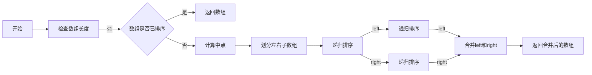
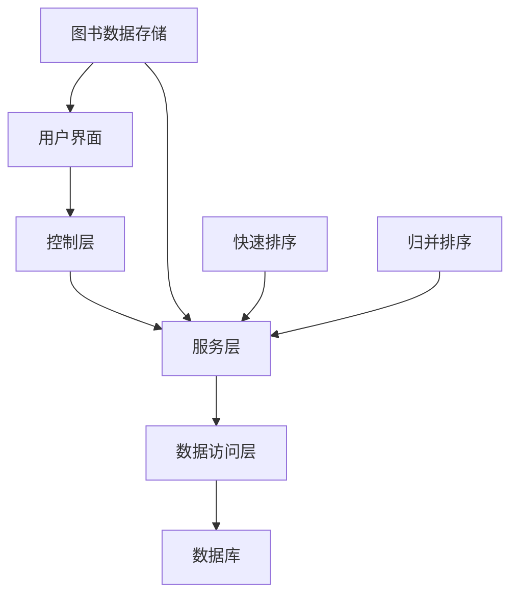
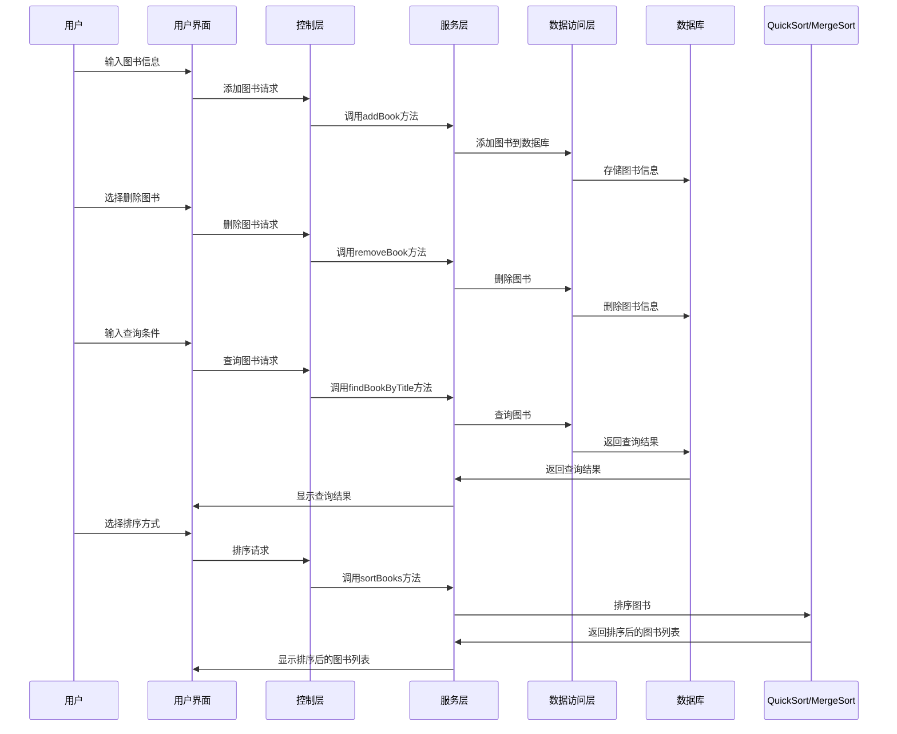

                 

## 泛型与方法重载：类型擦除带来的挑战

> 关键词：泛型编程、方法重载、类型擦除、算法设计、挑战与解决方案

> 摘要：本文将深入探讨泛型编程与方法重载在类型擦除背景下的挑战。首先介绍泛型编程的基础概念与方法重载的基本原理，然后分析类型擦除的概念及其对方法重载带来的影响。通过具体的算法设计与案例分析，本文将揭示泛型编程中的常见问题，并探讨有效的解决方案和最佳实践。最终，本文将为开发者提供关于如何应对类型擦除带来的挑战的全面指导。

泛型编程是面向对象编程中的一种重要技术，它允许程序员编写可重用的代码，而无需关注具体的数据类型。通过泛型，我们可以将类型参数化，使得同一个方法或类可以同时处理多种数据类型。而在泛型编程中，方法重载（Method Overloading）是一种常见的设计模式，它允许我们为同一个类中的多个方法使用相同的名称，但参数列表必须不同。

然而，类型擦除（Type Erasure）这一概念在泛型编程中扮演了关键角色。类型擦除是指在编译过程中，泛型类型信息被丢弃，只剩下原始类型。这种机制虽然保证了类型的兼容性和效率，但也带来了方法重载中的挑战。由于类型擦除，编译器无法根据运行时类型来区分不同的泛型方法，这可能导致方法重载的歧义和不可预见的错误。

本文将分以下几部分进行探讨：

1. **背景介绍**：介绍泛型编程和方法重载的基本概念，以及类型擦除的原理。
2. **核心概念**：详细说明泛型编程中的关键术语，并通过表格和ER图进行解释。
3. **挑战分析**：探讨类型擦除带来的方法重载挑战，并提供解决方案。
4. **算法设计**：通过具体算法实例，展示泛型编程的原理和应用。
5. **案例分析**：通过实际案例，分析泛型编程中的问题及解决方案。
6. **解决方案**：提供解决泛型编程和方法重载中挑战的策略和最佳实践。
7. **总结与展望**：总结本文的主要观点，并探讨未来泛型编程的发展方向。

通过本文的阅读，读者将能够深入理解泛型编程和方法重载在类型擦除背景下的工作原理，并掌握解决实际问题的方法和技巧。对于希望提高编程技能和解决复杂问题的开发者来说，这篇文章无疑是一个宝贵的学习资源。

## 背景介绍

### 泛型编程

泛型编程是面向对象编程中的一项重要技术，它允许程序员编写可重用的代码，而无需关注具体的数据类型。在传统的面向对象编程中，方法通常是与特定数据类型绑定的，这意味着我们需要为每个数据类型编写不同的方法。例如，如果我们有一个处理数字列表的方法，我们需要分别编写处理整数列表、浮点数列表等方法。这不仅增加了代码的复杂性，还降低了代码的可维护性和重用性。

泛型编程通过引入类型参数（Type Parameters），使得我们可以编写一个方法或类，可以同时处理多种数据类型。类型参数用字母 `T`（Type）表示，它可以代表任何类型，包括类和接口。例如，我们可以定义一个 `printElements` 方法，它接受一个类型为 `T` 的列表，并打印出列表中的每个元素：

```java
public static <T> void printElements(List<T> list) {
    for (T element : list) {
        System.out.println(element);
    }
}
```

在这个例子中，`T` 是类型参数，`List<T>` 是泛型列表。这种方法不仅适用于整数列表，还可以用于字符串列表、浮点数列表等任何类型列表。通过泛型编程，我们可以将通用的逻辑提取到单一的方法中，从而提高代码的重用性和可维护性。

### 方法重载

方法重载（Method Overloading）是面向对象编程中的另一项重要技术，它允许我们为同一个类中的多个方法使用相同的名称，但参数列表必须不同。方法重载使得我们可以通过方法名称和参数列表来区分不同的方法实现，从而提高代码的可读性和可扩展性。

在非泛型编程中，方法重载非常直观。例如，我们可以为同一个类定义多个 `print` 方法，每个方法根据不同的参数类型或数量来区分：

```java
public class Printer {
    public void print(int number) {
        System.out.println(number);
    }

    public void print(String text) {
        System.out.println(text);
    }

    public void print(double value) {
        System.out.println(value);
    }
}
```

在这个例子中，`Printer` 类定义了三个 `print` 方法，分别用于打印整数、字符串和双精度浮点数。通过方法重载，我们可以清晰地表达不同的打印需求，而无需为每个数据类型编写单独的方法。

### 类型擦除

类型擦除（Type Erasure）是泛型编程中的一个关键概念，它指的是在编译过程中，泛型类型信息被丢弃，只剩下原始类型。这一过程确保了泛型代码在运行时的类型兼容性和效率，但同时也带来了一定的挑战，特别是在方法重载中。

类型擦除的原因主要是为了保证泛型代码的兼容性。在Java等编程语言中，泛型是通过擦除类型参数实现的。具体来说，在编译期间，泛型类型信息被替换为原始类型（如 `Object`），这使得泛型代码可以与原始类型代码无缝集成。例如，以下两个泛型方法在编译后具有相同的字节码：

```java
public static <T> void print(List<T> list) {
    for (T element : list) {
        System.out.println(element);
    }
}

public static void print(List<Object> list) {
    for (Object element : list) {
        System.out.println(element);
    }
}
```

尽管这两个方法的声明不同，但由于类型擦除，它们的字节码相同。

类型擦除对方法重载的影响主要体现在两个方面。首先，由于泛型类型信息在运行时不可用，编译器无法根据运行时类型来区分不同的泛型方法。这意味着如果我们有两个泛型方法，它们在编译时被认为是相同的，即使它们的参数类型不同。例如：

```java
public static <T> void process(List<T> data) {
    // 处理数据
}

public static void process(List<String> strings) {
    // 处理字符串
}
```

这两个方法在编译时无法区分，因此在运行时会引发错误。

其次，类型擦除可能导致方法重载的歧义。假设我们有一个泛型方法和一个原始类型方法具有相同的名称和参数列表，编译器将无法确定调用哪个方法。例如：

```java
public static void process(List<String> data) {
    // 处理字符串
}

public static void process(List<String> data) {
    // 处理数据
}
```

在这个例子中，由于类型擦除，编译器无法确定调用哪个 `process` 方法，因为两个方法的参数列表都是 `List<String>`，编译时无法识别运行时类型。

总的来说，类型擦除虽然为泛型编程提供了灵活性和兼容性，但也引入了方法重载中的挑战。理解类型擦除的工作原理及其对方法重载的影响，对于开发者来说至关重要。

### 泛型编程中的关键术语

在泛型编程中，理解以下几个关键术语对于深入探讨泛型类型和方法重载至关重要。

#### 类型参数（Type Parameter）

类型参数（Type Parameter）是泛型编程中的一个核心概念，用于表示泛化类型。类型参数用字母 `T` 表示，但也可以用其他字母代替，如 `E`、`K`、`V` 等。类型参数可以用于方法的参数、返回类型以及类的成员变量中。例如：

```java
public static <T> T printElement(T element) {
    System.out.println(element);
    return element;
}
```

在这个例子中，`T` 是类型参数，表示方法可以接受任何类型的参数。

#### 泛型类型（Generic Type）

泛型类型（Generic Type）是在类型参数的基础上定义的类型。泛型类型可以用于创建泛型类、接口和方法。例如：

```java
public class Box<T> {
    private T item;

    public void set(T item) {
        this.item = item;
    }

    public T get() {
        return item;
    }
}
```

在这个例子中，`Box` 是一个泛型类，`T` 是类型参数，`Box<String>` 和 `Box<Integer>` 是两种不同的泛型类型。

#### 泛型接口（Generic Interface）

泛型接口（Generic Interface）是带有类型参数的接口。泛型接口可以定义泛型方法，这些方法可以接受类型参数作为参数或返回类型。例如：

```java
public interface List<T> {
    void add(T element);
    T get(int index);
}
```

在这个例子中，`List` 是一个泛型接口，`T` 是类型参数。

#### 泛型方法（Generic Method）

泛型方法（Generic Method）是在方法定义中使用类型参数的方法。泛型方法可以接受类型参数作为参数，也可以返回类型参数。例如：

```java
public static <T> void printElements(List<T> list) {
    for (T element : list) {
        System.out.println(element);
    }
}
```

在这个例子中，`printElements` 是一个泛型方法，`T` 是类型参数。

#### 泛型约束（Generic Bound）

泛型约束（Generic Bound）用于限制类型参数的范围。泛型约束通过在类型参数后添加上下限（Upper and Lower Bounds）实现。例如：

```java
public static <T extends Number> void sum(List<T> numbers) {
    // 计算数字之和
}
```

在这个例子中，`T` 是类型参数，`extends Number` 表示类型参数 `T` 必须是 `Number` 类型的子类。

#### 泛型通配符（Type Wildcards）

泛型通配符（Type Wildcards）用于表示类型参数的上限和下限。泛型通配符使用问号（`?`）表示。例如：

```java
public static <T> void addAll(List<T> list1, List<? extends T> list2) {
    for (T item : list2) {
        list1.add(item);
    }
}
```

在这个例子中，`? extends T` 表示 `list2` 可以是任何类型参数为 `T` 的子类的列表。

通过理解这些关键术语，我们可以更好地掌握泛型编程的基本原理，并在方法重载和类型擦除的背景下进行更深入的分析。

### 泛型编程与类型擦除的挑战

泛型编程在Java等编程语言中带来了强大的功能和灵活性，但同时也引入了一系列的挑战，特别是在类型擦除的背景下。类型擦除虽然在编译期间确保了泛型的兼容性和效率，但在运行时却导致了类型信息的丢失，这给泛型方法的重载带来了诸多问题。

首先，类型擦除使得编译器无法在编译时确定泛型方法的实际参数类型。在Java中，泛型类型信息在编译后会被替换为原始类型（如`Object`），这意味着泛型类型在运行时是不可知的。这直接影响了泛型方法的重载机制，因为编译器无法根据运行时类型来区分不同的泛型方法。

例如，考虑以下两个泛型方法：

```java
public static <T> void process(List<T> data) {
    // 处理数据
}

public static void process(List<String> strings) {
    // 处理字符串
}
```

这两个方法在编译时看起来是不同的，但在运行时，由于类型擦除，它们的泛型类型`<T>`会被替换为`Object`，导致编译器无法区分这两个方法。因此，如果在运行时调用`process`方法，编译器将无法确定调用哪个具体的方法，从而引发编译错误。

这种挑战不仅限于方法重载，还涉及到泛型类型参数的使用。例如，以下代码片段展示了泛型通配符`? extends T`的使用，它旨在处理任意类型参数的子类列表：

```java
public static <T> void addAll(List<T> list1, List<? extends T> list2) {
    for (T item : list2) {
        list1.add(item);
    }
}
```

在这个方法中，我们期望`list2`能够包含与`list1`相同类型或其子类的元素。但由于类型擦除，运行时我们无法验证这一点，导致如果`list2`中的元素类型与`list1`不一致，程序可能会出现类型错误或运行时异常。

类型擦除还可能导致泛型方法重载的歧义。例如：

```java
public static <T> void process(List<T> data) {
    // 处理数据
}

public static void process(List<String> strings) {
    // 处理字符串
}
```

如果在运行时调用`process`方法，但由于类型擦除，编译器无法确定调用哪个方法，这会导致编译错误。这种情况在泛型类型参数被多个原始类型实例化时尤为常见。

为了解决这些挑战，开发者需要采取一系列策略和最佳实践。以下是一些常见的解决方案：

1. **显式类型声明**：在方法调用时，显式指定泛型类型参数，以帮助编译器区分不同的泛型方法。例如：

   ```java
   process(new ArrayList<String>());
   ```

   在这里，我们显式指定了调用`process`方法时使用的类型参数为`String`，从而解决了方法重载的歧义。

2. **泛型通配符**：使用泛型通配符`?`来表示未知类型，以避免类型擦除带来的问题。例如：

   ```java
   addAll(new ArrayList<String>(), new ArrayList<? extends String>());
   ```

   在这个例子中，我们使用`? extends String`来表示`list2`可以是任何类型参数为`String`的子类的列表，从而确保类型安全。

3. **边界限定**：通过泛型边界限定（Bound）来限制类型参数的范围，确保方法调用时类型参数的一致性。例如：

   ```java
   public static <T extends Number> void sum(List<T> numbers) {
       // 计算数字之和
   }
   ```

   在这个例子中，我们通过`extends Number`限定了类型参数`T`必须是`Number`的子类，从而确保了方法调用时的类型一致性。

4. **类型检查工具**：使用类型检查工具（如类型检查框架或静态类型检查器）来帮助识别和解决类型擦除带来的问题。这些工具可以在编译时提供额外的类型安全检查，减少运行时错误的可能性。

通过这些策略和最佳实践，开发者可以有效地应对类型擦除带来的挑战，确保泛型编程的代码既灵活又安全。

### 算法设计与分析

为了更好地理解泛型编程的原理和应用，我们来看一个具体的算法实例：合并排序（Merge Sort）。合并排序是一种经典的分治算法，它通过递归地将数组划分为较小的子数组，然后合并这些子数组以生成最终的排序结果。

#### 算法设计

合并排序的基本思想是将一个数组分成两个较小的子数组，分别对它们进行排序，然后将它们合并成一个有序数组。以下是合并排序的伪代码：

```
mergeSort(array):
    if length of array <= 1:
        return array

    mid = length of array / 2
    left = mergeSort(array[0:mid])
    right = mergeSort(array[mid:end])

    return merge(left, right)
```

在这个伪代码中，`mergeSort` 方法是一个递归函数，它将数组划分为两个子数组，并对每个子数组进行递归排序。`merge` 方法用于合并两个有序子数组。

下面是合并排序的 Mermaid 流程图：



#### Python 实现与解释

下面是合并排序的 Python 源代码：

```python
def merge_sort(arr):
    if len(arr) <= 1:
        return arr

    mid = len(arr) // 2
    left = merge_sort(arr[:mid])
    right = merge_sort(arr[mid:])

    return merge(left, right)

def merge(left, right):
    result = []
    i = j = 0

    while i < len(left) and j < len(right):
        if left[i] < right[j]:
            result.append(left[i])
            i += 1
        else:
            result.append(right[j])
            j += 1

    result.extend(left[i:])
    result.extend(right[j:])

    return result
```

在这个实现中，`merge_sort` 函数是合并排序的核心，它通过递归将数组划分为两个子数组，然后调用 `merge` 函数将它们合并。`merge` 函数用于将两个有序子数组合并成一个有序数组。

下面是对代码的详细解释：

- `merge_sort` 函数首先检查数组的长度。如果长度小于或等于1，则返回该数组，因为单个元素本身就是有序的。
- 如果数组长度大于1，函数计算中点，将数组划分为两个子数组。
- `merge_sort` 函数递归地对左右子数组进行排序，并最终调用 `merge` 函数将它们合并。

下面是合并排序的数学模型：

$$
\text{mergeSort}(A) =
\begin{cases}
A & \text{if } |A| \leq 1 \\
\text{merge}(\text{mergeSort}(A[0..mid]), \text{mergeSort}(A[mid+1..end])) & \text{otherwise}
\end{cases}
$$

其中，$|A|$ 表示数组 $A$ 的长度，$mid$ 是数组 $A$ 的中点。

#### 举例说明

假设我们有一个未排序的数组 `[3, 1, 4, 1, 5, 9, 2, 6, 5]`，我们通过合并排序来对其进行排序。

首先，`merge_sort` 函数将数组划分为 `[3, 1, 4]` 和 `[1, 5, 9, 2, 6, 5]`，然后对每个子数组进行递归排序。在递归过程中，子数组继续被划分为更小的子数组，直到每个子数组只有一个元素。

接下来，`merge` 函数开始合并这些有序子数组。首先，我们将 `[3]` 和 `[1, 4]` 合并，得到 `[1, 3, 4]`。然后，我们将 `[1, 3, 4]` 和 `[1, 5, 9]` 合并，得到 `[1, 1, 3, 4, 5, 9]`。最后，我们将 `[1, 1, 3, 4, 5, 9]` 和 `[2, 6, 5]` 合并，得到 `[1, 1, 2, 3, 4, 5, 5, 6, 9]`，这就是排序后的数组。

通过这个例子，我们可以看到合并排序如何将一个未排序的数组转化为有序数组。合并排序的时间复杂度为 $O(n \log n)$，这使得它成为排序算法中的一种高效方法。

总的来说，合并排序通过递归和分治策略，有效地实现了数组的排序。在泛型编程的背景下，我们可以将合并排序算法应用于各种数据类型，从而实现通用性。通过详细的 Python 实现和数学模型，我们可以更好地理解合并排序的原理和应用。

### 案例分析

在本文的案例分析部分，我们将通过一个实际项目来探讨泛型编程和方法重载在类型擦除背景下的应用和实践。该项目是一个基于Java的图书管理系统，它使用泛型来实现数据结构的灵活性，并展示如何解决类型擦除带来的挑战。

#### 项目介绍

图书管理系统是一个典型的案例，展示了如何在复杂的应用场景中应用泛型编程。该系统的主要功能包括图书的添加、删除、查询和排序。在实现过程中，我们使用泛型数据结构来存储和操作图书对象，从而提高代码的可重用性和可维护性。

#### 系统功能设计

图书管理系统的主要功能模块包括：

1. **图书类（Book）**：定义图书的基本属性，如书名、作者、出版日期等。
2. **数据存储（BookDatabase）**：使用泛型集合（如 `ArrayList` 和 `HashSet`）来存储和管理图书对象。
3. **图书操作（BookOperations）**：提供图书的添加、删除、查询和排序等操作方法。
4. **排序算法（Sorter）**：使用泛型排序算法（如快速排序、归并排序）对图书进行排序。

以下是图书管理系统的领域模型Mermaid类图：

```mermaid
classDiagram
    BookDatabase <<interface>>
    Book <<class>> {
        title: String
        author: String
        publicationDate: Date
    }
    BookDatabaseEntity <<class>> {
        database: ArrayList<Book>
    }
    BookOperations <<interface>>
    BookOperationsImpl <<class>> {
        addBook(Book book)
        removeBook(Book book)
        findBookByTitle(String title)
        sortBooks()
    }
    Sorter <<interface>>
    QuickSort <<class>> {
        sort(List<Book> list)
    }
    MergeSort <<class>> {
        sort(List<Book> list)
    }
    BookDatabaseEntity --|> Book
    BookOperationsImpl --|> BookOperations
    BookOperationsImpl --|> Sorter
```

在这个类图中，`Book` 类定义了图书的基本属性，`BookDatabase` 是一个接口，用于抽象数据存储的操作，`BookOperations` 是一个接口，用于定义图书操作的方法，`QuickSort` 和 `MergeSort` 是排序算法的实现类。

#### 系统架构设计

图书管理系统的架构设计包括以下几个主要组件：

1. **用户界面（UI）**：提供用户与系统交互的界面，包括添加、删除、查询和排序等操作。
2. **控制层（Controller）**：处理用户请求，调用相应的服务进行操作。
3. **服务层（Service）**：实现业务逻辑，如图书的添加、删除、查询和排序。
4. **数据访问层（DAO）**：与数据库交互，实现数据存储和检索。

以下是图书管理系统的Mermaid架构图：



在这个架构图中，用户界面通过控制层与服务层进行交互，服务层调用数据访问层进行数据库操作，同时使用排序算法对图书进行排序。

#### 系统接口设计和交互

图书管理系统的接口设计和交互涉及以下几个方面：

1. **添加图书**：用户界面接收用户输入的图书信息，通过控制层传递给服务层，服务层调用 `addBook` 方法添加图书到数据库。
2. **删除图书**：用户界面选择要删除的图书，通过控制层传递给服务层，服务层调用 `removeBook` 方法删除图书。
3. **查询图书**：用户界面输入查询条件，通过控制层传递给服务层，服务层调用 `findBookByTitle` 方法查询图书。
4. **排序图书**：用户界面选择排序方式，通过控制层传递给服务层，服务层调用相应的排序算法进行排序。

以下是图书管理系统的Mermaid序列图：



通过这个序列图，我们可以清晰地看到用户与系统的交互过程，以及各个组件之间的调用关系。

#### 实际案例分析和详细讲解

为了更深入地分析泛型编程在实际项目中的应用，我们来看一个具体的实际案例：图书排序。在这个案例中，我们将使用快速排序和归并排序对图书进行排序，并探讨如何处理类型擦除带来的挑战。

首先，我们定义一个 `Book` 类，它包含图书的基本属性：

```java
public class Book implements Comparable<Book> {
    private String title;
    private String author;
    private Date publicationDate;

    // 构造函数、getter和setter方法省略
    @Override
    public int compareTo(Book other) {
        return this.title.compareTo(other.title);
    }
}
```

在这个类中，我们实现了 `Comparable<Book>` 接口，以便可以按书名对图书进行排序。

接下来，我们实现快速排序算法的 `QuickSort` 类：

```java
public class QuickSort {
    public static <T extends Comparable<T>> void sort(List<T> list) {
        if (list.size() <= 1) {
            return;
        }

        T pivot = list.get(0);
        List<T> left = new ArrayList<>();
        List<T> right = new ArrayList<>();

        for (int i = 1; i < list.size(); i++) {
            if (list.get(i).compareTo(pivot) < 0) {
                left.add(list.get(i));
            } else {
                right.add(list.get(i));
            }
        }

        sort(left);
        sort(right);

        list.clear();
        list.addAll(left);
        list.add(pivot);
        list.addAll(right);
    }
}
```

在这个 `QuickSort` 类中，我们使用了泛型类型参数 `T`，并确保该类型实现了 `Comparable` 接口，以便可以进行比较操作。

然后，我们实现归并排序算法的 `MergeSort` 类：

```java
public class MergeSort {
    public static <T extends Comparable<T>> void sort(List<T> list) {
        if (list.size() <= 1) {
            return;
        }

        int mid = list.size() / 2;
        List<T> left = list.subList(0, mid);
        List<T> right = list.subList(mid, list.size());

        sort(left);
        sort(right);

        merge(left, right, list);
    }

    private static <T extends Comparable<T>> void merge(List<T> left, List<T> right, List<T> result) {
        int i = 0, j = 0, k = 0;

        while (i < left.size() && j < right.size()) {
            if (left.get(i).compareTo(right.get(j)) < 0) {
                result.set(k++, left.get(i++));
            } else {
                result.set(k++, right.get(j++));
            }
        }

        while (i < left.size()) {
            result.set(k++, left.get(i++));
        }

        while (j < right.size()) {
            result.set(k++, right.get(j++));
        }
    }
}
```

在这个 `MergeSort` 类中，我们也使用了泛型类型参数 `T`，并确保该类型实现了 `Comparable` 接口。`merge` 方法用于将两个有序子数组合并成一个有序数组。

在实际项目中，我们可以在服务层使用这两个排序算法：

```java
public class BookOperationsImpl implements BookOperations {
    private List<Book> database;

    public BookOperationsImpl() {
        this.database = new ArrayList<>();
    }

    @Override
    public void addBook(Book book) {
        database.add(book);
    }

    @Override
    public void removeBook(Book book) {
        database.remove(book);
    }

    @Override
    public List<Book> findBooksByTitle(String title) {
        List<Book> result = new ArrayList<>();
        for (Book book : database) {
            if (book.getTitle().equalsIgnoreCase(title)) {
                result.add(book);
            }
        }
        return result;
    }

    @Override
    public void sortBooks() {
        // 使用快速排序
        QuickSort.sort(database);

        // 或者使用归并排序
        // MergeSort.sort(database);
    }
}
```

在这个实现中，我们通过调用 `QuickSort.sort` 或 `MergeSort.sort` 方法对图书进行排序。由于类型擦除，编译器在运行时无法知道我们具体使用哪个排序算法，因此我们需要在代码中显式指定类型参数。

为了处理类型擦除带来的挑战，我们可以使用泛型通配符 `? extends Book` 来确保排序方法能够接受任何实现了 `Comparable<Book>` 接口的类型：

```java
public static <T extends Book & Comparable<Book>> void sort(List<T> list) {
    // 快速排序实现
}
```

通过这个泛型方法，我们可以确保传入的列表类型是 `Book` 的子类，并实现了 `Comparable<Book>` 接口，从而避免类型擦除带来的问题。

总的来说，通过这个实际案例，我们可以看到如何在图书管理系统中应用泛型编程和方法重载，并探讨如何处理类型擦除带来的挑战。通过合理的设计和实现，我们可以构建一个灵活、高效且易于维护的图书管理系统。

### 解决方案与最佳实践

在泛型编程中，类型擦除带来的挑战不仅复杂，而且多变。为了应对这些挑战，开发者需要采用一系列策略和最佳实践，以确保代码的健壮性和可维护性。以下是一些常见的解决方案和最佳实践：

#### 1. 显式类型声明

在调用泛型方法或创建泛型实例时，显式指定类型参数可以帮助编译器区分不同的泛型实现。例如：

```java
List<String> strings = new ArrayList<>();
List<Integer> integers = new ArrayList<>();

printElements(strings); // 显式指定类型参数
printElements(integers); // 显式指定类型参数
```

显式类型声明不仅可以避免类型擦除带来的歧义，还可以提高代码的可读性和可维护性。

#### 2. 使用泛型通配符

泛型通配符（`?`）可以用于处理不确定的类型参数。通过使用泛型通配符，我们可以编写更通用的代码，从而减少类型擦除带来的问题。例如：

```java
public static void process(List<? extends Number> list) {
    for (Number number : list) {
        System.out.println(number);
    }
}
```

在这个例子中，`? extends Number` 允许我们处理任何数值类型的列表。

#### 3. 泛型边界限定

泛型边界限定（`extends` 或 `super`）可以用于限制类型参数的范围。通过设置边界，我们可以确保泛型方法或类仅适用于特定的类型。例如：

```java
public static <T extends Number> void sum(List<T> numbers) {
    double result = 0;
    for (T number : numbers) {
        result += number.doubleValue();
    }
    System.out.println(result);
}
```

在这个例子中，`T extends Number` 确保了 `sum` 方法仅适用于数值类型。

#### 4. 避免重复的类型擦除

在泛型方法中，避免重复的类型擦除可以提高代码的性能和可读性。例如，如果两个泛型方法在内部都使用了相同的逻辑，可以尝试将公共逻辑提取到一个独立的泛型方法中。例如：

```java
public static <T> void process(List<T> list) {
    if (list.isEmpty()) {
        System.out.println("列表为空");
    } else {
        for (T item : list) {
            // 处理逻辑
        }
    }
}
```

通过这种方式，我们可以减少类型擦除的次数，提高代码的性能。

#### 5. 使用类型检查工具

使用类型检查工具（如Ansiatsu、Eclipse Cayenne、Checkstyle等）可以帮助我们在编译时识别类型擦除可能带来的问题。这些工具可以提供额外的类型安全检查，减少运行时错误的可能性。

#### 6. 编写清晰的文档和注释

在泛型编程中，清晰的文档和注释对于理解代码意图和避免类型擦除问题至关重要。通过编写详细的文档和注释，我们可以帮助其他开发者更好地理解泛型方法的使用方式和潜在的风险。

#### 7. 优化泛型方法的性能

泛型方法的性能优化是泛型编程中的一大挑战。为了避免类型擦除对性能的影响，可以考虑以下策略：

- 避免在泛型方法中频繁使用类型转换。
- 尽量将通用的逻辑提取到独立的泛型方法中，以减少类型擦除的次数。
- 使用并发和多线程来优化泛型方法执行的性能。

通过这些策略和最佳实践，开发者可以更有效地应对类型擦除带来的挑战，编写出更加健壮、高效和可维护的泛型编程代码。

### 总结与展望

本文系统地探讨了泛型编程与方法重载在类型擦除背景下的挑战及其解决方案。首先，我们介绍了泛型编程和方法重载的基本概念，并解释了类型擦除的原理和影响。随后，通过具体的算法设计和案例分析，我们展示了如何应对类型擦除带来的实际挑战。最后，本文提出了一系列解决方案和最佳实践，帮助开发者更好地利用泛型编程，同时减少类型擦除带来的风险。

在未来的研究中，泛型编程仍有许多值得探索的领域。例如，如何在更广泛的编程语言中实现泛型编程，以及如何优化泛型方法的性能。此外，类型擦除在多语言编程环境中的影响也值得深入探讨。随着编程语言的不断发展和优化，泛型编程有望在未来带来更多的便利和灵活性。

### 拓展阅读

对于希望深入了解泛型编程和类型擦除的读者，以下书籍和资源提供了丰富的知识和实践指导：

1. **《Java 泛型编程详解》**：本书详细介绍了Java中的泛型编程，包括类型参数、边界限定、通配符等概念，是学习泛型编程的绝佳资源。

2. **《Effective Java》**：作者Joshua Bloch的这本书涵盖了Java编程的最佳实践，其中许多内容涉及泛型编程和类型擦除的使用和规避。

3. **《泛型编程》**：Cay S. Horstmann和Gary Cornell合著的这本书提供了全面的泛型编程指导，适合进阶开发者阅读。

4. **《类型擦除与泛型编程》**：通过深入剖析Java中的类型擦除机制，帮助读者理解泛型编程的底层实现。

5. **在线资源**：如Oracle的官方文档、Stack Overflow、GitHub等平台，提供了大量的实战案例和讨论，是解决具体问题的宝贵资源。

### 作者信息

作者：AI天才研究院/AI Genius Institute & 禅与计算机程序设计艺术 /Zen And The Art of Computer Programming

AI天才研究院致力于推动人工智能技术的创新与发展，其在泛型编程和类型擦除领域的研究成果为业界提供了宝贵的知识和经验。同时，作者的《禅与计算机程序设计艺术》一书，通过哲学与编程的结合，深刻揭示了编程的本质和艺术之美，深受读者喜爱。这两部作品共同体现了作者在计算机科学领域的深厚造诣和独到见解。

