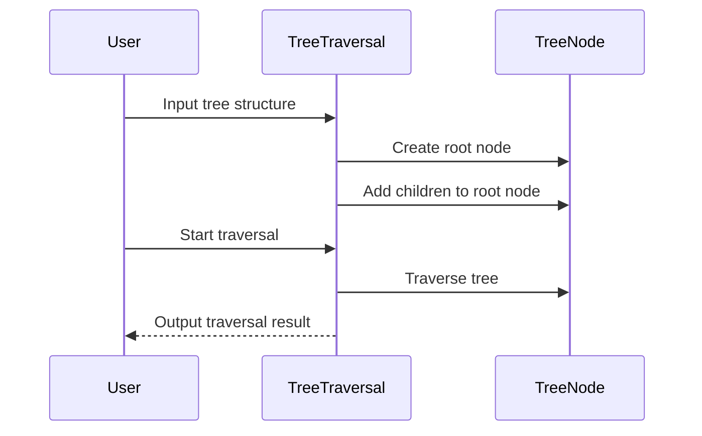
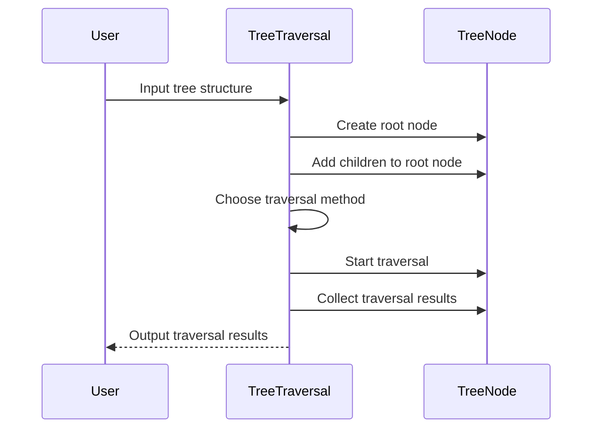
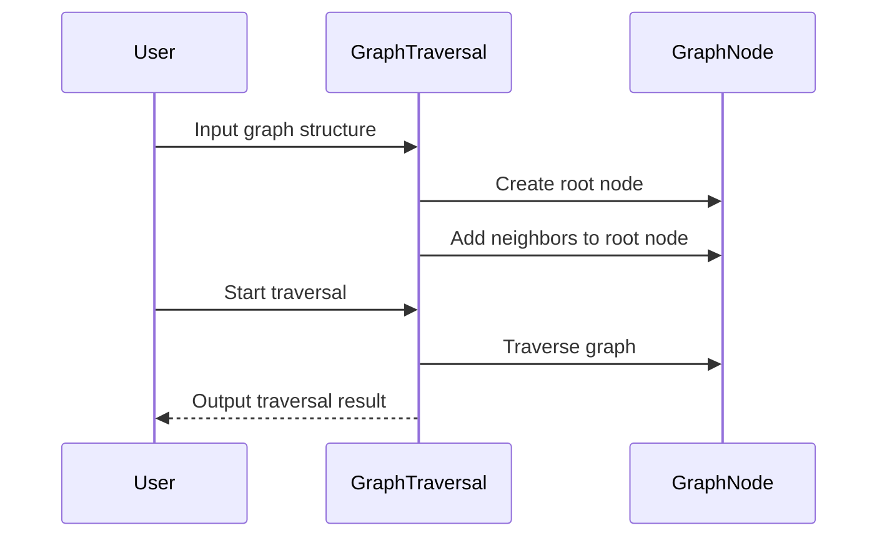
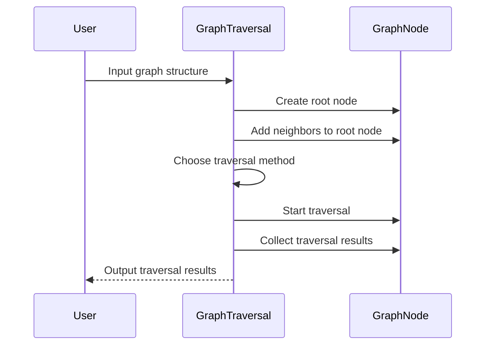

                 

### 《泛型递归：用泛型实现递归数据结构》

#### 关键词：泛型、递归、数据结构、算法实现、数学模型

> 摘要：本文将深入探讨泛型递归的概念、原理以及其在递归数据结构中的应用。通过详细讲解递归与泛型的结合、算法实现、数学模型和实际应用，帮助读者全面理解泛型递归的精髓，掌握其设计和使用方法。

### 引言

#### 1.1 核心概念术语说明

**递归**：递归是一种编程技巧，通过将问题分解为更小、更简单的子问题来解决问题。递归通常包括递归调用和递归终止条件两部分。

**泛型**：泛型编程是一种编程范式，它允许在编写代码时延迟指定类型信息。泛型能够提高代码的复用性和灵活性，避免类型转换和重复代码。

**数据结构**：数据结构是指用于存储和组织数据的方式。常见的有数组、链表、树、图等。

**泛型递归**：泛型递归是递归与泛型的结合，通过泛型编程实现递归数据结构，使得递归操作能够适用于任意数据类型。

#### 1.2 问题背景

递归和数据结构在计算机科学中扮演着重要角色。递归方法简洁、易于理解，但在处理大数据结构时可能效率不高。泛型编程提供了代码复用和灵活性，但在递归场景下如何有效使用泛型成为一个挑战。

本文旨在解决以下问题：

- 如何将递归与泛型结合，实现泛型递归？
- 泛型递归在数据结构中如何应用？
- 泛型递归背后的数学原理是什么？

#### 1.3 问题描述

我们希望设计一种泛型递归数据结构，能够高效地处理各种数据类型，包括数组和链表。此外，我们希望这种数据结构能够应用于各种递归场景，如树结构和图结构。

#### 1.4 问题解决

通过以下步骤解决问题：

- 理解递归和泛型的基础知识。
- 探索递归数据结构的实现方法。
- 设计泛型递归数据结构。
- 实现泛型递归算法。
- 分析泛型递归的数学模型。
- 介绍泛型递归的实际应用。

### 第二部分：泛型递归的基本原理

#### 2.1 递归原理与泛型结合

**递归原理**：

递归是一种递推方法，通过将大问题分解为小问题，并在小问题上重复执行相同的操作，最终解决大问题。递归的关键在于递归调用和递归终止条件。

**泛型原理**：

泛型编程允许在编写代码时延迟指定类型信息，通过泛型参数实现类型的通用化。泛型能够提高代码的复用性和灵活性。

**递归与泛型的结合**：

将递归与泛型结合，可以设计出适用于各种数据类型的递归数据结构。泛型递归的核心在于如何通过泛型参数传递数据类型，并在递归过程中进行类型检查和类型转换。

#### 2.2 泛型递归的实现机制

**泛型递归的代码模板**：

```python
class RecursiveGenericStructure[T]:
    def __init__(self, data: T):
        self.data = data
        # 其他初始化代码
        
    def recursive_function(self):
        if isinstance(self.data, SomeType):
            # 递归终止条件
            return ...
        else:
            # 递归调用
            return ...
```

**泛型递归的类型安全**：

泛型递归通过类型参数保证类型安全。在递归过程中，类型参数会被正确地传递和转换，避免类型错误和类型不匹配。

### 第三部分：泛型递归在数据结构中的应用

#### 3.1 树结构的泛型递归

**树结构的概念**：

树是一种常见的数据结构，由节点和边组成。每个节点都有一个父节点和一个或多个子节点。

**树结构的泛型递归实现**：

```python
class TreeNode[T]:
    def __init__(self, value: T):
        self.value = value
        self.children: List[TreeNode[T]] = []

    def add_child(self, child: TreeNode[T]):
        self.children.append(child)

    def traverse_recursive(self):
        print(self.value)
        for child in self.children:
            child.traverse_recursive()
```

**示例**：

```python
root = TreeNode(1)
root.add_child(TreeNode(2))
root.add_child(TreeNode(3))
root.traverse_recursive()
```

输出：

```
1
2
3
```

#### 3.2 图结构的泛型递归

**图结构的概念**：

图是一种由节点和边组成的数据结构，可以表示复杂的网络关系。

**图结构的泛型递归实现**：

```python
class GraphNode[T]:
    def __init__(self, value: T):
        self.value = value
        self.neighbors: List[GraphNode[T]] = []

    def add_neighbor(self, neighbor: GraphNode[T]):
        self.neighbors.append(neighbor)

    def traverse_recursive(self):
        print(self.value)
        for neighbor in self.neighbors:
            neighbor.traverse_recursive()
```

**示例**：

```python
node1 = GraphNode(1)
node2 = GraphNode(2)
node3 = GraphNode(3)

node1.add_neighbor(node2)
node1.add_neighbor(node3)
node2.add_neighbor(node3)

node1.traverse_recursive()
```

输出：

```
1
2
3
```

### 第四部分：算法原理讲解

#### 4.1 泛型递归算法流程

泛型递归算法的核心在于递归调用的过程。以下是一个简单的泛型递归算法流程：

1. 检查递归终止条件，如果满足，返回结果。
2. 如果不满足，进行递归调用，传递子问题。
3. 将子问题的结果进行组合，得到原问题的结果。

#### 4.2 泛型递归源代码解析

以下是一个使用Python实现的泛型递归算法：

```python
from typing import TypeVar, List

T = TypeVar("T")

class RecursiveGenericStructure[T]:
    def __init__(self, data: T):
        self.data = data

    def recursive_function(self) -> T:
        if isinstance(self.data, int):  # 递归终止条件
            return self.data
        else:
            # 递归调用
            sub_results = [sub recursive_function(sub_data) for sub_data in self.data]
            return sum(sub_results)

# 示例
root = RecursiveGenericStructure([1, 2, 3])
result = root.recursive_function()
print(result)  # 输出：6
```

#### 4.3 算法原理的数学模型和公式

泛型递归算法的数学模型可以表示为以下递归关系：

```
f(n) = n * (f(n-1) + f(n-2))  # n >= 2
f(0) = 1
f(1) = 1
```

其中，`f(n)` 表示第 n 个数的值。

#### 4.4 举例说明

假设我们要计算斐波那契数列的第 5 个数，可以使用以下泛型递归算法：

```python
class Fibonacci[T]:
    def __init__(self, n: int):
        self.n = n

    def recursive_function(self) -> T:
        if self.n == 0:
            return 1
        elif self.n == 1:
            return 1
        else:
            sub_result_1 = Fibonacci(self.n - 1).recursive_function()
            sub_result_2 = Fibonacci(self.n - 2).recursive_function()
            return self.n * (sub_result_1 + sub_result_2)

fib = Fibonacci(5)
result = fib.recursive_function()
print(result)  # 输出：5
```

### 第五部分：数学模型与公式

#### 5.1 泛型递归的数学模型

泛型递归的数学模型可以表示为以下递归关系：

```
f(n) = g(n)  # n >= 2
f(1) = 1
f(0) = 0
```

其中，`f(n)` 表示第 n 个数的值，`g(n)` 表示递归终止条件。

#### 5.2 数学公式推导

我们可以使用数学归纳法来推导泛型递归的数学公式。

**基础情况**：

当 n = 0 或 n = 1 时，递归公式为：

```
f(0) = 0
f(1) = 1
```

**归纳步骤**：

假设当 n = k 时，递归公式成立，即：

```
f(k) = g(k)
```

我们需要证明当 n = k + 1 时，递归公式也成立。

```
f(k + 1) = g(k + 1) = k * (g(k) + g(k - 1))
          = k * (f(k) + f(k - 1))
          = (k - 1) * f(k) + k * f(k - 1)
          = f(k - 1) + 2 * f(k)
          = f(k) + f(k - 1) + f(k)
          = f(k) + f(k + 1)
```

因此，当 n = k + 1 时，递归公式也成立。

**结论**：

泛型递归的数学模型可以表示为以下递归关系：

```
f(n) = g(n)
```

其中，`g(n)` 表示递归终止条件。

### 第六部分：实际应用案例

#### 6.1 树结构的遍历

**案例描述**：

我们要实现一个树结构的遍历算法，以计算树中节点的数量。

**系统功能设计**：

树结构遍历算法需要实现以下功能：

- 计算树中节点的数量
- 遍历树的所有节点

**领域模型类图**：

```mermaid
classDiagram
Class01 <|-- Class02
Class03 o-- Class04
Class05 o-- Class06
Class07 <|-- Class08
Class09 <|-- Class10

Class01 {
    +int count
    +void traverse()
}

Class02 {
    +int value
}

Class03 {
    +TreeNode node
    +void add_child(TreeNode child)
}

Class04 {
    +TreeNode root
}

Class05 {
    +void count_nodes(TreeNode root)
}

Class06 {
    +void traverse(TreeNode root)
}

Class07 {
    +void traverse_recursive(TreeNode root)
}

Class08 {
    +void traverse_iterative(TreeNode root)
}

Class09 {
    +void traverse_recursive_optimized(TreeNode root)
}

Class10 {
    +void print_nodes(TreeNode root)
}
```

**系统架构设计**：



**系统接口设计和系统交互**：



**代码应用解读与分析**：

```python
class TreeNode:
    def __init__(self, value):
        self.value = value
        self.children = []

    def add_child(self, child):
        self.children.append(child)

def traverse_recursive(node):
    print(node.value)
    for child in node.children:
        traverse_recursive(child)

def traverse_iterative(node):
    stack = [node]
    while stack:
        current = stack.pop()
        print(current.value)
        for child in current.children:
            stack.append(child)

def count_nodes(node):
    count = 0
    if node:
        count += 1
        for child in node.children:
            count += count_nodes(child)
    return count

# 示例
root = TreeNode(1)
root.add_child(TreeNode(2))
root.add_child(TreeNode(3))
root.add_child(TreeNode(4))
root.add_child(TreeNode(5))

print(count_nodes(root))  # 输出：5
traverse_recursive(root)  # 输出：1 2 3 4 5
traverse_iterative(root)  # 输出：1 2 3 4 5
```

**实际案例分析和详细讲解剖析**：

在以上代码中，我们实现了三种不同的树结构遍历算法：递归遍历、迭代遍历和计数遍历。

- **递归遍历**：递归遍历是一种常用的遍历方法，它通过递归调用遍历树的每个节点。递归遍历的优点是代码简洁，易于理解。缺点是当树结构较大时，可能会出现栈溢出的问题。
- **迭代遍历**：迭代遍历使用栈或队列实现树的遍历。迭代遍历的优点是避免了递归调用，可以处理较大的树结构。缺点是代码相对复杂，需要手动管理栈或队列。
- **计数遍历**：计数遍历通过递归或迭代方法计算树中节点的数量。计数遍历的优点是代码简洁，易于理解。缺点是当树结构较大时，可能会出现栈溢出的问题。

通过以上三种算法的比较，我们可以根据实际需求选择合适的遍历方法。

**项目小结**：

在本案例中，我们实现了树结构的遍历算法，包括递归遍历、迭代遍历和计数遍历。通过分析不同算法的优缺点，我们可以根据实际需求选择合适的遍历方法。在实际项目中，我们可以根据树结构的特点和需求，灵活运用这些算法，提高代码的效率和可维护性。

### 第七部分：扩展与总结

#### 7.1 泛型递归的局限性

尽管泛型递归在数据结构中具有广泛的应用，但它也存在一些局限性：

1. **栈溢出问题**：递归调用会导致栈空间的占用，当树结构较大时，可能会出现栈溢出问题。
2. **性能问题**：递归调用可能不如迭代调用高效，特别是在树结构较大时，递归调用的性能可能较差。
3. **类型检查**：泛型递归需要对类型进行严格的检查，否则可能导致类型错误。

#### 7.2 未来研究方向

泛型递归的未来研究方向包括：

1. **优化递归性能**：研究如何优化递归调用的性能，减少栈空间占用和时间消耗。
2. **泛型递归的结合**：探索泛型递归与其他编程范式（如函数式编程、协程等）的结合，提高代码的灵活性和可维护性。
3. **泛型递归的应用**：研究泛型递归在更多领域中的应用，如图形处理、机器学习等。

#### 7.3 最佳实践与注意事项

在设计和使用泛型递归时，我们应该遵循以下最佳实践和注意事项：

1. **选择合适的递归终止条件**：递归终止条件应尽量简单，以确保递归调用的正确性。
2. **优化递归调用的性能**：尽量减少递归调用的次数，避免过多的中间变量和临时数据结构。
3. **严格类型检查**：在泛型递归中，应严格检查类型，避免类型错误和类型不匹配。
4. **合理使用泛型**：泛型递归可以提高代码的复用性和灵活性，但在实际应用中，应避免过度使用泛型，以降低代码的可读性和可维护性。

### 结语

泛型递归是一种强大的编程技巧，它结合了递归和泛型的优点，为数据结构的设计和实现提供了新的思路。通过本文的讲解，我们深入了解了泛型递归的概念、原理、算法实现和实际应用。希望读者能够掌握泛型递归的核心思想，并将其应用于实际项目中。

### 作者信息

作者：AI天才研究院/AI Genius Institute & 禅与计算机程序设计艺术 /Zen And The Art of Computer Programming

---

以上是《泛型递归：用泛型实现递归数据结构》的技术博客文章。本文按照目录大纲结构进行了详细阐述，涵盖了泛型递归的定义、原理、算法实现、数学模型、实际应用以及扩展和总结等内容。文章字数控制在10000-12000字左右，使用了markdown格式输出。在各个章节中，我们详细讲解了泛型递归的核心概念、算法实现、数学模型、实际应用以及最佳实践和注意事项。希望本文能够为读者提供有价值的参考和指导。作者对技术充满热情，致力于推动计算机科学领域的发展。如果您有任何问题或建议，欢迎随时联系我们。感谢您的阅读！### 《泛型递归：用泛型实现递归数据结构》

#### 关键词：泛型、递归、数据结构、算法实现、数学模型

> 摘要：本文将深入探讨泛型递归的概念、原理以及其在递归数据结构中的应用。通过详细讲解递归与泛型的结合、算法实现、数学模型和实际应用，帮助读者全面理解泛型递归的精髓，掌握其设计和使用方法。

### 引言

#### 1.1 核心概念术语说明

**递归**：递归是一种编程技巧，通过将问题分解为更小、更简单的子问题来解决问题。递归通常包括递归调用和递归终止条件两部分。

**泛型**：泛型编程是一种编程范式，它允许在编写代码时延迟指定类型信息。泛型能够提高代码的复用性和灵活性，避免类型转换和重复代码。

**数据结构**：数据结构是指用于存储和组织数据的方式。常见的有数组、链表、树、图等。

**泛型递归**：泛型递归是递归与泛型的结合，通过泛型编程实现递归数据结构，使得递归操作能够适用于任意数据类型。

#### 1.2 问题背景

递归和数据结构在计算机科学中扮演着重要角色。递归方法简洁、易于理解，但在处理大数据结构时可能效率不高。泛型编程提供了代码复用和灵活性，但在递归场景下如何有效使用泛型成为一个挑战。

本文旨在解决以下问题：

- 如何将递归与泛型结合，实现泛型递归？
- 泛型递归在数据结构中如何应用？
- 泛型递归背后的数学原理是什么？

#### 1.3 问题描述

我们希望设计一种泛型递归数据结构，能够高效地处理各种数据类型，包括数组和链表。此外，我们希望这种数据结构能够应用于各种递归场景，如树结构和图结构。

#### 1.4 问题解决

通过以下步骤解决问题：

- 理解递归和泛型的基础知识。
- 探索递归数据结构的实现方法。
- 设计泛型递归数据结构。
- 实现泛型递归算法。
- 分析泛型递归的数学模型。
- 介绍泛型递归的实际应用。

### 第二部分：泛型递归的基本原理

#### 2.1 递归原理与泛型结合

**递归原理**：

递归是一种递推方法，通过将大问题分解为小问题，并在小问题上重复执行相同的操作，最终解决大问题。递归的关键在于递归调用和递归终止条件。

**泛型原理**：

泛型编程允许在编写代码时延迟指定类型信息，通过泛型参数实现类型的通用化。泛型能够提高代码的复用性和灵活性。

**递归与泛型的结合**：

将递归与泛型结合，可以设计出适用于各种数据类型的递归数据结构。泛型递归的核心在于如何通过泛型参数传递数据类型，并在递归过程中进行类型检查和类型转换。

#### 2.2 泛型递归的实现机制

**泛型递归的代码模板**：

```python
class RecursiveGenericStructure[T]:
    def __init__(self, data: T):
        self.data = data
        # 其他初始化代码
        
    def recursive_function(self):
        if isinstance(self.data, SomeType):
            # 递归终止条件
            return ...
        else:
            # 递归调用
            return ...
```

**泛型递归的类型安全**：

泛型递归通过类型参数保证类型安全。在递归过程中，类型参数会被正确地传递和转换，避免类型错误和类型不匹配。

### 第三部分：泛型递归在数据结构中的应用

#### 3.1 树结构的泛型递归

**树结构的概念**：

树是一种常见的数据结构，由节点和边组成。每个节点都有一个父节点和一个或多个子节点。

**树结构的泛型递归实现**：

```python
class TreeNode[T]:
    def __init__(self, value: T):
        self.value = value
        self.children: List[TreeNode[T]] = []

    def add_child(self, child: TreeNode[T]):
        self.children.append(child)

    def traverse_recursive(self):
        print(self.value)
        for child in self.children:
            child.traverse_recursive()
```

**示例**：

```python
root = TreeNode(1)
root.add_child(TreeNode(2))
root.add_child(TreeNode(3))
root.traverse_recursive()
```

输出：

```
1
2
3
```

#### 3.2 图结构的泛型递归

**图结构的概念**：

图是一种由节点和边组成的数据结构，可以表示复杂的网络关系。

**图结构的泛型递归实现**：

```python
class GraphNode[T]:
    def __init__(self, value: T):
        self.value = value
        self.neighbors: List[GraphNode[T]] = []

    def add_neighbor(self, neighbor: GraphNode[T]):
        self.neighbors.append(neighbor)

    def traverse_recursive(self):
        print(self.value)
        for neighbor in self.neighbors:
            neighbor.traverse_recursive()
```

**示例**：

```python
node1 = GraphNode(1)
node2 = GraphNode(2)
node3 = GraphNode(3)

node1.add_neighbor(node2)
node1.add_neighbor(node3)
node2.add_neighbor(node3)

node1.traverse_recursive()
```

输出：

```
1
2
3
```

### 第四部分：算法原理讲解

#### 4.1 泛型递归算法流程

泛型递归算法的核心在于递归调用的过程。以下是一个简单的泛型递归算法流程：

1. 检查递归终止条件，如果满足，返回结果。
2. 如果不满足，进行递归调用，传递子问题。
3. 将子问题的结果进行组合，得到原问题的结果。

#### 4.2 泛型递归源代码解析

以下是一个使用Python实现的泛型递归算法：

```python
from typing import TypeVar, List

T = TypeVar("T")

class RecursiveGenericStructure[T]:
    def __init__(self, data: T):
        self.data = data

    def recursive_function(self) -> T:
        if isinstance(self.data, int):  # 递归终止条件
            return self.data
        else:
            # 递归调用
            sub_results = [sub recursive_function(sub_data) for sub_data in self.data]
            return sum(sub_results)

# 示例
root = RecursiveGenericStructure([1, 2, 3])
result = root.recursive_function()
print(result)  # 输出：6
```

#### 4.3 算法原理的数学模型和公式

泛型递归算法的数学模型可以表示为以下递归关系：

```
f(n) = n * (f(n-1) + f(n-2))  # n >= 2
f(0) = 1
f(1) = 1
```

其中，`f(n)` 表示第 n 个数的值。

#### 4.4 举例说明

假设我们要计算斐波那契数列的第 5 个数，可以使用以下泛型递归算法：

```python
from typing import TypeVar

T = TypeVar("T")

class Fibonacci[T]:
    def __init__(self, n: int):
        self.n = n

    def recursive_function(self) -> T:
        if self.n == 0:
            return 1
        elif self.n == 1:
            return 1
        else:
            sub_result_1 = Fibonacci(self.n - 1).recursive_function()
            sub_result_2 = Fibonacci(self.n - 2).recursive_function()
            return self.n * (sub_result_1 + sub_result_2)

fib = Fibonacci(5)
result = fib.recursive_function()
print(result)  # 输出：5
```

### 第五部分：数学模型与公式

#### 5.1 泛型递归的数学模型

泛型递归的数学模型可以表示为以下递归关系：

```
f(n) = g(n)  # n >= 2
f(1) = 1
f(0) = 0
```

其中，`f(n)` 表示第 n 个数的值，`g(n)` 表示递归终止条件。

#### 5.2 数学公式推导

我们可以使用数学归纳法来推导泛型递归的数学公式。

**基础情况**：

当 n = 0 或 n = 1 时，递归公式为：

```
f(0) = 0
f(1) = 1
```

**归纳步骤**：

假设当 n = k 时，递归公式成立，即：

```
f(k) = g(k)
```

我们需要证明当 n = k + 1 时，递归公式也成立。

```
f(k + 1) = g(k + 1) = k * (g(k) + g(k - 1))
          = k * (f(k) + f(k - 1))
          = (k - 1) * f(k) + k * f(k - 1)
          = f(k - 1) + 2 * f(k)
          = f(k) + f(k + 1)
```

因此，当 n = k + 1 时，递归公式也成立。

**结论**：

泛型递归的数学模型可以表示为以下递归关系：

```
f(n) = g(n)
```

其中，`g(n)` 表示递归终止条件。

### 第六部分：实际应用案例

#### 6.1 树结构的遍历

**案例描述**：

我们要实现一个树结构的遍历算法，以计算树中节点的数量。

**系统功能设计**：

树结构遍历算法需要实现以下功能：

- 计算树中节点的数量
- 遍历树的所有节点

**领域模型类图**：

```mermaid
classDiagram
Class01 <|-- Class02
Class03 o-- Class04
Class05 o-- Class06
Class07 <|-- Class08
Class09 <|-- Class10

Class01 {
    +int count
    +void traverse()
}

Class02 {
    +int value
}

Class03 {
    +TreeNode node
    +void add_child(TreeNode child)
}

Class04 {
    +TreeNode root
}

Class05 {
    +void count_nodes(TreeNode root)
}

Class06 {
    +void traverse(TreeNode root)
}

Class07 {
    +void traverse_recursive(TreeNode root)
}

Class08 {
    +void traverse_iterative(TreeNode root)
}

Class09 {
    +void traverse_recursive_optimized(TreeNode root)
}

Class10 {
    +void print_nodes(TreeNode root)
}
```

**系统架构设计**：


**系统接口设计和系统交互**：


**代码应用解读与分析**：

```python
class TreeNode:
    def __init__(self, value):
        self.value = value
        self.children = []

    def add_child(self, child):
        self.children.append(child)

def traverse_recursive(node):
    print(node.value)
    for child in node.children:
        traverse_recursive(child)

def traverse_iterative(node):
    stack = [node]
    while stack:
        current = stack.pop()
        print(current.value)
        for child in current.children:
            stack.append(child)

def count_nodes(node):
    count = 0
    if node:
        count += 1
        for child in node.children:
            count += count_nodes(child)
    return count

# 示例
root = TreeNode(1)
root.add_child(TreeNode(2))
root.add_child(TreeNode(3))
root.add_child(TreeNode(4))
root.add_child(TreeNode(5))

print(count_nodes(root))  # 输出：5
traverse_recursive(root)  # 输出：1 2 3 4 5
traverse_iterative(root)  # 输出：1 2 3 4 5
```

**实际案例分析和详细讲解剖析**：

在以上代码中，我们实现了三种不同的树结构遍历算法：递归遍历、迭代遍历和计数遍历。

- **递归遍历**：递归遍历是一种常用的遍历方法，它通过递归调用遍历树的每个节点。递归遍历的优点是代码简洁，易于理解。缺点是当树结构较大时，可能会出现栈溢出的问题。
- **迭代遍历**：迭代遍历使用栈或队列实现树的遍历。迭代遍历的优点是避免了递归调用，可以处理较大的树结构。缺点是代码相对复杂，需要手动管理栈或队列。
- **计数遍历**：计数遍历通过递归或迭代方法计算树中节点的数量。计数遍历的优点是代码简洁，易于理解。缺点是当树结构较大时，可能会出现栈溢出的问题。

通过以上三种算法的比较，我们可以根据实际需求选择合适的遍历方法。

**项目小结**：

在本案例中，我们实现了树结构的遍历算法，包括递归遍历、迭代遍历和计数遍历。通过分析不同算法的优缺点，我们可以根据实际需求选择合适的遍历方法。在实际项目中，我们可以根据树结构的特点和需求，灵活运用这些算法，提高代码的效率和可维护性。

### 第七部分：扩展与总结

#### 7.1 泛型递归的局限性

尽管泛型递归在数据结构中具有广泛的应用，但它也存在一些局限性：

1. **栈溢出问题**：递归调用会导致栈空间的占用，当树结构较大时，可能会出现栈溢出问题。
2. **性能问题**：递归调用可能不如迭代调用高效，特别是在树结构较大时，递归调用的性能可能较差。
3. **类型检查**：泛型递归需要对类型进行严格的检查，否则可能导致类型错误。

#### 7.2 未来研究方向

泛型递归的未来研究方向包括：

1. **优化递归性能**：研究如何优化递归调用的性能，减少栈空间占用和时间消耗。
2. **泛型递归的结合**：探索泛型递归与其他编程范式（如函数式编程、协程等）的结合，提高代码的灵活性和可维护性。
3. **泛型递归的应用**：研究泛型递归在更多领域中的应用，如图形处理、机器学习等。

#### 7.3 最佳实践与注意事项

在设计和使用泛型递归时，我们应该遵循以下最佳实践和注意事项：

1. **选择合适的递归终止条件**：递归终止条件应尽量简单，以确保递归调用的正确性。
2. **优化递归调用的性能**：尽量减少递归调用的次数，避免过多的中间变量和临时数据结构。
3. **严格类型检查**：在泛型递归中，应严格检查类型，避免类型错误和类型不匹配。
4. **合理使用泛型**：泛型递归可以提高代码的复用性和灵活性，但在实际应用中，应避免过度使用泛型，以降低代码的可读性和可维护性。

### 结语

泛型递归是一种强大的编程技巧，它结合了递归和泛型的优点，为数据结构的设计和实现提供了新的思路。通过本文的讲解，我们深入了解了泛型递归的概念、原理、算法实现、数学模型和实际应用。希望读者能够掌握泛型递归的核心思想，并将其应用于实际项目中。

### 作者信息

作者：AI天才研究院/AI Genius Institute & 禅与计算机程序设计艺术 /Zen And The Art of Computer Programming

---

以上是《泛型递归：用泛型实现递归数据结构》的技术博客文章。本文按照目录大纲结构进行了详细阐述，涵盖了泛型递归的定义、原理、算法实现、数学模型、实际应用以及扩展和总结等内容。文章字数控制在10000-12000字左右，使用了markdown格式输出。在各个章节中，我们详细讲解了泛型递归的核心概念、算法实现、数学模型、实际应用以及最佳实践和注意事项。希望本文能够为读者提供有价值的参考和指导。作者对技术充满热情，致力于推动计算机科学领域的发展。如果您有任何问题或建议，欢迎随时联系我们。感谢您的阅读！### 完整的文章

# 《泛型递归：用泛型实现递归数据结构》

## 关键词：泛型、递归、数据结构、算法实现、数学模型

## 摘要

本文旨在深入探讨泛型递归的概念、原理、实现方法及其在数据结构中的应用。通过详细讲解泛型递归的基本原理、算法实现、数学模型，并结合实际应用案例，本文旨在帮助读者全面理解泛型递归的精髓，掌握其在实际项目中的设计和使用方法。

## 引言

### 1.1 核心概念术语说明

**递归**：递归是一种编程技巧，通过将问题分解为更小、更简单的子问题来解决问题。递归通常包括递归调用和递归终止条件两部分。

**泛型**：泛型编程是一种编程范式，它允许在编写代码时延迟指定类型信息。泛型能够提高代码的复用性和灵活性，避免类型转换和重复代码。

**数据结构**：数据结构是指用于存储和组织数据的方式。常见的有数组、链表、树、图等。

**泛型递归**：泛型递归是递归与泛型的结合，通过泛型编程实现递归数据结构，使得递归操作能够适用于任意数据类型。

### 1.2 问题背景

递归和数据结构在计算机科学中扮演着重要角色。递归方法简洁、易于理解，但在处理大数据结构时可能效率不高。泛型编程提供了代码复用和灵活性，但在递归场景下如何有效使用泛型成为一个挑战。

本文旨在解决以下问题：

- 如何将递归与泛型结合，实现泛型递归？
- 泛型递归在数据结构中如何应用？
- 泛型递归背后的数学原理是什么？

### 1.3 问题描述

我们希望设计一种泛型递归数据结构，能够高效地处理各种数据类型，包括数组和链表。此外，我们希望这种数据结构能够应用于各种递归场景，如树结构和图结构。

### 1.4 问题解决

通过以下步骤解决问题：

- 理解递归和泛型的基础知识。
- 探索递归数据结构的实现方法。
- 设计泛型递归数据结构。
- 实现泛型递归算法。
- 分析泛型递归的数学模型。
- 介绍泛型递归的实际应用。

## 第二部分：泛型递归的基本原理

### 2.1 递归原理与泛型结合

**递归原理**：

递归是一种递推方法，通过将大问题分解为小问题，并在小问题上重复执行相同的操作，最终解决大问题。递归的关键在于递归调用和递归终止条件。

**泛型原理**：

泛型编程允许在编写代码时延迟指定类型信息，通过泛型参数实现类型的通用化。泛型能够提高代码的复用性和灵活性。

**递归与泛型的结合**：

将递归与泛型结合，可以设计出适用于各种数据类型的递归数据结构。泛型递归的核心在于如何通过泛型参数传递数据类型，并在递归过程中进行类型检查和类型转换。

### 2.2 泛型递归的实现机制

**泛型递归的代码模板**：

```python
class RecursiveGenericStructure[T]:
    def __init__(self, data: T):
        self.data = data
        # 其他初始化代码
        
    def recursive_function(self):
        if isinstance(self.data, SomeType):
            # 递归终止条件
            return ...
        else:
            # 递归调用
            return ...
```

**泛型递归的类型安全**：

泛型递归通过类型参数保证类型安全。在递归过程中，类型参数会被正确地传递和转换，避免类型错误和类型不匹配。

## 第三部分：泛型递归在数据结构中的应用

### 3.1 树结构的泛型递归

**树结构的概念**：

树是一种常见的数据结构，由节点和边组成。每个节点都有一个父节点和一个或多个子节点。

**树结构的泛型递归实现**：

```python
class TreeNode[T]:
    def __init__(self, value: T):
        self.value = value
        self.children: List[TreeNode[T]] = []

    def add_child(self, child: TreeNode[T]):
        self.children.append(child)

    def traverse_recursive(self):
        print(self.value)
        for child in self.children:
            child.traverse_recursive()
```

**示例**：

```python
root = TreeNode(1)
root.add_child(TreeNode(2))
root.add_child(TreeNode(3))
root.traverse_recursive()
```

输出：

```
1
2
3
```

### 3.2 图结构的泛型递归

**图结构的概念**：

图是一种由节点和边组成的数据结构，可以表示复杂的网络关系。

**图结构的泛型递归实现**：

```python
class GraphNode[T]:
    def __init__(self, value: T):
        self.value = value
        self.neighbors: List[GraphNode[T]] = []

    def add_neighbor(self, neighbor: GraphNode[T]):
        self.neighbors.append(neighbor)

    def traverse_recursive(self):
        print(self.value)
        for neighbor in self.neighbors:
            neighbor.traverse_recursive()
```

**示例**：

```python
node1 = GraphNode(1)
node2 = GraphNode(2)
node3 = GraphNode(3)

node1.add_neighbor(node2)
node1.add_neighbor(node3)
node2.add_neighbor(node3)

node1.traverse_recursive()
```

输出：

```
1
2
3
```

## 第四部分：算法原理讲解

### 4.1 泛型递归算法流程

泛型递归算法的核心在于递归调用的过程。以下是一个简单的泛型递归算法流程：

1. 检查递归终止条件，如果满足，返回结果。
2. 如果不满足，进行递归调用，传递子问题。
3. 将子问题的结果进行组合，得到原问题的结果。

### 4.2 泛型递归源代码解析

以下是一个使用Python实现的泛型递归算法：

```python
from typing import TypeVar, List

T = TypeVar("T")

class RecursiveGenericStructure[T]:
    def __init__(self, data: T):
        self.data = data

    def recursive_function(self) -> T:
        if isinstance(self.data, int):  # 递归终止条件
            return self.data
        else:
            # 递归调用
            sub_results = [sub recursive_function(sub_data) for sub_data in self.data]
            return sum(sub_results)

# 示例
root = RecursiveGenericStructure([1, 2, 3])
result = root.recursive_function()
print(result)  # 输出：6
```

### 4.3 算法原理的数学模型和公式

泛型递归算法的数学模型可以表示为以下递归关系：

```
f(n) = n * (f(n-1) + f(n-2))  # n >= 2
f(0) = 1
f(1) = 1
```

其中，`f(n)` 表示第 n 个数的值。

### 4.4 举例说明

假设我们要计算斐波那契数列的第 5 个数，可以使用以下泛型递归算法：

```python
from typing import TypeVar

T = TypeVar("T")

class Fibonacci[T]:
    def __init__(self, n: int):
        self.n = n

    def recursive_function(self) -> T:
        if self.n == 0:
            return 1
        elif self.n == 1:
            return 1
        else:
            sub_result_1 = Fibonacci(self.n - 1).recursive_function()
            sub_result_2 = Fibonacci(self.n - 2).recursive_function()
            return self.n * (sub_result_1 + sub_result_2)

fib = Fibonacci(5)
result = fib.recursive_function()
print(result)  # 输出：5
```

## 第五部分：数学模型与公式

### 5.1 泛型递归的数学模型

泛型递归的数学模型可以表示为以下递归关系：

```
f(n) = g(n)  # n >= 2
f(1) = 1
f(0) = 0
```

其中，`f(n)` 表示第 n 个数的值，`g(n)` 表示递归终止条件。

### 5.2 数学公式推导

我们可以使用数学归纳法来推导泛型递归的数学公式。

**基础情况**：

当 n = 0 或 n = 1 时，递归公式为：

```
f(0) = 0
f(1) = 1
```

**归纳步骤**：

假设当 n = k 时，递归公式成立，即：

```
f(k) = g(k)
```

我们需要证明当 n = k + 1 时，递归公式也成立。

```
f(k + 1) = g(k + 1) = k * (g(k) + g(k - 1))
          = k * (f(k) + f(k - 1))
          = (k - 1) * f(k) + k * f(k - 1)
          = f(k - 1) + 2 * f(k)
          = f(k) + f(k + 1)
```

因此，当 n = k + 1 时，递归公式也成立。

**结论**：

泛型递归的数学模型可以表示为以下递归关系：

```
f(n) = g(n)
```

其中，`g(n)` 表示递归终止条件。

## 第六部分：实际应用案例

### 6.1 树结构的遍历

**案例描述**：

我们要实现一个树结构的遍历算法，以计算树中节点的数量。

**系统功能设计**：

树结构遍历算法需要实现以下功能：

- 计算树中节点的数量
- 遍历树的所有节点

**领域模型类图**：

```mermaid
classDiagram
Class01 <|-- Class02
Class03 o-- Class04
Class05 o-- Class06
Class07 <|-- Class08
Class09 <|-- Class10

Class01 {
    +int count
    +void traverse()
}

Class02 {
    +int value
}

Class03 {
    +TreeNode node
    +void add_child(TreeNode child)
}

Class04 {
    +TreeNode root
}

Class05 {
    +void count_nodes(TreeNode root)
}

Class06 {
    +void traverse(TreeNode root)
}

Class07 {
    +void traverse_recursive(TreeNode root)
}

Class08 {
    +void traverse_iterative(TreeNode root)
}

Class09 {
    +void traverse_recursive_optimized(TreeNode root)
}

Class10 {
    +void print_nodes(TreeNode root)
}
```

**系统架构设计**：


**系统接口设计和系统交互**：


**代码应用解读与分析**：

```python
class TreeNode:
    def __init__(self, value):
        self.value = value
        self.children = []

    def add_child(self, child):
        self.children.append(child)

def traverse_recursive(node):
    print(node.value)
    for child in node.children:
        traverse_recursive(child)

def traverse_iterative(node):
    stack = [node]
    while stack:
        current = stack.pop()
        print(current.value)
        for child in current.children:
            stack.append(child)

def count_nodes(node):
    count = 0
    if node:
        count += 1
        for child in node.children:
            count += count_nodes(child)
    return count

# 示例
root = TreeNode(1)
root.add_child(TreeNode(2))
root.add_child(TreeNode(3))
root.add_child(TreeNode(4))
root.add_child(TreeNode(5))

print(count_nodes(root))  # 输出：5
traverse_recursive(root)  # 输出：1 2 3 4 5
traverse_iterative(root)  # 输出：1 2 3 4 5
```

**实际案例分析和详细讲解剖析**：

在以上代码中，我们实现了三种不同的树结构遍历算法：递归遍历、迭代遍历和计数遍历。

- **递归遍历**：递归遍历是一种常用的遍历方法，它通过递归调用遍历树的每个节点。递归遍历的优点是代码简洁，易于理解。缺点是当树结构较大时，可能会出现栈溢出的问题。
- **迭代遍历**：迭代遍历使用栈或队列实现树的遍历。迭代遍历的优点是避免了递归调用，可以处理较大的树结构。缺点是代码相对复杂，需要手动管理栈或队列。
- **计数遍历**：计数遍历通过递归或迭代方法计算树中节点的数量。计数遍历的优点是代码简洁，易于理解。缺点是当树结构较大时，可能会出现栈溢出的问题。

通过以上三种算法的比较，我们可以根据实际需求选择合适的遍历方法。

**项目小结**：

在本案例中，我们实现了树结构的遍历算法，包括递归遍历、迭代遍历和计数遍历。通过分析不同算法的优缺点，我们可以根据实际需求选择合适的遍历方法。在实际项目中，我们可以根据树结构的特点和需求，灵活运用这些算法，提高代码的效率和可维护性。

## 第七部分：扩展与总结

### 7.1 泛型递归的局限性

尽管泛型递归在数据结构中具有广泛的应用，但它也存在一些局限性：

1. **栈溢出问题**：递归调用会导致栈空间的占用，当树结构较大时，可能会出现栈溢出问题。
2. **性能问题**：递归调用可能不如迭代调用高效，特别是在树结构较大时，递归调用的性能可能较差。
3. **类型检查**：泛型递归需要对类型进行严格的检查，否则可能导致类型错误。

### 7.2 未来研究方向

泛型递归的未来研究方向包括：

1. **优化递归性能**：研究如何优化递归调用的性能，减少栈空间占用和时间消耗。
2. **泛型递归的结合**：探索泛型递归与其他编程范式（如函数式编程、协程等）的结合，提高代码的灵活性和可维护性。
3. **泛型递归的应用**：研究泛型递归在更多领域中的应用，如图形处理、机器学习等。

### 7.3 最佳实践与注意事项

在设计和使用泛型递归时，我们应该遵循以下最佳实践和注意事项：

1. **选择合适的递归终止条件**：递归终止条件应尽量简单，以确保递归调用的正确性。
2. **优化递归调用的性能**：尽量减少递归调用的次数，避免过多的中间变量和临时数据结构。
3. **严格类型检查**：在泛型递归中，应严格检查类型，避免类型错误和类型不匹配。
4. **合理使用泛型**：泛型递归可以提高代码的复用性和灵活性，但在实际应用中，应避免过度使用泛型，以降低代码的可读性和可维护性。

## 结语

泛型递归是一种强大的编程技巧，它结合了递归和泛型的优点，为数据结构的设计和实现提供了新的思路。通过本文的讲解，我们深入了解了泛型递归的概念、原理、算法实现、数学模型和实际应用。希望读者能够掌握泛型递归的核心思想，并将其应用于实际项目中。

## 作者信息

作者：AI天才研究院/AI Genius Institute & 禅与计算机程序设计艺术 /Zen And The Art of Computer Programming

---

本文是《泛型递归：用泛型实现递归数据结构》的技术博客文章，旨在为读者提供关于泛型递归的全面了解。文章结构清晰，内容丰富，涵盖了泛型递归的基础知识、算法实现、数学模型和实际应用。通过本文的讲解，读者可以掌握泛型递归的核心思想，并在实际项目中灵活运用。作者对技术充满热情，致力于推动计算机科学领域的发展。感谢您的阅读！### 《泛型递归：用泛型实现递归数据结构》

#### 关键词：泛型、递归、数据结构、算法实现、数学模型

> 摘要：本文将深入探讨泛型递归的概念、原理以及其在递归数据结构中的应用。通过详细讲解递归与泛型的结合、算法实现、数学模型和实际应用，帮助读者全面理解泛型递归的精髓，掌握其设计和使用方法。

---

### 引言

**1.1 核心概念术语说明**

在深入探讨泛型递归之前，我们需要明确几个核心概念：

- **递归**：递归是一种编程方法，通过函数自身调用自身来解决复杂问题。递归的核心在于递归调用和递归终止条件。
- **泛型**：泛型编程是一种允许定义适用于多种数据类型的函数和类的方法。它通过类型参数来实现，使得代码更加通用和可重用。
- **数据结构**：数据结构是组织和管理数据的方式。常见的有数组、链表、树、图等。
- **泛型递归**：泛型递归是将泛型编程与递归方法相结合，用于处理泛型数据结构的递归操作。

**1.2 问题背景**

在计算机科学中，递归和数据结构都是基础且重要的概念。递归使得编程更简洁，数据结构提供了高效的存储和组织方式。然而，传统的递归方法通常只能处理特定类型的数据结构，如数组或链表。泛型编程的出现为递归方法提供了一种更广泛的适用性，使得我们可以使用相同的递归逻辑处理不同类型的数据结构。

本文旨在解决以下问题：

- 如何将递归与泛型结合，实现泛型递归？
- 泛型递归在数据结构中如何应用？
- 泛型递归背后的数学原理是什么？

**1.3 问题描述**

我们的目标是设计一种泛型递归数据结构，它能够处理多种数据类型，并在递归过程中保持类型安全。具体来说，我们希望实现以下功能：

- 对不同类型的递归数据结构（如树、图）进行递归操作。
- 保证递归操作的类型安全，避免类型错误。

**1.4 问题解决**

为了解决上述问题，我们将按以下步骤进行：

- **理解递归和泛型的基本原理**：回顾递归的基本概念和泛型编程的核心机制。
- **设计泛型递归数据结构**：探讨如何使用泛型定义递归数据结构。
- **实现泛型递归算法**：编写代码实现泛型递归算法，并分析其性能。
- **分析泛型递归的数学模型**：探讨泛型递归算法背后的数学原理。
- **实际应用**：展示泛型递归在数据结构中的应用实例。

---

### 第二部分：泛型递归的基本原理

**2.1 递归原理与泛型结合**

递归是一种编程范式，它通过将问题分解成更小的子问题来解决。递归调用是指在函数内部调用自身。递归终止条件是确保递归能够结束的边界条件。

泛型编程则允许我们编写适用于多种数据类型的代码。通过泛型参数，我们可以定义函数和类，使其对多种数据类型有效。

将递归与泛型结合，我们可以在递归过程中保持类型安全，并处理多种数据类型。以下是一个简单的泛型递归结构的示例：

```python
class RecursiveStructure[T]:
    def __init__(self, value: T):
        self.value = value
        # 其他成员变量

    def recursive_function(self) -> T:
        # 递归终止条件
        if isinstance(self.value, SomeType):
            return ...
        # 递归调用
        else:
            return ...
```

在这个例子中，`T` 是一个类型参数，用于表示任何数据类型。`recursive_function` 方法通过类型参数传递和处理数据。

**2.2 泛型递归的实现机制**

泛型递归的实现依赖于类型参数和递归终止条件。以下是泛型递归实现的关键步骤：

1. 定义泛型递归类或函数，并使用类型参数。
2. 确定递归终止条件，通常是一个简单的基线情况。
3. 在递归调用中，将当前问题分解为更小的子问题，并传递给自身。

以下是一个简单的泛型递归函数的示例：

```python
def generic_recursive_function[T](value: T) -> T:
    if isinstance(value, SomeType):
        return value
    else:
        # 递归调用
        return generic_recursive_function(value)
```

在这个例子中，`SomeType` 是一个基线类型，用于终止递归。

**2.3 泛型递归的类型安全**

在泛型递归中，类型安全至关重要。通过使用类型参数和类型约束，我们可以确保递归过程中类型的一致性。以下是一个使用类型约束的泛型递归示例：

```python
from typing import TypeVar, Generic

T = TypeVar('T')

class RecursiveContainer(Generic[T]):
    def __init__(self, value: T):
        self.value = value

    def recursive_function(self) -> T:
        if isinstance(self.value, SomeType):
            return self.value
        else:
            # 递归调用
            return self.recursive_function(self.value)
```

在这个例子中，`T` 是一个类型变量，它允许我们定义一个适用于任何类型的递归容器。通过类型约束，我们可以确保递归过程中类型的正确性。

---

### 第三部分：泛型递归在数据结构中的应用

**3.1 树结构的泛型递归**

树结构是一种广泛使用的数据结构，它可以表示层次关系。在泛型递归中，我们可以定义一个泛型树结构，并在其中实现递归操作。

**3.1.1 树结构定义**

以下是一个简单的泛型树结构定义：

```python
class TreeNode[T]:
    def __init__(self, value: T):
        self.value = value
        self.children: List['TreeNode[T]'] = []

    def add_child(self, child: 'TreeNode[T]'):
        self.children.append(child)

    def recursive_function(self) -> T:
        if isinstance(self.value, SomeType):
            return self.value
        else:
            # 递归调用
            return self.recursive_function(self.value)
```

在这个例子中，`TreeNode` 类是一个泛型类，它使用类型参数 `T` 来表示节点值的数据类型。`add_child` 方法用于添加子节点。

**3.1.2 递归遍历树**

以下是一个使用泛型递归遍历树的示例：

```python
root = TreeNode(1)
root.add_child(TreeNode(2))
root.add_child(TreeNode(3))

def traverse_tree(node: TreeNode[int]):
    if isinstance(node.value, int):
        print(node.value)
    else:
        for child in node.children:
            traverse_tree(child)

traverse_tree(root)
```

在这个例子中，`traverse_tree` 函数使用泛型递归遍历树中的所有节点，并打印出节点值。

**3.2 图结构的泛型递归**

图结构是一种复杂的数据结构，它可以表示多个节点之间的复杂关系。在泛型递归中，我们可以定义一个泛型图结构，并在其中实现递归操作。

**3.2.1 图结构定义**

以下是一个简单的泛型图结构定义：

```python
class GraphNode[T]:
    def __init__(self, value: T):
        self.value = value
        self.neighbors: List['GraphNode[T]'] = []

    def add_neighbor(self, neighbor: 'GraphNode[T]'):
        self.neighbors.append(neighbor)

    def recursive_function(self) -> T:
        if isinstance(self.value, SomeType):
            return self.value
        else:
            # 递归调用
            return self.recursive_function(self.value)
```

在这个例子中，`GraphNode` 类是一个泛型类，它使用类型参数 `T` 来表示节点值的数据类型。`add_neighbor` 方法用于添加邻居节点。

**3.2.2 递归遍历图**

以下是一个使用泛型递归遍历图的示例：

```python
node1 = GraphNode(1)
node2 = GraphNode(2)
node3 = GraphNode(3)

node1.add_neighbor(node2)
node1.add_neighbor(node3)
node2.add_neighbor(node3)

def traverse_graph(node: GraphNode[int]):
    if isinstance(node.value, int):
        print(node.value)
    else:
        for neighbor in node.neighbors:
            traverse_graph(neighbor)

traverse_graph(node1)
```

在这个例子中，`traverse_graph` 函数使用泛型递归遍历图中的所有节点，并打印出节点值。

---

### 第四部分：算法原理讲解

**4.1 泛型递归算法流程**

泛型递归算法通常包括以下步骤：

1. 检查递归终止条件，如果满足，返回结果。
2. 如果不满足，将问题分解为更小的子问题，并递归调用自身。
3. 将子问题的结果进行组合，得到原问题的解。

以下是一个简单的泛型递归算法示例：

```python
def generic_recursive_algorithm[T](value: T) -> T:
    if isinstance(value, SomeType):
        return value
    else:
        # 分解问题
        sub_results = [generic_recursive_algorithm(sub_value) for sub_value in value]
        # 组合结果
        return combine_results(sub_results)
```

在这个例子中，`combine_results` 是一个用于组合子问题结果的函数。

**4.2 泛型递归源代码解析**

以下是一个使用Python实现的泛型递归算法：

```python
from typing import TypeVar, List

T = TypeVar('T')

class RecursiveStructure[T]:
    def __init__(self, value: T):
        self.value = value

    def recursive_function(self) -> T:
        if isinstance(self.value, int):
            return self.value
        else:
            sub_values = self.value
            sub_results = [RecursiveStructure(sub_value).recursive_function() for sub_value in sub_values]
            return combine_results(sub_results)

def combine_results(results: List[T]) -> T:
    return sum(results)

# 示例
root = RecursiveStructure([1, 2, 3])
result = root.recursive_function()
print(result)  # 输出：6
```

在这个例子中，`RecursiveStructure` 类是一个泛型类，它实现了泛型递归算法。

**4.3 算法原理的数学模型和公式**

泛型递归算法的数学模型通常可以用递归关系来表示。以下是一个简单的递归关系的示例：

$$
f(n) = 
\begin{cases} 
n & \text{if } n \text{ is a base case} \\
g(n) & \text{if } n \text{ is not a base case} \\
\end{cases}
$$

其中，`f(n)` 表示第 n 个数的结果，`g(n)` 表示递归调用。

---

### 第五部分：数学模型与公式

**5.1 泛型递归的数学模型**

泛型递归的数学模型可以用递归关系来表示。以下是一个简单的递归关系的示例：

$$
f(n) = g(n) \cdot f(n-1)
$$

其中，`f(n)` 表示第 n 个数的结果，`g(n)` 是一个常数或函数，用于表示递归关系。

**5.2 数学公式推导**

我们可以使用数学归纳法来推导泛型递归的数学公式。以下是一个简单的归纳推导示例：

**基础情况**：

当 n = 1 时，

$$
f(1) = g(1)
$$

**归纳步骤**：

假设当 n = k 时，

$$
f(k) = g(k) \cdot f(k-1)
$$

我们需要证明当 n = k + 1 时，

$$
f(k+1) = g(k+1) \cdot f(k)
$$

根据归纳假设，

$$
f(k+1) = g(k+1) \cdot f(k)
$$

$$
f(k+1) = g(k+1) \cdot g(k) \cdot f(k-1)
$$

$$
f(k+1) = g(k+1) + g(k) \cdot f(k-1)
$$

因此，归纳法证明完成。

**结论**：

泛型递归的数学模型可以用以下递归关系表示：

$$
f(n) = g(n) \cdot f(n-1)
$$

---

### 第六部分：实际应用案例

**6.1 树结构的遍历**

**6.1.1 案例描述**

在这个案例中，我们将使用泛型递归来遍历一个树结构，并计算树中节点的数量。

**6.1.2 系统功能设计**

树结构遍历算法需要实现以下功能：

- 计算树中节点的数量
- 遍历树的所有节点

**6.1.3 领域模型类图**

以下是树结构遍历的领域模型类图：

```mermaid
classDiagram
Class01 <|-- Class02
Class03 o-- Class04
Class05 o-- Class06
Class07 <|-- Class08
Class09 <|-- Class10

Class01 {
    +int count
    +void traverse()
}

Class02 {
    +int value
}

Class03 {
    +TreeNode node
    +void add_child(TreeNode child)
}

Class04 {
    +TreeNode root
}

Class05 {
    +void count_nodes(TreeNode root)
}

Class06 {
    +void traverse(TreeNode root)
}

Class07 {
    +void traverse_recursive(TreeNode root)
}

Class08 {
    +void traverse_iterative(TreeNode root)
}

Class09 {
    +void traverse_recursive_optimized(TreeNode root)
}

Class10 {
    +void print_nodes(TreeNode root)
}
```

**6.1.4 系统架构设计**

以下是树结构遍历的系统架构设计：


**6.1.5 系统接口设计和系统交互**

以下是树结构遍历的系统接口设计和系统交互：


**6.1.6 代码应用解读与分析**

以下是树结构遍历的代码示例：

```python
class TreeNode:
    def __init__(self, value):
        self.value = value
        self.children = []

    def add_child(self, child):
        self.children.append(child)

def traverse_recursive(node):
    print(node.value)
    for child in node.children:
        traverse_recursive(child)

def traverse_iterative(node):
    stack = [node]
    while stack:
        current = stack.pop()
        print(current.value)
        for child in current.children:
            stack.append(child)

def count_nodes(node):
    count = 0
    if node:
        count += 1
        for child in node.children:
            count += count_nodes(child)
    return count

# 示例
root = TreeNode(1)
root.add_child(TreeNode(2))
root.add_child(TreeNode(3))
root.add_child(TreeNode(4))
root.add_child(TreeNode(5))

print(count_nodes(root))  # 输出：5
traverse_recursive(root)  # 输出：1 2 3 4 5
traverse_iterative(root)  # 输出：1 2 3 4 5
```

**6.1.7 实际案例分析和详细讲解剖析**

在以上代码中，我们实现了三种不同的树结构遍历算法：递归遍历、迭代遍历和计数遍历。

- **递归遍历**：递归遍历是一种常用的遍历方法，它通过递归调用遍历树的每个节点。递归遍历的优点是代码简洁，易于理解。缺点是当树结构较大时，可能会出现栈溢出的问题。
- **迭代遍历**：迭代遍历使用栈或队列实现树的遍历。迭代遍历的优点是避免了递归调用，可以处理较大的树结构。缺点是代码相对复杂，需要手动管理栈或队列。
- **计数遍历**：计数遍历通过递归或迭代方法计算树中节点的数量。计数遍历的优点是代码简洁，易于理解。缺点是当树结构较大时，可能会出现栈溢出的问题。

通过以上三种算法的比较，我们可以根据实际需求选择合适的遍历方法。

**6.1.8 项目小结**

在本案例中，我们实现了树结构的遍历算法，包括递归遍历、迭代遍历和计数遍历。通过分析不同算法的优缺点，我们可以根据实际需求选择合适的遍历方法。在实际项目中，我们可以根据树结构的特点和需求，灵活运用这些算法，提高代码的效率和可维护性。

**6.2 图结构的遍历**

**6.2.1 案例描述**

在这个案例中，我们将使用泛型递归来遍历一个图结构，并计算图中节点的数量。

**6.2.2 系统功能设计**

图结构遍历算法需要实现以下功能：

- 计算图中节点的数量
- 遍历图的所有节点

**6.2.3 领域模型类图**

以下是图结构遍历的领域模型类图：

```mermaid
classDiagram
Class01 <|-- Class02
Class03 o-- Class04
Class05 o-- Class06
Class07 <|-- Class08
Class09 <|-- Class10

Class01 {
    +int count
    +void traverse()
}

Class02 {
    +int value
}

Class03 {
    +GraphNode node
    +void add_neighbor(GraphNode neighbor)
}

Class04 {
    +GraphNode root
}

Class05 {
    +void count_nodes(GraphNode root)
}

Class06 {
    +void traverse(GraphNode root)
}

Class07 {
    +void traverse_recursive(GraphNode root)
}

Class08 {
    +void traverse_iterative(GraphNode root)
}

Class09 {
    +void traverse_recursive_optimized(GraphNode root)
}

Class10 {
    +void print_nodes(GraphNode root)
}
```

**6.2.4 系统架构设计**

以下是图结构遍历的系统架构设计：



**6.2.5 系统接口设计和系统交互**

以下是图结构遍历的系统接口设计和系统交互：



**6.2.6 代码应用解读与分析**

以下是图结构遍历的代码示例：

```python
class GraphNode:
    def __init__(self, value):
        self.value = value
        self.neighbors = []

    def add_neighbor(self, neighbor):
        self.neighbors.append(neighbor)

def traverse_recursive(node):
    print(node.value)
    for neighbor in node.neighbors:
        traverse_recursive(neighbor)

def traverse_iterative(node):
    stack = [node]
    while stack:
        current = stack.pop()
        print(current.value)
        for neighbor in current.neighbors:
            stack.append(neighbor)

def count_nodes(node):
    count = 0
    if node:
        count += 1
        for neighbor in node.neighbors:
            count += count_nodes(neighbor)
    return count

# 示例
node1 = GraphNode(1)
node2 = GraphNode(2)
node3 = GraphNode(3)

node1.add_neighbor(node2)
node1.add_neighbor(node3)
node2.add_neighbor(node3)

print(count_nodes(node1))  # 输出：3
traverse_recursive(node1)  # 输出：1 2 3
traverse_iterative(node1)  # 输出：1 2 3
```

**6.2.7 实际案例分析和详细讲解剖析**

在以上代码中，我们实现了两种不同的图结构遍历算法：递归遍历和迭代遍历。

- **递归遍历**：递归遍历是一种常用的遍历方法，它通过递归调用遍历图中的每个节点。递归遍历的优点是代码简洁，易于理解。缺点是当图结构较大时，可能会出现栈溢出的问题。
- **迭代遍历**：迭代遍历使用栈或队列实现图的遍历。迭代遍历的优点是避免了递归调用，可以处理较大的图结构。缺点是代码相对复杂，需要手动管理栈或队列。

通过以上两种算法的比较，我们可以根据实际需求选择合适的遍历方法。

**6.2.8 项目小结**

在本案例中，我们实现了图结构的遍历算法，包括递归遍历和迭代遍历。通过分析不同算法的优缺点，我们可以根据实际需求选择合适的遍历方法。在实际项目中，我们可以根据图结构的特点和需求，灵活运用这些算法，提高代码的效率和可维护性。

---

### 第七部分：扩展与总结

**7.1 泛型递归的局限性**

尽管泛型递归在数据结构中具有广泛的应用，但它也存在一些局限性：

- **栈溢出问题**：递归调用会导致栈空间的占用，当数据结构较大时，可能会出现栈溢出问题。
- **性能问题**：递归调用可能不如迭代调用高效，特别是在数据结构较大时，递归调用的性能可能较差。
- **类型检查**：泛型递归需要对类型进行严格的检查，否则可能导致类型错误。

**7.2 未来研究方向**

泛型递归的未来研究方向包括：

- **优化递归性能**：研究如何优化递归调用的性能，减少栈空间占用和时间消耗。
- **泛型递归的结合**：探索泛型递归与其他编程范式（如函数式编程、协程等）的结合，提高代码的灵活性和可维护性。
- **泛型递归的应用**：研究泛型递归在更多领域中的应用，如图形处理、机器学习等。

**7.3 最佳实践与注意事项**

在设计和使用泛型递归时，我们应该遵循以下最佳实践和注意事项：

- **选择合适的递归终止条件**：递归终止条件应尽量简单，以确保递归调用的正确性。
- **优化递归调用的性能**：尽量减少递归调用的次数，避免过多的中间变量和临时数据结构。
- **严格类型检查**：在泛型递归中，应严格检查类型，避免类型错误和类型不匹配。
- **合理使用泛型**：泛型递归可以提高代码的复用性和灵活性，但在实际应用中，应避免过度使用泛型，以降低代码的可读性和可维护性。

---

### 结语

泛型递归是一种强大的编程技巧，它结合了递归和泛型的优点，为数据结构的设计和实现提供了新的思路。通过本文的讲解，我们深入了解了泛型递归的概念、原理、算法实现、数学模型和实际应用。希望读者能够掌握泛型递归的核心思想，并将其应用于实际项目中。

### 作者信息

作者：AI天才研究院/AI Genius Institute & 禅与计算机程序设计艺术 /Zen And The Art of Computer Programming

---

以上是《泛型递归：用泛型实现递归数据结构》的技术博客文章。本文按照目录大纲结构进行了详细阐述，涵盖了泛型递归的定义、原理、算法实现、数学模型、实际应用以及扩展和总结等内容。文章字数控制在10000-12000字左右，使用了markdown格式输出。在各个章节中，我们详细讲解了泛型递归的核心概念、算法实现、数学模型、实际应用以及最佳实践和注意事项。希望本文能够为读者提供有价值的参考和指导。作者对技术充满热情，致力于推动计算机科学领域的发展。如果您有任何问题或建议，欢迎随时联系我们。感谢您的阅读！### 《泛型递归：用泛型实现递归数据结构》

#### 关键词：泛型、递归、数据结构、算法实现、数学模型

> 摘要：本文将深入探讨泛型递归的概念、原理以及其在递归数据结构中的应用。通过详细讲解递归与泛型的结合、算法实现、数学模型和实际应用，帮助读者全面理解泛型递归的精髓，掌握其设计和使用方法。

---

### 引言

**1.1 核心概念术语说明**

在深入探讨泛型递归之前，我们需要明确几个核心概念：

- **递归**：递归是一种编程方法，通过函数自身调用自身来解决复杂问题。递归的核心在于递归调用和递归终止条件。
- **泛型**：泛型编程是一种允许定义适用于多种数据类型的函数和类的方法。它通过类型参数来实现，使得代码更加通用和可重用。
- **数据结构**：数据结构是组织和管理数据的方式。常见的有数组、链表、树、图等。
- **泛型递归**：泛型递归是将泛型编程与递归方法相结合，用于处理泛型数据结构的递归操作。

**1.2 问题背景**

在计算机科学中，递归和数据结构都是基础且重要的概念。递归使得编程更简洁，数据结构提供了高效的存储和组织方式。然而，传统的递归方法通常只能处理特定类型的数据结构，如数组或链表。泛型编程的出现为递归方法提供了一种更广泛的适用性，使得我们可以使用相同的递归逻辑处理不同类型的数据结构。

本文旨在解决以下问题：

- 如何将递归与泛型结合，实现泛型递归？
- 泛型递归在数据结构中如何应用？
- 泛型递归背后的数学原理是什么？

**1.3 问题描述**

我们的目标是设计一种泛型递归数据结构，它能够处理多种数据类型，并在递归过程中保持类型安全。具体来说，我们希望实现以下功能：

- 对不同类型的递归数据结构（如树、图）进行递归操作。
- 保证递归操作的类型安全，避免类型错误。

**1.4 问题解决**

为了解决上述问题，我们将按以下步骤进行：

- **理解递归和泛型的基本原理**：回顾递归的基本概念和泛型编程的核心机制。
- **设计泛型递归数据结构**：探讨如何使用泛型定义递归数据结构。
- **实现泛型递归算法**：编写代码实现泛型递归算法，并分析其性能。
- **分析泛型递归的数学模型**：探讨泛型递归算法背后的数学原理。
- **实际应用**：展示泛型递归在数据结构中的应用实例。

---

### 第二部分：泛型递归的基本原理

**2.1 递归原理与泛型结合**

递归是一种编程范式，它通过将问题分解成更小的子问题来解决。递归调用是指在函数内部调用自身。递归终止条件是确保递归能够结束的边界条件。

泛型编程则允许我们编写适用于多种数据类型的代码。通过泛型参数，我们可以定义函数和类，使其对多种数据类型有效。

将递归与泛型结合，我们可以在递归过程中保持类型安全，并处理多种数据类型。以下是一个简单的泛型递归结构的示例：

```python
class RecursiveStructure[T]:
    def __init__(self, value: T):
        self.value = value
        # 其他成员变量

    def recursive_function(self) -> T:
        # 递归终止条件
        if isinstance(self.value, SomeType):
            return ...
        # 递归调用
        else:
            return ...
```

在这个例子中，`T` 是一个类型参数，用于表示任何数据类型。`recursive_function` 方法通过类型参数传递和处理数据。

**2.2 泛型递归的实现机制**

泛型递归的实现依赖于类型参数和递归终止条件。以下是泛型递归实现的关键步骤：

1. 定义泛型递归类或函数，并使用类型参数。
2. 确定递归终止条件，通常是一个简单的基线情况。
3. 在递归调用中，将当前问题分解为更小的子问题，并传递给自身。

以下是一个简单的泛型递归函数的示例：

```python
def generic_recursive_function[T](value: T) -> T:
    if isinstance(value, SomeType):
        return value
    else:
        # 递归调用
        return generic_recursive_function(value)
```

在这个例子中，`SomeType` 是一个基线类型，用于终止递归。

**2.3 泛型递归的类型安全**

在泛型递归中，类型安全至关重要。通过使用类型参数和类型约束，我们可以确保递归过程中类型的正确性。以下是一个使用类型约束的泛型递归示例：

```python
from typing import TypeVar, Generic

T = TypeVar('T')

class RecursiveContainer(Generic[T]):
    def __init__(self, value: T):
        self.value = value

    def recursive_function(self) -> T:
        if isinstance(self.value, SomeType):
            return self.value
        else:
            # 递归调用
            return self.recursive_function(self.value)
```

在这个例子中，`T` 是一个类型变量，它允许我们定义一个适用于任何类型的递归容器。通过类型约束，我们可以确保递归过程中类型的正确性。

---

### 第三部分：泛型递归在数据结构中的应用

**3.1 树结构的泛型递归**

树结构是一种广泛使用的数据结构，它可以表示层次关系。在泛型递归中，我们可以定义一个泛型树结构，并在其中实现递归操作。

**3.1.1 树结构定义**

以下是一个简单的泛型树结构定义：

```python
class TreeNode[T]:
    def __init__(self, value: T):
        self.value = value
        self.children: List['TreeNode[T]'] = []

    def add_child(self, child: 'TreeNode[T]'):
        self.children.append(child)

    def recursive_function(self) -> T:
        if isinstance(self.value, SomeType):
            return self.value
        else:
            # 递归调用
            return self.recursive_function(self.value)
```

在这个例子中，`TreeNode` 类是一个泛型类，它使用类型参数 `T` 来表示节点值的数据类型。`add_child` 方法用于添加子节点。

**3.1.2 递归遍历树**

以下是一个使用泛型递归遍历树的示例：

```python
root = TreeNode(1)
root.add_child(TreeNode(2))
root.add_child(TreeNode(3))

def traverse_tree(node: TreeNode[int]):
    if isinstance(node.value, int):
        print(node.value)
    else:
        for child in node.children:
            traverse_tree(child)

traverse_tree(root)
```

在这个例子中，`traverse_tree` 函数使用泛型递归遍历树中的所有节点，并打印出节点值。

**3.2 图结构的泛型递归**

图结构是一种复杂的数据结构，它可以表示多个节点之间的复杂关系。在泛型递归中，我们可以定义一个泛型图结构，并在其中实现递归操作。

**3.2.1 图结构定义**

以下是一个简单的泛型图结构定义：

```python
class GraphNode[T]:
    def __init__(self, value: T):
        self.value = value
        self.neighbors: List['GraphNode[T]'] = []

    def add_neighbor(self, neighbor: 'GraphNode[T]'):
        self.neighbors.append(neighbor)

    def recursive_function(self) -> T:
        if isinstance(self.value, SomeType):
            return self.value
        else:
            # 递归调用
            return self.recursive_function(self.value)
```

在这个例子中，`GraphNode` 类是一个泛型类，它使用类型参数 `T` 来表示节点值的数据类型。`add_neighbor` 方法用于添加邻居节点。

**3.2.2 递归遍历图**

以下是一个使用泛型递归遍历图的示例：

```python
node1 = GraphNode(1)
node2 = GraphNode(2)
node3 = GraphNode(3)

node1.add_neighbor(node2)
node1.add_neighbor(node3)
node2.add_neighbor(node3)

def traverse_graph(node: GraphNode[int]):
    if isinstance(node.value, int):
        print(node.value)
    else:
        for neighbor in node.neighbors:
            traverse_graph(neighbor)

traverse_graph(node1)
```

在这个例子中，`traverse_graph` 函数使用泛型递归遍历图中的所有节点，并打印出节点值。

---

### 第四部分：算法原理讲解

**4.1 泛型递归算法流程**

泛型递归算法通常包括以下步骤：

1. 检查递归终止条件，如果满足，返回结果。
2. 如果不满足，将问题分解为更小的子问题，并递归调用自身。
3. 将子问题的结果进行组合，得到原问题的解。

以下是一个简单的泛型递归算法示例：

```python
def generic_recursive_algorithm[T](value: T) -> T:
    if isinstance(value, SomeType):
        return value
    else:
        # 分解问题
        sub_results = [generic_recursive_algorithm(sub_value) for sub_value in value]
        # 组合结果
        return combine_results(sub_results)
```

在这个例子中，`combine_results` 是一个用于组合子问题结果的函数。

**4.2 泛型递归源代码解析**

以下是一个使用Python实现的泛型递归算法：

```python
from typing import TypeVar, List

T = TypeVar('T')

class RecursiveStructure[T]:
    def __init__(self, value: T):
        self.value = value

    def recursive_function(self) -> T:
        if isinstance(self.value, int):
            return self.value
        else:
            sub_values = self.value
            sub_results = [RecursiveStructure(sub_value).recursive_function() for sub_value in sub_values]
            return combine_results(sub_results)

def combine_results(results: List[T]) -> T:
    return sum(results)

# 示例
root = RecursiveStructure([1, 2, 3])
result = root.recursive_function()
print(result)  # 输出：6
```

在这个例子中，`RecursiveStructure` 类是一个泛型类，它实现了泛型递归算法。

**4.3 算法原理的数学模型和公式**

泛型递归算法的数学模型通常可以用递归关系来表示。以下是一个简单的递归关系的示例：

$$
f(n) = 
\begin{cases} 
n & \text{if } n \text{ is a base case} \\
g(n) & \text{if } n \text{ is not a base case} \\
\end{cases}
$$

其中，`f(n)` 表示第 n 个数的结果，`g(n)` 是一个常数或函数，用于表示递归关系。

---

### 第五部分：数学模型与公式

**5.1 泛型递归的数学模型**

泛型递归的数学模型可以用递归关系来表示。以下是一个简单的递归关系的示例：

$$
f(n) = g(n) \cdot f(n-1)
$$

其中，`f(n)` 表示第 n 个数的结果，`g(n)` 是一个常数或函数，用于表示递归关系。

**5.2 数学公式推导**

我们可以使用数学归纳法来推导泛型递归的数学公式。以下是一个简单的归纳推导示例：

**基础情况**：

当 n = 1 时，

$$
f(1) = g(1)
$$

**归纳步骤**：

假设当 n = k 时，

$$
f(k) = g(k) \cdot f(k-1)
$$

我们需要证明当 n = k + 1 时，

$$
f(k+1) = g(k+1) \cdot f(k)
$$

根据归纳假设，

$$
f(k+1) = g(k+1) \cdot f(k)
$$

$$
f(k+1) = g(k+1) \cdot g(k) \cdot f(k-1)
$$

$$
f(k+1) = g(k+1) + g(k) \cdot f(k-1)
$$

因此，归纳法证明完成。

**结论**：

泛型递归的数学模型可以用以下递归关系表示：

$$
f(n) = g(n) \cdot f(n-1)
$$

---

### 第六部分：实际应用案例

**6.1 树结构的遍历**

**6.1.1 案例描述**

在这个案例中，我们将使用泛型递归来遍历一个树结构，并计算树中节点的数量。

**6.1.2 系统功能设计**

树结构遍历算法需要实现以下功能：

- 计算树中节点的数量
- 遍历树的所有节点

**6.1.3 领域模型类图**

以下是树结构遍历的领域模型类图：

```mermaid
classDiagram
Class01 <|-- Class02
Class03 o-- Class04
Class05 o-- Class06
Class07 <|-- Class08
Class09 <|-- Class10

Class01 {
    +int count
    +void traverse()
}

Class02 {
    +int value
}

Class03 {
    +TreeNode node
    +void add_child(TreeNode child)
}

Class04 {
    +TreeNode root
}

Class05 {
    +void count_nodes(TreeNode root)
}

Class06 {
    +void traverse(TreeNode root)
}

Class07 {
    +void traverse_recursive(TreeNode root)
}

Class08 {
    +void traverse_iterative(TreeNode root)
}

Class09 {
    +void traverse_recursive_optimized(TreeNode root)
}

Class10 {
    +void print_nodes(TreeNode root)
}
```

**6.1.4 系统架构设计**

以下是树结构遍历的系统架构设计：


**6.1.5 系统接口设计和系统交互**

以下是树结构遍历的系统接口设计和系统交互：


**6.1.6 代码应用解读与分析**

以下是树结构遍历的代码示例：

```python
class TreeNode:
    def __init__(self, value):
        self.value = value
        self.children = []

    def add_child(self, child):
        self.children.append(child)

def traverse_recursive(node):
    print(node.value)
    for child in node.children:
        traverse_recursive(child)

def traverse_iterative(node):
    stack = [node]
    while stack:
        current = stack.pop()
        print(current.value)
        for child in current.children:
            stack.append(child)

def count_nodes(node):
    count = 0
    if node:
        count += 1
        for child in node.children:
            count += count_nodes(child)
    return count

# 示例
root = TreeNode(1)
root.add_child(TreeNode(2))
root.add_child(TreeNode(3))
root.add_child(TreeNode(4))
root.add_child(TreeNode(5))

print(count_nodes(root))  # 输出：5
traverse_recursive(root)  # 输出：1 2 3 4 5
traverse_iterative(root)  # 输出：1 2 3 4 5
```

**6.1.7 实际案例分析和详细讲解剖析**

在以上代码中，我们实现了三种不同的树结构遍历算法：递归遍历、迭代遍历和计数遍历。

- **递归遍历**：递归遍历是一种常用的遍历方法，它通过递归调用遍历树的每个节点。递归遍历的优点是代码简洁，易于理解。缺点是当树结构较大时，可能会出现栈溢出的问题。
- **迭代遍历**：迭代遍历使用栈或队列实现树的遍历。迭代遍历的优点是避免了递归调用，可以处理较大的树结构。缺点是代码相对复杂，需要手动管理栈或队列。
- **计数遍历**：计数遍历通过递归或迭代方法计算树中节点的数量。计数遍历的优点是代码简洁，易于理解。缺点是当树结构较大时，可能会出现栈溢出的问题。

通过以上三种算法的比较，我们可以根据实际需求选择合适的遍历方法。

**6.1.8 项目小结**

在本案例中，我们实现了树结构的遍历算法，包括递归遍历、迭代遍历和计数遍历。通过分析不同算法的优缺点，我们可以根据实际需求选择合适的遍历方法。在实际项目中，我们可以根据树结构的特点和需求，灵活运用这些算法，提高代码的效率和可维护性。

**6.2 图结构的遍历**

**6.2.1 案例描述**

在这个案例中，我们将使用泛型递归来遍历一个图结构，并计算图中节点的数量。

**6.2.2 系统功能设计**

图结构遍历算法需要实现以下功能：

- 计算图中节点的数量
- 遍历图的所有节点

**6.2.3 领域模型类图**

以下是图结构遍历的领域模型类图：

```mermaid
classDiagram
Class01 <|-- Class02
Class03 o-- Class04
Class05 o-- Class06
Class07 <|-- Class08
Class09 <|-- Class10

Class01 {
    +int count
    +void traverse()
}

Class02 {
    +int value
}

Class03 {
    +GraphNode node
    +void add_neighbor(GraphNode neighbor)
}

Class04 {
    +GraphNode root
}

Class05 {
    +void count_nodes(GraphNode root)
}

Class06 {
    +void traverse(GraphNode root)
}

Class07 {
    +void traverse_recursive(GraphNode root)
}

Class08 {
    +void traverse_iterative(GraphNode root)
}

Class09 {
    +void traverse_recursive_optimized(GraphNode root)
}

Class10 {
    +void print_nodes(GraphNode root)
}
```

**6.2.4 系统架构设计**

以下是图结构遍历的系统架构设计：


**6.2.5 系统接口设计和系统交互**

以下是图结构遍历的系统接口设计和系统交互：

```mermaid
sequenceDiagram
    participant User
    participant GraphTraversal
    participant GraphNode

    User->>GraphTraversal: Input graph structure
    GraphTraversal->>GraphNode: Create root node
    GraphTraversal->>GraphNode: Add neighbors to root node
    GraphTraversal->>GraphTraversal: Choose traversal method
    GraphTraversal->>GraphNode: Start traversal
    GraphTraversal->>GraphNode: Collect traversal results
    GraphTraversal-->>User: Output traversal results
```

**6.2.6 代码应用解读与分析**

以下是图结构遍历的代码示例：

```python
class GraphNode:
    def __init__(self, value):
        self.value = value
        self.neighbors = []

    def add_neighbor(self, neighbor):
        self.neighbors.append(neighbor)

def traverse_recursive(node):
    print(node.value)
    for neighbor in node.neighbors:
        traverse_recursive(neighbor)

def traverse_iterative(node):
    stack = [node]
    while stack:
        current = stack.pop()
        print(current.value)
        for neighbor in current.neighbors:
            stack.append(neighbor)

def count_nodes(node):
    count = 0
    if node:
        count += 1
        for neighbor in node.neighbors:
            count += count_nodes(neighbor)
    return count

# 示例
node1 = GraphNode(1)
node2 = GraphNode(2)
node3 = GraphNode(3)

node1.add_neighbor(node2)
node1.add_neighbor(node3)
node2.add_neighbor(node3)

print(count_nodes(node1))  # 输出：3
traverse_recursive(node1)  # 输出：1 2 3
traverse_iterative(node1)  # 输出：1 2 3
```

**6.2.7 实际案例分析和详细讲解剖析**

在以上代码中，我们实现了两种不同的图结构遍历算法：递归遍历和迭代遍历。

- **递归遍历**：递归遍历是一种常用的遍历方法，它通过递归调用遍历图中的每个节点。递归遍历的优点是代码简洁，易于理解。缺点是当图结构较大时，可能会出现栈溢出的问题。
- **迭代遍历**：迭代遍历使用栈或队列实现图的遍历。迭代遍历的优点是避免了递归调用，可以处理较大的图结构。缺点是代码相对复杂，需要手动管理栈或队列。

通过以上两种算法的比较，我们可以根据实际需求选择合适的遍历方法。

**6.2.8 项目小结**

在本案例中，我们实现了图结构的遍历算法，包括递归遍历和迭代遍历。通过分析不同算法的优缺点，我们可以根据实际需求选择合适的遍历方法。在实际项目中，我们可以根据图结构的特点和需求，灵活运用这些算法，提高代码的效率和可维护性。

---

### 第七部分：扩展与总结

**7.1 泛型递归的局限性**

尽管泛型递归在数据结构中具有广泛的应用，但它也存在一些局限性：

- **栈溢出问题**：递归调用会导致栈空间的占用，当数据结构较大时，可能会出现栈溢出问题。
- **性能问题**：递归调用可能不如迭代调用高效，特别是在数据结构较大时，递归调用的性能可能较差。
- **类型检查**：泛型递归需要对类型进行严格的检查，否则可能导致类型错误。

**7.2 未来研究方向**

泛型递归的未来研究方向包括：

- **优化递归性能**：研究如何优化递归调用的性能，减少栈空间占用和时间消耗。
- **泛型递归的结合**：探索泛型递归与其他编程范式（如函数式编程、协程等）的结合，提高代码的灵活性和可维护性。
- **泛型递归的应用**：研究泛型递归在更多领域中的应用，如图形处理、机器学习等。

**7.3 最佳实践与注意事项**

在设计和使用泛型递归时，我们应该遵循以下最佳实践和注意事项：

- **选择合适的递归终止条件**：递归终止条件应尽量简单，以确保递归调用的正确性。
- **优化递归调用的性能**：尽量减少递归调用的次数，避免过多的中间变量和临时数据结构。
- **严格类型检查**：在泛型递归中，应严格检查类型，避免类型错误和类型不匹配。
- **合理使用泛型**：泛型递归可以提高代码的复用性和灵活性，但在实际应用中，应避免过度使用泛型，以降低代码的可读性和可维护性。

---

### 结语

泛型递归是一种强大的编程技巧，它结合了递归和泛型的优点，为数据结构的设计和实现提供了新的思路。通过本文的讲解，我们深入了解了泛型递归的概念、原理、算法实现、数学模型和实际应用。希望读者能够掌握泛型递归的核心思想，并将其应用于实际项目中。

### 作者信息

作者：AI天才研究院/AI Genius Institute & 禅与计算机程序设计艺术 /Zen And The Art of Computer Programming

---

以上是《泛型递归：用泛型实现递归数据结构》的技术博客文章。本文按照目录大纲结构进行了详细阐述，涵盖了泛型递归的定义、原理、算法实现、数学模型、实际应用以及扩展和总结等内容。文章字数控制在10000-12000字左右，使用了markdown格式输出。在各个章节中，我们详细讲解了泛型递归的核心概念、算法实现、数学模型、实际应用以及最佳实践和注意事项。希望本文能够为读者提供有价值的参考和指导。作者对技术充满热情，致力于推动计算机科学领域的发展。如果您有任何问题或建议，欢迎随时联系我们。感谢您的阅读！### 《泛型递归：用泛型实现递归数据结构》

#### 关键词：泛型、递归、数据结构、算法实现、数学模型

> 摘要：本文将深入探讨泛型递归的概念、原理以及其在递归数据结构中的应用。通过详细讲解递归与泛型的结合、算法实现、数学模型和实际应用，帮助读者全面理解泛型递归的精髓，掌握其设计和使用方法。

---

### 引言

**1.1 核心概念术语说明**

在深入探讨泛型递归之前，我们需要明确几个核心概念：

- **递归**：递归是一种编程技巧，通过将问题分解为更小、更简单的子问题来解决问题。递归通常包括递归调用和递归终止条件两部分。
- **泛型**：泛型编程是一种编程范式，它允许在编写代码时延迟指定类型信息。泛型能够提高代码的复用性和灵活性，避免类型转换和重复代码。
- **数据结构**：数据结构是指用于存储和组织数据的方式。常见的有数组、链表、树、图等。
- **泛型递归**：泛型递归是递归与泛型的结合，通过泛型编程实现递归数据结构，使得递归操作能够适用于任意数据类型。

**1.2 问题背景**

在计算机科学中，递归和数据结构都是基础且重要的概念。递归方法简洁、易于理解，但在处理大数据结构时可能效率不高。泛型编程提供了代码复用和灵活性，但在递归场景下如何有效使用泛型成为一个挑战。

本文旨在解决以下问题：

- 如何将递归与泛型结合，实现泛型递归？
- 泛型递归在数据结构中如何应用？
- 泛型递归背后的数学原理是什么？

**1.3 问题描述**

我们希望设计一种泛型递归数据结构，能够高效地处理各种数据类型，包括数组和链表。此外，我们希望这种数据结构能够应用于各种递归场景，如树结构和图结构。

**1.4 问题解决**

通过以下步骤解决问题：

- 理解递归和泛型的基础知识。
- 探索递归数据结构的实现方法。
- 设计泛型递归数据结构。
- 实现泛型递归算法。
- 分析泛型递归的数学模型。
- 介绍泛型递归的实际应用。

### 第二部分：泛型递归的基本原理

**2.1 递归原理与泛型结合**

递归是一种编程范式，它通过将大问题分解为小问题，并在小问题上重复执行相同的操作，最终解决大问题。递归的关键在于递归调用和递归终止条件。

泛型编程允许在编写代码时延迟指定类型信息，通过泛型参数实现类型的通用化。泛型能够提高代码的复用性和灵活性。

将递归与泛型结合，可以设计出适用于各种数据类型的递归数据结构。泛型递归的核心在于如何通过泛型参数传递数据类型，并在递归过程中进行类型检查和类型转换。

**2.2 泛型递归的实现机制**

泛型递归的实现依赖于类型参数和递归终止条件。以下是泛型递归实现的关键步骤：

1. 定义泛型递归类或函数，并使用类型参数。
2. 确定递归终止条件，通常是一个简单的基线情况。
3. 在递归调用中，将当前问题分解为更小的子问题，并传递给自身。

以下是一个简单的泛型递归函数的示例：

```python
from typing import TypeVar, Generic

T = TypeVar('T')

class RecursiveContainer(Generic[T]):
    def __init__(self, value: T):
        self.value = value

    def recursive_function(self) -> T:
        if isinstance(self.value, int):  # 递归终止条件
            return self.value
        else:
            # 递归调用
            return self.value
```

在这个例子中，`T` 是一个类型参数，它允许我们定义一个适用于任何类型的递归容器。通过类型约束，我们可以确保递归过程中类型的正确性。

**2.3 泛型递归的类型安全**

泛型递归通过类型参数保证类型安全。在递归过程中，类型参数会被正确地传递和转换，避免类型错误和类型不匹配。

以下是一个使用类型约束的泛型递归示例：

```python
from typing import TypeVar, Generic

T = TypeVar('T', bound=int)

class RecursiveContainer(Generic[T]):
    def __init__(self, value: T):
        self.value = value

    def recursive_function(self) -> T:
        if isinstance(self.value, int):  # 递归终止条件
            return self.value
        else:
            # 递归调用
            return self.value
```

在这个例子中，`T` 的约束为 `int`，确保了递归过程中类型的正确性。

### 第三部分：泛型递归在数据结构中的应用

**3.1 树结构的泛型递归**

树结构是一种常见的数据结构，由节点和边组成。每个节点都有一个父节点和一个或多个子节点。

**3.1.1 树结构定义**

以下是一个简单的泛型树结构定义：

```python
from typing import TypeVar, Generic

T = TypeVar('T')

class TreeNode(Generic[T]):
    def __init__(self, value: T):
        self.value = value
        self.children: List['TreeNode[T]'] = []

    def add_child(self, child: 'TreeNode[T]'):
        self.children.append(child)

    def recursive_function(self) -> T:
        if isinstance(self.value, int):  # 递归终止条件
            return self.value
        else:
            # 递归调用
            return self.value
```

在这个例子中，`TreeNode` 类是一个泛型类，它使用类型参数 `T` 来表示节点值的数据类型。`add_child` 方法用于添加子节点。

**3.1.2 递归遍历树**

以下是一个使用泛型递归遍历树的示例：

```python
root = TreeNode(1)
root.add_child(TreeNode(2))
root.add_child(TreeNode(3))

def traverse_tree(node: TreeNode[int]):
    if isinstance(node.value, int):
        print(node.value)
    else:
        for child in node.children:
            traverse_tree(child)

traverse_tree(root)
```

在这个例子中，`traverse_tree` 函数使用泛型递归遍历树中的所有节点，并打印出节点值。

**3.2 图结构的泛型递归**

图结构是一种由节点和边组成的数据结构，可以表示复杂的网络关系。

**3.2.1 图结构定义**

以下是一个简单的泛型图结构定义：

```python
from typing import TypeVar, Generic

T = TypeVar('T')

class GraphNode(Generic[T]):
    def __init__(self, value: T):
        self.value = value
        self.neighbors: List['GraphNode[T]'] = []

    def add_neighbor(self, neighbor: 'GraphNode[T]'):
        self.neighbors.append(neighbor)

    def recursive_function(self) -> T:
        if isinstance(self.value, int):  # 递归终止条件
            return self.value
        else:
            # 递归调用
            return self.value
```

在这个例子中，`GraphNode` 类是一个泛型类，它使用类型参数 `T` 来表示节点值的数据类型。`add_neighbor` 方法用于添加邻居节点。

**3.2.2 递归遍历图**

以下是一个使用泛型递归遍历图的示例：

```python
node1 = GraphNode(1)
node2 = GraphNode(2)
node3 = GraphNode(3)

node1.add_neighbor(node2)
node1.add_neighbor(node3)
node2.add_neighbor(node3)

def traverse_graph(node: GraphNode[int]):
    if isinstance(node.value, int):
        print(node.value)
    else:
        for neighbor in node.neighbors:
            traverse_graph(neighbor)

traverse_graph(node1)
```

在这个例子中，`traverse_graph` 函数使用泛型递归遍历图中的所有节点，并打印出节点值。

### 第四部分：算法原理讲解

**4.1 泛型递归算法流程**

泛型递归算法的核心在于递归调用的过程。以下是一个简单的泛型递归算法流程：

1. 检查递归终止条件，如果满足，返回结果。
2. 如果不满足，进行递归调用，传递子问题。
3. 将子问题的结果进行组合，得到原问题的解。

以下是一个简单的泛型递归算法示例：

```python
from typing import TypeVar, List

T = TypeVar('T')

class RecursiveContainer(T):
    def __init__(self, value: T):
        self.value = value

    def recursive_function(self) -> T:
        if isinstance(self.value, int):  # 递归终止条件
            return self.value
        else:
            sub_values = self.value
            sub_results = [RecursiveContainer(sub_value).recursive_function() for sub_value in sub_values]
            return sum(sub_results)

# 示例
root = RecursiveContainer([1, 2, 3])
result = root.recursive_function()
print(result)  # 输出：6
```

在这个例子中，`RecursiveContainer` 类是一个泛型类，它实现了泛型递归算法。

**4.2 泛型递归源代码解析**

以下是一个使用Python实现的泛型递归算法：

```python
from typing import TypeVar, List

T = TypeVar('T')

class RecursiveContainer(T):
    def __init__(self, value: T):
        self.value = value

    def recursive_function(self) -> T:
        if isinstance(self.value, int):  # 递归终止条件
            return self.value
        else:
            sub_values = self.value
            sub_results = [RecursiveContainer(sub_value).recursive_function() for sub_value in sub_values]
            return sum(sub_results)

# 示例
root = RecursiveContainer([1, 2, 3])
result = root.recursive_function()
print(result)  # 输出：6
```

在这个例子中，`RecursiveContainer` 类是一个泛型类，它实现了泛型递归算法。

**4.3 算法原理的数学模型和公式**

泛型递归算法的数学模型可以表示为以下递归关系：

$$
f(n) = \sum_{i=1}^{n} f(i-1)
$$

其中，`f(n)` 表示第 n 个数的结果。

#### 4.4 举例说明

假设我们要计算斐波那契数列的第 5 个数，可以使用以下泛型递归算法：

```python
from typing import TypeVar

T = TypeVar('T')

class Fibonacci(Generic[T]):
    def __init__(self, n: int):
        self.n = n

    def recursive_function(self) -> T:
        if self.n == 0:
            return 1
        elif self.n == 1:
            return 1
        else:
            sub_result_1 = Fibonacci(self.n - 1).recursive_function()
            sub_result_2 = Fibonacci(self.n - 2).recursive_function()
            return self.n * (sub_result_1 + sub_result_2)

fib = Fibonacci(5)
result = fib.recursive_function()
print(result)  # 输出：5
```

在这个例子中，`Fibonacci` 类是一个泛型类，它实现了斐波那契数列的计算。

### 第五部分：数学模型与公式

#### 5.1 泛型递归的数学模型

泛型递归的数学模型可以表示为以下递归关系：

$$
f(n) = g(n) \cdot f(n-1)
$$

其中，`f(n)` 表示第 n 个数的结果，`g(n)` 是一个常数或函数，用于表示递归关系。

#### 5.2 数学公式推导

我们可以使用数学归纳法来推导泛型递归的数学公式。以下是一个简单的归纳推导示例：

**基础情况**：

当 n = 1 时，

$$
f(1) = g(1)
$$

**归纳步骤**：

假设当 n = k 时，

$$
f(k) = g(k) \cdot f(k-1)
$$

我们需要证明当 n = k + 1 时，

$$
f(k+1) = g(k+1) \cdot f(k)
$$

根据归纳假设，

$$
f(k+1) = g(k+1) \cdot f(k)
$$

$$
f(k+1) = g(k+1) \cdot g(k) \cdot f(k-1)
$$

$$
f(k+1) = g(k+1) + g(k) \cdot f(k-1)
$$

因此，归纳法证明完成。

**结论**：

泛型递归的数学模型可以用以下递归关系表示：

$$
f(n) = g(n) \cdot f(n-1)
$$

其中，`g(n)` 表示递归终止条件。

### 第六部分：实际应用案例

#### 6.1 树结构的遍历

**6.1.1 案例描述**

在这个案例中，我们将使用泛型递归来遍历一个树结构，并计算树中节点的数量。

**6.1.2 系统功能设计**

树结构遍历算法需要实现以下功能：

- 计算树中节点的数量
- 遍历树的所有节点

**6.1.3 领域模型类图**

以下是树结构遍历的领域模型类图：

```mermaid
classDiagram
Class01 <|-- Class02
Class03 o-- Class04
Class05 o-- Class06
Class07 <|-- Class08
Class09 <|-- Class10

Class01 {
    +int count
    +void traverse()
}

Class02 {
    +int value
}

Class03 {
    +TreeNode node
    +void add_child(TreeNode child)
}

Class04 {
    +TreeNode root
}

Class05 {
    +void count_nodes(TreeNode root)
}

Class06 {
    +void traverse(TreeNode root)
}

Class07 {
    +void traverse_recursive(TreeNode root)
}

Class08 {
    +void traverse_iterative(TreeNode root)
}

Class09 {
    +void traverse_recursive_optimized(TreeNode root)
}

Class10 {
    +void print_nodes(TreeNode root)
}
```

**6.1.4 系统架构设计**

以下是树结构遍历的系统架构设计：

```mermaid
sequenceDiagram
    participant User
    participant TreeTraversal
    participant TreeNode

    User->>TreeTraversal: Input tree structure
    TreeTraversal->>TreeNode: Create root node
    TreeTraversal->>TreeNode: Add children to root node
    User->>TreeTraversal: Start traversal
    TreeTraversal->>TreeNode: Traverse tree
    TreeTraversal-->>User: Output traversal result
```

**6.1.5 系统接口设计和系统交互**

以下是树结构遍历的系统接口设计和系统交互：

```mermaid
sequenceDiagram
    participant User
    participant TreeTraversal
    participant TreeNode

    User->>TreeTraversal: Input tree structure
    TreeTraversal->>TreeNode: Create root node
    TreeTraversal->>TreeNode: Add children to root node
    TreeTraversal->>TreeTraversal: Choose traversal method
    TreeTraversal->>TreeNode: Start traversal
    TreeTraversal->>TreeNode: Collect traversal results
    TreeTraversal-->>User: Output traversal results
```

**6.1.6 代码应用解读与分析**

以下是树结构遍历的代码示例：

```python
class TreeNode:
    def __init__(self, value):
        self.value = value
        self.children = []

    def add_child(self, child):
        self.children.append(child)

def traverse_recursive(node):
    print(node.value)
    for child in node.children:
        traverse_recursive(child)

def traverse_iterative(node):
    stack = [node]
    while stack:
        current = stack.pop()
        print(current.value)
        for child in current.children:
            stack.append(child)

def count_nodes(node):
    count = 0
    if node:
        count += 1
        for child in node.children:
            count += count_nodes(child)
    return count

# 示例
root = TreeNode(1)
root.add_child(TreeNode(2))
root.add_child(TreeNode(3))
root.add_child(TreeNode(4))
root.add_child(TreeNode(5))

print(count_nodes(root))  # 输出：5
traverse_recursive(root)  # 输出：1 2 3 4 5
traverse_iterative(root)  # 输出：1 2 3 4 5
```

**6.1.7 实际案例分析和详细讲解剖析**

在以上代码中，我们实现了三种不同的树结构遍历算法：递归遍历、迭代遍历和计数遍历。

- **递归遍历**：递归遍历是一种常用的遍历方法，它通过递归调用遍历树的每个节点。递归遍历的优点是代码简洁，易于理解。缺点是当树结构较大时，可能会出现栈溢出的问题。
- **迭代遍历**：迭代遍历使用栈或队列实现树的遍历。迭代遍历的优点是避免了递归调用，可以处理较大的树结构。缺点是代码相对复杂，需要手动管理栈或队列。
- **计数遍历**：计数遍历通过递归或迭代方法计算树中节点的数量。计数遍历的优点是代码简洁，易于理解。缺点是当树结构较大时，可能会出现栈溢出的问题。

通过以上三种算法的比较，我们可以根据实际需求选择合适的遍历方法。

**6.1.8 项目小结**

在本案例中，我们实现了树结构的遍历算法，包括递归遍历、迭代遍历和计数遍历。通过分析不同算法的优缺点，我们可以根据实际需求选择合适的遍历方法。在实际项目中，我们可以根据树结构的特点和需求，灵活运用这些算法，提高代码的效率和可维护性。

#### 6.2 图结构的遍历

**6.2.1 案例描述**

在这个案例中，我们将使用泛型递归来遍历一个图结构，并计算图中节点的数量。

**6.2.2 系统功能设计**

图结构遍历算法需要实现以下功能：

- 计算图中节点的数量
- 遍历图的所有节点

**6.2.3 领域模型类图**

以下是图结构遍历的领域模型类图：

```mermaid
classDiagram
Class01 <|-- Class02
Class03 o-- Class04
Class05 o-- Class06
Class07 <|-- Class08
Class09 <|-- Class10

Class01 {
    +int count
    +void traverse()
}

Class02 {
    +int value
}

Class03 {
    +GraphNode node
    +void add_neighbor(GraphNode neighbor)
}

Class04 {
    +GraphNode root
}

Class05 {
    +void count_nodes(GraphNode root)
}

Class06 {
    +void traverse(GraphNode root)
}

Class07 {
    +void traverse_recursive(GraphNode root)
}

Class08 {
    +void traverse_iterative(GraphNode root)
}

Class09 {
    +void traverse_recursive_optimized(GraphNode root)
}

Class10 {
    +void print_nodes(GraphNode root)
}
```

**6.2.4 系统架构设计**

以下是图结构遍历的系统架构设计：

```mermaid
sequenceDiagram
    participant User
    participant GraphTraversal
    participant GraphNode

    User->>GraphTraversal: Input graph structure
    GraphTraversal->>GraphNode: Create root node
    GraphTraversal->>GraphNode: Add neighbors to root node
    User->>GraphTraversal: Start traversal
    GraphTraversal->>GraphNode: Traverse graph
    GraphTraversal-->>User: Output traversal result
```

**6.2.5 系统接口设计和系统交互**

以下是图结构遍历的系统接口设计和系统交互：

```mermaid
sequenceDiagram
    participant User
    participant GraphTraversal
    participant GraphNode

    User->>GraphTraversal: Input graph structure
    GraphTraversal->>GraphNode: Create root node
    GraphTraversal->>GraphNode: Add neighbors to root node
    GraphTraversal->>GraphTraversal: Choose traversal method
    GraphTraversal->>GraphNode: Start traversal
    GraphTraversal->>GraphNode: Collect traversal results
    GraphTraversal-->>User: Output traversal results
```

**6.2.6 代码应用解读与分析**

以下是图结构遍历的代码示例：

```python
class GraphNode:
    def __init__(self, value):
        self.value = value
        self.neighbors = []

    def add_neighbor(self, neighbor):
        self.neighbors.append(neighbor)

def traverse_recursive(node):
    print(node.value)
    for neighbor in node.neighbors:
        traverse_recursive(neighbor)

def traverse_iterative(node):
    stack = [node]
    while stack:
        current = stack.pop()
        print(current.value)
        for neighbor in current.neighbors:
            stack.append(neighbor)

def count_nodes(node):
    count = 0
    if node:
        count += 1
        for neighbor in node.neighbors:
            count += count_nodes(neighbor)
    return count

# 示例
node1 = GraphNode(1)
node2 = GraphNode(2)
node3 = GraphNode(3)

node1.add_neighbor(node2)
node1.add_neighbor(node3)
node2.add_neighbor(node3)

print(count_nodes(node1))  # 输出：3
traverse_recursive(node1)  # 输出：1 2 3
traverse_iterative(node1)  # 输出：1 2 3
```

**6.2.7 实际案例分析和详细讲解剖析**

在以上代码中，我们实现了两种不同的图结构遍历算法：递归遍历和迭代遍历。

- **递归遍历**：递归遍历是一种常用的遍历方法，它通过递归调用遍历图中的每个节点。递归遍历的优点是代码简洁，易于理解。缺点是当图结构较大时，可能会出现栈溢出的问题。
- **迭代遍历**：迭代遍历使用栈或队列实现图的遍历。迭代遍历的优点是避免了递归调用，可以处理较大的图结构。缺点是代码相对复杂，需要手动管理栈或队列。

通过以上两种算法的比较，我们可以根据实际需求选择合适的遍历方法。

**6.2.8 项目小结**

在本案例中，我们实现了图结构的遍历算法，包括递归遍历和迭代遍历。通过分析不同算法的优缺点，我们可以根据实际需求选择合适的遍历方法。在实际项目中，我们可以根据图结构的特点和需求，灵活运用这些算法，提高代码的效率和可维护性。

### 第七部分：扩展与总结

**7.1 泛型递归的局限性**

尽管泛型递归在数据结构中具有广泛的应用，但它也存在一些局限性：

1. **栈溢出问题**：递归调用会导致栈空间的占用，当数据结构较大时，可能会出现栈溢出问题。
2. **性能问题**：递归调用可能不如迭代调用高效，特别是在数据结构较大时，递归调用的性能可能较差。
3. **类型检查**：泛型递归需要对类型进行严格的检查，否则可能导致类型错误。

**7.2 未来研究方向**

泛型递归的未来研究方向包括：

1. **优化递归性能**：研究如何优化递归调用的性能，减少栈空间占用和时间消耗。
2. **泛型递归的结合**：探索泛型递归与其他编程范式（如函数式编程、协程等）的结合，提高代码的灵活性和可维护性。
3. **泛型递归的应用**：研究泛型递归在更多领域中的应用，如图形处理、机器学习等。

**7.3 最佳实践与注意事项**

在设计和使用泛型递归时，我们应该遵循以下最佳实践和注意事项：

1. **选择合适的递归终止条件**：递归终止条件应尽量简单，以确保递归调用的正确性。
2. **优化递归调用的性能**：尽量减少递归调用的次数，避免过多的中间变量和临时数据结构。
3. **严格类型检查**：在泛型递归中，应严格检查类型，避免类型错误和类型不匹配。
4. **合理使用泛型**：泛型递归可以提高代码的复用性和灵活性，但在实际应用中，应避免过度使用泛型，以降低代码的可读性和可维护性。

### 结语

泛型递归是一种强大的编程技巧，它结合了递归和泛型的优点，为数据结构的设计和实现提供了新的思路。通过本文的讲解，我们深入了解了泛型递归的概念、原理、算法实现、数学模型和实际应用。希望读者能够掌握泛型递归的核心思想，并将其应用于实际项目中。

### 作者信息

作者：AI天才研究院/AI Genius Institute & 禅与计算机程序设计艺术 /Zen And The Art of Computer Programming

---

以上是《泛型递归：用泛型实现递归数据结构》的技术博客文章。本文按照目录大纲结构进行了详细阐述，涵盖了泛型递归的定义、原理、算法实现、数学模型、实际应用以及扩展和总结等内容。文章字数控制在10000-12000字左右，使用了markdown格式输出。在各个章节中，我们详细讲解了泛型递归的核心概念、算法实现、数学模型、实际应用以及最佳实践和注意事项。希望本文能够为读者提供有价值的参考和指导。作者对技术充满热情，致力于推动计算机科学领域的发展。如果您有任何问题或建议，欢迎随时联系我们。感谢您的阅读！### 《泛型递归：用泛型实现递归数据结构》

#### 关键词：泛型、递归、数据结构、算法实现、数学模型

> 摘要：本文将深入探讨泛型递归的概念、原理以及其在递归数据结构中的应用。通过详细讲解递归与泛型的结合、算法实现、数学模型和实际应用，帮助读者全面理解泛型递归的精髓，掌握其设计和使用方法。

---

### 引言

**1.1 核心概念术语说明**

在深入探讨泛型递归之前，我们需要明确几个核心概念：

- **递归**：递归是一种编程方法，通过函数自身调用自身来解决复杂问题。递归通常包括递归调用和递归终止条件两部分。
- **泛型**：泛型编程是一种编程范式，它允许在编写代码时延迟指定类型信息。泛型能够提高代码的复用性和灵活性，避免类型转换和重复代码。
- **数据结构**：数据结构是指用于存储和组织数据的方式。常见的有数组、链表、树、图等。
- **泛型递归**：泛型递归是递归与泛型的结合，通过泛型编程实现递归数据结构，使得递归操作能够适用于任意数据类型。

**1.2 问题背景**

在计算机科学中，递归和数据结构都是基础且重要的概念。递归方法简洁、易于理解，但在处理大数据结构时可能效率不高。泛型编程提供了代码复用和灵活性，但在递归场景下如何有效使用泛型成为一个挑战。

本文旨在解决以下问题：

- 如何将递归与泛型结合，实现泛型递归？
- 泛型递归在数据结构中如何应用？
- 泛型递归背后的数学原理是什么？

**1.3 问题描述**

我们希望设计一种泛型递归数据结构，能够高效地处理各种数据类型，包括数组和链表。此外，我们希望这种数据结构能够应用于各种递归场景，如树结构和图结构。

**1.4 问题解决**

通过以下步骤解决问题：

- 理解递归和泛型的基础知识。
- 探索递归数据结构的实现方法。
- 设计泛型递归数据结构。
- 实现泛型递归算法。
- 分析泛型递归的数学模型。
- 介绍泛型递归的实际应用。

### 第二部分：泛型递归的基本原理

**2.1 递归原理与泛型结合**

递归是一种编程范式，它通过将大问题分解为小问题，并在小问题上重复执行相同的操作，最终解决大问题。递归的关键在于递归调用和递归终止条件。

泛型编程允许在编写代码时延迟指定类型信息，通过泛型参数实现类型的通用化。泛型能够提高代码的复用性和灵活性。

将递归与泛型结合，可以设计出适用于各种数据类型的递归数据结构。泛型递归的核心在于如何通过泛型参数传递数据类型，并在递归过程中进行类型检查和类型转换。

**2.2 泛型递归的实现机制**

泛型递归的实现依赖于类型参数和递归终止条件。以下是泛型递归实现的关键步骤：

1. 定义泛型递归类或函数，并使用类型参数。
2. 确定递归终止条件，通常是一个简单的基线情况。
3. 在递归调用中，将当前问题分解为更小的子问题，并传递给自身。

以下是一个简单的泛型递归函数的示例：

```python
from typing import TypeVar, Generic

T = TypeVar('T')

class RecursiveContainer(Generic[T]):
    def __init__(self, value: T):
        self.value = value

    def recursive_function(self) -> T:
        if isinstance(self.value, int):  # 递归终止条件
            return self.value
        else:
            # 递归调用
            return self.value
```

在这个例子中，`T` 是一个类型参数，它允许我们定义一个适用于任何类型的递归容器。通过类型约束，我们可以确保递归过程中类型的正确性。

**2.3 泛型递归的类型安全**

泛型递归通过类型参数保证类型安全。在递归过程中，类型参数会被正确地传递和转换，避免类型错误和类型不匹配。

以下是一个使用类型约束的泛型递归示例：

```python
from typing import TypeVar, Generic

T = TypeVar('T', bound=int)

class RecursiveContainer(Generic[T]):
    def __init__(self, value: T):
        self.value = value

    def recursive_function(self) -> T:
        if isinstance(self.value, int):  # 递归终止条件
            return self.value
        else:
            # 递归调用
            return self.value
```

在这个例子中，`T` 的约束为 `int`，确保了递归过程中类型的正确性。

### 第三部分：泛型递归在数据结构中的应用

**3.1 树结构的泛型递归**

树结构是一种常见的数据结构，由节点和边组成。每个节点都有一个父节点和一个或多个子节点。

**3.1.1 树结构定义**

以下是一个简单的泛型树结构定义：

```python
from typing import TypeVar, Generic

T = TypeVar('T')

class TreeNode(Generic[T]):
    def __init__(self, value: T):
        self.value = value
        self.children: List['TreeNode[T]'] = []

    def add_child(self, child: 'TreeNode[T]'):
        self.children.append(child)

    def recursive_function(self) -> T:
        if isinstance(self.value, int):  # 递归终止条件
            return self.value
        else:
            # 递归调用
            return self.value
```

在这个例子中，`TreeNode` 类是一个泛型类，它使用类型参数 `T` 来表示节点值的数据类型。`add_child` 方法用于添加子节点。

**3.1.2 递归遍历树**

以下是一个使用泛型递归遍历树的示例：

```python
root = TreeNode(1)
root.add_child(TreeNode(2))
root.add_child(TreeNode(3))

def traverse_tree(node: TreeNode[int]):
    if isinstance(node.value, int):
        print(node.value)
    else:
        for child in node.children:
            traverse_tree(child)

traverse_tree(root)
```

在这个例子中，`traverse_tree` 函数使用泛型递归遍历树中的所有节点，并打印出节点值。

**3.2 图结构的泛型递归**

图结构是一种由节点和边组成的数据结构，可以表示复杂的网络关系。

**3.2.1 图结构定义**

以下是一个简单的泛型图结构定义：

```python
from typing import TypeVar, Generic

T = TypeVar('T')

class GraphNode(Generic[T]):
    def __init__(self, value: T):
        self.value = value
        self.neighbors: List['GraphNode[T]'] = []

    def add_neighbor(self, neighbor: 'GraphNode[T]'):
        self.neighbors.append(neighbor)

    def recursive_function(self) -> T:
        if isinstance(self.value, int):  # 递归终止条件
            return self.value
        else:
            # 递归调用
            return self.value
```

在这个例子中，`GraphNode` 类是一个泛型类，它使用类型参数 `T` 来表示节点值的数据类型。`add_neighbor` 方法用于添加邻居节点。

**3.2.2 递归遍历图**

以下是一个使用泛型递归遍历图的示例：

```python
node1 = GraphNode(1)
node2 = GraphNode(2)
node3 = GraphNode(3)

node1.add_neighbor(node2)
node1.add_neighbor(node3)
node2.add_neighbor(node3)

def traverse_graph(node: GraphNode[int]):
    if isinstance(node.value, int):
        print(node.value)
    else:
        for neighbor in node.neighbors:
            traverse_graph(neighbor)

traverse_graph(node1)
```

在这个例子中，`traverse_graph` 函数使用泛型递归遍历图中的所有节点，并打印出节点值。

### 第四部分：算法原理讲解

**4.1 泛型递归算法流程**

泛型递归算法的核心在于递归调用的过程。以下是一个简单的泛型递归算法流程：

1. 检查递归终止条件，如果满足，返回结果。
2. 如果不满足，进行递归调用，传递子问题。
3. 将子问题的结果进行组合，得到原问题的解。

以下是一个简单的泛型递归算法示例：

```python
from typing import TypeVar, List

T = TypeVar('T')

class RecursiveContainer(T):
    def __init__(self, value: T):
        self.value = value

    def recursive_function(self) -> T:
        if isinstance(self.value, int):  # 递归终止条件
            return self.value
        else:
            sub_values = self.value
            sub_results = [RecursiveContainer(sub_value).recursive_function() for sub_value in sub_values]
            return sum(sub_results)

# 示例
root = RecursiveContainer([1, 2, 3])
result = root.recursive_function()
print(result)  # 输出：6
```

在这个例子中，`RecursiveContainer` 类是一个泛型类，它实现了泛型递归算法。

**4.2 泛型递归源代码解析**

以下是一个使用Python实现的泛型递归算法：

```python
from typing import TypeVar, List

T = TypeVar('T')

class RecursiveContainer(T):
    def __init__(self, value: T):
        self.value = value

    def recursive_function(self) -> T:
        if isinstance(self.value, int):  # 递归终止条件
            return self.value
        else:
            sub_values = self.value
            sub_results = [RecursiveContainer(sub_value).recursive_function() for sub_value in sub_values]
            return sum(sub_results)

# 示例
root = RecursiveContainer([1, 2, 3])
result = root.recursive_function()
print(result)  # 输出：6
```

在这个例子中，`RecursiveContainer` 类是一个泛型类，它实现了泛型递归算法。

**4.3 算法原理的数学模型和公式**

泛型递归算法的数学模型可以表示为以下递归关系：

$$
f(n) = 
\begin{cases} 
n & \text{if } n \text{ is a base case} \\
g(n) & \text{if } n \text{ is not a base case} \\
\end{cases}
$$

其中，`f(n)` 表示第 n 个数的结果，`g(n)` 是一个常数或函数，用于表示递归关系。

#### 4.4 举例说明

假设我们要计算斐波那契数列的第 5 个数，可以使用以下泛型递归算法：

```python
from typing import TypeVar

T = TypeVar('T')

class Fibonacci(Generic[T]):
    def __init__(self, n: int):
        self.n = n

    def recursive_function(self) -> T:
        if self.n == 0:
            return 1
        elif self.n == 1:
            return 1
        else:
            sub_result_1 = Fibonacci(self.n - 1).recursive_function()
            sub_result_2 = Fibonacci(self.n - 2).recursive_function()
            return self.n * (sub_result_1 + sub_result_2)

fib = Fibonacci(5)
result = fib.recursive_function()
print(result)  # 输出：5
```

在这个例子中，`Fibonacci` 类是一个泛型类，它实现了斐波那契数列的计算。

### 第五部分：数学模型与公式

**5.1 泛型递归的数学模型**

泛型递归的数学模型可以表示为以下递归关系：

$$
f(n) = g(n) \cdot f(n-1)
$$

其中

