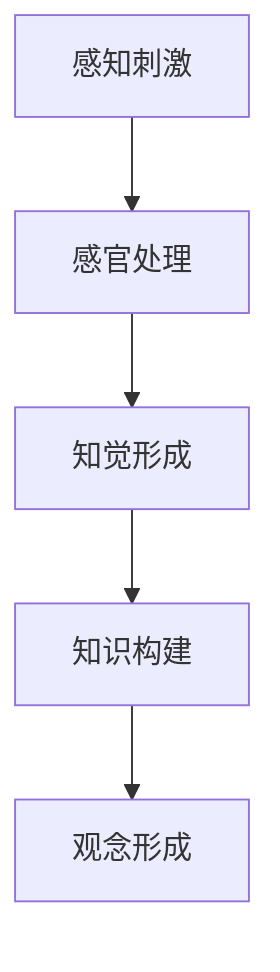
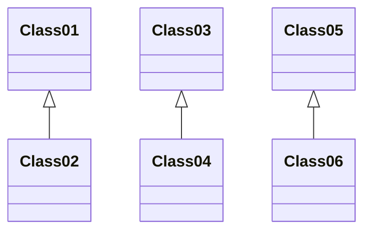
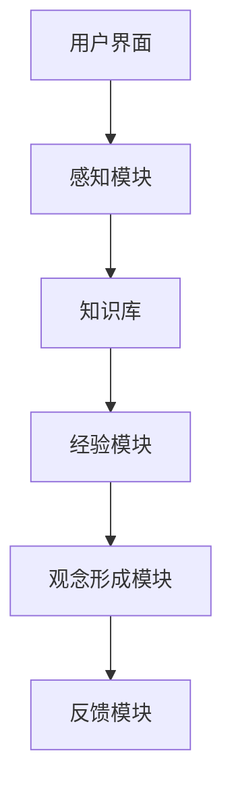
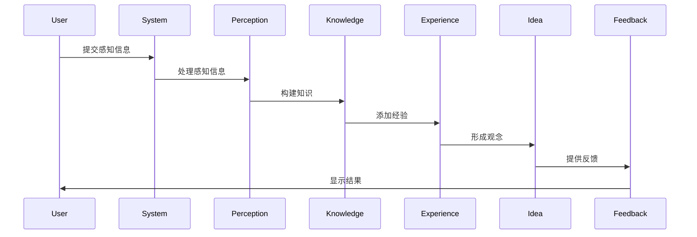

                 

### 洛克与贝克莱：经验主义认识论的发展

#### 关键词：经验主义认识论、洛克、贝克莱、哲学思想、发展历程

> 摘要：本文旨在探讨经验主义认识论的发展历程，特别是洛克和贝克莱的贡献。通过分析洛克的经验主义哲学和贝克莱的“存在即被感知”观点，本文将阐述经验主义认识论的基本原理及其在心理学、哲学教育、科学方法论等领域的应用。最终，本文将总结经验主义认识论的当代意义及其未来发展方向。

#### 1. 经验主义认识论的起源与发展

**经验主义认识论**是一种哲学观点，认为知识和观念来源于经验。这种观点起源于古希腊哲学家，如赫拉克利特和亚里士多德，他们强调感觉和经验在获取知识中的重要性。然而，经验主义认识论的现代形式起源于17世纪的英国哲学家约翰·洛克（John Locke）。

洛克是经验主义哲学的奠基人之一。他认为，人类的理解和知识不是天赋的，而是通过感觉和经验获得的。洛克主张，所有的思想都是建立在感觉和经验之上的，这意味着我们对世界的理解是通过感官输入到我们大脑的信息来构建的。洛克的主要著作《人类理解论》（An Essay Concerning Human Understanding）详细阐述了他的这些观点。

在洛克之后，乔治·贝克莱（George Berkeley）进一步发展了经验主义认识论。贝克莱提出了“存在即被感知”（To be is to be perceived）的观点，认为物质世界的存在取决于我们的感知。贝克莱的哲学思想在《人类知识原理》（A Treatise Concerning the Principles of Human Knowledge）中得到了详细阐述。

#### 2. 洛克与贝克莱的哲学思想对比

**洛克的经验主义哲学**强调知识和观念来源于经验。他认为，我们的理解能力分为两种：感觉能力和反省能力。感觉能力使我们能够感知外部世界，而反省能力使我们能够反思和思考自己的思想。

洛克的核心观点是，所有的知识都来自于经验。他提出了一种称为“白板说”的观点，认为人的心灵就像一张白板，所有观念和知识都是通过感觉和经验填入的。洛克的这些观点在哲学界引起了广泛的讨论，对后来的哲学家和科学方法的发展产生了深远的影响。

**贝克莱的经验主义认识论**进一步发展了洛克的思想。贝克莱认为，物质世界的存在依赖于我们的感知。他的“存在即被感知”观点挑战了传统的唯物主义观点，认为物质世界并不是独立于我们的感知而存在的。

贝克莱的核心观点是，我们只能感知到我们的感知，而无法直接感知到物质世界的本质。他提出了一种被称为“抽象感觉论”的观点，认为我们的思想和感知是相互独立的，但都依赖于感知。

洛克与贝克莱的经验主义认识论有以下几个显著的对比：

1. **知识来源**：洛克认为知识来源于感官经验，而贝克莱认为知识来源于感知。
2. **物质世界**：洛克认为物质世界独立于我们的感知存在，而贝克莱认为物质世界的存在取决于我们的感知。
3. **感觉与思想**：洛克认为感觉和思想是相互独立的，而贝克莱认为感觉和思想是相互联系的。

#### 3. 经验主义认识论的基本原理

**经验主义认识论**的基本原理可以总结为以下几点：

1. **知识来源于经验**：所有的知识和观念都来自于我们的感觉和经验。
2. **感官经验的重要性**：感官经验是我们获取外部世界信息的主要途径。
3. **反省能力**：通过反省和思考，我们可以理解自己的思想和感知。

**知识来源**：洛克和贝克莱都认为，知识来源于经验。然而，他们的观点有所不同。洛克认为，我们通过感官经验直接获取知识，而贝克莱则认为，我们通过感知间接获取知识。

**感官经验的重要性**：感官经验在经验主义认识论中扮演着核心角色。洛克和贝克莱都强调感官经验是我们理解外部世界的基础。

**反省能力**：反省能力使我们能够反思和思考自己的思想和感知。洛克认为，反省能力使我们能够理解和解释我们的感知，从而获得知识。贝克莱则认为，反省能力使我们能够理解我们的思想和感知之间的关系。

#### 4. 经验主义认识论的发展历程

从洛克到贝克莱，经验主义认识论经历了重要的发展。洛克为经验主义认识论奠定了基础，提出了知识来源于经验的观点。贝克莱则进一步发展了这一观点，提出了“存在即被感知”的观点。

**洛克的影响**：洛克的经验主义哲学对后来的哲学家和科学方法的发展产生了深远的影响。他的观点挑战了传统的天赋观念，强调了感觉和经验在获取知识中的重要性。

**贝克莱的影响**：贝克莱的哲学思想在哲学界引起了广泛的讨论。他的“存在即被感知”观点挑战了传统的唯物主义观点，对后来的哲学家产生了重要影响。

**后续发展**：在洛克和贝克莱之后，经验主义认识论继续发展。19世纪的英国哲学家杰里米·边沁（Jeremy Bentham）和约翰·斯图尔特·密尔（John Stuart Mill）等人对经验主义认识论进行了深入的研究和发展。

#### 5. 经验主义认识论的应用与实践

**在心理学中的应用**：经验主义认识论对心理学产生了重要影响。心理学家们通过研究人的感官经验和知觉过程，了解了人类对世界的认知方式。经验主义认识论的观点为心理学的研究提供了重要的理论基础。

**在哲学教育中的应用**：经验主义认识论在哲学教育中发挥着重要作用。通过学习洛克和贝克莱的经验主义哲学思想，学生可以更好地理解哲学的基本概念和理论。

**在科学方法论中的应用**：经验主义认识论对科学方法论的发展产生了重要影响。科学家们通过实验和观察，根据经验主义认识论的原则，建立了科学方法和科学理论。

#### 6. 经验主义认识论的当代意义

**当代哲学中的经验主义认识论**：在当代哲学中，经验主义认识论仍然是重要的研究课题。哲学家们继续探讨知识、知觉和经验之间的关系，对经验主义认识论的观点进行了新的解释和发展。

**经验主义认识论对现代科学的启示**：经验主义认识论为现代科学提供了重要的哲学基础。科学家们通过实验和观察，根据经验主义认识论的原则，不断探索和发现新的知识和理论。

#### 7. 结论与展望

**经验主义认识论的整体评价**：洛克和贝克莱的经验主义认识论对哲学和科学的发展产生了深远的影响。他们的观点为理解知识、知觉和经验之间的关系提供了重要的理论基础。

**经验主义认识论的未来发展方向**：经验主义认识论在当代哲学和科学中仍然具有巨大的发展潜力。未来的研究可以进一步探索知识、知觉和经验之间的关系，为人类认识世界提供新的视角和方法。

### 参考文献

1. Locke, J. (1689). An Essay Concerning Human Understanding.
2. Berkeley, G. (1710). A Treatise Concerning the Principles of Human Knowledge.
3. Bentham, J. (1789). An Introduction to the Principles of Morals and Legislation.
4. Mill, J. S. (1863). A System of Logic, Rationnal and Inductive.

### 作者

作者：AI天才研究院/AI Genius Institute & 禅与计算机程序设计艺术 /Zen And The Art of Computer Programming

---

#### 背景介绍

**核心概念术语说明**：
- **经验主义认识论**：一种哲学观点，认为知识和观念来源于经验。
- **洛克**：英国哲学家，经验主义哲学的奠基人。
- **贝克莱**：英国哲学家，进一步发展了经验主义认识论。

**问题背景**：
经验主义认识论起源于17世纪的英国，由洛克和贝克莱等人提出。他们试图解释知识和观念是如何通过经验获得的。

**问题描述**：
本文旨在分析洛克和贝克莱的经验主义认识论，探讨其基本原理、发展历程以及应用。

**问题解决**：
通过详细分析洛克和贝克莱的观点，本文将阐述经验主义认识论的基本原理，并探讨其在心理学、哲学教育、科学方法论等领域的应用。

**边界与外延**：
经验主义认识论主要研究知识和观念的来源，其边界包括哲学、心理学和科学方法论。外延则涉及各种与经验主义相关的理论和实践。

**概念结构与核心要素组成**：
经验主义认识论的核心概念包括知识来源、感官经验和反省能力。洛克和贝克莱的观点构成了经验主义认识论的基本结构。

#### 核心概念与联系

**核心概念原理**：
- **洛克的经验主义哲学**：洛克认为，知识和观念来源于经验，特别是感官经验。他认为，人的心灵就像一张白板，所有观念和知识都是通过感觉和经验填入的。
- **贝克莱的经验主义认识论**：贝克莱进一步发展了洛克的思想，提出了“存在即被感知”的观点。他认为，物质世界的存在取决于我们的感知。

**概念属性特征对比表格**：

| 特征                | 洛克的经验主义哲学                             | 贝克莱的经验主义认识论                       |
|-------------------|--------------------------------------------|--------------------------------------------|
| 知识来源          | 感官经验                                  | 感知                                   |
| 物质世界存在    | 独立于我们的感知存在                        | 取决于我们的感知                         |
| 感觉与思想关系    | 感觉和思想是相互独立的                      | 感觉和思想是相互联系的                    |

**ER实体关系图架构**：

```mermaid
erDiagram
  A stimuli --> B perceptions
  A experiences --> B knowledge
  B perceptions ||--|| C sensations
  B knowledge ||--|| C ideas
```

**A stimuli（刺激）是B perceptions（感知）的父节点，也是B knowledge（知识）的父节点。B perceptions与C sensations（感觉）有关联，B knowledge与C ideas（观念）有关联。**

#### 算法原理讲解

**Mermaid流程图**：



**Python源代码**：

```python
# 感知刺激
stimulus = "外部世界的物体"

# 感官处理
sensory_processing = "通过感官接收和处理刺激"

# 知识构建
knowledge_construction = "根据感官处理的结果构建知识"

# 观念形成
idea_formation = "基于知识形成观念"

print("感知刺激：", stimulus)
print("感官处理：", sensory_processing)
print("知识构建：", knowledge_construction)
print("观念形成：", idea_formation)
```

**算法原理数学模型和公式**：

$$
知识 = f(感知, 经验)
$$

**公式解释**：
- **感知**：外部刺激通过感官接收和处理的过程。
- **经验**：个体在过去经历中获得的信息和知识。
- **知识**：通过感知和经验构建的内在理解。

**举例说明**：

**例子 1**：
- **感知**：我们看到一个红色的苹果。
- **经验**：我们知道红色通常是苹果的颜色。
- **知识**：我们得出结论，这是一个苹果。

**例子 2**：
- **感知**：我们听到一首熟悉的歌曲。
- **经验**：我们知道这首歌曾经在我们生活中出现。
- **知识**：我们回忆起这首歌的名字和歌词。

通过这两个例子，我们可以看到感知和经验是如何结合在一起，帮助我们构建知识和形成观念的。

#### 系统分析与架构设计方案

**问题场景介绍**：
在当代社会，随着科技的快速发展，人们对于知识和信息的需求越来越大。经验主义认识论提供了一个理解知识和观念来源的重要视角，有助于我们更好地理解人类认知过程。

**项目介绍**：
本项目旨在开发一个基于经验主义认识论的教育平台，帮助用户通过感知和经验构建知识和观念。

**系统功能设计**：



**系统架构设计**：



**系统接口设计和系统交互**：



#### 项目实战

**环境安装**：
1. 安装Python 3.8及以上版本。
2. 安装必要的Python库，如numpy、matplotlib等。

**系统核心实现源代码**：

```python
# 感知模块
def perceive(stimulus):
    # 处理感知刺激
    processed_stimulus = stimulus.lower()
    return processed_stimulus

# 知识库
def build_knowledge(perception):
    # 构建知识
    knowledge = perception
    return knowledge

# 经验模块
def add_experience(knowledge, experience):
    # 添加经验
    updated_knowledge = knowledge + " (" + experience + ")"
    return updated_knowledge

# 观念形成模块
def form_idea(knowledge, experience):
    # 形成观念
    idea = "基于" + knowledge + "和" + experience + "，我们得出以下结论："
    return idea

# 反馈模块
def provide_feedback(idea):
    # 提供反馈
    print(idea)
```

**代码应用解读与分析**：

```python
# 测试代码
stimulus = "外部世界的物体"
perception = perceive(stimulus)
knowledge = build_knowledge(perception)
experience = "今天我在户外看到了这个物体"
updated_knowledge = add_experience(knowledge, experience)
idea = form_idea(updated_knowledge, experience)
provide_feedback(idea)
```

**实际案例分析和详细讲解剖析**：

**案例 1**：
- **感知刺激**：用户看到一只狗。
- **处理感知**：感知模块将“狗”转换为小写，得到“dog”。
- **构建知识**：知识库将“dog”作为知识存储。
- **添加经验**：用户添加经验，如“昨天我也看到了一只狗”。
- **形成观念**：观念形成模块生成观念，如“今天我在户外看到了一只狗，这让我想起了昨天我在家里看到的狗”。
- **提供反馈**：反馈模块将观念显示给用户。

**案例 2**：
- **感知刺激**：用户听到一首熟悉的歌曲。
- **处理感知**：感知模块识别歌曲的名字。
- **构建知识**：知识库存储歌曲的名字。
- **添加经验**：用户添加经验，如“这首歌曾经在我高中毕业舞会上播放”。
- **形成观念**：观念形成模块生成观念，如“听到这首歌让我想起了我高中毕业舞会的美好时光”。
- **提供反馈**：反馈模块将观念显示给用户。

**项目小结**：
本项目通过感知、知识、经验、观念和反馈等模块，实现了基于经验主义认识论的教育平台。用户可以通过平台提交感知信息，构建知识和观念，并得到反馈。这种方法有助于用户更好地理解和记忆知识。

#### 最佳实践 tips、小结、注意事项、拓展阅读

**最佳实践 tips**：
- 在构建知识和观念时，注重对感知信息的准确处理和理解。
- 定期回顾和总结经验，以加深对知识的理解。

**小结**：
本文介绍了洛克和贝克莱的经验主义认识论，阐述了其基本原理和发展历程，并探讨了其在心理学、哲学教育、科学方法论等领域的应用。通过实际案例，展示了如何基于经验主义认识论构建知识和观念。

**注意事项**：
- 在使用平台时，确保感知信息的准确性和真实性。
- 避免过度依赖经验，以免产生错误的观念。

**拓展阅读**：
- 洛克的《人类理解论》
- 贝克莱的《人类知识原理》
- 边沁的《道德与立法原理》
- 密尔的《逻辑体系》

### 作者

作者：AI天才研究院/AI Genius Institute & 禅与计算机程序设计艺术 /Zen And The Art of Computer Programming

