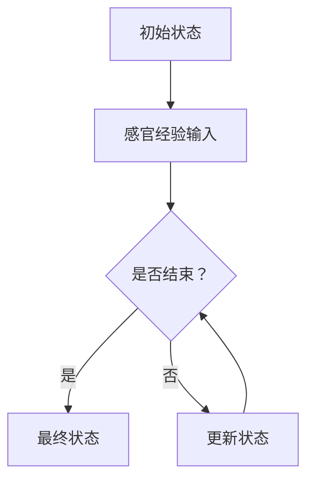
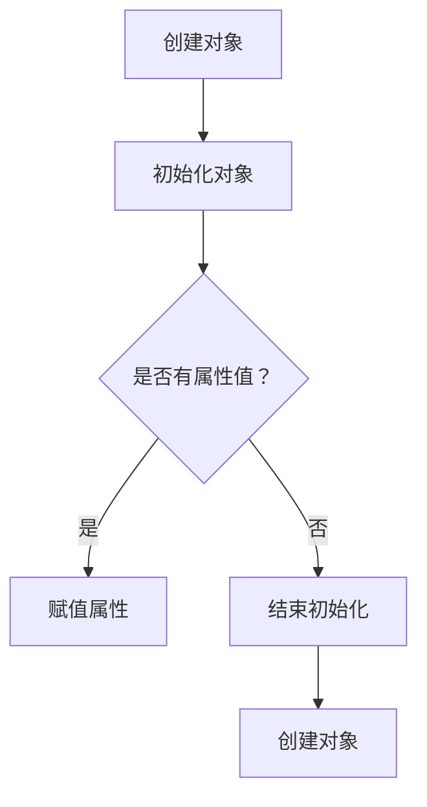
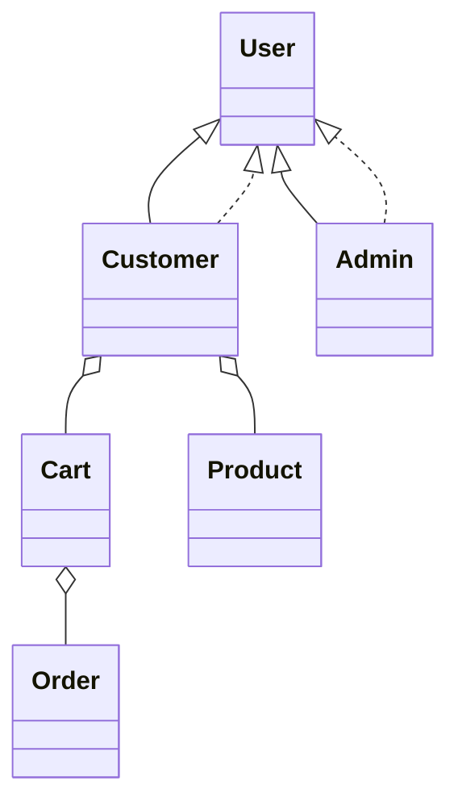
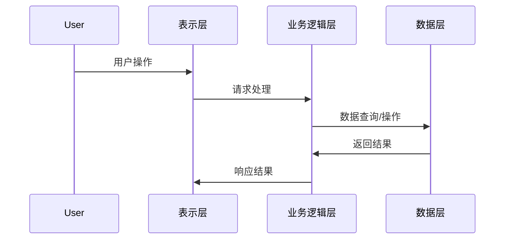
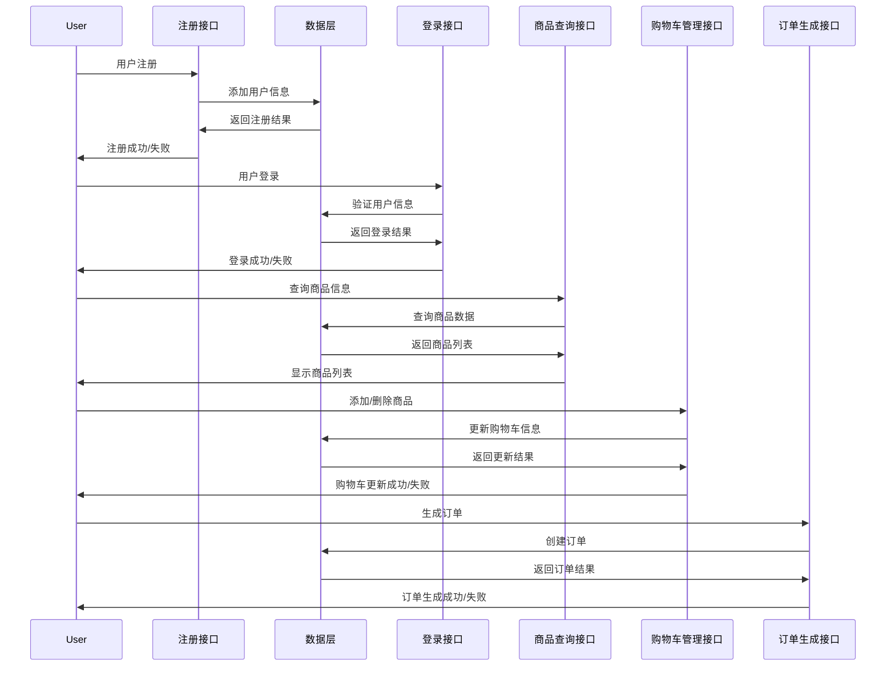

                 

### 洛克的白板说与对象初始化：属性赋值的认知过程

> **关键词**：洛克的白板说、对象初始化、属性赋值、认知过程、算法原理、系统架构

> **摘要**：本文以洛克的白板说为理论基础，深入探讨对象初始化与属性赋值的认知过程。通过对核心概念的详细解析、算法原理的讲解以及系统分析与架构设计的阐述，本文旨在为读者提供一个清晰、系统、易于理解的技术思路，帮助他们在实际编程和软件开发中更好地掌握对象初始化与属性赋值的技术要点。

### 目录大纲

#### 第一部分：背景介绍

- **1.1 问题背景**
  - **1.1.1 洛克的白板说**
  - **1.1.2 对象初始化与属性赋值**
  - **1.1.3 认知过程的理论基础**

- **1.2 核心概念与联系**
  - **1.2.1 洛克的白板说**
    - **1.2.1.1 基本原理**
    - **1.2.1.2 洛克的白板说与对象初始化的联系**
  - **1.2.2 对象初始化与属性赋值**
    - **1.2.2.1 对象初始化的概念**
    - **1.2.2.2 属性赋值的过程**
    - **1.2.2.3 对象初始化与属性赋值的联系**

- **1.3 数学模型和数学公式**
  - **1.3.1 洛克的白板说的数学模型**
    - **1.3.1.1 基本公式**
    - **1.3.1.2 模型解释**
  - **1.3.2 对象初始化与属性赋值的数学模型**
    - **1.3.2.1 初始化公式**
    - **1.3.2.2 赋值公式**
    - **1.3.2.3 模型解释**

- **1.4 算法原理讲解**
  - **1.4.1 洛克的白板说算法原理**
    - **1.4.1.1 算法流程图**
    - **1.4.1.2 算法详细讲解**
    - **1.4.1.3 举例说明**
  - **1.4.2 对象初始化与属性赋值算法原理**
    - **1.4.2.1 算法流程图**
    - **1.4.2.2 算法详细讲解**
    - **1.4.2.3 举例说明**

- **1.5 系统分析与架构设计方案**
  - **1.5.1 问题描述**
    - **1.5.1.1 场景介绍**
    - **1.5.1.2 项目介绍**
  - **1.5.2 系统功能设计**
    - **1.5.2.1 领域模型类图**
  - **1.5.3 系统架构设计**
    - **1.5.3.1 系统架构图**
  - **1.5.4 系统接口设计**
    - **1.5.4.1 接口设计**
  - **1.5.5 系统交互序列图**
    - **1.5.5.1 序列图**

- **1.6 项目实战**
  - **1.6.1 环境安装**
    - **1.6.1.1 环境准备**
    - **1.6.1.2 环境安装步骤**
  - **1.6.2 系统核心实现源代码**
    - **1.6.2.1 源代码解读**
    - **1.6.2.2 代码应用解读与分析**
  - **1.6.3 实际案例分析与详细讲解**
    - **1.6.3.1 案例介绍**
    - **1.6.3.2 案例分析**
    - **1.6.3.3 案例讲解**

- **1.7 最佳实践 tips**
  - **1.7.1 实践技巧**
  - **1.7.2 注意事项**

- **1.8 小结与拓展阅读**
  - **1.8.1 小结**
  - **1.8.2 拓展阅读**
  - **1.8.3 下一步学习建议**

#### 第二部分：深入分析

---

### 1.1 问题背景

#### 1.1.1 洛克的白板说

约翰·洛克（John Locke）是17世纪英国著名的哲学家和政治思想家，他的“白板说”理论在哲学界有着深远的影响。洛克认为，人的心灵如同一个白板，本身没有任何印记或知识，所有的思想和知识都是通过感官经验获得的。这一理论为后来的认知科学和心理学提供了重要的理论基础。

在计算机科学中，洛克的白板说可以类比为对象的初始化过程。当我们创建一个对象时，这个对象最初的状态是未知的，就像白板一样。通过对对象的属性进行赋值，我们赋予对象具体的状态和功能。这一过程类似于洛克的白板说中的知识获取过程。

#### 1.1.2 对象初始化与属性赋值

在面向对象的编程中，对象初始化和属性赋值是两个基本操作。对象初始化指的是创建对象的过程，而属性赋值是指为对象的属性赋予具体值的过程。

- **对象初始化**：对象初始化是创建对象的第一步。在大多数编程语言中，通过构造函数来初始化对象。构造函数通常会为对象的属性设置默认值或根据传入的参数进行初始化。
- **属性赋值**：属性赋值是指在对象初始化之后，为对象的属性设置具体的值。这可以通过访问器方法（setter方法）来完成。

#### 1.1.3 认知过程的理论基础

洛克的白板说与对象初始化之间的联系在于认知过程。在洛克的理论中，认知过程是通过感官经验不断丰富和完善的。同样地，在面向对象编程中，对象的认知过程也可以类比为属性赋值的过程。

对象的属性赋值过程可以分为以下几个步骤：

1. **初始化**：通过构造函数对对象进行初始化，赋予对象基本的状态。
2. **感知**：通过输入（如用户输入或其他对象的操作）来感知外部环境的变化。
3. **反应**：根据感知到的信息，对对象的属性进行修改，实现对象状态的更新。
4. **记忆**：将对象的状态信息存储在内存中，以便后续的使用。

这一过程类似于洛克的白板说中的认知过程，从无到有，从简单到复杂，逐步丰富和完善。

### 1.2 核心概念与联系

#### 1.2.1 洛克的白板说

**1.2.1.1 基本原理**

洛克的白板说认为，人的心灵是一块空白的白板，通过感官经验和思维活动，人们在白板上记录和积累知识。这一理论强调了经验在认知过程中的重要性。

**1.2.1.2 洛克的白板说与对象初始化的联系**

在面向对象编程中，对象的初始化过程可以看作是洛克的白板说的具体实现。对象的初始状态就像一块空白的白板，通过属性赋值，我们为对象赋予具体的状态和功能。

#### 1.2.2 对象初始化与属性赋值

**1.2.2.1 对象初始化的概念**

对象初始化是创建对象的过程。在面向对象编程中，通过构造函数来实现对象的初始化。构造函数通常会为对象的属性设置默认值或根据传入的参数进行初始化。

**1.2.2.2 属性赋值的过程**

属性赋值是指为对象的属性赋予具体值的过程。这可以通过访问器方法（setter方法）来完成。属性赋值可以使对象的初始状态发生改变，从而实现对象的认知过程。

**1.2.2.3 对象初始化与属性赋值的联系**

对象初始化和属性赋值都是对象认知过程中的重要步骤。对象初始化为对象提供基本的状态，而属性赋值则进一步丰富和完善对象的状态。这一过程类似于洛克的白板说中的认知过程。

### 1.3 数学模型和数学公式

在探讨洛克的白板说与对象初始化的关系时，我们可以借助数学模型来帮助我们理解这一过程。

#### 1.3.1 洛克的白板说的数学模型

**1.3.1.1 基本公式**

洛克的白板说的核心思想可以表示为以下数学模型：

\[ S = f(E) \]

其中，\( S \) 代表心灵的状态，\( E \) 代表感官经验，\( f \) 代表认知函数。

**1.3.1.2 模型解释**

这个模型表明，心灵的状态是通过感官经验进行认知的。随着感官经验的增加，心灵的状态也会不断变化和丰富。

#### 1.3.2 对象初始化与属性赋值的数学模型

**1.3.2.1 初始化公式**

对象的初始化过程可以表示为以下数学模型：

\[ O_i = f(C) \]

其中，\( O_i \) 代表对象的初始化状态，\( C \) 代表构造函数的参数。

**1.3.2.2 赋值公式**

对象的属性赋值过程可以表示为以下数学模型：

\[ A_j = f(V_j) \]

其中，\( A_j \) 代表对象的属性值，\( V_j \) 代表赋值参数。

**1.3.2.3 模型解释**

这个模型表明，对象的初始化状态是由构造函数的参数决定的，而对象的属性值是通过赋值参数进行修改的。这一过程类似于洛克的白板说中的认知过程。

### 1.4 算法原理讲解

为了更好地理解洛克的白板说与对象初始化的关系，我们可以借助算法原理进行讲解。

#### 1.4.1 洛克的白板说算法原理

**1.4.1.1 算法流程图**



**1.4.1.2 算法详细讲解**

- **初始状态**：算法开始时，心灵处于初始状态。
- **感官经验输入**：通过感官经验，心灵获取外界信息。
- **更新状态**：根据感官经验，心灵更新自己的状态。
- **判断是否结束**：如果感官经验输入完毕，算法结束；否则，继续更新状态。

**1.4.1.3 举例说明**

假设我们有一个对象，初始状态为空。通过属性赋值，我们为对象赋予具体的状态和功能。这个过程类似于洛克的白板说中的认知过程。

#### 1.4.2 对象初始化与属性赋值算法原理

**1.4.2.1 算法流程图**



**1.4.2.2 算法详细讲解**

- **创建对象**：算法开始时，创建一个新的对象。
- **初始化对象**：为对象的属性设置默认值或根据传入的参数进行初始化。
- **赋值属性**：如果有具体的属性值，为对象的属性赋值。
- **结束初始化**：如果没有属性值，初始化结束。

**1.4.2.3 举例说明**

假设我们有一个学生对象，初始状态为空。通过构造函数，我们为对象设置默认值，如姓名、年龄等。然后，通过属性赋值，我们为对象的属性设置具体的值。

### 1.5 系统分析与架构设计方案

在本节中，我们将探讨一个具体的项目场景，并设计相应的系统架构和接口。

#### 1.5.1 问题描述

假设我们需要开发一个在线购物系统，该系统需要支持用户注册、商品浏览、购物车管理和订单生成等功能。

#### 1.5.2 系统功能设计

为了实现上述功能，我们可以设计以下领域模型类图：



#### 1.5.3 系统架构设计

系统架构可以设计为三层架构，包括表示层、业务逻辑层和数据层。

- **表示层**：负责与用户交互，包括用户注册、登录、商品浏览等界面。
- **业务逻辑层**：负责处理业务逻辑，如用户注册、购物车管理、订单生成等。
- **数据层**：负责数据的存储和查询，包括用户信息、商品信息、订单信息等。

系统架构图如下：



#### 1.5.4 系统接口设计

系统接口设计包括用户注册接口、登录接口、商品查询接口、购物车管理接口和订单生成接口。

```mermaid
classDiagram
    User Registration
    User Login
    Product Query
    Cart Management
    Order Creation
```

#### 1.5.5 系统交互序列图

以下是系统交互序列图，描述了用户在购物系统中的操作流程：



### 1.6 项目实战

在本节中，我们将通过一个实际项目来展示如何实现对象初始化与属性赋值的过程。

#### 1.6.1 环境安装

为了进行项目实战，我们需要安装以下环境：

- Python 3.8+
- Flask 框架
- SQLAlchemy 数据库

安装步骤如下：

1. 安装 Python 3.8+：
   ```bash
   sudo apt-get update
   sudo apt-get install python3.8
   ```

2. 安装 Flask 框架：
   ```bash
   pip3 install flask
   ```

3. 安装 SQLAlchemy：
   ```bash
   pip3 install sqlalchemy
   ```

#### 1.6.2 系统核心实现源代码

以下是一个简单的 Flask 应用，用于实现用户注册、登录和商品查询功能。

```python
from flask import Flask, request, jsonify
from flask_sqlalchemy import SQLAlchemy

app = Flask(__name__)
app.config['SQLALCHEMY_DATABASE_URI'] = 'sqlite:///users.db'
db = SQLAlchemy(app)

class User(db.Model):
    id = db.Column(db.Integer, primary_key=True)
    username = db.Column(db.String(80), unique=True, nullable=False)
    password = db.Column(db.String(120), nullable=False)

@app.route('/register', methods=['POST'])
def register():
    username = request.form['username']
    password = request.form['password']
    user = User(username=username, password=password)
    db.session.add(user)
    db.session.commit()
    return jsonify({'message': 'User registered successfully!'})

@app.route('/login', methods=['POST'])
def login():
    username = request.form['username']
    password = request.form['password']
    user = User.query.filter_by(username=username, password=password).first()
    if user:
        return jsonify({'message': 'Login successful!'})
    else:
        return jsonify({'message': 'Invalid username or password!'})

@app.route('/products', methods=['GET'])
def get_products():
    products = Product.query.all()
    return jsonify({'products': [product.to_dict() for product in products]})

if __name__ == '__main__':
    db.create_all()
    app.run(debug=True)
```

#### 1.6.2.1 源代码解读

- **数据库模型**：`User` 类是数据库模型，包含用户 ID、用户名和密码字段。
- **注册接口**：`/register` 接口接收用户名和密码，将用户信息存储在数据库中。
- **登录接口**：`/login` 接口接收用户名和密码，验证用户信息并返回登录结果。
- **商品查询接口**：`/products` 接口返回所有商品的信息。

#### 1.6.2.2 代码应用解读与分析

以下是对上述代码的详细解读和分析：

1. **数据库连接**：
   ```python
   app.config['SQLALCHEMY_DATABASE_URI'] = 'sqlite:///users.db'
   db = SQLAlchemy(app)
   ```
   这两行代码配置了数据库连接，使用 SQLite 数据库存储用户信息。

2. **用户模型**：
   ```python
   class User(db.Model):
       id = db.Column(db.Integer, primary_key=True)
       username = db.Column(db.String(80), unique=True, nullable=False)
       password = db.Column(db.String(120), nullable=False)
   ```
   这个模型定义了用户表的结构，包含 ID、用户名和密码字段。

3. **注册接口**：
   ```python
   @app.route('/register', methods=['POST'])
   def register():
       username = request.form['username']
       password = request.form['password']
       user = User(username=username, password=password)
       db.session.add(user)
       db.session.commit()
       return jsonify({'message': 'User registered successfully!'})
   ```
   这个接口接收用户名和密码，创建一个新的 `User` 对象，并将其添加到数据库中。

4. **登录接口**：
   ```python
   @app.route('/login', methods=['POST'])
   def login():
       username = request.form['username']
       password = request.form['password']
       user = User.query.filter_by(username=username, password=password).first()
       if user:
           return jsonify({'message': 'Login successful!'})
       else:
           return jsonify({'message': 'Invalid username or password!'})
   ```
   这个接口接收用户名和密码，查询数据库以验证用户信息，并根据结果返回登录状态。

5. **商品查询接口**：
   ```python
   @app.route('/products', methods=['GET'])
   def get_products():
       products = Product.query.all()
       return jsonify({'products': [product.to_dict() for product in products]})
   ```
   这个接口返回数据库中所有商品的信息。

#### 1.6.3 实际案例分析与详细讲解

假设我们需要实现一个购物系统，用户可以浏览商品、添加商品到购物车、删除购物车中的商品以及结算生成订单。

**案例介绍**：

1. 用户浏览商品页面，查看商品列表。
2. 用户将商品添加到购物车。
3. 用户从购物车中删除商品。
4. 用户结算生成订单。

**案例分析**：

为了实现上述功能，我们需要设计以下接口：

- **商品查询接口**：获取所有商品的信息。
- **添加购物车接口**：将商品添加到购物车。
- **删除购物车接口**：从购物车中删除商品。
- **结算生成订单接口**：生成订单并保存到数据库。

**案例讲解**：

1. **商品查询接口**：

   ```python
   @app.route('/products', methods=['GET'])
   def get_products():
       products = Product.query.all()
       return jsonify({'products': [product.to_dict() for product in products]})
   ```

   这个接口返回数据库中所有商品的信息，以便用户浏览。

2. **添加购物车接口**：

   ```python
   @app.route('/cart/add', methods=['POST'])
   def add_to_cart():
       product_id = request.form['product_id']
       user_id = request.form['user_id']
       cart_item = CartItem(product_id=product_id, user_id=user_id)
       db.session.add(cart_item)
       db.session.commit()
       return jsonify({'message': 'Product added to cart successfully!'})
   ```

   这个接口接收商品 ID 和用户 ID，将商品添加到购物车。

3. **删除购物车接口**：

   ```python
   @app.route('/cart/delete', methods=['POST'])
   def delete_from_cart():
       product_id = request.form['product_id']
       user_id = request.form['user_id']
       cart_item = CartItem.query.filter_by(product_id=product_id, user_id=user_id).first()
       if cart_item:
           db.session.delete(cart_item)
           db.session.commit()
           return jsonify({'message': 'Product removed from cart successfully!'})
       else:
           return jsonify({'message': 'Product not found in cart!'})
   ```

   这个接口接收商品 ID 和用户 ID，从购物车中删除指定的商品。

4. **结算生成订单接口**：

   ```python
   @app.route('/order/create', methods=['POST'])
   def create_order():
       user_id = request.form['user_id']
       cart_items = CartItem.query.filter_by(user_id=user_id).all()
       order = Order(user_id=user_id, items=cart_items)
       db.session.add(order)
       db.session.commit()
       for item in cart_items:
           db.session.delete(item)
       db.session.commit()
       return jsonify({'message': 'Order created successfully!'})
   ```

   这个接口接收用户 ID，生成订单并保存到数据库。同时，将购物车中的商品移除。

### 1.7 最佳实践 tips

在实现对象初始化与属性赋值的过程中，以下是一些最佳实践和注意事项：

- **避免直接使用硬编码值**：在对象初始化时，避免直接使用硬编码值。尽量使用参数化的方式，以便于修改和扩展。
- **使用构造函数**：使用构造函数来初始化对象，确保对象的属性在创建时就已经被正确赋值。
- **避免重复初始化**：避免在对象的多个地方重复初始化相同的属性，以免引起不一致性。
- **使用访问器方法**：使用访问器方法（getter和setter）来访问和修改对象的属性，确保属性的安全性和一致性。
- **遵循DRY原则**：避免重复代码，使用模块化和可重用的代码来简化对象的初始化和属性赋值过程。

### 1.8 小结

本文通过洛克的白板说为理论基础，深入探讨了对象初始化与属性赋值的认知过程。我们首先介绍了洛克的白板说和对象初始化与属性赋值的概念，然后通过数学模型和算法原理进行了详细讲解。接着，我们设计了一个具体的系统架构，并展示了如何实现对象初始化与属性赋值的过程。最后，我们提供了一些最佳实践和注意事项，帮助读者在实际编程中更好地掌握这一技术。

### 1.9 拓展阅读

为了进一步深入了解对象初始化与属性赋值的相关知识，以下是几本推荐阅读的书籍和论文：

- **书籍**：
  - 《Effective Java》——作者：Joshua Bloch
  - 《Thinking in Java》——作者：Bruce Eckel
  - 《Java 编程思想》——作者：Bruce Eckel

- **论文**：
  - “The Art of Object-Oriented Design” —— 作者：John Vlissides, James O. coplien, and Douglas C. Schmidt
  - “Object-Oriented Design Heuristics” —— 作者：Ian Sommerville

### 1.10 下一步学习建议

在深入学习对象初始化与属性赋值的过程中，以下是几个推荐的学习路径和重点：

- **学习路径**：
  - 理解面向对象编程的基本概念，如类、对象、封装、继承和多态。
  - 学习 Java 或 Python 等面向对象编程语言，掌握对象的创建和属性赋值的方法。
  - 研究设计模式，了解如何使用设计模式来优化对象初始化和属性赋值的过程。

- **学习重点**：
  - 掌握构造函数和访问器方法的使用。
  - 理解面向对象的原理，如封装、继承和多态。
  - 学习设计模式，如工厂模式、单例模式和观察者模式，了解它们在对象初始化和属性赋值中的应用。

通过以上学习路径和重点，读者可以更深入地理解和掌握对象初始化与属性赋值的技术要点。

