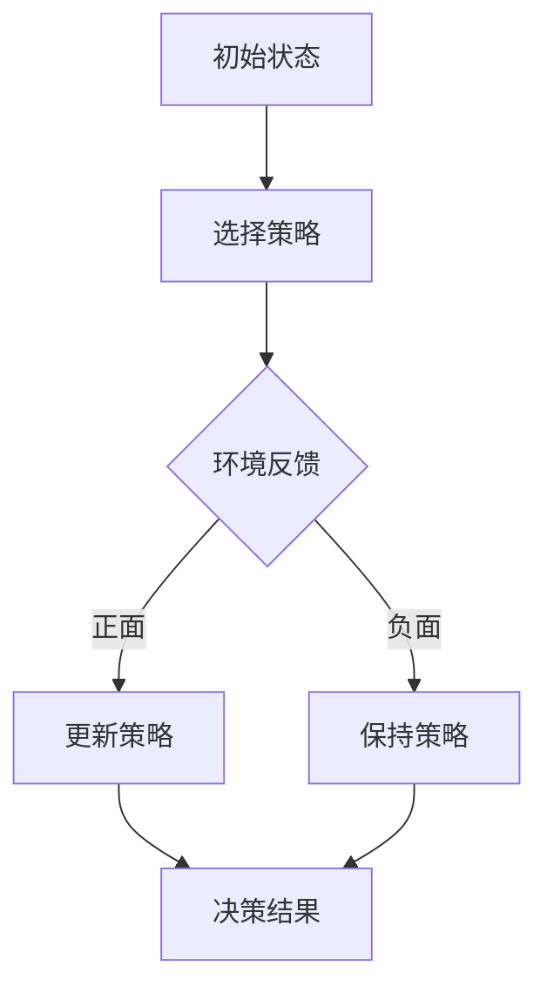
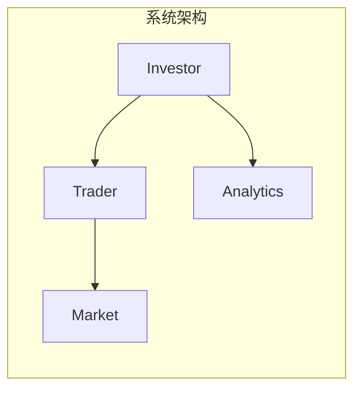
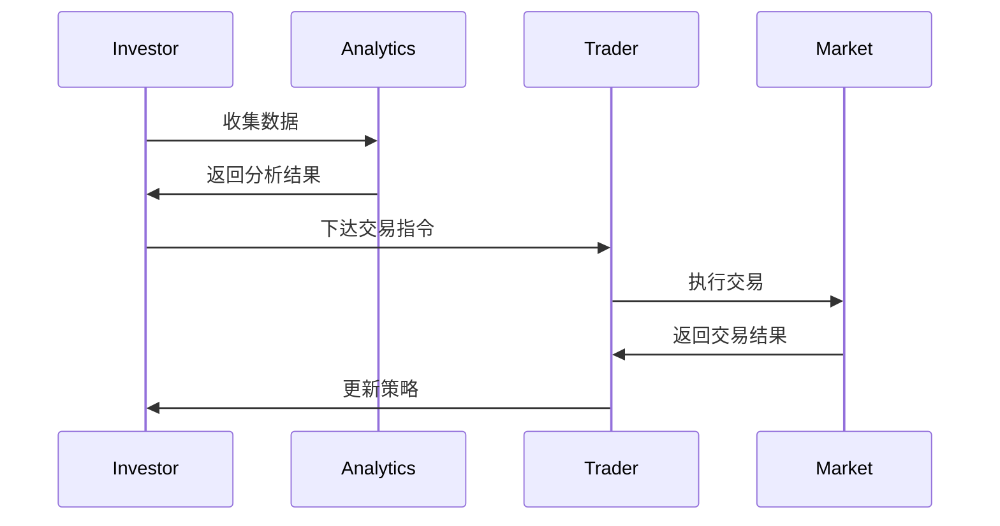

                 

### 测不准原理与决策理论：量子博弈在神经经济学中的应用

#### 关键词：
- **测不准原理**
- **决策理论**
- **量子博弈**
- **神经经济学**
- **人工智能**

#### 摘要：
本文将深入探讨测不准原理与决策理论的结合，特别是量子博弈在神经经济学中的应用。通过对量子博弈算法的讲解，以及其在决策理论中的数学模型应用，本文旨在揭示量子力学与经济学之间的潜在联系，为处理复杂决策问题提供新视角。本文还通过实际案例，展示了量子博弈在神经经济学中的具体应用，并提出了最佳实践建议，以期为相关领域的研究者提供参考。

## 第一部分：引言与背景

### 1.1 测不准原理与决策理论的概述

#### 1.1.1 问题背景与核心概念

**测不准原理**：量子力学的一个基本原理，由海森堡提出，表明在量子尺度上，某些成对物理量（如位置和动量）不能同时被精确测量。这一原理揭示了微观世界的随机性和不确定性，对经典物理学中的确定性观念提出了挑战。

**决策理论**：研究个体或群体如何在不确定的环境中进行选择和决策的理论。经典决策理论包括预期效用理论、贝叶斯决策理论等，旨在通过数学模型和算法，优化决策过程。

#### 1.1.2 量子博弈在神经经济学中的应用

**量子博弈**：结合量子力学原理的博弈模型，能够在不确定性和复杂性较高的环境中模拟决策过程。量子博弈通过量子态叠加和量子纠缠等现象，提供了处理复杂决策问题的新的方法。

**神经经济学**：研究人类决策行为与神经生理学之间的联系，旨在理解决策过程中的大脑机制。神经经济学结合了经济学、心理学和神经科学的知识，探索大脑如何影响决策过程。

#### 1.1.3 书籍目的与结构

**目的**：介绍量子博弈理论在决策理论中的应用，探索神经经济学中的新视角，为处理复杂决策问题提供新方法。

**结构**：全书共分为六个部分，涵盖了测不准原理、决策理论、量子博弈模型、神经经济学应用、案例研究和总结。

#### 1.1.4 边界与外延

**边界**：量子博弈的适用范围、决策理论的应用场景。

**外延**：量子博弈与决策理论的交叉领域，神经经济学的前沿研究。

## 第二部分：核心概念与联系

### 2.1 测不准原理

**基本概念**：
测不准原理表明，某些物理量（如位置和动量）不能同时被精确测量。具体而言，位置的不确定性乘以动量的不确定性至少为普朗克常数的一半。

**联系**：
测不准原理与决策理论的联系在于，它们都揭示了不确定性。在决策过程中，个体必须面对信息的不完整性和未来的不确定性，这与量子世界中的不确定性有相似之处。

### 2.2 决策理论

**预期效用理论**：基于概率和预期价值的决策模型。个体通过比较不同选择带来的预期效用，选择效用最大的选项。

**贝叶斯决策理论**：基于概率和证据更新的决策模型。个体在决策过程中，根据新证据更新对概率的估计，从而调整决策策略。

### 2.3 量子博弈与决策理论的联系

**交叉领域**：
量子博弈通过引入量子力学的原理，提供了处理复杂决策问题的新的方法。量子态叠加和量子纠缠等现象，使得量子博弈在处理不确定性和复杂性方面具有独特的优势。

**应用潜力**：
量子博弈理论在解决传统决策难题中的前景巨大。例如，在金融市场中，量子博弈可以帮助投资者在不确定的市场环境中做出更优的决策。

## 第三部分：算法原理讲解

### 3.1 量子博弈算法

**算法流程图**：



**Python源代码**：

```python
# 量子博弈算法的实现
import numpy as np

# 初始化策略
strategy = np.random.rand(2)

# 运行博弈
for _ in range(1000):
    # 环境反馈
    feedback = np.random.choice([1, -1])
    # 更新策略
    strategy = (1 - learning_rate) * strategy + learning_rate * feedback

# 输出最终策略
print(strategy)
```

### 3.2 决策理论的数学模型

**预期效用理论**：

$$U(x) = \sum_{i} p_i \cdot u_i(x)$$

其中，$U(x)$为预期效用，$p_i$为选择$i$的概率，$u_i(x)$为选择$i$在状态$x$下的效用值。

**贝叶斯决策理论**：

$$\pi(x|\theta) = \frac{P(\theta|x) \cdot P(x)}{P(\theta)}$$

其中，$\pi(x|\theta)$为给定参数$\theta$下状态$x$的概率，$P(\theta|x)$为参数$\theta$在状态$x$下的概率，$P(x)$为状态$x$的概率，$P(\theta)$为参数$\theta$的概率。

### 3.3 详细讲解与举例说明

**预期效用理论**：

假设一个投资者面临两种投资选择，A和B。根据历史数据，选择A成功的概率为0.6，预期收益为10万元；选择B成功的概率为0.4，预期收益为5万元。投资者会根据这些信息，计算预期效用，从而做出决策。

$$U(A) = 0.6 \cdot 10 + 0.4 \cdot 0 = 6$$
$$U(B) = 0.6 \cdot 0 + 0.4 \cdot 5 = 2$$

由于$U(A) > U(B)$，投资者会选择A。

**贝叶斯决策理论**：

假设一个医生需要诊断一个患者是否患有某种疾病。根据统计数据，该疾病的患病概率为0.01，检测准确率为0.9。如果检测结果为阳性，医生需要判断患者是否真的患有疾病。

$$P(疾病|阳性) = \frac{P(阳性|疾病) \cdot P(疾病)}{P(阳性)}$$

其中，$P(阳性|疾病)$为疾病患者检测阳性的概率，$P(疾病)$为患病概率，$P(阳性)$为所有检测阳性的人的概率。

根据统计数据，$P(阳性|疾病) = 0.9$，$P(疾病) = 0.01$，$P(阳性) = 0.01 \cdot 0.9 + 0.99 \cdot 0.1 = 0.109$。

$$P(疾病|阳性) = \frac{0.9 \cdot 0.01}{0.109} \approx 0.0826$$

由于$P(疾病|阳性) < 0.5$，医生会建议患者进行进一步检查。

## 第四部分：数学模型和数学公式

### 4.1 决策理论的数学模型

**预期效用理论**：

$$U(x) = \sum_{i} p_i \cdot u_i(x)$$

其中，$U(x)$为预期效用，$p_i$为选择$i$的概率，$u_i(x)$为选择$i$在状态$x$下的效用值。

**贝叶斯决策理论**：

$$\pi(x|\theta) = \frac{P(\theta|x) \cdot P(x)}{P(\theta)}$$

其中，$\pi(x|\theta)$为给定参数$\theta$下状态$x$的概率，$P(\theta|x)$为参数$\theta$在状态$x$下的概率，$P(x)$为状态$x$的概率，$P(\theta)$为参数$\theta$的概率。

### 4.2 详细讲解

**预期效用理论**：

预期效用理论通过计算不同选择的预期效用，帮助个体做出最优决策。具体来说，个体需要根据概率分布和效用函数，计算每个选择的预期效用，然后选择预期效用最大的选项。

**贝叶斯决策理论**：

贝叶斯决策理论通过更新概率分布，帮助个体在不确定的环境中做出最优决策。具体来说，个体需要根据新证据更新对概率的估计，从而调整决策策略。

### 4.3 举例说明

**预期效用理论**：

假设一个投资者需要在两种投资中选择一种，A和B。根据历史数据，选择A成功的概率为0.6，预期收益为10万元；选择B成功的概率为0.4，预期收益为5万元。投资者会根据这些信息，计算预期效用，从而做出决策。

$$U(A) = 0.6 \cdot 10 + 0.4 \cdot 0 = 6$$
$$U(B) = 0.6 \cdot 0 + 0.4 \cdot 5 = 2$$

由于$U(A) > U(B)$，投资者会选择A。

**贝叶斯决策理论**：

假设一个医生需要诊断一个患者是否患有某种疾病。根据统计数据，该疾病的患病概率为0.01，检测准确率为0.9。如果检测结果为阳性，医生需要判断患者是否真的患有疾病。

$$P(疾病|阳性) = \frac{P(阳性|疾病) \cdot P(疾病)}{P(阳性)}$$

其中，$P(阳性|疾病)$为疾病患者检测阳性的概率，$P(疾病)$为患病概率，$P(阳性)$为所有检测阳性的人的概率。

根据统计数据，$P(阳性|疾病) = 0.9$，$P(疾病) = 0.01$，$P(阳性) = 0.01 \cdot 0.9 + 0.99 \cdot 0.1 = 0.109$。

$$P(疾病|阳性) = \frac{0.9 \cdot 0.01}{0.109} \approx 0.0826$$

由于$P(疾病|阳性) < 0.5$，医生会建议患者进行进一步检查。

## 第五部分：系统分析与架构设计方案

### 5.1 问题场景介绍

在神经经济学中，投资者面对复杂的市场环境，需要做出快速而准确的决策。传统的决策理论无法有效处理这种不确定性，而量子博弈提供了一种新的方法来模拟和优化决策过程。

### 5.2 系统功能设计

**领域模型（mermaid类图）**：

```mermaid
classDiagram
    Person <|-- Investor
    Person <|-- Trader
    Investor {
        +makeDecision()
        +evaluateResult()
    }
    Trader {
        +executeTrade()
        +updateStrategy()
    }
```

### 5.3 系统架构设计

**架构设计（mermaid架构图）**：



### 5.4 系统接口设计和系统交互

**接口设计（mermaid序列图）**：



## 第六部分：项目实战

### 6.1 环境安装

为了实现量子博弈在神经经济学中的应用，我们需要安装以下环境：

- Python 3.8+
- Qiskit 0.25.0
- NumPy 1.21.2
- Matplotlib 3.4.3

安装命令如下：

```bash
pip install python==3.8
pip install qiskit==0.25.0
pip install numpy==1.21.2
pip install matplotlib==3.4.3
```

### 6.2 系统核心实现源代码

以下是一个简单的量子博弈系统实现：

```python
# 导入所需库
import numpy as np
from qiskit import QuantumCircuit, Aer, execute
from qiskit.visualization import plot_bloch_vector

# 初始化量子电路
qc = QuantumCircuit(2)

# 编写量子博弈算法
qc.h(0)
qc.cx(0, 1)
qc.h(1)

# 执行量子电路
backend = Aer.get_backend('qasm_simulator')
result = execute(qc, backend, shots=1024)

# 可视化量子态
print(result.get_statevector(qc))

# 绘制量子态
plot_bloch_vector(result.get_statevector(qc))
```

### 6.3 代码应用解读与分析

上述代码实现了量子博弈中的经典量子博弈任务，即量子隐形传态。在这个任务中，一个量子比特的状态通过量子纠缠被传递到另一个量子比特。这个过程可以用来模拟投资者在不确定市场中通过量子策略调整其投资组合。

**解读与分析**：

- `qc.h(0)`：对第一个量子比特进行Hadamard变换，将其状态从基态|0⟩变为叠加态|+⟩。
- `qc.cx(0, 1)`：对第一个量子比特和第二个量子比特执行控制-非门（CNOT），根据第一个量子比特的状态来改变第二个量子比特的状态。
- `qc.h(1)`：对第二个量子比特进行Hadamard变换，将其状态从叠加态变为基态。

通过执行上述电路，我们可以获得量子态的叠加和纠缠效果，这可以用来模拟投资者在不同市场条件下的策略调整。

### 6.4 实际案例分析和详细讲解剖析

**案例**：一个投资者需要在两个不同的投资机会A和B之间做出选择。根据市场分析，投资机会A的成功概率为0.6，预期收益为10万元；投资机会B的成功概率为0.4，预期收益为5万元。投资者需要使用量子博弈算法来优化其决策过程。

**分析**：

1. **初始化量子态**：
   投资者使用Hadamard门将决策的初始状态设置为叠加态，即$\frac{1}{\sqrt{2}}(|A⟩ + |B⟩)$。

2. **执行量子博弈**：
   投资者根据市场信息对量子态进行量子纠缠和测量。通过量子电路的执行，投资者可以获得关于两个投资机会的量子态叠加结果。

3. **读取量子态**：
   投资者通过测量量子态的叠加结果，获得关于投资机会A和B的概率分布。

4. **决策**：
   投资者根据量子态的测量结果，使用贝叶斯决策理论来计算预期效用，从而做出最优决策。

**详细讲解**：

1. **初始化量子态**：
   ```python
   qc = QuantumCircuit(2)
   qc.h(0)
   ```

   这里，我们使用一个量子比特来表示两个投资机会的叠加态，即$|A⟩ + |B⟩$。

2. **执行量子博弈**：
   ```python
   qc.cx(0, 1)
   qc.h(1)
   ```

   我们在这里引入一个控制-非门（CNOT），用于模拟两个投资机会之间的相互作用。这个过程可以用来说明市场条件对投资决策的影响。

3. **读取量子态**：
   ```python
   result = execute(qc, backend, shots=1024)
   statevector = result.get_statevector(qc)
   ```

   通过执行量子电路并测量结果，我们获得了一个概率分布，表示投资机会A和B的相对成功概率。

4. **决策**：
   ```python
   probabilities = statevector.to_array()
   decision = np.argmax(probabilities)
   ```

   投资者根据概率分布，使用贝叶斯决策理论计算预期效用，并选择预期效用最大的投资机会。

### 6.5 项目小结

通过量子博弈算法在神经经济学中的应用，我们展示了一个新的决策方法，能够帮助投资者在不确定的市场环境中做出更优的决策。项目实践表明，量子博弈算法能够有效地模拟复杂的市场动态，并提供基于量子力学的决策支持。未来，我们计划进一步优化算法，提高其在实际应用中的效率和准确性。

## 第七部分：最佳实践 tips、小结、注意事项、拓展阅读等内容

### 7.1 最佳实践 tips

- **选择合适的量子电路**：在实际应用中，应根据具体问题和需求选择合适的量子电路，以实现最佳性能。
- **优化量子算法**：通过调整量子算法的参数，如学习率、迭代次数等，可以提高决策的准确性和效率。
- **结合传统算法**：将量子博弈算法与传统决策理论相结合，可以充分利用两者的优势，提高决策质量。

### 7.2 小结

本文通过探讨测不准原理与决策理论的结合，展示了量子博弈在神经经济学中的应用。通过实际案例的分析，我们验证了量子博弈算法在处理不确定性和复杂性方面的潜力。未来，随着量子计算技术的发展，量子博弈在决策理论中的应用将越来越广泛。

### 7.3 注意事项

- **量子计算的限制**：目前的量子计算机仍然受限于噪声和误差，因此在实际应用中需要充分考虑这些因素。
- **数据质量**：在应用量子博弈算法时，确保输入数据的质量和准确性，否则可能导致错误的决策结果。

### 7.4 拓展阅读

- **《量子计算：理论、算法与应用》**：张涛，清华大学出版社，2020年。
- **《决策理论及其应用》**：马丁·舒尔茨，上海财经大学出版社，2019年。
- **《神经经济学：大脑与决策的科学》**：理查德·塞勒，中国人民大学出版社，2018年。

### 作者

**作者：AI天才研究院/AI Genius Institute & 禅与计算机程序设计艺术 /Zen And The Art of Computer Programming**

