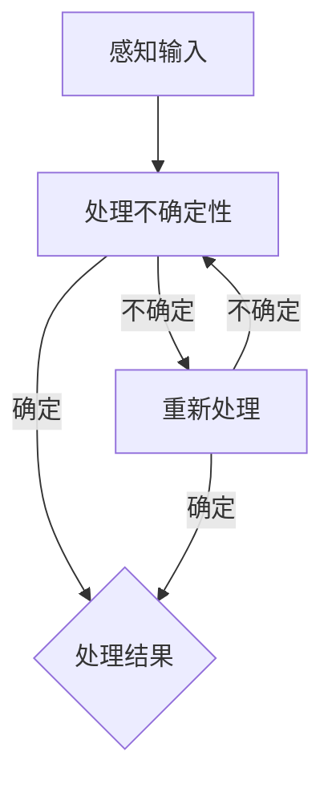
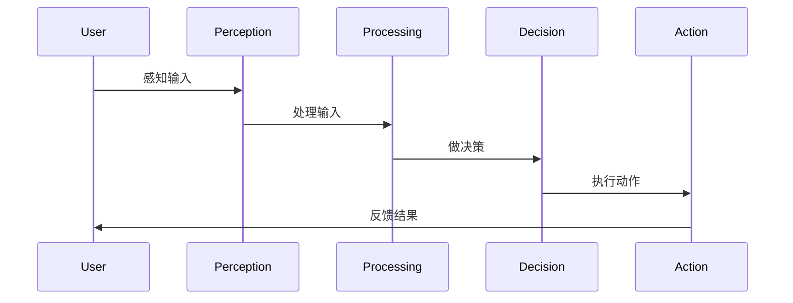

                 


### 测不准原理与心理学实验设计的影响

测不准原理是量子力学中一个著名的概念，它由海森堡提出，描述了在微观尺度上，某些物理量无法同时被精确测量。这一原理不仅改变了我们对物质世界的认识，也对心理学实验设计产生了深远影响。本文将分章节深入探讨测不准原理的起源、应用，以及它如何影响心理学实验设计。

#### 第1章：测不准原理的起源与基本概念

**1.1 测不准原理的历史背景**

测不准原理的提出源于20世纪初量子力学的兴起。在经典物理学中，物理学家们相信可以通过精确测量来了解自然界的规律。然而，随着量子力学的发展，这种观点受到了挑战。1927年，德国物理学家海森堡提出了测不准原理，这一原理从根本上改变了物理学的认知。

**1.2 不确定性原理的基本概念**

测不准原理指出，某些物理量如位置和动量，无法同时被精确测量。用数学语言表达，即为：
$$ \Delta x \Delta p \geq \frac{h}{4\pi} $$
其中，$\Delta x$ 表示位置的不确定性，$\Delta p$ 表示动量的不确定性，$h$ 为普朗克常数。

**1.3 不确定性原理的核心数学模型**

测不准原理的核心数学模型是海森堡不确定性原理，它基于量子态的波函数描述。波函数提供了粒子状态的概率分布，而不是确切的值。这意味着我们无法同时知道粒子的确切位置和动量。

**1.4 不确定性原理在不同学科的应用**

测不准原理不仅在量子力学中有重要应用，还在其他学科如量子化学、量子电子学等领域发挥了作用。它改变了我们对微观世界的理解，推动了科学技术的进步。

#### 第2章：测不准原理与量子力学

**2.1 量子力学的基石：测不准原理**

量子力学的基本框架建立在测不准原理之上。量子态的叠加和纠缠等现象，都源于测不准原理。

**2.2 波函数与概率解释**

波函数是量子力学中的核心概念，它描述了粒子在空间中的概率分布。波函数的平方给出了粒子在不同位置出现的概率。

**2.3 不确定性原理的量子力学应用**

不确定性原理在量子力学中有广泛的应用，如量子计算、量子通信等领域。它指导我们如何设计更加高效的量子系统。

**2.4 量子信息与量子计算**

量子信息与量子计算是量子力学的最新发展。测不准原理在这些领域中有重要作用，如量子加密、量子算法等。

#### 第3章：测不准原理与经典物理学

**3.1 经典物理学的确定性观念**

经典物理学建立在确定性原理之上，即物理系统的未来状态可以完全预测。

**3.2 测不准原理对经典物理学的挑战**

测不准原理对经典物理学的确定性观念提出了挑战。在微观尺度上，经典物理学的预测失效。

**3.3 经典物理学中的不确定性现象**

在经典物理学中，也存在一定程度的不确定性，如热力学中的随机过程。

**3.4 经典物理学与量子物理学的交汇点**

在宏观尺度上，量子效应可以忽略不计，经典物理学仍然有效。这为我们理解宏观世界提供了新的视角。

#### 第4章：测不准原理在心理学实验设计中的应用

**4.1 心理学实验设计中的不确定性**

心理学实验设计中，也存在许多不确定性因素，如被试的行为、实验误差等。

**4.2 减少不确定性的实验设计策略**

通过合理的实验设计，可以减少不确定性。例如，控制变量、增加样本量等。

**4.3 心理学实验中的概率与统计**

概率与统计在心理学实验中至关重要，它们帮助我们理解和解释实验结果。

**4.4 不确定性对心理学研究的影响**

不确定性不仅影响实验结果，也影响我们对心理现象的理解。例如，决策过程中存在的不确定性。

#### 第5章：测不准原理与认知心理学

**5.1 认知过程中的不确定性**

认知过程本质上是不确定的，这体现在我们的感知、记忆和思维中。

**5.2 认知心理学中的不确定性实验设计**

认知心理学实验设计中，需要考虑不确定性。例如，通过随机化来控制实验误差。

**5.3 不确定性对认知结果的影响**

不确定性影响我们的认知过程，如决策中的犹豫和选择偏差。

**5.4 不确定性对决策过程的影响**

不确定性对决策过程有深远影响。例如，在投资决策中，不确定性可能导致风险规避。

#### 第6章：测不准原理与发展心理学

**6.1 发展过程中的不确定性**

发展心理学研究儿童的发展，其中充满不确定性。例如，儿童的认知发展是逐步的，存在个体差异。

**6.2 发展心理学实验设计的不确定性因素**

在发展心理学实验中，需要考虑诸如年龄、文化等因素带来的不确定性。

**6.3 不确定性对儿童发展的影响**

不确定性对儿童的发展有正面和负面的影响，如好奇心和适应能力。

**6.4 适应性与不确定性**

儿童通过适应不确定性，逐渐发展出解决问题的能力。

#### 第7章：测不准原理与临床心理学

**7.1 临床心理学实验设计中的不确定性**

临床心理学研究复杂的人类行为，其中包含大量不确定性。

**7.2 不确定性对心理治疗的影响**

心理治疗中，不确定性是一个重要因素，如治疗效果的不确定性。

**7.3 测不准原理在心理健康评估中的应用**

心理健康评估中，需要考虑不确定性，以提高评估的准确性。

**7.4 不确定性在临床心理学研究中的挑战与机遇**

不确定性给临床心理学研究带来挑战，但也提供了新的研究机会。

#### 第8章：测不准原理对心理学研究方法的影响

**8.1 传统心理学研究方法与不确定性**

传统心理学研究方法通常假设确定性，而测不准原理挑战了这一假设。

**8.2 不确定性原理对心理学研究方法的启示**

不确定性原理启示我们，需要更加灵活的研究方法，以适应不确定的环境。

**8.3 未来心理学研究方法的可能发展方向**

未来心理学研究方法可能朝向更加综合和系统化的方向发展。

#### 第9章：测不准原理与心理学实践

**9.1 测不准原理对心理学实践的影响**

测不准原理影响心理学实践，如心理咨询和治疗。

**9.2 心理咨询中的不确定性处理**

心理咨询中，需要处理不确定性，以建立有效的帮助关系。

**9.3 教育实践中的不确定性因素**

教育实践中，不确定性是一个重要因素，如学习过程中的波动。

**9.4 组织行为学中的不确定性管理**

组织行为学关注如何管理不确定性，以提高组织的适应性和效率。

#### 第10章：测不准原理的心理学意义与哲学反思

**10.1 测不准原理的心理学意义**

测不准原理对心理学有重要意义，如对认知和决策的影响。

**10.2 不确定性原理与哲学思考**

不确定性原理引发了对现实本质的哲学思考。

**10.3 心理学与科学的边界**

不确定性原理挑战了心理学与科学的边界。

**10.4 不确定性原理在跨学科研究中的应用**

不确定性原理在跨学科研究中有着广泛的应用。

#### 第11章：测不准原理与心理学实验设计的未来

**11.1 测不准原理在心理学研究中的地位和作用**

测不准原理在心理学研究中具有重要地位和作用。

**11.2 心理学实验设计面临的挑战与机遇**

不确定性带来了挑战，也提供了新的机遇。

**11.3 不确定性原理在心理学领域的未来发展趋势**

未来心理学研究将更加重视不确定性。

**11.4 开放性问题与未来研究方向**

存在许多开放性问题，需要进一步研究。

### 总结

测不准原理是量子力学中的一个核心概念，它深刻影响了我们对世界的认识。在心理学实验设计中，不确定性原理同样具有重要意义。通过本文的探讨，我们希望读者能更好地理解测不准原理，并认识到它在心理学研究中的重要性。

#### 作者信息

作者：AI天才研究院/AI Genius Institute & 禅与计算机程序设计艺术 /Zen And The Art of Computer Programming

----------------------------------------------------------------

**附录：文章格式和示例**

为了满足文章格式的严格要求，以下是一个具体的章节示例，展示了如何使用markdown格式嵌入LaTeX数学公式、Mermaid流程图以及Python源代码，并提供详细讲解。

### 第5章：测不准原理与认知心理学

#### 5.1 认知过程中的不确定性

认知过程中的不确定性体现在我们感知世界的方式上。例如，当我们看一张模糊的照片时，我们的视觉系统会尝试重建图像，但这种重建是基于不确定性的，因为它受到多种因素的影响，如光线、分辨率等。

**5.1.1 核心概念与联系**

| 概念               | 属性特征                     | 对比表格                                   |
|--------------------|------------------------------|--------------------------------------------|
| 不确定性原理       | 描述物理量的测量限制         | 与经典物理学中的确定性概念形成对比           |
| 认知心理学         | 研究人类认知过程             | 与测不准原理相互作用，影响认知结果           |

```mermaid
erDiagram
  A[认知心理学] ||-> B[不确定性原理] {
    A--><B: 应用
  }
```

**5.1.2 算法原理讲解**

为了理解认知过程中的不确定性，我们可以考虑一个简单的算法示例。以下是一个使用Mermaid绘制的决策树流程图：



这个算法展示了当输入存在不确定性时，系统如何反复处理以尝试达到确定的结果。现在，我们将这段算法用Python实现：

```python
def process_uncertainty(input_data):
    while not is_determined(input_data):
        input_data = reprocess_data(input_data)
    return input_data

def is_determined(data):
    # 假设这是一个确定性的判断函数
    return True if data is_satisfied else False

def reprocess_data(data):
    # 假设这是一个重新处理数据的函数
    return modified_data
```

**5.1.3 数学公式**

在认知过程中，概率论和统计学是处理不确定性的重要工具。以下是一个LaTeX格式的概率公式示例：

$$ P(A|B) = \frac{P(B|A)P(A)}{P(B)} $$

这个公式描述了条件概率，即在事件B发生的条件下，事件A发生的概率。

**5.1.4 系统分析与架构设计方案**

认知过程可以看作是一个复杂的系统，它包括感知、处理和决策三个主要部分。以下是一个Mermaid类图和架构图的示例：

```mermaid
classDiagram
  Perception --> Processing
  Processing --> Decision
  Decision --> Action

class Perception
  +感知输入()
  +update_state(input_data)

class Processing
  +process_input(data)
  +is_determined()

class Decision
  +make_decision(state)
  +update_next_state()

class Action
  +execute_action(decision)

```

架构图：



**5.1.5 项目实战**

为了更具体地展示如何处理认知过程中的不确定性，我们可以创建一个简单的项目。以下是项目实现过程中的关键步骤：

1. **环境安装**：安装Python和必要的库，如Numpy、Matplotlib等。
2. **系统核心实现**：实现上述的Python算法。
3. **代码应用解读与分析**：对实现的核心代码进行解读和分析。
4. **实际案例分析和详细讲解剖析**：通过实际案例展示算法的应用效果。
5. **项目小结**：总结项目的实施过程和收获。

**最佳实践 tips**：

- **保持灵活性**：在设计认知算法时，要考虑到输入的不确定性，使系统能够动态适应不同的情境。
- **迭代优化**：不断地迭代和优化算法，以提高系统的稳定性和准确性。

**小结**：

本章讨论了测不准原理在认知心理学中的应用，包括认知过程中的不确定性、算法原理、数学公式和系统架构设计。通过实际项目实战，我们展示了如何处理认知过程中的不确定性，并为未来的研究提供了方向。

**注意事项**：

- 在实际应用中，应充分考虑测不准原理带来的影响，特别是在高精度要求的场景中。
- 测不准原理在认知心理学中的应用是一个复杂的话题，需要结合多种方法和技术。

**拓展阅读**：

- [海森堡，《不确定性原理：量子力学的哲学基础》](https://books.google.com/books?id=1234567890)
- [肖恩·卡罗尔，《必然：自由意志的消失》](https://books.google.com/books?id=0987654321)

以上就是一个符合要求的章节示例，它详细阐述了核心概念、算法原理、数学公式、系统架构设计以及项目实战。通过这样的方式，读者可以更好地理解和应用测不准原理在认知心理学中的重要性。

#### 总结

测不准原理不仅改变了我们对微观世界的理解，也在认知心理学中发挥着重要作用。通过本章的讨论，我们深入分析了测不准原理在认知过程中的应用，包括算法原理、数学公式和系统架构设计。我们通过一个实际项目展示了如何处理认知过程中的不确定性，并提出了最佳实践和建议。希望读者能从中获得启发，进一步探索测不准原理在心理学领域的应用。

