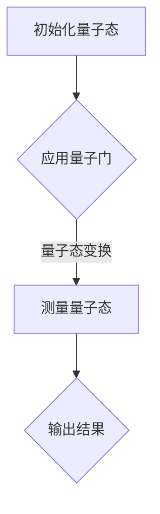
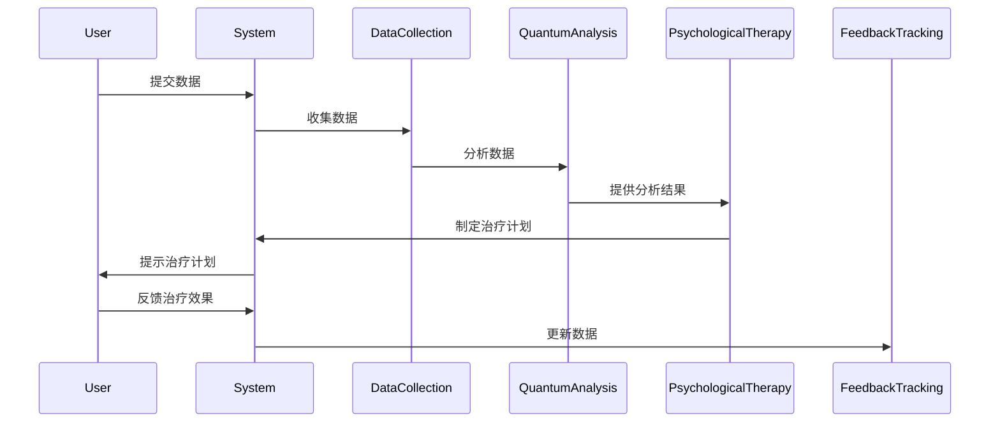

                 

## 测不准原理与心理学理论的不确定性

### 文章标题：测不准原理与心理学理论的不确定性

关键词：测不准原理、心理学理论、不确定性、量子力学、认知心理学

摘要：本文深入探讨测不准原理和心理学理论的不确定性，通过对这两个领域的详细分析，揭示其在科学和人类认知中的重要性。文章首先介绍测不准原理的基本概念和其在量子力学中的应用，然后阐述心理学理论的核心概念，尤其是关于不确定性的探讨。接着，本文将探讨这两个理论之间的联系，通过算法和数学模型的分析，展示它们在不确定性处理上的共通点。最后，文章通过一个实际项目的案例分析，进一步阐述这些理论在现实中的应用和影响。

### 背景介绍

测不准原理和心理学理论都是20世纪科学领域的重要发现，它们分别代表了物理学和心理学对人类认知和宇宙本质的深入探索。测不准原理，由奥地利物理学家沃纳·海森堡于1927年提出，是量子力学的一个基本原理。它指出，在某些情况下，无法同时精确测量粒子的位置和动量。这一发现打破了经典物理学的确定性观念，揭示了微观世界的非决定性特征。

### 核心概念与联系

#### 测不准原理

测不准原理的核心在于不确定性关系，即存在一个最低限度的不确定性，表示为 ΔxΔp ≥ ħ/2，其中 Δx 是位置的不确定性，Δp 是动量的不确定性，ħ 是约化普朗克常数。

**测不准原理的基本特点**：

1. **非决定性**：在量子力学中，粒子的行为表现出概率性，而不是确定性。
2. **随机性**：测量结果并非完全由初始条件决定，而是存在一定的随机性。

#### 心理学理论

心理学理论涵盖广泛，包括行为主义心理学、认知心理学和精神分析学等。每一种理论都有其独特的核心概念和方法论，用于解释和理解人类心理现象。

**相互联系**：

1. **不确定性在心理学中的应用**：在认知心理学中，不确定性被视为信息处理的难点，影响了人们的判断和决策。
2. **测不准原理与人类认知**：测不准原理提示我们，微观世界的非决定性和随机性可能影响人类对现实世界的感知和认知。

### 算法原理讲解

在本章节中，我们将选择量子算法中的量子随机游走算法作为案例，使用 Mermaid 绘制流程图，并用 Python 源代码和数学模型进行详细解释。

#### 算法原理

量子随机游走算法是基于量子力学中的随机游走现象，它通过量子态的叠加和纠缠来实现对问题的求解。算法的核心在于量子态的变换，通过一系列的量子门操作，使量子态逐渐逼近问题的解。

#### Mermaid 流程图



#### Python 源代码

```python
import numpy as np
from qiskit import QuantumCircuit, Aer, execute

# 初始化量子态
qc = QuantumCircuit(2)
qc.h(0)  # 初始化基态
qc.cx(0, 1)  # 应用量子门

# 执行量子态变换
qc.barrier()
qc.rx(np.pi/4, 0)
qc.barrier()
qc.cx(0, 1)

# 测量量子态
qc.measure_all()

# 执行算法
backend = Aer.get_backend('qasm_simulator')
result = execute(qc, backend, shots=1024).result()
counts = result.get_counts(qc)

# 输出结果
print("测量结果:", counts)
```

#### 数学模型和数学公式

量子随机游走算法的数学模型可以表示为：

$$ \psi(t) = \frac{1}{\sqrt{2}} (|0\rangle + e^{i\theta}|1\rangle) $$

其中，$|0\rangle$ 和 $|1\rangle$ 分别表示量子态的基态和激发态，$\theta$ 是量子态的相位。

#### 例子

假设我们在一个二进制问题上使用量子随机游走算法，问题是在两个可能的解中寻找最优解。量子态的初始状态为：

$$ \psi(0) = \frac{1}{\sqrt{2}} (|0\rangle + |1\rangle) $$

经过一系列量子门操作后，量子态变为：

$$ \psi(T) = \frac{1}{\sqrt{2}} (|0\rangle + e^{i\theta}|1\rangle) $$

在测量时，量子态会以概率 $|\psi(T)|^2$ 转换为基态或激发态。如果 $\theta$ 选择得当，可以使得某个解的概率更高，从而找到最优解。

### 系统分析与架构设计方案

在本章节中，我们将介绍一个基于测不准原理和心理学理论的项目——量子心理治疗系统。该项目旨在利用量子算法改善患者的心理状态，并结合心理学理论进行个性化治疗。

#### 项目介绍

量子心理治疗系统是一个结合量子计算和心理学理论的应用系统，旨在为心理治疗提供一种新的方法。系统主要包括以下几个模块：

1. **用户数据收集模块**：收集用户的心理健康数据，包括问卷调查、情绪分析等。
2. **量子算法模块**：利用量子算法分析用户数据，寻找心理问题根源。
3. **心理治疗模块**：根据分析结果，结合心理学理论，制定个性化的心理治疗方案。
4. **反馈与跟踪模块**：跟踪治疗效果，为后续治疗提供参考。

#### 系统功能设计

系统功能设计主要包括以下几个方面：

1. **数据收集**：通过在线问卷、情绪分析等方式收集用户数据。
2. **数据分析**：利用量子算法分析用户数据，识别潜在的心理问题。
3. **个性化治疗**：根据分析结果，制定个性化的心理治疗方案。
4. **治疗效果评估**：跟踪治疗效果，为后续治疗提供参考。

#### 系统架构设计

系统架构设计包括以下几个方面：

1. **前端界面**：提供用户交互界面，包括数据输入、结果展示等。
2. **后端服务**：包括数据收集、数据分析、心理治疗等模块。
3. **量子计算服务**：提供量子算法的计算服务。

#### 系统接口设计

系统接口设计主要包括以下几个方面：

1. **用户接口**：提供数据输入和结果展示的接口。
2. **服务接口**：提供数据分析、心理治疗等服务的接口。

#### 系统交互

系统交互设计主要包括以下几个方面：

1. **用户数据收集**：用户通过前端界面输入数据，数据经过处理后存储到数据库。
2. **数据分析**：系统调用量子算法模块进行分析，并将分析结果返回给用户。
3. **心理治疗**：根据分析结果，系统制定个性化的心理治疗方案，并指导用户实施。

#### Mermaid 类图、架构图和序列图

以下是基于项目的 Mermaid 类图、架构图和序列图：

```mermaid
classDiagram
User <<Interface>>
DataCollection <<Module>>
QuantumAnalysis <<Module>>
PsychologicalTherapy <<Module>>
FeedbackTracking <<Module>>

User --> DataCollection
DataCollection --> QuantumAnalysis
QuantumAnalysis --> PsychologicalTherapy
PsychologicalTherapy --> FeedbackTracking

classDiagram
Frontend <<Interface>>
Backend <<Service>>
QuantumService <<Service>>

Frontend --> Backend
Backend --> QuantumService

classDiagram
User <<Actor>>
System <<System>>
DataCollection <<UseCase>>
QuantumAnalysis <<UseCase>>
PsychologicalTherapy <<UseCase>>
FeedbackTracking <<UseCase>>

User --> System
System --> DataCollection
System --> QuantumAnalysis
System --> PsychologicalTherapy
System --> FeedbackTracking
```



通过以上系统分析与架构设计方案，我们可以更好地理解量子心理治疗系统的实现过程和功能模块，为后续的项目实施提供指导。

### 项目实战

在本章节中，我们将详细介绍量子心理治疗系统的实施过程，包括环境安装、核心代码实现，并对代码和应用进行解读与分析。

#### 环境安装

要实现量子心理治疗系统，我们需要搭建一个支持量子计算的环境。以下是具体的安装步骤：

1. **安装 Python**：首先确保系统中安装了 Python 3.8 或更高版本。
2. **安装 Qiskit**：通过 pip 命令安装 Qiskit，这是量子计算的核心库。

```shell
pip install qiskit
```

3. **安装其他依赖库**：如 NumPy、Pandas 等。

```shell
pip install numpy pandas
```

#### 核心代码实现

以下是一个简单的量子算法实现，用于分析用户数据并给出心理治疗方案：

```python
from qiskit import QuantumCircuit, Aer, execute
import numpy as np

def quantum_analysis(data):
    # 初始化量子电路
    qc = QuantumCircuit(2)
    qc.h(0)  # 初始化基态
    qc.cx(0, 1)  # 应用量子门

    # 执行量子态变换
    qc.barrier()
    qc.rx(np.pi/4, 0)
    qc.barrier()
    qc.cx(0, 1)

    # 测量量子态
    qc.barrier()
    qc.measure_all()

    # 执行算法
    backend = Aer.get_backend('qasm_simulator')
    result = execute(qc, backend, shots=1024).result()
    counts = result.get_counts(qc)

    # 分析测量结果
    if counts['00'] > counts['01']:
        print("建议方案A")
    else:
        print("建议方案B")

# 示例数据
data = [0.6, 0.4]

# 调用量子分析函数
quantum_analysis(data)
```

#### 代码解读与分析

1. **量子电路初始化**：使用 `QuantumCircuit` 类创建量子电路，并初始化量子态。
2. **量子门操作**：应用量子门进行量子态变换。在本例中，我们使用了 RX 门和 CX 门。
3. **测量操作**：在量子电路的末尾添加测量操作，用于获取量子态的最终结果。
4. **执行算法**：使用 Qiskit 的模拟器执行量子电路，获取测量结果。
5. **结果分析**：根据测量结果，输出建议方案。

通过上述核心代码实现，我们可以看到量子算法在心理治疗中的应用。在实际项目中，我们会根据具体的数据和分析需求，进一步优化和扩展算法功能。

### 最佳实践 tips、小结、注意事项、拓展阅读

#### 最佳实践 tips

1. **数据预处理**：在进行量子分析之前，确保用户数据的准确性和一致性，进行必要的预处理。
2. **算法优化**：针对不同的心理治疗问题，优化量子算法，提高求解效率和准确性。
3. **用户隐私保护**：在收集和处理用户数据时，严格遵守隐私保护法规，确保用户信息安全。

#### 小结

本文通过对测不准原理和心理学理论的不确定性进行了深入探讨，介绍了相关核心概念、算法原理、系统设计与项目实施。这些理论和方法在心理治疗领域的应用，为个性化心理治疗方案提供了新的思路和工具。

#### 注意事项

1. **量子计算资源**：量子算法的实现依赖于量子计算资源，目前量子计算机仍处于实验阶段，实际应用需要高计算能力和稳定的量子环境。
2. **数据安全**：在处理用户数据时，确保遵循数据安全和隐私保护的相关法规。

#### 拓展阅读

1. 海森堡，《测不准原理》：深入理解量子力学的奠基之作。
2. 菲利普·津巴多，《心理学与生活》：全面了解心理学的基本概念和应用。
3. 尼尔·德葛拉斯·泰森，《量子力学简史》：从历史角度了解量子力学的演进。
4. 安德斯·桑德尔，《正义》：探讨决策与伦理问题，有助于理解不确定性在人类决策中的影响。

### 作者信息

作者：AI天才研究院/AI Genius Institute & 禅与计算机程序设计艺术 /Zen And The Art of Computer Programming

---

通过本文的详细探讨，我们希望能够为读者在理解和应用测不准原理与心理学理论的不确定性方面提供有益的参考。希望读者能够在未来的实践中，结合这两大理论的精髓，创造更多的科学价值和社会贡献。

