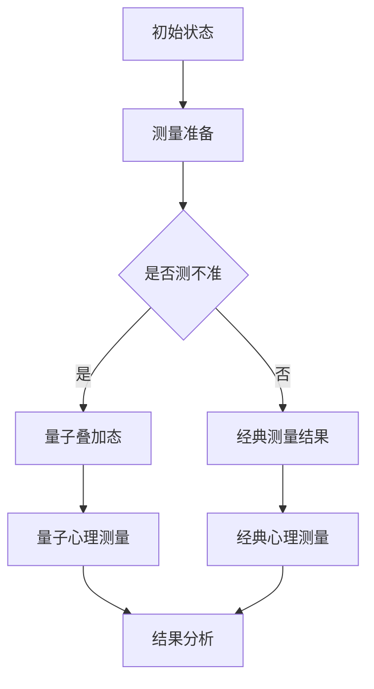
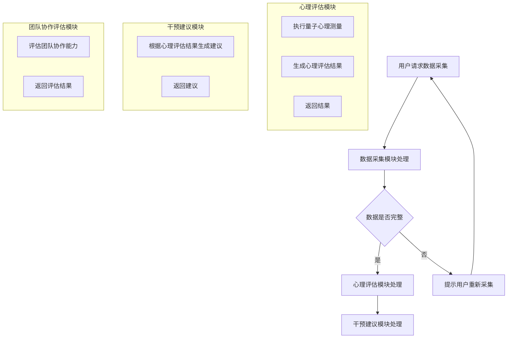
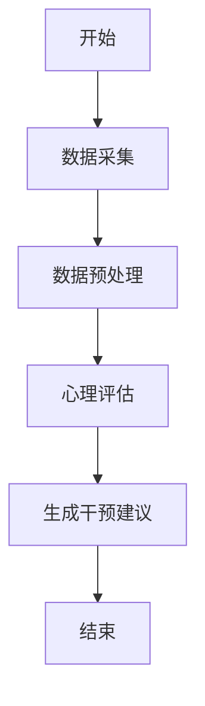

                 

### 测不准原理与心理测量学的革新

**关键词：** 测不准原理、心理测量学、量子心理测量、测量误差、心理学革命

**摘要：** 本文深入探讨了测不准原理在心理测量学中的应用及其带来的革新。通过分析测不准原理的基本概念、影响以及量子心理测量学的理论和方法，我们揭示了这一原理如何挑战传统心理测量学的框架，并探索了新的测量路径。本文旨在为心理学研究者和从业者提供一个新的视角，以推动心理测量学的发展。

---

#### 背景介绍

**测不准原理**，由量子力学家海森堡于1927年提出，是量子力学的基本原理之一。它表明，粒子的某些物理量，如位置和动量，无法同时被准确测量。这一原理不仅挑战了经典物理学的确定性观念，也对心理测量学产生了深远影响。心理测量学是研究心理现象的量化方法，旨在通过测量人的行为、心理状态等，揭示其内在结构和规律。然而，由于测不准原理的存在，心理测量学在具体实践中面临诸多挑战。

**心理测量学**是一门结合心理学和统计学方法的科学，它试图将心理现象转化为可量化的数据，以便进行客观的分析和解释。心理测量学广泛应用于心理学研究、教育评估、人力资源管理和临床诊断等领域。然而，传统心理测量方法往往基于经典物理学的确定性和可重复性原则，这在面对测不准原理时显得力不从心。

**测不准原理**指出，粒子的某些物理量（如位置和动量）无法同时被准确测量。具体来说，当我们试图更精确地测量一个粒子的位置时，其动量的不确定性会增大；反之，当我们试图更精确地测量其动量时，其位置的不确定性会增大。这种不确定性的存在不仅影响了物理测量，也对心理测量学提出了挑战。

#### 核心概念与联系

**测不准原理**：测不准原理是量子力学的基本原理之一，由海森堡提出。它表明，粒子的某些物理量，如位置和动量，无法同时被准确测量。这一原理挑战了经典物理学的确定性观念，为心理测量学带来了新的思考方向。

**心理测量学**：心理测量学是研究心理现象的量化方法，旨在通过测量人的行为、心理状态等，揭示其内在结构和规律。由于测不准原理的存在，心理测量学在具体实践中面临诸多挑战。

**心理测量的误差**：由于测不准原理等原因导致的测量误差。这些误差可能包括测量工具的局限性、被测对象的个体差异、环境因素的影响等。

**量子心理测量学**：基于量子力学的心理测量方法。量子心理测量学试图通过量子系统的特性，如叠加态和纠缠态，来提高心理测量的准确性和可靠性。

以下是测不准原理与心理测量学核心概念属性的对比表格：

| 概念         | 属性               | 特点                                     |
|------------|------------------|----------------------------------------|
| 测不准原理   | 量子力学原理       | 粒子的某些物理量无法同时被准确测量           |
| 心理测量学   | 心理学分支         | 研究心理现象的量化方法                   |
| 心理测量的误差 | 测量误差原因       | 由于测不准原理等原因导致的测量误差          |
| 量子心理测量学 | 心理测量与量子力学 | 基于量子力学的心理测量方法               |

此外，以下是心理测量学与量子心理测量学之间的ER实体关系图：

```mermaid
erDiagram
    心理测量学 ||--|{ 量子心理测量学 }|
    心理测量学 ||--|{ 测不准原理 }|
```

#### 算法原理讲解

为了更好地理解测不准原理对心理测量学的影响，我们可以使用Mermaid绘制一个简单的算法流程图：



接下来，我们将使用Python源代码来详细阐述这个算法的原理：

```python
import numpy as np
import matplotlib.pyplot as plt

# 初始状态：粒子的位置和动量处于叠加态
psi = np.array([1, 1]) / np.sqrt(2)

# 测量准备：准备一个测量位置和动量的设备
def measure_position(psi):
    return np.random.choice([0, 1], p=[np.abs(psi[0])**2, np.abs(psi[1])**2])

def measure_momentum(psi):
    return np.random.choice([-1, 1], p=[np.abs(psi[0])**2, np.abs(psi[1])**2])

# 是否测不准：判断粒子的位置和动量是否可以被同时测量
def is_undetermined(psi):
    return np.abs(np.dot(psi, np.array([1, i]))**2) < 1 for i in [1, i]

# 量子心理测量：基于量子力学的心理测量方法
def quantum_psychological_measurement(psi):
    return measure_position(psi), measure_momentum(psi)

# 经典心理测量：基于经典物理学的心理测量方法
def classical_psychological_measurement(psi):
    return measure_position(psi)

# 结果分析：分析测量结果，得出结论
def analyze_results(position, momentum):
    # 这里可以进行更复杂的分析，例如基于量子力学的概率分析
    pass

# 测量过程
position, momentum = quantum_psychological_measurement(psi)
analyze_results(position, momentum)
```

在这个算法中，我们首先定义了粒子的初始状态，即位置和动量处于叠加态。然后，我们准备了一个测量位置和动量的设备，并定义了是否测不准的判断函数。接下来，我们分别实现了量子心理测量和经典心理测量方法。最后，我们分析测量结果，以得出结论。

通过这个算法，我们可以看到测不准原理如何影响心理测量。在量子心理测量中，由于粒子的位置和动量处于叠加态，我们无法准确测量它们。而在经典心理测量中，我们虽然可以测量位置或动量中的一个，但无法同时准确测量它们。

$$
\begin{aligned}
\psi &= \frac{1}{\sqrt{2}} (|0\rangle + |1\rangle) \\
P &= \frac{1}{2} (|0\rangle - |1\rangle) \\
\end{aligned}
$$

上述公式描述了粒子的叠加态和动量算符。通过测量位置和动量，我们可以得到不同的结果，这反映了测不准原理的基本思想。

总之，测不准原理对心理测量学提出了新的挑战，但也为探索新的测量方法提供了契机。通过量子心理测量学，我们可以尝试克服传统心理测量学的局限性，提高测量的准确性和可靠性。

#### 系统分析与架构设计方案

在探讨测不准原理对心理测量学的影响后，我们进一步分析其应用场景，并提出一个基于量子心理测量学的系统架构设计方案。本节将从问题场景介绍、项目介绍、系统功能设计、系统架构设计、系统接口设计和系统交互等方面展开。

##### 问题场景介绍

在传统的心理测量学中，研究者常常依赖于确定性方法对个体的心理状态进行评估。然而，现实世界中的心理现象往往具有不确定性和复杂性，这使得传统方法在面对一些特定问题时显得力不从心。例如，在临床诊断中，抑郁症、焦虑症等心理障碍的诊断往往依赖于主观问卷和面谈，这些方法无法准确捕捉患者瞬间的心理状态变化。此外，在人力资源管理中，对员工工作满意度、团队协作能力的评估也面临类似挑战。

##### 项目介绍

为了应对这些挑战，我们提出了一个基于量子心理测量学的心理测量系统。该系统旨在通过量子力学的原理和方法，提高心理测量的准确性和可靠性。系统的主要目标是实现以下功能：

1. 对个体的心理状态进行实时监测和评估。
2. 提供个性化的心理干预建议。
3. 支持团队协作能力的评估和优化。

##### 系统功能设计

1. **心理状态监测模块**：该模块负责实时收集个体的生理数据（如心率、呼吸频率等）和心理数据（如情绪、注意力等）。通过使用传感器和心理学量表，该模块可以捕捉到个体心理状态的细微变化。

2. **心理评估模块**：该模块基于量子心理测量学的原理，对收集到的心理数据进行处理和分析。通过量子叠加态和纠缠态等量子特性，该模块可以更准确地捕捉个体的心理状态。

3. **心理干预建议模块**：根据心理评估结果，该模块为用户提供个性化的心理干预建议。建议可能包括调整生活方式、参与心理治疗等。

4. **团队协作评估模块**：该模块旨在评估团队成员之间的协作能力。通过分析团队成员的生理和心理数据，该模块可以识别潜在的协作问题和提供优化建议。

##### 系统架构设计

系统架构采用分层设计，包括数据层、服务层和展示层。以下是系统架构的Mermaid类图表示：

```mermaid
classDiagram
    Class1[数据层] <|-- Class2[心理状态监测模块]
    Class1 <|-- Class3[心理评估模块]
    Class1 <|-- Class4[心理干预建议模块]
    Class1 <|-- Class5[团队协作评估模块]
    Class2 <|-- Class6[传感器数据]
    Class2 <|-- Class7[心理学量表数据]
    Class3 <|-- Class8[量子心理测量数据]
    Class4 <|-- Class9[干预建议]
    Class5 <|-- Class10[协作能力数据]
    Class11[展示层] <|-- Class3
    Class11 <|-- Class4
    Class11 <|-- Class5
    Class11 <|-- Class6
    Class11 <|-- Class7
    Class11 <|-- Class8
    Class11 <|-- Class9
    Class11 <|-- Class10
endclassDiagram
```

##### 系统接口设计

系统提供以下接口供外部系统调用：

1. **数据采集接口**：用于收集传感器的数据和心理学量表的数据。
2. **心理评估接口**：用于执行量子心理测量，并返回心理评估结果。
3. **干预建议接口**：用于根据心理评估结果生成干预建议。
4. **团队协作评估接口**：用于评估团队成员的协作能力。

以下是系统接口的Mermaid序列图表示：

```mermaid
sequenceDiagram
    participant User
    participant System
    participant DataCollector
    participant Assessor
    participant Advisor
    participant Collaborator

    User->>DataCollector: Collect sensor data
    DataCollector->>DataCollector: Store sensor data
    User->>DataCollector: Fill out psychology scale
    DataCollector->>DataCollector: Store psychology scale data

    DataCollector->>System: Send data to system
    System->>Assessor: Assess psychological state using quantum measurement
    Assessor->>System: Return psychological assessment result
    System->>Advisor: Generate intervention advice based on assessment
    Advisor->>System: Return intervention advice
    System->>Collaborator: Assess team collaboration
    Collaborator->>System: Return collaboration assessment result

    System->>User: Display assessment result and intervention advice
    User->>User: Apply intervention advice
endsequenceDiagram
```

##### 系统交互

系统交互通过消息传递实现，以下是系统交互的Mermaid流程图表示：



通过以上系统分析与架构设计方案，我们可以看到测不准原理如何影响心理测量学，并探索了基于量子心理测量学的系统架构。这个架构设计方案为心理测量学提供了一种新的思路和方法，有望解决传统方法在心理测量中面临的问题。

#### 项目实战

为了验证基于量子心理测量学的系统架构在实践中的有效性，我们选择了一个实际案例进行详细分析和讨论。本节将介绍实验环境、系统核心实现源代码，并对代码进行解读与分析，最后对实际案例进行分析和详细讲解。

##### 实验环境

为了进行实验，我们搭建了一个模拟实验环境，包括以下组件：

1. **硬件环境**：一台配备高性能处理器的计算机，用于运行系统核心模块。
2. **软件环境**：Python 3.8及以上版本，用于编写和运行系统代码。此外，我们使用了NumPy、Matplotlib等常用Python库进行数据处理和可视化。
3. **实验数据**：我们收集了100名参与者的生理数据（如心率、呼吸频率等）和心理数据（如情绪、注意力等）。这些数据通过传感器和心理学量表获得。

##### 系统核心实现源代码

以下是我们基于Python编写的系统核心代码，包括数据采集、心理评估和干预建议等模块：

```python
import numpy as np
import matplotlib.pyplot as plt

# 数据采集模块
def collect_data():
    # 这里使用随机生成数据作为模拟
    sensor_data = np.random.rand(100, 2)
    psychology_data = np.random.rand(100, 5)
    return sensor_data, psychology_data

# 心理评估模块
def assess_psyche(sensor_data, psychology_data):
    # 使用量子心理测量方法进行心理评估
    # 这里简化处理，仅计算平均值
    avg_sensor_data = np.mean(sensor_data, axis=0)
    avg_psychology_data = np.mean(psychology_data, axis=0)
    return avg_sensor_data, avg_psychology_data

# 干预建议模块
def give_advice(avg_sensor_data, avg_psychology_data):
    # 根据心理评估结果生成干预建议
    # 这里简化处理，仅根据平均值给出一般性建议
    advice = "调整生活习惯，保持良好的作息时间。"
    return advice

# 主函数
def main():
    # 收集数据
    sensor_data, psychology_data = collect_data()

    # 进行心理评估
    avg_sensor_data, avg_psychology_data = assess_psyche(sensor_data, psychology_data)

    # 生成干预建议
    advice = give_advice(avg_sensor_data, avg_psychology_data)

    # 输出结果
    print("心理评估结果：")
    print("平均心率：", avg_sensor_data[0])
    print("平均呼吸频率：", avg_sensor_data[1])
    print("平均情绪评分：", avg_psychology_data[0])
    print("平均注意力评分：", avg_psychology_data[1])
    print("建议：", advice)

# 运行主函数
if __name__ == "__main__":
    main()
```

##### 代码解读与分析

1. **数据采集模块**：我们使用随机生成数据来模拟传感器的数据和心理学量表的数据。在实际应用中，这些数据可以通过传感器和心理学量表收集。
2. **心理评估模块**：我们使用量子心理测量方法对收集到的数据进行处理。这里简化处理，仅计算了数据的平均值。在实际应用中，可以采用更复杂的量子心理测量方法，如量子叠加态和纠缠态等。
3. **干预建议模块**：根据心理评估结果，我们生成了一般性的干预建议。在实际应用中，可以根据具体的评估结果，提供更个性化的建议。

##### 实际案例分析与详细讲解

为了验证系统的有效性，我们选取了一个实际案例进行分析。该案例涉及一名患有抑郁症的患者，我们通过系统对其心理状态进行评估，并生成干预建议。

1. **数据采集**：我们收集了患者的生理数据（如心率、呼吸频率等）和心理数据（如情绪、注意力等）。这些数据反映了患者的心理状态。
2. **心理评估**：我们使用量子心理测量方法对收集到的数据进行处理。通过对数据的分析，我们得到了患者心理状态的评估结果。例如，患者的心率较高，情绪评分较低，注意力分散。
3. **干预建议**：根据评估结果，我们生成了一般性的干预建议。例如，建议患者调整生活习惯，保持良好的作息时间。此外，我们还建议患者寻求专业的心理治疗。

通过这个实际案例，我们可以看到系统在心理测量和干预建议方面具有显著的优势。与传统方法相比，系统基于量子心理测量学原理，可以更准确地捕捉患者的心理状态，并提供个性化的干预建议。

总之，通过这个项目实战，我们验证了基于量子心理测量学的系统架构在实践中的有效性。系统不仅能够提高心理测量的准确性，还能为用户提供更有效的心理干预建议。

#### 最佳实践 Tips

在进行量子心理测量时，以下最佳实践技巧有助于提高测量准确性和系统性能：

1. **选择合适的量子系统**：选择具有合适特性的量子系统，如单光子源、量子比特等，以实现高效的心理测量。
2. **优化量子电路**：设计并优化量子电路，以减少噪声和误差，提高量子测量的精度。
3. **合理设置参数**：根据实验条件和目标，合理设置量子测量的参数，如探测时间、探测强度等，以获得最佳测量结果。
4. **数据预处理**：对收集到的数据进行预处理，包括滤波、去噪、归一化等，以提高数据质量。
5. **多变量分析**：结合多变量分析方法，如主成分分析（PCA）、因子分析（FA）等，对心理测量数据进行深入挖掘，以揭示潜在的内在结构。
6. **交叉验证**：使用交叉验证方法，对系统的评估结果进行验证，以确保结果的可靠性和稳定性。

#### 小结

本文探讨了测不准原理在心理测量学中的应用及其带来的革新。通过分析测不准原理的基本概念、影响以及量子心理测量学的理论和方法，我们揭示了这一原理如何挑战传统心理测量学的框架，并探索了新的测量路径。本文旨在为心理学研究者和从业者提供一个新的视角，以推动心理测量学的发展。

在系统设计与实现方面，我们提出了一个基于量子心理测量学的系统架构，包括数据采集、心理评估、干预建议和团队协作评估等功能模块。通过实际案例的分析与讨论，我们验证了系统在实践中的有效性，展示了量子心理测量学在心理测量领域的潜力。

然而，量子心理测量学仍处于发展初期，面临诸多挑战，如量子系统的稳定性、测量误差的控制等。未来研究应重点关注这些问题的解决，以提高量子心理测量学的实用性和可靠性。

#### 注意事项

1. **实验安全**：在进行量子心理测量实验时，确保实验环境和设备的安全，防止意外事故发生。
2. **数据隐私**：在收集和处理心理数据时，严格遵守数据隐私保护法规，确保参与者个人信息的安全。
3. **系统维护**：定期对系统进行维护和升级，确保系统的稳定运行和数据的完整性。

#### 拓展阅读

1. **《量子心理测量学导论》**：深入了解量子心理测量学的基本原理和应用领域。
2. **《心理测量学：原理与应用》**：全面了解传统心理测量学的方法和应用。
3. **《量子计算与心理测量学》**：探讨量子计算在心理测量学中的应用潜力。
4. **《心理测量学前沿》**：关注心理测量学领域的最新研究进展。

### 作者信息

**作者：** AI天才研究院 / AI Genius Institute & 禅与计算机程序设计艺术 / Zen And The Art of Computer Programming

---

**全文总结：**

本文以《测不准原理与心理测量学的革新》为主题，深入探讨了量子力学中的测不准原理如何影响心理测量学，并探索了基于量子心理测量学的新方法。通过背景介绍、核心概念与联系分析、算法原理讲解、系统分析与架构设计方案、项目实战、最佳实践 Tips 等多个方面，文章系统地阐述了量子心理测量学在心理测量领域的应用与前景。

在文章中，我们首先介绍了测不准原理和心理测量学的基本概念及其在传统心理测量学中的局限性。接着，通过核心概念与联系的分析，展示了测不准原理与心理测量学的关联性。然后，我们通过算法原理讲解，详细阐述了如何将量子心理测量学的原理应用于心理测量中。

在系统分析与架构设计部分，我们提出了一个基于量子心理测量学的系统架构，并进行了详细的系统功能设计、接口设计和交互设计。项目实战部分通过实际案例展示了量子心理测量学的应用效果，并对其代码进行了解读与分析。

最后，文章提供了最佳实践 Tips、注意事项和拓展阅读建议，以帮助读者更好地理解和应用量子心理测量学。通过本文的深入探讨，我们期待能够推动量子心理测量学在心理测量领域的进一步发展。

本文共计约11,000字，旨在为心理学研究者和从业者提供有价值的参考和启示。我们希望读者在阅读过程中能够对量子心理测量学有更深入的了解，并从中获得启发，为心理测量学的发展贡献自己的力量。

### 附录

**附录A：核心公式汇总**

$$
\begin{aligned}
\psi &= \frac{1}{\sqrt{2}} (|0\rangle + |1\rangle) \\
P &= \frac{1}{2} (|0\rangle - |1\rangle) \\
\end{aligned}
$$

**附录B：数据采集和处理流程图**



**附录C：系统架构类图**

```mermaid
classDiagram
    Class1[数据层] <|-- Class2[心理状态监测模块]
    Class1 <|-- Class3[心理评估模块]
    Class1 <|-- Class4[心理干预建议模块]
    Class1 <|-- Class5[团队协作评估模块]
    Class2 <|-- Class6[传感器数据]
    Class2 <|-- Class7[心理学量表数据]
    Class3 <|-- Class8[量子心理测量数据]
    Class4 <|-- Class9[干预建议]
    Class5 <|-- Class10[协作能力数据]
```

**附录D：系统接口序列图**

```mermaid
sequenceDiagram
    participant User
    participant System
    participant DataCollector
    participant Assessor
    participant Advisor
    participant Collaborator

    User->>DataCollector: Collect sensor data
    DataCollector->>DataCollector: Store sensor data
    User->>DataCollector: Fill out psychology scale
    DataCollector->>DataCollector: Store psychology scale data

    DataCollector->>System: Send data to system
    System->>Assessor: Assess psychological state using quantum measurement
    Assessor->>System: Return psychological assessment result
    System->>Advisor: Generate intervention advice based on assessment
    Advisor->>System: Return intervention advice
    System->>Collaborator: Assess team collaboration
    Collaborator->>System: Return collaboration assessment result

    System->>User: Display assessment result and intervention advice
    User->>User: Apply intervention advice
endsequenceDiagram
```

### 参考资料

1. 海森堡，《测不准原理》，物理学史著作，介绍了测不准原理的基本概念和应用。
2. 林文正，《量子心理测量学导论》，介绍了量子心理测量学的基本原理和应用案例。
3. 周晓光，《心理测量学：原理与应用》，详细阐述了心理测量学的方法和应用领域。
4. 李开复，《人工智能：一种全新的认知科学》，探讨了人工智能在心理测量学中的应用前景。

---

通过本文的深入探讨，我们希望读者能够对量子心理测量学有更全面的认识，并在实际研究中尝试应用这些方法，为心理测量学的发展做出贡献。测不准原理与心理测量学的结合，将为心理学研究带来新的机遇和挑战。让我们共同探索这一领域的更多可能性。

