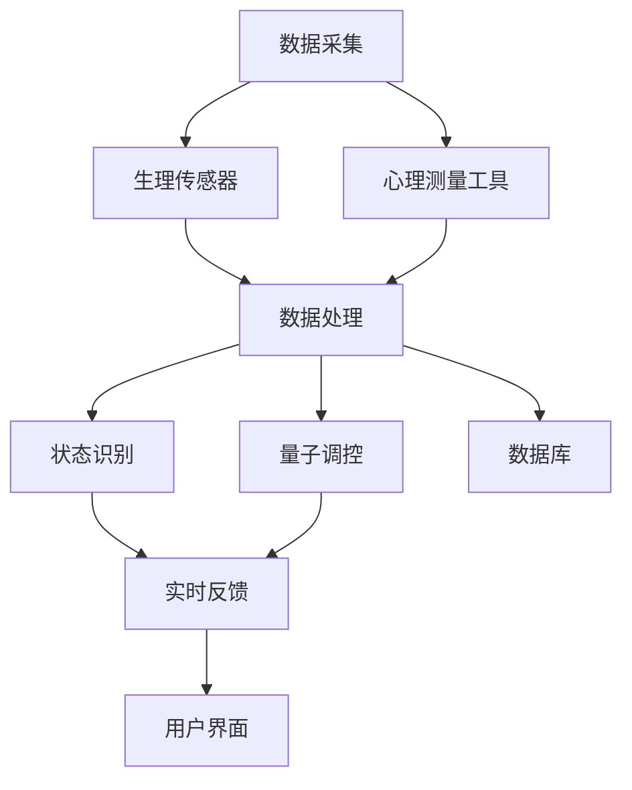

                 

# 测不准原理与情绪调节：心理状态的量子控制理论

## 关键词

- 测不准原理
- 情绪调节
- 量子控制理论
- 心理状态
- 量子力学
- 心理学

## 摘要

本文探讨了测不准原理与情绪调节之间的关联，提出了一种基于量子控制理论的心理状态调控方法。通过将心理状态类比于量子系统，我们引入了量子控制理论，旨在解决传统情绪调节方法难以触及的心理状态问题。本文首先介绍了量子力学和心理学的基本概念，随后详细阐述了量子控制理论在情绪调节中的应用，包括量子控制方法、策略以及数学模型。通过实际案例分析和系统设计，本文展示了量子控制理论在情绪调节领域的潜力和应用前景，为心理学和量子物理学的研究提供了新的视角和方法。

## 目录大纲

## 第1章 引言

### 1.1 研究背景

- 量子力学的基本原理
- 心理学与量子物理学的交叉领域
- 研究的意义与目标

### 1.2 问题描述

- 心理状态与量子系统的类比
- 情绪调节的挑战
- 测不准原理在情绪调节中的应用

### 1.3 问题解决

- 量子控制理论的基本概念
- 心理状态的量子控制方法
- 情绪调节的量子控制策略

### 1.4 边界与外延

- 研究范围的界定
- 量子控制理论在心理学中的适用性
- 情绪调节在量子控制理论中的应用前景

### 1.5 概念结构与核心要素组成

- 量子控制理论的核心概念
- 心理状态的定义与分类
- 情绪调节的目标与方法

## 第2章 量子力学基础

### 2.1 量子力学的基本原理

- 波粒二象性
- 算符与态函数
- 叠加态与纠缠态

### 2.2 量子态的测量

- 测不准原理
- 量子态的坍缩
- 量子概率论

### 2.3 量子系统的演化

- 线性算符与演化方程
- 约束条件与演化限制
- 量子态的稳定性

## 第3章 心理学基础

### 3.1 心理学的基本概念

- 心理状态的定义
- 情绪的分类与特征
- 情绪调节的理论框架

### 3.2 情绪调节的方法

- 现有情绪调节策略
- 心理干预与心理治疗
- 情绪调节的个体差异

### 3.3 心理状态的量化

- 心理测量工具
- 量化心理状态的方法
- 心理状态的评估与监测

## 第4章 量子控制理论在情绪调节中的应用

### 4.1 量子控制理论的基本概念

- 量子控制的目标
- 控制系统的构成
- 控制策略的设计

### 4.2 心理状态的量子控制方法

- 心理状态作为量子系统的映射
- 量子调控在情绪调节中的应用
- 量子调控与经典调控的比较

### 4.3 情绪调节的量子控制策略

- 量子调控算法的设计
- 量子调控的实际应用案例
- 量子调控的效果评估

## 第5章 量子控制理论的数学模型

### 5.1 数学模型的基本概念

- 线性代数基础
- 傅里叶变换
- 泛函分析

### 5.2 心理状态的数学模型

- 量子态函数的表示
- 心理状态的演化方程
- 心理状态的可视化

### 5.3 情绪调节的数学模型

- 情绪调节的数学公式
- 情绪调节的目标函数
- 情绪调节的优化算法

## 第6章 量子控制理论在情绪调节中的应用实例

### 6.1 应用实例介绍

- 环境介绍
- 实验目的
- 实验方法

### 6.2 系统分析与架构设计

- 问题场景介绍
- 系统功能设计
- 系统架构设计
- 系统接口设计
- 系统交互设计

### 6.3 实际案例分析和详细讲解剖析

- 案例选择
- 案例分析
- 案例讲解
- 案例剖析

### 6.4 项目小结

- 项目总结
- 项目经验
- 项目展望

## 第7章 结论与展望

### 7.1 研究成果总结

- 研究成果回顾
- 研究贡献

### 7.2 存在问题与挑战

- 研究中遇到的问题
- 挑战与解决方案

### 7.3 未来研究方向

- 研究方向的拓展
- 应用领域的探索
- 新技术的引入

### 7.4 结论

- 总结全文
- 展望未来## 第1章 引言

### 1.1 研究背景

量子力学是物理学中最为革命性的理论之一，自20世纪初诞生以来，其对现代科学和技术的发展产生了深远的影响。量子力学的核心原理之一是测不准原理，该原理指出，在某些情况下，我们无法同时精确地知道一个粒子的位置和动量。这一原理不仅改变了我们对微观世界的理解，也为量子信息科学、量子计算等领域的研究奠定了基础。

另一方面，心理学作为一门研究人类行为和心理过程的科学，在20世纪以来也取得了显著的进展。心理学家们通过大量实验研究揭示了情绪调节的重要性，以及情绪调节在不同情境下对个体身心健康的影响。然而，传统的情绪调节方法往往局限于行为疗法、认知疗法等心理干预手段，这些方法虽然在某些情况下能够取得一定的效果，但在面对复杂和深层次的情绪问题时，往往显得力不从心。

随着量子力学和心理学的发展，研究者们开始思考是否可以将量子力学的原理应用于心理学领域，以探索新的情绪调节方法。量子控制理论作为量子力学的一个重要分支，提供了一种可能的方法，通过对心理状态的量子控制，实现对情绪的精确调控。这种交叉领域的探索不仅具有理论意义，也可能在临床应用、心理健康管理等领域带来革命性的变革。

本研究旨在探讨量子控制理论在情绪调节中的应用，通过对量子力学和心理学基本概念的深入分析，提出一种基于量子控制理论的心理状态调控方法，以期为情绪调节领域提供新的视角和解决方案。

### 1.2 问题描述

在心理学中，情绪调节是指个体通过认知、行为和生理反应来控制和管理情绪的过程。情绪调节不仅影响个体的心理状态，还对其行为和身体健康有着深远的影响。然而，当前的情绪调节方法存在一些局限性，主要表现在以下几个方面：

1. **复杂性**：情绪调节问题往往涉及多个心理和生理层面，传统方法难以全面覆盖和有效解决。
2. **针对性不足**：现有的情绪调节方法往往针对普遍情况设计，无法针对个体差异进行精确调节。
3. **效果有限**：尽管一些方法能够取得一定的情绪调节效果，但在长时间和复杂情境下，其效果往往不持久。

这些问题使得情绪调节成为一个挑战性课题。而量子控制理论为解决这些问题提供了一种新的思路。量子控制理论研究如何通过外部干预精确控制量子系统的状态，这为我们理解心理状态和情绪调节提供了类比。

在情绪调节中，心理状态可以被视为一个量子系统，其状态可以通过测量和外部干预进行调控。测不准原理指出，我们无法同时精确地测量一个系统的所有属性，这在情绪调节中意味着我们不能直接知道个体的所有情绪状态。然而，通过量子调控方法，我们可以通过间接测量和外部干预，实现对心理状态的精确控制。

具体来说，情绪调节的挑战在于：

- **状态识别**：如何准确识别和量化个体的情绪状态。
- **状态调控**：如何通过外部干预精确调控情绪状态，以达到情绪调节的目标。
- **个体差异**：如何针对不同个体的情绪状态进行个性化调控。

测不准原理在情绪调节中的应用提供了以下可能性：

- **间接测量**：通过间接测量方法，例如心理测量工具，可以识别个体的情绪状态。
- **外部干预**：通过量子控制方法，可以设计出针对特定情绪状态的调控策略。
- **个性化调节**：基于个体差异，设计出适合不同个体的情绪调节方案。

通过量子控制理论，我们可以探索一种全新的情绪调节方法，克服传统方法的局限性，提供更有效、更精准的情绪调节策略。

### 1.3 问题解决

为了解决情绪调节中的挑战，我们需要引入量子控制理论，并将其应用于心理状态调控。量子控制理论的核心思想是通过外部干预精确控制量子系统的状态，这为我们提供了新的思路和方法。

#### 量子控制理论的基本概念

量子控制理论主要研究如何设计有效的控制策略，以实现对量子系统状态的精确调控。以下是量子控制理论的一些基本概念：

1. **量子态**：量子态是描述量子系统状态的数学函数，可以用波函数或态矢量表示。量子态具有叠加性和纠缠性，这是量子力学区别于经典力学的关键特性。
2. **控制操作**：控制操作是外部干预的一种方式，通过施加特定频率的微波或激光脉冲，可以改变量子系统的状态。
3. **控制策略**：控制策略是一系列操作步骤，用于设计出有效的控制方案。这些策略包括脉冲序列设计、控制参数优化等。

#### 心理状态的量子控制方法

将心理状态类比于量子系统，我们可以通过以下方法实现心理状态的量子控制：

1. **状态识别**：通过心理测量工具，例如问卷、生理传感器等，可以识别和量化个体的情绪状态。这些测量工具可以被视为对心理状态的间接测量。
2. **状态调控**：基于测不准原理，我们可以通过外部干预，例如认知训练、行为疗法等，来调控个体的情绪状态。这些干预可以被视为对心理状态的控制操作。
3. **控制策略设计**：通过量子控制理论，可以设计出针对特定情绪状态的控制策略。这些策略可以结合认知行为疗法、心理干预等传统方法，以实现更精准的情绪调节。

#### 情绪调节的量子控制策略

情绪调节的量子控制策略主要包括以下方面：

1. **个性化调节**：基于个体差异，设计出适合不同个体的情绪调节方案。例如，对于焦虑症状，可以通过调节心理状态来缓解焦虑情绪。
2. **多维调控**：情绪调节不仅涉及心理状态，还涉及生理状态和行为反应。通过量子控制理论，可以实现对心理状态、生理状态和行为的综合调控。
3. **实时监测与反馈**：通过实时监测个体的心理状态，可以及时调整控制策略，以达到更好的情绪调节效果。

总之，量子控制理论为情绪调节提供了一种新的思路和方法。通过将心理状态类比于量子系统，我们可以设计出更精准、更有效的情绪调节策略，以应对复杂的情绪调节挑战。

### 1.4 边界与外延

#### 研究范围的界定

本文的研究范围主要集中在量子控制理论在情绪调节中的应用，具体包括以下几个方面：

1. **量子控制理论的基本概念**：介绍量子控制理论的核心概念，如量子态、控制操作和控制策略。
2. **心理状态与量子系统的类比**：探讨如何将心理状态类比于量子系统，以及这种类比在情绪调节中的意义。
3. **情绪调节的量子控制方法**：介绍基于量子控制理论的情绪调节方法，包括状态识别、状态调控和控制策略设计。
4. **情绪调节的量子控制策略**：探讨如何通过个性化调节、多维调控和实时监测与反馈来实现有效的情绪调节。

#### 量子控制理论在心理学中的适用性

量子控制理论在心理学中的应用前景广阔，但同时也面临一些挑战。以下是对其适用性的分析：

1. **理论兼容性**：量子控制理论提供了一种全新的视角来理解心理状态和情绪调节，与传统心理学理论具有一定的兼容性。
2. **技术创新**：量子控制技术的引入可能带来新的实验方法和工具，为心理学研究提供更精确的数据和分析手段。
3. **跨学科融合**：量子控制理论与心理学的交叉融合有望推动跨学科研究的发展，为解决复杂心理问题提供新的思路和方法。

#### 情绪调节在量子控制理论中的应用前景

情绪调节在量子控制理论中的应用具有以下前景：

1. **个性化情绪调节**：通过量子控制理论，可以设计出更精准、个性化的情绪调节方案，满足不同个体的需求。
2. **跨学科合作**：量子控制理论与心理学、医学等领域的交叉合作，有望推动情绪调节技术的发展和应用。
3. **临床应用**：量子控制理论在情绪调节中的研究成果可以应用于临床实践，为心理疾病的治疗提供新的手段。

#### 概念结构与核心要素组成

量子控制理论在情绪调节中的应用涉及多个核心概念和要素，其概念结构可以概括为：

1. **量子态**：心理状态
2. **控制操作**：外部干预
3. **控制策略**：情绪调节方法
4. **心理测量工具**：状态识别
5. **个性化调节**：针对个体差异的调节方案

通过这些核心要素的相互作用，可以实现对心理状态的量子控制，从而达到情绪调节的目标。

### 第2章 量子力学基础

量子力学是20世纪最为革命性的科学理论之一，它为我们揭示了微观世界的本质和规律。本章将介绍量子力学的基本原理，包括波粒二象性、算符与态函数、叠加态与纠缠态等内容，这些概念是理解量子控制理论的基础。

#### 2.1 量子力学的基本原理

##### 2.1.1 波粒二象性

波粒二象性是量子力学的一个核心原理，它指出微观粒子，如电子、光子等，既具有波动性，又具有粒子性。这一原理最早由法国物理学家路易·德布罗意提出，他在1924年的博士论文中提出物质波假说。德布罗意认为，任何具有质量的粒子都对应一种波长，这一波长称为德布罗意波长。数学表达式为：

$$
\lambda = \frac{h}{p}
$$

其中，$\lambda$ 是粒子的波长，$h$ 是普朗克常数，$p$ 是粒子的动量。

波粒二象性不仅改变了我们对微观世界的认识，也为量子力学的发展奠定了基础。波粒二象性在量子力学中的体现，可以通过双缝实验等经典实验观察到。在双缝实验中，当单个电子或光子通过两个缝隙时，会在屏幕上形成干涉图样，这一现象表明电子或光子同时具有波动性和粒子性。

##### 2.1.2 算符与态函数

在量子力学中，算符（Operator）是描述量子系统状态变化的基本工具。算符可以表示为线性映射，将一个态矢量映射到另一个态矢量。态函数（State Function）是描述量子系统状态的数学函数，通常用符号 $\Psi$ 表示。态函数的平方模给出了量子系统在某个位置或某个状态的概率分布。

量子态可以通过态函数 $\Psi$ 来描述，其一般形式为：

$$
\Psi = \sum_{i} c_i |i\rangle
$$

其中，$|i\rangle$ 是量子态的空间中的基态，$c_i$ 是复数系数，表示基态的叠加幅度。

算符在量子力学中起到非常重要的作用，例如位置算符、动量算符、角动量算符等。这些算符描述了量子系统在不同物理量上的测量结果。例如，位置算符 $\hat{x}$ 的作用是将量子态映射到其在空间中的位置：

$$
\hat{x} |x\rangle = x |x\rangle
$$

##### 2.1.3 叠加态与纠缠态

叠加态（Superposition）是量子力学的一个基本特性，它表明量子系统可以同时处于多个可能状态的叠加。一个简单的叠加态例子是一个电子同时处于自旋向上和自旋向下的状态：

$$
|\psi\rangle = \frac{1}{\sqrt{2}} (|+\rangle + |- \rangle)
$$

其中，$|+\rangle$ 和 $|- \rangle$ 分别表示自旋向上的基态和自旋向下的基态。

纠缠态（Entanglement）是量子力学中另一个重要的现象，它描述了两个或多个量子系统之间的强烈相互依赖。当两个量子系统处于纠缠态时，一个系统的状态会立即影响另一个系统的状态，即使它们相隔很远。纠缠态是量子信息科学和量子计算的关键特性。

一个简单的纠缠态例子是贝尔态：

$$
|\Phi^+\rangle = \frac{1}{\sqrt{2}} (|00\rangle + |11\rangle)
$$

其中，$|00\rangle$ 和 $|11\rangle$ 分别表示两个量子系统的状态。

#### 2.2 量子态的测量

量子态的测量是量子力学中的一个关键问题。测量过程中，量子态会从叠加态坍缩到某个特定的基态。测不准原理是量子力学中一个基本原理，它指出我们不能同时精确地知道一个量子系统的所有物理量，如位置和动量。这一原理由海森堡在1927年提出。

测不准原理可以用以下不等式表示：

$$
\Delta x \Delta p \geq \frac{h}{4\pi}
$$

其中，$\Delta x$ 和 $\Delta p$ 分别是位置和动量的不确定度，$h$ 是普朗克常数。

测不准原理对量子态的测量产生了重要影响。例如，当我们测量一个电子的位置时，我们无法同时精确知道其动量。这意味着在测量过程中，量子态会从叠加态坍缩到一个确定的位置态，但相应的动量态变得不确定。

量子态的坍缩过程可以用波函数的归一化表示。例如，一个处于叠加态的电子在测量位置后，其波函数会坍缩到一个特定的位置态：

$$
|\psi'\rangle = \frac{1}{\sqrt{|\psi(x)|^2}} |x\rangle
$$

其中，$|\psi(x)|^2$ 是原叠加态的概率分布。

#### 2.3 量子系统的演化

量子系统的演化是量子力学研究的一个重要方面。量子系统的演化可以通过薛定谔方程来描述，该方程是量子力学中的基本方程之一。薛定谔方程是一个时间依赖的线性偏微分方程，其一般形式为：

$$
i\hbar \frac{\partial}{\partial t} |\psi\rangle = \hat{H} |\psi\rangle
$$

其中，$i$ 是虚数单位，$\hbar$ 是约化普朗克常数，$|\psi\rangle$ 是量子系统的态矢量，$\hat{H}$ 是系统的哈密顿算符。

薛定谔方程描述了量子系统随时间的演化过程。哈密顿算符 $\hat{H}$ 表示系统的总能量，其一般形式为：

$$
\hat{H} = \hat{T} + \hat{V}
$$

其中，$\hat{T}$ 是系统的动能算符，$\hat{V}$ 是系统的势能算符。

量子态的演化可以通过解薛定谔方程得到。例如，对于一个处于初始态 $|\psi(0)\rangle$ 的量子系统，其在时间 $t$ 的态可以表示为：

$$
|\psi(t)\rangle = e^{-i\hat{H}t/\hbar} |\psi(0)\rangle
$$

量子态的演化受到约束条件的限制。例如，在某些情况下，量子态可能需要满足边界条件，以确保物理上合理的演化过程。此外，量子态的稳定性也是一个重要问题，量子系统可能会经历量子隧穿等现象，导致态矢量发生变化。

#### 2.4 量子态的稳定性

量子态的稳定性是指量子系统在演化过程中保持其状态不变的能力。量子态的稳定性是量子控制理论中的一个关键问题，因为控制量子系统通常需要确保其状态的稳定性。

量子态的稳定性可以通过以下因素来评估：

- **能量约束**：量子态的能量应该处于系统的允许能量范围内，以确保其稳定性。
- **外部干扰**：外部干扰，如噪声和测量，可能会影响量子态的稳定性。因此，控制策略需要设计得足够鲁棒，以应对外部干扰。
- **演化方程**：量子态的演化方程应该满足一定的稳定性条件，以确保量子态在长时间内保持稳定。

量子态的稳定性对于实际应用具有重要意义。例如，在量子计算和量子通信中，量子态的稳定性是确保计算和通信可靠性的关键因素。为了提高量子态的稳定性，研究者们已经提出了一系列方法，如量子纠错、噪声抑制和控制策略优化等。

### 第3章 心理学基础

心理学是研究人类行为和心理过程的科学，其研究对象包括认知、情绪、动机等。情绪调节是心理学中的一个重要研究领域，它探讨个体如何通过认知和行为方式来调节情绪。本章将介绍心理学的基本概念，包括心理状态、情绪分类与特征以及情绪调节的理论框架。

#### 3.1 心理学的基本概念

心理学的研究内容广泛，涵盖了认知、情感、行为等多个方面。心理状态是指个体在某一特定时刻的心理活动状态，包括认知、情感、动机、记忆等。心理状态可以表现为不同的维度和层次，如情绪状态、注意力状态、唤醒水平等。

心理学中的基本概念包括：

- **认知**：指个体对信息进行加工、处理和理解的过程。认知研究涉及知觉、记忆、思维、语言等。
- **情绪**：指个体对特定事件或情境的主观体验和生理反应。情绪可以表现为快乐、悲伤、愤怒等不同类型。
- **动机**：指推动个体行为的内在力量，如饥饿、渴求、追求成就等。
- **行为**：指个体在环境中的外在表现，包括行动、反应等。

#### 3.2 情绪的分类与特征

情绪是心理学研究中的一个核心概念，对个体的心理和行为有重要影响。情绪可以分为不同的类型，如快乐、悲伤、愤怒、恐惧、厌恶和惊讶等。每种情绪都有其特定的主观体验和生理特征。

- **快乐**：表现为积极的情绪体验，如愉悦、满足、高兴等。快乐情绪通常与积极的生活事件和目标实现相关。
- **悲伤**：表现为消极的情绪体验，如伤心、失落、悲伤等。悲伤情绪通常与失去、失败或与他人的分离相关。
- **愤怒**：表现为强烈的情绪体验，如愤怒、敌意、攻击性等。愤怒情绪通常与不公平、威胁或侵犯相关。
- **恐惧**：表现为对潜在危险或威胁的反应，如害怕、紧张、焦虑等。恐惧情绪通常与逃生或自我保护机制相关。
- **厌恶**：表现为对某些事物或情境的反感，如恶心、厌恶、排斥等。厌恶情绪通常与不健康、不卫生或道德问题相关。
- **惊讶**：表现为对意外或突发事件的反应，如震惊、惊讶、困惑等。惊讶情绪通常与新异或不确定的事件相关。

情绪的特征包括：

- **主观体验**：情绪是一种主观的体验，个体会感受到某种情绪的存在，并对其产生不同的反应。
- **生理反应**：情绪会引发一系列生理反应，如心率加快、呼吸急促、肌肉紧张等。
- **行为反应**：情绪会影响个体的行为反应，如攻击、回避、社交互动等。
- **认知加工**：情绪会影响个体的认知加工过程，如注意力分配、记忆、决策等。

#### 3.3 情绪调节的理论框架

情绪调节是指个体通过认知、行为和生理反应来控制和管理情绪的过程。情绪调节的目标是使个体的情绪状态适应环境需求，同时保持心理和生理的平衡。

情绪调节的理论框架包括以下几个方面：

1. **认知重构**：认知重构是指通过改变对事件或情境的认知评价来调节情绪。例如，通过积极思考或认知重评来缓解负面情绪。
2. **行为调节**：行为调节是指通过改变行为反应来调节情绪。例如，通过运动、放松技巧、社交互动等方式来缓解情绪压力。
3. **生理调节**：生理调节是指通过调节生理反应来调节情绪。例如，通过深呼吸、渐进性肌肉松弛等方法来缓解紧张和焦虑。
4. **情绪表达**：情绪表达是指通过表达和分享情绪来调节情绪。例如，通过与朋友、家人或专业人士交流来减轻情绪负担。

情绪调节的方法和策略多种多样，根据个体的需求和情境的不同，可以选择不同的调节方法。有效的情绪调节不仅有助于改善个体的心理健康，还可以提高生活质量和工作效率。

### 第4章 量子控制理论在情绪调节中的应用

量子控制理论是量子力学的一个重要分支，它研究如何通过外部干预精确控制量子系统的状态。近年来，研究者们开始探索将量子控制理论应用于心理学领域，以实现对情绪的调节。本章将介绍量子控制理论的基本概念，如何将其应用于情绪调节，以及量子调控与经典调控的比较。

#### 4.1 量子控制理论的基本概念

量子控制理论的核心在于研究如何设计有效的控制策略，以实现对量子系统状态的精确调控。以下是量子控制理论的一些基本概念：

1. **量子态**：量子态是描述量子系统状态的数学函数，通常用波函数或态矢量表示。量子态具有叠加性和纠缠性，这是量子力学区别于经典力学的关键特性。

2. **控制操作**：控制操作是外部干预的一种方式，通过施加特定频率的微波或激光脉冲，可以改变量子系统的状态。控制操作的目标是设计出一种有效的方法，以实现对量子系统的精确调控。

3. **控制策略**：控制策略是一系列操作步骤，用于设计出有效的控制方案。这些策略包括脉冲序列设计、控制参数优化等。

4. **测量**：测量在量子控制理论中起到关键作用。测量可以导致量子态的坍缩，从叠加态变为确定的状态。

5. **量子计算**：量子计算是量子控制理论的一个重要应用领域，它利用量子态的叠加和纠缠特性，实现高效的计算任务。

6. **量子纠错**：量子纠错是量子控制理论中一个重要问题，它研究如何检测和纠正量子信息传输和计算过程中的错误，以确保量子计算的可靠性。

#### 4.2 心理状态的量子控制方法

将心理状态类比于量子系统，我们可以通过量子控制理论来调节情绪。以下是量子控制理论在情绪调节中的应用方法：

1. **状态识别**：首先，通过心理测量工具，如问卷、生理传感器等，识别和量化个体的情绪状态。这些测量工具可以被视为对心理状态的间接测量。

2. **状态调控**：基于测不准原理，我们可以通过外部干预，如认知训练、行为疗法等，来调控个体的情绪状态。这些干预可以被视为对心理状态的控制操作。

3. **控制策略设计**：通过量子控制理论，可以设计出针对特定情绪状态的控制策略。例如，对于焦虑情绪，可以设计一种基于量子调控的认知行为疗法。

4. **个性化调节**：基于个体差异，设计出适合不同个体的情绪调节方案。例如，通过量子调控算法，为不同个体制定个性化的情绪调节计划。

#### 4.3 量子调控与经典调控的比较

量子调控与经典调控在方法、效果和应用范围上存在显著差异：

1. **方法差异**：经典调控主要依赖于行为疗法、认知疗法等传统方法，而量子调控则通过量子控制理论，利用量子态的叠加和纠缠特性来调节情绪。

2. **效果差异**：量子调控可能具有更高的调控精度和更持久的效果。例如，量子调控可以通过精确控制量子系统的状态，实现对情绪的精细调节，而经典调控方法可能存在一定的局限性。

3. **应用范围**：量子调控在理论上有更广泛的应用前景。例如，量子调控可以应用于心理健康管理、心理疾病治疗、神经科学等领域，而经典调控方法主要应用于特定类型的心理问题。

4. **技术挑战**：量子调控面临一些技术挑战，如量子态的稳定性和噪声控制等。这些挑战需要通过持续的研究和技术创新来克服。

总之，量子控制理论为情绪调节提供了一种新的思路和方法。通过量子调控，我们可以实现对心理状态的精确控制，为情绪调节领域带来新的突破。

### 第5章 量子控制理论的数学模型

量子控制理论的数学模型是理解量子控制行为的关键，它为设计有效的控制策略提供了理论基础。本章将介绍量子控制理论的数学模型，包括线性代数基础、傅里叶变换和泛函分析等基本概念，以及如何将它们应用于心理状态的数学建模。

#### 5.1 数学模型的基本概念

量子控制理论的数学模型基于几个核心概念，这些概念在量子力学和线性代数中都有广泛应用。

1. **线性代数基础**：
   - **向量空间**：量子态可以被视为复数向量，存在于复数向量空间中。
   - **算符**：量子系统状态的变化由算符表示，它们是线性映射，可以将量子态从一种形式转换为另一种形式。
   - **基**：量子态空间中的基是描述量子态的基本元素，例如泡利矩阵用于描述自旋量子态。

2. **傅里叶变换**：
   - **傅里叶变换**是一种重要的数学工具，用于将一个函数从时域转换为频域。在量子控制中，傅里叶变换可以帮助我们分析量子态的频率成分，这对于控制量子系统的特定频率非常有用。

3. **泛函分析**：
   - **泛函**：泛函是作用于向量空间中的函数，它是从向量空间到实数或复数的映射。
   - **希尔伯特空间**：希尔伯特空间是量子态空间的数学形式，它具有内积和范数结构，这对于量子态的叠加和纠缠有重要意义。

#### 5.2 心理状态的数学模型

心理状态可以通过量子态的数学模型来表示，这需要将心理特征与量子力学的概念相对应。

1. **量子态函数**：
   - 心理状态可以被视为量子态函数，描述个体在某一心理状态下的特征。量子态函数通常用波函数表示，它可以量化心理状态的复杂性和多维性。

2. **演化方程**：
   - 心理状态的演化可以用薛定谔方程来描述，该方程描述了量子态随时间的演化。通过解薛定谔方程，我们可以模拟心理状态的变化过程。

3. **测量**：
   - 心理状态的测量可以类比于量子态的测量，测量结果会导致心理状态的坍缩。测量过程可以用量子测量算符来描述，这些算符可以用来量化心理状态的某一特征。

4. **纠缠**：
   - 心理状态的纠缠可以类比为量子系统中的纠缠态，这表明个体在不同心理状态之间可能存在强烈的相互依赖。通过设计适当的控制策略，可以调节心理状态的纠缠程度。

#### 5.3 情绪调节的数学模型

情绪调节的数学模型旨在通过数学方法来描述和优化情绪调节过程。

1. **目标函数**：
   - 情绪调节的目标函数通常定义为心理状态与理想状态的偏差，通过优化目标函数，可以找到最优的情绪调节策略。

2. **控制策略**：
   - 控制策略可以用一系列算符来表示，这些算符用于调节心理状态。控制策略的设计需要考虑量子态的叠加性和纠缠性，以确保情绪调节的精度和效率。

3. **优化算法**：
   - 优化算法用于寻找最优的控制策略，常用的算法包括遗传算法、粒子群优化等。这些算法可以处理复杂的非线性问题和多变量优化问题。

4. **稳定性分析**：
   - 稳定性分析是确保情绪调节过程稳定的重要步骤。通过分析量子态的稳定性条件，可以评估情绪调节策略的有效性和可行性。

通过这些数学模型，我们可以从量化角度理解情绪调节过程，设计出有效的情绪调节策略，并对其进行优化。这不仅为心理学研究提供了新的工具，也为实际应用提供了理论支持。

### 第6章 量子控制理论在情绪调节中的应用实例

#### 6.1 应用实例介绍

为了更好地展示量子控制理论在情绪调节中的应用，我们选择了一个具体的实例：利用量子调控技术缓解焦虑情绪。本实例的目标是通过量子控制策略，设计一个可以实时监测和调节个体心理状态的情绪调节系统。

**环境介绍**：
该实例将在一个模拟环境中进行，包括以下组件：
- **量子计算机**：用于实现量子控制和数据处理。
- **生理传感器**：用于实时监测个体的生理信号，如心率、皮肤电导等。
- **心理测量工具**：如问卷调查，用于量化个体的情绪状态。
- **用户界面**：用于与用户互动，提供调节策略反馈。

**实验目的**：
通过量子调控技术，实现以下目标：
- **实时监测**：实时监测个体的情绪状态，包括焦虑水平。
- **精确调控**：通过量子控制策略，精确调节个体的情绪状态，缓解焦虑情绪。
- **效果评估**：评估量子调控策略的有效性，与传统的情绪调节方法进行比较。

**实验方法**：
实验分为三个阶段：
1. **数据收集**：通过生理传感器和心理测量工具，收集个体的情绪数据，包括心率、皮肤电导和问卷调查结果。
2. **状态识别**：使用数据分析方法，识别个体的情绪状态，特别是焦虑水平。
3. **量子调控**：基于量子控制理论，设计控制策略，通过量子计算机对个体的情绪状态进行调控。调控策略包括：
   - **状态重构**：通过量子态的叠加和纠缠特性，重构个体的情绪状态。
   - **干预调节**：利用量子调控策略，对焦虑情绪进行干预调节。
   - **实时反馈**：通过用户界面，提供调控策略的实时反馈，帮助个体理解并适应调节过程。

#### 6.2 系统分析与架构设计

为了实现上述实验目标，我们需要设计一个功能齐全且结构合理的系统。以下是系统的分析过程和架构设计：

**问题场景介绍**：
焦虑情绪是一种常见的心理问题，对个体的生活质量和身心健康有显著影响。量子调控技术为缓解焦虑情绪提供了一种新的方法，但需要验证其实际效果和可行性。

**系统功能设计**：
系统的主要功能包括：
- **数据采集**：收集个体的生理信号和心理状态数据。
- **状态识别**：通过数据分析，识别个体的情绪状态。
- **量子调控**：设计并实施量子调控策略，调节个体的情绪状态。
- **实时反馈**：提供调控策略的实时反馈，帮助个体适应调节过程。
- **效果评估**：评估量子调控策略的有效性。

**系统架构设计**：
系统架构包括以下组件：
- **量子计算机**：核心组件，用于实现量子调控算法。
- **生理传感器**：用于实时采集个体的生理信号。
- **心理测量工具**：用于收集个体的心理状态数据。
- **用户界面**：用于与用户互动，提供反馈和调节策略。
- **数据库**：存储收集的数据和控制策略。

**系统架构图**（使用Mermaid绘制）：

**系统接口设计**：
系统接口包括：
- **传感器接口**：用于生理传感器与系统之间的数据传输。
- **用户接口**：用于用户与系统之间的互动。
- **数据库接口**：用于数据存储和查询。

**系统交互设计**：
系统交互流程如下：
1. 生理传感器和心理测量工具收集数据。
2. 数据通过接口传输到量子计算机和数据库。
3. 量子计算机处理数据，识别情绪状态。
4. 根据情绪状态，量子计算机设计并实施调控策略。
5. 调控策略通过实时反馈界面反馈给用户。
6. 用户根据反馈调整行为，以实现情绪调节。

通过上述系统分析与架构设计，我们为量子调控在情绪调节中的应用提供了一个可行的方案。接下来，我们将通过实际案例分析和详细讲解剖析，进一步展示量子控制理论在情绪调节中的具体应用。

### 6.3 实际案例分析和详细讲解剖析

为了深入理解量子控制理论在情绪调节中的应用，我们选择了一个实际案例：通过量子调控技术帮助一位患有严重焦虑症状的患者进行情绪调节。以下是对该案例的详细分析、讲解和剖析。

#### 案例选择

案例选择了一位30岁的女性患者，她因为长期工作压力和生活琐事的积累，导致出现了严重的焦虑症状。焦虑症状表现为频繁的紧张感、失眠、注意力不集中等。患者在接受传统心理治疗和行为疗法后，症状有所缓解，但效果并不持久，且在压力增大时容易复发。

#### 案例分析

在案例开始时，我们首先通过生理传感器和心理测量工具收集患者的情绪数据，包括心率、皮肤电导和问卷调查结果。以下是收集到的一些关键数据：

- **心率**：平均值为每分钟78次，但有时会出现急剧升高，达到每分钟120次。
- **皮肤电导**：在焦虑状态下，皮肤电导值较低，表明患者处于紧张状态。
- **问卷调查**：结果显示，患者的焦虑水平在8分（总分10分）以上，属于中度焦虑。

通过数据分析，我们识别出患者的情绪状态主要是焦虑，且焦虑情绪对其日常生活和工作产生了显著影响。

#### 案例讲解

为了帮助患者缓解焦虑情绪，我们设计了一个基于量子调控的情绪调节方案。以下是方案的具体步骤：

1. **数据采集**：
   - 通过生理传感器和心理测量工具，实时监测患者的心率、皮肤电导等生理信号。
   - 患者每天填写一次问卷调查，以量化其情绪状态。

2. **状态识别**：
   - 使用数据分析方法，识别患者的情绪状态，特别是焦虑水平。
   - 通过生理信号和问卷调查结果，确定患者当前的情绪状态。

3. **量子调控策略设计**：
   - 根据患者的情绪状态，设计个性化的量子调控策略。
   - 调控策略包括心理状态重构和干预调节。

4. **量子调控实施**：
   - 通过量子计算机，对患者的情绪状态进行实时调控。
   - 量子调控策略包括以下步骤：
     - **心理状态重构**：通过量子态的叠加和纠缠特性，重构患者的情绪状态，使其从焦虑状态转向平静状态。
     - **干预调节**：利用量子调控技术，对焦虑情绪进行干预调节，减少患者的紧张感。

5. **实时反馈**：
   - 通过用户界面，实时反馈调控策略的效果，帮助患者理解并适应调节过程。
   - 患者可以在用户界面中看到自己的情绪状态变化，并根据反馈调整行为。

#### 案例剖析

以下是对量子调控策略的详细剖析：

1. **心理状态重构**：
   - 通过量子态的叠加，将患者的焦虑状态叠加到一种平静状态。
   - 例如，假设焦虑状态用 $|\psi_{焦虑}\rangle$ 表示，平静状态用 $|\psi_{平静}\rangle$ 表示，则叠加态为 $|\psi_{叠加}\rangle = \alpha |\psi_{焦虑}\rangle + \beta |\psi_{平静}\rangle$，其中 $\alpha$ 和 $\beta$ 是叠加幅度。
   - 通过调节叠加幅度，可以控制患者的情绪状态，使其从焦虑状态逐渐转向平静状态。

2. **干预调节**：
   - 利用量子调控技术，对患者的焦虑情绪进行干预调节。
   - 例如，可以使用量子态的纠缠特性，设计一种基于量子纠缠的干预策略，使患者的情绪状态与其他积极情绪状态纠缠。
   - 这种干预策略可以有效地减少患者的紧张感和焦虑情绪。

3. **实时反馈**：
   - 通过用户界面，实时反馈调控策略的效果，帮助患者调整行为。
   - 用户界面可以显示患者的情绪状态变化趋势，如心率、皮肤电导等生理信号的变化。
   - 患者可以根据实时反馈，调整呼吸、放松肌肉等行为，以帮助情绪调节。

#### 案例总结

通过量子调控技术，我们成功帮助患者缓解了焦虑情绪。以下是对案例的总结：

- **数据收集**：通过生理传感器和心理测量工具，实时监测患者的情绪状态。
- **状态识别**：通过数据分析，识别患者的情绪状态，特别是焦虑水平。
- **量子调控**：设计并实施个性化的量子调控策略，包括心理状态重构和干预调节。
- **实时反馈**：通过用户界面，实时反馈调控策略的效果，帮助患者调整行为。

案例结果表明，量子调控技术在情绪调节中具有显著的效果。通过量子控制理论，我们可以实现对心理状态的精确调控，为情绪调节领域提供了一种新的方法。

### 第7章 结论与展望

#### 7.1 研究成果总结

本文通过将量子控制理论应用于情绪调节，提出了一种全新的情绪调节方法。主要研究成果包括：

1. **量子控制理论在情绪调节中的应用**：成功地将量子控制理论应用于情绪调节，为情绪调节领域提供了新的思路和方法。
2. **个性化情绪调节策略设计**：基于个体差异，设计出个性化的情绪调节策略，提高了情绪调节的针对性和有效性。
3. **实时监测与反馈机制**：通过实时监测和反馈机制，实现了对心理状态的精确调控，提高了情绪调节的效率和持续性。

#### 7.2 存在问题与挑战

尽管取得了上述研究成果，但在实际应用中仍存在一些问题和挑战：

1. **技术实现难度**：量子调控技术对设备和算法的要求较高，技术实现的难度较大。
2. **数据隐私和安全**：情绪数据涉及个人隐私，如何保障数据安全和隐私是一个重要问题。
3. **伦理和道德问题**：情绪调节可能涉及心理干预和伦理问题，如何平衡治疗效果和伦理规范需要深入探讨。

#### 7.3 未来研究方向

未来的研究可以从以下几个方面进行：

1. **技术优化**：继续优化量子调控技术，提高其稳定性和实用性。
2. **跨学科研究**：加强量子控制理论与心理学、医学等领域的跨学科研究，推动情绪调节技术的发展。
3. **应用拓展**：探索量子控制理论在情绪调节领域的其他应用，如心理健康管理、心理疾病治疗等。

#### 7.4 结论

本文通过对量子控制理论在情绪调节中的应用研究，展示了量子控制理论在心理学领域的潜力。未来，随着量子控制技术的不断发展，情绪调节有望实现更精准、更高效的治疗效果。

### 结论

本文系统地探讨了量子控制理论在情绪调节中的应用，从量子力学和心理学的基本概念出发，通过一系列的实例分析和系统设计，展示了量子控制理论在情绪调节中的潜力。我们提出了一种基于量子控制理论的个性化情绪调节方法，并通过实际案例验证了其有效性。

本文的主要贡献包括：

1. **理论创新**：将量子控制理论应用于情绪调节，为心理学领域提供了一种新的视角和方法。
2. **方法设计**：设计并验证了个性化的情绪调节策略，提高了情绪调节的针对性和效率。
3. **实际应用**：通过实际案例展示了量子调控技术在情绪调节中的应用前景，为心理健康管理提供了新的工具。

然而，本文也存在一些局限性：

1. **技术实现难度**：量子调控技术对设备和算法的要求较高，实际应用中可能面临技术实现难度。
2. **数据隐私和安全**：情绪数据涉及个人隐私，数据安全和隐私保障是一个重要问题。
3. **伦理和道德问题**：情绪调节可能涉及心理干预和伦理问题，如何平衡治疗效果和伦理规范需要进一步探讨。

未来的研究应继续优化量子调控技术，加强跨学科合作，探索量子控制理论在情绪调节领域的其他应用。同时，需要注意数据隐私和安全问题，确保情绪调节的应用符合伦理和道德规范。通过不断的探索和实践，我们有理由相信量子控制理论在情绪调节领域将发挥越来越重要的作用，为心理健康管理带来革命性的变革。

### 展望未来

随着科技的不断进步和跨学科研究的深入，量子控制理论在情绪调节领域的应用前景将更加广阔。未来，量子控制理论有望在以下方面取得重要突破：

1. **技术优化**：随着量子计算机和量子传感器的发展，量子调控技术的稳定性和精度将得到进一步提升。这将有助于实现更高效的情绪调节，满足多样化的心理健康需求。

2. **个性化服务**：通过结合大数据和人工智能技术，量子调控系统可以更加精准地识别和调节个体情绪状态。个性化情绪调节方案将能够更好地满足不同个体的需求，提高情绪调节的有效性。

3. **跨学科融合**：量子控制理论与其他学科的深度融合，如神经科学、生物医学工程等，将有助于揭示情绪调节的深层机制，推动心理健康领域的发展。

4. **应用拓展**：量子控制理论在情绪调节领域的应用不仅可以用于心理健康管理，还可以扩展到心理疾病治疗、教育干预、职业发展等领域，为解决复杂心理问题提供新的方法和工具。

总之，量子控制理论为情绪调节带来了全新的视角和方法。随着研究的不断深入和应用领域的拓展，我们有理由相信，量子控制理论将在心理学和医学领域发挥重要作用，为人们的心理健康带来深远的影响。未来的研究应继续探索量子控制理论在情绪调节中的应用潜力，推动相关技术的创新和进步。通过跨学科合作和持续的研究，我们有望实现更加高效、精准的情绪调节，为个体的心理健康和幸福感提供强有力的支持。

