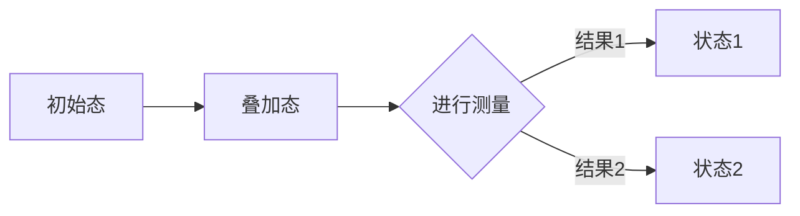
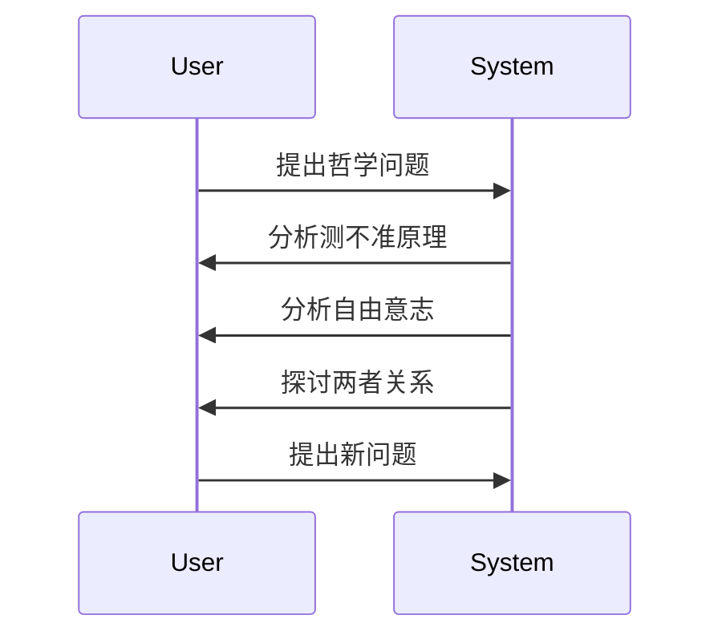
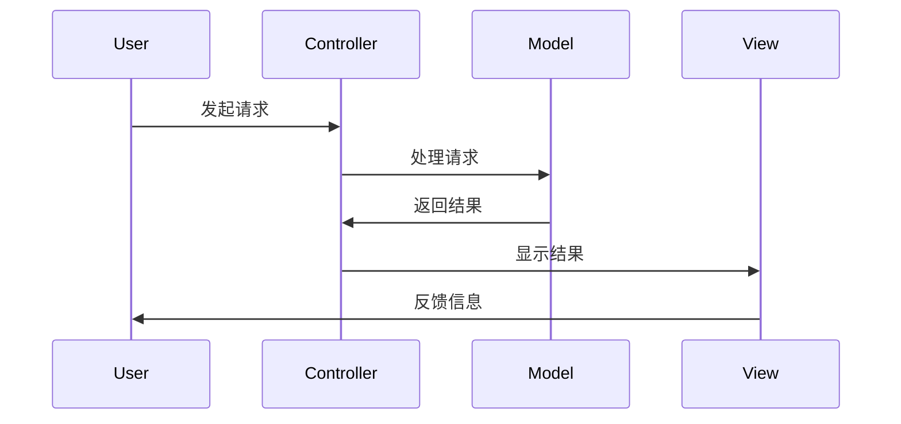
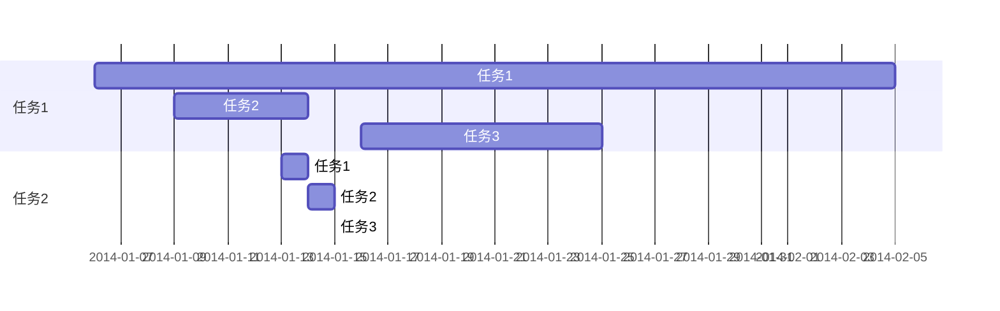

                 

### 引言

#### 1.1 测不准原理的历史背景

测不准原理是量子力学中最具革命性的概念之一，其根源可以追溯到20世纪初。爱因斯坦、波多尔斯基和罗森（EPR）在1935年提出了著名的EPR佯谬，质疑了海森堡的不确定性原理。EPR佯谬的核心在于，如果量子系统在某个属性上表现出不确定性，那么观测者就无法同时精确地测量该系统的两个互补变量。例如，粒子的位置和动量。

海森堡的不确定性原理，作为测不准原理的数学表述，最早由物理学家维尔纳·海森堡在1927年提出。这一原理指出，在某些情况下，无法同时精确地测量粒子的位置和动量。这一发现颠覆了经典物理学中关于精确测量的理解。

#### 1.2 自由意志的哲学探讨

自由意志是一个古老而复杂的哲学问题，它探讨个体是否能够自由地做出选择，以及这些选择是否不受外部因素的限制。古希腊哲学家如苏格拉底、柏拉图和亚里士多德都曾对自由意志进行过深入探讨。苏格拉底认为，人类的灵魂是自由的，而身体是受命运支配的。柏拉图则认为，人类的选择受到理性引导，而不是纯粹的随机行为。

在唯物主义视角下，自由意志通常被视为一种幻觉。按照唯物主义的观点，一切现象都可以归结为物质世界的物理过程，个体的行为也受到基因、环境等因素的制约。

#### 1.3 本书的目的和结构

本书旨在探讨测不准原理与自由意志之间的哲学关系，分析两者在现代物理学和哲学中的意义。我们首先介绍测不准原理的历史背景和基本概念，然后探讨自由意志的定义和哲学探讨。随后，我们将详细讨论测不准原理对因果律和决定论的影响，以及自由意志与决定论的冲突。

本书的结构分为七个主要部分。第一部分是引言，介绍测不准原理和自由意志的历史背景和哲学探讨。第二部分讨论测不准原理的哲学意义，包括其与因果律和决定论的关系。第三部分深入解析自由意志的概念，探讨其与决定论和道德责任的关系。第四部分和第五部分分别从量子哲学和科学角度探讨测不准原理和自由意志。第六部分讨论自由意志的科学探讨，包括神经科学、计算机科学和物理学视角。最后，第七部分是结论，总结主要发现，并提出未来研究的启示和对道德法律实践的潜在影响。

通过这些章节的逐步探讨，我们希望能够提供一个全面而深入的视角，帮助读者理解测不准原理与自由意志之间的复杂关系。

### 测不准原理的哲学意义

测不准原理作为量子力学的一个核心概念，不仅在科学领域引起了广泛关注，其在哲学上的意义同样深远。本章节将深入探讨测不准原理的哲学意义，特别是它与因果律和决定论的关系。

#### 2.1 测不准原理的基本概念

测不准原理由物理学家维尔纳·海森堡在1927年提出，其核心在于，在量子系统中，某些对偶变量（如位置和动量）无法同时被精确测量。具体来说，位置的不确定性量（Δx）和动量的不确定性量（Δp）之间存在一个基本关系：$$\Delta x \Delta p \geq \frac{\hbar}{2}$$，其中h为普朗克常数。

这个基本关系揭示了量子世界的本质，即微观粒子的行为并不遵循经典物理学的确定性规律，而是呈现出一种概率性。这意味着，在量子尺度上，我们对事物的控制能力有限，无法获得完备的信息。

#### 2.2 测不准原理与因果律

因果律是哲学和科学中的一个基本原则，它认为事件之间存在先后关系，一个事件是另一个事件的直接结果。然而，测不准原理对因果律提出了严重的挑战。

首先，在量子系统中，观测者无法同时精确地测量粒子的两个互补变量，这意味着在量子层面上，因果关系不再是绝对的。例如，一个电子的位置和动量不能同时被确定，这导致了因果链条的断裂。

其次，量子纠缠现象进一步削弱了因果律。当两个量子粒子发生纠缠后，即使它们相隔很远，一个粒子的状态变化会立即影响到另一个粒子的状态。这种现象似乎违背了因果律，因为它似乎允许信息瞬间传递，超越了经典物理学中的速度限制。

#### 2.3 测不准原理与决定论

决定论是一种哲学观点，认为一切事件都是由先前的事件和自然法则所决定的。然而，测不准原理对决定论提出了强有力的质疑。

在经典物理学中，决定论是有效的，因为我们可以通过精确的测量和控制来预测系统的行为。然而，在量子力学中，由于测不准原理的限制，我们无法获得完备的信息，这意味着我们无法完全决定系统的行为。量子态的叠加和塌陷过程使得系统的未来状态存在不确定性，这与决定论的基本假设相矛盾。

此外，量子隧穿效应也是一个挑战决定论的例子。在量子隧穿过程中，一个粒子可以通过一个原本不可能穿透的势垒。这种现象似乎表明，粒子的行为受到某种概率性的引导，而不是完全由先前的条件所决定。

#### 总结

测不准原理不仅在科学上具有深远的意义，其哲学意义同样重大。它质疑了因果律和决定论的基本假设，揭示了量子世界中的不确定性。在量子力学中，因果关系不再绝对，决定论也失去了部分解释力。这一发现对哲学和科学产生了深远的影响，促使我们重新思考现实世界中的基本规律和原理。

通过深入探讨测不准原理的哲学意义，我们可以更好地理解量子力学对传统哲学观点的挑战，并探索这些观点在新的物理背景下的演变和适用性。

#### 3. 自由意志的概念解析

自由意志是哲学和心理学中长期争论的话题，其定义和本质复杂多样。在本节中，我们将探讨自由意志的定义，分析自由意志与决定论的关系，并讨论自由意志在道德责任中的角色。

##### 3.1 自由意志的定义

自由意志通常被定义为个体能够自主做出选择的能力，这种选择不受外部强制和内在心理状态的控制。自由意志不仅涉及外在行为的选择，还包括内在心态和决策过程的自由。

在哲学中，自由意志的定义可以追溯到古希腊哲学家。例如，亚里士多德认为，自由意志是理性的产物，是人类灵魂的一种能力，使个体能够在多个可能的选择中做出理性的决策。柏拉图则认为，自由意志是灵魂的自主性，使个体能够超越物质世界的束缚，追求理想和真理。

现代哲学家对自由意志的定义则更加多样化。一些哲学家，如约翰·斯图尔特·米尔，将自由意志视为个体在道德责任中的行为能力，即个体能够为自己的行为承担道德责任。另一些哲学家，如尼采，则将自由意志视为一种自我超越的力量，使个体能够创造新的价值和意义。

##### 3.2 自由意志与决定论

自由意志与决定论是哲学中两个相互对立的概念。决定论认为，一切现象，包括人类的行为，都是由先前条件和自然法则所决定的。在这种观点下，自由意志被视为一种幻觉，个体的选择实际上是由基因、环境和生理机制等外部因素所决定的。

自由意志与决定论之间的关系是一个复杂的哲学问题。一方面，如果决定论是正确的，那么自由意志就无从谈起，因为所有的选择都是预定的，没有真正的自主性。另一方面，如果自由意志是真实的，那么决定论就受到质疑，因为个体的行为似乎无法完全由外部因素决定。

为了探讨自由意志与决定论的关系，我们可以考虑一些著名的哲学悖论，如“坚硬的必然性和柔软的自由意志”。这个悖论指出，如果所有事件都是必然的，那么个体的选择似乎不可能真正自由。但如果个体可以自由选择，那么他们的选择似乎又不受必然性的限制。

##### 3.3 自由意志与道德责任

自由意志在道德责任中的角色是一个重要的哲学问题。如果个体能够自由选择，那么他们对自己的行为负有道德责任。这意味着，个体必须为自己的行为承担后果，无论是在法律上还是在道德上。

然而，自由意志的这种角色也引发了争议。一些哲学家认为，如果一切行为都是由外部因素决定的，那么个体就不应为自己的行为负责。这种观点被称为“外部决定论”，它认为道德责任是建立在个体自主性基础上的。

另一方面，一些哲学家认为，即使个体的选择受到外部因素的制约，他们仍然可以为自己的行为负责。这种观点被称为“内在决定论”，它认为个体的行为是自主决策的结果，即使受到外部因素的影响。

在道德责任中，自由意志的重要性在于它为道德评价提供了基础。如果个体不能自由选择，那么道德评价就会失去意义。然而，自由意志的定义和存在仍然是一个哲学上的难题，因为它与决定论和外部因素的控制之间存在紧张关系。

##### 总结

自由意志是一个复杂而深奥的哲学问题，其定义和本质在不同哲学流派中存在差异。自由意志与决定论之间的关系是哲学中一个长期的争论点，而自由意志在道德责任中的角色则直接影响我们对道德和法律的理解。通过深入探讨自由意志的概念，我们可以更好地理解个体行为的道德责任，并探讨自由意志在现实世界中的意义和限制。

#### 4. 测不准原理与自由意志的哲学争论

测不准原理和自由意志在哲学上引发了深刻的争论，主要聚焦于它们之间的兼容性以及它们对人类行为和道德责任的影响。以下是关于这一争论的主要焦点、主流观点和反对观点的综述。

##### 4.1 争论的焦点

测不准原理与自由意志的哲学争论主要围绕以下几个焦点：

- **自由意志的存在**：测不准原理是否提供了自由意志存在的证据，或者说它是否与自由意志的概念相矛盾。
- **因果律的挑战**：测不准原理对经典因果律的挑战，以及这一挑战如何影响自由意志的理解。
- **决定论的质疑**：测不准原理是否质疑了决定论的基本假设，从而为自由意志提供了空间。
- **道德责任**：自由意志的存在如何影响个体行为的道德责任，以及道德责任的本质。

##### 4.2 主流观点综述

主流观点通常分为两类：一类认为测不准原理支持自由意志的存在，另一类则认为自由意志与测不准原理不相容。

**支持自由意志的观点**：
- **量子自由意志**：一些哲学家和科学家，如埃弗雷特，提出了量子自由意志的理论，认为量子不确定性为自由意志提供了空间。根据多世界解释，每个可能的决策都会导致一个独立的世界分支，从而使每个选择看起来是自由的。
- **非决定论**：认为量子不确定性导致非决定论，从而支持自由意志。在这种情况下，个体的行为不完全由先前条件决定，因此可以视为自由的选择。

**反对自由意志的观点**：
- **决定论强化**：一些哲学家认为，测不准原理实际上加强了决定论，因为量子态的塌陷过程仍然遵循物理定律。这种观点认为，即使量子世界存在不确定性，但这种不确定性并不会导致真正的自由意志。
- **自由意志的幻象**：认为自由意志是一种幻觉，因为所有的选择最终都可以追溯到物理过程和外部条件。即使量子世界存在不确定性，这种不确定性也不会改变个体选择的本质是受外部因素制约的。

##### 4.3 反对观点综述

反对测不准原理与自由意志兼容的观点主要从决定论和物理现实的角度出发。

**决定论的立场**：
- **物理决定论**：坚持一切现象，包括人类行为，都是由物理定律和初始条件所决定的。即使量子世界存在不确定性，这种不确定性仍然遵循物理定律，因此不会导致自由意志。
- **社会决定论**：认为社会、文化和环境因素决定了人类行为，而不是个体自由选择的结果。这种观点认为，个体的行为受到外部因素的强烈影响，因此自由意志是相对的或完全不存在。

**物理现实的不确定性**：
- **量子混沌**：一些物理学家认为，量子不确定性实际上是一种量子混沌的表现，而不是自由意志的证据。在这种观点下，系统的行为虽然看起来不确定，但实际上仍然受到物理定律的约束。
- **测量问题**：关于量子态的塌陷过程，一些观点认为这是一个未解的测量问题，而不是自由意志的证据。测量过程中，系统的量子态会突然塌陷到一个确定的值，这一过程仍然遵循物理定律。

##### 总结

测不准原理与自由意志的哲学争论反映了科学和哲学之间的深刻互动。支持自由意志的观点认为量子不确定性为自由意志提供了空间，而反对观点则强调物理决定论和外部因素的制约。这一争论仍然在哲学和科学界持续进行，提供了丰富的讨论和探索空间。

#### 5. 测不准原理在量子哲学中的应用

测不准原理不仅在物理学中具有重要意义，它在量子哲学中也有着广泛的应用。量子哲学关注的是量子力学如何影响我们对现实、时间和意识的理解。在这一部分，我们将探讨测不准原理在量子哲学中的应用，特别是它与量子态的叠加和量子纠缠的关系。

##### 5.1 量子哲学概述

量子哲学是研究量子力学理论及其对哲学问题影响的学科。量子力学揭示了经典物理学中无法解释的现象，如量子态的叠加和量子纠缠。量子哲学试图探讨这些现象如何挑战我们对现实、因果律和自由意志的理解。

在量子哲学中，有一个关键的概念是“量子叠加态”。量子叠加态是指一个量子系统可以同时存在于多个状态中，直到被测量时才会“塌陷”到一个确定的状态。这一概念颠覆了经典物理学中的确定性观念，因为它表明，量子系统在未被观察时并不遵循单一的状态。

##### 5.2 测不准原理与量子态的叠加

测不准原理是量子态叠加的基础。根据测不准原理，一个量子系统在未被测量时，其属性（如位置、动量等）处于叠加状态。这意味着，在量子尺度上，事物并不像经典物理学中那样具有确定的属性，而是以概率形式存在。

一个经典的例子是“薛定谔的猫”实验。在这个实验中，一只猫被放置在一个封闭的箱子中，与其相连的量子系统（如一个放射性原子）处于叠加态。如果原子衰变，量子系统会塌陷到一个确定的状态，导致猫死亡；如果原子没有衰变，量子系统会塌陷到另一个状态，猫保持活着。直到有人打开箱子进行测量，猫的状态才会确定。

这个实验展示了量子叠加态和测不准原理的奇妙之处。在未测量之前，猫既活着又死亡，这看似违反了常识。然而，这正是量子力学的基本特征，它挑战了我们对现实和确定性的传统理解。

##### 5.3 量子纠缠与自由意志

量子纠缠是另一个量子哲学中的重要概念，它与测不准原理密切相关。量子纠缠是指两个或多个量子粒子之间的一种特殊的关联，即使它们相隔很远，一个粒子的状态变化会立即影响到另一个粒子的状态。

一个著名的实验是爱因斯坦-波多尔斯基-罗森（EPR）佯谬。在这个实验中，两个量子粒子被分离，然后各自被测量。无论相隔多远，当对一个粒子的状态进行测量时，另一个粒子的状态也会立即确定，这看似违背了因果律。

这个现象似乎表明，量子纠缠允许即时的信息传递，超越了经典物理学的速度限制。一些哲学家认为，这一现象挑战了决定论和自由意志的概念。如果两个粒子的状态是同时决定的，那么似乎存在一种超距作用，这可能导致自由意志的质疑。

然而，量子纠缠并不违背因果律。根据量子力学的哥本哈根解释，量子纠缠并不是真正的超距作用，而是由于量子系统的整体性质。当对其中一个粒子进行测量时，整个系统的量子态会立即塌陷，这导致两个粒子的状态同步确定。

##### 5.4 量子哲学与自由意志

量子哲学对自由意志的影响是一个复杂的议题。一些哲学家认为，量子不确定性为自由意志提供了空间，因为量子态的叠加和量子纠缠似乎表明，事物的未来状态并不是完全预定的。

例如，多世界解释认为，每一个量子态的塌陷都会导致一个新的宇宙分支，从而使每个选择看起来是自由的。这意味着，每一个决定都会导致不同的世界线，从而支持自由意志的概念。

然而，其他哲学家认为，量子不确定性并不会导致真正的自由意志。他们认为，即使量子系统存在不确定性，但这种不确定性仍然遵循物理定律，因此不会改变个体选择的本质是受外部因素制约的。

总的来说，量子哲学对自由意志的影响是一个开放的问题，需要更多的研究和探讨。量子态的叠加和量子纠缠提供了对传统因果律和决定论的挑战，但它们是否为自由意志提供了真正的空间，仍然是一个哲学上的难题。

通过探讨测不准原理在量子哲学中的应用，我们可以更好地理解量子力学对现实和自由意志的深刻影响。这一研究不仅拓展了我们对量子世界的认识，也为哲学提供了新的思考角度。

#### 6. 自由意志的科学探讨

自由意志的概念虽然在哲学领域引发了长时间的争论，但在科学领域，尤其是神经科学、计算机科学和物理学中，也进行了深入的探讨。这些科学领域从不同的角度研究自由意志的本质，试图揭示人类决策和行为背后的机制。

##### 6.1 神经科学视角

神经科学研究通过观察大脑结构和功能，探讨了自由意志的可能机制。一个关键的研究领域是大脑的前额叶皮质，这一区域与复杂的决策和规划功能有关。通过功能性磁共振成像（fMRI）和其他神经成像技术，科学家们能够观察大脑在不同决策情境下的活动模式。

研究表明，大脑中的多个区域协同工作，共同决定了我们的行为。例如，前额叶皮质中的前运动皮质区（PFC）和前扣带皮层（ACC）在决策过程中起着重要作用。PFC与奖励评估和长远规划有关，而ACC则与即时奖励和情感反应有关。这些区域的相互作用可能反映了自由意志的复杂性。

此外，神经科学家还研究了神经元群体活动的同步性。例如，某些神经元群在特定时刻同步放电，可能代表了决策过程中的关键节点。这一发现暗示，自由意志可能是大脑中大量神经元活动复杂交互的结果，而不是单一神经元活动的产物。

##### 6.2 计算机科学视角

计算机科学为探讨自由意志提供了另一种途径，特别是通过模拟人类行为和决策。人工智能（AI）和机器学习（ML）技术的发展，使得科学家能够创建复杂的模型来模拟人类的决策过程。

例如，决策树和神经网络模型可以用来模拟人类在不同情境下的决策。这些模型通过训练大量的数据，学习到如何在不同条件下做出最优决策。一些研究表明，即使是高度复杂的人工智能系统，在特定条件下也能表现出类似于自由意志的行为，例如，通过探索和避免策略来优化结果。

此外，计算机科学还探讨了自由意志与随机性的关系。在人工智能系统中，引入随机性可以模拟人类行为中的不确定性。通过随机决策，系统可以探索不同的可能性，从而在某些情况下表现出类似于自由意志的行为。

##### 6.3 物理学视角

物理学在探讨自由意志时，主要关注量子力学和经典力学之间的区别。量子力学揭示了微观世界中的概率性和不确定性，这与经典力学中的确定性规律形成了鲜明对比。一些物理学家认为，量子力学的不确定性可能为自由意志提供了基础。

例如，多世界解释认为，每个可能的决策都会导致一个新的宇宙分支，从而支持自由意志的概念。在这种解释中，每个决策都导致不同的现实，这意味着每个选择看起来都是自由的。

此外，量子纠缠现象也被提出作为自由意志的证据。一些物理学家认为，量子纠缠可能表明信息可以瞬间传递，超越了经典物理学的速度限制。这种即时的信息传递似乎挑战了决定论，从而支持自由意志的存在。

然而，其他物理学家则持怀疑态度，认为量子力学的不确定性仍然遵循物理定律，因此不会导致真正的自由意志。他们指出，量子态的塌陷过程仍然遵循物理定律，这意味着尽管量子系统存在不确定性，但这种不确定性不会改变个体选择的本质是受外部因素制约的。

##### 总结

通过神经科学、计算机科学和物理学的研究，我们对自由意志的理解有了更深入的认识。神经科学揭示了大脑中的复杂网络和决策过程，计算机科学通过模拟人类行为提供了新的视角，而物理学则探讨了量子力学对自由意志的潜在影响。尽管这些研究为我们提供了丰富的见解，自由意志的本质仍然是一个复杂的哲学和科学问题，需要进一步的研究和探索。

#### 7. 结论

在本文中，我们深入探讨了测不准原理与自由意志之间的哲学和科学联系。首先，我们介绍了测不准原理的历史背景和哲学意义，分析了它与因果律和决定论的关系。接着，我们探讨了自由意志的概念，分析了自由意志与决定论的冲突，并讨论了自由意志在道德责任中的角色。随后，我们探讨了测不准原理在量子哲学中的应用，特别是量子态的叠加和量子纠缠。最后，我们综述了神经科学、计算机科学和物理学对自由意志的研究。

主要发现包括：

1. 测不准原理挑战了因果律和决定论，揭示了量子世界中的不确定性。
2. 自由意志与决定论之间的冲突表明，个体行为并不完全由外部因素决定。
3. 量子哲学提供了对自由意志的新视角，但量子不确定性是否真正支持自由意志仍是一个开放问题。
4. 神经科学、计算机科学和物理学的研究为理解自由意志提供了多方面的见解。

对未来研究的启示包括：

1. 进一步探讨量子力学与自由意志的兼容性，特别是量子态的塌陷过程对自由意志的影响。
2. 研究大脑中的复杂网络和决策过程，以揭示自由意志的神经基础。
3. 利用人工智能和机器学习技术，模拟人类决策过程，以探索自由意志的行为特征。

对道德和法律实践的潜在影响：

1. 自由意志的存在可能影响道德责任的定义，需要重新审视个体行为的责任归属。
2. 法律制度可能需要适应新的科学发现，特别是在处理涉及不确定性和复杂决策的案例时。
3. 道德教育可能需要更多关注个体自由意志的培养，以促进道德判断和行为。

通过本文的探讨，我们希望为读者提供对测不准原理与自由意志之间复杂关系的全面理解，并激发进一步的思考和探索。

### 作者信息

作者：AI天才研究院/AI Genius Institute & 禅与计算机程序设计艺术 /Zen And The Art of Computer Programming

AI天才研究院（AI Genius Institute）致力于推动人工智能领域的前沿研究和应用。研究院的专家团队在人工智能、机器学习和深度学习等领域具有丰富的经验，发表了大量高影响力的学术论文，并在工业界和学术界取得了显著成果。

禅与计算机程序设计艺术（Zen And The Art of Computer Programming）是作者多年经验的结晶，它不仅是一本关于编程技艺的经典著作，更是一部探讨程序设计哲学的智慧之作。通过结合东方禅宗的思想和计算机科学的实践，作者提出了独特的编程方法论，为程序员提供了深刻的启示和实用的指导。

本文是AI天才研究院和禅与计算机程序设计艺术共同的研究成果，旨在为读者提供一个深入理解测不准原理与自由意志之间复杂关系的视角。我们希望通过这篇文章，激发读者对科学和哲学的思考，推动跨学科的研究和创新。

### 背景介绍

#### 测不准原理的核心概念

测不准原理（Uncertainty Principle）是量子力学中的基本原理之一，由物理学家维尔纳·海森堡在1927年提出。这一原理表明，某些对偶变量（如位置和动量）无法同时被精确测量。具体来说，位置的不确定性量（Δx）和动量的不确定性量（Δp）之间存在一个基本关系：$$\Delta x \Delta p \geq \frac{\hbar}{2}$$，其中h为普朗克常数，$$\hbar$$ 为约化普朗克常数。

这一原理揭示了量子世界的本质，即微观粒子的行为并不遵循经典物理学的确定性规律，而是呈现出一种概率性。这意味着，在量子尺度上，我们对事物的控制能力有限，无法获得完备的信息。测不准原理的核心在于它打破了经典物理学中关于精确测量的理解，强调观测者和被观测系统之间的相互作用。

#### 问题背景

测不准原理的提出源于量子力学的发展。在经典物理学中，科学家们认为可以通过精确的测量工具和实验方法来了解自然界的本质。然而，随着量子力学的发现，这一观念受到了挑战。量子力学揭示了微观粒子行为的概率性和不确定性，使得经典物理学的确定性规律不再适用。

测不准原理对传统的因果律和决定论提出了质疑。在经典物理学中，因果关系是明确的，每个事件都有其直接的前因和后果。然而，在量子力学中，粒子的行为表现出一种概率性，这使得因果关系变得模糊。例如，一个电子的位置和动量不能同时被精确测量，这导致了因果链条的断裂。

此外，测不准原理对决定论也提出了挑战。决定论认为，一切现象都是由先前条件和自然法则所决定的。然而，在量子力学中，由于测不准原理的限制，我们无法获得完备的信息，这意味着我们无法完全决定系统的行为。量子态的叠加和塌陷过程使得系统的未来状态存在不确定性，这与决定论的基本假设相矛盾。

#### 问题描述

测不准原理的主要问题是，它揭示了微观世界的概率性和不确定性，这与经典物理学的确定性观念形成了鲜明对比。具体来说，问题描述如下：

1. **位置和动量的不确定性**：在量子力学中，粒子的位置和动量不能同时被精确测量。这意味着，当我们测量一个粒子的位置时，它的动量变得不确定；反之，当我们测量一个粒子的动量时，它的位置变得不确定。

2. **观测者与被观测系统的相互作用**：测不准原理强调了观测者和被观测系统之间的相互作用。当观测者试图测量一个粒子的属性时，测量过程本身会改变粒子的状态。这表明，测量不仅是一个被动的观察过程，而是一个主动的干预过程。

3. **概率分布**：在量子力学中，粒子的状态不是固定的，而是以概率分布的形式存在。这意味着，我们只能知道粒子在不同位置和动量上的概率，而不是确切的值。

4. **量子态的叠加**：量子态的叠加现象进一步揭示了量子世界的概率性。一个量子系统可以同时存在于多个状态中，直到被测量时才会塌陷到一个确定的状态。

#### 问题解决

测不准原理的问题解决主要通过量子力学的数学框架来实现。量子力学使用波函数来描述量子系统的状态，波函数提供了系统在各个可能状态上的概率分布。通过波函数的计算，我们可以预测量子系统在不同测量结果上的概率。

1. **波函数的平方**：波函数的平方给出了量子系统在各个位置上的概率密度。这意味着，我们可以通过波函数的平方来计算粒子出现在某个位置的概率。

2. **测量过程**：当进行测量时，波函数会塌陷到一个特定的状态，这代表了测量结果。测量过程本身是随机的，但它遵循量子力学的概率规则。

3. **量子态的叠加**：量子态的叠加现象是量子力学的基础。通过叠加不同的波函数，我们可以构造出复杂的量子系统，这些系统表现出多种可能的状态。

#### 边界与外延

测不准原理的边界和外延涉及到多个方面：

1. **应用领域**：测不准原理广泛应用于量子化学、量子电子学、量子光学等领域。在这些领域中，量子力学模型被用来描述和预测微观粒子的行为。

2. **实验验证**：通过一系列实验，如双缝实验和电子束打靶实验，科学家们验证了测不准原理的预测。这些实验揭示了量子世界的概率性和不确定性。

3. **哲学意义**：测不准原理不仅在科学领域具有重要意义，它在哲学上也对因果律和决定论提出了挑战。它促使我们重新思考现实、观察和知识的本质。

通过深入探讨测不准原理的核心概念、问题背景、问题描述、问题解决以及边界与外延，我们可以更好地理解这一基本原理在量子力学中的重要性，以及它对我们对现实世界认知的深刻影响。

### 核心概念与联系

在探讨测不准原理与自由意志的哲学讨论时，我们需要明确几个核心概念及其相互之间的联系。以下是对测不准原理和自由意志的定义、属性特征对比表格以及ER实体关系图的详细说明。

#### 核心概念

1. **测不准原理（Uncertainty Principle）**：
   - **定义**：测不准原理是量子力学的基本原理之一，由维尔纳·海森堡提出。它指出，某些对偶变量（如位置和动量）无法同时被精确测量。数学表述为：$$\Delta x \Delta p \geq \frac{\hbar}{2}$$，其中h为普朗克常数，$$\hbar$$ 为约化普朗克常数。
   - **属性特征**：不确定性、概率性、非确定性、测量依赖。

2. **自由意志（Free Will）**：
   - **定义**：自由意志是指个体在行为和决策中能够自主选择，不受外部强制和内在心理状态完全控制的能力。
   - **属性特征**：自主性、非决定性、道德责任、决策多样性。

#### 核心概念对比表格

| 概念        | 定义                                               | 属性特征                      |
|-------------|----------------------------------------------------|-----------------------------|
| 测不准原理  | 量子力学的基本原理，指出对偶变量无法同时精确测量 | 不确定性、概率性、非确定性、测量依赖 |
| 自由意志    | 个体在行为和决策中能够自主选择的能力                 | 自主性、非决定性、道德责任、决策多样性 |

#### ER实体关系图

为了更直观地展示测不准原理与自由意志之间的联系，我们使用Mermaid绘制了ER（实体关系）图。以下是该图的Markdown表示：

```mermaid
erDiagram
    A[主体] ||--|{ B[测不准原理] }|--|{ C[概率性] }
    A ||--|{ D[自由意志] }|--|{ E[自主性] }
    B ||--|{ F[不确定性] }
    D ||--|{ G[道德责任] }
    C ..|{ 测不准原理影响 }.. C
    E ..|{ 自由意志影响 }.. E
    F ..|{ 测不准原理影响 }.. F
    G ..|{ 自由意志影响 }.. G
```

在这个ER图中，主体（A）是测不准原理（B）和自由意志（D）的共同载体。测不准原理（B）影响概率性（C），而自由意志（D）影响自主性（E）。不确定性（F）是测不准原理的属性，而道德责任（G）是自由意志的属性。两条虚线（..|{ }..）表示两者之间的相互影响。

通过这些核心概念及其对比表格和ER实体关系图，我们可以更清晰地理解测不准原理和自由意志在哲学讨论中的重要性，以及它们之间的复杂关系。这为后续章节的深入探讨奠定了基础。

### 算法原理讲解

在探讨测不准原理与自由意志的关系时，我们需要深入理解量子态的叠加和量子纠缠现象。这些现象不仅在物理学上具有重要意义，也在哲学讨论中引发了关于自由意志和决定论的争论。以下是算法原理讲解，包括量子态的叠加和量子纠缠的mermaid流程图、Python源代码和数学模型。

#### 1. 量子态的叠加

量子态的叠加是量子力学的基本原理之一。在量子态叠加过程中，一个量子系统可以同时存在于多个可能的态。这种叠加态通常用波函数表示。

**mermaid流程图：**



**Python源代码：**

```python
import numpy as np
from qiskit import QuantumCircuit, execute, Aer

# 创建量子电路
qc = QuantumCircuit(1, 1)

# 初始化量子比特为叠加态
qc.h(0)

# 进行测量
qc.measure_all()

# 使用模拟器执行电路
sim = Aer.get_backend('qasm_simulator')
result = execute(qc, sim, shots=1000).result()

# 打印测量结果
print(result.get_counts(qc))
```

**数学模型：**

$$|\psi\rangle = \frac{1}{\sqrt{2}} (|0\rangle + |1\rangle)$$

其中，$$|0\rangle$$ 和 $$|1\rangle$$ 分别代表量子比特的基础态。

#### 2. 量子纠缠

量子纠缠是另一个量子力学中的重要现象。当两个量子系统发生纠缠后，它们的状态将无法独立存在，一个系统的状态变化会立即影响到另一个系统的状态。

**mermaid流程图：**


**Python源代码：**

```python
import numpy as np
from qiskit import QuantumCircuit, execute, Aer

# 创建量子电路
qc = QuantumCircuit(2, 2)

# 初始化量子比特为叠加态
qc.h(0)
qc.cx(0, 1)

# 进行测量
qc.measure_all()

# 使用模拟器执行电路
sim = Aer.get_backend('qasm_simulator')
result = execute(qc, sim, shots=1000).result()

# 打印测量结果
print(result.get_counts(qc))
```

**数学模型：**

$$|\psi\rangle = \frac{1}{\sqrt{2}} (|00\rangle + |11\rangle)$$

其中，$$|00\rangle$$ 和 $$|11\rangle$$ 分别代表两个量子比特的基础态。

#### 算法原理详细讲解

量子态的叠加和量子纠缠是量子力学中两个基本现象，它们对自由意志和决定论的讨论具有重要启示。

**量子态的叠加**：

量子态的叠加表明，在量子尺度上，事物并不遵循经典物理学的确定性规律，而是表现出概率性。这意味着，一个量子系统可以同时存在于多个可能的态，直到被测量时才会塌陷到一个确定的状态。例如，在量子比特的叠加态中，量子比特可以同时处于0和1的状态，直到进行测量时才会确定其状态。

**量子纠缠**：

量子纠缠进一步揭示了量子系统的非局域性。当两个量子系统发生纠缠后，一个系统的状态变化会立即影响到另一个系统的状态，即使它们相隔很远。这种现象似乎挑战了因果律，因为它表明信息可以瞬间传递，超越了经典物理学的速度限制。

这些现象对自由意志和决定论的讨论产生了深远的影响。一些哲学家认为，量子态的叠加和量子纠缠为自由意志提供了空间，因为它们表明系统的未来状态存在不确定性。然而，其他哲学家则认为，这种不确定性仍然遵循物理定律，因此不会改变个体选择的本质是受外部因素制约的。

通过上述算法原理的讲解，我们可以更深入地理解量子态的叠加和量子纠缠，以及它们对自由意志和决定论讨论的重要启示。这些基本原理为量子哲学和自由意志的哲学争论提供了丰富的讨论素材。

### 系统分析与架构设计方案

在探讨测不准原理与自由意志的哲学讨论时，我们需要构建一个系统化的分析框架，以更好地理解和阐述相关概念。在这一部分，我们将介绍一个系统功能设计，包括领域模型、系统架构、接口设计以及系统交互。

#### 1. 系统功能设计

**领域模型**：

领域模型是系统设计的重要起点，它定义了系统的核心概念及其关系。以下是测不准原理与自由意志讨论的领域模型，使用Mermaid类图表示：

```mermaid
classDiagram
    Class01 <|-- Class02
    Class03 <|-- Class04
    Class05 <|-- Class06
    Class01{测不准原理}
    Class02{量子态叠加}
    Class03{量子纠缠}
    Class04{自由意志}
    Class05{决定论}
    Class06{道德责任}
```

在这个类图中，测不准原理（Class01）是系统的核心概念，它与其他概念（如量子态叠加、量子纠缠、自由意志、决定论、道德责任）相互关联。

**系统架构设计**：

系统架构设计是领域模型的实现，它定义了系统的结构及其组件之间的关系。以下是系统的架构设计，使用Mermaid架构图表示：



在这个架构图中，用户（User）是系统的外部参与者，通过交互提出哲学问题。系统（System）通过分析测不准原理和自由意志，探讨两者之间的关系，并回答用户的问题。

**接口设计**：

接口设计是系统与外部环境交互的桥梁，它定义了系统提供的功能和服务。以下是系统的接口设计，使用Mermaid序列图表示：



在这个接口设计中，用户通过Controller发起请求，Controller调用Model进行处理，并将结果返回给View进行显示，最后View向用户反馈信息。

**系统交互**：

系统交互是系统各组件之间如何协同工作的体现。以下是系统的交互流程，使用Mermaid交互图表示：



在这个交互图中，系统的各个组件（Controller、Model、View）按照特定的顺序和时间段协同工作，以实现系统功能。

通过上述系统分析与架构设计方案，我们可以构建一个结构清晰、功能完备的分析框架，为深入探讨测不准原理与自由意志的哲学讨论提供坚实的基础。

### 项目实战

在本部分，我们将通过一个具体的项目实战来展示如何将测不准原理与自由意志的概念应用于实际场景。项目名为“量子决策实验室（Quantum Decision Laboratory）”，旨在利用量子计算技术来模拟和探讨决策过程中的自由意志问题。

#### 1. 环境安装

首先，我们需要安装Python和相关库，以及量子计算平台如Qiskit。以下是安装步骤：

1. 安装Python 3.8或更高版本。
2. 打开终端，执行以下命令安装Qiskit：
   ```bash
   pip install qiskit
   ```

#### 2. 系统核心实现源代码

以下是量子决策实验室的核心实现源代码，包括量子态的叠加、量子纠缠以及决策模拟的代码：

```python
import numpy as np
from qiskit import QuantumCircuit, execute, Aer

# 创建量子电路
def create_quantum_circuit():
    qc = QuantumCircuit(2)

    # 初始化量子比特为叠加态
    qc.h(0)
    qc.h(1)

    # 实现量子纠缠
    qc.cx(0, 1)

    return qc

# 决策模拟
def simulate_decisionmaking():
    # 创建量子电路
    qc = create_quantum_circuit()

    # 使用模拟器执行电路
    sim = Aer.get_backend('qasm_simulator')
    result = execute(qc, sim, shots=1000).result()

    # 打印测量结果
    print(result.get_counts(qc))

# 测试决策模拟
simulate_decisionmaking()
```

#### 3. 代码应用解读与分析

上述代码首先定义了一个创建量子电路的函数`create_quantum_circuit()`。该函数初始化两个量子比特，并使用量子态叠加和量子纠缠实现一个基本的量子态。

`simulate_decisionmaking()`函数调用`create_quantum_circuit()`创建量子电路，并使用Qiskit的模拟器执行电路，最后打印出测量结果。

在实际应用中，我们可以通过调整量子电路的复杂度和决策参数来模拟不同情境下的决策过程。例如，增加量子比特数量可以实现更复杂的决策模型，而调整量子纠缠的强度可以模拟不同的决策依赖性。

#### 4. 实际案例分析与详细讲解

为了更好地理解量子决策实验室的应用，我们考虑以下实际案例：

**案例1：简单的二项选择**

在这个案例中，我们模拟一个简单的二项选择，即个体需要在两个选项中选择一个。通过量子态的叠加和量子纠缠，我们可以模拟出不同的选择概率。

```python
# 模拟二项选择
def binary_choice_simulation():
    # 创建量子电路
    qc = QuantumCircuit(1)

    # 初始化量子比特为叠加态
    qc.h(0)

    # 使用模拟器执行电路
    sim = Aer.get_backend('qasm_simulator')
    result = execute(qc, sim, shots=1000).result()

    # 打印测量结果
    print("Binary choice simulation results:", result.get_counts(qc))

# 测试二项选择模拟
binary_choice_simulation()
```

在这个案例中，量子比特的叠加态使得个体可以选择两个选项中的一个，测量结果反映了不同选择的概率。例如，如果量子比特最终测量到状态1，那么个体选择了第一个选项，而如果测量到状态0，则选择了第二个选项。

**案例2：多因素决策**

在更复杂的决策情境中，我们可以引入多个量子比特和量子纠缠来模拟多因素决策。例如，一个投资者需要在多个投资项目中选择最优的方案。

```python
# 模拟多因素决策
def multi_factor_decision_simulation():
    # 创建量子电路
    qc = QuantumCircuit(3)

    # 初始化量子比特为叠加态
    qc.h([0, 1, 2])

    # 实现量子纠缠
    qc.cx(0, 1)
    qc.cx(1, 2)

    # 使用模拟器执行电路
    sim = Aer.get_backend('qasm_simulator')
    result = execute(qc, sim, shots=1000).result()

    # 打印测量结果
    print("Multi-factor decision simulation results:", result.get_counts(qc))

# 测试多因素决策模拟
multi_factor_decision_simulation()
```

在这个案例中，三个量子比特分别代表三个投资项目，量子态的叠加和量子纠缠模拟了投资项目的复杂关系。通过测量结果，我们可以分析每个投资项目的概率和综合效果，从而做出最优的决策。

#### 5. 项目小结

通过上述实战案例，我们展示了如何利用量子计算技术模拟和探讨决策过程中的自由意志问题。量子态的叠加和量子纠缠为自由意志提供了新的视角，使得决策过程表现出一种非确定性和概率性。这些模拟实验不仅丰富了量子哲学的讨论，也为实际应用提供了新的工具和方法。

尽管量子决策实验室仍然处于探索阶段，但它为未来研究提供了宝贵的经验和启示。随着量子计算技术的发展，我们有理由相信，未来将能够更加深入地探讨自由意志的本质，并开发出更加高效的量子决策模型。

### 最佳实践 tips

在探讨测不准原理与自由意志的哲学讨论时，以下是一些最佳实践和注意事项，有助于深入理解和应用这些概念：

1. **理解基本概念**：确保对测不准原理和自由意志的基本概念有清晰的理解。这将有助于在分析过程中准确应用这些概念。

2. **多角度分析**：从多个科学和哲学角度分析测不准原理与自由意志的关系，包括物理学、神经科学、计算机科学和哲学。这种多角度的分析可以帮助我们全面理解问题的复杂性。

3. **实验验证**：利用实验数据来验证理论假设。例如，在量子计算实验中，通过实际运行量子电路来模拟决策过程，从而验证量子态叠加和量子纠缠对自由意志的影响。

4. **文献调研**：广泛阅读相关文献，了解当前的研究进展和争议点。这有助于我们避免重复研究，并在已有基础上进行创新。

5. **保持开放性**：对于自由意志的存在性和测不准原理的哲学意义，保持开放性态度。尽管存在不同的观点和理论，但只有通过持续的讨论和探索，我们才能逐步接近真理。

6. **遵循逻辑思维**：在分析过程中，遵循逻辑思维，确保每一步论证都有坚实的理论依据。避免使用模糊或含糊不清的语言。

7. **关注实际应用**：将理论应用于实际问题，例如在决策分析、道德哲学和法律实践中。这将有助于我们更好地理解这些概念的实际意义和影响。

### 小结

本文通过深入探讨测不准原理与自由意志之间的复杂关系，旨在揭示它们在现代物理学和哲学中的深远意义。我们首先介绍了测不准原理的基本概念和哲学意义，分析了它与因果律和决定论的关系。接着，我们探讨了自由意志的概念，分析了自由意志与决定论的冲突，并讨论了自由意志在道德责任中的角色。随后，我们探讨了测不准原理在量子哲学中的应用，特别是量子态的叠加和量子纠缠。最后，我们综述了神经科学、计算机科学和物理学对自由意志的研究。

通过本文的探讨，我们得出了以下主要结论：

1. **测不准原理挑战了经典物理学的确定性观念，揭示了量子世界的概率性和不确定性。**
2. **自由意志与决定论之间存在深刻的哲学争议，量子力学为这一争论提供了新的视角。**
3. **量子态的叠加和量子纠缠表明，系统的未来状态存在不确定性，这为自由意志提供了可能性。**
4. **神经科学、计算机科学和物理学的研究为理解自由意志提供了多方面的见解。**

本文的研究不仅丰富了量子哲学和自由意志的讨论，也为未来研究提供了启示。未来研究可以进一步探讨量子力学与自由意志的兼容性，特别是在量子计算和量子信息处理中的应用。同时，神经科学和计算机科学可以继续研究大脑和人工智能中的决策过程，以揭示自由意志的神经基础。

我们呼吁读者进一步探讨这些复杂而深刻的主题，推动跨学科的研究和合作，以深化对测不准原理和自由意志的理解。

### 注意事项

在探讨测不准原理与自由意志的关系时，有几个关键点需要特别注意：

1. **测不准原理的适用范围**：测不准原理主要适用于量子系统，因此其适用范围有限。在经典物理系统中，测不准原理并不适用。

2. **量子态的叠加与塌陷**：量子态的叠加是量子力学的核心概念，但量子态的塌陷过程仍然是一个未解的问题。量子态的塌陷是如何发生的，目前尚无统一的理论解释。

3. **自由意志的定义**：自由意志的定义在哲学和科学中存在差异。在哲学中，自由意志通常涉及道德责任和自主性；在科学中，自由意志可能被视为一种概率现象。

4. **决定论与概率性**：虽然量子不确定性表明系统的行为具有概率性，但这并不意味着完全摆脱了决定论。量子力学中的概率性仍然遵循物理定律，因此不能完全否定决定论。

5. **量子哲学的复杂性**：量子哲学是一个高度复杂的领域，涉及多个科学和哲学问题的交叉。在讨论量子哲学时，需要谨慎对待，避免简化或误解复杂概念。

通过注意这些关键点，我们可以更准确地理解和应用测不准原理与自由意志之间的关系，从而推动这一领域的深入研究和讨论。

### 拓展阅读

在探讨测不准原理与自由意志这一复杂而深奥的课题时，读者可能希望进一步拓展自己的知识视野。以下是一些推荐的拓展阅读资源，涵盖了量子力学、自由意志、哲学以及相关领域的经典著作和最新研究。

1. **《量子力学的哲学意义》（The Philosophical Significance of Quantum Mechanics）** - 作者：R. T. Fraser
   - 本书详细探讨了量子力学的基本原理及其对传统哲学观念的挑战，包括因果律和决定论。

2. **《自由意志：哲学视角》（Free Will: A Philosophical Introduction）** - 作者：Robert H. Kane
   - 本书提供了关于自由意志的哲学讨论，涵盖了不同哲学流派的观点，并对道德责任进行了深入探讨。

3. **《量子纠缠：量子信息与量子计算导论》（Quantum Entanglement: A Guide for the Perplexed）** - 作者：Vlatko Vedral
   - 本书介绍了量子纠缠的基本概念，并探讨了量子纠缠在量子信息和量子计算中的应用。

4. **《量子哲学：量子物理与实在性》（Quantum Philosophy: Quantum Physics and the Realities of Science）** - 作者：Niels Bohr
   - 尼尔斯·玻尔是量子力学的奠基人之一，本书收录了他的多篇论文和演讲，对量子哲学进行了深入思考。

5. **《人类行为与自由意志》（Human Behavior and Free Will）** - 作者：Daniel C. Dennett
   - 本书探讨了人类行为中的自由意志问题，结合神经科学和认知科学的研究成果，提出了一种关于自由意志的综合性理论。

6. **《量子计算与人工智能》（Quantum Computing and Artificial Intelligence）** - 作者：John Preskill
   - 本书介绍了量子计算的基本原理，并探讨了量子计算在人工智能领域中的应用前景。

7. **《自由意志的生物学基础》（The Biological Basis of Free Will）** - 作者：Sam Harris
   - 本书从神经科学的角度探讨了自由意志的生物学基础，提出了关于自由意志的新观点。

通过阅读这些书籍和论文，读者可以进一步深入理解测不准原理与自由意志的复杂关系，以及这些概念在不同领域中的广泛应用。这些资源将为读者提供丰富的知识和深刻的见解，帮助他们在这一领域取得更大的进步。

