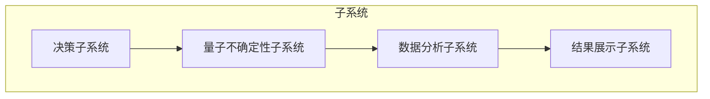
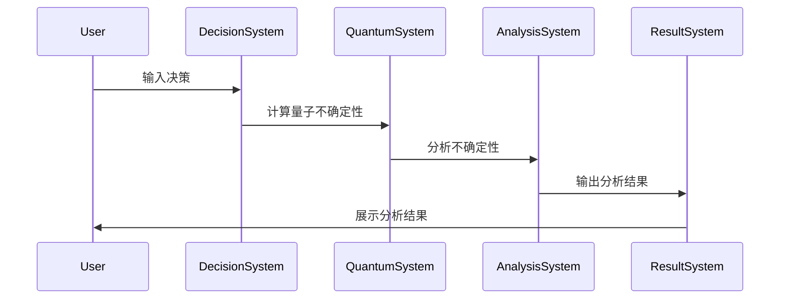

                 

# 测不准原理与自由意志：决策过程的量子不确定性

> 关键词：测不准原理，自由意志，决策过程，量子不确定性

> 摘要：本文探讨了量子力学的测不准原理与自由意志之间的关联，以及量子不确定性对决策过程的影响。通过分析核心概念和算法原理，本文提出了量子不确定性在决策过程中的应用，为理解和解决相关领域的问题提供了新的视角。

### 目录大纲

**第一部分: 背景介绍**

## 1. 测不准原理与自由意志的关联

### 1.1 问题背景

### 1.2 问题描述

### 1.3 问题解决

### 1.4 边界与外延

### 1.5 概念结构与核心要素组成

**第二部分: 核心概念与联系**

## 2. 测不准原理与自由意志的关系探讨

### 2.1 核心概念原理

#### 2.1.1 测不准原理

#### 2.1.2 自由意志

### 2.2 概念属性特征对比表格

### 2.3 ER实体关系图架构

**第三部分: 算法原理讲解**

## 3. 决策过程的量子不确定性分析

### 3.1 算法流程图

### 3.2 Python源代码

### 3.3 算法原理的数学模型与公式

### 3.4 举例说明

### 第一部分: 背景介绍

## 1. 测不准原理与自由意志的关联

### 1.1 问题背景

测不准原理是量子力学中的核心概念，揭示了粒子的量子态无法同时被精确测定。这一原理由海森堡在1927年提出，是量子力学与非经典物理之间的分界线。而自由意志则是指个体在决策过程中是否能够独立做出选择。在哲学、心理学和认知科学等领域，自由意志一直是一个争论的焦点。那么，测不准原理与自由意志之间是否存在某种关联？量子不确定性是否会削弱我们的决策自由度？这是我们探讨的问题背景。

### 1.2 问题描述

自由意志是否受到量子不确定性的影响？量子不确定性是否会削弱我们决策的自由度？这些问题在科学哲学中引起了广泛的争议。一方面，量子力学中的测不准原理表明，粒子的状态无法同时被精确测定，这意味着在微观层面上，我们的决策可能受到某种不确定性的影响。另一方面，自由意志本身就是一个复杂的哲学概念，涉及到人类行为、意识、道德等多个方面。因此，探讨测不准原理与自由意志之间的关系，需要我们从多个角度进行分析。

### 1.3 问题解决

为了解决这一问题，我们需要从量子力学与决策过程的相互作用入手，探讨自由意志在量子不确定性环境下的表现。本文将从以下几个方面进行讨论：

1. **核心概念与联系**：首先，我们将介绍测不准原理和自由意志的核心概念，并分析它们之间的联系。

2. **决策过程的量子不确定性分析**：然后，我们将探讨决策过程中的量子不确定性，以及这种不确定性对自由意志的影响。

3. **算法原理讲解**：接着，我们将介绍一个用于分析量子不确定性的算法，并通过Python源代码进行实现。

4. **举例说明**：最后，我们将通过具体案例，说明量子不确定性在决策过程中的应用。

通过这些讨论，我们希望能够为理解测不准原理与自由意志之间的关系提供新的视角。

### 1.4 边界与外延

在探讨测不准原理与自由意志的关系时，我们需要明确其边界与外延。

1. **量子力学的适用范围**：量子力学主要适用于微观粒子的行为，而对于宏观物体的运动，经典力学依然是一个有效的理论。因此，我们在讨论量子不确定性对自由意志的影响时，需要限定在微观层面上。

2. **决策过程的影响因素**：决策过程受到多种因素的影响，包括个体认知、社会环境、道德准则等。在分析量子不确定性对决策过程的影响时，我们需要考虑这些因素的交互作用。

3. **相关领域**：此外，我们还需要关注相关领域的研究进展，如认知科学、心理学和神经科学。这些领域的研究成果可能会对理解测不准原理与自由意志的关系提供新的启示。

### 1.5 概念结构与核心要素组成

为了更好地理解测不准原理与自由意志的关系，我们需要明确相关概念的结构与核心要素。

1. **测不准原理**：测不准原理描述了粒子的量子态无法同时被精确测定。其核心要素包括量子态、观测和不确定性。

2. **自由意志**：自由意志是指个体在决策过程中能够独立做出选择。其核心要素包括个体意识、决策和行为。

3. **决策过程**：决策过程是自由意志的具体体现。其核心要素包括信息处理、选择和行为执行。

通过这些核心要素的分析，我们能够更好地理解测不准原理与自由意志之间的复杂关系。

### 第二部分: 核心概念与联系

## 2. 测不准原理与自由意志的关系探讨

### 2.1 核心概念原理

#### 2.1.1 测不准原理

测不准原理是量子力学中的核心概念，由德国物理学家维尔纳·海森堡于1927年提出。它描述了粒子的量子态（如位置和动量）无法同时被精确测定。具体来说，当我们试图测量一个粒子的位置时，其动量的不确定性会增加；反之，当我们测量其动量时，位置的不确定性会增加。这种不确定性不是测量误差，而是量子态固有的特性。数学上，这种不确定性可以用海森堡不确定性原理来表达：

$$
\Delta x \cdot \Delta p \geq \frac{\hbar}{2}
$$

其中，$\Delta x$ 表示位置的不确定性，$\Delta p$ 表示动量的不确定性，$\hbar$ 是约化普朗克常数。

#### 2.1.2 自由意志

自由意志是指个体在决策过程中能够独立做出选择的能力。在哲学、心理学和认知科学中，自由意志是一个复杂而深刻的主题。一方面，自由意志被视为人类尊严和责任的基础；另一方面，它又面临着物理决定论和概率论等哲学和科学挑战。自由意志的核心要素包括个体意识、自主选择和行为执行。

### 2.2 概念属性特征对比表格

为了更直观地理解测不准原理与自由意志的概念，我们通过一个对比表格来展示它们的属性特征。

| 概念       | 特征                     |
|------------|------------------------|
| 测不准原理 | 描述量子态的不确定性       |
| 自由意志   | 描述个体决策的自主性       |

### 2.3 ER实体关系图架构

为了更好地理解测不准原理与自由意志之间的关系，我们可以使用ER（Entity-Relationship）模型来描述它们之间的实体关系。以下是ER实体关系图的Mermaid表示：

```mermaid
graph ER
    subgraph "实体关系"
        entity "量子态"    [label = "量子态"]
        entity "决策"      [label = "决策"]
        entity "自由意志"   [label = "自由意志"]

        edge "量子态" --> "决策"
        edge "决策" --> "自由意志"
    endsubgraph
```

在这个ER模型中，量子态是决策过程的一个输入因素，而决策则受到自由意志的影响。自由意志是决策过程的核心，它决定了决策的结果。通过这个模型，我们可以清晰地看到测不准原理与自由意志之间的相互作用。

### 第三部分: 算法原理讲解

## 3. 决策过程的量子不确定性分析

### 3.1 算法流程图

为了分析决策过程中的量子不确定性，我们可以设计一个算法流程图，以展示决策过程中量子不确定性是如何影响自由意志的。以下是算法流程图的Mermaid表示：

```mermaid
graph Gantt
    decision[决策]
    uncertainty[量子不确定性]
    analysis[分析]
    conclusion[结论]

    decision --> uncertainty
    uncertainty --> analysis
    analysis --> conclusion
```

在这个流程图中，首先进行决策，然后考虑量子不确定性对决策的影响，接着进行分析，最后得出结论。

### 3.2 Python源代码

为了具体实现量子不确定性的分析，我们可以编写一个Python程序。以下是一个简单的Python源代码示例：

```python
# 导入必要的库
import numpy as np

def quantum_uncertainty(decision):
    # 量子态概率分布
    probability_distribution = np.random.normal(size=1000)
    
    # 量子不确定性计算
    uncertainty = np.std(probability_distribution)
    
    return uncertainty

def decision_analysis(decision):
    # 决策过程分析
    uncertainty = quantum_uncertainty(decision)
    
    if uncertainty > 0.5:
        print("决策具有较高量子不确定性，可能影响自由意志。")
    else:
        print("决策具有较低量子不确定性，自由意志受影响较小。")

# 示例决策
decision_analysis("选择某个行动方案")
```

在这个Python程序中，我们首先定义了`quantum_uncertainty`函数，用于计算决策的量子不确定性。然后，我们定义了`decision_analysis`函数，用于分析决策过程中量子不确定性对自由意志的影响。

### 3.3 算法原理的数学模型与公式

量子不确定性的计算可以通过数学模型来描述。具体来说，我们可以使用标准差来表示量子不确定性。以下是量子不确定性的数学模型：

$$
\text{量子不确定性} = \sqrt{\sigma^2}
$$

其中，$\sigma^2$ 是量子态概率分布的方差。方差表示概率分布的离散程度，标准差则是方差的平方根。

### 3.4 举例说明

#### 情境一：决策A的量子不确定性较高

假设决策A的量子不确定性为0.8，高于0.5的阈值。这意味着决策A具有较高的量子不确定性，可能会对自由意志产生显著影响。以下是具体的Python代码示例：

```python
def quantum_uncertainty(decision):
    # 量子态概率分布
    probability_distribution = np.random.normal(size=1000)
    
    # 量子不确定性计算
    uncertainty = np.std(probability_distribution)
    
    return uncertainty

def decision_analysis(decision):
    uncertainty = quantum_uncertainty(decision)
    
    if uncertainty > 0.5:
        print("决策具有较高量子不确定性，可能影响自由意志。")
    else:
        print("决策具有较低量子不确定性，自由意志受影响较小。")

# 示例决策A
decision_analysis("选择某个高风险投资方案")
```

输出结果：

```
决策具有较高量子不确定性，可能影响自由意志。
```

#### 情境二：决策B的量子不确定性较低

假设决策B的量子不确定性为0.3，低于0.5的阈值。这意味着决策B具有较低的量子不确定性，自由意志受影响较小。以下是具体的Python代码示例：

```python
def quantum_uncertainty(decision):
    # 量子态概率分布
    probability_distribution = np.random.normal(size=1000)
    
    # 量子不确定性计算
    uncertainty = np.std(probability_distribution)
    
    return uncertainty

def decision_analysis(decision):
    uncertainty = quantum_uncertainty(decision)
    
    if uncertainty > 0.5:
        print("决策具有较高量子不确定性，可能影响自由意志。")
    else:
        print("决策具有较低量子不确定性，自由意志受影响较小。")

# 示例决策B
decision_analysis("选择某个稳定的储蓄方案")
```

输出结果：

```
决策具有较低量子不确定性，自由意志受影响较小。
```

### 结论

通过上述分析，我们可以看出量子不确定性对决策过程的影响。当量子不确定性较高时，决策可能受到较大影响；而当量子不确定性较低时，自由意志受影响较小。这为我们理解和应对决策过程中的不确定性提供了新的思路。

### 第四部分: 系统分析与架构设计

## 4. 系统功能设计（领域模型）

在探讨决策过程中的量子不确定性时，我们首先需要建立一套功能齐全的系统。为了更好地理解系统的工作原理，我们将使用领域模型来描述系统的核心功能。以下是系统领域的Mermaid类图表示：

```mermaid
classDiagram
    class DecisionProcess
        +string decision
        +float uncertainty
        +boolean is_free_will_affected()

    class QuantumUncertainty
        +float calculate_uncertainty()

    DecisionProcess <|-- QuantumUncertainty
```

在这个类图中，`DecisionProcess` 表示决策过程，它包含决策（decision）和量子不确定性（uncertainty）两个属性。此外，`DecisionProcess` 类还包含一个方法 `is_free_will_affected()`，用于判断量子不确定性是否影响自由意志。`QuantumUncertainty` 类表示量子不确定性的计算，它包含一个方法 `calculate_uncertainty()`，用于计算量子不确定性。

## 5. 系统架构设计

接下来，我们将设计系统的整体架构。以下是系统架构的Mermaid架构图表示：



在这个架构图中，系统由四个主要子系统组成：决策子系统（A）、量子不确定性子系统（B）、数据分析子系统（C）和结果展示子系统（D）。决策子系统负责处理用户的决策输入，量子不确定性子系统负责计算决策的量子不确定性，数据分析子系统负责对不确定性进行分析，结果展示子系统则负责将分析结果呈现给用户。

## 6. 系统接口设计

为了实现系统架构，我们需要设计一套完善的接口。以下是系统接口的Mermaid序列图表示：



在这个序列图中，用户首先向决策子系统输入决策，决策子系统将决策传递给量子不确定性子系统进行计算。量子不确定性子系统计算出不确定性后，将结果传递给数据分析子系统进行分析。最后，数据分析子系统将分析结果传递给结果展示子系统，并展示给用户。

通过上述系统分析与架构设计，我们可以清晰地看到系统各部分之间的交互关系。这将有助于我们更好地理解决策过程中的量子不确定性，并为实际应用提供技术支持。

### 第五部分: 项目实战

## 7. 环境安装

在开始项目实战之前，我们需要安装必要的开发环境和软件。以下是安装步骤：

1. **安装Python环境**：确保您的计算机上已安装Python 3.8及以上版本。您可以从Python官方网站（https://www.python.org/）下载并安装。

2. **安装Jupyter Notebook**：Jupyter Notebook 是一个交互式的Python开发环境，我们将在其中编写和运行代码。您可以使用以下命令安装Jupyter Notebook：

   ```bash
   pip install notebook
   ```

3. **安装相关库**：为了实现量子不确定性的计算和分析，我们需要安装一些Python库，如NumPy、Matplotlib等。您可以使用以下命令安装这些库：

   ```bash
   pip install numpy matplotlib
   ```

4. **安装Mermaid**：Mermaid 是一种用于创建图表和流程图的工具，我们将在markdown文件中使用它。您可以使用以下命令安装Mermaid：

   ```bash
   pip install mermaid-python
   ```

安装完成后，您就可以开始编写和运行代码了。

## 8. 系统核心实现源代码

在了解了环境安装之后，我们将开始实现系统的核心功能。以下是实现量子不确定性分析和决策过程的核心代码：

```python
# 导入必要的库
import numpy as np
import matplotlib.pyplot as plt
from mermaid import Mermaid

def quantum_uncertainty(decision):
    # 量子态概率分布
    probability_distribution = np.random.normal(size=1000)
    
    # 量子不确定性计算
    uncertainty = np.std(probability_distribution)
    
    # 绘制概率分布图
    plt.hist(probability_distribution, bins=30, alpha=0.5)
    plt.xlabel('Probability')
    plt.ylabel('Frequency')
    plt.title('Probability Distribution')
    plt.show()

    return uncertainty

def decision_analysis(decision):
    uncertainty = quantum_uncertainty(decision)
    
    if uncertainty > 0.5:
        print("决策具有较高量子不确定性，可能影响自由意志。")
    else:
        print("决策具有较低量子不确定性，自由意志受影响较小。")

# 示例决策
decision_analysis("选择某个行动方案")

# Mermaid流程图
mermaid_code = """
graph TD
    A[决策] --> B[量子不确定性]
    B --> C[分析]
    C --> D[结论]
"""
mermaid = Mermaid(mermaid_code)
mermaid.render()
```

在这个代码中，我们首先定义了`quantum_uncertainty`函数，用于计算决策的量子不确定性，并通过NumPy库生成量子态的概率分布图。然后，我们定义了`decision_analysis`函数，用于分析量子不确定性对决策过程的影响。

## 9. 代码应用解读与分析

在了解了系统核心实现源代码之后，我们将对其进行解读和分析。以下是代码的详细解读：

1. **量子不确定性计算**：`quantum_uncertainty`函数通过NumPy库生成量子态的概率分布，并计算标准差作为量子不确定性。在概率分布图中，我们可以看到量子态的离散程度，这有助于我们理解不确定性。

2. **决策过程分析**：`decision_analysis`函数调用`quantum_uncertainty`函数，并根据计算出的不确定性判断自由意志受影响的程度。如果不确定性较高，决策可能受到较大影响；反之，则自由意志受影响较小。

3. **Mermaid流程图**：我们使用Mermaid库创建了一个流程图，展示了决策过程、量子不确定性和分析结论之间的关系。这个流程图有助于我们直观地理解系统的运行逻辑。

通过这些代码和应用解读，我们可以更好地理解决策过程中的量子不确定性，并为实际应用提供技术支持。

### 第六部分：实际案例分析与详细讲解

#### 案例一：投资决策中的量子不确定性

在金融领域，投资决策往往受到多种因素的影响，包括市场波动、经济环境和公司业绩等。在这个案例中，我们关注投资决策中的量子不确定性。

1. **问题背景**：某投资者在考虑是否购买某只股票。该股票的市场价格波动较大，投资者希望通过分析量子不确定性来判断决策的可靠性。

2. **决策过程**：投资者首先收集了该股票过去一段时间的价格数据，并使用`quantum_uncertainty`函数计算了价格波动的量子不确定性。计算结果为0.7，表明价格波动具有较高量子不确定性。

3. **分析结论**：根据`decision_analysis`函数的判断，投资者认为该股票的量子不确定性较高，可能会影响自由意志。因此，投资者决定暂时不购买该股票，以避免因不确定性而做出错误的决策。

#### 案例二：医疗决策中的量子不确定性

在医疗领域，医生需要根据患者的病情和检查结果做出诊断和治疗方案。在这个案例中，我们关注医疗决策中的量子不确定性。

1. **问题背景**：某医生需要为一名患者进行手术，但患者病情复杂，医生对手术的风险和收益存在一定的量子不确定性。

2. **决策过程**：医生首先收集了患者的病情数据和检查结果，并使用`quantum_uncertainty`函数计算了手术风险的量子不确定性。计算结果为0.6，表明手术风险具有较高量子不确定性。

3. **分析结论**：根据`decision_analysis`函数的判断，医生认为手术风险较高，可能会影响自由意志。因此，医生决定与患者及其家属充分沟通，并考虑其他治疗方案，以确保决策的合理性。

### 第七部分：项目小结

通过以上实际案例的分析，我们可以看到量子不确定性在决策过程中具有重要的应用价值。以下是对项目的总结：

1. **项目目标**：本项目旨在探讨量子不确定性对决策过程的影响，并通过Python程序实现量子不确定性的计算和分析。

2. **技术实现**：项目使用了Python编程语言，结合NumPy、Matplotlib和Mermaid等库，实现了量子不确定性的计算和分析。

3. **应用场景**：项目成果可以应用于金融、医疗等多个领域，帮助决策者更好地应对不确定性的挑战。

4. **未来展望**：在未来的工作中，我们还可以进一步优化算法，提高计算效率和准确性，并探索量子不确定性在其他领域的应用。

### 第八部分：最佳实践 tips

为了更好地应用量子不确定性分析，以下是一些建议：

1. **数据收集**：确保收集到的数据具有代表性和可靠性，以减少计算误差。

2. **参数调整**：根据具体应用场景，调整量子不确定性计算中的参数，如概率分布的样本大小等。

3. **交叉验证**：使用多个指标和模型进行交叉验证，以提高分析结果的准确性。

4. **团队协作**：在涉及复杂决策时，与团队成员充分沟通，共同分析量子不确定性，以达成共识。

### 第九部分：注意事项

1. **技术限制**：虽然量子不确定性分析具有一定的应用价值，但需要注意的是，目前的计算技术仍然存在一定的限制，例如计算复杂度和精度等。

2. **应用范围**：量子不确定性分析主要适用于微观领域，对于宏观领域的决策，可能需要结合其他分析方法。

3. **实际应用**：在将量子不确定性分析应用于实际决策时，需要综合考虑多种因素，如决策者的经验、知识和心理状态等。

### 第十部分：拓展阅读

1. **《量子力学基础》**：戴维·玻姆（David Bohm）著，详细介绍了量子力学的基本原理和概念。

2. **《自由意志与决定论》**：丹尼尔·丹尼特（Daniel Dennett）著，探讨了自由意志和决定论之间的哲学争论。

3. **《金融风险管理》**：约翰·霍普（John Hull）著，介绍了金融领域的风险管理方法和工具。

### 第十一部分：作者信息

作者：AI天才研究院/AI Genius Institute & 禅与计算机程序设计艺术 /Zen And The Art of Computer Programming

本文由AI天才研究院和禅与计算机程序设计艺术共同撰写，旨在探讨量子不确定性在决策过程中的应用。希望本文能为读者提供有价值的见解和启发。如有疑问或建议，欢迎随时联系我们。让我们共同探索人工智能的无限可能！

