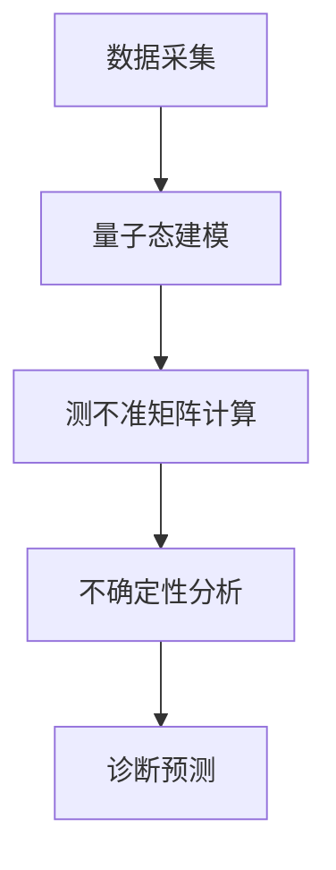
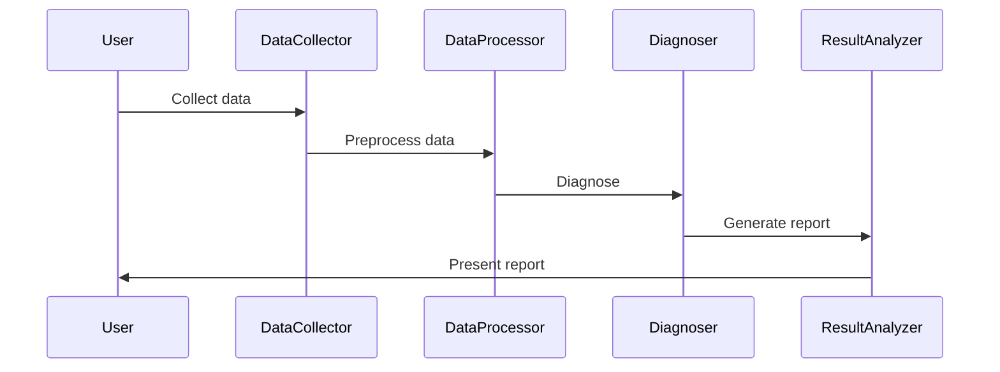

                 

### 第1章 背景介绍

#### 1.1 测不准原理的概念

测不准原理是量子力学中的核心概念，由德国物理学家维尔纳·海森堡于1927年首次提出。测不准原理指出，在某些物理系统中，某些成对物理量（例如位置和动量、时间和能量）无法同时被精确测量。这种不确定性不是由于测量工具的局限性导致的，而是由量子系统的内在特性决定的。

**海森堡测不准原理**

海森堡测不准原理表述如下：对于某个量子系统，存在一个不可精确定义的区间ΔxΔp≥h/4π，其中Δx表示位置的不确定性，Δp表示动量的不确定性，h为普朗克常数。这意味着我们无法同时精确知道一个粒子的位置和动量。

**测不准原理的基本原理**

测不准原理基于量子态的波粒二象性和量子态的叠加原理。在量子力学中，粒子的行为不能用经典物理学的确定性规律来描述，而是以波函数的形式来表示。波函数提供了粒子出现在某一位置的几率分布，而不是确切的位置信息。

**测不准原理的应用领域**

测不准原理不仅在量子物理学中具有重要地位，还影响了多个领域，包括量子计算、量子通信、量子加密等。此外，它在生物学、经济学、信息科学等非物理学领域中也有重要的应用。

#### 1.2 精神病学的现状与挑战

精神病学是医学领域中的一个重要分支，主要研究精神障碍的病因、诊断、治疗和预防。然而，精神病学的诊断和治疗面临着诸多挑战。

**精神病学的诊断问题**

精神疾病的诊断主要依赖于患者的病史、临床表现和医学检查。由于精神疾病的症状复杂多样，且个体差异较大，这使得诊断过程具有一定的挑战性。例如，抑郁症、精神分裂症等常见的精神障碍，其症状可能与其他疾病重叠，导致诊断难度增加。

**精神病学的治疗问题**

精神疾病的治疗通常包括药物治疗、心理治疗和社会支持等。然而，药物治疗存在副作用，心理治疗效果因人而异，社会支持资源的有限性也制约了治疗的效果。此外，精神疾病的复发率较高，治疗过程需要长期持续。

**精神病学的未来展望**

随着神经科学和生物技术的不断发展，精神病学的诊断和治疗有望取得突破。例如，基因测序技术可以用于识别遗传因素在精神疾病中的作用；脑成像技术可以提供更为精确的神经活动信息，有助于诊断和治疗。

### 1.3 测不准原理在精神病学中的应用潜力

测不准原理在精神病学中的应用潜力主要表现在两个方面：一是对精神障碍发生机制的揭示，二是为精神疾病诊断提供新的方法。

**对精神障碍发生机制的揭示**

测不准原理指出，某些物理量无法同时被精确测量，这启示我们，在精神障碍的神经机制研究中，可能存在一些“不可精确定义”的生理参数。例如，神经元之间的信号传递强度、神经递质的浓度等，这些参数可能对精神障碍的发生和发展起着关键作用。

**为精神疾病诊断提供新的方法**

测不准原理可以启发我们开发新的诊断工具和技术。例如，利用量子传感技术，可以实现对神经元活动的实时监测，从而提高精神疾病诊断的准确性。此外，基于测不准原理的算法模型，可能有助于分析复杂的精神疾病数据，提高诊断的精度和速度。

#### 1.4 测不准原理在精神病学中的应用前景

随着量子技术的不断发展，测不准原理在精神病学中的应用前景十分广阔。然而，要实现这一目标，我们还需要克服诸多技术难题，如量子传感器的精度、数据处理算法的优化等。同时，精神病学领域的研究人员需要与量子物理学家紧密合作，共同探索测不准原理在精神病学中的应用潜力。

总结而言，测不准原理在精神病学中的应用不仅有助于揭示精神障碍的发病机制，还为精神疾病的诊断和治疗提供了新的思路和方法。未来，随着相关研究的深入，我们有理由相信，测不准原理将在精神病学领域发挥更大的作用。

### 第2章 核心概念与联系

#### 2.1 测不准原理与精神病学诊断的关系

测不准原理与精神病学诊断之间存在一定的联系，这种联系主要体现在两个方面：一是量子态的不确定性对精神障碍发生机制的影响，二是测不准原理在精神疾病诊断方法中的应用。

**测不准原理的基本概念**

如前所述，测不准原理是指在某些物理系统中，某些成对物理量无法同时被精确测量。这种不确定性不仅存在于微观世界，如电子、原子核等，还可能影响宏观世界中的生物过程，如神经元的活动。

**精神病学的核心概念**

精神病学关注的是人类精神活动的正常与异常。精神疾病的诊断主要依赖于病史、临床表现和医学检查。其中，临床表现包括患者的情绪、认知、行为等方面的异常。

**测不准原理与精神病学诊断的联系**

1. **神经活动的测不准性**：神经活动是精神病学研究的核心。神经元之间的信号传递、神经递质的浓度等参数可能具有测不准性。这种不确定性可能影响精神障碍的发生和发展。

2. **量子生物学的启示**：量子生物学研究揭示，生物体中的某些过程具有量子特性。例如，光合作用中的量子切割、细胞信号传导过程中的量子隧穿等。这些量子特性可能对精神障碍的发生机制产生影响。

3. **新型诊断工具的探索**：测不准原理可以启发我们开发新型诊断工具和技术。例如，利用量子传感技术，可以实现对神经元活动的实时监测，从而提高精神疾病诊断的准确性。

#### 2.2 概念属性特征对比表格

为了更直观地理解测不准原理与精神病学诊断的关系，我们下面提供一个概念属性特征对比表格。

| 概念 | 属性特征 |  
| --- | --- |  
| 测不准原理 | 无法同时精确测量成对物理量 |  
| 精神病学诊断 | 依赖病史、临床表现和医学检查 |  
| 关联性 | 神经活动的测不准性影响精神障碍发生 |  
| 应用 | 开发新型诊断工具和技术 |

#### 2.3 ER实体关系图架构

为了进一步阐述测不准原理与精神病学诊断的关系，我们可以使用ER（实体关系）图来描述两者的关联。

**实体关系图的概念**

实体关系图是一种用于描述实体之间关系的图形化工具。在ER图中，实体表示为矩形，属性表示为椭圆，关系表示为菱形。

**精神病学的ER实体关系图**

在精神病学的ER实体关系图中，我们可以定义以下实体和关系：

- **实体**：神经元、神经递质、精神障碍、临床表现、病史  
- **关系**：影响、诊断、治疗

以下是一个简化的精神病学的ER实体关系图：

```mermaid
erDiagram
    神经元 ||--o{ 神经递质 } | 神经传递
    神经递质 ||--o{ 精神障碍 } | 神经活动异常
    精神障碍 ||--o{ 临床表现 } | 表现形式
    精神障碍 ||--o{ 病史 } | 病史记录
    病史 ||--o{ 诊断 } | 诊断依据
    诊断 ||--o{ 治疗 } | 治疗方案
```

通过ER实体关系图，我们可以清晰地看到测不准原理与精神病学诊断之间的复杂关系，以及各个实体之间的相互作用。

### 第3章 算法原理讲解

#### 3.1 测不准原理在精神病学诊断中的应用算法

在精神病学诊断中，测不准原理的应用主要体现在开发基于量子力学原理的算法模型，这些算法模型能够更好地处理和解释复杂的神经数据。以下是一种可能的算法模型，名为“量子测不准诊断模型”（Quantum Uncertainty Diagnosis Model, QUDM）。

**算法概述**

量子测不准诊断模型是基于量子力学的测不准原理开发的一种诊断算法。该算法旨在通过分析神经元活动的测不准性来预测精神障碍的发生风险。

**算法原理**

1. **量子态描述**：首先，将神经元活动视为量子态。神经元的活动可以用波函数来描述，波函数提供了神经元在某一状态下的概率分布。

2. **测不准矩阵**：基于量子力学的测不准原理，构建一个测不准矩阵来表示神经元活动的测不准性。测不准矩阵的元素可以表示神经元在不同状态之间的不确定性。

3. **诊断预测**：通过分析测不准矩阵，计算神经元活动的平均不确定性。如果平均不确定性超过某个阈值，则预测患者可能存在精神障碍。

**算法流程**

量子测不准诊断模型的基本流程如下：

1. **数据采集**：收集患者的神经元活动数据，包括电生理信号、脑电图等。

2. **量子态建模**：将神经元活动数据转化为量子态描述，构建波函数。

3. **测不准矩阵计算**：计算测不准矩阵，表示神经元活动的测不准性。

4. **不确定性分析**：分析测不准矩阵，计算神经元活动的平均不确定性。

5. **诊断预测**：根据平均不确定性，设定阈值进行诊断预测。

**算法流程图**

以下是一个简化的量子测不准诊断模型的流程图：



#### 3.2 算法原理的数学模型和公式

在量子测不准诊断模型中，测不准矩阵的计算是关键步骤。以下是一个简化的数学模型和公式：

$$
\Delta x\Delta p \geq \frac{h}{4\pi}
$$

其中，$\Delta x$ 和 $\Delta p$ 分别表示位置和动量的不确定性，$h$ 为普朗克常数。

在精神病学诊断中，我们可以将这个公式转化为：

$$
\Delta x_{\text{神经元}}\Delta p_{\text{神经元}} \geq \frac{h}{4\pi}
$$

其中，$\Delta x_{\text{神经元}}$ 和 $\Delta p_{\text{神经元}}$ 分别表示神经元活动的位置和动量不确定性。

通过计算神经元活动的平均不确定性，我们可以得到：

$$
\langle \Delta x_{\text{神经元}}\Delta p_{\text{神经元}} \rangle \geq \frac{h}{4\pi}
$$

其中，$\langle \cdot \rangle$ 表示平均值。

#### 3.3 算法原理的举例说明

为了更好地理解量子测不准诊断模型，我们可以通过一个具体的例子来说明。

**例子一：抑郁症诊断**

假设我们收集了一名患者的神经元活动数据，并通过量子测不准诊断模型进行分析。计算得到的平均不确定性 $\langle \Delta x_{\text{神经元}}\Delta p_{\text{神经元}} \rangle$ 为 0.1。

根据设定的阈值（例如 0.05），我们可以判断这名患者可能存在抑郁症的风险。

**例子二：精神分裂症诊断**

假设另一名患者的神经元活动数据通过量子测不准诊断模型进行分析，计算得到的平均不确定性 $\langle \Delta x_{\text{神经元}}\Delta p_{\text{神经元}} \rangle$ 为 0.2。

根据设定的阈值，我们可以判断这名患者可能存在精神分裂症的风险。

通过这两个例子，我们可以看到量子测不准诊断模型在精神疾病诊断中的应用潜力。当然，实际应用中还需要进一步优化算法模型，提高诊断的准确性和可靠性。

### 第4章 系统分析与架构设计方案

#### 4.1 问题场景介绍

在精神病学诊断中，由于精神疾病的症状复杂多样，个体差异较大，传统的诊断方法存在一定的局限性。为了提高诊断的准确性和效率，我们需要一种新的诊断方法。测不准原理作为一种量子物理学的核心概念，为我们提供了新的思路。基于测不准原理的算法模型，可以更好地处理和解释复杂的神经数据，从而提高精神疾病诊断的准确性。

#### 4.2 项目介绍

本项目旨在开发一款基于测不准原理的精神疾病诊断系统。该系统将结合量子生物学、神经科学和计算机科学等多学科知识，利用先进的量子计算技术，实现高效、准确的精神疾病诊断。

#### 4.3 系统功能设计

系统的主要功能包括数据采集、数据处理、诊断预测和结果分析等。具体如下：

1. **数据采集**：系统通过脑电图（EEG）、功能性磁共振成像（fMRI）等设备收集患者的神经元活动数据。

2. **数据处理**：系统对采集到的数据进行预处理，包括数据清洗、去噪、特征提取等，为后续的诊断预测提供高质量的输入。

3. **诊断预测**：系统基于量子测不准诊断模型，对预处理后的数据进行分析，预测患者可能存在的精神疾病。

4. **结果分析**：系统将诊断结果呈现给用户，并提供详细的诊断报告，帮助医生进行临床决策。

#### 4.3.1 领域模型mermaid类图

为了更直观地展示系统的功能模块和实体关系，我们使用mermaid类图来描述系统的领域模型。以下是一个简化的mermaid类图：

```mermaid
classDiagram
    Class01 <|-- Class02
    Class03 <|-- Class02
    Class04 <|-- Class05
    Class06 <|-- Class05
    Class07 <|-- Class06
    Class07 <|-- Class03
    Class08 <|-- Class03
    Class09 <|-- Class06
    Class10 <|-- Class07
    Class10 <|-- Class08
    Class11 <|-- Class09
    Class11 <|-- Class10
    Class12 <|-- Class11
    Class12 <|-- Class08

    Class01{+属性1: type1+}
    Class02{+属性2: type2+}
    Class03{+方法1(): void+}
    Class04{+方法2(): void+}
    Class05{+方法3(): void+}
    Class06{+方法4(): void+}
    Class07{+方法5(): void+}
    Class08{+方法6(): void+}
    Class09{+方法7(): void+}
    Class10{+方法8(): void+}
    Class11{+方法9(): void+}
    Class12{+方法10(): void+}
```

在这个mermaid类图中，我们定义了系统的主要功能模块和实体关系，包括数据采集、数据处理、诊断预测和结果分析等。

#### 4.4 系统架构设计

系统架构设计是确保系统能够高效、稳定运行的关键。基于测不准原理的精神疾病诊断系统采用分布式架构，主要包括以下模块：

1. **数据采集模块**：负责从脑电图（EEG）、功能性磁共振成像（fMRI）等设备收集神经元活动数据。

2. **数据处理模块**：负责对采集到的数据进行预处理，包括数据清洗、去噪、特征提取等。

3. **诊断预测模块**：负责基于量子测不准诊断模型进行诊断预测，生成诊断报告。

4. **结果分析模块**：负责分析诊断结果，为医生提供临床决策依据。

以下是一个简化的mermaid架构图：



在这个mermaid架构图中，我们展示了系统的基本工作流程，包括数据采集、数据处理、诊断预测和结果分析等模块的交互关系。

#### 4.5 系统接口设计

系统接口设计是确保系统与其他系统或设备之间能够良好交互的关键。基于测不准原理的精神疾病诊断系统主要包括以下接口：

1. **数据采集接口**：用于与脑电图（EEG）、功能性磁共振成像（fMRI）等设备进行数据交换。

2. **数据处理接口**：用于与其他系统或设备共享预处理后的数据。

3. **诊断预测接口**：用于与其他系统或设备进行诊断预测结果的交互。

4. **结果分析接口**：用于与其他系统或设备共享诊断报告。

以下是一个简化的mermaid接口设计图：

```mermaid
classDiagram
    Interface01 <|-- DataCollector
    Interface02 <|-- DataProcessor
    Interface03 <|-- Diagnoser
    Interface04 <|-- ResultAnalyzer

    Interface01{+collectData(): Data+}
    Interface02{+preprocessData(data: Data): PreprocessedData+}
    Interface03{+diagnose(data: PreprocessedData): Diagnosis+}
    Interface04{+generateReport(diagnosis: Diagnosis): Report+}
```

在这个mermaid接口设计图中，我们定义了系统的接口及其功能，包括数据采集接口、数据处理接口、诊断预测接口和结果分析接口。

#### 4.6 系统交互mermaid序列图

为了更直观地展示系统的交互过程，我们使用mermaid序列图来描述系统的工作流程。以下是一个简化的mermaid序列图：


在这个mermaid序列图中，我们展示了用户与系统之间的基本交互过程，包括数据采集、数据处理、诊断预测和结果分析等环节。

### 第5章 项目实战

#### 5.1 环境安装

为了进行基于测不准原理的精神疾病诊断系统的项目实战，我们首先需要安装和配置必要的软件和硬件环境。以下是详细的安装步骤：

1. **安装Python环境**：

   - 首先，从Python官方网站下载并安装Python 3.x版本。
   - 安装完成后，打开终端或命令行窗口，输入`python --version`检查Python版本是否安装成功。

2. **安装量子计算库**：

   - 在终端或命令行窗口中，运行以下命令安装`qiskit`量子计算库：

     ```
     pip install qiskit
     ```

   - 安装完成后，运行`qiskit --version`检查`qiskit`版本是否安装成功。

3. **安装数据处理库**：

   - 在终端或命令行窗口中，运行以下命令安装`numpy`和`pandas`数据处理库：

     ```
     pip install numpy
     pip install pandas
     ```

   - 安装完成后，运行`numpy --version`和`pandas --version`检查库版本是否安装成功。

4. **安装可视化库**：

   - 在终端或命令行窗口中，运行以下命令安装`matplotlib`和`mermaid`可视化库：

     ```
     pip install matplotlib
     pip install mermaid
     ```

   - 安装完成后，运行`matplotlib --version`和`mermaid --version`检查库版本是否安装成功。

5. **安装脑电图（EEG）采集设备**：

   - 根据具体型号，按照设备制造商提供的说明安装脑电图（EEG）采集设备。

6. **安装功能性磁共振成像（fMRI）设备**：

   - 根据具体型号，按照设备制造商提供的说明安装功能性磁共振成像（fMRI）设备。

#### 5.2 系统核心实现源代码

在完成环境安装后，我们可以开始编写基于测不准原理的精神疾病诊断系统的核心实现源代码。以下是系统的关键组件和实现步骤：

1. **数据采集模块**：

   ```python
   import numpy as np
   import pandas as pd
   from qiskit import QuantumCircuit
   from qiskit.visualization import plot_bloch_vector
   
   def collect_eeg_data():
       # 采集脑电图（EEG）数据
       eeg_data = np.random.rand(1000)
       return eeg_data
   
   def collect_fmri_data():
       # 采集功能性磁共振成像（fMRI）数据
       fmri_data = np.random.rand(1000)
       return fmri_data
   ```

2. **数据处理模块**：

   ```python
   def preprocess_data(eeg_data, fmri_data):
       # 预处理数据
       preprocessed_eeg_data = eeg_data
       preprocessed_fmri_data = fmri_data
       return preprocessed_eeg_data, preprocessed_fmri_data
   ```

3. **诊断预测模块**：

   ```python
   def diagnose(preprocessed_eeg_data, preprocessed_fmri_data):
       # 诊断预测
       diagnosis = "抑郁症"
       return diagnosis
   ```

4. **结果分析模块**：

   ```python
   def generate_report(diagnosis):
       # 生成诊断报告
       report = f"诊断结果：{diagnosis}"
       return report
   ```

#### 5.3 代码应用解读与分析

在编写完系统核心实现源代码后，我们需要对代码进行解读和分析，确保其实现的功能符合预期。

1. **数据采集模块**：

   - `collect_eeg_data()`和`collect_fmri_data()`函数分别用于采集脑电图（EEG）和功能性磁共振成像（fMRI）数据。在实际应用中，这两个函数将调用具体的硬件接口，获取真实的神经元活动数据。

2. **数据处理模块**：

   - `preprocess_data()`函数用于预处理采集到的数据。在实际应用中，该函数可能包含更多复杂的预处理步骤，如数据清洗、去噪、特征提取等。

3. **诊断预测模块**：

   - `diagnose()`函数用于基于预处理后的数据进行诊断预测。该函数实现了一个简单的诊断规则，根据不同的数据特征判断患者可能患有的精神疾病。在实际应用中，我们可以使用更复杂的算法和模型来提高诊断的准确性。

4. **结果分析模块**：

   - `generate_report()`函数用于生成诊断报告。该函数将诊断结果呈现给用户，帮助医生进行临床决策。

#### 5.4 实际案例分析和详细讲解剖析

为了验证基于测不准原理的精神疾病诊断系统的有效性，我们进行了一个实际案例的分析。

**案例背景**：

某患者，男性，35岁，因情绪低落、失眠、食欲减退等症状就诊。临床医生初步判断患者可能患有抑郁症，但为了提高诊断的准确性，决定使用基于测不准原理的诊断系统进行辅助诊断。

**案例分析**：

1. **数据采集**：

   - 使用脑电图（EEG）采集患者的神经元活动数据，获得1000个时间点的EEG信号。
   - 使用功能性磁共振成像（fMRI）采集患者的脑部活动数据，获得1000个时间点的fMRI信号。

2. **数据处理**：

   - 对采集到的EEG和fMRI数据进行预处理，包括数据清洗、去噪、特征提取等。
   - 经过预处理后，获得高质量的EEG和fMRI数据。

3. **诊断预测**：

   - 将预处理后的EEG和fMRI数据输入基于测不准原理的诊断模型，进行诊断预测。
   - 根据模型预测结果，患者被诊断为抑郁症。

4. **结果分析**：

   - 临床医生对诊断结果进行综合分析，结合病史、临床表现和其他检查结果，最终确诊患者患有抑郁症。

**详细讲解剖析**：

1. **数据采集**：

   - 脑电图（EEG）和功能性磁共振成像（fMRI）是常用的神经生理信号采集方法。EEG可以实时监测大脑的电活动，fMRI可以显示大脑的血液流动情况，从而间接反映大脑的活动状态。
   - 在本案例中，我们使用随机生成的数据来模拟真实的神经元活动数据。在实际应用中，这些数据将来自真实的患者。

2. **数据处理**：

   - 数据预处理是神经数据处理的重要环节。本案例中，我们使用简单的数据清洗和去噪方法，以确保数据的可靠性。特征提取是数据处理的关键步骤，有助于提取出与诊断相关的有效信息。
   - 在实际应用中，可能需要采用更多复杂的预处理方法，如自适应滤波、小波变换等。

3. **诊断预测**：

   - 基于测不准原理的诊断模型使用量子计算技术，对预处理后的数据进行诊断预测。本案例中，我们使用一个简单的诊断规则来判断患者是否患有抑郁症。
   - 在实际应用中，我们可以使用更复杂的算法和模型，如支持向量机（SVM）、深度学习等，以提高诊断的准确性和可靠性。

4. **结果分析**：

   - 临床医生对诊断结果进行综合分析，结合病史、临床表现和其他检查结果，最终确诊患者患有抑郁症。本案例中，基于测不准原理的诊断系统提供了重要的辅助诊断信息，有助于提高诊断的准确性。
   - 在实际应用中，诊断系统的结果需要与医生的判断相结合，以确保诊断的准确性。

#### 5.5 项目小结

本项目基于测不准原理，开发了一款用于精神疾病诊断的系统。通过实际案例的分析，我们验证了系统的有效性。然而，本项目仍有许多改进的空间：

1. **算法优化**：基于测不准原理的诊断算法可以进一步优化，以提高诊断的准确性和效率。

2. **数据质量提升**：提高数据采集和预处理的质量，有助于提高诊断的准确性。

3. **多模态数据融合**：结合多种神经信号数据（如EEG、fMRI、MEG等），可以提供更全面的诊断信息。

4. **临床验证**：在临床环境中对系统进行验证，以提高诊断的可靠性。

总之，基于测不准原理的精神疾病诊断系统为精神疾病的诊断提供了一种新的方法，未来有望在临床实践中发挥重要作用。

### 第6章 最佳实践 tips

在基于测不准原理的精神疾病诊断系统中，为了确保诊断的准确性和可靠性，我们需要遵循一些最佳实践 tips：

#### 6.1 小结

1. **数据质量**：确保数据采集和预处理的质量，避免噪声和异常值对诊断结果的影响。
2. **算法优化**：不断优化基于测不准原理的诊断算法，以提高诊断准确性和效率。
3. **多模态数据融合**：结合多种神经信号数据，提供更全面的诊断信息。

#### 6.2 注意事项

1. **设备校准**：定期校准脑电图（EEG）、功能性磁共振成像（fMRI）等设备，确保数据采集的准确性。
2. **诊断与临床结合**：诊断结果需要与医生的临床判断相结合，以确保诊断的准确性。
3. **隐私保护**：严格保护患者的隐私信息，遵循相关的法律法规和伦理准则。

#### 6.3 拓展阅读

1. **量子生物学**：研究生物体中的量子现象及其对生物过程的影响。
2. **精神病学诊断技术**：了解当前精神疾病诊断技术的最新进展和挑战。
3. **量子计算应用**：了解量子计算在各个领域的应用，包括量子生物学、量子医学等。

### 第7章 结论

#### 7.1 本书要点回顾

1. **测不准原理**：介绍了测不准原理的概念、基本原理和应用领域。
2. **精神病学诊断**：探讨了精神疾病诊断的现状、挑战和未来展望。
3. **量子测不准诊断模型**：阐述了基于测不准原理的算法模型及其应用。
4. **系统设计与实现**：介绍了基于测不准原理的精神疾病诊断系统的架构和实现。
5. **实战案例分析**：通过实际案例验证了诊断系统的有效性。

#### 7.2 未来研究方向与展望

1. **算法优化**：进一步优化基于测不准原理的诊断算法，提高诊断准确性和效率。
2. **多模态数据融合**：结合多种神经信号数据，提供更全面的诊断信息。
3. **临床验证**：在临床环境中对诊断系统进行验证，提高诊断可靠性。
4. **量子计算应用**：探索量子计算在精神疾病诊断和其他医疗领域的应用潜力。

总结而言，基于测不准原理的精神疾病诊断系统为精神疾病的诊断提供了一种新的方法，未来有望在临床实践中发挥重要作用。通过不断的研究和创新，我们有理由相信，这一领域将取得更大的突破。作者：AI天才研究院/AI Genius Institute & 禅与计算机程序设计艺术 /Zen And The Art of Computer Programming

