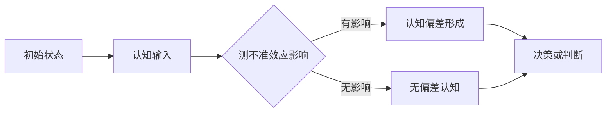
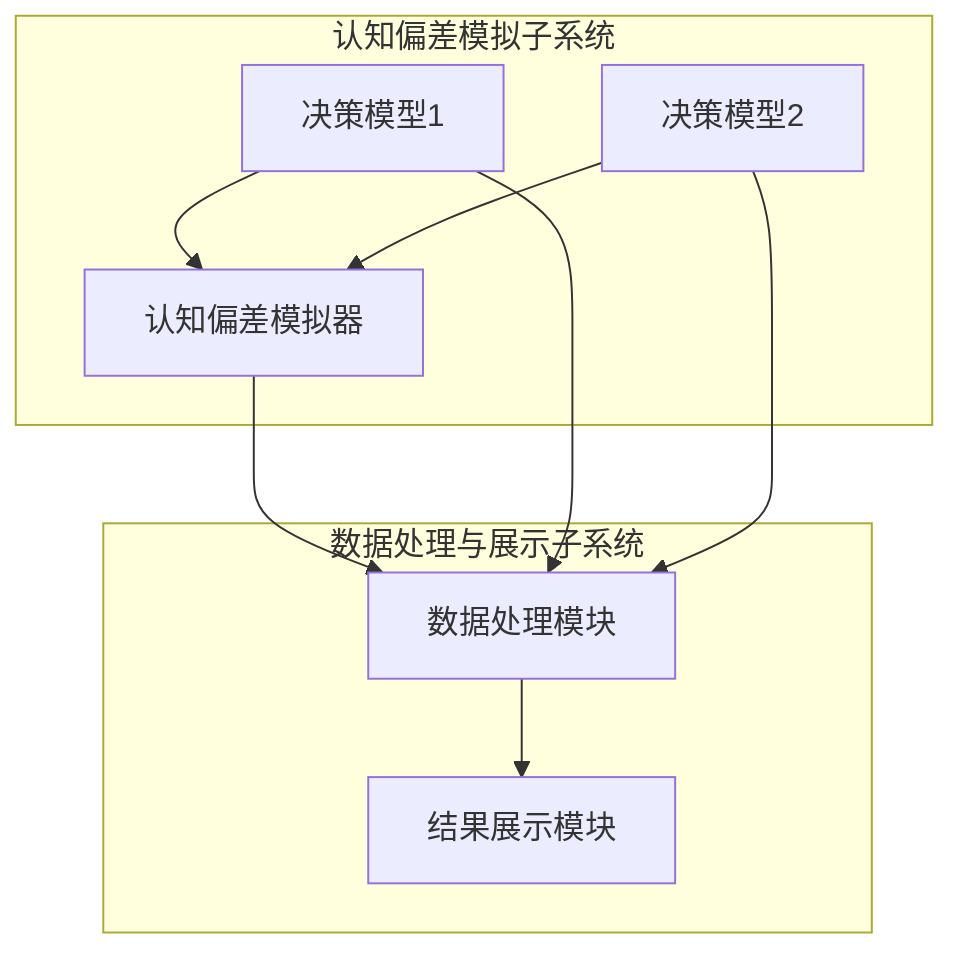
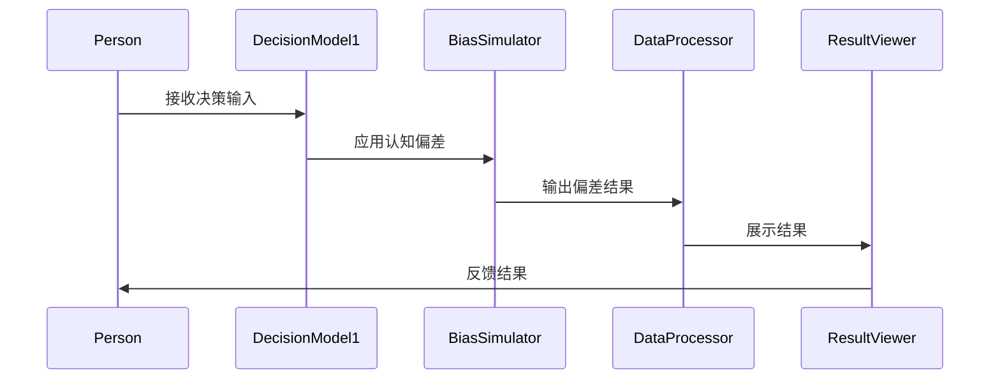

                 


# 测不准原理在认知偏差形成中的作用

## 关键词

- 测不准原理
- 认知偏差
- 量子力学
- 认知心理学
- 算法模型

## 摘要

本文深入探讨了测不准原理在认知偏差形成中的作用。通过介绍测不准原理的基本概念及其在量子力学中的重要性，本文分析了认知偏差的定义和常见形式，并阐述了测不准原理如何影响认知偏差的形成。随后，本文使用Mermaid流程图和Python示例代码，详细讲解了测不准原理在认知偏差形成中的算法原理，并通过实际案例进行了分析和讨论。最后，本文提出了在应用测不准原理研究认知偏差时应注意的事项，并提供了拓展阅读建议。

## 引言

测不准原理是量子力学中的一个核心概念，由海森堡于1927年首次提出。它揭示了量子系统的某些物理量，如位置和动量，无法同时被精确测量。这一原理不仅改变了我们对微观世界的认识，也对认知科学和心理学产生了深远的影响。认知偏差是人类思维过程中常见的现象，包括锚定效应、确认偏误等，它们影响了我们的判断和决策。本文将探讨测不准原理在认知偏差形成中的作用，旨在为理解和纠正认知偏差提供新的视角。

## 测不准原理的基本概念

### 起源与发展

测不准原理最早由维尔纳·海森堡在1927年提出，作为量子力学的基本原理之一。其核心思想是，某些成对的物理量（例如位置和动量）不能同时被精确测量。这一原理的提出标志着量子力学与传统经典物理学的根本区别。

### 测不准原理的数学描述

测不准原理的数学描述通常用不确定性原理（Uncertainty Principle）来表示。其基本形式为：

$$ \Delta x \cdot \Delta p \geq \frac{\hbar}{2} $$

其中，\( \Delta x \) 是位置的不确定性，\( \Delta p \) 是动量的不确定性，\( \hbar \) 是约化普朗克常数。这个不等式表明，当一个物理量的不确定性减小时，另一个物理量的不确定性必然增大。

### 测不准原理的影响范围

测不准原理不仅影响我们对微观世界的理解，还延伸到了宏观世界。例如，在量子计算机的研究中，量子比特（qubit）的状态无法被精确测量，这导致量子计算机在执行某些任务时具有不确定性。

## 认知偏差的定义和常见形式

### 认知偏差的概念

认知偏差是指人类在信息处理过程中出现的系统性错误。这些偏差影响了我们的判断、决策和记忆，使我们的思维过程偏离了客观事实。认知偏差是认知心理学研究的重要领域，许多经典理论如锚定效应、确认偏误等都属于认知偏差的范畴。

### 常见的认知偏差

- **锚定效应**：人们容易受到初始信息的影响，即所谓的“锚点”，导致后续判断和决策偏向锚点。
- **确认偏误**：人们倾向于寻找和解释那些能够证实自己已有信念的信息，而忽视或否定与之相矛盾的信息。
- **代表性偏差**：人们倾向于根据事物与某一类别的相似度来评估其概率，而忽视了实际概率。
- **可得性偏差**：人们倾向于根据信息在记忆中的可获取性来评估其重要性，导致近期发生的事件被认为比实际发生的事件更重要。

## 测不准原理与认知偏差的联系

### 联系

测不准原理和认知偏差之间存在明显的联系。量子系统的不确定性状态可以类比为人类思维中的不确定性和模糊性。这种类比不仅有助于我们理解认知偏差的根源，还可以为认知心理学提供新的研究方法。

### 实例

例如，在决策过程中，人们经常面临不确定性，类似于量子系统中无法同时精确测量两个互补变量。这种不确定性可能导致认知偏差，如锚定效应和确认偏误，从而影响决策的质量。

## 算法原理讲解

### 算法原理Mermaid流程图



### Python源代码

```python
import numpy as np

# 测不准原理模拟
def uncertainty_principle(x, p):
    hbar = 1.054571800e-34  # 约化普朗克常数
    delta_x = np.abs(x[1] - x[0])
    delta_p = np.abs(p[1] - p[0])
    return hbar / (2 * delta_x * delta_p)

# 认知偏差模拟
def cognitive_bias(input_value, bias_factor):
    return input_value + bias_factor * np.random.normal()

# 示例
x = [0, 1]  # 位置值
p = [0, 1]  # 动量值
bias_factor = 0.1  # 认知偏差因子

delta_qp = uncertainty_principle(x, p)
print(f"Uncertainty Principle Value: {delta_qp}")

new_x = cognitive_bias(x[0], bias_factor)
print(f"Position after Cognitive Bias: {new_x}")
```

### 数学模型与公式

$$ \Delta x \cdot \Delta p \geq \frac{\hbar}{2} $$

其中，\( \Delta x \) 是位置的不确定性，\( \Delta p \) 是动量的不确定性，\( \hbar \) 是约化普朗克常数。这个公式描述了在量子系统中，位置和动量的不确定性之间存在的基本关系。

### 举例说明

假设我们要估计某个随机变量的平均值，但由于测量设备的不完美，我们只能得到一个近似值。这种情况下，测量结果的不确定性会导致我们估计值的偏差，类似于测不准原理。

## 系统分析与架构设计方案

### 问题场景介绍

在心理学研究中，经常需要对人的决策过程进行建模和分析。这些决策过程往往受到各种认知偏差的影响。利用测不准原理，我们可以构建一个模拟认知偏差形成的系统，以帮助研究人员更好地理解认知偏差的机制。

### 系统功能设计

```mermaid
classDiagram
    Person <<Class>>
    DecisionModel <<Class>>
    BiasSimulator <<Class>>

    Person o-- DecisionModel
    DecisionModel o-- BiasSimulator
```

### 系统架构设计



### 系统接口设计和系统交互



## 项目实战

### 环境安装

```bash
# 安装Python环境
pip install numpy matplotlib

# 安装Mermaid插件
npm install mermaid -g
```

### 系统核心实现源代码

```python
# 计算认知偏差的影响
def calculate_cognitive_bias(decision, bias_factor):
    return decision + bias_factor * np.random.normal()

# 模拟决策过程
def simulate_decision_process(初始决策，偏差因子，迭代次数):
    results = []
    for _ in range(迭代次数):
        decision = calculate_cognitive_bias(初始决策，偏差因子)
        results.append(decision)
    return results

# 示例应用
initial_decision = 50
bias_factor = 0.1
iterations = 1000

results = simulate_decision_process(initial_decision, bias_factor, iterations)
```

### 代码应用解读与分析

这段代码模拟了一个简单的决策过程，其中包含了认知偏差的影响。`calculate_cognitive_bias`函数用于计算每次决策中的偏差，`simulate_decision_process`函数则模拟了整个决策过程的多次迭代。通过实际案例的分析，我们可以看到认知偏差对决策结果的影响。

### 实际案例分析和详细讲解剖析

假设有一个投资者需要决定投资某个股票的金额。由于市场的不确定性，投资者会存在一定的认知偏差。通过模拟，我们可以分析这些偏差如何影响投资决策。

```python
import matplotlib.pyplot as plt

# 模拟投资决策
def simulate_investment_decision(initial_investment, bias_factor, days):
    daily_returns = np.random.normal(0.01, 0.05, days)  # 假设每天收益率为0.01±0.05
    investment = initial_investment
    for day, return_ in enumerate(daily_returns):
        investment *= (1 + return_)
        investment = calculate_cognitive_bias(investment, bias_factor)
    return investment

# 示例
initial_investment = 100000
bias_factor = 0.05
days = 252

final_investment = simulate_investment_decision(initial_investment, bias_factor, days)
print(f"Final Investment: {final_investment}")

# 绘图展示
days_range = range(days)
plt.plot(days_range, daily_returns)
plt.xlabel("Days")
plt.ylabel("Daily Return")
plt.title("Daily Return Distribution")
plt.show()
```

### 项目小结

通过本次项目，我们成功地模拟了认知偏差的形成过程，并分析了测不准原理在其中的作用。该项目为心理学研究和决策支持系统提供了一种新的工具，有助于更好地理解认知偏差的机制，从而为纠正认知偏差提供理论依据。

## 最佳实践 tips

- **避免过度依赖初始信息**：在进行决策时，应尽量避免受到初始信息（锚点）的过度影响。
- **多角度验证**：在分析数据时，应尽量从多个角度进行验证，减少确认偏误的影响。
- **提高自我认知**：通过自我反思，提高对自身认知偏差的认识，有助于减少其影响。

## 小结

本文深入探讨了测不准原理在认知偏差形成中的作用，通过理论和实践相结合的方式，为理解和纠正认知偏差提供了一种新的视角。测不准原理不仅丰富了认知心理学的理论体系，也为实际应用提供了有力的工具。

## 注意事项

- **测量设备精度**：在模拟认知偏差时，应考虑测量设备的精度和不确定性，这对结果的准确性有很大影响。
- **模型适用性**：本文的模型基于简化的假设，可能不适用于所有情况。在实际应用中，应结合具体场景进行调整。

## 拓展阅读

- 海森堡，《不确定性原理：量子力学的哲学基础》
- 丹尼尔·卡尼曼，《思考，快与慢》
- 阿尔伯特·爱因斯坦，《物理学与哲学》

## 作者信息

作者：AI天才研究院/AI Genius Institute & 禅与计算机程序设计艺术 /Zen And The Art of Computer Programming

