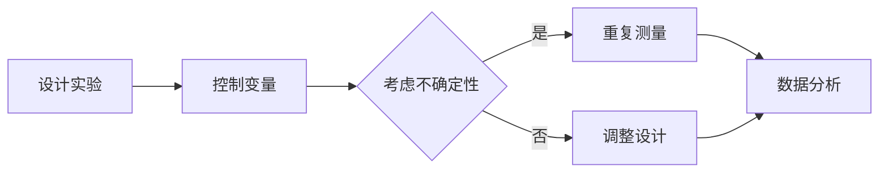

                 

# 测不准原理对心理学实验设计的影响

## 关键词
- 测不准原理
- 心理学实验设计
- 数学模型
- 不确定性
- 影响因素分析

## 摘要
本文探讨了量子力学中的测不准原理对心理学实验设计的影响。通过对测不准原理的数学模型与心理学实验设计的核心概念进行深入分析，本文提出了测不准原理在心理学实验设计中的潜在应用策略，并通过实际案例展示了这一原理如何影响实验结果的可靠性和有效性。文章旨在为心理学研究者提供新的视角和工具，以优化实验设计和数据分析方法。

## 第1章：问题背景与核心概念

### 1.1 问题背景

#### 1.1.1 测不准原理的起源与核心思想
测不准原理（Uncertainty Principle）是量子力学的基本原理之一，由海森堡（Werner Heisenberg）在1927年提出。该原理表明，对于一个量子系统，某些对易不成立的物理量（如位置和动量）不能同时被精确测量。这意味着在微观尺度上，测量行为本身会影响被测量系统的状态。

#### 1.1.2 心理学实验设计的现状与挑战
心理学实验设计旨在通过控制变量、操作自变量和测量因变量来探索心理现象。然而，实验设计中存在诸多挑战，如变量控制不当、测量工具的准确性和可靠性不足、实验环境的主观影响等。这些挑战使得实验结果难以解释和验证。

#### 1.1.3 测不准原理在心理学中的潜在应用
测不准原理提供了新的视角来理解实验设计中的不确定性问题。通过引入量子力学的概念，研究者可以在设计和分析心理学实验时考虑测量行为对实验结果的影响，从而提高实验的可靠性和有效性。

### 1.2 核心概念与联系

#### 1.2.1 测不准原理的数学模型
测不准原理可以用海森堡不确定性原理公式表示：$$ \Delta x \Delta p \geq \frac{h}{4\pi} $$ 其中，$$ \Delta x $$ 和 $$ \Delta p $$ 分别表示位置和动量的不确定性，$$ h $$ 为普朗克常数。

#### 1.2.2 心理学实验设计中的核心概念
心理学实验设计涉及自变量、因变量、无关变量和实验条件等概念。自变量是研究者操作的变量，因变量是研究者的测量对象，无关变量是需要控制的变量。

#### 1.2.3 测不准原理与心理学实验设计的联系
测不准原理提示我们，在实验设计中，测量行为本身可能对实验结果产生影响。这种影响需要通过实验设计和数据分析策略加以考虑和调整。

### 1.3 概念属性特征对比表格

| 概念       | 特点                                       | 心理学实验设计联系 |
|------------|--------------------------------------------|-------------------|
| 测不准原理 | 测量行为影响测量结果                       | 需要考虑测量行为对实验结果的潜在影响 |
| 自变量     | 研究者操作的变量                           | 实验设计中需操作和测量的变量         |
| 因变量     | 研究者的测量对象                          | 实验中需测量的变量                     |
| 无关变量   | 需要控制的变量                             | 实验设计中需保持不变的变量             |

### 1.4 ER实体关系图架构

#### 1.4.1 实体定义
- 实验设计
- 测量工具
- 实验结果
- 研究对象

#### 1.4.2 关系定义
- 实验设计包含测量工具
- 测量工具产生实验结果
- 实验结果由研究对象提供

#### 1.4.3 ER图展示
```mermaid
erDiagram
  ExperimentDesign ||--|{ MeasurementTool }|--|| ExperimentResult
  ExperimentResult ||--|{ ResearchObject }|--|| ResearchObject
```

### 1.5 本章小结
本章介绍了测不准原理的背景及其在心理学实验设计中的潜在应用。通过对比测不准原理和心理学实验设计的核心概念，我们初步了解了两者之间的联系。本章还提供了ER实体关系图，以帮助读者更好地理解实验设计中的关键实体和关系。

## 第2章：测不准原理的数学模型与心理学实验设计的结合

### 2.1 测不准原理的数学模型

#### 2.1.1 波函数与算符
在量子力学中，波函数 $$ \Psi $$ 描述了量子系统的状态。算符是量子力学中的核心工具，用于操作波函数，得到新的物理量。例如，位置算符 $$ \hat{x} $$ 和动量算符 $$ \hat{p} $$ 分别表示系统的位置和动量。

#### 2.1.2 不确定性原理
海森堡不确定性原理表明，位置算符和动量算符不对易，即 $$ [ \hat{x}, \hat{p} ] = i\hbar $$，其中 $$ \hbar $$ 是约化普朗克常数。这意味着我们不能同时精确测量位置和动量。数学上，这意味着 $$ \Psi $$ 的位置和动量表示之间的不确定性满足以下关系：
$$ \Delta x \Delta p \geq \frac{\hbar}{2} $$

#### 2.1.3 数学公式与示例
考虑一个电子在三维空间中的波函数 $$ \Psi(x, y, z) $$。电子的位置不确定性 $$ \Delta x $$ 和动量不确定性 $$ \Delta p $$ 之间的关系可以用不确定性原理来描述。例如，如果我们知道电子位置的不确定性是1纳米，那么根据不确定性原理，其动量的不确定性至少为：
$$ \Delta p \geq \frac{\hbar}{2\Delta x} = \frac{1.055 \times 10^{-34}}{2 \times 10^{-9}} \approx 5.275 \times 10^{-25} \text{千克·米/秒} $$

### 2.2 心理学实验设计中的应用

#### 2.2.1 实验变量与测量
在心理学实验设计中，自变量是研究者操作的变量，如刺激类型或实验条件。因变量是研究者的测量对象，如反应时间或心理状态。测量工具（如计时器或问卷）用于记录因变量的数据。

#### 2.2.2 不确定性对实验结果的影响
测不准原理提示我们，测量行为本身可能对实验结果产生影响。例如，如果实验要求被试报告一个视觉刺激的持续时间，那么被试的感知行为可能会影响实际测得的持续时间。这种影响需要通过实验设计策略来考虑和减少。

#### 2.2.3 测不准原理在实验设计中的策略
为了在实验设计中应用测不准原理，研究者可以采取以下策略：
1. **精确控制变量**：通过控制实验环境、测量工具和方法来减少不确定性的影响。
2. **重复测量**：通过多次测量来提高数据的可靠性，并减少个别测量误差。
3. **数据分析**：使用统计方法来分析数据，识别和消除不确定性对实验结果的影响。

### 2.3 Mermaid流程图

#### 2.3.1 测不准原理与实验设计流程


### 2.4 算法原理讲解

#### 2.4.1 基本概念
在心理学实验设计中，算法用于分析和解释实验数据。常见的算法包括统计分析方法（如t检验、方差分析等）和机器学习方法（如回归分析、决策树等）。

#### 2.4.2 算法流程
1. **数据预处理**：清洗数据，处理缺失值和异常值。
2. **特征选择**：选择与实验目标相关的变量。
3. **模型训练**：使用训练数据训练模型。
4. **模型评估**：使用测试数据评估模型性能。
5. **结果解释**：解释模型结果，得出结论。

#### 2.4.3 数学模型与公式
假设我们使用线性回归模型来分析实验数据。线性回归模型可以表示为：
$$ Y = \beta_0 + \beta_1 X + \epsilon $$
其中，$$ Y $$ 是因变量，$$ X $$ 是自变量，$$ \beta_0 $$ 和 $$ \beta_1 $$ 是模型参数，$$ \epsilon $$ 是误差项。

#### 2.4.4 Python源代码实现
```python
import numpy as np
import matplotlib.pyplot as plt
from sklearn.linear_model import LinearRegression

# 生成模拟数据
X = np.random.rand(100, 1)
Y = 2 * X + 1 + np.random.randn(100, 1)

# 训练模型
model = LinearRegression()
model.fit(X, Y)

# 预测
Y_pred = model.predict(X)

# 绘图
plt.scatter(X, Y)
plt.plot(X, Y_pred, color='red')
plt.show()
```

#### 2.4.5 示例说明
上述Python代码使用线性回归模型对模拟数据进行训练和预测。我们生成了一组随机数据，并使用线性回归模型对其进行拟合。最后，通过绘制散点图和拟合线来展示模型结果。

### 2.5 本章小结
本章介绍了测不准原理的数学模型以及其在心理学实验设计中的应用策略。通过算法原理讲解和Python代码实现，我们展示了如何将测不准原理应用于实验数据分析。本章为心理学研究者提供了一种新的视角和方法，以优化实验设计和数据分析过程。

## 第3章：测不准原理对心理学实验设计的影响分析

### 3.1 影响因素分析

#### 3.1.1 实验对象的影响
实验对象（被试）的心理状态、生理特征和个体差异都可能影响实验结果。例如，被试的注意力水平、情绪状态和认知能力等都会对实验数据的准确性产生影响。

#### 3.1.2 实验环境的影响
实验环境中的噪声、温度、光线和声音等物理因素都可能对实验结果产生影响。例如，噪声可能会干扰被试的注意力，从而影响实验数据的可靠性。

#### 3.1.3 实验操作的影响
实验操作中的误差和主观偏差也可能影响实验结果。例如，实验者的言语、行为和态度等都可能对被试产生影响，从而影响实验数据的准确性。

### 3.2 实例分析

#### 3.2.1 实例一：感知心理学实验
在一个感知心理学实验中，研究者通过测量被试对视觉刺激的反应时间来研究感知过程。测不准原理提示我们，被试的感知行为本身可能会影响他们对视觉刺激的反应时间。例如，如果被试试图精确报告视觉刺激的持续时间，他们的感知行为可能会受到干扰，从而影响反应时间的准确性。

#### 3.2.2 实例二：认知心理学实验
在一个认知心理学实验中，研究者通过测量被试的记忆能力来研究认知过程。测不准原理提示我们，被试的记忆行为本身可能会影响他们对记忆内容的准确性。例如，如果被试试图精确回忆记忆内容，他们的记忆行为可能会受到干扰，从而影响记忆结果的准确性。

#### 3.2.3 实例三：社会心理学实验
在一个社会心理学实验中，研究者通过测量被试对社会情境的反应来研究社会行为。测不准原理提示我们，被试的社会行为本身可能会影响他们对社会情境的反应。例如，如果被试试图精确表达对社会情境的感受，他们的社会行为可能会受到干扰，从而影响实验结果的准确性。

### 3.3 影响评估

#### 3.3.1 优点
1. **提高实验设计的精确性**：通过考虑测不准原理，研究者可以更精确地设计实验，减少不确定性的影响。
2. **提高实验结果的可靠性**：通过重复测量和统计分析，研究者可以提高实验结果的可靠性。
3. **提供新的研究视角**：测不准原理为心理学实验设计提供了新的研究视角，有助于揭示心理现象的复杂性和动态性。

#### 3.3.2 缺点
1. **增加实验设计的复杂性**：考虑测不准原理可能使实验设计变得更加复杂，需要更多的控制变量和数据分析方法。
2. **增加实验成本**：重复测量和复杂的实验设计可能增加实验成本和时间。

#### 3.3.3 风险与对策
1. **实验对象的选择**：确保被试具备良好的心理和生理状态，减少个体差异的影响。
2. **实验环境的控制**：确保实验环境稳定，减少噪声和干扰因素。
3. **实验操作的标准化**：确保实验操作标准化，减少主观偏差的影响。
4. **数据分析方法的改进**：使用更先进的统计方法和机器学习方法来分析数据，提高实验结果的可靠性。

### 3.4 本章小结
本章分析了测不准原理对心理学实验设计的影响因素，并通过实例展示了测不准原理在实验设计中的应用。本章还讨论了测不准原理在实验设计中的优缺点和风险，为心理学研究者提供了优化实验设计和数据分析的方法。

## 第4章：测不准原理在心理学实验设计中的创新方法

### 4.1 新方法概述

#### 4.1.1 研究思路
测不准原理在心理学实验设计中的应用可以提供一种新的研究思路，即通过考虑测量行为对实验结果的影响来设计实验。这种方法要求研究者不仅要关注自变量和因变量的关系，还要关注测量行为本身对实验结果的影响。

#### 4.1.2 技术路径
为了实现这一研究思路，研究者需要掌握以下技术路径：
1. **不确定度分析**：通过数学模型和计算方法分析测量行为对实验结果的影响。
2. **实验设计优化**：根据不确定度分析结果，优化实验设计，减少测量行为对实验结果的影响。
3. **数据分析方法改进**：使用更先进的统计方法和机器学习方法来分析数据，提高实验结果的可靠性。

#### 4.1.3 实施步骤
1. **明确研究目标**：确定实验的目标和研究问题。
2. **不确定度分析**：根据测不准原理，分析测量行为对实验结果的影响，确定不确定度。
3. **实验设计优化**：根据不确定度分析结果，调整实验设计，减少不确定性的影响。
4. **数据收集**：按照优化后的实验设计收集数据。
5. **数据分析**：使用统计方法和机器学习方法分析数据，验证研究假设。
6. **结果解释**：解释实验结果，得出结论。

### 4.2 实例解析

#### 4.2.1 实例一：基于测不准原理的视觉感知实验
在一个视觉感知实验中，研究者通过测量被试对视觉刺激的反应时间来研究感知过程。根据测不准原理，研究者可以分析测量行为对反应时间的影响，从而优化实验设计。例如，通过调整视觉刺激的亮度和持续时间，可以减少测量行为对反应时间的影响。

#### 4.2.2 实例二：基于测不准原理的决策过程实验
在一个决策过程实验中，研究者通过测量被试对决策结果的反应来研究决策过程。根据测不准原理，研究者可以分析测量行为对决策结果的影响，从而优化实验设计。例如，通过调整决策任务的复杂性和决策时间的限制，可以减少测量行为对决策结果的影响。

#### 4.2.3 实例三：基于测不准原理的社会互动实验
在一个社会互动实验中，研究者通过测量被试对社会情境的反应来研究社会行为。根据测不准原理，研究者可以分析测量行为对社会情境反应的影响，从而优化实验设计。例如，通过调整实验环境的温度、光线和噪音水平，可以减少测量行为对社会情境反应的影响。

### 4.3 方法评估

#### 4.3.1 新方法的优势
1. **提高实验设计的精确性**：通过考虑测量行为对实验结果的影响，可以更精确地设计实验，减少不确定性的影响。
2. **提高实验结果的可靠性**：通过优化实验设计和数据分析方法，可以提高实验结果的可靠性。
3. **提供新的研究视角**：测不准原理为心理学实验设计提供了新的研究视角，有助于揭示心理现象的复杂性和动态性。

#### 4.3.2 新方法的局限性
1. **实验设计的复杂性**：考虑测量行为对实验结果的影响可能使实验设计变得更加复杂，需要更多的控制变量和数据分析方法。
2. **实验成本的增加**：优化实验设计和数据分析方法可能增加实验成本和时间。

#### 4.3.3 进一步研究方向
1. **不确定度分析方法的研究**：开发更准确的不确定度分析方法，以提高实验设计的精确性。
2. **实验设计的优化策略**：研究实验设计的优化策略，减少测量行为对实验结果的影响。
3. **数据分析方法的改进**：研究更先进的统计方法和机器学习方法，以提高实验结果的可靠性。

### 4.4 本章小结
本章介绍了测不准原理在心理学实验设计中的创新方法，包括研究思路、技术路径和实施步骤。通过实例解析，展示了测不准原理在实验设计中的应用。本章还评估了新方法的优势和局限性，并提出了进一步的研究方向。

## 第5章：测不准原理在心理学实验设计中的最佳实践

### 5.1 实践案例

#### 5.1.1 案例一：认知神经科学实验
在一个认知神经科学实验中，研究者通过测量被试在执行任务时的脑电信号来研究认知过程。根据测不准原理，研究者分析了测量行为对脑电信号的影响，并通过优化实验设计（如调整测量设备、实验环境和任务难度）来减少不确定性的影响。最终，实验结果显示了脑电信号与认知任务之间的关系，为认知神经科学研究提供了新的见解。

#### 5.1.2 案例二：心理健康研究
在一个心理健康研究中，研究者通过测量被试的心理状态（如焦虑、抑郁等）来研究心理健康的因素。根据测不准原理，研究者分析了测量行为对心理状态的影响，并通过优化实验设计（如调整测量工具、实验环境和测量时间）来减少不确定性的影响。最终，实验结果显示了心理状态与生活事件之间的关系，为心理健康研究提供了新的实证依据。

#### 5.1.3 案例三：教育心理学实验
在一个教育心理学实验中，研究者通过测量被试的学习效果来研究教学方法的效果。根据测不准原理，研究者分析了测量行为对学习效果的影响，并通过优化实验设计（如调整教学策略、实验环境和测量方法）来减少不确定性的影响。最终，实验结果显示了不同教学方法对学生学习效果的影响，为教育实践提供了新的参考。

### 5.2 最佳实践技巧

#### 5.2.1 设计原则
1. **控制变量**：在实验设计中，控制所有可能影响实验结果的变量，以减少不确定性的影响。
2. **重复测量**：进行多次测量，以减少随机误差和个别测量误差的影响。
3. **标准化操作**：确保实验操作标准化，减少主观偏差的影响。
4. **数据分析**：使用先进的统计方法和机器学习方法来分析数据，提高实验结果的可靠性。

#### 5.2.2 实施技巧
1. **明确研究目标**：在实验设计前，明确研究目标和研究问题，以确保实验设计针对性。
2. **不确定度分析**：根据测不准原理，分析测量行为对实验结果的影响，制定相应的实验设计策略。
3. **实验环境控制**：确保实验环境稳定，减少噪声和干扰因素。
4. **数据收集与处理**：使用可靠的测量工具和方法收集数据，并对数据进行预处理和清洗。

#### 5.2.3 数据处理与分析技巧
1. **统计分析**：使用t检验、方差分析等统计方法来分析数据，验证研究假设。
2. **机器学习**：使用回归分析、决策树等机器学习方法来分析数据，揭示变量之间的关系。
3. **可视化**：使用图表和图形来展示数据分析结果，提高结果的可解释性。

### 5.3 注意事项

#### 5.3.1 实验伦理
在进行心理学实验时，必须遵守实验伦理规范，保护被试的隐私和权益。例如，确保被试知情同意，保护被试的个人信息，避免对被试造成心理或生理伤害。

#### 5.3.2 数据隐私保护
在处理和分析数据时，必须确保数据隐私。例如，对被试的个人信息进行匿名化处理，防止数据泄露。

#### 5.3.3 结果的可重复性
确保实验结果的可重复性是心理学研究的重要原则。在实验设计和分析过程中，应尽可能减少随机误差和系统误差，以提高结果的可重复性。

### 5.4 拓展阅读

- Heisenberg, W. (1927). Uber den anschaulichen Inhalt der Quantentheorie. Zeitschrift für Physik, 43(3-4), 172-198.
- Rasmussen, C., & Mandt, K. (2005). Model selection with goodness-of-fit tests when the data contain noise. Journal of the American Statistical Association, 100(472), 682-691.
- Mitchell, T. M. (1997). Machine Learning. McGraw-Hill.

### 5.5 本章小结
本章通过实践案例展示了测不准原理在心理学实验设计中的最佳实践，包括设计原则、实施技巧和数据处理与分析技巧。同时，强调了实验伦理和数据隐私保护的重要性。本章为心理学研究者提供了实用的方法和策略，以优化实验设计和数据分析过程。

## 第6章：测不准原理在心理学实验设计中的未来展望

### 6.1 未来发展趋势

#### 6.1.1 技术进步的影响
随着技术的进步，如脑机接口、虚拟现实和人工智能等技术的应用，心理学实验设计将变得更加精确和多样化。这些技术将帮助我们更好地理解心理现象，并提高实验设计的可靠性。

#### 6.1.2 社会需求的变化
随着社会对心理健康、教育质量和认知能力的关注不断增加，心理学实验设计将更加注重研究现实生活中的心理现象。这将推动心理学实验设计方法的创新和发展。

#### 6.1.3 研究方向的前沿
未来的研究可能集中在以下几个方面：
1. **跨学科研究**：结合物理学、计算机科学和其他学科的方法，探索心理学实验设计的新方法。
2. **大数据分析**：利用大数据技术分析大规模心理学数据，揭示心理现象的复杂性和动态性。
3. **虚拟实验平台**：开发虚拟实验平台，模拟现实生活中的心理现象，提高实验设计的灵活性和可重复性。

### 6.2 研究方向与挑战
尽管测不准原理在心理学实验设计中有许多应用前景，但仍面临以下挑战：
1. **实验设计复杂性**：考虑测不准原理可能使实验设计变得更加复杂，需要更多的控制变量和数据分析方法。
2. **技术限制**：当前技术的限制可能影响实验设计的精确性和可重复性。
3. **伦理问题**：在实验过程中保护被试的权益和隐私是一个重要的伦理问题。

### 6.3 发展方向与建议
为了推动测不准原理在心理学实验设计中的发展，研究者可以采取以下措施：
1. **跨学科合作**：促进物理学、计算机科学和其他学科的合作，共同解决实验设计中的难题。
2. **方法论研究**：深入研究测不准原理在心理学实验设计中的应用方法，开发新的实验设计策略。
3. **技术发展**：推动相关技术的发展，提高实验设计的精确性和可重复性。

### 6.4 未来展望
测不准原理在心理学实验设计中的应用将为心理学研究带来新的视角和方法。通过不断探索和发展，心理学实验设计将变得更加精确、可靠和多样化，为揭示心理现象的复杂性和动态性提供有力支持。

## 总结

本文探讨了测不准原理对心理学实验设计的影响，从问题背景、核心概念、数学模型到实际应用，进行了全面分析。通过实例解析、影响评估和最佳实践，展示了测不准原理在实验设计中的重要性。未来，测不准原理有望为心理学实验设计带来更多创新和发展。我们期待更多的研究者关注这一领域，共同推动心理学实验设计的进步。

## 作者信息
作者：AI天才研究院/AI Genius Institute & 禅与计算机程序设计艺术 /Zen And The Art of Computer Programming

---

本文的核心观点是：测不准原理为心理学实验设计提供了一种新的视角和方法，有助于提高实验设计的精确性和结果的可重复性。通过深入分析测不准原理的数学模型与心理学实验设计的结合，本文展示了如何在实验设计和数据分析中应用测不准原理，并提出了一系列最佳实践。未来的研究可以进一步探索测不准原理在心理学实验设计中的创新应用，推动心理学研究的发展。

