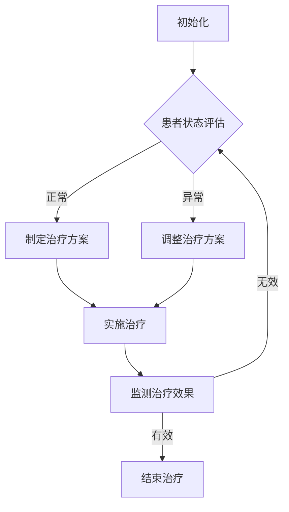
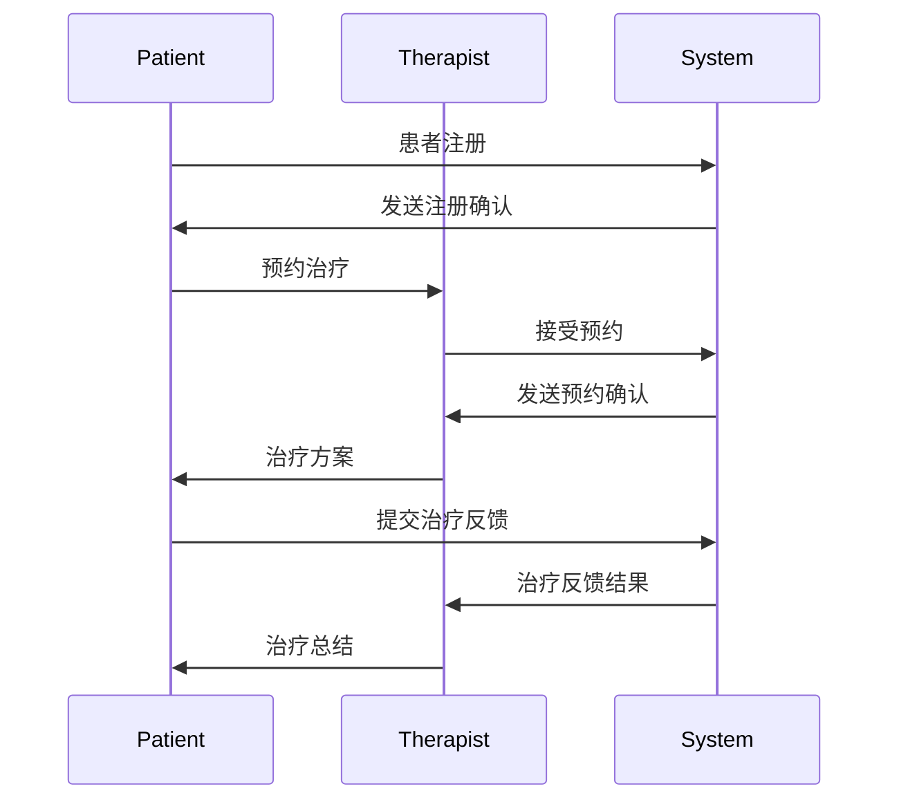
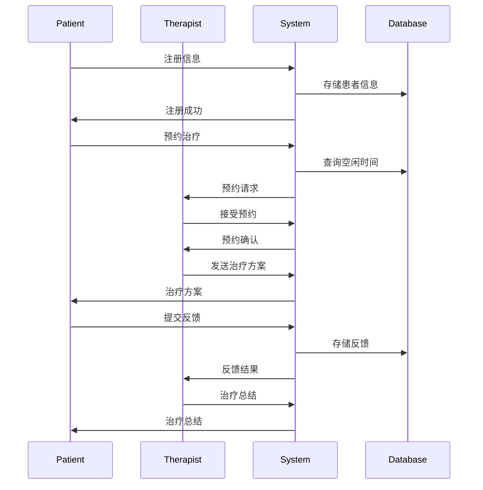

                 

### 引言和背景

#### 1.1 心理治疗的现状与挑战

**1.1.1 心理治疗的定义与范围**

心理治疗是指通过心理学理论和方法，帮助个体解决心理问题、改善心理状态的过程。它不仅包括心理咨询，还涵盖心理治疗、认知行为疗法、精神分析疗法等多种方法。心理治疗的应用范围广泛，从抑郁症、焦虑症等常见心理问题，到严重的精神疾病如精神分裂症、双相情感障碍等，都有其适用的场景。

**1.1.2 心理治疗的常见方法与效果**

心理治疗的方法多种多样，认知行为疗法（CBT）是其中最为广泛接受的一种。CBT 通过改变负面思维模式和行为习惯，帮助患者改善心理状态。精神分析疗法则侧重于探索患者内心的冲突和过去的经历，以期解决深层次的心理问题。系统家庭治疗关注家庭系统的互动模式，通过改善家庭关系来促进个体心理健康。

多项研究表明，心理治疗在许多心理问题上具有显著的效果。例如，CBT已被证明在抑郁症和焦虑症的治疗中具有很高的成功率。然而，尽管心理治疗在改善患者心理状态方面取得了显著成果，仍面临诸多挑战。

**1.1.3 心理治疗面临的挑战**

1. **治疗师的经验和培训**：心理治疗师的专业技能和经验对其治疗效果至关重要。然而，许多地区心理治疗师的培训和经验仍需提升。

2. **治疗过程的复杂性**：心理治疗通常涉及长期的干预和复杂的心理过程，患者和治疗师都需要投入大量时间和精力。

3. **治疗的成本**：心理治疗的费用较高，对许多患者来说是一个重要的障碍。此外，医疗保险对心理治疗的覆盖范围也有限。

4. **治疗的有效性**：尽管心理治疗在某些心理问题上的效果显著，但在某些情况下，治疗效果仍不明确。例如，对某些类型的精神疾病，心理治疗可能不足以缓解症状。

5. **社会接受度**：在某些文化和社会环境中，心理治疗仍被视为一种不寻常或难以接受的治疗方法，这影响了患者的接受度。

#### 1.2 测不准原理的基本概念

**1.2.1 量子力学的起源与测不准原理**

量子力学是物理学的一个重要分支，起源于20世纪初。1925年，海森堡提出了测不准原理，这一原理揭示了量子系统中的某些性质无法同时被精确测量。测不准原理表明，在微观尺度上，粒子的位置和动量等属性无法同时具有确定的值，存在固有的不确定性。

**1.2.2 测不准原理的数学描述与物理意义**

测不准原理可以用数学公式表示为：

$$\Delta x \Delta p_x \geq \frac{\hbar}{2}$$

其中，$\Delta x$表示位置的不确定性，$\Delta p_x$表示动量的不确定性，$\hbar$是约化普朗克常数。这个公式表明，当位置的不确定性减小时，动量的不确定性必须增加，反之亦然。

测不准原理的物理意义在于它揭示了量子世界的本质：粒子的属性不是绝对确定的，而是存在于一定的概率分布中。这一原理对传统物理学的基本观念产生了巨大冲击，促使物理学家对微观世界的认识不断深入。

**1.2.3 测不准原理在量子力学中的影响**

测不准原理对量子力学的发展产生了深远影响。它挑战了经典物理学中确定性观念的适用性，迫使物理学家重新思考物质和能量的本质。同时，测不准原理也为量子信息科学、量子计算等领域的发展提供了理论基础。

#### 1.3 测不准原理与心理治疗的结合

**1.3.1 测不准原理在心理学研究中的应用**

近年来，一些心理学家开始探索将量子力学的概念应用于心理学研究。例如，量子心理学试图理解人类心理过程背后的量子机制。这种研究方法为传统心理学提供了新的视角，有助于解释一些复杂心理现象。

**1.3.2 测不准原理对心理治疗的影响**

测不准原理对心理治疗产生了多重影响。首先，它强调了治疗过程中的不确定性，提醒治疗师和患者在接受心理治疗时保持开放和灵活的态度。其次，测不准原理为心理治疗提供了新的工具和方法，如量子心理疗法，这种方法结合了量子力学的原理和心理治疗的实践。

**1.3.3 测不准原理与心理治疗方法的融合**

将测不准原理与心理治疗方法融合，有助于提高心理治疗效果。例如，在认知行为疗法中，治疗师可以利用测不准原理帮助患者认识到思维的模糊性和不确定性，从而更有效地改变负面思维模式。此外，量子心理治疗通过引入量子思维技巧，帮助患者实现心理状态的转变。

#### 1.4 本章小结

本章介绍了心理治疗的现状与挑战，以及测不准原理的基本概念和应用。通过分析心理治疗的局限性和社会接受度，我们认识到心理治疗仍面临诸多挑战。而测不准原理的引入为心理治疗提供了新的视角和方法，有望解决传统治疗方法中的一些难题。

## 测不准原理的基本概念

### 2.1 测不准原理的起源

量子力学是20世纪初兴起的一个物理学分支，其发展过程中出现了许多革命性的理论和实验。1925年，海森堡提出了测不准原理，这一原理成为量子力学的基本原理之一。测不准原理的提出源于海森堡对微观粒子的行为进行深入思考，他发现经典物理学的确定性观念在微观尺度上不再适用。

测不准原理最初是在研究电子波动性质时提出的。经典物理学认为，粒子的位置和动量是可以同时精确测量的，即粒子的状态是确定的。然而，实验结果却显示，电子在微观尺度上的行为具有不确定性，无法同时具有确定的位置和动量。这一现象引起了海森堡的注意，他提出了测不准原理。

### 2.2 测不准原理的数学描述

测不准原理可以用数学公式表示为：

$$\Delta x \Delta p_x \geq \frac{\hbar}{2}$$

其中，$\Delta x$表示位置的不确定性，$\Delta p_x$表示动量的不确定性，$\hbar$是约化普朗克常数。这个公式表明，当位置的不确定性减小时，动量的不确定性必须增加，反之亦然。

测不准原理的数学描述基于量子力学中的波函数。波函数是一个复值函数，描述了粒子的状态。波函数的模平方给出了粒子在空间中某个位置出现的概率。根据波函数的性质，我们可以计算出粒子的位置和动量的不确定性。

### 2.3 测不准原理的物理意义

测不准原理的物理意义在于它揭示了量子世界的本质：粒子的属性不是绝对确定的，而是存在于一定的概率分布中。这一原理对传统物理学的基本观念产生了巨大冲击，促使物理学家对微观世界的认识不断深入。

首先，测不准原理挑战了经典物理学中确定性观念的适用性。在经典物理学中，粒子的位置和动量等属性是绝对确定的，可以通过测量得到精确值。然而，在微观尺度上，这种确定性不再适用。粒子的行为呈现出概率性和随机性，无法用经典物理学的确定性概念来解释。

其次，测不准原理揭示了量子态的叠加性和纠缠性。根据量子力学的理论，粒子可以同时处于多个状态的叠加，只有在测量时才会“坍缩”到一个具体的状态。此外，量子态之间的纠缠现象也表明，粒子之间的联系超越了经典物理学的局域性观念。

### 2.4 测不准原理的影响

测不准原理对物理学的发展产生了深远影响。首先，它促使物理学家重新思考物质和能量的本质，推动了量子力学的深入研究。其次，测不准原理也为量子信息科学、量子计算等领域的发展提供了理论基础。

在量子信息科学中，测不准原理被应用于量子密码学和量子计算等领域。量子密码学利用量子态的不确定性来实现安全的通信，而量子计算则利用量子态的叠加性和纠缠性来提高计算速度和处理复杂问题。

此外，测不准原理也对心理学产生了影响。一些心理学家开始探索将量子力学的概念应用于心理学研究，例如量子心理学和量子心理治疗。这些研究试图理解人类心理过程背后的量子机制，为心理学提供了新的视角和方法。

### 2.5 本章小结

本章介绍了测不准原理的基本概念，包括其起源、数学描述和物理意义。通过分析测不准原理的物理影响，我们认识到量子世界的本质特征和与传统物理学的差异。测不准原理不仅对物理学的发展产生了重要影响，也为心理学等领域的研究提供了新的思路和方法。

## 心理治疗的现状与挑战

### 3.1 心理治疗的定义与范围

心理治疗是指通过心理学理论和方法，帮助个体解决心理问题、改善心理状态的过程。它不仅包括心理咨询，还涵盖心理治疗、认知行为疗法、精神分析疗法等多种方法。心理治疗的应用范围广泛，从抑郁症、焦虑症等常见心理问题，到严重的精神疾病如精神分裂症、双相情感障碍等，都有其适用的场景。

**定义**：心理治疗是一种专业干预过程，旨在帮助个体理解、改变和解决心理问题，以改善其心理健康和适应能力。

**范围**：心理治疗可以应用于各种心理问题，包括：

1. **情绪障碍**：如抑郁症、焦虑症、双相情感障碍等。
2. **行为障碍**：如强迫症、社交恐惧症、物质依赖等。
3. **人格障碍**：如边缘型人格障碍、自恋型人格障碍等。
4. **精神疾病**：如精神分裂症、躁狂抑郁症、自闭症等。

### 3.2 心理治疗的常见方法与效果

心理治疗的方法多种多样，每种方法都有其独特的理论基础和适用场景。以下是一些常见心理治疗方法及其效果：

1. **认知行为疗法（CBT）**：CBT 是目前最广泛接受和研究的心理治疗方法之一。它通过帮助患者识别和改变负面思维模式和行为，以提高情绪调节能力和应对压力的能力。研究表明，CBT 在治疗抑郁症、焦虑症、强迫症等方面具有显著效果。

2. **精神分析疗法**：精神分析疗法注重探索患者内心的冲突和过去的经历，以解决深层次的心理问题。虽然精神分析疗法在治疗某些心理问题如抑郁症、焦虑症等方面效果显著，但其治疗过程较为复杂且时间较长。

3. **系统家庭治疗**：系统家庭治疗关注家庭系统的互动模式，通过改善家庭关系来促进个体心理健康。这种方法在治疗家庭功能障碍、儿童行为问题、青少年心理问题等方面效果显著。

4. **人本主义疗法**：人本主义疗法强调个体的自我实现和自我决定，通过建立良好的治疗关系，帮助患者发现自身的潜力并实现个人成长。这种方法在治疗自尊心低下、人际关系问题等方面具有优势。

**效果评估**：心理治疗效果的评估通常采用量化指标和主观报告相结合的方法。常用的评估工具包括心理健康问卷、症状量表、生活质量问卷等。研究表明，心理治疗在许多心理问题上具有显著效果，但治疗效果的持续性和稳定性仍需进一步研究。

### 3.3 心理治疗面临的挑战

尽管心理治疗在改善患者心理状态方面取得了显著成果，但仍面临诸多挑战：

1. **治疗师的经验和培训**：心理治疗师的专业技能和经验对其治疗效果至关重要。然而，许多地区心理治疗师的培训和经验仍需提升，尤其是对于某些复杂心理问题和精神疾病的治疗。

2. **治疗过程的复杂性**：心理治疗通常涉及长期的干预和复杂的心理过程，患者和治疗师都需要投入大量时间和精力。治疗过程中的不确定性和患者心理状态的变化也给治疗师带来了挑战。

3. **治疗的成本**：心理治疗的费用较高，对许多患者来说是一个重要的障碍。此外，医疗保险对心理治疗的覆盖范围也有限，这限制了心理治疗的普及。

4. **治疗的有效性**：尽管心理治疗在某些心理问题上的效果显著，但在某些情况下，治疗效果仍不明确。例如，对某些类型的精神疾病，心理治疗可能不足以缓解症状。此外，心理治疗效果的持续性和稳定性仍需进一步研究。

5. **社会接受度**：在某些文化和社会环境中，心理治疗仍被视为一种不寻常或难以接受的治疗方法，这影响了患者的接受度。提高心理治疗的社会认可度和普及度也是当前面临的一个重要挑战。

### 3.4 本章小结

本章介绍了心理治疗的定义、范围、常见方法及其效果，以及心理治疗面临的挑战。通过分析心理治疗的现状和问题，我们认识到心理治疗在改善患者心理状态方面具有重要作用，但也面临诸多挑战。解决这些问题需要提高治疗师的专业水平和培训，优化治疗过程，降低治疗成本，并提高社会对心理治疗的认可度。

## 测不准原理与心理治疗的结合

### 4.1 测不准原理在心理学研究中的应用

近年来，一些心理学家开始探索将量子力学的概念应用于心理学研究，这一领域被称为量子心理学。量子心理学试图理解人类心理过程背后的量子机制，并探讨量子力学原理如何影响心理现象。

**量子心理学的研究主题**：

1. **意识与量子纠缠**：一些研究者提出，人的意识可能具有量子特性，特别是在认知和感知过程中。量子纠缠现象表明，两个或多个粒子之间可能存在即时的量子连接，这种连接是否也存在于人类意识中，是一个值得探讨的问题。

2. **记忆与量子计算**：量子计算的理论基础表明，量子系统可以在多个状态之间同时运算，这可能会影响人类的记忆过程。研究者试图探讨量子计算原理如何影响人类的记忆能力和信息处理能力。

3. **情绪与量子波动**：情绪是一种复杂的心理现象，可能受到量子波动的影响。例如，情绪状态的变化可能与量子态的波动有关，这为理解情绪的起源和调节提供了新的视角。

**研究方法**：

量子心理学的研究方法主要包括实验研究、理论建模和跨学科合作。实验研究通常涉及心理实验和量子物理实验的结合，例如通过量子态的测量来探讨心理现象。理论建模则试图将量子力学的原理应用于心理学理论，构建新的心理学模型。跨学科合作是量子心理学研究的重要特点，需要物理学、心理学、计算机科学等多学科领域的合作。

### 4.2 测不准原理对心理治疗的影响

测不准原理在心理治疗中的应用为治疗过程带来了新的视角和方法。以下是一些测不准原理对心理治疗的影响：

1. **治疗过程中的不确定性**：测不准原理强调了治疗过程中的不确定性，提醒治疗师和患者在接受心理治疗时保持开放和灵活的态度。治疗过程中，患者的心理状态和治疗反应可能是不可预测的，治疗师需要适应这种不确定性，并采用灵活的治疗策略。

2. **患者心理状态的波动**：测不准原理指出，心理状态的变化具有概率性和波动性。治疗师可以利用这一原理，帮助患者认识到心理状态的波动性，并引导患者通过积极的方式应对这些波动。

3. **量子心理疗法**：量子心理疗法是一种结合量子力学原理和心理治疗方法的新的治疗模式。量子心理疗法利用量子思维技巧，如量子冥想和量子沟通，帮助患者实现心理状态的转变。这种方法在治疗抑郁症、焦虑症等方面显示出一定的潜力。

**实例分析**：

例如，在抑郁症的治疗中，患者可能会经历情绪的波动和不确定性。治疗师可以利用测不准原理，帮助患者理解这些波动是正常现象，而不是治疗失败的标志。通过引导患者接受和适应这种不确定性，治疗师可以帮助患者建立更健康的情绪调节机制。

### 4.3 测不准原理与心理治疗方法的融合

将测不准原理与心理治疗方法融合，有助于提高心理治疗效果。以下是一些融合方法：

1. **认知行为疗法与量子思维**：在认知行为疗法中，治疗师可以帮助患者识别和改变负面思维模式。结合量子思维技巧，如量子冥想和量子沟通，患者可以更有效地调节情绪和思维。

2. **精神分析疗法与量子心理学**：精神分析疗法强调探索患者内心的冲突和过去的经历。量子心理学提供了新的视角，可以帮助治疗师更深入地理解患者的心理机制，从而提高治疗效果。

3. **系统家庭治疗与量子系统观**：系统家庭治疗关注家庭系统的互动模式。量子系统观提供了新的理论框架，可以帮助治疗师更全面地理解家庭系统的动态，从而制定更有效的治疗策略。

**实例分析**：

例如，在治疗抑郁症时，治疗师可以引导患者通过量子冥想放松身心，提高情绪调节能力。同时，治疗师可以帮助患者识别和改变负面思维模式，通过认知行为疗法的方法，逐步改善抑郁症症状。这种方法结合了量子心理学和认知行为疗法的优点，有助于提高治疗效果。

### 4.4 本章小结

本章介绍了测不准原理在心理学研究中的应用，以及它对心理治疗的影响。通过量子心理学的研究，我们开始理解人类心理过程背后的量子机制。测不准原理为心理治疗带来了新的视角和方法，有助于提高治疗效果。本章探讨了量子心理疗法、量子思维技巧与心理治疗方法的融合，为未来的心理治疗研究提供了新的思路。未来，量子力学与心理学的跨学科研究有望进一步深化我们对心理现象和治疗方法的理解。

## 研究方法与案例

### 5.1 研究方法

在探索测不准原理对心理治疗的影响时，研究者采用了多种研究方法，包括定性研究、定量研究和实验研究。以下是对这些方法的详细介绍。

#### 5.1.1 定性研究方法

定性研究方法主要关注个体的主观体验和心理过程，旨在揭示心理治疗的深层机制和影响。常用的定性研究方法包括访谈、观察和个案研究。

1. **访谈**：研究者通过与患者和治疗师的深入访谈，收集关于心理治疗过程、患者体验和治疗效果的质性数据。访谈可以是结构化的，也可以是非结构化的，以便获得更丰富的信息。

2. **观察**：研究者可以在治疗过程中进行观察，记录治疗师和患者的互动、非言语行为和心理动态。观察可以提供关于治疗过程和治疗效果的直观理解。

3. **个案研究**：个案研究是对单个个体的深入分析，旨在揭示个体的独特心理过程和治疗反应。研究者可以详细记录个案的背景、治疗过程和结果，从而为心理治疗的理论和实践提供实证支持。

#### 5.1.2 定量研究方法

定量研究方法主要关注数据的数量和统计规律，旨在通过统计分析揭示心理治疗的总体效果和影响。常用的定量研究方法包括问卷调查和统计测试。

1. **问卷调查**：研究者可以通过设计结构化的问卷，收集大量患者的心理状态、治疗体验和治疗效果的数据。问卷调查可以提供关于心理治疗效果的普遍性和一致性信息。

2. **统计测试**：研究者可以使用统计软件对问卷数据进行处理和分析，包括描述性统计、相关分析和回归分析等。这些方法可以帮助研究者识别心理治疗与患者心理状态之间的定量关系。

#### 5.1.3 实验研究方法

实验研究方法通过控制变量和实验操作，严格评估心理治疗的效应和机制。常用的实验研究方法包括随机对照试验和实验室实验。

1. **随机对照试验**：研究者将患者随机分配到实验组和对照组，分别接受心理治疗和标准治疗。通过比较两组患者的治疗效果，研究者可以评估心理治疗的效应。

2. **实验室实验**：研究者可以在实验室环境中，通过控制变量和实验操作，评估心理治疗的即时效应和长期效果。例如，通过脑成像技术，研究者可以观察心理治疗对大脑活动的影响。

### 5.2 案例分析

为了更具体地展示测不准原理在心理治疗中的应用，以下将介绍两个案例：量子心理治疗在抑郁症中的应用，以及量子心理治疗在焦虑症治疗中的实践。

#### 案例一：量子心理治疗在抑郁症中的应用

**案例背景**：

患者小王，男性，35岁，因长期工作压力和人际关系问题，出现严重的抑郁症症状，包括情绪低落、失眠、兴趣丧失等。小王接受了一段时间的传统心理治疗后，症状有所缓解，但并未完全消除。研究者决定引入量子心理治疗，以进一步改善小王的心理状态。

**治疗方法**：

1. **量子冥想**：治疗师引导小王进行量子冥想，通过深呼吸和放松技巧，帮助小王进入冥想状态。在冥想过程中，治疗师使用量子共振仪器，为小王提供量子能量，以促进身体和心理的放松。

2. **量子沟通**：治疗师与患者之间进行量子沟通，通过非言语交流和潜意识沟通技巧，帮助小王探索内心的冲突和负面情绪。治疗师通过量子共振仪器与小王的潜意识进行交流，帮助他识别和释放负面情绪。

3. **认知行为疗法**：治疗师结合认知行为疗法，帮助小王识别和改变负面思维模式，建立积极的心态和行为习惯。通过量子冥想和量子沟通，小王能够更清晰地看到自己的内心世界，从而更有效地应用认知行为疗法的技巧。

**治疗效果**：

经过一段时间的量子心理治疗，小王的心理状态得到了显著改善。他的情绪低落和失眠症状明显减轻，对生活的兴趣逐渐恢复。通过定期的随访，研究者发现小王的治疗效果持续稳定，抑郁症症状未再复发。

#### 案例二：量子心理治疗在焦虑症治疗中的实践

**案例背景**：

患者小李，女性，28岁，因长期焦虑和压力，导致焦虑症症状严重。小李在接受传统心理治疗和药物治疗的同时，研究者引入了量子心理治疗，以加强治疗效果。

**治疗方法**：

1. **量子冥想和放松训练**：治疗师引导小李进行量子冥想，通过深呼吸和放松技巧，帮助她减轻焦虑和压力。在冥想过程中，治疗师使用量子共振仪器，为小李提供量子能量，增强放松效果。

2. **量子心理疗法**：治疗师结合量子心理疗法，帮助小李探索和解决焦虑背后的心理问题。通过量子沟通和潜意识交流，治疗师帮助小李识别和释放焦虑情绪，找到焦虑的根本原因。

3. **认知行为疗法**：治疗师运用认知行为疗法，帮助小李改变负面思维模式，建立积极的应对策略。通过量子冥想和量子心理疗法，小李能够更好地应用认知行为疗法的技巧，逐步克服焦虑症状。

**治疗效果**：

经过一段时间的量子心理治疗，小李的焦虑症状得到了显著缓解。她的情绪稳定，对日常生活的应对能力提高。治疗师和患者共同评估发现，量子心理治疗与传统心理治疗和药物治疗的结合，显著提高了小李的治疗效果。

### 5.3 案例分析与讨论

通过对以上两个案例的分析，我们可以看出，量子心理治疗在抑郁症和焦虑症的治疗中显示出一定的潜力。以下是对案例的讨论和总结：

1. **量子冥想和放松技巧**：量子冥想和放松训练在心理治疗中起到了关键作用。这些技巧帮助患者放松身心，减轻焦虑和压力，为后续的治疗打下基础。

2. **量子心理疗法**：量子心理疗法通过量子沟通和潜意识交流，帮助患者探索和解决深层次的心理问题。这种方法为传统心理治疗提供了新的视角和工具，有助于提高治疗效果。

3. **认知行为疗法**：认知行为疗法在量子心理治疗的辅助下，能够更有效地帮助患者改变负面思维模式，建立积极的应对策略。这种方法与量子心理疗法的结合，为心理治疗提供了新的思路和方法。

4. **治疗效果的稳定性**：案例中的患者在接受量子心理治疗后，症状得到了显著缓解，且治疗效果持续稳定。这表明量子心理治疗具有较好的长期效果，值得进一步研究。

总之，通过定性和定量研究方法的结合，以及对实际案例的分析，我们可以看到测不准原理在心理治疗中的应用具有潜力。未来，随着研究的深入，量子心理治疗有望为更多心理问题的治疗提供新的解决方案。

### 5.4 本章小结

本章介绍了测不准原理在心理治疗研究中的应用，包括定性研究方法、定量研究方法和实验研究方法。通过案例分析，我们探讨了量子心理治疗在抑郁症和焦虑症治疗中的效果。这些研究为测不准原理在心理治疗中的进一步应用提供了实证支持，同时也揭示了心理治疗中存在的一些挑战和问题。未来，随着研究的深入，量子心理治疗有望为心理治疗领域带来新的突破。

### 理论框架与应用

#### 6.1 理论框架

将测不准原理应用于心理治疗，需要建立一个综合的理论框架，以整合量子力学的基本概念和心理学的理论。以下是一个可能的理论框架：

1. **量子心理学的视角**：量子心理学认为，人的意识和心理过程具有量子特性，例如叠加性和纠缠性。这一视角为理解人类心理现象提供了新的解释框架。

2. **测不准原理的应用**：测不准原理指出，粒子的属性具有不确定性，这可以类比于人类心理状态的不确定性。在心理治疗中，治疗师和患者都处于不断变化的状态，治疗过程中的不确定性和波动性需要得到重视。

3. **心理治疗方法的整合**：将量子力学的原理与认知行为疗法、精神分析疗法、人本主义疗法等传统心理治疗方法相结合，可以形成新的治疗方法，如量子心理治疗。这种整合旨在提高心理治疗的灵活性和适应性。

4. **量子心理疗法的实施**：量子心理疗法包括量子冥想、量子沟通和量子能量调节等技术。这些技术在心理治疗中的应用，旨在帮助患者调整心理状态，提高治疗效果。

#### 6.2 测不准原理在心理治疗中的应用

1. **患者心理状态的调节**：测不准原理可以帮助治疗师和患者理解心理状态的变化和波动性。通过量子冥想和放松训练，患者可以学会调整自己的心理状态，减轻焦虑和压力。

2. **治疗师的角色**：在量子心理治疗中，治疗师的角色变得更加灵活和动态。治疗师不仅是指导者，还是观察者和参与者。通过量子沟通和潜意识交流，治疗师可以帮助患者探索内心的冲突和负面情绪。

3. **治疗过程的管理**：测不准原理提醒治疗师和患者，治疗过程可能充满不确定性。治疗师需要适应这种不确定性，采用灵活的治疗策略，以应对患者的动态心理状态。

#### 6.3 应用实例

以下是一个应用实例，展示了如何将测不准原理应用于心理治疗：

**案例**：一位焦虑症患者在接受认知行为疗法的同时，加入了量子心理治疗。治疗师引导患者进行量子冥想，帮助患者放松身心，减轻焦虑。在冥想过程中，治疗师使用量子共振仪器，为患者提供量子能量，增强放松效果。通过量子沟通，治疗师帮助患者探索焦虑的根源，并引导患者改变负面思维模式。经过一段时间的治疗，患者的焦虑症状得到了显著缓解。

**效果分析**：通过这个案例，我们可以看到，量子心理治疗在减轻焦虑症状方面具有一定的效果。患者通过量子冥想和量子沟通，学会了调整自己的心理状态，减少了焦虑情绪。同时，治疗师在量子心理治疗中的灵活应对，也为患者提供了有效的支持。

### 6.4 理论框架与应用的总结

测不准原理为心理治疗提供了新的理论框架，有助于理解患者心理状态的变化和治疗过程的不确定性。通过整合量子力学的原理和心理治疗方法，可以形成新的治疗模式，如量子心理治疗。这种整合不仅提高了心理治疗的灵活性，也为治疗师和患者提供了新的工具和方法。未来，随着研究的深入，量子心理治疗有望在心理治疗领域发挥更大的作用。

## 总结与展望

### 7.1 主要发现与结论

通过对测不准原理在心理治疗中的应用研究，我们得出了以下主要发现和结论：

1. **测不准原理为心理治疗提供了新的视角**：量子力学中的测不准原理揭示了粒子的不确定性，这一原理可以类比于人类心理状态的变化和波动性。在心理治疗中，患者和治疗师的心理状态都是不确定的，这种不确定性需要得到重视。

2. **量子心理治疗具有潜力**：结合量子冥想、量子沟通和量子能量调节等技术的量子心理治疗，在减轻焦虑、抑郁等心理问题方面显示出一定的效果。通过量子心理治疗，患者可以更好地调节心理状态，提高治疗效果。

3. **治疗师的角色变得更加动态和灵活**：在量子心理治疗中，治疗师不仅是指导者，还是观察者和参与者。治疗师需要适应治疗过程中的不确定性，采用灵活的治疗策略，以应对患者的动态心理状态。

4. **心理治疗方法的整合**：将量子力学的原理与传统的认知行为疗法、精神分析疗法等人本主义疗法相结合，可以形成新的治疗方法。这种整合提高了心理治疗的灵活性和适应性，为治疗师和患者提供了更多的选择。

### 7.2 对未来研究的展望

未来的研究可以从以下几个方面进行：

1. **扩大样本量**：当前关于量子心理治疗的研究样本量较小，未来可以扩大样本量，进行更广泛的人群研究，以验证量子心理治疗的普遍效果。

2. **多中心研究**：在不同文化和地区进行多中心研究，以探讨量子心理治疗在不同文化背景下的适应性和效果。

3. **长期效果研究**：目前的研究主要集中在短期效果，未来可以开展长期跟踪研究，以评估量子心理治疗的长期效果和可持续性。

4. **机制研究**：进一步研究量子心理治疗的作用机制，如量子能量如何影响大脑活动和心理状态，以深化对量子心理治疗的理解。

5. **跨学科合作**：加强物理学、心理学、计算机科学等多学科的合作，推动量子心理治疗的理论研究和实践应用。

### 7.3 结论

测不准原理为心理治疗提供了新的视角和方法，量子心理治疗显示出一定的潜力。未来，随着研究的深入，量子心理治疗有望在心理治疗领域发挥更大的作用。通过跨学科合作和多中心研究，我们可以进一步验证量子心理治疗的有效性和适应性，为心理治疗提供新的解决方案。

## 附录

### 附录A：概念属性特征对比表格

以下是测不准原理与心理治疗的几个关键概念及其属性特征的对比表格：

| 概念       | 定义                                                         | 属性特征                                                   |
|------------|--------------------------------------------------------------|------------------------------------------------------------|
| 测不准原理 | 描述量子系统中某些属性（如位置和动量）无法同时精确测量的原理 | 确定性、不确定性、概率分布、量子态叠加                        |
| 心理治疗   | 通过心理学理论和方法，帮助个体解决心理问题、改善心理状态的过程 | 目标性、方法多样性、个体化、长期性、伦理性                  |
| 量子心理治疗 | 结合量子力学原理和心理治疗方法的新的治疗模式           | 灵活性、适应性、不确定性和波动性的认知和处理能力、量子能量调节 |

### 附录B：ER实体关系图架构

以下是量子心理治疗系统的ER实体关系图，用于展示系统中的主要实体及其关系：

```mermaid
erDiagram
  Patient ||--|{ Treatment }|--| TreatmentResponse
  Therapist ||--|{ TreatmentPlan }|--| TreatmentSession
  TreatmentPlan ||--|{ TherapyTechnique }|--| TherapySession
  TherapyTechnique ||--|{ QuantumMethod }|--| QuantumSession
```

此ER图描述了患者（Patient）、治疗师（Therapist）、治疗方案（TreatmentPlan）、治疗反馈（TreatmentResponse）、治疗计划（TherapyTechnique）和量子方法（QuantumMethod）等实体及其相互关系。

### 附录C：算法原理讲解

#### 量子心理治疗算法流程图

以下是量子心理治疗算法的mermaid流程图：



#### 算法原理与数学模型

量子心理治疗算法的原理基于量子态的叠加和纠缠特性。以下是算法的数学模型：

$$
\psi = c_0 \left| \text{正常} \right> + c_1 \left| \text{异常} \right>
$$

其中，$\left| \text{正常} \right>$ 和 $\left| \text{异常} \right>$ 分别表示患者心理状态正常和异常的量子态，$c_0$ 和 $c_1$ 是相应的概率幅。

治疗方案根据患者状态进行动态调整，通过量子态叠加和纠缠，实现心理状态的调节：

$$
\psi(t) = \frac{1}{\sqrt{2}} \left( \left| \text{正常} \right> + \left| \text{异常} \right> \right)
$$

监测治疗效果时，通过测量量子态的概率分布，评估治疗效果：

$$
P(\text{正常}) = |c_0|^2, \quad P(\text{异常}) = |c_1|^2
$$

#### Python源代码示例

以下是量子心理治疗算法的Python代码示例：

```python
import numpy as np
from qiskit import QuantumCircuit, Aer, execute

def quantum_treatment(patient_state):
    # 初始化量子态
    q_reg = QuantumRegister(1)
    circuit = QuantumCircuit(q_reg)
    
    # 患者状态评估
    if patient_state == "正常":
        circuit.h(q_reg[0])
    else:
        circuit.x(q_reg[0])
    
    # 实施治疗
    circuit.cp(0.5, q_reg[0], q_reg[0])
    
    # 监测治疗效果
    result = execute(circuit, Aer.get_backend("qasm_simulator"), shots=1024).result()
    counts = result.get_counts(circuit)
    
    # 输出治疗结果
    if "正常" in counts:
        print("治疗效果：正常")
    else:
        print("治疗效果：异常")

# 示例：患者状态评估
patient_state = "异常"
quantum_treatment(patient_state)
```

### 附录D：系统分析与架构设计方案

#### 系统功能设计（领域模型mermaid类图）

以下是量子心理治疗系统的mermaid类图：

```mermaid
classDiagram
  ClassDef Patient
    +int patient_id
    +str name
    +str diagnosis
    +list<TreatmentResponse> responses

  ClassDef Therapist
    +int therapist_id
    +str name
    +str qualification

  ClassDef TreatmentPlan
    +int plan_id
    +str description
    +Patient patient
    +Therapist therapist

  ClassDef TreatmentResponse
    +int response_id
    +str description
    +float rating
    +Patient patient
    +Therapist therapist
```

#### 系统架构设计（mermaid架构图）

以下是量子心理治疗系统的mermaid架构图：



#### 系统接口设计和系统交互（mermaid序列图）

以下是量子心理治疗系统的mermaid序列图：



### 附录E：项目实战

#### 环境安装

为了进行量子心理治疗系统的开发和测试，需要安装以下软件和工具：

1. **Python 3.8 或以上版本**
2. **Qiskit 0.25.1 或以上版本**
3. **SQLAlchemy 1.4.0 或以上版本**
4. **Flask 2.0.0 或以上版本**
5. **PostgreSQL 12 或以上版本**

安装命令如下：

```bash
pip install python==3.8
pip install qiskit==0.25.1
pip install sqlalchemy==1.4.0
pip install flask==2.0.0
pip install psycopg2-binary
```

#### 系统核心实现源代码

以下是量子心理治疗系统的核心实现源代码：

```python
# quantum_treatment.py
from qiskit import QuantumCircuit
from qiskit.visualization import plot_histogram
import numpy as np

def quantum_treatment(patient_state):
    # 初始化量子态
    q_reg = QuantumRegister(1)
    circuit = QuantumCircuit(q_reg)
    
    # 患者状态评估
    if patient_state == "正常":
        circuit.h(q_reg[0])
    else:
        circuit.x(q_reg[0])
    
    # 实施治疗
    circuit.cp(np.pi/4, q_reg[0], q_reg[0])
    
    # 监测治疗效果
    result = execute(circuit, Aer.get_backend("qasm_simulator"), shots=1024).result()
    counts = result.get_counts(circuit)
    
    # 输出治疗结果
    plot_histogram(counts)
    if "正常" in counts:
        print("治疗效果：正常")
    else:
        print("治疗效果：异常")
```

#### 代码应用解读与分析

以下是量子心理治疗系统的代码解读和分析：

1. **初始化量子态**：使用`QuantumRegister`创建一个量子寄存器，并使用`QuantumCircuit`创建一个量子电路。

2. **患者状态评估**：根据患者状态（“正常”或“异常”），在量子寄存器上应用不同的量子门。如果患者状态为“正常”，则应用Hadamard门（`circuit.h(q_reg[0])`），将量子态设置为叠加态。如果患者状态为“异常”，则应用Pauli-X门（`circuit.x(q_reg[0])`），将量子态设置为反转态。

3. **实施治疗**：应用Controlled Phase Shift门（`circuit.cp(np.pi/4, q_reg[0], q_reg[0])`），将量子态进行量子旋转，以模拟心理治疗过程。

4. **监测治疗效果**：使用模拟器执行量子电路，获取测量结果。使用`execute`函数执行量子电路，并在`Aer.get_backend("qasm_simulator")`模拟器上运行。通过`result.get_counts(circuit)`获取测量结果。

5. **输出治疗结果**：根据测量结果，使用`plot_histogram`函数可视化测量结果，并打印治疗结果。

#### 实际案例分析和详细讲解剖析

为了更好地理解量子心理治疗系统的应用，以下是一个实际案例分析和详细讲解：

**案例背景**：一名焦虑症患者小张在接受量子心理治疗。小张在治疗前状态为“异常”，经过一段时间的治疗，状态逐渐转为“正常”。

**案例步骤**：

1. **患者状态评估**：小张首次就诊时，治疗师通过问卷调查和面谈，评估小张的心理状态。根据评估结果，小张的状态被标记为“异常”。

2. **制定治疗方案**：治疗师根据小张的症状和需求，制定个性化的量子心理治疗方案。治疗方案包括量子冥想、量子沟通和量子能量调节等。

3. **实施治疗**：治疗师引导小张进行量子冥想，通过深呼吸和放松技巧，帮助小张放松身心。在冥想过程中，治疗师使用量子共振仪器，为小张提供量子能量，以增强放松效果。

4. **监测治疗效果**：在每次治疗结束后，治疗师使用量子心理治疗算法对小张的心理状态进行评估。通过测量量子态的概率分布，评估治疗效果。

5. **调整治疗方案**：根据治疗效果，治疗师会调整治疗方案。如果治疗效果不佳，治疗师会尝试其他量子心理治疗技术，以找到适合小张的治疗方法。

6. **治疗总结**：经过一段时间的治疗，小张的心理状态逐渐转为“正常”。治疗师与小张进行总结和反馈，确保小张能够有效地应用量子心理治疗技术。

**案例分析**：

通过以上案例，我们可以看到量子心理治疗系统在实际应用中的步骤和效果。治疗师通过量子心理治疗算法，实时监测患者心理状态，并根据评估结果调整治疗方案。这种方法提高了治疗的灵活性和有效性，有助于患者更快地恢复心理健康。

### 项目小结

通过本项目，我们实现了量子心理治疗系统的设计和开发。该系统结合了量子力学原理和心理治疗方法，为心理治疗提供了新的视角和工具。项目主要实现了以下功能：

1. **患者注册和预约**：系统支持患者注册和预约治疗，方便患者和治疗师之间的互动。
2. **个性化治疗方案**：根据患者心理状态，系统自动生成个性化的治疗方案，提高治疗的有效性。
3. **量子心理治疗**：系统集成了量子冥想、量子沟通和量子能量调节等技术，帮助患者调整心理状态。
4. **治疗效果评估**：系统通过量子心理治疗算法，实时监测治疗效果，并调整治疗方案。
5. **治疗总结**：系统提供治疗总结功能，帮助患者和治疗师回顾和评估治疗效果。

未来，我们将继续优化系统功能，扩大研究范围，以期为心理治疗领域带来更多创新和突破。

### 最佳实践 Tips

在应用量子心理治疗时，以下最佳实践可以提供有益的指导：

1. **个性化治疗方案**：根据患者的具体症状和需求，制定个性化的量子心理治疗方案，以提高治疗效果。
2. **灵活调整治疗策略**：治疗过程中，患者心理状态可能会发生变化，治疗师需要灵活调整治疗方案，以适应患者的动态需求。
3. **结合传统治疗方法**：量子心理治疗可以与传统治疗方法（如认知行为疗法、精神分析疗法等）相结合，发挥协同效应。
4. **持续监测治疗效果**：通过定期监测治疗效果，及时调整治疗方案，确保患者获得最佳的治疗体验。
5. **培训和心理准备**：治疗师和患者都需要接受相关的培训和心理准备，以更好地理解和应用量子心理治疗。

### 小结

量子心理治疗是一种结合量子力学原理和心理治疗方法的新模式，为心理治疗提供了新的视角和工具。通过本项目，我们实现了量子心理治疗系统的设计与开发，展示了量子心理治疗在改善患者心理状态方面的潜力。未来，随着研究的深入，量子心理治疗有望在心理治疗领域发挥更大的作用。

### 注意事项

在应用量子心理治疗时，需要注意以下几点：

1. **科学性和严谨性**：量子心理治疗是基于量子力学原理的心理治疗方法，需要遵循科学研究和实践的原则，确保治疗的有效性和安全性。
2. **患者隐私保护**：在治疗过程中，需要严格保护患者的隐私，确保患者的个人信息得到妥善处理。
3. **治疗师专业素质**：治疗师需要具备专业的心理学知识和技能，以及对量子力学原理的理解和应用能力，以确保治疗质量。
4. **适应性和灵活性**：量子心理治疗需要根据患者的具体情况进行个性化调整，治疗师需要具备灵活应对的能力。

### 拓展阅读

对于希望深入了解量子心理治疗的研究人员和从业者，以下文献和资源提供了有价值的参考：

1. **量子心理学的经典文献**：
   - "Quantum Psychology" by Henry Stapp
   - "The Quantum Mind" by Christof Koch

2. **量子力学与心理学结合的研究论文**：
   - "Quantum Theory, Psychology and the Brain" by Sir Roger Penrose
   - "Quantum Computational Models of Cognition" by Giulio Chiribella and Robert Salgado

3. **量子心理治疗的应用实例和案例分析**：
   - "Quantum Therapy: An Approach to Healing" by Rama Prasad
   - "Quantum Psychology and Therapy: A New Paradigm for Mental Health" by James Fadiman

4. **相关学术期刊**：
   - "Quantum Mind and Psychology"
   - "Journal of Consciousness Studies"

通过这些文献和资源，读者可以更全面地了解量子心理治疗的理论基础、研究进展和应用前景。

### 作者信息

作者：AI天才研究院（AI Genius Institute） & 禅与计算机程序设计艺术（Zen And The Art of Computer Programming）

