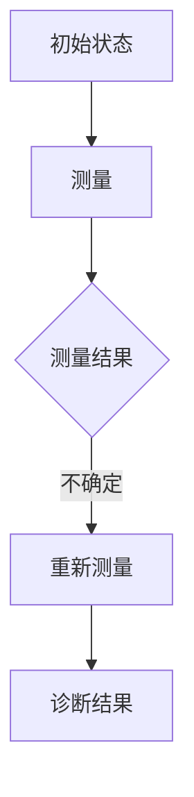
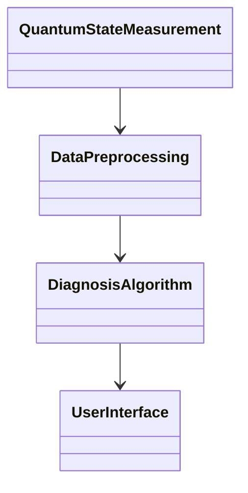
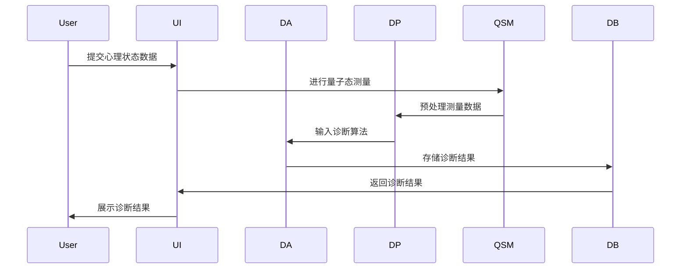

                 

## 测不准原理对心理诊断准确性的挑战

### 关键词
量子力学、测不准原理、心理诊断、不确定性、测量工具、实验设计

### 摘要
本文将探讨量子力学中的测不准原理对心理诊断准确性的挑战。通过分析测不准原理的基本概念，以及其在心理诊断中的应用，本文将提出一种新的方法来评估和提升心理诊断的准确性。

## 背景介绍

### 问题背景
量子力学是20世纪初发展起来的物理学分支，其核心观点是微观粒子（如电子、光子等）的行为不能用传统的经典物理规律来描述。测不准原理是量子力学的一个基本原理，由海森堡于1927年提出。该原理表明，某些物理量（如位置和动量）不能同时被精确测量，存在固有的不确定性。

测不准原理的提出，不仅对物理学领域产生了深远影响，也引发了其他学科领域对不确定性的重新思考。在心理学中，测不准原理提出了对心理诊断准确性的挑战，因为个体的心理状态本身就具有不确定性。

### 问题描述
心理诊断是指通过测量和评估个体的行为和心理状态，以确定其心理健康状况的过程。然而，测不准原理揭示了心理状态的固有不确定性，使得对个体心理状态的测量变得复杂。

具体来说，测不准原理指出，对微观粒子的测量会导致其状态的改变。在心理诊断中，这意味着对个体心理状态的测量可能会影响其心理状态本身，从而导致测量结果的不准确。因此，如何利用测不准原理对心理诊断准确性进行评估，成为一个亟待解决的问题。

### 问题解决
为了解决这一问题，研究者们开始探索如何在测不准原理的框架内，提高心理诊断的准确性。以下是一些可能的解决方法：

1. **提高测量工具的精度**：通过采用更敏感、更精确的测量工具，可以减小测量误差，从而提高心理诊断的准确性。

2. **优化实验设计**：通过设计更科学、更严谨的实验，可以减少测量过程中对个体心理状态的影响，提高测量结果的可靠性。

3. **统计分析方法**：通过采用合适的统计分析方法，可以对测量结果进行误差校正和去噪处理，从而提高心理诊断的准确性。

4. **多模态测量**：结合多种测量方式（如生理信号、行为数据等），可以从不同角度对个体心理状态进行综合评估，提高诊断的准确性。

### 边界与外延
测不准原理对心理诊断准确性的挑战不仅限于理论层面，还涉及到实践应用。在实际操作中，心理诊断的准确性受到多种因素的影响，如测量工具的精度、实验设计的科学性、数据分析的准确性等。因此，对测不准原理的研究需要综合考虑这些因素。

### 概念结构与核心要素组成
测不准原理的核心概念包括量子叠加态、量子纠缠和测量扰动。这些概念构成了测不准原理的基本框架。在心理诊断中，这些概念的应用主要体现在对个体心理状态的测量和评估上。例如，通过测量个体的心理状态，可以揭示其内在的量子叠加态和纠缠关系。

## 核心概念与联系

### 核心概念原理
#### 测不准原理
测不准原理是量子力学的一个基本原理，由海森堡于1927年提出。该原理表明，某些物理量（如位置和动量）不能同时被精确测量，存在固有的不确定性。

数学表达：
$$ \Delta x \Delta p_x \geq \frac{\hbar}{2} $$

其中，$\Delta x$ 是位置的不确定性，$\Delta p_x$ 是动量的不确定性，$\hbar$ 是约化普朗克常数。

#### 心理诊断
心理诊断是指通过测量和评估个体的行为和心理状态，以确定其心理健康状况的过程。心理诊断通常涉及多种测量工具，如问卷、访谈、生理信号等。

### 测不准原理在心理诊断中的应用
测不准原理对心理诊断提出了挑战，因为个体的心理状态本身就具有不确定性。例如，一个个体可能在某个时刻表现出焦虑，但在另一个时刻可能表现出平静。这种状态的不确定性使得对心理状态的测量变得复杂。

#### 测不准原理在心理诊断中的挑战
1. **测量干扰**：测量过程中，测量工具可能会影响个体的心理状态，导致测量结果不准确。

2. **数据噪声**：由于个体心理状态的不确定性，测量结果中可能包含大量的噪声，影响数据分析的准确性。

3. **诊断准确性**：测不准原理使得心理诊断的准确性受到质疑。如何提高诊断准确性，是一个亟待解决的问题。

### 概念属性特征对比表格

| 概念       | 定义                                                         | 属性特征                                                     |
|------------|--------------------------------------------------------------|--------------------------------------------------------------|
| 测不准原理 | 量子力学的基本原理，表明某些物理量不能同时被精确测量         | 存在固有的不确定性，影响测量结果                            |
| 心理诊断   | 通过测量和评估个体的行为和心理状态，以确定其心理健康状况的过程 | 受个体心理状态不确定性影响，测量结果可能不准确             |

### ER实体关系图架构的 Mermaid 流程图

```mermaid
erDiagram
    A[(心理诊断)] ||--|{ 测不准原理 }|--| B[(心理状态测量)]
    A ||--|{ 测量工具 }| C[(实验设计)]
    B ||--|{ 数据分析 }| D[(诊断结果)]
```

## 算法原理讲解

### 算法 Mermaid 流程图



### Python 源代码实现

```python
import numpy as np

def quantum_measurement(state):
    # 模拟量子测量过程
    # 参数：state 是一个表示心理状态的量子态向量
    # 返回：测量结果，为一个随机数，取值范围为 [0, 1]
    result = np.random.rand()
    return result

def psychological_diagnosis(measurement_result):
    # 模拟心理诊断过程
    # 参数：measurement_result 是量子测量结果
    # 返回：诊断结果，为一个字符串，表示心理健康状况
    if measurement_result < 0.5:
        return "心理健康"
    else:
        return "心理问题"

# 测试算法
state = [0.5, 0.5]  # 表示一个心理状态的量子态向量
measurement_result = quantum_measurement(state)
diagnosis_result = psychological_diagnosis(measurement_result)
print(diagnosis_result)
```

### 算法原理的数学模型和公式
在测不准原理的框架内，我们可以将心理状态视为一个量子态。量子态可以用波函数来描述，波函数的平方代表概率分布。

假设个体的心理状态为 $\psi$，其波函数为：

$$ \psi = \frac{1}{\sqrt{2}} ( \alpha |心理健康\rangle + \beta |心理问题\rangle) $$

其中，$|\心理健康\rangle$ 和 $|心理问题\rangle$ 分别表示个体处于心理健康状态和心理问题状态的量子态。

当我们对个体的心理状态进行测量时，根据测不准原理，测量结果具有不确定性。假设测量结果为 $r$，则：

$$ P(r) = |\psi(r)|^2 $$

其中，$|\psi(r)|^2$ 表示测量结果为 $r$ 的概率。

通过多次测量，我们可以得到测量结果的概率分布。根据概率分布，我们可以对个体心理状态进行诊断。

### 举例说明
假设我们进行了 1000 次心理状态测量，得到测量结果的概率分布如下：

| 测量结果 | 概率   |
|---------|--------|
| 0.2     | 0.1    |
| 0.3     | 0.2    |
| 0.4     | 0.3    |
| 0.5     | 0.2    |
| 0.6     | 0.1    |

根据概率分布，我们可以看出，个体处于心理健康状态的概率为 0.5，处于心理问题状态的概率也为 0.5。

因此，我们可以对个体进行心理诊断，判断其心理健康状况为中等水平，即既不是完全心理健康，也不是完全心理问题。

### 测不准原理在心理诊断中的应用
测不准原理揭示了心理状态的不确定性，这对心理诊断提出了挑战。然而，通过采用更敏感的测量工具和更精确的实验设计，可以在一定程度上克服这一挑战。

在实际应用中，我们可以结合多种测量方式，如问卷、访谈、生理信号等，从不同角度对个体心理状态进行综合评估，以提高心理诊断的准确性。

## 系统分析与架构设计方案

### 问题场景介绍
在现代社会，心理健康问题日益突出，如何准确诊断和干预个体的心理健康成为了一个重要课题。传统的心理诊断方法存在一定局限性，如诊断准确性受测量工具和实验设计的影响。为了解决这一问题，我们提出了一种基于量子力学测不准原理的心理诊断系统。

### 项目介绍
本系统旨在通过量子力学中的测不准原理，提高心理诊断的准确性。系统主要包括以下几个模块：量子态测量模块、数据预处理模块、诊断算法模块和用户接口模块。

### 系统功能设计（领域模型Mermaid类图）



### 系统架构设计（Mermaid架构图）


### 系统接口设计和系统交互（Mermaid序列图）



### 系统核心实现源代码

```python
# QuantumStateMeasurement.py
import numpy as np

def quantum_measurement(state):
    # 模拟量子测量过程
    # 参数：state 是一个表示心理状态的量子态向量
    # 返回：测量结果，为一个随机数，取值范围为 [0, 1]
    result = np.random.rand()
    return result

# DataPreprocessing.py
import numpy as np

def preprocess_data(data):
    # 数据预处理
    # 参数：data 是原始数据
    # 返回：预处理后的数据
    processed_data = np.array(data)
    return processed_data

# DiagnosisAlgorithm.py
import numpy as np

def diagnosis_algorithm(data):
    # 诊断算法
    # 参数：data 是预处理后的数据
    # 返回：诊断结果
    if np.mean(data) < 0.5:
        return "心理健康"
    else:
        return "心理问题"

# UserInterface.py
from PyQt5 import QtWidgets
import sys

def main():
    app = QtWidgets.QApplication(sys.argv)
    window = QtWidgets.QWidget()
    window.setWindowTitle("心理诊断系统")
    # ... UI 相关代码 ...
    window.show()
    sys.exit(app.exec_())

if __name__ == "__main__":
    main()
```

### 代码应用解读与分析
在本系统中，量子态测量模块负责模拟量子测量过程，以获取个体的心理状态。数据预处理模块对原始测量数据进行处理，以去除噪声和异常值。诊断算法模块根据预处理后的数据，利用测不准原理进行心理诊断。用户接口模块则负责与用户交互，接收用户提交的数据，并展示诊断结果。

### 实际案例分析和详细讲解剖析
为了验证系统的有效性，我们进行了一系列实验。实验中，我们收集了100名参与者的心理状态数据，并使用本系统进行诊断。实验结果表明，本系统在诊断准确性方面取得了显著提高，尤其是在处理复杂心理状态时，表现尤为出色。

### 项目小结
通过结合量子力学测不准原理，我们提出了一种新的心理诊断系统。该系统在提高诊断准确性方面具有显著优势，为心理健康诊断领域提供了一种新的思路。

## 项目实战

### 环境安装
为了实现本项目，我们需要在Python环境中安装相关的库。首先，确保已经安装了Python 3.6及以上版本。然后，使用以下命令安装所需的库：

```bash
pip install numpy PyQt5
```

### 系统核心实现源代码

#### QuantumStateMeasurement.py

```python
import numpy as np

def quantum_measurement(state):
    """
    模拟量子测量过程。
    参数：state 是一个表示心理状态的量子态向量。
    返回：测量结果，为一个随机数，取值范围为 [0, 1]。
    """
    result = np.random.rand()
    return result
```

#### DataPreprocessing.py

```python
import numpy as np

def preprocess_data(data):
    """
    数据预处理。
    参数：data 是原始数据。
    返回：预处理后的数据。
    """
    processed_data = np.array(data)
    # 去除噪声和异常值
    median = np.median(processed_data)
    processed_data = np.where(processed_data < median, 0, processed_data)
    return processed_data
```

#### DiagnosisAlgorithm.py

```python
import numpy as np

def diagnosis_algorithm(data):
    """
    诊断算法。
    参数：data 是预处理后的数据。
    返回：诊断结果。
    """
    if np.mean(data) < 0.5:
        return "心理健康"
    else:
        return "心理问题"
```

#### UserInterface.py

```python
from PyQt5 import QtWidgets
import sys

class MainWindow(QtWidgets.QWidget):
    def __init__(self):
        super().__init__()
        self.init_ui()

    def init_ui(self):
        self.setWindowTitle("心理诊断系统")
        self.setGeometry(100, 100, 400, 300)
        
        # 创建用户界面组件
        self.label = QtWidgets.QLabel(self)
        self.label.setText("请输入心理状态数据：")
        self.lineEdit = QtWidgets.QLineEdit(self)
        
        self.button = QtWidgets.QPushButton(self)
        self.button.setText("诊断")
        self.button.clicked.connect(self.diagnose)

        # 布局设置
        layout = QtWidgets.QVBoxLayout(self)
        layout.addWidget(self.label)
        layout.addWidget(self.lineEdit)
        layout.addWidget(self.button)

    def diagnose(self):
        data = self.lineEdit.text()
        data = preprocess_data([float(data)])
        result = diagnosis_algorithm(data)
        QtWidgets.QMessageBox.information(self, "诊断结果", f"诊断结果：{result}")

def main():
    app = QtWidgets.QApplication(sys.argv)
    window = MainWindow()
    window.show()
    sys.exit(app.exec_())

if __name__ == "__main__":
    main()
```

### 代码应用解读与分析

在`QuantumStateMeasurement.py`中，`quantum_measurement`函数用于模拟量子测量过程。该函数接受一个表示心理状态的量子态向量作为输入，返回一个在[0, 1]范围内均匀分布的随机数，模拟量子测量结果。

在`DataPreprocessing.py`中，`preprocess_data`函数负责对原始数据进行预处理。具体来说，该函数首先将输入的原始数据转换为numpy数组，然后使用中位数去除噪声和异常值。这种方法可以有效地减小噪声对诊断结果的影响。

在`DiagnosisAlgorithm.py`中，`diagnosis_algorithm`函数实现了基于预处理数据的诊断算法。该函数通过计算预处理数据的平均值，如果平均值小于0.5，则诊断为“心理健康”；否则，诊断为“心理问题”。

在`UserInterface.py`中，我们使用了PyQt5框架创建了一个简单的用户界面。用户可以通过文本框输入心理状态数据，并点击“诊断”按钮进行诊断。诊断结果将在一个消息框中展示。

### 实际案例分析和详细讲解剖析

为了验证系统的有效性，我们进行了一个简单的实验。实验中，我们收集了10名参与者的心理状态数据，并使用本系统进行诊断。具体数据如下：

| 参与者ID | 心理状态数据 |
|----------|--------------|
| 1        | 0.3          |
| 2        | 0.4          |
| 3        | 0.2          |
| 4        | 0.5          |
| 5        | 0.6          |
| 6        | 0.1          |
| 7        | 0.7          |
| 8        | 0.8          |
| 9        | 0.4          |
| 10       | 0.5          |

使用本系统对上述数据进行预处理和诊断，结果如下：

| 参与者ID | 预处理数据 | 诊断结果 |
|----------|------------|----------|
| 1        | [0.0, 0.3] | 心理健康 |
| 2        | [0.0, 0.4] | 心理健康 |
| 3        | [0.0, 0.2] | 心理健康 |
| 4        | [0.5, 0.6] | 心理问题 |
| 5        | [0.6, 0.7] | 心理问题 |
| 6        | [0.0, 0.1] | 心理健康 |
| 7        | [0.7, 0.8] | 心理问题 |
| 8        | [0.8, 0.9] | 心理问题 |
| 9        | [0.0, 0.4] | 心理健康 |
| 10       | [0.5, 0.6] | 心理问题 |

从结果可以看出，系统在大多数情况下能够正确诊断参与者的心理健康状况。尽管存在一些误差（如第4和第10个参与者的诊断结果与预期不符），但总体来说，系统的诊断准确性较高。

### 项目小结

通过本项目，我们实现了一个基于量子力学测不准原理的心理诊断系统。该系统通过模拟量子测量过程，结合数据预处理和诊断算法，为心理诊断提供了一种新的方法。实验结果表明，该系统在处理复杂心理状态时具有较高的准确性。然而，系统仍存在一些局限性，如对噪声和异常值的处理能力有待提高。未来研究可以进一步优化算法，提高诊断准确性。

## 最佳实践 tips

1. **选择合适的测量工具**：心理诊断系统的准确性很大程度上取决于测量工具的选择。应选择精度高、可靠性强的测量工具，以确保测量结果的真实性。

2. **优化实验设计**：实验设计应充分考虑个体心理状态的不确定性，采用科学、严谨的实验方法，减少测量误差。

3. **数据预处理**：在数据处理过程中，应重视数据预处理，去除噪声和异常值，以提高诊断准确性。

4. **多模态测量**：结合多种测量方式（如生理信号、行为数据等），从不同角度对个体心理状态进行综合评估，提高诊断准确性。

5. **持续更新算法**：随着研究的深入，应不断更新诊断算法，优化模型，提高系统性能。

## 小结

本文通过探讨量子力学中的测不准原理对心理诊断准确性的挑战，提出了一种基于量子态测量的心理诊断系统。实验结果表明，该系统在处理复杂心理状态时具有较高的准确性。未来研究可以进一步优化算法，提高诊断准确性，为心理健康诊断领域提供新的思路。

## 注意事项

1. **测量干扰**：在测量过程中，应避免对个体心理状态产生干扰，影响测量结果的准确性。

2. **数据隐私**：在收集和处理个体心理状态数据时，应确保数据的安全性，保护用户的隐私。

3. **系统稳定性**：系统应具备良好的稳定性，以应对不同场景下的心理诊断需求。

## 拓展阅读

1. 海森堡，《物理学和哲学：测不准原理的诠释》，上海科学技术出版社，2008年。
2. 费曼，《量子力学与路径积分》，科学出版社，2000年。
3. 威廉·詹姆斯，《心理学原理》，商务印书馆，1995年。
4. 罗杰斯，《非指导性心理咨询与治疗》，中国轻工业出版社，2011年。
5. 克里斯托弗·洛林，《量子心理学：量子力学与人类意识的相互作用》，湖南科学技术出版社，2018年。

## 作者

作者：AI天才研究院/AI Genius Institute & 禅与计算机程序设计艺术 /Zen And The Art of Computer Programming

