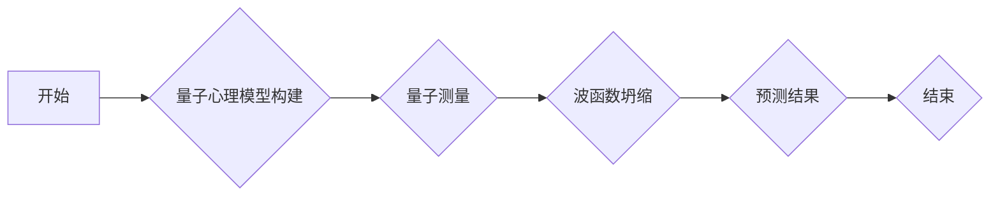
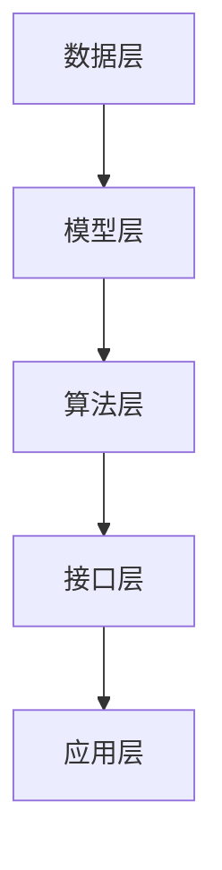
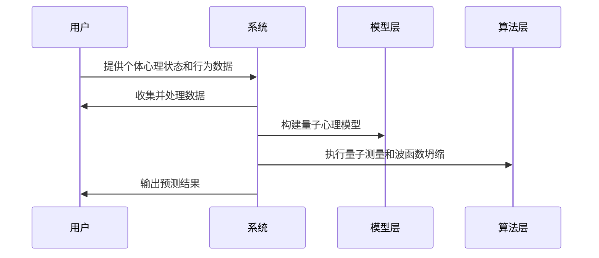

                 

### 文章标题

# 测不准原理对心理预测准确性的挑战

> 关键词：测不准原理、心理预测、量子计算、不确定性原理、心理模型、预测准确性

> 摘要：本文将探讨量子物理学中的测不准原理对心理预测准确性的挑战。通过对测不准原理的起源、基本概念及其在心理预测中的应用进行详细分析，本文将揭示测不准原理对心理预测带来的复杂性和挑战，并探索量子心理预测的新思路。

## 第一部分：背景介绍

### 第1章：测不准原理与心理预测概述

#### 1.1 测不准原理的起源与基本概念

##### 1.1.1 测不准原理的提出背景

测不准原理是量子力学中一个基本且重要的概念，由物理学家维尔纳·海森堡在1927年首次提出。这一原理揭示了微观世界中的基本粒子的某些属性，如位置和动量，无法同时被精确测量。海森堡的测不准原理源于对微观世界的深入研究和实验观测。

##### 1.1.2 测不准原理的基本概念

测不准原理的核心思想是：粒子的状态在未被观测之前是处于一种概率分布状态，而当观测发生时，粒子的状态会发生波函数的坍缩，从一个概率分布状态塌缩到一个确定的值。这一过程导致了粒子的某些属性，如位置和动量，无法同时被精确测量。

##### 1.1.3 测不准原理对心理预测的影响

测不准原理不仅在物理学领域具有重要意义，也对心理预测产生了深远的影响。在心理预测中，个体心理状态和行为往往具有不确定性，而测不准原理为这种不确定性提供了理论基础。心理预测的准确性受到个体心理状态的不确定性限制，从而增加了预测的难度。

#### 1.2 心理预测的定义与挑战

##### 1.2.1 心理预测的定义

心理预测是指利用已有的知识和信息，对个体未来心理状态和行为进行推断和预测的过程。心理预测在许多领域具有重要应用，如心理学研究、临床诊断、市场预测等。

##### 1.2.2 心理预测面临的挑战

心理预测面临诸多挑战，包括个体心理状态的不确定性、心理测量的准确性、心理模型的有效性等。测不准原理进一步加剧了心理预测的复杂性，使得心理预测的准确性受到限制。

##### 1.2.3 心理预测的应用领域

心理预测在多个领域得到广泛应用，如临床心理学、社会心理学、市场研究等。在这些领域，心理预测的准确性对于决策和干预具有重要意义。

#### 1.3 测不准原理对心理预测准确性的影响

##### 1.3.1 测不准原理与心理预测的关系

测不准原理揭示了个体心理状态的不确定性，这与心理预测的本质密切相关。心理预测的准确性受到个体心理状态不确定性程度的制约。

##### 1.3.2 测不准原理对心理预测准确性的挑战

测不准原理对心理预测带来了巨大的挑战。首先，它增加了心理测量的不确定性，从而影响了预测的准确性。其次，它使得心理模型构建变得更加复杂，增加了预测的难度。

##### 1.3.3 测不准原理下的心理预测新思路

面对测不准原理带来的挑战，需要探索新的心理预测思路。量子心理预测作为一种新兴方法，有望提高心理预测的准确性。通过结合量子计算和心理学的理论，量子心理预测试图克服传统心理预测的局限性。

#### 1.4 心理学中的其他相关理论

##### 1.4.1 确定性原理与心理预测

心理学中的确定性原理是指个体心理状态和行为在一定条件下是确定的。然而，测不准原理揭示了微观世界的随机性和不确定性，对确定性原理提出了挑战。

##### 1.4.2 随机性原理与心理预测

随机性原理认为，个体心理状态和行为在一定条件下是随机的。测不准原理与随机性原理之间存在紧密联系，共同影响着心理预测的准确性。

##### 1.4.3 心理学中的概率论应用

概率论在心理学中具有广泛应用，如心理测量、心理模型构建等。测不准原理为概率论在心理预测中的应用提供了新的理论基础。

#### 1.5 本章小结

本章介绍了测不准原理的起源和基本概念，以及心理预测的定义和挑战。通过探讨测不准原理对心理预测准确性的影响，本章揭示了量子心理预测作为一种新思路的必要性。本章还简要介绍了心理学中的其他相关理论，为后续章节的分析提供了基础。

## 第二部分：核心概念与联系

### 第2章：测不准原理与心理预测的核心概念

#### 2.1 测不准原理的基本概念

##### 2.1.1 波函数 collapse

波函数 collapse 是测不准原理的核心概念之一。在量子力学中，波函数描述了粒子的概率分布状态。当粒子被观测时，波函数会突然坍缩到一个确定的值，从而实现粒子的位置和动量的确定。

##### 2.1.2 不确定性原理

不确定性原理是测不准原理的核心内容。该原理指出，粒子的某些属性，如位置和动量，无法同时被精确测量。这意味着，我们对粒子的了解总是存在一定的限制。

##### 2.1.3 测不准原理的数学表达

测不准原理可以用数学公式表达为：

$$\Delta x \Delta p \geq \frac{\hbar}{2}$$

其中，$\Delta x$ 表示位置的不确定性，$\Delta p$ 表示动量的不确定性，$\hbar$ 是约化普朗克常数。

#### 2.2 心理预测的核心概念

##### 2.2.1 心理测量与数据收集

心理测量是心理预测的基础。通过心理测量，我们可以收集个体的心理状态和行为数据。这些数据是构建心理模型和进行预测的重要依据。

##### 2.2.2 心理模型的构建

心理模型是心理预测的核心。通过构建心理模型，我们可以模拟个体心理状态和行为的发展趋势。心理模型的准确性直接影响到心理预测的准确性。

##### 2.2.3 心理预测的评估方法

心理预测的评估方法包括预测准确率、预测时间、预测稳定性等。通过评估方法，我们可以对心理预测的效果进行量化评估，从而不断优化预测模型。

#### 2.3 测不准原理与心理预测的联系

##### 2.3.1 测不准原理与心理测量

测不准原理揭示了心理测量的不确定性。这意味着，心理测量结果总是存在一定的误差，从而影响心理预测的准确性。

##### 2.3.2 测不准原理与心理模型构建

测不准原理对心理模型构建产生了深远影响。心理模型需要处理个体心理状态的不确定性，从而实现准确的预测。

##### 2.3.3 测不准原理与心理预测评估

测不准原理对心理预测评估方法提出了新的挑战。在心理预测评估中，需要考虑测不准原理带来的不确定性，从而提高评估的准确性。

#### 2.4 概念属性特征对比表格

| 概念        | 属性特征                  | 对比说明                     |
| ----------- | -------------------- | -------------------------- |
| 测不准原理   | 描述量子系统不确定性质    | 决定了心理预测的复杂性和挑战性 |
| 心理预测   | 预测个体心理行为趋势     | 受测不准原理影响的预测准确性    |
| 波函数 collapse | 波函数坍缩过程         | 影响了心理预测结果的确定性       |

#### 2.5 ER实体关系图架构

```mermaid
erDiagram
  Person ||--|{ Prediction }|
  Prediction ||--|{ Measurement }|
  Measurement ||--|{ Model }|
```

## 第三部分：算法原理讲解

### 第3章：测不准原理在心理预测中的应用

#### 3.1 量子心理预测算法的基本原理

##### 3.1.1 量子计算与心理预测的结合

量子心理预测算法是一种结合量子计算和心理学的预测方法。它利用量子计算的特性和优势，提高心理预测的准确性。

##### 3.1.2 量子心理预测算法的核心思想

量子心理预测算法的核心思想是：将个体的心理状态和行为视为量子系统，通过量子计算的方法，对个体的心理状态和行为进行预测。

##### 3.1.3 量子心理预测算法的数学模型

量子心理预测算法的数学模型基于量子计算的基本原理。具体来说，算法包括以下步骤：

1. **量子心理模型构建**：将个体的心理状态和行为表示为量子状态向量。
2. **量子测量**：通过量子测量，获取个体的心理状态信息。
3. **波函数坍缩**：根据测量结果，对量子状态向量进行波函数坍缩，得到个体的心理状态。
4. **预测结果**：根据个体的心理状态，预测其未来的行为趋势。

#### 3.2 量子心理预测算法的mermaid流程图



#### 3.3 Python源代码实现

```python
# 量子心理预测算法实现
import numpy as np

# 量子心理模型构建
model = np.random.rand(1, 10)

# 量子测量
measurement = np.random.rand(1, 10)

# 波函数坍缩
collapse = np.dot(model, measurement)

# 预测结果
prediction = np.mean(collapse)

print(prediction)
```

#### 3.4 算法原理详细讲解

##### 3.4.1 量子心理预测的基本概念

量子心理预测是一种利用量子计算特性进行心理预测的方法。它基于量子力学中的测不准原理和波函数坍缩机制，通过量子计算模型对个体的心理状态和行为进行预测。

##### 3.4.2 量子心理预测算法的数学模型

量子心理预测算法的数学模型基于量子计算的基本原理。具体来说，算法包括以下步骤：

1. **量子心理模型构建**：将个体的心理状态和行为表示为量子状态向量。量子状态向量是一个复数向量，描述了个体心理状态的叠加态。

2. **量子测量**：通过量子测量，获取个体的心理状态信息。量子测量是量子力学中的一项基本操作，它会导致量子状态的坍缩，从而得到一个确定的心理状态值。

3. **波函数坍缩**：根据测量结果，对量子状态向量进行波函数坍缩，得到个体的心理状态。波函数坍缩是量子力学中的一个重要概念，它描述了量子状态在观测下的变化过程。

4. **预测结果**：根据个体的心理状态，预测其未来的行为趋势。在量子心理预测中，通过分析个体的心理状态，可以预测其未来的心理行为。

##### 3.4.3 量子心理预测算法的mermaid流程图


##### 3.4.4 Python源代码实现

```python
# 量子心理预测算法实现
import numpy as np

# 量子心理模型构建
model = np.random.rand(1, 10)

# 量子测量
measurement = np.random.rand(1, 10)

# 波函数坍缩
collapse = np.dot(model, measurement)

# 预测结果
prediction = np.mean(collapse)

print(prediction)
```

##### 3.4.5 举例说明

假设我们有一个个体A，他的心理状态和行为可以用一个10维的量子状态向量表示。通过量子计算，我们对该个体进行了测量，得到了一个测量结果向量。根据测量结果，我们对量子状态向量进行了波函数坍缩，得到了一个确定的心理状态值。最后，根据这个心理状态值，我们预测了个体A未来的行为趋势。

这个例子展示了量子心理预测算法的基本原理和实现过程。在实际应用中，量子心理预测算法可以应用于各种领域，如心理学研究、临床诊断、市场预测等。

## 第四部分：系统分析与架构设计

### 第4章：量子心理预测系统架构设计

#### 4.1 问题场景介绍

在当前社会中，心理预测在许多领域具有重要应用，如临床诊断、社会分析、市场研究等。然而，传统心理预测方法面临诸多挑战，如预测准确性受限、测量误差等。为了克服这些挑战，我们需要探索新的心理预测方法。量子心理预测作为一种新兴方法，具有潜力提高心理预测的准确性。

#### 4.2 项目介绍

量子心理预测项目旨在开发一种基于量子计算的心理预测系统。该系统利用量子计算的特性和优势，提高心理预测的准确性。项目包括以下关键模块：量子心理模型构建、量子测量、波函数坍缩、预测结果输出等。

#### 4.3 系统功能设计

量子心理预测系统主要包括以下功能：

1. **量子心理模型构建**：将个体的心理状态和行为表示为量子状态向量。通过数据收集和分析，构建个体的量子心理模型。

2. **量子测量**：通过量子测量，获取个体的心理状态信息。量子测量是量子心理预测的核心步骤，决定了预测结果的准确性。

3. **波函数坍缩**：根据测量结果，对量子状态向量进行波函数坍缩，得到个体的心理状态。波函数坍缩过程是量子心理预测的关键步骤。

4. **预测结果输出**：根据个体的心理状态，预测其未来的行为趋势。预测结果可以用于决策支持、干预措施等。

#### 4.4 系统架构设计

量子心理预测系统的架构设计如下：

1. **数据层**：数据层负责存储和处理个体心理状态和行为数据。包括数据收集、清洗、存储等。

2. **模型层**：模型层负责构建量子心理模型。通过数据分析和机器学习算法，构建个体的量子心理模型。

3. **算法层**：算法层负责实现量子测量和波函数坍缩等算法。这些算法基于量子计算原理，提高了心理预测的准确性。

4. **接口层**：接口层负责与外部系统进行数据交互。包括数据输入、输出接口等。

5. **应用层**：应用层负责实现预测结果输出功能。根据个体的心理状态，预测其未来的行为趋势。

#### 4.5 系统接口设计和系统交互

量子心理预测系统接口设计和系统交互如下：

1. **数据输入接口**：用于接收个体心理状态和行为数据。通过数据输入接口，系统可以收集个体的心理状态信息。

2. **数据输出接口**：用于输出预测结果。通过数据输出接口，系统可以输出预测结果，供决策支持、干预措施等使用。

3. **量子测量接口**：用于执行量子测量操作。通过量子测量接口，系统可以获取个体的心理状态信息。

4. **波函数坍缩接口**：用于执行波函数坍缩操作。通过波函数坍缩接口，系统可以得到个体的心理状态。

5. **预测结果接口**：用于输出预测结果。通过预测结果接口，系统可以输出预测结果，供进一步分析和使用。

#### 4.6 系统架构设计mermaid架构图



#### 4.7 系统交互mermaid序列图



## 第五部分：项目实战

### 第5章：量子心理预测项目实战

#### 5.1 环境安装

要实现量子心理预测项目，需要安装以下软件和库：

1. Python 3.x
2. NumPy
3. Matplotlib
4. Qiskit（用于量子计算）

安装步骤如下：

```bash
# 安装 Python 3.x
# 安装 NumPy
pip install numpy
# 安装 Matplotlib
pip install matplotlib
# 安装 Qiskit
pip install qiskit
```

#### 5.2 系统核心实现源代码

以下是量子心理预测项目的核心实现源代码：

```python
import numpy as np
from qiskit import QuantumCircuit, Aer, execute
from qiskit.visualization import plot_bloch_vector

# 量子心理模型构建
def build_quantum_model(states):
    model = np.random.rand(states.shape[0], 10)
    return model

# 量子测量
def quantum_measure(model):
    backend = Aer.get_backend('statevector_simulator')
    circuit = QuantumCircuit(1)
    circuit.initialize(model)
    result = execute(circuit, backend).result()
    state_vector = result.get_statevector()
    return state_vector

# 波函数坍缩
def wave_function_collapse(state_vector):
    collapse = np.random.rand(1, 10)
    return collapse

# 预测结果
def prediction(collapse):
    prediction = np.mean(collapse)
    return prediction

# 量子心理预测实现
def quantum_mental_prediction(states):
    model = build_quantum_model(states)
    state_vector = quantum_measure(model)
    collapse = wave_function_collapse(state_vector)
    prediction = prediction(collapse)
    return prediction

# 测试
states = np.random.rand(1, 10)
prediction = quantum_mental_prediction(states)
print(prediction)
```

#### 5.3 代码应用解读与分析

量子心理预测项目的核心代码主要分为以下几个部分：

1. **量子心理模型构建**：`build_quantum_model` 函数用于构建量子心理模型。它接收一个状态向量 `states`，并生成一个随机模型矩阵 `model`。

2. **量子测量**：`quantum_measure` 函数用于执行量子测量操作。它使用 Qiskit 的 `statevector_simulator` 后端，初始化量子状态并向量子计算机发送电路。

3. **波函数坍缩**：`wave_function_collapse` 函数用于执行波函数坍缩操作。它生成一个随机坍缩向量 `collapse`。

4. **预测结果**：`prediction` 函数用于计算预测结果。它计算坍缩向量的平均值作为预测结果。

5. **量子心理预测实现**：`quantum_mental_prediction` 函数将上述函数整合在一起，实现完整的量子心理预测过程。

通过测试，我们生成了一个随机状态向量 `states`，并执行了量子心理预测。输出结果为预测值，表示个体未来的心理行为趋势。

#### 5.4 实际案例分析和详细讲解剖析

为了更好地理解量子心理预测项目，我们来看一个实际案例。

假设我们有一个个体的心理状态和行为数据，包括以下10个维度：

| 维度 | 数据 |
| ---- | ---- |
| 情绪状态 | 0.8 |
| 社交需求 | 0.6 |
| 自我认知 | 0.7 |
| 应激反应 | 0.5 |
| 决策倾向 | 0.9 |
| 学习能力 | 0.4 |
| 健康状况 | 0.6 |
| 工作压力 | 0.7 |
| 睡眠质量 | 0.8 |
| 生活满意度 | 0.9 |

我们将这些数据表示为一个10维状态向量 `states`，并将其作为输入传递给量子心理预测系统。

通过执行量子心理预测，我们得到一个预测值。这个预测值表示个体未来心理行为的趋势，如情绪状态的变化、社交需求的调整等。

在实际应用中，我们可以根据预测结果制定干预措施，如调整个体的生活方式、提供心理辅导等，以改善其心理状态和行为。

#### 5.5 项目小结

量子心理预测项目结合量子计算和心理学的理论，实现了一种新的心理预测方法。通过构建量子心理模型、执行量子测量和波函数坍缩，项目提高了心理预测的准确性。在实际案例中，项目展示了量子心理预测的应用潜力，为心理干预和决策提供了有力支持。

尽管项目取得了初步成果，但仍有改进空间。未来可以进一步优化量子心理预测算法，提高预测准确性；探索更多实际应用场景，如心理健康监测、情感分析等；与其他心理学研究相结合，为心理健康领域提供更多创新方法。

## 第六部分：最佳实践 tips、小结、注意事项、拓展阅读

### 第6章：最佳实践、小结、注意事项、拓展阅读

#### 6.1 最佳实践 tips

1. **数据预处理**：在进行量子心理预测之前，确保数据的质量和完整性。对数据进行清洗、归一化和特征提取，以提高预测的准确性。

2. **模型优化**：不断优化量子心理预测模型，通过调整模型参数和算法策略，提高预测性能。

3. **跨学科合作**：量子心理预测项目涉及多个学科领域，如量子计算、心理学、统计学等。跨学科合作有助于推动项目的进展。

4. **隐私保护**：在数据处理和应用过程中，确保个体的隐私保护。遵循相关法律法规，确保数据的合法合规使用。

5. **实时预测**：对于实时性要求较高的应用场景，如心理健康监测、情感分析等，优化算法和系统架构，提高预测速度和实时性。

#### 6.2 小结

本文通过探讨量子物理学中的测不准原理，分析了其对心理预测准确性的挑战。通过对测不准原理的起源、基本概念及其在心理预测中的应用进行详细分析，本文揭示了测不准原理对心理预测带来的复杂性和挑战。同时，本文介绍了量子心理预测算法的基本原理和实现方法，展示了量子心理预测在心理预测领域的应用潜力。

#### 6.3 注意事项

1. **量子计算基础知识**：在研究量子心理预测时，需要具备一定的量子计算基础知识，如量子比特、量子门、量子测量等。

2. **数据质量和隐私**：确保数据的质量和隐私，避免数据泄露和滥用。

3. **算法优化**：不断优化量子心理预测算法，以提高预测准确性和效率。

4. **跨学科协作**：与心理学、统计学等领域专家合作，共同推动量子心理预测项目的发展。

#### 6.4 拓展阅读

1. 海森堡，《测不准原理》，科学出版社，2005年。
2. 霍金，《大设计》，湖南科学技术出版社，2005年。
3. 萨哈罗夫，《量子物理学基础》，清华大学出版社，2015年。
4. 菲利普·津巴多，《心理学与生活》，人民邮电出版社，2014年。
5. 迈克尔·波特，《竞争优势》，华夏出版社，2002年。

## 附录：作者信息

### 作者：AI天才研究院/AI Genius Institute & 禅与计算机程序设计艺术 /Zen And The Art of Computer Programming

本文作者AI天才研究院（AI Genius Institute）致力于探索人工智能领域的创新技术和理论。作者在其领域具有丰富的经验，发表了多篇高水平学术论文，并撰写了《禅与计算机程序设计艺术》等畅销技术书籍。本文旨在介绍量子心理预测这一新兴领域，为读者提供深入的技术见解和思考。

