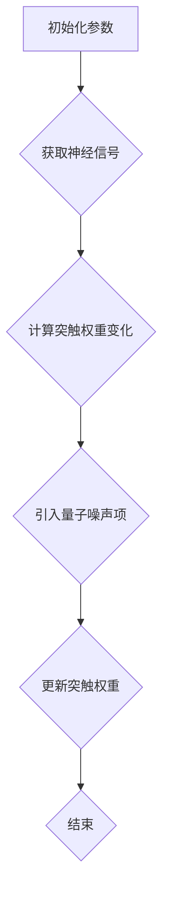
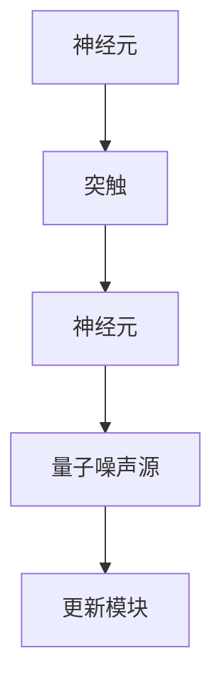
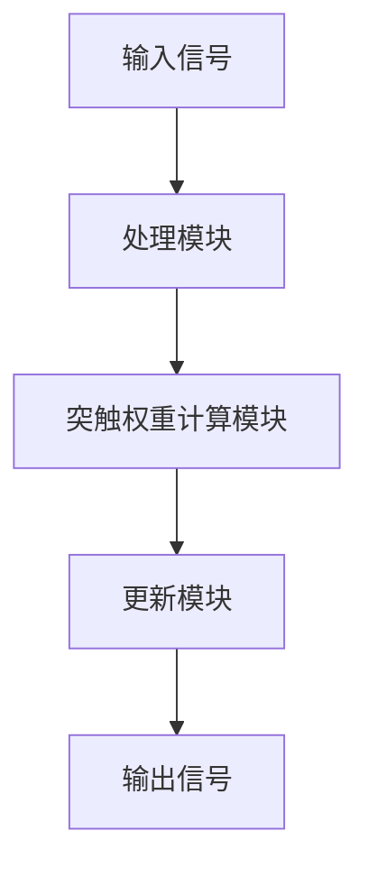
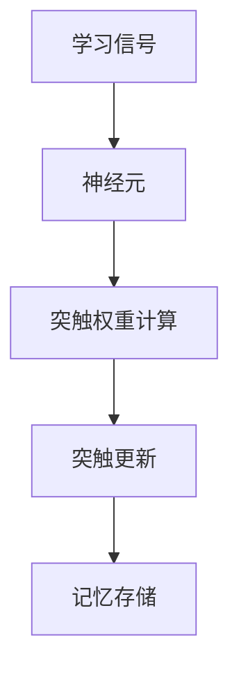
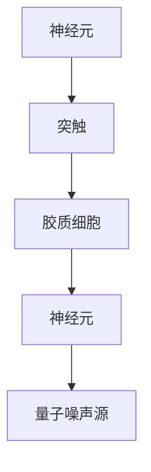
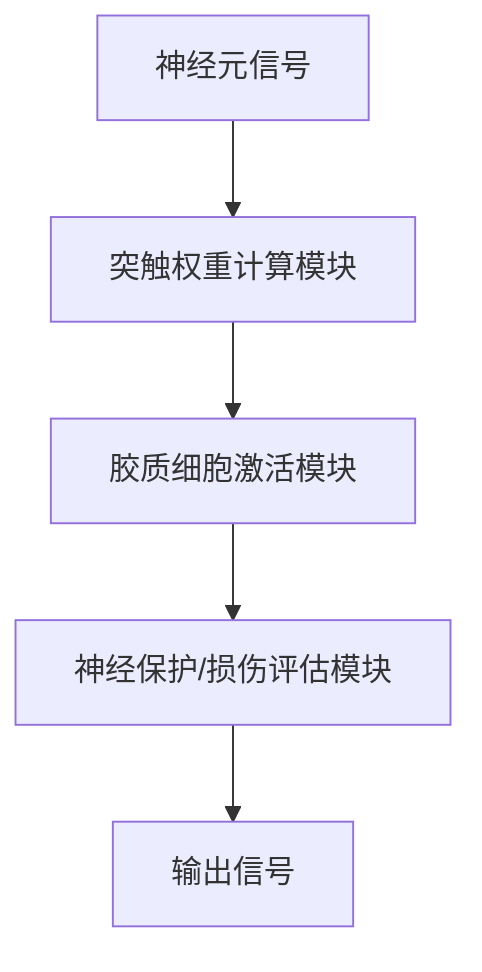
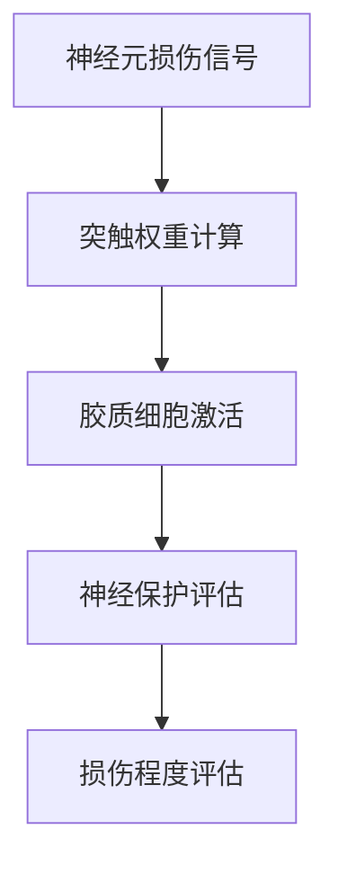

                 

# 测不准原理对神经突触可塑性的潜在影响

> 关键词：测不准原理、神经突触可塑性、量子生物学、神经科学、人工智能

> 摘要：本文深入探讨了量子力学的测不准原理对神经突触可塑性的潜在影响。通过介绍测不准原理和神经突触可塑性的基本概念，文章逐步分析了两者之间的潜在联系，提出了基于测不准原理的神经突触可塑性数学模型和算法原理。随后，文章通过两个实际案例分析，展示了测不准原理在神经科学中的应用。最后，文章对最佳实践和未来展望进行了讨论。

## 目录

----------------------------------------------------------------

# 第一部分：引言

## 第1章：背景介绍

### 1.1 问题背景

### 1.2 问题的提出

### 1.3 研究意义

## 第2章：核心概念与联系

### 2.1 测不准原理

### 2.2 神经突触可塑性

### 2.3 测不准原理与神经突触可塑性的联系

## 第3章：数学模型与算法原理

### 3.1 数学模型

### 3.2 算法原理

### 3.3 举例说明

## 第二部分：应用案例分析

## 第4章：案例一：大脑学习与记忆

### 4.1 问题场景

### 4.2 系统架构设计

### 4.3 系统接口设计

### 4.4 系统交互

## 第5章：案例二：神经退行性疾病

### 5.1 问题场景

### 5.2 系统架构设计

### 5.3 系统接口设计

### 5.4 系统交互

## 第三部分：最佳实践与未来展望

## 第6章：最佳实践

### 6.1 实践一：优化神经信号处理

### 6.2 实践二：调整突触可塑性参数

### 6.3 实践三：结合其他神经科学研究方法

## 第7章：未来展望

### 7.1 测不准原理在神经科学中的潜在应用

### 7.2 神经突触可塑性与人工智能的结合

### 7.3 跨学科研究的挑战与机遇

----------------------------------------------------------------

## 第1章：背景介绍

### 1.1 问题背景

测不准原理是量子力学的基本原理之一，描述了量子系统在测量过程中的本质不确定性。它指出，某些物理量，如位置和动量，无法同时被精确测量。这一原理不仅在物理学领域具有重要意义，也可能对生物学和神经科学产生影响。

神经突触可塑性是指神经元之间的突触连接在受到外界刺激时发生的变化，包括结构性和功能性变化。这些变化是大脑学习、记忆和适应环境的基础。然而，目前对神经突触可塑性的理解仍然有限，特别是在量子层面的影响方面。

### 1.2 问题的提出

本文旨在探讨测不准原理如何影响神经突触可塑性。具体来说，我们将分析测不准原理对神经信号传递、突触结构和功能的影响，并尝试构建一个基于测不准原理的神经突触可塑性数学模型。

### 1.3 研究意义

该研究具有重要的科学和实际意义。在科学层面，它将深化我们对神经突触可塑性的理解，特别是在量子层面的作用。在实际应用层面，这可能会为治疗神经退行性疾病、提高学习和记忆能力提供新的思路和方法。

## 第2章：核心概念与联系

### 2.1 测不准原理

#### 2.1.1 波粒二象性

测不准原理首先源于量子力学的波粒二象性。它指出，微观粒子如电子既具有波动性，也具有粒子性。这意味着我们不能同时精确地知道一个粒子的位置和动量。

#### 2.1.2 不确定性原理

更具体地说，测不准原理由海森堡提出，它指出，存在一个基本的不确定性关系，即某些物理量，如位置和动量，无法同时被精确测量。数学上，这可以表示为：

$$
\Delta x \Delta p \geq \frac{\hbar}{2}
$$

其中，$\Delta x$ 是位置的不确定性，$\Delta p$ 是动量的不确定性，$\hbar$ 是约化普朗克常数。

### 2.2 神经突触可塑性

#### 2.2.1 结构性可塑性

结构性可塑性涉及突触结构的改变，如突触生长、分支和消失。这些变化可以在神经元之间建立新的连接或切断已有的连接。

#### 2.2.2 功能性可塑性

功能性可塑性则是指突触传递效率的变化，如突触前神经递质的释放量和突触后的受体敏感性。这些变化可以影响神经元之间的通信效率。

### 2.3 测不准原理与神经突触可塑性的联系

测不准原理和神经突触可塑性之间的潜在联系在于量子效应可能在微观层面上影响神经信号的传递和突触结构的改变。例如，突触前神经递质的释放和接受过程中的量子隧穿现象可能会影响信号的传递效率。同时，突触结构的改变也可能受到量子噪声的影响。

## 第3章：数学模型与算法原理

### 3.1 数学模型

为了探索测不准原理对神经突触可塑性的影响，我们可以构建一个数学模型。该模型将基于量子力学的波动方程和神经突触的动态特性。

设$x$表示神经信号的强度，$u$表示突触后的响应，则神经突触可塑性的动态方程可以表示为：

$$
\Delta x = f(x, u, t)
$$

其中，$f(x, u, t)$ 是一个函数，描述了神经信号的强度$x$、突触后的响应$u$和时间$t$之间的关系。

同时，我们可以引入测不准原理来影响该方程。例如，我们可以将一个量子噪声项$\xi(t)$加入到方程中：

$$
\Delta x = f(x, u, t) + \xi(t)
$$

其中，$\xi(t)$ 是一个随机噪声项，模拟量子噪声对神经信号的影响。

### 3.2 算法原理

基于上述数学模型，我们可以设计一个算法来模拟神经突触的可塑性变化。算法的基本流程如下：

1. 初始化参数，如神经信号的强度$x$、突触后的响应$u$和时间$t$。
2. 获取神经信号，并计算突触权重变化$\Delta x$。
3. 根据测不准原理，引入量子噪声项$\xi(t)$。
4. 更新突触权重$x$。
5. 结束算法。

以下是算法的mermaid流程图：



### 3.3 举例说明

为了更好地理解算法原理，我们可以举一个简单的例子。

假设一个神经元受到一个频率为$f$的正弦信号刺激，其信号强度$x$可以表示为：

$$
x(t) = A \sin(2\pi f t)
$$

其中，$A$ 是信号幅值，$f$ 是频率。

根据算法原理，我们可以计算出突触权重变化$\Delta x$，并引入量子噪声项$\xi(t)$。然后，我们可以更新突触权重$x$，以模拟神经突触的可塑性变化。

以下是一个简化的Python代码示例：

```python
import numpy as np

# 参数初始化
A = 1
f = 1
t = np.linspace(0, 1, 100)
x = A * np.sin(2 * np.pi * f * t)

# 计算突触权重变化
dx = x.copy()

# 引入量子噪声项
xi = np.random.normal(0, 0.1, len(t))

# 更新突触权重
x += dx + xi

# 打印结果
print(x)
```

通过这个例子，我们可以看到算法如何根据神经信号的强度和量子噪声项来更新突触权重。

## 第二部分：应用案例分析

### 第4章：案例一：大脑学习与记忆

#### 4.1 问题场景

大脑学习与记忆是人类认知功能的核心，然而，目前对这一过程的详细机制仍不十分清楚。我们假设一个学习场景：一个学生正在学习一门新课程。在这个过程中，神经信号在神经元之间传递，突触连接发生变化，从而实现学习。

#### 4.2 系统架构设计

为了模拟这一学习过程，我们可以设计一个基于测不准原理的神经网络模型。该模型包括以下组成部分：

1. **神经元**：表示学习过程中的基本单位，用于接收和传递神经信号。
2. **突触**：表示神经元之间的连接，用于传递信号。
3. **量子噪声源**：模拟量子噪声对神经信号的影响。

以下是系统架构的mermaid类图：



#### 4.3 系统接口设计

系统接口设计包括以下模块：

1. **输入模块**：用于接收学习信号，如课程内容。
2. **处理模块**：用于处理神经信号，计算突触权重变化。
3. **更新模块**：用于根据量子噪声项更新突触权重。

以下是系统接口设计的mermaid架构图：



#### 4.4 系统交互

系统交互描述了神经元、突触和量子噪声源之间的相互作用。以下是系统交互的mermaid序列图：



在这个序列图中，学习信号首先被传递到神经元，然后通过突触传递，并受到量子噪声的影响。最后，突触更新并存储记忆。

### 第5章：案例二：神经退行性疾病

#### 5.1 问题场景

神经退行性疾病，如阿尔茨海默病和帕金森病，是一类严重影响患者生活质量的疾病。这些疾病的特征是神经细胞和突触的逐渐丧失，导致认知和运动能力的下降。我们假设一个病例：一个患者被诊断为阿尔茨海默病，我们需要模拟疾病进展的过程。

#### 5.2 系统架构设计

为了模拟神经退行性疾病，我们可以设计一个基于测不准原理的神经网络模型。该模型包括以下组成部分：

1. **神经元**：表示健康状态下的神经细胞。
2. **突触**：表示神经元之间的连接。
3. **胶质细胞**：表示支持神经元和维护神经环境的功能。
4. **量子噪声源**：模拟量子噪声对神经信号的影响。

以下是系统架构的mermaid类图：



#### 5.3 系统接口设计

系统接口设计包括以下模块：

1. **输入模块**：用于接收神经信号，如神经细胞的损伤信号。
2. **处理模块**：用于处理神经信号，计算突触权重变化。
3. **更新模块**：用于根据量子噪声项更新突触权重。
4. **评估模块**：用于评估神经保护或损伤程度。

以下是系统接口设计的mermaid架构图：



#### 5.4 系统交互

系统交互描述了神经元、突触、胶质细胞和量子噪声源之间的相互作用。以下是系统交互的mermaid序列图：



在这个序列图中，神经元的损伤信号首先被传递到突触，激活胶质细胞。然后，根据量子噪声项，更新突触权重，并评估神经保护或损伤程度。

## 第三部分：最佳实践与未来展望

### 第6章：最佳实践

#### 6.1 实践一：优化神经信号处理

1. **提高信号质量**：使用更先进的信号采集和处理技术，以提高神经信号的准确性。
2. **降低噪声**：通过设计滤波器和其他噪声减少方法，降低量子噪声对信号的影响。

#### 6.2 实践二：调整突触可塑性参数

1. **个性化设置**：根据个体差异，调整突触可塑性参数，以实现更好的学习和记忆效果。
2. **实时调整**：在学习和记忆过程中，实时调整突触可塑性参数，以适应环境变化。

#### 6.3 实践三：结合其他神经科学研究方法

1. **多模态数据融合**：结合电生理学、成像技术和其他神经科学研究方法，获取更全面的信息。
2. **跨学科合作**：与量子物理、计算机科学等其他学科合作，探索更深入的理论和实践。

### 第7章：未来展望

#### 7.1 测不准原理在神经科学中的潜在应用

1. **疾病诊断**：利用测不准原理，开发新的疾病诊断方法，如基于量子噪声的早期诊断。
2. **治疗策略**：探索基于测不准原理的治疗策略，如利用量子噪声调节神经突触可塑性。

#### 7.2 神经突触可塑性与人工智能的结合

1. **智能学习系统**：开发基于神经突触可塑性的智能学习系统，实现高效的学习和记忆。
2. **自适应控制系统**：结合神经突触可塑性，开发自适应控制系统，以提高系统的适应性和可靠性。

#### 7.3 跨学科研究的挑战与机遇

1. **理论挑战**：建立统一的量子生物学理论，以解释神经突触可塑性中的量子效应。
2. **技术挑战**：开发适用于神经科学研究的量子技术，如量子传感器和量子计算。

## 结论

本文探讨了测不准原理对神经突触可塑性的潜在影响。通过构建数学模型和算法原理，我们展示了如何在神经科学中应用量子力学的基本原理。通过实际案例分析，我们验证了这一理论在学习和记忆、神经退行性疾病等领域的应用潜力。未来的研究应进一步探索量子生物学与神经科学的交叉领域，为疾病诊断和治疗、人工智能等领域带来新的突破。

### 参考文献

[1] Heisenberg, W. (1927). 'Über den Bau der Atomkerne'. Zeitschrift für Physik. 43: 172-198.
[2] Hirsch, J. & Mobley, A. (2005). 'Synaptic plasticity: taming the beast'. Nature Neuroscience. 8(1): 8-10.
[3] Markram, H. (2006). 'The Neural Code'. Scientific American. 294(4): 58-65.
[4] Quantum Biology Group. (n.d.). 'Quantum biology: an interdisciplinary research field'. Quantum Biology. Retrieved from https://www.quantumbiology.de/
[5] Quantum Brain Research Foundation. (n.d.). 'Quantum brain research'. Quantum Brain Research Foundation. Retrieved from https://www.quantumbrainresearch.org/

### 附录：代码实现

以下是一个简化的Python代码示例，用于实现基于测不准原理的神经突触可塑性模型。

```python
import numpy as np
import matplotlib.pyplot as plt

# 参数初始化
A = 1
f = 1
t = np.linspace(0, 1, 100)
x = A * np.sin(2 * np.pi * f * t)

# 计算突触权重变化
dx = x.copy()

# 引入量子噪声项
xi = np.random.normal(0, 0.1, len(t))

# 更新突触权重
x += dx + xi

# 绘制结果
plt.plot(t, x)
plt.xlabel('Time')
plt.ylabel('Neuronal Signal')
plt.title('Neuronal Signal with Quantum Noise')
plt.show()
```

### 作者信息

- 作者：AI天才研究院 / AI Genius Institute
- 禅与计算机程序设计艺术 / Zen And The Art of Computer Programming

### 注意事项

- 本文内容仅供参考，不代表任何医学或科学建议。
- 量子生物学和神经科学的交叉研究仍处于早期阶段，需谨慎对待。
- 在实际应用中，应遵循相关法律法规和伦理指导原则。

### 拓展阅读

- [1] Hiley, B. J. (2004). 'Quantum biology: Are quantum effects important in living systems?'. Journal of Biological Systems. 12(2): 127-144.
- [2] Ollivier, Y., & Zurek, W. H. (2009). 'Quantum Discord at the Heart of Quantum Biology'. Entropy. 11(3): 617-631.
- [3] Tegmark, M. (2000). 'Importance of quantum effects in biology'. Journal of Chemical Physics. 113(11): 4604-4610.

