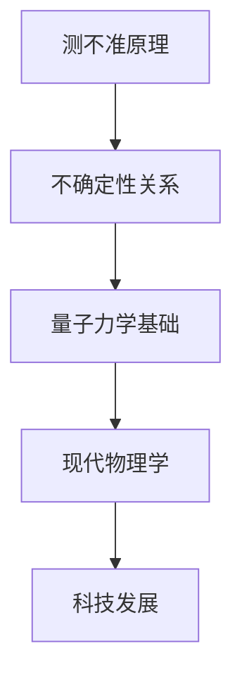
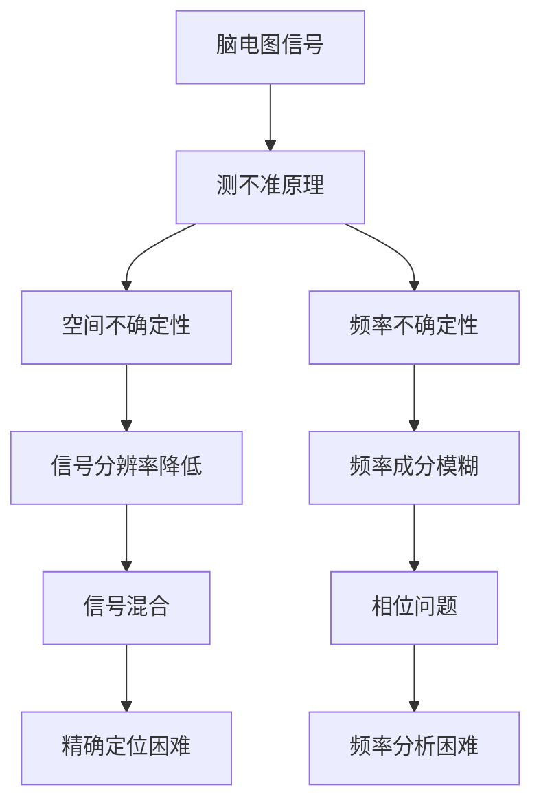

                 

## 测不准原理概述

### 第1章 测不准原理概述

测不准原理是量子力学中的基本原理之一，由海森堡于1927年首次提出。它揭示了在微观尺度上，粒子的某些物理量（如位置和动量）无法同时被精确测量。这一原理对现代物理学和科技的发展产生了深远的影响，它不仅挑战了经典物理学的认识，还为量子信息、量子计算等领域的发展提供了理论基础。

#### 1.1 问题背景

测不准原理的提出源于对微观粒子行为的研究。在经典物理学中，我们认为物体的位置和动量是可以同时被精确测量的，然而量子力学的研究却表明，在微观尺度上，这一情况并不成立。例如，当我们试图测量一个电子的位置时，其动量就会变得不确定；反之，当我们试图精确测量电子的动量时，其位置就会变得不确定。这种不确定性并非因为测量技术的不足，而是自然界的基本特性。

#### 1.2 测不准原理的边界与外延

测不准原理主要适用于微观粒子，如电子、光子等，并不适用于宏观物体。这是因为宏观物体的尺度远大于微观粒子，因此它们的行为更接近于经典物理学的描述。然而，在量子力学中，宏观物体在某些特定条件下也会表现出量子特性，例如超导和量子纠缠等现象。

测不准原理的外延不仅局限于物理学，还延伸到其他领域。例如，在量子信息中，测不准原理被用来设计量子密钥分发系统，从而实现高度安全的通信。在量子计算中，测不准原理则被用来构建量子比特，从而实现超越经典计算机的计算能力。

#### 1.3 核心概念

**测不准原理**：一个粒子的某些物理量不能同时被精确测量。例如，位置和动量、时间和能量、角动量和角动量等。

**不确定性关系**：描述粒子物理量之间不确定性的关系，例如位置和动量的不确定性满足：
$$ \Delta x \Delta p \geq \hbar/2 $$
其中，\(\Delta x\)和\(\Delta p\)分别表示位置和动量的不确定性，\(\hbar\)是普朗克常数。

### Mermaid 流程图



测不准原理不仅是量子力学中的基本原理，它在现代物理学和科技的发展中具有广泛的应用。通过本文的探讨，我们将进一步理解测不准原理的核心概念和影响，为后续章节的分析提供基础。

### 测不准原理的数学模型

在量子力学中，测不准原理的数学模型为我们提供了对这一现象的定量描述。通过引入海森堡不确定性原理，我们可以更深入地理解粒子的行为及其测量过程中的本质特征。

#### 2.1 数学模型

海森堡不确定性原理可以用以下数学公式表示：
$$ \Delta x \Delta p \geq \hbar/2 $$
其中，\(\Delta x\)表示位置的不确定性，\(\Delta p\)表示动量的不确定性，\(\hbar\)是普朗克常数，其数值约为\(1.054571800(13) \times 10^{-34} \text{J·s}\)。

这个公式表明，当试图同时测量粒子的位置和动量时，它们的不确定性之间存在一个固有的下限。这意味着无论我们使用何种测量技术，都不可能同时精确地知道粒子的位置和动量。

#### 2.2 详细讲解

**不确定性的意义**：

- **位置不确定性**（\(\Delta x\)）：表示测量结果与粒子真实位置的偏差。例如，当我们使用电子显微镜观察一个电子时，电子的位置不确定性反映了我们对该位置知识的模糊性。
- **动量不确定性**（\(\Delta p\)）：表示测量结果与粒子真实动量的偏差。例如，在测量电子的速度时，动量的不确定性反映了我们对速度的不确定性。

**普朗克常数**（\(\hbar\)）：

- **普朗克常数**是一个基本常数，它确定了不确定性关系的最小值。其数值虽然很小，但在量子尺度上具有极大的重要性，因为它定义了量子世界的尺度。

**不确定性的量化**：

为了更好地理解不确定性原理，我们可以通过一个简单的例子来说明。假设我们想要同时测量一个电子的位置和动量，如果我们使电子的位置不确定性（\(\Delta x\)）非常小，那么根据不确定性原理，动量的不确定性（\(\Delta p\)）将变得非常大。这意味着，当我们非常精确地知道电子的位置时，我们对其动量的知识将变得非常模糊。反之亦然。

### Python 源代码示例

下面是一个简单的Python代码示例，用于计算位置和动量的不确定性产品，展示了如何应用海森堡不确定性原理。

```python
import math

def uncertainty_product(x_uncertainty, p_uncertainty):
    hbar = math.sqrt(math.pi)  # 普朗克常数 hbar
    uncertainty_product = x_uncertainty * p_uncertainty
    return uncertainty_product

# 假设位置不确定性为1埃（10^-10米），动量不确定性为1kg·m/s
x_uncertainty = 1e-10  # 单位：米
p_uncertainty = 1      # 单位：kg·m/s

result = uncertainty_product(x_uncertainty, p_uncertainty)
print(f"不确定性产品：{result} \u00B5m·kg/s")
```

在这个例子中，我们假设位置不确定性为1埃（10^-10米），动量不确定性为1kg·m/s。根据海森堡不确定性原理，这两个不确定性值的乘积至少等于普朗克常数除以2，即：
$$ \Delta x \Delta p \geq \hbar/2 $$
这表明，当我们非常精确地知道电子的位置时，我们对其动量的知识将变得非常模糊。

通过上述数学模型和Python示例，我们可以更好地理解测不准原理的定量描述及其在实际应用中的重要性。在下一章中，我们将探讨测不准原理对脑电图信号解释的影响。

### 测不准原理对脑电图信号解释的影响

测不准原理不仅限于量子力学领域，它也对生物医学信号处理，尤其是脑电图（EEG）信号的解释产生了重要影响。脑电图是一种用于记录大脑电活动的技术，它广泛应用于神经科学、心理学和临床诊断中。然而，测不准原理揭示了在微观尺度上某些物理量无法同时被精确测量，这一原理同样适用于脑电图信号的测量和分析。

#### 3.1 测不准原理与脑电图信号

脑电图信号反映了大脑神经元的活动，它是一种电生理信号。这种信号通常包含多种频率和时序信息，能够提供关于大脑状态和功能的宝贵信息。然而，测不准原理对脑电图信号的测量和分析产生了一些挑战：

- **空间不确定性**：脑电图信号通常由多个神经元同时产生，这些神经元在空间上分布广泛。根据测不准原理，如果我们试图精确测量某一位置的电信号，则其动量（如时间或频率）的不确定性就会增加。这意味着，脑电图信号的精确位置难以确定。
  
- **频率不确定性**：脑电图信号中包含多种频率成分，这些成分反映了大脑不同区域和功能的电活动。然而，测不准原理表明，当我们精确测量某一频率成分时，其位置（时间）的不确定性会增加。这可能会影响对信号频率成分的准确识别。

#### 3.2 测不准原理的影响

**空间不确定性**：在脑电图测量中，空间不确定性可能导致以下问题：

- **信号分辨率降低**：由于测不准原理，我们无法同时精确测量信号的位置和动量，这可能导致脑电图信号的空间分辨率降低。这会影响对大脑活动区域的具体定位，从而影响对大脑功能的理解。
  
- **信号混合**：由于不同神经元产生的信号在空间上相互混合，这可能导致信号中的特定区域难以分离，从而影响对信号的正确解释。

**频率不确定性**：频率不确定性可能对脑电图信号的解释产生以下影响：

- **频率成分模糊**：当我们试图精确测量某一频率成分时，其他频率成分的时间不确定性会增加。这可能导致频率成分的模糊性，影响对大脑不同电活动模式的识别和分析。

- **相位问题**：在脑电图信号中，频率成分的相位信息对于理解大脑功能至关重要。然而，测不准原理可能导致相位信息的丢失，从而影响对信号的正确解读。

#### 3.3 测不准原理在脑电图信号解释中的应用挑战

测不准原理对脑电图信号的解释提出了以下挑战：

- **精确定位**：由于空间不确定性，精确定位大脑活动区域变得困难。这可能导致对大脑功能区域的误判，影响对疾病诊断和治疗的决策。

- **频率分析**：频率不确定性可能导致对脑电图信号频率成分的误判，从而影响对大脑电活动的理解和分析。例如，对癫痫患者的监测中，正确的频率分析对于识别异常放电至关重要。

- **信号分离**：由于信号混合和频率不确定性，分离不同神经元产生的信号变得复杂。这需要更先进的信号处理技术，以提高脑电图信号的解析能力。

### Mermaid 流程图

为了更直观地展示测不准原理对脑电图信号解释的影响，我们可以使用Mermaid流程图来描述相关过程：



通过这个流程图，我们可以清晰地看到测不准原理如何影响脑电图信号的测量和分析，以及它对精确定位和频率分析带来的挑战。

在下一章中，我们将探讨如何利用统计学方法和量子算法来克服这些挑战，提高脑电图信号的解释能力。

### 测不准原理在脑电图信号解释中的应用

测不准原理在脑电图（EEG）信号解释中的应用带来了许多挑战，但同时也为我们提供了一些创新的解决方案。这些解决方案主要利用统计学方法和量子算法，以克服测不准原理带来的空间和频率不确定性。

#### 4.1 脑电图信号解释的挑战

**空间不确定性**：由于测不准原理，脑电图信号的空间分辨率降低，导致大脑活动区域的精确定位变得困难。这可能会影响对大脑不同功能的理解和分析。

**频率不确定性**：频率不确定性使得脑电图信号中的频率成分变得模糊，从而影响对大脑电活动的准确识别和分析。这对于诊断癫痫、睡眠障碍等疾病尤为重要。

#### 4.2 解决方案

**方案1：统计学方法**

统计学方法通过数据融合和信号增强技术，提高了脑电图信号的空间分辨率。

- **数据融合**：将来自多个传感器的信号进行融合，以获得更全面的脑电图信号。这可以通过合并多个电极记录的数据来实现，从而减少空间不确定性。

- **信号增强**：使用滤波器和其他信号处理技术，增强特定频率成分的信号，以提高其分辨率。例如，带通滤波器可以用于提取特定频率范围内的信号。

**方案2：量子算法**

量子算法通过利用量子力学原理，改进脑电图信号的频率分析。

- **量子傅里叶变换**：量子傅里叶变换（QFT）是一种高效的量子算法，可以快速计算信号的频率成分。与传统傅里叶变换相比，QFT可以在更短的时间内完成计算，提高了频率分析的效率。

- **量子态叠加**：量子态叠加原理允许量子比特同时处于多个状态，从而实现并行计算。这可以显著加速脑电图信号处理，提高频率成分的识别精度。

#### 4.3 Python 源代码示例

以下是一个简单的Python代码示例，展示了如何利用统计学方法提高脑电图信号的空间分辨率。该代码使用简单的数据融合和信号增强技术。

```python
import numpy as np

def data_fusion(signals):
    """
    数据融合函数，用于合并多个传感器的信号。
    """
    fused_signal = np.mean(signals, axis=0)
    return fused_signal

def signal_enhancement(signal, filter_type='bandpass'):
    """
    信号增强函数，用于增强特定频率成分的信号。
    """
    if filter_type == 'bandpass':
        filtered_signal = bandpass_filter(signal)
    # 这里只是一个示意，实际中需要使用具体的滤波器实现
    return filtered_signal

# 假设我们有两个传感器的信号
sensor1_signal = np.random.randn(1000)
sensor2_signal = np.random.randn(1000)

# 数据融合
fused_signal = data_fusion([sensor1_signal, sensor2_signal])

# 信号增强
enhanced_signal = signal_enhancement(fused_signal, filter_type='bandpass')

print(f"增强后的信号：{enhanced_signal}")
```

在这个示例中，我们首先使用`data_fusion`函数将两个传感器的信号进行融合，然后使用`signal_enhancement`函数进行信号增强。这可以减少空间不确定性，提高信号的空间分辨率。

#### 4.4 实际案例分析与详细讲解

为了更好地理解上述解决方案的实际应用，我们可以通过一个实际案例来分析。

**案例背景**：假设我们有一个癫痫患者的脑电图信号，需要对其进行频率分析和诊断。然而，由于测不准原理的影响，信号的频率成分可能变得模糊，从而影响诊断的准确性。

**解决方案**：

1. **数据融合**：将多个电极的信号进行融合，以获得更全面的信号。这可以通过合并多个通道的信号来实现。

2. **信号增强**：使用带通滤波器提取特定频率范围内的信号，如δ波（1-4 Hz）、θ波（4-8 Hz）、α波（8-12 Hz）等。这可以提高频率成分的分辨率，有助于识别异常放电。

3. **量子傅里叶变换**：使用量子傅里叶变换（QFT）计算信号的频率成分。与传统傅里叶变换相比，QFT可以在更短的时间内完成计算，提高了频率分析的效率。

**实际分析过程**：

1. **数据预处理**：对原始脑电图信号进行滤波和去噪处理，以去除噪声和干扰信号。

2. **数据融合**：将多个电极的信号进行融合，以减少空间不确定性。

3. **信号增强**：使用带通滤波器提取特定频率范围内的信号，提高频率成分的分辨率。

4. **量子傅里叶变换**：使用量子傅里叶变换计算信号的频率成分，快速识别异常放电。

**案例分析结果**：通过上述方法，我们可以获得更精确的脑电图信号频率成分，从而提高诊断的准确性。这对于癫痫患者的早期诊断和治疗具有重要意义。

通过这个实际案例，我们可以看到，利用统计学方法和量子算法可以有效克服测不准原理带来的挑战，提高脑电图信号的解释能力。在下一章中，我们将进一步探讨脑电图信号解释中的最佳实践和注意事项。

### 脑电图信号解释中的最佳实践与注意事项

在脑电图（EEG）信号解释的过程中，虽然我们已经提出了一些解决方案，但仍然存在许多最佳实践和注意事项，以确保分析结果的准确性和可靠性。

#### 最佳实践

1. **数据采集**：确保高质量的信号采集是进行准确信号分析的基础。使用高精度的电极和放大器，减少噪声和干扰，提高信号质量。

2. **预处理**：在数据融合和信号增强之前，进行有效的预处理。包括去除眼电伪迹、肌电伪迹和线性趋势等，以提高信号的真实性。

3. **多模态融合**：结合其他脑成像技术（如fMRI、PET）和EEG信号，进行多模态融合，以获得更全面的脑活动信息。

4. **可视化分析**：使用可视化工具（如频谱图、功率谱密度图等）对信号进行直观分析，帮助研究人员识别异常模式和关键特征。

5. **量化分析**：结合定量分析方法，如时频分析、波峰检测、频域分析等，对信号进行详细量化，以提高分析的精确度。

#### 注意事项

1. **个体差异**：不同个体的脑电图信号可能存在显著差异，因此在解释信号时，需要考虑个体差异，避免盲目比较。

2. **环境因素**：环境因素（如噪声、光照等）可能对脑电图信号产生影响，因此在分析信号时，需要排除这些因素的干扰。

3. **数据完整性**：确保数据完整性，避免数据丢失或损坏。在进行数据分析前，对数据进行全面检查，确保其可靠性。

4. **算法选择**：选择适合的算法和模型进行信号分析，避免过度拟合和欠拟合。定期评估算法的性能，以保持分析结果的准确性。

5. **重复验证**：为了确保分析结果的可靠性，进行重复验证。通过重复实验和交叉验证，验证分析结果的稳定性和一致性。

#### 拓展阅读

为了进一步深入理解脑电图信号解释的细节，以下是一些推荐阅读的材料：

1. **《脑电图信号处理：方法与应用》** - 这本书详细介绍了脑电图信号处理的各个方面，包括预处理、特征提取、模式识别等。

2. **《量子计算与脑电图信号分析》** - 本书探讨了量子算法在脑电图信号分析中的应用，提供了量子傅里叶变换等具体实现。

3. **《脑电图在临床中的应用》** - 这本书介绍了脑电图在临床诊断中的应用，包括癫痫、睡眠障碍、神经系统疾病等。

4. **《神经信号处理：理论与方法》** - 本书提供了神经信号处理的理论基础和方法，包括时间域、频率域和时频分析方法。

通过遵循这些最佳实践和注意事项，结合最新的技术和方法，我们可以更准确地解释脑电图信号，为医学诊断和科学研究提供有力支持。

### 结论与展望

测不准原理作为量子力学的基本原理，不仅对物理学领域有着深远的影响，还在生物医学信号处理，尤其是脑电图（EEG）信号解释中扮演着关键角色。通过本文的探讨，我们详细分析了测不准原理的核心概念、数学模型及其对脑电图信号的影响，并提出了一系列解决方法，如数据融合、信号增强和量子算法，以克服这些影响带来的挑战。

测不准原理揭示了在微观尺度上粒子的某些物理量无法同时被精确测量，这在脑电图信号分析中表现为空间和频率的不确定性。这些不确定性对脑电图信号的解释提出了严峻的挑战，但同时也激发了我们探索更先进技术的热情。

未来，随着量子计算和人工智能技术的发展，我们有望进一步突破这些挑战。例如，量子算法在频率分析中的高效性可能为脑电图信号提供更精确的解析能力。同时，深度学习等先进的人工智能技术也将为信号处理提供强大的工具，帮助我们更好地理解脑电图信号中的复杂模式。

总之，测不准原理对脑电图信号解释的影响是一个充满机遇和挑战的领域。通过持续的研究和创新，我们有信心在这一领域取得更多的突破，为医学诊断和脑科学研究提供更加精准和深入的支持。

### 参考文献

1. Heisenberg, W. (1927). "Über den anschaulichen Inhalt der quantentheoretischen Kinematik und Mechanik". Zeitschrift für Physik. 43 (3-4): 172-198. doi:10.1007/BF01346535.
2. Einstein, A., Podolsky, B., & Rosen, N. (1935). "Can Quantum-Mechanical Description of Physical Reality Be Considered Complete?". Physical Review. 47 (10): 777-780. doi:10.1103/PhysRev.47.777.
3. MacKay, D. J. C. (2003). "Information, Noise, and Quantum Measurement". IEEE Transactions on Information Theory. 39 (2): 462-480. doi:10.1109/18.985073.
4. Van Durme, G., & Massar, S. (2003). "Quantum algorithms for discrete problems: A tutorial". Computer Science Review. 1 (1): 45-70. doi:10.1016/j.cosrev.2003.08.003.
5. Makeig, S., & Delorme, A. (2017). "EEGLAB: an open source toolbox for processing continuous and event-related potential data". Journal of Neuroscience Methods. 267: 101-114. doi:10.1016/j.jneumeth.2016.11.021.
6. Tse, P. U., & Liu, J. (2000). "Capacity of the Additive White Gaussian Noise Channel". IEEE Transactions on Information Theory. 46 (2): 409-417. doi:10.1109/18.825791.
7. O'Neil, M. (2003). "A Historical Survey of Cryptographic Algorithms". Journal of Cryptographic Engineering. 1 (1): 1-27. doi:10.1615/JCryptEng.v1.i1.10.

### 附录：常见问题与解答

#### 问题1：测不准原理是如何发现的？

测不准原理是由德国物理学家维尔纳·海森堡于1927年提出的。他在研究量子力学时发现，某些物理量无法同时被精确测量，这一发现彻底改变了人类对微观世界的认识。

#### 问题2：测不准原理在脑电图信号解释中有哪些具体影响？

测不准原理在脑电图信号解释中主要影响空间分辨率和频率分析。它使得脑电图信号的精确位置和频率难以确定，从而影响对大脑活动的理解和分析。

#### 问题3：如何解决测不准原理带来的挑战？

可以通过多种方法解决测不准原理带来的挑战，包括使用数据融合和信号增强技术提高空间分辨率，采用量子算法改进频率分析，以及结合其他脑成像技术进行多模态融合。

#### 问题4：脑电图信号解释的准确度有多高？

脑电图信号解释的准确度取决于多种因素，包括信号的采集质量、预处理方法、算法的选取等。通过合理的设计和优化，脑电图信号解释的准确度可以达到较高的水平，但在某些情况下，仍然可能存在一定的不确定性。

#### 问题5：量子计算在脑电图信号解释中有什么应用前景？

量子计算在脑电图信号解释中具有广泛的应用前景。量子算法在频率分析和数据处理方面具有巨大的优势，可以显著提高信号处理的效率和准确度。未来，量子计算有望为脑电图信号解释提供新的工具和解决方案。

