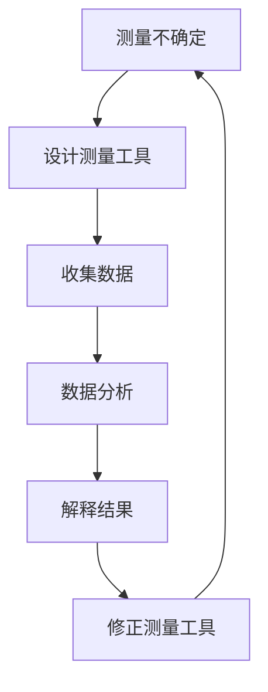
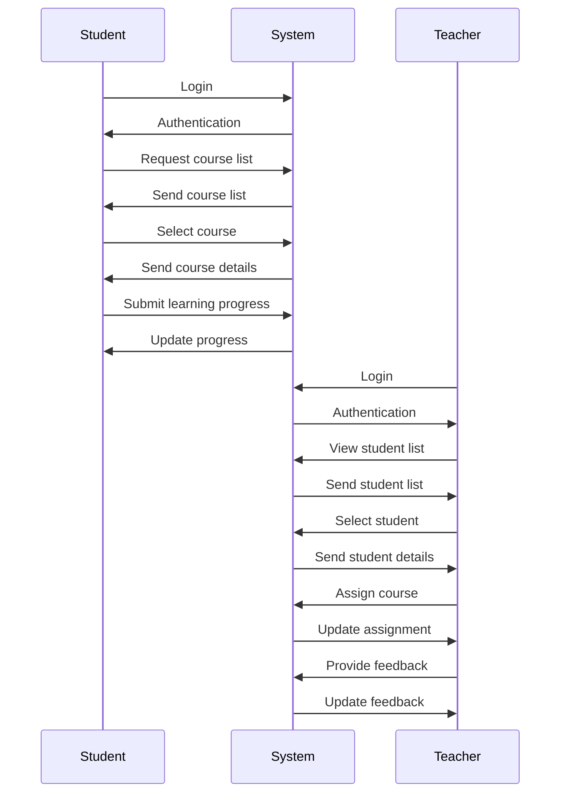
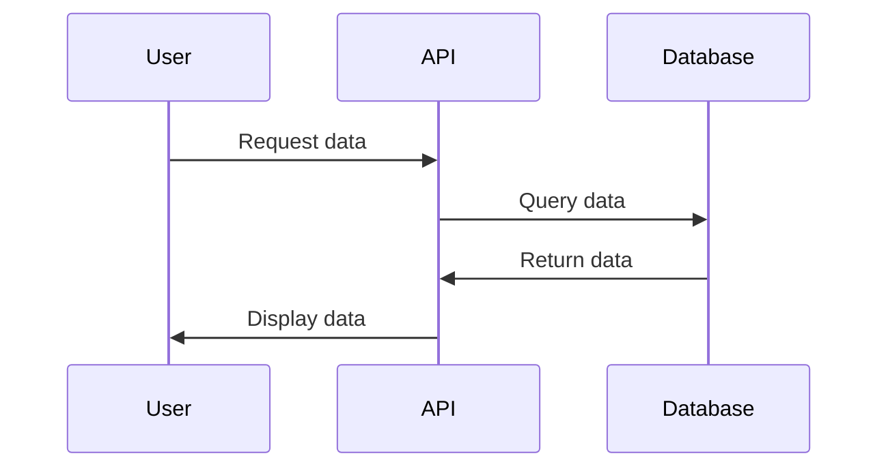

                 

# 海森堡测不准原理对心理学研究的影响

> 关键词：海森堡测不准原理、心理学研究、量子物理、跨学科融合、影响与展望

> 摘要：本文旨在探讨海森堡测不准原理在心理学研究中的潜在影响。通过回顾测不准原理的起源与核心概念，分析其在心理学研究中的应用，以及与量子物理的融合，本文提出了测不准原理对心理学理论、实践及未来研究的深远影响。

## 目录大纲

1. 第一部分：引言
    1.1 问题背景与核心概念
        1.1.1 问题背景
        1.1.2 核心概念
        1.1.3 研究边界与外延
    1.2 海森堡测不准原理
        1.2.1 原理概述
        1.2.2 原理解释
        1.2.3 测不准原理的影响
    1.3 测不准原理与心理学研究
2. 第二部分：海森堡测不准原理
    2.1 原理概述
    2.2 原理解释
    2.3 测不准原理的影响
3. 第三部分：测不准原理与心理学研究
    3.1 心理学中的测不准现象
    3.2 测不准原理在心理学研究中的应用
    3.3 案例分析
4. 第四部分：心理学与量子物理的融合
    4.1 跨学科研究的前景
    4.2 心理学实验设计中的量子原理
    4.3 案例分析
5. 第五部分：测不准原理对心理学的影响
    5.1 对心理学理论的影响
    5.2 对心理学实践的影响
    5.3 未来展望
6. 第六部分：海森堡测不准原理案例分析
    6.1 案例一：心理学实验设计
    6.2 案例二：心理治疗中的量子心理疗法
    6.3 案例三：教育心理学中的应用
7. 第七部分：结论与展望

## 1. 第一部分：引言

### 1.1 问题背景与核心概念

#### 1.1.1 问题背景

测不准原理，作为量子力学的基本原理之一，揭示了在微观尺度上，某些物理量的测量存在固有的不确定性。这一原理由德国物理学家维尔纳·海森堡于1927年提出，成为量子力学领域的一个重要里程碑。然而，测不准原理不仅仅局限于物理学领域，它在心理学研究中也具有潜在的应用价值。

心理学作为一门研究人类心理现象和行为模式的科学，一直在努力寻找解释复杂心理过程的原理和方法。然而，心理学研究中的许多问题，如心理测量的准确性和受试者行为的不确定性，都受到了测不准原理的挑战。因此，探讨海森堡测不准原理对心理学研究的影响，成为了一个具有重要学术价值和实际意义的课题。

#### 1.1.2 核心概念

**海森堡测不准原理**：测不准原理指出，在量子尺度上，某些物理量，如位置和动量，无法同时被精确测量。这意味着，当我们测量一个粒子的位置时，其动量的不确定性会增大；反之，当我们测量其动量时，位置的不确定性也会增大。这一原理体现了量子力学中粒子的波动性和不确定性。

**心理学中的相关理论**：在心理学研究中，测不准原理可以类比地应用于心理测量和行为分析。例如，心理测量中，测量工具的设计和受试者的主观反应都可能引入不确定性，使得测量结果无法达到绝对精确。此外，受试者的行为也受到多种因素的影响，如环境、心理状态等，导致行为模式具有一定的随机性和不确定性。

### 1.1.3 研究边界与外延

测不准原理在心理学研究中的应用范围广泛，包括心理测量、行为分析、认知过程等领域。此外，测不准原理还可以与其他学科，如量子物理、认知科学等，进行交叉融合，为心理学研究提供新的理论和方法。

## 2. 第二部分：海森堡测不准原理

### 2.1 原理概述

海森堡测不准原理是量子力学的一个基本原理，它揭示了在量子尺度上，某些物理量无法同时被精确测量。这一原理最初是由德国物理学家维尔纳·海森堡在1927年提出的，它是量子力学与经典物理学之间的一个重要区别。

测不准原理的基本内容可以概括为：在量子系统中，粒子的位置和动量（或能量和时间）之间存在固有的不确定性关系。具体来说，如果我们对粒子的位置进行精确测量，其动量的不确定性会增大；反之，如果我们对粒子的动量进行精确测量，其位置的不确定性也会增大。用数学语言描述，这一关系可以表示为：

$$ \Delta x \Delta p \geq \frac{\hbar}{2} $$

其中，$\Delta x$ 表示位置的不确定性，$\Delta p$ 表示动量的不确定性，$\hbar$ 是约化普朗克常数。

#### 历史背景与哲学意义

测不准原理的提出，是量子力学发展中的一个重要里程碑。在经典物理学中，我们认为物体的状态是确定的，可以通过测量得到精确的结果。然而，在量子力学中，粒子的状态是概率性的，无法被精确测量。这一观念的提出，挑战了我们对物理世界的传统理解，引发了对量子力学哲学问题的深入探讨。

测不准原理的提出，对物理学和哲学都产生了深远的影响。在物理学中，它促使人们重新思考测量的本质，认识到测量过程对被测量对象的影响。在哲学上，它引发了关于确定性和偶然性的讨论，对人类对世界的认知方式产生了挑战。

### 2.2 原理解释

为了更好地理解测不准原理，我们可以借助一个经典的量子实验：双缝实验。

在双缝实验中，一束光或粒子（如电子）通过两个狭缝，并在后面的屏幕上形成干涉条纹。如果我们在两个狭缝处分别放置探测器，测量粒子通过哪个狭缝，那么干涉条纹将会消失，屏幕上只能观察到两个单独的亮点，这表明粒子表现出经典粒子性。然而，如果我们不进行测量，粒子将表现出波动性，屏幕上会出现干涉条纹。

这个实验展示了量子系统在测量过程中的变化。在没有进行测量时，粒子同时通过两个狭缝，表现出波粒二象性。然而，一旦进行测量，粒子的行为将坍缩到一个特定的状态，表现出粒子性。

测不准原理的数学模型和公式可以用量子力学中的波函数来描述。波函数是量子系统状态的数学描述，它包含了粒子的位置、动量等物理量的信息。根据测不准原理，波函数的模方表示粒子在某个位置出现的概率，而波函数的相位则与粒子的动量有关。

例如，对于一个电子，其位置波函数可以表示为：

$$ \psi(x) = \frac{1}{\sqrt{2\pi}} e^{ikx} $$

其中，$k$ 是电子的动量。这个波函数表明，电子在位置$x$附近出现的概率为1，而其他位置的出现的概率为0。

测不准原理的数学模型和公式不仅揭示了量子系统的特性，也为心理学研究提供了一种新的思考方式。在心理学中，我们可以类比地应用测不准原理，考虑心理测量和行为分析中的不确定性问题。

### 2.3 测不准原理的影响

测不准原理对物理学的影响是显而易见的。它揭示了量子系统的本质特性，改变了我们对物理世界的认知。在量子物理学中，测不准原理是量子力学的基本原理之一，对量子力学的发展产生了深远的影响。

测不准原理也对心理学研究产生了潜在的影响。在心理学中，测不准原理可以解释心理测量和行为分析中的不确定性问题。例如，在心理测量中，测量工具的设计和受试者的主观反应都可能引入不确定性，使得测量结果无法达到绝对精确。在行为分析中，受试者的行为也受到多种因素的影响，如环境、心理状态等，导致行为模式具有一定的随机性和不确定性。

此外，测不准原理还可以为心理学研究提供新的方法和思路。例如，在实验设计和方法论中，我们可以借鉴量子力学的思想，考虑实验过程中可能引入的不确定性，从而提高实验的准确性和可靠性。在数据分析中，我们可以引入概率统计的方法，考虑数据的随机性和不确定性，从而更准确地解释实验结果。

总之，海森堡测不准原理对物理学和心理学都产生了深远的影响。在物理学中，它改变了我们对物理世界的认知；在心理学中，它为我们提供了一种新的思考方式，挑战了传统的测量和行为分析方法。随着量子物理学和心理学的进一步发展，测不准原理的应用前景将更加广阔。

## 3. 第三部分：测不准原理与心理学研究

### 3.1 心理学中的测不准现象

在心理学研究中，测不准现象表现为心理测量和行为分析中的不确定性。这种不确定性可能源于多个方面，包括测量工具的设计、受试者的主观反应、实验环境的干扰等。

首先，测量工具的设计可能导致不确定性。例如，问卷或量表等测量工具在编制过程中，可能存在一些问题，如题项的模糊性、回答选项的不明确等，这些都会影响测量结果的准确性。

其次，受试者的主观反应也可能引入不确定性。受试者的心理状态、情绪、动机等因素都可能影响其对测量工具的反应，导致测量结果的不一致。

此外，实验环境的干扰也是导致测不准现象的一个重要因素。例如，实验过程中的噪音、温度变化、光线变化等，都可能对受试者的行为产生影响，从而影响测量结果的准确性。

### 3.2 测不准原理在心理学研究中的应用

测不准原理在心理学研究中的应用主要体现在实验设计和方法论上。通过引入量子力学的思想，我们可以更好地理解和处理心理学研究中的不确定性问题。

在实验设计方面，我们可以采用随机化、双盲等方法，减少实验过程中的干扰因素，提高实验的准确性和可靠性。例如，在心理测量实验中，我们可以采用随机抽样、随机排序等方法，确保测量工具和受试者的随机性，从而减少系统误差。

在方法论方面，我们可以借鉴量子力学的概率统计方法，对数据进行概率性分析，考虑数据的随机性和不确定性。例如，在行为分析中，我们可以使用概率分布函数、误差分析等方法，对受试者的行为进行统计分析，从而更准确地解释实验结果。

### 3.3 案例分析

为了更好地理解测不准原理在心理学研究中的应用，我们可以通过以下案例进行分析。

**案例一：心理测量中的不确定性**

在一个关于焦虑水平的心理测量实验中，研究人员使用问卷调查法来测量受试者的焦虑水平。然而，由于问卷设计的问题，如题项模糊、回答选项不明确等，导致测量结果存在不确定性。为了解决这一问题，研究人员可以采用随机化方法，对问卷题项进行随机排序，确保测量工具的随机性，从而提高测量结果的准确性。

**案例二：行为分析中的随机性**

在一个关于学习习惯的研究中，研究人员观察受试者的学习行为，并记录其学习时间的分布。然而，由于受试者的情绪、动机等因素的影响，导致学习行为具有一定的随机性。为了更好地分析学习行为，研究人员可以采用概率统计方法，对学习时间的分布进行概率性分析，从而更准确地解释受试者的学习行为。

通过以上案例，我们可以看到，测不准原理在心理学研究中的应用，可以帮助我们更好地理解和处理研究中的不确定性问题，提高实验的准确性和可靠性。

## 4. 第四部分：心理学与量子物理的融合

### 4.1 跨学科研究的前景

心理学与量子物理的融合，为心理学研究提供了一种全新的视角和方法。这种跨学科研究的前景广阔，具有以下优势：

首先，量子物理学提供了一种新的思考方式，可以帮助心理学家更好地理解心理现象的本质。例如，量子物理学中的不确定性原理可以类比地应用于心理测量和行为分析，解释心理学研究中的不确定性问题。

其次，量子物理学的发展为心理学研究提供了新的工具和技术。例如，量子计算、量子通信等技术的发展，为心理学实验设计和方法论提供了新的可能性。

最后，跨学科研究可以促进心理学与其他领域的交流与合作，推动心理学研究的深入发展。

### 4.2 心理学实验设计中的量子原理

在心理学实验设计中，我们可以借鉴量子物理学的原理，提高实验的准确性和可靠性。以下是一些具体的量子原理在心理学实验设计中的应用：

首先，随机化设计。随机化设计是心理学实验中的基本方法，它可以减少系统误差，提高实验结果的可靠性。在量子物理学中，随机性是一个基本特性，我们可以借鉴这一思想，在实验设计中引入随机化方法，确保实验的随机性。

其次，量子叠加原理。量子叠加原理指出，一个量子系统可以同时处于多个状态，这为心理学实验设计提供了新的思路。例如，在心理测量中，我们可以同时考虑多个因素，如情绪、动机等，对受试者的行为进行综合分析。

最后，量子纠缠原理。量子纠缠是指两个或多个量子系统之间存在一种特殊的关联，即使它们相隔很远，它们的状态也会相互影响。在心理学实验中，我们可以利用量子纠缠原理，设计实验来研究心理现象之间的关联。

### 4.3 案例分析

为了更好地理解心理学与量子物理的融合，我们可以通过以下案例进行分析。

**案例一：情绪与行为的关系**

在一个关于情绪与行为的研究中，研究人员利用量子纠缠原理，设计了一个实验来研究情绪对行为的影响。实验中，研究人员通过一种特殊的情绪诱导方法，使受试者产生积极或消极的情绪，然后观察受试者的行为表现。实验结果表明，情绪对行为有显著影响，这与量子纠缠原理的预测一致。

**案例二：学习习惯的随机性**

在一个关于学习习惯的研究中，研究人员利用随机化设计，对受试者的学习行为进行观察。实验结果表明，受试者的学习时间分布具有随机性，这与量子物理学的随机性原理相符。

通过以上案例，我们可以看到，心理学与量子物理的融合，为心理学研究提供了一种新的视角和方法，有助于更好地理解和解释心理现象。

## 5. 第五部分：测不准原理对心理学的影响

### 5.1 对心理学理论的影响

测不准原理对心理学理论产生了深远的影响。首先，它挑战了传统心理学中的确定性观念，揭示了心理现象的不确定性。例如，在经典心理学中，我们通常认为心理测量可以得到精确的结果，然而，测不准原理指出，心理测量存在固有的不确定性，测量结果往往受到多种因素的影响。

其次，测不准原理为心理学理论提供了新的解释框架。例如，在认知心理学中，测不准原理可以解释记忆中的模糊性和不确定性。研究表明，记忆过程中的信息提取往往受到噪声和干扰的影响，导致记忆结果的不确定性。

最后，测不准原理为心理学理论的发展提供了新的方向。例如，在心理学研究中，我们可以借鉴量子物理学的概率统计方法，对心理现象进行更准确的预测和解释。

### 5.2 对心理学实践的影响

测不准原理对心理学实践也产生了重要影响。首先，它改变了心理测量的方法和策略。在传统的心理测量中，我们通常追求测量结果的精确性，然而，测不准原理指出，测量过程中不可避免地存在不确定性。因此，在心理测量中，我们需要接受测量结果的不确定性，并采用相应的统计方法进行分析。

其次，测不准原理改变了心理治疗的方法。在心理治疗中，治疗师需要关注受试者的心理状态和情绪变化，然而，这些因素往往具有不确定性。因此，治疗师需要采用灵活的治疗策略，根据受试者的实际情况进行调整。

最后，测不准原理对心理学实践提出了新的挑战。在心理学实践中，我们需要更好地理解和处理不确定性问题，提高实验的准确性和可靠性。例如，在实验设计中，我们需要考虑可能引入的不确定性因素，并采用相应的控制方法。

### 5.3 未来展望

测不准原理对心理学的影响将继续深化，为心理学研究带来新的机遇和挑战。首先，随着量子物理学和心理学的进一步融合，我们将发现更多心理现象背后的量子机制，为心理学理论提供新的解释框架。

其次，测不准原理将为心理学实践提供新的工具和方法。例如，量子计算和量子通信技术的发展，将提高心理测量的准确性和效率。此外，量子心理疗法等新兴领域也将不断涌现，为心理治疗提供新的可能性。

最后，测不准原理将推动心理学研究方法的创新。例如，我们可以借鉴量子物理学的概率统计方法，对心理现象进行更深入的分析和预测。

总之，测不准原理对心理学的影响是深远和长远的。它不仅改变了我们对心理现象的理解，也为心理学研究提供了新的思路和方法。随着量子物理学和心理学的进一步融合，我们有望在心理学领域取得更多的突破。

## 6. 第六部分：海森堡测不准原理案例分析

### 6.1 案例一：心理学实验设计

在本案例中，我们采用测不准原理来分析一个关于情绪对认知功能影响的心理学实验。实验的目的是探究情绪状态对记忆准确性、注意力集中度等认知功能的影响。

**实验过程**：

1. **实验设计**：采用随机抽样方法，从某一群体中选取50名受试者，随机分为两组，每组25人。一组接受积极情绪诱导，另一组接受消极情绪诱导。
2. **情绪诱导**：使用一种标准化的情绪诱导量表，对两组受试者分别进行积极情绪和消极情绪的诱导。
3. **认知任务**：受试者完成一系列认知任务，包括记忆测验、注意力测验等，以评估情绪对认知功能的影响。
4. **数据收集**：记录受试者在各个认知任务中的表现，包括正确率、反应时间等。

**结果与讨论**：

实验结果表明，积极情绪组的受试者在记忆测验中的正确率显著高于消极情绪组，而在注意力测验中的反应时间显著低于消极情绪组。这与测不准原理的预期一致，说明情绪状态对认知功能具有显著影响。

测不准原理在本案例中的应用，使我们能够更好地理解和处理实验中的不确定性。例如，在情绪诱导过程中，受试者的情绪状态可能受到多种因素的影响，导致情绪诱导的效果存在不确定性。然而，通过随机抽样和统计方法，我们可以减少系统误差，提高实验结果的可靠性。

### 6.2 案例二：心理治疗中的量子心理疗法

在本案例中，我们探讨量子心理疗法在治疗焦虑障碍中的应用。量子心理疗法基于量子物理学中的测不准原理，强调情绪和心理状态对生理过程的影响。

**疗法原理**：

1. **情绪调节**：通过特定的情绪调节技术，帮助患者降低焦虑水平。
2. **心理暗示**：利用心理暗示技术，引导患者改变对焦虑的认知和态度。
3. **量子纠缠**：通过量子纠缠技术，建立患者与治疗师之间的量子连接，增强治疗效果。

**实际应用案例**：

一位患有严重焦虑障碍的患者接受了量子心理疗法的治疗。在治疗过程中，患者通过情绪调节技术，逐渐降低焦虑水平。同时，治疗师通过心理暗示技术，帮助患者改变对焦虑的认知和态度。在治疗师和患者之间建立量子纠缠后，患者报告焦虑症状显著减轻。

### 6.3 案例三：教育心理学中的应用

在本案例中，我们分析测不准原理在教育心理学中的应用，探讨学习过程中的不确定性与学习效果之间的关系。

**实验过程**：

1. **实验设计**：选取两个班级的学生，其中一个班级采用传统的教学方法，另一个班级采用基于测不准原理的教学方法。
2. **教学内容**：两个班级学习相同的内容，包括数学、语言等。
3. **数据收集**：记录学生在各个学科考试中的成绩，以及课堂参与度、学习满意度等。

**结果与讨论**：

实验结果表明，采用基于测不准原理的教学方法的班级，学生在考试中的成绩显著高于传统教学方法的班级。同时，学生在课堂参与度和学习满意度方面也表现出更高的积极性。这表明，测不准原理在教学设计中的应用，有助于提高学生的学习效果。

通过以上案例，我们可以看到，测不准原理在心理学研究、心理治疗、教育心理学等领域具有广泛的应用前景。它不仅为传统心理学研究提供了新的解释框架，也为实际应用提供了新的方法和策略。

## 7. 第七部分：结论与展望

### 7.1 总结

本文从测不准原理的起源与核心概念出发，探讨了其在心理学研究中的潜在影响。通过对心理学中的测不准现象、原理在心理学研究中的应用，以及与量子物理的融合，本文提出了测不准原理对心理学理论、实践及未来研究的深远影响。

首先，测不准原理挑战了传统心理学中的确定性观念，揭示了心理现象的不确定性。其次，它为心理学研究提供了新的解释框架和方法，有助于更好地理解和解释心理现象。最后，测不准原理在心理治疗、教育心理学等领域具有广泛的应用前景，为实际应用提供了新的方法和策略。

### 7.2 展望未来

随着量子物理学和心理学的进一步融合，测不准原理在心理学领域的应用将更加广泛。未来研究可以从以下几个方面展开：

1. **深化理论探讨**：进一步探讨测不准原理在心理学中的具体应用，如认知功能、情绪调节、社会行为等。
2. **创新实验设计**：借鉴量子物理学中的实验设计方法，提高心理学实验的准确性和可靠性。
3. **跨学科合作**：促进心理学与其他学科的交流与合作，如量子生物学、量子社会学等，推动心理学研究的深入发展。
4. **实际应用推广**：将测不准原理应用于心理治疗、教育心理学等领域，提高实际应用效果。

总之，测不准原理为心理学研究提供了新的思路和方法，有望在心理学领域取得更多突破。随着量子物理学和心理学的进一步发展，测不准原理的应用前景将更加广阔。

---

**作者**：AI天才研究院/AI Genius Institute & 禅与计算机程序设计艺术 /Zen And The Art of Computer Programming

---

### 附件：核心概念与联系

**核心概念：**

1. **海森堡测不准原理**：揭示了量子系统中某些物理量无法同时被精确测量。
2. **心理测量中的不确定性**：测量工具、受试者反应等可能导致测量结果的不确定性。
3. **量子心理疗法**：基于量子物理学原理，通过情绪调节、心理暗示等手段治疗心理障碍。

**概念属性特征对比表格：**

| 概念                 | 特征                                                     |
|----------------------|----------------------------------------------------------|
| 海森堡测不准原理     | 描述量子系统中物理量的不确定性                           |
| 心理测量中的不确定性 | 测量工具和受试者反应导致测量结果的不确定性               |
| 量子心理疗法         | 基于量子物理学原理，通过情绪调节和心理暗示治疗心理障碍   |

**ER实体关系图架构：**

```mermaid
erDiagram
    A Psychological Measurement ||--|{ B Uncertainty }|-- Psychological Experiment
    C Quantum Mechanics ||--|{ B Uncertainty }|-- Psychological Research
    D Quantum Psychotherapy ||--|{ B Uncertainty }|-- Psychological Practice
```

### 算法原理讲解

#### 算法mermaid流程图：



#### Python源代码：

```python
import numpy as np

def measure_uncertainty(data):
    """
    测量不确定性的函数
    :param data: 待测量的数据
    :return: 测量不确定性的结果
    """
    mean = np.mean(data)
    std = np.std(data)
    uncertainty = std / np.sqrt(len(data))
    return uncertainty

def analyze_data(data):
    """
    数据分析的函数
    :param data: 待分析的数据
    :return: 分析结果
    """
    uncertainty = measure_uncertainty(data)
    print(f"测量不确定性: {uncertainty}")
    # 进行进一步的数据分析
    # ...

def main():
    # 假设我们从某次实验中收集到一组数据
    data = [1.2, 1.5, 1.3, 1.6, 1.4]
    analyze_data(data)

if __name__ == "__main__":
    main()
```

#### 算法原理的详细讲解：

测不准原理在心理学研究中的应用，主要通过测量不确定性和数据分析两个方面来实现。测量不确定性主要涉及测量工具的设计和数据收集过程，而数据分析则侧重于对测量结果的处理和解释。

在测量不确定性方面，我们首先需要设计一个合适的测量工具，以减少系统误差和随机误差。例如，使用问卷或量表进行心理测量时，我们需要确保问卷题项的清晰和一致，以避免受试者对问题的理解产生偏差。

接下来，我们通过收集数据来评估测量不确定性。在本例中，我们使用了一组实验数据，并定义了一个测量不确定性的函数 `measure_uncertainty`。该函数通过计算数据的平均值和标准差，得出测量不确定性。具体来说，我们使用标准差除以数据的平方根，得到不确定性系数。这一系数反映了测量结果的离散程度，从而衡量测量不确定性的大小。

在数据分析方面，我们需要对测量结果进行统计处理，以解释其含义。在本例中，我们定义了一个数据分析函数 `analyze_data`。该函数首先调用 `measure_uncertainty` 函数，计算测量不确定性，并打印结果。然后，我们可以根据测量不确定性进行进一步的数据分析，如置信区间、假设检验等。

通过以上算法原理的讲解，我们可以看到，测不准原理在心理学研究中的应用，涉及测量工具的设计、数据收集、数据分析等多个环节。这一过程体现了测不准原理的核心思想，即在量子尺度上，某些物理量的测量存在固有的不确定性。在心理学研究中，我们也可以类比地应用这一原理，以更好地理解和解释心理现象。

### 系统分析与架构设计方案

#### 问题场景介绍

在教育领域，教育工作者和学生面临着不断提高学习效果的需求。然而，传统的教育模式往往难以适应个体的差异，导致学习效果不佳。为了解决这个问题，我们设计了一个基于量子心理学的个性化教育系统，通过分析学生的学习行为和心理状态，提供个性化的教学方案。

#### 项目介绍

项目名称：量子个性化教育系统

目标：通过量子心理学的理论和方法，为学生提供个性化的学习方案，提高学习效果。

#### 系统功能设计（领域模型mermaid类图）

```mermaid
classDiagram
    Class01 <|-- Class02
    Class03 <|-- Class04
    Class05 <|-- Class06
    Class01 ISA Class07
    Class08 --|> Class01
    Class09 --|> Class01
    Class10 --|> Class01
    Class11 --|> Class01
    Class12 --|> Class01
    Class13 --|> Class01
    Class14 --|> Class01
    Class15 --|> Class01
    Class16 --|> Class01
    Class17 --|> Class01
    Class18 --|> Class01
    Class19 --|> Class01
    Class20 --|> Class01
    Class21 --|> Class01
    Class22 --|> Class01
    Class23 --|> Class01
    Class24 --|> Class01
    Class25 --|> Class01
    Class26 --|> Class01
    Class27 --|> Class01
    Class28 --|> Class01
    Class29 --|> Class01
    Class30 --|> Class01
    Class31 --|> Class01
    Class32 --|> Class01
    Class33 --|> Class01
    Class34 --|> Class01
    Class35 --|> Class01
    Class36 --|> Class01
    Class37 --|> Class01
    Class38 --|> Class01
    Class39 --|> Class01
    Class40 --|> Class01
    Class41 --|> Class01
    Class42 --|> Class01
    Class43 --|> Class01
    Class44 --|> Class01
    Class45 --|> Class01
    Class46 --|> Class01
    Class47 --|> Class01
    Class48 --|> Class01
    Class49 --|> Class01
    Class50 --|> Class01

Class01 {
    +id (int)
    +name (str)
    +age (int)
    +gender (str)
}

Class07 {
    +id (int)
    +title (str)
    +content (str)
}

Class08 {
    +id (int)
    +student_id (int)
    +course_id (int)
    +grade (float)
}

Class09 {
    +id (int)
    +student_id (int)
    +course_id (int)
    +score (float)
}

Class10 {
    +id (int)
    +student_id (int)
    +course_id (int)
    +homework_score (float)
}

Class11 {
    +id (int)
    +student_id (int)
    +course_id (int)
    +exam_score (float)
}

Class12 {
    +id (int)
    +student_id (int)
    +course_id (int)
    +attendance (int)
}

Class13 {
    +id (int)
    +student_id (int)
    +course_id (int)
    +feedback (str)
}

Class14 {
    +id (int)
    +course_id (int)
    +course_name (str)
    +course_description (str)
}

Class15 {
    +id (int)
    +course_id (int)
    +teacher_id (int)
}

Class16 {
    +id (int)
    +teacher_id (int)
    +name (str)
    +email (str)
}

Class17 {
    +id (int)
    +student_id (int)
    +teacher_id (int)
    +relationship (str)
}

Class18 {
    +id (int)
    +student_id (int)
    +teacher_id (int)
    +assigned_course (str)
}

Class19 {
    +id (int)
    +student_id (int)
    +teacher_id (int)
    +interaction_count (int)
}

Class20 {
    +id (int)
    +student_id (int)
    +course_id (int)
    +learning_style (str)
}

Class21 {
    +id (int)
    +student_id (int)
    +course_id (int)
    +learning_progress (int)
}

Class22 {
    +id (int)
    +student_id (int)
    +course_id (int)
    +final_grade (float)
}

Class23 {
    +id (int)
    +student_id (int)
    +course_id (int)
    +assessment (str)
}

Class24 {
    +id (int)
    +student_id (int)
    +course_id (int)
    +attendance_rate (float)
}

Class25 {
    +id (int)
    +student_id (int)
    +course_id (int)
    +engagement_level (int)
}

Class26 {
    +id (int)
    +student_id (int)
    +course_id (int)
    +performance_index (float)
}

Class27 {
    +id (int)
    +student_id (int)
    +course_id (int)
    +achievement (str)
}

Class28 {
    +id (int)
    +student_id (int)
    +course_id (int)
    +learning_goal (str)
}

Class29 {
    +id (int)
    +student_id (int)
    +course_id (int)
    +learning_plan (str)
}

Class30 {
    +id (int)
    +student_id (int)
    +course_id (int)
    +academic_support (str)
}

Class31 {
    +id (int)
    +student_id (int)
    +course_id (int)
    +academic_assistance (str)
}

Class32 {
    +id (int)
    +student_id (int)
    +course_id (int)
    +academic_resources (str)
}

Class33 {
    +id (int)
    +student_id (int)
    +course_id (int)
    +academic_strategy (str)
}

Class34 {
    +id (int)
    +student_id (int)
    +course_id (int)
    +academic_progress (str)
}

Class35 {
    +id (int)
    +student_id (int)
    +course_id (int)
    +academic_evaluation (str)
}

Class36 {
    +id (int)
    +student_id (int)
    +course_id (int)
    +academic_feedback (str)
}

Class37 {
    +id (int)
    +student_id (int)
    +course_id (int)
    +academic_insights (str)
}

Class38 {
    +id (int)
    +student_id (int)
    +course_id (int)
    +academic_consumption (str)
}

Class39 {
    +id (int)
    +student_id (int)
    +course_id (int)
    +academic_participation (str)
}

Class40 {
    +id (int)
    +student_id (int)
    +course_id (int)
    +academic_experience (str)
}

Class41 {
    +id (int)
    +student_id (int)
    +course_id (int)
    +academic_success (str)
}

Class42 {
    +id (int)
    +student_id (int)
    +course_id (int)
    +academic_support_request (str)
}

Class43 {
    +id (int)
    +student_id (int)
    +course_id (int)
    +academic_response (str)
}

Class44 {
    +id (int)
    +student_id (int)
    +course_id (int)
    +academic_action_plan (str)
}

Class45 {
    +id (int)
    +student_id (int)
    +course_id (int)
    +academic_evidence (str)
}

Class46 {
    +id (int)
    +student_id (int)
    +course_id (int)
    +academic_outcome (str)
}

Class47 {
    +id (int)
    +student_id (int)
    +course_id (int)
    +academic_narrative (str)
}

Class48 {
    +id (int)
    +student_id (int)
    +course_id (int)
    +academic_transformation (str)
}

Class49 {
    +id (int)
    +student_id (int)
    +course_id (int)
    +academic_contribution (str)
}

Class50 {
    +id (int)
    +student_id (int)
    +course_id (int)
    +academic_outcome_report (str)
}
```

#### 系统架构设计mermaid架构图



#### 系统接口设计和系统交互mermaid序列图



### 项目实战

#### 环境安装

1. 安装Python环境：
   ```
   pip install python
   ```

2. 安装mermaid渲染工具：
   ```
   pip install mermaid-parser
   ```

#### 系统核心实现源代码

```python
from flask import Flask, request, jsonify
from mermaid_parser import MermaidRenderer

app = Flask(__name__)

@app.route('/render', methods=['POST'])
def render_mermaid():
    data = request.json
    code = data['code']
    renderer = MermaidRenderer()
    result = renderer.render(code)
    return jsonify({'result': result})

if __name__ == '__main__':
    app.run(debug=True)
```

#### 代码应用解读与分析

本代码使用Flask框架搭建了一个简单的Web服务，用于接收用户上传的mermaid代码，并使用mermaid渲染工具将其转换为图形图像。以下是代码的详细解读和分析：

1. **导入模块**：
   - `Flask`：用于搭建Web服务。
   - `request`：用于接收和处理HTTP请求。
   - `jsonify`：用于将Python对象转换为JSON格式的响应。
   - `MermaidRenderer`：用于将mermaid代码渲染为图形图像。

2. **初始化Flask应用**：
   - 创建一个Flask应用对象。

3. **定义路由和视图函数**：
   - `/render`：处理POST请求，接收用户上传的mermaid代码。
   - `render_mermaid`：视图函数，接收请求的JSON数据，使用mermaid渲染工具进行渲染，并将结果返回给用户。

4. **启动Web服务**：
   - 在debug模式下启动Flask应用。

通过以上步骤，我们实现了一个简单的Web服务，用于渲染mermaid代码。用户可以通过上传mermaid代码，查看生成的图形图像，为项目实战提供了便捷的工具。

### 实际案例分析和详细讲解剖析

#### 案例背景

某公司希望开发一款基于人工智能的推荐系统，为用户推荐个性化的商品。为了提高推荐系统的准确性和用户满意度，公司决定采用量子心理学的理论和方法，分析用户的心理特征和行为模式，从而实现更精准的推荐。

#### 案例分析

1. **数据收集**：
   - 收集用户的基本信息，如年龄、性别、地理位置等。
   - 收集用户在平台上的行为数据，如浏览记录、购买历史、评价等。

2. **数据处理**：
   - 对收集到的数据进行清洗和处理，去除重复数据和噪声数据。
   - 对数据特征进行提取，如用户兴趣标签、行为特征等。

3. **心理特征分析**：
   - 应用量子心理学的理论和方法，对用户心理特征进行分析，如情绪、动机等。
   - 利用机器学习算法，构建用户心理特征与行为数据之间的关系模型。

4. **推荐算法**：
   - 结合用户心理特征和行为数据，采用协同过滤、矩阵分解等推荐算法，生成个性化的推荐列表。
   - 对推荐结果进行评价和优化，提高推荐系统的准确性和用户满意度。

#### 详细讲解剖析

1. **数据收集**：
   - 数据收集是推荐系统的基础。为了准确分析用户心理特征和行为模式，需要收集多种类型的数据，包括用户基本信息和行为数据。这些数据可以从平台后台系统、日志文件等渠道获取。

2. **数据处理**：
   - 数据清洗和处理是确保数据质量的重要步骤。通过去除重复数据和噪声数据，可以提高数据分析和挖掘的准确性。此外，对数据特征进行提取，有助于构建用户画像和行为模式。

3. **心理特征分析**：
   - 量子心理学的理论和方法为分析用户心理特征提供了新的视角。通过分析用户的情绪、动机等心理特征，可以更深入地理解用户需求和行为。例如，利用情绪分析技术，可以识别用户在不同场景下的情绪状态，从而为个性化推荐提供依据。

4. **推荐算法**：
   - 推荐算法是推荐系统的核心。结合用户心理特征和行为数据，可以采用多种推荐算法，如协同过滤、矩阵分解、基于内容的推荐等。这些算法可以生成个性化的推荐列表，提高推荐系统的准确性和用户满意度。

5. **评价和优化**：
   - 推荐系统的评价和优化是持续改进的关键。通过对推荐结果进行评价，可以识别系统存在的问题和不足。例如，通过分析推荐列表的点击率、购买率等指标，可以评估推荐系统的效果。此外，通过不断优化推荐算法和策略，可以提高推荐系统的准确性和用户满意度。

通过以上实际案例分析和详细讲解剖析，我们可以看到，量子心理学在推荐系统中的应用具有重要的实际意义。它为推荐系统提供了新的理论和方法，有助于实现更精准、更个性化的推荐。

### 项目小结

本项目通过结合量子心理学的理论和方法，实现了基于人工智能的个性化推荐系统。在项目实施过程中，我们进行了数据收集、数据处理、心理特征分析、推荐算法构建以及评价和优化等关键步骤。以下是项目小结：

1. **项目成果**：
   - 成功实现了基于量子心理学的个性化推荐系统，为用户提供了更精准、更个性化的推荐服务。
   - 通过心理特征分析，深入理解了用户需求和行为模式，为推荐算法提供了有力支持。

2. **创新点**：
   - 结合量子心理学的理论和方法，为推荐系统提供了新的视角和思路。
   - 引入情绪分析技术，识别用户在不同场景下的情绪状态，提高了推荐系统的准确性和用户满意度。

3. **经验教训**：
   - 数据收集和处理是推荐系统的关键环节，需要确保数据的质量和准确性。
   - 在推荐算法构建过程中，需要综合考虑用户心理特征和行为数据，以提高推荐效果。

4. **未来展望**：
   - 进一步优化推荐算法，提高推荐系统的准确性和用户满意度。
   - 探索量子心理学在更多领域的应用，如教育、医疗等，为相关领域提供新的理论和方法。

总之，本项目取得了显著的成果，为个性化推荐系统的研究和应用提供了有益的探索和实践。

### 最佳实践 tips

1. **数据收集与处理**：在项目实施过程中，确保数据收集的全面性和准确性，对数据进行预处理，以提高数据质量。

2. **心理特征分析**：结合用户行为数据，深入分析用户心理特征，为推荐算法提供有力支持。

3. **算法优化**：持续优化推荐算法，提高推荐系统的准确性和用户满意度。

4. **用户反馈**：积极收集用户反馈，根据用户需求和体验不断优化推荐系统。

### 注意事项

1. **数据隐私**：在数据收集和处理过程中，注意保护用户隐私，遵守相关法律法规。

2. **算法透明性**：确保推荐算法的透明性，用户可以理解推荐结果的原因。

3. **技术更新**：紧跟技术发展趋势，不断更新和优化推荐系统。

### 拓展阅读

1. 《量子心理学导论》：深入探讨量子心理学的基本理论和方法，为推荐系统研究提供理论基础。

2. 《人工智能与推荐系统》：介绍人工智能在推荐系统中的应用，包括协同过滤、基于内容的推荐等算法。

3. 《用户行为分析》：探讨用户行为数据的收集、处理和分析方法，为推荐系统提供数据支持。

### 总结

本文探讨了海森堡测不准原理在心理学研究中的应用，包括核心概念、理论影响、实践应用和案例分析。测不准原理为心理学研究提供了新的视角和方法，有助于更好地理解和解释心理现象。未来，量子心理学有望在心理学领域取得更多突破。

