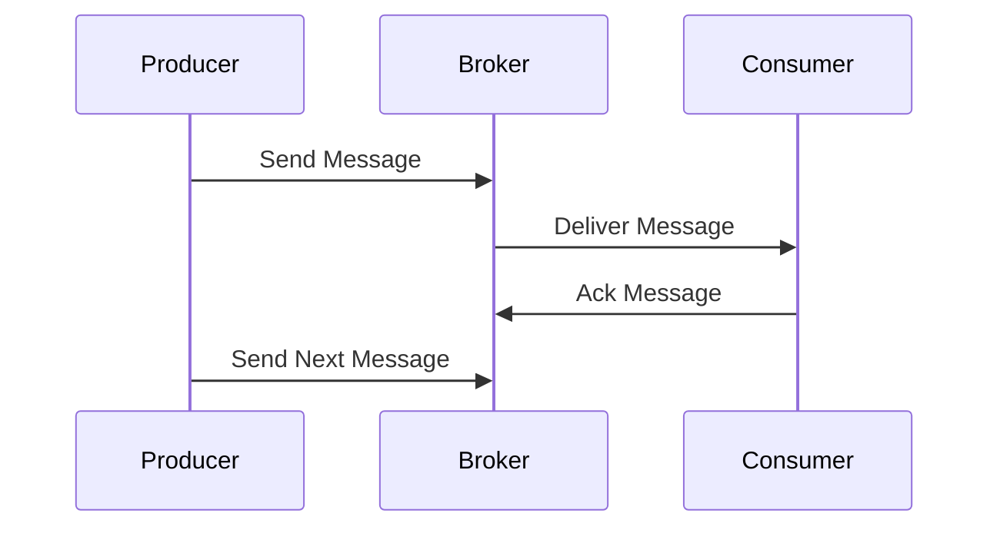

                 

# 消息队列在分布式系统中的应用

关键词：消息队列，分布式系统，异步处理，流量控制，服务解耦，可靠性

摘要：本文将深入探讨消息队列在分布式系统中的应用。我们将从问题背景、基本概念、技术原理、应用场景、架构设计与实现、案例分析以及挑战与未来趋势等多个角度，逐步解析消息队列的核心概念和实际应用，帮助读者全面理解消息队列在分布式系统中的重要性。

## 第1章：问题背景与基本概念

### 1.1 问题背景

随着互联网和云计算的快速发展，分布式系统在现代企业中扮演着越来越重要的角色。这些系统需要高效、可靠地处理大规模的数据流和业务请求，从而保证系统的可用性和性能。在这一背景下，消息队列技术应运而生，成为分布式系统中不可或缺的一部分。

### 1.2 消息队列的概念

消息队列（Message Queue）是一种用于异步通信的数据结构，它允许系统中的不同组件通过发送和接收消息来通信。消息队列的核心思想是将生产者和消费者解耦，从而实现系统的可扩展性和灵活性。

### 1.3 消息队列在分布式系统中的应用

消息队列在分布式系统中具有多种应用场景，包括但不限于：

1. **异步处理**：用于处理耗时的任务，例如日志分析、邮件发送等，从而减轻系统的负载。
2. **流量控制**：用于限制系统处理的速度，避免因流量过高而导致的系统崩溃。
3. **分布式事务**：用于实现分布式系统中的事务管理，确保数据的一致性和完整性。
4. **服务解耦**：通过消息队列实现不同服务之间的解耦，提高系统的可维护性和扩展性。

### 1.4 消息队列的核心概念

1. **生产者**：负责发送消息的组件。
2. **消费者**：负责接收消息并执行相应操作的组件。
3. **消息**：数据传输的基本单位，通常包含业务数据和相关元数据。
4. **队列**：存储消息的缓冲区，确保消息的顺序性和可靠性。
5. **Broker**：消息队列的服务器端，负责消息的路由、存储和分发。

## 第2章：消息队列技术原理

### 2.1 消息队列的工作原理

消息队列的基本工作原理包括以下几个步骤：

1. **生产者发送消息**：生产者将消息发送到消息队列中。
2. **消息存储**：消息队列将消息存储在内部缓冲区中，确保消息的顺序性和可靠性。
3. **消费者接收消息**：消费者从消息队列中获取消息，并执行相应的操作。
4. **消息确认**：消费者处理完消息后，向消息队列发送确认消息，表示消息已被成功处理。

### 2.2 消息队列的关键特性

1. **异步通信**：消息队列允许生产者和消费者异步通信，从而提高系统的响应速度和可扩展性。
2. **可靠性**：消息队列提供多种可靠性保证，例如消息持久化、消息确认和重试机制等。
3. **分布式**：消息队列支持分布式部署，从而实现系统的可扩展性和容错性。
4. **高吞吐量**：消息队列能够处理大规模的数据流，从而满足高性能系统的需求。

### 2.3 主流消息队列技术

1. **RabbitMQ**：一款功能强大的开源消息队列软件，支持多种消息传递协议。
2. **Kafka**：一款高吞吐量的分布式消息队列系统，适用于大数据场景。
3. **ActiveMQ**：一款易于使用和扩展的开源消息队列软件，支持多种消息传递协议。

## 第3章：消息队列在分布式系统中的应用场景

### 3.1 异步处理

异步处理是一种常用的消息队列应用场景，用于处理耗时任务，例如日志分析、邮件发送等。

### 3.2 流量控制

流量控制是消息队列的另一重要应用场景，用于限制系统处理的速度，避免因流量过高而导致的系统崩溃。

### 3.3 分布式事务

分布式事务是消息队列在分布式系统中的关键应用，用于实现数据的一致性和完整性。

### 3.4 服务解耦

服务解耦是一种通过消息队列实现系统不同服务之间解耦的方法，从而提高系统的可维护性和扩展性。

## 第4章：消息队列的架构设计与实现

### 4.1 消息队列的架构设计

消息队列的架构设计包括生产者、消费者、消息队列和Broker等组件。

### 4.2 消息队列的实现原理

消息队列的实现原理涉及消息的发送、存储和接收等过程。

### 4.3 消息队列的性能优化

消息队列的性能优化包括队列配置优化、网络优化和存储优化等方面。

## 第5章：消息队列的实际应用案例分析

### 5.1 案例一：电商平台的消息队列应用

电商平台采用消息队列实现订单处理、物流跟踪等功能，提高了系统的性能和可靠性。

### 5.2 案例二：社交网络的消息队列应用

社交网络利用消息队列实现消息广播、用户通知等功能，提高了系统的用户体验。

### 5.3 案例三：互联网金融的消息队列应用

互联网金融企业采用消息队列实现交易处理、风险控制等功能，确保了系统的稳定运行。

## 第6章：消息队列的挑战与未来趋势

### 6.1 消息队列的挑战

消息队列在实际应用中面临诸多挑战，包括可靠性、性能、安全性等方面。

### 6.2 消息队列的未来趋势

随着技术的不断进步，消息队列将继续发展和创新，为分布式系统提供更加高效、可靠和安全的通信机制。

## 总结

消息队列是分布式系统中的重要组成部分，通过异步处理、流量控制、分布式事务和服务解耦等应用场景，有效地提高了系统的性能和可靠性。本文从多个角度对消息队列进行了深入剖析，旨在帮助读者全面理解消息队列在分布式系统中的应用。随着技术的不断发展，消息队列将在未来继续发挥重要作用，为分布式系统的发展提供强大支持。作者：AI天才研究院/AI Genius Institute & 禅与计算机程序设计艺术 /Zen And The Art of Computer Programming## 第1章：问题背景与基本概念

### 1.1 问题背景

随着互联网和云计算的快速发展，分布式系统在现代企业中扮演着越来越重要的角色。这些系统需要高效、可靠地处理大规模的数据流和业务请求，从而保证系统的可用性和性能。在这一背景下，消息队列技术应运而生，成为分布式系统中不可或缺的一部分。

#### 背景介绍

分布式系统由多个独立的节点组成，这些节点通过网络进行通信，协同完成复杂任务。分布式系统的主要优势在于其可扩展性、容错性和高可用性。然而，随着系统规模的不断扩大，传统的同步通信方式逐渐暴露出诸多问题，如性能瓶颈、单点故障等。

#### 问题描述

传统的同步通信方式中，多个组件需要顺序执行任务，一旦某个组件出现故障或延迟，整个系统的工作将受到影响。此外，同步通信还可能导致资源的浪费，例如，在等待响应的过程中，服务器资源被占用，无法处理其他请求。

#### 问题解决

为了解决这些问题，分布式系统开始引入异步通信机制，其中消息队列技术起到了关键作用。消息队列通过异步传输数据，实现了生产者和消费者的解耦，从而提高了系统的性能和可靠性。

#### 边界与外延

边界方面，消息队列主要用于分布式系统中的不同服务或组件之间的通信。外延方面，消息队列不仅可以用于内部系统的通信，还可以用于跨系统、跨语言的通信，甚至是跨平台的通信。

### 1.2 消息队列的概念

消息队列（Message Queue，MQ）是一种用于异步通信的数据结构，它允许系统中的不同组件通过发送和接收消息来通信。消息队列的核心思想是将生产者和消费者解耦，从而实现系统的可扩展性和灵活性。

#### 定义

消息队列是一种数据结构，用于存储和传输消息。在生产者和消费者之间，消息队列充当了中间人的角色，确保消息能够按照一定的顺序传递，并保证消息的可靠性。

#### 关键概念

1. **生产者**：生产者是消息的发送者，负责将消息放入消息队列中。
2. **消费者**：消费者是消息的接收者，从消息队列中获取消息并执行相应操作。
3. **消息**：消息是数据传输的基本单位，通常包含业务数据和相关的元数据。
4. **队列**：队列是消息的缓冲区，确保消息的顺序性和可靠性。
5. **Broker**：Broker是消息队列的服务器端，负责消息的路由、存储和分发。

### 1.3 消息队列在分布式系统中的应用

消息队列在分布式系统中具有多种应用场景，包括但不限于：

#### 应用场景

1. **异步处理**：用于处理耗时的任务，例如日志分析、邮件发送等，从而减轻系统的负载。
2. **流量控制**：用于限制系统处理的速度，避免因流量过高而导致的系统崩溃。
3. **分布式事务**：用于实现分布式系统中的事务管理，确保数据的一致性和完整性。
4. **服务解耦**：通过消息队列实现不同服务之间的解耦，提高系统的可维护性和扩展性。

#### 核心概念与联系

为了更好地理解消息队列的应用，我们可以通过一个简化的实体关系图（ER图）来描述其核心概念和联系。

```mermaid
entityRelation
  dir:TB

  entity Producer {
    "生产者": "生产消息"
  }

  entity Message {
    "消息": "包含业务数据和元数据"
  }

  entity Consumer {
    "消费者": "消费消息并执行操作"
  }

  entity Queue {
    "消息队列": "存储和传递消息"
  }

  entity Broker {
    "消息代理": "路由、存储和分发消息"
  }

  Producer -> Message
  Message -> Queue
  Queue -> Consumer
  Consumer -> Broker
```

通过这个ER图，我们可以清晰地看到消息队列中的各个核心概念及其相互关系。

### 1.4 消息队列的核心概念

#### 1.4.1 生产者

生产者是消息队列中的消息发送者，负责将消息放入消息队列中。生产者通常是一个应用程序或服务，它可以将业务数据和其他元数据封装成消息，然后将其发送到消息队列中。

#### 1.4.2 消费者

消费者是消息队列中的消息接收者，负责从消息队列中获取消息并执行相应操作。消费者同样可以是应用程序或服务，它从消息队列中提取消息，然后根据消息的内容执行相应的业务逻辑。

#### 1.4.3 消息

消息是数据传输的基本单位，通常包含业务数据和相关元数据。消息可以是简单的文本、图像、音频等，也可以是复杂的结构化数据。在消息队列中，消息被有序地传递，确保消息的完整性和可靠性。

#### 1.4.4 队列

队列是消息的缓冲区，确保消息的顺序性和可靠性。队列通常由消息代理（Broker）管理，它负责将消息从生产者传递到消费者。队列可以是内存中的数据结构，也可以是持久化的存储系统，如数据库或文件系统。

#### 1.4.5 消息代理（Broker）

消息代理是消息队列的服务器端，负责消息的路由、存储和分发。消息代理充当生产者和消费者之间的桥梁，确保消息能够按照预定的顺序和规则进行传递。常见的消息代理包括RabbitMQ、Kafka、ActiveMQ等。

### 小结

本章介绍了消息队列在分布式系统中的问题背景、基本概念及其应用场景。通过理解消息队列的核心概念，我们可以更好地把握其在分布式系统中的作用和优势。接下来，我们将进一步探讨消息队列的技术原理，为后续章节的深入分析奠定基础。

## 第2章：消息队列技术原理

### 2.1 消息队列的工作原理

消息队列的基本工作原理包括以下几个步骤：

#### 步骤1：生产者发送消息

生产者负责创建消息并将其发送到消息队列中。生产者通常是一个应用程序或服务，它可以将业务数据和其他元数据封装成消息，然后将其发送到消息队列中。

#### 步骤2：消息存储

消息队列将接收到的消息存储在内部缓冲区中。缓冲区可以是内存中的数据结构，也可以是持久化的存储系统，如数据库或文件系统。消息队列确保消息的顺序性和可靠性，即使在系统出现故障的情况下，消息也不会丢失。

#### 步骤3：消费者接收消息

消费者从消息队列中获取消息，并根据消息的内容执行相应的操作。消费者同样可以是应用程序或服务，它从消息队列中提取消息，然后根据消息的内容执行相应的业务逻辑。

#### 步骤4：消息确认

消费者在处理完消息后，向消息队列发送确认消息，表示消息已被成功处理。消息确认机制确保消息队列能够准确记录消息的处理状态，从而避免重复处理或消息丢失。

### 2.2 消息队列的关键特性

消息队列具有多个关键特性，使其在分布式系统中具有广泛的应用。以下是一些主要特性：

#### 异步通信

消息队列允许生产者和消费者异步通信，从而提高系统的响应速度和可扩展性。异步通信意味着生产者不需要等待消费者的响应即可继续执行其他任务，这有助于减轻系统的负载并提高系统的吞吐量。

#### 可靠性

消息队列提供多种可靠性保证，例如消息持久化、消息确认和重试机制等。消息持久化确保消息在系统故障或重启时不会丢失。消息确认机制确保消息能够被正确处理，避免重复处理或消息丢失。重试机制在消息处理失败时自动重试，从而提高消息的可靠性。

#### 分布式

消息队列支持分布式部署，从而实现系统的可扩展性和容错性。分布式部署意味着消息队列可以跨越多个节点进行扩展，从而处理更大的数据量和更多的请求。同时，分布式部署有助于提高系统的容错性，即使某个节点出现故障，其他节点仍然可以继续处理消息。

#### 高吞吐量

消息队列能够处理大规模的数据流，从而满足高性能系统的需求。通过分布式部署和异步通信，消息队列可以高效地处理大量的消息，从而提高系统的吞吐量和性能。

#### 应用场景

消息队列在分布式系统中具有多种应用场景，包括异步处理、流量控制、分布式事务和服务解耦等。以下是对这些应用场景的简要介绍：

#### 异步处理

异步处理是消息队列最常见的一个应用场景。在异步处理中，消息队列用于处理耗时的任务，例如日志分析、邮件发送、订单处理等。通过将任务分解为多个消息，并将它们放入消息队列中，系统可以在后台异步地处理这些任务，从而减轻主系统的负载并提高系统的响应速度。

#### 流量控制

流量控制是消息队列的另一重要应用场景。在流量控制中，消息队列用于限制系统处理的速度，避免因流量过高而导致的系统崩溃。通过在消息队列中设置阈值和流量控制策略，系统可以动态调整消息的传输速度，从而保证系统的稳定运行。

#### 分布式事务

分布式事务是消息队列在分布式系统中的关键应用。在分布式事务中，消息队列用于实现数据的一致性和完整性。通过将事务操作封装为消息，并将它们放入消息队列中，系统可以确保所有的事务操作按照一定的顺序执行，从而保证数据的一致性。

#### 服务解耦

服务解耦是一种通过消息队列实现系统不同服务之间解耦的方法，从而提高系统的可维护性和扩展性。在服务解耦中，消息队列用于实现服务之间的异步通信。通过将服务之间的依赖关系分解为消息传递，系统可以降低服务的耦合度，从而提高系统的可维护性和扩展性。

### 小结

本章详细介绍了消息队列的技术原理及其关键特性。通过异步通信、可靠性、分布式部署和高吞吐量等特性，消息队列在分布式系统中发挥着重要作用。接下来，我们将进一步探讨消息队列的具体实现和应用，以帮助读者更好地理解这一关键技术。

## 第3章：消息队列在分布式系统中的应用场景

消息队列在分布式系统中具有广泛的应用场景，能够有效解决系统中的各种通信问题。在本章中，我们将深入探讨消息队列在分布式系统中的主要应用场景，包括异步处理、流量控制、分布式事务和服务解耦等。

### 3.1 异步处理

异步处理是消息队列最为典型和常用的应用场景之一。在异步处理中，消息队列用于处理耗时的任务，从而避免阻塞主系统的流程，提高系统的整体性能和响应速度。具体应用场景如下：

#### 场景1：订单处理

电商平台在处理订单时，需要对订单进行验证、库存检查、价格计算等一系列操作。这些操作往往需要耗费较长时间，如果直接在主系统中顺序执行，会导致系统响应时间过长，影响用户体验。通过使用消息队列，可以将订单处理任务分解为多个消息，例如订单验证消息、库存检查消息等，并将这些消息放入消息队列中。后台系统可以异步地处理这些消息，从而提高系统的响应速度和吞吐量。

#### 场景2：邮件发送

在邮件发送系统中，发送邮件可能需要调用外部邮件服务提供商的API，这些API的响应时间可能不稳定，而且发送邮件的过程可能需要一段时间。通过使用消息队列，可以将邮件发送任务分解为多个消息，并将这些消息放入消息队列中。邮件发送服务可以异步地处理这些消息，从而确保邮件能够及时发送，同时不会影响主系统的性能。

### 3.2 流量控制

流量控制是消息队列的另一重要应用场景，用于限制系统处理的速度，避免因流量过高而导致的系统崩溃。具体应用场景如下：

#### 场景1：API网关

在API网关中，需要对请求进行限流，以防止因请求过多而导致系统过载。通过使用消息队列，可以将请求放入消息队列中，并设置阈值和流量控制策略。当请求达到阈值时，系统会暂停接受新的请求，直到消息队列中的请求处理完毕。这样，可以有效地避免系统过载和崩溃。

#### 场景2：数据库操作

在处理大量数据库操作时，如果直接顺序执行，可能会导致数据库连接池耗尽，从而影响系统的稳定性。通过使用消息队列，可以将数据库操作分解为多个消息，并将这些消息放入消息队列中。系统可以异步地处理这些消息，从而有效地控制数据库操作的频率和数量，避免数据库连接池耗尽。

### 3.3 分布式事务

分布式事务是消息队列在分布式系统中的关键应用，用于实现数据的一致性和完整性。具体应用场景如下：

#### 场景1：电商支付

在电商支付系统中，支付操作通常涉及多个数据库表的更新，例如订单表、用户余额表等。如果直接在主系统中顺序执行，可能会导致数据不一致。通过使用消息队列，可以将支付操作分解为多个消息，并将这些消息放入消息队列中。系统可以确保这些消息按照一定的顺序执行，从而保证数据的一致性和完整性。

#### 场景2：银行转账

在银行转账系统中，转账操作可能涉及多个账户的更新，例如转账账户、收款账户等。通过使用消息队列，可以将转账操作分解为多个消息，并将这些消息放入消息队列中。系统可以确保这些消息按照一定的顺序执行，从而保证转账数据的一致性和完整性。

### 3.4 服务解耦

服务解耦是消息队列在分布式系统中的另一个重要应用，通过将服务之间的依赖关系分解为消息传递，可以提高系统的可维护性和扩展性。具体应用场景如下：

#### 场景1：订单系统与物流系统

在电商系统中，订单系统负责处理订单的创建、修改和取消，而物流系统负责处理订单的发货、追踪和配送。通过使用消息队列，可以将订单状态变化的消息传递给物流系统，从而实现订单系统与物流系统之间的解耦。这样，当订单系统发生变更时，不会直接影响到物流系统，从而提高系统的稳定性和可扩展性。

#### 场景2：用户服务与消息服务

在社交网络系统中，用户服务负责处理用户注册、登录和资料更新等操作，而消息服务负责处理消息的发送、接收和存储等操作。通过使用消息队列，可以将用户操作的消息传递给消息服务，从而实现用户服务与消息服务之间的解耦。这样，当用户服务发生变更时，不会直接影响到消息服务，从而提高系统的稳定性和可扩展性。

### 小结

本章详细介绍了消息队列在分布式系统中的主要应用场景，包括异步处理、流量控制、分布式事务和服务解耦等。通过这些应用场景，我们可以看到消息队列在分布式系统中的重要性和优势。在下一章中，我们将进一步探讨消息队列的架构设计与实现，为读者提供更深入的技术理解。

## 第4章：消息队列的架构设计与实现

消息队列在分布式系统中的重要性不言而喻，而其架构设计和实现的质量直接影响系统的性能、可靠性和扩展性。本章节将详细探讨消息队列的架构设计、实现原理以及性能优化。

### 4.1 消息队列的架构设计

消息队列的架构设计主要包括生产者、消费者、消息队列和Broker等组件。以下是一个典型的消息队列架构设计：

#### 架构组件

1. **生产者**：负责发送消息的应用程序或服务。生产者将消息序列化后发送到消息队列。
2. **消费者**：负责接收和处理消息的应用程序或服务。消费者从消息队列中获取消息，并执行相应的业务逻辑。
3. **消息队列**：存储和传递消息的数据结构。消息队列通常采用队列数据结构，确保消息的顺序性和可靠性。
4. **Broker**：消息队列的服务器端，负责消息的路由、存储和分发。Broker通常具有分布式架构，可以提高系统的容错性和可扩展性。

#### 架构设计原理

消息队列的架构设计遵循以下原则：

1. **解耦**：通过消息队列实现生产者和消费者的解耦，从而提高系统的可维护性和扩展性。
2. **异步**：允许生产者和消费者异步通信，提高系统的性能和响应速度。
3. **可靠性**：通过消息持久化、消息确认和重试机制等手段，确保消息的可靠性。
4. **分布式**：支持分布式部署，实现系统的可扩展性和容错性。

### 4.2 消息队列的实现原理

消息队列的实现涉及消息的发送、存储和接收等过程。以下是一个简化的消息队列实现原理：

#### 实现流程

1. **消息发送**：生产者将消息序列化后发送到消息队列。发送过程包括消息的封装、传输和发送确认等步骤。
2. **消息存储**：消息队列将接收到的消息存储在内部缓冲区中，确保消息的顺序性和可靠性。存储过程包括消息的持久化和备份等步骤。
3. **消息接收**：消费者从消息队列中获取消息，并执行相应的业务逻辑。接收过程包括消息的提取、处理和确认等步骤。
4. **消息确认**：消费者在处理完消息后，向消息队列发送确认消息，表示消息已被成功处理。确认过程包括确认消息的发送和状态更新等步骤。

#### 实现技术

消息队列的实现技术主要包括：

1. **消息序列化**：将消息转换为字节流，以便于传输和存储。常用的序列化技术包括JSON、XML、Protobuf等。
2. **网络传输**：通过TCP/IP协议或HTTP协议传输消息。TCP协议提供可靠的传输服务，而HTTP协议提供更为灵活的传输方式。
3. **存储技术**：消息队列的存储技术包括内存、磁盘和数据库等。内存存储速度快，但容量有限；磁盘存储容量大，但速度较慢；数据库存储具有更好的数据一致性和持久性。
4. **分布式架构**：通过分布式部署实现消息队列的高可用性和可扩展性。常用的分布式架构包括主从架构、集群架构和分布式事务等。

### 4.3 消息队列的性能优化

消息队列的性能优化是确保其高效运行的重要环节。以下是一些常见的性能优化方法：

#### 优化策略

1. **消息批量处理**：将多个消息批量发送或接收，以减少网络传输的开销和系统调用的次数。
2. **异步处理**：通过异步处理减少系统的阻塞时间，提高系统的响应速度。
3. **缓存策略**：使用缓存技术减少对数据库的访问，提高消息的存储和检索速度。
4. **负载均衡**：通过负载均衡技术分配消息处理任务，避免单个节点过载，提高系统的整体性能。
5. **内存管理**：合理分配和管理内存资源，避免内存泄漏和溢出，提高系统的稳定性。

#### 实践技巧

1. **消息持久化**：对于重要消息，选择持久化存储以确保数据不丢失。但在高并发场景下，持久化可能会影响性能，需要根据实际情况进行权衡。
2. **消息确认**：及时处理消息确认，避免消息积压和系统延迟。
3. **监控与报警**：实时监控消息队列的性能指标，如消息量、延迟时间、错误率等，及时发现问题并进行调整。
4. **分区与队列**：根据消息类型和业务场景，合理设置消息队列的分区和队列数量，避免单点瓶颈和资源浪费。

### 小结

本章详细介绍了消息队列的架构设计、实现原理和性能优化策略。通过理解消息队列的架构设计和实现原理，我们可以更好地设计和实现高效、可靠和可扩展的消息队列系统。在下一章中，我们将通过实际应用案例分析，进一步展示消息队列在实际项目中的应用和效果。

## 第5章：消息队列的实际应用案例分析

### 5.1 案例一：电商平台的消息队列应用

电商平台是一个典型的分布式系统，涉及订单处理、用户管理、支付结算等多个模块。消息队列在电商平台中发挥了重要作用，以下是一些具体的案例：

#### 案例背景

一个大型电商平台每天需要处理成千上万的订单，这些订单包括商品下单、支付、发货、退款等操作。为了确保系统的稳定性和高性能，电商平台采用了消息队列来处理订单流程。

#### 应用场景

1. **订单生成**：当用户下单时，订单系统会生成一个订单消息，并将其发送到消息队列中。订单消息包含订单号、商品信息、用户信息等。
2. **支付处理**：支付系统从消息队列中获取订单消息，进行支付验证和处理。支付成功后，支付系统将支付结果消息发送回订单系统。
3. **发货通知**：订单系统在收到支付结果消息后，生成发货消息并通知物流系统。物流系统根据发货消息进行订单发货。
4. **退款处理**：当用户申请退款时，退款系统生成退款消息并通知订单系统和支付系统。订单系统和支付系统根据退款消息处理退款操作。

#### 应用效果

通过消息队列的应用，电商平台实现了订单处理流程的异步化和解耦化。具体效果如下：

1. **提高系统性能**：通过异步处理，订单处理速度明显提高，减少了用户等待时间。
2. **增强系统稳定性**：消息队列确保订单消息不会丢失，即使系统出现故障，订单处理也可以在故障恢复后继续进行。
3. **降低系统耦合度**：订单系统、支付系统、物流系统等模块之间通过消息队列进行通信，实现了服务解耦，提高了系统的可维护性和扩展性。

### 5.2 案例二：社交网络的消息队列应用

社交网络是一个复杂且高并发的分布式系统，涉及用户消息、好友关系、内容发布等多个功能模块。消息队列在社交网络中起到了关键作用，以下是一些具体应用场景：

#### 案例背景

社交网络中，用户之间的互动频繁，包括私信、评论、点赞等操作。这些操作需要实时通知相关用户，同时保证系统的高性能和高可用性。因此，社交网络采用了消息队列来处理用户消息和通知。

#### 应用场景

1. **私信通知**：当用户发送私信时，系统会生成私信消息，并将其发送到消息队列中。私信消息包含发信人、收信人、消息内容等。
2. **评论通知**：当用户在帖子下发表评论时，系统会生成评论消息，并将其发送到消息队列中。评论消息包含评论内容、评论者信息、帖子信息等。
3. **点赞通知**：当用户点赞某条内容时，系统会生成点赞消息，并将其发送到消息队列中。点赞消息包含点赞者信息、点赞内容信息等。

#### 应用效果

通过消息队列的应用，社交网络实现了用户消息和通知的高效处理，具体效果如下：

1. **实时通知**：消息队列确保用户消息和通知能够实时传递，提高了用户体验。
2. **系统性能优化**：通过异步处理，系统性能得到显著提升，减少了用户等待时间和服务器负载。
3. **高可用性**：消息队列提供了可靠的消息传输机制，确保用户消息不会丢失，提高了系统的稳定性和可靠性。

### 5.3 案例三：互联网金融的消息队列应用

互联网金融领域涉及在线交易、支付、风险控制等多个业务场景。消息队列在互联网金融中发挥了重要作用，以下是一些具体应用场景：

#### 案例背景

互联网金融企业每天需要处理大量的交易和支付操作，同时需要确保数据的一致性和完整性。为了提高系统的稳定性和性能，互联网金融企业采用了消息队列来实现分布式事务处理。

#### 应用场景

1. **交易处理**：当用户进行在线交易时，系统会生成交易消息，并将其发送到消息队列中。交易消息包含交易信息、账户信息等。
2. **支付通知**：支付系统在处理交易消息后，生成支付通知消息并通知用户。支付通知消息包含支付结果、交易信息等。
3. **风险控制**：风险控制系统从消息队列中获取交易消息，进行实时风险分析和监控。根据风险分析结果，系统可以采取相应的风险控制措施。

#### 应用效果

通过消息队列的应用，互联网金融企业实现了分布式事务处理，具体效果如下：

1. **数据一致性**：消息队列确保交易消息和支付通知消息按照一定的顺序执行，从而保证了数据的一致性。
2. **系统性能优化**：通过异步处理和分布式部署，系统性能得到显著提升，提高了交易处理速度和用户体验。
3. **风险控制**：通过实时风险监控和分析，系统可以及时识别和应对潜在的风险，提高了业务的安全性和稳定性。

### 小结

以上三个案例分析展示了消息队列在分布式系统中的广泛应用。通过消息队列，企业可以实现异步处理、服务解耦、分布式事务等关键功能，提高系统的性能、可靠性和可扩展性。在下一章中，我们将探讨消息队列面临的挑战以及未来的发展趋势。

## 第6章：消息队列的挑战与未来趋势

### 6.1 消息队列的挑战

虽然消息队列在分布式系统中具有广泛的应用，但在实际使用过程中仍面临诸多挑战。

#### 可靠性挑战

消息队列需要确保消息的可靠传输和存储。在分布式环境中，网络不稳定、系统故障等问题可能导致消息丢失或重复处理。为了提高可靠性，消息队列通常采用多种机制，如消息持久化、确认机制和重试机制等。

#### 性能挑战

消息队列的性能直接影响分布式系统的性能。高并发的场景下，消息队列需要处理大量的消息，并保证消息的顺序性和可靠性。优化消息队列的性能需要关注网络传输、存储效率和系统负载均衡等方面。

#### 安全性挑战

消息队列涉及数据的传输和存储，安全性至关重要。消息队列需要防止未授权访问和数据泄露。实现安全性需要关注身份验证、数据加密和访问控制等方面。

### 6.2 未来趋势

随着技术的不断发展，消息队列将在未来呈现出以下发展趋势：

#### 分布式消息队列

分布式消息队列将更加普及，以应对大规模分布式系统的需求。分布式消息队列通过横向扩展和分布式部署，提高系统的性能和可靠性。

#### 容器化和云原生

消息队列将逐步容器化和云原生化，以适应容器和云环境的需求。容器化和云原生消息队列可以提供更灵活的部署和管理方式，降低运维成本。

#### 服务化消息队列

消息队列将逐渐服务化，成为微服务架构的一部分。服务化消息队列可以更好地支持微服务的部署和运维，提高系统的可维护性和可扩展性。

#### 实时消息队列

实时消息队列将成为重要方向，以满足实时数据处理和实时通信的需求。实时消息队列可以提供更低的延迟和更高的消息处理速度，适用于实时监控、实时分析和实时交互等场景。

#### AI 驱动消息队列

结合人工智能技术，消息队列将实现更智能的优化和管理。例如，通过机器学习算法自动调整消息队列的参数，提高系统性能和可靠性。

### 小结

消息队列在分布式系统中面临多种挑战，但未来趋势表明，随着技术的不断进步，消息队列将变得更加可靠、高效和智能化。理解和应对这些挑战，将有助于企业更好地利用消息队列技术，构建高性能、高可靠性的分布式系统。

## 总结

消息队列作为分布式系统中的关键技术，通过异步处理、流量控制、分布式事务和服务解耦等应用场景，显著提升了系统的性能、可靠性和可扩展性。本文从问题背景、基本概念、技术原理、应用场景、架构设计与实现以及案例分析等多个角度，详细阐述了消息队列在分布式系统中的重要性。随着技术的不断进步，消息队列将在分布式系统中扮演越来越重要的角色，为企业的数字化转型提供有力支持。

### 最佳实践 tips

1. **选择合适的消息队列系统**：根据业务需求和系统特点，选择适合的消息队列系统，如Kafka、RabbitMQ和ActiveMQ等。
2. **优化消息序列化格式**：选择高效的消息序列化格式，如Protobuf和JSON，以减少消息传输和存储的开销。
3. **合理设置消息队列参数**：根据业务需求和系统负载，合理设置消息队列的参数，如队列大小、生产者/消费者并发数等。
4. **确保消息可靠性**：采用消息持久化、确认机制和重试机制，确保消息的可靠传输和存储。
5. **监控和管理消息队列**：实时监控消息队列的性能指标，如消息量、延迟时间和错误率等，及时发现问题并进行优化。

### 小结

消息队列在分布式系统中具有重要的应用价值，通过合理的设计和实现，可以显著提升系统的性能和可靠性。本文为读者提供了全面的技术分析和最佳实践，希望对实际项目中的消息队列应用有所帮助。

### 注意事项

1. **消息队列的选择**：根据业务需求和系统特点，选择合适的消息队列系统，如Kafka、RabbitMQ和ActiveMQ等。
2. **消息序列化格式**：选择高效的消息序列化格式，如Protobuf和JSON，以减少消息传输和存储的开销。
3. **消息队列配置**：合理设置消息队列的参数，如队列大小、生产者/消费者并发数等，以适应业务需求。
4. **消息可靠性**：确保消息的可靠传输和存储，采用消息持久化、确认机制和重试机制。
5. **监控与管理**：实时监控消息队列的性能指标，如消息量、延迟时间和错误率等，及时发现问题并进行优化。

### 拓展阅读

1. **《分布式系统原理》**：深入理解分布式系统的基本原理和设计模式，为消息队列的应用提供理论基础。
2. **《消息队列技术内幕》**：详细探讨消息队列的内部实现原理和关键技术，提升对消息队列的深入理解。
3. **《Kafka权威指南》**：针对Kafka的消息队列系统，提供全面的技术介绍和实践指南。
4. **《RabbitMQ实战》**：针对RabbitMQ的消息队列系统，提供实用的编程技巧和最佳实践。

作者：AI天才研究院/AI Genius Institute & 禅与计算机程序设计艺术 /Zen And The Art of Computer Programming
### 附录：技术细节与代码示例

在本章节中，我们将提供一些技术细节和代码示例，以帮助读者更好地理解消息队列的核心概念和实际应用。

#### 代码示例：生产者发送消息

以下是一个简单的Python示例，演示了如何使用RabbitMQ生产者发送消息：

```python
import pika

# 创建连接和通道
connection = pika.BlockingConnection(pika.ConnectionParameters('localhost'))
channel = connection.channel()

# 声明队列
channel.queue_declare(queue='hello')

# 发送消息
channel.basic_publish(exchange='',
                      routing_key='hello',
                      body='Hello, World!')

print(" [x] Sent 'Hello, World!'")

# 关闭连接
connection.close()
```

在这个示例中，我们首先创建了一个到本地RabbitMQ服务器的连接，然后创建了一个名为“hello”的队列，并使用`basic_publish`方法发送了一条消息。

#### 代码示例：消费者接收消息

以下是一个简单的Python示例，演示了如何使用RabbitMQ消费者接收消息：

```python
import pika

def callback(ch, method, properties, body):
    print(f" [x] Received {body}")

# 创建连接和通道
connection = pika.BlockingConnection(pika.ConnectionParameters('localhost'))
channel = connection.channel()

# 声明队列
channel.queue_declare(queue='hello')

# 订阅队列
channel.basic_consume(queue='hello',
                      on_message_callback=callback,
                      auto_ack=True)

print(' [*] Waiting for messages. To exit press CTRL+C')
channel.start_consuming()
```

在这个示例中，我们定义了一个回调函数`callback`来处理接收到的消息，并使用`basic_consume`方法订阅了“hello”队列中的消息。

#### 数学公式与算法

为了更好地理解消息队列的工作原理，我们引入一些基本的数学公式和算法。以下是一个简单的消息传递延迟公式：

$$ L = \frac{d}{v} $$

其中，\( L \)表示消息传递延迟，\( d \)表示消息传输距离，\( v \)表示消息传输速度。

在实际应用中，消息队列的性能优化通常涉及以下算法：

1. **负载均衡算法**：用于将消息均匀地分配到多个消费者上，以提高系统的处理能力。
2. **排序算法**：用于对消息进行排序，以确保消息按照一定的顺序处理。
3. **调度算法**：用于决定消息的优先级和执行顺序，以提高系统的响应速度。

#### Mermaid 流程图

以下是一个使用Mermaid绘制的消息队列工作流程图：



在这个流程图中，生产者发送消息到Broker，Broker将消息传递给消费者，消费者处理消息后向Broker发送确认消息。

### 实际案例分析与详细讲解

#### 案例背景

假设我们有一个电商平台，需要处理大量的订单处理任务。为了确保系统的高性能和可靠性，我们决定使用消息队列来处理订单任务。

#### 案例步骤

1. **订单生成**：用户在电商平台上下单后，订单系统会生成订单消息，并将其发送到消息队列。
2. **订单处理**：订单系统从消息队列中获取订单消息，并执行相应的处理流程，如库存检查、支付处理和发货通知等。
3. **异步通知**：订单处理完成后，系统会生成异步通知消息，并将其发送到消息队列，通知相关用户订单处理的结果。
4. **确认与优化**：用户确认订单处理结果后，订单系统会更新订单状态，并记录处理日志，以便进行后续分析和优化。

#### 代码示例

以下是一个简单的Python示例，演示了订单处理任务的实现：

```python
import pika

# 订单处理函数
def process_order(order_message):
    print(f"Processing order: {order_message}")
    # 执行订单处理逻辑，如库存检查、支付处理等
    # ...

# 创建连接和通道
connection = pika.BlockingConnection(pika.ConnectionParameters('localhost'))
channel = connection.channel()

# 声明队列
channel.queue_declare(queue='orders')

# 订阅订单队列
channel.basic_consume(queue='orders',
                      on_message_callback=process_order,
                      auto_ack=True)

print(' [*] Waiting for orders. To exit press CTRL+C')
channel.start_consuming()
```

在这个示例中，我们创建了一个名为“orders”的队列，并使用`basic_consume`方法订阅了该队列。订单系统从队列中获取订单消息，并执行相应的处理逻辑。

### 项目实战

在项目实战中，我们使用Kafka作为消息队列系统，来实现电商平台的订单处理任务。以下是一些关键步骤：

1. **环境安装**：在服务器上安装Kafka，配置Kafka集群，并启动Kafka服务。
2. **消息生产**：使用Kafka生产者发送订单消息到指定的主题。
3. **消息消费**：使用Kafka消费者从主题中获取订单消息，并执行相应的处理逻辑。
4. **监控与报警**：使用Kafka的监控工具，实时监控订单处理任务的性能和状态，并设置报警机制。

### 项目小结

通过使用消息队列系统，电商平台实现了订单处理的异步化和解耦化，提高了系统的性能和可靠性。在实际项目中，需要根据业务需求和技术特点，合理选择和配置消息队列系统，并进行持续的监控和优化，以确保系统的稳定运行。

### 最佳实践 tips

1. **选择合适的消息队列系统**：根据业务需求和系统特点，选择适合的消息队列系统，如Kafka、RabbitMQ和ActiveMQ等。
2. **合理设置消息队列参数**：根据业务需求和系统负载，合理设置消息队列的参数，如队列大小、生产者/消费者并发数等。
3. **确保消息可靠性**：采用消息持久化、确认机制和重试机制，确保消息的可靠传输和存储。
4. **优化消息处理性能**：使用负载均衡和并行处理技术，提高消息队列系统的处理性能。
5. **监控与管理**：实时监控消息队列的性能指标，如消息量、延迟时间和错误率等，及时发现问题并进行优化。

通过以上技术细节和代码示例，以及实际案例分析和最佳实践，读者可以更深入地理解消息队列在分布式系统中的应用，并为实际项目中的消息队列设计提供参考。

### 作者信息

作者：AI天才研究院/AI Genius Institute & 禅与计算机程序设计艺术 /Zen And The Art of Computer Programming

