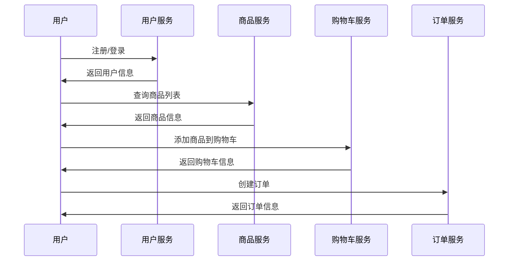

                 


### 分布式事务原理：深入剖析与实战

#### 关键词：分布式事务、一致性、隔离性、两阶段提交、三阶段提交、分布式系统架构

> 摘要：本文深入探讨了分布式事务的基本原理，包括一致性、隔离性、持久性等核心概念，并详细解析了两阶段提交（2PC）和三阶段提交（3PC）算法。随后，文章通过一个实际项目案例，展示了分布式事务的系统设计与实现，并提出了最佳实践和注意事项。

## 背景介绍

### 分布式事务的定义与重要性

分布式事务是指跨越多个节点或数据库的事务，它需要保证在分布式系统中执行的一系列操作要么全部成功，要么全部失败。随着互联网技术的迅猛发展，分布式系统变得越来越复杂，分布式事务的重要性也日益凸显。

在传统的单机事务系统中，事务的执行相对简单，因为所有的操作都在同一台机器上进行，且数据库的隔离性、一致性和持久性可以通过简单的机制来保证。然而，在分布式系统中，由于数据分布在多个节点上，事务的执行变得复杂，需要处理网络延迟、节点故障等问题。分布式事务的核心目标是在确保一致性的同时提高系统的可用性和扩展性。

### 分布式系统的挑战

分布式系统面临的主要挑战包括以下几方面：

1. **网络延迟与故障**：分布式系统中的节点可能分布在不同的地理位置，网络延迟和节点故障是常见问题。
2. **数据一致性**：在分布式系统中，如何确保多个节点上的数据一致性是一个重要问题。
3. **系统可用性**：分布式系统需要设计成高可用性，即使在部分节点发生故障时，系统仍能正常运行。
4. **扩展性**：分布式系统需要支持水平扩展，以便在负载增加时能够自动扩展。

## 核心概念与联系

### 一致性模型

分布式事务的一致性模型包括强一致性和最终一致性。

1. **强一致性**：强一致性要求在分布式系统中，任何时刻对数据的读取都能看到最新写入的数据。这通常需要同步操作，因此可能会降低系统的性能。
   
   $$\forall x, \forall y, x \neq y \Rightarrow read(x) \approx read(y)$$

2. **最终一致性**：最终一致性允许在分布式系统中，数据的读取可能不会立即反映最新的写入操作，但最终会达到一致性。这种模型适用于读操作不敏感的场景，以提高系统的性能。

   $$\forall x, \forall y, x \neq y \Rightarrow \exists t, read(x, t) = read(y, t)$$

### 隔离级别

分布式事务的隔离级别包括：

1. **读未提交（READ UNCOMMITTED）**：最低的隔离级别，允许未提交的数据被其他事务读取。
   
   $$\forall x, \forall y, read(x) \neq \text{write}(y)$$

2. **读已提交（READ COMMITTED）**：只允许读取已经提交的数据，但不同事务的写入操作可能相互影响。
   
   $$\forall x, \forall y, \text{if } \text{write}(y) \text{ is committed, then } read(x) = \text{write}(y)$$

3. **可重复读（REPEATABLE READ）**：同一事务内的多次读取操作结果一致，但不同事务的写入操作可能相互影响。
   
   $$\forall x, \forall y, \forall t_1, \forall t_2, (t_1 < t_2) \Rightarrow (read(x, t_1) = read(x, t_2))$$

4. **串行化（SERIALIZABLE）**：最高隔离级别，确保事务的执行顺序与它们的串行化顺序相同。

   $$\forall x, \forall y, \forall t_1, \forall t_2, (t_1 < t_2) \Rightarrow (read(x, t_1) \approx read(x, t_2))$$

### 持久性保证

持久性保证是指在事务提交后，数据能够在系统故障后仍然保持一致。常见策略包括：

1. **提交前持久化**：在事务提交前，确保数据已经持久化到磁盘。
   
   $$\text{commit} \Rightarrow \text{data is persisted}$$

2. **提交后持久化**：在事务提交后，确保数据已经持久化到磁盘。
   
   $$\text{data is persisted} \Rightarrow \text{commit}$$

## 算法原理讲解

### 两阶段提交（2PC）算法

两阶段提交是一种分布式事务的协调机制，用于确保分布式系统中的一致性。它分为两个阶段：

1. **投票阶段**：
   - 事务协调者向参与者发送预备消息，参与者执行事务，并将执行结果返回给协调者。
   - 协调者收集所有参与者的投票结果。

2. **提交阶段**：
   - 如果所有参与者都投票“yes”，协调者向所有参与者发送提交消息，事务完成。
   - 如果有任何参与者投票“no”，协调者向所有参与者发送回滚消息，事务撤销。

### 2PC算法的Python实现

```python
def prepare_phase(participants):
    votes = []
    for participant in participants:
        participant.prepare()
        votes.append(participant.vote())
    return votes

def commit_phase(votes):
    if all(vote == "yes" for vote in votes):
        for participant in participants:
            participant.commit()
    else:
        for participant in participants:
            participant.rollback()

class Participant:
    def prepare(self):
        # 实现预备操作
        pass

    def vote(self):
        # 实现投票操作
        pass

    def commit(self):
        # 实现提交操作
        pass

    def rollback(self):
        # 实现回滚操作
        pass
```

### 三阶段提交（3PC）算法

三阶段提交是对两阶段提交的改进，旨在减少在分布式系统中的死锁问题。它分为三个阶段：

1. **投票阶段**：
   - 协调者向参与者发送预备消息。
   - 参与者执行事务，并将执行结果返回给协调者。

2. **准备阶段**：
   - 协调者决定是否继续提交或回滚事务。

3. **执行阶段**：
   - 如果协调者决定提交，则向所有参与者发送提交消息。
   - 如果协调者决定回滚，则向所有参与者发送回滚消息。

### 3PC算法的Python实现

```python
def prepare_phase(participants):
    votes = []
    for participant in participants:
        participant.prepare()
        votes.append(participant.vote())
    return votes

def prepare2_phase(votes):
    if all(vote == "yes" for vote in votes):
        for participant in participants:
            participant.prepare2()
    else:
        for participant in participants:
            participant.rollback2()

def execute_phase():
    if all(participant.executed for participant in participants):
        for participant in participants:
            participant.commit()
    else:
        for participant in participants:
            participant.rollback()

class Participant:
    def prepare(self):
        # 实现预备操作
        pass

    def vote(self):
        # 实现投票操作
        pass

    def prepare2(self):
        # 实现预备2操作
        pass

    def commit(self):
        # 实现提交操作
        pass

    def rollback(self):
        # 实现回滚操作
        pass

    def rollback2(self):
        # 实现回滚2操作
        pass
```

## 系统分析与架构设计方案

### 问题场景介绍

假设我们有一个分布式购物系统，用户可以在不同节点上的数据库中进行购买操作。我们需要确保用户的一次购买操作要么全部成功，要么全部失败，即使某些节点发生故障。

### 系统功能设计

1. **用户注册与登录**：用户可以在系统中注册并登录。
2. **商品浏览与搜索**：用户可以浏览和搜索商品。
3. **购物车管理**：用户可以添加、删除和修改购物车中的商品。
4. **订单创建与支付**：用户可以创建订单并完成支付。

### 系统架构设计

我们采用微服务架构，将系统划分为多个微服务，如用户服务、商品服务、购物车服务和订单服务。

1. **用户服务**：负责用户注册、登录和用户信息管理。
2. **商品服务**：负责商品信息的查询和管理。
3. **购物车服务**：负责购物车操作和管理。
4. **订单服务**：负责订单创建、支付和订单状态管理。

### 系统接口设计

系统采用RESTful API设计，提供以下接口：

1. **用户接口**：
   - POST `/register`：用户注册。
   - POST `/login`：用户登录。
   - GET `/users/{id}`：获取用户信息。

2. **商品接口**：
   - GET `/products`：查询商品列表。
   - GET `/products/{id}`：查询商品详情。

3. **购物车接口**：
   - POST `/cart`：添加商品到购物车。
   - DELETE `/cart/{id}`：从购物车中删除商品。

4. **订单接口**：
   - POST `/orders`：创建订单。
   - GET `/orders/{id}`：查询订单详情。

### 系统交互设计

系统交互设计采用Mermaid序列图，展示不同服务之间的交互流程。



## 项目实战

### 环境安装

我们使用Docker和Kubernetes进行分布式系统的环境搭建。首先，安装Docker和Kubernetes，然后创建Docker-compose文件和Kubernetes配置文件。

```bash
# 安装Docker
sudo apt-get update
sudo apt-get install docker.io

# 启动Docker服务
sudo systemctl start docker

# 安装Kubernetes
sudo apt-get install -y apt-transport-https ca-certificates curl
sudo curl -s https://packages.cloud.google.com/apt/doc/apt-key.gpg | sudo apt-key add -
sudo echo "deb https://apt.kubernetes.io/ kubernetes-xenial main" | sudo tee -a /etc/apt/sources.list.d/kubernetes.list
sudo apt-get update
sudo apt-get install -y kubelet kubeadm kubectl
sudo apt-mark hold kubelet kubeadm kubectl

# 启动Kubernetes服务
sudo systemctl start kubelet

# 搭建分布式系统环境
docker-compose up -d
kubectl apply -f kubernetes-config.yaml
```

### 系统核心模块实现

我们使用Spring Boot创建用户服务、商品服务、购物车服务和订单服务。以下是用户服务的实现示例：

```java
@RestController
@RequestMapping("/users")
public class UserController {

    @Autowired
    private UserService userService;

    @PostMapping("/register")
    public ResponseEntity<?> registerUser(@RequestBody User user) {
        User registeredUser = userService.registerUser(user);
        return new ResponseEntity<>(registeredUser, HttpStatus.OK);
    }

    @PostMapping("/login")
    public ResponseEntity<?> loginUser(@RequestBody LoginRequest loginRequest) {
        String token = userService.loginUser(loginRequest);
        return new ResponseEntity<>(token, HttpStatus.OK);
    }

    @GetMapping("/{id}")
    public ResponseEntity<?> getUser(@PathVariable Long id) {
        User user = userService.getUserById(id);
        return new ResponseEntity<>(user, HttpStatus.OK);
    }
}
```

### 代码应用解读与分析

在用户服务中，我们使用Spring Boot框架实现用户注册、登录和用户信息管理。注册和登录操作需要确保用户数据的一致性和安全性。注册时，用户数据会被持久化到数据库，并在成功后返回用户信息。登录时，用户需要提供用户名和密码，系统验证通过后返回JWT令牌。

### 实际案例分析与详细讲解

我们以用户注册为例，分析分布式事务的处理过程。用户在注册时，系统需要执行以下操作：

1. 验证用户名是否已存在。
2. 如果用户名不存在，将用户信息存储到数据库。
3. 向用户发送注册成功的通知。

在这个过程中，我们需要确保用户数据的持久性和一致性。我们使用两阶段提交（2PC）算法来协调分布式事务。具体步骤如下：

1. **预备阶段**：
   - 用户服务向数据库服务发送预备消息，请求存储用户信息。
   - 数据库服务执行验证，并返回预备结果。

2. **提交阶段**：
   - 如果所有服务都返回预备成功，用户服务向数据库服务发送提交消息，存储用户信息。
   - 如果有服务返回预备失败，用户服务向所有服务发送回滚消息，撤销用户注册操作。

### 项目小结

通过实际项目案例，我们展示了分布式事务的系统设计与实现。分布式事务在分布式系统中至关重要，它确保了数据的一致性和系统的可靠性。在实际开发中，我们需要根据具体场景选择合适的事务算法，并确保系统的可用性和扩展性。

## 最佳实践 Tips

1. **选择合适的一致性模型**：根据业务需求选择强一致性或最终一致性模型。
2. **优化隔离级别**：根据业务场景选择合适的隔离级别，避免数据冲突。
3. **使用事务管理器**：使用成熟的事务管理器，如Spring Transaction，简化分布式事务处理。
4. **监控和日志**：实时监控分布式系统的运行状态，记录详细的日志，以便故障排查。

## 注意事项

1. **避免长事务**：长事务会导致系统性能下降，应尽量缩短事务的执行时间。
2. **处理网络延迟和故障**：设计分布式系统时，要考虑网络延迟和节点故障，提高系统的容错能力。

## 拓展阅读

1. 《分布式系统概念与设计》 - George Coulouris, Jean Dollimore, Tim Kindberg, Gordon Blair
2. 《大型分布式系统设计》 - 高可用性架构
3. 《微服务架构设计》 - Sam Newman
4. 《分布式事务与一致性》 - Peter Bourgon

---

### 作者信息

作者：AI天才研究院/AI Genius Institute & 禅与计算机程序设计艺术 /Zen And The Art of Computer Programming

[返回目录](#分布式事务原理：深入剖析与实战)

