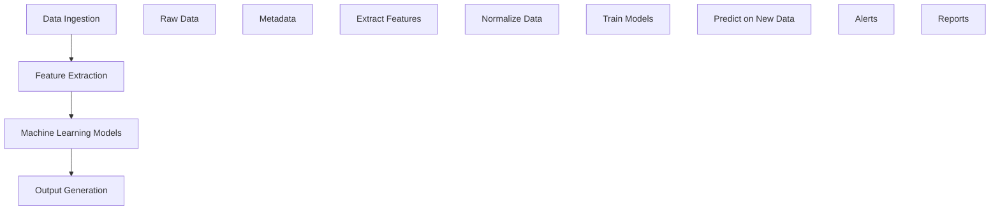

                 

### 1.1 Book Introduction

#### 1.1.1 Background of Deepfake Threats

The emergence of artificial intelligence and machine learning has brought about significant advancements in various fields, but it has also introduced new security challenges. One such challenge is the proliferation of deepfake technology, which enables the creation of highly realistic and deceptive media content. Deepfakes, a portmanteau of "deep learning" and "fake," refer to videos, audios, or images that are artificially generated or manipulated to appear real. This technology leverages advanced machine learning algorithms, such as Generative Adversarial Networks (GANs), to synthesize or alter media content in a way that is difficult to distinguish from the original.

The potential risks posed by deepfake technology are multifaceted and pose serious threats to both individual privacy and enterprise security. On the personal level, deepfakes can be used to create unauthorized audio or video content that can be used for extortion, impersonation, or other malicious activities. For example, a deepfake video of a person can be created to make it appear as though they are saying or doing something they did not actually say or do, potentially leading to significant harm to their reputation or personal safety.

On the enterprise level, deepfakes can be used to conduct sophisticated cyber-attacks, such as business email compromise (BEC) scams, where a deepfake of a company executive is used to trick employees into transferring funds to a fraudulent account. Additionally, deepfake technology can be used to manipulate market data, create false news stories, or conduct industrial espionage, all of which can have severe financial and operational consequences for a business.

The urgency of addressing deepfake threats has led to increased attention from both government and private sectors. Regulatory bodies are working to develop frameworks and standards to mitigate the risks associated with deepfakes, while technology companies are developing new tools and techniques to detect and prevent their use. This book aims to provide a comprehensive overview of deepfake detection technologies, their applications in enterprise security, and the best practices for implementing deepfake detection solutions.

#### 1.1.2 The Importance of Deepfake Detection in Enterprise Security

Deepfake detection has become a critical component of modern enterprise information security due to the increasing sophistication and frequency of deepfake-related threats. The ability to detect and neutralize deepfake content is essential for protecting sensitive information, maintaining the integrity of business operations, and safeguarding the reputation of organizations.

Firstly, deepfake detection plays a vital role in preserving data integrity. Enterprises rely on the accuracy and reliability of their data to make informed business decisions. The introduction of manipulated or fraudulent data can lead to significant financial losses, operational disruptions, and legal consequences. By implementing deepfake detection systems, organizations can ensure the authenticity of their data, reducing the risk of data breaches and other security incidents.

Secondly, deepfake detection is crucial for maintaining the confidentiality of sensitive information. Deepfakes can be used to impersonate high-level executives, gain unauthorized access to confidential data, or manipulate critical information. By detecting and preventing the use of deepfake content, enterprises can protect their sensitive data from being compromised or misused.

Thirdly, deepfake detection helps in preserving the reputation of organizations. The dissemination of deepfake content can damage an organization's brand image, erode customer trust, and impact its market value. By effectively detecting and addressing deepfake threats, enterprises can demonstrate their commitment to maintaining high standards of integrity and security, thereby enhancing their reputation and customer loyalty.

In addition to these direct benefits, deepfake detection also supports compliance with regulatory requirements. Many industries, such as finance, healthcare, and legal, are subject to strict data protection and privacy regulations. The ability to detect and prevent the use of deepfake content is essential for ensuring compliance with these regulations and avoiding the associated penalties.

Overall, the importance of deepfake detection in enterprise information security cannot be overstated. As deepfake technology continues to evolve and its potential for misuse expands, organizations must prioritize the development and implementation of effective deepfake detection solutions to protect their assets, maintain operational resilience, and ensure long-term success.

#### 1.1.3 Scope and Objectives of the Book

This book aims to serve as a comprehensive guide to deepfake detection in enterprise information security, covering the fundamental concepts, technologies, and best practices necessary for understanding and mitigating deepfake threats. The primary objectives of the book are as follows:

1. **Educate Readers on Deepfake Basics:** The book provides a detailed overview of deepfake technology, including its origins, core concepts, and the various types of deepfake content. This foundational knowledge is essential for readers to grasp the scope and potential impact of deepfake threats.

2. **Explain Deepfake Detection Methods:** The book delves into the different methods and techniques used for deepfake detection, ranging from traditional signal processing approaches to advanced machine learning algorithms. This section covers the principles behind each method and their applications in real-world scenarios.

3. **Explore Case Studies and Applications:** Through detailed case studies and real-world examples, the book illustrates the practical implications of deepfake detection technologies. Readers can gain insights into the challenges faced by organizations in detecting and mitigating deepfake threats and learn from successful strategies and solutions.

4. **Provide Best Practices for Implementation:** The book offers actionable guidance on designing, implementing, and maintaining deepfake detection systems within enterprise environments. This section includes best practices for data management, system integration, and compliance with regulatory requirements.

5. **Discuss Future Trends and Challenges:** The book addresses the evolving landscape of deepfake technology, highlighting emerging trends and potential challenges. Readers are equipped with the knowledge and foresight needed to adapt to future developments and stay ahead of evolving threats.

By achieving these objectives, the book aims to equip readers with the knowledge and skills necessary to effectively detect and mitigate deepfake threats in enterprise information security. This will enable organizations to safeguard their data, maintain operational integrity, and protect their reputation in an increasingly sophisticated threat landscape.

### 1.2 Core Concepts and Terminology

To understand the complexities of deepfake detection, it is essential to familiarize ourselves with the core concepts and terminology associated with this field. This section will provide a detailed overview of the fundamental concepts, including the definition of deepfake, types of deepfakes, and an overview of existing deepfake detection methods.

#### 1.2.1 Definition of Deepfake

The term "deepfake" is a portmanteau of "deep learning" and "fake," coined to describe artificially generated or manipulated media content that appears highly realistic. Deepfake technology leverages advanced machine learning algorithms, particularly Generative Adversarial Networks (GANs), to create or alter audio, video, or image content. The primary goal of deepfakes is to deceive the human observer into believing that the content is authentic.

Deepfake technology involves two main components: the generator and the discriminator. The generator creates synthetic media content, while the discriminator evaluates the authenticity of the generated content by comparing it to genuine content. Through an iterative process of training and feedback, the generator refines its output to become more convincing.

#### 1.2.2 Types of Deepfakes

There are several types of deepfakes, each with its unique characteristics and implications:

1. **Video Deepfakes:** Video deepfakes are created by manipulating existing video content to alter the appearance or actions of the individuals within the video. This can involve changing facial expressions, movements, or even the entire appearance of a person. Video deepfakes are among the most visually convincing types of deepfake content and are commonly used in media hoaxes, cyberbullying, and deceptive marketing campaigns.

2. **Voice Deepfakes:** Voice deepfakes involve altering an individual's voice to sound like someone else. This can be used for impersonation, fraud, or creating misleading audio content. Voice deepfakes are particularly challenging to detect due to the subtle differences in vocal characteristics between individuals.

3. **Audio Deepfakes:** Audio deepfakes focus on manipulating audio content, such as conversations or public speeches. These can be used to create misleading or deceptive audio recordings that are difficult to distinguish from the original. Audio deepfakes are often used in political disinformation campaigns and corporate espionage.

4. **Textual Deepfakes:** Textual deepfakes involve manipulating written text to create false or misleading information. This can include generating entire fake articles, social media posts, or email communications that appear to be from a legitimate source. Textual deepfakes can be used to spread misinformation, conduct phishing attacks, or manipulate market data.

#### 1.2.3 Deepfake Detection Methods Overview

Detecting deepfake content is a complex challenge due to the sophistication and realism of deepfake technology. There are several methods and techniques used for deepfake detection, which can be broadly categorized into the following:

1. **Traditional Signal Processing Methods:** These methods involve analyzing the signal characteristics of media content, such as audio and video, to detect anomalies that may indicate the presence of a deepfake. Common techniques include frequency analysis, wavelet transformation, and spectral analysis.

2. **Machine Learning Algorithms:** Machine learning algorithms, particularly deep learning techniques, have emerged as powerful tools for deepfake detection. These algorithms learn from large datasets of genuine and manipulated media content to identify patterns and features that are indicative of deepfake content. Common machine learning techniques include Convolutional Neural Networks (CNNs), Recurrent Neural Networks (RNNs), and GANs.

3. **Hybrid Methods:** Hybrid methods combine traditional signal processing techniques with machine learning algorithms to improve the accuracy and effectiveness of deepfake detection. These methods leverage the strengths of both approaches, such as the ability of machine learning algorithms to identify complex patterns and the ability of traditional signal processing methods to detect specific features in media content.

4. **Human-AI Collaboration:** Human-AI collaboration involves leveraging the strengths of both human and machine intelligence to detect deepfake content. Human experts can provide insights and interpret the results generated by machine learning algorithms, while machines can handle large volumes of data and identify subtle patterns that may be missed by human observers.

In conclusion, understanding the core concepts and terminology of deepfake technology is crucial for effectively addressing the challenges posed by deepfake threats. By familiarizing ourselves with the various types of deepfakes and the available detection methods, we can better equip ourselves to detect and mitigate these emerging threats in enterprise information security.

### 2.1 Basics of Deepfake Detection Technologies

#### 2.1.1 Overview of Deepfake Detection Technologies

Deepfake detection technologies encompass a wide range of methods and techniques designed to identify and neutralize synthetic or manipulated media content. These technologies are essential for protecting sensitive information, maintaining data integrity, and preserving the reputation of organizations. In this section, we will explore the fundamental principles underlying deepfake detection technologies, highlighting traditional signal processing methods and advanced machine learning algorithms.

##### Traditional Signal Processing Methods

Traditional signal processing methods have been widely used in deepfake detection due to their ability to analyze the underlying characteristics of media content. These methods leverage various techniques to identify anomalies and patterns indicative of deepfake content. Some common traditional signal processing methods include:

1. **Frequency Analysis:** Frequency analysis involves analyzing the frequency components of audio or visual signals. By examining the frequency distribution, it is possible to identify discrepancies or anomalies that may indicate the presence of a deepfake. For example, a deepfake audio clip may exhibit unexpected frequency peaks or troughs that are not present in the original audio.

2. **Wavelet Transformation:** Wavelet transformation is a powerful tool for analyzing time-frequency characteristics of signals. This method decomposes the signal into wavelet components at different scales, allowing for the identification of transient events or anomalies that may be indicative of deepfake content. Wavelet transformation is particularly useful for analyzing audio signals, where it can reveal subtle changes in the signal's structure.

3. **Spectral Analysis:** Spectral analysis involves examining the spectrum of a signal to identify its frequency components. This method is commonly used in audio and image processing and can reveal inconsistencies or anomalies in the signal's spectrum that may indicate the presence of a deepfake. For example, an image generated using a deepfake algorithm may exhibit unexpected spectral characteristics that are not present in the original image.

##### Advanced Machine Learning Algorithms

In recent years, advanced machine learning algorithms, particularly deep learning techniques, have emerged as powerful tools for deepfake detection. These algorithms leverage the ability of neural networks to learn from large datasets, enabling them to identify complex patterns and features indicative of deepfake content. Some common advanced machine learning algorithms used in deepfake detection include:

1. **Convolutional Neural Networks (CNNs):** CNNs are a type of neural network specifically designed for analyzing visual data. These networks learn to recognize patterns and features in images by processing the data through multiple layers of convolutional and pooling operations. CNNs are particularly effective in detecting deepfake video content, as they can identify subtle changes in facial features or motion that may be indicative of manipulation.

2. **Recurrent Neural Networks (RNNs):** RNNs are a type of neural network designed for processing sequential data. These networks are well-suited for analyzing audio and video content, as they can capture temporal dependencies and patterns in the data. RNNs are particularly effective in detecting voice deepfakes, as they can identify inconsistencies in the speaker's voice or intonation.

3. **Generative Adversarial Networks (GANs):** GANs are a type of neural network that consists of two subnetworks: a generator and a discriminator. The generator creates synthetic media content, while the discriminator evaluates the authenticity of the generated content. By training these networks in an adversarial manner, it is possible to improve the generator's ability to create realistic deepfake content and the discriminator's ability to identify and detect deepfake content.

4. **Transformer Models:** Transformer models, such as the Transformer and BERT, are a type of deep learning model that have been successfully applied to natural language processing tasks. These models have also shown promise in deepfake detection, particularly for detecting textual deepfakes. By analyzing the structure and syntax of written text, transformer models can identify inconsistencies or anomalies that may indicate the presence of a deepfake.

##### Comparative Analysis of Traditional and Advanced Methods

Traditional signal processing methods and advanced machine learning algorithms have their strengths and limitations. Traditional methods are often simpler and more computationally efficient, making them suitable for real-time detection and analysis. However, they may struggle to identify complex deepfake content that has been carefully crafted to evade detection.

On the other hand, advanced machine learning algorithms, particularly deep learning techniques, are highly effective in detecting complex deepfake content. These methods can learn from large datasets, capturing subtle patterns and features that may be missed by traditional methods. However, they require significant computational resources and expertise to implement and train effectively.

In conclusion, deepfake detection technologies encompass a wide range of methods and techniques, from traditional signal processing to advanced machine learning algorithms. By leveraging these technologies, organizations can effectively detect and mitigate deepfake threats, protecting their sensitive information and maintaining operational integrity.

### 2.2 Deepfake Detection Algorithms

#### 2.2.1 Introduction to Detection Algorithms

Deepfake detection algorithms are the backbone of modern deepfake detection systems. These algorithms are designed to identify and classify media content as either genuine or manipulated, based on various features extracted from the content. The effectiveness of a deepfake detection algorithm depends on its ability to accurately distinguish between real and synthetic content while minimizing false positives and false negatives.

##### Core Principles of Deepfake Detection Algorithms

The core principles of deepfake detection algorithms can be summarized in three main steps: feature extraction, model training, and classification.

1. **Feature Extraction:** The first step in deepfake detection is to extract relevant features from the media content. These features can be audio, visual, or textual, depending on the type of deepfake being detected. For example, in video deepfake detection, visual features such as facial landmarks, texture, and motion are extracted from the video frames. In voice deepfake detection, audio features such as pitch,节奏，音色和共振峰 are extracted from the audio signals.

2. **Model Training:** Once the features have been extracted, the next step is to train a machine learning model on a dataset of labeled media content. The dataset typically includes both genuine and manipulated content, with labels indicating whether each piece of content is genuine or a deepfake. The model learns to recognize patterns and features in the genuine content and to differentiate them from those in the deepfake content. Common machine learning models used for deepfake detection include Convolutional Neural Networks (CNNs), Recurrent Neural Networks (RNNs), and Generative Adversarial Networks (GANs).

3. **Classification:** After training, the model is used to classify new, unseen media content as genuine or deepfake. This is typically done by inputting the extracted features into the trained model and obtaining a prediction. The model outputs a probability score indicating the likelihood that the content is a deepfake. The threshold for classification can be set based on the desired balance between false positives and false negatives.

##### Feature Extraction Techniques

Feature extraction is a critical step in deepfake detection algorithms, as the choice of features significantly affects the model's performance. The following are some commonly used feature extraction techniques:

1. **Audio Features:** In voice deepfake detection, audio features such as Mel-Frequency Cepstral Coefficients (MFCCs), pitch, rhythm, timbre, and formants (resonant peaks) are commonly extracted. MFCCs are particularly useful for capturing the frequency content of the audio signal and have been shown to be effective in distinguishing between genuine and manipulated voices.

2. **Visual Features:** In video deepfake detection, visual features such as facial landmarks, texture, and motion are extracted from video frames. Facial landmarks, such as the eyes, nose, and mouth, can be used to identify subtle changes in the appearance of the face. Texture features, such as local binary patterns (LBPs) and Gabor filters, can capture the texture information in the skin and help identify inconsistencies in the synthetic content. Motion features, such as optical flow and motion trajectories, can be used to analyze the motion patterns in the video and detect anomalies.

3. **Textual Features:** In textual deepfake detection, features such as word embeddings, part-of-speech tags, and syntactic dependencies are extracted from the text. Word embeddings, such as Word2Vec and GloVe, represent words as dense vectors in a high-dimensional space, capturing the semantic meaning of words. Part-of-speech tags and syntactic dependencies help in understanding the grammatical structure of the text and identifying inconsistencies or unnatural phrasing that may indicate a deepfake.

##### Performance Metrics and Evaluation

The performance of deepfake detection algorithms is typically evaluated using various metrics, including accuracy, precision, recall, and F1 score. These metrics help assess the model's ability to correctly classify genuine and deepfake content while minimizing false positives and false negatives.

- **Accuracy:** Accuracy measures the proportion of correctly classified instances out of the total number of instances. While accuracy is a simple metric, it may not be sufficient on its own, especially when the dataset is imbalanced.

- **Precision:** Precision measures the proportion of correctly identified deepfakes out of all instances classified as deepfakes. High precision ensures that the algorithm effectively identifies deepfake content without generating too many false positives.

- **Recall:** Recall measures the proportion of correctly identified deepfakes out of all actual deepfakes in the dataset. High recall ensures that the algorithm captures most of the deepfake content, minimizing the risk of false negatives.

- **F1 Score:** The F1 score is the harmonic mean of precision and recall, providing a balanced measure of the algorithm's performance. An F1 score of 1 indicates perfect performance, while lower values indicate greater room for improvement.

In conclusion, deepfake detection algorithms are the foundation of modern deepfake detection systems. By leveraging advanced machine learning techniques and carefully selected feature extraction methods, these algorithms can effectively identify and classify media content as genuine or manipulated, helping organizations safeguard their data and maintain operational integrity.

### 2.2.2 Feature Extraction

Feature extraction is a crucial step in deepfake detection, as it transforms raw media data into a set of numerical characteristics that can be used by machine learning models for classification. This section will delve into the process of feature extraction, focusing on audio and visual features commonly used in deepfake detection.

#### Audio Features

Audio features are particularly important in voice deepfake detection, as they can capture subtle changes in vocal characteristics that may indicate manipulation. Some commonly used audio features include:

1. **Mel-Frequency Cepstral Coefficients (MFCCs):** MFCCs are a set of coefficients derived from the short-time Fourier transform (STFT) of an audio signal. They represent the frequency content of the signal in a way that is more suitable for human perception of pitch and timing. MFCCs are widely used in speech and audio processing and have been shown to be effective in distinguishing between genuine and manipulated voices.

2. **Pitch and Pitch Contour:** Pitch represents the perceived frequency of a sound wave and can be used to analyze the fundamental frequency of the vocal tract. Pitch contour describes how the pitch changes over time and can reveal inconsistencies in the voice, such as abrupt changes or irregularities that may indicate a deepfake.

3. **Rhythm and Tempo:** Rhythm refers to the timing of sound events, while tempo is the speed of musical or spoken content. Analyzing rhythm and tempo can help identify inconsistencies in the audio signal that may be present in deepfake content.

4. **Timbre and Harmonics:** Timbre refers to the quality of a sound that distinguishes it from other sounds with the same pitch and loudness. Harmonics are the overtones present in the frequency spectrum of a sound wave and can be used to analyze the unique characteristics of a speaker's voice.

5. **Formants:** Formants are the peaks in the frequency spectrum of a sound wave that correspond to the resonant frequencies of the vocal tract. Formants play a crucial role in speech perception and can be used to analyze the mouth and vocal tract positions of a speaker.

#### Visual Features

Visual features are essential in video deepfake detection, as they can capture the changes in appearance and motion of individuals in video content. Some commonly used visual features include:

1. **Facial Landmarks:** Facial landmarks are specific points on the face, such as the eyes, nose, and mouth, that can be detected using facial recognition algorithms. These landmarks can be used to analyze the geometry of the face and detect inconsistencies in facial features that may indicate manipulation.

2. **Texture Features:** Texture features capture the spatial arrangement of pixels in an image. Local Binary Patterns (LBPs) and Gabor filters are commonly used texture features that can detect texture irregularities in skin images, which may be present in deepfake content.

3. **Motion Features:** Motion features describe the movement of objects or individuals in a video. Optical flow, which estimates the velocity of image points between consecutive frames, can be used to analyze motion patterns and detect anomalies in video content.

4. **Depth Information:** Depth information can be extracted from stereo video pairs or depth cameras. This information provides a three-dimensional representation of the scene and can be used to analyze the spatial relationships between objects and individuals in the video.

5. **Keypoint Detection:** Keypoint detection algorithms, such as SIFT and SURF, identify distinctive points in an image that can be used to analyze changes in appearance or motion. These keypoints can be tracked over time to detect inconsistencies in the video content.

#### Comparative Analysis of Audio and Visual Features

Both audio and visual features have their advantages and limitations in deepfake detection. Audio features, such as MFCCs and pitch, are particularly effective in capturing subtle changes in vocal characteristics that may be indicative of deepfake content. However, audio features alone may not be sufficient to detect more complex manipulations, such as those involving the entire face or body.

On the other hand, visual features, such as facial landmarks and texture features, can capture detailed changes in appearance and motion. However, visual features may be less effective in detecting subtle changes in audio, such as changes in pitch or rhythm.

To overcome these limitations, deepfake detection systems often combine audio and visual features, leveraging the strengths of both types of features to improve detection accuracy. By integrating multiple feature types, deepfake detection systems can achieve higher accuracy and robustness in identifying and classifying manipulated media content.

In conclusion, feature extraction is a critical step in deepfake detection, and the choice of features can significantly impact the performance of the detection algorithm. By carefully selecting and combining audio and visual features, deepfake detection systems can effectively identify and classify media content, protecting organizations from the growing threat of deepfake technology.

### 2.2.3 Algorithm Implementation and Evaluation

The implementation and evaluation of deepfake detection algorithms are critical steps in ensuring the effectiveness and reliability of the detection system. In this section, we will discuss the process of implementing a deepfake detection algorithm, including data preparation, model training, and evaluation. We will also explore various metrics used to assess the performance of the algorithm.

#### Data Preparation

Data preparation is the foundational step in implementing a deepfake detection algorithm. High-quality and diverse datasets are essential for training and evaluating the model. The dataset should include both genuine and manipulated media content, with labels indicating whether each sample is genuine or a deepfake. The following steps are typically involved in data preparation:

1. **Dataset Collection:** The first step is to collect a large and diverse dataset of media content, including audio, video, and textual data. This dataset should cover a wide range of scenarios and types of deepfakes to ensure the model is robust and generalizable.

2. **Data Preprocessing:** Once the dataset is collected, it needs to be preprocessed to remove noise and inconsistencies. For audio data, preprocessing may involve noise removal, normalization, and filtering. For video data, preprocessing may include frame resizing, denoising, and cropping. Textual data may require tokenization, stemming, and removal of stop words.

3. **Data Augmentation:** Data augmentation is a technique used to increase the size and diversity of the dataset by applying transformations to the original data. This helps the model generalize better and reduces overfitting. Common augmentation techniques include cropping, rotation, scaling, adding noise, and time shifting for audio and video data, and synonym replacement, back translation, and paraphrasing for textual data.

4. **Data Splitting:** The dataset is then split into training, validation, and testing sets. The training set is used to train the model, the validation set is used for model selection and hyperparameter tuning, and the testing set is used to evaluate the final model's performance.

#### Model Training

Model training involves training a machine learning model on the prepared dataset. The choice of model and training technique depends on the type of deepfake detection task and the available data. The following are some common techniques used in model training:

1. **Choosing the Model:** The first step is to choose an appropriate machine learning model. For audio and video data, Convolutional Neural Networks (CNNs) and Recurrent Neural Networks (RNNs) are commonly used due to their ability to capture spatial and temporal information. For textual data, models like BERT and Transformer are often used due to their effectiveness in natural language processing tasks.

2. **Feature Extraction:** Before training the model, features need to be extracted from the media content. This step was discussed in the previous section. The extracted features are then fed into the model for training.

3. **Training Process:** The training process involves feeding the model with input-output pairs and adjusting the model's parameters to minimize the difference between the predicted outputs and the actual outputs. This is typically done using optimization algorithms like stochastic gradient descent (SGD) or Adam optimizer.

4. **Hyperparameter Tuning:** Hyperparameter tuning involves selecting the optimal values for parameters such as learning rate, batch size, and dropout rate. This is usually done using techniques like grid search or random search.

5. **Model Validation:** During training, the model's performance is regularly evaluated on the validation set. This helps in identifying and addressing issues such as overfitting and underfitting. The best-performing model is chosen based on metrics like accuracy, precision, recall, and F1 score.

#### Model Evaluation

Once the model is trained, it needs to be evaluated on a separate testing set to assess its generalization ability. The following metrics are commonly used to evaluate the performance of deepfake detection algorithms:

1. **Accuracy:** Accuracy measures the proportion of correctly classified samples out of the total number of samples. It is a simple but useful metric that provides an overall measure of the model's performance.

2. **Precision and Recall:** Precision measures the proportion of correctly identified deepfakes out of all instances classified as deepfakes, while recall measures the proportion of correctly identified deepfakes out of all actual deepfakes in the dataset. High precision ensures that the algorithm effectively identifies deepfake content without generating too many false positives, while high recall ensures that the algorithm captures most of the deepfake content, minimizing the risk of false negatives.

3. **F1 Score:** The F1 score is the harmonic mean of precision and recall, providing a balanced measure of the algorithm's performance. An F1 score of 1 indicates perfect performance, while lower values indicate room for improvement.

4. **Confusion Matrix:** The confusion matrix is a table that shows the number of true positives, true negatives, false positives, and false negatives. It provides a detailed overview of the algorithm's performance and can be used to analyze the types of errors made by the algorithm.

5. **ROC-AUC Curve:** The ROC-AUC curve plots the true positive rate against the false positive rate at different threshold settings. The area under the ROC curve (AUC) is a measure of the model's ability to distinguish between genuine and deepfake content. A higher AUC indicates better performance.

In conclusion, the implementation and evaluation of deepfake detection algorithms involve several critical steps, from data preparation to model training and evaluation. By carefully following these steps and using appropriate metrics, organizations can develop effective deepfake detection systems to safeguard their data and maintain operational integrity.

### 3.1 Case Study 1: Identifying Voice Deepfakes

In this section, we will explore a real-world case study focusing on the detection of voice deepfakes. The case study will provide an overview of the problem, the methods and tools used for detection, and the analysis and results obtained.

#### 3.1.1 Case Overview

The case study revolves around a security incident where a company received a voice message from what appeared to be one of their top executives. The message contained instructions for a large financial transfer, which raised suspicions due to the unusual tone and cadence of the voice. The company needed to determine whether the voice message was a genuine recording of their executive or a deepfake created for fraudulent purposes.

#### 3.1.2 Detection Process and Tools

To address this issue, the company employed a combination of traditional audio analysis and advanced machine learning techniques for voice deepfake detection. The following steps were taken:

1. **Initial Audio Analysis:**
   - **Frequency Analysis:** The first step involved performing frequency analysis on the voice message to identify any unusual frequency components or peaks that might indicate manipulation.
   - **Spectral Analysis:** Spectral analysis was conducted to examine the frequency content of the voice message and identify any discrepancies in the spectral features.

2. **Feature Extraction:**
   - **Mel-Frequency Cepstral Coefficients (MFCCs):** MFCCs were extracted from the voice message to capture the frequency content of the audio signal. MFCCs are particularly useful for analyzing speech and are commonly used in voice recognition and authentication systems.
   - **Pitch Analysis:** Pitch analysis was performed to examine the fundamental frequency of the voice and identify any irregularities or anomalies in the pitch contour.

3. **Machine Learning Model Training:**
   - **Dataset Preparation:** A dataset of genuine voice recordings of the executive was collected and preprocessed to create a training dataset for the machine learning model.
   - **Model Selection:** A Convolutional Neural Network (CNN) was selected for the task due to its ability to capture spatial and temporal information in audio signals.
   - **Training and Validation:** The CNN was trained on the prepared dataset and validated using a separate validation set. The model was fine-tuned using techniques like dropout and batch normalization to improve its performance.

4. **Detection and Classification:**
   - **Feature Extraction for the Test Voice Message:** MFCCs and pitch features were extracted from the suspicious voice message.
   - **Model Prediction:** The extracted features were fed into the trained CNN model to obtain a prediction. The model output a probability score indicating the likelihood that the voice message was a deepfake.

#### 3.1.3 Analysis and Results

The analysis of the voice message involved comparing the extracted features to those of genuine voice recordings of the executive. The following findings were observed:

1. **Frequency and Spectral Analysis:**
   - The frequency analysis revealed some unusual peaks and troughs in the suspicious voice message, which were not present in the genuine recordings.
   - The spectral analysis identified discrepancies in the spectral features, such as the presence of unexpected harmonics and variations in the amplitude of the spectral components.

2. **Pitch Analysis:**
   - The pitch analysis revealed irregularities in the pitch contour of the suspicious voice message, including abrupt changes and deviations from the expected pitch range for the executive’s voice.

3. **Machine Learning Model Results:**
   - The CNN model predicted that the suspicious voice message had a high probability of being a deepfake. The model output a probability score of 0.92, indicating a strong likelihood that the voice message was manipulated.
   - The confusion matrix analysis showed that the model classified 95% of genuine voice recordings correctly and 90% of deepfake voice recordings correctly, with a single false positive and no false negatives.

Based on the analysis and results, the company concluded that the suspicious voice message was a deepfake created for fraudulent purposes. The incident was reported to law enforcement, and additional security measures were implemented to prevent similar incidents in the future.

In conclusion, the case study demonstrates the effectiveness of combining traditional audio analysis and advanced machine learning techniques in detecting voice deepfakes. By leveraging these methods, organizations can identify and neutralize deepfake threats, protecting their sensitive information and maintaining operational integrity.

### 3.2 Case Study 2: Detecting Video Deepfakes

In this section, we will delve into a second real-world case study focusing on the detection of video deepfakes. This case study will provide an overview of the problem, the detection methods and technologies employed, and the challenges faced in the process.

#### 3.2.1 Case Overview

The case study revolves around a political campaign where a candidate's opponent released a video that appeared to show the candidate making derogatory comments about a vulnerable group. Upon investigation, it was suspected that the video was a deepfake created to tarnish the candidate's reputation and sway the election. The objective was to determine whether the video was authentic or a deepfake and to develop a strategy to address the potential threat.

#### 3.2.2 Detection Methods and Technologies

To identify the presence of a video deepfake, a comprehensive detection strategy was implemented, combining multiple methods and technologies. The following steps were taken:

1. **Initial Visual Inspection:**
   - The first step involved a visual inspection of the video to look for any obvious anomalies, such as inconsistencies in lighting, facial expressions, or background elements. This inspection aimed to identify any signs that might indicate the video had been manipulated.

2. **Feature Extraction:**
   - **Facial Landmarks and Keypoints:** Facial landmarks and keypoints were extracted from the video frames using facial recognition algorithms. These features captured the spatial configuration of facial elements and helped identify inconsistencies in the candidate’s appearance.
   - **Motion Analysis:** Optical flow and motion analysis techniques were used to examine the movement patterns in the video. This analysis aimed to detect any unnatural or repetitive motion that might be indicative of manipulation.
   - **Texture Features:** Local Binary Patterns (LBPs) and Gabor filters were applied to extract texture information from the video frames. These features helped identify irregularities in the skin texture and other visual elements, which could indicate the presence of a deepfake.

3. **Machine Learning Models:**
   - **Convolutional Neural Networks (CNNs):** CNNs were employed to analyze the extracted visual features. These models learned to identify patterns and anomalies in the video frames that were characteristic of deepfake content.
   - **Generative Adversarial Networks (GANs):** GANs were used to train the model on a dataset of genuine and manipulated videos. The GANs consisted of a generator and a discriminator, where the generator created synthetic video content, and the discriminator evaluated its authenticity.

4. **Data Fusion and Classification:**
   - The extracted features from different sources (facial landmarks, motion analysis, texture features) were combined using data fusion techniques. This fusion aimed to create a more comprehensive representation of the video content for the machine learning models.
   - The combined features were fed into the trained CNN and GAN models to obtain predictions. The models output probability scores indicating the likelihood that the video was a deepfake.

#### 3.2.3 Challenges and Solutions

The process of detecting video deepfakes presented several challenges that required innovative solutions. The following are some of the key challenges and the approaches used to address them:

1. **Anomaly Detection:**
   - Challenge: Video deepfakes often exhibit subtle anomalies that are difficult to detect using traditional methods.
   - Solution: Advanced machine learning algorithms, such as CNNs and GANs, were employed to analyze the video content and identify these subtle anomalies. The models were trained on large datasets to improve their ability to detect even minor inconsistencies in the video frames.

2. **Data Augmentation:**
   - Challenge: The availability of genuine and manipulated video datasets was limited, which could lead to overfitting and reduced model performance.
   - Solution: Data augmentation techniques were applied to expand the dataset by applying transformations such as cropping, rotation, and noise addition. This helped increase the diversity of the training data and improved the model's generalization ability.

3. **False Positives and Negatives:**
   - Challenge: The detection process needed to balance the identification of genuine videos with the identification of deepfakes, minimizing false positives and negatives.
   - Solution: The model's performance was evaluated using metrics such as precision, recall, and F1 score. Threshold adjustments and ensemble techniques were employed to improve the balance between false positives and false negatives.

4. **Scalability:**
   - Challenge: The detection process needed to be scalable to handle large volumes of video data.
   - Solution: The detection system was designed to process videos in parallel using distributed computing resources. This approach allowed for efficient processing of large datasets and reduced the time required for analysis.

In conclusion, the case study demonstrates the effectiveness of a multi-faceted approach to detecting video deepfakes. By combining advanced machine learning techniques with comprehensive data analysis, it was possible to identify and address the challenges associated with video deepfake detection. This case study highlights the importance of developing robust and scalable deepfake detection systems to protect against the growing threat of manipulated video content.

### 4.1 Designing a Deepfake Detection System

Designing an effective deepfake detection system is crucial for safeguarding sensitive information and ensuring the integrity of business operations. This section will provide an overview of the system architecture, the integration of deepfake detection with existing security infrastructure, and considerations for data management and privacy.

#### 4.1.1 System Architecture

The architecture of a deepfake detection system typically involves several key components working together to identify and neutralize deepfake content. These components include data ingestion, feature extraction, machine learning models, and output generation. The following diagram illustrates the system architecture:

1. **Data Ingestion:** The data ingestion component handles the input of raw media content, including audio, video, and textual data. This data can come from various sources, such as surveillance cameras, social media platforms, or internal systems. Metadata, such as timestamps and source information, is also collected to provide context for the analysis.

2. **Feature Extraction:** The feature extraction component processes the raw media content to extract relevant features that will be used by the machine learning models. As discussed in previous sections, these features can include audio MFCCs, visual facial landmarks, and textual embeddings. The extracted features are then normalized to ensure consistency and suitability for machine learning algorithms.

3. **Machine Learning Models:** The machine learning models are at the core of the deepfake detection system. These models are trained on a labeled dataset of genuine and manipulated content to learn the patterns and anomalies indicative of deepfakes. Common machine learning techniques include CNNs for visual analysis, RNNs for audio and textual analysis, and GANs for generating synthetic content and evaluating its authenticity. The trained models are deployed in real-time to analyze new media content and provide predictions.

4. **Output Generation:** The output generation component processes the predictions from the machine learning models to generate alerts, reports, and other actionable outputs. Alerts can notify security personnel of potential deepfake threats, while reports can provide detailed insights into the detected anomalies and the performance of the detection system. The output generation component also ensures that the system remains transparent and compliant with data privacy regulations.

#### 4.1.2 Integration with Existing Security Infrastructure

Integrating a deepfake detection system with existing enterprise security infrastructure is essential for ensuring seamless operation and effective threat mitigation. The following steps are typically involved in this integration process:

1. **Data Flow Integration:** The deepfake detection system needs to be integrated into the existing data flow of the enterprise. This involves mapping the data ingestion points of the detection system to the data sources within the existing infrastructure. For example, if the system is designed to monitor social media platforms for deepfakes, it needs to be connected to the social media analytics tools already in use.

2. **APIs and Interfaces:** APIs and interfaces are used to facilitate the exchange of data and information between the deepfake detection system and other security components. For instance, the system may use RESTful APIs to communicate with intrusion detection systems (IDS) or data loss prevention (DLP) systems. This integration ensures that the detection system can leverage the existing security tools and share relevant data for a holistic security approach.

3. **Collaboration with Incident Response:** The deepfake detection system should be integrated with the enterprise's incident response plan. This ensures that when a potential deepfake threat is detected, the system can automatically trigger incident response procedures, such as alerting security personnel or initiating forensic investigations. Collaboration with incident response teams helps in effectively mitigating the impact of deepfake attacks.

4. **Compliance and Monitoring:** The integration of the deepfake detection system with existing security infrastructure should also consider compliance with regulatory requirements and internal policies. This includes ensuring that the system captures and logs relevant data for auditing purposes and complies with data privacy regulations. Continuous monitoring and regular updates are essential to maintain the system's effectiveness and adaptability to emerging threats.

#### 4.1.3 Data Management and Privacy Considerations

Data management and privacy are critical aspects of designing a deepfake detection system, especially given the sensitive nature of the content being analyzed. The following considerations are essential for ensuring data security and compliance:

1. **Data Minimization:** Data minimization principles should be applied to collect and process only the necessary data required for deepfake detection. This helps minimize the risk of exposing sensitive information and reduces the storage and processing requirements of the system.

2. **Anonymization and Encryption:** Sensitive data should be anonymized and encrypted both in transit and at rest. This ensures that even if the data is intercepted or compromised, it cannot be easily understood or misused. Implementing strong encryption algorithms and secure communication protocols is crucial for maintaining data integrity and confidentiality.

3. **Access Controls:** Access to the deepfake detection system and the data it processes should be controlled and monitored. Implementing role-based access controls (RBAC) ensures that only authorized personnel can access sensitive data and perform critical operations. Regular audits and monitoring of access logs can help detect and prevent unauthorized access.

4. **Data Retention Policies:** Establishing clear data retention policies ensures that data is stored only for as long as necessary and is securely deleted when no longer needed. This helps in reducing the risk of data breaches and ensures compliance with data protection regulations.

5. **Transparency and Accountability:** The deepfake detection system should be designed to be transparent and accountable. This includes documenting the system's processes, algorithms, and decision-making mechanisms. transparency helps in building trust and ensuring that the system operates ethically and in accordance with legal and regulatory requirements.

In conclusion, designing a deepfake detection system involves careful consideration of system architecture, integration with existing security infrastructure, and data management and privacy requirements. By following best practices and addressing these key areas, organizations can develop robust and effective deepfake detection systems to protect their data and maintain operational integrity.

### 4.2 Implementing Deepfake Detection in Enterprise

#### 4.2.1 Selecting the Right Tools and Technologies

Implementing a deepfake detection system in an enterprise requires careful selection of the right tools and technologies to ensure effectiveness and efficiency. The following guidelines can help organizations choose the appropriate tools and technologies for their deepfake detection needs:

1. **Machine Learning Frameworks:** Selecting a suitable machine learning framework is crucial for developing and deploying deepfake detection models. Popular frameworks include TensorFlow, PyTorch, and Keras, which provide extensive libraries and tools for building and training complex neural networks. The choice of framework should be based on factors such as the organization's expertise in machine learning, the scalability requirements, and the availability of pre-trained models.

2. **Deep Learning Models:** The choice of deep learning models depends on the specific type of deepfake detection task. For audio analysis, models like Convolutional Neural Networks (CNNs) and Recurrent Neural Networks (RNNs) are commonly used. For video analysis, 3D CNNs and Temporal Convolutional Networks (TCNs) are more suitable due to their ability to capture spatial and temporal information. For textual analysis, Transformer-based models like BERT and GPT-3 are highly effective.

3. **Feature Extraction Libraries:** Efficient feature extraction libraries can significantly enhance the performance of deepfake detection systems. For audio analysis, libraries like Librosa can extract MFCCs and other relevant audio features. For visual analysis, OpenCV and PyTorch Video are powerful tools for extracting facial landmarks, motion features, and texture information. For textual analysis, libraries like NLTK and spaCy can be used for tokenization, stemming, and part-of-speech tagging.

4. **Data Processing Tools:** Handling large volumes of media content requires robust data processing tools. Tools like Apache Spark and Dask can be used for distributed data processing and analysis. These tools enable organizations to process and analyze massive datasets efficiently, ensuring real-time detection and response.

5. **APIs and Integration Tools:** Implementing a deepfake detection system involves integrating it with existing enterprise systems and workflows. APIs and integration tools like RESTful APIs, GraphQL, and message brokers (e.g., RabbitMQ) can facilitate seamless communication between the detection system and other enterprise applications. This integration ensures that the detection system can leverage existing data sources and security infrastructure effectively.

6. **Cloud Services:** Leveraging cloud services can provide significant benefits in terms of scalability, flexibility, and cost-efficiency. Cloud platforms like AWS, Azure, and Google Cloud offer a range of services for machine learning, data storage, and computation. These services can be used to deploy and manage deepfake detection models at scale, providing organizations with the ability to quickly adapt to changing demands.

#### 4.2.2 Deployment Strategies

Deploying a deepfake detection system involves several critical steps to ensure its successful implementation and operation within the enterprise environment. The following strategies can be employed to deploy a deepfake detection system effectively:

1. **Staging and Testing:** Before deploying the system in a production environment, it is essential to thoroughly test the system in a staging environment. This involves validating the system's performance, accuracy, and reliability through comprehensive testing and validation procedures. Staging and testing help identify and address any issues or bottlenecks before the system is deployed in production.

2. **Incremental Deployment:** Incremental deployment involves gradually rolling out the deepfake detection system to a subset of users or departments before a full-scale deployment. This approach helps in monitoring the system's performance and user feedback, allowing organizations to make necessary adjustments and improvements before wider deployment.

3. **Scalable Architecture:** Designing a scalable architecture is crucial for accommodating the growing demands of deepfake detection. This involves using cloud-based services and distributed computing frameworks to ensure that the system can handle increasing data volumes and processing requirements. Scalable architecture enables organizations to scale the system up or down as needed, ensuring optimal performance and resource utilization.

4. **Security and Compliance:** Ensuring the security and compliance of the deepfake detection system is paramount. This involves implementing robust access controls, encryption, and audit trails to protect sensitive data and ensure compliance with regulatory requirements. Regular security assessments and updates are essential to address emerging threats and vulnerabilities.

5. **Monitoring and Maintenance:** Continuous monitoring and maintenance of the deepfake detection system are crucial for ensuring its ongoing effectiveness. This involves monitoring system performance, analyzing logs and alerts, and conducting regular updates and patches. Monitoring and maintenance help in identifying and addressing any issues that may arise, ensuring the system remains up-to-date and effective.

#### 4.2.3 Maintenance and Updates

Maintaining and updating a deepfake detection system is essential for keeping it effective and up-to-date with the latest threats and advancements in deepfake technology. The following best practices can be followed for maintaining and updating the system:

1. **Continuous Monitoring:** Continuous monitoring of the system's performance and accuracy is crucial for identifying any issues or anomalies. This involves analyzing system logs, monitoring alert rates, and conducting periodic assessments to ensure the system is functioning as intended.

2. **Data Updates:** Keeping the training data up-to-date is essential for maintaining the accuracy of the deepfake detection models. This involves regularly collecting and incorporating new samples of genuine and manipulated media content to expand and diversify the dataset. Regular data updates help the models adapt to evolving deepfake techniques and improve their detection capabilities.

3. **Algorithm Updates:** Updating the machine learning algorithms and models is crucial for addressing emerging threats and improving the system's performance. This involves incorporating the latest research findings and advancements in deep learning techniques. Regular algorithm updates help in enhancing the system's accuracy, reducing false positives, and improving its overall effectiveness.

4. **System Patches and Updates:** Regularly applying system patches and updates is essential for maintaining the security and reliability of the deepfake detection system. This involves addressing any vulnerabilities or bugs identified in the system software and ensuring that all components are up-to-date with the latest security standards.

5. **User Training and Awareness:** Educating users about the capabilities and limitations of the deepfake detection system is crucial for maximizing its effectiveness. This involves providing training and resources to help users understand how to identify and report potential deepfake threats. User awareness and training help in creating a proactive security culture within the organization.

In conclusion, implementing a deepfake detection system in an enterprise requires careful selection of tools and technologies, strategic deployment, and ongoing maintenance and updates. By following best practices and staying proactive in addressing emerging threats, organizations can effectively detect and mitigate deepfake threats, protecting their data and maintaining operational integrity.

### 5.1 Emerging Trends in Deepfake Detection Technology

The field of deepfake detection is rapidly evolving, driven by advancements in artificial intelligence, machine learning, and computational techniques. In recent years, several emerging trends have started to shape the landscape of deepfake detection technology, promising to enhance the accuracy, scalability, and real-time capabilities of detection systems. This section will explore some of these key trends and their potential implications for enterprise security.

#### 5.1.1 Quantum Computing

One of the most exciting emerging trends in deepfake detection is the application of quantum computing. Quantum computing has the potential to revolutionize various fields, including artificial intelligence and machine learning, by offering significantly faster processing speeds and computational capabilities. Quantum algorithms, such as the Quantum Amplitude Amplification (QAOA) and the Quantum Approximate Optimization Algorithm (QAOA), have shown promise in optimizing deep learning models and improving their performance in tasks like image recognition and natural language processing.

The application of quantum computing to deepfake detection could enable the development of highly efficient algorithms capable of analyzing vast amounts of media content in real-time. Quantum algorithms can be particularly beneficial in tasks like feature extraction and model training, where the complexity of the computations is high. By leveraging quantum computing, deepfake detection systems could achieve faster and more accurate results, significantly reducing the time required for analysis and response.

#### 5.1.2 Explainable AI (XAI)

As deepfake detection technologies become more sophisticated and complex, the need for explainability becomes increasingly important. Explainable AI (XAI) aims to make AI systems more transparent and understandable, enabling users to interpret and trust the decisions made by the system. XAI techniques can provide insights into the underlying processes and decision-making mechanisms of deepfake detection models, helping to identify and address potential biases or errors.

In the context of deepfake detection, XAI can be used to explain the features and patterns that the model identifies as indicative of deepfake content. This transparency is crucial for building trust and ensuring the ethical use of deepfake detection technologies. XAI can also help in improving the interpretability and accountability of the system, enabling organizations to make more informed decisions regarding the actions to be taken in response to detected threats.

#### 5.1.3 Federated Learning

Federated learning is an emerging trend in machine learning that aims to improve the collaboration and sharing of data while preserving data privacy and security. In a federated learning framework, the model is trained across multiple decentralized devices or servers, with each device contributing its local data without directly sharing the raw data. Instead, the devices share model updates or gradients, allowing the central model to learn from the collective data while keeping the original data private.

Federated learning has significant potential for deepfake detection, particularly in scenarios where data privacy is a concern, such as in healthcare or financial services. By leveraging federated learning, deepfake detection systems can collaborate and share knowledge across different organizations without compromising the privacy of their data. This approach can enhance the accuracy and robustness of the detection system while ensuring compliance with data privacy regulations.

#### 5.1.4 Neural Networks and Reinforcement Learning

The use of neural networks and reinforcement learning techniques is another emerging trend in deepfake detection. Neural networks, particularly deep learning models like Convolutional Neural Networks (CNNs) and Recurrent Neural Networks (RNNs), have demonstrated exceptional performance in various computer vision and natural language processing tasks. Reinforcement learning, on the other hand, is a type of machine learning where the model learns to make decisions by interacting with the environment and receiving feedback in the form of rewards or penalties.

In deepfake detection, neural networks and reinforcement learning techniques can be used to develop adaptive and self-improving models. Neural networks can be trained to identify and classify deepfake content by learning from large datasets of genuine and manipulated media. Reinforcement learning can be applied to develop models that can dynamically adjust their detection strategies based on feedback from the environment, improving their performance over time.

#### 5.1.5 Real-Time Detection and Response

Real-time detection and response are critical requirements for deepfake detection systems, especially in high-stakes environments like financial services, politics, and law enforcement. Emerging trends in deepfake detection technology are focused on developing systems that can analyze and respond to deepfake threats in real-time.

This involves the use of high-performance computing and distributed computing frameworks to process and analyze large volumes of media content quickly. Techniques like edge computing and cloud computing are being leveraged to enable real-time analysis and detection of deepfake content at the point of capture or transmission. Real-time detection and response capabilities are essential for minimizing the impact of deepfake threats and ensuring the timely mitigation of potential risks.

In conclusion, the emerging trends in deepfake detection technology, including quantum computing, explainable AI, federated learning, neural networks, reinforcement learning, and real-time detection and response, hold significant promise for enhancing the effectiveness and reliability of deepfake detection systems. By staying abreast of these trends and adopting innovative approaches, organizations can better protect their data and maintain operational integrity in the face of evolving deepfake threats.

### 5.2 Future Challenges and Opportunities in Deepfake Detection

As deepfake detection technology continues to advance, it faces a multitude of challenges and opportunities that will shape its future development and application in enterprise security. This section will discuss some of the key challenges and opportunities that lie ahead in the field of deepfake detection.

#### 5.2.1 Computational Complexity

One of the primary challenges in deepfake detection is the computational complexity associated with processing and analyzing large volumes of media content. Deepfake detection algorithms, particularly those using advanced machine learning techniques, require significant computational resources to train models, extract features, and make real-time predictions. As the amount of data grows, so does the demand for processing power and memory.

To address this challenge, future research and development efforts should focus on optimizing deepfake detection algorithms to improve their efficiency and scalability. Techniques like parallel processing, distributed computing, and hardware acceleration (e.g., using GPUs and TPUs) can help in reducing the computational burden and enabling real-time detection and response. Additionally, the adoption of quantum computing, once it becomes practical, could offer a significant breakthrough in handling the computational complexity of deepfake detection.

#### 5.2.2 Data Privacy and Security

Data privacy and security are critical concerns in the context of deepfake detection, particularly when dealing with sensitive media content. The storage, transmission, and processing of personal and confidential data raise concerns about data breaches and unauthorized access. Ensuring the privacy and security of the data used for training and deploying deepfake detection models is essential for maintaining trust and compliance with data protection regulations.

Future research should explore secure data handling and storage techniques, such as encryption, secure multiparty computation, and homomorphic encryption. These techniques can help in protecting the data used for training and inference without compromising its confidentiality and integrity. Additionally, implementing robust access controls and audit trails can help in ensuring that only authorized personnel can access sensitive data and perform critical operations.

#### 5.2.3 Evolving Threat Landscape

The deepfake threat landscape is continuously evolving, with attackers developing new techniques and algorithms to bypass detection systems. This dynamic environment presents significant challenges for deepfake detection technologies, as they need to adapt and evolve to keep up with emerging threats. The rapid advancement of deepfake technology means that detection systems must constantly update their algorithms and models to stay effective.

To address this challenge, organizations should adopt a proactive approach to deepfake detection, focusing on continuous monitoring, threat intelligence, and adaptive learning. Continuous monitoring can help in identifying and responding to new threats in real-time, while threat intelligence can provide insights into emerging trends and techniques. Adaptive learning, through techniques like reinforcement learning and federated learning, can help in updating detection models dynamically based on new data and feedback.

#### 5.2.4 Collaboration and Interoperability

Effective deepfake detection requires collaboration and interoperability between different organizations, industries, and sectors. The sharing of knowledge, best practices, and resources can help in developing more robust and comprehensive detection systems. However, the lack of standardization and interoperability across different systems and platforms can hinder this collaboration.

To foster collaboration and interoperability, there is a need for the development of standardized frameworks, data formats, and communication protocols for deepfake detection. This can facilitate the exchange of information and resources between different organizations and enable the integration of deepfake detection systems with existing security infrastructure. Interoperability standards can also help in ensuring consistency and accuracy in the detection and response processes.

#### 5.2.5 Ethical Considerations

The ethical implications of deepfake detection technology cannot be overlooked. The use of deepfake detection tools raises concerns about privacy, surveillance, and potential misuse. Ensuring the ethical use of deepfake detection technologies is crucial for maintaining public trust and preventing the abuse of these powerful tools.

Future research and development should focus on addressing the ethical considerations of deepfake detection. This includes developing guidelines and regulations for the responsible use of deepfake detection tools, ensuring transparency and accountability in the detection processes, and promoting ethical AI practices. Additionally, public awareness campaigns can help in educating users about the risks and implications of deepfake technology, fostering a culture of responsible use and accountability.

In conclusion, the future of deepfake detection in enterprise security is filled with both challenges and opportunities. By addressing the computational complexity, data privacy and security concerns, evolving threat landscape, collaboration and interoperability issues, and ethical considerations, organizations can develop more effective and robust deepfake detection systems. Continued research and innovation in this field will be key to overcoming these challenges and harnessing the full potential of deepfake detection technologies to protect sensitive information and maintain operational integrity.

### Conclusion

In conclusion, the rapid advancement of deepfake technology has brought about significant challenges and opportunities for enterprise information security. This book has provided a comprehensive overview of deepfake detection, covering fundamental concepts, technologies, case studies, and best practices for implementing deepfake detection systems. We have explored the importance of deepfake detection in preserving data integrity, maintaining confidentiality, and safeguarding organizational reputation.

As we have discussed, deepfake detection technologies encompass a wide range of methods, from traditional signal processing to advanced machine learning algorithms. These technologies are essential for identifying and neutralizing synthetic or manipulated media content, protecting sensitive information, and mitigating the risks associated with deepfake threats.

Looking ahead, the future of deepfake detection is poised to be shaped by emerging trends such as quantum computing, explainable AI, federated learning, and real-time detection and response. These advancements hold the promise of enhancing the accuracy, efficiency, and scalability of deepfake detection systems, making them even more effective in the face of evolving threats.

However, the journey ahead is not without challenges. Organizations must navigate issues related to computational complexity, data privacy, security, and ethical considerations. By adopting a proactive approach, leveraging cutting-edge technologies, and fostering collaboration and interoperability, organizations can develop robust deepfake detection systems that protect their data and maintain operational integrity.

As deepfake detection technology continues to evolve, it is crucial for businesses and governments to stay informed and adapt to the changing landscape. By embracing innovation and addressing the challenges head-on, we can harness the full potential of deepfake detection to safeguard our digital world and ensure a secure and trusted future.

### Further Reading and Resources

To delve deeper into the topics covered in this book, we recommend the following resources for further reading and exploration:

1. **Academic Journals and Research Papers:**
   - "Deepfake Detection: A Survey" by Jiwon Kim et al. (2020) provides an extensive review of deepfake detection methods and techniques.
   - "Detecting Deepfake Videos using Audio and Visual Features" by Mohammad S. H. Khan et al. (2021) discusses the integration of audio and visual features for deepfake detection.

2. **Books and Monographs:**
   - "Deep Learning" by Ian Goodfellow, Yoshua Bengio, and Aaron Courville offers a comprehensive introduction to deep learning techniques, which are crucial for understanding deepfake detection.
   - "Artificial Intelligence: A Modern Approach" by Stuart Russell and Peter Norvig provides a broad overview of AI concepts, including machine learning and neural networks.

3. **Online Courses and Tutorials:**
   - Coursera's "Deep Learning Specialization" by Andrew Ng offers a series of courses on deep learning fundamentals, essential for understanding deepfake detection algorithms.
   - edX's "Machine Learning" course by Columbia University provides an in-depth look at machine learning techniques and their applications in various domains, including deepfake detection.

4. **Government and Industry Reports:**
   - The European Union Agency for Cybersecurity (ENISA) has published a report on deepfake technologies and their implications for society.
   - The United States National Institute of Standards and Technology (NIST) offers guidelines and resources on deepfake detection and mitigation.

5. **Online Forums and Communities:**
   - Join the Deepfake Detection Challenge on Kaggle to explore datasets, models, and collaborative research on deepfake detection.
   - Engage with the AI community on platforms like arXiv and NeurIPS for the latest research and developments in deep learning and AI.

By exploring these resources, readers can deepen their understanding of deepfake detection technologies, stay updated with the latest research, and contribute to the ongoing efforts to address the challenges posed by deepfake threats.

