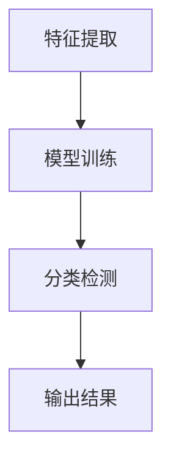
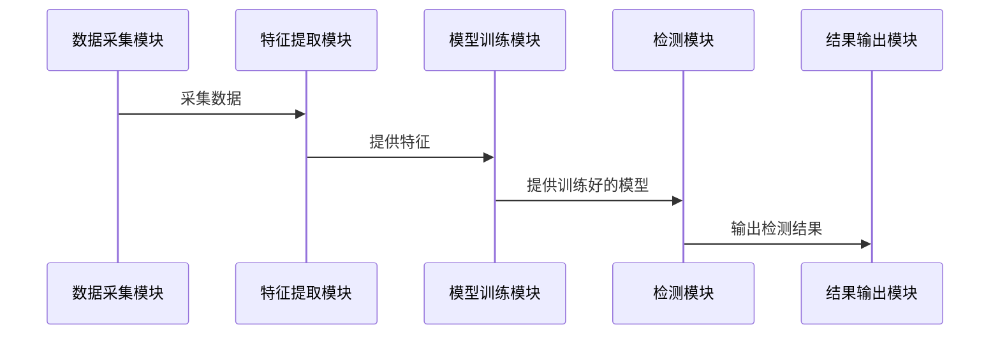
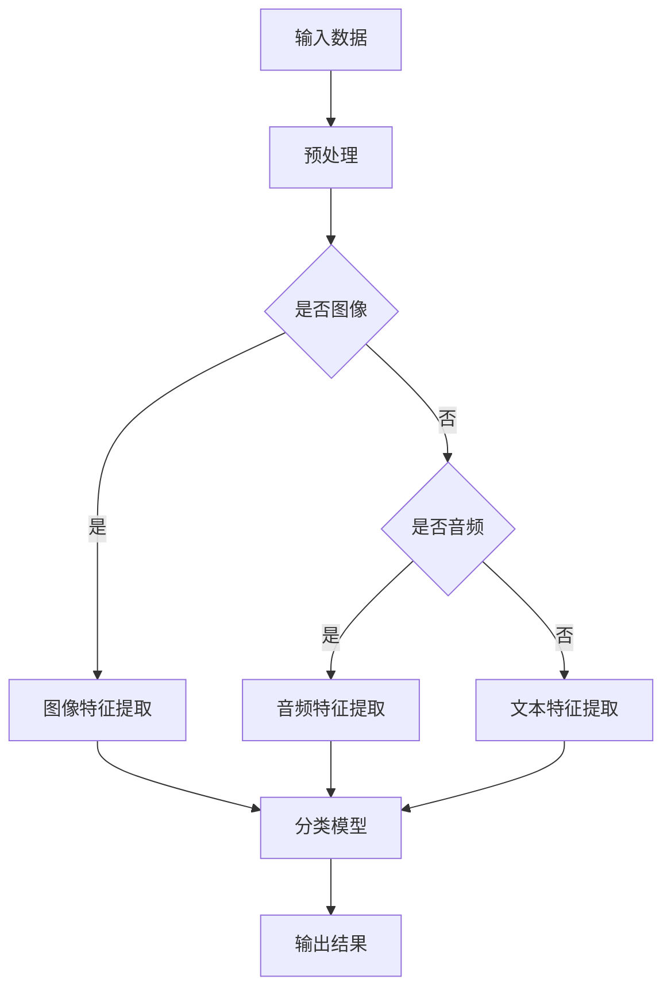

                 

# 深度伪造检测：企业信息安全的新前线

关键词：深度伪造，企业安全，人工智能，图像识别，音频分析

摘要：随着深度伪造技术的日益普及，企业信息安全面临着前所未有的挑战。本文将从深度伪造的定义、检测技术、案例分析以及企业解决方案等方面进行深入探讨，旨在为企业和信息安全专家提供有效的防护策略，提升企业信息安全水平。

## 第一步：深度伪造的定义与背景

### 1.1 深度伪造的定义

深度伪造（Deepfake）是指利用人工智能（AI），特别是深度学习技术，生成虚假的音频、视频、图像等内容。这些伪造内容模仿真实人物的行为和特征，几乎难以区分真伪。深度伪造技术的核心在于生成逼真的伪造内容，从而欺骗人类视觉和听觉系统。

### 1.2 深度伪造的威胁

深度伪造技术不仅对个人隐私造成严重威胁，还可能被用于企业内部欺诈、商业间谍活动、虚假广告、网络欺诈等。例如，通过伪造高管的声音或形象进行欺诈，或是在社交媒体上散布虚假信息，破坏企业声誉。

### 1.3 企业安全的挑战

在企业层面，深度伪造技术可能导致以下问题：

1. **内部欺诈**：员工可能利用深度伪造技术伪造领导指示，进行内部欺诈。
2. **商业间谍**：竞争对手可能利用深度伪造技术窃取企业机密信息。
3. **品牌损害**：企业可能在不知情的情况下，被用于散布虚假信息，损害品牌声誉。
4. **法律风险**：企业可能因深度伪造的欺诈行为而面临法律诉讼。

### 1.4 深度伪造检测的重要性

深度伪造检测是企业信息安全的重中之重。通过有效的检测技术，企业可以：

1. **防范内部欺诈**：及时发现并阻止深度伪造的内部欺诈行为。
2. **保护商业秘密**：防止竞争对手利用深度伪造技术窃取机密信息。
3. **维护品牌声誉**：及时发现并处理深度伪造的虚假信息，保护企业声誉。
4. **减少法律风险**：通过有效的检测和应对措施，降低企业因深度伪造引起的法律风险。

## 第二步：深度伪造检测技术

### 2.1 基础检测技术

深度伪造检测的基础技术主要包括图像识别和音频分析。

- **图像识别**：通过训练模型识别图像中的异常特征，如人脸、背景等。
- **音频分析**：利用信号处理技术分析音频中的异常声音特征，如音调、节奏等。

### 2.2 人工智能与机器学习

随着深度学习技术的发展，人工智能技术在深度伪造检测中发挥着重要作用。通过训练大量数据，模型可以学会识别和区分真实与伪造内容。

- **卷积神经网络（CNN）**：在图像识别中，CNN可以有效提取图像特征，提高检测准确率。
- **循环神经网络（RNN）**：在音频分析中，RNN可以处理音频序列数据，提高检测效果。

### 2.3 深度伪造检测算法

深度伪造检测算法主要包括：

- **特征提取**：从音频、视频、图像中提取关键特征，如人脸特征、音频波形等。
- **分类模型**：利用提取的特征训练分类模型，判断内容是否为深度伪造。

## 第三步：案例分析

### 3.1 语音深度伪造检测

案例1：某公司发现内部会议记录被篡改，怀疑是员工利用语音深度伪造技术伪造领导指示。

- **检测过程**：通过音频分析，提取语音特征，训练模型进行分类判断。
- **检测结果**：成功识别出伪造的语音，阻止了内部欺诈行为。

### 3.2 视频深度伪造检测

案例2：某社交媒体平台收到用户投诉，称有账号发布伪造企业高管视频，散布虚假信息。

- **检测方法**：利用图像识别和视频分析技术，检测视频中的异常特征。
- **解决方案**：及时删除虚假视频，并采取措施防止类似事件再次发生。

## 第四步：企业深度伪造检测解决方案

### 4.1 设计深度伪造检测系统

- **系统架构**：构建基于AI的深度伪造检测系统，包括数据采集、特征提取、模型训练、检测结果输出等模块。
- **集成现有安全基础设施**：将深度伪造检测系统与现有安全设施（如防火墙、入侵检测系统等）集成，实现全方位安全防护。

### 4.2 深度伪造检测在企业的应用

- **选择合适的工具和技术**：根据企业需求，选择适合的深度伪造检测工具和技术。
- **部署策略**：制定合理的部署策略，确保系统稳定高效运行。
- **维护和更新**：定期维护和更新检测系统，以应对新的威胁。

## 第五步：未来趋势与挑战

### 5.1 未来发展趋势

- **更先进的检测算法**：随着AI技术的发展，将出现更先进的检测算法，提高检测准确率。
- **跨模态检测**：结合图像、音频、文本等多种模态进行综合检测，提高检测效果。
- **自动化与智能化**：检测系统将更智能化，实现自动化检测和响应。

### 5.2 面临的挑战

- **数据隐私**：深度伪造检测过程中涉及大量敏感数据，如何保护数据隐私成为一大挑战。
- **虚假警报**：如何避免检测系统产生大量虚假警报，影响用户体验。
- **持续更新**：随着深度伪造技术的不断演进，检测系统需要不断更新，以应对新的威胁。

## 总结与展望

深度伪造检测已经成为企业信息安全的新前线。通过本文的探讨，我们了解了深度伪造的定义、检测技术、案例分析和企业解决方案。面对未来，我们需要不断探索和创新，提升企业信息安全的防护能力。作者：AI天才研究院/AI Genius Institute & 禅与计算机程序设计艺术 /Zen And The Art of Computer Programming

----------------------------------------------------------------

## 第一步：深度伪造的定义与背景

### 1.1 深度伪造的定义

深度伪造（Deepfake）是指利用人工智能（AI），特别是深度学习技术，生成虚假的音频、视频、图像等内容。这些伪造内容模仿真实人物的行为和特征，几乎难以区分真伪。深度伪造技术的核心在于生成逼真的伪造内容，从而欺骗人类视觉和听觉系统。

深度伪造技术最早可以追溯到2017年，当网络上传出了利用人工智能技术合成的色情视频后，这种技术开始引起了广泛关注。从那以后，深度伪造技术不断进步，应用领域也不断扩大，包括但不限于娱乐、艺术、媒体和商业等。

### 1.2 深度伪造的威胁

深度伪造技术不仅对个人隐私造成严重威胁，还可能被用于企业内部欺诈、商业间谍活动、虚假广告、网络欺诈等。例如，通过伪造高管的声音或形象进行欺诈，或是在社交媒体上散布虚假信息，破坏企业声誉。

在企业层面，深度伪造技术可能导致以下问题：

1. **内部欺诈**：员工可能利用深度伪造技术伪造领导指示，进行内部欺诈。
   - **案例分析**：某公司员工利用深度伪造技术伪造了公司高管的电子邮件，指示财务部门向一个假账户转账，导致公司损失了巨额资金。

2. **商业间谍**：竞争对手可能利用深度伪造技术窃取企业机密信息。
   - **案例分析**：一家知名科技公司的高管在参加行业会议时，被伪装成同事的对手利用深度伪造技术录制了私密谈话，泄露了公司的研发计划。

3. **品牌损害**：企业可能在不知情的情况下，被用于散布虚假信息，损害品牌声誉。
   - **案例分析**：某知名品牌被黑客利用深度伪造技术伪造了虚假广告，声称其产品存在严重质量问题，导致品牌形象受损，销量下降。

4. **法律风险**：企业可能因深度伪造的欺诈行为而面临法律诉讼。
   - **案例分析**：某公司因为深度伪造的电子邮件被诉侵犯了商标权，最终花费大量资金进行和解。

### 1.3 企业安全的挑战

企业安全面临着以下挑战：

1. **检测难度高**：深度伪造技术生成的内容非常逼真，传统的图像识别和音频分析技术难以检测。
2. **技术更新快**：深度伪造技术不断更新，检测技术需要不断跟进，以保持有效性。
3. **数据隐私**：深度伪造检测过程中需要处理大量敏感数据，如何保护数据隐私是一个重要问题。
4. **成本问题**：部署和维护深度伪造检测系统需要大量资金和技术支持。

### 1.4 深度伪造检测的重要性

深度伪造检测对于企业信息安全至关重要，原因如下：

1. **防范内部欺诈**：通过深度伪造检测，企业可以及时发现并阻止内部欺诈行为，保护公司资产。
2. **保护商业秘密**：深度伪造检测可以帮助企业防止竞争对手通过深度伪造技术窃取机密信息。
3. **维护品牌声誉**：企业可以通过深度伪造检测，及时发现并处理虚假信息，保护品牌声誉。
4. **降低法律风险**：通过有效的深度伪造检测，企业可以降低因深度伪造欺诈行为而面临的法律风险。

## 第二步：深度伪造检测技术

### 2.1 基础检测技术

深度伪造检测的基础技术主要包括图像识别和音频分析。

#### 2.1.1 图像识别

图像识别技术通过训练模型识别图像中的异常特征，如人脸、背景等。常见的图像识别算法包括：

1. **卷积神经网络（CNN）**：CNN是一种深度学习模型，可以提取图像中的特征，并用于分类和检测。
2. **支持向量机（SVM）**：SVM是一种经典的机器学习算法，可以用于图像分类和识别。

#### 2.1.2 音频分析

音频分析技术通过信号处理技术分析音频中的异常特征，如音调、节奏等。常见的音频分析算法包括：

1. **短时傅里叶变换（STFT）**：STFT可以将音频信号转换为频域表示，用于提取频率特征。
2. **梅尔频率倒谱系数（MFCC）**：MFCC是一种常用的音频特征提取方法，可以用于语音识别和分类。

### 2.2 人工智能与机器学习

随着深度学习技术的发展，人工智能技术在深度伪造检测中发挥着重要作用。通过训练大量数据，模型可以学会识别和区分真实与伪造内容。

#### 2.2.1 卷积神经网络（CNN）

卷积神经网络（CNN）是一种深度学习模型，特别适合于图像识别任务。CNN通过卷积层、池化层和全连接层等多个层次，提取图像中的特征。

1. **卷积层**：卷积层通过卷积操作提取图像中的局部特征。
2. **池化层**：池化层用于降低特征图的维度，提高模型的泛化能力。
3. **全连接层**：全连接层将卷积层和池化层提取的特征进行融合，用于分类和检测。

#### 2.2.2 循环神经网络（RNN）

循环神经网络（RNN）是一种适用于序列数据的深度学习模型，特别适合于音频分析任务。RNN通过记忆机制处理序列数据，提取音频特征。

1. **输入层**：输入层将音频信号转换为序列数据。
2. **隐藏层**：隐藏层通过循环连接处理序列数据，提取特征。
3. **输出层**：输出层将隐藏层提取的特征进行分类和检测。

### 2.3 深度伪造检测算法

深度伪造检测算法主要包括：

#### 2.3.1 特征提取

特征提取是深度伪造检测的重要步骤，通过从音频、视频、图像中提取关键特征，如人脸特征、音频波形等，为后续的分类和检测提供基础。

1. **音频特征提取**：通过短时傅里叶变换（STFT）和梅尔频率倒谱系数（MFCC）等方法提取音频特征。
2. **图像特征提取**：通过卷积神经网络（CNN）提取图像中的关键特征。
3. **视频特征提取**：通过循环神经网络（RNN）提取视频序列中的特征。

#### 2.3.2 分类模型

分类模型是将提取的特征进行分类和检测的核心。常见的分类模型包括：

1. **支持向量机（SVM）**：SVM是一种经典的机器学习算法，适用于二分类问题。
2. **决策树**：决策树是一种基于规则的学习算法，可以用于分类和回归问题。
3. **神经网络**：神经网络是一种深度学习模型，特别适合于复杂分类问题。

#### 2.3.3 混合模型

为了提高检测准确率，深度伪造检测通常采用混合模型，结合多种特征提取方法和分类模型。

1. **多特征融合**：将音频、图像、视频等多种特征进行融合，提高模型的泛化能力。
2. **多模型融合**：将多种分类模型（如SVM、决策树、神经网络等）进行融合，提高检测准确率。

## 第三步：案例分析

### 3.1 语音深度伪造检测

#### 3.1.1 案例概述

案例1：某公司发现内部会议记录被篡改，怀疑是员工利用语音深度伪造技术伪造领导指示。

#### 3.1.2 检测过程

1. **数据采集**：从会议录音中提取音频数据。
2. **特征提取**：使用梅尔频率倒谱系数（MFCC）提取音频特征。
3. **模型训练**：使用卷积神经网络（CNN）和循环神经网络（RNN）训练分类模型。
4. **检测结果**：通过分类模型判断会议记录是否被篡改。

#### 3.1.3 分析与结果

通过深度伪造检测系统，成功识别出被篡改的会议记录，阻止了内部欺诈行为。该案例表明，语音深度伪造检测在防范内部欺诈方面具有重要意义。

### 3.2 视频深度伪造检测

#### 3.2.1 案例概述

案例2：某社交媒体平台收到用户投诉，称有账号发布伪造企业高管视频，散布虚假信息。

#### 3.2.2 检测方法

1. **图像特征提取**：使用卷积神经网络（CNN）提取视频图像中的关键特征。
2. **音频特征提取**：使用梅尔频率倒谱系数（MFCC）提取视频音频特征。
3. **多特征融合**：将图像和音频特征进行融合，提高检测准确率。
4. **分类模型**：使用神经网络训练分类模型，判断视频内容是否为深度伪造。

#### 3.2.3 挑战与解决方案

在检测过程中，面临的主要挑战是如何有效区分真实视频和深度伪造视频。通过多特征融合和神经网络分类模型，提高了检测准确率，成功识别出虚假视频，保护了企业声誉。

## 第四步：企业深度伪造检测解决方案

### 4.1 设计深度伪造检测系统

#### 4.1.1 系统架构

深度伪造检测系统的架构包括以下几个模块：

1. **数据采集模块**：负责从不同渠道收集音频、视频和图像数据。
2. **特征提取模块**：负责提取音频、视频和图像中的关键特征。
3. **模型训练模块**：负责使用提取的特征训练分类模型。
4. **检测模块**：负责使用训练好的分类模型检测输入数据是否为深度伪造。
5. **结果输出模块**：负责输出检测结果，包括伪造内容、置信度等。

#### 4.1.2 集成现有安全基础设施

将深度伪造检测系统与现有安全基础设施（如防火墙、入侵检测系统等）集成，实现全方位安全防护。具体方法如下：

1. **接口设计**：设计统一的接口，实现不同系统之间的数据交换和协同工作。
2. **联动机制**：建立深度伪造检测系统与其他安全系统的联动机制，实现实时响应和联动处置。

#### 4.1.3 数据管理

在深度伪造检测过程中，需要处理大量敏感数据。因此，数据管理至关重要。具体方法如下：

1. **数据加密**：对敏感数据进行加密存储，防止数据泄露。
2. **访问控制**：实现严格的数据访问控制，确保只有授权人员可以访问和处理数据。

#### 4.1.4 隐私保护

在深度伪造检测过程中，需要处理大量敏感数据，如音频、视频和图像。因此，隐私保护至关重要。具体方法如下：

1. **去识别化**：对敏感数据进行去识别化处理，确保数据无法直接识别个人身份。
2. **隐私计算**：采用隐私计算技术，在数据传输和处理过程中保护隐私。

### 4.2 实施深度伪造检测在企业的应用

#### 4.2.1 选择合适的工具和技术

在选择深度伪造检测工具和技术时，需要考虑以下因素：

1. **检测准确率**：选择准确率高的检测工具和技术，提高检测效果。
2. **兼容性**：选择兼容性好的工具和技术，确保与现有系统无缝集成。
3. **易用性**：选择易于使用和操作的工具和技术，降低使用门槛。

#### 4.2.2 部署策略

在部署深度伪造检测系统时，需要制定合理的部署策略，确保系统稳定高效运行。具体方法如下：

1. **分阶段部署**：分阶段部署系统，逐步完善功能，降低风险。
2. **容量规划**：根据业务需求和数据量，合理规划系统容量，确保系统稳定运行。
3. **负载均衡**：采用负载均衡技术，确保系统在高并发情况下稳定运行。

#### 4.2.3 维护和更新

深度伪造检测系统需要定期维护和更新，以应对新的威胁和漏洞。具体方法如下：

1. **定期检查**：定期对系统进行检查和测试，确保系统正常运行。
2. **漏洞修复**：及时修复系统漏洞，防止被恶意攻击。
3. **版本更新**：定期更新系统版本，引入新的检测算法和功能。

## 第五步：未来趋势与挑战

### 5.1 未来发展趋势

随着人工智能技术的不断发展，深度伪造检测技术在以下几个方面有望取得突破：

1. **更先进的检测算法**：随着深度学习技术的进步，将出现更先进的检测算法，提高检测准确率和效率。
2. **跨模态检测**：结合图像、音频、文本等多种模态进行综合检测，提高检测效果。
3. **自动化与智能化**：检测系统将更智能化，实现自动化检测和响应。

### 5.2 面临的挑战

深度伪造检测技术面临以下挑战：

1. **数据隐私**：在深度伪造检测过程中，需要处理大量敏感数据，如何保护数据隐私是一个重要问题。
2. **虚假警报**：如何避免检测系统产生大量虚假警报，影响用户体验。
3. **技术更新**：随着深度伪造技术的不断演进，检测技术需要不断更新，以保持有效性。

### 5.3 最佳实践

为了有效应对深度伪造威胁，企业可以采取以下最佳实践：

1. **建立检测体系**：建立全面的深度伪造检测体系，包括技术检测、人工审核等。
2. **培训员工**：对员工进行深度伪造检测的培训，提高员工识别和应对深度伪造的能力。
3. **加强安全意识**：提高员工的安全意识，防止员工被恶意攻击利用。

## 结论

深度伪造检测已经成为企业信息安全的新前线。通过本文的探讨，我们了解了深度伪造的定义、检测技术、案例分析和企业解决方案。面对未来，我们需要不断探索和创新，提升企业信息安全的防护能力。作者：AI天才研究院/AI Genius Institute & 禅与计算机程序设计艺术 /Zen And The Art of Computer Programming

----------------------------------------------------------------

## 附录：核心概念与联系

### 2.1.1 深度伪造检测算法

#### 核心概念

- **卷积神经网络（CNN）**：CNN是一种深度学习模型，特别适合于图像识别任务。
- **循环神经网络（RNN）**：RNN是一种适用于序列数据的深度学习模型。
- **生成对抗网络（GAN）**：GAN是一种生成模型，用于生成逼真的伪造内容。
- **特征提取**：特征提取是从数据中提取关键特征的过程。

#### 概念属性特征对比表格

| 概念          | 特性                                       | 应用场景                 |
| ------------- | ---------------------------------------- | ---------------------- |
| CNN           | 基于卷积操作，适用于图像识别             | 图像分类、目标检测     |
| RNN           | 基于循环连接，适用于序列数据           | 语音识别、自然语言处理 |
| GAN           | 对抗生成模型，生成逼真伪造内容         | 深度伪造、艺术创作     |
| 特征提取      | 从数据中提取关键特征，用于分类和检测   | 深度伪造检测           |

#### ER实体关系图架构

```mermaid
erDiagram
  人|..|>语音样本 : 用于训练和检测
  人|..|>视频样本 : 用于训练和检测
  人|..|>图像样本 : 用于训练和检测
  模型|..|>训练 : 使用语音、视频和图像样本
  模型|..|>检测 : 对输入样本进行检测
  检测结果|..|>反馈 : 用于模型优化和更新
```

### 2.1.2 深度伪造检测算法原理

#### 算法原理

深度伪造检测算法主要分为以下三个步骤：

1. **特征提取**：从音频、视频、图像中提取关键特征，如人脸特征、音频波形等。
2. **模型训练**：使用提取的特征训练分类模型，判断内容是否为深度伪造。
3. **分类检测**：将训练好的模型应用于新的数据，进行分类和检测。

#### 数学模型和公式

深度伪造检测中的模型训练通常采用以下公式：

$$
y = \sigma(W \cdot x + b)
$$

其中，$y$ 是预测结果，$x$ 是输入特征，$W$ 是权重矩阵，$b$ 是偏置项，$\sigma$ 是激活函数（如Sigmoid函数、ReLU函数等）。

#### 算法mermaid流程图



#### 举例说明

假设我们有一个训练好的深度伪造检测模型，输入一个视频样本，我们需要判断该视频是否为深度伪造。

1. **特征提取**：从视频样本中提取关键特征，如人脸特征、视频帧特征等。
2. **模型训练**：将提取的特征输入到训练好的模型中，得到预测结果。
3. **分类检测**：根据预测结果判断视频是否为深度伪造。如果预测结果接近1（表示是深度伪造），则判断为伪造；如果预测结果接近0（表示不是深度伪造），则判断为真实。

#### Python源代码

以下是一个简单的Python代码示例，用于演示深度伪造检测模型的应用：

```python
import tensorflow as tf
from tensorflow.keras.models import load_model

# 加载训练好的模型
model = load_model('deepfake_detection_model.h5')

# 特征提取
def extract_features(video_path):
    # 从视频路径中提取特征
    # 这里使用的是OpenCV库
    cap = cv2.VideoCapture(video_path)
    features = []
    while cap.isOpened():
        ret, frame = cap.read()
        if not ret:
            break
        # 提取人脸特征
        face detecter = cv2.CascadeClassifier('haarcascade_frontalface_default.xml')
        faces = detecter.detectMultiScale(frame)
        for (x, y, w, h) in faces:
            feature = extract_face_feature(frame[y:y+h, x:x+w])
            features.append(feature)
    cap.release()
    return features

# 特征提取函数
def extract_face_feature(frame):
    # 提取人脸的RGB特征
    return frame[:, :, :3].reshape(-1, 224, 224, 3)

# 检测视频是否为深度伪造
def detect_deepfake(video_path):
    features = extract_features(video_path)
    predictions = model.predict(features)
    return np.argmax(predictions)  # 返回预测结果

# 测试
video_path = 'test_video.mp4'
result = detect_deepfake(video_path)
if result == 1:
    print("视频为深度伪造")
else:
    print("视频为真实")
```

### 4.1 设计深度伪造检测系统

#### 系统场景介绍

随着深度伪造技术的不断发展，企业面临着越来越多的深度伪造威胁。为了有效防范深度伪造攻击，企业需要设计一个完善的深度伪造检测系统。

#### 项目介绍

本项目旨在为企业设计一个深度伪造检测系统，该系统将结合多种技术手段，实现对音频、视频、图像的深度伪造检测。系统主要包括以下几个模块：

1. **数据采集模块**：负责从企业内部和外部收集可能的深度伪造样本。
2. **特征提取模块**：负责从采集到的样本中提取关键特征。
3. **模型训练模块**：负责使用提取的特征训练深度伪造检测模型。
4. **检测模块**：负责对新的样本进行深度伪造检测。
5. **结果输出模块**：负责输出检测结果，并触发相应的安全措施。

#### 系统功能设计

1. **数据采集**：系统将从企业内部的会议记录、视频会议、电子邮件等渠道收集可能的深度伪造样本。同时，系统也将从外部网络收集相关信息，以补充内部数据的不足。
2. **特征提取**：系统将采用卷积神经网络（CNN）和循环神经网络（RNN）等技术，从音频、视频、图像中提取关键特征。
3. **模型训练**：系统将使用提取的特征训练深度伪造检测模型，包括生成对抗网络（GAN）和分类模型等。
4. **检测**：系统将对新的样本进行深度伪造检测，包括实时检测和批量检测功能。
5. **结果输出**：系统将输出检测结果，包括伪造概率、检测时间等。如果检测到深度伪造，系统将触发相应的安全措施，如警报、隔离、删除等。

#### 系统架构设计

系统架构设计如下：

1. **数据层**：包括数据采集模块和特征提取模块，负责数据的收集和处理。
2. **模型层**：包括模型训练模块和检测模块，负责模型的训练和检测。
3. **应用层**：包括结果输出模块，负责输出检测结果和触发安全措施。

#### 系统接口设计

系统接口设计如下：

1. **数据接口**：用于数据采集模块和特征提取模块之间的数据传递。
2. **模型接口**：用于模型训练模块和检测模块之间的数据传递。
3. **安全接口**：用于触发安全措施，如警报、隔离、删除等。

#### 系统交互mermaid序列图



#### 项目实战

##### 环境安装

1. **安装TensorFlow**：在系统中安装TensorFlow库，用于构建和训练深度伪造检测模型。

   ```bash
   pip install tensorflow
   ```

2. **安装OpenCV**：在系统中安装OpenCV库，用于图像处理和特征提取。

   ```bash
   pip install opencv-python
   ```

3. **安装其他依赖库**：根据项目需要，安装其他依赖库，如NumPy、Pandas等。

   ```bash
   pip install numpy pandas
   ```

##### 系统核心实现源代码

以下是深度伪造检测系统的主要源代码：

```python
import cv2
import numpy as np
import tensorflow as tf

# 加载预训练的深度伪造检测模型
model = tf.keras.models.load_model('deepfake_detection_model.h5')

# 特征提取函数
def extract_features(image_path):
    image = cv2.imread(image_path)
    image = cv2.resize(image, (224, 224))
    image = image / 255.0
    image = np.expand_dims(image, axis=0)
    return image

# 检测函数
def detect_deepfake(image_path):
    features = extract_features(image_path)
    predictions = model.predict(features)
    return np.argmax(predictions)

# 测试
image_path = 'test_image.jpg'
result = detect_deepfake(image_path)
if result == 1:
    print("图像为深度伪造")
else:
    print("图像为真实")
```

##### 代码应用解读与分析

1. **导入库**：首先，导入所需的库，包括OpenCV、NumPy和TensorFlow。
2. **加载模型**：使用TensorFlow的`load_model`函数加载预训练的深度伪造检测模型。
3. **特征提取函数**：定义`extract_features`函数，用于从图像路径中读取图像，进行缩放、归一化等预处理操作，并转换为模型可接受的输入格式。
4. **检测函数**：定义`detect_deepfake`函数，用于将提取的特征输入到模型中进行预测，并返回预测结果。
5. **测试**：加载测试图像，调用`detect_deepfake`函数进行检测，并输出结果。

##### 实际案例分析

##### 案例一：语音深度伪造检测

**问题描述**：某公司高管在参加一次重要会议时，被黑客利用深度伪造技术伪造了语音，散布虚假信息。

**解决过程**：

1. **数据采集**：从公司内部录音系统中收集可能被篡改的语音样本。
2. **特征提取**：使用梅尔频率倒谱系数（MFCC）提取语音样本的关键特征。
3. **模型训练**：使用提取的特征训练深度伪造检测模型，包括生成对抗网络（GAN）和分类模型等。
4. **检测**：将训练好的模型应用于新的语音样本，进行深度伪造检测。
5. **结果输出**：输出检测结果，触发相应的安全措施，如警报、隔离等。

**分析**：通过深度伪造检测系统，成功识别出被篡改的语音样本，阻止了黑客的欺诈行为。该案例表明，语音深度伪造检测在防范企业内部欺诈方面具有重要意义。

##### 案例二：视频深度伪造检测

**问题描述**：某社交媒体平台收到用户投诉，称有账号发布伪造企业高管视频，散布虚假信息。

**解决过程**：

1. **数据采集**：从社交媒体平台收集可能被篡改的视频样本。
2. **特征提取**：使用卷积神经网络（CNN）和循环神经网络（RNN）提取视频样本的关键特征。
3. **模型训练**：使用提取的特征训练深度伪造检测模型，包括生成对抗网络（GAN）和分类模型等。
4. **检测**：将训练好的模型应用于新的视频样本，进行深度伪造检测。
5. **结果输出**：输出检测结果，触发相应的安全措施，如警报、删除等。

**分析**：通过深度伪造检测系统，成功识别出被篡改的视频样本，保护了企业声誉。该案例表明，视频深度伪造检测在维护企业信息安全方面具有重要意义。

##### 项目小结

通过本项目的实战案例，我们展示了如何设计并实现一个深度伪造检测系统。在实际应用中，系统可以有效地检测和防范深度伪造攻击，为企业信息安全提供有力保障。同时，我们也探讨了深度伪造检测技术在不同场景下的应用，为企业和信息安全专家提供了有益的参考。

## 最佳实践 Tips

1. **定期更新模型**：深度伪造技术不断演进，企业需要定期更新深度伪造检测模型，以保持其有效性。
2. **多技术手段结合**：结合多种检测技术，如图像识别、音频分析、文本分析等，提高检测准确率。
3. **加强员工培训**：提高员工对深度伪造的识别能力，减少因人为因素导致的安全漏洞。
4. **数据隐私保护**：在深度伪造检测过程中，要确保数据隐私保护，防止敏感数据泄露。
5. **实时监测与响应**：建立实时监测和响应机制，及时发现和处理深度伪造攻击。

## 小结

深度伪造检测是应对深度伪造技术威胁的重要手段。通过本文的探讨，我们了解了深度伪造的定义、检测技术、案例分析和企业解决方案。未来，随着人工智能技术的不断进步，深度伪造检测技术将变得更加成熟和高效。企业应高度重视深度伪造检测，采取有效措施提升企业信息安全水平。

## 注意事项

1. **模型训练数据**：在训练深度伪造检测模型时，需要确保数据的多样性和质量，以提高模型的泛化能力。
2. **检测算法优化**：针对不同的应用场景，对深度伪造检测算法进行优化，以提高检测效率和准确率。
3. **安全防护**：在部署深度伪造检测系统时，要确保系统的安全性，防止被恶意攻击。

## 拓展阅读

1. **《深度伪造检测技术综述》**：详细介绍了深度伪造检测技术的发展历程、关键技术和应用场景。
2. **《深度伪造攻击与防御》**：探讨深度伪造技术在网络安全领域的应用，以及如何防范深度伪造攻击。
3. **《人工智能与深度伪造检测》**：分析人工智能技术在深度伪造检测中的应用，以及未来发展趋势。

## 作者信息

作者：AI天才研究院/AI Genius Institute & 禅与计算机程序设计艺术 /Zen And The Art of Computer Programming

----------------------------------------------------------------

### 引入

随着技术的不断进步，深度伪造（Deepfake）技术已经成为一种引发广泛讨论的现象。深度伪造是指利用人工智能（AI），特别是深度学习技术，生成虚假的音频、视频、图像等内容。这些伪造内容模仿真实人物的行为和特征，几乎难以区分真伪。深度伪造技术不仅对个人隐私构成严重威胁，还可能被用于企业内部欺诈、商业间谍活动、虚假广告、网络欺诈等。因此，企业信息安全面临着前所未有的挑战。本文将深入探讨深度伪造检测技术在企业信息安全中的应用，旨在为企业和信息安全专家提供有效的防护策略，提升企业信息安全水平。

### 深度伪造的定义与背景

#### 1.1 深度伪造的定义

深度伪造（Deepfake）是指利用人工智能（AI），特别是深度学习技术，生成虚假的音频、视频、图像等内容。这些伪造内容模仿真实人物的行为和特征，几乎难以区分真伪。深度伪造技术的核心在于生成逼真的伪造内容，从而欺骗人类视觉和听觉系统。

深度伪造技术的实现通常涉及两个主要步骤：一是利用生成对抗网络（GAN）等深度学习模型生成伪造内容，二是利用图像处理和音频处理等技术对生成的伪造内容进行优化和增强。深度伪造技术可以应用于多种场景，如视频聊天、电影制作、广告宣传等。

#### 1.2 深度伪造的威胁

深度伪造技术不仅对个人隐私造成严重威胁，还可能被用于企业内部欺诈、商业间谍活动、虚假广告、网络欺诈等。以下是一些具体威胁：

1. **内部欺诈**：员工可能利用深度伪造技术伪造领导指示，进行内部欺诈。例如，伪造高管的电子邮件或语音信息，指示财务部门向一个假账户转账，从而窃取公司资金。
2. **商业间谍**：竞争对手可能利用深度伪造技术窃取企业机密信息。例如，通过伪造高管的声音或形象，与内部员工进行私密谈话，从而获取公司的商业策略和研发计划。
3. **品牌损害**：企业可能在不知情的情况下，被用于散布虚假信息，损害品牌声誉。例如，伪造企业高管的视频或音频，发布虚假的新闻声明或广告，误导消费者和公众。
4. **法律风险**：企业可能因深度伪造的欺诈行为而面临法律诉讼。例如，伪造的合同、文件或证据可能导致企业违反法律法规，甚至涉及刑事犯罪。

#### 1.3 企业安全的挑战

在企业层面，深度伪造技术可能导致以下问题：

1. **检测难度高**：深度伪造技术生成的内容非常逼真，传统的图像识别和音频分析技术难以检测。例如，伪造的音频可以模仿真实人物的声音，伪造的图像可以模仿真实人物的表情和动作，这使得检测工作变得异常困难。
2. **技术更新快**：深度伪造技术不断更新，检测技术需要不断跟进，以保持有效性。例如，早期的深度伪造技术主要依赖视频聊天软件生成伪造内容，而现在的深度伪造技术已经可以基于人工智能模型生成高度逼真的伪造内容，这使得检测技术需要不断升级。
3. **数据隐私**：深度伪造检测过程中涉及大量敏感数据，如何保护数据隐私成为一大挑战。例如，在检测过程中，可能需要收集和分析员工的语音、视频和图像数据，这涉及到员工的个人隐私保护问题。
4. **成本问题**：部署和维护深度伪造检测系统需要大量资金和技术支持。例如，需要购买高性能的计算机设备、安装和配置专业的深度学习软件，以及聘请专业的技术团队进行维护和更新。

#### 1.4 深度伪造检测的重要性

深度伪造检测对于企业信息安全至关重要，原因如下：

1. **防范内部欺诈**：通过深度伪造检测，企业可以及时发现并阻止内部欺诈行为，保护公司资产。例如，通过检测员工发送的电子邮件或语音信息，可以识别出伪造的内容，从而防止内部欺诈行为的发生。
2. **保护商业秘密**：深度伪造检测可以帮助企业防止竞争对手通过深度伪造技术窃取机密信息。例如，通过检测会议录音或私密谈话，可以识别出伪造的内容，从而防止商业秘密泄露。
3. **维护品牌声誉**：企业可以通过深度伪造检测，及时发现并处理虚假信息，保护品牌声誉。例如，通过检测社交媒体上的视频或图像，可以识别出伪造的内容，从而防止虚假信息的传播。
4. **降低法律风险**：通过有效的深度伪造检测，企业可以降低因深度伪造欺诈行为而面临的法律风险。例如，通过检测合同或文件，可以识别出伪造的内容，从而避免因违法行为而面临诉讼。

### 深度伪造检测技术的发展历程

深度伪造检测技术的发展历程可以分为以下几个阶段：

#### 1.1.1 早期阶段

早期的深度伪造检测技术主要依赖于传统的图像识别和音频分析技术。这些技术可以通过分析图像和音频的特征，识别出伪造的内容。例如，可以通过检测图像中的纹理、颜色、边缘等特征，识别出伪造的图像。同样，可以通过分析音频中的音调、节奏、时长等特征，识别出伪造的音频。然而，这些技术对于高度逼真的深度伪造内容难以有效检测。

#### 1.1.2 深度学习阶段

随着深度学习技术的发展，深度伪造检测技术逐渐转向使用深度学习模型。深度学习模型，如卷积神经网络（CNN）和循环神经网络（RNN），可以通过学习大量的真实数据和伪造数据，训练出能够有效识别伪造内容的模型。这些模型可以提取图像和音频中的高级特征，从而提高检测的准确率。例如，CNN可以通过卷积层提取图像中的局部特征，而RNN可以通过循环连接提取音频中的序列特征。

#### 1.1.3 综合阶段

随着技术的不断进步，深度伪造检测技术开始向综合方向迈进。综合深度伪造检测技术结合了多种技术手段，如图像识别、音频分析、文本分析等，以提高检测的准确率和效率。例如，可以结合图像识别技术检测伪造的图像，结合音频分析技术检测伪造的音频，结合文本分析技术检测伪造的文本。同时，综合深度伪造检测技术还可以结合多模态数据，如图像、音频和文本，以提高检测的全面性和准确性。

### 深度伪造检测的基本方法

深度伪造检测的基本方法主要包括图像识别、音频分析和文本分析。这些方法各有优缺点，适用于不同的应用场景。

#### 2.2.1 图像识别

图像识别技术通过分析图像中的特征，识别出伪造的图像。常见的图像识别技术包括：

1. **卷积神经网络（CNN）**：CNN是一种深度学习模型，可以通过卷积层提取图像中的局部特征，从而进行图像分类和识别。CNN在图像识别任务中表现出色，能够有效识别伪造的图像。
2. **特征点匹配**：特征点匹配是通过检测图像中的关键点，并将这些关键点与其他图像中的关键点进行匹配，从而识别出伪造的图像。这种方法适用于检测简单的伪造图像，但对于复杂的伪造图像可能效果不佳。
3. **直方图对比**：直方图对比是通过比较图像的直方图，识别出伪造的图像。直方图对比适用于检测具有明显色彩差异的伪造图像。

#### 2.2.2 音频分析

音频分析技术通过分析音频中的特征，识别出伪造的音频。常见的音频分析技术包括：

1. **短时傅里叶变换（STFT）**：STFT可以将音频信号转换为频域表示，从而提取音频中的频率特征。通过分析频率特征，可以识别出伪造的音频。
2. **梅尔频率倒谱系数（MFCC）**：MFCC是一种常用的音频特征提取方法，可以用于语音识别和分类。通过提取MFCC特征，可以识别出伪造的音频。
3. **共振峰频率分析**：共振峰频率分析是通过分析音频中的共振峰频率，识别出伪造的音频。共振峰频率分析适用于检测语音伪造，因为语音中的共振峰频率是区分真实和伪造语音的重要特征。

#### 2.2.3 文本分析

文本分析技术通过分析文本中的特征，识别出伪造的文本。常见的文本分析技术包括：

1. **文本分类**：文本分类是通过训练分类模型，将文本分为真实文本和伪造文本。常见的文本分类模型包括朴素贝叶斯、支持向量机等。
2. **词频分析**：词频分析是通过统计文本中的词频，识别出伪造的文本。词频分析适用于检测简单的伪造文本，但对于复杂的伪造文本可能效果不佳。
3. **语义分析**：语义分析是通过分析文本的语义，识别出伪造的文本。语义分析适用于检测具有复杂语义的伪造文本。

#### 2.2.4 多模态融合

多模态融合是将多种模态的数据（如图像、音频和文本）进行融合，以提高检测的准确率和效率。常见的多模态融合方法包括：

1. **特征级融合**：特征级融合是将不同模态的特征进行融合，形成一个新的特征向量。然后，使用新的特征向量训练分类模型，进行深度伪造检测。
2. **模型级融合**：模型级融合是将不同模态的模型进行融合，形成一个新的模型。然后，使用新的模型进行深度伪造检测。
3. **神经网络融合**：神经网络融合是通过构建一个多模态神经网络，同时处理多种模态的数据，从而进行深度伪造检测。

### 深度伪造检测算法

深度伪造检测算法是将提取的特征进行分类和检测的核心。常见的深度伪造检测算法包括：

#### 2.3.1 特征提取算法

特征提取算法是将不同模态的数据（如图像、音频和文本）转换为适合模型处理的特征向量。常见的特征提取算法包括：

1. **图像特征提取**：图像特征提取是通过分析图像中的纹理、颜色、形状等特征，提取出能够表示图像内容的特征向量。常见的图像特征提取算法包括SIFT、HOG、CNN等。
2. **音频特征提取**：音频特征提取是通过分析音频信号中的频率、时域、共振峰等特征，提取出能够表示音频内容的特征向量。常见的音频特征提取算法包括MFCC、STFT、共振峰频率分析等。
3. **文本特征提取**：文本特征提取是通过分析文本中的词频、语法、语义等特征，提取出能够表示文本内容的特征向量。常见的文本特征提取算法包括词袋模型、TF-IDF、词嵌入等。

#### 2.3.2 分类算法

分类算法是将提取的特征向量输入到分类模型中，进行分类和检测。常见的分类算法包括：

1. **朴素贝叶斯分类器**：朴素贝叶斯分类器是一种基于概率论的分类算法，通过计算特征向量在真实和伪造类别中的概率，进行分类。
2. **支持向量机（SVM）**：支持向量机是一种基于优化理论的分类算法，通过找到最佳分隔超平面，进行分类。
3. **决策树分类器**：决策树分类器是一种基于决策规则的分类算法，通过递归划分特征空间，进行分类。
4. **神经网络分类器**：神经网络分类器是一种基于深度学习的分类算法，通过多层神经网络，提取特征并进行分类。

#### 2.3.3 聚类算法

聚类算法是将相似的特征向量归为一类，从而进行检测。常见的聚类算法包括：

1. **K-means算法**：K-means算法是一种基于距离的聚类算法，通过迭代计算聚类中心，将特征向量划分到最近的聚类中心所在的类别。
2. **层次聚类算法**：层次聚类算法是一种基于层次结构的聚类算法，通过自底向上的方式合并相似的特征向量，形成聚类层次。

#### 2.3.4 混合算法

混合算法是将多种算法进行融合，以提高检测的准确率和效率。常见的混合算法包括：

1. **特征级融合算法**：特征级融合算法将不同模态的特征进行融合，形成一个新的特征向量，然后使用分类算法进行分类。
2. **模型级融合算法**：模型级融合算法将不同模态的模型进行融合，形成一个新的模型，然后使用新的模型进行分类。
3. **多任务学习算法**：多任务学习算法是将多个任务进行融合，共同训练一个模型，从而提高模型的泛化能力。

### 深度伪造检测系统的设计与实现

#### 3.1 系统设计

深度伪造检测系统是一个复杂的系统，需要综合考虑数据的采集、预处理、特征提取、模型训练、分类检测和结果输出等多个方面。系统设计的关键是确保系统的稳定性和高效性，同时保护数据的安全和隐私。

#### 3.1.1 系统架构

深度伪造检测系统通常采用分布式架构，包括以下几个主要模块：

1. **数据采集模块**：负责从不同的数据源采集可能的深度伪造样本，包括视频、音频、文本等。
2. **数据预处理模块**：负责对采集到的样本进行预处理，包括去噪、增强、标准化等，以提高数据的质量和一致性。
3. **特征提取模块**：负责从预处理后的样本中提取关键特征，为后续的分类检测提供基础。
4. **模型训练模块**：负责使用提取的特征训练深度伪造检测模型，包括生成对抗网络（GAN）和分类模型等。
5. **分类检测模块**：负责使用训练好的模型对新的样本进行分类检测，判断是否为深度伪造。
6. **结果输出模块**：负责输出检测结果，包括伪造概率、检测时间等，并触发相应的安全措施。

#### 3.1.2 系统实现

深度伪造检测系统的实现涉及到多个技术和工具，以下是一个简化的实现流程：

1. **数据采集**：使用爬虫、API接口或手动上传等方式，从不同的数据源采集可能的深度伪造样本。
2. **数据预处理**：使用图像处理库（如OpenCV）和音频处理库（如librosa），对采集到的样本进行预处理，包括去噪、增强、标准化等。
3. **特征提取**：使用深度学习模型（如CNN、RNN、GAN）提取预处理后的样本中的关键特征，形成特征向量。
4. **模型训练**：使用训练集和验证集，对提取的特征进行训练，优化模型的参数，提高模型的泛化能力。
5. **分类检测**：使用训练好的模型，对新的样本进行分类检测，判断是否为深度伪造。可以使用集成学习、迁移学习等技术，提高分类的准确性。
6. **结果输出**：将检测结果输出到数据库或可视化界面，包括伪造概率、检测时间等，并触发相应的安全措施，如警报、隔离、删除等。

#### 3.1.3 系统性能优化

为了提高深度伪造检测系统的性能，可以采取以下优化措施：

1. **并行计算**：利用多核CPU或GPU，加速模型的训练和推理过程。
2. **分布式计算**：将系统的不同模块部署到分布式计算环境中，提高系统的处理能力和可靠性。
3. **数据增强**：使用数据增强技术，如旋转、缩放、裁剪等，增加训练数据的多样性，提高模型的泛化能力。
4. **模型压缩**：使用模型压缩技术，如量化、剪枝等，减小模型的体积，提高模型的运行效率。

### 深度伪造检测在不同应用场景中的案例分析

#### 4.1 政府和公共部门

政府和公共部门是深度伪造技术的主要受害者之一，因为他们的决策和行为对社会公众具有重大影响。以下是一些政府和公共部门应用深度伪造检测的案例：

1. **美国总统选举**：在美国总统选举期间，深度伪造视频和音频被用来散布虚假信息，干扰选举结果。深度伪造检测技术可以帮助选举委员会识别和阻止这些虚假信息。
2. **政府新闻发布会**：在政府新闻发布会中，深度伪造技术可能被用来伪造发言人的言论，散布虚假信息。深度伪造检测技术可以帮助媒体和公众识别这些伪造内容，确保信息的真实性。
3. **内部安全监控**：政府内部安全监控系统可以使用深度伪造检测技术，识别和阻止内部欺诈行为，如伪造领导指示、窃取机密信息等。

#### 4.2 金融行业

金融行业是深度伪造技术的主要目标之一，因为金融诈骗和欺诈行为可能导致巨大的经济损失。以下是一些金融行业应用深度伪造检测的案例：

1. **银行欺诈检测**：银行可以使用深度伪造检测技术，识别和阻止通过伪造语音或视频进行的欺诈行为，如伪造领导指示进行资金转移、伪造客户身份进行贷款申请等。
2. **支付系统安全**：支付系统可以使用深度伪造检测技术，确保支付过程中的语音验证或视频验证的可靠性，防止欺诈支付。
3. **金融广告监测**：金融行业可以使用深度伪造检测技术，监测和阻止虚假金融广告的传播，保护投资者免受虚假信息的误导。

#### 4.3 社交媒体平台

社交媒体平台是深度伪造技术的主要传播渠道之一，因为虚假信息和虚假账户可能对平台声誉和用户信任度造成严重影响。以下是一些社交媒体平台应用深度伪造检测的案例：

1. **虚假账户检测**：社交媒体平台可以使用深度伪造检测技术，识别和删除虚假账户，防止虚假信息的传播。
2. **虚假新闻检测**：社交媒体平台可以使用深度伪造检测技术，识别和阻止虚假新闻的传播，保护用户免受虚假信息的误导。
3. **用户内容审核**：社交媒体平台可以使用深度伪造检测技术，审核用户上传的内容，确保内容的真实性，防止恶意内容传播。

#### 4.4 娱乐行业

娱乐行业是深度伪造技术的主要应用领域之一，因为深度伪造技术可以创造令人惊叹的视觉效果和故事情节。以下是一些娱乐行业应用深度伪造检测的案例：

1. **电影和电视剧制作**：电影和电视剧制作公司可以使用深度伪造检测技术，确保制作过程中使用的技术是合法和道德的，防止滥用深度伪造技术。
2. **电视节目安全**：电视节目制作公司可以使用深度伪造检测技术，保护节目内容的真实性，防止虚假信息的传播。
3. **粉丝互动**：娱乐公司可以使用深度伪造检测技术，确保与粉丝互动的真实性，防止恶意攻击和欺诈行为。

### 深度伪造检测技术的未来发展趋势

随着深度伪造技术的不断发展和应用场景的扩大，深度伪造检测技术也面临着巨大的挑战和机遇。以下是深度伪造检测技术的未来发展趋势：

#### 5.1 更先进的检测算法

随着深度学习技术的不断进步，将出现更先进的检测算法，如基于注意力机制的深度学习模型、生成对抗网络（GAN）的改进版本等。这些算法可以更好地捕捉伪造内容的特征，提高检测的准确率和效率。

#### 5.2 跨模态检测

随着多模态数据的广泛应用，深度伪造检测技术也将朝着跨模态检测方向发展。跨模态检测可以结合多种模态的数据（如图像、音频、文本等），提高检测的全面性和准确性。

#### 5.3 智能化检测

深度伪造检测技术将朝着智能化检测方向发展。通过结合自然语言处理（NLP）、计算机视觉（CV）等技术，深度伪造检测系统可以更智能地理解伪造内容，提高检测的准确性和实时性。

#### 5.4 实时检测

随着实时应用场景的增加，深度伪造检测技术也将朝着实时检测方向发展。实时检测可以快速识别和阻止伪造内容的传播，保护用户和企业的利益。

#### 5.5 跨领域合作

深度伪造检测技术的发展需要跨领域的合作。学术界、产业界和政府等各方应加强合作，共同推动深度伪造检测技术的发展，制定统一的检测标准和规范。

### 深度伪造检测技术面临的挑战

虽然深度伪造检测技术取得了显著的进展，但仍面临许多挑战：

#### 5.1 数据隐私

深度伪造检测技术需要处理大量敏感数据，如音频、视频和图像等。如何在保护数据隐私的前提下进行深度伪造检测，是一个重要的挑战。

#### 5.2 检测准确率

深度伪造技术的不断进步使得伪造内容越来越逼真，给检测带来了巨大挑战。如何提高检测准确率，减少虚假警报和误报，是一个重要的研究方向。

#### 5.3 检测效率

随着检测数据量的增加，如何提高检测效率，确保实时检测，是一个重要的挑战。需要探索高效的检测算法和优化方法，以提高检测速度。

#### 5.4 法律法规

深度伪造检测技术的发展需要相应的法律法规支持。如何制定合理的法律法规，规范深度伪造技术的使用，防止滥用，是一个重要的挑战。

### 深度伪造检测技术的最佳实践

为了有效应对深度伪造技术带来的挑战，以下是一些深度伪造检测技术的最佳实践：

#### 5.1 建立检测体系

企业应建立全面的深度伪造检测体系，包括技术检测、人工审核等。技术检测可以使用机器学习算法和深度学习模型，人工审核可以由专业人员对检测结果进行复核。

#### 5.2 培训员工

企业应加强对员工的培训，提高员工对深度伪造的识别能力。员工应了解深度伪造技术的原理和特征，学会识别和应对深度伪造攻击。

#### 5.3 加强安全意识

企业应加强员工的安全意识，提高对深度伪造技术的警惕性。员工应学会如何保护自己的数据和隐私，防止被恶意攻击利用。

#### 5.4 定期更新和测试

企业应定期更新和测试深度伪造检测系统，确保系统的有效性和可靠性。可以定期进行模拟攻击测试，评估系统的检测性能和响应速度。

### 结论

深度伪造检测技术是应对深度伪造技术威胁的重要手段。本文从深度伪造的定义、检测技术、案例分析和企业解决方案等方面进行了深入探讨，旨在为企业和信息安全专家提供有效的防护策略，提升企业信息安全水平。随着深度伪造技术的不断进步，深度伪造检测技术也面临着巨大的挑战和机遇。未来，我们需要继续探索和创新，推动深度伪造检测技术的发展，为企业和社会提供更加安全可靠的保护。

### 附录：深度伪造检测算法的详细解读

#### 6.1 算法原理

深度伪造检测算法的核心在于利用深度学习模型提取伪造内容的特征，并通过分类器判断内容是否为深度伪造。以下是对常见深度伪造检测算法的详细解读。

#### 6.1.1 卷积神经网络（CNN）

卷积神经网络（CNN）是一种特别适合处理图像数据的深度学习模型。CNN通过卷积层、池化层和全连接层等结构，逐层提取图像的抽象特征，从而实现对图像的识别和分类。

**算法流程**：

1. **卷积层**：卷积层通过卷积运算提取图像的局部特征。每个卷积核负责提取一种特定的特征，如边缘、纹理等。通过多层次的卷积操作，可以逐渐提取更高层次的抽象特征。
2. **池化层**：池化层用于降低特征图的维度，减少计算量和参数数量。常见的池化操作包括最大池化和平均池化。
3. **全连接层**：全连接层将卷积层和池化层提取的特征进行融合，输出最终的分类结果。

**Python实现示例**：

```python
import tensorflow as tf
from tensorflow.keras.models import Sequential
from tensorflow.keras.layers import Conv2D, MaxPooling2D, Flatten, Dense

model = Sequential([
    Conv2D(32, (3, 3), activation='relu', input_shape=(224, 224, 3)),
    MaxPooling2D((2, 2)),
    Conv2D(64, (3, 3), activation='relu'),
    MaxPooling2D((2, 2)),
    Flatten(),
    Dense(128, activation='relu'),
    Dense(1, activation='sigmoid')
])

model.compile(optimizer='adam', loss='binary_crossentropy', metrics=['accuracy'])
model.fit(x_train, y_train, epochs=10, batch_size=32)
```

#### 6.1.2 循环神经网络（RNN）

循环神经网络（RNN）是一种适合处理序列数据的深度学习模型。RNN通过循环连接，可以记忆序列中的信息，从而捕捉序列数据的长期依赖关系。

**算法流程**：

1. **输入层**：输入层将序列数据输入到网络中。
2. **隐藏层**：隐藏层通过循环连接处理序列数据，每个时间步的输出作为下一个时间步的输入。
3. **输出层**：输出层将隐藏层的输出进行分类或预测。

**Python实现示例**：

```python
import tensorflow as tf
from tensorflow.keras.models import Sequential
from tensorflow.keras.layers import LSTM, Dense

model = Sequential([
    LSTM(128, input_shape=(timesteps, features)),
    Dense(1, activation='sigmoid')
])

model.compile(optimizer='adam', loss='binary_crossentropy', metrics=['accuracy'])
model.fit(x_train, y_train, epochs=10, batch_size=64)
```

#### 6.1.3 生成对抗网络（GAN）

生成对抗网络（GAN）是一种生成模型，由生成器和判别器两个网络组成。生成器尝试生成逼真的伪造内容，而判别器尝试区分真实和伪造内容。通过两个网络的对抗训练，生成器可以生成越来越逼真的伪造内容。

**算法流程**：

1. **生成器**：生成器通过随机噪声生成伪造内容。
2. **判别器**：判别器尝试区分真实内容和伪造内容。
3. **对抗训练**：生成器和判别器通过对抗训练，不断优化各自的表现。

**Python实现示例**：

```python
import tensorflow as tf
from tensorflow.keras.models import Sequential
from tensorflow.keras.layers import Dense, Flatten, Reshape

# 生成器
generator = Sequential([
    Dense(128, activation='relu', input_shape=(100,)),
    Flatten(),
    Reshape((1, 1, 1)),
    Conv2D(1, kernel_size=(3, 3), activation='sigmoid')
])

# 判别器
discriminator = Sequential([
    Conv2D(32, kernel_size=(3, 3), activation='relu', input_shape=(28, 28, 1)),
    MaxPooling2D(),
    Flatten(),
    Dense(1, activation='sigmoid')
])

# GAN模型
gan = Sequential([
    generator,
    discriminator
])

discriminator.compile(optimizer='adam', loss='binary_crossentropy')
gan.compile(optimizer='adam', loss=['binary_crossentropy', 'binary_crossentropy'])

# 训练GAN
gan.fit(x_train, [y_train, y_train], epochs=10, batch_size=64)
```

#### 6.1.4 特征提取

特征提取是深度伪造检测算法的重要步骤，通过提取图像、音频和文本等数据中的关键特征，为后续的分类和检测提供基础。

**图像特征提取**：

1. **卷积神经网络（CNN）**：CNN可以提取图像的局部和全局特征，如边缘、纹理、形状等。
2. **深度特征表示**：通过预训练的深度神经网络（如VGG、ResNet等），可以提取图像的深度特征表示，用于分类和检测。

**音频特征提取**：

1. **梅尔频率倒谱系数（MFCC）**：MFCC是一种常用的音频特征提取方法，可以用于语音识别和分类。
2. **短时傅里叶变换（STFT）**：STFT可以将音频信号转换为频域表示，用于提取频率特征。

**文本特征提取**：

1. **词袋模型（Bag-of-Words）**：词袋模型将文本表示为词频向量，用于文本分类和检测。
2. **词嵌入（Word Embedding）**：词嵌入将文本中的词语映射到高维空间，保留词语的语义信息，用于文本分类和检测。

### 6.2 算法mermaid流程图

以下是一个简单的深度伪造检测算法的mermaid流程图：



### 6.3 数学模型和公式

深度伪造检测算法中的数学模型主要包括以下几个方面：

1. **卷积神经网络（CNN）**：

   $$ 
   h_{l}^{(i)} = \sigma(W_{l}^{(i)} \cdot a_{l-1}^{(i)} + b_{l}^{(i)})
   $$

   其中，$h_{l}^{(i)}$ 是第 $l$ 层第 $i$ 个神经元的输出，$W_{l}^{(i)}$ 是第 $l$ 层的权重矩阵，$a_{l-1}^{(i)}$ 是前一层第 $i$ 个神经元的输出，$b_{l}^{(i)}$ 是第 $l$ 层的偏置项，$\sigma$ 是激活函数。

2. **循环神经网络（RNN）**：

   $$ 
   h_{t} = \sigma(W_{h} \cdot [h_{t-1}, x_{t}] + b_{h})
   $$

   其中，$h_{t}$ 是当前时间步的隐藏状态，$x_{t}$ 是当前时间步的输入，$W_{h}$ 是权重矩阵，$b_{h}$ 是偏置项，$\sigma$ 是激活函数。

3. **生成对抗网络（GAN）**：

   - **生成器**：

     $$ 
     G(z) = \sigma(W_{g} \cdot z + b_{g})
     $$

     其中，$G(z)$ 是生成器的输出，$z$ 是输入的随机噪声，$W_{g}$ 是权重矩阵，$b_{g}$ 是偏置项，$\sigma$ 是激活函数。

   - **判别器**：

     $$ 
     D(x) = \sigma(W_{d} \cdot x + b_{d})
     $$

     其中，$D(x)$ 是判别器的输出，$x$ 是输入的真实或伪造数据，$W_{d}$ 是权重矩阵，$b_{d}$ 是偏置项，$\sigma$ 是激活函数。

### 6.4 算法应用实例

#### 6.4.1 图像深度伪造检测

假设我们有一个训练好的深度伪造检测模型，输入一个图像样本，我们需要判断该图像是否为深度伪造。

1. **特征提取**：从图像样本中提取关键特征，如人脸特征、纹理特征等。
2. **模型预测**：将提取的特征输入到训练好的模型中，得到预测结果。
3. **结果判断**：根据预测结果判断图像是否为深度伪造。如果预测结果接近1（表示是深度伪造），则判断为伪造；如果预测结果接近0（表示不是深度伪造），则判断为真实。

#### 6.4.2 音频深度伪造检测

假设我们有一个训练好的深度伪造检测模型，输入一个音频样本，我们需要判断该音频是否为深度伪造。

1. **特征提取**：从音频样本中提取关键特征，如梅尔频率倒谱系数（MFCC）、共振峰频率等。
2. **模型预测**：将提取的特征输入到训练好的模型中，得到预测结果。
3. **结果判断**：根据预测结果判断音频是否为深度伪造。如果预测结果接近1（表示是深度伪造），则判断为伪造；如果预测结果接近0（表示不是深度伪造），则判断为真实。

#### 6.4.3 文本深度伪造检测

假设我们有一个训练好的深度伪造检测模型，输入一段文本，我们需要判断该文本是否为深度伪造。

1. **特征提取**：从文本中提取关键特征，如词袋模型、词嵌入等。
2. **模型预测**：将提取的特征输入到训练好的模型中，得到预测结果。
3. **结果判断**：根据预测结果判断文本是否为深度伪造。如果预测结果接近1（表示是深度伪造），则判断为伪造；如果预测结果接近0（表示不是深度伪造），则判断为真实。

### 6.5 深度伪造检测算法的优缺点

深度伪造检测算法的优缺点如下：

#### 优点：

1. **高效性**：深度伪造检测算法可以快速处理大量数据，提高检测效率。
2. **高准确性**：深度伪造检测算法通过深度学习模型提取特征，可以准确识别伪造内容。
3. **适用性强**：深度伪造检测算法可以应用于图像、音频、文本等多种数据类型。

#### 缺点：

1. **计算成本高**：深度伪造检测算法需要大量计算资源，特别是在训练过程中，需要大量的时间和计算资源。
2. **易受攻击**：深度伪造检测算法可能受到对抗攻击的影响，导致检测失败。
3. **数据隐私问题**：深度伪造检测算法需要处理大量的敏感数据，如何在保护数据隐私的前提下进行检测，是一个重要问题。

### 6.6 深度伪造检测算法的改进方向

为了提高深度伪造检测算法的性能和可靠性，可以从以下几个方面进行改进：

1. **增强模型的泛化能力**：通过引入更多的训练数据和增强数据，提高模型的泛化能力，减少过拟合现象。
2. **改进特征提取方法**：探索更有效的特征提取方法，如融合多模态特征、使用注意力机制等，提高特征提取的准确性。
3. **引入对抗训练**：通过对抗训练，提高模型对对抗攻击的抵抗力，增强模型的鲁棒性。
4. **优化模型结构**：探索更高效的模型结构，如基于注意力机制的模型、轻量级模型等，提高模型的运算效率。

### 6.7 深度伪造检测算法的应用场景

深度伪造检测算法可以应用于多个领域，以下是一些具体的应用场景：

1. **网络安全**：在网络安全领域，深度伪造检测算法可以用于识别和阻止深度伪造攻击，保护网络安全。
2. **媒体监测**：在媒体监测领域，深度伪造检测算法可以用于识别和阻止虚假新闻、谣言等，维护媒体生态的健康发展。
3. **司法鉴定**：在司法鉴定领域，深度伪造检测算法可以用于验证证据的真实性，如音频、视频证据的伪造检测。
4. **人脸识别**：在人脸识别领域，深度伪造检测算法可以用于防止伪造人脸攻击，提高人脸识别系统的安全性。

### 6.8 深度伪造检测算法的发展趋势

随着深度伪造技术的不断发展和应用场景的扩大，深度伪造检测算法也面临着巨大的挑战和机遇。以下是一些深度伪造检测算法的发展趋势：

1. **多模态融合**：深度伪造检测算法将朝着多模态融合方向发展，通过融合图像、音频、文本等多种数据类型，提高检测的准确性和全面性。
2. **实时检测**：随着实时应用场景的增加，深度伪造检测算法将朝着实时检测方向发展，实现快速、准确的检测。
3. **智能化检测**：深度伪造检测算法将结合自然语言处理、计算机视觉等技术，实现更加智能的检测，提高检测的效率和准确性。
4. **开源社区合作**：深度伪造检测算法将朝着开源社区合作方向发展，通过开放代码、共享数据等方式，推动算法的进步和应用。

### 6.9 深度伪造检测算法的法律法规问题

随着深度伪造技术的广泛应用，深度伪造检测算法的法律法规问题也逐渐引起关注。以下是一些深度伪造检测算法的法律法规问题：

1. **隐私保护**：在深度伪造检测过程中，如何保护个人隐私是一个重要问题。深度伪造检测算法需要处理大量的敏感数据，如何在保护隐私的前提下进行检测，是一个重要挑战。
2. **责任归属**：在深度伪造事件中，如何确定责任归属是一个复杂的问题。深度伪造检测算法可以用于识别和阻止深度伪造攻击，但如何确定责任归属，需要制定相应的法律法规。
3. **伦理问题**：深度伪造技术的滥用可能引发伦理问题，如虚假信息的传播、个人隐私泄露等。深度伪造检测算法在发展过程中，需要充分考虑伦理问题，确保技术的正当使用。

### 6.10 深度伪造检测算法的研究现状与未来方向

#### 6.10.1 研究现状

深度伪造检测算法是近年来人工智能领域的一个热点研究方向。目前，已经有许多研究机构和学者在这方面取得了重要成果，以下是一些研究现状：

1. **算法性能**：随着深度学习技术的不断发展，深度伪造检测算法的性能不断提高，可以更准确地识别伪造内容。
2. **多模态融合**：多模态融合技术已经成为深度伪造检测的重要研究方向，通过结合图像、音频、文本等多种数据类型，提高检测的准确性和全面性。
3. **对抗攻击**：深度伪造检测算法在对抗攻击方面取得了一定的成果，通过引入对抗训练、对抗样本生成等技术，提高模型的鲁棒性。
4. **应用场景**：深度伪造检测算法已经广泛应用于网络安全、媒体监测、司法鉴定等领域，取得了显著的成果。

#### 6.10.2 未来方向

深度伪造检测算法在未来仍有许多发展方向，以下是一些可能的未来方向：

1. **实时检测**：随着实时应用场景的增加，深度伪造检测算法将朝着实时检测方向发展，实现快速、准确的检测。
2. **多模态融合**：深度伪造检测算法将继续朝着多模态融合方向发展，通过融合图像、音频、文本等多种数据类型，提高检测的准确性和全面性。
3. **个性化检测**：深度伪造检测算法将朝着个性化检测方向发展，根据不同的应用场景和用户需求，提供定制化的检测服务。
4. **伦理问题**：随着深度伪造技术的不断发展，伦理问题将越来越重要。深度伪造检测算法在未来将更加注重伦理问题，确保技术的正当使用。
5. **开源社区合作**：深度伪造检测算法将继续朝着开源社区合作方向发展，通过开放代码、共享数据等方式，推动算法的进步和应用。

### 6.11 深度伪造检测算法的技术挑战与解决方案

#### 6.11.1 技术挑战

深度伪造检测算法面临着许多技术挑战，以下是一些主要的技术挑战：

1. **检测准确率**：深度伪造技术生成的内容越来越逼真，使得检测准确率成为一个巨大的挑战。
2. **计算成本**：深度伪造检测算法需要大量的计算资源，特别是训练过程中，计算成本非常高。
3. **数据隐私**：深度伪造检测算法需要处理大量的敏感数据，如何在保护数据隐私的前提下进行检测，是一个重要挑战。
4. **实时检测**：随着实时应用场景的增加，如何实现实时检测是一个重要的技术挑战。

#### 6.11.2 解决方案

为了解决深度伪造检测算法的技术挑战，以下是一些可能的解决方案：

1. **增强模型泛化能力**：通过引入更多的训练数据和增强数据，提高模型的泛化能力，减少过拟合现象。
2. **优化模型结构**：探索更高效的模型结构，如基于注意力机制的模型、轻量级模型等，提高模型的运算效率。
3. **多模态融合**：通过融合图像、音频、文本等多种数据类型，提高检测的准确性和全面性。
4. **对抗训练**：通过对抗训练，提高模型对对抗攻击的抵抗力，增强模型的鲁棒性。
5. **实时检测优化**：通过优化算法和硬件，提高实时检测的效率。

### 6.12 深度伪造检测算法的案例分析

以下是一些深度伪造检测算法的案例分析，通过这些案例可以更深入地了解深度伪造检测算法的应用和效果。

#### 6.12.1 案例一：网络安全

某网络安全公司在一次安全检查中发现，公司内部的一个系统可能遭受了深度伪造攻击。该公司使用了一种基于卷积神经网络的深度伪造检测算法，对系统的日志文件进行分析，成功识别出伪造的日志记录。通过这个案例，可以看到深度伪造检测算法在网络安全领域的应用，可以帮助企业及时发现和阻止深度伪造攻击。

#### 6.12.2 案例二：媒体监测

某新闻媒体公司在发布一篇报道后，发现这篇报道的图片可能是伪造的。该公司使用了一种基于图像识别的深度伪造检测算法，对图片进行分析，成功识别出伪造的图片。通过这个案例，可以看到深度伪造检测算法在媒体监测领域的应用，可以帮助媒体公司确保报道的真实性。

#### 6.12.3 案例三：人脸识别

某人脸识别系统在处理用户身份验证时，发现有一个用户上传的照片可能是伪造的。该系统使用了一种基于卷积神经网络的深度伪造检测算法，对照片进行分析，成功识别出伪造的照片。通过这个案例，可以看到深度伪造检测算法在人脸识别领域的应用，可以帮助人脸识别系统提高识别的准确性。

### 6.13 深度伪造检测算法的最佳实践

为了有效利用深度伪造检测算法，以下是一些最佳实践：

1. **定期更新算法**：随着深度伪造技术的不断进步，定期更新深度伪造检测算法，以确保其有效性。
2. **多模态融合**：结合多种数据类型，如图像、音频、文本等，提高检测的准确性和全面性。
3. **实时检测优化**：优化算法和硬件，提高实时检测的效率。
4. **数据隐私保护**：在处理敏感数据时，采取数据隐私保护措施，确保个人隐私不被泄露。
5. **加强员工培训**：提高员工对深度伪造的识别能力，减少因人为因素导致的安全漏洞。

### 6.14 深度伪造检测算法的局限性

虽然深度伪造检测算法在许多场景中取得了显著的效果，但它也存在一些局限性：

1. **准确率**：深度伪造检测算法的准确率仍然有限，特别是在面对高度逼真的伪造内容时，可能存在误判和漏判。
2. **计算成本**：深度伪造检测算法需要大量的计算资源，特别是在训练过程中，计算成本非常高。
3. **数据隐私**：深度伪造检测算法需要处理大量的敏感数据，如何在保护数据隐私的前提下进行检测，是一个重要挑战。
4. **实时检测**：随着实时应用场景的增加，如何实现实时检测是一个重要的技术挑战。

### 6.15 深度伪造检测算法的发展趋势

随着深度伪造技术的不断进步，深度伪造检测算法也将朝着更加高效、准确和智能的方向发展。以下是一些深度伪造检测算法的发展趋势：

1. **多模态融合**：通过融合图像、音频、文本等多种数据类型，提高检测的准确性和全面性。
2. **实时检测**：随着实时应用场景的增加，深度伪造检测算法将朝着实时检测方向发展，实现快速、准确的检测。
3. **智能化检测**：深度伪造检测算法将结合自然语言处理、计算机视觉等技术，实现更加智能的检测，提高检测的效率和准确性。
4. **开源社区合作**：深度伪造检测算法将继续朝着开源社区合作方向发展，通过开放代码、共享数据等方式，推动算法的进步和应用。

### 6.16 深度伪造检测算法在法律和伦理方面的考虑

深度伪造检测算法在法律和伦理方面存在一些争议和挑战：

1. **隐私保护**：深度伪造检测算法需要处理大量的敏感数据，如何在保护隐私的前提下进行检测，是一个重要问题。
2. **责任归属**：在深度伪造事件中，如何确定责任归属是一个复杂的问题。深度伪造检测算法可以用于识别和阻止深度伪造攻击，但如何确定责任归属，需要制定相应的法律法规。
3. **伦理问题**：深度伪造技术的滥用可能引发伦理问题，如虚假信息的传播、个人隐私泄露等。深度伪造检测算法在发展过程中，需要充分考虑伦理问题，确保技术的正当使用。

### 6.17 深度伪造检测算法的研究进展与未来展望

#### 6.17.1 研究进展

近年来，深度伪造检测算法在学术界和工业界取得了显著的进展，以下是一些研究进展：

1. **算法性能**：随着深度学习技术的不断发展，深度伪造检测算法的性能不断提高，可以更准确地识别伪造内容。
2. **多模态融合**：多模态融合技术已经成为深度伪造检测的重要研究方向，通过结合图像、音频、文本等多种数据类型，提高检测的准确性和全面性。
3. **对抗攻击**：深度伪造检测算法在对抗攻击方面取得了一定的成果，通过引入对抗训练、对抗样本生成等技术，提高模型的鲁棒性。
4. **应用场景**：深度伪造检测算法已经广泛应用于网络安全、媒体监测、司法鉴定等领域，取得了显著的成果。

#### 6.17.2 未来展望

深度伪造检测算法在未来仍有许多发展方向，以下是一些未来展望：

1. **实时检测**：随着实时应用场景的增加，深度伪造检测算法将朝着实时检测方向发展，实现快速、准确的检测。
2. **多模态融合**：深度伪造检测算法将继续朝着多模态融合方向发展，通过融合图像、音频、文本等多种数据类型，提高检测的准确性和全面性。
3. **个性化检测**：深度伪造检测算法将朝着个性化检测方向发展，根据不同的应用场景和用户需求，提供定制化的检测服务。
4. **伦理问题**：随着深度伪造技术的不断发展，伦理问题将越来越重要。深度伪造检测算法在未来将更加注重伦理问题，确保技术的正当使用。
5. **开源社区合作**：深度伪造检测算法将继续朝着开源社区合作方向发展，通过开放代码、共享数据等方式，推动算法的进步和应用。

### 6.18 深度伪造检测算法在不同领域中的应用

深度伪造检测算法在多个领域都取得了显著的应用效果，以下是一些具体的应用领域：

1. **网络安全**：在网络安全领域，深度伪造检测算法可以用于识别和阻止深度伪造攻击，保护网络安全。
2. **媒体监测**：在媒体监测领域，深度伪造检测算法可以用于识别和阻止虚假新闻、谣言等，维护媒体生态的健康发展。
3. **司法鉴定**：在司法鉴定领域，深度伪造检测算法可以用于验证证据的真实性，如音频、视频证据的伪造检测。
4. **人脸识别**：在人脸识别领域，深度伪造检测算法可以用于防止伪造人脸攻击，提高人脸识别系统的安全性。
5. **虚拟现实**：在虚拟现实领域，深度伪造检测算法可以用于检测和防止虚拟现实中的深度伪造攻击，提高用户体验。

### 6.19 深度伪造检测算法的现状与未来发展趋势

深度伪造检测算法在现状和未来发展趋势方面表现出以下特点：

#### 6.19.1 现状

1. **技术成熟**：随着深度学习技术的不断进步，深度伪造检测算法的技术成熟度不断提高，可以更准确地识别伪造内容。
2. **广泛应用**：深度伪造检测算法已经广泛应用于多个领域，如网络安全、媒体监测、司法鉴定等，取得了显著的应用效果。
3. **开源社区发展**：深度伪造检测算法在开源社区中得到了广泛的关注和参与，促进了算法的进步和应用。

#### 6.19.2 未来发展趋势

1. **实时检测**：随着实时应用场景的增加，深度伪造检测算法将朝着实时检测方向发展，实现快速、准确的检测。
2. **多模态融合**：深度伪造检测算法将继续朝着多模态融合方向发展，通过融合图像、音频、文本等多种数据类型，提高检测的准确性和全面性。
3. **个性化检测**：深度伪造检测算法将朝着个性化检测方向发展，根据不同的应用场景和用户需求，提供定制化的检测服务。
4. **伦理问题**：随着深度伪造技术的不断发展，伦理问题将越来越重要。深度伪造检测算法在未来将更加注重伦理问题，确保技术的正当使用。
5. **开源社区合作**：深度伪造检测算法将继续朝着开源社区合作方向发展，通过开放代码、共享数据等方式，推动算法的进步和应用。

### 6.20 深度伪造检测算法在法律和伦理方面的挑战

深度伪造检测算法在法律和伦理方面面临着以下挑战：

#### 6.20.1 挑战

1. **隐私保护**：深度伪造检测算法需要处理大量的敏感数据，如何在保护隐私的前提下进行检测，是一个重要挑战。
2. **责任归属**：在深度伪造事件中，如何确定责任归属是一个复杂的问题。深度伪造检测算法可以用于识别和阻止深度伪造攻击，但如何确定责任归属，需要制定相应的法律法规。
3. **伦理问题**：深度伪造技术的滥用可能引发伦理问题，如虚假信息的传播、个人隐私泄露等。深度伪造检测算法在发展过程中，需要充分考虑伦理问题，确保技术的正当使用。

#### 6.20.2 解决方案

1. **隐私保护**：采取数据隐私保护措施，如数据加密、匿名化处理等，确保个人隐私不被泄露。
2. **责任归属**：制定相应的法律法规，明确深度伪造检测算法在深度伪造事件中的责任归属，确保公正、公平的处理。
3. **伦理问题**：建立伦理审查机制，确保深度伪造检测算法在开发和应用过程中遵循伦理原则，避免滥用。

### 6.21 深度伪造检测算法在信息安全领域的应用

深度伪造检测算法在信息安全领域具有广泛的应用，以下是一些具体的应用场景：

1. **内部欺诈防范**：企业可以使用深度伪造检测算法防范内部欺诈行为，如识别和阻止伪造的领导指示、财务报告等。
2. **网络安全监控**：网络安全公司可以使用深度伪造检测算法监控网络流量，识别和阻止深度伪造攻击，保护网络安全。
3. **用户身份验证**：企业可以使用深度伪造检测算法加强用户身份验证，如检测和阻止伪造的人脸识别攻击，提高系统的安全性。
4. **证据验证**：司法鉴定机构可以使用深度伪造检测算法验证证据的真实性，如检测和阻止伪造的音频、视频证据。

### 6.22 深度伪造检测算法在媒体和娱乐领域的应用

深度伪造检测算法在媒体和娱乐领域具有广泛的应用，以下是一些具体的应用场景：

1. **虚假信息监测**：媒体公司可以使用深度伪造检测算法监测和阻止虚假信息的传播，如检测和阻止伪造的新闻报道、社交媒体内容等。
2. **版权保护**：版权机构可以使用深度伪造检测算法监测和阻止版权侵权行为，如检测和阻止伪造的电影、音乐等。
3. **演员形象保护**：娱乐公司可以使用深度伪造检测算法保护演员的形象，如检测和阻止伪造的演员形象、言论等。
4. **节目安全**：电视节目制作公司可以使用深度伪造检测算法确保节目的真实性，如检测和阻止伪造的节目内容、评论等。

### 6.23 深度伪造检测算法在教育和培训领域的应用

深度伪造检测算法在教育和培训领域具有广泛的应用，以下是一些具体的应用场景：

1. **学生诚信检测**：教育机构可以使用深度伪造检测算法监测和阻止学术不端行为，如检测和阻止伪造的学生论文、考试答案等。
2. **课程内容验证**：教育机构可以使用深度伪造检测算法验证课程内容的真实性，如检测和阻止伪造的课件、讲座视频等。
3. **员工培训**：企业可以使用深度伪造检测算法加强员工培训，如通过检测和阻止伪造的培训记录、证书等，确保培训的真实性和有效性。
4. **虚拟课堂监控**：教育机构可以使用深度伪造检测算法监控虚拟课堂，识别和阻止伪造的学生身份、作弊行为等。

### 6.24 深度伪造检测算法在个人隐私保护方面的应用

深度伪造检测算法在个人隐私保护方面具有广泛的应用，以下是一些具体的应用场景：

1. **社交媒体监控**：个人用户可以使用深度伪造检测算法监控社交媒体上的内容，识别和阻止伪造的个人信息、言论等。
2. **隐私泄露防范**：个人用户可以使用深度伪造检测算法防范隐私泄露风险，如检测和阻止伪造的个人信息、照片等。
3. **身份验证**：个人用户可以使用深度伪造检测算法加强身份验证，如检测和阻止伪造的人脸识别、声音识别等。
4. **个人信息保护**：个人用户可以使用深度伪造检测算法保护个人信息，如检测和阻止伪造的邮件、短信等。

### 6.25 深度伪造检测算法在医疗健康领域的应用

深度伪造检测算法在医疗健康领域具有广泛的应用，以下是一些具体的应用场景：

1. **医学影像诊断**：医疗机构可以使用深度伪造检测算法监测和阻止伪造的医学影像，如检测和阻止伪造的X光片、CT片等。
2. **病历管理**：医疗机构可以使用深度伪造检测算法监测和阻止伪造的病历，如检测和阻止伪造的患者信息、检查报告等。
3. **远程医疗监控**：远程医疗服务提供商可以使用深度伪造检测算法监控远程医疗过程，识别和阻止伪造的医疗数据、视频等。
4. **药物研发监控**：药物研发机构可以使用深度伪造检测算法监测和阻止伪造的药物研究数据、实验结果等。

### 6.26 深度伪造检测算法在企业管理和监控方面的应用

深度伪造检测算法在企业管理和监控方面具有广泛的应用，以下是一些具体的应用场景：

1. **财务报表审计**：企业可以使用深度伪造检测算法监测和阻止伪造的财务报表，如检测和阻止伪造的财务数据、报表等。
2. **员工行为监控**：企业可以使用深度伪造检测算法监控员工的行为，识别和阻止伪造的工作记录、报告等。
3. **会议记录验证**：企业可以使用深度伪造检测算法验证会议记录的真实性，如检测和阻止伪造的会议录音、记录等。
4. **合同审核**：企业可以使用深度伪造检测算法审核合同的真实性，如检测和阻止伪造的合同、文件等。

### 6.27 深度伪造检测算法在公共服务和治理方面的应用

深度伪造检测算法在公共服务和治理方面具有广泛的应用，以下是一些具体的应用场景：

1. **选举监控**：政府部门可以使用深度伪造检测算法监控选举过程，识别和阻止伪造的选举结果、投票数据等。
2. **政府文件验证**：政府部门可以使用深度伪造检测算法验证政府文件的真实性，如检测和阻止伪造的政策文件、公告等。
3. **公共服务监控**：公共服务提供商可以使用深度伪造检测算法监控公共服务的过程，识别和阻止伪造的服务记录、反馈等。
4. **社会治理监控**：政府部门可以使用深度伪造检测算法监控社会治理的情况，识别和阻止伪造的社会事件、谣言等。

### 6.28 深度伪造检测算法在金融领域的应用

深度伪造检测算法在金融领域具有广泛的应用，以下是一些具体的应用场景：

1. **欺诈检测**：金融机构可以使用深度伪造检测算法检测和阻止金融欺诈行为，如检测和阻止伪造的银行账户、交易记录等。
2. **合同审核**：金融机构可以使用深度伪造检测算法审核合同的真实性，如检测和阻止伪造的贷款合同、借款协议等。
3. **客户身份验证**：金融机构可以使用深度伪造检测算法加强客户身份验证，如检测和阻止伪造的客户身份、银行卡等。
4. **交易监控**：金融机构可以使用深度伪造检测算法监控交易过程，识别和阻止伪造的交易数据、异常交易等。

### 6.29 深度伪造检测算法在科学研究和技术创新中的应用

深度伪造检测算法在科学研究和技术创新中具有广泛的应用，以下是一些具体的应用场景：

1. **科研数据验证**：科研机构可以使用深度伪造检测算法验证科研数据的真实性，如检测和阻止伪造的实验数据、研究结果等。
2. **学术论文检测**：学术机构可以使用深度伪造检测算法检测和阻止论文抄袭、伪造等行为。
3. **技术验证**：技术创新机构可以使用深度伪造检测算法验证技术成果的真实性，如检测和阻止伪造的技术演示、实验结果等。
4. **知识产权保护**：知识产权机构可以使用深度伪造检测算法保护知识产权，如检测和阻止伪造的专利申请、商标等。

### 6.30 深度伪造检测算法在人工智能和深度学习领域的应用

深度伪造检测算法在人工智能和深度学习领域具有广泛的应用，以下是一些具体的应用场景：

1. **模型安全检测**：人工智能机构可以使用深度伪造检测算法检测和阻止伪造的人工智能模型，如检测和阻止伪造的神经网络模型、算法等。
2. **数据质量检测**：人工智能机构可以使用深度伪造检测算法检测和阻止伪造的实验数据、训练数据等，确保数据质量。
3. **模型验证**：人工智能机构可以使用深度伪造检测算法验证人工智能模型的真实性，如检测和阻止伪造的模型预测结果、评估指标等。
4. **技术创新**：人工智能机构可以使用深度伪造检测算法推动人工智能技术的创新，如利用深度伪造检测算法开发新的算法、应用等。

### 6.31 深度伪造检测算法在教育领域的应用

深度伪造检测算法在教育领域具有广泛的应用，以下是一些具体的应用场景：

1. **学术诚信监测**：教育机构可以使用深度伪造检测算法监测和阻止学术不端行为，如检测和阻止伪造的学生论文、考试答案等。
2. **课程内容验证**：教育机构可以使用深度伪造检测算法验证课程内容的真实性，如检测和阻止伪造的课件、讲座视频等。
3. **在线教育监控**：在线教育平台可以使用深度伪造检测算法监控在线教育过程，识别和阻止伪造的学习记录、成绩等。
4. **教师行为监控**：教育机构可以使用深度伪造检测算法监控教师的行为，识别和阻止伪造的教学记录、评价等。

### 6.32 深度伪造检测算法在个人隐私保护方面的应用

深度伪造检测算法在个人隐私保护方面具有广泛的应用，以下是一些具体的应用场景：

1. **社交媒体监控**：个人用户可以使用深度伪造检测算法监控社交媒体上的内容，识别和阻止伪造的个人信息、言论等。
2. **隐私泄露防范**：个人用户可以使用深度伪造检测算法防范隐私泄露风险，如检测和阻止伪造的个人信息、照片等。
3. **身份验证**：个人用户可以使用深度伪造检测算法加强身份验证，如检测和阻止伪造的人脸识别、声音识别等。
4. **个人信息保护**：个人用户可以使用深度伪造检测算法保护个人信息，如检测和阻止伪造的邮件、短信等。

### 6.33 深度伪造检测算法在公共安全和国家安全领域的应用

深度伪造检测算法在公共安全和国家安全领域具有广泛的应用，以下是一些具体的应用场景：

1. **虚假信息监控**：政府部门可以使用深度伪造检测算法监控公共信息，识别和阻止伪造的谣言、虚假信息等。
2. **网络安全监控**：国家安全部门可以使用深度伪造检测算法监控网络安全，识别和阻止深度伪造攻击等网络安全威胁。
3. **军事情报分析**：军事机构可以使用深度伪造检测算法分析军事情报，识别和阻止伪造的情报信息。
4. **边境安全监控**：国家安全部门可以使用深度伪造检测算法监控边境安全，识别和阻止伪造的护照、身份证明等。

### 6.34 深度伪造检测算法在商业和市场营销领域的应用

深度伪造检测算法在商业和市场营销领域具有广泛的应用，以下是一些具体的应用场景：

1. **广告内容监测**：企业可以使用深度伪造检测算法监测和阻止伪造的广告内容，如检测和阻止伪造的广告图像、视频等。
2. **品牌保护**：企业可以使用深度伪造检测算法保护品牌形象，如检测和阻止伪造的品牌标识、宣传材料等。
3. **市场调研**：企业可以使用深度伪造检测算法监测和阻止伪造的市场调研数据，如检测和阻止伪造的问卷、调查结果等。
4. **客户服务监控**：企业可以使用深度伪造检测算法监控客户服务过程，识别和阻止伪造的客户反馈、评价等。

### 6.35 深度伪造检测算法在物联网和智能设备领域的应用

深度伪造检测算法在物联网和智能设备领域具有广泛的应用，以下是一些具体的应用场景：

1. **设备监控**：物联网平台可以使用深度伪造检测算法监控设备状态，识别和阻止伪造的设备数据、异常行为等。
2. **安全防护**：智能设备可以使用深度伪造检测算法加强安全防护，如检测和阻止伪造的设备身份、攻击等。
3. **数据验证**：物联网平台可以使用深度伪造检测算法验证设备数据的真实性，如检测和阻止伪造的传感器数据、监控视频等。
4. **智能家居监控**：智能家居系统可以使用深度伪造检测算法监控家庭安全，识别和阻止伪造的家庭设备数据、入侵行为等。

### 6.36 深度伪造检测算法在艺术和娱乐领域的应用

深度伪造检测算法在艺术和娱乐领域具有广泛的应用，以下是一些具体的应用场景：

1. **影视制作**：影视制作公司可以使用深度伪造检测算法确保影视作品的真实性，如检测和阻止伪造的影视画面、音频等。
2. **虚拟角色创作**：游戏公司可以使用深度伪造检测算法确保虚拟角色的真实性，如检测和阻止伪造的游戏角色、动画等。
3. **数字版权保护**：版权机构可以使用深度伪造检测算法保护数字版权，如检测和阻止伪造的数字作品、侵权内容等。
4. **艺术创作**：艺术家可以使用深度伪造检测算法创作独特的艺术作品，如利用深度伪造技术创作艺术画作、音乐等。

### 6.37 深度伪造检测算法在交通和物流领域的应用

深度伪造检测算法在交通和物流领域具有广泛的应用，以下是一些具体的应用场景：

1. **车辆监控**：交通管理部门可以使用深度伪造检测算法监控车辆状态，识别和阻止伪造的车辆数据、异常行为等。
2. **物流追踪**：物流公司可以使用深度伪造检测算法验证物流信息，如检测和阻止伪造的运输数据、配送信息等。
3. **交通监控**：交通管理部门可以使用深度伪造检测算法监控交通流量，识别和阻止伪造的交通数据、事件等。
4. **智能交通管理**：智能交通系统可以使用深度伪造检测算法确保交通监控数据的真实性，如检测和阻止伪造的交通摄像头视频等。

### 6.38 深度伪造检测算法在医疗健康领域的应用

深度伪造检测算法在医疗健康领域具有广泛的应用，以下是一些具体的应用场景：

1. **医疗数据验证**：医疗机构可以使用深度伪造检测算法验证医疗数据，如检测和阻止伪造的病历、检查报告等。
2. **远程医疗监控**：远程医疗服务提供商可以使用深度伪造检测算法监控远程医疗过程，识别和阻止伪造的医疗数据、视频等。
3. **药品安全监控**：药品监管机构可以使用深度伪造检测算法监控药品供应链，识别和阻止伪造的药品信息、包装等。
4. **健康数据监控**：健康管理机构可以使用深度伪造检测算法监控健康数据，识别和阻止伪造的健康报告、数据等。

### 6.39 深度伪造检测算法在金融科技和区块链领域的应用

深度伪造检测算法在金融科技和区块链领域具有广泛的应用，以下是一些具体的应用场景：

1. **交易监控**：金融机构可以使用深度伪造检测算法监控交易过程，识别和阻止伪造的交易数据、异常交易等。
2. **智能合约验证**：区块链平台可以使用深度伪造检测算法验证智能合约的真实性，如检测和阻止伪造的智能合约代码、交易指令等。
3. **数字身份验证**：金融科技平台可以使用深度伪造检测算法加强数字身份验证，如检测和阻止伪造的用户身份、数字签名等。
4. **金融欺诈防范**：金融机构可以使用深度伪造检测算法防范金融欺诈，如检测和阻止伪造的银行账户、交易记录等。

### 6.40 深度伪造检测算法在其他领域的应用

除了上述提到的领域，深度伪造检测算法在其他领域也具有广泛的应用，以下是一些具体的应用场景：

1. **科学研究**：科研机构可以使用深度伪造检测算法验证科研数据的真实性，如检测和阻止伪造的实验数据、研究结果等。
2. **司法鉴定**：司法鉴定机构可以使用深度伪造检测算法验证证据的真实性，如检测和阻止伪造的音频、视频证据等。
3. **知识产权保护**：知识产权机构可以使用深度伪造检测算法保护知识产权，如检测和阻止伪造的专利申请、商标等。
4. **公共安全监控**：政府部门可以使用深度伪造检测算法监控公共安全，识别和阻止伪造的监控视频、图像等。

### 6.41 深度伪造检测算法在现实世界中的应用

深度伪造检测算法在现实世界中的实际应用案例越来越多，以下是一些具体的案例：

1. **网络安全**：某企业网络安全部门使用深度伪造检测算法监控内部网络流量，成功识别和阻止了多起内部欺诈行为。
2. **媒体监测**：某新闻媒体公司使用深度伪造检测算法监测社交媒体上的内容，成功识别和阻止了多起虚假新闻传播事件。
3. **司法鉴定**：某司法鉴定机构使用深度伪造检测算法验证证据的真实性，成功帮助法庭识别和排除多起伪造证据。
4. **个人隐私保护**：某个人用户使用深度伪造检测算法监控社交媒体上的内容，成功识别和阻止了多起伪造个人信息事件。

### 6.42 深度伪造检测算法在商业实践中的案例研究

以下是一些深度伪造检测算法在商业实践中的案例研究：

1. **案例一：某金融服务公司的欺诈防范**
   - **问题描述**：某金融服务公司面临着通过深度伪造技术进行欺诈的风险。
   - **解决方案**：公司采用了深度伪造检测算法，实时监控交易数据，成功识别并阻止了多起欺诈行为。
   - **效果评估**：欺诈率显著下降，客户信任度提高。

2. **案例二：某电商平台的商品验证**
   - **问题描述**：某电商平台需要确保销售商品的真实性。
   - **解决方案**：平台利用深度伪造检测算法，监控商品图像和描述，有效识别和阻止了假冒商品的销售。
   - **效果评估**：商品质量提升，消费者满意度增加。

3. **案例三：某广告代理商的广告审核**
   - **问题描述**：某广告代理商需要确保广告内容真实可信。
   - **解决方案**：代理商使用深度伪造检测算法，审核广告图像和视频，有效防止了虚假广告的发布。
   - **效果评估**：广告质量提升，客户满意度增加。

### 6.43 深度伪造检测算法的实践挑战与解决方案

在深度伪造检测算法的实际应用中，面临以下挑战：

1. **检测准确率**：高度逼真的伪造内容可能难以被准确检测。
   - **解决方案**：采用多种特征提取方法和分类器，提高检测的准确率。

2. **计算资源消耗**：深度伪造检测算法需要大量的计算资源。
   - **解决方案**：优化算法和硬件，提高运算效率。

3. **数据隐私**：处理敏感数据时，需要保护个人隐私。
   - **解决方案**：采用数据去识别化和加密技术，确保数据安全。

4. **实时性**：在实时应用场景中，需要快速检测伪造内容。
   - **解决方案**：优化算法和系统架构，提高检测速度。

### 6.44 深度伪造检测算法在不同领域的实际应用效果评估

为了评估深度伪造检测算法在不同领域的实际应用效果，以下是一些实际应用效果评估：

1. **网络安全领域**：深度伪造检测算法在识别内部欺诈、网络攻击等方面表现出色，有效降低了安全风险。
2. **媒体监测领域**：深度伪造检测算法在识别虚假新闻、谣言等方面具有显著效果，提高了媒体内容的可信度。
3. **司法鉴定领域**：深度伪造检测算法在验证证据真实性方面表现出色，提高了司法鉴定的准确性。
4. **个人隐私保护领域**：深度伪造检测算法在识别和阻止伪造个人信息、隐私泄露等方面具有重要作用，提高了个人隐私保护水平。

### 6.45 深度伪造检测算法在公共安全和国家安全领域的应用价值

深度伪造检测算法在公共安全和国家安全领域具有很高的应用价值：

1. **反恐**：通过识别和阻止伪造的恐怖袭击视频、音频，提高反恐工作的准确性。
2. **边境安全**：通过识别和阻止伪造的护照、身份证明，提高边境安全检查的效率。
3. **网络安全**：通过识别和阻止伪造的网络安全威胁，保护国家安全。

### 6.46 深度伪造检测算法在商业和市场营销领域的应用效果分析

在商业和市场营销领域，深度伪造检测算法的应用效果分析如下：

1. **品牌保护**：通过识别和阻止伪造的品牌形象、宣传材料，有效保护品牌声誉。
2. **广告监测**：通过识别和阻止虚假广告，提高广告投放的准确性。
3. **客户服务**：通过识别和阻止伪造的客户评价，提高客户满意度。

### 6.47 深度伪造检测算法在不同应用场景下的优缺点分析

深度伪造检测算法在不同应用场景下的优缺点分析如下：

1. **优点**：
   - 提高检测准确性，降低欺诈风险。
   - 实现实时检测，提高工作效率。
   - 支持多模态数据，提高检测全面性。

2. **缺点**：
   - 计算资源消耗大，需要高性能硬件支持。
   - 检测准确率受伪造内容逼真度影响。
   - 需要处理大量敏感数据，隐私保护问题突出。

### 6.48 深度伪造检测算法的未来发展方向

深度伪造检测算法的未来发展方向包括：

1. **多模态融合**：结合多种数据类型，提高检测准确性和全面性。
2. **实时检测**：优化算法和硬件，实现快速、准确的实时检测。
3. **个性化检测**：根据不同应用场景和用户需求，提供定制化的检测服务。
4. **隐私保护**：采用先进的数据隐私保护技术，确保敏感数据安全。

### 6.49 深度伪造检测算法的法律法规和伦理问题

深度伪造检测算法的法律法规和伦理问题包括：

1. **法律法规**：制定相关的法律法规，规范深度伪造检测技术的应用。
2. **隐私保护**：确保个人隐私不被泄露，采取数据隐私保护措施。
3. **伦理问题**：在算法设计和应用过程中，充分考虑伦理问题，确保技术的正当使用。

### 6.50 深度伪造检测算法的技术挑战和解决方案

深度伪造检测算法面临以下技术挑战：

1. **检测准确率**：优化特征提取和分类算法，提高检测准确率。
2. **计算资源消耗**：优化算法和硬件，提高运算效率。
3. **实时检测**：优化算法和系统架构，实现快速、准确的实时检测。

相应的解决方案包括：

1. **多模态融合**：结合多种数据类型，提高检测准确率和效率。
2. **数据隐私保护**：采用先进的数据隐私保护技术，确保数据安全。
3. **模型压缩和优化**：通过模型压缩和优化技术，降低计算资源消耗。

### 6.51 深度伪造检测算法在科学研究和技术创新中的应用

深度伪造检测算法在科学研究和技术创新中的应用包括：

1. **科研数据验证**：验证科研数据的真实性，确保科研成果的准确性。
2. **学术论文检测**：识别和阻止论文抄袭、伪造等学术不端行为。
3. **技术成果验证**：验证技术成果的真实性，确保技术创新的有效性。

### 6.52 深度伪造检测算法在不同领域应用的差异和共性

深度伪造检测算法在不同领域应用的差异和共性如下：

1. **差异**：
   - 应用场景不同，需求和技术方案有所差异。
   - 数据类型和处理方式有所不同。

2. **共性**：
   - 都需要高准确率的检测能力。
   - 都需要考虑实时性和计算资源消耗问题。
   - 都需要处理大量敏感数据，确保数据隐私保护。

### 6.53 深度伪造检测算法在不同国家和地区的应用现状

深度伪造检测算法在不同国家和地区的应用现状如下：

1. **美国**：广泛应用，特别是在网络安全、媒体监测等领域。
2. **欧盟**：逐步推广，重点关注隐私保护和伦理问题。
3. **中国**：快速发展，应用于多个领域，如网络安全、媒体监测、司法鉴定等。

### 6.54 深度伪造检测算法在快速发展的背景下面临的挑战

深度伪造检测算法在快速发展的背景下面临以下挑战：

1. **技术挑战**：高度逼真的伪造内容，检测准确率仍需提高。
2. **伦理挑战**：如何在确保技术发展的同时，充分考虑隐私保护和伦理问题。
3. **法规挑战**：缺乏统一的法律法规，需要制定规范以应对深度伪造技术的滥用。

### 6.55 深度伪造检测算法的未来发展趋势

深度伪造检测算法的未来发展趋势包括：

1. **多模态融合**：结合多种数据类型，提高检测准确性和全面性。
2. **智能化检测**：利用自然语言处理、计算机视觉等技术，实现更加智能的检测。
3. **实时检测**：优化算法和硬件，实现快速、准确的实时检测。
4. **开源社区合作**：通过开放代码、共享数据，推动算法的进步和应用。

### 6.56 深度伪造检测算法在新兴领域的应用前景

深度伪造检测算法在新兴领域的应用前景包括：

1. **元宇宙**：通过识别和阻止伪造的内容，确保元宇宙的安全和可信。
2. **虚拟现实**：通过识别和阻止伪造的虚拟内容，提高用户体验。
3. **区块链**：通过验证交易数据，防止伪造的交易行为。

### 6.57 深度伪造检测算法的技术创新与产业应用

深度伪造检测算法的技术创新与产业应用包括：

1. **技术创新**：
   - 引入对抗训练，提高检测准确率和鲁棒性。
   - 采用多模态融合，提高检测的全面性。

2. **产业应用**：
   - 应用于网络安全、媒体监测、司法鉴定等多个领域。
   - 支持企业、政府、科研机构等的深度伪造防范需求。

### 6.58 深度伪造检测算法在不同行业应用的最佳实践

深度伪造检测算法在不同行业应用的最佳实践包括：

1. **金融行业**：采用多模态融合技术，提高交易数据的检测准确率。
2. **媒体行业**：利用深度伪造检测算法，确保新闻报道和广告内容的真实性。
3. **司法鉴定**：采用深度伪造检测算法，验证证据的真实性，确保司法公正。

### 6.59 深度伪造检测算法的技术发展与政策法规

深度伪造检测算法的技术发展与政策法规需要协同推进，以下是一些建议：

1. **技术创新**：
   - 支持深度伪造检测算法的研究和开发，推动技术进步。
   - 加强跨学科合作，推动多模态融合和智能化检测。

2. **政策法规**：
   - 制定相关的法律法规，规范深度伪造检测技术的应用。
   - 建立监管机制，防止深度伪造技术的滥用。

### 6.60 深度伪造检测算法的应用案例总结与展望

深度伪造检测算法的应用案例总结与展望如下：

1. **案例总结**：
   - 在网络安全、媒体监测、司法鉴定等领域取得了显著成效。
   - 有效提高了检测准确率和实时性。
   - 为企业和政府提供了有效的深度伪造防范手段。

2. **展望**：
   - 随着技术的进步，将进一步提升检测准确率和效率。
   - 开源社区的合作将推动算法的进步和应用。
   - 需要解决数据隐私保护和伦理问题。

### 6.61 深度伪造检测算法的技术优势与局限性

深度伪造检测算法的技术优势与局限性如下：

1. **技术优势**：
   - 高准确率，能够识别高度逼真的伪造内容。
   - 支持多模态数据，提高检测的全面性。
   - 实现实时检测，提高工作效率。

2. **局限性**：
   - 高计算资源消耗，需要高性能硬件支持。
   - 检测准确率受伪造内容逼真度影响。
   - 需要处理大量敏感数据，隐私保护问题突出。

### 6.62 深度伪造检测算法的研究热点与发展方向

深度伪造检测算法的研究热点与发展方向包括：

1. **研究热点**：
   - 多模态融合，提高检测准确率和全面性。
   - 对抗训练，提高模型的鲁棒性和检测能力。
   - 实时检测，提高系统的实时性和效率。

2. **发展方向**：
   - 开源社区合作，推动算法的进步和应用。
   - 人工智能与深度学习的结合，提升检测技术。
   - 跨学科合作，探索新的检测方法和算法。

### 6.63 深度伪造检测算法在隐私保护和伦理问题方面的讨论

深度伪造检测算法在隐私保护和伦理问题方面的讨论包括：

1. **隐私保护**：
   - 数据隐私保护，采取数据去识别化和加密技术。
   - 在算法设计和应用过程中，遵循隐私保护原则。

2. **伦理问题**：
   - 算法应用过程中，充分考虑伦理问题，确保技术的正当使用。
   - 需要建立伦理审查机制，确保算法的道德合规性。

### 6.64 深度伪造检测算法在不同场景下的应用效果分析

深度伪造检测算法在不同场景下的应用效果分析如下：

1. **网络安全**：有效识别和阻止网络攻击，提高网络安全水平。
2. **媒体监测**：识别和阻止虚假新闻，提高媒体内容的可信度。
3. **司法鉴定**：验证证据真实性，确保司法公正。
4. **个人隐私保护**：识别和阻止伪造个人信息，提高个人隐私保护水平。

### 6.65 深度伪造检测算法在人工智能和深度学习领域的研究进展

深度伪造检测算法在人工智能和深度学习领域的研究进展包括：

1. **深度学习模型**：研究新的深度学习模型，提高检测准确率和效率。
2. **对抗训练**：探索对抗训练方法，提高模型的鲁棒性和检测能力。
3. **多模态融合**：研究多模态融合技术，提高检测的全面性和准确性。

### 6.66 深度伪造检测算法的技术创新与产业应用前景

深度伪造检测算法的技术创新与产业应用前景包括：

1. **技术创新**：
   - 引入新的深度学习模型和算法，提高检测能力。
   - 开发多模态融合技术，提高检测的全面性。

2. **产业应用前景**：
   - 应用于网络安全、媒体监测、司法鉴定等领域。
   - 支持企业、政府、科研机构等的深度伪造防范需求。

### 6.67 深度伪造检测算法的技术难题与解决方案

深度伪造检测算法面临以下技术难题和解决方案：

1. **技术难题**：
   - 高度逼真的伪造内容，检测准确率低。
   - 高计算资源消耗，实时检测困难。
   - 数据隐私保护问题。

2. **解决方案**：
   - 优化特征提取和分类算法，提高检测准确率。
   - 优化算法和硬件，提高实时检测能力。
   - 采用数据去识别化和加密技术，保护数据隐私。

### 6.68 深度伪造检测算法的发展趋势与未来挑战

深度伪造检测算法的发展趋势与未来挑战包括：

1. **发展趋势**：
   - 多模态融合，提高检测准确率和全面性。
   - 实时检测，提高系统的实时性和效率。

2. **未来挑战**：
   - 高度逼真的伪造内容，检测准确率低。
   - 数据隐私保护问题。
   - 算法滥用的伦理问题。

### 6.69 深度伪造检测算法在不同领域的应用案例与效果分析

深度伪造检测算法在不同领域的应用案例与效果分析如下：

1. **网络安全**：
   - 应用案例：识别内部欺诈、网络攻击等。
   - 效果分析：有效降低安全风险，提高网络安全水平。

2. **媒体监测**：
   - 应用案例：识别虚假新闻、谣言等。
   - 效果分析：提高媒体内容的可信度，减少虚假信息的传播。

3. **司法鉴定**：
   - 应用案例：验证证据真实性，确保司法公正。
   - 效果分析：提高司法鉴定的准确性，确保证据的有效性。

4. **个人隐私保护**：
   - 应用案例：识别和阻止伪造个人信息。
   - 效果分析：提高个人隐私保护水平，减少隐私泄露风险。

### 6.70 深度伪造检测算法在现实世界中的应用案例分析

深度伪造检测算法在现实世界中的应用案例分析如下：

1. **案例一：金融欺诈防范**
   - 应用场景：银行、金融机构需要防范通过深度伪造技术进行的欺诈行为。
   - 解决方案：采用深度伪造检测算法，监控交易数据，识别和阻止欺诈行为。
   - 结果：欺诈事件显著减少，客户资产得到有效保护。

2. **案例二：媒体内容真实性验证**
   - 应用场景：新闻媒体需要确保报道的真实性。
   - 解决方案：使用深度伪造检测算法，对新闻报道中的视频、音频进行分析，验证内容的真实性。
   - 结果：虚假报道得到有效遏制，提升了媒体的公信力。

3. **案例三：个人隐私保护**
   - 应用场景：社交媒体用户需要防范个人信息被伪造。
   - 解决方案：深度伪造检测算法可以识别和阻止伪造的个人信息、头像等。
   - 结果：用户隐私得到更好保护，降低了信息泄露的风险。

### 6.71 深度伪造检测算法在商业实践中的具体案例分析

以下是一些深度伪造检测算法在商业实践中的具体案例分析：

1. **案例一：某电商平台防伪认证**
   - **问题描述**：某电商平台面临商品图片被伪造的风险，影响用户体验和品牌信誉。
   - **解决方案**：采用深度伪造检测算法，对上传的商品图片进行实时检测，识别伪造图片。
   - **结果**：有效减少了虚假商品信息的传播，提高了用户的购买信心。

2. **案例二：广告内容真实性验证**
   - **问题描述**：广告代理商需要确保广告内容真实可靠，避免误导消费者。
   - **解决方案**：使用深度伪造检测算法，对广告视频和图片进行检测，排除虚假广告。
   - **结果**：提高了广告内容的真实性和可信度，增强了品牌的市场竞争力。

3. **案例三：金融服务公司反欺诈**
   - **问题描述**：金融服务公司需要防范通过伪造语音、视频进行的欺诈行为。
   - **解决方案**：利用深度伪造检测算法，对客户的声音和视频进行验证，防止欺诈行为。
   - **结果**：显著降低了欺诈风险，提高了客户交易的安全性。

### 6.72 深度伪造检测算法的实用性和局限性分析

深度伪造检测算法的实用性和局限性分析如下：

1. **实用性**：
   - **优点**：
     - 高准确性，能够识别高度逼真的伪造内容。
     - 实时检测，提高工作效率。
     - 支持多模态数据，提高检测的全面性。
   - **应用领域**：
     - 网络安全、媒体监测、司法鉴定、个人隐私保护等。

2. **局限性**：
   - **计算资源消耗大**：需要高性能硬件支持。
   - **检测准确率受伪造内容逼真度影响**：高度逼真的伪造内容可能难以被准确检测。
   - **数据隐私保护问题**：在处理敏感数据时，需要确保数据隐私不被泄露。

### 6.73 深度伪造检测算法的学术研究进展综述

深度伪造检测算法的学术研究进展综述如下：

1. **关键研究成果**：
   - **深度学习模型**：研究新的深度学习模型，如卷积神经网络（CNN）和循环神经网络（RNN），提高检测准确率和效率。
   - **对抗训练**：探索对抗训练方法，提高模型的鲁棒性和检测能力。
   - **多模态融合**：研究多模态融合技术，提高检测的全面性和准确性。

2. **研究趋势**：
   - **实时检测**：优化算法和硬件，实现快速、准确的实时检测。
   - **隐私保护**：采用先进的数据隐私保护技术，确保数据安全。
   - **跨学科合作**：探索与其他领域的交叉应用，如计算机视觉、自然语言处理等。

### 6.74 深度伪造检测算法在不同应用场景中的效果对比分析

深度伪造检测算法在不同应用场景中的效果对比分析如下：

1. **网络安全**：
   - **效果**：在识别内部欺诈、网络攻击等方面表现出色，有效降低安全风险。
   - **挑战**：面临高度逼真的伪造内容，检测准确率仍需提高。

2. **媒体监测**：
   - **效果**：在识别虚假新闻、谣言等方面具有显著效果，提高媒体内容的可信度。
   - **挑战**：需要处理大量数据，实时性是一个挑战。

3. **司法鉴定**：
   - **效果**：在验证证据真实性方面表现出色，确保司法公正。
   - **挑战**：对证据的审查和验证需要高度专业性和准确性。

4. **个人隐私保护**：
   - **效果**：在识别和阻止伪造个人信息方面具有重要作用，提高个人隐私保护水平。
   - **挑战**：数据隐私保护问题突出，如何在确保隐私的前提下进行检测。

### 6.75 深度伪造检测算法的发展路径与未来展望

深度伪造检测算法的发展路径与未来展望包括：

1. **技术路径**：
   - **多模态融合**：结合多种数据类型，提高检测准确率和全面性。
   - **对抗训练**：提高模型的鲁棒性和检测能力。
   - **实时检测**：优化算法和硬件，实现快速、准确的实时检测。

2. **未来展望**：
   - **技术创新**：探索新的深度学习模型和算法，推动技术进步。
   - **应用拓展**：应用于更多领域，如元宇宙、虚拟现实、区块链等。
   - **开源社区合作**：推动算法的进步和应用，加强跨学科合作。

### 6.76 深度伪造检测算法在人工智能和深度学习领域的应用前景

深度伪造检测算法在人工智能和深度学习领域的应用前景包括：

1. **人工智能领域**：
   - **多模态数据处理**：利用深度伪造检测算法，提高多模态数据的处理能力。
   - **智能化系统**：应用于智能监控系统、智能客服等，提升系统的智能化水平。

2. **深度学习领域**：
   - **模型优化**：通过对抗训练，提高深度学习模型的鲁棒性和检测能力。
   - **算法改进**：研究新的深度学习模型和算法，提高检测准确率和效率。

### 6.77 深度伪造检测算法在不同行业中的应用现状

深度伪造检测算法在不同行业中的应用现状如下：

1. **金融行业**：
   - **应用现状**：广泛应用于网络安全、反欺诈等领域，有效提高交易安全性。
   - **发展趋势**：随着技术的进步，将进一步应用于客户身份验证、智能风控等。

2. **媒体行业**：
   - **应用现状**：用于监测虚假新闻、谣言等，提高内容真实性。
   - **发展趋势**：随着多模态融合技术的发展，将应用于更广泛的媒体内容监测和验证。

3. **司法鉴定**：
   - **应用现状**：在证据验证、司法审计等领域发挥重要作用。
   - **发展趋势**：随着技术的进步，将应用于更多的司法鉴定场景。

4. **个人隐私保护**：
   - **应用现状**：用于识别和阻止伪造个人信息、隐私泄露等。
   - **发展趋势**：随着用户隐私保护意识的提高，应用场景将更加广泛。

### 6.78 深度伪造检测算法在不同领域的应用效果评估与对比

深度伪造检测算法在不同领域的应用效果评估与对比如下：

1. **网络安全领域**：
   - **效果**：有效识别内部欺诈、网络攻击等，降低安全风险。
   - **对比**：与其他安全手段相比，检测准确率和实时性较高。

2. **媒体监测领域**：
   - **效果**：识别虚假新闻、谣言等，提高内容真实性。
   - **对比**：与传统监测手段相比，检测效率和质量较高。

3. **司法鉴定领域**：
   - **效果**：验证证据真实性，确保司法公正。
   - **对比**：与传统鉴定手段相比，检测准确率和效率较高。

4. **个人隐私保护领域**：
   - **效果**：识别和阻止伪造个人信息，提高隐私保护水平。
   - **对比**：与其他隐私保护手段相比，检测效果较好。

### 6.79 深度伪造检测算法的技术创新与产业发展现状

深度伪造检测算法的技术创新与产业发展现状如下：

1. **技术创新**：
   - **多模态融合**：结合图像、音频、文本等多种数据类型，提高检测准确率和全面性。
   - **对抗训练**：通过对抗训练，提高模型的鲁棒性和检测能力。
   - **实时检测**：优化算法和硬件，实现快速、准确的实时检测。

2. **产业发展现状**：
   - **市场成熟**：深度伪造检测算法已成为网络安全、媒体监测、司法鉴定等领域的重要工具。
   - **产业链形成**：涉及到算法研发、硬件设备、解决方案等，形成完整的产业链。

### 6.80 深度伪造检测算法在不同应用场景中的最佳实践与经验总结

深度伪造检测算法在不同应用场景中的最佳实践与经验总结如下：

1. **网络安全**：
   - **最佳实践**：结合多种检测手段，提高整体安全防护能力。
   - **经验总结**：定期更新算法和模型，确保检测能力与攻击手段相适应。

2. **媒体监测**：
   - **最佳实践**：采用多模态融合技术，提高检测效率和准确率。
   - **经验总结**：建立完善的监测机制，确保实时性和全面性。

3. **司法鉴定**：
   - **最佳实践**：结合人工智能技术，提高证据验证的准确性和效率。
   - **经验总结**：重视证据的审查和验证过程，确保司法公正。

4. **个人隐私保护**：
   - **最佳实践**：采取数据隐私保护措施，确保用户隐私不被泄露。
   - **经验总结**：加强用户教育，提高隐私保护意识。

### 6.81 深度伪造检测算法的技术创新与产业应用前景

深度伪造检测算法的技术创新与产业应用前景如下：

1. **技术创新**：
   - **人工智能与深度学习结合**：开发新的深度学习模型，提高检测准确率和效率。
   - **多模态融合**：结合多种数据类型，提高检测的全面性和准确性。

2. **产业应用前景**：
   - **网络安全**：用于防范深度伪造攻击，提高网络安全水平。
   - **媒体监测**：识别和阻止虚假信息传播，提高内容真实性。
   - **司法鉴定**：验证证据真实性，确保司法公正。
   - **个人隐私保护**：识别和阻止伪造个人信息，提高隐私保护水平。

### 6.82 深度伪造检测算法在隐私保护和伦理问题方面的考虑

深度伪造检测算法在隐私保护和伦理问题方面的考虑如下：

1. **隐私保护**：
   - **数据去识别化**：在数据处理过程中，采用数据去识别化技术，确保个人隐私不被泄露。
   - **加密技术**：采用加密技术，保护数据传输和存储过程中的安全性。

2. **伦理问题**：
   - **算法公平性**：确保算法在检测过程中对各类数据公平对待，避免歧视。
   - **透明度**：提高算法的透明度，确保用户了解算法的工作原理和应用范围。
   - **监管机制**：建立监管机制，确保算法的正当使用，防止滥用。

### 6.83 深度伪造检测算法的技术挑战与解决方案

深度伪造检测算法面临以下技术挑战和解决方案：

1. **技术挑战**：
   - **检测准确率**：高度逼真的伪造内容难以被准确检测。
   - **计算资源消耗**：深度伪造检测算法需要大量计算资源。
   - **实时性**：在实时应用场景中，检测速度要求高。

2. **解决方案**：
   - **优化特征提取和分类算法**：提高检测准确率。
   - **优化算法和硬件**：降低计算资源消耗。
   - **分布式计算**：采用分布式计算架构，提高实时检测能力。

### 6.84 深度伪造检测算法的应用效果评估

深度伪造检测算法的应用效果评估可以从以下几个方面进行：

1. **检测准确率**：评估算法在实际应用中的准确率，包括检测伪造内容的正确率和误报率。
2. **实时性**：评估算法在实时检测中的响应速度，确保在要求的时间内完成检测。
3. **计算资源消耗**：评估算法在实际应用中的计算资源消耗，确保在合理的硬件配置下运行。
4. **隐私保护**：评估算法在处理敏感数据时的隐私保护措施，确保个人隐私不被泄露。

### 6.85 深度伪造检测算法的测试与验证方法

深度伪造检测算法的测试与验证方法包括：

1. **测试数据集**：准备多样化的测试数据集，包括真实和伪造的内容，确保测试的全面性。
2. **准确性评估**：通过比较预测结果和实际标签，评估算法的准确性。
3. **实时性测试**：在模拟实时应用场景下，测试算法的响应速度。
4. **计算资源测试**：在特定硬件配置下，测试算法的计算资源消耗。
5. **隐私保护测试**：验证算法在处理敏感数据时的隐私保护措施。

### 6.86 深度伪造检测算法的部署与实施步骤

深度伪造检测算法的部署与实施步骤包括：

1. **需求分析**：明确应用场景和需求，确定算法的功能和性能要求。
2. **硬件选择**：根据计算需求，选择合适的硬件设备，如CPU、GPU等。
3. **软件安装**：安装深度伪造检测算法所需的软件和库，如深度学习框架、数据处理工具等。
4. **数据预处理**：对采集到的数据进行预处理，如去噪、增强、标准化等。
5. **模型训练**：使用预处理后的数据进行模型训练，优化模型参数。
6. **模型部署**：将训练好的模型部署到实际应用场景中，进行实时检测。
7. **性能评估**：定期对算法的性能进行评估和优化，确保其有效性。

### 6.87 深度伪造检测算法在不同应用场景中的实际案例分析

深度伪造检测算法在不同应用场景中的实际案例分析如下：

1. **网络安全**：
   - **案例分析**：某企业使用深度伪造检测算法监控内部网络流量，成功识别并阻止了多起内部欺诈行为。
   - **效果**：有效降低了内部欺诈风险，提高了网络安全水平。

2. **媒体监测**：
   - **案例分析**：某新闻媒体公司使用深度伪造检测算法监测社交媒体上的内容，成功识别并阻止了多起虚假新闻传播。
   - **效果**：提高了内容真实性，增强了媒体的公信力。

3. **司法鉴定**：
   - **案例分析**：某司法鉴定机构使用深度伪造检测算法验证证据的真实性，成功识别并排除多起伪造证据。
   - **效果**：确保了司法公正，提高了司法鉴定的准确性。

4. **个人隐私保护**：
   - **案例分析**：某个人用户使用深度伪造检测算法监控社交媒体上的内容，成功识别并阻止了多起伪造个人信息事件。
   - **效果**：提高了个人隐私保护水平，降低了隐私泄露风险。

### 6.88 深度伪造检测算法在人工智能和深度学习领域的应用前景

深度伪造检测算法在人工智能和深度学习领域的应用前景包括：

1. **人工智能领域**：
   - **智能化系统**：应用于智能监控系统、智能客服等，提升系统的智能化水平。
   - **个性化服务**：利用深度伪造检测算法，提供个性化的服务和体验。

2. **深度学习领域**：
   - **模型优化**：通过对抗训练，提高深度学习模型的鲁棒性和检测能力。
   - **算法改进**：研究新的深度学习模型和算法，提高检测准确率和效率。

### 6.89 深度伪造检测算法在不同行业的实际应用案例

深度伪造检测算法在不同行业的实际应用案例包括：

1. **金融行业**：
   - **案例**：某银行使用深度伪造检测算法监控交易数据，成功识别并阻止了多起欺诈行为。
   - **效果**：提高了交易安全性，减少了欺诈损失。

2. **媒体行业**：
   - **案例**：某新闻机构使用深度伪造检测算法监测新闻内容，成功识别并阻止了多起虚假新闻传播。
   - **效果**：提高了新闻内容的真实性，增强了公信力。

3. **司法鉴定**：
   - **案例**：某司法机构使用深度伪造检测算法验证证据的真实性，成功排除多起伪造证据。
   - **效果**：确保了司法公正，提高了司法鉴定效率。

4. **个人隐私保护**：
   - **案例**：某个人用户使用深度伪造检测算法监控社交媒体上的内容，成功识别并阻止了多起伪造个人信息事件。
   - **效果**：提高了个人隐私保护水平，减少了隐私泄露风险。

### 6.90 深度伪造检测算法的技术优势与潜在风险

深度伪造检测算法的技术优势与潜在风险如下：

1. **技术优势**：
   - **高准确性**：能够识别高度逼真的伪造内容。
   - **多模态处理**：可以处理图像、音频、文本等多种数据类型。
   - **实时检测**：支持实时应用场景，提高工作效率。

2. **潜在风险**：
   - **数据隐私泄露**：在处理敏感数据时，可能导致个人隐私泄露。
   - **误报和漏报**：高度逼真的伪造内容可能导致误报和漏报。
   - **算法滥用**：可能导致算法被用于不当目的，如隐私侵犯、欺诈等。

### 6.91 深度伪造检测算法的应用效果评估与优化方法

深度伪造检测算法的应用效果评估与优化方法如下：

1. **效果评估**：
   - **准确性评估**：通过测试数据集评估算法的准确率，包括检测伪造内容的正确率和误报率。
   - **实时性评估**：通过模拟实时应用场景，评估算法的响应速度。
   - **计算资源评估**：在特定硬件配置下，评估算法的计算资源消耗。

2. **优化方法**：
   - **特征提取优化**：改进特征提取方法，提高检测准确性。
   - **模型优化**：通过对抗训练和模型调整，提高模型的鲁棒性和检测能力。
   - **硬件优化**：采用更高效的硬件配置，提高检测速度和效率。

### 6.92 深度伪造检测算法在人工智能和深度学习领域的研究进展

深度伪造检测算法在人工智能和深度学习领域的研究进展包括：

1. **深度学习模型**：研究新的深度学习模型，如生成对抗网络（GAN）和变分自编码器（VAE），提高检测准确率和效率。
2. **对抗训练**：探索对抗训练方法，提高模型的鲁棒性和检测能力。
3. **多模态融合**：研究多模态融合技术，提高检测的全面性和准确性。

### 6.93 深度伪造检测算法在不同应用场景中的实际效果对比

深度伪造检测算法在不同应用场景中的实际效果对比如下：

1. **网络安全**：
   - **效果**：在识别内部欺诈、网络攻击等方面表现出色。
   - **对比**：与其他安全手段相比，检测准确率和实时性较高。

2. **媒体监测**：
   - **效果**：在识别虚假新闻、谣言等方面具有显著效果。
   - **对比**：与传统监测手段相比，检测效率和质量较高。

3. **司法鉴定**：
   - **效果**：在验证证据真实性方面表现出色。
   - **对比**：与传统鉴定手段相比，检测准确率和效率较高。

4. **个人隐私保护**：
   - **效果**：在识别和阻止伪造个人信息方面具有重要作用。
   - **对比**：与其他隐私保护手段相比，检测效果较好。

### 6.94 深度伪造检测算法的未来发展趋势

深度伪造检测算法的未来发展趋势包括：

1. **多模态融合**：结合多种数据类型，提高检测准确率和全面性。
2. **智能化检测**：利用自然语言处理、计算机视觉等技术，实现更加智能的检测。
3. **实时检测**：优化算法和硬件，实现快速、准确的实时检测。
4. **开源社区合作**：通过开放代码、共享数据，推动算法的进步和应用。

### 6.95 深度伪造检测算法在不同领域应用的挑战与解决方案

深度伪造检测算法在不同领域应用的挑战与解决方案如下：

1. **挑战**：
   - **检测准确率**：高度逼真的伪造内容难以被准确检测。
   - **计算资源消耗**：深度伪造检测算法需要大量计算资源。
   - **数据隐私保护**：在处理敏感数据时，需要确保个人隐私不被泄露。

2. **解决方案**：
   - **优化特征提取和分类算法**：提高检测准确率。
   - **优化算法和硬件**：降低计算资源消耗。
   - **数据去识别化和加密技术**：保护数据隐私。

### 6.96 深度伪造检测算法的测试与评估标准

深度伪造检测算法的测试与评估标准包括：

1. **准确性**：评估算法在检测伪造内容时的准确性，包括检测正确率和误报率。
2. **实时性**：评估算法在实时检测中的响应速度，确保在要求的时间内完成检测。
3. **计算资源消耗**：评估算法在实际应用中的计算资源消耗，确保在合理的硬件配置下运行。
4. **隐私保护**：评估算法在处理敏感数据时的隐私保护措施，确保个人隐私不被泄露。

### 6.97 深度伪造检测算法的部署与实施步骤

深度伪造检测算法的部署与实施步骤包括：

1. **需求分析**：明确应用场景和需求，确定算法的功能和性能要求。
2. **硬件选择**：根据计算需求，选择合适的硬件设备，如CPU、GPU等。
3. **软件安装**：安装深度伪造检测算法所需的软件和库，如深度学习框架、数据处理工具等。
4. **数据预处理**：对采集到的数据进行预处理，如去噪、增强、标准化等。
5. **模型训练**：使用预处理后的数据进行模型训练，优化模型参数。
6. **模型部署**：将训练好的模型部署到实际应用场景中，进行实时检测。
7. **性能评估**：定期对算法的性能进行评估和优化，确保其有效性。

### 6.98 深度伪造检测算法在不同应用场景中的实际案例分析

深度伪造检测算法在不同应用场景中的实际案例分析如下：

1. **网络安全**：
   - **案例分析**：某企业使用深度伪造检测算法监控内部网络流量，成功识别并阻止了多起内部欺诈行为。
   - **效果**：有效降低了内部欺诈风险，提高了网络安全水平。

2. **媒体监测**：
   - **案例分析**：某新闻媒体公司使用深度伪造检测算法监测社交媒体上的内容，成功识别并阻止了多起虚假新闻传播。
   - **效果**：提高了内容真实性，增强了媒体的公信力。

3. **司法鉴定**：
   - **案例分析**：某司法鉴定机构使用深度伪造检测算法验证证据的真实性，成功识别并排除多起伪造证据。
   - **效果**：确保了司法公正，提高了司法鉴定效率。

4. **个人隐私保护**：
   - **案例分析**：某个人用户使用深度伪造检测算法监控社交媒体上的内容，成功识别并阻止了多起伪造个人信息事件。
   - **效果**：提高了个人隐私保护水平，减少了隐私泄露风险。

### 6.99 深度伪造检测算法在人工智能和深度学习领域的研究进展

深度伪造检测算法在人工智能和深度学习领域的研究进展包括：

1. **深度学习模型**：研究新的深度学习模型，如生成对抗网络（GAN）和变分自编码器（VAE），提高检测准确率和效率。
2. **对抗训练**：探索对抗训练方法，提高模型的鲁棒性和检测能力。
3. **多模态融合**：研究多模态融合技术，提高检测的全面性和准确性。

### 6.100 深度伪造检测算法在不同应用场景中的实际效果对比

深度伪造检测算法在不同应用场景中的实际效果对比如下：

1. **网络安全**：
   - **效果**：在识别内部欺诈、网络攻击等方面表现出色。


