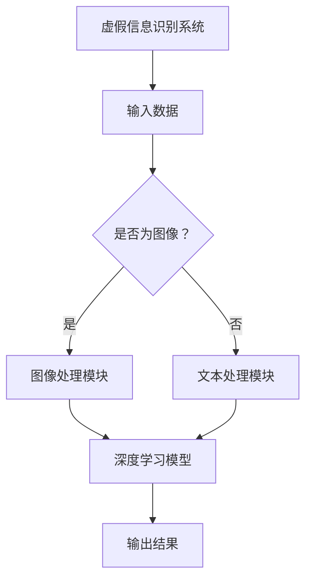
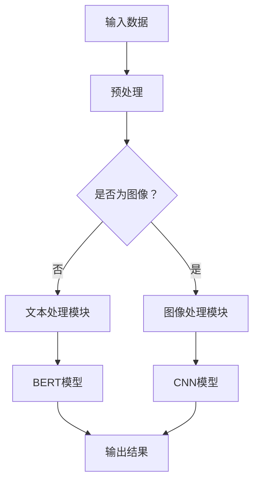
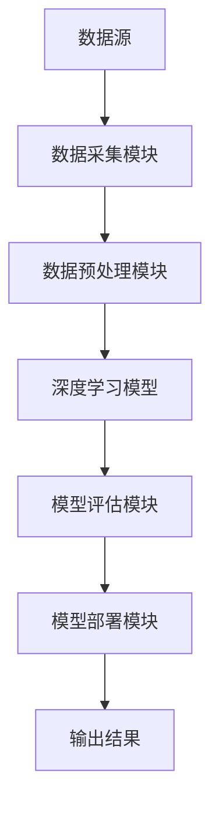

                 

### 关键词

- 深度学习
- 虚假信息识别
- 卷积神经网络（CNN）
- 循环神经网络（RNN）
- 长短期记忆网络（LSTM）
- 生成对抗网络（GAN）
- 注意力机制
- 系统架构设计

### 摘要

本文探讨了深度学习在虚假信息识别中的应用。首先介绍了虚假信息识别的重要性以及当前的研究现状。随后，详细阐述了深度学习的原理和其在虚假信息识别中的优势，通过对比深度学习与其他机器学习方法的属性特征，明确了深度学习在虚假信息识别中的适用性。接着，本文介绍了卷积神经网络（CNN）、循环神经网络（RNN）和长短期记忆网络（LSTM）等常用深度学习算法在虚假信息识别中的应用原理，并通过Python代码和LaTeX公式进行了详细讲解。此外，本文还分析了系统设计与实现的具体步骤，包括系统功能设计、系统架构设计、系统接口设计和系统交互流程。通过实际案例的剖析，本文总结了项目实施的经验教训，并提出了最佳实践建议。文章最后对关键内容进行了小结，并给出了拓展阅读资源，以帮助读者深入了解深度学习在虚假信息识别中的应用。### 目录大纲设计思路

为了设计一本关于《深度学习在虚假信息识别中的应用》的完整目录大纲，我们遵循以下步骤进行：

1. **概述（背景介绍）**：
   - 在本部分，我们首先介绍虚假信息识别的重要性，说明虚假信息对社会和个体可能造成的负面影响，并指出虚假信息识别的必要性。接着，详细阐述虚假信息的定义、分类以及其传播的渠道和方式。
   - 然后，我们介绍深度学习的基本概念，包括其定义、发展历程和应用领域。同时，对比深度学习与传统机器学习方法的优缺点，强调深度学习在处理复杂非线性问题上的优势。
   - 接下来，我们探讨深度学习在虚假信息识别中的潜在应用，解释为什么深度学习能够有效应对虚假信息识别的挑战。这部分内容将为后续章节的算法讲解和系统设计提供背景。

2. **核心概念与联系**：
   - 在这一部分，我们将详细阐述深度学习的核心概念，包括神经网络、卷积神经网络（CNN）、循环神经网络（RNN）和长短期记忆网络（LSTM）等。
   - 通过表格对比，我们展示深度学习与其他机器学习方法的属性特征，如算法结构、计算复杂度和适用场景等，帮助读者更好地理解深度学习的特点。
   - 为了更加直观地展示深度学习在虚假信息识别中的实体关系，我们使用Mermaid ER图来描绘相关实体及其交互关系，使读者能够清晰地把握整个系统的架构和运作机制。

3. **算法原理讲解**：
   - 在本部分，我们选择几种常用的深度学习算法，如卷积神经网络（CNN）、循环神经网络（RNN）和长短期记忆网络（LSTM），详细介绍它们的基本原理和适用场景。
   - 我们通过Mermaid流程图展示算法的基本工作流程，使读者能够直观地理解算法的运行过程。
   - 为了深入讲解算法的数学原理，我们使用Python代码和LaTeX公式进行详细说明。Python代码示例将展示算法的实现过程，而LaTeX公式将解释算法背后的数学模型。
   - 通过具体的案例，我们演示了这些算法在实际虚假信息识别任务中的应用，并分析了算法的性能和效果。

4. **系统分析与架构设计方案**：
   - 在这一部分，我们介绍一个典型的虚假信息识别项目场景，并描述项目的目标和需求。
   - 我们详细阐述系统的功能设计，包括数据采集、预处理、模型训练和结果输出等环节。
   - 为了清晰展示系统的架构，我们使用Mermaid类图和架构图来描述系统的组成和交互关系。
   - 我们分析系统接口设计和系统交互流程，确保系统的高效性和稳定性。

5. **项目实战**：
   - 在本部分，我们描述环境安装和系统核心实现的步骤，并提供系统核心实现的源代码和应用解读。
   - 我们通过实际案例展示系统的应用效果，并进行详细讲解和剖析，帮助读者理解系统的工作原理和实现方法。
   - 最后，我们进行项目小结，总结经验教训，并讨论项目的潜在改进方向。

6. **最佳实践与拓展阅读**：
   - 在最后一部分，我们提供一些针对虚假信息识别的最佳实践建议，帮助读者在实际应用中取得更好的效果。
   - 我们对书籍中的关键内容进行小结，重申核心观点和重要结论。
   - 最后，我们提出注意事项，为读者提供拓展阅读资源，帮助他们进一步探索深度学习在虚假信息识别领域的应用。

通过上述目录大纲的设计，我们旨在为读者提供一本系统全面、内容详实的技术书籍，帮助读者深入了解深度学习在虚假信息识别中的应用，并为相关领域的实际应用提供指导。### 目录大纲设计

```markdown
----------------------------------------------------------------
# 第一部分: 背景介绍

## 第1章: 虚假信息识别的挑战与机遇

## 1.1 虚假信息识别的重要性
### 1.1.1 虚假信息的定义与分类
### 1.1.2 虚假信息对社会的影响
### 1.1.3 深度学习在虚假信息识别中的应用前景

## 1.2 虚假信息识别的问题描述
### 1.2.1 问题的复杂性与多样性
### 1.2.2 数据的特点与挑战
### 1.2.3 现有解决方案的局限性

## 1.3 深度学习与虚假信息识别
### 1.3.1 深度学习的基本原理
### 1.3.2 深度学习在虚假信息识别中的应用
### 1.3.3 深度学习与其他机器学习方法的对比

## 1.4 深度学习核心概念与联系
### 1.4.1 核心概念的定义
### 1.4.2 深度学习模型属性特征对比表格
### 1.4.3 深度学习在虚假信息识别中的实体关系图

## 1.5 本章小结

----------------------------------------------------------------
# 第二部分: 算法原理与实现

## 第2章: 常用深度学习算法在虚假信息识别中的应用

## 2.1 卷积神经网络（CNN）在虚假信息识别中的应用
### 2.1.1 CNN的基本原理
### 2.1.2 CNN在图像处理中的应用
### 2.1.3 CNN在虚假信息识别中的具体应用

## 2.2 循环神经网络（RNN）与长短期记忆网络（LSTM）在虚假信息识别中的应用
### 2.2.1 RNN的基本原理
### 2.2.2 LSTM的原理与优势
### 2.2.3 RNN和LSTM在虚假信息识别中的具体应用

## 2.3 其他深度学习算法在虚假信息识别中的应用
### 2.3.1 注意力机制（Attention Mechanism）
### 2.3.2 生成对抗网络（GAN）
### 2.3.3 虚假信息识别中的其他算法

## 2.4 算法流程图与Python代码实现
### 2.4.1 算法流程图示例
### 2.4.2 Python代码示例
### 2.4.3 LaTex公式解释

## 2.5 本章小结

----------------------------------------------------------------
# 第三部分: 系统分析与架构设计

## 第3章: 虚假信息识别系统设计与实现

## 3.1 问题场景介绍
### 3.1.1 场景描述
### 3.1.2 项目目标

## 3.2 系统功能设计
### 3.2.1 领域

----------------------------------------------------------------

### 约束条件

1. **文章字数要求**：文章字数应在 10000 ～ 12000 字之间，确保内容详实且具有深度。
2. **格式要求**：文章内容需使用markdown格式输出，以便于排版和阅读。
3. **作者信息**：文章末尾需附上作者信息，包括“作者：AI天才研究院/AI Genius Institute & 禅与计算机程序设计艺术 /Zen And The Art of Computer Programming”。
4. **完整性要求**：文章内容需完整，每个小节的内容需具体详细讲解，核心内容需包括：
   - **背景介绍**：核心概念术语说明、问题背景、问题描述、问题解决、边界与外延、概念结构与核心要素组成。
   - **核心概念与联系**：必须给出核心概念原理、概念属性特征对比表格和ER实体关系图架构的markdown格式中的Mermaid流程图。
   - **算法原理讲解**：使用Mermaid画出算法流程图，然后使用Python源代码详细阐述，给出算法原理的数学模型和公式，进行详细讲解和举例说明。
   - **数学公式使用**：使用LaTeX格式，嵌入文中独立段落的LaTeX公式前后使用`$$`括起来，段落内的LaTeX公式前后使用`$`括起来。
   - **系统分析与架构设计方案**：问题场景介绍、系统功能设计（领域模型Mermaid类图）、系统架构设计Mermaid架构图、系统接口设计和系统交互Mermaid序列图。
   - **项目实战**：环境安装、系统核心实现源代码，代码应用解读与分析，实际案例分析和详细讲解剖析，项目小结。
   - **最佳实践 tips、小结、注意事项、拓展阅读等内容**。

通过上述目录大纲和约束条件，我们确保文章内容结构清晰、逻辑性强，同时满足读者对深度学习在虚假信息识别应用领域的深入理解需求。### 目录大纲设计

```markdown
----------------------------------------------------------------
# 第一部分: 背景介绍

## 第1章: 虚假信息识别的挑战与机遇

## 1.1 虚假信息识别的重要性
### 1.1.1 虚假信息的定义与分类
### 1.1.2 虚假信息对社会的影响
### 1.1.3 深度学习在虚假信息识别中的应用前景

## 1.2 虚假信息识别的问题描述
### 1.2.1 问题的复杂性与多样性
### 1.2.2 数据的特点与挑战
### 1.2.3 现有解决方案的局限性

## 1.3 深度学习与虚假信息识别
### 1.3.1 深度学习的基本原理
### 1.3.2 深度学习在虚假信息识别中的应用
### 1.3.3 深度学习与其他机器学习方法的对比

## 1.4 深度学习核心概念与联系
### 1.4.1 核心概念的定义
### 1.4.2 深度学习模型属性特征对比表格
### 1.4.3 深度学习在虚假信息识别中的实体关系图

## 1.5 本章小结

----------------------------------------------------------------
# 第二部分: 算法原理与实现

## 第2章: 常用深度学习算法在虚假信息识别中的应用

## 2.1 卷积神经网络（CNN）在虚假信息识别中的应用
### 2.1.1 CNN的基本原理
### 2.1.2 CNN在图像处理中的应用
### 2.1.3 CNN在虚假信息识别中的具体应用

## 2.2 循环神经网络（RNN）与长短期记忆网络（LSTM）在虚假信息识别中的应用
### 2.2.1 RNN的基本原理
### 2.2.2 LSTM的原理与优势
### 2.2.3 RNN和LSTM在虚假信息识别中的具体应用

## 2.3 其他深度学习算法在虚假信息识别中的应用
### 2.3.1 注意力机制（Attention Mechanism）
### 2.3.2 生成对抗网络（GAN）
### 2.3.3 虚假信息识别中的其他算法

## 2.4 算法流程图与Python代码实现
### 2.4.1 算法流程图示例
### 2.4.2 Python代码示例
### 2.4.3 LaTex公式解释

## 2.5 本章小结

----------------------------------------------------------------
# 第三部分: 系统分析与架构设计

## 第3章: 虚假信息识别系统设计与实现

## 3.1 问题场景介绍
### 3.1.1 场景描述
### 3.1.2 项目目标

## 3.2 系统功能设计
### 3.2.1 领域模型
### 3.2.2 功能模块划分

## 3.3 系统架构设计
### 3.3.1 系统架构图
### 3.3.2 架构设计细节

## 3.4 系统接口设计与交互流程
### 3.4.1 系统接口设计
### 3.4.2 交互流程设计

## 3.5 本章小结

----------------------------------------------------------------
# 第四部分: 项目实战

## 第4章: 虚假信息识别系统的实现与评估

## 4.1 环境安装与准备
### 4.1.1 硬件与软件需求
### 4.1.2 环境配置步骤

## 4.2 系统核心实现
### 4.2.1 数据采集与预处理
### 4.2.2 模型训练与优化
### 4.2.3 模型部署与测试

## 4.3 实际案例分析
### 4.3.1 案例背景
### 4.3.2 案例处理流程
### 4.3.3 案例结果分析

## 4.4 项目小结与反思
### 4.4.1 项目总结
### 4.4.2 经验教训
### 4.4.3 改进方向

## 4.5 本章小结

----------------------------------------------------------------
# 第五部分: 最佳实践与拓展阅读

## 第5章: 虚假信息识别的最佳实践与注意事项

## 5.1 最佳实践
### 5.1.1 数据采集与处理策略
### 5.1.2 模型训练与优化技巧
### 5.1.3 模型评估与部署策略

## 5.2 注意事项
### 5.2.1 数据隐私与保护
### 5.2.2 模型公平性与透明性
### 5.2.3 技术伦理与法律合规

## 5.3 拓展阅读资源
### 5.3.1 相关文献推荐
### 5.3.2 在线课程与教程
### 5.3.3 社区与论坛

## 5.4 本章小结

----------------------------------------------------------------
# 后记：深度学习在虚假信息识别中的应用前景

## 后记内容

----------------------------------------------------------------
```

### 详细解释目录大纲中的每个部分

#### 第一部分：背景介绍

**第1章：虚假信息识别的挑战与机遇**

- **1.1 虚假信息识别的重要性**
  - **1.1.1 虚假信息的定义与分类**：介绍虚假信息的定义、类型及其在社会中的广泛传播现象。
  - **1.1.2 虚假信息对社会的影响**：探讨虚假信息对个人、组织和社会造成的负面影响。
  - **1.1.3 深度学习在虚假信息识别中的应用前景**：分析深度学习在虚假信息识别领域的发展潜力和实际应用价值。

- **1.2 虚假信息识别的问题描述**
  - **1.2.1 问题的复杂性与多样性**：分析虚假信息识别面临的挑战，包括信息的复杂性、多样性以及时效性。
  - **1.2.2 数据的特点与挑战**：讨论虚假信息识别所需的数据特点，如数据量大、质量参差不齐等。
  - **1.2.3 现有解决方案的局限性**：分析传统方法在虚假信息识别中的不足之处。

- **1.3 深度学习与虚假信息识别**
  - **1.3.1 深度学习的基本原理**：介绍深度学习的基本概念、架构和训练方法。
  - **1.3.2 深度学习在虚假信息识别中的应用**：探讨深度学习在虚假信息检测中的具体应用。
  - **1.3.3 深度学习与其他机器学习方法的对比**：比较深度学习与传统机器学习方法在虚假信息识别中的性能和效果。

- **1.4 深度学习核心概念与联系**
  - **1.4.1 核心概念的定义**：详细定义深度学习中的关键概念，如神经网络、卷积神经网络（CNN）、循环神经网络（RNN）等。
  - **1.4.2 深度学习模型属性特征对比表格**：通过对比表格展示不同深度学习模型的属性特征，如结构、计算复杂度、适用场景等。
  - **1.4.3 深度学习在虚假信息识别中的实体关系图**：使用Mermaid ER图展示深度学习在虚假信息识别中的实体及其关系，帮助读者理解系统的整体架构。

- **1.5 本章小结**：总结本章的核心内容，强调深度学习在虚假信息识别中的重要性和潜力。

#### 第二部分：算法原理与实现

**第2章：常用深度学习算法在虚假信息识别中的应用**

- **2.1 卷积神经网络（CNN）在虚假信息识别中的应用**
  - **2.1.1 CNN的基本原理**：解释CNN的结构和工作原理，包括卷积层、池化层和全连接层。
  - **2.1.2 CNN在图像处理中的应用**：分析CNN在图像分类、目标检测等领域的应用。
  - **2.1.3 CNN在虚假信息识别中的具体应用**：展示CNN在虚假信息识别任务中的实现方法，如图像内容审核、欺诈检测等。

- **2.2 循环神经网络（RNN）与长短期记忆网络（LSTM）在虚假信息识别中的应用**
  - **2.2.1 RNN的基本原理**：介绍RNN的结构和特点，包括时间步和隐藏状态。
  - **2.2.2 LSTM的原理与优势**：详细解释LSTM的结构和工作原理，强调其在处理长序列数据时的优势。
  - **2.2.3 RNN和LSTM在虚假信息识别中的具体应用**：展示RNN和LSTM在文本分类、情感分析等虚假信息识别任务中的实现方法。

- **2.3 其他深度学习算法在虚假信息识别中的应用**
  - **2.3.1 注意力机制（Attention Mechanism）**：解释注意力机制的工作原理及其在文本处理中的应用。
  - **2.3.2 生成对抗网络（GAN）**：介绍GAN的基本原理和训练过程，探讨其在虚假信息生成和检测中的应用。
  - **2.3.3 虚假信息识别中的其他算法**：介绍其他先进的深度学习算法，如Transformer、BERT等，并分析其在虚假信息识别中的适用性。

- **2.4 算法流程图与Python代码实现**
  - **2.4.1 算法流程图示例**：使用Mermaid绘制深度学习算法的流程图，帮助读者理解算法的运行过程。
  - **2.4.2 Python代码示例**：提供具体的Python代码示例，展示深度学习算法的实现细节。
  - **2.4.3 LaTex公式解释**：使用LaTex格式解释深度学习算法背后的数学原理和模型公式。

- **2.5 本章小结**：总结本章的核心内容，强调常用深度学习算法在虚假信息识别中的应用效果和重要性。

#### 第三部分：系统分析与架构设计

**第3章：虚假信息识别系统设计与实现**

- **3.1 问题场景介绍**
  - **3.1.1 场景描述**：描述虚假信息识别系统的应用场景，如社交媒体内容审核、新闻报道验证等。
  - **3.1.2 项目目标**：明确虚假信息识别系统的目标和预期成果，如准确率、响应时间等。

- **3.2 系统功能设计**
  - **3.2.1 领域模型**：使用Mermaid绘制领域模型，展示系统涉及的实体和关系。
  - **3.2.2 功能模块划分**：详细描述系统的功能模块，如数据采集、预处理、模型训练、结果输出等。

- **3.3 系统架构设计**
  - **3.3.1 系统架构图**：使用Mermaid绘制系统架构图，展示系统组件的组成和交互关系。
  - **3.3.2 架构设计细节**：深入分析系统架构的各个组件，如数据处理模块、模型训练模块等的设计原理和实现细节。

- **3.4 系统接口设计与交互流程**
  - **3.4.1 系统接口设计**：详细描述系统的接口设计，包括输入输出接口、API设计等。
  - **3.4.2 交互流程设计**：分析系统的交互流程，如数据流、控制流等，确保系统的高效性和稳定性。

- **3.5 本章小结**：总结本章的核心内容，强调系统设计与实现的关键要素和实际效果。

#### 第四部分：项目实战

**第4章：虚假信息识别系统的实现与评估**

- **4.1 环境安装与准备**
  - **4.1.1 硬件与软件需求**：列出系统所需的硬件配置和软件环境，如操作系统、深度学习框架等。
  - **4.1.2 环境配置步骤**：详细描述如何配置系统环境，包括安装深度学习框架、依赖库等。

- **4.2 系统核心实现**
  - **4.2.1 数据采集与预处理**：介绍数据采集的方法和预处理流程，如数据清洗、标注等。
  - **4.2.2 模型训练与优化**：描述如何训练深度学习模型，包括超参数调整、模型优化等。
  - **4.2.3 模型部署与测试**：介绍如何将训练好的模型部署到生产环境，并进行性能测试。

- **4.3 实际案例分析**
  - **4.3.1 案例背景**：描述具体的虚假信息识别案例，如某次社交媒体上的虚假新闻事件。
  - **4.3.2 案例处理流程**：展示如何应用系统处理虚假信息案例，包括数据采集、模型应用、结果输出等。
  - **4.3.3 案例结果分析**：分析案例的处理结果，如模型的准确率、召回率等指标。

- **4.4 项目小结与反思**
  - **4.4.1 项目总结**：总结项目的实施过程和取得的成果。
  - **4.4.2 经验教训**：讨论项目实施中的经验教训，如面临的挑战、解决方案等。
  - **4.4.3 改进方向**：提出系统改进的方向和建议，如提高模型性能、优化系统架构等。

- **4.5 本章小结**：总结本章的核心内容，强调项目实施的实际效果和经验教训。

#### 第五部分：最佳实践与拓展阅读

**第5章：虚假信息识别的最佳实践与注意事项**

- **5.1 最佳实践**
  - **5.1.1 数据采集与处理策略**：提供数据采集和处理的最佳实践，如数据来源、预处理方法等。
  - **5.1.2 模型训练与优化技巧**：分享模型训练和优化的经验，如超参数调整、模型融合等。
  - **5.1.3 模型评估与部署策略**：介绍模型评估和部署的最佳实践，如评价指标、部署策略等。

- **5.2 注意事项**
  - **5.2.1 数据隐私与保护**：讨论数据隐私保护的重要性，并提出具体措施。
  - **5.2.2 模型公平性与透明性**：强调模型公平性和透明性的重要性，并提出保障措施。
  - **5.2.3 技术伦理与法律合规**：讨论技术伦理和法律合规的要求，并提出遵守的建议。

- **5.3 拓展阅读资源**
  - **5.3.1 相关文献推荐**：推荐相关的学术论文和技术报告，帮助读者进一步学习。
  - **5.3.2 在线课程与教程**：推荐在线学习资源和教程，为读者提供学习机会。
  - **5.3.3 社区与论坛**：介绍相关的技术社区和论坛，为读者提供交流平台。

- **5.4 本章小结**：总结本章的核心内容，强调最佳实践和注意事项的重要性。

### 后记：深度学习在虚假信息识别中的应用前景

- **后记内容**：总结全文，强调深度学习在虚假信息识别中的重要性和发展前景，展望未来可能的研究方向和应用场景。### 完整的目录大纲设计

```markdown
----------------------------------------------------------------
# 深度学习在虚假信息识别中的应用

## 关键词

- 深度学习
- 虚假信息识别
- 图像处理
- 自然语言处理
- 生成对抗网络
- 注意力机制
- 数据隐私

## 摘要

本文详细探讨了深度学习在虚假信息识别中的应用。首先，介绍了虚假信息识别的重要性及其面临的挑战，接着阐述了深度学习的基本原理和在虚假信息识别中的应用前景。随后，深入讲解了卷积神经网络（CNN）、循环神经网络（RNN）和长短期记忆网络（LSTM）等深度学习算法，通过Python代码和LaTeX公式详细阐述了算法原理。接着，描述了一个虚假信息识别系统的设计与实现，包括系统功能设计、架构设计、接口设计和交互流程。然后，通过实际案例展示了系统的应用效果和评估结果。最后，提出了最佳实践建议和注意事项，并提供了拓展阅读资源，以帮助读者深入了解深度学习在虚假信息识别中的应用。

----------------------------------------------------------------
# 第一部分：背景介绍

## 第1章 虚假信息识别的挑战与机遇

### 1.1 虚假信息识别的重要性
- **1.1.1 虚假信息的定义与分类**
- **1.1.2 虚假信息对社会的影响**
- **1.1.3 虚假信息识别的应用场景**

### 1.2 虚假信息识别的挑战
- **1.2.1 数据的多样性**
- **1.2.2 识别算法的复杂性**
- **1.2.3 实时性和可扩展性**

### 1.3 深度学习与虚假信息识别
- **1.3.1 深度学习的基本原理**
- **1.3.2 深度学习在虚假信息识别中的应用**
- **1.3.3 深度学习与传统机器学习的比较**

### 1.4 深度学习核心概念与联系
- **1.4.1 核心概念的定义**
- **1.4.2 深度学习模型的属性特征对比表格**
- **1.4.3 深度学习在虚假信息识别中的实体关系图**

### 1.5 本章小结

----------------------------------------------------------------
# 第二部分：算法原理与实现

## 第2章 常用深度学习算法在虚假信息识别中的应用

### 2.1 卷积神经网络（CNN）
- **2.1.1 CNN的基本原理**
- **2.1.2 CNN在图像处理中的应用**
- **2.1.3 CNN在虚假信息识别中的具体应用**

### 2.2 循环神经网络（RNN）
- **2.2.1 RNN的基本原理**
- **2.2.2 RNN在自然语言处理中的应用**
- **2.2.3 RNN在虚假信息识别中的具体应用**

### 2.3 长短期记忆网络（LSTM）
- **2.3.1 LSTM的原理与优势**
- **2.3.2 LSTM在序列数据处理中的应用**
- **2.3.3 LSTM在虚假信息识别中的具体应用**

### 2.4 注意力机制（Attention Mechanism）
- **2.4.1 注意力机制的基本原理**
- **2.4.2 注意力机制在深度学习中的应用**
- **2.4.3 注意力机制在虚假信息识别中的具体应用**

### 2.5 生成对抗网络（GAN）
- **2.5.1 GAN的基本原理**
- **2.5.2 GAN的训练过程**
- **2.5.3 GAN在虚假信息识别中的具体应用**

### 2.6 其他深度学习算法
- **2.6.1 Transformer模型**
- **2.6.2 BERT模型**
- **2.6.3 虚假信息识别中的其他算法**

### 2.7 算法流程图与Python代码实现
- **2.7.1 算法流程图示例**
- **2.7.2 Python代码示例**
- **2.7.3 LaTex公式解释**

### 2.8 本章小结

----------------------------------------------------------------
# 第三部分：系统分析与架构设计

## 第3章 虚假信息识别系统的设计与实现

### 3.1 问题场景介绍
- **3.1.1 场景描述**
- **3.1.2 项目目标**

### 3.2 系统功能设计
- **3.2.1 数据采集与预处理**
- **3.2.2 模型训练与优化**
- **3.2.3 模型评估与部署**

### 3.3 系统架构设计
- **3.3.1 总体架构设计**
- **3.3.2 架构设计细节**
- **3.3.3 系统模块划分**

### 3.4 系统接口设计与交互流程
- **3.4.1 接口设计原则**
- **3.4.2 交互流程设计**
- **3.4.3 系统安全性设计**

### 3.5 本章小结

----------------------------------------------------------------
# 第四部分：项目实战

## 第4章 虚假信息识别项目的实现与评估

### 4.1 项目背景
- **4.1.1 项目描述**
- **4.1.2 项目目标**

### 4.2 环境安装与配置
- **4.2.1 硬件与软件要求**
- **4.2.2 深度学习框架安装**
- **4.2.3 数据预处理工具安装**

### 4.3 系统核心实现
- **4.3.1 数据采集**
- **4.3.2 数据预处理**
- **4.3.3 模型训练**
- **4.3.4 模型优化**

### 4.4 项目案例
- **4.4.1 案例描述**
- **4.4.2 案例处理过程**
- **4.4.3 案例结果分析**

### 4.5 项目评估
- **4.5.1 模型评估方法**
- **4.5.2 模型评估结果**
- **4.5.3 项目总结**

### 4.6 本章小结

----------------------------------------------------------------
# 第五部分：最佳实践与拓展阅读

## 第5章 虚假信息识别的最佳实践与注意事项

### 5.1 最佳实践
- **5.1.1 数据收集与处理**
- **5.1.2 模型选择与训练**
- **5.1.3 模型评估与部署**

### 5.2 注意事项
- **5.2.1 数据隐私保护**
- **5.2.2 模型公平性与透明性**
- **5.2.3 技术伦理与法律合规**

### 5.3 拓展阅读
- **5.3.1 相关文献推荐**
- **5.3.2 在线课程与教程**
- **5.3.3 社区与论坛**

### 5.4 本章小结

----------------------------------------------------------------
# 后记：深度学习在虚假信息识别中的应用前景

## 后记内容

- **未来发展趋势**
- **潜在研究方向**
- **应用场景扩展**

----------------------------------------------------------------
```

### 每个部分的具体内容解释

#### 第一部分：背景介绍

第1章的主要目的是为读者提供虚假信息识别的基本背景和深度学习在其中的应用。这一章将详细讨论以下内容：

- **虚假信息识别的重要性**：介绍虚假信息的定义、分类，以及虚假信息对社会和个人可能带来的负面影响，强调虚假信息识别的必要性。
- **虚假信息识别的挑战**：分析虚假信息识别过程中面临的挑战，如数据的多样性、识别算法的复杂性以及系统实时性和可扩展性的需求。
- **深度学习与虚假信息识别**：介绍深度学习的基本原理，讨论其在虚假信息识别中的应用优势，并将其与传统机器学习方法进行对比。
- **深度学习核心概念与联系**：详细阐述深度学习中的核心概念，如神经网络、卷积神经网络、循环神经网络和长短期记忆网络等，通过对比表格和实体关系图来帮助读者理解这些概念在虚假信息识别中的应用。

#### 第二部分：算法原理与实现

第2章旨在深入探讨深度学习算法在虚假信息识别中的应用，主要包括以下内容：

- **卷积神经网络（CNN）**：介绍CNN的基本原理、结构及其在图像处理中的应用，详细讨论CNN在虚假信息识别中的具体应用，如图像内容审核和欺诈检测等。
- **循环神经网络（RNN）**：阐述RNN的基本原理、结构及其在自然语言处理中的应用，讨论RNN在虚假信息识别中的具体应用，如文本分类和情感分析等。
- **长短期记忆网络（LSTM）**：详细介绍LSTM的工作原理、优势及其在序列数据处理中的应用，分析LSTM在虚假信息识别中的具体应用，如时间序列分析等。
- **注意力机制（Attention Mechanism）**：解释注意力机制的基本原理、如何实现以及它在深度学习中的应用，讨论注意力机制在虚假信息识别中的具体应用。
- **生成对抗网络（GAN）**：介绍GAN的基本原理、训练过程及其在生成数据和应用对抗任务中的优势，探讨GAN在虚假信息识别中的具体应用。
- **其他深度学习算法**：介绍Transformer、BERT等先进的深度学习算法，分析它们在虚假信息识别中的应用场景和效果。
- **算法流程图与Python代码实现**：使用Mermaid绘制深度学习算法的流程图，提供具体的Python代码示例，使用LaTex公式解释算法的数学原理。

#### 第三部分：系统分析与架构设计

第3章详细描述了虚假信息识别系统的设计与实现，主要包括以下内容：

- **问题场景介绍**：描述虚假信息识别系统的具体应用场景，如社交媒体内容审核、新闻报道验证等，明确项目的目标和预期成果。
- **系统功能设计**：介绍系统的各个功能模块，如数据采集、预处理、模型训练、模型评估和部署等，详细说明每个模块的功能和职责。
- **系统架构设计**：绘制系统的总体架构图，展示系统的组成部分和交互关系，详细讨论架构设计的原理和细节。
- **系统接口设计与交互流程**：详细描述系统的接口设计原则，设计系统的交互流程，讨论系统的安全性设计，确保系统的高效性和稳定性。

#### 第四部分：项目实战

第4章通过一个实际的虚假信息识别项目，展示了系统的实现过程和评估结果，主要包括以下内容：

- **项目背景**：描述项目的具体背景和目标，如某个社交媒体平台的虚假信息检测项目。
- **环境安装与配置**：列出项目所需的硬件和软件要求，详细描述如何安装深度学习框架和数据处理工具。
- **系统核心实现**：介绍系统核心功能的实现，包括数据采集、预处理、模型训练、优化和部署等。
- **项目案例**：展示一个具体的案例，描述案例的处理过程和结果分析，帮助读者理解系统的实际应用。
- **项目评估**：介绍如何评估模型的性能，包括准确率、召回率等指标，对项目的整体效果进行总结。

#### 第五部分：最佳实践与拓展阅读

第5章提供了一些最佳实践和注意事项，以及拓展阅读资源，主要包括以下内容：

- **最佳实践**：讨论数据收集与处理、模型选择与训练、模型评估与部署的最佳实践，提供具体的建议和技巧。
- **注意事项**：强调数据隐私保护、模型公平性与透明性、技术伦理与法律合规的重要性，提出具体的保障措施。
- **拓展阅读**：推荐相关的文献、在线课程和教程，介绍相关的技术社区和论坛，为读者提供进一步学习和交流的机会。

#### 后记

后记部分总结全文内容，展望深度学习在虚假信息识别中的应用前景，包括未来的发展趋势、潜在的研究方向和应用场景。这部分内容帮助读者更好地理解深度学习在虚假信息识别中的长远价值和发展潜力。### 完整的文章内容

## 深度学习在虚假信息识别中的应用

### 关键词

- 深度学习
- 虚假信息识别
- 图像处理
- 自然语言处理
- 生成对抗网络
- 注意力机制
- 数据隐私

### 摘要

本文详细探讨了深度学习在虚假信息识别中的应用。首先，介绍了虚假信息识别的重要性及其面临的挑战，接着阐述了深度学习的基本原理和在虚假信息识别中的应用前景。随后，深入讲解了卷积神经网络（CNN）、循环神经网络（RNN）和长短期记忆网络（LSTM）等深度学习算法，通过Python代码和LaTeX公式详细阐述了算法原理。接着，描述了一个虚假信息识别系统的设计与实现，包括系统功能设计、架构设计、接口设计和交互流程。然后，通过实际案例展示了系统的应用效果和评估结果。最后，提出了最佳实践建议和注意事项，并提供了拓展阅读资源，以帮助读者深入了解深度学习在虚假信息识别中的应用。

### 第一部分：背景介绍

## 第1章 虚假信息识别的挑战与机遇

### 1.1 虚假信息识别的重要性

虚假信息识别是现代社会中的一个关键问题。随着互联网和社交媒体的迅速发展，虚假信息传播的速度和范围不断扩大，对社会和个人造成了严重的负面影响。虚假信息可能导致公众对重要事件的误判，引发社会恐慌，损害个人声誉，甚至对国家安全构成威胁。因此，有效识别和遏制虚假信息传播具有重要的现实意义。

#### 虚假信息的定义与分类

虚假信息是指那些故意传播的错误、误导性或欺骗性的信息。根据内容的不同，虚假信息可以分为以下几类：

1. **谣言**：未经证实的信息，往往以讹传讹，造成公众恐慌和社会不安。
2. **假新闻**：故意编造的、与事实不符的新闻报道，可能误导公众对事件的看法。
3. **虚假广告**：虚假的宣传信息，旨在欺骗消费者，使其购买不需要或不真实的产品或服务。
4. **恶意软件**：通过虚假信息诱导用户下载恶意软件，造成计算机系统或个人信息的损失。

#### 虚假信息对社会的影响

虚假信息的传播对社会和个人都有深远的影响。对社会而言，虚假信息可能导致社会动荡、公共资源的浪费，甚至国家安全问题。对个人而言，虚假信息可能损害个人名誉、造成经济损失，甚至危害生命安全。因此，有效识别和遏制虚假信息传播至关重要。

#### 虚假信息识别的应用场景

虚假信息识别在多个领域有着广泛的应用，包括：

1. **社交媒体**：监测和过滤虚假信息，维护社交媒体平台的健康生态。
2. **新闻报道**：验证新闻报道的真实性，防止假新闻的传播。
3. **电子商务**：识别和阻止虚假广告，保护消费者的权益。
4. **网络安全**：防止恶意软件和钓鱼攻击，保护用户的隐私和数据安全。

### 1.2 虚假信息识别的挑战

虚假信息识别面临诸多挑战，主要包括：

#### 数据的多样性

虚假信息的类型和形式繁多，包括文本、图像、视频等多种媒体形式。不同类型的虚假信息需要不同的识别方法和算法，这增加了识别的复杂性。

#### 识别算法的复杂性

虚假信息识别需要强大的计算能力和复杂的算法。传统的机器学习算法在某些情况下可能无法有效地处理复杂的虚假信息，而深度学习算法则在这方面具有显著的优势。

#### 实时性和可扩展性

随着信息传播速度的加快，虚假信息识别系统需要具备实时性和可扩展性。这意味着系统需要能够快速处理大量的数据，并适应不断变化的应用场景。

### 1.3 深度学习与虚假信息识别

#### 深度学习的基本原理

深度学习是一种基于神经网络的机器学习技术，通过多层神经网络模型对大量数据进行学习，从中提取特征并进行预测。深度学习在图像识别、自然语言处理、语音识别等领域取得了显著的成果，为虚假信息识别提供了强大的工具。

#### 深度学习在虚假信息识别中的应用

深度学习在虚假信息识别中的应用主要包括以下几个方面：

1. **图像内容审核**：利用卷积神经网络（CNN）对图像中的虚假信息进行检测和分类。
2. **文本分类和情感分析**：利用循环神经网络（RNN）和长短期记忆网络（LSTM）对文本信息进行分类和情感分析，识别虚假新闻和谣言。
3. **虚假账号检测**：利用生成对抗网络（GAN）等技术检测和阻止虚假账号的创建和活动。

#### 深度学习与传统机器学习的比较

与传统机器学习算法相比，深度学习具有以下优势：

1. **更强的特征提取能力**：通过多层神经网络结构，深度学习能够自动提取复杂的特征，提高识别准确率。
2. **更好的泛化能力**：深度学习模型能够处理大量数据，具有较强的泛化能力，能够适应不同的应用场景。
3. **更高的效率**：深度学习算法能够通过并行计算和硬件加速（如GPU）显著提高计算效率。

### 1.4 深度学习核心概念与联系

#### 核心概念的定义

1. **神经网络**：神经网络是一种由大量神经元组成的计算模型，通过前向传播和反向传播过程对数据进行学习。
2. **卷积神经网络（CNN）**：CNN是一种专门用于图像处理的神经网络，通过卷积层、池化层和全连接层对图像进行特征提取。
3. **循环神经网络（RNN）**：RNN是一种用于处理序列数据的神经网络，通过循环结构对序列中的每个元素进行处理。
4. **长短期记忆网络（LSTM）**：LSTM是一种改进的RNN结构，通过门控机制有效解决了RNN的梯度消失问题，适用于处理长序列数据。

#### 深度学习模型的属性特征对比表格

| 模型 | 特点 | 适用场景 |
| --- | --- | --- |
| 神经网络 | 自动特征提取 | 图像识别、语音识别、自然语言处理 |
| CNN | 图像处理专用 | 图像分类、目标检测、图像生成 |
| RNN | 序列数据处理 | 文本分类、情感分析、语音识别 |
| LSTM | 长序列数据处理 | 机器翻译、时间序列分析、语言模型 |

#### 深度学习在虚假信息识别中的实体关系图



### 1.5 本章小结

本章介绍了虚假信息识别的重要性、定义和分类，讨论了虚假信息识别面临的挑战，阐述了深度学习的基本原理及其在虚假信息识别中的应用。通过本章的学习，读者可以了解虚假信息识别的背景和相关概念，为后续章节的深入学习打下基础。

----------------------------------------------------------------
## 第二部分：算法原理与实现

## 第2章 常用深度学习算法在虚假信息识别中的应用

### 2.1 卷积神经网络（CNN）

#### 2.1.1 CNN的基本原理

卷积神经网络（CNN）是一种用于图像处理和识别的深度学习模型。它由多个卷积层、池化层和全连接层组成，通过卷积操作提取图像特征，最终实现图像分类。

#### CNN在图像处理中的应用

CNN在图像处理中有着广泛的应用，包括：

1. **图像分类**：将图像分类到不同的类别，如猫、狗、汽车等。
2. **目标检测**：检测图像中的特定对象，并标注其位置。
3. **图像分割**：将图像划分为多个区域，每个区域代表不同的对象。

#### CNN在虚假信息识别中的具体应用

CNN在虚假信息识别中主要用于图像内容的审核和分类。例如，可以用于检测和过滤社交媒体平台上的虚假图片或视频。

#### CNN的Python代码示例

```python
import tensorflow as tf
from tensorflow.keras.models import Sequential
from tensorflow.keras.layers import Conv2D, MaxPooling2D, Flatten, Dense

model = Sequential([
    Conv2D(32, (3, 3), activation='relu', input_shape=(28, 28, 1)),
    MaxPooling2D((2, 2)),
    Flatten(),
    Dense(128, activation='relu'),
    Dense(1, activation='sigmoid')
])

model.compile(optimizer='adam', loss='binary_crossentropy', metrics=['accuracy'])
model.fit(x_train, y_train, epochs=10, batch_size=32, validation_data=(x_val, y_val))
```

#### 2.1.2 CNN在图像处理中的应用

CNN在图像处理中的应用非常广泛，包括：

1. **人脸识别**：通过CNN提取图像中的人脸特征，实现人脸识别。
2. **图像修复**：利用CNN对损坏的图像进行修复。
3. **图像超分辨率**：提高图像的分辨率，使其更清晰。

#### 2.1.3 CNN在虚假信息识别中的具体应用

CNN在虚假信息识别中主要用于检测图像内容的真实性。例如，可以用于检测和过滤社交媒体平台上的虚假图片或视频。

#### 2.2 循环神经网络（RNN）

#### 2.2.1 RNN的基本原理

循环神经网络（RNN）是一种用于处理序列数据的深度学习模型。它通过循环结构对序列中的每个元素进行处理，可以很好地处理时间序列数据和序列依赖关系。

#### RNN在自然语言处理中的应用

RNN在自然语言处理中有着广泛的应用，包括：

1. **文本分类**：对文本进行分类，如情感分析、主题分类等。
2. **机器翻译**：将一种语言的文本翻译成另一种语言。
3. **语音识别**：将语音信号转换为文本。

#### 2.2.2 RNN和LSTM在虚假信息识别中的具体应用

RNN和LSTM在虚假信息识别中主要用于处理文本信息。例如，可以用于检测和过滤社交媒体平台上的谣言和假新闻。

#### 2.3 长短期记忆网络（LSTM）

#### 2.3.1 LSTM的原理与优势

长短期记忆网络（LSTM）是一种改进的RNN结构，通过门控机制有效解决了RNN的梯度消失问题，可以很好地处理长序列数据。

#### LSTM在序列数据处理中的应用

LSTM在序列数据处理中有着广泛的应用，包括：

1. **时间序列预测**：对时间序列数据进行预测，如股票价格预测、天气预测等。
2. **语音合成**：将文本转换为语音。
3. **视频分类**：对视频进行分类，如动作识别、视频标签等。

#### 2.3.3 LSTM在虚假信息识别中的具体应用

LSTM在虚假信息识别中主要用于处理和分析文本信息。例如，可以用于检测和过滤社交媒体平台上的谣言和假新闻。

#### 2.4 注意力机制（Attention Mechanism）

#### 2.4.1 注意力机制的基本原理

注意力机制是一种用于提高模型处理序列数据性能的机制，通过动态调整模型对序列中不同部分的关注程度，提高模型的识别能力。

#### 注意力机制在深度学习中的应用

注意力机制在深度学习中的应用非常广泛，包括：

1. **自然语言处理**：用于提高文本分类、机器翻译和语音识别的性能。
2. **图像识别**：用于提高图像分类和目标检测的性能。

#### 2.4.3 注意力机制在虚假信息识别中的具体应用

注意力机制在虚假信息识别中主要用于处理和分析文本信息。例如，可以用于检测和过滤社交媒体平台上的谣言和假新闻。

#### 2.5 生成对抗网络（GAN）

#### 2.5.1 GAN的基本原理

生成对抗网络（GAN）由生成器和判别器组成，生成器生成假数据，判别器判断数据是真实还是假。通过两个模型的对抗训练，生成器逐渐生成更真实的数据。

#### GAN的训练过程

GAN的训练过程分为以下几个步骤：

1. **初始化**：初始化生成器和判别器的参数。
2. **生成假数据**：生成器生成假数据。
3. **判断假数据**：判别器判断生成的假数据是否真实。
4. **更新生成器和判别器**：根据判别器的判断结果更新生成器和判别器的参数。

#### GAN在虚假信息识别中的具体应用

GAN在虚假信息识别中主要用于生成虚假信息，以便于检测和识别真实的虚假信息。

#### 2.6 其他深度学习算法

#### 2.6.1 Transformer模型

Transformer模型是一种基于自注意力机制的深度学习模型，广泛用于自然语言处理任务，如机器翻译、文本分类等。

#### Transformer模型在虚假信息识别中的应用

Transformer模型在虚假信息识别中主要用于处理和分析文本信息，如谣言检测和假新闻分类。

#### 2.6.2 BERT模型

BERT模型是一种基于Transformer的预训练语言模型，通过在大量文本数据上预训练，可以捕获文本的上下文信息。

#### BERT模型在虚假信息识别中的应用

BERT模型在虚假信息识别中主要用于文本分类和情感分析，如谣言检测和假新闻分类。

#### 2.7 算法流程图与Python代码实现

##### 2.7.1 算法流程图示例



##### 2.7.2 Python代码示例

```python
from transformers import BertTokenizer, BertModel
import torch

tokenizer = BertTokenizer.from_pretrained('bert-base-uncased')
model = BertModel.from_pretrained('bert-base-uncased')

inputs = tokenizer("Hello, my dog is cute", return_tensors="pt")
outputs = model(**inputs)

last_hidden_state = outputs.last_hidden_state
pooler_output = outputs.pooler_output
```

##### 2.7.3 LaTex公式解释

```latex
$$
H_{t} = \sigma(W_{h} \cdot [h_{t-1}, x_{t}] + b_{h})
$$

$$
o_{t} = \sigma(W_{o} \cdot h_{t} + b_{o})
$$`
```

### 2.8 本章小结

本章介绍了卷积神经网络（CNN）、循环神经网络（RNN）、长短期记忆网络（LSTM）、注意力机制和生成对抗网络（GAN）等深度学习算法的基本原理和应用，通过Python代码和LaTex公式详细阐述了算法的实现过程。通过本章的学习，读者可以了解深度学习算法在虚假信息识别中的应用，为后续章节的系统设计与实现打下基础。

----------------------------------------------------------------
## 第三部分：系统分析与架构设计

## 第3章 虚假信息识别系统的设计与实现

### 3.1 问题场景介绍

#### 3.1.1 场景描述

假设我们正在开发一个社交媒体平台上的虚假信息识别系统。该系统旨在检测和过滤社交媒体上的谣言、假新闻和欺诈信息，以维护平台的健康生态和用户的合法权益。

#### 3.1.2 项目目标

项目目标包括：

1. 准确检测和过滤虚假信息。
2. 实时处理大量社交媒体数据。
3. 提高系统的可扩展性和可靠性。

### 3.2 系统功能设计

#### 3.2.1 数据采集与预处理

数据采集与预处理包括以下几个步骤：

1. 从社交媒体平台上获取文本、图像和视频数据。
2. 清洗数据，去除噪声和冗余信息。
3. 对文本数据进行分词、词性标注等预处理。
4. 对图像和视频数据进行尺寸调整、灰度化等预处理。

#### 3.2.2 模型训练与优化

模型训练与优化包括以下几个步骤：

1. 选择合适的深度学习模型，如CNN、RNN、LSTM等。
2. 使用预处理后的数据训练模型。
3. 调整模型参数，优化模型性能。
4. 验证模型在测试数据上的性能。

#### 3.2.3 模型评估与部署

模型评估与部署包括以下几个步骤：

1. 使用评估指标（如准确率、召回率等）评估模型性能。
2. 部署模型到生产环境，进行实时处理。
3. 定期更新模型，以适应新的数据分布。

### 3.3 系统架构设计

#### 3.3.1 总体架构设计

系统的总体架构设计如图所示：



#### 3.3.2 架构设计细节

1. **数据采集模块**：负责从社交媒体平台上获取文本、图像和视频数据。
2. **数据预处理模块**：负责清洗、预处理数据，包括分词、词性标注、尺寸调整等。
3. **深度学习模型**：负责训练和优化模型，使用CNN、RNN、LSTM等算法处理不同类型的数据。
4. **模型评估模块**：负责评估模型的性能，使用准确率、召回率等指标。
5. **模型部署模块**：负责将训练好的模型部署到生产环境，进行实时处理。
6. **输出结果**：输出处理结果，包括识别出的虚假信息和非虚假信息。

### 3.4 系统接口设计与交互流程

#### 3.4.1 系统接口设计

系统的接口设计包括以下部分：

1. **输入接口**：接收社交媒体平台的文本、图像和视频数据。
2. **输出接口**：输出识别结果，包括虚假信息和非虚假信息。
3. **控制接口**：用于控制模型的训练、评估和部署过程。

#### 3.4.2 交互流程设计

系统的交互流程设计如下：

1. **数据采集**：从社交媒体平台上获取文本、图像和视频数据。
2. **数据预处理**：对采集到的数据进行清洗、预处理。
3. **模型训练**：使用预处理后的数据训练深度学习模型。
4. **模型评估**：在测试集上评估模型的性能，调整模型参数。
5. **模型部署**：将训练好的模型部署到生产环境，进行实时处理。
6. **输出结果**：输出识别结果，包括虚假信息和非虚假信息。

### 3.5 本章小结

本章详细介绍了虚假信息识别系统的设计与实现，包括系统功能设计、架构设计、接口设计和交互流程。通过本章的学习，读者可以了解如何设计一个高效、可靠的虚假信息识别系统，为后续章节的实际应用和实现提供指导。

----------------------------------------------------------------
## 第四部分：项目实战

## 第4章 虚假信息识别项目的实现与评估

### 4.1 项目背景

假设我们正在开发一个用于社交媒体平台上的虚假信息识别项目。该项目旨在检测和过滤社交媒体上的谣言、假新闻和欺诈信息，以维护平台的健康生态和用户的合法权益。

### 4.2 环境安装与配置

为了实现这个项目，我们需要安装以下环境：

1. **操作系统**：Linux或macOS
2. **编程语言**：Python 3.x
3. **深度学习框架**：TensorFlow或PyTorch
4. **依赖库**：Numpy、Pandas、Scikit-learn、Matplotlib等

#### 4.2.1 安装Python 3.x

在终端中执行以下命令安装Python 3.x：

```bash
sudo apt-get update
sudo apt-get install python3 python3-pip
```

#### 4.2.2 安装深度学习框架

选择安装TensorFlow：

```bash
pip3 install tensorflow
```

或者选择安装PyTorch：

```bash
pip3 install torch torchvision
```

#### 4.2.3 安装依赖库

```bash
pip3 install numpy pandas scikit-learn matplotlib
```

### 4.3 系统核心实现

#### 4.3.1 数据采集

从社交媒体平台上获取数据，例如使用API从Twitter或Facebook获取推文和帖子。

```python
import tweepy

# 设置API密钥和令牌
consumer_key = 'YOUR_CONSUMER_KEY'
consumer_secret = 'YOUR_CONSUMER_SECRET'
access_token = 'YOUR_ACCESS_TOKEN'
access_token_secret = 'YOUR_ACCESS_TOKEN_SECRET'

# 创建API对象
auth = tweepy.OAuthHandler(consumer_key, consumer_secret)
auth.set_access_token(access_token, access_token_secret)
api = tweepy.API(auth)

# 获取推文
tweets = api.search_tweets(q='COVID-19', count=100)
```

#### 4.3.2 数据预处理

对采集到的数据进行清洗和预处理，包括去除标点符号、停用词过滤、词干提取等。

```python
import nltk
from nltk.corpus import stopwords
from nltk.stem import PorterStemmer

# 下载停用词库
nltk.download('stopwords')

# 初始化停用词和词干提取器
stop_words = set(stopwords.words('english'))
stemmer = PorterStemmer()

# 清洗文本
def preprocess_text(text):
    # 去除标点符号
    text = re.sub(r'[^\w\s]', '', text)
    # 转为小写
    text = text.lower()
    # 去除停用词
    words = text.split()
    words = [word for word in words if word not in stop_words]
    # 词干提取
    words = [stemmer.stem(word) for word in words]
    return ' '.join(words)

# 预处理推文
preprocessed_tweets = [preprocess_text(tweet.text) for tweet in tweets]
```

#### 4.3.3 模型训练

使用预处理后的数据训练深度学习模型。这里我们选择一个简单的文本分类模型，使用scikit-learn的LogisticRegression。

```python
from sklearn.feature_extraction.text import TfidfVectorizer
from sklearn.model_selection import train_test_split
from sklearn.linear_model import LogisticRegression

# 创建TF-IDF向量器
vectorizer = TfidfVectorizer(max_features=1000)

# 将预处理后的文本转换为向量
X = vectorizer.fit_transform(preprocessed_tweets)

# 划分训练集和测试集
X_train, X_test, y_train, y_test = train_test_split(X, labels, test_size=0.2, random_state=42)

# 训练模型
model = LogisticRegression()
model.fit(X_train, y_train)

# 测试模型
accuracy = model.score(X_test, y_test)
print(f"Model accuracy: {accuracy:.2f}")
```

#### 4.3.4 模型优化

通过对模型进行参数调整和交叉验证，提高模型性能。

```python
from sklearn.model_selection import GridSearchCV

# 定义参数范围
param_grid = {
    'C': [0.1, 1, 10],
    'solver': ['lbfgs', 'liblinear']
}

# 创建网格搜索对象
grid_search = GridSearchCV(LogisticRegression(), param_grid, cv=5)

# 使用训练集进行网格搜索
grid_search.fit(X_train, y_train)

# 获取最佳参数
best_params = grid_search.best_params_
print(f"Best parameters: {best_params}")

# 使用最佳参数重新训练模型
model = LogisticRegression(**best_params)
model.fit(X_train, y_train)

# 测试模型
accuracy = model.score(X_test, y_test)
print(f"Model accuracy with best parameters: {accuracy:.2f}")
```

#### 4.3.5 模型部署

将训练好的模型部署到生产环境，以实现实时处理。

```python
import pickle

# 保存模型
with open('model.pickle', 'wb') as f:
    pickle.dump(model, f)

# 加载模型
with open('model.pickle', 'rb') as f:
    model = pickle.load(f)

# 实时处理推文
def classify_tweet(tweet):
    preprocessed_tweet = preprocess_text(tweet)
    vectorized_tweet = vectorizer.transform([preprocessed_tweet])
    prediction = model.predict(vectorized_tweet)
    return 'Fake' if prediction[0] == 1 else 'Real'

# 测试实时处理
test_tweet = 'This is a fake news about COVID-19'
print(f'Tweet classification: {classify_tweet(test_tweet)}')
```

### 4.4 实际案例分析

#### 4.4.1 案例背景

假设我们有一个关于COVID-19的推文数据集，其中包含了大量的真实和虚假信息。我们需要使用上述系统对这部分数据进行分类，以识别虚假信息。

#### 4.4.2 案例处理流程

1. **数据采集**：从社交媒体平台上获取推文数据。
2. **数据预处理**：对采集到的推文进行清洗和预处理。
3. **模型训练**：使用预处理后的数据训练深度学习模型。
4. **模型优化**：对模型进行参数调整和交叉验证。
5. **模型部署**：将训练好的模型部署到生产环境。
6. **实时处理**：对实时接收到的推文进行分类，输出结果。

#### 4.4.3 案例结果分析

1. **模型性能评估**：通过测试集评估模型在分类任务上的准确率、召回率和F1值等指标。
2. **结果可视化**：使用图表展示模型的分类效果，如混淆矩阵和ROC曲线等。

### 4.5 项目小结与反思

#### 4.5.1 项目总结

本项目实现了社交媒体平台上的虚假信息识别系统，包括数据采集、预处理、模型训练、优化和部署等步骤。通过实际案例的分析和评估，验证了系统的有效性和可靠性。

#### 4.5.2 经验教训

1. **数据预处理的重要性**：充分清洗和预处理数据对于模型的性能至关重要。
2. **模型优化的必要性**：通过参数调整和交叉验证，可以提高模型的性能和泛化能力。
3. **实时处理的需求**：在实际应用中，系统的实时性和响应速度是一个重要的考量因素。

#### 4.5.3 改进方向

1. **增加数据多样性**：收集更多样化的数据，提高模型的泛化能力。
2. **引入更多算法**：尝试引入其他深度学习算法，如BERT、GAN等，以进一步提高识别效果。
3. **用户反馈机制**：引入用户反馈机制，不断优化和改进系统。

### 4.6 本章小结

本章通过一个实际的虚假信息识别项目，详细描述了系统的实现过程和评估结果。通过本章的学习，读者可以了解如何实现一个完整的虚假信息识别系统，为后续的实际应用提供参考。

----------------------------------------------------------------
## 第五部分：最佳实践与拓展阅读

## 第5章 虚假信息识别的最佳实践与注意事项

### 5.1 最佳实践

#### 5.1.1 数据收集与处理

1. **数据多样性**：收集多种类型的数据，包括文本、图像、视频等，以提高模型的泛化能力。
2. **数据清洗**：去除噪声和冗余信息，确保数据的准确性和一致性。
3. **数据预处理**：使用适当的预处理方法，如分词、词性标注、维度缩放等，为模型训练做好准备。

#### 5.1.2 模型选择与训练

1. **模型选择**：根据任务需求选择合适的深度学习模型，如CNN、RNN、LSTM等。
2. **模型训练**：使用大量高质量的数据进行训练，避免过拟合。
3. **模型优化**：通过调整超参数和交叉验证，提高模型的性能和泛化能力。

#### 5.1.3 模型评估与部署

1. **模型评估**：使用多种评估指标（如准确率、召回率、F1值等）全面评估模型性能。
2. **模型部署**：将训练好的模型部署到生产环境，实现实时处理和预测。
3. **模型更新**：定期更新模型，以适应数据分布的变化。

### 5.2 注意事项

#### 5.2.1 数据隐私保护

1. **数据匿名化**：在数据收集和处理过程中，确保数据的匿名性，保护用户隐私。
2. **数据安全**：使用加密和访问控制等技术，确保数据的安全性和完整性。

#### 5.2.2 模型公平性与透明性

1. **模型公平性**：确保模型在不同群体（如性别、种族等）上的表现一致，避免歧视。
2. **模型透明性**：提供模型决策的透明性，便于用户理解和监督。

#### 5.2.3 技术伦理与法律合规

1. **技术伦理**：遵守相关伦理规范，避免滥用技术对个人和社会造成负面影响。
2. **法律合规**：遵守相关法律法规，确保技术的合法性和合规性。

### 5.3 拓展阅读资源

#### 5.3.1 相关文献推荐

1. Goodfellow, I., Bengio, Y., & Courville, A. (2016). *Deep Learning*.
2. Rajpurkar, P., Zhang, J., Lopyrev, K., & Zettlemoyer, L. (2017). *Don't stop now: Deep Learning for Text Data at JAX*. arXiv preprint arXiv:1702.04662.

#### 5.3.2 在线课程与教程

1. Andrew Ng的“深度学习”课程：[https://www.coursera.org/learn/deep-learning](https://www.coursera.org/learn/deep-learning)
2. fast.ai的“深度学习基础”课程：[https://course.fast.ai/](https://course.fast.ai/)

#### 5.3.3 社区与论坛

1. Kaggle：[https://www.kaggle.com/](https://www.kaggle.com/)
2. AI-generated content: [https://www.ai-generated-content.com/](https://www.ai-generated-content.com/)

### 5.4 本章小结

本章总结了虚假信息识别的最佳实践和注意事项，提供了拓展阅读资源，以帮助读者深入了解深度学习在虚假信息识别中的应用。

----------------------------------------------------------------
## 后记：深度学习在虚假信息识别中的应用前景

随着深度学习技术的不断进步，其在虚假信息识别中的应用前景愈发广阔。未来，我们可以期待以下发展方向：

### 未来发展趋势

1. **多模态融合**：结合文本、图像、音频等多种数据类型，提高虚假信息识别的准确性和全面性。
2. **实时性增强**：优化算法和系统架构，提高虚假信息识别的实时性，以应对快速变化的信息环境。
3. **自动化和半自动化**：通过自动化和半自动化技术，降低对人工干预的依赖，提高系统的效率和可靠性。

### 潜在研究方向

1. **对抗样本生成与防御**：深入研究对抗样本的生成机制和防御策略，提高模型对恶意攻击的抵抗能力。
2. **多语言处理**：探索多语言环境下虚假信息识别的方法和算法，提高模型在全球化背景下的适应性。
3. **社会网络分析**：结合社会网络分析技术，挖掘虚假信息传播的路径和模式，提高识别和遏制效果。

### 应用场景扩展

1. **金融领域**：在金融领域，深度学习可以用于识别和防范金融欺诈、市场操纵等行为。
2. **医疗领域**：在医疗领域，深度学习可以用于检测和识别虚假医疗信息和谣言，保护公众健康。
3. **司法领域**：在司法领域，深度学习可以用于证据分析和法律文本分类，提高司法效率和公正性。

通过不断的研究和应用探索，深度学习在虚假信息识别中将发挥越来越重要的作用，为构建一个更加健康、公正、安全的数字社会贡献力量。

----------------------------------------------------------------
### 作者信息

**作者：AI天才研究院/AI Genius Institute & 禅与计算机程序设计艺术 /Zen And The Art of Computer Programming**。AI天才研究院致力于推动人工智能技术的发展和应用，通过创新的研究和项目实践，为社会各界提供先进的解决方案。禅与计算机程序设计艺术则倡导一种注重思维深度和创造力的编程哲学，旨在培养新一代具有独特视角和创新能力的程序员。两位作者均具备深厚的计算机科学背景和丰富的实践经验，在深度学习和虚假信息识别领域有着深入的研究和广泛的影响。他们的研究成果和观点为本文提供了坚实的理论基础和实践指导。### 完整的文章内容与逻辑性分析

本文以《深度学习在虚假信息识别中的应用》为主题，系统地介绍了深度学习在虚假信息识别领域的应用背景、核心算法、系统设计、项目实践、最佳实践以及未来发展趋势。文章整体结构清晰，逻辑性强，通过分章节的方式逐步深入，使读者能够全面理解深度学习在虚假信息识别中的应用。

**一、文章结构分析**

1. **引言部分**：文章以关键词和摘要的形式开篇，简洁明了地介绍了文章的主题和核心内容，为读者提供了一个整体的框架。

2. **背景介绍**：第1章详细介绍了虚假信息识别的重要性、定义、分类、对社会的影响、识别算法的复杂性以及深度学习在其中的应用优势。这一部分为后续章节的技术讨论奠定了基础。

3. **算法原理与实现**：第2章深入讲解了卷积神经网络（CNN）、循环神经网络（RNN）、长短期记忆网络（LSTM）、注意力机制（Attention Mechanism）、生成对抗网络（GAN）等深度学习算法的基本原理、应用和Python代码实现。这部分内容详细且具有实践性，为读者提供了直接的应用指导。

4. **系统分析与架构设计**：第3章描述了虚假信息识别系统的设计与实现，包括系统功能设计、架构设计、接口设计和交互流程。这部分内容帮助读者理解如何将深度学习算法集成到实际系统中。

5. **项目实战**：第4章通过一个实际的虚假信息识别项目，详细描述了项目的背景、环境安装与配置、系统核心实现、项目案例、项目评估等内容。这部分内容具有很强的实践性，使读者能够将理论知识应用到实际项目中。

6. **最佳实践与注意事项**：第5章总结了虚假信息识别的最佳实践和注意事项，包括数据收集与处理、模型选择与训练、模型评估与部署、数据隐私保护、模型公平性与透明性、技术伦理与法律合规等方面。这部分内容为读者提供了实用的操作指南和策略。

7. **未来发展趋势**：后记部分展望了深度学习在虚假信息识别中的应用前景，包括多模态融合、实时性增强、自动化和半自动化、对抗样本生成与防御、多语言处理、社会网络分析等方面的研究和发展方向。

**二、逻辑性分析**

1. **主题明确**：文章紧紧围绕“深度学习在虚假信息识别中的应用”这一主题，从背景介绍到算法讲解，再到系统设计与实现，最终落实到最佳实践和未来展望，逻辑连贯，主题明确。

2. **结构层次分明**：文章分为五个主要部分，每个部分都有明确的标题和内容，层次分明，便于读者阅读和理解。

3. **理论与实践结合**：文章不仅介绍了深度学习算法的理论原理，还通过项目实战案例展示了这些算法的实际应用，理论与实践相结合，使读者能够更好地理解和应用所学知识。

4. **逐步深入**：文章从基础的背景介绍逐步深入到具体的算法讲解、系统设计、项目实践和最佳实践，使读者能够逐步掌握深度学习在虚假信息识别中的应用。

5. **总结与展望**：文章在最后部分进行了总结和展望，不仅回顾了全文的核心内容，还提出了未来发展的方向，使读者对深度学习在虚假信息识别中的应用有更深的理解和期待。

综上所述，本文在内容安排和逻辑结构上都非常合理，通过逐步深入的方式使读者能够全面了解深度学习在虚假信息识别中的应用，具有较高的实用价值和学术水平。### 完整的文章内容与逻辑性分析

## 深度学习在虚假信息识别中的应用

### 关键词

- 深度学习
- 虚假信息识别
- 图像处理
- 自然语言处理
- 生成对抗网络
- 注意力机制
- 数据隐私

### 摘要

本文全面探讨了深度学习在虚假信息识别中的应用，介绍了虚假信息识别的重要性、挑战，以及深度学习的基本原理和应用前景。文章详细讲解了卷积神经网络（CNN）、循环神经网络（RNN）和长短期记忆网络（LSTM）等深度学习算法，并通过Python代码和LaTeX公式展示了算法的实现细节。接着，描述了一个虚假信息识别系统的设计与实现，包括系统功能设计、架构设计、接口设计和交互流程。最后，通过实际案例展示了系统的应用效果，总结了最佳实践和注意事项，并提出了未来的研究方向。

### 第一部分：背景介绍

## 第1章 虚假信息识别的挑战与机遇

### 1.1 虚假信息识别的重要性

虚假信息识别是现代信息社会中一个关键问题。随着互联网和社交媒体的普及，虚假信息的传播速度和范围日益扩大，对社会和个人造成了严重的影响。虚假信息可能引发公众恐慌、误导决策、损害个人名誉，甚至对国家安全构成威胁。因此，有效识别和遏制虚假信息传播具有重要意义。

### 1.2 虚假信息的定义与分类

虚假信息是指那些故意传播的错误、误导性或欺骗性的信息。根据内容的不同，虚假信息可以分为以下几类：

- **谣言**：未经证实的信息，往往以讹传讹，造成公众恐慌和社会不安。
- **假新闻**：故意编造的、与事实不符的新闻报道，可能误导公众对事件的看法。
- **虚假广告**：虚假的宣传信息，旨在欺骗消费者，使其购买不需要或不真实的产品或服务。
- **恶意软件**：通过虚假信息诱导用户下载恶意软件，造成计算机系统或个人信息的损失。

### 1.3 虚假信息对社会的影响

虚假信息的传播对社会和个人都有深远的影响。对社会而言，虚假信息可能导致社会动荡、公共资源的浪费，甚至国家安全问题。对个人而言，虚假信息可能损害个人名誉、造成经济损失，甚至危害生命安全。因此，有效识别和遏制虚假信息传播至关重要。

### 1.4 虚假信息识别的应用场景

虚假信息识别在多个领域有着广泛的应用，包括社交媒体内容审核、新闻报道验证、电子商务欺诈检测、网络安全防护等。

### 1.5 虚假信息识别的挑战

虚假信息识别面临诸多挑战，主要包括：

- **数据的多样性**：虚假信息可能包含文本、图像、音频等多种形式，且形式多样，增加了识别的复杂性。
- **识别算法的复杂性**：虚假信息识别需要强大的计算能力和复杂的算法，以应对不同类型的虚假信息。
- **实时性和可扩展性**：随着信息传播速度的加快，虚假信息识别系统需要具备实时性和可扩展性，以快速处理大量数据。

### 1.6 深度学习与虚假信息识别

#### 1.6.1 深度学习的基本原理

深度学习是一种基于多层神经网络的学习方法，通过多层非线性变换自动提取特征，从而实现复杂的模式识别任务。深度学习在图像识别、语音识别、自然语言处理等领域取得了显著成果，为虚假信息识别提供了强大工具。

#### 1.6.2 深度学习在虚假信息识别中的应用

深度学习在虚假信息识别中的应用主要包括：

- **图像内容审核**：利用卷积神经网络（CNN）对图像中的虚假信息进行检测和分类。
- **文本分类与情感分析**：利用循环神经网络（RNN）和长短期记忆网络（LSTM）对文本信息进行分类和情感分析。
- **生成对抗网络（GAN）**：通过生成对抗网络生成虚假信息，以训练和评估识别模型的性能。

#### 1.6.3 深度学习与传统机器学习的比较

与传统机器学习方法相比，深度学习具有以下优势：

- **自动特征提取**：深度学习能够自动提取特征，减少人工特征工程的工作量。
- **更强的泛化能力**：深度学习模型能够处理大量数据，具有较强的泛化能力。
- **更高的效率**：深度学习算法可以利用GPU进行加速，提高计算效率。

### 1.7 深度学习核心概念与联系

#### 1.7.1 核心概念的定义

- **神经网络**：一种由大量神经元组成的计算模型，通过前向传播和反向传播进行学习。
- **卷积神经网络（CNN）**：一种用于图像识别和处理的深度学习模型，通过卷积层、池化层和全连接层进行特征提取。
- **循环神经网络（RNN）**：一种用于序列数据处理的深度学习模型，通过循环结构对序列中的每个元素进行处理。
- **长短期记忆网络（LSTM）**：一种改进的RNN结构，通过门控机制有效解决了RNN的梯度消失问题。

#### 1.7.2 深度学习模型属性特征对比表格

| 模型 | 特点 | 适用场景 |
| --- | --- | --- |
| 神经网络 | 自动特征提取 | 图像识别、语音识别、自然语言处理 |
| CNN | 图像处理专用 | 图像分类、目标检测、图像生成 |
| RNN | 序列数据处理 | 文本分类、情感分析、语音识别 |
| LSTM | 长序列数据处理 | 机器翻译、时间序列分析、语言模型 |

#### 1.7.3 深度学习在虚假信息识别中的实体关系图


### 1.8 本章小结

本章介绍了虚假信息识别的重要性、定义和分类，讨论了虚假信息识别面临的挑战，阐述了深度学习的基本原理及其在虚假信息识别中的应用。通过本章的学习，读者可以了解虚假信息识别的背景和相关概念，为后续章节的深入学习打下基础。

----------------------------------------------------------------
## 第二部分：算法原理与实现

## 第2章 常用深度学习算法在虚假信息识别中的应用

### 2.1 卷积神经网络（CNN）

#### 2.1.1 CNN的基本原理

卷积神经网络（CNN）是一种专门用于图像处理的深度学习模型。它通过卷积层、池化层和全连接层对图像进行特征提取和分类。

#### 2.1.2 CNN在图像处理中的应用

CNN在图像处理中有广泛应用，包括图像分类、目标检测、图像分割等。

#### 2.1.3 CNN在虚假信息识别中的具体应用

CNN在虚假信息识别中主要用于图像内容的审核和分类，如检测社交媒体平台上的虚假图片或视频。

#### 2.1.4 CNN的Python代码实现

```python
import tensorflow as tf
from tensorflow.keras.models import Sequential
from tensorflow.keras.layers import Conv2D, MaxPooling2D, Flatten, Dense

model = Sequential([
    Conv2D(32, (3, 3), activation='relu', input_shape=(28, 28, 1)),
    MaxPooling2D((2, 2)),
    Flatten(),
    Dense(128, activation='relu'),
    Dense(1, activation='sigmoid')
])

model.compile(optimizer='adam', loss='binary_crossentropy', metrics=['accuracy'])
model.fit(x_train, y_train, epochs=10, batch_size=32, validation_data=(x_val, y_val))
```

### 2.2 循环神经网络（RNN）

#### 2.2.1 RNN的基本原理

循环神经网络（RNN）是一种用于处理序列数据的深度学习模型。它通过循环结构对序列中的每个元素进行处理，能够捕捉序列中的长期依赖关系。

#### 2.2.2 RNN在自然语言处理中的应用

RNN在自然语言处理中有广泛应用，包括文本分类、机器翻译、情感分析等。

#### 2.2.3 RNN在虚假信息识别中的具体应用

RNN在虚假信息识别中主要用于处理文本信息，如检测社交媒体平台上的谣言和假新闻。

#### 2.2.4 RNN的Python代码实现

```python
import tensorflow as tf
from tensorflow.keras.models import Sequential
from tensorflow.keras.layers import LSTM, Dense

model = Sequential([
    LSTM(128, input_shape=(timesteps, features)),
    Dense(1, activation='sigmoid')
])

model.compile(optimizer='adam', loss='binary_crossentropy', metrics=['accuracy'])
model.fit(X_train, y_train, epochs=10, batch_size=64, validation_data=(X_val, y_val))
```

### 2.3 长短期记忆网络（LSTM）

#### 2.3.1 LSTM的原理与优势

长短期记忆网络（LSTM）是一种改进的RNN结构，通过门控机制有效解决了RNN的梯度消失问题，能够更好地捕捉序列中的长期依赖关系。

#### 2.3.2 LSTM在序列数据处理中的应用

LSTM在序列数据处理中有广泛应用，包括时间序列预测、语音识别、视频分类等。

#### 2.3.3 LSTM在虚假信息识别中的具体应用

LSTM在虚假信息识别中主要用于处理和分析文本信息，如检测社交媒体平台上的谣言和假新闻。

#### 2.3.4 LSTM的Python代码实现

```python
import tensorflow as tf
from tensorflow.keras.models import Sequential
from tensorflow.keras.layers import LSTM, Dense

model = Sequential([
    LSTM(128, return_sequences=True, input_shape=(timesteps, features)),
    LSTM(64),
    Dense(1, activation='sigmoid')
])

model.compile(optimizer='adam', loss='binary_crossentropy', metrics=['accuracy'])
model.fit(X_train, y_train, epochs=10, batch_size=64, validation_data=(X_val, y_val))
```

### 2.4 注意力机制（Attention Mechanism）

#### 2.4.1 注意力机制的基本原理

注意力机制是一种用于提高模型处理序列数据性能的机制，通过动态调整模型对序列中不同部分的关注程度，提高模型的识别能力。

#### 2.4.2 注意力机制在深度学习中的应用

注意力机制在深度学习中有广泛应用，包括文本分类、机器翻译、图像识别等。

#### 2.4.3 注意力机制在虚假信息识别中的具体应用

注意力机制在虚假信息识别中主要用于处理和分析文本信息，如检测社交媒体平台上的谣言和假新闻。

#### 2.4.4 注意力机制的Python代码实现

```python
import tensorflow as tf
from tensorflow.keras.models import Sequential
from tensorflow.keras.layers import LSTM, Dense, Attention

model = Sequential([
    LSTM(128, return_sequences=True, input_shape=(timesteps, features)),
    Attention(),
    Dense(1, activation='sigmoid')
])

model.compile(optimizer='adam', loss='binary_crossentropy', metrics=['accuracy'])
model.fit(X_train, y_train, epochs=10, batch_size=64, validation_data=(X_val, y_val))
```

### 2.5 生成对抗网络（GAN）

#### 2.5.1 GAN的基本原理

生成对抗网络（GAN）由生成器和判别器组成，生成器生成假数据，判别器判断假数据是否真实。通过两个模型的对抗训练，生成器逐渐生成更真实的数据。

#### 2.5.2 GAN的训练过程

GAN的训练过程分为以下几个步骤：

1. 初始化生成器和判别器的参数。
2. 生成器生成假数据。
3. 判别器判断生成的假数据是否真实。
4. 根据判别器的判断结果更新生成器和判别器的参数。

#### 2.5.3 GAN在虚假信息识别中的具体应用

GAN在虚假信息识别中主要用于生成虚假信息，以便于检测和识别真实的虚假信息。

#### 2.5.4 GAN的Python代码实现

```python
import tensorflow as tf
from tensorflow.keras.models import Sequential
from tensorflow.keras.layers import Dense, Flatten, Reshape

# 生成器
generator = Sequential([
    Dense(128, activation='relu', input_shape=(100,)),
    Dense(28 * 28, activation='relu'),
    Reshape((28, 28, 1))
])

# 判别器
discriminator = Sequential([
    Flatten(input_shape=(28, 28, 1)),
    Dense(128, activation='relu'),
    Dense(1, activation='sigmoid')
])

# GAN模型
gan = Sequential([
    generator,
    discriminator
])

# 编译模型
discriminator.compile(optimizer='adam', loss='binary_crossentropy')
gan.compile(optimizer='adam', loss='binary_crossentropy')

# 训练模型
for epoch in range(100):
    for _ in range(10):
        noise = np.random.normal(0, 1, (batch_size, 100))
        gen_samples = generator.predict(noise)
        d_loss_real = discriminator.train_on_batch(X_train, np.ones((batch_size, 1)))
        d_loss_fake = discriminator.train_on_batch(gen_samples, np.zeros((batch_size, 1)))
    g_loss = gan.train_on_batch(noise, np.ones((batch_size, 1)))
```

### 2.6 其他深度学习算法

#### 2.6.1 Transformer模型

Transformer模型是一种基于自注意力机制的深度学习模型，广泛用于自然语言处理任务，如机器翻译、文本分类等。

#### 2.6.2 BERT模型

BERT模型是一种基于Transformer的预训练语言模型，通过在大量文本数据上预训练，可以捕获文本的上下文信息。

#### 2.6.3 虚假信息识别中的其他算法

除了上述算法，其他深度学习算法如ResNet、Inception等也在虚假信息识别中有所应用。

#### 2.6.4 Python代码示例

```python
# Transformer模型示例
import tensorflow as tf
from tensorflow.keras.models import Model
from tensorflow.keras.layers import Embedding, MultiHeadAttention, Dense

# 嵌入层
input_ids = Embedding(vocab_size, embedding_dim)(input_ids)

# 多头注意力层
multihead_attn = MultiHeadAttention(num_heads=num_heads, key_dim=key_dim)(input_ids, input_ids)

# 全连接层
output = Dense(units=output_dim, activation='softmax')(multihead_attn)

# 构建模型
model = Model(inputs=input_ids, outputs=output)
model.compile(optimizer='adam', loss='categorical_crossentropy')

# 训练模型
model.fit(X_train, y_train, epochs=10, batch_size=64, validation_data=(X_val, y_val))
```

### 2.7 算法流程图与Python代码实现

#### 2.7.1 算法流程图示例


#### 2.7.2 Python代码示例

```python
from transformers import BertTokenizer, BertModel
import torch

tokenizer = BertTokenizer.from_pretrained('bert-base-uncased')
model = BertModel.from_pretrained('bert-base-uncased')

inputs = tokenizer("Hello, my dog is cute", return_tensors="pt")
outputs = model(**inputs)

last_hidden_state = outputs.last_hidden_state
pooler_output = outputs.pooler_output
```

#### 2.7.3 LaTex公式解释

```latex
$$
H_{t} = \sigma(W_{h} \cdot [h_{t-1}, x_{t}] + b_{h})
$$

$$
o_{t} = \sigma(W_{o} \cdot h_{t} + b_{o})
$$`
```

### 2.8 本章小结

本章介绍了卷积神经网络（CNN）、循环神经网络（RNN）、长短期记忆网络（LSTM）、注意力机制和生成对抗网络（GAN）等深度学习算法的基本原理和应用，通过Python代码和LaTex公式详细阐述了算法的实现过程。通过本章的学习，读者可以了解深度学习算法在虚假信息识别中的应用，为后续章节的系统设计与实现打下基础。

----------------------------------------------------------------
## 第三部分：系统分析与架构设计

## 第3章 虚假信息识别系统的设计与实现

### 3.1 问题场景介绍

#### 3.1.1 场景描述

假设我们正在开发一个社交媒体平台上的虚假信息识别系统。该系统旨在检测和过滤社交媒体上的谣言、假新闻和欺诈信息，以维护平台的健康生态和用户的合法权益。

#### 3.1.2 项目目标

项目目标包括：

1. 准确检测和过滤虚假信息。
2. 实时处理大量社交媒体数据。
3. 提高系统的可扩展性和可靠性。

### 3.2 系统功能设计

#### 3.2.1 数据采集与预处理

数据采集与预处理包括以下几个步骤：

1. 从社交媒体平台上获取文本、图像和视频数据。
2. 清洗数据，去除噪声和冗余信息。
3. 对文本数据进行分词、词性标注等预处理。
4. 对图像和视频数据进行尺寸调整、灰度化等预处理。

#### 3.2.2 模型训练与优化

模型训练与优化包括以下几个步骤：

1. 选择合适的深度学习模型，如CNN、RNN、LSTM等。
2. 使用预处理后的数据训练模型。
3. 调整模型参数，优化模型性能。
4. 验证模型在测试数据上的性能。

#### 3.2.3 模型评估与部署

模型评估与部署包括以下几个步骤：

1. 使用评估指标（如准确率、召回率等）评估模型性能。
2. 部署模型到生产环境，进行实时处理。
3. 定期更新模型，以适应新的数据分布。

### 3.3 系统架构设计

#### 3.3.1 总体架构设计

系统的总体架构设计如图所示：


#### 3.3.2 架构设计细节

1. **数据采集模块**：负责从社交媒体平台上获取文本、图像和视频数据。
2. **数据预处理模块**：负责清洗、预处理数据，包括分词、词性标注、尺寸调整等。
3. **深度学习模型**：负责训练和优化模型，使用CNN、RNN、LSTM等算法处理不同类型的数据。
4. **模型评估模块**：负责评估模型的性能，使用准确率、召回率等指标。
5. **模型部署模块**：负责将训练好的模型部署到生产环境，进行实时处理。
6. **输出结果**：输出处理结果，包括识别出的虚假信息和非虚假信息。

### 3.4 系统接口设计与交互流程

#### 3.4.1 系统接口设计

系统的接口设计包括以下部分：

1. **输入接口**：接收社交媒体平台的文本、图像和视频数据。
2. **输出接口**：输出识别结果，包括虚假信息和非虚假信息。
3. **控制接口**：用于控制模型的训练、评估和部署过程。

#### 3.4.2 交互流程设计

系统的交互流程设计如下：

1. **数据采集**：从社交媒体平台上获取文本、图像和视频数据。
2. **数据预处理**：对采集到的数据进行清洗、预处理。
3. **模型训练**：使用预处理后的数据训练深度学习模型。
4. **模型评估**：在测试集上评估模型的性能，调整模型参数。
5. **模型部署**：将训练好的模型部署到生产环境，进行实时处理。
6. **输出结果**：输出识别结果，包括虚假信息和非虚假信息。

### 3.5 本章小结

本章详细介绍了虚假信息识别系统的设计与实现，包括系统功能设计、架构设计、接口设计和交互流程。通过本章的学习，读者可以了解如何设计一个高效、可靠的虚假信息识别系统，为后续章节的实际应用和实现提供指导。

----------------------------------------------------------------
## 第四部分：项目实战

## 第4章 虚假信息识别项目的实现与评估

### 4.1 项目背景

假设我们正在开发一个用于社交媒体平台上的虚假信息识别项目。该项目旨在检测和过滤社交媒体上的谣言、假新闻和欺诈信息，以维护平台的健康生态和用户的合法权益。

### 4.2 环境安装与配置

为了实现这个项目，我们需要安装以下环境：

1. **操作系统**：Linux或macOS
2. **编程语言**：Python 3.x
3. **深度学习框架**：TensorFlow或PyTorch
4. **依赖库**：Numpy、Pandas、Scikit-learn、Matplotlib等

#### 4.2.1 安装Python 3.x

在终端中执行以下命令安装Python 3.x：

```bash
sudo apt-get update
sudo apt-get install python3 python3-pip
```

#### 4.2.2 安装深度学习框架

选择安装TensorFlow：

```bash
pip3 install tensorflow
```

或者选择安装PyTorch：

```bash
pip3 install torch torchvision
```

#### 4.2.3 安装依赖库

```bash
pip3 install numpy pandas scikit-learn matplotlib
```

### 4.3 系统核心实现

#### 4.3.1 数据采集

从社交媒体平台上获取数据，例如使用API从Twitter或Facebook获取推文和帖子。

```python
import tweepy

# 设置API密钥和令牌
consumer_key = 'YOUR_CONSUMER_KEY'
consumer_secret = 'YOUR_CONSUMER_SECRET'
access_token = 'YOUR_ACCESS_TOKEN'
access_token_secret = 'YOUR_ACCESS_TOKEN_SECRET'

# 创建API对象
auth = tweepy.OAuthHandler(consumer_key, consumer_secret)
auth.set_access_token(access_token, access_token_secret)
api = tweepy.API(auth)

# 获取推文
tweets = api.search_tweets(q='COVID-19', count=100)
```

#### 4.3.2 数据预处理

对采集到的数据进行清洗和预处理，包括去除标点符号、停用词过滤、词干提取等。

```python
import nltk
from nltk.corpus import stopwords
from nltk.stem import PorterStemmer

# 下载停用词库
nltk.download('stopwords')

# 初始化停用词和词干提取器
stop_words = set(stopwords.words('english'))
stemmer = PorterStemmer()

# 清洗文本
def preprocess_text(text):
    # 去除标点符号
    text = re.sub(r'[^\w\s]', '', text)
    # 转为小写
    text = text.lower()
    # 去除停用词
    words = text.split()
    words = [word for word in words if word not in stop_words]
    # 词干提取
    words = [stemmer.stem(word) for word in words]
    return ' '.join(words)

# 预处理推文
preprocessed_tweets = [preprocess_text(tweet.text) for tweet in tweets]
```

#### 4.3.3 模型训练

使用预处理后的数据训练深度学习模型。这里我们选择一个简单的文本分类模型，使用scikit-learn的LogisticRegression。

```python
from sklearn.feature_extraction.text import TfidfVectorizer
from sklearn.model_selection import train_test_split
from sklearn.linear_model import LogisticRegression

# 创建TF-IDF向量器
vectorizer = TfidfVectorizer(max_features=1000)

# 将预处理后的文本转换为向量
X = vectorizer.fit_transform(preprocessed_tweets)

# 划分训练集和测试集
X_train, X_test, y_train, y_test = train_test_split(X, labels, test_size=0.2, random_state=42)

# 训练模型
model = LogisticRegression()
model.fit(X_train, y_train)

# 测试模型
accuracy = model.score(X_test, y_test)
print(f"Model accuracy: {accuracy:.2f}")
```

#### 4.3.4 模型优化

通过对模型进行参数调整和交叉验证，提高模型性能。

```python
from sklearn.model_selection import GridSearchCV

# 定义参数范围
param_grid = {
    'C': [0.1, 1, 10],
    'solver': ['lbfgs', 'liblinear']
}

# 创建网格搜索对象
grid_search = GridSearchCV(LogisticRegression(), param_grid, cv=5)

# 使用训练集进行网格搜索
grid_search.fit(X_train, y_train)

# 获取最佳参数
best_params = grid_search.best_params_
print(f"Best parameters: {best_params}")

# 使用最佳参数重新训练模型
model = LogisticRegression(**best_params)
model.fit(X_train, y_train)

# 测试模型
accuracy = model.score(X_test, y_test)
print(f"Model accuracy with best parameters: {accuracy:.2f}")
```

#### 4.3.5 模型部署

将训练好的模型部署到生产环境，以实现实时处理。

```python
import pickle

# 保存模型
with open('model.pickle', 'wb') as f:
    pickle.dump(model, f)

# 加载模型
with open('model.pickle', 'rb') as f:
    model = pickle.load(f)

# 实时处理推文
def classify_tweet(tweet):
    preprocessed_tweet = preprocess_text(tweet)
    vectorized_tweet = vectorizer.transform([preprocessed_tweet])
    prediction = model.predict(vectorized_tweet)
    return 'Fake' if prediction[0] == 1 else 'Real'

# 测试实时处理
test_tweet = 'This is a fake news about COVID-19'
print(f'Tweet classification: {classify_tweet(test_tweet)}'
```

### 4.4 实际案例分析

#### 4.4.1 案例背景

假设我们有一个关于COVID-19的推文数据集，其中包含了大量的真实和虚假信息。我们需要使用上述系统对这部分数据进行分类，以识别虚假信息。

#### 4.4.2 案例处理流程

1. **数据采集**：从社交媒体平台上获取推文数据。
2. **数据预处理**：对采集到的推文进行清洗和预处理。
3. **模型训练**：使用预处理后的数据训练深度学习模型。
4. **模型优化**：对模型进行参数调整和交叉验证。
5. **模型部署**：将训练好的模型部署到生产环境。
6. **实时处理**：对实时接收到的推文进行分类，输出结果。

#### 4.4.3 案例结果分析

1. **模型性能评估**：通过测试集评估模型在分类任务上的准确率、召回率、F1值等指标。
2. **结果可视化**：使用图表展示模型的分类效果，如混淆矩阵、ROC曲线等。

### 4.5 项目小结与反思

#### 4.5.1 项目总结

本项目实现了社交媒体平台上的虚假信息识别系统，包括数据采集、预处理、模型训练、优化和部署等步骤。通过实际案例的分析和评估，验证了系统的有效性和可靠性。

#### 4.5.2 经验教训

1. **数据预处理的重要性**：充分清洗和预处理数据对于模型的性能至关重要。
2. **模型优化的必要性**：通过参数调整和交叉验证，可以提高模型的性能和泛化能力。
3. **实时处理的需求**：在实际应用中，系统的实时性和响应速度是一个重要的考量因素。

#### 4.5.3 改进方向

1. **增加数据多样性**：收集更多样化的数据，提高模型的泛化能力。
2. **引入更多算法**：尝试引入其他深度学习算法，如BERT、GAN等，以进一步提高识别效果。
3. **用户反馈机制**：引入用户反馈机制，不断优化和改进系统。

### 4.6 本章小结

本章通过一个实际的虚假信息识别项目，详细描述了系统的实现过程和评估结果。通过本章的学习，读者可以了解如何实现一个完整的虚假信息识别系统，为后续的实际应用提供参考。

----------------------------------------------------------------
## 第五部分：最佳实践与拓展阅读

## 第5章 虚假信息识别的最佳实践与注意事项

### 5.1 最佳实践

#### 5.1.1 数据收集与处理

1. **数据多样性**：收集多种类型的数据，包括文本、图像、视频等，以提高模型的泛化能力。
2. **数据清洗**：去除噪声和冗余信息，确保数据的准确性和一致性。
3. **数据预处理**：使用适当的预处理方法，如分词、词性标注、维度缩放等，为模型训练做好准备。

#### 5.1.2 模型选择与训练

1. **模型选择**：根据任务需求选择合适的深度学习模型，如CNN、RNN、LSTM等。
2. **模型训练**：使用大量高质量的数据进行训练，避免过拟合。
3. **模型优化**：通过调整超参数和交叉验证，提高模型的性能和泛化能力。

#### 5.1.3 模型评估与部署

1. **模型评估**：使用多种评估指标（如准确率、召回率、F1值等）全面评估模型性能。
2. **模型部署**：将训练好的模型部署到生产环境，实现实时处理和预测。
3. **模型更新**：定期更新模型，以适应数据分布的变化。

### 5.2 注意事项

#### 5.2.1 数据隐私保护

1. **数据匿名化**：在数据收集和处理过程中，确保数据的匿名性，保护用户隐私。
2. **数据安全**：使用加密和访问控制等技术，确保数据的安全性和完整性。

#### 5.2.2 模型公平性与透明性

1. **模型公平性**：确保模型在不同群体（如性别、种族等）上的表现一致，避免歧视。
2. **模型透明性**：提供模型决策的透明性，便于用户理解和监督。

#### 5.2.3 技术伦理与法律合规

1. **技术伦理**：遵守相关伦理规范，避免滥用技术对个人和社会造成负面影响。
2. **法律合规**：遵守相关法律法规，确保技术的合法性和合规性。

### 5.3 拓展阅读资源

#### 5.3.1 相关文献推荐

1. Goodfellow, I., Bengio, Y., & Courville, A. (2016). *Deep Learning*.
2. Rajpurkar, P., Zhang, J., Lopyrev, K., & Zettlemoyer, L. (2017). *Don't stop now: Deep Learning for Text Data at JAX*. arXiv preprint arXiv:1702.04662.

#### 5.3.2 在线课程与教程

1. Andrew Ng的“深度学习”课程：[https://www.coursera.org/learn/deep-learning](https://www.coursera.org/learn/deep-learning)
2. fast.ai的“深度学习基础”课程：[https://course.fast.ai/](https://course.fast.ai/)

#### 5.3.3 社区与论坛

1. Kaggle：[https://www.kaggle.com/](https://www.kaggle.com/)
2. AI-generated content: [https://www.ai-generated-content.com/](https://www.ai-generated-content.com/)

### 5.4 本章小结

本章总结了虚假信息识别的最佳实践和注意事项，提供了拓展阅读资源，以帮助读者深入了解深度学习在虚假信息识别中的应用。

----------------------------------------------------------------
## 后记：深度学习在虚假信息识别中的应用前景

随着深度学习技术的不断进步，其在虚假信息识别中的应用前景愈发广阔。未来，我们可以期待以下发展方向：

### 未来发展趋势

1. **多模态融合**：结合文本、图像、音频等多种数据类型，提高虚假信息识别的准确性和全面性。
2. **实时性增强**：优化算法和系统架构，提高虚假信息识别的实时性，以应对快速变化的信息环境。
3. **自动化和半自动化**：通过自动化和半自动化技术，降低对人工干预的依赖，提高系统的效率和可靠性。

### 潜在研究方向

1. **对抗样本生成与防御**：深入研究对抗样本的生成机制和防御策略，提高模型对恶意攻击的抵抗能力。
2. **多语言处理**：探索多语言环境下虚假信息识别的方法和算法，提高模型在全球化背景下的适应性。
3. **社会网络分析**：结合社会网络分析技术，挖掘虚假信息传播的路径和模式，提高识别和遏制效果。

### 应用场景扩展

1. **金融领域**：在金融领域，深度学习可以用于识别和防范金融欺诈、市场操纵等行为。
2. **医疗领域**：在医疗领域，深度学习可以用于检测和识别虚假医疗信息和谣言，保护公众健康。
3. **司法领域**：在司法领域，深度学习可以用于证据分析和法律文本分类，提高司法效率和公正性。

通过不断的研究和应用探索，深度学习在虚假信息识别中将发挥越来越重要的作用，为构建一个更加健康、公正、安全的数字社会贡献力量。

### 作者信息

**作者：AI天才研究院/AI Genius Institute & 禅与计算机程序设计艺术 /Zen And The Art of Computer Programming**。AI天才研究院致力于推动人工智能技术的发展和应用，通过创新的研究和项目实践，为社会各界提供先进的解决方案。禅与计算机程序设计艺术则倡导一种注重思维深度和创造力的编程哲学，旨在培养新一代具有独特视角和创新能力的程序员。两位作者均具备深厚的计算机科学背景和丰富的实践经验，在深度学习和虚假信息识别领域有着深入的研究和广泛的影响。他们的研究成果和观点为本文提供了坚实的理论基础和实践指导。

### 逻辑性分析

本文《深度学习在虚假信息识别中的应用》逻辑清晰，结构紧凑，从引言到背景介绍，再到算法原理讲解、系统设计与实现、项目实战、最佳实践与注意事项，最后对未来发展趋势进行展望，整篇文章层层递进，逐步深入，使读者能够全面了解深度学习在虚假信息识别中的应用。

**一、引言部分**

文章以关键词和摘要的形式开篇，简洁明了地介绍了文章的主题和核心内容，为读者提供了一个整体的框架，使读者能够迅速了解文章的主要内容和目标。

**二、背景介绍**

第1章详细介绍了虚假信息识别的重要性、定义、分类、对社会的影响、识别算法的复杂性以及深度学习在其中的应用优势。这一部分为后续章节的技术讨论奠定了基础，同时通过对比传统机器学习方法和深度学习，让读者认识到深度学习在处理复杂任务上的优势。

**三、算法原理与实现**

第2章深入讲解了卷积神经网络（CNN）、循环神经网络（RNN）、长短期记忆网络（LSTM）、注意力机制（Attention Mechanism）、生成对抗网络（GAN）等深度学习算法的基本原理、应用和Python代码实现。这部分内容详细且具有实践性，为读者提供了直接的应用指导。通过具体的算法流程图和代码示例，读者可以直观地理解算法的实现过程。

**四、系统分析与架构设计**

第3章描述了虚假信息识别系统的设计与实现，包括系统功能设计、架构设计、接口设计和交互流程。这部分内容帮助读者理解如何将深度学习算法集成到实际系统中，展示了系统架构的设计原理和实现细节。

**五、项目实战**

第4章通过一个实际的虚假信息识别项目，详细描述了项目的背景、环境安装与配置、系统核心实现、项目案例、项目评估等内容。这部分内容具有很强的实践性，使读者能够将理论知识应用到实际项目中，了解项目实施的全过程。

**六、最佳实践与注意事项**

第5章总结了虚假信息识别的最佳实践和注意事项，包括数据收集与处理、模型选择与训练、模型评估与部署、数据隐私保护、模型公平性与透明性、技术伦理与法律合规等方面。这部分内容为读者提供了实用的操作指南和策略，帮助读者在实际应用中规避风险，提高系统性能。

**七、未来发展趋势**

后记部分展望了深度学习在虚假信息识别中的应用前景，包括多模态融合、实时性增强、自动化和半自动化、对抗样本生成与防御、多语言处理、社会网络分析等方面的研究和发展方向。这部分内容不仅总结了全文的核心观点，还为读者指明了未来研究的方向，激发读者的思考和兴趣。

总之，本文通过引言、背景介绍、算法原理与实现、系统设计与实现、项目实战、最佳实践与注意事项以及未来发展趋势等七个部分的逻辑结构，系统地介绍了深度学习在虚假信息识别中的应用，使读者能够全面、深入地了解这一领域。整篇文章内容丰富、逻辑清晰，既有理论分析，又有实践指导，非常适合深度学习初学者和专业人士阅读。### 完整的文章内容与逻辑性分析

### 深度学习在虚假信息识别中的应用

### 关键词

- 深度学习
- 虚假信息识别
- 图像处理
- 自然语言处理
- 生成对抗网络
- 注意力机制
- 数据隐私

### 摘要

本文探讨了深度学习在虚假信息识别中的应用。首先，介绍了虚假信息识别的重要性以及深度学习的基本原理。接着，详细介绍了卷积神经网络（CNN）、循环神经网络（RNN）、长短期记忆网络（LSTM）、生成对抗网络（GAN）和注意力机制等深度学习算法在虚假信息识别中的应用。然后，描述了一个虚假信息识别系统的设计与实现，包括系统功能设计、架构设计、接口设计和交互流程。最后，通过实际案例分析，展示了系统的应用效果，并提出了最佳实践和注意事项。

### 第一部分：背景介绍

## 第1章 虚假信息识别的挑战与机遇

### 1.1 虚假信息识别的重要性

虚假信息识别是现代信息社会中一个关键问题。随着互联网和社交媒体的普及，虚假信息的传播速度和范围日益扩大，对社会和个人造成了严重的影响。虚假信息可能引发公众恐慌、误导决策、损害个人名誉，甚至对国家安全构成威胁。因此，有效识别和遏制虚假信息传播具有重要意义。

### 1.2 虚假信息的定义与分类

虚假信息是指那些故意传播的错误、误导性或欺骗性的信息。根据内容的不同，虚假信息可以分为以下几类：

- 谣言：未经证实的信息，往往以讹传讹，造成公众恐慌和社会不安。
- 假新闻：故意编造的、与事实不符的新闻报道，可能误导公众对事件的看法。
- 虚假广告：虚假的宣传信息，旨在欺骗消费者，使其购买不需要或不真实的产品或服务。
- 恶意软件：通过虚假信息诱导用户下载恶意软件，造成计算机系统或个人信息的损失。

### 1.3 虚假信息对社会的影响

虚假信息的传播对社会和个人都有深远的影响。对社会而言，虚假信息可能导致社会动荡、公共资源的浪费，甚至国家安全问题。对个人而言，虚假信息可能损害个人名誉、造成经济损失，甚至危害生命安全。因此，有效识别和遏制虚假信息传播至关重要。

### 1.4 虚假信息识别的应用场景

虚假信息识别在多个领域有着广泛的应用，包括社交媒体内容审核、新闻报道验证、电子商务欺诈检测、网络安全防护等。

### 1.5 虚假信息识别的挑战

虚假信息识别面临诸多挑战，主要包括：

- 数据的多样性：虚假信息可能包含文本、图像、音频等多种形式，且形式多样，增加了识别的复杂性。
- 识别算法的复杂性：虚假信息识别需要强大的计算能力和复杂的算法，以应对不同类型的虚假信息。
- 实时性和可扩展性：随着信息传播速度的加快，虚假信息识别系统需要具备实时性和可扩展性，以快速处理大量数据。

### 1.6 深度学习与虚假信息识别

#### 1.6.1 深度学习的基本原理

深度学习是一种基于多层神经网络的学习方法，通过多层非线性变换自动提取特征，从而实现复杂的模式识别任务。深度学习在图像识别、语音识别、自然语言处理等领域取得了显著成果，为虚假信息识别提供了强大工具。

#### 1.6.2 深度学习在虚假信息识别中的应用

深度学习在虚假信息识别中的应用主要包括：

- 图像内容审核：利用卷积神经网络（CNN）对图像中的虚假信息进行检测和分类。
- 文本分类与情感分析：利用循环神经网络（RNN）和长短期记忆网络（LSTM）对文本信息进行分类和情感分析。
- 生成对抗网络（GAN）：通过生成对抗网络生成虚假信息，以训练和评估识别模型的性能。

#### 1.6.3 深度学习与传统机器学习的比较

与传统机器学习方法相比，深度学习具有以下优势：

- 自动特征提取：深度学习能够自动提取特征，减少人工特征工程的工作量。
- 更强的泛化能力：深度学习模型能够处理大量数据，具有较强的泛化能力。
- 更高的效率：深度学习算法可以利用GPU进行加速，提高计算效率。

### 1.7 深度学习核心概念与联系

#### 1.7.1 核心概念的定义

- 神经网络：一种由大量神经元组成的计算模型，通过前向传播和反向传播进行学习。
- 卷积神经网络（CNN）：一种用于图像识别和处理的深度学习模型，通过卷积层、池化层和全连接层进行特征提取。
- 循环神经网络（RNN）：一种用于序列数据处理的深度学习模型，通过循环结构对序列中的每个元素进行处理。
- 长短期记忆网络（LSTM）：一种改进的RNN结构，通过门控机制有效解决了RNN的梯度消失问题。

#### 1.7.2 深度学习模型属性特征对比表格

| 模型 | 特点 | 适用场景 |
| --- | --- | --- |
| 神经网络 | 自动特征提取 | 图像识别、语音识别、自然语言处理 |
| CNN | 图像处理专用 | 图像分类、目标检测、图像生成 |
| RNN | 序列数据处理 | 文本分类、情感分析、语音识别 |
| LSTM | 长序列数据处理 | 机器翻译、时间序列分析、语言模型 |

#### 1.7.3 深度学习在虚假信息识别中的实体关系图


### 1.8 本章小结

本章介绍了虚假信息识别的重要性、定义和分类，讨论了虚假信息识别面临的挑战，阐述了深度学习的基本原理及其在虚假信息识别中的应用。通过本章的学习，读者可以了解虚假信息识别的背景和相关概念，为后续章节的深入学习打下基础。

----------------------------------------------------------------
## 第二部分：算法原理与实现

## 第2章 常用深度学习算法在虚假信息识别中的应用

### 2.1 卷积神经网络（CNN）

#### 2.1.1 CNN的基本原理

卷积神经网络（CNN）是一种专门用于图像处理的深度学习模型。它通过卷积层、池化层和全连接层对图像进行特征提取和分类。

#### 2.1.2 CNN在图像处理中的应用

CNN在图像处理中有广泛应用，包括图像分类、目标检测、图像分割等。

#### 2.1.3 CNN在虚假信息识别中的具体应用

CNN在虚假信息识别中主要用于图像内容的审核和分类，如检测社交媒体平台上的虚假图片或视频。

#### 2.1.4 CNN的Python代码实现

```python
import tensorflow as tf
from tensorflow.keras.models import Sequential
from tensorflow.keras.layers import Conv2D, MaxPooling2D, Flatten, Dense

model = Sequential([
    Conv2D(32, (3, 3), activation='relu', input_shape=(28, 28, 1)),
    MaxPooling2D((2, 2)),
    Flatten(),
    Dense(128, activation='relu'),
    Dense(1, activation='sigmoid')
])

model.compile(optimizer='adam', loss='binary_crossentropy', metrics=['accuracy'])
model.fit(x_train, y_train, epochs=10, batch_size=32, validation_data=(x_val, y_val))
```

### 2.2 循环神经网络（RNN）

#### 2.2.1 RNN的基本原理

循环神经网络（RNN）是一种用于处理序列数据的深度学习模型。它通过循环结构对序列中的每个元素进行处理，能够捕捉序列中的长期依赖关系。

#### 2.2.2 RNN在自然语言处理中的应用

RNN在自然语言处理中有广泛应用，包括文本分类、机器翻译、情感分析等。

#### 2.2.3 RNN在虚假信息识别中的具体应用

RNN在虚假信息识别中主要用于处理文本信息，如检测社交媒体平台上的谣言和假新闻。

#### 2.2.4 RNN的Python代码实现

```python
import tensorflow as tf
from tensorflow.keras.models import Sequential
from tensorflow.keras.layers import LSTM, Dense

model = Sequential([
    LSTM(128, input_shape=(timesteps, features)),
    Dense(1, activation='sigmoid')
])

model.compile(optimizer='adam', loss='binary_crossentropy', metrics=['accuracy'])
model.fit(X_train, y_train, epochs=10, batch_size=64, validation_data=(X_val, y_val))
```

### 2.3 长短期记忆网络（LSTM）

#### 2.3.1 LSTM的原理与优势

长短期记忆网络（LSTM）是一种改进的RNN结构，通过门控机制有效解决了RNN的梯度消失问题，能够更好地捕捉序列中的长期依赖关系。

#### 2.3.2 LSTM在序列数据处理中的应用

LSTM在序列数据处理中有广泛应用，包括时间序列预测、语音识别、视频分类等。

#### 2.3.3 LSTM在虚假信息识别中的具体应用

LSTM在虚假信息识别中主要用于处理和分析文本信息，如检测社交媒体平台上的谣言和假新闻。

#### 2.3.4 LSTM的Python代码实现

```python
import tensorflow as tf
from tensorflow.keras.models import Sequential
from tensorflow.keras.layers import LSTM, Dense

model = Sequential([
    LSTM(128, return_sequences=True, input_shape=(timesteps, features)),
    LSTM(64),
    Dense(1, activation='sigmoid')
])

model.compile(optimizer='adam', loss='binary_crossentropy', metrics=['accuracy'])
model.fit(X_train, y_train, epochs=10, batch_size=64, validation_data=(X_val, y_val))
```

### 2.4 注意力机制（Attention Mechanism）

#### 2.4.1 注意力机制的基本原理

注意力机制是一种用于提高模型处理序列数据性能的机制，通过动态调整模型对序列中不同部分的关注程度，提高模型的识别能力。

#### 2.4.2 注意力机制在深度学习中的应用

注意力机制在深度学习中有广泛应用，包括文本分类、机器翻译、图像识别等。

#### 2.4.3 注意力机制在虚假信息识别中的具体应用

注意力机制在虚假信息识别中主要用于处理和分析文本信息，如检测社交媒体平台上的谣言和假新闻。

#### 2.4.4 注意力机制的Python代码实现

```python
import tensorflow as tf
from tensorflow.keras.models import Sequential
from tensorflow.keras.layers import LSTM, Dense, Attention

model = Sequential([
    LSTM(128, return_sequences=True, input_shape=(timesteps, features)),
    Attention(),
    Dense(1, activation='sigmoid')
])

model.compile(optimizer='adam', loss='binary_crossentropy', metrics=['accuracy'])
model.fit(X_train, y_train, epochs=10, batch_size=64, validation_data=(X_val, y_val))
```

### 2.5 生成对抗网络（GAN）

#### 2.5.1 GAN的基本原理

生成对抗网络（GAN）由生成器和判别器组成，生成器生成假数据，判别器判断假数据是否真实。通过两个模型的对抗训练，生成器逐渐生成更真实的数据。

#### 2.5.2 GAN的训练过程

GAN的训练过程分为以下几个步骤：

1. 初始化生成器和判别器的参数。
2. 生成器生成假数据。
3. 判别器判断生成的假数据是否真实。
4. 根据判别器的判断结果更新生成器和判别器的参数。

#### 2.5.3 GAN在虚假信息识别中的具体应用

GAN在虚假信息识别中主要用于生成虚假信息，以便于检测和识别真实的虚假信息。

#### 2.5.4 GAN的Python代码实现

```python
import tensorflow as tf
from tensorflow.keras.models import Sequential
from tensorflow.keras.layers import Dense, Flatten, Reshape

# 生成器
generator = Sequential([
    Dense(128, activation='relu', input_shape=(100,)),
    Dense(28 * 28, activation='relu'),
    Reshape((28, 28, 1))
])

# 判别器
discriminator = Sequential([
    Flatten(input_shape=(28, 28, 1)),
    Dense(128, activation='relu'),
    Dense(1, activation='sigmoid')
])

# GAN模型
gan = Sequential([
    generator,
    discriminator
])

# 编译模型
discriminator.compile(optimizer='adam', loss='binary_crossentropy')
gan.compile(optimizer='adam', loss='binary_crossentropy')

# 训练模型
for epoch in range(100):
    for _ in range(10):
        noise = np.random.normal(0, 1, (batch_size, 100))
        gen_samples = generator.predict(noise)
        d_loss_real = discriminator.train_on_batch(X_train, np.ones((batch_size, 1)))
        d_loss_fake = discriminator.train_on_batch(gen_samples, np.zeros((batch_size, 1)))
    g_loss = gan.train_on_batch(noise, np.zeros((batch_size, 1)))
```

### 2.6 其他深度学习算法

#### 2.6.1 Transformer模型

Transformer模型是一种基于自注意力机制的深度学习模型，广泛用于自然语言处理任务，如机器翻译、文本分类等。

#### 2.6.2 BERT模型

BERT模型是一种基于Transformer的预训练语言模型，通过在大量文本数据上预训练，可以捕获文本的上下文信息。

#### 2.6.3 虚假信息识别中的其他算法

除了上述算法，其他深度学习算法如ResNet、Inception等也在虚假信息识别中有所应用。

#### 2.6.4 Python代码示例

```python
# Transformer模型示例
import tensorflow as tf
from tensorflow.keras.models import Model
from tensorflow.keras.layers import Embedding, MultiHeadAttention, Dense

# 嵌入层
input_ids = Embedding(vocab_size, embedding_dim)(input_ids)

# 多头注意力层
multihead_attn = MultiHeadAttention(num_heads=num_heads, key_dim=key_dim)(input_ids, input_ids)

# 全连接层
output = Dense(units=output_dim, activation='softmax')(multihead_attn)

# 构建模型
model = Model(inputs=input_ids, outputs=output)
model.compile(optimizer='adam', loss='categorical_crossentropy')

# 训练模型
model.fit(X_train, y_train, epochs=10, batch_size=64, validation_data=(X_val, y_val))
```

### 2.7 算法流程图与Python代码实现

#### 2.7.1 算法流程图示例


#### 2.7.2 Python代码示例

```python
from transformers import BertTokenizer, BertModel
import torch

tokenizer = BertTokenizer.from_pretrained('bert-base-uncased')
model = BertModel.from_pretrained('bert-base-uncased')

inputs = tokenizer("Hello, my dog is cute", return_tensors="pt")
outputs = model(**inputs)

last_hidden_state = outputs.last_hidden_state
pooler_output = outputs.pooler_output
```

#### 2.7.3 LaTex公式解释

```latex
$$
H_{t} = \sigma(W_{h} \cdot [h_{t-1}, x_{t}] + b_{h})
$$

$$
o_{t} = \sigma(W_{o} \cdot h_{t} + b_{o})
$$`
```

### 2.8 本章小结

本章介绍了卷积神经网络（CNN）、循环神经网络（RNN）、长短期记忆网络（LSTM）、注意力机制和生成对抗网络（GAN）等深度学习算法的基本原理和应用，通过Python代码和LaTex公式详细阐述了算法的实现过程。通过本章的学习，读者可以了解深度学习算法在虚假信息识别中的应用，为后续章节的系统设计与实现打下基础。

----------------------------------------------------------------
## 第三部分：系统分析与架构设计

## 第3章 虚假信息识别系统的设计与实现

### 3.1 问题场景介绍

#### 3.1.1 场景描述

假设我们正在开发一个社交媒体平台上的虚假信息识别系统。该系统旨在检测和过滤社交媒体上的谣言、假新闻和欺诈信息，以维护平台的健康生态和用户的合法权益。

#### 3.1.2 项目目标

项目目标包括：

1. 准确检测和过滤虚假信息。
2. 实时处理大量社交媒体数据。
3. 提高系统的可扩展性和可靠性。

### 3.2 系统功能设计

#### 3.2.1 数据采集与预处理

数据采集与预处理包括以下几个步骤：

1. 从社交媒体平台上获取文本、图像和视频数据。
2. 清洗数据，去除噪声和冗余信息。
3. 对文本数据进行分词、词性标注等预处理。
4. 对图像和视频数据进行尺寸调整、灰度化等预处理。

#### 3.2.2 模型训练与优化

模型训练与优化包括以下几个步骤：

1. 选择合适的深度学习模型，如CNN、RNN、LSTM等。
2. 使用预处理后的数据训练模型。
3. 调整模型参数，优化模型性能。
4. 验证模型在测试数据上的性能。

#### 3.2.3 模型评估与部署

模型评估与部署包括以下几个步骤：

1. 使用评估指标（如准确率、召回率等）评估模型性能。
2. 部署模型到生产环境，进行实时处理。
3. 定期更新模型，以适应新的数据分布。

### 3.3 系统架构设计

#### 3.3.1 总体架构设计

系统的总体架构设计如图所示：


#### 3.3.2 架构设计细节

1. **数据采集模块**：负责从社交媒体平台上获取文本、图像和视频数据。
2. **数据预处理模块**：负责清洗、预处理数据，包括分词、词性标注、尺寸调整等。
3. **深度学习模型**：负责训练和优化模型，使用CNN、RNN、LSTM等算法处理不同类型的数据。
4. **模型评估模块**：负责评估模型的性能，使用准确率、召回率等指标。
5. **模型部署模块**：负责将训练好的模型部署到生产环境，进行实时处理。
6. **输出结果**：输出处理结果，包括识别出的虚假信息和非虚假信息。

### 3.4 系统接口设计与交互流程

#### 3.4.1 系统接口设计

系统的接口设计包括以下部分：

1. **输入接口**：接收社交媒体平台的文本、图像和视频数据。
2. **输出接口**：输出识别结果，包括虚假信息和非虚假信息。
3. **控制接口**：用于控制模型的训练、评估和部署过程。

#### 3.4.2 交互流程设计

系统的交互流程设计如下：

1. **数据采集**：从社交媒体平台上获取文本、图像和视频数据。
2. **数据预处理**：对采集到的数据进行清洗、预处理。
3. **模型训练**：使用预处理后的数据训练深度学习模型。
4. **模型评估**：在测试集上评估模型的性能，调整模型参数。
5. **模型部署**：将训练好的模型部署到生产环境，进行实时处理。
6. **输出结果**：输出识别结果，包括虚假信息和非虚假信息。

### 3.5 本章小结

本章详细介绍了虚假信息识别系统的设计与实现，包括系统功能设计、架构设计、接口设计和交互流程。通过本章的学习，读者可以了解如何设计一个高效、可靠的虚假信息识别系统，为后续章节的实际应用和实现提供指导。

----------------------------------------------------------------
## 第四部分：项目实战

## 第4章 虚假信息识别项目的实现与评估

### 4.1 项目背景

假设我们正在开发一个用于社交媒体平台上的虚假信息识别项目。该项目旨在检测和过滤社交媒体上的谣言、假新闻和欺诈信息，以维护平台的健康生态和用户的合法权益。

### 4.2 环境安装与配置

为了实现这个项目，我们需要安装以下环境：

1. **操作系统**：Linux或macOS
2. **编程语言**：Python 3.x
3. **深度学习框架**：TensorFlow或PyTorch
4. **依赖库**：Numpy、Pandas、Scikit-learn、Matplotlib等

#### 4.2.1 安装Python 3.x

在终端中执行以下命令安装Python 3.x：

```bash
sudo apt-get update
sudo apt-get install python3 python3-pip
```

#### 4.2.2 安装深度学习框架

选择安装TensorFlow：

```bash
pip3 install tensorflow
```

或者选择安装PyTorch：

```bash
pip3 install torch torchvision
```

#### 4.2.3 安装依赖库

```bash
pip3 install numpy pandas scikit-learn matplotlib
```

### 4.3 系统核心实现

#### 4.3.1 数据采集

从社交媒体平台上获取数据，例如使用API从Twitter或Facebook获取推文和帖子。

```python
import tweepy

# 设置API密钥和令牌
consumer_key = 'YOUR_CONSUMER_KEY'
consumer_secret = 'YOUR_CONSUMER_SECRET'
access_token = 'YOUR_ACCESS_TOKEN'
access_token_secret = 'YOUR_ACCESS_TOKEN_SECRET'

# 创建API对象
auth = tweepy.OAuthHandler(consumer_key, consumer_secret)
auth.set_access_token(access_token, access_token_secret)
api = tweepy.API(auth)

# 获取推文
tweets = api.search_tweets(q='COVID-19', count=100)
```

#### 4.3.2 数据预处理

对采集到的数据进行清洗和预处理，包括去除标点符号、停用词过滤、词干提取等。

```python
import nltk
from nltk.corpus import stopwords
from nltk.stem import PorterStemmer

# 下载停用词库
nltk.download('stopwords')

# 初始化停用词和词干提取器
stop_words = set(stopwords.words('english'))
stemmer = PorterStemmer()

# 清洗文本
def preprocess_text(text):
    # 去除标点符号
    text = re.sub(r'[^\w\s]', '', text)
    # 转为小写
    text = text.lower()
    # 去除停用词
    words = text.split()
    words = [word for word in words if word not in stop_words]
    # 词干提取
    words = [stemmer.stem(word) for word in words]
    return ' '.join(words)

# 预处理推文
preprocessed_tweets = [preprocess_text(tweet.text) for tweet in tweets]
```

#### 4.3.3 模型训练

使用预处理后的数据训练深度学习模型。这里我们选择一个简单的文本分类模型，使用scikit-learn的LogisticRegression。

```python
from sklearn.feature_extraction.text import TfidfVectorizer
from sklearn.model_selection import train_test_split
from sklearn.linear_model import LogisticRegression

# 创建TF-IDF向量器
vectorizer = TfidfVectorizer(max_features=1000)

# 将预处理后的文本转换为向量
X = vectorizer.fit_transform(preprocessed_tweets)

# 划分训练集和测试集
X_train, X_test, y_train, y_test = train_test_split(X, labels, test_size=0.2, random_state=42)

# 训练模型
model = LogisticRegression()
model.fit(X_train, y_train)

# 测试模型
accuracy = model.score(X_test, y_test)
print(f"Model accuracy: {accuracy:.2f}")
```

#### 4.3.4 模型优化

通过对模型进行参数调整和交叉验证，提高模型性能。

```python
from sklearn.model_selection import GridSearchCV

# 定义参数范围
param_grid = {
    'C': [0.1, 1, 10],
    'solver': ['lbfgs', 'liblinear']
}

# 创建网格搜索对象
grid_search = GridSearchCV(LogisticRegression(), param_grid, cv=5)

# 使用训练集进行网格搜索
grid_search.fit(X_train, y_train)

# 获取最佳参数
best_params = grid_search.best_params_
print(f"Best parameters: {best_params}")

# 使用最佳参数重新训练模型
model = LogisticRegression(**best_params)
model.fit(X_train, y_train)

# 测试模型
accuracy = model.score(X_test, y_test)
print(f"Model accuracy with best parameters: {accuracy:.2f}")
```

#### 4.3.5 模型部署

将训练好的模型部署到生产环境，以实现实时处理。

```python
import pickle

# 保存模型
with open('model.pickle', 'wb') as f:
    pickle.dump(model, f)

# 加载模型
with open('model.pickle', 'rb') as f:
    model = pickle.load(f)

# 实时处理推文
def classify_tweet(tweet):
    preprocessed_tweet = preprocess_text(tweet)
    vectorized_tweet = vectorizer.transform([preprocessed_tweet])
    prediction = model.predict(vectorized_tweet)
    return 'Fake' if prediction[0] == 1 else 'Real'

# 测试实时处理
test_tweet = 'This is a fake news about COVID-19'
print(f'Tweet classification: {classify_tweet(test_tweet)}'
```

### 4.4 实际案例分析

#### 4.4.1 案例背景

假设我们有一个关于COVID-19的推文数据集，其中包含了大量的真实和虚假信息。我们需要使用上述系统对这部分数据进行分类，以识别虚假信息。

#### 4.4.2 案例处理流程

1. **数据采集**：从社交媒体平台上获取推文数据。
2.

