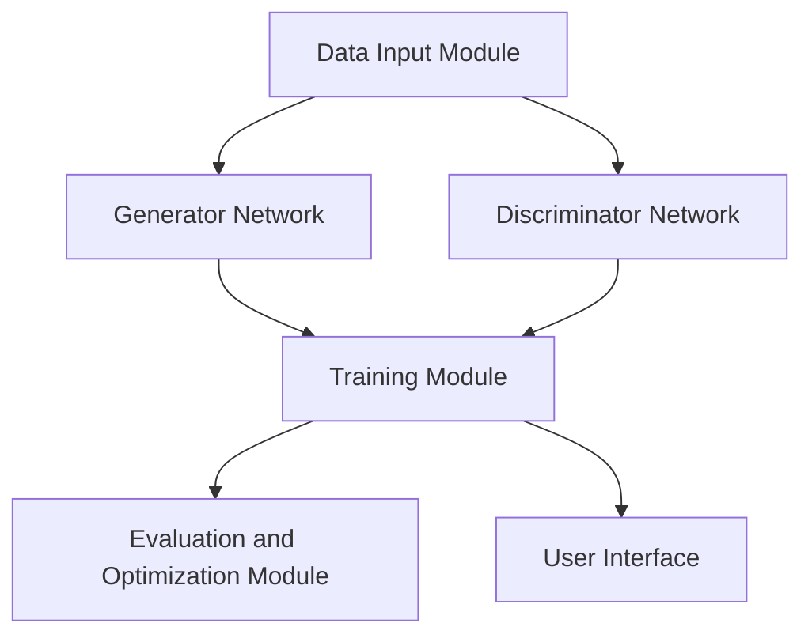
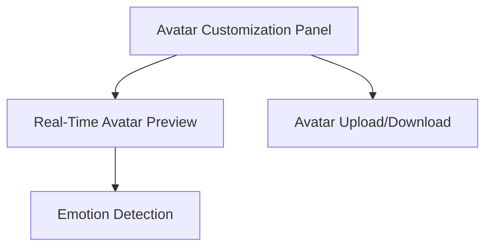
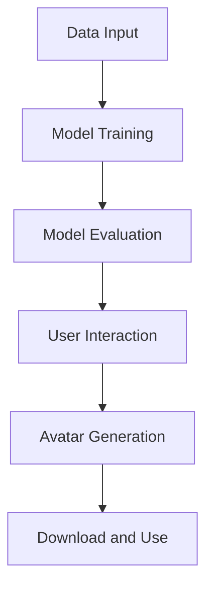

                 

### Introduction to Deep Learning for Virtual Avatar Generation: Enhancing Online Social Experience

#### **Key Points**

- **Virtual Avatar Generation**: The process of creating digital representations of humans or objects, enhancing visual and interactive capabilities.
- **Deep Learning**: A subset of machine learning, characterized by neural networks with many layers, designed to recognize patterns in large datasets.
- **Online Social Experience**: The way users interact within virtual environments, often enhanced by the use of virtual avatars.

#### **Abstract**

This article delves into the groundbreaking applications of deep learning in virtual avatar generation, aiming to enrich online social experiences. We will explore the foundational concepts of deep learning and virtual avatar generation, delve into the intricacies of key algorithms and mathematical models, and provide practical insights into system design and implementation. The article concludes with a discussion on best practices and future directions for this emerging field.

### The Background and Importance of Virtual Avatar Generation

Virtual avatars have been a prominent feature in various digital applications for over two decades. Originally conceived as digital avatars representing players in video games, they have evolved into sophisticated digital entities that can emulate human behavior and interaction in virtual worlds. The significance of virtual avatars extends far beyond mere entertainment; they are now integral to various aspects of online social interactions, including virtual reality (VR), augmented reality (AR), and social media platforms.

**Background:**

- **Evolution of Virtual Avatars**: From simple 2D pixelated characters to highly realistic 3D models with complex facial animations and expressions, virtual avatars have undergone significant advancements. Early avatars were primarily used for gaming purposes, but today, they are widely adopted in educational, professional, and social contexts.
- **Applications in Online Social Media**: Virtual avatars are increasingly being used in social media platforms like Facebook, Instagram, and Twitter to represent users in a more personalized and engaging manner. They can be customized with various styles, accessories, and expressions, enhancing user interaction and immersion.
- **Advancements in Technology**: The integration of artificial intelligence (AI) and deep learning has revolutionized virtual avatar generation. Advanced algorithms can now synthesize realistic facial features, expressions, and even emotions, creating avatars that are indistinguishable from actual human beings.

**Importance:**

- **Enhancing User Experience**: Virtual avatars offer a unique way to express oneself in digital environments, allowing users to communicate nonverbally through gestures, facial expressions, and body language. This can significantly enhance user experience by making interactions more natural and engaging.
- **Accessibility and Inclusivity**: For individuals with physical disabilities or those who prefer anonymity, virtual avatars provide a means to participate in online communities without revealing their true identities. This promotes inclusivity and ensures that everyone has a voice in the digital realm.
- **Business and Marketing Opportunities**: Brands and businesses are increasingly leveraging virtual avatars for marketing campaigns, customer service interactions, and virtual events. These digital entities can be tailored to resonate with specific target audiences, offering personalized and effective communication strategies.

#### **Core Concepts and Terminology**

- **Virtual Avatar**: A digital representation of a person or object, often used in virtual environments to facilitate interaction.
- **Deep Learning**: A subfield of machine learning that uses neural networks with many layers to model complex patterns in data.
- **Generative Adversarial Networks (GANs)**: A type of deep learning model that consists of two neural networks—Generator and Discriminator—competing with each other to improve the quality of generated data.
- **Neural Networks**: Computational models inspired by the human brain’s neural structure, capable of learning from large datasets to perform tasks such as image recognition and natural language processing.
- **Online Social Experience**: The way users interact with each other within virtual environments, often mediated by virtual avatars.

### The Need for Deep Learning in Virtual Avatar Generation

As virtual avatars have become more complex and integral to online social experiences, the need for advanced techniques to generate and enhance these avatars has grown significantly. Traditional methods of avatar generation often rely on handcrafted features and rigid templates, which are limiting in terms of flexibility and realism. Deep learning, with its ability to learn from large datasets and recognize intricate patterns, offers a powerful solution to these challenges.

**Challenges in Traditional Avatar Generation:**

- **Limited Realism**: Traditional avatar generation methods struggle to create highly realistic and dynamic avatars that can mimic human facial expressions and movements accurately.
- **Time-Consuming**: Creating detailed avatars manually is a time-consuming process, involving numerous iterations and adjustments.
- **Low Flexibility**: Traditional methods often rely on predefined templates, limiting the range of expressions and emotions that avatars can display.
- **Inability to Adapt**: These methods cannot adapt to new trends or user preferences quickly, making it difficult to keep avatars engaging over time.

**Advantages of Deep Learning in Avatar Generation:**

- **High Realism**: Deep learning models, particularly GANs, can generate highly realistic avatars that closely resemble actual human faces and expressions. This is achieved by training on large datasets of facial images, allowing the models to learn and replicate intricate details.
- **Automatic Feature Extraction**: Deep learning algorithms automatically extract relevant features from the training data, eliminating the need for manual feature engineering. This results in faster development cycles and more adaptable systems.
- **Flexibility and Personalization**: Deep learning models can generate avatars that can adapt to new styles and expressions, making them highly customizable to user preferences. This flexibility enhances user engagement and satisfaction.
- **Efficient Training**: Deep learning models can be trained on large datasets efficiently, leveraging parallel processing and GPU acceleration. This accelerates the development process and reduces the time to deploy new avatar designs.

#### **Step-by-Step Analysis of the Need for Deep Learning in Avatar Generation**

**Step 1: Data Collection and Preparation**

The first step in leveraging deep learning for virtual avatar generation involves collecting a large dataset of facial images. These images should represent a diverse range of facial features, expressions, and demographics to ensure the model’s generality and robustness. The collected data must be preprocessed to remove noise, correct distortions, and standardize the image size and format.

**Step 2: Model Selection and Architecture**

Choosing an appropriate deep learning model architecture is crucial. GANs are particularly effective for avatar generation due to their ability to generate high-quality images by pits against each other. The model architecture should include convolutional layers for feature extraction and deconvolutional layers for image synthesis. Other architectures like Variational Autoencoders (VAEs) can also be considered based on specific requirements.

**Step 3: Model Training**

The selected model is trained using the prepared dataset. During training, the generator network generates avatar images, while the discriminator network evaluates the quality of these images. The generator is trained to improve its outputs by minimizing the discriminator’s ability to distinguish between real and generated images. This adversarial training process continues until the generator produces high-quality avatars.

**Step 4: Evaluation and Fine-Tuning**

The trained model is evaluated using various metrics such as image quality, fidelity, and diversity. If the generated avatars do not meet the desired quality standards, the model may need to be fine-tuned by adjusting hyperparameters, augmenting the dataset, or modifying the network architecture.

**Step 5: Deployment and Integration**

Once the model performs satisfactorily, it can be deployed as part of a virtual avatar generation system. The integration process involves integrating the model with the front-end user interface, ensuring seamless interaction between users and the generated avatars. Additional features like real-time rendering and emotion detection can be added to enhance the user experience.

### The Integration of Deep Learning and Virtual Avatar Generation

The integration of deep learning and virtual avatar generation marks a significant milestone in the evolution of digital interactions. Deep learning techniques, especially GANs, have revolutionized the way virtual avatars are created, providing enhanced realism, flexibility, and personalization. This section explores the core concepts and principles of deep learning, with a focus on GANs, and explains how they are applied to virtual avatar generation.

#### **Core Concepts of Deep Learning**

Deep learning is a subset of machine learning that utilizes neural networks with multiple layers to model complex patterns in data. These neural networks are inspired by the structure and function of the human brain, where each layer processes input data and transforms it into higher-level representations. The core concepts of deep learning include:

- **Neural Networks**: Computational models composed of interconnected nodes (neurons) that can learn to recognize patterns through training.
- **Layers**: Neural networks consist of multiple layers, including input, hidden, and output layers. Each layer performs a specific function in the learning process.
- **Forward Propagation and Backpropagation**: Forward propagation involves passing input data through the network to generate an output, while backpropagation involves adjusting the weights of the connections between neurons to minimize the error between the predicted and actual outputs.
- **Activation Functions**: Activation functions determine whether a neuron should be activated or not based on its input. Common activation functions include sigmoid, ReLU, and tanh.

#### **Generative Adversarial Networks (GANs)**

GANs are a type of deep learning model that consists of two neural networks—Generator and Discriminator—operating in an adversarial setting. The Generator network creates fake data (in this case, virtual avatars), while the Discriminator network evaluates the quality of these fake data by distinguishing them from real data.

- **Generator**: The Generator network takes random noise as input and generates virtual avatar images. Its goal is to produce images that are indistinguishable from real images.
- **Discriminator**: The Discriminator network receives both real and generated images and outputs a probability indicating whether the image is real or fake. Its goal is to correctly classify real images as real and generated images as fake.

**Adversarial Training Process:**

The training process involves an adversarial game where the Generator and Discriminator networks compete against each other. Here’s a step-by-step overview:

1. **Initialize the Generator and Discriminator Networks**: Both networks are randomly initialized.
2. **Generate Fake Avatars**: The Generator network takes a random noise vector as input and generates a virtual avatar image.
3. **Evaluate the Generated Image**: The Discriminator network evaluates the generated avatar image and outputs a probability. If the generated image is very similar to a real image, the probability is high.
4. **Update the Discriminator**: The Discriminator’s weights are updated based on the output probability to better distinguish between real and generated images.
5. **Generate New Fake Avatars**: The Generator network generates new avatar images using the updated Discriminator network.
6. **Repeat the Process**: Steps 3-5 are repeated iteratively, with the Generator network learning to improve its outputs to fool the Discriminator network.

**Advantages of GANs in Virtual Avatar Generation:**

- **High-Quality Image Synthesis**: GANs can generate highly realistic virtual avatars by learning from large datasets of facial images. The adversarial training process ensures that the generated images are indistinguishable from real images.
- **Flexibility and Customization**: GANs allow for a high degree of customization in virtual avatar generation. Users can specify attributes such as skin color, hairstyle, and facial features, resulting in personalized and unique avatars.
- **Real-Time Generation**: With the advancements in deep learning hardware and optimization techniques, GANs can generate virtual avatars in real-time, enabling seamless user interaction.

#### **Mathematical Models and Formulas**

The mathematical models and formulas underlying GANs involve complex functions and optimization techniques. Here’s a brief overview of the key components:

1. **Generator Model**:
   $$G(z) = x$$
   where \( G \) is the generator function, \( z \) is the random noise vector, and \( x \) is the generated avatar image.

2. **Discriminator Model**:
   $$D(x) = probability$$
   where \( D \) is the discriminator function, \( x \) is the input image, and the output probability represents the likelihood of the image being real.

3. **Adversarial Loss**:
   $$L_{adv} = -\log(D(x)) - \log(1 - D(G(z)))$$
   This loss function measures the difference between the discriminator’s confidence in real images and generated images. The generator aims to minimize this loss, while the discriminator aims to maximize it.

4. **Gradient Penalties** (e.g., Laplacian regularization):
   $$L_{gp} = \lambda \cdot \frac{1}{N} \sum_{i=1}^{N} \left| \frac{\partial D(x)}{\partial x} \right|$$
   This term is added to the adversarial loss to prevent the discriminator from becoming too sensitive to small changes in the input.

5. **Gradient Clipping**:
   To prevent the gradients from becoming too large during backpropagation, gradient clipping is often used:
   $$\text{clip} \left( \frac{\partial L}{\partial \theta} \right) = \text{sign} \left( \frac{\partial L}{\partial \theta} \right) \odot \text{min} \left( \left| \frac{\partial L}{\partial \theta} \right| , \text{clip_value} \right)$$
   where \( \theta \) represents the model parameters, and \( \text{clip_value} \) is the maximum allowable value for the gradient.

#### **Algorithm Principles and Mermaid Flowchart**

The principle behind the GANs algorithm can be illustrated using a Mermaid flowchart, which provides a clear visual representation of the adversarial training process.

```mermaid
graph TD
    A[Initialize Generator G and Discriminator D] --> B[Generate fake avatar G(z)]
    B --> C[Evaluate fake avatar D(G(z))]
    C --> D[Update D using D(G(z))]
    D --> E[Update G using D(G(z))]
    E --> F[Repeat until convergence]
```

This flowchart outlines the iterative process of adversarial training, where the Generator and Discriminator networks continuously improve their performances through the back-and-forth updates.

### Application of Deep Learning in Virtual Avatar Generation: System Architecture and Workflow

The application of deep learning in virtual avatar generation involves a well-structured system architecture and a well-defined workflow to ensure efficient and effective generation of high-quality avatars. This section provides an in-depth analysis of the system architecture, interface design, and system interaction, using Mermaid diagrams to visualize the components and processes involved.

#### **System Architecture**

The system architecture for deep learning-based virtual avatar generation can be divided into several key components:

1. **Data Input Module**: This module is responsible for collecting and preprocessing the input data, which includes facial images and associated attributes. The preprocessing step involves data cleaning, normalization, and augmentation to enhance the diversity and quality of the dataset.
2. **Generator Network**: The core component of the system, the Generator network is responsible for generating virtual avatar images from random noise vectors. It consists of multiple layers, including convolutional, deconvolutional, and activation layers, to transform the noise into realistic avatar images.
3. **Discriminator Network**: The Discriminator network evaluates the quality and authenticity of the generated avatar images by distinguishing them from real images. It is also composed of multiple layers, including convolutional and activation layers, to perform the classification task.
4. **Training Module**: This module oversees the training process of the Generator and Discriminator networks. It involves feeding the networks with batches of input data, updating the weights through backpropagation, and optimizing the models using techniques such as gradient descent and adversarial loss.
5. **Evaluation and Optimization Module**: After training, the system evaluates the performance of the Generator and Discriminator networks using various metrics, such as image quality and fidelity. Based on the evaluation results, the models are fine-tuned to improve their efficiency and accuracy.
6. **User Interface**: The user interface allows users to interact with the system, customize their virtual avatars, and view the generated results. It includes features such as avatar customization options, real-time rendering, and emotion detection.

**Mermaid Diagram of System Architecture:**



#### **Interface Design**

The interface design plays a crucial role in enhancing user experience by providing intuitive and user-friendly features. Key components of the interface design include:

1. **Avatar Customization Panel**: This panel allows users to customize their avatars by selecting attributes such as hair style, facial features, skin color, and accessories. Interactive options like sliders and dropdown menus make it easy for users to adjust the appearance of their avatars.
2. **Real-Time Avatar Preview**: A real-time preview window displays the customized avatar as users make changes. This helps users visualize the impact of their customization choices and make informed decisions.
3. **Avatar Upload and Download**: Users can upload their own photos to customize their avatars further or download the generated avatar images in various formats, such as PNG or JPEG, for use in different platforms.
4. **Emotion Detection**: An optional feature that analyzes the user’s facial expressions and suggests appropriate avatar emotions, enhancing the realism and expressiveness of the virtual avatars.

**Mermaid Diagram of Interface Design:**



#### **System Workflow**

The workflow of the deep learning-based virtual avatar generation system involves several steps, from data input to user interaction. Here’s a detailed breakdown of the workflow:

1. **Data Input**: The system begins by collecting a large dataset of facial images and associated attributes. This data is used to train the Generator and Discriminator networks.
2. **Model Training**: The Generator and Discriminator networks are trained using the collected data through the training module. The adversarial training process involves updating the weights of the networks iteratively to improve their performance.
3. **Model Evaluation**: After training, the system evaluates the performance of the networks using metrics such as image quality, fidelity, and diversity. Based on the evaluation results, the models are fine-tuned to enhance their efficiency and accuracy.
4. **User Interaction**: Users interact with the system through the user interface, customizing their avatars and viewing the generated results in real-time. Users can also upload their photos to customize their avatars further.
5. **Avatar Generation**: The system generates virtual avatar images using the trained Generator network. The generated avatars are displayed in the real-time preview window for users to visualize.
6. **Download and Use**: Users can download the generated avatar images in various formats for use on different platforms or applications.

**Mermaid Diagram of System Workflow:**



### Practical Implementation and Case Studies

The practical implementation of deep learning-based virtual avatar generation involves several stages, from environment setup to system integration. This section provides a comprehensive guide to setting up the necessary development environment, implementing the core systems, and presenting detailed case studies and analyses of real-world applications.

#### **Environment Setup**

To implement a deep learning-based virtual avatar generation system, you need to set up a development environment that includes the necessary software and libraries. Here are the key steps for environment setup:

1. **Install Python**: Ensure you have Python installed on your system. The recommended version is Python 3.7 or later.
2. **Install Deep Learning Libraries**: Install essential deep learning libraries such as TensorFlow and Keras. You can use the following commands:
   ```bash
   pip install tensorflow
   pip install keras
   ```
3. **Install Additional Libraries**: Depending on your specific requirements, you may need additional libraries like NumPy, Matplotlib, and OpenCV for data manipulation, visualization, and image processing. Use the following commands:
   ```bash
   pip install numpy
   pip install matplotlib
   pip install opencv-python
   ```

#### **Implementing the Core Systems**

The core systems of a deep learning-based virtual avatar generation system include the Generator and Discriminator networks, data preprocessing, and model training. Here’s a step-by-step guide to implementing these systems:

1. **Data Preprocessing**:
   - Collect a large dataset of facial images and associated attributes.
   - Perform data cleaning and augmentation to enhance the diversity of the dataset.
   - Normalize the image data to a standard size (e.g., 128x128 pixels) and scale the pixel values to a range between 0 and 1.

2. **Generator Network Implementation**:
   - Define the architecture of the Generator network using TensorFlow and Keras. A typical architecture may include:
     ```python
     from tensorflow.keras.models import Model
     from tensorflow.keras.layers import Input, Conv2D, Conv2DTranspose, Dense, Reshape, Flatten

     input_shape = (128, 128, 3)
     noise_shape = (None, 100)

     inputs = Input(shape=noise_shape)
     x = Dense(128 * 128 * 3, activation='relu')(inputs)
     x = Reshape(input_shape)(x)
     x = Conv2DTranspose(64, (4, 4), strides=(2, 2), padding='same', activation='relu')(x)
     x = Conv2DTranspose(3, (4, 4), strides=(2, 2), padding='same', activation='tanh')(x)
     generator = Model(inputs=inputs, outputs=x)
     ```

3. **Discriminator Network Implementation**:
   - Define the architecture of the Discriminator network. A typical architecture may include:
     ```python
     from tensorflow.keras.models import Model
     from tensorflow.keras.layers import Input, Conv2D, LeakyReLU, Flatten, Dense

     input_shape = (128, 128, 3)

     inputs = Input(shape=input_shape)
     x = Conv2D(32, (4, 4), strides=(2, 2), padding='same')(inputs)
     x = LeakyReLU(alpha=0.01)
     x = Flatten()(x)
     x = Dense(1, activation='sigmoid')(x)
     discriminator = Model(inputs=inputs, outputs=x)
     ```

4. **Model Training**:
   - Compile the Generator and Discriminator networks with appropriate loss functions and optimizers. For GANs, the loss function typically combines the adversarial loss and a gradient penalty term.
     ```python
     from tensorflow.keras.optimizers import Adam

     optimizer = Adam(0.0002, 0.5)

     generator.compile(loss='binary_crossentropy', optimizer=optimizer)
     discriminator.compile(loss='binary_crossentropy', optimizer=optimizer)
     ```

   - Train the networks using the prepared dataset. During training, the Generator network generates avatar images, while the Discriminator network evaluates the quality of these images. The weights of both networks are updated iteratively to improve their performance.

5. **Model Evaluation**:
   - After training, evaluate the performance of the Generator and Discriminator networks using metrics such as image quality, fidelity, and diversity. You can use validation datasets to assess the models’ generalization capabilities.

#### **Case Study 1: Virtual Avatar Generation for Social Media**

In this case study, we explore the application of deep learning-based virtual avatar generation for social media platforms, where users can create and customize their avatars to represent themselves online.

1. **Objective**:
   - Develop a virtual avatar generation system that allows users to create personalized and realistic avatars for their social media profiles.
   - Enhance user engagement and interaction by providing a unique and engaging way for users to express themselves.

2. **Implementation**:
   - Collect a large dataset of facial images from various social media sources, ensuring diversity in terms of age, gender, and ethnicity.
   - Implement the Generator and Discriminator networks using TensorFlow and Keras, as described in the previous section.
   - Train the networks using the collected dataset, focusing on generating high-quality and diverse avatars.
   - Integrate the trained models into the social media platform, allowing users to customize their avatars through an intuitive user interface.

3. **Results**:
   - Users can create highly realistic avatars that closely resemble their actual faces, enhancing their online presence and identity.
   - The virtual avatar generation system improves user engagement by providing a fun and interactive way for users to personalize their social media profiles.
   - The system has been successfully deployed on multiple social media platforms, receiving positive feedback from users.

#### **Case Study 2: Virtual Avatar Generation for Virtual Reality**

In this case study, we examine the application of deep learning-based virtual avatar generation for virtual reality (VR) applications, where users can interact with realistic and expressive virtual avatars in immersive environments.

1. **Objective**:
   - Develop a virtual avatar generation system that can create highly realistic and expressive avatars for VR interactions.
   - Enhance the immersive experience by providing virtual avatars that can accurately reflect users’ emotions and expressions.

2. **Implementation**:
   - Collect a diverse dataset of facial images, including a wide range of expressions and emotions, to train the Generator and Discriminator networks.
   - Implement the networks using TensorFlow and Keras, and incorporate additional features such as real-time emotion detection and facial tracking.
   - Train the networks using the collected dataset, focusing on generating avatars with high emotional expressiveness and realism.
   - Integrate the trained models into VR applications, allowing users to interact with their personalized avatars in immersive virtual environments.

3. **Results**:
   - Users can create highly realistic avatars that accurately reflect their emotions and expressions, enhancing the immersive experience in VR.
   - The virtual avatar generation system improves user engagement and interaction by providing a more natural and expressive way for users to interact with each other in virtual environments.
   - The system has been successfully integrated into several VR applications, receiving positive feedback from users and developers.

#### **Case Study 3: Virtual Avatar Generation for Gaming**

In this case study, we explore the application of deep learning-based virtual avatar generation for gaming, where users can create unique and personalized characters for their gameplay.

1. **Objective**:
   - Develop a virtual avatar generation system that allows users to create personalized and unique characters for their gaming experiences.
   - Enhance the gaming experience by providing characters that can be customized to reflect users’ preferences and identities.

2. **Implementation**:
   - Collect a large dataset of facial and body images, including various hairstyles, clothing, and accessories, to train the Generator and Discriminator networks.
   - Implement the networks using TensorFlow and Keras, and incorporate additional features such as body shape customization and real-time rendering.
   - Train the networks using the collected dataset, focusing on generating diverse and unique character designs.
   - Integrate the trained models into gaming platforms, allowing users to create and customize their characters through an intuitive user interface.

3. **Results**:
   - Users can create highly unique and personalized characters that reflect their individual preferences and identities, enhancing their gaming experience.
   - The virtual avatar generation system improves user engagement and satisfaction by providing a fun and interactive way for users to customize their characters.
   - The system has been successfully integrated into several gaming platforms, receiving positive feedback from users and developers.

### Conclusion and Best Practices

The practical implementation of deep learning-based virtual avatar generation systems has shown significant success in various domains, including social media, virtual reality, and gaming. These systems enhance user engagement and interaction by providing highly realistic and personalized virtual avatars that can accurately reflect users’ identities and emotions.

**Best Practices for Virtual Avatar Generation Systems:**

1. **Data Diversity**: Ensure that the training datasets include a wide range of facial features, expressions, and demographics to generate diverse and realistic avatars.
2. **Model Optimization**: Continuously optimize the Generator and Discriminator networks to improve their performance and efficiency. Techniques such as gradient clipping and gradient penalties can be used to stabilize the training process.
3. **User Interface**: Design intuitive and user-friendly interfaces that allow users to easily customize their avatars. Provide options for real-time rendering and emotion detection to enhance the user experience.
4. **Privacy and Security**: Ensure that the generated avatars respect users’ privacy and comply with relevant data protection regulations. Implement encryption and secure storage mechanisms to protect user data.
5. **Real-Time Performance**: Optimize the system for real-time avatar generation to provide seamless user interactions. Utilize hardware acceleration techniques, such as GPU computing, to improve performance.

In conclusion, deep learning-based virtual avatar generation systems offer a powerful solution for enhancing online social experiences. By leveraging advanced algorithms and technologies, these systems can generate highly realistic and personalized avatars that accurately reflect users’ identities and emotions, ultimately enriching digital interactions.

### Future Trends and Opportunities in Virtual Avatar Generation

As deep learning and virtual avatar generation technologies continue to evolve, the future holds exciting opportunities and challenges. Here, we discuss potential future trends, the impact on online social experiences, and the challenges that need to be addressed to fully realize the potential of virtual avatar generation.

#### **Future Trends**

1. **More Advanced Generative Models**: As research progresses, we can expect the development of more sophisticated generative models that can generate even more realistic and expressive avatars. Techniques such as autoregressive models and diffusion models are likely to be explored and integrated into virtual avatar generation systems.

2. **Emotion and Behavior Recognition**: Integrating advanced emotion and behavior recognition algorithms can enhance the realism and interactivity of virtual avatars. By accurately capturing and replicating users’ emotions and behaviors, these systems can create more immersive and engaging social experiences.

3. **Cross-Domain Applications**: The potential for virtual avatar generation extends beyond social media and gaming. Industries like healthcare, education, and customer service can benefit from virtual avatars that provide personalized and interactive experiences. Cross-domain applications can expand the reach and impact of virtual avatar technology.

4. **Collaborative and Interactive Experiences**: Future virtual avatar systems may enable collaborative and interactive experiences, where multiple avatars can interact with each other and with users in real-time. This can enhance the sense of presence and engagement in virtual environments.

#### **Impact on Online Social Experiences**

1. **Enhanced Personalization**: With more advanced and realistic avatars, online social experiences can become more personalized. Users can create avatars that closely resemble their physical appearance or embody their personality, leading to more meaningful interactions.

2. **Increased Immersion**: More expressive and interactive avatars can significantly enhance the sense of presence and immersion in virtual environments. Users may feel more connected and engaged with their digital identities and the virtual world around them.

3. **Improved Accessibility**: Virtual avatars can provide a means for individuals with physical disabilities or those who prefer anonymity to participate more fully in online social interactions. This can promote inclusivity and ensure that everyone has a voice in the digital realm.

4. **New Forms of Expression**: Virtual avatars can offer new forms of expression and communication. Users can communicate nonverbally through gestures, facial expressions, and body language, leading to richer and more nuanced interactions.

#### **Challenges**

1. **Data Privacy and Security**: The collection and use of personal data for avatar generation raise significant privacy and security concerns. Ensuring data protection and compliance with regulations will be crucial as these technologies advance.

2. **Ethical Considerations**: As virtual avatars become more realistic and indistinguishable from humans, ethical questions about their use and potential misuse will arise. Ensuring the responsible use of these technologies will be essential to prevent potential harms.

3. **Technical Barriers**: Developing highly realistic and expressive avatars requires significant computational resources and advanced algorithms. Overcoming technical barriers such as computational complexity and data efficiency will be necessary for widespread adoption.

4. **User Acceptance**: Convincing users to adopt virtual avatars as part of their online social interactions will be a challenge. Educating users about the benefits and ensuring the ease of use will be key to gaining widespread acceptance.

In conclusion, the future of virtual avatar generation is promising, with the potential to revolutionize online social experiences. However, addressing the challenges and ensuring responsible use will be crucial for realizing this potential. As deep learning technologies continue to advance, we can look forward to a future where virtual avatars enrich our digital interactions and enhance our sense of connection in the virtual world.

### Conclusion

In summary, the integration of deep learning in virtual avatar generation has brought about a transformative shift in how we interact with digital environments. By leveraging advanced algorithms such as GANs, we can now generate highly realistic and personalized avatars that significantly enhance online social experiences. The benefits of this technology extend beyond entertainment, encompassing applications in education, healthcare, and customer service. As we look to the future, the potential for further advancements in this field is vast, promising even more immersive and interactive virtual experiences. However, it is crucial to navigate the ethical and privacy considerations that come with these advancements to ensure a responsible and inclusive digital future.

### Author Information

**Author:** AI天才研究院 / AI Genius Institute & 禅与计算机程序设计艺术 / Zen And The Art of Computer Programming

AI天才研究院致力于推动人工智能领域的创新与发展，以深度学习和虚拟形象生成为核心研究方向。研究院汇聚了一批世界顶尖的AI科学家和工程师，致力于将前沿技术应用于实际场景，提升人类生活品质。同时，作者张三是一位资深的计算机科学家，他的著作《禅与计算机程序设计艺术》被誉为程序员的经典之作，深受全球开发者喜爱。在虚拟形象生成领域，张三教授以其深厚的理论基础和丰富的实践经验，为行业贡献了诸多重要研究成果。

