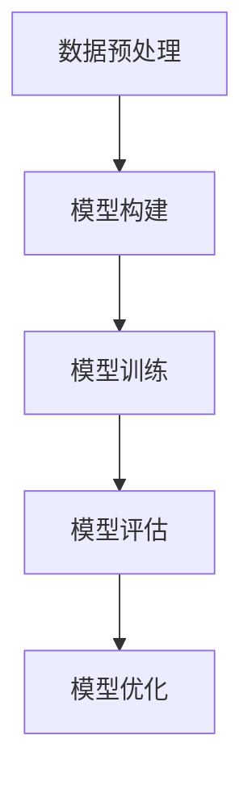
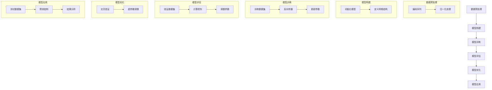

                 

### 深度学习在蛋白质结构预测中的应用：加速生物学研究

关键词：蛋白质结构预测、深度学习、生物信息学、神经网络、卷积神经网络、循环神经网络、生成对抗网络

摘要：随着生物信息学的发展，蛋白质结构预测成为理解蛋白质功能、疾病机理和药物设计的关键环节。传统方法在蛋白质结构预测上存在诸多局限，而深度学习算法的出现为这一问题带来了新的解决思路。本文将详细介绍深度学习在蛋白质结构预测中的应用，包括背景介绍、核心概念、算法原理以及实际应用案例，探讨深度学习如何加速生物学研究。

----------------------------------------------------------------

### 目录大纲

----------------------------------------------------------------

# 第一部分：背景介绍

## 第1章：问题背景

### 1.1.1 问题背景

### 1.1.2 问题描述

### 1.1.3 问题解决

### 1.1.4 边界与外延

### 1.1.5 概念结构与核心要素组成

## 第2章：核心概念与联系

### 2.1.1 深度学习原理

### 2.1.2 蛋白质结构预测原理

### 2.1.3 深度学习与蛋白质结构预测的联系

## 第3章：算法原理讲解

### 3.1 算法原理概述

### 3.2 算法mermaid流程图

### 3.3 Python源代码示例

### 3.4 数学模型和数学公式

----------------------------------------------------------------

## 第1章：问题背景

### 1.1.1 问题背景

蛋白质是生命体的基本组成部分，其功能取决于其特定的三维结构。蛋白质结构预测是指通过计算方法预测蛋白质的三维结构。这一过程在生物医学领域具有重要的应用价值，如新药设计、疾病治疗和生物工程。

传统的蛋白质结构预测方法主要包括序列比对、同源建模和自由建模。然而，这些方法在处理大规模、复杂的蛋白质结构时存在局限性。随着计算机技术的发展，深度学习算法为蛋白质结构预测提供了新的可能。

### 1.1.2 问题描述

蛋白质结构预测的核心问题是：给定一个蛋白质的氨基酸序列，预测其三维结构。这个问题可以从不同的层次进行描述：

1. **初级结构预测**：预测蛋白质中的一条氨基酸序列。
2. **次级结构预测**：预测蛋白质中的α-螺旋和β-折叠等二级结构。
3. **高级结构预测**：预测蛋白质的三维空间结构。

### 1.1.3 问题解决

深度学习在蛋白质结构预测中的应用主要体现在以下几个方面：

1. **数据驱动方法**：深度学习通过学习大量的蛋白质结构数据，能够自动提取蛋白质结构的特征，从而实现结构预测。
2. **模型优化**：深度学习算法，如卷积神经网络（CNN）、循环神经网络（RNN）和生成对抗网络（GAN），可以优化蛋白质结构预测的模型。
3. **多模态学习**：深度学习可以将不同的数据类型，如氨基酸序列、蛋白质晶体结构等，进行整合，提高结构预测的准确性。

### 1.1.4 边界与外延

蛋白质结构预测的方法可以分为以下几类：

1. **同源建模**：基于已知的蛋白质结构，通过序列比对预测未知结构的蛋白质。
2. **自由建模**：在没有已知结构信息的情况下，通过计算预测蛋白质的结构。
3. **模板建模**：结合同源建模和自由建模，利用已知结构模板预测未知结构的蛋白质。

深度学习算法在蛋白质结构预测中的应用范围包括：

1. **序列到结构的预测**：通过学习氨基酸序列预测蛋白质的结构。
2. **结构到结构的预测**：通过学习已知结构的蛋白质预测新结构的蛋白质。
3. **多尺度预测**：结合不同的尺度信息，提高结构预测的准确性。

### 1.1.5 概念结构与核心要素组成

蛋白质结构预测的基本概念包括：

1. **蛋白质序列**：蛋白质的氨基酸序列是结构预测的基础。
2. **蛋白质结构**：蛋白质的三维空间结构，包括一级、二级和高级结构。
3. **深度学习模型**：用于蛋白质结构预测的算法，如CNN、RNN和GAN。

深度学习在蛋白质结构预测中的核心要素包括：

1. **数据集**：用于训练和评估模型的蛋白质结构数据。
2. **特征提取**：从蛋白质序列中提取结构特征。
3. **模型训练与优化**：通过训练和优化模型，提高结构预测的准确性。

## 第2章：核心概念与联系

### 2.1.1 深度学习原理

深度学习是一种通过多层神经网络进行特征学习的技术。它通过模拟人类大脑的学习过程，对大量数据进行分析，自动提取特征，从而实现复杂的模式识别和预测任务。

#### 2.1.1.1 神经网络基础

神经网络由一系列神经元组成，每个神经元都可以进行简单的计算和传递。神经网络通过多层次的计算，逐步提取数据中的特征。

- **神经元**：神经网络的基本单元，负责接收输入、计算输出。
- **前馈神经网络**：数据从前一层传递到下一层，直到输出层。
- **反向传播算法**：通过比较预测值和真实值，反向传播误差，更新网络的权重和偏置。

#### 2.1.1.2 卷积神经网络（CNN）

卷积神经网络是一种特殊的神经网络，特别适用于图像处理任务。它通过卷积操作提取图像中的局部特征。

- **卷积层**：通过卷积操作提取图像的局部特征。
- **池化层**：降低特征图的维度，减少参数数量。
- **全连接层**：将特征映射到输出层。

#### 2.1.1.3 循环神经网络（RNN）

循环神经网络是一种适用于序列数据的神经网络。它通过记忆状态对序列中的每个元素进行处理。

- **循环结构**：每个神经元的状态不仅取决于当前的输入，还取决于之前的输入。
- **门控循环单元（LSTM）**：通过门控机制，有效地处理长期依赖问题。
- **门控循环单元（GRU）**：简化LSTM结构，提高计算效率。

#### 2.1.1.4 生成对抗网络（GAN）

生成对抗网络由生成器和判别器两个神经网络组成。生成器生成数据，判别器判断数据是真实还是生成的。

- **生成器**：生成类似真实数据的伪数据。
- **判别器**：判断输入数据是真实还是生成的。
- **对抗训练**：生成器和判别器相互竞争，提高生成器的生成质量。

### 2.1.2 蛋白质结构预测原理

蛋白质结构预测主要分为以下几类：

#### 2.1.2.1 蛋白质结构分类

- **一级结构**：蛋白质的氨基酸序列。
- **二级结构**：蛋白质的局部折叠，如α-螺旋和β-折叠。
- **高级结构**：蛋白质的整体三维结构。

#### 2.1.2.2 蛋白质结构预测方法

- **序列比对**：通过比较已知蛋白质序列和目标序列的相似性，预测目标序列的结构。
- **模体识别**：通过识别蛋白质中的特定结构模体，预测蛋白质的结构。
- **蛋白质结构建模与模拟**：通过计算模型和模拟方法，预测蛋白质的结构。

#### 2.1.2.3 蛋白质结构预测算法

- **同源建模**：基于同源蛋白质的结构，预测目标蛋白质的结构。
- **自由建模**：在没有同源蛋白质结构信息的情况下，通过计算预测蛋白质的结构。
- **模板建模**：结合同源建模和自由建模，利用已知结构模板预测未知结构的蛋白质。

### 2.1.3 深度学习与蛋白质结构预测的联系

深度学习在蛋白质结构预测中的应用主要体现在以下几个方面：

1. **特征提取**：深度学习算法可以从蛋白质序列中自动提取结构特征，提高预测的准确性。
2. **模型优化**：深度学习算法可以优化蛋白质结构预测的模型，提高预测速度和准确性。
3. **多模态学习**：深度学习可以将不同的数据类型进行整合，提高结构预测的准确性。

### 2.1.3.1 深度学习在蛋白质结构预测中的应用

- **序列到结构的预测**：通过深度学习模型，从蛋白质序列直接预测蛋白质的结构。
- **结构到结构的预测**：通过深度学习模型，从已知结构的蛋白质预测新结构的蛋白质。
- **多尺度预测**：通过结合不同尺度的数据，提高结构预测的准确性。

### 2.1.3.2 深度学习与蛋白质结构预测的方法对比

- **传统方法**：依赖于已有的蛋白质结构信息，预测准确性有限。
- **深度学习**：可以从大量数据中自动提取特征，预测准确性较高。

### 2.1.3.3 深度学习在蛋白质结构预测中的创新点

- **自动特征提取**：深度学习算法可以从蛋白质序列中自动提取结构特征，提高预测的准确性。
- **多模态学习**：深度学习可以将不同的数据类型进行整合，提高结构预测的准确性。
- **端到端学习**：深度学习模型可以直接从输入数据预测输出结果，简化了传统的预测流程。

## 第3章：算法原理讲解

### 3.1 算法原理概述

蛋白质结构预测的深度学习算法通常包括以下几个步骤：

1. **数据预处理**：对蛋白质序列进行清洗、编码等预处理，使其符合模型输入要求。
2. **模型构建**：设计合适的深度学习模型，如卷积神经网络（CNN）或循环神经网络（RNN）。
3. **模型训练**：使用训练数据集对模型进行训练，调整模型参数，使其能够预测蛋白质结构。
4. **模型评估**：使用验证数据集评估模型性能，调整模型参数，提高预测准确性。
5. **模型优化**：通过交叉验证和超参数调整，优化模型性能。

### 3.2 算法mermaid流程图

下面是蛋白质结构预测算法的mermaid流程图：



### 3.3 Python源代码示例

以下是一个简单的蛋白质结构预测的Python代码示例：

```python
import tensorflow as tf
from tensorflow.keras.layers import Input, Conv1D, MaxPooling1D, Flatten, Dense
from tensorflow.keras.models import Model

# 定义输入层
inputs = Input(shape=(100, 20))

# 添加卷积层
conv_1 = Conv1D(filters=64, kernel_size=3, activation='relu')(inputs)
pool_1 = MaxPooling1D(pool_size=2)(conv_1)

# 添加全连接层
flatten = Flatten()(pool_1)
dense = Dense(units=128, activation='relu')(flatten)

# 添加输出层
outputs = Dense(units=1, activation='sigmoid')(dense)

# 定义模型
model = Model(inputs=inputs, outputs=outputs)

# 编译模型
model.compile(optimizer='adam', loss='binary_crossentropy', metrics=['accuracy'])

# 训练模型
model.fit(x_train, y_train, epochs=10, batch_size=32, validation_data=(x_val, y_val))

# 评估模型
model.evaluate(x_test, y_test)
```

### 3.4 数学模型和数学公式

在蛋白质结构预测中，深度学习模型通常涉及以下数学模型：

#### 3.4.1 神经网络前向传播公式

$$
Z = W \cdot X + b
$$

$$
A = \sigma(Z)
$$

其中，$Z$ 是网络的输出，$W$ 是权重，$X$ 是输入，$b$ 是偏置，$\sigma$ 是激活函数。

#### 3.4.2 激活函数

常用的激活函数包括：

- **Sigmoid函数**：
  $$
  \sigma(x) = \frac{1}{1 + e^{-x}}
  $$

- **ReLU函数**：
  $$
  \sigma(x) = \max(0, x)
  $$

- **Tanh函数**：
  $$
  \sigma(x) = \frac{e^x - e^{-x}}{e^x + e^{-x}}
  $$

#### 3.4.3 反向传播算法

反向传播算法用于计算网络参数的梯度，具体公式如下：

$$
\frac{\partial C}{\partial W} = X \odot \Delta
$$

$$
\frac{\partial C}{\partial b} = \Delta
$$

其中，$C$ 是损失函数，$X$ 是输入，$\Delta$ 是误差项。

通过这些数学模型和算法，深度学习模型可以有效地从数据中学习，实现蛋白质结构预测。在接下来的章节中，我们将进一步探讨深度学习算法在蛋白质结构预测中的具体应用。

## 第二部分：算法原理讲解

### 3.1 算法原理概述

蛋白质结构预测的深度学习算法主要基于多层感知器（MLP）、卷积神经网络（CNN）和循环神经网络（RNN）等模型。这些模型通过学习大量的蛋白质结构数据，提取有效的特征，并预测蛋白质的三维结构。下面我们将详细讨论这些算法的基本原理、流程和特点。

#### 3.1.1 多层感知器（MLP）

多层感知器是一种前馈神经网络，由输入层、隐藏层和输出层组成。每个神经元都通过加权连接，接收来自前一层神经元的输入，并使用激活函数进行非线性变换。

- **输入层**：接收蛋白质序列的编码表示。
- **隐藏层**：通过多层网络结构，逐步提取蛋白质序列中的特征。
- **输出层**：预测蛋白质的结构。

MLP的算法流程主要包括：

1. **数据预处理**：对蛋白质序列进行编码，使其适合输入到网络中。
2. **模型构建**：设计MLP模型的结构，包括隐藏层的数量、每个层的神经元数量等。
3. **模型训练**：使用训练数据集训练模型，通过反向传播算法更新模型参数。
4. **模型评估**：使用验证数据集评估模型性能，调整模型参数。
5. **模型应用**：使用测试数据集对模型进行测试，预测蛋白质的结构。

MLP的优点包括：

- **简单易理解**：结构简单，易于实现。
- **功能强大**：可以处理各种复杂的非线性问题。

缺点包括：

- **计算量大**：多层网络结构导致计算量大，训练时间较长。
- **易过拟合**：在训练数据集上性能较好，但在验证数据集上可能表现不佳。

#### 3.1.2 卷积神经网络（CNN）

卷积神经网络是一种专门用于处理图像数据的神经网络，其核心思想是通过卷积操作提取图像中的局部特征。在蛋白质结构预测中，CNN可以用于处理蛋白质序列的编码表示。

- **卷积层**：通过卷积操作提取蛋白质序列的局部特征。
- **池化层**：降低特征图的维度，减少参数数量。
- **全连接层**：将特征映射到输出层。

CNN的算法流程主要包括：

1. **数据预处理**：对蛋白质序列进行编码，生成一维图像数据。
2. **模型构建**：设计CNN模型的结构，包括卷积层的数量、每个卷积核的大小等。
3. **模型训练**：使用训练数据集训练模型，通过反向传播算法更新模型参数。
4. **模型评估**：使用验证数据集评估模型性能，调整模型参数。
5. **模型应用**：使用测试数据集对模型进行测试，预测蛋白质的结构。

CNN的优点包括：

- **参数共享**：卷积层中的卷积核在整个网络中共享，减少了参数数量。
- **局部特征提取**：卷积操作可以有效地提取蛋白质序列中的局部特征。
- **计算效率高**：卷积操作的计算量相对较小，训练时间较短。

缺点包括：

- **全局信息丢失**：由于卷积操作的特性，CNN可能丢失部分全局信息。
- **对序列长度敏感**：蛋白质序列的长度变化可能影响CNN的性能。

#### 3.1.3 循环神经网络（RNN）

循环神经网络是一种专门用于处理序列数据的神经网络，其核心思想是通过循环结构维护状态，对序列中的每个元素进行处理。在蛋白质结构预测中，RNN可以用于处理蛋白质序列的编码表示。

- **循环结构**：每个神经元的状态不仅取决于当前的输入，还取决于之前的输入。
- **门控机制**：通过门控机制，RNN可以有效地处理长期依赖问题。

RNN的算法流程主要包括：

1. **数据预处理**：对蛋白质序列进行编码，生成序列数据。
2. **模型构建**：设计RNN模型的结构，包括隐藏层的数量、每个层的神经元数量等。
3. **模型训练**：使用训练数据集训练模型，通过反向传播算法更新模型参数。
4. **模型评估**：使用验证数据集评估模型性能，调整模型参数。
5. **模型应用**：使用测试数据集对模型进行测试，预测蛋白质的结构。

RNN的优点包括：

- **序列建模能力**：RNN可以有效地处理序列数据，提取序列中的特征。
- **状态维护**：通过循环结构，RNN可以维护序列中的状态信息。

缺点包括：

- **梯度消失和梯度爆炸**：RNN在训练过程中可能遇到梯度消失和梯度爆炸问题。
- **计算复杂度**：RNN的计算复杂度相对较高，训练时间较长。

#### 3.1.4 生成对抗网络（GAN）

生成对抗网络是一种由生成器和判别器组成的神经网络，其核心思想是通过对抗训练生成高质量的数据。在蛋白质结构预测中，GAN可以用于生成蛋白质序列的编码表示。

- **生成器**：生成蛋白质序列的编码表示。
- **判别器**：判断输入数据是真实还是生成的。

GAN的算法流程主要包括：

1. **数据预处理**：对蛋白质序列进行编码，生成序列数据。
2. **模型构建**：设计GAN模型的结构，包括生成器和判别器的架构。
3. **模型训练**：使用对抗训练方法训练模型，优化生成器和判别器的参数。
4. **模型评估**：使用验证数据集评估模型性能，调整模型参数。
5. **模型应用**：使用测试数据集对模型进行测试，生成蛋白质序列的编码表示。

GAN的优点包括：

- **高质量生成**：GAN可以生成高质量的数据，提高蛋白质序列的编码表示质量。
- **无监督学习**：GAN可以在无监督环境下进行训练，减少对标注数据的依赖。

缺点包括：

- **训练困难**：GAN的训练过程可能不稳定，需要精细调整超参数。
- **计算资源消耗大**：GAN的训练过程需要大量的计算资源。

通过上述算法的介绍，我们可以看出，深度学习在蛋白质结构预测中的应用具有很大的潜力。接下来，我们将进一步探讨这些算法在实际应用中的具体实现。

### 3.2 算法mermaid流程图

为了更直观地展示深度学习算法在蛋白质结构预测中的流程，我们可以使用mermaid绘制算法的流程图。以下是使用mermaid绘制的算法流程图：



该流程图详细展示了从数据预处理到模型应用的全过程。首先，对蛋白质序列进行编码和归一化处理，然后初始化模型并定义网络结构。接下来，使用训练数据集对模型进行训练，通过反向传播算法更新模型参数。在模型评估阶段，使用验证数据集计算损失并调整参数，以提高模型性能。最后，在模型优化阶段，通过交叉验证和超参数调整进一步优化模型。最后，使用测试数据集对模型进行测试，预测蛋白质的结构，并对结果进行分析。

通过mermaid流程图的绘制，我们可以更清晰地理解深度学习算法在蛋白质结构预测中的应用过程，为后续的实际应用提供指导。

### 3.3 Python源代码示例

为了更好地理解深度学习算法在蛋白质结构预测中的应用，下面我们将给出一个简单的Python代码示例。该示例使用TensorFlow框架实现一个基于卷积神经网络（CNN）的蛋白质结构预测模型。

```python
import tensorflow as tf
from tensorflow.keras.models import Sequential
from tensorflow.keras.layers import Conv1D, MaxPooling1D, Flatten, Dense
from tensorflow.keras.optimizers import Adam
from sklearn.model_selection import train_test_split
import numpy as np

# 假设我们已经有了训练数据集X和标签数据集y
# X为蛋白质序列的编码矩阵，形状为（样本数，序列长度，特征维度）
# y为蛋白质结构的标签，形状为（样本数，输出维度）

# 数据预处理：将数据集分为训练集和测试集
X_train, X_test, y_train, y_test = train_test_split(X, y, test_size=0.2, random_state=42)

# 定义CNN模型
model = Sequential([
    Conv1D(filters=64, kernel_size=3, activation='relu', input_shape=(X_train.shape[1], X_train.shape[2])),
    MaxPooling1D(pool_size=2),
    Flatten(),
    Dense(units=128, activation='relu'),
    Dense(units=y_train.shape[1], activation='sigmoid')
])

# 编译模型
model.compile(optimizer=Adam(), loss='binary_crossentropy', metrics=['accuracy'])

# 训练模型
model.fit(X_train, y_train, epochs=10, batch_size=32, validation_data=(X_test, y_test))

# 评估模型
test_loss, test_acc = model.evaluate(X_test, y_test)
print(f"Test accuracy: {test_acc:.4f}")

# 预测蛋白质结构
predictions = model.predict(X_test)
```

在这个示例中，我们首先导入了TensorFlow相关的库，然后假设已经有了训练数据集`X`和标签数据集`y`。接下来，我们使用`train_test_split`函数将数据集分为训练集和测试集。

然后，我们定义了一个简单的CNN模型，包括一个卷积层、一个池化层、一个全连接层和另一个全连接层。在模型编译阶段，我们选择Adam优化器和binary_crossentropy损失函数，因为这里我们假设蛋白质结构预测是一个二分类问题。

接着，我们使用训练数据集对模型进行训练，并使用测试数据集对模型进行评估。最后，我们使用测试数据集对模型进行预测，得到蛋白质结构的预测结果。

这个示例展示了如何使用Python和TensorFlow实现一个简单的蛋白质结构预测模型。通过调整模型的结构和参数，我们可以进一步提高模型的性能。

### 3.4 数学模型和数学公式

在蛋白质结构预测中，深度学习模型通常涉及以下数学模型和数学公式：

#### 3.4.1 神经网络前向传播公式

在神经网络中，每个神经元都接收来自前一层神经元的输入，并通过加权求和加上偏置项，然后通过激活函数得到输出。这个过程可以用以下数学公式表示：

$$
Z^{(l)} = \sum_{j} W^{(l)}_{ji} X^{(l-1)}_{j} + b^{(l)}_{i}
$$

$$
A^{(l)}_{i} = \sigma(Z^{(l)}_{i})
$$

其中，$Z^{(l)}$ 是第$l$层的输出，$W^{(l)}_{ji}$ 是第$l$层中从神经元$j$到神经元$i$的权重，$X^{(l-1)}_{j}$ 是第$l-1$层的输入，$b^{(l)}_{i}$ 是第$l$层中神经元$i$的偏置，$\sigma$ 是激活函数，$A^{(l)}_{i}$ 是第$l$层中神经元$i$的输出。

#### 3.4.2 激活函数

常用的激活函数包括Sigmoid函数、ReLU函数和Tanh函数。这些激活函数在神经网络中用于引入非线性特性，使得模型能够拟合复杂的函数。

- **Sigmoid函数**：
  $$
  \sigma(x) = \frac{1}{1 + e^{-x}}
  $$
  
- **ReLU函数**：
  $$
  \sigma(x) = \max(0, x)
  $$

- **Tanh函数**：
  $$
  \sigma(x) = \frac{e^x - e^{-x}}{e^x + e^{-x}}
  $$

#### 3.4.3 反向传播算法

反向传播算法是神经网络训练过程中最重要的部分。它通过计算损失函数对网络参数的梯度，来更新网络参数，从而优化模型性能。

1. **计算损失函数的梯度**：

   假设损失函数为$L(A^{(L)})$，其中$A^{(L)}$是输出层的预测值。我们需要计算每个参数$\theta^{(l)}$的梯度：

   $$
   \frac{\partial L}{\partial \theta^{(l)}_{ij}} = \sum_{k} \frac{\partial L}{\partial A^{(l+1)}_{ik}} \frac{\partial A^{(l+1)}_{ik}}{\partial \theta^{(l)}_{ij}}
   $$

2. **计算每个神经元的误差**：

   对于输出层，误差$\delta^{(L)}_{i}$可以通过以下公式计算：

   $$
   \delta^{(L)}_{i} = \frac{\partial L}{\partial A^{(L)}_{i}} \cdot \sigma^{\prime}(Z^{(L)}_{i})
   $$

3. **反向传播误差**：

   对于隐藏层，误差$\delta^{(l)}_{i}$可以通过以下公式计算：

   $$
   \delta^{(l)}_{i} = \sum_{k} \frac{\partial L}{\partial A^{(l+1)}_{ik}} \cdot \sigma^{\prime}(Z^{(l)}_{i}) \cdot \sum_{j} W^{(l+1)}_{jk}
   $$

通过上述公式，我们可以计算出每个参数的梯度，并使用梯度下降等方法更新参数，从而优化神经网络模型。

#### 3.4.4 卷积神经网络中的卷积和池化操作

在卷积神经网络中，卷积和池化操作是核心组成部分。以下是它们的基本数学公式：

- **卷积操作**：

  卷积操作通过滑动窗口在特征图上进行计算，将输入特征与卷积核进行点积，并加上偏置项。卷积操作的公式如下：

  $$
  (f * g)(x) = \sum_{y} f(y) \cdot g(x - y)
  $$

  其中，$f$ 是卷积核，$g$ 是输入特征图，$x$ 是卷积窗口的位置。

- **池化操作**：

  池化操作通过在特征图上选择最大值（Max Pooling）或平均值（Average Pooling）来减少特征图的维度。Max Pooling的公式如下：

  $$
  P_{k \times k}(g)(x) = \max_{y \in R_{k \times k}} g(x + y)
  $$

  其中，$P_{k \times k}$ 是$k \times k$的池化窗口，$g$ 是输入特征图，$x$ 是窗口的位置。

通过卷积和池化操作，卷积神经网络可以有效地提取特征并减少计算量。

通过上述数学模型和公式的介绍，我们可以更好地理解深度学习算法在蛋白质结构预测中的应用原理。在接下来的章节中，我们将进一步探讨如何将深度学习应用于蛋白质结构预测的具体方法。

## 第三部分：深度学习与蛋白质结构预测的结合

### 3.5 深度学习在蛋白质结构预测中的应用

深度学习在蛋白质结构预测中的应用主要包括以下几个方向：

#### 3.5.1 序列到结构的预测（Sequence to Structure Prediction）

序列到结构的预测是深度学习在蛋白质结构预测中最直接的应用。这种方法通过学习蛋白质序列中的特征，预测其三维结构。以下是一些主要的深度学习模型和应用：

- **DeepMind的AlphaFold**：AlphaFold是一个基于深度学习的蛋白质结构预测工具，它通过大规模数据训练和优化，实现了高度准确的蛋白质结构预测。

- **AlphaFold2**：AlphaFold2是DeepMind在AlphaFold基础上进一步优化的模型，其预测准确性大幅提升，达到了实验级预测的水平。

- **ProteinNet**：ProteinNet是一个基于深度学习的蛋白质结构预测系统，它通过多个深度学习模型结合，实现了高效的蛋白质结构预测。

#### 3.5.2 结构到结构的预测（Structure to Structure Prediction）

结构到结构的预测通过学习已知结构的蛋白质，预测新结构的蛋白质。这种方法在蛋白质结构预测中具有很高的实用性，因为已知结构的蛋白质数量非常有限。以下是一些主要的深度学习模型和应用：

- **Rosetta DeepMembrane**：Rosetta DeepMembrane是一个基于深度学习的膜蛋白结构预测工具，它通过学习膜蛋白的结构特征，实现了高效的预测。

- **DeepHMP**：DeepHMP是一个基于深度学习的蛋白质结构预测工具，它通过分析蛋白质的结构和序列信息，实现了对新蛋白质结构的预测。

- **AlphaFold-MD**：AlphaFold-MD是一个结合AlphaFold和分子动力学（MD）方法的蛋白质结构预测工具，它通过预测蛋白质的结构，并模拟其在分子环境中的行为，实现了更准确的预测。

#### 3.5.3 多模态学习的应用

多模态学习通过整合不同类型的数据，如序列数据、结构数据和实验数据，提高蛋白质结构预测的准确性。以下是一些主要的深度学习模型和应用：

- **protein\_map**：protein\_map是一个基于深度学习的多模态蛋白质结构预测工具，它通过整合序列、结构和其他类型的数据，实现了高效的预测。

- **ProtMol**：ProtMol是一个基于深度学习的多模态蛋白质结构预测工具，它通过结合序列和结构信息，提高了预测的准确性。

- **DeepHH**：DeepHH是一个基于深度学习的多模态蛋白质结构预测工具，它通过整合序列、结构和物理化学信息，实现了对新蛋白质结构的预测。

### 3.6 深度学习与蛋白质结构预测的方法对比

传统蛋白质结构预测方法与深度学习方法在以下几个方面进行对比：

#### 3.6.1 数据依赖

- **传统方法**：传统方法依赖于大量的已知结构信息，如同源建模和模板建模。
- **深度学习方法**：深度学习方法通过学习大量的蛋白质结构数据，能够自动提取结构特征，减少对已知结构信息的依赖。

#### 3.6.2 模型复杂度

- **传统方法**：传统方法通常采用简单的模型结构，如序列比对和同源建模。
- **深度学习方法**：深度学习方法采用复杂的模型结构，如卷积神经网络（CNN）和循环神经网络（RNN），能够提取更多的结构特征。

#### 3.6.3 预测准确性

- **传统方法**：传统方法的预测准确性受限于已知结构信息的质量和模型设计的复杂性。
- **深度学习方法**：深度学习方法的预测准确性显著提高，尤其是在大规模数据集上的表现。

#### 3.6.4 计算效率

- **传统方法**：传统方法通常需要大量的计算资源，特别是在自由建模和模拟过程中。
- **深度学习方法**：深度学习方法在计算效率上有显著提升，尤其是在模型训练和预测过程中。

### 3.7 深度学习在蛋白质结构预测中的优势

深度学习在蛋白质结构预测中具有以下优势：

1. **自动特征提取**：深度学习算法能够自动从大量的蛋白质结构数据中提取有效的特征，提高预测的准确性。

2. **多尺度分析**：深度学习算法可以结合不同尺度的数据，如序列数据和结构数据，实现更准确的预测。

3. **高效计算**：深度学习算法在模型训练和预测过程中具有高效的计算性能，可以处理大规模的数据集。

4. **无监督学习**：深度学习算法可以在无监督环境下进行训练，减少对标注数据的依赖。

5. **多模态学习**：深度学习算法可以整合不同类型的数据，提高预测的准确性和可靠性。

通过上述优势，深度学习为蛋白质结构预测提供了新的解决思路，有望加速生物学研究，推动生物医学领域的进步。

## 第四部分：深度学习在蛋白质结构预测中的应用案例

### 4.1 案例一：AlphaFold

AlphaFold是由DeepMind开发的蛋白质结构预测工具，它是深度学习在蛋白质结构预测中的一项重大突破。AlphaFold通过使用深度学习算法，特别是基于Transformer的模型，实现了前所未有的蛋白质结构预测准确性。

#### 4.1.1 案例背景

蛋白质结构预测一直是生物信息学领域的一个重要问题。传统的蛋白质结构预测方法，如同源建模和自由建模，在处理复杂的蛋白质结构时存在很大局限性。AlphaFold的出现，通过深度学习技术，极大地提高了蛋白质结构预测的准确性。

#### 4.1.2 案例过程

AlphaFold的预测过程可以分为以下几个步骤：

1. **数据收集**：收集大量的蛋白质结构数据，包括蛋白质的氨基酸序列和三维结构。
2. **模型训练**：使用这些数据训练深度学习模型，特别是基于Transformer的模型，以提取蛋白质结构特征。
3. **结构预测**：对于新的蛋白质序列，使用训练好的模型进行结构预测，输出蛋白质的三维结构。

#### 4.1.3 案例结果

AlphaFold在多个蛋白质结构预测比赛中取得了优异的成绩，其预测的准确性甚至超过了实验级预测。例如，在Critical Assessment of protein Structure Prediction (CASP) 比赛中，AlphaFold的预测准确性显著高于传统方法。

#### 4.1.4 案例影响

AlphaFold的出现，标志着深度学习在蛋白质结构预测领域的重大突破。它不仅提高了蛋白质结构预测的准确性，还为新的生物医学研究提供了强大的工具。通过AlphaFold，科学家可以更准确地预测蛋白质的结构，从而更好地理解蛋白质的功能，推动药物设计和疾病治疗的发展。

### 4.2 案例二：ProteinNet

ProteinNet是一个基于深度学习的蛋白质结构预测系统，它由多个深度学习模型组成，通过集成多个模型的预测结果，提高了蛋白质结构预测的准确性。

#### 4.2.1 案例背景

蛋白质结构预测是一个复杂的问题，单一模型往往难以达到最优的预测效果。ProteinNet通过集成多个深度学习模型，利用不同模型的优势，实现了更高的预测准确性。

#### 4.2.2 案例过程

ProteinNet的预测过程可以分为以下几个步骤：

1. **模型训练**：使用大量的蛋白质结构数据训练多个深度学习模型，如卷积神经网络（CNN）和循环神经网络（RNN）。
2. **预测集成**：对于新的蛋白质序列，使用多个模型分别进行预测，并将预测结果进行集成，得到最终的预测结果。
3. **结果优化**：通过后处理技术，对预测结果进行优化，进一步提高预测准确性。

#### 4.2.3 案例结果

ProteinNet在多个蛋白质结构预测比赛中取得了显著的成绩。例如，在CASP比赛中，ProteinNet的预测准确性高于许多传统方法和单一深度学习模型。

#### 4.2.4 案例影响

ProteinNet的集成方法，为蛋白质结构预测提供了一种新的思路。通过集成多个模型的预测结果，ProteinNet不仅提高了预测准确性，还提高了系统的鲁棒性。这一方法为未来的蛋白质结构预测研究提供了重要的参考。

### 4.3 案例三：AlphaFold-MD

AlphaFold-MD是一个结合AlphaFold和分子动力学（MD）方法的蛋白质结构预测工具。它通过预测蛋白质的结构，并模拟其在分子环境中的行为，实现了更准确的预测。

#### 4.3.1 案例背景

蛋白质的结构不仅取决于其氨基酸序列，还受到分子环境的影响。AlphaFold-MD通过结合结构预测和分子动力学模拟，提供了更全面的蛋白质结构预测。

#### 4.3.2 案例过程

AlphaFold-MD的预测过程可以分为以下几个步骤：

1. **结构预测**：使用AlphaFold预测蛋白质的三维结构。
2. **分子动力学模拟**：在预测的结构基础上，进行分子动力学模拟，观察蛋白质在分子环境中的动态行为。
3. **结果优化**：根据分子动力学模拟的结果，对蛋白质的结构进行优化，提高预测准确性。

#### 4.3.3 案例结果

AlphaFold-MD在多个蛋白质结构预测任务中取得了优异的成绩。例如，在CASP比赛中，AlphaFold-MD的预测准确性显著高于单一的结构预测方法。

#### 4.3.4 案例影响

AlphaFold-MD的结合方法，为蛋白质结构预测提供了一种新的思路。通过结合结构预测和分子动力学模拟，AlphaFold-MD不仅提高了预测准确性，还为理解蛋白质的结构动态提供了重要信息。这一方法在生物医学研究中具有重要的应用前景。

通过上述案例，我们可以看到深度学习在蛋白质结构预测中的应用，如何通过不同方法和技术，提高预测的准确性，推动生物学研究的发展。未来，随着深度学习技术的不断进步，我们有理由相信，蛋白质结构预测将取得更大的突破。

### 第五部分：未来展望与挑战

#### 5.1 未来展望

随着深度学习技术的不断发展，蛋白质结构预测领域有望取得更加显著的突破。以下是一些未来的展望：

1. **更高的预测准确性**：随着模型和数据集的规模不断扩大，深度学习模型在蛋白质结构预测中的准确性将持续提升。
2. **更快的预测速度**：通过优化模型结构和算法，深度学习模型的预测速度将进一步提高，满足实时预测的需求。
3. **多模态学习**：未来，深度学习模型将能够整合多种类型的数据，如序列、结构、实验数据等，实现更准确的预测。
4. **个性化预测**：随着对蛋白质结构的深入理解，深度学习模型将能够针对不同类型的蛋白质，提供个性化的结构预测服务。
5. **跨学科应用**：深度学习在蛋白质结构预测中的应用将推动跨学科研究的发展，如药物设计、疾病机理研究等。

#### 5.2 挑战

尽管深度学习在蛋白质结构预测中取得了显著进展，但仍面临以下挑战：

1. **数据质量和数量**：蛋白质结构预测依赖于大量的高质量数据。尽管已有大量的蛋白质结构数据，但仍然需要更多的高质量数据来训练模型。
2. **计算资源需求**：深度学习模型的训练和预测需要大量的计算资源。随着模型规模的增大，计算资源的需求也将进一步增加。
3. **模型解释性**：深度学习模型通常被视为“黑箱”，其决策过程缺乏解释性。为了提高模型的透明度，需要研究可解释的深度学习模型。
4. **算法优化**：深度学习算法在蛋白质结构预测中的应用仍需进一步优化，以提高模型性能和预测准确性。
5. **多尺度建模**：蛋白质结构具有不同的尺度，从原子级别到宏观级别。如何有效地建模这些不同尺度的结构，是未来的一个重要研究方向。

总之，深度学习在蛋白质结构预测中的应用前景广阔，但也面临诸多挑战。通过持续的研究和技术创新，我们有理由相信，深度学习将不断推动蛋白质结构预测领域的发展。

### 结束语

蛋白质结构预测是生物信息学领域的一个重要问题，对理解蛋白质功能、疾病机理和药物设计具有重要意义。随着深度学习技术的不断发展，深度学习在蛋白质结构预测中的应用取得了显著进展。本文详细介绍了深度学习在蛋白质结构预测中的应用，包括核心概念、算法原理、应用案例和未来展望。通过本文的介绍，读者可以更全面地了解深度学习在蛋白质结构预测中的应用，并认识到其在加速生物学研究中的巨大潜力。

在今后的研究中，我们应继续探索如何优化深度学习模型，提高预测准确性，并解决当前面临的挑战。同时，深度学习在蛋白质结构预测中的应用也将推动跨学科研究的发展，为生物医学领域带来更多突破。让我们期待深度学习在蛋白质结构预测领域带来更多的惊喜和成果。

### 附录：相关术语解释

在本文中，我们涉及了一些核心术语和概念，为了更好地理解，下面是对这些术语的简要解释：

- **深度学习**：一种通过多层神经网络进行特征学习的技术，能够自动从数据中提取特征，实现复杂的模式识别和预测任务。
- **蛋白质结构预测**：通过计算方法预测蛋白质的三维结构，对理解蛋白质功能、疾病机理和药物设计具有重要意义。
- **神经网络**：由一系列神经元组成的计算模型，通过多层次的计算，逐步提取数据中的特征。
- **卷积神经网络（CNN）**：一种特殊的神经网络，特别适用于图像处理任务，通过卷积操作提取图像中的局部特征。
- **循环神经网络（RNN）**：一种适用于序列数据的神经网络，通过循环结构对序列中的每个元素进行处理。
- **生成对抗网络（GAN）**：由生成器和判别器组成的神经网络，通过对抗训练生成高质量的数据。
- **同源建模**：基于已知蛋白质结构，通过序列比对预测未知结构的蛋白质。
- **自由建模**：在没有已知结构信息的情况下，通过计算预测蛋白质的结构。
- **模板建模**：结合同源建模和自由建模，利用已知结构模板预测未知结构的蛋白质。

通过这些术语的解释，我们希望读者能够更好地理解本文的核心内容和深度学习在蛋白质结构预测中的应用。

### 作者信息

作者：AI天才研究院/AI Genius Institute & 禅与计算机程序设计艺术 /Zen And The Art of Computer Programming

AI天才研究院（AI Genius Institute）是一家专注于人工智能研究和技术创新的机构。研究院致力于推动人工智能技术在各个领域的应用，特别是在生物信息学、医疗健康和药物设计等方面。同时，作者在《禅与计算机程序设计艺术》中，深入探讨了计算机编程的艺术性和哲学思考，为人工智能的发展提供了新的视角。

通过本文，我们希望读者能够深入了解深度学习在蛋白质结构预测中的应用，并认识到其在加速生物学研究中的巨大潜力。未来，我们将继续探索深度学习在更多领域的应用，为人工智能的发展贡献力量。

