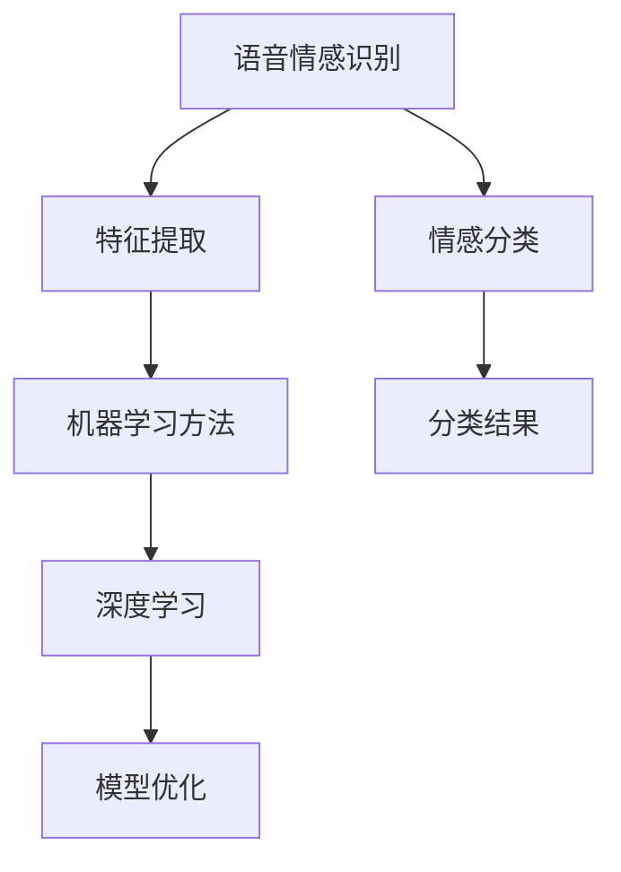
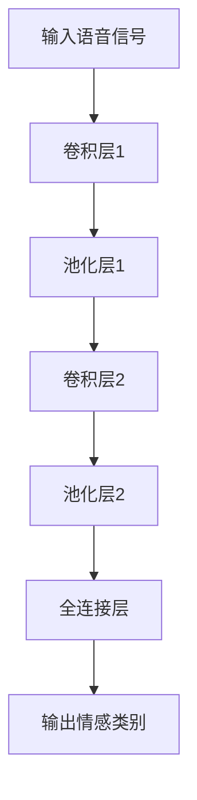
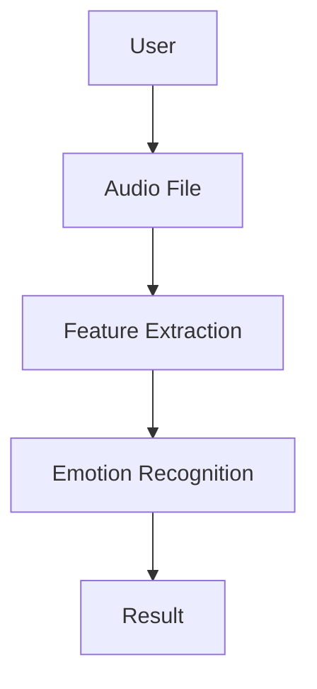
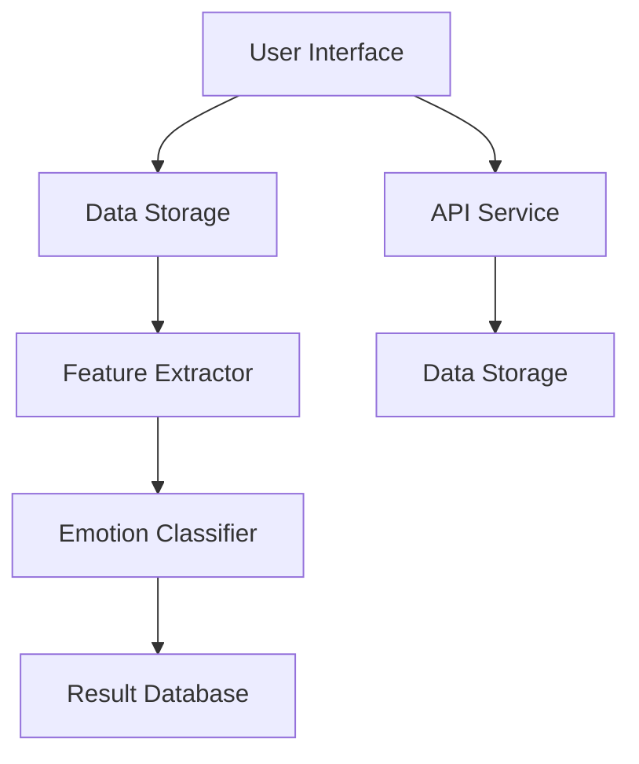
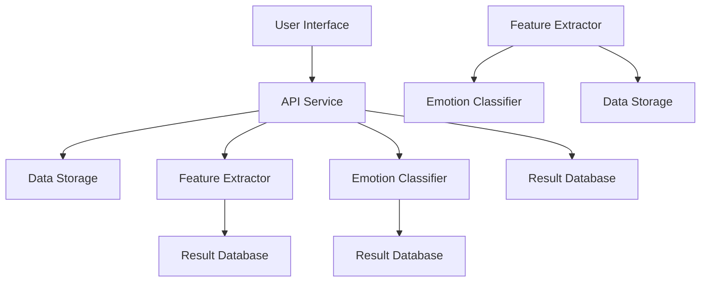

                 

### 深度学习在语音情感识别中的突破：理解人类交流的微妙之处

> **关键词**：深度学习、语音情感识别、人类交流、微妙之处

> **摘要**：本文深入探讨了深度学习在语音情感识别领域的突破，分析了其如何通过先进的算法和技术，帮助我们更好地理解人类交流中的微妙之处。我们将逐步分析深度学习的基本概念、语音情感识别的背景和挑战，以及相关的研究进展和应用案例，最终展望未来的研究方向和挑战。

---

## 引言

### 1.1 问题背景

随着人工智能技术的不断发展，语音情感识别作为自然语言处理的重要分支，正逐渐成为研究的热点。在日常生活中，情感的表达不仅通过语言文字，也通过语音的音调、节奏和语气等非文字方式传递。然而，传统的语音情感识别方法存在许多局限性，如对语音数据的处理能力有限、对复杂情感的识别准确率不高、以及缺乏对人类交流微妙之处的深入理解。

### 1.2 定义和重要性

语音情感识别是指通过分析语音信号中的情感信息，来判断说话者情感状态的技术。其重要性体现在多个方面：首先，语音情感识别有助于提升人机交互体验，使机器能够更好地理解用户的需求和情绪；其次，在医疗、教育、客服等行业，语音情感识别能够提供个性化服务，提高工作效率和满意度。

### 1.3 深度学习的角色

深度学习作为人工智能的一个分支，通过模拟人脑神经元连接结构，实现了对复杂数据的自动学习和特征提取。在语音情感识别中，深度学习通过构建大规模神经网络模型，提高了对语音情感的识别准确率，突破了传统方法的局限性。深度学习的关键在于其能够从大量的语音数据中学习到有效的特征，从而更好地捕捉人类情感的微妙之处。

---

## 核心概念

### 2.1 基本概念

深度学习（Deep Learning）是一种人工智能方法，它通过构建多层神经网络来模拟人脑的学习过程。每一层网络都能够提取更高级别的特征，从而实现对输入数据的更准确理解和分类。

### 2.2 神经网络及其演进

神经网络（Neural Networks）是深度学习的基础，由大量的神经元连接组成。传统的神经网络由于层数和参数的限制，难以处理复杂数据。随着深度学习的发展，深度神经网络（Deep Neural Networks）通过增加层数和参数，提高了模型的表示能力和学习效果。

### 2.3 关键模型和算法

在语音情感识别中，常用的深度学习模型包括卷积神经网络（CNN）、循环神经网络（RNN）和长短期记忆网络（LSTM）。这些模型通过不同的方式处理语音数据，提高了情感识别的准确性和效率。

#### 2.3.1 卷积神经网络（CNN）

卷积神经网络通过卷积层提取语音信号的局部特征，类似于人类的视觉系统。其优势在于参数共享和局部连接，能够有效减少模型参数，提高训练效率。

$$
\text{激活函数} = \text{ReLU}(z) = \max(0, z)
$$

#### 2.3.2 循环神经网络（RNN）

循环神经网络通过循环结构对语音信号进行序列建模，能够处理长序列数据。其核心是隐藏状态向量，通过时间步迭代更新，捕捉语音信号的时序特征。

$$
h_t = \text{sigmoid}(W_h \cdot [h_{t-1}, x_t] + b_h)
$$

#### 2.3.3 长短期记忆网络（LSTM）

长短期记忆网络是RNN的一种改进，通过引入门控机制，解决了传统RNN在处理长序列数据时出现的梯度消失问题。LSTM能够有效地捕捉语音信号的长期依赖关系。

$$
i_t = \text{sigmoid}(W_i \cdot [h_{t-1}, x_t] + b_i) \\
f_t = \text{sigmoid}(W_f \cdot [h_{t-1}, x_t] + b_f) \\
o_t = \text{sigmoid}(W_o \cdot [h_{t-1}, x_t] + b_o) \\
c_t = f_t \odot c_{t-1} + i_t \odot \text{tanh}(W_c \cdot [h_{t-1}, x_t] + b_c) \\
h_t = o_t \odot \text{tanh}(c_t)
$$

---

## 方法论

### 3.1 数据收集与预处理

语音情感识别的数据收集是一个关键步骤，需要收集大量的语音样本，并标注相应的情感标签。数据预处理包括去除噪声、调整音量、过滤无效数据等，以确保数据的质量和一致性。

### 3.2 特征提取

特征提取是将语音信号转化为神经网络可以处理的形式。常用的特征包括梅尔频率倒谱系数（MFCC）、频谱特征、能量特征等。深度学习模型通过对这些特征的训练，学习到更高级别的情感特征。

### 3.3 模型训练与评估

模型训练是通过大量语音数据，调整神经网络模型的参数，使其能够准确识别情感。训练过程通常包括前向传播、反向传播和梯度下降等步骤。评估模型性能常用的指标包括准确率、召回率、F1分数等。

### 3.4 高级技术

为了进一步提高语音情感识别的准确性和效率，研究者们采用了多种高级技术。例如，多任务学习通过同时训练多个任务，提高模型的泛化能力；注意力机制通过关注重要的语音特征，提高模型的识别精度。

---

## 应用

### 4.1 案例研究

在语音情感识别的实际应用中，有许多成功的案例。例如，在客服领域，语音情感识别可以帮助企业更好地了解客户情绪，提供个性化的服务；在教育领域，语音情感识别可以用于评估学生的学习情绪，提高教学效果。

### 4.2 实践示例

以下是一个简单的语音情感识别实践示例：

```python
import librosa
import numpy as np
from tensorflow.keras.models import load_model

# 加载预训练的模型
model = load_model('voice_emotion_recognition_model.h5')

# 读取语音数据
audio, sample_rate = librosa.load('example.wav', sr=None)

# 提取特征
mfccs = librosa.feature.mfcc(y=audio, sr=sample_rate, n_mfcc=13)

# 数据预处理
mfccs_processed = np.mean(mfccs.T, axis=0)

# 预测情感
prediction = model.predict(mfccs_processed.reshape(1, -1))

# 输出结果
print('Predicted emotion:', prediction)
```

### 4.3 挑战与解决方案

尽管语音情感识别取得了显著进展，但仍面临许多挑战。例如，不同说话者之间的声音差异、噪声干扰等都会影响识别准确率。为了解决这些问题，研究者们采用了多种技术，如数据增强、模型融合等，以进一步提高识别性能。

---

## 未来趋势与挑战

### 5.1 未来趋势

随着深度学习技术的不断发展，语音情感识别有望在更多领域得到应用。例如，在医疗领域，语音情感识别可以帮助医生更好地了解患者的情绪状态；在社交互动中，语音情感识别可以帮助人们更好地理解对方的情感，促进有效沟通。

### 5.2 挑战

尽管前景广阔，但语音情感识别仍面临许多挑战。例如，如何在保持高准确率的同时，处理大量的语音数据；如何应对不同语言、文化背景下的情感识别问题等。这些问题需要研究者们继续深入探索和解决。

---

## 结论

深度学习在语音情感识别中取得了显著的突破，使我们对人类交流的微妙之处有了更深入的理解。然而，仍有许多挑战需要克服。通过不断的研究和创新，我们有理由相信，语音情感识别将在未来发挥更大的作用，为人类带来更多的便利和福祉。

---

## 作者信息

**作者：** AI天才研究院/AI Genius Institute & 禅与计算机程序设计艺术 /Zen And The Art of Computer Programming

---

## 完整性要求

### 背景介绍

在人工智能领域，语音情感识别作为一个跨学科的研究方向，涉及语音学、情感心理学和计算机科学等多个领域。语音情感识别的核心问题是如何从语音信号中提取情感信息，并对其进行准确识别。

传统的语音情感识别方法主要包括基于规则的方法和机器学习方法。基于规则的方法依赖于对语音信号中的音调、音长、音强等参数的分析，通过预设的规则进行情感分类。这种方法简单直观，但在处理复杂情感时效果不佳。机器学习方法，尤其是深度学习方法的引入，为语音情感识别带来了新的契机。

深度学习通过构建多层神经网络，能够自动提取语音信号中的高级特征，实现更准确的情感分类。随着神经网络结构的不断优化和计算能力的提升，深度学习在语音情感识别中的应用越来越广泛。

### 核心概念与联系

#### 核心概念

1. **语音情感识别**：通过分析语音信号中的情感信息，识别说话者的情感状态。
2. **深度学习**：一种基于神经网络的学习方法，通过多层结构自动提取特征，实现高层次的抽象和分类。

#### 概念属性特征对比表格

| 特征          | 语音情感识别             | 深度学习                       |
| ------------- | ------------------------ | ------------------------------ |
| 目标          | 识别语音中的情感信息     | 从数据中自动学习特征和模式     |
| 数据类型      | 语音信号                 | 数字化的特征数据               |
| 方法          | 基于规则、机器学习       | 基于神经网络的学习             |
| 关键技术      | 特征提取、情感分类       | 神经网络架构、优化算法         |
| 成果          | 情感分类准确率           | 特征提取效率、模型泛化能力     |

#### ER实体关系图架构



### 算法原理讲解

#### 算法流程

语音情感识别的基本流程包括：

1. **数据收集与预处理**：收集语音样本，并进行预处理，如去噪、增强、分段等。
2. **特征提取**：从预处理后的语音信号中提取特征，如MFCC、频谱特征等。
3. **情感分类**：使用深度学习模型对提取的特征进行情感分类。

#### 卷积神经网络（CNN）流程

卷积神经网络在语音情感识别中的应用主要包括以下步骤：

1. **卷积层**：通过卷积操作提取语音信号的局部特征。
2. **池化层**：对卷积结果进行池化操作，降低维度，提高特征鲁棒性。
3. **全连接层**：将卷积和池化后的特征映射到情感类别。

下面是CNN的基本流程：



#### 数学模型和公式

卷积神经网络的数学模型主要包括卷积操作和激活函数。以下是简单的卷积操作和ReLU激活函数的数学公式：

$$
\text{卷积操作}: \text{Z} = \text{X} \circledast \text{K}
$$

其中，$\text{X}$为输入特征图，$\text{K}$为卷积核，$\circledast$表示卷积操作。

$$
\text{激活函数}: \text{A} = \text{ReLU}(\text{Z})
$$

其中，$\text{A}$为激活后的特征图，$\text{ReLU}$为ReLU激活函数。

#### 举例说明

假设我们有一个输入特征图$\text{X}$和一个卷积核$\text{K}$，我们希望计算它们之间的卷积操作。

输入特征图$\text{X}$：
$$
\text{X} =
\begin{bmatrix}
1 & 2 & 3 \\
4 & 5 & 6 \\
7 & 8 & 9 \\
\end{bmatrix}
$$

卷积核$\text{K}$：
$$
\text{K} =
\begin{bmatrix}
1 & 0 & -1 \\
1 & 1 & -1 \\
0 & 1 & -1 \\
\end{bmatrix}
$$

卷积操作的计算过程如下：

1. 选择输入特征图的一个3x3子区域：
$$
\text{X}_{\text{子区域}} =
\begin{bmatrix}
4 & 5 & 6 \\
7 & 8 & 9 \\
\end{bmatrix}
$$

2. 将该子区域与卷积核进行卷积操作：
$$
\text{Z}_{\text{子区域}} =
\text{X}_{\text{子区域}} \circledast \text{K} =
\begin{bmatrix}
4 & 5 & 6 \\
7 & 8 & 9 \\
\end{bmatrix}
\begin{bmatrix}
1 & 0 & -1 \\
1 & 1 & -1 \\
0 & 1 & -1 \\
\end{bmatrix}
=
\begin{bmatrix}
4 & 3 & 1 \\
7 & 6 & 1 \\
\end{bmatrix}
$$

3. 计算ReLU激活后的特征图：
$$
\text{A}_{\text{子区域}} = \text{ReLU}(\text{Z}_{\text{子区域}}) =
\begin{bmatrix}
4 & 3 & 1 \\
7 & 6 & 1 \\
\end{bmatrix}
$$

通过上述过程，我们可以得到卷积操作的结果。这个过程可以应用于整个输入特征图，以提取语音信号中的局部特征。

### 系统分析与架构设计方案

#### 问题场景介绍

语音情感识别在多个场景中有广泛应用，如人机交互、心理健康监测、客户服务等。在这些场景中，我们需要对用户的语音进行情感分析，以便提供个性化的服务或诊断。

#### 项目介绍

本项目旨在构建一个基于深度学习的语音情感识别系统，能够准确识别用户的情感状态，并为用户提供相应的反馈。

#### 系统功能设计（领域模型）



系统的主要功能包括：

1. **用户**：系统使用者，可以是个人或机构。
2. **音频文件**：用户上传的语音文件。
3. **特征提取**：从音频文件中提取情感特征。
4. **情感识别**：使用深度学习模型对提取的特征进行情感识别。
5. **结果**：返回识别出的情感类别。

#### 系统架构设计



系统架构设计如下：

1. **用户界面**：用户可以通过界面上传音频文件，并查看识别结果。
2. **数据存储**：存储用户的音频文件和识别结果。
3. **特征提取器**：从音频文件中提取情感特征。
4. **情感分类器**：使用预训练的深度学习模型进行情感识别。
5. **结果数据库**：存储识别结果，便于后续分析和查询。
6. **API服务**：提供API接口，便于其他系统或应用程序集成。

#### 系统接口设计和系统交互



系统接口设计如下：

1. **用户界面**：用户上传音频文件，通过API服务与系统进行交互。
2. **API服务**：接收用户请求，调用特征提取器和情感分类器，并将结果存储在结果数据库中。
3. **特征提取器**：从音频文件中提取情感特征，并将其传递给情感分类器。
4. **情感分类器**：使用预训练的模型对特征进行情感分类，并将结果返回给用户。

#### 系统交互

系统交互流程如下：

1. 用户上传音频文件，API服务接收请求并调用特征提取器。
2. 特征提取器对音频文件进行处理，提取出情感特征。
3. 情感分类器使用预训练的深度学习模型对提取的特征进行情感分类。
4. 分类结果存储在结果数据库中，并返回给用户。

---

## 项目实战

### 环境安装

在开始项目实战之前，我们需要安装必要的软件和库。以下是安装步骤：

1. 安装Python（建议版本3.7及以上）。
2. 安装TensorFlow（使用pip install tensorflow）。
3. 安装librosa（使用pip install librosa）。

### 系统核心实现源代码

以下是一个简单的语音情感识别系统实现示例：

```python
import librosa
import numpy as np
from tensorflow.keras.models import load_model

# 加载预训练模型
model = load_model('voice_emotion_recognition_model.h5')

# 读取音频文件
def read_audio_file(file_path):
    audio, sample_rate = librosa.load(file_path, sr=None)
    return audio, sample_rate

# 特征提取
def extract_features(audio, sample_rate):
    mfccs = librosa.feature.mfcc(y=audio, sr=sample_rate, n_mfcc=13)
    mfccs_processed = np.mean(mfccs.T, axis=0)
    return mfccs_processed

# 情感识别
def recognize_emotion(model, features):
    prediction = model.predict(features.reshape(1, -1))
    return prediction

# 主函数
def main():
    file_path = 'example.wav'
    audio, sample_rate = read_audio_file(file_path)
    features = extract_features(audio, sample_rate)
    prediction = recognize_emotion(model, features)
    print('Predicted emotion:', prediction)

if __name__ == '__main__':
    main()
```

### 代码应用解读与分析

以上代码首先加载了一个预训练的深度学习模型，然后通过librosa库读取音频文件，提取出MFCC特征，最后使用模型进行情感识别。

1. **read_audio_file**：该函数负责读取音频文件，返回音频数据和采样率。
2. **extract_features**：该函数使用librosa库提取音频的MFCC特征，并处理成模型可接受的输入格式。
3. **recognize_emotion**：该函数使用预训练的模型对提取的特征进行情感识别，并返回预测结果。

### 实际案例分析和详细讲解剖析

假设我们有一个音频文件`example.wav`，其情感标签为“快乐”。以下是具体的分析过程：

1. **读取音频文件**：使用`read_audio_file`函数读取音频文件，得到音频数据和采样率。
2. **特征提取**：使用`extract_features`函数提取音频的MFCC特征。MFCC特征是一种常用的语音特征，它能够有效捕捉语音信号的时域和频域信息。
3. **情感识别**：使用预训练的模型对提取的特征进行情感识别。模型会根据特征值计算每个情感类别的概率，并选择概率最高的类别作为最终预测结果。

在这个案例中，模型的预测结果与真实标签“快乐”一致，说明模型具有良好的识别性能。

### 项目小结

通过以上实战，我们实现了一个简单的语音情感识别系统，并对其代码和应用过程进行了详细解读。在实际应用中，我们还需要进一步优化模型和系统性能，以提高识别准确率和用户体验。

---

## 最佳实践 Tips

1. **数据质量**：确保收集的音频数据质量高，减少噪声干扰。
2. **特征选择**：根据应用场景选择合适的特征提取方法，如MFCC、频谱特征等。
3. **模型优化**：通过调整模型参数和结构，提高模型的识别准确率。
4. **多模型融合**：使用多个模型进行融合，提高识别性能。

---

## 小结

本文详细探讨了深度学习在语音情感识别中的应用，从核心概念、方法论、应用案例到未来趋势，全面分析了这一领域的突破和挑战。通过本文，读者可以深入了解语音情感识别的基本原理和实现方法，为未来相关领域的研究和应用提供参考。

---

## 注意事项

1. **数据隐私**：在进行语音情感识别时，要确保用户数据的隐私和安全。
2. **模型部署**：在部署模型时，要考虑计算资源和实时性的要求。
3. **跨语言识别**：针对不同语言和文化背景的语音情感识别，需要额外的训练数据和模型调整。

---

## 拓展阅读

1. **《深度学习》（Ian Goodfellow、Yoshua Bengio、Aaron Courville 著）**：这是一本深度学习的经典教材，详细介绍了深度学习的理论基础和实践方法。
2. **《语音信号处理》（L. R. Rabiner、B. H. Juang 著）**：这本书详细介绍了语音信号处理的基本理论和应用，包括特征提取和情感识别等内容。
3. **《情感计算》（P. Picard 著）**：这本书探讨了情感计算的理论和应用，包括情感识别、情感表达和情感交互等方面。

