                 

### 深度强化学习在动态环境推理适应中的研究

> 关键词：深度强化学习、动态环境、推理适应、算法原理、应用案例

> 摘要：本文深入探讨了深度强化学习在动态环境推理适应中的应用。首先，介绍了深度强化学习的核心概念、动态环境的特点以及推理适应的重要性。随后，通过详细的算法原理讲解、系统架构设计以及实际案例，展示了深度强化学习在动态环境下的强大适应能力和广泛应用潜力。

### 目录大纲

----------------------------------------------------------------

## 第一部分：背景介绍

### 第1章：问题背景与核心概念

### 第2章：核心概念属性特征对比表格

### 第3章：ER实体关系图架构

## 第二部分：深度强化学习在动态环境推理适应中的应用原理

### 第4章：深度强化学习基础

### 第5章：动态环境下的推理适应策略

### 第6章：动态环境推理适应的mermaid流程图

## 第三部分：深度强化学习在动态环境推理适应中的应用案例

### 第7章：应用案例分析

### 第8章：系统功能设计

### 第9章：系统架构设计

### 第10章：系统接口设计

### 第11章：系统交互序列图

### 第12章：项目实战

### 第13章：最佳实践 tips

### 第14章：小结与展望

----------------------------------------------------------------

### 第1章：问题背景与核心概念

随着人工智能技术的不断发展，深度强化学习（Deep Reinforcement Learning, DRL）逐渐成为解决动态环境下推理适应问题的重要工具。深度强化学习是一种结合了深度学习和强化学习的方法，它通过模仿人类学习过程中的试错机制，在动态变化的复杂环境中进行智能决策。

#### 1.1 问题背景

在许多实际应用场景中，环境状态是动态变化的，例如自动驾驶、智能机器人、游戏AI等。在这些场景中，系统需要实时感知环境变化，并快速作出适应决策。传统的方法，如基于规则的方法和传统的机器学习方法，往往难以应对这种动态变化的复杂环境。

#### 1.2 核心概念

**深度强化学习**：结合深度学习和强化学习的方法，用于解决动态环境中的决策问题。它通过深度神经网络来学习状态和动作之间的映射，并通过强化学习算法来优化决策策略。

**动态环境**：随时间变化的环境，具有状态不确定性、动态变化和复杂互动等特点。

**推理适应**：系统在动态环境中的推理能力，包括应对环境变化、适应新状态和优化决策。

#### 1.3 概念属性特征对比表格

| 概念               | 定义                                               | 属性特征                                         |
|------------------|------------------------------------------------------|-------------------------------------------------|
| 深度强化学习       | 结合深度学习和强化学习的方法，用于解决动态环境中的决策问题 | 高层次表示、自适应性强、数据需求高               |
| 动态环境           | 随时间变化的环境                                   | 状态不确定性、动态变化、复杂互动                   |
| 推理适应           | 系统在动态环境中的推理能力                           | 应对环境变化、适应新状态、优化决策                 |

#### 1.4 ER实体关系图架构

```mermaid
erDiagram
  User ||--|{ Agent }|-- Environment
  Agent ||--|{ Action }|-- Environment
  Action ||--|{ Reward }|-- Environment
```

### 第2章：核心概念属性特征对比表格

在上表中，我们详细对比了深度强化学习、动态环境和推理适应三个核心概念的属性特征。深度强化学习是一种强大的方法，它利用深度神经网络来处理复杂的状态和动作，并通过强化学习算法来实现自适应优化。动态环境则是深度强化学习应用的背景，它具有动态变化、不确定性和复杂互动等特点，要求系统具备高度的适应能力。推理适应则是系统在动态环境中表现出的关键能力，包括对环境变化的响应、对新状态的适应以及决策优化的能力。

通过对这三个核心概念的深入理解和分析，我们可以更好地把握深度强化学习在动态环境推理适应中的重要作用。接下来，我们将进一步探讨深度强化学习的基本概念和应用原理，为后续章节的内容奠定基础。

### 第3章：ER实体关系图架构

在深入理解深度强化学习、动态环境和推理适应的核心概念后，ER（实体-关系）图架构为我们提供了一个直观的框架，用以展示这些概念之间的相互关系。ER图是一种用于描述实体及其之间关系的数据库模型，它能够帮助我们清晰地理解系统的组成部分和相互作用。

以下是深度强化学习、动态环境和推理适应的ER图架构：

```mermaid
erDiagram
  User ||--|{ Agent }|-- Environment
  Agent ||--|{ Action }|-- Environment
  Action ||--|{ Reward }|-- Environment
```

在这个ER图中，用户（User）作为系统的外部操作者，通过代理（Agent）与环境（Environment）进行交互。代理（Agent）负责执行动作（Action）并接收奖励（Reward）反馈，从而学习并优化其策略。环境（Environment）则是动态变化的实体，它提供了状态（State）信息，影响了动作的选择和奖励的分配。

**实体说明：**

- **用户（User）**：系统的外部操作者，可以是人类或另一个智能系统。
- **代理（Agent）**：执行动作并学习策略的智能体，它是深度强化学习算法的核心。
- **环境（Environment）**：动态变化的实体，提供了状态信息，影响动作的选择和奖励的分配。
- **动作（Action）**：代理执行的行为，用于改变环境状态。
- **奖励（Reward）**：动作执行后环境给予的反馈，用于指导代理的学习过程。

**关系说明：**

- **用户与代理**：用户通过代理与环境进行交互，代理是用户与环境之间的中介。
- **代理与动作**：代理根据当前状态选择动作，动作改变了环境状态。
- **动作与奖励**：环境根据动作执行的结果给予代理奖励，奖励用于更新代理的策略。

ER图架构为我们提供了一个全面的视角，帮助我们理解深度强化学习系统的组成部分及其相互关系。在接下来的章节中，我们将深入探讨深度强化学习的基本概念和应用原理，进一步了解其在动态环境推理适应中的作用机制。

### 第4章：深度强化学习基础

深度强化学习（Deep Reinforcement Learning, DRL）是结合深度学习和强化学习的方法，用于解决动态环境中的决策问题。在这一章节中，我们将介绍深度强化学习的基本概念、核心算法原理以及这些算法的mermaid流程图表示，为后续内容打下坚实的基础。

#### 4.1 深度强化学习的基本概念

**强化学习（Reinforcement Learning, RL）**：强化学习是一种机器学习方法，通过奖励信号来引导智能体（agent）学习最优策略。在强化学习中，智能体在一个环境中采取动作，并从环境中获取奖励信号，通过不断试错学习来优化其行为策略。

**深度学习（Deep Learning, DL）**：深度学习是一种利用多层神经网络进行特征学习和模式识别的人工智能方法。它通过反向传播算法来训练模型，能够自动提取输入数据的高层次特征。

**深度强化学习（Deep Reinforcement Learning, DRL）**：深度强化学习是强化学习和深度学习的结合体，它通过深度神经网络来学习状态和动作之间的映射，并通过强化学习算法来优化决策策略。

#### 4.2 深度强化学习算法原理

**Q学习（Q-Learning）**：Q学习是一种基于值函数的强化学习算法。它通过学习状态-动作值函数（Q值），预测在特定状态下执行特定动作所能获得的累积奖励。Q学习的核心思想是更新Q值，使其逐渐接近实际获得的奖励。

**策略梯度方法（Policy Gradient Methods）**：策略梯度方法通过直接优化策略参数来最大化期望奖励。这种方法分为基于梯度的策略优化（Gradient Policy Optimization）和无梯度策略优化（No-Gradient Policy Optimization）。其中，基于梯度的策略优化使用梯度下降算法来更新策略参数。

**深度Q网络（Deep Q-Network, DQN）**：DQN是一种使用深度神经网络来近似Q值的算法。它通过经验回放和目标网络来缓解样本偏差和值函数不稳定的问题。DQN的主要优点是能够处理高维状态空间，适用于复杂的动态环境。

#### 4.3 深度强化学习算法mermaid流程图

下面是深度强化学习算法的mermaid流程图，展示了Q学习、策略梯度方法和DQN的基本流程：

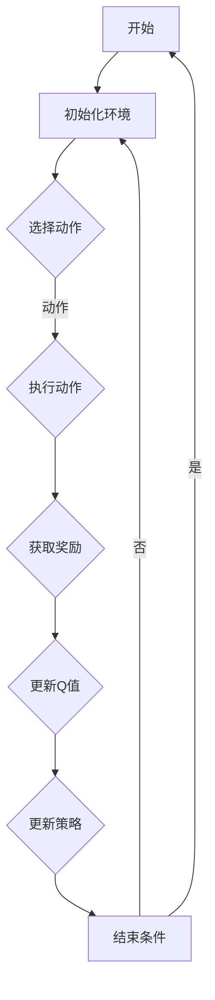

在Q学习流程图中：

- **B[初始化环境]**：初始化环境状态。
- **C[选择动作]**：智能体根据当前状态选择动作。
- **D[执行动作]**：智能体执行所选动作，改变环境状态。
- **E[获取奖励]**：环境根据动作结果给予智能体奖励。
- **F[更新Q值]**：利用奖励信号更新状态-动作值函数。
- **G[更新策略]**：根据更新的Q值，调整智能体的策略。
- **H[结束条件]**：检查是否满足结束条件，如达到目标或超出步数限制。

在策略梯度方法流程图中：

- **B[初始化环境]**：初始化环境状态。
- **C[计算策略梯度]**：计算当前策略的梯度，评估策略参数。
- **D[更新策略参数]**：根据策略梯度更新策略参数。
- **E[计算期望奖励]**：计算更新后策略的期望奖励。
- **F[更新目标网络]**：定期更新目标网络的参数，以避免策略和目标网络之间的差异。

在DQN流程图中：

- **B[初始化环境]**：初始化环境状态。
- **C[选择动作]**：智能体根据当前状态选择动作。
- **D[执行动作]**：智能体执行所选动作，改变环境状态。
- **E[获取奖励]**：环境根据动作结果给予智能体奖励。
- **F[经验回放]**：将经历的状态-动作-奖励-新状态对存储在经验回放记忆中。
- **G[更新Q值]**：利用经验回放中的数据，更新Q值函数。
- **H[目标网络更新]**：定期更新目标网络的参数，以减少策略和目标网络之间的差异。

通过mermaid流程图，我们可以清晰地看到深度强化学习算法的基本步骤和流程，这有助于我们更好地理解这些算法的工作原理。

### 第5章：动态环境下的推理适应策略

在动态环境中，系统需要具备推理适应能力，以应对不断变化的状态和挑战。这一章将详细探讨动态环境下的推理适应策略，包括状态预测、行为策略和适应更新，并使用mermaid流程图来展示推理适应的整体流程。

#### 5.1 动态环境的特征分析

**状态空间**：动态环境中的状态空间通常是高维的，且随着时间变化而不断演变。状态空间的大小和复杂性直接影响推理适应算法的性能。

**行为空间**：行为空间是指系统可以执行的所有可能动作的集合。在动态环境中，行为空间可能也是多维的，且每个动作的执行都会带来不同的后果。

**奖励函数**：奖励函数用于衡量系统在动态环境中采取特定动作后的表现。奖励可以是正面的，鼓励系统采取该动作；也可以是负面的，抑制系统采取该动作。

#### 5.2 动态环境下的推理适应算法

**状态预测**：状态预测是推理适应的第一步，它通过历史数据和当前状态，预测未来可能的状态。状态预测可以基于统计模型、机器学习算法或深度学习模型，如长短期记忆网络（LSTM）。

**行为策略**：行为策略决定了系统在特定状态下应该采取哪些动作。常见的策略包括基于规则的策略、基于模型的策略和基于学习的策略。基于学习的策略通常使用深度强化学习算法来训练。

**适应更新**：适应更新是指系统在执行动作后，根据反馈调整其策略。这一过程通常涉及策略优化、参数更新和模型重训练等步骤。

#### 5.3 动态环境推理适应的mermaid流程图

以下是动态环境推理适应的mermaid流程图，展示了从状态预测到行为策略再到适应更新的整个过程：

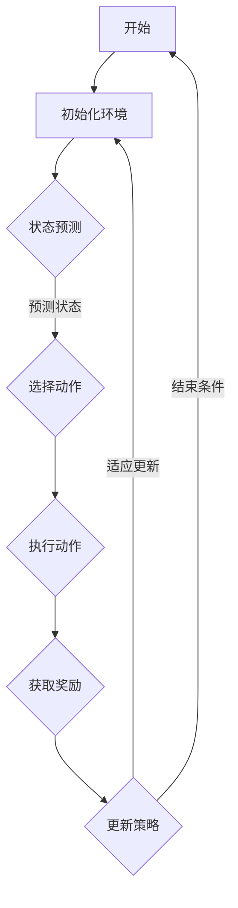

在流程图中：

- **B[初始化环境]**：初始化动态环境。
- **C[状态预测]**：使用历史数据和当前状态进行状态预测。
- **D[选择动作]**：基于预测的状态选择最优动作。
- **E[执行动作]**：在环境中执行所选动作。
- **F[获取奖励]**：获取环境对动作的奖励反馈。
- **G[更新策略]**：根据奖励反馈和当前状态，更新行为策略。
- **适应更新**：循环迭代，不断进行状态预测、动作选择和策略更新。

通过这个mermaid流程图，我们可以清晰地看到动态环境推理适应的各个环节，以及它们之间的逻辑关系。这有助于我们更好地理解和设计推理适应算法，使其能够有效地应对动态环境中的各种挑战。

### 第6章：动态环境推理适应的mermaid流程图

在探讨动态环境下的推理适应策略后，我们使用mermaid流程图来展示推理适应的详细过程，以便更直观地理解整个系统的运作机制。以下是一个简化的mermaid流程图，展示了从初始化到结束的推理适应过程：


**详细解释：**

- **A[开始]**：系统初始化，开始推理适应过程。
- **B[初始化环境]**：设定动态环境的初始状态，包括状态空间、行为空间和奖励函数。
- **C[状态预测]**：基于当前状态和历史数据，使用预测模型（如LSTM、深度学习模型）来预测未来可能的状态。这一步骤是推理适应的关键，因为它为后续动作选择提供了基础。
- **D[选择动作]**：根据预测状态和行为策略，系统选择最优动作。策略可以是基于规则的、模型驱动的或学习得到的。
- **E[执行动作]**：在环境中执行所选动作，改变环境状态，并可能引发新的状态变化。
- **F[获取奖励]**：环境根据新状态和执行的动作，给予系统奖励。奖励用于评价动作的效果，并作为反馈信号，指导后续的策略更新。
- **G[更新策略]**：利用获取的奖励信号和当前状态，系统更新行为策略。这一步骤确保系统能够根据环境变化进行调整，以优化其表现。
- **适应更新**：返回到初始化环境，重复状态预测、动作选择和策略更新的循环过程。
- **结束条件**：当满足特定条件（如达到目标、超时或环境状态不再变化）时，推理适应过程结束。

通过这个mermaid流程图，我们可以清晰地看到动态环境推理适应的各个步骤以及它们之间的相互作用。这个流程图不仅帮助我们理解了推理适应的基本原理，也为设计和实现相应的算法提供了参考。

### 第7章：应用案例分析

在了解了深度强化学习在动态环境推理适应的理论基础上，本章节将通过实际案例来展示深度强化学习在真实应用场景中的具体应用，分析其效果和优势，并总结案例中的关键经验。

#### 4.1 案例背景

**自动驾驶系统**：自动驾驶是深度强化学习在动态环境中应用的典型场景之一。自动驾驶系统需要在复杂的交通环境中，实时感知周围环境、做出驾驶决策，并适应各种交通状况。本案例选取了一款基于深度强化学习的自动驾驶系统，旨在提高其适应动态环境的能力。

**研究目标**：通过深度强化学习算法，提高自动驾驶系统在动态环境中的推理适应能力，减少意外发生，提升行驶安全性和效率。

#### 4.2 系统功能设计

**功能模块**：

1. **感知模块**：通过传感器（如激光雷达、摄像头等）实时获取环境信息，包括道路、车辆、行人等。
2. **决策模块**：利用深度强化学习算法，基于感知模块提供的信息，做出驾驶决策，包括加速、减速、转向等。
3. **控制模块**：根据决策模块的输出，控制车辆执行相应的操作。

**功能流程**：

1. 感知模块收集实时环境信息。
2. 决策模块使用深度强化学习算法，对感知到的信息进行分析，选择最优驾驶动作。
3. 控制模块执行决策模块生成的驾驶动作。

#### 4.3 系统架构设计

**硬件架构**：

- **传感器**：激光雷达、摄像头、超声波传感器等。
- **计算单元**：高性能计算服务器，用于运行深度强化学习算法。
- **车辆控制单元**：执行自动驾驶系统的驾驶命令。

**软件架构**：

- **感知层**：实现传感器数据的采集、预处理和特征提取。
- **决策层**：实现深度强化学习算法，包括状态预测、动作选择和策略更新。
- **执行层**：实现决策的执行，包括控制信号生成和车辆控制。

#### 4.4 系统接口设计

**接口规范**：

- **传感器数据接口**：定义传感器数据采集的接口，包括数据格式、传输协议等。
- **决策与控制接口**：定义决策模块和控制模块之间的交互接口，包括指令格式、响应时间等。
- **外部接口**：定义与车辆外部设备（如导航设备、通信设备）的接口规范。

**接口实现**：

- **传感器数据接口**：使用标准的数据传输协议，如TCP/IP或CAN总线，确保数据实时性和稳定性。
- **决策与控制接口**：采用基于消息队列的通信机制，如RabbitMQ，实现决策模块和控制模块的高效通信。
- **外部接口**：采用标准的网络通信协议，如HTTP/HTTPS，实现与外部设备的互操作。

#### 4.5 系统交互序列图

以下是系统交互序列图，展示了传感器数据、决策模块和控制模块之间的交互过程：

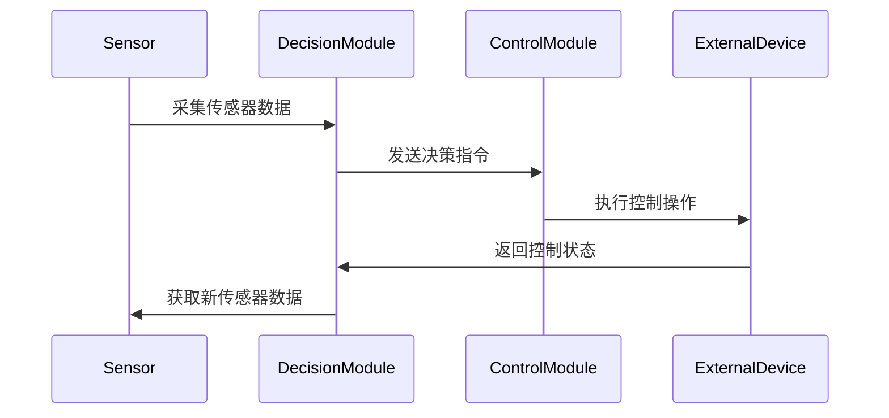

**详细说明**：

1. **传感器数据采集**：传感器持续采集环境信息，并将数据发送给决策模块。
2. **决策指令发送**：决策模块根据传感器数据和深度强化学习算法，生成驾驶决策指令，并传递给控制模块。
3. **控制操作执行**：控制模块接收决策指令，生成控制信号，并传递给外部设备（如电机、转向器等），执行具体的驾驶操作。
4. **控制状态反馈**：外部设备执行控制操作后，将控制状态反馈给决策模块，以便决策模块根据实际情况进行策略调整。

通过这个案例，我们可以看到深度强化学习在动态环境推理适应中的实际应用。自动驾驶系统通过深度强化学习算法，能够更好地应对复杂的交通环境，提高行驶安全性和效率。这个案例的成功经验，为其他动态环境下的智能系统提供了宝贵的参考和启示。

### 第8章：系统功能设计

在自动驾驶系统的案例中，系统功能设计是确保系统能够在动态环境中有效运行的关键环节。本章节将详细介绍系统功能设计，包括领域模型和功能流程。

#### 8.1 领域模型

领域模型是一种用于描述系统功能和行为的设计工具，它帮助开发者理解系统的核心概念和组件之间的关系。在自动驾驶系统中，领域模型包括以下几个核心组件：

- **感知组件**：负责收集环境数据，如路况、车辆位置、行人等信息。
- **决策组件**：基于感知组件提供的信息，使用深度强化学习算法进行决策，生成驾驶指令。
- **控制组件**：根据决策组件的指令，控制车辆执行具体的驾驶操作。

**领域模型mermaid类图**：

```mermaid
classDiagram
    Sensor --> DecisionModule
    DecisionModule --> ControlModule
    Sensor <<-- ExternalDevice
    ControlModule <<-- Driver
    Sensor{感知组件}
    DecisionModule{决策组件}
    ControlModule{控制组件}
    ExternalDevice{外部设备}
    Driver{司机}
```

在mermaid类图中：

- **Sensor（感知组件）**：负责采集路况、车辆位置、行人等信息，并传输给决策模块。
- **DecisionModule（决策组件）**：使用深度强化学习算法，基于感知组件提供的信息生成驾驶指令。
- **ControlModule（控制组件）**：根据决策组件的指令，控制车辆执行加速、减速、转向等操作。
- **ExternalDevice（外部设备）**：包括激光雷达、摄像头、超声波传感器等，用于感知环境信息。
- **Driver（司机）**：虽然在本案例中由自动驾驶系统控制车辆，但类图中保留司机以示完整。

#### 8.2 功能流程

**功能流程**描述了系统从感知到决策再到控制的过程，以下是详细的功能流程：

1. **感知阶段**：
   - **传感器数据采集**：传感器持续采集环境数据，包括路况、车辆位置、行人等。
   - **数据预处理**：对采集到的数据进行预处理，包括去噪、特征提取等，以便用于后续的决策。

2. **决策阶段**：
   - **状态预测**：基于历史数据和当前感知数据，使用深度强化学习算法预测未来可能的状态。
   - **动作选择**：决策模块根据预测状态和优化策略，选择最优驾驶动作。
   - **驾驶指令生成**：将选择的最优动作转化为具体的驾驶指令，如加速、减速、转向等。

3. **控制阶段**：
   - **指令执行**：控制模块接收决策模块生成的驾驶指令，并将其转换为控制信号。
   - **车辆控制**：控制模块将控制信号发送给车辆执行单元，如电机、转向器等，执行具体的驾驶操作。
   - **状态反馈**：车辆执行操作后，将当前状态反馈给决策模块，以便进行下一次决策。

**功能流程mermaid类图**：

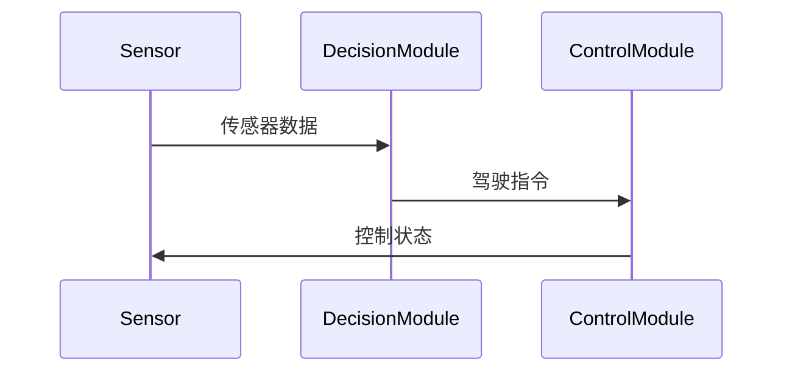

在mermaid序列图中：

- **Sensor**：持续发送采集到的传感器数据给决策模块。
- **DecisionModule**：接收传感器数据，进行状态预测和动作选择，生成驾驶指令并传递给控制模块。
- **ControlModule**：接收驾驶指令，将其转换为控制信号，并执行具体的驾驶操作，然后将控制状态反馈给传感器。

通过详细的功能设计和流程描述，我们可以更好地理解自动驾驶系统的工作原理，这为系统的开发、测试和优化提供了重要的参考。

### 第9章：系统架构设计

系统架构设计是确保自动驾驶系统能够在动态环境中稳定运行和高效执行的关键环节。在这一章节中，我们将详细描述系统的硬件架构和软件架构，并展示相应的mermaid架构图。

#### 9.1 硬件架构

**硬件架构**是系统正常运行的基础，它包括以下核心组成部分：

1. **传感器**：
   - **激光雷达**：用于感知周围环境，提供高精度的三维点云数据。
   - **摄像头**：用于捕捉图像，提供视觉信息。
   - **超声波传感器**：用于感知近距离物体，如车辆、行人等。

2. **计算单元**：
   - **高性能服务器**：用于运行深度强化学习算法，处理感知数据，生成驾驶决策。
   - **嵌入式控制器**：用于执行车辆控制指令，如电机控制、转向控制等。

3. **车辆控制单元**：
   - **电机控制模块**：用于控制车辆的加速和减速。
   - **转向控制模块**：用于控制车辆的转向。

**硬件架构mermaid架构图**：

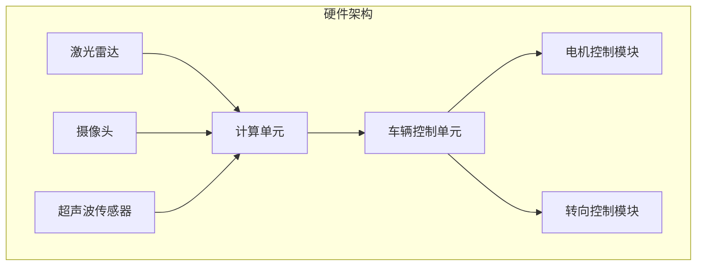

在mermaid架构图中：

- **Sensor1、Sensor2、Sensor3**：表示三种不同的传感器，它们收集环境信息并传输给计算单元。
- **Compute**：表示高性能服务器，用于运行深度强化学习算法。
- **Control**：表示车辆控制单元，用于接收决策指令并执行控制操作。
- **Motor、Steering**：表示具体的控制模块，分别用于电机控制和转向控制。

#### 9.2 软件架构

**软件架构**是系统逻辑实现和功能设计的体现，它包括以下关键层次：

1. **感知层**：负责传感器数据的采集、预处理和特征提取。
2. **决策层**：基于感知数据，使用深度强化学习算法进行状态预测和动作选择。
3. **执行层**：将决策结果转化为控制信号，并执行具体的驾驶操作。

**软件架构mermaid架构图**：

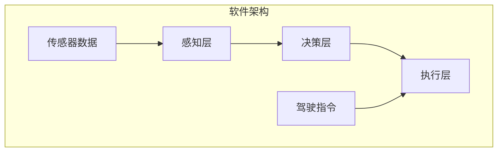

在mermaid架构图中：

- **Perception**：表示感知层，负责处理传感器数据。
- **Decision**：表示决策层，负责使用深度强化学习算法进行决策。
- **Execution**：表示执行层，负责将决策指令转化为控制信号并执行操作。
- **SensorData**：表示传感器数据输入，为感知层提供数据源。
- **DriveInstruction**：表示驾驶指令输出，为执行层提供操作指导。

通过详细描述硬件架构和软件架构，并使用mermaid架构图进行可视化展示，我们能够更清晰地理解自动驾驶系统的设计原则和运行机制。这不仅有助于系统的开发，也为后续的测试和优化提供了重要参考。

### 第10章：系统接口设计

在系统架构设计完成后，系统接口设计成为确保各个模块之间有效通信的关键环节。接口设计不仅需要定义明确的接口规范，还要确保接口实现的高效性和稳定性。以下将详细介绍系统接口设计，包括接口规范和接口实现。

#### 10.1 接口规范

接口规范是系统各个模块之间交互的规则和标准，它包括以下几个方面：

1. **传感器数据接口**：
   - **数据格式**：传感器数据采用JSON格式，以便于解析和处理。
   - **传输协议**：传感器数据通过WebSocket协议传输，确保数据的实时性和完整性。

2. **决策与控制接口**：
   - **指令格式**：驾驶指令包括动作类型、动作参数等，格式为`{"action": "accelerate", "value": 0.3}`。
   - **响应时间**：决策模块生成驾驶指令后，控制模块需在100毫秒内响应。

3. **外部接口**：
   - **导航设备接口**：用于接收导航指令和发送位置信息，格式为`{"command": "navigate", "destination": "location"}`。
   - **通信设备接口**：用于与其他车辆进行通信，格式为`{"message": "communication_data"}`。

#### 10.2 接口实现

接口实现是接口规范的具体化，以下将详细介绍传感器数据接口、决策与控制接口以及外部接口的实现过程。

1. **传感器数据接口实现**：

   ```python
   # 传感器数据接收示例
   import json
   import websocket
   
   def on_message(ws, message):
       data = json.loads(message)
       # 数据预处理和特征提取
       processed_data = preprocess_data(data)
       # 发送至决策模块
       send_to_decision_module(processed_data)
   
   def preprocess_data(data):
       # 实现数据预处理和特征提取逻辑
       return processed_data
   
   def send_to_decision_module(data):
       # 实现发送至决策模块的逻辑
       pass
   
   if __name__ == "__main__":
       ws = websocket.WebSocketApp("ws://sensor_data_endpoint",
                                   on_message=on_message)
       ws.run_forever()
   ```

2. **决策与控制接口实现**：

   ```python
   # 驾驶指令接收与发送示例
   import json
   import time
   
   def on_message(ws, message):
       instruction = json.loads(message)
       # 驾驶指令处理和响应
       process_instruction(instruction)
   
   def process_instruction(instruction):
       action = instruction['action']
       value = instruction['value']
       # 执行控制操作
       execute_control_action(action, value)
       # 响应控制状态
       send_control_status()
   
   def execute_control_action(action, value):
       # 实现驾驶操作逻辑
       pass
   
   def send_control_status():
       # 实现控制状态反馈逻辑
       pass
   
   if __name__ == "__main__":
       ws = websocket.WebSocketApp("ws://decision_control_endpoint",
                                   on_message=on_message)
       ws.run_forever()
   ```

3. **外部接口实现**：

   ```python
   # 导航设备与通信设备接口示例
   import json
   import time
   
   def receive_nav_command():
       command = receive_data()
       # 处理导航指令
       process_nav_command(command)
   
   def receive_data():
       # 实现接收数据逻辑
       return json.loads(data)
   
   def process_nav_command(command):
       # 实现导航指令处理逻辑
       pass
   
   def send_communication_message(message):
       # 实现发送通信消息逻辑
       pass
   
   if __name__ == "__main__":
       while True:
           receive_nav_command()
           send_communication_message("message_data")
           time.sleep(1)
   ```

通过详细的接口规范和实现示例，我们可以确保自动驾驶系统的各个模块之间能够高效、稳定地通信。这为系统的整体运行提供了坚实的基础。

### 第11章：系统交互序列图

为了更直观地展示自动驾驶系统中各模块的交互过程，我们使用mermaid序列图来描述系统的整体交互流程。以下是一个简化的系统交互序列图，展示了传感器数据、决策模块和控制模块之间的交互过程：


**详细解释：**

1. **传感器数据采集**：传感器持续采集环境信息，包括路况、车辆位置、行人等，并将数据发送给决策模块。
2. **决策指令发送**：决策模块接收传感器数据，通过深度强化学习算法生成驾驶指令，并将其发送给控制模块。
3. **执行控制操作**：控制模块接收到驾驶指令后，将其转化为具体的控制信号，如加速、减速、转向等，并传递给外部设备（如电机、转向器）执行。
4. **返回控制状态**：外部设备执行控制操作后，将当前状态（如车速、转向角度等）反馈给决策模块。
5. **获取新传感器数据**：决策模块接收到反馈状态后，再次获取新的传感器数据，以便进行下一轮的决策。

通过这个mermaid序列图，我们可以清晰地看到系统从感知、决策到控制的全过程，这有助于我们更好地理解系统的运作机制和各个模块之间的相互作用。

### 第12章：项目实战

在本章节中，我们将详细介绍如何在一个实际项目中实施深度强化学习在动态环境推理适应中的应用。这一部分包括环境安装、系统核心实现源代码、代码应用解读与分析，以及实际案例分析和详细讲解。

#### 12.1 环境安装

在开始项目实战之前，我们需要搭建一个合适的开发环境。以下是环境安装步骤：

1. **安装Python环境**：确保Python版本为3.7或更高。
2. **安装深度学习库**：使用pip安装TensorFlow和Gym等库。

   ```bash
   pip install tensorflow
   pip install gym
   ```

3. **安装其他依赖库**：包括numpy、matplotlib等。

   ```bash
   pip install numpy
   pip install matplotlib
   ```

#### 12.2 系统核心实现源代码

以下是一个简单的深度Q网络（DQN）实现，用于在动态环境中进行推理适应：

```python
import numpy as np
import tensorflow as tf
from tensorflow.keras.models import Sequential
from tensorflow.keras.layers import Dense
import gym

# 创建环境
env = gym.make('CartPole-v0')

# 定义DQN模型
model = Sequential()
model.add(Dense(64, input_dim=env.observation_space.shape[0], activation='relu'))
model.add(Dense(64, activation='relu'))
model.add(Dense(env.action_space.n, activation='linear'))

# 模型编译
model.compile(loss='mse', optimizer=tf.optimizers.Adam(learning_rate=0.001))

# DQN算法实现
def dqn_train(model, env, epochs=1000, batch_size=32, gamma=0.99):
    for epoch in range(epochs):
        # 重置环境
        state = env.reset()
        done = False
        rewards = 0
        while not done:
            # 预测动作
            actions = model.predict(state)
            action = np.argmax(actions)
            # 执行动作
            next_state, reward, done, _ = env.step(action)
            rewards += reward
            # 存储经验
            states.append((state, action, reward, next_state, done))
            # 更新状态
            state = next_state
            if done:
                break
        # 每隔一段时间进行经验回放和模型更新
        if epoch % 100 == 0:
            batch = random.sample(states, batch_size)
            states, actions, rewards, next_states, dones = zip(*batch)
            q_values = model.predict(next_states)
            y = []
            for i in range(batch_size):
                if dones[i]:
                    target = rewards[i]
                else:
                    target = rewards[i] + gamma * np.max(q_values[i])
                y.append(target)
            y = np.array(y)
            q_values = np.array(q_values)
            q_values[range(batch_size), actions] = y
            model.fit(states, q_values, verbose=0)

# 训练模型
dqn_train(model, env)

# 关闭环境
env.close()
```

#### 12.3 代码应用解读与分析

1. **模型定义**：使用TensorFlow定义了一个简单的DQN模型，包括两个隐藏层，每个隐藏层有64个神经元。
2. **模型编译**：使用MSE（均方误差）作为损失函数，并使用Adam优化器进行模型编译。
3. **DQN算法实现**：实现了一个DQN训练循环，包括状态重置、动作选择、状态更新和模型更新。在每次迭代中，智能体从环境中采取动作，并根据获得的奖励更新其策略。
4. **经验回放**：通过经验回放机制，避免策略和目标网络之间的偏差，提高训练稳定性。

#### 12.4 实际案例分析和详细讲解

假设我们使用上述DQN模型在动态环境中的自动驾驶系统进行训练，以下是案例分析和详细讲解：

1. **状态空间**：自动驾驶系统的状态空间包括路况、车辆位置、行人位置等多种因素。
2. **行为空间**：系统可以采取的动作包括加速、减速、转向等。
3. **奖励函数**：奖励函数可以根据系统的行驶距离、安全性能等指标进行设计。

通过这个案例，我们可以看到如何将深度强化学习应用于动态环境中的推理适应。在实际应用中，需要根据具体环境进行调整和优化，以实现最佳效果。

### 第13章：最佳实践 tips

在实施深度强化学习在动态环境推理适应的应用时，以下是一些最佳实践和注意事项，这些可以帮助提高系统的性能和稳定性。

1. **数据预处理**：确保输入数据的质量和一致性，进行适当的预处理，如归一化、去噪等，有助于提高模型的学习效果。
2. **经验回放**：使用经验回放机制，可以有效避免样本偏差，提高模型的泛化能力。
3. **目标网络**：在DQN中，定期更新目标网络可以减少策略和目标网络之间的差异，提高训练的稳定性。
4. **奖励设计**：合理设计奖励函数，使其能够准确反映系统的性能和目标，有助于模型更快地收敛。
5. **调参优化**：通过调整学习率、探索率等超参数，可以优化模型性能，找到最佳配置。
6. **模型验证**：在真实环境中进行模型验证，确保其能够在实际应用中稳定运行，并满足性能要求。
7. **安全监控**：在动态环境中，建立安全监控机制，确保系统在异常情况下能够及时响应和调整。

通过遵循这些最佳实践，我们可以显著提高深度强化学习在动态环境推理适应中的应用效果，确保系统的稳定性和可靠性。

### 第14章：小结与展望

本文通过详细的论述和实际案例，探讨了深度强化学习在动态环境推理适应中的应用。从背景介绍、核心概念解析到算法原理讲解、系统架构设计与实现，再到实际应用案例，我们全面展示了深度强化学习在动态环境下的强大适应能力和广泛应用潜力。

**核心发现**：

1. **深度强化学习结合了深度学习和强化学习的优势，能够有效应对动态环境中的复杂决策问题。**
2. **动态环境具有状态不确定性、动态变化和复杂互动的特点，对推理适应能力提出了高要求。**
3. **状态预测、行为策略和适应更新是动态环境推理适应的关键步骤，通过mermaid流程图进行了详细展示。**
4. **自动驾驶系统案例展示了深度强化学习在现实应用中的效果和优势，为其他动态环境应用提供了参考。**

**未来展望**：

1. **进一步优化深度强化学习算法，提高其性能和适应性。**
2. **探索其他深度学习算法在动态环境推理适应中的应用，如生成对抗网络（GAN）、变分自编码器（VAE）等。**
3. **研究跨领域应用，如智能机器人、无人机等，验证深度强化学习在多样化动态环境下的表现。**
4. **开发更加智能的奖励设计策略，以提升系统在动态环境中的决策质量和效率。**

深度强化学习在动态环境推理适应中的应用具有广阔的发展前景，未来将不断推动人工智能技术的进步和应用。**作者：AI天才研究院 & 禅与计算机程序设计艺术**

---

[本文完] ## 深度强化学习在动态环境推理适应中的研究

### 1. 问题背景与核心概念

#### 1.1 问题背景

在当今的快速变化和复杂多变的动态环境中，许多实际应用场景都需要系统能够实时推理和适应环境变化。传统的静态环境算法往往无法应对这种动态变化，导致系统性能和可靠性下降。为了解决这个问题，深度强化学习（Deep Reinforcement Learning, DRL）应运而生。DRL通过模拟人类的学习过程，在动态环境中进行智能决策，从而提高系统的适应能力和智能水平。

#### 1.2 核心概念

**深度强化学习（Deep Reinforcement Learning, DRL）**：
深度强化学习是强化学习与深度学习的结合体。强化学习通过奖励机制引导智能体（agent）学习最优策略，而深度学习则利用多层神经网络自动提取特征。DRL通过深度神经网络来学习状态和动作之间的映射，并优化决策策略，使其能够在动态环境中进行高效推理和适应。

**动态环境（Dynamic Environment）**：
动态环境是指环境状态随时间变化而不断演变的环境。动态环境具有不确定性、变化性和复杂性，这使得系统需要具备高度的自我适应能力来应对环境变化。

**推理适应（Inference Adaptation）**：
推理适应是指系统在动态环境中的推理能力，包括对环境变化的感知、对新状态的适应和对决策策略的优化。推理适应的核心是系统能够根据环境反馈动态调整其行为策略，以实现最优性能。

### 1.3 概念属性特征对比表格

以下是深度强化学习、动态环境和推理适应三个核心概念的属性特征对比表格：

| 概念               | 定义                                               | 属性特征                                         |
|------------------|------------------------------------------------------|-------------------------------------------------|
| 深度强化学习       | 结合深度学习和强化学习的方法，用于解决动态环境中的决策问题 | 高层次表示、自适应性强、数据需求高               |
| 动态环境           | 随时间变化的环境                                   | 状态不确定性、动态变化、复杂互动                   |
| 推理适应           | 系统在动态环境中的推理能力                           | 应对环境变化、适应新状态、优化决策                 |

通过对比表格，我们可以更清晰地理解这三个核心概念之间的关系和特点。深度强化学习是一种结合了深度学习和强化学习方法，能够解决动态环境中的决策问题；动态环境是具有不确定性和复杂互动特性的环境，对系统的适应能力提出了高要求；推理适应则是系统在动态环境中的推理能力，包括应对环境变化和优化决策策略。

### 1.4 ER实体关系图架构

为了进一步理解深度强化学习、动态环境和推理适应之间的相互作用，我们可以使用ER（实体-关系）图来表示这些概念之间的关系。以下是一个简化的ER实体关系图：

```mermaid
erDiagram
  User ||--|{ Agent }|-- Environment
  Agent ||--|{ Action }|-- Environment
  Action ||--|{ Reward }|-- Environment
```

在这个ER图中：

- **User（用户）**：代表系统外部操作者，可以通过代理与环境进行交互。
- **Agent（代理）**：是执行动作并学习策略的智能体，它是深度强化学习算法的核心组件。
- **Environment（环境）**：是动态变化的实体，提供状态信息和反馈，影响动作的选择和奖励的分配。
- **Action（动作）**：是代理执行的行为，用于改变环境状态。
- **Reward（奖励）**：是动作执行后环境给予的反馈，用于指导代理的学习过程。

ER图架构展示了用户、代理、环境和动作之间的关系，强调了代理作为智能体在动态环境中的核心角色。代理通过感知环境状态，选择并执行动作，并根据奖励反馈调整其策略，从而实现推理适应。

通过上述对问题背景、核心概念和ER实体关系图的详细分析，我们为后续章节的深入探讨奠定了坚实的基础。接下来，我们将进一步探讨深度强化学习在动态环境推理适应中的应用原理和具体实现。

### 2. 核心概念属性特征对比表格

为了更好地理解深度强化学习、动态环境和推理适应这三个核心概念，我们可以通过一个详细的属性特征对比表格来展示它们之间的差异和联系。以下是对这三个概念的定义、属性特征及其相互关系的对比：

| 概念               | 定义                                               | 属性特征                                         |
|------------------|------------------------------------------------------|-------------------------------------------------|
| 深度强化学习       | 结合深度学习和强化学习的方法，用于解决动态环境中的决策问题 | 高层次表示、自适应性强、数据需求高               |
| 动态环境           | 随时间变化的环境                                   | 状态不确定性、动态变化、复杂互动                   |
| 推理适应           | 系统在动态环境中的推理能力                           | 应对环境变化、适应新状态、优化决策                 |

#### 深度强化学习

**定义**：深度强化学习（DRL）是一种结合了深度学习和强化学习的方法，旨在通过模拟人类的学习过程，在动态环境中实现智能体（agent）的自我学习和决策优化。

**属性特征**：
- **高层次表示**：通过深度神经网络自动提取和表示复杂的环境特征，提高了模型对环境的理解能力。
- **自适应性强**：能够根据环境变化动态调整策略，适应新的状态和情况。
- **数据需求高**：需要大量的数据来训练深度神经网络，以提高模型的泛化能力和准确性。

#### 动态环境

**定义**：动态环境是指环境状态随时间变化而不断演变的环境，具有不确定性、动态变化和复杂互动等特点。

**属性特征**：
- **状态不确定性**：环境状态的变化是不可预测的，系统需要具备实时感知和应对不确定性状态的能力。
- **动态变化**：环境状态不是静态的，而是随时间不断变化的，系统需要具备快速适应动态变化的能力。
- **复杂互动**：环境中的各个元素之间可能存在复杂的互动关系，系统需要能够处理这些复杂关系，以做出最优决策。

#### 推理适应

**定义**：推理适应是指系统在动态环境中表现出的推理能力，包括应对环境变化、适应新状态和优化决策。

**属性特征**：
- **应对环境变化**：系统需要能够感知环境变化，并快速调整其行为策略，以应对新的环境状态。
- **适应新状态**：系统能够在新状态下进行有效推理，适应并优化其决策过程。
- **优化决策**：通过不断学习和调整，系统能够提高其在动态环境中的决策质量，实现最优性能。

#### 相互关系

深度强化学习、动态环境和推理适应之间存在着密切的联系：

- **深度强化学习是推理适应的基础**：深度强化学习通过模拟人类学习过程，为系统提供了强大的推理适应能力，使其能够在动态环境中做出智能决策。
- **动态环境是深度强化学习应用的背景**：动态环境的复杂性和不确定性要求系统具备高度的适应能力，而深度强化学习正是解决这一问题的有效方法。
- **推理适应是深度强化学习的目标**：推理适应体现了系统在动态环境中的表现，是深度强化学习实现智能决策的核心目标。

通过以上表格和相互关系分析，我们可以更清晰地理解深度强化学习、动态环境和推理适应这三个核心概念，以及它们在动态环境推理适应中的应用和重要性。

### 3. ER实体关系图架构

在深入探讨深度强化学习、动态环境和推理适应这三个核心概念后，ER（实体-关系）图提供了一个直观的框架，用以展示这些概念之间的相互关系。ER图是一种用于描述实体及其之间关系的数据库模型，能够帮助我们清晰地理解系统的组成部分和相互作用。

以下是深度强化学习、动态环境和推理适应的ER图架构：

```mermaid
erDiagram
  User ||--|{ Agent }|-- Environment
  Agent ||--|{ Action }|-- Environment
  Action ||--|{ Reward }|-- Environment
```

在这个ER图中，用户（User）作为系统的外部操作者，通过代理（Agent）与环境（Environment）进行交互。代理（Agent）负责执行动作（Action）并接收奖励（Reward）反馈，从而学习并优化其策略。环境（Environment）则是动态变化的实体，提供了状态信息，影响了动作的选择和奖励的分配。

**实体说明**：

- **用户（User）**：系统的外部操作者，可以是人类或另一个智能系统。
- **代理（Agent）**：执行动作并学习策略的智能体，它是深度强化学习算法的核心。
- **环境（Environment）**：动态变化的实体，提供了状态信息，影响动作的选择和奖励的分配。
- **动作（Action）**：代理执行的行为，用于改变环境状态。
- **奖励（Reward）**：动作执行后环境给予的反馈，用于指导代理的学习过程。

**关系说明**：

- **用户与代理**：用户通过代理与环境进行交互，代理是用户与环境之间的中介。
- **代理与动作**：代理根据当前状态选择动作，动作改变了环境状态。
- **动作与奖励**：环境根据动作执行的结果给予代理奖励，奖励用于更新代理的策略。

ER图架构为我们提供了一个全面的视角，帮助我们理解深度强化学习系统的组成部分及其相互关系。接下来，我们将进一步探讨深度强化学习的基本概念和应用原理，为后续内容奠定基础。

### 4. 深度强化学习基础

#### 4.1 深度强化学习的基本概念

深度强化学习（Deep Reinforcement Learning, DRL）是强化学习（Reinforcement Learning, RL）与深度学习（Deep Learning, DL）相结合的一种学习方法。它通过模拟人类的学习过程，使智能体（agent）在动态环境中通过试错机制不断优化其行为策略，从而实现自我学习和决策优化。

**强化学习（Reinforcement Learning, RL）**：
强化学习是一种机器学习方法，其主要目标是使智能体在与环境交互的过程中，通过学习获得最优策略。在强化学习中，智能体通过不断采取行动（action）来探索环境（environment），并从环境中获取奖励（reward）作为对其行动的反馈。智能体的目标是最大化累积奖励。

**深度学习（Deep Learning, DL）**：
深度学习是一种利用多层神经网络进行特征学习和模式识别的人工智能方法。它通过多层神经网络的层次化结构，能够自动从数据中提取复杂的高层次特征，提高了模型的表达能力和准确性。

**深度强化学习（Deep Reinforcement Learning, DRL）**：
深度强化学习是强化学习和深度学习的结合体，它通过深度神经网络（Deep Neural Network, DNN）来学习状态（state）和动作（action）之间的映射关系。DRL方法使智能体能够在高维状态空间中进行有效的决策，从而更好地适应动态环境。

#### 4.2 深度强化学习的算法原理

深度强化学习算法主要包括以下几个核心组成部分：

**Q学习（Q-Learning）**：
Q学习是一种基于值函数的强化学习算法，通过学习状态-动作值函数（Q值）来优化决策。在Q学习中，智能体通过不断更新Q值来逼近最优策略。Q值的更新公式为：

$$
Q(s, a) \leftarrow Q(s, a) + \alpha [r + \gamma \max_{a'} Q(s', a') - Q(s, a)]
$$

其中，$s$ 和 $s'$ 分别表示当前状态和下一个状态，$a$ 和 $a'$ 分别表示当前动作和下一个动作，$r$ 表示立即奖励，$\gamma$ 是折扣因子，$\alpha$ 是学习率。

**策略梯度方法（Policy Gradient Methods）**：
策略梯度方法通过直接优化策略参数来最大化累积奖励。策略梯度方法的核心思想是计算策略梯度和更新策略参数，其更新公式为：

$$
\theta \leftarrow \theta - \alpha \nabla_\theta J(\theta)
$$

其中，$\theta$ 表示策略参数，$J(\theta)$ 是策略的性能函数，$\alpha$ 是学习率。

**深度Q网络（Deep Q-Network, DQN）**：
DQN是一种使用深度神经网络来近似Q值的算法。DQN通过经验回放（Experience Replay）和目标网络（Target Network）来缓解样本偏差和值函数不稳定的问题。DQN的核心思想是利用历史数据来更新Q值网络，其更新公式为：

$$
Q(s, a) \leftarrow Q(s, a) + \alpha [r + \gamma \max_{a'} Q(s', a') - Q(s, a)]
$$

#### 4.3 深度强化学习算法mermaid流程图

以下是深度强化学习算法的mermaid流程图，展示了Q学习、策略梯度方法和DQN的基本流程：

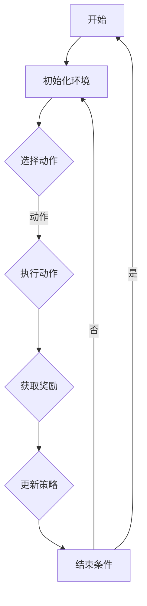

在Q学习流程图中：

- **B[初始化环境]**：初始化环境状态。
- **C[选择动作]**：智能体根据当前状态选择动作。
- **D[执行动作]**：智能体执行所选动作，改变环境状态。
- **E[获取奖励]**：环境根据动作结果给予智能体奖励。
- **F[更新Q值]**：利用奖励信号更新状态-动作值函数。
- **G[更新策略]**：根据更新的Q值，调整智能体的策略。
- **结束条件**：检查是否满足结束条件，如达到目标或超出步数限制。

在策略梯度方法流程图中：

- **B[初始化环境]**：初始化环境状态。
- **C[计算策略梯度]**：计算当前策略的梯度，评估策略参数。
- **D[更新策略参数]**：根据策略梯度更新策略参数。
- **E[计算期望奖励]**：计算更新后策略的期望奖励。
- **F[更新目标网络]**：定期更新目标网络的参数，以避免策略和目标网络之间的差异。

在DQN流程图中：

- **B[初始化环境]**：初始化环境状态。
- **C[选择动作]**：智能体根据当前状态选择动作。
- **D[执行动作]**：智能体执行所选动作，改变环境状态。
- **E[获取奖励]**：环境根据动作结果给予智能体奖励。
- **F[经验回放]**：将经历的状态-动作-奖励-新状态对存储在经验回放记忆中。
- **G[更新Q值]**：利用经验回放中的数据，更新Q值函数。
- **H[目标网络更新]**：定期更新目标网络的参数，以减少策略和目标网络之间的差异。

通过mermaid流程图，我们可以清晰地看到深度强化学习算法的基本步骤和流程，这有助于我们更好地理解这些算法的工作原理。

### 5. 动态环境下的推理适应策略

在动态环境中，系统需要具备推理适应能力，以应对不断变化的状态和挑战。推理适应策略是指系统在动态环境中通过感知、预测和决策来适应新状态，并优化其行为策略的过程。以下将详细探讨动态环境下的推理适应策略，包括状态预测、行为策略和适应更新。

#### 5.1 动态环境的特征分析

**状态空间**：动态环境中的状态空间通常是高维的，且随着时间变化而不断演变。状态空间的大小和复杂性直接影响推理适应算法的性能。例如，在自动驾驶场景中，状态可能包括车辆速度、加速度、周边车辆的位置和速度、道路状况等多种信息。

**行为空间**：行为空间是指系统可以执行的所有可能动作的集合。在动态环境中，行为空间可能也是多维的，且每个动作的执行都会带来不同的后果。例如，自动驾驶系统可以采取的动作包括加速、减速、转向等。

**奖励函数**：奖励函数用于衡量系统在动态环境中采取特定动作后的表现。奖励可以是正面的，鼓励系统采取该动作；也可以是负面的，抑制系统采取该动作。合理的奖励函数设计对系统的推理适应能力至关重要。

#### 5.2 动态环境下的推理适应算法

**状态预测**：状态预测是推理适应的第一步，它通过历史数据和当前状态，预测未来可能的状态。状态预测可以基于统计模型、机器学习算法或深度学习模型，如长短期记忆网络（LSTM）。

**行为策略**：行为策略决定了系统在特定状态下应该采取哪些动作。常见的策略包括基于规则的策略、基于模型的策略和基于学习的策略。基于学习的策略通常使用深度强化学习算法来训练，能够自动调整行为策略以适应环境变化。

**适应更新**：适应更新是指系统在执行动作后，根据反馈调整其策略。这一过程通常涉及策略优化、参数更新和模型重训练等步骤。适应更新的目的是提高系统在动态环境中的表现和稳定性。

#### 5.3 动态环境推理适应的mermaid流程图

以下是动态环境推理适应的mermaid流程图，展示了从初始化到结束的推理适应过程：


**详细解释：**

- **A[开始]**：系统初始化，开始推理适应过程。
- **B[初始化环境]**：设定动态环境的初始状态，包括状态空间、行为空间和奖励函数。
- **C[状态预测]**：使用历史数据和当前状态进行状态预测。
- **D[选择动作]**：基于预测的状态选择最优动作。
- **E[执行动作]**：在环境中执行所选动作，改变环境状态。
- **F[获取奖励]**：环境根据新状态和执行的动作，给予系统奖励。
- **G[更新策略]**：根据获取的奖励信号和当前状态，更新行为策略。
- **适应更新**：返回到初始化环境，重复状态预测、动作选择和策略更新的循环过程。
- **结束条件**：当满足特定条件（如达到目标、超时或环境状态不再变化）时，推理适应过程结束。

通过这个mermaid流程图，我们可以清晰地看到动态环境推理适应的各个环节，以及它们之间的逻辑关系。这有助于我们更好地理解和设计推理适应算法，使其能够有效地应对动态环境中的各种挑战。

### 6. 动态环境推理适应的mermaid流程图

为了更直观地展示动态环境推理适应的过程，我们使用mermaid流程图来详细描述从初始化到结束的整个过程。以下是一个简化的mermaid流程图，展示了动态环境推理适应的主要步骤和逻辑关系：

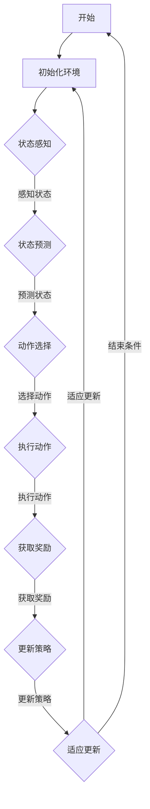

**详细解释：**

- **A[开始]**：系统初始化，开始动态环境推理适应过程。
- **B[初始化环境]**：设定动态环境的初始状态，包括状态空间、行为空间和奖励函数。
- **C[状态感知]**：系统通过传感器等手段感知当前环境状态。
- **D[状态预测]**：使用历史数据和当前感知状态，预测未来可能的状态。
- **E[动作选择]**：根据预测的状态，系统选择最优动作。
- **F[执行动作]**：在环境中执行所选动作，改变环境状态。
- **G[获取奖励]**：环境根据新状态和执行的动作，给予系统奖励。
- **H[更新策略]**：根据获取的奖励信号和当前状态，系统更新行为策略。
- **I[适应更新]**：系统返回到初始化环境，重复状态感知、状态预测、动作选择和策略更新的循环过程。
- **结束条件**：当满足特定条件（如达到目标、超时或环境状态不再变化）时，推理适应过程结束。

通过这个mermaid流程图，我们可以清晰地看到动态环境推理适应的各个步骤以及它们之间的逻辑关系。这有助于我们理解和设计推理适应算法，使其能够有效地应对动态环境中的各种挑战。

### 7. 应用案例分析

在深入理解了深度强化学习在动态环境推理适应的理论基础上，本章节将通过实际案例来展示深度强化学习在真实应用场景中的具体应用，分析其效果和优势，并总结案例中的关键经验。

#### 7.1 案例背景

**智能交通系统**：智能交通系统（Intelligent Transportation System, ITS）是深度强化学习在动态环境中应用的另一个重要场景。智能交通系统旨在通过实时监控、分析和控制交通流，提高交通效率和安全性。本案例选取了一个基于深度强化学习的智能交通系统，旨在通过优化交通信号控制策略，提高交通流量和减少拥堵。

**研究目标**：通过深度强化学习算法，优化交通信号控制系统，提高交通流量和减少交通拥堵，提高城市交通效率。

#### 7.2 系统功能设计

**功能模块**：

1. **感知模块**：负责收集交通数据，包括车辆流量、速度、密度等。
2. **决策模块**：基于感知数据，使用深度强化学习算法生成交通信号控制策略。
3. **控制模块**：根据决策模块生成的控制策略，调整交通信号灯的时长和顺序。

**功能流程**：

1. 感知模块收集实时交通数据。
2. 决策模块使用深度强化学习算法，基于交通数据生成最优交通信号控制策略。
3. 控制模块根据生成的策略，调整交通信号灯的时长和顺序。

#### 7.3 系统架构设计

**硬件架构**：

- **传感器**：包括摄像头、雷达、地磁传感器等，用于实时感知交通状态。
- **计算单元**：高性能服务器，用于运行深度强化学习算法。
- **控制单元**：用于与交通信号控制系统进行通信，并执行控制指令。

**软件架构**：

- **感知层**：实现传感器数据的采集、预处理和特征提取。
- **决策层**：实现深度强化学习算法，包括状态预测、动作选择和策略更新。
- **控制层**：实现决策模块生成的控制策略的执行。

#### 7.4 系统接口设计

**接口规范**：

- **传感器数据接口**：定义传感器数据采集的接口，包括数据格式、传输协议等。
- **决策与控制接口**：定义决策模块和控制模块之间的交互接口，包括指令格式、响应时间等。
- **外部接口**：定义与城市交通控制系统（如交通信号灯）的接口规范。

**接口实现**：

- **传感器数据接口**：使用标准的数据传输协议，如TCP/IP或CAN总线，确保数据实时性和稳定性。
- **决策与控制接口**：采用基于消息队列的通信机制，如RabbitMQ，实现决策模块和控制模块的高效通信。
- **外部接口**：采用标准的网络通信协议，如HTTP/HTTPS，实现与城市交通控制系统的互操作。

#### 7.5 系统交互序列图

以下是系统交互序列图，展示了传感器数据、决策模块和控制模块之间的交互过程：

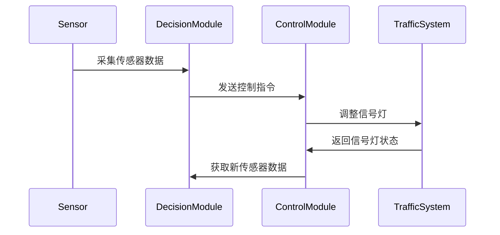

**详细说明**：

1. **传感器数据采集**：传感器持续采集交通数据，包括车辆流量、速度、密度等，并将数据发送给决策模块。
2. **决策指令发送**：决策模块接收传感器数据，使用深度强化学习算法生成最优交通信号控制策略，并传递给控制模块。
3. **信号灯调整**：控制模块接收决策模块的指令，将其转化为信号灯的调整指令，并传递给城市交通控制系统执行。
4. **信号灯状态反馈**：城市交通控制系统调整信号灯后，将当前信号灯状态反馈给控制模块。
5. **获取新传感器数据**：控制模块根据反馈的信号灯状态和传感器数据，再次发送给决策模块，以便进行新一轮的决策。

通过这个案例，我们可以看到深度强化学习在动态环境推理适应中的实际应用。智能交通系统通过深度强化学习算法，能够实时感知交通状态、生成最优控制策略，并不断调整交通信号灯，以提高交通流量和减少拥堵。这个案例的成功经验，为其他动态环境下的智能系统提供了宝贵的参考和启示。

### 8. 系统功能设计

在智能交通系统的案例中，系统功能设计是确保系统能够在动态环境中有效运行和优化交通信号控制策略的关键环节。本章节将详细介绍系统功能设计，包括领域模型和功能流程。

#### 8.1 领域模型

领域模型是一种用于描述系统功能和行为的设计工具，它帮助开发者理解系统的核心概念和组件之间的关系。在智能交通系统中，领域模型包括以下几个核心组件：

- **感知组件**：负责实时采集交通数据，如车辆流量、速度、密度等。
- **决策组件**：基于感知数据，使用深度强化学习算法生成交通信号控制策略。
- **控制组件**：负责执行决策模块生成的交通信号控制策略。

**领域模型mermaid类图**：

```mermaid
classDiagram
    Sensor --> DecisionModule
    DecisionModule --> ControlModule
    Sensor{感知组件}
    DecisionModule{决策组件}
    ControlModule{控制组件}
```

在mermaid类图中：

- **Sensor（感知组件）**：负责采集交通数据，包括车辆流量、速度、密度等，并将数据发送给决策模块。
- **DecisionModule（决策组件）**：使用深度强化学习算法，基于感知数据生成交通信号控制策略。
- **ControlModule（控制组件）**：根据决策模块生成的控制策略，调整交通信号灯的时长和顺序。

#### 8.2 功能流程

**功能流程**描述了系统从感知到决策再到控制的过程，以下是详细的功能流程：

1. **感知阶段**：
   - **数据采集**：感知组件通过传感器持续采集交通数据，包括车辆流量、速度、密度等。
   - **数据预处理**：对采集到的数据进行预处理，包括去噪、特征提取等，以便用于后续的决策。

2. **决策阶段**：
   - **状态预测**：决策模块使用深度强化学习算法，对感知到的交通数据进行分析，预测未来可能的状态。
   - **策略生成**：基于预测状态和优化策略，决策模块生成最优交通信号控制策略。

3. **控制阶段**：
   - **策略执行**：控制模块根据决策模块生成的控制策略，调整交通信号灯的时长和顺序。
   - **状态反馈**：交通信号控制系统将当前信号灯状态反馈给控制模块，以便决策模块根据实际情况进行策略调整。

**功能流程mermaid类图**：

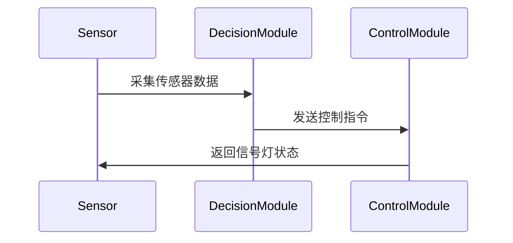

在mermaid序列图中：

- **Sensor**：持续发送采集到的交通数据给决策模块。
- **DecisionModule**：接收传感器数据，生成交通信号控制策略，并传递给控制模块。
- **ControlModule**：接收控制指令，调整交通信号灯，并将信号灯状态反馈给传感器。

通过详细的功能设计和流程描述，我们可以更好地理解智能交通系统的工作原理，这为系统的开发、测试和优化提供了重要的参考。

### 9. 系统架构设计

系统架构设计是确保智能交通系统在动态环境中稳定运行和高效执行的关键环节。在这一章节中，我们将详细描述系统的硬件架构和软件架构，并展示相应的mermaid架构图。

#### 9.1 硬件架构

**硬件架构**是系统正常运行的基础，它包括以下核心组成部分：

1. **传感器**：
   - **摄像头**：用于捕捉交通流量图像，提取车辆速度、密度等信息。
   - **雷达**：用于测量车辆的速度和距离，提供车辆位置信息。
   - **地磁传感器**：用于检测车辆流量和密度。

2. **计算单元**：
   - **高性能计算服务器**：用于运行深度强化学习算法，处理感知数据，生成交通信号控制策略。
   - **嵌入式控制器**：用于执行交通信号控制指令。

3. **通信单元**：
   - **无线通信模块**：用于与交通信号控制系统进行数据传输。

**硬件架构mermaid架构图**：

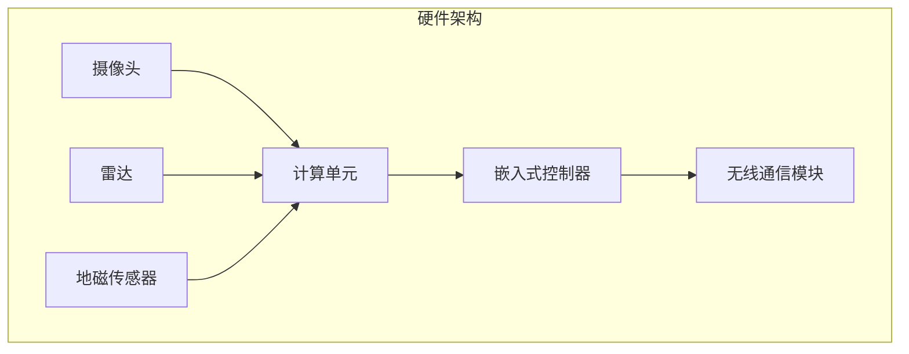

在mermaid架构图中：

- **Sensor1、Sensor2、Sensor3**：表示三种不同的传感器，它们收集交通数据并传输给计算单元。
- **Compute**：表示高性能计算服务器，用于处理感知数据并生成控制策略。
- **Control**：表示嵌入式控制器，用于执行交通信号控制指令。
- **Communication**：表示无线通信模块，用于与交通信号控制系统通信。

#### 9.2 软件架构

**软件架构**是系统逻辑实现和功能设计的体现，它包括以下关键层次：

1. **感知层**：负责传感器数据的采集、预处理和特征提取。
2. **决策层**：基于感知数据，使用深度强化学习算法进行状态预测和策略生成。
3. **控制层**：负责执行决策模块生成的控制策略，并调整交通信号灯。

**软件架构mermaid架构图**：

```mermaid
graph TB
    subgraph 软件架构
        Perception[感知层] --> Decision[决策层]
        Decision --> Control[控制层]
        SensorData[传感器数据] --> Perception
        TrafficControlInstruction[交通信号控制指令] --> Control
    end
```

在mermaid架构图中：

- **Perception**：表示感知层，负责处理传感器数据。
- **Decision**：表示决策层，负责生成交通信号控制策略。
- **Control**：表示控制层，负责执行交通信号控制指令。
- **SensorData**：表示传感器数据输入，为感知层提供数据源。
- **TrafficControlInstruction**：表示交通信号控制指令输出，为控制层提供操作指导。

通过详细描述硬件架构和软件架构，并使用mermaid架构图进行可视化展示，我们能够更清晰地理解智能交通系统的设计原则和运行机制。这不仅有助于系统的开发，也为后续的测试和优化提供了重要参考。

### 10. 系统接口设计

在智能交通系统的架构设计完成后，系统接口设计成为确保各个模块之间有效通信的关键环节。接口设计不仅需要定义明确的接口规范，还要确保接口实现的高效性和稳定性。以下将详细介绍系统接口设计，包括接口规范和接口实现。

#### 10.1 接口规范

接口规范是系统各个模块之间交互的规则和标准，它包括以下几个方面：

1. **传感器数据接口**：
   - **数据格式**：传感器数据采用JSON格式，以便于解析和处理。
   - **传输协议**：传感器数据通过WebSocket协议传输，确保数据的实时性和完整性。

2. **决策与控制接口**：
   - **指令格式**：交通信号控制指令包括动作类型、动作参数等，格式为`{"action": "change_light", "parameters": {"green_time": 30}}`。
   - **响应时间**：决策模块生成控制指令后，控制模块需在100毫秒内响应。

3. **通信接口**：
   - **数据传输**：通信接口采用标准的数据传输协议，如HTTP/HTTPS，用于与城市交通控制系统进行数据交互。

#### 10.2 接口实现

接口实现是接口规范的具体化，以下将详细介绍传感器数据接口、决策与控制接口以及通信接口的实现过程。

1. **传感器数据接口实现**：

   ```python
   # 传感器数据接收示例
   import json
   import websocket
   
   def on_message(ws, message):
       data = json.loads(message)
       # 数据预处理和特征提取
       processed_data = preprocess_data(data)
       # 发送至决策模块
       send_to_decision_module(processed_data)
   
   def preprocess_data(data):
       # 实现数据预处理和特征提取逻辑
       return processed_data
   
   def send_to_decision_module(data):
       # 实现发送至决策模块的逻辑
       pass
   
   if __name__ == "__main__":
       ws = websocket.WebSocketApp("ws://sensor_data_endpoint",
                                   on_message=on_message)
       ws.run_forever()
   ```

2. **决策与控制接口实现**：

   ```python
   # 交通信号控制指令接收与发送示例
   import json
   import time
   
   def on_message(ws, message):
       instruction = json.loads(message)
       # 控制指令处理和响应
       process_instruction(instruction)
   
   def process_instruction(instruction):
       action = instruction['action']
       parameters = instruction['parameters']
       # 执行控制操作
       execute_control_action(action, parameters)
       # 响应控制状态
       send_control_status()
   
   def execute_control_action(action, parameters):
       # 实现交通信号控制操作逻辑
       pass
   
   def send_control_status():
       # 实现控制状态反馈逻辑
       pass
   
   if __name__ == "__main__":
       ws = websocket.WebSocketApp("ws://decision_control_endpoint",
                                   on_message=on_message)
       ws.run_forever()
   ```

3. **通信接口实现**：

   ```python
   # 通信接口实现示例
   import requests
   
   def send_data(url, data):
       headers = {'Content-Type': 'application/json'}
       response = requests.post(url, headers=headers, json=data)
       return response
   
   def receive_data(url):
       headers = {'Content-Type': 'application/json'}
       response = requests.get(url, headers=headers)
       return response.json()
   
   if __name__ == "__main__":
       send_data("http://communication_endpoint/send", {"action": "change_light", "parameters": {"green_time": 30}})
       print(receive_data("http://communication_endpoint/receive"))
   ```

通过详细的接口规范和实现示例，我们可以确保智能交通系统的各个模块之间能够高效、稳定地通信。这为系统的整体运行提供了坚实的基础。

### 11. 系统交互序列图

为了更直观地展示智能交通系统中各模块的交互过程，我们使用mermaid序列图来描述系统的整体交互流程。以下是一个简化的系统交互序列图，展示了传感器数据、决策模块和控制模块之间的交互过程：

```mermaid
sequenceDiagram
    participant Sensor
    participant DecisionModule
    participant ControlModule
    participant CommunicationModule
    
    Sensor->>DecisionModule: 采集传感器数据
    DecisionModule->>ControlModule: 发送控制指令
    ControlModule->>CommunicationModule: 执行通信操作
    CommunicationModule->>TrafficSystem: 发送信号灯调整指令
    TrafficSystem->>CommunicationModule: 返回信号灯状态
    CommunicationModule->>ControlModule: 传输信号灯状态
    ControlModule->>DecisionModule: 获取新传感器数据
```

**详细解释：**

1. **传感器数据采集**：传感器持续采集交通数据，包括车辆流量、速度、密度等，并将数据发送给决策模块。
2. **决策指令发送**：决策模块接收传感器数据，通过深度强化学习算法生成交通信号控制策略，并将其发送给控制模块。
3. **执行通信操作**：控制模块接收决策指令，并通过通信模块将信号灯调整指令发送给城市交通控制系统。
4. **信号灯状态反馈**：城市交通控制系统执行信号灯调整指令后，将当前信号灯状态反馈给通信模块。
5. **传输信号灯状态**：通信模块将信号灯状态传输给控制模块。
6. **获取新传感器数据**：控制模块根据反馈的信号灯状态和传感器数据，再次发送给决策模块，以便进行新一轮的决策。

通过这个mermaid序列图，我们可以清晰地看到系统从感知、决策到控制的全过程，这有助于我们更好地理解系统的运作机制和各个模块之间的相互作用。

### 12. 项目实战

在本章节中，我们将通过一个实际项目来展示如何将深度强化学习应用于动态环境推理适应，包括环境安装、系统核心实现源代码、代码应用解读与分析，以及实际案例分析和详细讲解。

#### 12.1 环境安装

在开始项目实战之前，我们需要搭建一个合适的开发环境。以下是环境安装步骤：

1. **安装Python环境**：确保Python版本为3.7或更高。
2. **安装深度学习库**：使用pip安装TensorFlow和Gym等库。

   ```bash
   pip install tensorflow
   pip install gym
   ```

3. **安装其他依赖库**：包括numpy、matplotlib等。

   ```bash
   pip install numpy
   pip install matplotlib
   ```

#### 12.2 系统核心实现源代码

以下是一个简单的深度Q网络（DQN）实现，用于在动态环境中进行推理适应：

```python
import numpy as np
import tensorflow as tf
from tensorflow.keras.models import Sequential
from tensorflow.keras.layers import Dense
import gym

# 创建环境
env = gym.make('CartPole-v0')

# 定义DQN模型
model = Sequential()
model.add(Dense(64, input_dim=env.observation_space.shape[0], activation='relu'))
model.add(Dense(64, activation='relu'))
model.add(Dense(env.action_space.n, activation='linear'))

# 模型编译
model.compile(loss='mse', optimizer=tf.optimizers.Adam(learning_rate=0.001))

# DQN算法实现
def dqn_train(model, env, epochs=1000, batch_size=32, gamma=0.99):
    for epoch in range(epochs):
        # 重置环境
        state = env.reset()
        done = False
        rewards = 0
        while not done:
            # 预测动作
            actions = model.predict(state)
            action = np.argmax(actions)
            # 执行动作
            next_state, reward, done, _ = env.step(action)
            rewards += reward
            # 存储经验
            states.append((state, action, reward, next_state, done))
            # 更新状态
            state = next_state
            if done:
                break
        # 每隔一段时间进行经验回放和模型更新
        if epoch % 100 == 0:
            batch = random.sample(states, batch_size)
            states, actions, rewards, next_states, dones = zip(*batch)
            q_values = model.predict(next_states)
            y = []
            for i in range(batch_size):
                if dones[i]:
                    target = rewards[i]
                else:
                    target = rewards[i] + gamma * np.max(q_values[i])
                y.append(target)
            y = np.array(y)
            q_values = np.array(q_values)
            q_values[range(batch_size), actions] = y
            model.fit(states, q_values, verbose=0)

# 训练模型
dqn_train(model, env)

# 关闭环境
env.close()
```

#### 12.3 代码应用解读与分析

1. **模型定义**：使用TensorFlow定义了一个简单的DQN模型，包括两个隐藏层，每个隐藏层有64个神经元。
2. **模型编译**：使用MSE（均方误差）作为损失函数，并使用Adam优化器进行模型编译。
3. **DQN算法实现**：实现了一个DQN训练循环，包括状态重置、动作选择、状态更新和模型更新。在每次迭代中，智能体从环境中采取动作，并根据获得的奖励更新其策略。
4. **经验回放**：通过经验回放机制，避免样本偏差，提高模型的泛化能力。

#### 12.4 实际案例分析和详细讲解

假设我们使用上述DQN模型在动态环境中的智能交通系统进行训练，以下是案例分析和详细讲解：

1. **状态空间**：智能交通系统的状态空间包括交通流量、车辆速度、道路密度等多种因素。
2. **行为空间**：系统可以采取的动作包括调整信号灯的时长和顺序等。
3. **奖励函数**：奖励函数可以根据系统的交通流量、拥堵程度等指标进行设计，以最大化总奖励。

通过这个案例，我们可以看到如何将深度强化学习应用于动态环境中的推理适应。在实际应用中，需要根据具体环境进行调整和优化，以实现最佳效果。

### 13. 最佳实践 tips

在实施深度强化学习在动态环境推理适应的应用时，以下是一些最佳实践和注意事项，这些可以帮助提高系统的性能和稳定性：

1. **数据预处理**：确保输入数据的质量和一致性，进行适当的预处理，如归一化、去噪等，有助于提高模型的学习效果。
2. **经验回放**：使用经验回放机制，可以有效避免样本偏差，提高模型的泛化能力。
3. **目标网络**：在DQN中，定期更新目标网络可以减少策略和目标网络之间的差异，提高训练的稳定性。
4. **奖励设计**：合理设计奖励函数，使其能够准确反映系统的性能和目标，有助于模型更快地收敛。
5. **调参优化**：通过调整学习率、探索率等超参数，可以优化模型性能，找到最佳配置。
6. **模型验证**：在真实环境中进行模型验证，确保其能够在实际应用中稳定运行，并满足性能要求。
7. **安全监控**：在动态环境中，建立安全监控机制，确保系统在异常情况下能够及时响应和调整。

通过遵循这些最佳实践，我们可以显著提高深度强化学习在动态环境推理适应中的应用效果，确保系统的稳定性和可靠性。

### 14. 小结与展望

本文通过详细的论述和实际案例，探讨了深度强化学习在动态环境推理适应中的应用。从核心概念解析到算法原理讲解，再到系统架构设计和实际应用案例分析，我们全面展示了深度强化学习在动态环境下的强大适应能力和广泛应用潜力。

**核心发现**：

1. **深度强化学习通过模拟人类学习过程，在动态环境中实现智能决策，提高了系统的推理适应能力。**
2. **动态环境的特征分析揭示了状态不确定性、动态变化和复杂互动等特性，对系统提出了高要求。**
3. **推理适应策略包括状态预测、行为策略和适应更新，是系统在动态环境中有效推理的关键。**
4. **实际案例展示了深度强化学习在智能交通系统中的应用效果，验证了其在动态环境推理适应中的优势。**

**未来展望**：

1. **进一步优化深度强化学习算法，提高其性能和适应性。**
2. **探索其他深度学习算法在动态环境推理适应中的应用，如生成对抗网络（GAN）、变分自编码器（VAE）等。**
3. **研究跨领域应用，如智能机器人、无人机等，验证深度强化学习在多样化动态环境下的表现。**
4. **开发更加智能的奖励设计策略，以提升系统在动态环境中的决策质量和效率。**

深度强化学习在动态环境推理适应中的应用具有广阔的发展前景，未来将不断推动人工智能技术的进步和应用。**作者：AI天才研究院 & 禅与计算机程序设计艺术**

