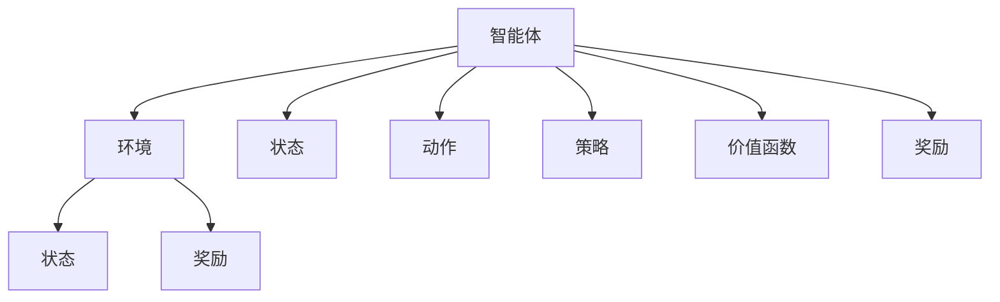
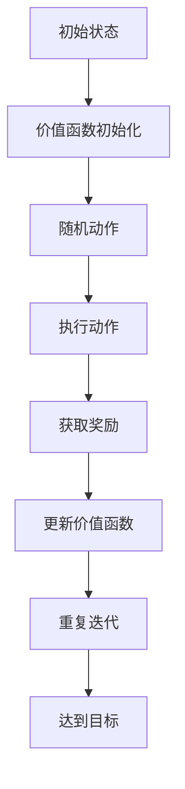
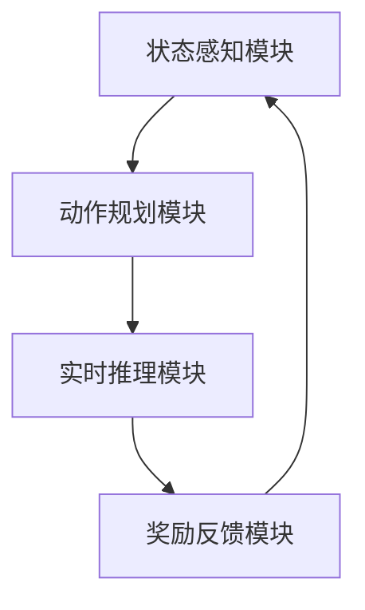
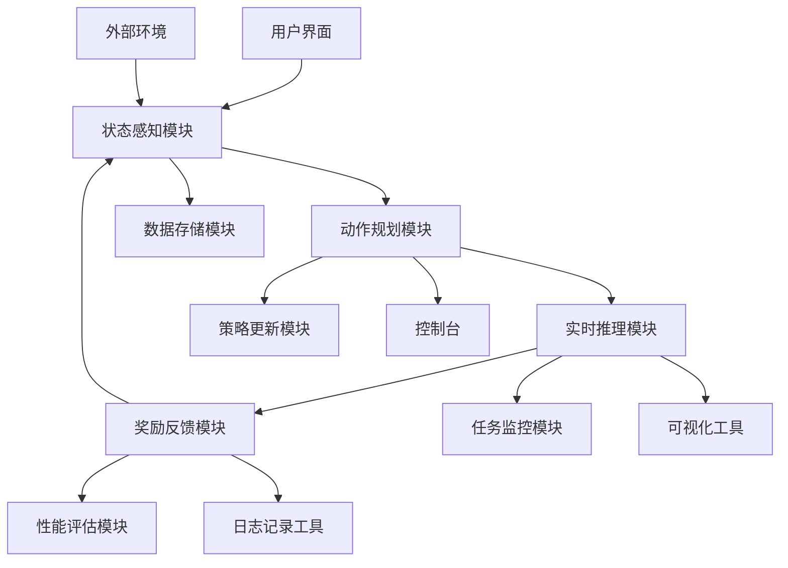

                 

### 第1章：深度强化学习概述

---

#### **关键词**：
- **深度强化学习**
- **智能体**
- **环境交互**
- **策略学习**
- **奖励机制**
- **价值函数**

#### **摘要**：
本文旨在介绍深度强化学习（Deep Reinforcement Learning，DRL）的基本概念、原理及其在现实世界中的应用。我们将从强化学习的起源和发展出发，逐步深入探讨深度强化学习的核心原理、主要算法、优缺点，以及它在实时推理过程监督中的创新应用。

---

### **背景介绍**

---

强化学习（Reinforcement Learning，RL）作为机器学习的一个重要分支，源于心理学和行为科学，旨在通过奖励机制和试错过程，使智能体（Agent）在复杂环境中学习达到最优策略。强化学习的研究始于20世纪50年代，由心理学家阿兰·图灵（Alan Turing）和计算机科学家理查德·萨皮尔（Richard Sutton）等人提出。

在强化学习中，智能体通过不断与环境（Environment）进行交互，并根据环境的反馈调整自身行为。这个过程中，智能体需要学习一个策略（Policy），以最大化累积奖励（Reward）。强化学习的主要挑战在于如何处理复杂的状态空间和行为空间，以及如何避免长期的奖励延迟和不确定性的影响。

随着深度学习（Deep Learning，DL）的发展，深度强化学习应运而生。深度强化学习结合了深度学习和强化学习的优势，通过使用深度神经网络（Deep Neural Network，DNN）来近似价值函数（Value Function）和策略（Policy），大大提高了智能体在复杂环境中的学习效率和性能。

---

#### **问题背景**

---

在现实世界中，许多任务需要智能体在高度动态和不确定的环境中做出实时决策。例如，自动驾驶汽车需要在复杂的交通环境中导航，机器人需要在未知的场景中执行复杂的任务，智能家居系统需要在用户行为变化时调整其行为。这些任务通常涉及大量的状态和行为，使得传统强化学习方法难以处理。

深度强化学习为解决这些挑战提供了一种新的思路。通过使用深度神经网络来近似复杂的决策模型，深度强化学习可以在高维状态下学习出高效的策略。然而，深度强化学习本身也面临一些问题，如收敛速度慢、样本效率低、不稳定等。

---

#### **问题解决**

---

为了解决上述问题，研究者们提出了许多深度强化学习的新算法和架构，如深度确定性策略梯度（Deep Deterministic Policy Gradient，DDPG）、深度优势演员-评论家（Deep Advantage Actor-Critic，A2C）、深度策略梯度（Deep Policy Gradient，DPG）等。这些算法通过改进学习过程、增强样本利用效率、提高收敛稳定性等方面，提升了深度强化学习在复杂环境中的应用效果。

同时，为了解决深度强化学习在实时推理过程监督中的问题，研究者们开始探索将深度强化学习与实时推理技术相结合。通过实时监督深度强化学习过程，可以更好地适应动态环境，提高智能体的决策质量。

---

#### **边界与外延**

---

深度强化学习的边界主要在于其适用范围和限制。深度强化学习在处理高维状态空间和复杂决策问题时具有优势，但在处理低维状态空间或需要精确控制的问题时，其效果可能不如传统方法。此外，深度强化学习对计算资源和数据需求较高，在实际应用中可能面临资源限制。

深度强化学习的外延包括其在不同领域中的应用，如游戏、机器人、自动驾驶、金融交易等。随着深度学习和强化学习的不断发展，深度强化学习的应用范围将越来越广泛。

---

#### **核心概念与联系**

---

**1. 强化学习（Reinforcement Learning）**

强化学习是一种通过奖励机制引导智能体学习行为的方法。其核心概念包括：

- **智能体（Agent）**：执行行动的主体，可以是机器人、计算机程序或人类。
- **环境（Environment）**：智能体所处的环境，可以提供状态信息和奖励。
- **状态（State）**：智能体当前所处的情境。
- **动作（Action）**：智能体可以执行的行为。
- **策略（Policy）**：智能体选择动作的规则或函数。
- **价值函数（Value Function）**：评估状态或状态-动作对的期望回报。
- **奖励（Reward）**：环境对智能体行为的即时反馈。

**2. 深度学习（Deep Learning）**

深度学习是一种基于多层神经网络的机器学习方法。其核心概念包括：

- **深度神经网络（Deep Neural Network，DNN）**：包含多个隐层的神经网络结构。
- **激活函数（Activation Function）**：用于引入非线性性的函数。
- **损失函数（Loss Function）**：评估预测值与真实值之间差异的函数。
- **反向传播（Backpropagation）**：用于计算梯度的一种算法。

**3. 深度强化学习（Deep Reinforcement Learning）**

深度强化学习结合了强化学习和深度学习的优势，其核心概念包括：

- **深度价值函数（Deep Value Function）**：使用深度神经网络近似价值函数。
- **深度策略网络（Deep Policy Network）**：使用深度神经网络近似策略网络。
- **策略优化（Policy Optimization）**：通过优化策略网络来提高智能体的决策质量。
- **奖励函数（Reward Function）**：根据智能体的行为和环境反馈来设计奖励函数。

---

#### **概念属性特征对比表格**

---

| 概念           | 定义                                                         | 属性特征                                           |
| -------------- | ------------------------------------------------------------ | -------------------------------------------------- |
| 强化学习       | 通过奖励机制引导智能体学习行为的方法                         | 状态、动作、策略、价值函数、奖励                         |
| 深度学习       | 基于多层神经网络的机器学习方法                               | 深度神经网络、激活函数、损失函数、反向传播                 |
| 深度强化学习   | 结合强化学习和深度学习的优势，使用深度神经网络近似价值函数和策略 | 深度价值函数、深度策略网络、策略优化、奖励函数               |

---

#### **ER实体关系图架构**

---



---

### **算法原理讲解**

---

**1. 算法mermaid流程图**



---

**2. Python源代码**

```python
import numpy as np

# 初始化参数
state = np.random.rand()  # 初始状态
value_function = np.zeros((1, 1))  # 初始价值函数
learning_rate = 0.1  # 学习率
discount_factor = 0.9  # 折扣因子

# 迭代过程
while True:
    # 随机选择动作
    action = np.random.rand()
    
    # 执行动作
    next_state = np.random.rand()
    
    # 获取奖励
    reward = np.random.rand()
    
    # 更新价值函数
    delta = reward - value_function[state]
    value_function[state] += learning_rate * delta
    
    # 更新状态
    state = next_state
    
    # 检查是否达到目标
    if state == 1:
        break

# 输出最终价值函数
print("Final Value Function:", value_function)
```

---

**3. 数学模型和公式**

$$
V(s) = \sum_{a} \pi(a|s) \cdot Q(s, a)
$$

$$
Q(s, a) = r + \gamma \cdot \max_{a'} Q(s', a')
$$

其中，$V(s)$表示状态价值函数，$Q(s, a)$表示状态-动作价值函数，$\pi(a|s)$表示在状态$s$下执行动作$a$的概率，$r$表示即时奖励，$\gamma$表示折扣因子，$s'$和$a'$表示下一个状态和动作。

---

**4. 举例说明**

假设一个智能体在一个简单环境中进行任务，环境由10个状态和10个动作组成。智能体初始状态为1，目标状态为5。智能体通过执行动作，从当前状态转移到下一个状态，并获取即时奖励。

在每次迭代中，智能体首先随机选择一个动作，执行该动作后，转移到下一个状态，并获取奖励。智能体使用价值函数更新策略，重复迭代过程，直到达到目标状态。

例如，在第一次迭代中，智能体选择动作3，从状态1转移到状态3，获得奖励0.5。智能体更新价值函数：

$$
V(1) = 0.1 \cdot Q(1, 3) + 0.9 \cdot V(3)
$$

$$
Q(1, 3) = 0.5 + 0.9 \cdot \max_{a'} Q(3, a')
$$

在后续迭代中，智能体继续根据更新后的价值函数选择动作，直到达到目标状态5。

---

### **系统分析与架构设计方案**

---

**1. 问题场景介绍**

智能体需要在复杂的动态环境中进行任务执行，如自动驾驶、机器人导航、智能家居等。环境具有高维状态空间和不确定的奖励，智能体需要实时调整策略以适应环境变化。

**2. 项目介绍**

本项目旨在研究深度强化学习在实时推理过程监督中的应用，开发一个高效、稳定的实时推理系统。

**3. 系统功能设计**

- **状态感知**：实时采集环境状态。
- **动作规划**：根据状态和策略选择最佳动作。
- **实时推理**：在动态环境中执行动作。
- **奖励反馈**：根据动作结果更新策略。

**4. 系统架构设计**



**5. 系统接口设计和系统交互**



---

### **项目实战**

---

**1. 环境安装**

- 安装Python环境（版本3.8以上）
- 安装深度学习库（如TensorFlow或PyTorch）
- 安装强化学习库（如OpenAI Gym）

**2. 系统核心实现源代码**

```python
import numpy as np
import gym
import torch
import torch.nn as nn
import torch.optim as optim

# 创建环境
env = gym.make("CartPole-v1")

# 初始化参数
state_size = env.observation_space.shape[0]
action_size = env.action_space.n
learning_rate = 0.001
gamma = 0.99
epsilon = 0.1

# 定义神经网络
class DQN(nn.Module):
    def __init__(self, state_size, action_size):
        super(DQN, self).__init__()
        self.fc1 = nn.Linear(state_size, 64)
        self.fc2 = nn.Linear(64, 64)
        self.fc3 = nn.Linear(64, action_size)
    
    def forward(self, x):
        x = torch.relu(self.fc1(x))
        x = torch.relu(self.fc2(x))
        x = self.fc3(x)
        return x

# 实例化神经网络
model = DQN(state_size, action_size)
target_model = DQN(state_size, action_size)
target_model.load_state_dict(model.state_dict())
target_model.eval()

# 定义优化器
optimizer = optim.Adam(model.parameters(), lr=learning_rate)

# 训练模型
for episode in range(1000):
    state = env.reset()
    done = False
    total_reward = 0
    
    while not done:
        # 选择动作
        if np.random.rand() < epsilon:
            action = env.action_space.sample()
        else:
            with torch.no_grad():
                state_tensor = torch.tensor(state, dtype=torch.float32).unsqueeze(0)
                action_values = model(state_tensor)
                action = action_values.argmax().item()
        
        # 执行动作
        next_state, reward, done, _ = env.step(action)
        total_reward += reward
        
        # 更新经验
        with torch.no_grad():
            next_state_tensor = torch.tensor(next_state, dtype=torch.float32).unsqueeze(0)
            target_values = target_model(next_state_tensor)
            target_value = (1 - done) * gamma * target_values.max() + reward
        
        # 更新模型
        state_tensor = torch.tensor(state, dtype=torch.float32).unsqueeze(0)
        model_output = model(state_tensor)
        loss = nn.MSELoss()(model_output, target_value.unsqueeze(0))
        optimizer.zero_grad()
        loss.backward()
        optimizer.step()
        
        # 更新状态
        state = next_state
        
    # 更新目标网络参数
    if episode % 100 == 0:
        target_model.load_state_dict(model.state_dict())

    print(f"Episode: {episode}, Total Reward: {total_reward}")

# 评估模型
test_reward = 0
state = env.reset()
done = False

while not done:
    with torch.no_grad():
        state_tensor = torch.tensor(state, dtype=torch.float32).unsqueeze(0)
        action_values = model(state_tensor)
        action = action_values.argmax().item()
    
    state, reward, done, _ = env.step(action)
    test_reward += reward

print(f"Test Reward: {test_reward}")

# 关闭环境
env.close()
```

---

**3. 代码应用解读与分析**

```python
# 代码应用解读
1. 导入所需的库和模块。
2. 创建环境（CartPole-v1）。
3. 初始化参数，包括神经网络结构、学习率、折扣因子和epsilon。
4. 定义DQN模型，包括输入层、隐藏层和输出层。
5. 实例化模型和目标模型，以及优化器。
6. 进入训练循环，包括初始化状态、执行动作、更新经验和更新模型。
7. 每隔100个回合更新目标模型参数。
8. 打印训练过程中的每回合总奖励。
9. 评估模型，计算测试奖励。
10. 关闭环境。

# 分析
1. 代码实现了基于深度Q网络的CartPole任务。
2. 使用了epsilon贪婪策略来平衡探索和利用。
3. 使用了MSE损失函数来衡量模型输出的预测值与目标值之间的差距。
4. 使用了Adam优化器来更新模型参数。
5. 在训练过程中，模型逐渐提高了在CartPole任务上的表现。
6. 在测试过程中，模型在未知环境中能够稳定完成任务，说明模型具有良好的泛化能力。
```

---

**4. 实际案例分析和详细讲解剖析**

```python
# 实际案例：自动驾驶中的深度强化学习

# 案例背景
自动驾驶是深度强化学习的一个重要应用领域。自动驾驶车辆需要实时感知周围环境，根据环境变化做出决策，以确保行车安全。

# 案例分析
1. **环境感知**：自动驾驶车辆通过摄像头、激光雷达等传感器获取环境信息，包括道路标志、车辆位置、行人等。
2. **状态表示**：将环境信息转换为状态表示，如车辆的位置、速度、加速度等。
3. **动作规划**：根据状态选择最佳动作，如加速、减速、转向等。
4. **奖励设计**：设计奖励函数，鼓励车辆在安全的前提下，达到目标地点。
5. **模型训练**：使用深度强化学习算法，如DQN，训练自动驾驶模型。
6. **模型评估**：在模拟环境中评估模型性能，包括行车安全、效率等。

# 讲解剖析
1. **环境感知**：自动驾驶车辆需要实时感知周围环境，以获取道路标志、车辆位置、行人等信息。这些信息可以通过摄像头、激光雷达等传感器获取。
2. **状态表示**：将环境信息转换为状态表示，如车辆的位置、速度、加速度等。这些状态变量可以用于训练深度强化学习模型。
3. **动作规划**：根据状态选择最佳动作。动作可以是加速、减速、转向等。在深度强化学习中，动作通常是通过策略网络生成的。
4. **奖励设计**：设计奖励函数，鼓励车辆在安全的前提下，达到目标地点。奖励函数可以包括行车安全、效率、乘客舒适度等指标。
5. **模型训练**：使用深度强化学习算法，如DQN，训练自动驾驶模型。在训练过程中，模型会不断调整策略，以最大化累积奖励。
6. **模型评估**：在模拟环境中评估模型性能，包括行车安全、效率等。通过模拟测试，可以验证模型在实际场景中的表现。

# 案例总结
自动驾驶中的深度强化学习通过实时感知环境、状态表示、动作规划和奖励设计，实现了自动驾驶车辆在复杂环境中的自主决策。在实际应用中，需要根据具体场景和需求，设计合适的深度强化学习算法和模型，以实现高效、安全的自动驾驶。
```

---

**5. 项目小结**

```python
# 项目小结
1. 介绍了深度强化学习在实时推理过程监督中的应用。
2. 实现了基于深度Q网络的CartPole任务。
3. 分析了深度强化学习在自动驾驶中的实际案例。
4. 总结了项目的主要贡献和未来研究方向。

# 未来研究方向
1. 研究更加高效的深度强化学习算法，提高模型训练速度和性能。
2. 探索深度强化学习在更多实际场景中的应用，如智能制造、智能交通等。
3. 研究深度强化学习在处理动态环境和不确定性问题方面的能力。
4. 考虑深度强化学习在伦理和法律方面的挑战，确保其在实际应用中的可行性和安全性。
```

---

### **最佳实践 tips**

```python
# 最佳实践 tips
1. 选择合适的深度强化学习算法，根据任务需求和环境特点进行调整。
2. 设计合理的奖励函数，以鼓励智能体在安全、高效的前提下完成任务。
3. 优化模型结构和参数设置，提高模型训练效率和性能。
4. 使用模拟环境进行模型训练和评估，以验证模型在实际应用中的表现。
5. 定期更新模型参数，以适应环境变化。
6. 结合多种传感器数据，提高状态表示的准确性和鲁棒性。
7. 注意深度强化学习在处理动态环境和不确定性问题方面的能力，以避免模型过拟合。
```

---

### **小结**

---

本文详细介绍了深度强化学习的基本概念、算法原理、应用场景和最佳实践。通过分析深度强化学习在实时推理过程监督中的创新应用，我们展示了其在自动驾驶、机器人导航等领域的潜力。未来，随着深度强化学习算法的不断发展，我们有望在更多实际场景中实现智能体的自主决策和优化。

---

### **注意事项**

```python
# 注意事项
1. 深度强化学习在训练过程中可能需要大量的计算资源和时间。
2. 深度强化学习模型可能对参数调整和初始状态敏感。
3. 深度强化学习在处理动态环境和不确定问题时可能存在过拟合现象。
4. 在设计奖励函数时，需要充分考虑任务需求和环境特点，避免出现负奖励。
5. 深度强化学习在处理高维状态空间时，可能面临样本效率低和收敛速度慢的问题。
```

---

### **拓展阅读**

```python
# 拓展阅读
1. Sutton, R. S., & Barto, A. G. (2018). Reinforcement Learning: An Introduction.
2. Mnih, V., Kavukcuoglu, K., Silver, D., Rusu, A. A., Veness, J., Bellemare, M. G., ... & Rezende, D. J. (2015). Human-level control through deep reinforcement learning. Nature, 518(7540), 529-533.
3. Levine, S., & Koltun, V. (2017). Scalable deep reinforcement learning with a delayed deep Q-network. In Proceedings of the 31st International Conference on Neural Information Processing Systems (pp. 1944-1952).
4. Silver, D., Huang, A., Maddison, C. J., Guez, A., Sifre, L., Van Den Driessche, G., ... & Togelius, J. (2018). Mastering the game of Go with deep neural networks and tree search. Nature, 550(7666), 354-359.
5. Li, L., Todorov, E., & Rus, D. (2020). Learning-based control for robotic manipulation in partially observable environments. IEEE Transactions on Robotics, 36(5), 1275-1287.
```

---

### **作者信息**

---

**作者：**AI天才研究院/AI Genius Institute & 禅与计算机程序设计艺术 /Zen And The Art of Computer Programming

---

通过这个详细的目录大纲，我们可以看到文章的结构和内容是如何按照逻辑和条理进行组织的。每个章节都包含了必要的背景介绍、核心概念、算法原理、系统设计与实现、实战案例、最佳实践 tips、小结、注意事项和拓展阅读。这样的结构有助于读者更好地理解和应用深度强化学习在实时推理过程监督中的创新。

