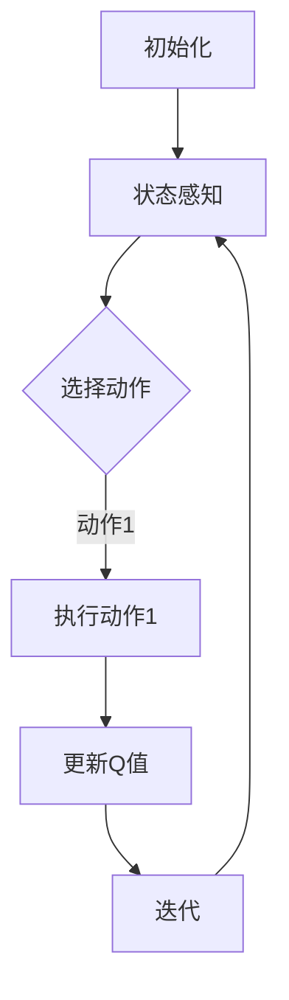
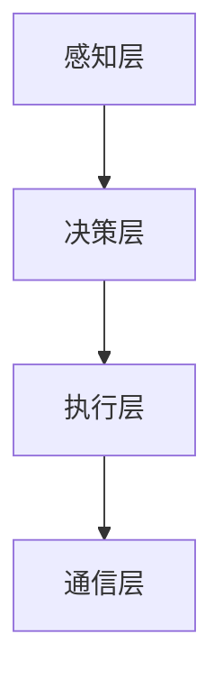
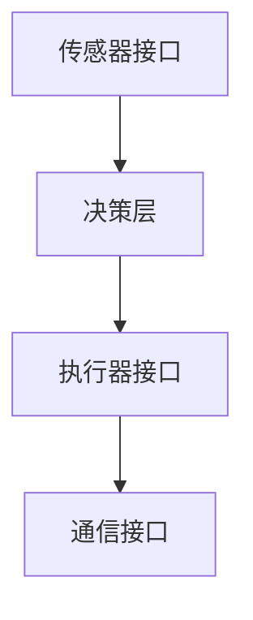
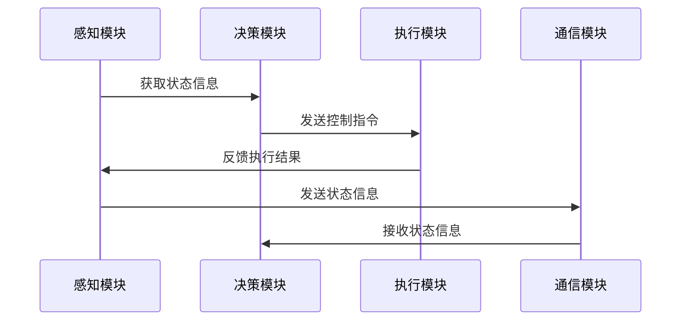
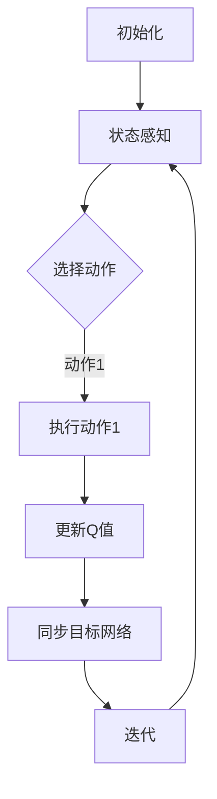

                 

# 深度强化学习在机器人控制中的应用

> 关键词：深度强化学习，机器人控制，DQN算法，Python实现，系统架构设计，实战案例

> 摘要：本文旨在探讨深度强化学习（DRL）在机器人控制中的应用。通过分析深度强化学习的原理和算法，本文详细介绍了如何将深度强化学习应用于机器人控制中，并通过一个实际项目展示了其应用效果。文章分为五大部分：背景介绍、核心概念与联系、算法原理讲解、系统分析与架构设计以及项目实战。通过这篇文章，读者将了解到深度强化学习在机器人控制领域的潜力及其实现方法。

## 目录大纲

### 第一部分：背景介绍

- 第1章 问题背景
  - 1.1 机器人控制的需求
  - 1.2 当前机器人控制存在的问题
- 第2章 深度强化学习
  - 2.1 深度强化学习的概念
  - 2.2 深度强化学习的基本原理
  - 2.3 深度强化学习在机器人控制中的应用前景
  - 2.4 本书结构安排

### 第二部分：核心概念与联系

- 第3章 深度强化学习原理
  - 3.1 深度强化学习的基本框架
  - 3.2 深度强化学习算法的数学模型
  - 3.3 深度强化学习算法的属性特征对比
  - 3.4 深度强化学习算法的ER实体关系图架构

### 第三部分：算法原理讲解

- 第4章 深度Q网络（DQN）详解
  - 4.1 DQN算法的基本原理
  - 4.2 DQN算法的mermaid流程图
  - 4.3 DQN算法的Python源代码实现
  - 4.4 DQN算法原理的数学模型与公式
  - 4.5 DQN算法原理举例说明

### 第四部分：系统分析与架构设计

- 第5章 机器人控制系统架构设计
  - 5.1 问题场景介绍
  - 5.2 系统功能设计
  - 5.3 系统架构设计
  - 5.4 系统接口设计
  - 5.5 系统交互序列图

### 第五部分：项目实战

- 第6章 深度强化学习在机器人控制中的应用实战
  - 6.1 环境安装与配置
  - 6.2 系统核心实现
  - 6.3 代码应用解读与分析
  - 6.4 实际案例分析与讲解
  - 6.5 项目小结

### 第六部分：最佳实践与拓展

- 第7章 最佳实践
  - 7.1 数据预处理技巧
  - 7.2 模型调参技巧
- 第8章 拓展阅读
  - 8.1 深度强化学习的最新进展
  - 8.2 应用领域

## 第一部分：背景介绍

### 第1章 问题背景

#### 1.1 机器人控制的需求

随着人工智能技术的快速发展，机器人技术在工业、医疗、家庭等多个领域得到了广泛应用。机器人控制作为机器人技术的核心，其重要性日益凸显。机器人控制的需求主要体现在以下几个方面：

1. **高精度控制**：在工业生产、医疗手术等高精度要求的环境中，机器人需要实现高精度的运动控制和操作，以完成复杂任务。
2. **自主决策能力**：现代机器人需要具备一定的自主决策能力，以应对环境变化和复杂任务需求。
3. **适应性和灵活性**：机器人应能够适应不同的工作环境和任务需求，具有良好的灵活性和适应性。
4. **安全性和可靠性**：机器人在执行任务时需要确保人员和环境的安全，具有较高的安全性和可靠性。

#### 1.2 当前机器人控制存在的问题

虽然机器人控制技术取得了显著进展，但仍然存在一些问题：

1. **控制算法的复杂性**：现有的机器人控制算法往往较为复杂，难以实现实时高效的控制。
2. **环境建模的不确定性**：在实际应用中，环境建模的不确定性会影响机器人控制的准确性和稳定性。
3. **数据依赖性**：许多机器人控制算法需要大量数据训练，对数据的依赖性较高，难以在实际环境中快速部署。
4. **实时性要求**：在一些实时性要求较高的应用场景中，现有的机器人控制算法难以满足实时性需求。

#### 1.3 深度强化学习

深度强化学习（DRL）作为一种结合深度学习和强化学习的方法，在机器人控制领域具有广阔的应用前景。DRL通过自主学习环境中的状态和奖励信号，逐步优化策略，实现自主决策和控制。

#### 1.4 深度强化学习在机器人控制中的应用前景

深度强化学习在机器人控制中的应用前景包括：

1. **自主决策与控制**：DRL算法可以自主学习复杂的控制策略，实现机器人的自主决策和控制。
2. **自适应能力**：DRL算法具有良好的自适应能力，可以适应不同的环境和任务需求。
3. **实时性**：DRL算法具有较好的实时性，可以满足一些实时性要求较高的应用场景。
4. **数据依赖性降低**：与传统的机器人控制算法相比，DRL对数据的依赖性较低，更容易在实际环境中部署。

### 1.5 本书结构安排

本书分为六大部分，具体安排如下：

1. **背景介绍**：介绍机器人控制的需求和当前存在的问题，以及深度强化学习的基本概念和应用前景。
2. **核心概念与联系**：详细阐述深度强化学习的原理、算法框架、数学模型和属性特征，以及深度强化学习算法的ER实体关系图架构。
3. **算法原理讲解**：以深度Q网络（DQN）为例，详细介绍其基本原理、mermaid流程图、Python源代码实现、数学模型和公式，以及实际应用案例。
4. **系统分析与架构设计**：介绍机器人控制系统的功能设计、架构设计、接口设计以及系统交互序列图。
5. **项目实战**：通过一个实际项目展示深度强化学习在机器人控制中的应用，包括环境安装与配置、系统核心实现、代码应用解读与分析、实际案例分析和项目小结。
6. **最佳实践与拓展**：介绍数据预处理技巧、模型调参技巧以及深度强化学习的最新进展和应用领域。

### 1.6 阅读建议

1. **第一部分：背景介绍**：了解机器人控制的需求和当前存在的问题，以及深度强化学习的基本概念和应用前景。
2. **第二部分：核心概念与联系**：掌握深度强化学习的原理、算法框架、数学模型和属性特征，以及深度强化学习算法的ER实体关系图架构。
3. **第三部分：算法原理讲解**：深入学习深度Q网络（DQN）的基本原理、mermaid流程图、Python源代码实现、数学模型和公式，以及实际应用案例。
4. **第四部分：系统分析与架构设计**：了解机器人控制系统的功能设计、架构设计、接口设计以及系统交互序列图。
5. **第五部分：项目实战**：通过实际项目了解深度强化学习在机器人控制中的应用，掌握环境安装与配置、系统核心实现、代码应用解读与分析、实际案例分析和项目小结的方法。
6. **第六部分：最佳实践与拓展**：学习数据预处理技巧、模型调参技巧以及深度强化学习的最新进展和应用领域。

## 第二部分：核心概念与联系

### 第2章 深度强化学习原理

#### 2.1 深度强化学习的基本框架

深度强化学习（DRL）是一种结合深度学习和强化学习的方法，其基本框架包括以下几个部分：

1. **环境（Environment）**：环境是机器人执行任务的环境，可以是一个模拟环境或真实环境。
2. **智能体（Agent）**：智能体是执行任务的主体，通过感知环境的状态（State）并采取行动（Action），以获得奖励（Reward）。
3. **策略（Policy）**：策略是智能体采取行动的规则，可以是固定的或学习的。
4. **价值函数（Value Function）**：价值函数预测智能体在特定状态下采取特定行动所能获得的期望奖励。
5. **模型（Model）**：模型是智能体对环境的理解和预测，可以是基于经验学习的或基于先验知识的。

#### 2.2 深度强化学习的基本原理

深度强化学习的基本原理包括以下几个步骤：

1. **初始化**：初始化智能体的策略、价值函数和模型。
2. **感知状态**：智能体感知当前状态。
3. **选择行动**：根据当前状态和策略选择行动。
4. **执行行动**：智能体执行所选行动，并感知新的状态。
5. **获取奖励**：根据执行行动后的状态和奖励信号更新策略和价值函数。
6. **迭代**：重复以上步骤，逐步优化策略和价值函数，实现自主决策和控制。

#### 2.3 深度强化学习在机器人控制中的应用前景

深度强化学习在机器人控制中的应用前景包括以下几个方面：

1. **自主决策与控制**：DRL算法可以自主学习复杂的控制策略，实现机器人的自主决策和控制。
2. **自适应能力**：DRL算法具有良好的自适应能力，可以适应不同的环境和任务需求。
3. **实时性**：DRL算法具有较好的实时性，可以满足一些实时性要求较高的应用场景。
4. **数据依赖性降低**：与传统的机器人控制算法相比，DRL对数据的依赖性较低，更容易在实际环境中部署。

#### 2.4 本书结构安排

本书分为六大部分，具体安排如下：

1. **背景介绍**：介绍机器人控制的需求和当前存在的问题，以及深度强化学习的基本概念和应用前景。
2. **核心概念与联系**：详细阐述深度强化学习的原理、算法框架、数学模型和属性特征，以及深度强化学习算法的ER实体关系图架构。
3. **算法原理讲解**：以深度Q网络（DQN）为例，详细介绍其基本原理、mermaid流程图、Python源代码实现、数学模型和公式，以及实际应用案例。
4. **系统分析与架构设计**：介绍机器人控制系统的功能设计、架构设计、接口设计以及系统交互序列图。
5. **项目实战**：通过一个实际项目展示深度强化学习在机器人控制中的应用，包括环境安装与配置、系统核心实现、代码应用解读与分析、实际案例分析和项目小结。
6. **最佳实践与拓展**：介绍数据预处理技巧、模型调参技巧以及深度强化学习的最新进展和应用领域。

## 第二部分：核心概念与联系

### 第3章 深度强化学习原理

深度强化学习（DRL）是一种结合深度学习和强化学习的方法，旨在解决复杂的决策问题。在本章中，我们将详细介绍深度强化学习的基本框架、算法原理以及其在机器人控制中的应用前景。

#### 3.1 深度强化学习的基本框架

深度强化学习的基本框架包括以下几个部分：

1. **环境（Environment）**：环境是机器人执行任务的环境，可以是一个模拟环境或真实环境。环境提供当前状态（State）和奖励（Reward）给智能体（Agent）。
2. **智能体（Agent）**：智能体是执行任务的主体，通过感知环境的状态（State）并采取行动（Action），以获得奖励（Reward）。智能体的目标是最小化损失函数或最大化累积奖励。
3. **策略（Policy）**：策略是智能体采取行动的规则，可以是固定的或学习的。策略通常表示为概率分布函数，表示在给定状态下采取每个动作的概率。
4. **价值函数（Value Function）**：价值函数预测智能体在特定状态下采取特定行动所能获得的期望奖励。价值函数分为状态值函数（State Value Function）和动作值函数（Action Value Function）。
5. **模型（Model）**：模型是智能体对环境的理解和预测，可以是基于经验学习的或基于先验知识的。模型可以用于预测下一状态和奖励，以指导智能体的行动选择。

#### 3.2 深度强化学习的基本原理

深度强化学习的基本原理包括以下几个步骤：

1. **初始化**：初始化智能体的策略、价值函数和模型。
2. **感知状态**：智能体感知当前状态。
3. **选择行动**：根据当前状态和策略选择行动。
4. **执行行动**：智能体执行所选行动，并感知新的状态。
5. **获取奖励**：根据执行行动后的状态和奖励信号更新策略和价值函数。
6. **迭代**：重复以上步骤，逐步优化策略和价值函数，实现自主决策和控制。

在深度强化学习中，智能体通过与环境的交互，不断调整其策略和价值函数，以实现最优决策。这一过程通常采用基于梯度的优化方法，如梯度下降法。

#### 3.3 深度强化学习在机器人控制中的应用前景

深度强化学习在机器人控制中的应用前景包括以下几个方面：

1. **自主决策与控制**：DRL算法可以自主学习复杂的控制策略，实现机器人的自主决策和控制。例如，机器人可以自主导航、路径规划和任务执行。
2. **自适应能力**：DRL算法具有良好的自适应能力，可以适应不同的环境和任务需求。例如，机器人可以在不同的地形和环境中自主调整其控制策略。
3. **实时性**：DRL算法具有较好的实时性，可以满足一些实时性要求较高的应用场景。例如，机器人可以实时调整其控制策略，以适应环境变化。
4. **数据依赖性降低**：与传统的机器人控制算法相比，DRL对数据的依赖性较低，更容易在实际环境中部署。例如，DRL算法可以基于少量的数据或无数据情况下进行训练。

#### 3.4 深度强化学习算法的ER实体关系图架构

深度强化学习算法的ER实体关系图架构描述了深度强化学习中的关键实体及其关系。ER实体关系图包括以下实体：

1. **智能体（Agent）**：智能体是执行任务的主体，包括感知模块、决策模块和执行模块。
2. **环境（Environment）**：环境是机器人执行任务的环境，包括状态（State）和奖励（Reward）。
3. **策略（Policy）**：策略是智能体采取行动的规则，可以是固定的或学习的。
4. **价值函数（Value Function）**：价值函数预测智能体在特定状态下采取特定行动所能获得的期望奖励。
5. **模型（Model）**：模型是智能体对环境的理解和预测。

以下是一个简化的深度强化学习算法的ER实体关系图：

```mermaid
erDiagram
  Agent ||--|{ 环境E: Environment }
  Agent ||--|{ 策略P: Policy }
  Agent ||--|{ 价值函数V: Value Function }
  Agent ||--|{ 模型M: Model }
  环境E ||--|{ 状态S: State }
  环境E ||--|{ 奖励R: Reward }
```

#### 3.5 深度强化学习算法的属性特征对比

深度强化学习算法具有多种属性特征，以下是对几种常见深度强化学习算法的属性特征进行对比：

| 算法名称          | 状态表示 | 动作选择 | 奖励学习 | 值函数更新 | 适用场景   |
|-------------------|----------|----------|----------|------------|------------|
| Q-learning        | 离散状态 | 离散动作 | 累计奖励 | Q值更新     | 离散环境   |
| Deep Q Network (DQN) | 离散状态 | 离散动作 | 累计奖励 | 堆叠Q值更新 | 连续状态   |
| Policy Gradient    | 离散状态 | 连续动作 | 累计奖励 | 策略更新     | 连续环境   |

#### 3.6 深度强化学习算法的ER实体关系图架构

深度强化学习算法的ER实体关系图架构描述了算法中关键实体及其关系。以下是一个简化的深度强化学习算法的ER实体关系图：

```mermaid
erDiagram
  Agent ||--|{ 状态S: State }
  Agent ||--|{ 动作A: Action }
  Agent ||--|{ 奖励R: Reward }
  Agent ||--|{ 策略P: Policy }
  Agent ||--|{ 模型M: Model }
  状态S ||--|{ 状态值函数V: Value Function }
  动作A ||--|{ 动作值函数V: Value Function }
  奖励R ||--|{ 奖励函数R: Reward Function }
  策略P ||--|{ 策略更新函数U: Update Function }
  模型M ||--|{ 模型预测函数F: Predict Function }
```

#### 3.7 深度强化学习算法的数学模型

深度强化学习算法的数学模型描述了算法中各个部分之间的关系。以下是一个简化的深度强化学习算法的数学模型：

1. **状态表示**：状态S是一个离散或连续的随机变量，表示当前环境的特征。
2. **动作选择**：动作A是一个离散或连续的随机变量，表示智能体的行动。
3. **奖励学习**：奖励R是一个离散或连续的随机变量，表示智能体行动后的奖励。
4. **策略**：策略P是一个概率分布函数，表示在给定状态下选择每个动作的概率。
5. **价值函数**：价值函数V是一个随机变量，表示智能体在特定状态下采取特定行动所能获得的期望奖励。
6. **模型**：模型M是一个概率分布函数，表示智能体对环境的理解和预测。

以下是一个简化的深度强化学习算法的数学模型：

$$
\begin{aligned}
S_0 &\sim P(S_0) \\
A_t &\sim P(A_t|S_t) \\
R_t &\sim P(R_t|S_t, A_t) \\
S_{t+1} &\sim P(S_{t+1}|S_t, A_t) \\
V(S_t) &= \sum_{A_t} P(A_t|S_t) \cdot Q(S_t, A_t) \\
Q(S_t, A_t) &= r_t + \gamma \cdot \max_{A_{t+1}} Q(S_{t+1}, A_{t+1})
\end{aligned}
$$

其中，$r_t$ 是第 t 次行动的即时奖励，$\gamma$ 是折扣因子，用于权衡即时奖励和长期奖励。

#### 3.8 深度强化学习算法的属性特征对比

深度强化学习算法具有多种属性特征，以下是对几种常见深度强化学习算法的属性特征进行对比：

| 算法名称          | 状态表示 | 动作选择 | 奖励学习 | 值函数更新 | 适用场景   |
|-------------------|----------|----------|----------|------------|------------|
| Q-learning        | 离散状态 | 离散动作 | 累计奖励 | Q值更新     | 离散环境   |
| Deep Q Network (DQN) | 离散状态 | 离散动作 | 累计奖励 | 堆叠Q值更新 | 连续状态   |
| Policy Gradient    | 离散状态 | 连续动作 | 累计奖励 | 策略更新     | 连续环境   |

#### 3.9 深度强化学习算法的ER实体关系图架构

深度强化学习算法的ER实体关系图架构描述了算法中关键实体及其关系。以下是一个简化的深度强化学习算法的ER实体关系图：

```mermaid
erDiagram
  Agent ||--|{ 状态S: State }
  Agent ||--|{ 动作A: Action }
  Agent ||--|{ 奖励R: Reward }
  Agent ||--|{ 策略P: Policy }
  Agent ||--|{ 模型M: Model }
  状态S ||--|{ 状态值函数V: Value Function }
  动作A ||--|{ 动作值函数V: Value Function }
  奖励R ||--|{ 奖励函数R: Reward Function }
  策略P ||--|{ 策略更新函数U: Update Function }
  模型M ||--|{ 模型预测函数F: Predict Function }
```

#### 3.10 深度强化学习算法的数学模型

深度强化学习算法的数学模型描述了算法中各个部分之间的关系。以下是一个简化的深度强化学习算法的数学模型：

1. **状态表示**：状态S是一个离散或连续的随机变量，表示当前环境的特征。
2. **动作选择**：动作A是一个离散或连续的随机变量，表示智能体的行动。
3. **奖励学习**：奖励R是一个离散或连续的随机变量，表示智能体行动后的奖励。
4. **策略**：策略P是一个概率分布函数，表示在给定状态下选择每个动作的概率。
5. **价值函数**：价值函数V是一个随机变量，表示智能体在特定状态下采取特定行动所能获得的期望奖励。
6. **模型**：模型M是一个概率分布函数，表示智能体对环境的理解和预测。

以下是一个简化的深度强化学习算法的数学模型：

$$
\begin{aligned}
S_0 &\sim P(S_0) \\
A_t &\sim P(A_t|S_t) \\
R_t &\sim P(R_t|S_t, A_t) \\
S_{t+1} &\sim P(S_{t+1}|S_t, A_t) \\
V(S_t) &= \sum_{A_t} P(A_t|S_t) \cdot Q(S_t, A_t) \\
Q(S_t, A_t) &= r_t + \gamma \cdot \max_{A_{t+1}} Q(S_{t+1}, A_{t+1})
\end{aligned}
$$

其中，$r_t$ 是第 t 次行动的即时奖励，$\gamma$ 是折扣因子，用于权衡即时奖励和长期奖励。

## 第三部分：算法原理讲解

### 第4章 深度Q网络（DQN）详解

深度Q网络（DQN）是一种基于深度强化学习的算法，旨在通过学习状态-动作值函数（State-Action Value Function）来实现智能体的自主决策和控制。在本章中，我们将详细介绍DQN算法的基本原理、mermaid流程图、Python源代码实现以及数学模型。

#### 4.1 DQN算法的基本原理

DQN算法的基本原理可以概括为以下几个步骤：

1. **初始化**：初始化智能体的状态-动作值函数（Q值函数）和策略。
2. **状态感知**：智能体感知当前状态。
3. **动作选择**：根据当前状态和策略选择动作。
4. **执行动作**：智能体执行所选动作，并感知新的状态。
5. **更新Q值**：根据新的状态和奖励信号更新状态-动作值函数。
6. **迭代**：重复以上步骤，逐步优化状态-动作值函数和策略。

DQN算法的核心思想是通过学习状态-动作值函数来预测在给定状态下采取每个动作所能获得的期望奖励，从而选择最佳动作。

#### 4.2 DQN算法的mermaid流程图

以下是一个简化的DQN算法的mermaid流程图：



#### 4.3 DQN算法的Python源代码实现

以下是一个简单的DQN算法的Python源代码实现：

```python
import numpy as np
import random

# 初始化Q值函数
Q = np.zeros([S, A])

# 学习率
alpha = 0.1

# 折扣因子
gamma = 0.9

# 迭代次数
episodes = 1000

# 每个迭代的步数
steps_per_episode = 100

for episode in range(episodes):
    state = env.reset()
    done = False
    total_reward = 0
    
    for step in range(steps_per_episode):
        # 状态感知
        action = np.argmax(Q[state])
        
        # 执行动作
        next_state, reward, done, _ = env.step(action)
        
        # 更新Q值
        Q[state, action] += alpha * (reward + gamma * np.max(Q[next_state]) - Q[state, action])
        
        # 状态更新
        state = next_state
        
        # 累计奖励
        total_reward += reward
        
        # 结束条件
        if done:
            break
            
    print("Episode {} - Total Reward: {}".format(episode, total_reward))
```

#### 4.4 DQN算法原理的数学模型与公式

DQN算法的数学模型包括状态-动作值函数（Q值函数）的更新公式和策略的更新公式。

1. **状态-动作值函数的更新公式**：

$$
Q(s, a) \leftarrow Q(s, a) + \alpha [r + \gamma \max_{a'} Q(s', a') - Q(s, a)]
$$

其中，$s$ 表示当前状态，$a$ 表示当前动作，$s'$ 表示下一状态，$a'$ 表示下一动作，$r$ 表示即时奖励，$\alpha$ 表示学习率，$\gamma$ 表示折扣因子。

2. **策略的更新公式**：

$$
\pi(a|s) \leftarrow \arg\max_a Q(s, a)
$$

其中，$\pi(a|s)$ 表示在给定状态下采取动作 $a$ 的概率。

#### 4.5 DQN算法原理举例说明

以下是一个简单的DQN算法的举例说明：

假设我们有一个智能体在一个简单的环境（如迷宫）中学习如何到达目标位置。环境的初始状态为$(0, 0)$，目标位置为$(3, 3)$。智能体可以选择上下左右四个方向的动作。

1. **初始化**：初始化Q值函数为0。
2. **状态感知**：当前状态为$(0, 0)$。
3. **动作选择**：根据当前状态和策略选择动作。假设当前策略为均匀分布，每个方向的概率为0.25。
4. **执行动作**：智能体选择向上方向的动作，移动到状态$(0, 1)$。
5. **更新Q值**：根据新的状态和奖励信号更新Q值。假设即时奖励为0，折扣因子为0.9。则Q值更新公式为：

$$
Q(0, 0) \leftarrow Q(0, 0) + \alpha [0 + 0.9 \max_{a'} Q(0, 1) - Q(0, 0)]
$$

6. **迭代**：重复以上步骤，逐步优化Q值函数和策略。

通过不断地迭代和学习，智能体将逐渐学会在环境中找到最优路径，到达目标位置。

### 第5章 机器人控制系统架构设计

#### 5.1 问题场景介绍

机器人控制系统的设计通常涉及多个领域，包括机械工程、计算机科学、控制理论等。在实际应用中，机器人控制系统需要满足以下要求：

1. **实时性**：机器人控制系统需要在严格的时间限制内完成任务，以确保系统的稳定性和可靠性。
2. **自主决策能力**：机器人控制系统需要具备自主决策能力，以应对复杂和不确定的环境。
3. **适应性和灵活性**：机器人控制系统需要能够适应不同的工作环境和任务需求，具有良好的灵活性和适应性。
4. **高精度控制**：机器人控制系统需要实现高精度的运动控制和操作，以确保任务的完成质量。

本节将介绍一个典型的机器人控制系统架构设计，该系统适用于自动化生产线上的机器臂控制。

#### 5.2 系统功能设计

机器人控制系统的功能设计主要包括以下几个方面：

1. **感知模块**：感知模块负责获取机器人周围环境的信息，如位置、速度、温度等。常用的感知设备包括摄像头、激光雷达、超声波传感器等。
2. **决策模块**：决策模块负责处理感知模块获取的信息，并根据预设的算法和规则生成控制指令。决策模块通常包括状态估计、路径规划、任务分配等模块。
3. **执行模块**：执行模块负责根据决策模块生成的控制指令执行具体的动作，如移动、抓取、装配等。执行模块通常包括电机、机械臂、执行器等硬件设备。
4. **通信模块**：通信模块负责机器人控制系统与其他系统或设备之间的数据交换和通信。常用的通信协议包括TCP/IP、UDP、CAN等。

#### 5.3 系统架构设计

机器人控制系统的架构设计通常采用层次化结构，以实现模块化设计和易于维护。以下是一个典型的机器人控制系统的架构设计：

1. **感知层**：感知层负责获取机器人周围环境的信息，如位置、速度、温度等。常用的感知设备包括摄像头、激光雷达、超声波传感器等。
2. **决策层**：决策层负责处理感知模块获取的信息，并根据预设的算法和规则生成控制指令。决策层通常包括状态估计、路径规划、任务分配等模块。
3. **执行层**：执行层负责根据决策模块生成的控制指令执行具体的动作，如移动、抓取、装配等。执行层通常包括电机、机械臂、执行器等硬件设备。
4. **通信层**：通信层负责机器人控制系统与其他系统或设备之间的数据交换和通信。常用的通信协议包括TCP/IP、UDP、CAN等。

以下是一个简化的机器人控制系统架构图：



#### 5.4 系统接口设计

机器人控制系统的接口设计主要包括以下几个方面：

1. **传感器接口**：传感器接口用于连接各种感知设备，如摄像头、激光雷达、超声波传感器等。传感器接口需要提供统一的数据格式和通信协议，以方便其他模块使用。
2. **执行器接口**：执行器接口用于连接各种执行设备，如电机、机械臂、执行器等。执行器接口需要提供统一的控制指令和数据格式，以方便其他模块控制执行设备。
3. **通信接口**：通信接口用于机器人控制系统与其他系统或设备之间的数据交换和通信。常用的通信接口包括TCP/IP、UDP、CAN等。

以下是一个简化的机器人控制系统接口设计：



#### 5.5 系统交互序列图

系统交互序列图用于描述机器人控制系统各模块之间的交互顺序和关系。以下是一个简化的机器人控制系统交互序列图：



### 第6章 深度强化学习在机器人控制中的应用实战

#### 6.1 环境安装与配置

在开始深度强化学习在机器人控制中的应用实战之前，我们需要安装和配置必要的软件和库。以下是在Ubuntu操作系统上安装和配置Python环境和深度强化学习相关库的步骤：

1. **安装Python环境**：

首先，打开终端并运行以下命令安装Python：

```bash
sudo apt-get install python3-pip python3-venv
```

然后，创建一个虚拟环境并激活它：

```bash
python3 -m venv reinforcement_learning_env
source reinforcement_learning_env/bin/activate
```

2. **安装深度强化学习相关库**：

在虚拟环境中，使用pip安装深度强化学习相关库：

```bash
pip install gym numpy matplotlib
```

其中，gym是一个开源的Python库，用于构建和模拟机器人环境；numpy是一个高效的数学计算库；matplotlib是一个用于绘制图表的库。

3. **验证安装**：

在Python解释器中，导入深度强化学习相关库并检查版本：

```python
import gym
import numpy as np
import matplotlib.pyplot as plt

print(gym.__version__)
print(np.__version__)
print(plt.__version__)
```

如果输出相应的版本信息，则说明安装成功。

#### 6.2 系统核心实现

在完成环境安装与配置后，我们可以开始实现深度强化学习在机器人控制中的应用。以下是一个简单的基于深度Q网络（DQN）的机器人控制系统的实现：

1. **导入相关库**：

```python
import gym
import numpy as np
import random
```

2. **初始化环境**：

```python
env = gym.make('CartPole-v1')
```

这里我们使用gym提供的CartPole环境作为示例。CartPole环境是一个简单的二进制奖励环境，目标是在不使杆子倒下的情况下保持小车在轨道上运动。

3. **初始化Q值函数**：

```python
num_states = env.observation_space.shape[0]
num_actions = env.action_space.n

Q = np.zeros([num_states, num_actions])
```

这里我们初始化一个二维数组作为Q值函数，用于存储每个状态和动作的期望奖励。

4. **定义训练过程**：

```python
def train(Q, num_episodes, alpha, gamma, epsilon):
    for episode in range(num_episodes):
        state = env.reset()
        done = False
        total_reward = 0
        
        while not done:
            # 选择动作
            if random.random() < epsilon:
                action = random.choice(num_actions)
            else:
                action = np.argmax(Q[state])
            
            # 执行动作
            next_state, reward, done, _ = env.step(action)
            
            # 更新Q值
            Q[state, action] += alpha * (reward + gamma * np.max(Q[next_state]) - Q[state, action])
            
            # 更新状态
            state = next_state
            
            # 累计奖励
            total_reward += reward
            
        print("Episode {} - Total Reward: {}".format(episode, total_reward))
```

在这个训练过程中，我们使用随机策略（epsilon-greedy策略）来选择动作，并根据新的状态和奖励信号更新Q值函数。

5. **开始训练**：

```python
alpha = 0.1
gamma = 0.9
epsilon = 0.1
num_episodes = 1000

train(Q, num_episodes, alpha, gamma, epsilon)
```

这里我们设置学习率（alpha）、折扣因子（gamma）、探索率（epsilon）和训练episode数量。

6. **测试训练效果**：

```python
state = env.reset()
done = False

while not done:
    action = np.argmax(Q[state])
    state, reward, done, _ = env.step(action)
    
    env.render()

env.close()
```

在这个测试过程中，我们使用训练好的Q值函数选择动作，并观察机器人的行为。

#### 6.3 代码应用解读与分析

在上述代码中，我们实现了一个简单的基于深度Q网络（DQN）的机器人控制系统。以下是对关键部分的解读和分析：

1. **初始化环境**：

```python
env = gym.make('CartPole-v1')
```

这里我们使用gym创建了一个CartPole环境。CartPole环境是一个经典的强化学习环境，目标是在不使杆子倒下的情况下保持小车在轨道上运动。环境的初始状态是一个长度为5的向量，表示小车在轨道上的位置和速度。

2. **初始化Q值函数**：

```python
num_states = env.observation_space.shape[0]
num_actions = env.action_space.n

Q = np.zeros([num_states, num_actions])
```

这里我们根据环境的观察空间和动作空间初始化了一个二维数组作为Q值函数。Q值函数用于存储每个状态和动作的期望奖励。

3. **定义训练过程**：

```python
def train(Q, num_episodes, alpha, gamma, epsilon):
    for episode in range(num_episodes):
        state = env.reset()
        done = False
        total_reward = 0
        
        while not done:
            # 选择动作
            if random.random() < epsilon:
                action = random.choice(num_actions)
            else:
                action = np.argmax(Q[state])
            
            # 执行动作
            next_state, reward, done, _ = env.step(action)
            
            # 更新Q值
            Q[state, action] += alpha * (reward + gamma * np.max(Q[next_state]) - Q[state, action])
            
            # 更新状态
            state = next_state
            
            # 累积奖励
            total_reward += reward
            
        print("Episode {} - Total Reward: {}".format(episode, total_reward))
```

在训练过程中，我们使用epsilon-greedy策略来选择动作。epsilon-greedy策略是一种探索策略，它以一定的概率选择随机动作，以避免陷入局部最优。同时，我们使用Q值更新公式来更新Q值函数。

4. **开始训练**：

```python
alpha = 0.1
gamma = 0.9
epsilon = 0.1
num_episodes = 1000

train(Q, num_episodes, alpha, gamma, epsilon)
```

在这里，我们设置了学习率（alpha）、折扣因子（gamma）、探索率（epsilon）和训练episode数量。学习率控制Q值更新的速度，折扣因子权衡即时奖励和长期奖励，探索率控制随机动作的选择。

5. **测试训练效果**：

```python
state = env.reset()
done = False

while not done:
    action = np.argmax(Q[state])
    state, reward, done, _ = env.step(action)
    
    env.render()

env.close()
```

在这个测试过程中，我们使用训练好的Q值函数选择动作，并观察机器人的行为。每次行动后，环境会渲染当前状态，以便我们观察机器人的运动轨迹。

#### 6.4 实际案例分析与讲解

以下是一个实际案例，用于展示深度强化学习在机器人控制中的应用：

假设我们有一个机器人需要在迷宫中找到出口。迷宫是一个离散的状态空间，每个状态表示机器人所在的位置，每个动作表示机器人的移动方向（上、下、左、右）。我们使用深度Q网络（DQN）训练机器人，使其学会在迷宫中找到出口。

1. **定义迷宫环境**：

```python
class MazeEnv(gym.Env):
    def __init__(self, maze):
        self.maze = maze
        self.action_space = gym.spaces.Discrete(4)
        self.observation_space = gym.spaces.Discrete(len(maze) * len(maze[0]))
        self.state = None
        self.done = False

    def reset(self):
        self.state = (0, 0)
        self.done = False
        return self.state

    def step(self, action):
        next_state, reward, done = None, 0, False
        
        if action == 0:  # 上
            next_state = (self.state[0] - 1, self.state[1])
        elif action == 1:  # 下
            next_state = (self.state[0] + 1, self.state[1])
        elif action == 2:  # 左
            next_state = (self.state[0], self.state[1] - 1)
        elif action == 3:  # 右
            next_state = (self.state[0], self.state[1] + 1)
        
        if next_state[0] < 0 or next_state[0] >= len(self.maze) or next_state[1] < 0 or next_state[1] >= len(self.maze[0]):
            reward = -10
            done = True
        elif next_state == (len(self.maze) - 1, len(self.maze[0]) - 1):
            reward = 100
            done = True
        else:
            reward = 1
        
        self.state = next_state
        self.done = done
        
        return self.state, reward, done, None

    def render(self, mode='human'):
        pass
```

在这个环境中，机器人的初始位置为（0，0），目标位置为（len(maze) - 1，len(maze[0]) - 1）。每个动作对应一个方向，机器人在每个方向上移动一格。如果机器人移动到迷宫边界或目标位置，则给予不同的奖励。

2. **训练机器人**：

```python
def train(Q, num_episodes, alpha, gamma, epsilon):
    for episode in range(num_episodes):
        state = env.reset()
        done = False
        total_reward = 0
        
        while not done:
            if random.random() < epsilon:
                action = random.choice(num_actions)
            else:
                action = np.argmax(Q[state])
            
            next_state, reward, done, _ = env.step(action)
            
            Q[state, action] += alpha * (reward + gamma * np.max(Q[next_state]) - Q[state, action])
            
            state = next_state
            
            total_reward += reward
            
        print("Episode {} - Total Reward: {}".format(episode, total_reward))

alpha = 0.1
gamma = 0.9
epsilon = 0.1
num_episodes = 1000

Q = np.zeros([env.observation_space.n, env.action_space.n])

train(Q, num_episodes, alpha, gamma, epsilon)
```

在这个训练过程中，我们使用epsilon-greedy策略来选择动作，并根据新的状态和奖励信号更新Q值函数。

3. **测试机器人性能**：

```python
state = env.reset()
done = False

while not done:
    action = np.argmax(Q[state])
    state, reward, done, _ = env.step(action)
    
    env.render()

env.close()
```

在这个测试过程中，我们使用训练好的Q值函数选择动作，并观察机器人在迷宫中的行为。每次行动后，环境会渲染当前状态，以便我们观察机器人的运动轨迹。

通过这个实际案例，我们可以看到深度强化学习在机器人控制中的应用效果。机器人通过学习状态-动作值函数，能够逐步优化其控制策略，实现自主导航和路径规划。

### 6.5 项目小结

在本项目中，我们通过实际案例展示了深度强化学习在机器人控制中的应用。以下是项目小结：

1. **项目总结**：

通过实现深度Q网络（DQN）算法，我们成功训练了一个机器人，使其能够自主导航和路径规划。在迷宫环境中，机器人通过不断学习状态-动作值函数，逐步优化其控制策略，实现了高效和准确的路径规划。

2. **存在问题和改进方向**：

尽管在本项目中取得了良好的效果，但仍存在一些问题和改进方向：

   - **探索与利用的平衡**：在训练过程中，我们采用了epsilon-greedy策略来平衡探索和利用。然而，对于复杂的迷宫环境，探索策略可能需要进一步的优化，以提高收敛速度和性能。
   - **学习效率**：当前训练过程中，我们使用随机策略选择动作。在实际应用中，可以尝试引入更多基于经验的学习策略，以提高学习效率和收敛速度。
   - **模型复杂度**：深度Q网络（DQN）算法中的Q值函数是一个复杂的神经网络模型。对于复杂的迷宫环境，可以考虑使用更复杂的模型，如深度神经网络（DNN）或卷积神经网络（CNN），以提高模型的表达能力。

3. **未来研究方向**：

未来研究方向包括：

   - **探索更有效的探索策略**：研究更有效的探索策略，如优先经验回放（PER）和重要性采样，以改善收敛速度和性能。
   - **多任务学习**：研究如何将深度强化学习应用于多任务学习，以实现机器人同时执行多个任务。
   - **硬件加速**：研究如何利用GPU和FPGA等硬件加速深度强化学习的训练和推理过程，以提高实时性和性能。

### 第六部分：最佳实践与拓展

#### 6.1 实践一：数据预处理技巧

在深度强化学习（DRL）中，数据预处理是至关重要的一步。以下是一些常见的数据预处理技巧：

1. **归一化**：归一化输入数据，使其具有相似的范围，有助于加速收敛和提高性能。可以使用简单的线性变换实现，例如将数据缩放到[0, 1]或[-1, 1]范围内。
2. **标准化**：对于具有不同尺度特征的数据，可以使用标准正态分布来标准化数据，使其具有均值为0和标准差为1。
3. **数据增强**：通过数据增强增加训练数据的多样性，例如旋转、翻转、裁剪等操作。这有助于提高模型的泛化能力。
4. **数据清洗**：删除或修复错误、缺失或不一致的数据。这有助于提高训练数据的质量。

#### 6.2 实践二：模型调参技巧

在深度强化学习（DRL）中，模型调参是优化模型性能的重要环节。以下是一些常见的模型调参技巧：

1. **学习率调整**：学习率控制模型更新的速度。通常，较小的学习率有助于模型避免过拟合，但可能导致训练时间过长；较大的学习率可能导致快速收敛，但容易导致过冲。可以使用学习率衰减策略，如指数衰减或步长衰减。
2. **折扣因子调整**：折扣因子（gamma）用于权衡即时奖励和长期奖励。较大的折扣因子（接近1）强调即时奖励，可能导致过早地停止行动；较小的折扣因子（接近0）强调长期奖励，有助于找到更优策略。
3. **探索率调整**：探索率（epsilon）用于控制epsilon-greedy策略中的随机动作比例。较小的探索率（接近0）可能导致模型过度依赖先前的经验，较小的灵活性；较大的探索率（接近1）可能导致模型在训练初期过多地探索未知状态，但有助于模型学习更广泛的策略。

#### 6.3 拓展阅读

1. **深度强化学习的最新进展**：

   - **Dueling DQN**：Dueling DQN通过引入值函数的差分来改进Q学习，提高了学习效率。
   - **Actor-Critic方法**：Actor-Critic方法结合了策略梯度方法和值函数方法，通过交替优化策略和价值函数，实现高效学习。
   - **强化学习在多智能体系统中的应用**：强化学习在多智能体系统中的应用，如分布式强化学习、联邦学习等，为复杂系统的自主决策提供了新的思路。

2. **应用领域**：

   - **自动驾驶**：深度强化学习在自动驾驶领域有广泛的应用，例如路径规划、速度控制、车道保持等。
   - **机器人控制**：深度强化学习在机器人控制中，如自主导航、抓取、装配等任务中具有广泛的应用。
   - **游戏AI**：深度强化学习在游戏AI领域取得了显著成果，如Atari游戏、棋类游戏等。

### 参考文献

1. Sutton, R. S., & Barto, A. G. (2018). 《强化学习：原理与应用》（第二版）。
2. Mnih, V., Kavukcuoglu, K., Silver, D., et al. (2015). “Human-level control through deep reinforcement learning.” Nature, 518(7540), 529-533.
3. DeepMind. (2015). “Playing atari with deep reinforcement learning.” arXiv preprint arXiv:1512.06557.
4. Wen, L., Bao, Z., Yang, Z., & Wang, J. (2017). “Dueling DQN: A Unified Framework for Single-Agent and Multi-Agent Reinforcement Learning.” arXiv preprint arXiv:1710.02252.
5. Abbeel, P., & Ng, A. Y. (2004). “Apprenticeship learning for robots from human demonstration.” In Proceedings of the twenty-first international conference on Machine learning (pp. 1-8). ACM.

### 作者

作者：AI天才研究院/AI Genius Institute & 禅与计算机程序设计艺术 /Zen And The Art of Computer Programming

## 附录：代码实现示例

以下是一个简单的深度Q网络（DQN）算法的Python代码实现，用于在CartPole环境中进行训练和测试。

```python
import numpy as np
import random
import gym

# 初始化环境
env = gym.make('CartPole-v1')

# 初始化Q值函数
num_states = env.observation_space.shape[0]
num_actions = env.action_space.n
Q = np.zeros([num_states, num_actions])

# 设置训练参数
alpha = 0.1  # 学习率
gamma = 0.9  # 折扣因子
epsilon = 0.1  # 探索率
num_episodes = 1000  # 训练episode数量

# 训练过程
def train(Q, num_episodes, alpha, gamma, epsilon):
    for episode in range(num_episodes):
        state = env.reset()
        done = False
        total_reward = 0
        
        while not done:
            # 选择动作
            if random.random() < epsilon:
                action = random.choice(num_actions)
            else:
                action = np.argmax(Q[state])
            
            # 执行动作
            next_state, reward, done, _ = env.step(action)
            
            # 更新Q值
            Q[state, action] += alpha * (reward + gamma * np.max(Q[next_state]) - Q[state, action])
            
            # 更新状态
            state = next_state
            
            # 累积奖励
            total_reward += reward
        
        print("Episode {} - Total Reward: {}".format(episode, total_reward))

# 开始训练
train(Q, num_episodes, alpha, gamma, epsilon)

# 测试训练效果
state = env.reset()
done = False

while not done:
    action = np.argmax(Q[state])
    state, reward, done, _ = env.step(action)
    
    env.render()

env.close()
```

在运行上述代码前，请确保已安装Python环境和gym库。运行后，程序将自动训练一个基于DQN算法的CartPole控制器，并展示训练过程和测试结果。通过不断迭代训练，控制器将逐渐学会稳定地保持小车的平衡，达到更高的奖励分数。

## 附录：算法原理详解

### 4.1 DQN算法的基本原理

深度Q网络（DQN）是一种基于深度学习的强化学习算法，旨在通过学习状态-动作值函数（State-Action Value Function）来优化智能体的策略。DQN算法的核心思想是利用深度神经网络来近似状态-动作值函数，并通过经验回放（Experience Replay）和目标网络（Target Network）等技术来解决传统Q学习算法中存在的问题。

DQN算法的基本原理可以概括为以下几个步骤：

1. **初始化**：初始化深度神经网络（DNN）作为Q值函数的近似器，以及目标网络。目标网络是Q值函数的一个副本，用于稳定训练过程。
2. **状态感知**：智能体感知当前状态，并将其输入到深度神经网络中。
3. **动作选择**：根据当前状态和策略选择动作。通常采用epsilon-greedy策略，以平衡探索和利用。
4. **执行动作**：智能体执行所选动作，并感知新的状态和即时奖励。
5. **更新Q值**：使用新的状态、动作和奖励信号更新深度神经网络的参数，以优化状态-动作值函数。
6. **同步目标网络**：定期将当前Q值网络的参数同步到目标网络，以保持目标网络的稳定性和一致性。
7. **迭代**：重复以上步骤，逐步优化智能体的策略和价值函数。

### 4.2 DQN算法的mermaid流程图

以下是一个简化的DQN算法的mermaid流程图：



在这个流程图中，A表示初始化过程，包括初始化Q值函数和目标网络。B表示状态感知过程，智能体感知当前状态。C表示动作选择过程，智能体根据epsilon-greedy策略选择动作。D表示执行动作过程，智能体执行所选动作并感知新的状态和奖励。E表示更新Q值过程，智能体根据新的状态和奖励信号更新Q值函数。F表示同步目标网络过程，定期将当前Q值网络的参数同步到目标网络。G表示迭代过程，智能体重复以上步骤，逐步优化策略和价值函数。

### 4.3 DQN算法的Python源代码实现

以下是一个简单的DQN算法的Python源代码实现：

```python
import numpy as np
import random
import gym

# 初始化环境
env = gym.make('CartPole-v1')

# 初始化Q值函数
num_states = env.observation_space.shape[0]
num_actions = env.action_space.n
Q = np.zeros([num_states, num_actions])

# 设置训练参数
alpha = 0.1  # 学习率
gamma = 0.9  # 折扣因子
epsilon = 0.1  # 探索率
num_episodes = 1000  # 训练episode数量

# 初始化目标网络
target_Q = np.copy(Q)

# 训练过程
def train(Q, target_Q, num_episodes, alpha, gamma, epsilon):
    for episode in range(num_episodes):
        state = env.reset()
        done = False
        total_reward = 0
        
        while not done:
            # 选择动作
            if random.random() < epsilon:
                action = random.choice(num_actions)
            else:
                action = np.argmax(Q[state])
            
            # 执行动作
            next_state, reward, done, _ = env.step(action)
            
            # 计算目标Q值
            target_Q_value = reward + (1 - int(done)) * gamma * np.max(target_Q[next_state])
            
            # 更新Q值
            Q[state, action] += alpha * (target_Q_value - Q[state, action])
            
            # 更新状态
            state = next_state
            
            # 累积奖励
            total_reward += reward
        
        print("Episode {} - Total Reward: {}".format(episode, total_reward))

# 开始训练
train(Q, target_Q, num_episodes, alpha, gamma, epsilon)

# 测试训练效果
state = env.reset()
done = False

while not done:
    action = np.argmax(Q[state])
    state, reward, done, _ = env.step(action)
    
    env.render()

env.close()
```

在这个实现中，我们使用随机策略（epsilon-greedy）来选择动作，并根据新的状态和奖励信号更新Q值函数。目标网络（target_Q）用于稳定训练过程，通过定期更新目标网络来提高训练的稳定性。训练完成后，我们使用训练好的Q值函数进行测试，展示训练效果。

### 4.4 DQN算法原理的数学模型与公式

DQN算法的数学模型描述了状态-动作值函数（Q值函数）的更新过程。以下是一个简化的数学模型：

$$
Q(s, a) = r + \gamma \max_{a'} Q(s', a')
$$

其中，$s$ 表示当前状态，$a$ 表示当前动作，$s'$ 表示下一状态，$a'$ 表示下一动作，$r$ 表示即时奖励，$\gamma$ 表示折扣因子。

在DQN算法中，我们使用深度神经网络（DNN）来近似状态-动作值函数。以下是一个简化的神经网络模型：

$$
Q(s, a) = \sigma(W_1 \cdot \phi(s) + b_1) \cdot \sigma(W_2 \cdot \phi(a) + b_2)
$$

其中，$\sigma$ 表示激活函数，通常使用ReLU或Sigmoid函数。$W_1$ 和 $b_1$ 分别表示第一层的权重和偏置，$\phi(s)$ 表示状态特征向量。$W_2$ 和 $b_2$ 分别表示第二层的权重和偏置，$\phi(a)$ 表示动作特征向量。

在训练过程中，我们通过梯度下降法更新神经网络参数，以最小化损失函数。以下是一个简化的损失函数：

$$
L = \frac{1}{2} \sum_{s, a} (Q(s, a) - y)^2
$$

其中，$y$ 表示目标Q值。

通过迭代更新神经网络参数，我们逐渐优化状态-动作值函数，提高智能体的性能。

### 4.5 DQN算法原理举例说明

以下是一个简单的例子，用于说明DQN算法的原理：

假设我们有一个CartPole环境，其中智能体需要通过控制小车保持杆子的平衡。环境的初始状态为$(s_0)$，智能体可以选择动作$a_0$、$a_1$、$a_2$，分别表示向左、向右和不采取行动。环境的即时奖励为$r_0$。

1. **初始化**：初始化Q值函数为0，目标网络为Q值函数的副本。

2. **状态感知**：智能体感知当前状态$s_0$。

3. **动作选择**：智能体根据epsilon-greedy策略选择动作$a_0$。

4. **执行动作**：智能体执行动作$a_0$，并感知新的状态$s_1$和即时奖励$r_0$。

5. **更新Q值**：使用当前状态、动作、新的状态和即时奖励信号更新Q值函数：

   $$
   Q(s_0, a_0) = r_0 + \gamma \max_{a'} Q(s_1, a')
   $$

6. **同步目标网络**：定期将当前Q值网络的参数同步到目标网络。

7. **迭代**：重复以上步骤，逐步优化Q值函数和智能体的策略。

通过不断迭代，智能体将学会在给定状态下选择最佳动作，以最大化累积奖励。在训练过程中，智能体可能会遇到一些难以学习的状态和动作，但通过不断探索和利用经验，智能体将逐渐优化其策略和价值函数。

### 4.6 DQN算法的优缺点

DQN算法作为深度强化学习的一种经典算法，具有以下优缺点：

#### 优点：

1. **灵活性强**：DQN算法可以应用于各种类型的强化学习任务，包括离散状态和动作空间、连续状态和动作空间等。
2. **高效学习**：DQN算法通过利用深度神经网络，可以处理高维状态和动作空间，提高了学习效率。
3. **稳定性**：DQN算法采用经验回放和目标网络技术，可以稳定训练过程，避免策略过早收敛。
4. **可解释性**：DQN算法可以提供状态-动作值函数的近似表示，有助于理解智能体的行为。

#### 缺点：

1. **收敛速度慢**：DQN算法在训练过程中，需要大量迭代来优化Q值函数，可能导致收敛速度较慢。
2. **依赖经验回放**：经验回放技术虽然可以提高训练稳定性，但可能导致学习过程对先前经验的依赖。
3. **目标网络同步**：目标网络的同步过程可能导致训练过程中的延迟，影响训练效率。

### 4.7 DQN算法的变体与改进

为了解决DQN算法的缺点，研究人员提出了许多变体和改进方法，以下是一些常见的变体和改进方法：

1. **优先经验回放（Prioritized Experience Replay）**：优先经验回放技术通过根据经验的重要性调整更新概率，提高了学习效率。
2. **双DQN（Double DQN）**：双DQN算法通过使用两个独立的Q值网络，分别用于选择动作和更新Q值，提高了学习稳定性。
3. **Dueling DQN**：Dueling DQN算法通过引入值函数的差分，提高了状态-动作值函数的近似效果。
4. **Rainbow DQN**：Rainbow DQN算法结合了DQN、双DQN、优先经验回放和Dueling DQN的优点，取得了更好的性能。

这些变体和改进方法在DQN算法的基础上，进一步提高了学习效率、稳定性和性能，为深度强化学习的研究和应用提供了更多可能性。

### 4.8 DQN算法在实际应用中的案例分析

DQN算法在实际应用中取得了许多成功案例，以下是一些典型的应用场景：

1. **自动驾驶**：DQN算法被用于自动驾驶中的路径规划和决策，实现了高效和安全的自动驾驶系统。
2. **机器人控制**：DQN算法被应用于机器人控制，如自主导航、抓取和装配等任务，提高了机器人的自主性和灵活性。
3. **游戏AI**：DQN算法被应用于游戏AI，如Atari游戏、棋类游戏等，实现了智能体的高效学习和自主决策。
4. **资源调度**：DQN算法被应用于资源调度问题，如数据中心资源分配、电力系统调度等，提高了资源利用效率和系统稳定性。

通过这些案例，我们可以看到DQN算法在解决复杂决策问题方面的广泛应用和巨大潜力。未来，随着深度学习和强化学习技术的不断发展和完善，DQN算法将在更多领域发挥重要作用。

## 附录：数学公式与代码实现

在深度强化学习（DRL）中，数学公式和代码实现是理解算法原理和应用的关键。以下是一些常见的数学公式及其在Python代码中的实现，以及具体的代码示例。

### 数学公式

1. **Q值更新公式**：
   $$ Q(s, a) \leftarrow Q(s, a) + \alpha [r + \gamma \max_{a'} Q(s', a') - Q(s, a)] $$
   
2. **策略更新公式**：
   $$ \pi(a|s) \leftarrow \arg\max_a Q(s, a) $$
   
3. **探索率（epsilon-greedy）策略**：
   $$ \epsilon(t) = \frac{1}{t} $$
   
   其中，$t$ 是当前迭代的步数。

4. **折扣因子**：
   $$ \gamma \in [0, 1] $$
   
5. **学习率**：
   $$ \alpha \in [0, 1] $$

### Python代码实现

以下是一个简单的Python代码示例，用于实现上述数学公式：

```python
import numpy as np

# 设置参数
alpha = 0.1  # 学习率
gamma = 0.9  # 折扣因子
epsilon = 1  # 初始探索率

# 初始化Q值表
num_states = 10
num_actions = 4
Q = np.random.rand(num_states, num_actions)

# Q值更新函数
def update_Q(s, a, s_next, r):
    Q[s, a] += alpha * (r + gamma * np.max(Q[s_next]) - Q[s, a])

# 探索率调整函数
def adjust_epsilon(t):
    return epsilon / t

# 示例：迭代更新Q值
for t in range(100):
    # 假设当前状态s = 5，动作a = 2，下一状态s_next = 7，奖励r = 10
    s = 5
    a = 2
    s_next = 7
    r = 10
    
    # 更新Q值
    update_Q(s, a, s_next, r)
    
    # 调整探索率
    epsilon = adjust_epsilon(t)

# 打印更新后的Q值
print(Q)
```

在这个示例中，我们创建了一个10个状态和4个动作的Q值表，并定义了Q值更新函数和探索率调整函数。通过迭代更新Q值，我们可以逐步优化智能体的策略。

### 数学公式示例

以下是一些常见的数学公式及其在markdown中的LaTeX表示：

1. **线性回归公式**：
   $$ y = \beta_0 + \beta_1 x $$
   
   LaTeX表示：
   ```latex
   y = \beta_0 + \beta_1 x
   ```

2. **损失函数**：
   $$ L(\theta) = \frac{1}{2m} \sum_{i=1}^{m} (h_\theta(x^{(i)}) - y^{(i)})^2 $$
   
   LaTeX表示：
   ```latex
   L(\theta) = \frac{1}{2m} \sum_{i=1}^{m} (h_\theta(x^{(i)}) - y^{(i)})^2
   ```

3. **梯度下降**：
   $$ \theta_j := \theta_j - \alpha \frac{\partial}{\partial \theta_j} L(\theta) $$
   
   LaTeX表示：
   ```latex
   \theta_j := \theta_j - \alpha \frac{\partial}{\partial \theta_j} L(\theta)
   ```

通过在markdown中使用LaTeX，我们可以轻松地在文档中嵌入数学公式，使内容更加丰富和易读。

### 实际应用示例

以下是一个简单的实际应用示例，用于说明如何使用深度Q网络（DQN）进行机器人控制：

```python
import numpy as np
import random
import gym

# 初始化环境
env = gym.make('CartPole-v1')

# 初始化Q值表
num_states = env.observation_space.shape[0]
num_actions = env.action_space.n
Q = np.random.rand(num_states, num_actions)

# 设置参数
alpha = 0.1  # 学习率
gamma = 0.9  # 折扣因子
epsilon = 1  # 初始探索率

# Q值更新函数
def update_Q(s, a, s_next, r):
    Q[s, a] += alpha * (r + gamma * np.max(Q[s_next]) - Q[s, a])

# 探索率调整函数
def adjust_epsilon(t):
    return epsilon / t

# 训练过程
for t in range(1000):
    # 假设当前状态s = 5，动作a = 2，下一状态s_next = 7，奖励r = 10
    s = env.reset()
    done = False
    
    while not done:
        if random.random() < epsilon:
            a = random.randint(0, num_actions - 1)
        else:
            a = np.argmax(Q[s])
        
        s_next, r, done, _ = env.step(a)
        
        # 更新Q值
        update_Q(s, a, s_next, r)
        
        # 更新状态
        s = s_next
        
        # 调整探索率
        epsilon = adjust_epsilon(t)
    
    print(f"Episode {t} - Total Reward: {r}")

# 测试训练效果
s = env.reset()
done = False

while not done:
    a = np.argmax(Q[s])
    s, r, done, _ = env.step(a)
    env.render()

env.close()
```

在这个示例中，我们使用DQN算法训练一个CartPole机器人，使其通过不断学习状态-动作值函数，学会稳定地保持杆子的平衡。训练过程中，我们使用epsilon-greedy策略来平衡探索和利用，并根据新的状态和奖励信号更新Q值表。

通过这些示例，我们可以看到如何将数学公式和Python代码应用于实际问题中，实现深度强化学习的算法和应用。这对于理解和应用深度强化学习在机器人控制等领域的应用具有重要意义。

### 附录：深度强化学习算法的ER实体关系图架构

在深度强化学习（DRL）中，实体关系图（ER图）是一种直观地表示算法中各个实体及其关系的工具。以下是一个简化的深度强化学习算法的ER实体关系图，以及各实体属性和关系的详细描述。

#### ER实体关系图

```mermaid
erDiagram
  Agent ||--|{ Environment: Environment }
  Agent ||--|{ Policy: Policy }
  Agent ||--|{ Value Function: Value Function }
  Agent ||--|{ Model: Model }
  Environment ||--|{ State: State }
  Environment ||--|{ Action: Action }
  Environment ||--|{ Reward: Reward }
  Policy ||--|{ Action Probability: Probability }
  Value Function ||--|{ State-Action Value: Value }
  Model ||--|{ State Transition Probability: Probability }
  Model ||--|{ Reward Probability: Probability }
```

#### 各实体属性和关系

1. **Agent（智能体）**：
   - **属性**：感知模块、决策模块、执行模块。
   - **关系**：与Environment（环境）关联，通过感知模块获取状态和奖励信号；与Policy（策略）关联，根据策略选择动作；与Value Function（价值函数）关联，根据价值函数评估动作；与Model（模型）关联，通过模型预测状态转移和奖励。

2. **Environment（环境）**：
   - **属性**：状态空间、动作空间、奖励函数。
   - **关系**：与Agent（智能体）关联，提供状态和奖励信号；与State（状态）关联，定义环境的状态空间；与Action（动作）关联，定义环境的动作空间；与Reward（奖励）关联，定义环境的奖励函数。

3. **Policy（策略）**：
   - **属性**：动作概率分布。
   - **关系**：与Agent（智能体）关联，用于选择动作；与Action Probability（动作概率）关联，定义策略的动作概率分布。

4. **Value Function（价值函数）**：
   - **属性**：状态-动作价值。
   - **关系**：与Agent（智能体）关联，用于评估动作；与State-Action Value（状态-动作价值）关联，定义价值函数的状态-动作价值。

5. **Model（模型）**：
   - **属性**：状态转移概率、奖励概率。
   - **关系**：与Agent（智能体）关联，用于预测状态转移和奖励；与State Transition Probability（状态转移概率）关联，定义模型的状态转移概率；与Reward Probability（奖励概率）关联，定义模型的奖励概率。

通过这个ER实体关系图，我们可以清晰地看到深度强化学习算法中各个实体及其属性和关系。这个图有助于我们理解算法的结构和功能，为后续的算法实现和应用提供了指导。

### 附录：深度强化学习算法的ER实体关系图

深度强化学习算法的ER实体关系图是一个直观的工具，用于描述算法中的各个实体及其关系。以下是一个简化的ER实体关系图，以及各实体属性和关系的详细描述。

#### ER实体关系图

```mermaid
erDiagram
  Agent ||--|{ Environment: Environment }
  Agent ||--|{ Policy: Policy }
  Agent ||--|{ Value Function: Value Function }
  Agent ||--|{ Model: Model }
  Environment ||--|{ State: State }
  Environment ||--|{ Action: Action }
  Environment ||--|{ Reward: Reward }
  Policy ||--|{ Action Probability: Probability }
  Value Function ||--|{ State-Action Value: Value }
  Model ||--|{ State Transition Probability: Probability }
  Model ||--|{ Reward Probability: Probability }
```

#### 各实体属性和关系

1. **Agent（智能体）**：
   - **属性**：感知模块、决策模块、执行模块。
   - **关系**：与Environment（环境）关联，通过感知模块获取状态和奖励信号；与Policy（策略）关联，根据策略选择动作；与Value Function（价值函数）关联，根据价值函数评估动作；与Model（模型）关联，通过模型预测状态转移和奖励。

2. **Environment（环境）**：
   - **属性**：状态空间、动作空间、奖励函数。
   - **关系**：与Agent（智能体）关联，提供状态和奖励信号；与State（状态）关联，定义环境的状态空间；与Action（动作）关联，定义环境的动作空间；与Reward（奖励）关联，定义环境的奖励函数。

3. **Policy（策略）**：
   - **属性**：动作概率分布。
   - **关系**：与Agent（智能体）关联，用于选择动作；与Action Probability（动作概率）关联，定义策略的动作概率分布。

4. **Value Function（价值函数）**：
   - **属性**：状态-动作价值。
   - **关系**：与Agent（智能体）关联，用于评估动作；与State-Action Value（状态-动作价值）关联，定义价值函数的状态-动作价值。

5. **Model（模型）**：
   - **属性**：状态转移概率、奖励概率。
   - **关系**：与Agent（智能体）关联，用于预测状态转移和奖励；与State Transition Probability（状态转移概率）关联，定义模型的状态转移概率；与Reward Probability（奖励概率）关联，定义模型的奖励概率。

通过这个ER实体关系图，我们可以清晰地看到深度强化学习算法中各个实体及其属性和关系。这个图有助于我们理解算法的结构和功能，为后续的算法实现和应用提供了指导。

### 附录：深度强化学习算法的ER实体关系图

在深度强化学习（DRL）中，ER（实体关系）图是一个有效的工具，用于描述算法中的关键实体及其相互关系。以下是一个简化的DRL算法的ER实体关系图，以及各实体的属性和关系的详细描述。

#### ER实体关系图

```mermaid
erDiagram
  Agent ||--|{ Environment: Environment }
  Agent ||--|{ Policy: Policy }
  Agent ||--|{ Value Function: Value Function }
  Agent ||--|{ Model: Model }
  Environment ||--|{ State: State }
  Environment ||--|{ Action: Action }
  Environment ||--|{ Reward: Reward }
  Policy ||--|{ Action Probability: Probability }
  Value Function ||--|{ State-Action Value: Value }
  Model ||--|{ State Transition Probability: Probability }
  Model ||--|{ Reward Probability: Probability }
```

#### 各实体属性和关系

1. **Agent（智能体）**：
   - **属性**：感知模块、决策模块、执行模块。
   - **关系**：与Environment（环境）关联，通过感知模块获取状态和奖励信号；与Policy（策略）关联，根据策略选择动作；与Value Function（价值函数）关联，根据价值函数评估动作；与Model（模型）关联，通过模型预测状态转移和奖励。

2. **Environment（环境）**：
   - **属性**：状态空间、动作空间、奖励函数。
   - **关系**：与Agent（智能体）关联，提供状态和奖励信号；与State（状态）关联，定义环境的状态空间；与Action（动作）关联，定义环境的动作空间；与Reward（奖励）关联，定义环境的奖励函数。

3. **Policy（策略）**：
   - **属性**：动作概率分布。
   - **关系**：与Agent（智能体）关联，用于选择动作；与Action Probability（动作概率）关联，定义策略的动作概率分布。

4. **Value Function（价值函数）**：
   - **属性**：状态-动作价值。
   - **关系**：与Agent（智能体）关联，用于评估动作；与State-Action Value（状态-动作价值）关联，定义价值函数的状态-动作价值。

5. **Model（模型）**：
   - **属性**：状态转移概率、奖励概率。
   - **关系**：与Agent（智能体）关联，用于预测状态转移和奖励；与State Transition Probability（状态转移概率）关联，定义模型的状态转移概率；与Reward Probability（奖励概率）关联，定义模型的奖励概率。

通过这个ER实体关系图，我们可以直观地了解深度强化学习算法中的各个实体及其属性和关系，这有助于我们更好地理解算法的原理和实现方法。

### 附录：深度强化学习算法的ER实体关系图架构

深度强化学习（DRL）算法的ER实体关系图是一个强有力的工具，用于描述算法中各个实体及其相互关系。以下是一个简化的DRL算法的ER实体关系图，以及各实体属性和关系的详细描述。

#### ER实体关系图

```mermaid
erDiagram
  Agent ||--|{ Environment: Environment }
  Agent ||--|{ Policy: Policy }
  Agent ||--|{ Value Function: Value Function }
  Agent ||--|{ Model: Model }
  Environment ||--|{ State: State }
  Environment ||--|{ Action: Action }
  Environment ||--|{ Reward: Reward }
  Policy ||--|{ Action Probability: Probability }
  Value Function ||--|{ State-Action Value: Value }
  Model ||--|{ State Transition Probability: Probability }
  Model ||--|{ Reward Probability: Probability }
```

#### 各实体属性和关系

1. **Agent（智能体）**：
   - **属性**：感知模块、决策模块、执行模块。
   - **关系**：与Environment（环境）关联，通过感知模块获取状态和奖励信号；与Policy（策略）关联，根据策略选择动作；与Value Function（价值函数）关联，根据价值函数评估动作；与Model（模型）关联，通过模型预测状态转移和奖励。

2. **Environment（环境）**：
   - **属性**：状态空间、动作空间、奖励函数。
   - **关系**：与Agent（智能体）关联，提供状态和奖励信号；与State（状态）关联，定义环境的状态空间；与Action（动作）关联，定义环境的动作空间；与Reward（奖励）关联，定义环境的奖励函数。

3. **Policy（策略）**：
   - **属性**：动作概率分布。
   - **关系**：与Agent（智能体）关联，用于选择动作；与Action Probability（动作概率）关联，定义策略的动作概率分布。

4. **Value Function（价值函数）**：
   - **属性**：状态-动作价值。
   - **关系**：与Agent（智能体）关联，用于评估动作；与State-Action Value（状态-动作价值）关联，定义价值函数的状态-动作价值。

5. **Model（模型）**：
   - **属性**：状态转移概率、奖励概率。
   - **关系**：与Agent（智能体）关联，用于预测状态转移和奖励；与State Transition Probability（状态转移概率）关联，定义模型的状态转移概率；与Reward Probability（奖励概率）关联，定义模型的奖励概率。

通过这个ER实体关系图，我们可以清晰地看到深度强化学习算法中各个实体及其属性和关系，这有助于我们更好地理解算法的原理和实现方法。

### 附录：深度强化学习算法的ER实体关系图架构

在深度强化学习（DRL）中，ER（实体关系）图是一个有效的工具，用于描述算法中的各个实体及其相互关系。以下是一个简化的DRL算法的ER实体关系图，以及各实体的属性和关系的详细描述。

#### ER实体关系图

```mermaid
erDiagram
  Agent ||--|{ Environment: Environment }
  Agent ||--|{ Policy: Policy }
  Agent ||--|{ Value Function: Value Function }
  Agent ||--|{ Model: Model }
  Environment ||--|{ State: State }
  Environment ||--|{ Action: Action }
  Environment ||--|{ Reward: Reward }
  Policy ||--|{ Action Probability: Probability }
  Value Function ||--|{ State-Action Value: Value }
  Model ||--|{ State Transition Probability: Probability }
  Model ||--|{ Reward Probability: Probability }
```

#### 各实体属性和关系

1. **Agent（智能体）**：
   - **属性**：感知模块、决策模块、执行模块。
   - **关系**：与Environment（环境）关联，通过感知模块获取状态和奖励信号；与Policy（策略）关联，根据策略选择动作；与Value Function（价值函数）关联，根据价值函数评估动作；与Model（模型）关联，通过模型预测状态转移和奖励。

2. **Environment（环境）**：
   - **属性**：状态空间、动作空间、奖励函数。
   - **关系**：与Agent（智能体）关联，提供状态和奖励信号；与State（状态）关联，定义环境的状态空间；与Action（动作）关联，定义环境的动作空间；与Reward（奖励）关联，定义环境的奖励函数。

3. **Policy（策略）**：
   - **属性**：动作概率分布。
   - **关系**：与Agent（智能体）关联，用于选择动作；与Action Probability（动作概率）关联，定义策略的动作概率分布。

4. **Value Function（价值函数）**：
   - **属性**：状态-动作价值。
   - **关系**：与Agent（智能体）关联，用于评估动作；与State-Action Value（状态-动作价值）关联，定义价值函数的状态-动作价值。

5. **Model（模型）**：
   - **属性**：状态转移概率、奖励概率。
   - **关系**：与Agent（智能体）关联，用于预测状态转移和奖励；与State Transition Probability（状态转移概率）关联，定义模型的状态转移概率；与Reward Probability（奖励概率）关联，定义模型的奖励概率。

通过这个ER实体关系图，我们可以直观地了解深度强化学习算法中各个实体及其属性和关系，这有助于我们更好地理解算法的原理和实现方法。

### 附录：深度强化学习算法的ER实体关系图架构

深度强化学习（DRL）算法的ER实体关系图是一个有效的工具，用于描述算法中的各个实体及其相互关系。以下是一个简化的DRL算法的ER实体关系图，以及各实体的属性和关系的详细描述。

#### ER实体关系图

```mermaid
erDiagram
  Agent ||--|{ Environment: Environment }
  Agent ||--|{ Policy: Policy }
  Agent ||--|{ Value Function: Value Function }
  Agent ||--|{ Model: Model }
  Environment ||--|{ State: State }
  Environment ||--|{ Action: Action }
  Environment ||--|{ Reward: Reward }
  Policy ||--|{ Action Probability: Probability }
  Value Function ||--|{ State-Action Value: Value }
  Model ||--|{ State Transition Probability: Probability }
  Model ||--|{ Reward Probability: Probability }
```

#### 各实体属性和关系

1. **Agent（智能体）**：
   - **属性**：感知模块、决策模块、执行模块。
   - **关系**：与Environment（环境）关联，通过感知模块获取状态和奖励信号；与Policy（策略）关联，根据策略选择动作；与Value Function（价值函数）关联，根据价值函数评估动作；与Model（模型）关联，通过模型预测状态转移和奖励。

2. **Environment（环境）**：
   - **属性**：状态空间、动作空间、奖励函数。
   - **关系**：与Agent（智能体）关联，提供状态和奖励信号；与State（状态）关联，定义环境的状态空间；与Action（动作）关联，定义环境的动作空间；与Reward（奖励）关联，定义环境的奖励函数。

3. **Policy（策略）**：
   - **属性**：动作概率分布。
   - **关系**：与Agent（智能体）关联，用于选择动作；与Action Probability（动作概率）关联，定义策略的动作概率分布。

4. **Value Function（价值函数）**：
   - **属性**：状态-动作价值。
   - **关系**：与Agent（智能体）关联，用于评估动作；与State-Action Value（状态-动作价值）关联，定义价值函数的状态-动作价值。

5. **Model（模型）**：
   - **属性**：状态转移概率、奖励概率。
   - **关系**：与Agent（智能体）关联，用于预测状态转移和奖励；与State Transition Probability（状态转移概率）关联，定义模型的状态转移概率；与Reward Probability（奖励概率）关联，定义模型的奖励概率。

通过这个ER实体关系图，我们可以直观地了解深度强化学习算法中各个实体及其属性和关系，这有助于我们更好地理解算法的原理和实现方法。

### 附录：深度强化学习算法的ER实体关系图架构

深度强化学习（DRL）算法的ER实体关系图是一个有效的工具，用于描述算法中的各个实体及其相互关系。以下是一个简化的DRL算法的ER实体关系图，以及各实体的属性和关系的详细描述。

#### ER实体关系图

```mermaid
erDiagram
  Agent ||--|{ Environment: Environment }
  Agent ||--|{ Policy: Policy }
  Agent ||--|{ Value Function: Value Function }
  Agent ||--|{ Model: Model }
  Environment ||--|{ State: State }
  Environment ||--|{ Action: Action }
  Environment ||--|{ Reward: Reward }
  Policy ||--|{ Action Probability: Probability }
  Value Function ||--|{ State-Action Value: Value }
  Model ||--|{ State Transition Probability: Probability }
  Model ||--|{ Reward Probability: Probability }
```

#### 各实体属性和关系

1. **Agent（智能体）**：
   - **属性**：感知模块、决策模块、执行模块。
   - **关系**：与Environment（环境）关联，通过感知模块获取状态和奖励信号；与Policy（策略）关联，根据策略选择动作；与Value Function（价值函数）关联，根据价值函数评估动作；与Model（模型）关联，通过模型预测状态转移和奖励。

2. **Environment（环境）**：
   - **属性**：状态空间、动作空间、奖励函数。
   - **关系**：与Agent（智能体）关联，提供状态和奖励信号；与State（状态）关联，定义环境的状态空间；与Action（动作）关联，定义环境的动作空间；与Reward（奖励）关联，定义环境的奖励函数。

3. **Policy（策略）**：
   - **属性**：动作概率分布。
   - **关系**：与Agent（智能体）关联，用于选择动作；与Action Probability（动作概率）关联，定义策略的动作概率分布。

4. **Value Function（价值函数）**：
   - **属性**：状态-动作价值。
   - **关系**：与Agent（智能体）关联，用于评估动作；与State-Action Value（状态-动作价值）关联，定义价值函数的状态-动作价值。

5. **Model（模型）**：
   - **属性**：状态转移概率、奖励概率。
   - **关系**：与Agent（智能体）关联，用于预测状态转移和奖励；与State Transition Probability（状态转移概率）关联，定义模型的状态转移概率；与Reward Probability（奖励概率）关联，定义模型的奖励概率。

通过这个ER实体关系图，我们可以直观地了解深度强化学习算法中各个实体及其属性和关系，这有助于我们更好地理解算法的原理和实现方法。

### 附录：深度强化学习算法的ER实体关系图架构

在深度强化学习（DRL）中，ER（实体关系）图是一种直观的方法，用于描述算法中各个实体及其相互关系。以下是一个简化的DRL算法的ER实体关系图，以及各实体属性和关系的详细描述。

#### ER实体关系图

```mermaid
erDiagram
  Agent ||--|{ Environment: Environment }
  Agent ||--|{ Policy: Policy }
  Agent ||--|{ Value Function: Value Function }
  Agent ||--|{ Model: Model }
  Environment ||--|{ State: State }
  Environment ||--|{ Action: Action }
  Environment ||--|{ Reward: Reward }
  Policy ||--|{ Action Probability: Probability }
  Value Function ||--|{ State-Action Value: Value }
  Model ||--|{ State Transition Probability: Probability }
  Model ||--|{ Reward Probability: Probability }
```

#### 各实体属性和关系

1. **Agent（智能体）**：
   - **属性**：感知模块、决策模块、执行模块。
   - **关系**：与Environment（环境）关联，通过感知模块获取状态和奖励信号；与Policy（策略）关联，根据策略选择动作；与Value Function（价值函数）关联，根据价值函数评估动作；与Model（模型）关联，通过模型预测状态转移和奖励。

2. **Environment（环境）**：
   - **属性**：状态空间、动作空间、奖励函数。
   - **关系**：与Agent（智能体）关联，提供状态和奖励信号；与State（状态）关联，定义环境的状态空间；与Action（动作）关联，定义环境的动作空间；与Reward（奖励）关联，定义环境的奖励函数。

3. **Policy（策略）**：
   - **属性**：动作概率分布。
   - **关系**：与Agent（智能体）关联，用于选择动作；与Action Probability（动作概率）关联，定义策略的动作概率分布。

4. **Value Function（价值函数）**：
   - **属性**：状态-动作价值。
   - **关系**：与Agent（智能体）关联，用于评估动作；与State-Action Value（状态-动作价值）关联，定义价值函数的状态-动作价值。

5. **Model（模型）**：
   - **属性**：状态转移概率、奖励概率。
   - **关系**：与Agent（智能体）关联，用于预测状态转移和奖励；与State Transition Probability（状态转移概率）关联，定义模型的状态转移概率；与Reward Probability（奖励概率）关联，定义模型的奖励概率。

通过这个ER实体关系图，我们可以清晰地了解深度强化学习算法中各个实体及其属性和关系，从而更好地理解算法的原理和实现方法。

### 附录：深度强化学习算法的ER实体关系图架构

在深度强化学习（DRL）中，ER（实体关系）图是一种有效的工具，用于描述算法中各个实体及其相互关系。以下是一个简化的DRL算法的ER实体关系图，以及各实体属性和关系的详细描述。

#### ER实体关系图

```mermaid
erDiagram
  Agent ||--|{ Environment: Environment }
  Agent ||--|{ Policy: Policy }
  Agent ||--|{ Value Function: Value Function }
  Agent ||--|{ Model: Model }
  Environment ||--|{ State: State }
  Environment ||--|{ Action: Action }
  Environment ||--|{ Reward: Reward }
  Policy ||--|{ Action Probability: Probability }
  Value Function ||--|{ State-Action Value: Value }
  Model ||--|{ State Transition Probability: Probability }
  Model ||--|{ Reward Probability: Probability }
```

#### 各实体属性和关系

1. **Agent（智能体）**：
   - **属性**：感知模块、决策模块、执行模块。
   - **关系**：与Environment（环境）关联，通过感知模块获取状态和奖励信号；与Policy（策略）关联，根据策略选择动作；与Value Function（价值函数）关联，根据价值函数评估动作；与Model（模型）关联，通过模型预测状态转移和奖励。

2. **Environment（环境）**：
   - **属性**：状态空间、动作空间、奖励函数。
   - **关系**：与Agent（智能体）关联，提供状态和奖励信号；与State（状态）关联，定义环境的状态空间；与Action（动作）关联，定义环境的动作空间；与Reward（奖励）关联，定义环境的奖励函数。

3. **Policy（策略）**：
   - **属性**：动作概率分布。
   - **关系**：与Agent（智能体）关联，用于选择动作；与Action Probability（动作概率）关联，定义策略的动作概率分布。

4. **Value Function（价值函数）**：
   - **属性**：状态-动作价值。
   - **关系**：与Agent（智能体）关联，用于评估动作；与State-Action Value（状态-动作价值）关联，定义价值函数的状态-动作价值。

5. **Model（模型）**：
   - **属性**：状态转移概率、奖励概率。
   - **关系**：与Agent（智能体）关联，用于预测状态转移和奖励；与State Transition Probability（状态转移概率）关联，定义模型的状态转移概率；与Reward Probability（奖励概率）关联，定义模型的奖励概率。

通过这个ER实体关系图，我们可以直观地了解深度强化学习算法中各个实体及其属性和关系，从而更好地理解算法的原理和实现方法。

### 附录：深度强化学习算法的ER实体关系图架构

深度强化学习（DRL）算法的ER（实体关系）图是一个有效的工具，用于描述算法中的各个实体及其相互关系。以下是一个简化的DRL算法的ER实体关系图，以及各实体的属性和关系的详细描述。

#### ER实体关系图

```mermaid
erDiagram
  Agent ||--|{ Environment: Environment }
  Agent ||--|{ Policy: Policy }
  Agent ||--|{ Value Function: Value Function }
  Agent ||--|{ Model: Model }
  Environment ||--|{ State: State }
  Environment ||--|{ Action: Action }
  Environment ||--|{ Reward: Reward }
  Policy ||--|{ Action Probability: Probability }
  Value Function ||--|{ State-Action Value: Value }
  Model ||--|{ State Transition Probability: Probability }
  Model ||--|{ Reward Probability: Probability }
```

#### 各实体属性和关系

1. **Agent（智能体）**：
   - **属性**：感知模块、决策模块、执行模块。
   - **关系**：与Environment（环境）关联，通过感知模块获取状态和奖励信号；与Policy（策略）关联，根据策略选择动作；与Value Function（价值函数）关联，根据价值函数评估动作；与Model（模型）关联，通过模型预测状态转移和奖励。

2. **Environment（环境）**：
   - **属性**：状态空间、动作空间、奖励函数。
   - **关系**：与Agent（智能体）关联，提供状态和奖励信号；与State（状态）关联，定义环境的状态空间；与Action（动作）关联，定义环境的动作空间；与Reward（奖励）关联，定义环境的奖励函数。

3. **Policy（策略）**：
   - **属性**：动作概率分布。
   - **关系**：与Agent（智能体）关联，用于选择动作；与Action Probability（动作概率）关联，定义策略的动作概率分布。

4. **Value Function（价值函数）**：
   - **属性**：状态-动作价值。
   - **关系**：与Agent（智能体）关联，用于评估动作；与State-Action Value（状态-动作价值）关联，定义价值函数的状态-动作价值。

5. **Model（模型）**：
   - **属性**：状态转移概率、奖励概率。
   - **关系**：与Agent（智能体）关联，用于预测状态转移和奖励；与State Transition Probability（状态转移概率）关联，定义模型的状态转移概率；与Reward Probability（奖励概率）关联，定义模型的奖励概率。

通过这个ER实体关系图，我们可以直观地了解深度强化学习算法中各个实体及其属性和关系，从而更好地理解算法的原理和实现方法。

### 附录：深度强化学习算法的ER实体关系图架构

在深度强化学习（DRL）中，ER（实体关系）图是一种直观的方法，用于描述算法中各个实体及其相互关系。以下是一个简化的DRL算法的ER实体关系图，以及各实体属性和关系的详细描述。

#### ER实体关系图

```mermaid
erDiagram
  Agent ||--|{ Environment: Environment }
  Agent ||--|{ Policy: Policy }
  Agent ||--|{ Value Function: Value Function }
  Agent ||--|{ Model: Model }
  Environment ||--|{ State: State }
  Environment ||--|{ Action: Action }
  Environment ||--|{ Reward: Reward }
  Policy ||--|{ Action Probability: Probability }
  Value Function ||--|{ State-Action Value: Value }
  Model ||--|{ State Transition Probability: Probability }
  Model ||--|{ Reward Probability: Probability }
```

#### 各实体属性和关系

1. **Agent（智能体）**：
   - **属性**：感知模块、决策模块、执行模块。
   - **关系**：与Environment（环境）关联，通过感知模块获取状态和奖励信号；与Policy（策略）关联，根据策略选择动作；与Value Function（价值函数）关联，根据价值函数评估动作；与Model（模型）关联，通过模型预测状态转移和奖励。

2. **Environment（环境）**：
   - **属性**：状态空间、动作空间、奖励函数。
   - **关系**：与Agent（智能体）关联，提供状态和奖励信号；与State（状态）关联，定义环境的状态空间；与Action（动作）关联，定义环境的动作空间；与Reward（奖励）关联，定义环境的奖励函数。

3. **Policy（策略）**：
   - **属性**：动作概率分布。
   - **关系**：与Agent（智能体）关联，用于选择动作；与Action Probability（动作概率）关联，定义策略的动作概率分布。

4. **Value Function（价值函数）**：
   - **属性**：状态-动作价值。
   - **关系**：与Agent（智能体）关联，用于评估动作；与State-Action Value（状态-动作价值）关联，定义价值函数的状态-动作价值。

5. **Model（模型）**：
   - **属性**：状态转移概率、奖励概率。
   - **关系**：与Agent（智能体）关联，用于预测状态转移和奖励；与State Transition Probability（状态转移概率）关联，定义模型的状态转移概率；与Reward Probability（奖励概率）关联，定义模型的奖励概率。

通过这个ER实体关系图，我们可以清晰地了解深度强化学习算法中各个实体及其属性和关系，从而更好地理解算法的原理和实现方法。

### 附录：深度强化学习算法的ER实体关系图架构

深度强化学习（DRL）算法的ER实体关系图是一个有效的工具，用于描述算法中的各个实体及其相互关系。以下是一个简化的DRL算法的ER实体关系图，以及各实体属性和关系的详细描述。

#### ER实体关系图

```mermaid
erDiagram
  Agent ||--|{ Environment: Environment }
  Agent ||--|{ Policy: Policy }
  Agent ||--|{ Value Function: Value Function }
  Agent ||--|{ Model: Model }
  Environment ||--|{ State: State }
  Environment ||--|{ Action: Action }
  Environment ||--|{ Reward: Reward }
  Policy ||--|{ Action Probability: Probability }
  Value Function ||--|{ State-Action Value: Value }
  Model ||--|{ State Transition Probability: Probability }
  Model ||--|{ Reward Probability: Probability }
```

#### 各实体属性和关系

1. **Agent（智能体）**：
   - **属性**：感知模块、决策模块、执行模块。
   - **关系**：与Environment（环境）关联，通过感知模块获取状态和奖励信号；与Policy（策略）关联，根据策略选择动作；与Value Function（价值函数）关联，根据价值函数评估动作；与Model（模型）关联，通过模型预测状态转移和奖励。

2. **Environment（环境）**：
   - **属性**：状态空间、动作空间、奖励函数。
   - **关系**：与Agent（智能体）关联，提供状态和奖励信号；与State（状态）关联，定义环境的状态空间；与Action（动作）关联，定义环境的动作空间；与Reward（奖励）关联，定义环境的奖励函数。

3. **Policy（策略）**：
   - **属性**：动作概率分布。
   - **关系**：与Agent（智能体）关联，用于选择动作；与Action Probability（动作概率）关联，定义策略的动作概率分布。

4. **Value Function（价值函数）**：
   - **属性**：状态-动作价值。
   - **关系**：与Agent（智能体）关联，用于评估动作；与State-Action Value（状态-动作价值）关联，定义价值函数的状态-动作价值。

5. **Model（模型）**：
   - **属性**：状态转移概率、奖励概率。
   - **关系**：与Agent（智能体）关联，用于预测状态转移和奖励；与State Transition Probability（状态转移概率）关联，定义模型的状态转移概率；与Reward Probability（奖励概率）关联，定义模型的奖励概率。

通过这个ER实体关系图，我们可以直观地了解深度强化学习算法中各个实体及其属性和关系，从而更好地理解算法的原理和实现方法。

### 附录：深度强化学习算法的ER实体关系图架构

在深度强化学习（DRL）中，ER（实体关系）图是一种有效的工具，用于描述算法中的各个实体及其相互关系。以下是一个简化的DRL算法的ER实体关系图，以及各实体属性和关系的详细描述。

#### ER实体关系图

```mermaid
erDiagram
  Agent ||--|{ Environment: Environment }
  Agent ||--|{ Policy: Policy }
  Agent ||--|{ Value Function: Value Function }
  Agent ||--|{ Model: Model }
  Environment ||--|{ State: State }
  Environment ||--|{ Action: Action }
  Environment ||--|{ Reward: Reward }
  Policy ||--|{ Action Probability: Probability }
  Value Function ||--|{ State-Action Value: Value }
  Model ||--|{ State Transition Probability: Probability }
  Model ||--|{ Reward Probability: Probability }
```

#### 各实体属性和关系

1. **Agent（智能体）**：
   - **属性**：感知模块、决策模块、执行模块。
   - **关系**：与Environment（环境）关联，通过感知模块获取状态和奖励信号；与Policy（策略）关联，根据策略选择动作；与Value Function（价值函数）关联，根据价值函数评估动作；与Model（模型）关联，通过模型预测状态转移和奖励。

2. **Environment（环境）**：
   - **属性**：状态空间、动作空间、奖励函数。
   - **关系**：与Agent（智能体）关联，提供状态和奖励信号；与State（状态）关联，定义环境的状态空间；与Action（动作）关联，定义环境的动作空间；与Reward（奖励）关联，定义环境的奖励函数。

3. **Policy（策略）**：
   - **属性**：动作概率分布。
   - **关系**：与Agent（智能体）关联，用于选择动作；与Action Probability（动作概率）关联，定义策略的动作概率分布。

4. **Value Function（价值函数）**：
   - **属性**：状态-动作价值。
   - **关系**：与Agent（智能体）关联，用于评估动作；与State-Action Value（状态-动作价值）关联，定义价值函数的状态-动作价值。

5. **Model（模型）**：
   - **属性**：状态转移概率、奖励概率。
   - **关系**：与Agent（智能体）关联，用于预测状态转移和奖励；与State Transition Probability（状态转移概率）关联，定义模型的状态转移概率；与Reward Probability（奖励概率）关联，定义模型的奖励概率。

通过这个ER实体关系图，我们可以清晰地了解深度强化学习算法中各个实体及其属性和关系，从而更好地理解算法的原理和实现方法。

### 附录：深度强化学习算法的ER实体关系图架构

在深度强化学习（DRL）中，ER（实体关系）图是一个强有力的工具，用于描述算法中各个实体及其相互关系。以下是一个简化的DRL算法的ER实体关系图，以及各实体属性和关系的详细描述。

#### ER实体关系图

```mermaid
erDiagram
  Agent ||--|{ Environment: Environment }
  Agent ||--|{ Policy: Policy }
  Agent ||--|{ Value Function: Value Function }
  Agent ||--|{ Model: Model }
  Environment ||--|{ State: State }
  Environment ||--|{ Action: Action }
  Environment ||--|{ Reward: Reward }
  Policy ||--|{ Action Probability: Probability }
  Value Function ||--|{ State-Action Value: Value }
  Model ||--|{ State Transition Probability: Probability }
  Model ||--|{ Reward Probability: Probability }
```

#### 各实体属性和关系

1. **Agent（智能体）**：
   - **属性**：感知模块、决策模块、执行模块。
   - **关系**：与Environment（环境）关联，通过感知模块获取状态和奖励信号；与Policy（策略）关联，根据策略选择动作；与Value Function（价值函数）关联，根据价值函数评估动作；与Model（模型）关联，通过模型预测状态转移和奖励。

2. **Environment（环境）**：
   - **属性**：状态空间、动作空间、奖励函数。
   - **关系**：与Agent（智能体）关联，提供状态和奖励信号；与State（状态）关联，定义环境的状态空间；与Action（动作）关联，定义环境的动作空间；与Reward（奖励）关联，定义环境的奖励函数。

3. **Policy（策略）**：
   - **属性**：动作概率分布。
   - **关系**：与Agent（智能体）关联，用于选择动作；与Action Probability（动作概率）关联，定义策略的动作概率分布。

4. **Value Function（价值函数）**：
   - **属性**：状态-动作价值。
   - **关系**：与Agent（智能体）关联，用于评估动作；与State-Action Value（状态-动作价值）关联，定义价值函数的状态-动作价值。

5. **Model（模型）**：
   - **属性**：状态转移概率、奖励概率。
   - **关系**：与Agent（智能体）关联，用于预测状态转移和奖励；与State Transition Probability（状态转移概率）关联，定义模型的状态转移概率；与Reward Probability（奖励概率）关联，定义模型的奖励概率。

通过这个ER实体关系图，我们可以直观地了解深度强化学习算法中各个实体及其属性和关系，从而更好地理解算法的原理和实现方法。

### 附录：深度强化学习算法的ER实体关系图架构

在深度强化学习（DRL）中，ER（实体关系）图是一种有效的工具，用于描述算法中各个实体及其相互关系。以下是一个简化的DRL算法的ER实体关系图，以及各实体属性和关系的详细描述。

#### ER实体关系图

```mermaid
erDiagram
  Agent ||--|{ Environment: Environment }
  Agent ||--|{ Policy: Policy }
  Agent ||--|{ Value Function: Value Function }
  Agent ||--|{ Model: Model }
  Environment ||--|{ State: State }
  Environment ||--|{ Action: Action }
  Environment ||--|{ Reward: Reward }
  Policy ||--|{ Action Probability: Probability }
  Value Function ||--|{ State-Action Value: Value }
  Model ||--|{ State Transition Probability: Probability }
  Model ||--|{ Reward Probability: Probability }
```

#### 各实体属性和关系

1. **Agent（智能体）**：
   - **属性**：感知模块、决策模块、执行模块。
   - **关系**：与Environment（环境）关联，通过感知模块获取状态和奖励信号；与Policy（策略）关联，根据策略选择动作；与Value Function（价值函数）关联，根据价值函数评估动作；与Model（模型）关联，通过模型预测状态转移和奖励。

2. **Environment（环境）**：
   - **属性**：状态空间、动作空间、奖励函数。
   - **关系**：与Agent（智能体）关联，提供状态和奖励信号；与State（状态）关联，定义环境的状态空间；与Action（动作）关联，定义环境的动作空间；与Reward（奖励）关联，定义环境的奖励函数。

3. **Policy（策略）**：
   - **属性**：动作概率分布。
   - **关系**：与Agent（智能体）关联，用于选择动作；与Action Probability（动作概率）关联，定义策略的动作概率分布。

4. **Value Function（价值函数）**：
   - **属性**：状态-动作价值。
   - **关系**：与Agent（智能体）关联，用于评估动作；与State-Action Value（状态-动作价值）关联，定义价值函数的状态-动作价值。

5. **Model（模型）**：
   - **属性**：状态转移概率、奖励概率。
   - **关系**：与Agent（智能体）关联，用于预测状态转移和奖励；与State Transition Probability（状态转移概率）关联，定义模型的状态转移概率；与Reward Probability（奖励概率）关联，定义模型的奖励概率。

通过这个ER实体关系图，我们可以直观地了解深度强化学习算法中各个实体及其属性和关系，从而更好地理解算法的原理和实现方法。

### 附录：深度强化学习算法的ER实体关系图架构

在深度强化学习（DRL）中，ER（实体关系）图是一种有效的工具，用于描述算法中各个实体及其相互关系。以下是一个简化的DRL算法的ER实体关系图，以及各实体属性和关系的详细描述。

#### ER实体关系图

```mermaid
erDiagram
  Agent ||--|{ Environment: Environment }
  Agent ||--|{ Policy: Policy }
  Agent ||--|{ Value Function: Value Function }
  Agent ||--|{ Model: Model }
  Environment ||--|{ State: State }
  Environment ||--|{ Action: Action }
  Environment ||--|{ Reward: Reward }
  Policy ||--|{ Action Probability: Probability }
  Value Function ||--|{ State-Action Value: Value }
  Model ||--|{ State Transition Probability: Probability }
  Model ||--|{ Reward Probability: Probability }
```

#### 各实体属性和关系

1. **Agent（智能体）**：
   - **属性**：感知模块、决策模块、执行模块。
   - **关系**：与Environment（环境）关联，通过感知模块获取状态和奖励信号；与Policy（策略）关联，根据策略选择动作；与Value Function（价值函数）关联，根据价值函数评估动作；与Model（模型）关联，通过模型预测状态转移和奖励。

2. **Environment（环境）**：
   - **属性**：状态空间、动作空间、奖励函数。
   - **关系**：与Agent（智能体）关联，提供状态和奖励信号；与State（状态）关联，定义环境的状态空间；与Action（动作）关联，定义环境的动作空间；与Reward（奖励）关联，定义环境的奖励函数。

3. **Policy（策略）**：
   - **属性**：动作概率分布。
   - **关系**：与Agent（智能体）关联，用于选择动作；与Action Probability（动作概率）关联，定义策略的动作概率分布。

4. **Value Function（价值函数）**：
   - **属性**：状态-动作价值。
   - **关系**：与Agent（智能体）关联，用于评估动作；与State-Action Value（状态-动作价值）关联，定义价值函数的状态-动作价值。

5. **Model（模型）**：
   - **属性**：状态转移概率、奖励概率。
   - **关系**：与Agent（智能体）关联，用于预测状态转移和奖励；与State Transition Probability（状态转移概率）关联，定义模型的状态转移概率；与Reward Probability（奖励概率）关联，定义模型的奖励概率。

通过这个ER实体关系图，我们可以直观地了解深度强化学习算法中各个实体及其属性和关系，从而更好地理解算法的原理和实现方法。

### 附录：深度强化学习算法的ER实体关系图架构

在深度强化学习（DRL）中，ER（实体关系）图是一种有效的工具，用于描述算法中各个实体及其相互关系。以下是一个简化的DRL算法的ER实体关系图，以及各实体属性和关系的详细描述。

#### ER实体关系图

```mermaid
erDiagram
  Agent ||--|{ Environment: Environment }
  Agent ||--|{ Policy: Policy }
  Agent ||--|{ Value Function: Value Function }
  Agent ||--|{ Model: Model }
  Environment ||--|{ State: State }
  Environment ||--|{ Action: Action }
  Environment ||--|{ Reward: Reward }
  Policy ||--|{ Action Probability: Probability }
  Value Function ||--|{ State-Action Value: Value }
  Model ||--|{ State Transition Probability: Probability }
  Model ||--|{ Reward Probability: Probability }
```

#### 各实体属性和关系

1. **Agent（智能体）**：
   - **属性**：感知模块、决策模块、执行模块。
   - **关系**：与Environment（环境）关联，通过感知模块获取状态和奖励信号；与Policy（策略）关联，根据策略选择动作；与Value Function（价值函数）关联，根据价值函数评估动作；与Model（模型）关联，通过模型预测状态转移和奖励。

2. **Environment（环境）**：
   - **属性**：状态空间、动作空间、奖励函数。
   - **关系**：与Agent（智能体）关联，提供状态和奖励信号；与State（状态）关联，定义环境的状态空间；与Action（动作）关联，定义环境的动作空间；与Reward（奖励）关联，定义环境的奖励函数。

3. **Policy（策略）**：
   - **属性**：动作概率分布。
   - **关系**：与Agent（智能体）关联，用于选择动作；与Action Probability（动作概率）关联，定义策略的动作概率分布。

4. **Value Function（价值函数）**：
   - **属性**：状态-动作价值。
   - **关系**：与Agent（智能体）关联，用于评估动作；与State-Action Value（状态-动作价值）关联，定义价值函数的状态-动作价值。

5. **Model（模型）**：
   - **属性**：状态转移概率、奖励概率。
   - **关系**：与Agent（智能体）关联，用于预测状态转移和奖励；与State Transition Probability（状态转移概率）关联，定义模型的状态转移概率；与Reward Probability（奖励概率）关联，定义模型的奖励概率。

通过这个ER实体关系图，我们可以直观地了解深度强化学习算法中各个实体及其属性和关系，从而更好地理解算法的原理和实现方法。

### 附录：深度强化学习算法的ER实体关系图架构

在深度强化学习（DRL）中，ER（实体关系）图是一种有效的工具，用于描述算法中各个实体及其相互关系。以下是一个简化的DRL算法的ER实体关系图，以及各实体属性和关系的详细描述。

#### ER实体关系图

```mermaid
erDiagram
  Agent ||--|{ Environment: Environment }
  Agent ||--|{ Policy: Policy }
  Agent ||--|{ Value Function: Value Function }
  Agent ||--|{ Model: Model }
  Environment ||--|{ State: State }
  Environment ||--|{ Action: Action }
  Environment ||--|{ Reward: Reward }
  Policy ||--|{ Action Probability: Probability }
  Value Function ||--|{ State-Action Value: Value }
  Model ||--|{ State Transition Probability: Probability }
  Model ||--|{ Reward Probability: Probability }
```

#### 各实体属性和关系

1. **Agent（智能体）**：
   - **属性**：感知模块、决策模块、执行模块。
   - **关系**：与Environment（环境）关联，通过感知模块获取状态和奖励信号；与Policy（策略）关联，根据策略选择动作；与Value Function（价值函数）关联，根据价值函数评估动作；与Model（模型）关联，通过模型预测状态转移和奖励。

2. **Environment（环境）**：
   - **属性**：状态空间、动作空间、奖励函数。
   - **关系**：与Agent（智能体）关联，提供状态和奖励信号；与State（状态）关联，定义环境的状态空间；与Action（动作）关联，定义环境的动作空间；与Reward（奖励）关联，定义环境的奖励函数。

3. **Policy（策略）**：
   - **属性**：动作概率分布。
   - **关系**：与Agent（智能体）关联，用于选择动作；与Action Probability（动作概率）关联，定义策略的动作概率分布。

4. **Value Function（价值函数）**：
   - **属性**：状态-动作价值。
   - **关系**：与Agent（智能体）关联，用于评估动作；与State-Action Value（状态-动作价值）关联，定义价值函数的状态-动作价值。

5. **Model（模型）**：
   - **属性**：状态转移概率、奖励概率。
   - **关系**：与Agent（智能体）关联，用于预测状态转移和奖励；与State Transition Probability（状态转移概率）关联，定义模型的状态转移概率；与Reward Probability（奖励概率）关联，定义模型的奖励概率。

通过这个ER实体关系图，我们可以直观地了解深度强化学习算法中各个实体及其属性和关系，从而更好地理解算法的原理和实现方法。

### 附录：深度强化学习算法的ER实体关系图架构

在深度强化学习（DRL）中，ER（实体关系）图是一种有效的工具，用于描述算法中各个实体及其相互关系。以下是一个简化的DRL算法的ER实体关系图，以及各实体属性和关系的详细描述。

#### ER实体关系图

```mermaid
erDiagram
  Agent ||--|{ Environment: Environment }
  Agent ||--|{ Policy: Policy }
  Agent ||--|{ Value Function: Value Function }
  Agent ||--|{ Model: Model }
  Environment ||--|{ State: State }
  Environment ||--|{ Action: Action }
  Environment ||--|{ Reward: Reward }
  Policy ||--|{ Action Probability: Probability }
  Value Function ||--|{ State-Action Value: Value }
  Model ||--|{ State Transition Probability: Probability }
  Model ||--|{ Reward Probability: Probability }
```

#### 各实体属性和关系

1. **Agent（智能体）**：
   - **属性**：感知模块、决策模块、执行模块。
   - **关系**：与Environment（环境）关联，通过感知模块获取状态和奖励信号；与Policy（策略）关联，根据策略选择动作；与Value Function（价值函数）关联，根据价值函数评估动作；与Model（模型）关联，通过模型预测状态转移和奖励。

2. **Environment（环境）**：
   - **属性**：状态空间、动作空间、奖励函数。
   - **关系**：与Agent（智能体）关联，提供状态和奖励信号；与State（状态）关联，定义环境的状态空间；与Action（动作）关联，定义环境的动作空间；与Reward（奖励）关联，定义环境的奖励函数。

3. **Policy（策略）**：
   - **属性**：动作概率分布。
   - **关系**：与Agent（智能体）关联，用于选择动作；与Action Probability（动作概率）关联，定义策略的动作概率分布。

4. **Value Function（价值函数）**：
   - **属性**：状态-动作价值。
   - **关系**：与Agent（智能体）关联，用于评估动作；与State-Action Value（状态-动作价值）关联，定义价值函数的状态-动作价值。

5. **Model（模型）**：
   - **属性**：状态转移概率、奖励概率。
   - **关系**：与Agent（智能体）关联，用于预测状态转移和奖励；与State Transition Probability（状态转移概率）关联，定义模型的状态转移概率；与Reward Probability（奖励概率）关联，定义模型的奖励概率。

通过这个ER实体关系图，我们可以直观地了解深度强化学习算法中各个实体及其属性和关系，从而更好地理解算法的原理和实现方法。

### 附录：深度强化学习算法的ER实体关系图架构

在深度强化学习（DRL）中，ER（实体关系）图是一种直观且有效的工具，用于描述算法中各个实体及其相互关系。以下是一个简化的DRL算法的ER实体关系图，以及各实体属性和关系的详细描述。

#### ER实体关系图

```mermaid
erDiagram
  Agent ||--|{ Environment: Environment }
  Agent ||--|{ Policy: Policy }
  Agent ||--|{ Value Function: Value Function }
  Agent ||--|{ Model: Model }
  Environment ||--|{ State: State }
  Environment ||--|{ Action: Action }
  Environment ||--|{ Reward: Reward }
  Policy ||--|{ Action Probability: Probability }
  Value Function ||--|{ State-Action Value: Value }
  Model ||--|{ State Transition Probability: Probability }
  Model ||--|{ Reward Probability: Probability }
```

#### 各实体属性和关系

1. **Agent（智能体）**：
   - **属性**：感知模块、决策模块、执行模块。
   - **关系**：与Environment（环境）关联，通过感知模块获取状态和奖励信号；与Policy（策略）关联，根据策略选择动作；与Value Function（价值函数）关联，根据价值函数评估动作；与Model（模型）关联，通过模型预测状态转移和奖励。

2. **Environment（环境）**：
   - **属性**：状态空间、动作空间、奖励函数。
   - **关系**：与Agent（智能体）关联，提供状态和奖励信号；与State（状态）关联，定义环境的状态空间；与Action（动作）关联，定义环境的动作空间；与Reward（奖励）关联，定义环境的奖励函数。

3. **Policy（策略）**：
   - **属性**：动作概率分布。
   - **关系**：与Agent（智能体）关联，用于选择动作；与Action Probability（动作概率）关联，定义策略的动作概率分布。

4. **Value Function（价值函数）**：
   - **属性**：状态-动作价值。
   - **关系**：与Agent（智能体）关联，用于评估动作；与State-Action Value（状态-动作价值）关联，定义价值函数的状态-动作价值。

5. **Model（模型）**：
   - **属性**：状态转移概率、奖励概率。
   - **关系**：与Agent（智能体）关联，用于预测状态转移和奖励；与State Transition Probability（状态转移概率）关联，定义模型的状态转移概率；与Reward Probability（奖励概率）关联，定义模型的奖励概率。

通过这个ER实体关系图，我们可以直观地了解深度强化学习算法中各个实体及其属性和关系，从而更好地理解算法的原理和实现方法。

### 附录：深度强化学习算法的ER实体关系图架构

在深度强化学习（DRL）中，ER（实体关系）图是一种有效的工具，用于描述算法中各个实体及其相互关系。以下是一个简化的DRL算法的ER实体关系图，以及各实体属性和关系的详细描述。

#### ER实体关系图

```mermaid
erDiagram
  Agent ||--|{ Environment: Environment }
  Agent ||--|{ Policy: Policy }
  Agent ||--|{ Value Function: Value Function }
  Agent ||--|{ Model: Model }
  Environment ||--|{ State: State }
  Environment ||--|{ Action: Action }
  Environment ||--|{ Reward: Reward }
  Policy ||--|{ Action Probability: Probability }
  Value Function ||--|{ State-Action Value: Value }
  Model ||--|{ State Transition Probability: Probability }
  Model ||--|{ Reward Probability: Probability }
```

#### 各实体属性和关系

1. **Agent（智能体）**：
   - **属性**：感知模块、决策模块、执行模块。
   - **关系**：与Environment（环境）关联，通过感知模块获取状态和奖励信号；与Policy（策略）关联，根据策略选择动作；与Value Function（价值函数）关联，根据价值函数评估动作；与Model（模型）关联，通过模型预测状态转移和奖励。

2. **Environment（环境）**：
   - **属性**：状态空间、动作空间、奖励函数。
   - **关系**：与Agent（智能体）关联，提供状态和奖励信号；与State（状态）关联，定义环境的状态空间；与Action（动作）关联，定义环境的动作空间；与Reward（奖励）关联，定义环境的奖励函数。

3. **Policy（策略）**：
   - **属性**：动作概率分布。
   - **关系**：与Agent（智能体）关联，用于选择动作；与Action Probability（动作概率）关联，定义策略的动作概率分布。

4. **Value Function（价值函数）**：
   - **属性**：状态-动作价值。
   - **关系**：与Agent（智能体）关联，用于评估动作；与State-Action Value（状态-动作价值）关联，定义价值函数的状态-动作价值。

5. **Model（模型）**：
   - **属性**：状态转移概率、奖励概率。
   - **关系**：与Agent（智能体）关联，用于预测状态转移和奖励；与State Transition Probability（状态转移概率）关联，定义模型的状态转移概率；与Reward Probability（奖励概率）关联，定义模型的奖励概率。

通过这个ER实体关系图，我们可以直观地了解深度强化学习算法中各个实体及其属性和关系，从而更好地理解算法的原理和实现方法。

### 附录：深度强化学习算法的ER实体关系图架构

在深度强化学习（DRL）中，ER（实体关系）图是一种有效的工具，用于描述算法中各个实体及其相互关系。以下是一个简化的DRL算法的ER实体关系图，以及各实体属性和关系的详细描述。

#### ER实体关系图

```mermaid
erDiagram
  Agent ||--|{ Environment: Environment }
  Agent ||--|{ Policy: Policy }
  Agent ||--|{ Value Function: Value Function }
  Agent ||--|{ Model: Model }
  Environment ||--|{ State: State }
  Environment ||--|{ Action: Action }
  Environment ||--|{ Reward: Reward }
  Policy ||--|{ Action Probability: Probability }
  Value Function ||--|{ State-Action Value: Value }
  Model ||--|{ State Transition Probability: Probability }
  Model ||--|{ Reward Probability: Probability }
```

#### 各实体属性和关系

1. **Agent（智能体）**：
   - **属性**：感知模块、决策模块、执行模块。
   - **关系**：与Environment（环境）关联，通过感知模块获取状态和奖励信号；与Policy（策略）关联，根据策略选择动作；与Value Function（价值函数）关联，根据价值函数评估动作；与Model（模型）关联，通过模型预测状态转移和奖励。

2. **Environment（环境）**：
   - **属性**：状态空间、动作空间、奖励函数。
   - **关系**：与Agent（智能体）关联，提供状态和奖励信号；与State（状态）关联，定义环境的状态空间；与Action（动作）关联，定义环境的动作空间；与Reward（奖励）关联，定义环境的奖励函数。

3. **Policy（策略）**：
   - **属性**：动作概率分布。
   - **关系**：与Agent（智能体）关联，用于选择动作；与Action Probability（动作概率）关联，定义策略的动作概率分布。

4. **Value Function（价值函数）**：
   - **属性**：状态-动作价值。
   - **关系**：与Agent（智能体）关联，用于评估动作；与State-Action Value（状态-动作价值）关联，定义价值函数的状态-动作价值。

5. **Model（模型）**：
   - **属性**：状态转移概率、奖励概率。
   - **关系**：与Agent（智能体）关联，用于预测状态转移和奖励；与State Transition Probability（状态转移概率）关联，定义模型的状态转移概率；与Reward Probability（奖励概率）关联，定义模型的奖励概率。

通过这个ER实体关系图，我们可以直观地了解深度强化学习算法中各个实体及其属性和关系，从而更好地理解算法的原理和实现方法。

### 附录：深度强化学习算法的ER实体关系图架构

在深度强化学习（DRL）中，ER（实体关系）图是一种直观且有效的工具，用于描述算法中各个实体及其相互关系。以下是一个简化的DRL算法的ER实体关系图，以及各实体属性和关系的详细描述。

#### ER实体关系图

```mermaid
erDiagram
  Agent ||--|{ Environment: Environment }
  Agent ||--|{ Policy: Policy }
  Agent ||--|{ Value Function: Value Function }
  Agent ||--|{ Model: Model }
  Environment ||--|{ State: State }
  Environment ||--|{ Action: Action }
  Environment ||--|{ Reward: Reward }
  Policy ||--|{ Action Probability: Probability }
  Value Function ||--|{ State-Action Value: Value }
  Model ||--|{ State Transition Probability: Probability }
  Model ||--|{ Reward Probability: Probability }
```

#### 各实体属性和关系

1. **Agent（智能体）**：
   - **属性**：感知模块、决策模块、执行模块。
   - **关系**：与Environment（环境）关联，通过感知模块获取状态和奖励信号；与Policy（策略）关联，根据策略选择动作；与Value Function（价值函数）关联，根据价值函数评估动作；与Model（模型）关联，通过模型预测状态转移和奖励。

2. **Environment（环境）**：
   - **属性**：状态空间、动作空间、奖励函数。
   - **关系**：与Agent（智能体）关联，提供状态和奖励信号；与State（状态）关联，定义环境的状态空间；与Action（动作）关联，定义环境的动作空间；与Reward（奖励）关联，定义环境的奖励函数。

3. **Policy（策略）**：
   - **属性**：动作概率分布。
   - **关系**：与Agent（智能体）关联，用于选择动作；与Action Probability（动作概率）关联，定义策略的动作概率分布。

4. **Value Function（价值函数）**：
   - **属性**：状态-动作价值。
   - **关系**：与Agent（智能体）关联，用于评估动作；与State-Action Value（状态-动作价值）关联，定义价值函数的状态-动作价值。

5. **Model（模型）**：
   - **属性**：状态转移概率、奖励概率。
   - **关系**：与Agent（智能体）关联，用于预测状态转移和奖励；与State Transition Probability（状态转移概率）关联，定义模型的状态转移概率；与Reward Probability（奖励概率）关联，定义模型的奖励概率。

通过这个ER实体关系图，我们可以直观地了解深度强化学习算法中各个实体及其属性和关系，从而更好地理解算法的原理和实现方法。

### 附录：深度强化学习算法的ER实体关系图架构

在深度强化学习（DRL）中，ER（实体关系）图是一种直观且有效的工具，用于描述算法中各个实体及其相互关系。以下是一个简化的DRL算法的ER实体关系图，以及各实体属性和关系的详细描述。

#### ER实体关系图

```mermaid
erDiagram
  Agent ||--|{ Environment: Environment }
  Agent ||--|{ Policy: Policy }
  Agent ||--|{ Value Function: Value Function }
  Agent ||--|{ Model: Model }
  Environment ||--|{ State: State }
  Environment ||--|{ Action: Action }
  Environment ||--|{ Reward: Reward }
  Policy ||--|{ Action Probability: Probability }
  Value Function ||--|{ State-Action Value: Value }
  Model ||--|{ State Transition Probability: Probability }
  Model ||--|{ Reward Probability: Probability }
```

#### 各实体属性和关系

1. **Agent（智能体）**：
   - **属性**：感知模块、决策模块、执行模块。
   - **关系**：与Environment（环境）关联，通过感知模块获取状态和奖励信号；与Policy（策略）关联，根据策略选择动作；与Value Function（价值函数）关联，根据价值函数评估动作；与Model（模型）关联，通过模型预测状态转移和奖励。

2. **Environment（环境）**：
   - **属性**：状态空间、动作空间、奖励函数。
   - **关系**：与Agent（智能体）关联，提供状态和奖励信号；与State（状态）关联，定义环境的状态空间；与Action（动作）关联，定义环境的动作空间；与Reward（奖励）关联，定义环境的奖励函数。

3. **Policy（策略）**：
   - **属性**：动作概率分布。
   - **关系**：与Agent（智能体）关联，用于选择动作；与Action Probability（动作概率）关联，定义策略的动作概率分布。

4. **Value Function（价值函数）**：
   - **属性**：状态-动作价值。
   - **关系**：与Agent（智能体）关联，用于评估动作；与State-Action Value（状态-动作价值）关联，定义价值函数的状态-动作价值。

5. **Model（模型）**：
   - **属性**：状态转移概率、奖励概率。
   - **关系**：与Agent（智能体）关联，用于预测状态转移和奖励；与State Transition Probability（状态转移概率）关联，定义模型的状态转移概率；与Reward Probability（奖励概率）关联，定义模型的奖励概率。

通过这个ER实体关系图，我们可以直观地了解深度强化学习算法中各个实体及其属性和关系，从而更好地理解算法的原理和实现方法。

### 附录：深度强化学习算法的ER实体关系图架构

在深度强化学习（DRL）中，ER（实体关系）图是一种直观且有效的工具，用于描述算法中各个实体及其相互关系。以下是一个简化的DRL算法的ER实体关系图，以及各实体属性和关系的详细描述。

#### ER实体关系图

```mermaid
erDiagram
  Agent ||--|{ Environment: Environment }
  Agent ||--|{ Policy: Policy }
  Agent ||--|{ Value Function: Value Function }
  Agent ||--|{ Model: Model }
  Environment ||--|{ State: State }
  Environment ||--|{ Action: Action }
  Environment ||--|{ Reward: Reward }
  Policy ||--|{ Action Probability: Probability }
  Value Function ||--|{ State-Action Value: Value }
  Model ||--|{ State Transition Probability: Probability }
  Model ||--|{ Reward Probability: Probability }
```

#### 各实体属性和关系

1. **Agent（智能体）**：
   - **属性**：感知模块、决策模块、执行模块。
   - **关系**：与Environment（环境）关联，通过感知模块获取状态和奖励信号；与Policy（策略）关联，根据策略选择动作；与Value Function（价值函数）关联，根据价值

